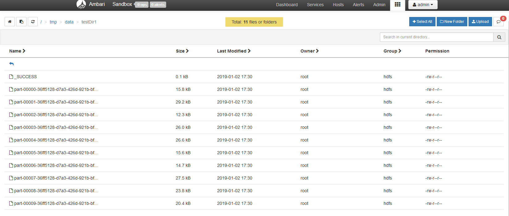
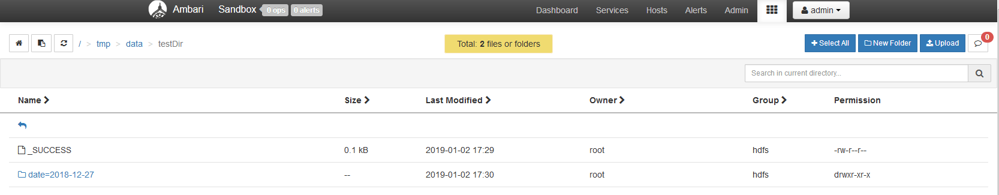
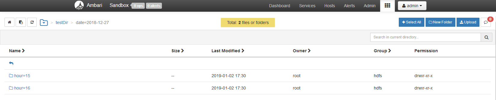
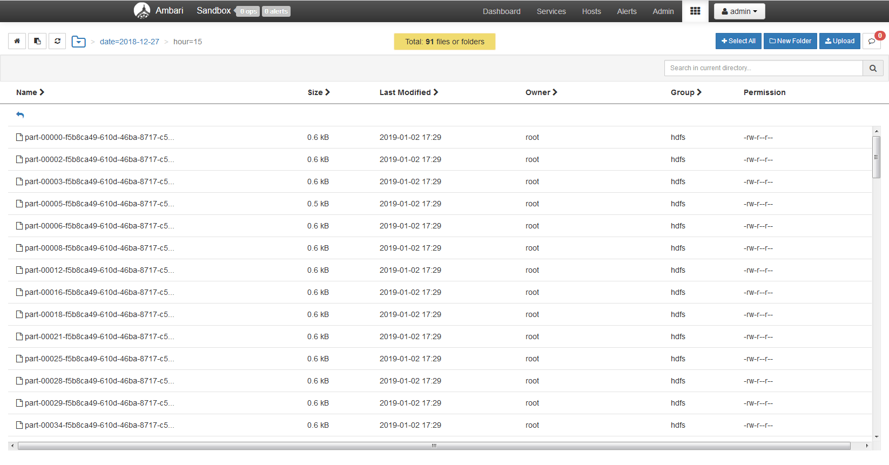
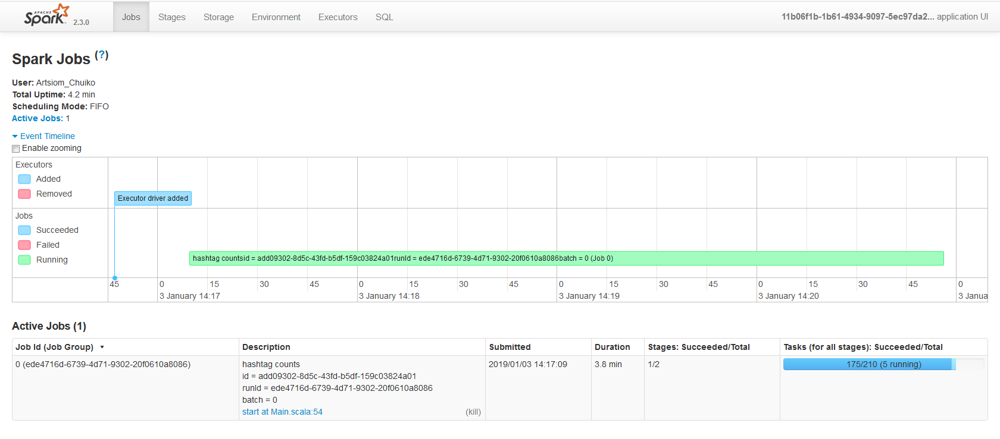
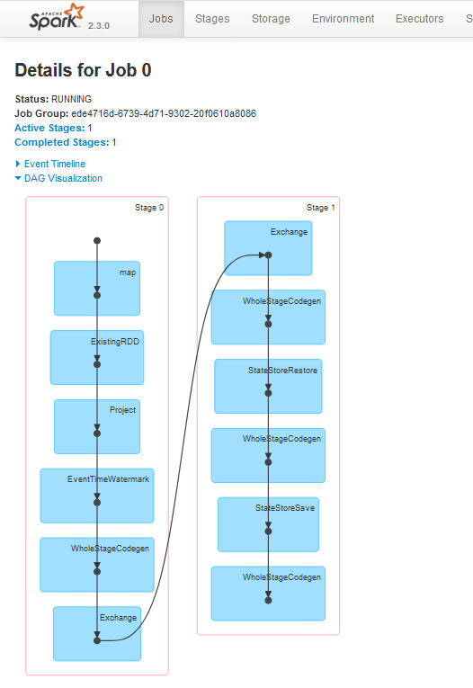

# kafka-tweets

Run Zookeeper and Kafka using the docker image:
```bash
docker run --rm -p 2181:2181 -p 9092:9092 -p9999:9999 \
    --env ADVERTISED_HOST=192.168.99.100 \
    --env ADVERTISED_PORT=9092 \
    --env TOPICS=TestTopic \
    spotify/kafka
```
Or use HDP's Kafka (broker address is 0.0.0.0:6667 by default).

Then create Kafka topic:
```bash
kafka-topics.sh --create --zookeeper localhost:2181 --replication-factor 1 --partitions 10 --topic Tweets
```

Go to http://apps.twitter.com/, login with your twitter account and register your application to get a consumer key and a consumer secret.

Add your consumer and access token as either environment variables or as part of your configuration. The twitter client will look for the following environment variables:
```bash
export TWITTER_CONSUMER_TOKEN_KEY='consumer-key'
export TWITTER_CONSUMER_TOKEN_SECRET='consumer-secret'
export TWITTER_ACCESS_TOKEN_KEY='access-key'
export TWITTER_ACCESS_TOKEN_SECRET='access-secret'
```

You can also add them to your configuration file, usually called application.conf:
```bson
twitter {
  consumer {
    key = "consumer-key"
    secret = "consumer-secret"
  }
  access {
    key = "access-key"
    secret = "access-secret"
  }
}
```

Build the jar: ```sbt assembly```

Run Tweets Producer (Kafka's key is a `username:hastag` pair and value is a Tweet in json format):
```bash
java -jar \
    -Dakka.kafka.producer.kafka-clients.bootstrap.servers=192.168.99.100:9092 \
    -Dtweets.topic=Tweets \
    -Dakka.kafka.producer.parallelism=10 \
    -Dgenerator.number-of-events=10000 \
    -Dtwitter.consumer.key=${TWITTER_CONSUMER_KEY} \
    -Dtwitter.consumer.secret=${TWITTER_CONSUMER_SECRET} \
    -Dtwitter.access.key=${TWITTER_ACCESS_KEY} \
    -Dtwitter.access.secret=${TWITTER_ACCESS_KEY} \
    -Dscala.time \
    kafka-tweets-0.1.jar
```
All of the params above can be configured by changing application.conf or setting in different file:
```bash
java -jar \
    -Dconfig.resource=/path/to/your/configuration.conf \
    kafka-tweets-0.1.jar
```

# Spark Job

To run the spark job on HDP use this (the job produces hashtags and their counts partitioned by date and hour):
```bash
spark-submit \
    --class by.artsiom.bigdata201.job.Main \
    --master yarn-client
    job.jar
```

Or with a custom configuration file:
```bash
spark-submit \
    --class by.artsiom.bigdata201.job.Main \
    --conf 'spark.driver.extraJavaOptions=-Dconfig.resource=/path/to/application.conf' \
    --master yarn-client
    job.jar
```

<details><summary>Local logs</summary>
<p>

```shell
Using Spark's default log4j profile: org/apache/spark/log4j-defaults.properties
19/01/02 15:31:33 INFO SparkContext: Running Spark version 2.3.0
19/01/02 15:31:33 WARN NativeCodeLoader: Unable to load native-hadoop library for your platform... using builtin-java classes where applicable
19/01/02 15:31:33 INFO SparkContext: Submitted application: 2aec043e-8081-4647-985e-6ac8dbc904d7
19/01/02 15:31:33 INFO SecurityManager: Changing view acls to: Artsiom_Chuiko
19/01/02 15:31:33 INFO SecurityManager: Changing modify acls to: Artsiom_Chuiko
19/01/02 15:31:33 INFO SecurityManager: Changing view acls groups to:
19/01/02 15:31:33 INFO SecurityManager: Changing modify acls groups to:
19/01/02 15:31:33 INFO SecurityManager: SecurityManager: authentication disabled; ui acls disabled; users  with view permissions: Set(Artsiom_Chuiko); groups with view permissions: Set(); users  with modify permissions: Set(Artsiom_Chuiko); groups with modify permissions: Set()
19/01/02 15:31:34 INFO Utils: Successfully started service 'sparkDriver' on port 58897.
19/01/02 15:31:34 INFO SparkEnv: Registering MapOutputTracker
19/01/02 15:31:34 INFO SparkEnv: Registering BlockManagerMaster
19/01/02 15:31:34 INFO BlockManagerMasterEndpoint: Using org.apache.spark.storage.DefaultTopologyMapper for getting topology information
19/01/02 15:31:34 INFO BlockManagerMasterEndpoint: BlockManagerMasterEndpoint up
19/01/02 15:31:34 INFO DiskBlockManager: Created local directory at C:\Temp\blockmgr-94fbc450-7ad4-42a6-8f36-f2eb6ff11be2
19/01/02 15:31:34 INFO MemoryStore: MemoryStore started with capacity 1992.9 MB
19/01/02 15:31:34 INFO SparkEnv: Registering OutputCommitCoordinator
19/01/02 15:31:34 INFO Utils: Successfully started service 'SparkUI' on port 4040.
19/01/02 15:31:34 INFO SparkUI: Bound SparkUI to 0.0.0.0, and started at http://localhost:4040
19/01/02 15:31:34 INFO Executor: Starting executor ID driver on host localhost
19/01/02 15:31:34 INFO Utils: Successfully started service 'org.apache.spark.network.netty.NettyBlockTransferService' on port 58918.
19/01/02 15:31:34 INFO NettyBlockTransferService: Server created on localhost:58918
19/01/02 15:31:34 INFO BlockManager: Using org.apache.spark.storage.RandomBlockReplicationPolicy for block replication policy
19/01/02 15:31:34 INFO BlockManagerMaster: Registering BlockManager BlockManagerId(driver, localhost, 58918, None)
19/01/02 15:31:34 INFO BlockManagerMasterEndpoint: Registering block manager localhost:58918 with 1992.9 MB RAM, BlockManagerId(driver, localhost, 58918, None)
19/01/02 15:31:34 INFO BlockManagerMaster: Registered BlockManager BlockManagerId(driver, localhost, 58918, None)
19/01/02 15:31:34 INFO BlockManager: Initialized BlockManager: BlockManagerId(driver, localhost, 58918, None)
19/01/02 15:31:34 INFO SharedState: Setting hive.metastore.warehouse.dir ('null') to the value of spark.sql.warehouse.dir ('file:/C://kafka-tweets/spark-warehouse/').
19/01/02 15:31:34 INFO SharedState: Warehouse path is 'file:/C://kafka-tweets/spark-warehouse/'.
19/01/02 15:31:35 INFO StateStoreCoordinatorRef: Registered StateStoreCoordinator endpoint
19/01/02 15:31:36 INFO ConsumerConfig: ConsumerConfig values:
	metric.reporters = []
	metadata.max.age.ms = 300000
	partition.assignment.strategy = [org.apache.kafka.clients.consumer.RangeAssignor]
	reconnect.backoff.ms = 50
	sasl.kerberos.ticket.renew.window.factor = 0.8
	max.partition.fetch.bytes = 1048576
	bootstrap.servers = [192.168.99.100:9092]
	ssl.keystore.type = JKS
	enable.auto.commit = false
	sasl.mechanism = GSSAPI
	interceptor.classes = null
	exclude.internal.topics = true
	ssl.truststore.password = null
	client.id =
	ssl.endpoint.identification.algorithm = null
	max.poll.records = 1
	check.crcs = true
	request.timeout.ms = 40000
	heartbeat.interval.ms = 3000
	auto.commit.interval.ms = 5000
	receive.buffer.bytes = 65536
	ssl.truststore.type = JKS
	ssl.truststore.location = null
	ssl.keystore.password = null
	fetch.min.bytes = 1
	send.buffer.bytes = 131072
	value.deserializer = class org.apache.kafka.common.serialization.ByteArrayDeserializer
	group.id = spark-kafka-relation-44e2ec42-9211-40fe-976b-0bd444689e34-driver-0
	retry.backoff.ms = 100
	sasl.kerberos.kinit.cmd = /usr/bin/kinit
	sasl.kerberos.service.name = null
	sasl.kerberos.ticket.renew.jitter = 0.05
	ssl.trustmanager.algorithm = PKIX
	ssl.key.password = null
	fetch.max.wait.ms = 500
	sasl.kerberos.min.time.before.relogin = 60000
	connections.max.idle.ms = 540000
	session.timeout.ms = 30000
	metrics.num.samples = 2
	key.deserializer = class org.apache.kafka.common.serialization.ByteArrayDeserializer
	ssl.protocol = TLS
	ssl.provider = null
	ssl.enabled.protocols = [TLSv1.2, TLSv1.1, TLSv1]
	ssl.keystore.location = null
	ssl.cipher.suites = null
	security.protocol = PLAINTEXT
	ssl.keymanager.algorithm = SunX509
	metrics.sample.window.ms = 30000
	auto.offset.reset = earliest

19/01/02 15:31:36 INFO ConsumerConfig: ConsumerConfig values:
	metric.reporters = []
	metadata.max.age.ms = 300000
	partition.assignment.strategy = [org.apache.kafka.clients.consumer.RangeAssignor]
	reconnect.backoff.ms = 50
	sasl.kerberos.ticket.renew.window.factor = 0.8
	max.partition.fetch.bytes = 1048576
	bootstrap.servers = [192.168.99.100:9092]
	ssl.keystore.type = JKS
	enable.auto.commit = false
	sasl.mechanism = GSSAPI
	interceptor.classes = null
	exclude.internal.topics = true
	ssl.truststore.password = null
	client.id = consumer-1
	ssl.endpoint.identification.algorithm = null
	max.poll.records = 1
	check.crcs = true
	request.timeout.ms = 40000
	heartbeat.interval.ms = 3000
	auto.commit.interval.ms = 5000
	receive.buffer.bytes = 65536
	ssl.truststore.type = JKS
	ssl.truststore.location = null
	ssl.keystore.password = null
	fetch.min.bytes = 1
	send.buffer.bytes = 131072
	value.deserializer = class org.apache.kafka.common.serialization.ByteArrayDeserializer
	group.id = spark-kafka-relation-44e2ec42-9211-40fe-976b-0bd444689e34-driver-0
	retry.backoff.ms = 100
	sasl.kerberos.kinit.cmd = /usr/bin/kinit
	sasl.kerberos.service.name = null
	sasl.kerberos.ticket.renew.jitter = 0.05
	ssl.trustmanager.algorithm = PKIX
	ssl.key.password = null
	fetch.max.wait.ms = 500
	sasl.kerberos.min.time.before.relogin = 60000
	connections.max.idle.ms = 540000
	session.timeout.ms = 30000
	metrics.num.samples = 2
	key.deserializer = class org.apache.kafka.common.serialization.ByteArrayDeserializer
	ssl.protocol = TLS
	ssl.provider = null
	ssl.enabled.protocols = [TLSv1.2, TLSv1.1, TLSv1]
	ssl.keystore.location = null
	ssl.cipher.suites = null
	security.protocol = PLAINTEXT
	ssl.keymanager.algorithm = SunX509
	metrics.sample.window.ms = 30000
	auto.offset.reset = earliest

19/01/02 15:31:36 INFO AppInfoParser: Kafka version : 0.10.0.1
19/01/02 15:31:36 INFO AppInfoParser: Kafka commitId : a7a17cdec9eaa6c5
19/01/02 15:31:36 INFO AbstractCoordinator: Discovered coordinator 192.168.99.100:9092 (id: 2147483647 rack: null) for group spark-kafka-relation-44e2ec42-9211-40fe-976b-0bd444689e34-driver-0.
19/01/02 15:31:36 INFO ConsumerCoordinator: Revoking previously assigned partitions [] for group spark-kafka-relation-44e2ec42-9211-40fe-976b-0bd444689e34-driver-0
19/01/02 15:31:36 INFO AbstractCoordinator: (Re-)joining group spark-kafka-relation-44e2ec42-9211-40fe-976b-0bd444689e34-driver-0
19/01/02 15:31:37 INFO AbstractCoordinator: Successfully joined group spark-kafka-relation-44e2ec42-9211-40fe-976b-0bd444689e34-driver-0 with generation 1
19/01/02 15:31:37 INFO ConsumerCoordinator: Setting newly assigned partitions [Tweets-0, Tweets-1, Tweets-2, Tweets-3, Tweets-8, Tweets-9, Tweets-4, Tweets-5, Tweets-6, Tweets-7] for group spark-kafka-relation-44e2ec42-9211-40fe-976b-0bd444689e34-driver-0
19/01/02 15:31:37 INFO KafkaRelation: GetBatch generating RDD of offset range: KafkaSourceRDDOffsetRange(Tweets-0,-2,-1,None), KafkaSourceRDDOffsetRange(Tweets-1,-2,-1,None), KafkaSourceRDDOffsetRange(Tweets-2,-2,-1,None), KafkaSourceRDDOffsetRange(Tweets-3,-2,-1,None), KafkaSourceRDDOffsetRange(Tweets-4,-2,-1,None), KafkaSourceRDDOffsetRange(Tweets-5,-2,-1,None), KafkaSourceRDDOffsetRange(Tweets-6,-2,-1,None), KafkaSourceRDDOffsetRange(Tweets-7,-2,-1,None), KafkaSourceRDDOffsetRange(Tweets-8,-2,-1,None), KafkaSourceRDDOffsetRange(Tweets-9,-2,-1,None)
19/01/02 15:31:37 INFO ParquetFileFormat: Using default output committer for Parquet: org.apache.parquet.hadoop.ParquetOutputCommitter
19/01/02 15:31:37 INFO SQLHadoopMapReduceCommitProtocol: Using user defined output committer class org.apache.parquet.hadoop.ParquetOutputCommitter
19/01/02 15:31:37 INFO SQLHadoopMapReduceCommitProtocol: Using output committer class org.apache.parquet.hadoop.ParquetOutputCommitter
19/01/02 15:31:38 INFO CodeGenerator: Code generated in 268.075453 ms
19/01/02 15:31:38 INFO SparkContext: Starting job: parquet at Main.scala:35
19/01/02 15:31:38 INFO DAGScheduler: Got job 0 (parquet at Main.scala:35) with 10 output partitions
19/01/02 15:31:38 INFO DAGScheduler: Final stage: ResultStage 0 (parquet at Main.scala:35)
19/01/02 15:31:38 INFO DAGScheduler: Parents of final stage: List()
19/01/02 15:31:38 INFO DAGScheduler: Missing parents: List()
19/01/02 15:31:38 INFO DAGScheduler: Submitting ResultStage 0 (MapPartitionsRDD[6] at parquet at Main.scala:35), which has no missing parents
19/01/02 15:31:38 INFO MemoryStore: Block broadcast_0 stored as values in memory (estimated size 138.9 KB, free 1992.8 MB)
19/01/02 15:31:38 INFO MemoryStore: Block broadcast_0_piece0 stored as bytes in memory (estimated size 50.3 KB, free 1992.7 MB)
19/01/02 15:31:38 INFO BlockManagerInfo: Added broadcast_0_piece0 in memory on localhost:58918 (size: 50.3 KB, free: 1992.9 MB)
19/01/02 15:31:38 INFO SparkContext: Created broadcast 0 from broadcast at DAGScheduler.scala:1039
19/01/02 15:31:38 INFO DAGScheduler: Submitting 10 missing tasks from ResultStage 0 (MapPartitionsRDD[6] at parquet at Main.scala:35) (first 15 tasks are for partitions Vector(0, 1, 2, 3, 4, 5, 6, 7, 8, 9))
19/01/02 15:31:38 INFO TaskSchedulerImpl: Adding task set 0.0 with 10 tasks
19/01/02 15:31:38 INFO TaskSetManager: Starting task 0.0 in stage 0.0 (TID 0, localhost, executor driver, partition 0, PROCESS_LOCAL, 8029 bytes)
19/01/02 15:31:38 INFO TaskSetManager: Starting task 1.0 in stage 0.0 (TID 1, localhost, executor driver, partition 1, PROCESS_LOCAL, 8029 bytes)
19/01/02 15:31:38 INFO TaskSetManager: Starting task 2.0 in stage 0.0 (TID 2, localhost, executor driver, partition 2, PROCESS_LOCAL, 8029 bytes)
19/01/02 15:31:38 INFO TaskSetManager: Starting task 3.0 in stage 0.0 (TID 3, localhost, executor driver, partition 3, PROCESS_LOCAL, 8029 bytes)
19/01/02 15:31:38 INFO Executor: Running task 2.0 in stage 0.0 (TID 2)
19/01/02 15:31:38 INFO Executor: Running task 0.0 in stage 0.0 (TID 0)
19/01/02 15:31:38 INFO Executor: Running task 1.0 in stage 0.0 (TID 1)
19/01/02 15:31:38 INFO Executor: Running task 3.0 in stage 0.0 (TID 3)
19/01/02 15:31:38 INFO ConsumerConfig: ConsumerConfig values:
	metric.reporters = []
	metadata.max.age.ms = 300000
	partition.assignment.strategy = [org.apache.kafka.clients.consumer.RangeAssignor]
	reconnect.backoff.ms = 50
	sasl.kerberos.ticket.renew.window.factor = 0.8
	max.partition.fetch.bytes = 1048576
	bootstrap.servers = [192.168.99.100:9092]
	ssl.keystore.type = JKS
	enable.auto.commit = false
	sasl.mechanism = GSSAPI
	interceptor.classes = null
	exclude.internal.topics = true
	ssl.truststore.password = null
	client.id =
	ssl.endpoint.identification.algorithm = null
	max.poll.records = 2147483647
	check.crcs = true
	request.timeout.ms = 40000
	heartbeat.interval.ms = 3000
	auto.commit.interval.ms = 5000
	receive.buffer.bytes = 65536
	ssl.truststore.type = JKS
	ssl.truststore.location = null
	ssl.keystore.password = null
	fetch.min.bytes = 1
	send.buffer.bytes = 131072
	value.deserializer = class org.apache.kafka.common.serialization.ByteArrayDeserializer
	group.id = spark-kafka-relation-44e2ec42-9211-40fe-976b-0bd444689e34-executor
	retry.backoff.ms = 100
	sasl.kerberos.kinit.cmd = /usr/bin/kinit
	sasl.kerberos.service.name = null
	sasl.kerberos.ticket.renew.jitter = 0.05
	ssl.trustmanager.algorithm = PKIX
	ssl.key.password = null
	fetch.max.wait.ms = 500
	sasl.kerberos.min.time.before.relogin = 60000
	connections.max.idle.ms = 540000
	session.timeout.ms = 30000
	metrics.num.samples = 2
	key.deserializer = class org.apache.kafka.common.serialization.ByteArrayDeserializer
	ssl.protocol = TLS
	ssl.provider = null
	ssl.enabled.protocols = [TLSv1.2, TLSv1.1, TLSv1]
	ssl.keystore.location = null
	ssl.cipher.suites = null
	security.protocol = PLAINTEXT
	ssl.keymanager.algorithm = SunX509
	metrics.sample.window.ms = 30000
	auto.offset.reset = none

19/01/02 15:31:38 INFO ConsumerConfig: ConsumerConfig values:
	metric.reporters = []
	metadata.max.age.ms = 300000
	partition.assignment.strategy = [org.apache.kafka.clients.consumer.RangeAssignor]
	reconnect.backoff.ms = 50
	sasl.kerberos.ticket.renew.window.factor = 0.8
	max.partition.fetch.bytes = 1048576
	bootstrap.servers = [192.168.99.100:9092]
	ssl.keystore.type = JKS
	enable.auto.commit = false
	sasl.mechanism = GSSAPI
	interceptor.classes = null
	exclude.internal.topics = true
	ssl.truststore.password = null
	client.id = consumer-2
	ssl.endpoint.identification.algorithm = null
	max.poll.records = 2147483647
	check.crcs = true
	request.timeout.ms = 40000
	heartbeat.interval.ms = 3000
	auto.commit.interval.ms = 5000
	receive.buffer.bytes = 65536
	ssl.truststore.type = JKS
	ssl.truststore.location = null
	ssl.keystore.password = null
	fetch.min.bytes = 1
	send.buffer.bytes = 131072
	value.deserializer = class org.apache.kafka.common.serialization.ByteArrayDeserializer
	group.id = spark-kafka-relation-44e2ec42-9211-40fe-976b-0bd444689e34-executor
	retry.backoff.ms = 100
	sasl.kerberos.kinit.cmd = /usr/bin/kinit
	sasl.kerberos.service.name = null
	sasl.kerberos.ticket.renew.jitter = 0.05
	ssl.trustmanager.algorithm = PKIX
	ssl.key.password = null
	fetch.max.wait.ms = 500
	sasl.kerberos.min.time.before.relogin = 60000
	connections.max.idle.ms = 540000
	session.timeout.ms = 30000
	metrics.num.samples = 2
	key.deserializer = class org.apache.kafka.common.serialization.ByteArrayDeserializer
	ssl.protocol = TLS
	ssl.provider = null
	ssl.enabled.protocols = [TLSv1.2, TLSv1.1, TLSv1]
	ssl.keystore.location = null
	ssl.cipher.suites = null
	security.protocol = PLAINTEXT
	ssl.keymanager.algorithm = SunX509
	metrics.sample.window.ms = 30000
	auto.offset.reset = none

19/01/02 15:31:38 INFO AppInfoParser: Kafka version : 0.10.0.1
19/01/02 15:31:38 INFO AppInfoParser: Kafka commitId : a7a17cdec9eaa6c5
19/01/02 15:31:38 INFO ConsumerConfig: ConsumerConfig values:
	metric.reporters = []
	metadata.max.age.ms = 300000
	partition.assignment.strategy = [org.apache.kafka.clients.consumer.RangeAssignor]
	reconnect.backoff.ms = 50
	sasl.kerberos.ticket.renew.window.factor = 0.8
	max.partition.fetch.bytes = 1048576
	bootstrap.servers = [192.168.99.100:9092]
	ssl.keystore.type = JKS
	enable.auto.commit = false
	sasl.mechanism = GSSAPI
	interceptor.classes = null
	exclude.internal.topics = true
	ssl.truststore.password = null
	client.id =
	ssl.endpoint.identification.algorithm = null
	max.poll.records = 2147483647
	check.crcs = true
	request.timeout.ms = 40000
	heartbeat.interval.ms = 3000
	auto.commit.interval.ms = 5000
	receive.buffer.bytes = 65536
	ssl.truststore.type = JKS
	ssl.truststore.location = null
	ssl.keystore.password = null
	fetch.min.bytes = 1
	send.buffer.bytes = 131072
	value.deserializer = class org.apache.kafka.common.serialization.ByteArrayDeserializer
	group.id = spark-kafka-relation-44e2ec42-9211-40fe-976b-0bd444689e34-executor
	retry.backoff.ms = 100
	sasl.kerberos.kinit.cmd = /usr/bin/kinit
	sasl.kerberos.service.name = null
	sasl.kerberos.ticket.renew.jitter = 0.05
	ssl.trustmanager.algorithm = PKIX
	ssl.key.password = null
	fetch.max.wait.ms = 500
	sasl.kerberos.min.time.before.relogin = 60000
	connections.max.idle.ms = 540000
	session.timeout.ms = 30000
	metrics.num.samples = 2
	key.deserializer = class org.apache.kafka.common.serialization.ByteArrayDeserializer
	ssl.protocol = TLS
	ssl.provider = null
	ssl.enabled.protocols = [TLSv1.2, TLSv1.1, TLSv1]
	ssl.keystore.location = null
	ssl.cipher.suites = null
	security.protocol = PLAINTEXT
	ssl.keymanager.algorithm = SunX509
	metrics.sample.window.ms = 30000
	auto.offset.reset = none

19/01/02 15:31:38 INFO ConsumerConfig: ConsumerConfig values:
	metric.reporters = []
	metadata.max.age.ms = 300000
	partition.assignment.strategy = [org.apache.kafka.clients.consumer.RangeAssignor]
	reconnect.backoff.ms = 50
	sasl.kerberos.ticket.renew.window.factor = 0.8
	max.partition.fetch.bytes = 1048576
	bootstrap.servers = [192.168.99.100:9092]
	ssl.keystore.type = JKS
	enable.auto.commit = false
	sasl.mechanism = GSSAPI
	interceptor.classes = null
	exclude.internal.topics = true
	ssl.truststore.password = null
	client.id =
	ssl.endpoint.identification.algorithm = null
	max.poll.records = 2147483647
	check.crcs = true
	request.timeout.ms = 40000
	heartbeat.interval.ms = 3000
	auto.commit.interval.ms = 5000
	receive.buffer.bytes = 65536
	ssl.truststore.type = JKS
	ssl.truststore.location = null
	ssl.keystore.password = null
	fetch.min.bytes = 1
	send.buffer.bytes = 131072
	value.deserializer = class org.apache.kafka.common.serialization.ByteArrayDeserializer
	group.id = spark-kafka-relation-44e2ec42-9211-40fe-976b-0bd444689e34-executor
	retry.backoff.ms = 100
	sasl.kerberos.kinit.cmd = /usr/bin/kinit
	sasl.kerberos.service.name = null
	sasl.kerberos.ticket.renew.jitter = 0.05
	ssl.trustmanager.algorithm = PKIX
	ssl.key.password = null
	fetch.max.wait.ms = 500
	sasl.kerberos.min.time.before.relogin = 60000
	connections.max.idle.ms = 540000
	session.timeout.ms = 30000
	metrics.num.samples = 2
	key.deserializer = class org.apache.kafka.common.serialization.ByteArrayDeserializer
	ssl.protocol = TLS
	ssl.provider = null
	ssl.enabled.protocols = [TLSv1.2, TLSv1.1, TLSv1]
	ssl.keystore.location = null
	ssl.cipher.suites = null
	security.protocol = PLAINTEXT
	ssl.keymanager.algorithm = SunX509
	metrics.sample.window.ms = 30000
	auto.offset.reset = none

19/01/02 15:31:38 INFO ConsumerConfig: ConsumerConfig values:
	metric.reporters = []
	metadata.max.age.ms = 300000
	partition.assignment.strategy = [org.apache.kafka.clients.consumer.RangeAssignor]
	reconnect.backoff.ms = 50
	sasl.kerberos.ticket.renew.window.factor = 0.8
	max.partition.fetch.bytes = 1048576
	bootstrap.servers = [192.168.99.100:9092]
	ssl.keystore.type = JKS
	enable.auto.commit = false
	sasl.mechanism = GSSAPI
	interceptor.classes = null
	exclude.internal.topics = true
	ssl.truststore.password = null
	client.id =
	ssl.endpoint.identification.algorithm = null
	max.poll.records = 2147483647
	check.crcs = true
	request.timeout.ms = 40000
	heartbeat.interval.ms = 3000
	auto.commit.interval.ms = 5000
	receive.buffer.bytes = 65536
	ssl.truststore.type = JKS
	ssl.truststore.location = null
	ssl.keystore.password = null
	fetch.min.bytes = 1
	send.buffer.bytes = 131072
	value.deserializer = class org.apache.kafka.common.serialization.ByteArrayDeserializer
	group.id = spark-kafka-relation-44e2ec42-9211-40fe-976b-0bd444689e34-executor
	retry.backoff.ms = 100
	sasl.kerberos.kinit.cmd = /usr/bin/kinit
	sasl.kerberos.service.name = null
	sasl.kerberos.ticket.renew.jitter = 0.05
	ssl.trustmanager.algorithm = PKIX
	ssl.key.password = null
	fetch.max.wait.ms = 500
	sasl.kerberos.min.time.before.relogin = 60000
	connections.max.idle.ms = 540000
	session.timeout.ms = 30000
	metrics.num.samples = 2
	key.deserializer = class org.apache.kafka.common.serialization.ByteArrayDeserializer
	ssl.protocol = TLS
	ssl.provider = null
	ssl.enabled.protocols = [TLSv1.2, TLSv1.1, TLSv1]
	ssl.keystore.location = null
	ssl.cipher.suites = null
	security.protocol = PLAINTEXT
	ssl.keymanager.algorithm = SunX509
	metrics.sample.window.ms = 30000
	auto.offset.reset = none

19/01/02 15:31:38 INFO ConsumerConfig: ConsumerConfig values:
	metric.reporters = []
	metadata.max.age.ms = 300000
	partition.assignment.strategy = [org.apache.kafka.clients.consumer.RangeAssignor]
	reconnect.backoff.ms = 50
	sasl.kerberos.ticket.renew.window.factor = 0.8
	max.partition.fetch.bytes = 1048576
	bootstrap.servers = [192.168.99.100:9092]
	ssl.keystore.type = JKS
	enable.auto.commit = false
	sasl.mechanism = GSSAPI
	interceptor.classes = null
	exclude.internal.topics = true
	ssl.truststore.password = null
	client.id = consumer-4
	ssl.endpoint.identification.algorithm = null
	max.poll.records = 2147483647
	check.crcs = true
	request.timeout.ms = 40000
	heartbeat.interval.ms = 3000
	auto.commit.interval.ms = 5000
	receive.buffer.bytes = 65536
	ssl.truststore.type = JKS
	ssl.truststore.location = null
	ssl.keystore.password = null
	fetch.min.bytes = 1
	send.buffer.bytes = 131072
	value.deserializer = class org.apache.kafka.common.serialization.ByteArrayDeserializer
	group.id = spark-kafka-relation-44e2ec42-9211-40fe-976b-0bd444689e34-executor
	retry.backoff.ms = 100
	sasl.kerberos.kinit.cmd = /usr/bin/kinit
	sasl.kerberos.service.name = null
	sasl.kerberos.ticket.renew.jitter = 0.05
	ssl.trustmanager.algorithm = PKIX
	ssl.key.password = null
	fetch.max.wait.ms = 500
	sasl.kerberos.min.time.before.relogin = 60000
	connections.max.idle.ms = 540000
	session.timeout.ms = 30000
	metrics.num.samples = 2
	key.deserializer = class org.apache.kafka.common.serialization.ByteArrayDeserializer
	ssl.protocol = TLS
	ssl.provider = null
	ssl.enabled.protocols = [TLSv1.2, TLSv1.1, TLSv1]
	ssl.keystore.location = null
	ssl.cipher.suites = null
	security.protocol = PLAINTEXT
	ssl.keymanager.algorithm = SunX509
	metrics.sample.window.ms = 30000
	auto.offset.reset = none

19/01/02 15:31:38 INFO ConsumerConfig: ConsumerConfig values:
	metric.reporters = []
	metadata.max.age.ms = 300000
	partition.assignment.strategy = [org.apache.kafka.clients.consumer.RangeAssignor]
	reconnect.backoff.ms = 50
	sasl.kerberos.ticket.renew.window.factor = 0.8
	max.partition.fetch.bytes = 1048576
	bootstrap.servers = [192.168.99.100:9092]
	ssl.keystore.type = JKS
	enable.auto.commit = false
	sasl.mechanism = GSSAPI
	interceptor.classes = null
	exclude.internal.topics = true
	ssl.truststore.password = null
	client.id = consumer-3
	ssl.endpoint.identification.algorithm = null
	max.poll.records = 2147483647
	check.crcs = true
	request.timeout.ms = 40000
	heartbeat.interval.ms = 3000
	auto.commit.interval.ms = 5000
	receive.buffer.bytes = 65536
	ssl.truststore.type = JKS
	ssl.truststore.location = null
	ssl.keystore.password = null
	fetch.min.bytes = 1
	send.buffer.bytes = 131072
	value.deserializer = class org.apache.kafka.common.serialization.ByteArrayDeserializer
	group.id = spark-kafka-relation-44e2ec42-9211-40fe-976b-0bd444689e34-executor
	retry.backoff.ms = 100
	sasl.kerberos.kinit.cmd = /usr/bin/kinit
	sasl.kerberos.service.name = null
	sasl.kerberos.ticket.renew.jitter = 0.05
	ssl.trustmanager.algorithm = PKIX
	ssl.key.password = null
	fetch.max.wait.ms = 500
	sasl.kerberos.min.time.before.relogin = 60000
	connections.max.idle.ms = 540000
	session.timeout.ms = 30000
	metrics.num.samples = 2
	key.deserializer = class org.apache.kafka.common.serialization.ByteArrayDeserializer
	ssl.protocol = TLS
	ssl.provider = null
	ssl.enabled.protocols = [TLSv1.2, TLSv1.1, TLSv1]
	ssl.keystore.location = null
	ssl.cipher.suites = null
	security.protocol = PLAINTEXT
	ssl.keymanager.algorithm = SunX509
	metrics.sample.window.ms = 30000
	auto.offset.reset = none

19/01/02 15:31:38 INFO AppInfoParser: Kafka version : 0.10.0.1
19/01/02 15:31:38 INFO AppInfoParser: Kafka commitId : a7a17cdec9eaa6c5
19/01/02 15:31:38 INFO AppInfoParser: Kafka version : 0.10.0.1
19/01/02 15:31:38 INFO AppInfoParser: Kafka commitId : a7a17cdec9eaa6c5
19/01/02 15:31:38 INFO ConsumerConfig: ConsumerConfig values:
	metric.reporters = []
	metadata.max.age.ms = 300000
	partition.assignment.strategy = [org.apache.kafka.clients.consumer.RangeAssignor]
	reconnect.backoff.ms = 50
	sasl.kerberos.ticket.renew.window.factor = 0.8
	max.partition.fetch.bytes = 1048576
	bootstrap.servers = [192.168.99.100:9092]
	ssl.keystore.type = JKS
	enable.auto.commit = false
	sasl.mechanism = GSSAPI
	interceptor.classes = null
	exclude.internal.topics = true
	ssl.truststore.password = null
	client.id = consumer-5
	ssl.endpoint.identification.algorithm = null
	max.poll.records = 2147483647
	check.crcs = true
	request.timeout.ms = 40000
	heartbeat.interval.ms = 3000
	auto.commit.interval.ms = 5000
	receive.buffer.bytes = 65536
	ssl.truststore.type = JKS
	ssl.truststore.location = null
	ssl.keystore.password = null
	fetch.min.bytes = 1
	send.buffer.bytes = 131072
	value.deserializer = class org.apache.kafka.common.serialization.ByteArrayDeserializer
	group.id = spark-kafka-relation-44e2ec42-9211-40fe-976b-0bd444689e34-executor
	retry.backoff.ms = 100
	sasl.kerberos.kinit.cmd = /usr/bin/kinit
	sasl.kerberos.service.name = null
	sasl.kerberos.ticket.renew.jitter = 0.05
	ssl.trustmanager.algorithm = PKIX
	ssl.key.password = null
	fetch.max.wait.ms = 500
	sasl.kerberos.min.time.before.relogin = 60000
	connections.max.idle.ms = 540000
	session.timeout.ms = 30000
	metrics.num.samples = 2
	key.deserializer = class org.apache.kafka.common.serialization.ByteArrayDeserializer
	ssl.protocol = TLS
	ssl.provider = null
	ssl.enabled.protocols = [TLSv1.2, TLSv1.1, TLSv1]
	ssl.keystore.location = null
	ssl.cipher.suites = null
	security.protocol = PLAINTEXT
	ssl.keymanager.algorithm = SunX509
	metrics.sample.window.ms = 30000
	auto.offset.reset = none

19/01/02 15:31:38 INFO AppInfoParser: Kafka version : 0.10.0.1
19/01/02 15:31:38 INFO AppInfoParser: Kafka commitId : a7a17cdec9eaa6c5
19/01/02 15:31:38 INFO AbstractCoordinator: Discovered coordinator 192.168.99.100:9092 (id: 2147483647 rack: null) for group spark-kafka-relation-44e2ec42-9211-40fe-976b-0bd444689e34-executor.
19/01/02 15:31:38 INFO AbstractCoordinator: Discovered coordinator 192.168.99.100:9092 (id: 2147483647 rack: null) for group spark-kafka-relation-44e2ec42-9211-40fe-976b-0bd444689e34-executor.
19/01/02 15:31:38 INFO AbstractCoordinator: Discovered coordinator 192.168.99.100:9092 (id: 2147483647 rack: null) for group spark-kafka-relation-44e2ec42-9211-40fe-976b-0bd444689e34-executor.
19/01/02 15:31:38 INFO AbstractCoordinator: Discovered coordinator 192.168.99.100:9092 (id: 2147483647 rack: null) for group spark-kafka-relation-44e2ec42-9211-40fe-976b-0bd444689e34-executor.
19/01/02 15:31:38 INFO CodeGenerator: Code generated in 29.768165 ms
19/01/02 15:31:38 INFO CodeGenerator: Code generated in 25.476441 ms
19/01/02 15:31:38 INFO SQLHadoopMapReduceCommitProtocol: Using user defined output committer class org.apache.parquet.hadoop.ParquetOutputCommitter
19/01/02 15:31:38 INFO SQLHadoopMapReduceCommitProtocol: Using output committer class org.apache.parquet.hadoop.ParquetOutputCommitter
19/01/02 15:31:38 INFO SQLHadoopMapReduceCommitProtocol: Using user defined output committer class org.apache.parquet.hadoop.ParquetOutputCommitter
19/01/02 15:31:38 INFO SQLHadoopMapReduceCommitProtocol: Using output committer class org.apache.parquet.hadoop.ParquetOutputCommitter
19/01/02 15:31:38 INFO SQLHadoopMapReduceCommitProtocol: Using user defined output committer class org.apache.parquet.hadoop.ParquetOutputCommitter
19/01/02 15:31:38 INFO SQLHadoopMapReduceCommitProtocol: Using output committer class org.apache.parquet.hadoop.ParquetOutputCommitter
19/01/02 15:31:38 INFO CodecConfig: Compression: SNAPPY
19/01/02 15:31:38 INFO SQLHadoopMapReduceCommitProtocol: Using user defined output committer class org.apache.parquet.hadoop.ParquetOutputCommitter
19/01/02 15:31:38 INFO SQLHadoopMapReduceCommitProtocol: Using output committer class org.apache.parquet.hadoop.ParquetOutputCommitter
19/01/02 15:31:38 INFO CodecConfig: Compression: SNAPPY
19/01/02 15:31:38 INFO ParquetOutputFormat: Parquet block size to 134217728
19/01/02 15:31:38 INFO ParquetOutputFormat: Parquet page size to 1048576
19/01/02 15:31:38 INFO ParquetOutputFormat: Parquet dictionary page size to 1048576
19/01/02 15:31:38 INFO ParquetOutputFormat: Dictionary is on
19/01/02 15:31:38 INFO ParquetOutputFormat: Validation is off
19/01/02 15:31:38 INFO ParquetOutputFormat: Writer version is: PARQUET_1_0
19/01/02 15:31:38 INFO ParquetOutputFormat: Maximum row group padding size is 0 bytes
19/01/02 15:31:38 INFO ParquetOutputFormat: Page size checking is: estimated
19/01/02 15:31:38 INFO ParquetOutputFormat: Min row count for page size check is: 100
19/01/02 15:31:38 INFO ParquetOutputFormat: Max row count for page size check is: 10000
19/01/02 15:31:38 INFO CodecConfig: Compression: SNAPPY
19/01/02 15:31:38 INFO CodecConfig: Compression: SNAPPY
19/01/02 15:31:38 INFO CodecConfig: Compression: SNAPPY
19/01/02 15:31:38 INFO CodecConfig: Compression: SNAPPY
19/01/02 15:31:38 INFO ParquetOutputFormat: Parquet block size to 134217728
19/01/02 15:31:38 INFO ParquetOutputFormat: Parquet page size to 1048576
19/01/02 15:31:38 INFO ParquetOutputFormat: Parquet dictionary page size to 1048576
19/01/02 15:31:38 INFO ParquetOutputFormat: Dictionary is on
19/01/02 15:31:38 INFO ParquetOutputFormat: Validation is off
19/01/02 15:31:38 INFO ParquetOutputFormat: Writer version is: PARQUET_1_0
19/01/02 15:31:38 INFO ParquetOutputFormat: Maximum row group padding size is 0 bytes
19/01/02 15:31:38 INFO ParquetOutputFormat: Page size checking is: estimated
19/01/02 15:31:38 INFO ParquetOutputFormat: Min row count for page size check is: 100
19/01/02 15:31:38 INFO ParquetOutputFormat: Max row count for page size check is: 10000
19/01/02 15:31:38 INFO ParquetOutputFormat: Parquet block size to 134217728
19/01/02 15:31:38 INFO ParquetOutputFormat: Parquet page size to 1048576
19/01/02 15:31:38 INFO ParquetOutputFormat: Parquet dictionary page size to 1048576
19/01/02 15:31:38 INFO ParquetOutputFormat: Dictionary is on
19/01/02 15:31:38 INFO ParquetOutputFormat: Validation is off
19/01/02 15:31:38 INFO ParquetOutputFormat: Writer version is: PARQUET_1_0
19/01/02 15:31:38 INFO ParquetOutputFormat: Maximum row group padding size is 0 bytes
19/01/02 15:31:38 INFO ParquetOutputFormat: Page size checking is: estimated
19/01/02 15:31:38 INFO ParquetOutputFormat: Min row count for page size check is: 100
19/01/02 15:31:38 INFO ParquetOutputFormat: Max row count for page size check is: 10000
19/01/02 15:31:38 INFO ParquetWriteSupport: Initialized Parquet WriteSupport with Catalyst schema:
{
  "type" : "struct",
  "fields" : [ {
    "name" : "key",
    "type" : "binary",
    "nullable" : true,
    "metadata" : { }
  }, {
    "name" : "value",
    "type" : "binary",
    "nullable" : true,
    "metadata" : { }
  }, {
    "name" : "topic",
    "type" : "string",
    "nullable" : true,
    "metadata" : { }
  }, {
    "name" : "partition",
    "type" : "integer",
    "nullable" : true,
    "metadata" : { }
  }, {
    "name" : "offset",
    "type" : "long",
    "nullable" : true,
    "metadata" : { }
  }, {
    "name" : "timestamp",
    "type" : "timestamp",
    "nullable" : true,
    "metadata" : { }
  }, {
    "name" : "timestampType",
    "type" : "integer",
    "nullable" : true,
    "metadata" : { }
  } ]
}
and corresponding Parquet message type:
message spark_schema {
  optional binary key;
  optional binary value;
  optional binary topic (UTF8);
  optional int32 partition;
  optional int64 offset;
  optional int96 timestamp;
  optional int32 timestampType;
}


19/01/02 15:31:38 INFO ParquetWriteSupport: Initialized Parquet WriteSupport with Catalyst schema:
{
  "type" : "struct",
  "fields" : [ {
    "name" : "key",
    "type" : "binary",
    "nullable" : true,
    "metadata" : { }
  }, {
    "name" : "value",
    "type" : "binary",
    "nullable" : true,
    "metadata" : { }
  }, {
    "name" : "topic",
    "type" : "string",
    "nullable" : true,
    "metadata" : { }
  }, {
    "name" : "partition",
    "type" : "integer",
    "nullable" : true,
    "metadata" : { }
  }, {
    "name" : "offset",
    "type" : "long",
    "nullable" : true,
    "metadata" : { }
  }, {
    "name" : "timestamp",
    "type" : "timestamp",
    "nullable" : true,
    "metadata" : { }
  }, {
    "name" : "timestampType",
    "type" : "integer",
    "nullable" : true,
    "metadata" : { }
  } ]
}
and corresponding Parquet message type:
message spark_schema {
  optional binary key;
  optional binary value;
  optional binary topic (UTF8);
  optional int32 partition;
  optional int64 offset;
  optional int96 timestamp;
  optional int32 timestampType;
}


19/01/02 15:31:38 INFO ParquetWriteSupport: Initialized Parquet WriteSupport with Catalyst schema:
{
  "type" : "struct",
  "fields" : [ {
    "name" : "key",
    "type" : "binary",
    "nullable" : true,
    "metadata" : { }
  }, {
    "name" : "value",
    "type" : "binary",
    "nullable" : true,
    "metadata" : { }
  }, {
    "name" : "topic",
    "type" : "string",
    "nullable" : true,
    "metadata" : { }
  }, {
    "name" : "partition",
    "type" : "integer",
    "nullable" : true,
    "metadata" : { }
  }, {
    "name" : "offset",
    "type" : "long",
    "nullable" : true,
    "metadata" : { }
  }, {
    "name" : "timestamp",
    "type" : "timestamp",
    "nullable" : true,
    "metadata" : { }
  }, {
    "name" : "timestampType",
    "type" : "integer",
    "nullable" : true,
    "metadata" : { }
  } ]
}
and corresponding Parquet message type:
message spark_schema {
  optional binary key;
  optional binary value;
  optional binary topic (UTF8);
  optional int32 partition;
  optional int64 offset;
  optional int96 timestamp;
  optional int32 timestampType;
}


19/01/02 15:31:38 INFO CodecConfig: Compression: SNAPPY
19/01/02 15:31:38 INFO CodecConfig: Compression: SNAPPY
19/01/02 15:31:38 INFO ParquetOutputFormat: Parquet block size to 134217728
19/01/02 15:31:38 INFO ParquetOutputFormat: Parquet page size to 1048576
19/01/02 15:31:38 INFO ParquetOutputFormat: Parquet dictionary page size to 1048576
19/01/02 15:31:38 INFO ParquetOutputFormat: Dictionary is on
19/01/02 15:31:38 INFO ParquetOutputFormat: Validation is off
19/01/02 15:31:38 INFO ParquetOutputFormat: Writer version is: PARQUET_1_0
19/01/02 15:31:38 INFO ParquetOutputFormat: Maximum row group padding size is 0 bytes
19/01/02 15:31:38 INFO ParquetOutputFormat: Page size checking is: estimated
19/01/02 15:31:38 INFO ParquetOutputFormat: Min row count for page size check is: 100
19/01/02 15:31:38 INFO ParquetOutputFormat: Max row count for page size check is: 10000
19/01/02 15:31:38 INFO ParquetWriteSupport: Initialized Parquet WriteSupport with Catalyst schema:
{
  "type" : "struct",
  "fields" : [ {
    "name" : "key",
    "type" : "binary",
    "nullable" : true,
    "metadata" : { }
  }, {
    "name" : "value",
    "type" : "binary",
    "nullable" : true,
    "metadata" : { }
  }, {
    "name" : "topic",
    "type" : "string",
    "nullable" : true,
    "metadata" : { }
  }, {
    "name" : "partition",
    "type" : "integer",
    "nullable" : true,
    "metadata" : { }
  }, {
    "name" : "offset",
    "type" : "long",
    "nullable" : true,
    "metadata" : { }
  }, {
    "name" : "timestamp",
    "type" : "timestamp",
    "nullable" : true,
    "metadata" : { }
  }, {
    "name" : "timestampType",
    "type" : "integer",
    "nullable" : true,
    "metadata" : { }
  } ]
}
and corresponding Parquet message type:
message spark_schema {
  optional binary key;
  optional binary value;
  optional binary topic (UTF8);
  optional int32 partition;
  optional int64 offset;
  optional int96 timestamp;
  optional int32 timestampType;
}


19/01/02 15:31:41 INFO CodecPool: Got brand-new compressor [.snappy]
19/01/02 15:31:41 INFO InternalParquetRecordWriter: Flushing mem columnStore to file. allocated memory: 38273
19/01/02 15:31:41 INFO CodecPool: Got brand-new compressor [.snappy]
19/01/02 15:31:41 INFO InternalParquetRecordWriter: Flushing mem columnStore to file. allocated memory: 114167
19/01/02 15:31:41 INFO FileOutputCommitter: Saved output of task 'attempt_20190102153138_0000_m_000002_0' to file:/C://kafka-tweets/testDir1/_temporary/0/task_20190102153138_0000_m_000002
19/01/02 15:31:41 INFO SparkHadoopMapRedUtil: attempt_20190102153138_0000_m_000002_0: Committed
19/01/02 15:31:41 INFO FileOutputCommitter: Saved output of task 'attempt_20190102153138_0000_m_000001_0' to file:/C://kafka-tweets/testDir1/_temporary/0/task_20190102153138_0000_m_000001
19/01/02 15:31:41 INFO SparkHadoopMapRedUtil: attempt_20190102153138_0000_m_000001_0: Committed
19/01/02 15:31:41 INFO Executor: Finished task 1.0 in stage 0.0 (TID 1). 2152 bytes result sent to driver
19/01/02 15:31:41 INFO Executor: Finished task 2.0 in stage 0.0 (TID 2). 2195 bytes result sent to driver
19/01/02 15:31:41 INFO TaskSetManager: Starting task 4.0 in stage 0.0 (TID 4, localhost, executor driver, partition 4, PROCESS_LOCAL, 8029 bytes)
19/01/02 15:31:41 INFO Executor: Running task 4.0 in stage 0.0 (TID 4)
19/01/02 15:31:41 INFO TaskSetManager: Starting task 5.0 in stage 0.0 (TID 5, localhost, executor driver, partition 5, PROCESS_LOCAL, 8029 bytes)
19/01/02 15:31:41 INFO Executor: Running task 5.0 in stage 0.0 (TID 5)
19/01/02 15:31:41 INFO InternalParquetRecordWriter: Flushing mem columnStore to file. allocated memory: 97180
19/01/02 15:31:41 INFO FileOutputCommitter: Saved output of task 'attempt_20190102153138_0000_m_000003_0' to file:/C://kafka-tweets/testDir1/_temporary/0/task_20190102153138_0000_m_000003
19/01/02 15:31:41 INFO SparkHadoopMapRedUtil: attempt_20190102153138_0000_m_000003_0: Committed
19/01/02 15:31:41 INFO Executor: Finished task 3.0 in stage 0.0 (TID 3). 2109 bytes result sent to driver
19/01/02 15:31:41 INFO TaskSetManager: Finished task 2.0 in stage 0.0 (TID 2) in 3478 ms on localhost (executor driver) (1/10)
19/01/02 15:31:41 INFO ConsumerConfig: ConsumerConfig values:
	metric.reporters = []
	metadata.max.age.ms = 300000
	partition.assignment.strategy = [org.apache.kafka.clients.consumer.RangeAssignor]
	reconnect.backoff.ms = 50
	sasl.kerberos.ticket.renew.window.factor = 0.8
	max.partition.fetch.bytes = 1048576
	bootstrap.servers = [192.168.99.100:9092]
	ssl.keystore.type = JKS
	enable.auto.commit = false
	sasl.mechanism = GSSAPI
	interceptor.classes = null
	exclude.internal.topics = true
	ssl.truststore.password = null
	client.id =
	ssl.endpoint.identification.algorithm = null
	max.poll.records = 2147483647
	check.crcs = true
	request.timeout.ms = 40000
	heartbeat.interval.ms = 3000
	auto.commit.interval.ms = 5000
	receive.buffer.bytes = 65536
	ssl.truststore.type = JKS
	ssl.truststore.location = null
	ssl.keystore.password = null
	fetch.min.bytes = 1
	send.buffer.bytes = 131072
	value.deserializer = class org.apache.kafka.common.serialization.ByteArrayDeserializer
	group.id = spark-kafka-relation-44e2ec42-9211-40fe-976b-0bd444689e34-executor
	retry.backoff.ms = 100
	sasl.kerberos.kinit.cmd = /usr/bin/kinit
	sasl.kerberos.service.name = null
	sasl.kerberos.ticket.renew.jitter = 0.05
	ssl.trustmanager.algorithm = PKIX
	ssl.key.password = null
	fetch.max.wait.ms = 500
	sasl.kerberos.min.time.before.relogin = 60000
	connections.max.idle.ms = 540000
	session.timeout.ms = 30000
	metrics.num.samples = 2
	key.deserializer = class org.apache.kafka.common.serialization.ByteArrayDeserializer
	ssl.protocol = TLS
	ssl.provider = null
	ssl.enabled.protocols = [TLSv1.2, TLSv1.1, TLSv1]
	ssl.keystore.location = null
	ssl.cipher.suites = null
	security.protocol = PLAINTEXT
	ssl.keymanager.algorithm = SunX509
	metrics.sample.window.ms = 30000
	auto.offset.reset = none

19/01/02 15:31:41 INFO ConsumerConfig: ConsumerConfig values:
	metric.reporters = []
	metadata.max.age.ms = 300000
	partition.assignment.strategy = [org.apache.kafka.clients.consumer.RangeAssignor]
	reconnect.backoff.ms = 50
	sasl.kerberos.ticket.renew.window.factor = 0.8
	max.partition.fetch.bytes = 1048576
	bootstrap.servers = [192.168.99.100:9092]
	ssl.keystore.type = JKS
	enable.auto.commit = false
	sasl.mechanism = GSSAPI
	interceptor.classes = null
	exclude.internal.topics = true
	ssl.truststore.password = null
	client.id = consumer-6
	ssl.endpoint.identification.algorithm = null
	max.poll.records = 2147483647
	check.crcs = true
	request.timeout.ms = 40000
	heartbeat.interval.ms = 3000
	auto.commit.interval.ms = 5000
	receive.buffer.bytes = 65536
	ssl.truststore.type = JKS
	ssl.truststore.location = null
	ssl.keystore.password = null
	fetch.min.bytes = 1
	send.buffer.bytes = 131072
	value.deserializer = class org.apache.kafka.common.serialization.ByteArrayDeserializer
	group.id = spark-kafka-relation-44e2ec42-9211-40fe-976b-0bd444689e34-executor
	retry.backoff.ms = 100
	sasl.kerberos.kinit.cmd = /usr/bin/kinit
	sasl.kerberos.service.name = null
	sasl.kerberos.ticket.renew.jitter = 0.05
	ssl.trustmanager.algorithm = PKIX
	ssl.key.password = null
	fetch.max.wait.ms = 500
	sasl.kerberos.min.time.before.relogin = 60000
	connections.max.idle.ms = 540000
	session.timeout.ms = 30000
	metrics.num.samples = 2
	key.deserializer = class org.apache.kafka.common.serialization.ByteArrayDeserializer
	ssl.protocol = TLS
	ssl.provider = null
	ssl.enabled.protocols = [TLSv1.2, TLSv1.1, TLSv1]
	ssl.keystore.location = null
	ssl.cipher.suites = null
	security.protocol = PLAINTEXT
	ssl.keymanager.algorithm = SunX509
	metrics.sample.window.ms = 30000
	auto.offset.reset = none

19/01/02 15:31:41 INFO AppInfoParser: Kafka version : 0.10.0.1
19/01/02 15:31:41 INFO AppInfoParser: Kafka commitId : a7a17cdec9eaa6c5
19/01/02 15:31:41 INFO TaskSetManager: Finished task 1.0 in stage 0.0 (TID 1) in 3497 ms on localhost (executor driver) (2/10)
19/01/02 15:31:41 INFO TaskSetManager: Starting task 6.0 in stage 0.0 (TID 6, localhost, executor driver, partition 6, PROCESS_LOCAL, 8029 bytes)
19/01/02 15:31:41 INFO Executor: Running task 6.0 in stage 0.0 (TID 6)
19/01/02 15:31:41 INFO TaskSetManager: Finished task 3.0 in stage 0.0 (TID 3) in 3538 ms on localhost (executor driver) (3/10)
19/01/02 15:31:41 INFO ConsumerConfig: ConsumerConfig values:
	metric.reporters = []
	metadata.max.age.ms = 300000
	partition.assignment.strategy = [org.apache.kafka.clients.consumer.RangeAssignor]
	reconnect.backoff.ms = 50
	sasl.kerberos.ticket.renew.window.factor = 0.8
	max.partition.fetch.bytes = 1048576
	bootstrap.servers = [192.168.99.100:9092]
	ssl.keystore.type = JKS
	enable.auto.commit = false
	sasl.mechanism = GSSAPI
	interceptor.classes = null
	exclude.internal.topics = true
	ssl.truststore.password = null
	client.id =
	ssl.endpoint.identification.algorithm = null
	max.poll.records = 2147483647
	check.crcs = true
	request.timeout.ms = 40000
	heartbeat.interval.ms = 3000
	auto.commit.interval.ms = 5000
	receive.buffer.bytes = 65536
	ssl.truststore.type = JKS
	ssl.truststore.location = null
	ssl.keystore.password = null
	fetch.min.bytes = 1
	send.buffer.bytes = 131072
	value.deserializer = class org.apache.kafka.common.serialization.ByteArrayDeserializer
	group.id = spark-kafka-relation-44e2ec42-9211-40fe-976b-0bd444689e34-executor
	retry.backoff.ms = 100
	sasl.kerberos.kinit.cmd = /usr/bin/kinit
	sasl.kerberos.service.name = null
	sasl.kerberos.ticket.renew.jitter = 0.05
	ssl.trustmanager.algorithm = PKIX
	ssl.key.password = null
	fetch.max.wait.ms = 500
	sasl.kerberos.min.time.before.relogin = 60000
	connections.max.idle.ms = 540000
	session.timeout.ms = 30000
	metrics.num.samples = 2
	key.deserializer = class org.apache.kafka.common.serialization.ByteArrayDeserializer
	ssl.protocol = TLS
	ssl.provider = null
	ssl.enabled.protocols = [TLSv1.2, TLSv1.1, TLSv1]
	ssl.keystore.location = null
	ssl.cipher.suites = null
	security.protocol = PLAINTEXT
	ssl.keymanager.algorithm = SunX509
	metrics.sample.window.ms = 30000
	auto.offset.reset = none

19/01/02 15:31:41 INFO ConsumerConfig: ConsumerConfig values:
	metric.reporters = []
	metadata.max.age.ms = 300000
	partition.assignment.strategy = [org.apache.kafka.clients.consumer.RangeAssignor]
	reconnect.backoff.ms = 50
	sasl.kerberos.ticket.renew.window.factor = 0.8
	max.partition.fetch.bytes = 1048576
	bootstrap.servers = [192.168.99.100:9092]
	ssl.keystore.type = JKS
	enable.auto.commit = false
	sasl.mechanism = GSSAPI
	interceptor.classes = null
	exclude.internal.topics = true
	ssl.truststore.password = null
	client.id = consumer-7
	ssl.endpoint.identification.algorithm = null
	max.poll.records = 2147483647
	check.crcs = true
	request.timeout.ms = 40000
	heartbeat.interval.ms = 3000
	auto.commit.interval.ms = 5000
	receive.buffer.bytes = 65536
	ssl.truststore.type = JKS
	ssl.truststore.location = null
	ssl.keystore.password = null
	fetch.min.bytes = 1
	send.buffer.bytes = 131072
	value.deserializer = class org.apache.kafka.common.serialization.ByteArrayDeserializer
	group.id = spark-kafka-relation-44e2ec42-9211-40fe-976b-0bd444689e34-executor
	retry.backoff.ms = 100
	sasl.kerberos.kinit.cmd = /usr/bin/kinit
	sasl.kerberos.service.name = null
	sasl.kerberos.ticket.renew.jitter = 0.05
	ssl.trustmanager.algorithm = PKIX
	ssl.key.password = null
	fetch.max.wait.ms = 500
	sasl.kerberos.min.time.before.relogin = 60000
	connections.max.idle.ms = 540000
	session.timeout.ms = 30000
	metrics.num.samples = 2
	key.deserializer = class org.apache.kafka.common.serialization.ByteArrayDeserializer
	ssl.protocol = TLS
	ssl.provider = null
	ssl.enabled.protocols = [TLSv1.2, TLSv1.1, TLSv1]
	ssl.keystore.location = null
	ssl.cipher.suites = null
	security.protocol = PLAINTEXT
	ssl.keymanager.algorithm = SunX509
	metrics.sample.window.ms = 30000
	auto.offset.reset = none

19/01/02 15:31:41 INFO AppInfoParser: Kafka version : 0.10.0.1
19/01/02 15:31:41 INFO AppInfoParser: Kafka commitId : a7a17cdec9eaa6c5
19/01/02 15:31:41 INFO ConsumerConfig: ConsumerConfig values:
	metric.reporters = []
	metadata.max.age.ms = 300000
	partition.assignment.strategy = [org.apache.kafka.clients.consumer.RangeAssignor]
	reconnect.backoff.ms = 50
	sasl.kerberos.ticket.renew.window.factor = 0.8
	max.partition.fetch.bytes = 1048576
	bootstrap.servers = [192.168.99.100:9092]
	ssl.keystore.type = JKS
	enable.auto.commit = false
	sasl.mechanism = GSSAPI
	interceptor.classes = null
	exclude.internal.topics = true
	ssl.truststore.password = null
	client.id =
	ssl.endpoint.identification.algorithm = null
	max.poll.records = 2147483647
	check.crcs = true
	request.timeout.ms = 40000
	heartbeat.interval.ms = 3000
	auto.commit.interval.ms = 5000
	receive.buffer.bytes = 65536
	ssl.truststore.type = JKS
	ssl.truststore.location = null
	ssl.keystore.password = null
	fetch.min.bytes = 1
	send.buffer.bytes = 131072
	value.deserializer = class org.apache.kafka.common.serialization.ByteArrayDeserializer
	group.id = spark-kafka-relation-44e2ec42-9211-40fe-976b-0bd444689e34-executor
	retry.backoff.ms = 100
	sasl.kerberos.kinit.cmd = /usr/bin/kinit
	sasl.kerberos.service.name = null
	sasl.kerberos.ticket.renew.jitter = 0.05
	ssl.trustmanager.algorithm = PKIX
	ssl.key.password = null
	fetch.max.wait.ms = 500
	sasl.kerberos.min.time.before.relogin = 60000
	connections.max.idle.ms = 540000
	session.timeout.ms = 30000
	metrics.num.samples = 2
	key.deserializer = class org.apache.kafka.common.serialization.ByteArrayDeserializer
	ssl.protocol = TLS
	ssl.provider = null
	ssl.enabled.protocols = [TLSv1.2, TLSv1.1, TLSv1]
	ssl.keystore.location = null
	ssl.cipher.suites = null
	security.protocol = PLAINTEXT
	ssl.keymanager.algorithm = SunX509
	metrics.sample.window.ms = 30000
	auto.offset.reset = none

19/01/02 15:31:42 INFO ConsumerConfig: ConsumerConfig values:
	metric.reporters = []
	metadata.max.age.ms = 300000
	partition.assignment.strategy = [org.apache.kafka.clients.consumer.RangeAssignor]
	reconnect.backoff.ms = 50
	sasl.kerberos.ticket.renew.window.factor = 0.8
	max.partition.fetch.bytes = 1048576
	bootstrap.servers = [192.168.99.100:9092]
	ssl.keystore.type = JKS
	enable.auto.commit = false
	sasl.mechanism = GSSAPI
	interceptor.classes = null
	exclude.internal.topics = true
	ssl.truststore.password = null
	client.id = consumer-8
	ssl.endpoint.identification.algorithm = null
	max.poll.records = 2147483647
	check.crcs = true
	request.timeout.ms = 40000
	heartbeat.interval.ms = 3000
	auto.commit.interval.ms = 5000
	receive.buffer.bytes = 65536
	ssl.truststore.type = JKS
	ssl.truststore.location = null
	ssl.keystore.password = null
	fetch.min.bytes = 1
	send.buffer.bytes = 131072
	value.deserializer = class org.apache.kafka.common.serialization.ByteArrayDeserializer
	group.id = spark-kafka-relation-44e2ec42-9211-40fe-976b-0bd444689e34-executor
	retry.backoff.ms = 100
	sasl.kerberos.kinit.cmd = /usr/bin/kinit
	sasl.kerberos.service.name = null
	sasl.kerberos.ticket.renew.jitter = 0.05
	ssl.trustmanager.algorithm = PKIX
	ssl.key.password = null
	fetch.max.wait.ms = 500
	sasl.kerberos.min.time.before.relogin = 60000
	connections.max.idle.ms = 540000
	session.timeout.ms = 30000
	metrics.num.samples = 2
	key.deserializer = class org.apache.kafka.common.serialization.ByteArrayDeserializer
	ssl.protocol = TLS
	ssl.provider = null
	ssl.enabled.protocols = [TLSv1.2, TLSv1.1, TLSv1]
	ssl.keystore.location = null
	ssl.cipher.suites = null
	security.protocol = PLAINTEXT
	ssl.keymanager.algorithm = SunX509
	metrics.sample.window.ms = 30000
	auto.offset.reset = none

19/01/02 15:31:42 INFO AppInfoParser: Kafka version : 0.10.0.1
19/01/02 15:31:42 INFO AppInfoParser: Kafka commitId : a7a17cdec9eaa6c5
19/01/02 15:31:42 INFO AbstractCoordinator: Discovered coordinator 192.168.99.100:9092 (id: 2147483647 rack: null) for group spark-kafka-relation-44e2ec42-9211-40fe-976b-0bd444689e34-executor.
19/01/02 15:31:42 INFO SQLHadoopMapReduceCommitProtocol: Using user defined output committer class org.apache.parquet.hadoop.ParquetOutputCommitter
19/01/02 15:31:42 INFO SQLHadoopMapReduceCommitProtocol: Using output committer class org.apache.parquet.hadoop.ParquetOutputCommitter
19/01/02 15:31:42 INFO CodecConfig: Compression: SNAPPY
19/01/02 15:31:42 INFO CodecConfig: Compression: SNAPPY
19/01/02 15:31:42 INFO ParquetOutputFormat: Parquet block size to 134217728
19/01/02 15:31:42 INFO ParquetOutputFormat: Parquet page size to 1048576
19/01/02 15:31:42 INFO ParquetOutputFormat: Parquet dictionary page size to 1048576
19/01/02 15:31:42 INFO ParquetOutputFormat: Dictionary is on
19/01/02 15:31:42 INFO ParquetOutputFormat: Validation is off
19/01/02 15:31:42 INFO ParquetOutputFormat: Writer version is: PARQUET_1_0
19/01/02 15:31:42 INFO ParquetOutputFormat: Maximum row group padding size is 0 bytes
19/01/02 15:31:42 INFO ParquetOutputFormat: Page size checking is: estimated
19/01/02 15:31:42 INFO ParquetOutputFormat: Min row count for page size check is: 100
19/01/02 15:31:42 INFO ParquetOutputFormat: Max row count for page size check is: 10000
19/01/02 15:31:42 INFO ParquetWriteSupport: Initialized Parquet WriteSupport with Catalyst schema:
{
  "type" : "struct",
  "fields" : [ {
    "name" : "key",
    "type" : "binary",
    "nullable" : true,
    "metadata" : { }
  }, {
    "name" : "value",
    "type" : "binary",
    "nullable" : true,
    "metadata" : { }
  }, {
    "name" : "topic",
    "type" : "string",
    "nullable" : true,
    "metadata" : { }
  }, {
    "name" : "partition",
    "type" : "integer",
    "nullable" : true,
    "metadata" : { }
  }, {
    "name" : "offset",
    "type" : "long",
    "nullable" : true,
    "metadata" : { }
  }, {
    "name" : "timestamp",
    "type" : "timestamp",
    "nullable" : true,
    "metadata" : { }
  }, {
    "name" : "timestampType",
    "type" : "integer",
    "nullable" : true,
    "metadata" : { }
  } ]
}
and corresponding Parquet message type:
message spark_schema {
  optional binary key;
  optional binary value;
  optional binary topic (UTF8);
  optional int32 partition;
  optional int64 offset;
  optional int96 timestamp;
  optional int32 timestampType;
}


19/01/02 15:31:42 INFO AbstractCoordinator: Discovered coordinator 192.168.99.100:9092 (id: 2147483647 rack: null) for group spark-kafka-relation-44e2ec42-9211-40fe-976b-0bd444689e34-executor.
19/01/02 15:31:42 INFO SQLHadoopMapReduceCommitProtocol: Using user defined output committer class org.apache.parquet.hadoop.ParquetOutputCommitter
19/01/02 15:31:42 INFO SQLHadoopMapReduceCommitProtocol: Using output committer class org.apache.parquet.hadoop.ParquetOutputCommitter
19/01/02 15:31:42 INFO AbstractCoordinator: Discovered coordinator 192.168.99.100:9092 (id: 2147483647 rack: null) for group spark-kafka-relation-44e2ec42-9211-40fe-976b-0bd444689e34-executor.
19/01/02 15:31:42 INFO CodecConfig: Compression: SNAPPY
19/01/02 15:31:42 INFO CodecConfig: Compression: SNAPPY
19/01/02 15:31:42 INFO ParquetOutputFormat: Parquet block size to 134217728
19/01/02 15:31:42 INFO ParquetOutputFormat: Parquet page size to 1048576
19/01/02 15:31:42 INFO ParquetOutputFormat: Parquet dictionary page size to 1048576
19/01/02 15:31:42 INFO ParquetOutputFormat: Dictionary is on
19/01/02 15:31:42 INFO ParquetOutputFormat: Validation is off
19/01/02 15:31:42 INFO ParquetOutputFormat: Writer version is: PARQUET_1_0
19/01/02 15:31:42 INFO ParquetOutputFormat: Maximum row group padding size is 0 bytes
19/01/02 15:31:42 INFO ParquetOutputFormat: Page size checking is: estimated
19/01/02 15:31:42 INFO ParquetOutputFormat: Min row count for page size check is: 100
19/01/02 15:31:42 INFO ParquetOutputFormat: Max row count for page size check is: 10000
19/01/02 15:31:42 INFO ParquetWriteSupport: Initialized Parquet WriteSupport with Catalyst schema:
{
  "type" : "struct",
  "fields" : [ {
    "name" : "key",
    "type" : "binary",
    "nullable" : true,
    "metadata" : { }
  }, {
    "name" : "value",
    "type" : "binary",
    "nullable" : true,
    "metadata" : { }
  }, {
    "name" : "topic",
    "type" : "string",
    "nullable" : true,
    "metadata" : { }
  }, {
    "name" : "partition",
    "type" : "integer",
    "nullable" : true,
    "metadata" : { }
  }, {
    "name" : "offset",
    "type" : "long",
    "nullable" : true,
    "metadata" : { }
  }, {
    "name" : "timestamp",
    "type" : "timestamp",
    "nullable" : true,
    "metadata" : { }
  }, {
    "name" : "timestampType",
    "type" : "integer",
    "nullable" : true,
    "metadata" : { }
  } ]
}
and corresponding Parquet message type:
message spark_schema {
  optional binary key;
  optional binary value;
  optional binary topic (UTF8);
  optional int32 partition;
  optional int64 offset;
  optional int96 timestamp;
  optional int32 timestampType;
}


19/01/02 15:31:42 INFO SQLHadoopMapReduceCommitProtocol: Using user defined output committer class org.apache.parquet.hadoop.ParquetOutputCommitter
19/01/02 15:31:42 INFO SQLHadoopMapReduceCommitProtocol: Using output committer class org.apache.parquet.hadoop.ParquetOutputCommitter
19/01/02 15:31:42 INFO CodecConfig: Compression: SNAPPY
19/01/02 15:31:42 INFO CodecConfig: Compression: SNAPPY
19/01/02 15:31:42 INFO ParquetOutputFormat: Parquet block size to 134217728
19/01/02 15:31:42 INFO ParquetOutputFormat: Parquet page size to 1048576
19/01/02 15:31:42 INFO ParquetOutputFormat: Parquet dictionary page size to 1048576
19/01/02 15:31:42 INFO ParquetOutputFormat: Dictionary is on
19/01/02 15:31:42 INFO ParquetOutputFormat: Validation is off
19/01/02 15:31:42 INFO ParquetOutputFormat: Writer version is: PARQUET_1_0
19/01/02 15:31:42 INFO ParquetOutputFormat: Maximum row group padding size is 0 bytes
19/01/02 15:31:42 INFO ParquetOutputFormat: Page size checking is: estimated
19/01/02 15:31:42 INFO ParquetOutputFormat: Min row count for page size check is: 100
19/01/02 15:31:42 INFO ParquetOutputFormat: Max row count for page size check is: 10000
19/01/02 15:31:42 INFO ParquetWriteSupport: Initialized Parquet WriteSupport with Catalyst schema:
{
  "type" : "struct",
  "fields" : [ {
    "name" : "key",
    "type" : "binary",
    "nullable" : true,
    "metadata" : { }
  }, {
    "name" : "value",
    "type" : "binary",
    "nullable" : true,
    "metadata" : { }
  }, {
    "name" : "topic",
    "type" : "string",
    "nullable" : true,
    "metadata" : { }
  }, {
    "name" : "partition",
    "type" : "integer",
    "nullable" : true,
    "metadata" : { }
  }, {
    "name" : "offset",
    "type" : "long",
    "nullable" : true,
    "metadata" : { }
  }, {
    "name" : "timestamp",
    "type" : "timestamp",
    "nullable" : true,
    "metadata" : { }
  }, {
    "name" : "timestampType",
    "type" : "integer",
    "nullable" : true,
    "metadata" : { }
  } ]
}
and corresponding Parquet message type:
message spark_schema {
  optional binary key;
  optional binary value;
  optional binary topic (UTF8);
  optional int32 partition;
  optional int64 offset;
  optional int96 timestamp;
  optional int32 timestampType;
}


19/01/02 15:31:42 INFO InternalParquetRecordWriter: Flushing mem columnStore to file. allocated memory: 56474
19/01/02 15:31:42 INFO FileOutputCommitter: Saved output of task 'attempt_20190102153138_0000_m_000000_0' to file:/C://kafka-tweets/testDir1/_temporary/0/task_20190102153138_0000_m_000000
19/01/02 15:31:42 INFO SparkHadoopMapRedUtil: attempt_20190102153138_0000_m_000000_0: Committed
19/01/02 15:31:42 INFO Executor: Finished task 0.0 in stage 0.0 (TID 0). 2195 bytes result sent to driver
19/01/02 15:31:42 INFO TaskSetManager: Starting task 7.0 in stage 0.0 (TID 7, localhost, executor driver, partition 7, PROCESS_LOCAL, 8029 bytes)
19/01/02 15:31:42 INFO TaskSetManager: Finished task 0.0 in stage 0.0 (TID 0) in 4149 ms on localhost (executor driver) (4/10)
19/01/02 15:31:42 INFO Executor: Running task 7.0 in stage 0.0 (TID 7)
19/01/02 15:31:42 INFO ConsumerConfig: ConsumerConfig values:
	metric.reporters = []
	metadata.max.age.ms = 300000
	partition.assignment.strategy = [org.apache.kafka.clients.consumer.RangeAssignor]
	reconnect.backoff.ms = 50
	sasl.kerberos.ticket.renew.window.factor = 0.8
	max.partition.fetch.bytes = 1048576
	bootstrap.servers = [192.168.99.100:9092]
	ssl.keystore.type = JKS
	enable.auto.commit = false
	sasl.mechanism = GSSAPI
	interceptor.classes = null
	exclude.internal.topics = true
	ssl.truststore.password = null
	client.id =
	ssl.endpoint.identification.algorithm = null
	max.poll.records = 2147483647
	check.crcs = true
	request.timeout.ms = 40000
	heartbeat.interval.ms = 3000
	auto.commit.interval.ms = 5000
	receive.buffer.bytes = 65536
	ssl.truststore.type = JKS
	ssl.truststore.location = null
	ssl.keystore.password = null
	fetch.min.bytes = 1
	send.buffer.bytes = 131072
	value.deserializer = class org.apache.kafka.common.serialization.ByteArrayDeserializer
	group.id = spark-kafka-relation-44e2ec42-9211-40fe-976b-0bd444689e34-executor
	retry.backoff.ms = 100
	sasl.kerberos.kinit.cmd = /usr/bin/kinit
	sasl.kerberos.service.name = null
	sasl.kerberos.ticket.renew.jitter = 0.05
	ssl.trustmanager.algorithm = PKIX
	ssl.key.password = null
	fetch.max.wait.ms = 500
	sasl.kerberos.min.time.before.relogin = 60000
	connections.max.idle.ms = 540000
	session.timeout.ms = 30000
	metrics.num.samples = 2
	key.deserializer = class org.apache.kafka.common.serialization.ByteArrayDeserializer
	ssl.protocol = TLS
	ssl.provider = null
	ssl.enabled.protocols = [TLSv1.2, TLSv1.1, TLSv1]
	ssl.keystore.location = null
	ssl.cipher.suites = null
	security.protocol = PLAINTEXT
	ssl.keymanager.algorithm = SunX509
	metrics.sample.window.ms = 30000
	auto.offset.reset = none

19/01/02 15:31:42 INFO ConsumerConfig: ConsumerConfig values:
	metric.reporters = []
	metadata.max.age.ms = 300000
	partition.assignment.strategy = [org.apache.kafka.clients.consumer.RangeAssignor]
	reconnect.backoff.ms = 50
	sasl.kerberos.ticket.renew.window.factor = 0.8
	max.partition.fetch.bytes = 1048576
	bootstrap.servers = [192.168.99.100:9092]
	ssl.keystore.type = JKS
	enable.auto.commit = false
	sasl.mechanism = GSSAPI
	interceptor.classes = null
	exclude.internal.topics = true
	ssl.truststore.password = null
	client.id = consumer-9
	ssl.endpoint.identification.algorithm = null
	max.poll.records = 2147483647
	check.crcs = true
	request.timeout.ms = 40000
	heartbeat.interval.ms = 3000
	auto.commit.interval.ms = 5000
	receive.buffer.bytes = 65536
	ssl.truststore.type = JKS
	ssl.truststore.location = null
	ssl.keystore.password = null
	fetch.min.bytes = 1
	send.buffer.bytes = 131072
	value.deserializer = class org.apache.kafka.common.serialization.ByteArrayDeserializer
	group.id = spark-kafka-relation-44e2ec42-9211-40fe-976b-0bd444689e34-executor
	retry.backoff.ms = 100
	sasl.kerberos.kinit.cmd = /usr/bin/kinit
	sasl.kerberos.service.name = null
	sasl.kerberos.ticket.renew.jitter = 0.05
	ssl.trustmanager.algorithm = PKIX
	ssl.key.password = null
	fetch.max.wait.ms = 500
	sasl.kerberos.min.time.before.relogin = 60000
	connections.max.idle.ms = 540000
	session.timeout.ms = 30000
	metrics.num.samples = 2
	key.deserializer = class org.apache.kafka.common.serialization.ByteArrayDeserializer
	ssl.protocol = TLS
	ssl.provider = null
	ssl.enabled.protocols = [TLSv1.2, TLSv1.1, TLSv1]
	ssl.keystore.location = null
	ssl.cipher.suites = null
	security.protocol = PLAINTEXT
	ssl.keymanager.algorithm = SunX509
	metrics.sample.window.ms = 30000
	auto.offset.reset = none

19/01/02 15:31:42 INFO AppInfoParser: Kafka version : 0.10.0.1
19/01/02 15:31:42 INFO AppInfoParser: Kafka commitId : a7a17cdec9eaa6c5
19/01/02 15:31:42 INFO AbstractCoordinator: Discovered coordinator 192.168.99.100:9092 (id: 2147483647 rack: null) for group spark-kafka-relation-44e2ec42-9211-40fe-976b-0bd444689e34-executor.
19/01/02 15:31:42 INFO SQLHadoopMapReduceCommitProtocol: Using user defined output committer class org.apache.parquet.hadoop.ParquetOutputCommitter
19/01/02 15:31:42 INFO SQLHadoopMapReduceCommitProtocol: Using output committer class org.apache.parquet.hadoop.ParquetOutputCommitter
19/01/02 15:31:42 INFO CodecConfig: Compression: SNAPPY
19/01/02 15:31:42 INFO CodecConfig: Compression: SNAPPY
19/01/02 15:31:42 INFO ParquetOutputFormat: Parquet block size to 134217728
19/01/02 15:31:42 INFO ParquetOutputFormat: Parquet page size to 1048576
19/01/02 15:31:42 INFO ParquetOutputFormat: Parquet dictionary page size to 1048576
19/01/02 15:31:42 INFO ParquetOutputFormat: Dictionary is on
19/01/02 15:31:42 INFO ParquetOutputFormat: Validation is off
19/01/02 15:31:42 INFO ParquetOutputFormat: Writer version is: PARQUET_1_0
19/01/02 15:31:42 INFO ParquetOutputFormat: Maximum row group padding size is 0 bytes
19/01/02 15:31:42 INFO ParquetOutputFormat: Page size checking is: estimated
19/01/02 15:31:42 INFO ParquetOutputFormat: Min row count for page size check is: 100
19/01/02 15:31:42 INFO ParquetOutputFormat: Max row count for page size check is: 10000
19/01/02 15:31:42 INFO ParquetWriteSupport: Initialized Parquet WriteSupport with Catalyst schema:
{
  "type" : "struct",
  "fields" : [ {
    "name" : "key",
    "type" : "binary",
    "nullable" : true,
    "metadata" : { }
  }, {
    "name" : "value",
    "type" : "binary",
    "nullable" : true,
    "metadata" : { }
  }, {
    "name" : "topic",
    "type" : "string",
    "nullable" : true,
    "metadata" : { }
  }, {
    "name" : "partition",
    "type" : "integer",
    "nullable" : true,
    "metadata" : { }
  }, {
    "name" : "offset",
    "type" : "long",
    "nullable" : true,
    "metadata" : { }
  }, {
    "name" : "timestamp",
    "type" : "timestamp",
    "nullable" : true,
    "metadata" : { }
  }, {
    "name" : "timestampType",
    "type" : "integer",
    "nullable" : true,
    "metadata" : { }
  } ]
}
and corresponding Parquet message type:
message spark_schema {
  optional binary key;
  optional binary value;
  optional binary topic (UTF8);
  optional int32 partition;
  optional int64 offset;
  optional int96 timestamp;
  optional int32 timestampType;
}


19/01/02 15:31:43 INFO InternalParquetRecordWriter: Flushing mem columnStore to file. allocated memory: 54777
19/01/02 15:31:43 INFO FileOutputCommitter: Saved output of task 'attempt_20190102153142_0000_m_000005_0' to file:/C://kafka-tweets/testDir1/_temporary/0/task_20190102153142_0000_m_000005
19/01/02 15:31:43 INFO SparkHadoopMapRedUtil: attempt_20190102153142_0000_m_000005_0: Committed
19/01/02 15:31:43 INFO Executor: Finished task 5.0 in stage 0.0 (TID 5). 2195 bytes result sent to driver
19/01/02 15:31:43 INFO TaskSetManager: Starting task 8.0 in stage 0.0 (TID 8, localhost, executor driver, partition 8, PROCESS_LOCAL, 8029 bytes)
19/01/02 15:31:43 INFO Executor: Running task 8.0 in stage 0.0 (TID 8)
19/01/02 15:31:43 INFO TaskSetManager: Finished task 5.0 in stage 0.0 (TID 5) in 1698 ms on localhost (executor driver) (5/10)
19/01/02 15:31:43 INFO ConsumerConfig: ConsumerConfig values:
	metric.reporters = []
	metadata.max.age.ms = 300000
	partition.assignment.strategy = [org.apache.kafka.clients.consumer.RangeAssignor]
	reconnect.backoff.ms = 50
	sasl.kerberos.ticket.renew.window.factor = 0.8
	max.partition.fetch.bytes = 1048576
	bootstrap.servers = [192.168.99.100:9092]
	ssl.keystore.type = JKS
	enable.auto.commit = false
	sasl.mechanism = GSSAPI
	interceptor.classes = null
	exclude.internal.topics = true
	ssl.truststore.password = null
	client.id =
	ssl.endpoint.identification.algorithm = null
	max.poll.records = 2147483647
	check.crcs = true
	request.timeout.ms = 40000
	heartbeat.interval.ms = 3000
	auto.commit.interval.ms = 5000
	receive.buffer.bytes = 65536
	ssl.truststore.type = JKS
	ssl.truststore.location = null
	ssl.keystore.password = null
	fetch.min.bytes = 1
	send.buffer.bytes = 131072
	value.deserializer = class org.apache.kafka.common.serialization.ByteArrayDeserializer
	group.id = spark-kafka-relation-44e2ec42-9211-40fe-976b-0bd444689e34-executor
	retry.backoff.ms = 100
	sasl.kerberos.kinit.cmd = /usr/bin/kinit
	sasl.kerberos.service.name = null
	sasl.kerberos.ticket.renew.jitter = 0.05
	ssl.trustmanager.algorithm = PKIX
	ssl.key.password = null
	fetch.max.wait.ms = 500
	sasl.kerberos.min.time.before.relogin = 60000
	connections.max.idle.ms = 540000
	session.timeout.ms = 30000
	metrics.num.samples = 2
	key.deserializer = class org.apache.kafka.common.serialization.ByteArrayDeserializer
	ssl.protocol = TLS
	ssl.provider = null
	ssl.enabled.protocols = [TLSv1.2, TLSv1.1, TLSv1]
	ssl.keystore.location = null
	ssl.cipher.suites = null
	security.protocol = PLAINTEXT
	ssl.keymanager.algorithm = SunX509
	metrics.sample.window.ms = 30000
	auto.offset.reset = none

19/01/02 15:31:43 INFO ConsumerConfig: ConsumerConfig values:
	metric.reporters = []
	metadata.max.age.ms = 300000
	partition.assignment.strategy = [org.apache.kafka.clients.consumer.RangeAssignor]
	reconnect.backoff.ms = 50
	sasl.kerberos.ticket.renew.window.factor = 0.8
	max.partition.fetch.bytes = 1048576
	bootstrap.servers = [192.168.99.100:9092]
	ssl.keystore.type = JKS
	enable.auto.commit = false
	sasl.mechanism = GSSAPI
	interceptor.classes = null
	exclude.internal.topics = true
	ssl.truststore.password = null
	client.id = consumer-10
	ssl.endpoint.identification.algorithm = null
	max.poll.records = 2147483647
	check.crcs = true
	request.timeout.ms = 40000
	heartbeat.interval.ms = 3000
	auto.commit.interval.ms = 5000
	receive.buffer.bytes = 65536
	ssl.truststore.type = JKS
	ssl.truststore.location = null
	ssl.keystore.password = null
	fetch.min.bytes = 1
	send.buffer.bytes = 131072
	value.deserializer = class org.apache.kafka.common.serialization.ByteArrayDeserializer
	group.id = spark-kafka-relation-44e2ec42-9211-40fe-976b-0bd444689e34-executor
	retry.backoff.ms = 100
	sasl.kerberos.kinit.cmd = /usr/bin/kinit
	sasl.kerberos.service.name = null
	sasl.kerberos.ticket.renew.jitter = 0.05
	ssl.trustmanager.algorithm = PKIX
	ssl.key.password = null
	fetch.max.wait.ms = 500
	sasl.kerberos.min.time.before.relogin = 60000
	connections.max.idle.ms = 540000
	session.timeout.ms = 30000
	metrics.num.samples = 2
	key.deserializer = class org.apache.kafka.common.serialization.ByteArrayDeserializer
	ssl.protocol = TLS
	ssl.provider = null
	ssl.enabled.protocols = [TLSv1.2, TLSv1.1, TLSv1]
	ssl.keystore.location = null
	ssl.cipher.suites = null
	security.protocol = PLAINTEXT
	ssl.keymanager.algorithm = SunX509
	metrics.sample.window.ms = 30000
	auto.offset.reset = none

19/01/02 15:31:43 INFO AppInfoParser: Kafka version : 0.10.0.1
19/01/02 15:31:43 INFO AppInfoParser: Kafka commitId : a7a17cdec9eaa6c5
19/01/02 15:31:43 INFO AbstractCoordinator: Discovered coordinator 192.168.99.100:9092 (id: 2147483647 rack: null) for group spark-kafka-relation-44e2ec42-9211-40fe-976b-0bd444689e34-executor.
19/01/02 15:31:43 INFO SQLHadoopMapReduceCommitProtocol: Using user defined output committer class org.apache.parquet.hadoop.ParquetOutputCommitter
19/01/02 15:31:43 INFO SQLHadoopMapReduceCommitProtocol: Using output committer class org.apache.parquet.hadoop.ParquetOutputCommitter
19/01/02 15:31:43 INFO CodecConfig: Compression: SNAPPY
19/01/02 15:31:43 INFO CodecConfig: Compression: SNAPPY
19/01/02 15:31:43 INFO ParquetOutputFormat: Parquet block size to 134217728
19/01/02 15:31:43 INFO ParquetOutputFormat: Parquet page size to 1048576
19/01/02 15:31:43 INFO ParquetOutputFormat: Parquet dictionary page size to 1048576
19/01/02 15:31:43 INFO ParquetOutputFormat: Dictionary is on
19/01/02 15:31:43 INFO ParquetOutputFormat: Validation is off
19/01/02 15:31:43 INFO ParquetOutputFormat: Writer version is: PARQUET_1_0
19/01/02 15:31:43 INFO ParquetOutputFormat: Maximum row group padding size is 0 bytes
19/01/02 15:31:43 INFO ParquetOutputFormat: Page size checking is: estimated
19/01/02 15:31:43 INFO ParquetOutputFormat: Min row count for page size check is: 100
19/01/02 15:31:43 INFO ParquetOutputFormat: Max row count for page size check is: 10000
19/01/02 15:31:43 INFO ParquetWriteSupport: Initialized Parquet WriteSupport with Catalyst schema:
{
  "type" : "struct",
  "fields" : [ {
    "name" : "key",
    "type" : "binary",
    "nullable" : true,
    "metadata" : { }
  }, {
    "name" : "value",
    "type" : "binary",
    "nullable" : true,
    "metadata" : { }
  }, {
    "name" : "topic",
    "type" : "string",
    "nullable" : true,
    "metadata" : { }
  }, {
    "name" : "partition",
    "type" : "integer",
    "nullable" : true,
    "metadata" : { }
  }, {
    "name" : "offset",
    "type" : "long",
    "nullable" : true,
    "metadata" : { }
  }, {
    "name" : "timestamp",
    "type" : "timestamp",
    "nullable" : true,
    "metadata" : { }
  }, {
    "name" : "timestampType",
    "type" : "integer",
    "nullable" : true,
    "metadata" : { }
  } ]
}
and corresponding Parquet message type:
message spark_schema {
  optional binary key;
  optional binary value;
  optional binary topic (UTF8);
  optional int32 partition;
  optional int64 offset;
  optional int96 timestamp;
  optional int32 timestampType;
}


19/01/02 15:31:44 INFO InternalParquetRecordWriter: Flushing mem columnStore to file. allocated memory: 63214
19/01/02 15:31:44 INFO FileOutputCommitter: Saved output of task 'attempt_20190102153142_0000_m_000006_0' to file:/C://kafka-tweets/testDir1/_temporary/0/task_20190102153142_0000_m_000006
19/01/02 15:31:44 INFO SparkHadoopMapRedUtil: attempt_20190102153142_0000_m_000006_0: Committed
19/01/02 15:31:44 INFO Executor: Finished task 6.0 in stage 0.0 (TID 6). 2152 bytes result sent to driver
19/01/02 15:31:44 INFO TaskSetManager: Starting task 9.0 in stage 0.0 (TID 9, localhost, executor driver, partition 9, PROCESS_LOCAL, 8029 bytes)
19/01/02 15:31:44 INFO Executor: Running task 9.0 in stage 0.0 (TID 9)
19/01/02 15:31:44 INFO TaskSetManager: Finished task 6.0 in stage 0.0 (TID 6) in 2269 ms on localhost (executor driver) (6/10)
19/01/02 15:31:44 INFO ConsumerConfig: ConsumerConfig values:
	metric.reporters = []
	metadata.max.age.ms = 300000
	partition.assignment.strategy = [org.apache.kafka.clients.consumer.RangeAssignor]
	reconnect.backoff.ms = 50
	sasl.kerberos.ticket.renew.window.factor = 0.8
	max.partition.fetch.bytes = 1048576
	bootstrap.servers = [192.168.99.100:9092]
	ssl.keystore.type = JKS
	enable.auto.commit = false
	sasl.mechanism = GSSAPI
	interceptor.classes = null
	exclude.internal.topics = true
	ssl.truststore.password = null
	client.id =
	ssl.endpoint.identification.algorithm = null
	max.poll.records = 2147483647
	check.crcs = true
	request.timeout.ms = 40000
	heartbeat.interval.ms = 3000
	auto.commit.interval.ms = 5000
	receive.buffer.bytes = 65536
	ssl.truststore.type = JKS
	ssl.truststore.location = null
	ssl.keystore.password = null
	fetch.min.bytes = 1
	send.buffer.bytes = 131072
	value.deserializer = class org.apache.kafka.common.serialization.ByteArrayDeserializer
	group.id = spark-kafka-relation-44e2ec42-9211-40fe-976b-0bd444689e34-executor
	retry.backoff.ms = 100
	sasl.kerberos.kinit.cmd = /usr/bin/kinit
	sasl.kerberos.service.name = null
	sasl.kerberos.ticket.renew.jitter = 0.05
	ssl.trustmanager.algorithm = PKIX
	ssl.key.password = null
	fetch.max.wait.ms = 500
	sasl.kerberos.min.time.before.relogin = 60000
	connections.max.idle.ms = 540000
	session.timeout.ms = 30000
	metrics.num.samples = 2
	key.deserializer = class org.apache.kafka.common.serialization.ByteArrayDeserializer
	ssl.protocol = TLS
	ssl.provider = null
	ssl.enabled.protocols = [TLSv1.2, TLSv1.1, TLSv1]
	ssl.keystore.location = null
	ssl.cipher.suites = null
	security.protocol = PLAINTEXT
	ssl.keymanager.algorithm = SunX509
	metrics.sample.window.ms = 30000
	auto.offset.reset = none

19/01/02 15:31:44 INFO ConsumerConfig: ConsumerConfig values:
	metric.reporters = []
	metadata.max.age.ms = 300000
	partition.assignment.strategy = [org.apache.kafka.clients.consumer.RangeAssignor]
	reconnect.backoff.ms = 50
	sasl.kerberos.ticket.renew.window.factor = 0.8
	max.partition.fetch.bytes = 1048576
	bootstrap.servers = [192.168.99.100:9092]
	ssl.keystore.type = JKS
	enable.auto.commit = false
	sasl.mechanism = GSSAPI
	interceptor.classes = null
	exclude.internal.topics = true
	ssl.truststore.password = null
	client.id = consumer-11
	ssl.endpoint.identification.algorithm = null
	max.poll.records = 2147483647
	check.crcs = true
	request.timeout.ms = 40000
	heartbeat.interval.ms = 3000
	auto.commit.interval.ms = 5000
	receive.buffer.bytes = 65536
	ssl.truststore.type = JKS
	ssl.truststore.location = null
	ssl.keystore.password = null
	fetch.min.bytes = 1
	send.buffer.bytes = 131072
	value.deserializer = class org.apache.kafka.common.serialization.ByteArrayDeserializer
	group.id = spark-kafka-relation-44e2ec42-9211-40fe-976b-0bd444689e34-executor
	retry.backoff.ms = 100
	sasl.kerberos.kinit.cmd = /usr/bin/kinit
	sasl.kerberos.service.name = null
	sasl.kerberos.ticket.renew.jitter = 0.05
	ssl.trustmanager.algorithm = PKIX
	ssl.key.password = null
	fetch.max.wait.ms = 500
	sasl.kerberos.min.time.before.relogin = 60000
	connections.max.idle.ms = 540000
	session.timeout.ms = 30000
	metrics.num.samples = 2
	key.deserializer = class org.apache.kafka.common.serialization.ByteArrayDeserializer
	ssl.protocol = TLS
	ssl.provider = null
	ssl.enabled.protocols = [TLSv1.2, TLSv1.1, TLSv1]
	ssl.keystore.location = null
	ssl.cipher.suites = null
	security.protocol = PLAINTEXT
	ssl.keymanager.algorithm = SunX509
	metrics.sample.window.ms = 30000
	auto.offset.reset = none

19/01/02 15:31:44 INFO AppInfoParser: Kafka version : 0.10.0.1
19/01/02 15:31:44 INFO AppInfoParser: Kafka commitId : a7a17cdec9eaa6c5
19/01/02 15:31:44 INFO AbstractCoordinator: Discovered coordinator 192.168.99.100:9092 (id: 2147483647 rack: null) for group spark-kafka-relation-44e2ec42-9211-40fe-976b-0bd444689e34-executor.
19/01/02 15:31:44 INFO SQLHadoopMapReduceCommitProtocol: Using user defined output committer class org.apache.parquet.hadoop.ParquetOutputCommitter
19/01/02 15:31:44 INFO SQLHadoopMapReduceCommitProtocol: Using output committer class org.apache.parquet.hadoop.ParquetOutputCommitter
19/01/02 15:31:44 INFO CodecConfig: Compression: SNAPPY
19/01/02 15:31:44 INFO CodecConfig: Compression: SNAPPY
19/01/02 15:31:44 INFO ParquetOutputFormat: Parquet block size to 134217728
19/01/02 15:31:44 INFO ParquetOutputFormat: Parquet page size to 1048576
19/01/02 15:31:44 INFO ParquetOutputFormat: Parquet dictionary page size to 1048576
19/01/02 15:31:44 INFO ParquetOutputFormat: Dictionary is on
19/01/02 15:31:44 INFO ParquetOutputFormat: Validation is off
19/01/02 15:31:44 INFO ParquetOutputFormat: Writer version is: PARQUET_1_0
19/01/02 15:31:44 INFO ParquetOutputFormat: Maximum row group padding size is 0 bytes
19/01/02 15:31:44 INFO ParquetOutputFormat: Page size checking is: estimated
19/01/02 15:31:44 INFO ParquetOutputFormat: Min row count for page size check is: 100
19/01/02 15:31:44 INFO ParquetOutputFormat: Max row count for page size check is: 10000
19/01/02 15:31:44 INFO ParquetWriteSupport: Initialized Parquet WriteSupport with Catalyst schema:
{
  "type" : "struct",
  "fields" : [ {
    "name" : "key",
    "type" : "binary",
    "nullable" : true,
    "metadata" : { }
  }, {
    "name" : "value",
    "type" : "binary",
    "nullable" : true,
    "metadata" : { }
  }, {
    "name" : "topic",
    "type" : "string",
    "nullable" : true,
    "metadata" : { }
  }, {
    "name" : "partition",
    "type" : "integer",
    "nullable" : true,
    "metadata" : { }
  }, {
    "name" : "offset",
    "type" : "long",
    "nullable" : true,
    "metadata" : { }
  }, {
    "name" : "timestamp",
    "type" : "timestamp",
    "nullable" : true,
    "metadata" : { }
  }, {
    "name" : "timestampType",
    "type" : "integer",
    "nullable" : true,
    "metadata" : { }
  } ]
}
and corresponding Parquet message type:
message spark_schema {
  optional binary key;
  optional binary value;
  optional binary topic (UTF8);
  optional int32 partition;
  optional int64 offset;
  optional int96 timestamp;
  optional int32 timestampType;
}


19/01/02 15:31:44 INFO InternalParquetRecordWriter: Flushing mem columnStore to file. allocated memory: 112169
19/01/02 15:31:44 INFO FileOutputCommitter: Saved output of task 'attempt_20190102153142_0000_m_000007_0' to file:/C://kafka-tweets/testDir1/_temporary/0/task_20190102153142_0000_m_000007
19/01/02 15:31:44 INFO SparkHadoopMapRedUtil: attempt_20190102153142_0000_m_000007_0: Committed
19/01/02 15:31:44 INFO Executor: Finished task 7.0 in stage 0.0 (TID 7). 2152 bytes result sent to driver
19/01/02 15:31:44 INFO TaskSetManager: Finished task 7.0 in stage 0.0 (TID 7) in 1971 ms on localhost (executor driver) (7/10)
19/01/02 15:31:45 INFO InternalParquetRecordWriter: Flushing mem columnStore to file. allocated memory: 102705
19/01/02 15:31:45 INFO FileOutputCommitter: Saved output of task 'attempt_20190102153142_0000_m_000004_0' to file:/C://kafka-tweets/testDir1/_temporary/0/task_20190102153142_0000_m_000004
19/01/02 15:31:45 INFO SparkHadoopMapRedUtil: attempt_20190102153142_0000_m_000004_0: Committed
19/01/02 15:31:45 INFO Executor: Finished task 4.0 in stage 0.0 (TID 4). 2152 bytes result sent to driver
19/01/02 15:31:45 INFO TaskSetManager: Finished task 4.0 in stage 0.0 (TID 4) in 3297 ms on localhost (executor driver) (8/10)
19/01/02 15:31:45 INFO InternalParquetRecordWriter: Flushing mem columnStore to file. allocated memory: 94308
19/01/02 15:31:45 INFO FileOutputCommitter: Saved output of task 'attempt_20190102153143_0000_m_000008_0' to file:/C://kafka-tweets/testDir1/_temporary/0/task_20190102153143_0000_m_000008
19/01/02 15:31:45 INFO SparkHadoopMapRedUtil: attempt_20190102153143_0000_m_000008_0: Committed
19/01/02 15:31:45 INFO Executor: Finished task 8.0 in stage 0.0 (TID 8). 2152 bytes result sent to driver
19/01/02 15:31:45 INFO TaskSetManager: Finished task 8.0 in stage 0.0 (TID 8) in 2172 ms on localhost (executor driver) (9/10)
19/01/02 15:31:46 INFO InternalParquetRecordWriter: Flushing mem columnStore to file. allocated memory: 85259
19/01/02 15:31:46 INFO FileOutputCommitter: Saved output of task 'attempt_20190102153144_0000_m_000009_0' to file:/C://kafka-tweets/testDir1/_temporary/0/task_20190102153144_0000_m_000009
19/01/02 15:31:46 INFO SparkHadoopMapRedUtil: attempt_20190102153144_0000_m_000009_0: Committed
19/01/02 15:31:46 INFO Executor: Finished task 9.0 in stage 0.0 (TID 9). 2109 bytes result sent to driver
19/01/02 15:31:46 INFO TaskSetManager: Finished task 9.0 in stage 0.0 (TID 9) in 2580 ms on localhost (executor driver) (10/10)
19/01/02 15:31:46 INFO TaskSchedulerImpl: Removed TaskSet 0.0, whose tasks have all completed, from pool
19/01/02 15:31:46 INFO DAGScheduler: ResultStage 0 (parquet at Main.scala:35) finished in 8.603 s
19/01/02 15:31:46 INFO DAGScheduler: Job 0 finished: parquet at Main.scala:35, took 8.647160 s
19/01/02 15:31:47 INFO FileFormatWriter: Job null committed.
19/01/02 15:31:47 INFO FileFormatWriter: Finished processing stats for job null.
19/01/02 15:31:47 INFO SparkContext: Starting job: parquet at Main.scala:38
19/01/02 15:31:47 INFO DAGScheduler: Got job 1 (parquet at Main.scala:38) with 1 output partitions
19/01/02 15:31:47 INFO DAGScheduler: Final stage: ResultStage 1 (parquet at Main.scala:38)
19/01/02 15:31:47 INFO DAGScheduler: Parents of final stage: List()
19/01/02 15:31:47 INFO DAGScheduler: Missing parents: List()
19/01/02 15:31:47 INFO DAGScheduler: Submitting ResultStage 1 (MapPartitionsRDD[9] at parquet at Main.scala:38), which has no missing parents
19/01/02 15:31:48 INFO MemoryStore: Block broadcast_1 stored as values in memory (estimated size 63.1 KB, free 1992.7 MB)
19/01/02 15:31:48 INFO MemoryStore: Block broadcast_1_piece0 stored as bytes in memory (estimated size 22.0 KB, free 1992.6 MB)
19/01/02 15:31:48 INFO BlockManagerInfo: Added broadcast_1_piece0 in memory on localhost:58918 (size: 22.0 KB, free: 1992.8 MB)
19/01/02 15:31:48 INFO SparkContext: Created broadcast 1 from broadcast at DAGScheduler.scala:1039
19/01/02 15:31:48 INFO DAGScheduler: Submitting 1 missing tasks from ResultStage 1 (MapPartitionsRDD[9] at parquet at Main.scala:38) (first 15 tasks are for partitions Vector(0))
19/01/02 15:31:48 INFO TaskSchedulerImpl: Adding task set 1.0 with 1 tasks
19/01/02 15:31:48 INFO TaskSetManager: Starting task 0.0 in stage 1.0 (TID 10, localhost, executor driver, partition 0, PROCESS_LOCAL, 8077 bytes)
19/01/02 15:31:48 INFO Executor: Running task 0.0 in stage 1.0 (TID 10)
19/01/02 15:31:48 INFO Executor: Finished task 0.0 in stage 1.0 (TID 10). 1937 bytes result sent to driver
19/01/02 15:31:48 INFO TaskSetManager: Finished task 0.0 in stage 1.0 (TID 10) in 203 ms on localhost (executor driver) (1/1)
19/01/02 15:31:48 INFO TaskSchedulerImpl: Removed TaskSet 1.0, whose tasks have all completed, from pool
19/01/02 15:31:48 INFO DAGScheduler: ResultStage 1 (parquet at Main.scala:38) finished in 0.275 s
19/01/02 15:31:48 INFO DAGScheduler: Job 1 finished: parquet at Main.scala:38, took 0.333404 s
19/01/02 15:31:48 WARN Utils: Truncated the string representation of a plan since it was too large. This behavior can be adjusted by setting 'spark.debug.maxToStringFields' in SparkEnv.conf.
19/01/02 15:31:48 INFO FileSourceStrategy: Pruning directories with:
19/01/02 15:31:48 INFO FileSourceStrategy: Post-Scan Filters:
19/01/02 15:31:48 INFO FileSourceStrategy: Output Data Schema: struct<key: binary, value: binary>
19/01/02 15:31:48 INFO FileSourceScanExec: Pushed Filters:
19/01/02 15:31:49 INFO ParquetFileFormat: Using default output committer for Parquet: org.apache.parquet.hadoop.ParquetOutputCommitter
19/01/02 15:31:49 INFO SQLHadoopMapReduceCommitProtocol: Using user defined output committer class org.apache.parquet.hadoop.ParquetOutputCommitter
19/01/02 15:31:49 INFO SQLHadoopMapReduceCommitProtocol: Using output committer class org.apache.parquet.hadoop.ParquetOutputCommitter
19/01/02 15:31:49 INFO CodeGenerator: Code generated in 28.336093 ms
19/01/02 15:31:49 INFO CodeGenerator: Code generated in 39.06332 ms
19/01/02 15:31:49 INFO CodeGenerator: Code generated in 14.83485 ms
19/01/02 15:31:49 INFO MemoryStore: Block broadcast_2 stored as values in memory (estimated size 223.0 KB, free 1992.4 MB)
19/01/02 15:31:49 INFO MemoryStore: Block broadcast_2_piece0 stored as bytes in memory (estimated size 21.1 KB, free 1992.4 MB)
19/01/02 15:31:49 INFO BlockManagerInfo: Added broadcast_2_piece0 in memory on localhost:58918 (size: 21.1 KB, free: 1992.8 MB)
19/01/02 15:31:49 INFO SparkContext: Created broadcast 2 from parquet at Main.scala:64
19/01/02 15:31:49 INFO FileSourceScanExec: Planning scan with bin packing, max size: 10539984 bytes, open cost is considered as scanning 4194304 bytes.
19/01/02 15:31:49 INFO SparkContext: Starting job: parquet at Main.scala:64
19/01/02 15:31:49 INFO DAGScheduler: Registering RDD 14 (parquet at Main.scala:64)
19/01/02 15:31:49 INFO DAGScheduler: Got job 2 (parquet at Main.scala:64) with 200 output partitions
19/01/02 15:31:49 INFO DAGScheduler: Final stage: ResultStage 3 (parquet at Main.scala:64)
19/01/02 15:31:49 INFO DAGScheduler: Parents of final stage: List(ShuffleMapStage 2)
19/01/02 15:31:49 INFO DAGScheduler: Missing parents: List(ShuffleMapStage 2)
19/01/02 15:31:49 INFO DAGScheduler: Submitting ShuffleMapStage 2 (MapPartitionsRDD[14] at parquet at Main.scala:64), which has no missing parents
19/01/02 15:31:49 INFO MemoryStore: Block broadcast_3 stored as values in memory (estimated size 36.5 KB, free 1992.4 MB)
19/01/02 15:31:49 INFO MemoryStore: Block broadcast_3_piece0 stored as bytes in memory (estimated size 15.8 KB, free 1992.3 MB)
19/01/02 15:31:49 INFO BlockManagerInfo: Added broadcast_3_piece0 in memory on localhost:58918 (size: 15.8 KB, free: 1992.8 MB)
19/01/02 15:31:49 INFO SparkContext: Created broadcast 3 from broadcast at DAGScheduler.scala:1039
19/01/02 15:31:49 INFO DAGScheduler: Submitting 4 missing tasks from ShuffleMapStage 2 (MapPartitionsRDD[14] at parquet at Main.scala:64) (first 15 tasks are for partitions Vector(0, 1, 2, 3))
19/01/02 15:31:49 INFO TaskSchedulerImpl: Adding task set 2.0 with 4 tasks
19/01/02 15:31:49 INFO TaskSetManager: Starting task 0.0 in stage 2.0 (TID 11, localhost, executor driver, partition 0, PROCESS_LOCAL, 8689 bytes)
19/01/02 15:31:49 INFO TaskSetManager: Starting task 1.0 in stage 2.0 (TID 12, localhost, executor driver, partition 1, PROCESS_LOCAL, 8689 bytes)
19/01/02 15:31:49 INFO TaskSetManager: Starting task 2.0 in stage 2.0 (TID 13, localhost, executor driver, partition 2, PROCESS_LOCAL, 8689 bytes)
19/01/02 15:31:49 INFO TaskSetManager: Starting task 3.0 in stage 2.0 (TID 14, localhost, executor driver, partition 3, PROCESS_LOCAL, 8379 bytes)
19/01/02 15:31:49 INFO Executor: Running task 1.0 in stage 2.0 (TID 12)
19/01/02 15:31:49 INFO Executor: Running task 2.0 in stage 2.0 (TID 13)
19/01/02 15:31:49 INFO Executor: Running task 0.0 in stage 2.0 (TID 11)
19/01/02 15:31:49 INFO Executor: Running task 3.0 in stage 2.0 (TID 14)
19/01/02 15:31:49 INFO CodeGenerator: Code generated in 31.496273 ms
19/01/02 15:31:49 INFO CodeGenerator: Code generated in 10.106609 ms
19/01/02 15:31:49 INFO ContextCleaner: Cleaned accumulator 24
19/01/02 15:31:49 INFO ContextCleaner: Cleaned accumulator 28
19/01/02 15:31:49 INFO ContextCleaner: Cleaned accumulator 7
19/01/02 15:31:49 INFO ContextCleaner: Cleaned accumulator 19
19/01/02 15:31:49 INFO ContextCleaner: Cleaned accumulator 25
19/01/02 15:31:49 INFO CodeGenerator: Code generated in 23.570646 ms
19/01/02 15:31:49 INFO BlockManagerInfo: Removed broadcast_0_piece0 on localhost:58918 in memory (size: 50.3 KB, free: 1992.8 MB)
19/01/02 15:31:49 INFO ContextCleaner: Cleaned accumulator 48
19/01/02 15:31:49 INFO ContextCleaner: Cleaned accumulator 10
19/01/02 15:31:49 INFO ContextCleaner: Cleaned accumulator 42
19/01/02 15:31:49 INFO ContextCleaner: Cleaned accumulator 8
19/01/02 15:31:49 INFO ContextCleaner: Cleaned accumulator 34
19/01/02 15:31:49 INFO ContextCleaner: Cleaned accumulator 26
19/01/02 15:31:49 INFO ContextCleaner: Cleaned accumulator 20
19/01/02 15:31:49 INFO ContextCleaner: Cleaned accumulator 17
19/01/02 15:31:49 INFO ContextCleaner: Cleaned accumulator 44
19/01/02 15:31:49 INFO ContextCleaner: Cleaned accumulator 46
19/01/02 15:31:49 INFO ContextCleaner: Cleaned accumulator 45
19/01/02 15:31:49 INFO ContextCleaner: Cleaned accumulator 54
19/01/02 15:31:49 INFO BlockManagerInfo: Removed broadcast_1_piece0 on localhost:58918 in memory (size: 22.0 KB, free: 1992.9 MB)
19/01/02 15:31:49 INFO CodeGenerator: Code generated in 16.159476 ms
19/01/02 15:31:49 INFO ContextCleaner: Cleaned accumulator 9
19/01/02 15:31:49 INFO ContextCleaner: Cleaned accumulator 37
19/01/02 15:31:49 INFO ContextCleaner: Cleaned accumulator 49
19/01/02 15:31:49 INFO ContextCleaner: Cleaned accumulator 51
19/01/02 15:31:49 INFO ContextCleaner: Cleaned accumulator 27
19/01/02 15:31:49 INFO ContextCleaner: Cleaned accumulator 11
19/01/02 15:31:49 INFO ContextCleaner: Cleaned accumulator 23
19/01/02 15:31:49 INFO ContextCleaner: Cleaned accumulator 13
19/01/02 15:31:49 INFO ContextCleaner: Cleaned accumulator 47
19/01/02 15:31:49 INFO ContextCleaner: Cleaned accumulator 50
19/01/02 15:31:49 INFO ContextCleaner: Cleaned accumulator 52
19/01/02 15:31:49 INFO ContextCleaner: Cleaned accumulator 15
19/01/02 15:31:49 INFO ContextCleaner: Cleaned accumulator 33
19/01/02 15:31:49 INFO ContextCleaner: Cleaned accumulator 56
19/01/02 15:31:49 INFO ContextCleaner: Cleaned accumulator 16
19/01/02 15:31:49 INFO ContextCleaner: Cleaned accumulator 38
19/01/02 15:31:49 INFO ContextCleaner: Cleaned accumulator 14
19/01/02 15:31:49 INFO ContextCleaner: Cleaned accumulator 36
19/01/02 15:31:49 INFO ContextCleaner: Cleaned accumulator 29
19/01/02 15:31:49 INFO ContextCleaner: Cleaned accumulator 32
19/01/02 15:31:49 INFO ContextCleaner: Cleaned accumulator 39
19/01/02 15:31:49 INFO ContextCleaner: Cleaned accumulator 53
19/01/02 15:31:49 INFO ContextCleaner: Cleaned accumulator 40
19/01/02 15:31:49 INFO ContextCleaner: Cleaned accumulator 21
19/01/02 15:31:49 INFO ContextCleaner: Cleaned accumulator 41
19/01/02 15:31:49 INFO ContextCleaner: Cleaned accumulator 30
19/01/02 15:31:49 INFO ContextCleaner: Cleaned accumulator 43
19/01/02 15:31:49 INFO ContextCleaner: Cleaned accumulator 22
19/01/02 15:31:49 INFO ContextCleaner: Cleaned accumulator 31
19/01/02 15:31:49 INFO ContextCleaner: Cleaned accumulator 12
19/01/02 15:31:49 INFO ContextCleaner: Cleaned accumulator 57
19/01/02 15:31:49 INFO ContextCleaner: Cleaned accumulator 18
19/01/02 15:31:49 INFO ContextCleaner: Cleaned accumulator 55
19/01/02 15:31:49 INFO ContextCleaner: Cleaned accumulator 35
19/01/02 15:31:49 INFO CodeGenerator: Code generated in 7.808558 ms
19/01/02 15:31:49 INFO FileScanRDD: Reading File path: file:///C://kafka-tweets/testDir1/part-00003-36ff5128-d7a3-426d-921b-bfa4b474925e-c000.snappy.parquet, range: 0-26613, partition values: [empty row]
19/01/02 15:31:49 INFO FileScanRDD: Reading File path: file:///C://kafka-tweets/testDir1/part-00002-36ff5128-d7a3-426d-921b-bfa4b474925e-c000.snappy.parquet, range: 0-12607, partition values: [empty row]
19/01/02 15:31:49 INFO FileScanRDD: Reading File path: file:///C://kafka-tweets/testDir1/part-00000-36ff5128-d7a3-426d-921b-bfa4b474925e-c000.snappy.parquet, range: 0-16195, partition values: [empty row]
19/01/02 15:31:49 INFO FileScanRDD: Reading File path: file:///C://kafka-tweets/testDir1/part-00001-36ff5128-d7a3-426d-921b-bfa4b474925e-c000.snappy.parquet, range: 0-29891, partition values: [empty row]
19/01/02 15:31:49 INFO CodecPool: Got brand-new decompressor [.snappy]
19/01/02 15:31:49 INFO CodecPool: Got brand-new decompressor [.snappy]
19/01/02 15:31:49 INFO CodecPool: Got brand-new decompressor [.snappy]
19/01/02 15:31:49 INFO CodecPool: Got brand-new decompressor [.snappy]
19/01/02 15:31:49 INFO FileScanRDD: Reading File path: file:///C://kafka-tweets/testDir1/part-00005-36ff5128-d7a3-426d-921b-bfa4b474925e-c000.snappy.parquet, range: 0-16002, partition values: [empty row]
19/01/02 15:31:49 INFO FileScanRDD: Reading File path: file:///C://kafka-tweets/testDir1/part-00006-36ff5128-d7a3-426d-921b-bfa4b474925e-c000.snappy.parquet, range: 0-15020, partition values: [empty row]
19/01/02 15:31:49 INFO FileScanRDD: Reading File path: file:///C://kafka-tweets/testDir1/part-00007-36ff5128-d7a3-426d-921b-bfa4b474925e-c000.snappy.parquet, range: 0-28176, partition values: [empty row]
19/01/02 15:31:49 INFO FileScanRDD: Reading File path: file:///C://kafka-tweets/testDir1/part-00008-36ff5128-d7a3-426d-921b-bfa4b474925e-c000.snappy.parquet, range: 0-24342, partition values: [empty row]
19/01/02 15:31:49 INFO FileScanRDD: Reading File path: file:///C://kafka-tweets/testDir1/part-00009-36ff5128-d7a3-426d-921b-bfa4b474925e-c000.snappy.parquet, range: 0-20848, partition values: [empty row]
19/01/02 15:31:49 INFO FileScanRDD: Reading File path: file:///C://kafka-tweets/testDir1/part-00004-36ff5128-d7a3-426d-921b-bfa4b474925e-c000.snappy.parquet, range: 0-27205, partition values: [empty row]
19/01/02 15:31:50 INFO Executor: Finished task 3.0 in stage 2.0 (TID 14). 2505 bytes result sent to driver
19/01/02 15:31:50 INFO TaskSetManager: Finished task 3.0 in stage 2.0 (TID 14) in 831 ms on localhost (executor driver) (1/4)
19/01/02 15:31:50 INFO Executor: Finished task 2.0 in stage 2.0 (TID 13). 2462 bytes result sent to driver
19/01/02 15:31:50 INFO TaskSetManager: Finished task 2.0 in stage 2.0 (TID 13) in 904 ms on localhost (executor driver) (2/4)
19/01/02 15:31:50 INFO Executor: Finished task 1.0 in stage 2.0 (TID 12). 2462 bytes result sent to driver
19/01/02 15:31:50 INFO TaskSetManager: Finished task 1.0 in stage 2.0 (TID 12) in 958 ms on localhost (executor driver) (3/4)
19/01/02 15:31:50 INFO Executor: Finished task 0.0 in stage 2.0 (TID 11). 2462 bytes result sent to driver
19/01/02 15:31:50 INFO TaskSetManager: Finished task 0.0 in stage 2.0 (TID 11) in 1050 ms on localhost (executor driver) (4/4)
19/01/02 15:31:50 INFO TaskSchedulerImpl: Removed TaskSet 2.0, whose tasks have all completed, from pool
19/01/02 15:31:50 INFO DAGScheduler: ShuffleMapStage 2 (parquet at Main.scala:64) finished in 1.061 s
19/01/02 15:31:50 INFO DAGScheduler: looking for newly runnable stages
19/01/02 15:31:50 INFO DAGScheduler: running: Set()
19/01/02 15:31:50 INFO DAGScheduler: waiting: Set(ResultStage 3)
19/01/02 15:31:50 INFO DAGScheduler: failed: Set()
19/01/02 15:31:50 INFO DAGScheduler: Submitting ResultStage 3 (MapPartitionsRDD[17] at parquet at Main.scala:64), which has no missing parents
19/01/02 15:31:50 INFO MemoryStore: Block broadcast_4 stored as values in memory (estimated size 155.4 KB, free 1992.5 MB)
19/01/02 15:31:50 INFO MemoryStore: Block broadcast_4_piece0 stored as bytes in memory (estimated size 56.8 KB, free 1992.4 MB)
19/01/02 15:31:50 INFO BlockManagerInfo: Added broadcast_4_piece0 in memory on localhost:58918 (size: 56.8 KB, free: 1992.8 MB)
19/01/02 15:31:50 INFO SparkContext: Created broadcast 4 from broadcast at DAGScheduler.scala:1039
19/01/02 15:31:50 INFO DAGScheduler: Submitting 200 missing tasks from ResultStage 3 (MapPartitionsRDD[17] at parquet at Main.scala:64) (first 15 tasks are for partitions Vector(0, 1, 2, 3, 4, 5, 6, 7, 8, 9, 10, 11, 12, 13, 14))
19/01/02 15:31:50 INFO TaskSchedulerImpl: Adding task set 3.0 with 200 tasks
19/01/02 15:31:50 INFO TaskSetManager: Starting task 1.0 in stage 3.0 (TID 15, localhost, executor driver, partition 1, PROCESS_LOCAL, 7754 bytes)
19/01/02 15:31:50 INFO TaskSetManager: Starting task 4.0 in stage 3.0 (TID 16, localhost, executor driver, partition 4, PROCESS_LOCAL, 7754 bytes)
19/01/02 15:31:50 INFO TaskSetManager: Starting task 7.0 in stage 3.0 (TID 17, localhost, executor driver, partition 7, PROCESS_LOCAL, 7754 bytes)
19/01/02 15:31:50 INFO TaskSetManager: Starting task 9.0 in stage 3.0 (TID 18, localhost, executor driver, partition 9, PROCESS_LOCAL, 7754 bytes)
19/01/02 15:31:50 INFO Executor: Running task 4.0 in stage 3.0 (TID 16)
19/01/02 15:31:50 INFO Executor: Running task 1.0 in stage 3.0 (TID 15)
19/01/02 15:31:50 INFO Executor: Running task 7.0 in stage 3.0 (TID 17)
19/01/02 15:31:50 INFO ShuffleBlockFetcherIterator: Getting 0 non-empty blocks out of 4 blocks
19/01/02 15:31:50 INFO ShuffleBlockFetcherIterator: Getting 0 non-empty blocks out of 4 blocks
19/01/02 15:31:50 INFO Executor: Running task 9.0 in stage 3.0 (TID 18)
19/01/02 15:31:50 INFO ShuffleBlockFetcherIterator: Getting 0 non-empty blocks out of 4 blocks
19/01/02 15:31:50 INFO ShuffleBlockFetcherIterator: Started 0 remote fetches in 7 ms
19/01/02 15:31:50 INFO ShuffleBlockFetcherIterator: Started 0 remote fetches in 5 ms
19/01/02 15:31:50 INFO ShuffleBlockFetcherIterator: Started 0 remote fetches in 8 ms
19/01/02 15:31:50 INFO ShuffleBlockFetcherIterator: Getting 0 non-empty blocks out of 4 blocks
19/01/02 15:31:50 INFO ShuffleBlockFetcherIterator: Started 0 remote fetches in 0 ms
19/01/02 15:31:50 INFO CodeGenerator: Code generated in 11.796229 ms
19/01/02 15:31:50 INFO CodeGenerator: Code generated in 8.751192 ms
19/01/02 15:31:50 INFO SQLHadoopMapReduceCommitProtocol: Using user defined output committer class org.apache.parquet.hadoop.ParquetOutputCommitter
19/01/02 15:31:50 INFO SQLHadoopMapReduceCommitProtocol: Using user defined output committer class org.apache.parquet.hadoop.ParquetOutputCommitter
19/01/02 15:31:50 INFO SQLHadoopMapReduceCommitProtocol: Using output committer class org.apache.parquet.hadoop.ParquetOutputCommitter
19/01/02 15:31:50 INFO SQLHadoopMapReduceCommitProtocol: Using output committer class org.apache.parquet.hadoop.ParquetOutputCommitter
19/01/02 15:31:50 INFO SQLHadoopMapReduceCommitProtocol: Using user defined output committer class org.apache.parquet.hadoop.ParquetOutputCommitter
19/01/02 15:31:50 INFO SQLHadoopMapReduceCommitProtocol: Using output committer class org.apache.parquet.hadoop.ParquetOutputCommitter
19/01/02 15:31:50 INFO SQLHadoopMapReduceCommitProtocol: Using user defined output committer class org.apache.parquet.hadoop.ParquetOutputCommitter
19/01/02 15:31:50 INFO SQLHadoopMapReduceCommitProtocol: Using output committer class org.apache.parquet.hadoop.ParquetOutputCommitter
19/01/02 15:31:50 INFO SparkHadoopMapRedUtil: No need to commit output of task because needsTaskCommit=false: attempt_20190102153150_0003_m_000004_0
19/01/02 15:31:50 INFO Executor: Finished task 4.0 in stage 3.0 (TID 16). 4012 bytes result sent to driver
19/01/02 15:31:50 INFO SparkHadoopMapRedUtil: No need to commit output of task because needsTaskCommit=false: attempt_20190102153150_0003_m_000009_0
19/01/02 15:31:50 INFO Executor: Finished task 9.0 in stage 3.0 (TID 18). 3926 bytes result sent to driver
19/01/02 15:31:50 INFO SparkHadoopMapRedUtil: No need to commit output of task because needsTaskCommit=false: attempt_20190102153150_0003_m_000007_0
19/01/02 15:31:50 INFO Executor: Finished task 7.0 in stage 3.0 (TID 17). 4012 bytes result sent to driver
19/01/02 15:31:50 INFO TaskSetManager: Starting task 10.0 in stage 3.0 (TID 19, localhost, executor driver, partition 10, PROCESS_LOCAL, 7754 bytes)
19/01/02 15:31:50 INFO TaskSetManager: Starting task 11.0 in stage 3.0 (TID 20, localhost, executor driver, partition 11, PROCESS_LOCAL, 7754 bytes)
19/01/02 15:31:50 INFO TaskSetManager: Starting task 13.0 in stage 3.0 (TID 21, localhost, executor driver, partition 13, PROCESS_LOCAL, 7754 bytes)
19/01/02 15:31:50 INFO Executor: Running task 10.0 in stage 3.0 (TID 19)
19/01/02 15:31:50 INFO SparkHadoopMapRedUtil: No need to commit output of task because needsTaskCommit=false: attempt_20190102153150_0003_m_000001_0
19/01/02 15:31:50 INFO Executor: Finished task 1.0 in stage 3.0 (TID 15). 4012 bytes result sent to driver
19/01/02 15:31:50 INFO TaskSetManager: Finished task 4.0 in stage 3.0 (TID 16) in 90 ms on localhost (executor driver) (1/200)
19/01/02 15:31:50 INFO TaskSetManager: Finished task 9.0 in stage 3.0 (TID 18) in 90 ms on localhost (executor driver) (2/200)
19/01/02 15:31:50 INFO TaskSetManager: Finished task 7.0 in stage 3.0 (TID 17) in 90 ms on localhost (executor driver) (3/200)
19/01/02 15:31:50 INFO ShuffleBlockFetcherIterator: Getting 0 non-empty blocks out of 4 blocks
19/01/02 15:31:50 INFO ShuffleBlockFetcherIterator: Started 0 remote fetches in 0 ms
19/01/02 15:31:50 INFO SQLHadoopMapReduceCommitProtocol: Using user defined output committer class org.apache.parquet.hadoop.ParquetOutputCommitter
19/01/02 15:31:50 INFO SQLHadoopMapReduceCommitProtocol: Using output committer class org.apache.parquet.hadoop.ParquetOutputCommitter
19/01/02 15:31:50 INFO SparkHadoopMapRedUtil: No need to commit output of task because needsTaskCommit=false: attempt_20190102153150_0003_m_000010_0
19/01/02 15:31:50 INFO Executor: Finished task 10.0 in stage 3.0 (TID 19). 3926 bytes result sent to driver
19/01/02 15:31:50 INFO Executor: Running task 13.0 in stage 3.0 (TID 21)
19/01/02 15:31:50 INFO TaskSetManager: Starting task 14.0 in stage 3.0 (TID 22, localhost, executor driver, partition 14, PROCESS_LOCAL, 7754 bytes)
19/01/02 15:31:50 INFO TaskSetManager: Starting task 15.0 in stage 3.0 (TID 23, localhost, executor driver, partition 15, PROCESS_LOCAL, 7754 bytes)
19/01/02 15:31:50 INFO Executor: Running task 14.0 in stage 3.0 (TID 22)
19/01/02 15:31:50 INFO ShuffleBlockFetcherIterator: Getting 0 non-empty blocks out of 4 blocks
19/01/02 15:31:50 INFO ShuffleBlockFetcherIterator: Started 0 remote fetches in 1 ms
19/01/02 15:31:50 INFO ShuffleBlockFetcherIterator: Getting 0 non-empty blocks out of 4 blocks
19/01/02 15:31:50 INFO ShuffleBlockFetcherIterator: Started 0 remote fetches in 0 ms
19/01/02 15:31:50 INFO SQLHadoopMapReduceCommitProtocol: Using user defined output committer class org.apache.parquet.hadoop.ParquetOutputCommitter
19/01/02 15:31:50 INFO SQLHadoopMapReduceCommitProtocol: Using output committer class org.apache.parquet.hadoop.ParquetOutputCommitter
19/01/02 15:31:50 INFO SparkHadoopMapRedUtil: No need to commit output of task because needsTaskCommit=false: attempt_20190102153150_0003_m_000014_0
19/01/02 15:31:50 INFO Executor: Finished task 14.0 in stage 3.0 (TID 22). 3969 bytes result sent to driver
19/01/02 15:31:50 INFO Executor: Running task 11.0 in stage 3.0 (TID 20)
19/01/02 15:31:50 INFO TaskSetManager: Finished task 1.0 in stage 3.0 (TID 15) in 112 ms on localhost (executor driver) (4/200)
19/01/02 15:31:50 INFO SQLHadoopMapReduceCommitProtocol: Using user defined output committer class org.apache.parquet.hadoop.ParquetOutputCommitter
19/01/02 15:31:50 INFO TaskSetManager: Finished task 10.0 in stage 3.0 (TID 19) in 29 ms on localhost (executor driver) (5/200)
19/01/02 15:31:50 INFO SQLHadoopMapReduceCommitProtocol: Using output committer class org.apache.parquet.hadoop.ParquetOutputCommitter
19/01/02 15:31:50 INFO SparkHadoopMapRedUtil: No need to commit output of task because needsTaskCommit=false: attempt_20190102153150_0003_m_000013_0
19/01/02 15:31:50 INFO Executor: Finished task 13.0 in stage 3.0 (TID 21). 3969 bytes result sent to driver
19/01/02 15:31:50 INFO Executor: Running task 15.0 in stage 3.0 (TID 23)
19/01/02 15:31:50 INFO TaskSetManager: Starting task 17.0 in stage 3.0 (TID 24, localhost, executor driver, partition 17, PROCESS_LOCAL, 7754 bytes)
19/01/02 15:31:50 INFO TaskSetManager: Starting task 19.0 in stage 3.0 (TID 25, localhost, executor driver, partition 19, PROCESS_LOCAL, 7754 bytes)
19/01/02 15:31:50 INFO Executor: Running task 17.0 in stage 3.0 (TID 24)
19/01/02 15:31:50 INFO ShuffleBlockFetcherIterator: Getting 0 non-empty blocks out of 4 blocks
19/01/02 15:31:50 INFO ShuffleBlockFetcherIterator: Getting 0 non-empty blocks out of 4 blocks
19/01/02 15:31:50 INFO ShuffleBlockFetcherIterator: Started 0 remote fetches in 0 ms
19/01/02 15:31:50 INFO TaskSetManager: Finished task 14.0 in stage 3.0 (TID 22) in 24 ms on localhost (executor driver) (6/200)
19/01/02 15:31:50 INFO TaskSetManager: Finished task 13.0 in stage 3.0 (TID 21) in 38 ms on localhost (executor driver) (7/200)
19/01/02 15:31:50 INFO ShuffleBlockFetcherIterator: Started 0 remote fetches in 0 ms
19/01/02 15:31:50 INFO SQLHadoopMapReduceCommitProtocol: Using user defined output committer class org.apache.parquet.hadoop.ParquetOutputCommitter
19/01/02 15:31:50 INFO SQLHadoopMapReduceCommitProtocol: Using output committer class org.apache.parquet.hadoop.ParquetOutputCommitter
19/01/02 15:31:50 INFO SparkHadoopMapRedUtil: No need to commit output of task because needsTaskCommit=false: attempt_20190102153150_0003_m_000017_0
19/01/02 15:31:50 INFO Executor: Finished task 17.0 in stage 3.0 (TID 24). 3969 bytes result sent to driver
19/01/02 15:31:50 INFO TaskSetManager: Starting task 20.0 in stage 3.0 (TID 26, localhost, executor driver, partition 20, PROCESS_LOCAL, 7754 bytes)
19/01/02 15:31:50 INFO SQLHadoopMapReduceCommitProtocol: Using user defined output committer class org.apache.parquet.hadoop.ParquetOutputCommitter
19/01/02 15:31:50 INFO SQLHadoopMapReduceCommitProtocol: Using output committer class org.apache.parquet.hadoop.ParquetOutputCommitter
19/01/02 15:31:50 INFO SparkHadoopMapRedUtil: No need to commit output of task because needsTaskCommit=false: attempt_20190102153150_0003_m_000015_0
19/01/02 15:31:50 INFO TaskSetManager: Finished task 17.0 in stage 3.0 (TID 24) in 12 ms on localhost (executor driver) (8/200)
19/01/02 15:31:50 INFO Executor: Running task 20.0 in stage 3.0 (TID 26)
19/01/02 15:31:50 INFO Executor: Finished task 15.0 in stage 3.0 (TID 23). 3969 bytes result sent to driver
19/01/02 15:31:50 INFO Executor: Running task 19.0 in stage 3.0 (TID 25)
19/01/02 15:31:50 INFO ShuffleBlockFetcherIterator: Getting 0 non-empty blocks out of 4 blocks
19/01/02 15:31:50 INFO ShuffleBlockFetcherIterator: Started 0 remote fetches in 0 ms
19/01/02 15:31:50 INFO ShuffleBlockFetcherIterator: Getting 0 non-empty blocks out of 4 blocks
19/01/02 15:31:50 INFO ShuffleBlockFetcherIterator: Started 0 remote fetches in 0 ms
19/01/02 15:31:50 INFO SQLHadoopMapReduceCommitProtocol: Using user defined output committer class org.apache.parquet.hadoop.ParquetOutputCommitter
19/01/02 15:31:50 INFO SQLHadoopMapReduceCommitProtocol: Using output committer class org.apache.parquet.hadoop.ParquetOutputCommitter
19/01/02 15:31:50 INFO SparkHadoopMapRedUtil: No need to commit output of task because needsTaskCommit=false: attempt_20190102153150_0003_m_000020_0
19/01/02 15:31:50 INFO SQLHadoopMapReduceCommitProtocol: Using user defined output committer class org.apache.parquet.hadoop.ParquetOutputCommitter
19/01/02 15:31:50 INFO SQLHadoopMapReduceCommitProtocol: Using output committer class org.apache.parquet.hadoop.ParquetOutputCommitter
19/01/02 15:31:50 INFO SparkHadoopMapRedUtil: No need to commit output of task because needsTaskCommit=false: attempt_20190102153150_0003_m_000019_0
19/01/02 15:31:50 INFO Executor: Finished task 20.0 in stage 3.0 (TID 26). 3969 bytes result sent to driver
19/01/02 15:31:50 INFO Executor: Finished task 19.0 in stage 3.0 (TID 25). 3969 bytes result sent to driver
19/01/02 15:31:50 INFO ShuffleBlockFetcherIterator: Getting 0 non-empty blocks out of 4 blocks
19/01/02 15:31:50 INFO ShuffleBlockFetcherIterator: Started 0 remote fetches in 0 ms
19/01/02 15:31:50 INFO SQLHadoopMapReduceCommitProtocol: Using user defined output committer class org.apache.parquet.hadoop.ParquetOutputCommitter
19/01/02 15:31:50 INFO SQLHadoopMapReduceCommitProtocol: Using output committer class org.apache.parquet.hadoop.ParquetOutputCommitter
19/01/02 15:31:50 INFO SparkHadoopMapRedUtil: No need to commit output of task because needsTaskCommit=false: attempt_20190102153150_0003_m_000011_0
19/01/02 15:31:50 INFO Executor: Finished task 11.0 in stage 3.0 (TID 20). 3926 bytes result sent to driver
19/01/02 15:31:50 INFO TaskSetManager: Starting task 22.0 in stage 3.0 (TID 27, localhost, executor driver, partition 22, PROCESS_LOCAL, 7754 bytes)
19/01/02 15:31:50 INFO TaskSetManager: Starting task 23.0 in stage 3.0 (TID 28, localhost, executor driver, partition 23, PROCESS_LOCAL, 7754 bytes)
19/01/02 15:31:50 INFO TaskSetManager: Starting task 24.0 in stage 3.0 (TID 29, localhost, executor driver, partition 24, PROCESS_LOCAL, 7754 bytes)
19/01/02 15:31:50 INFO TaskSetManager: Starting task 26.0 in stage 3.0 (TID 30, localhost, executor driver, partition 26, PROCESS_LOCAL, 7754 bytes)
19/01/02 15:31:50 INFO Executor: Running task 23.0 in stage 3.0 (TID 28)
19/01/02 15:31:50 INFO Executor: Running task 24.0 in stage 3.0 (TID 29)
19/01/02 15:31:50 INFO ShuffleBlockFetcherIterator: Getting 0 non-empty blocks out of 4 blocks
19/01/02 15:31:50 INFO ShuffleBlockFetcherIterator: Started 0 remote fetches in 0 ms
19/01/02 15:31:50 INFO ShuffleBlockFetcherIterator: Getting 0 non-empty blocks out of 4 blocks
19/01/02 15:31:50 INFO ShuffleBlockFetcherIterator: Started 0 remote fetches in 1 ms
19/01/02 15:31:50 INFO SQLHadoopMapReduceCommitProtocol: Using user defined output committer class org.apache.parquet.hadoop.ParquetOutputCommitter
19/01/02 15:31:50 INFO SQLHadoopMapReduceCommitProtocol: Using output committer class org.apache.parquet.hadoop.ParquetOutputCommitter
19/01/02 15:31:50 INFO SparkHadoopMapRedUtil: No need to commit output of task because needsTaskCommit=false: attempt_20190102153150_0003_m_000024_0
19/01/02 15:31:50 INFO Executor: Finished task 24.0 in stage 3.0 (TID 29). 3969 bytes result sent to driver
19/01/02 15:31:50 INFO SQLHadoopMapReduceCommitProtocol: Using user defined output committer class org.apache.parquet.hadoop.ParquetOutputCommitter
19/01/02 15:31:50 INFO SQLHadoopMapReduceCommitProtocol: Using output committer class org.apache.parquet.hadoop.ParquetOutputCommitter
19/01/02 15:31:50 INFO SparkHadoopMapRedUtil: No need to commit output of task because needsTaskCommit=false: attempt_20190102153150_0003_m_000023_0
19/01/02 15:31:50 INFO Executor: Finished task 23.0 in stage 3.0 (TID 28). 3926 bytes result sent to driver
19/01/02 15:31:50 INFO Executor: Running task 22.0 in stage 3.0 (TID 27)
19/01/02 15:31:50 INFO TaskSetManager: Starting task 27.0 in stage 3.0 (TID 31, localhost, executor driver, partition 27, PROCESS_LOCAL, 7754 bytes)
19/01/02 15:31:50 INFO TaskSetManager: Starting task 30.0 in stage 3.0 (TID 32, localhost, executor driver, partition 30, PROCESS_LOCAL, 7754 bytes)
19/01/02 15:31:50 INFO Executor: Running task 26.0 in stage 3.0 (TID 30)
19/01/02 15:31:50 INFO TaskSetManager: Finished task 11.0 in stage 3.0 (TID 20) in 94 ms on localhost (executor driver) (9/200)
19/01/02 15:31:50 INFO TaskSetManager: Finished task 24.0 in stage 3.0 (TID 29) in 19 ms on localhost (executor driver) (10/200)
19/01/02 15:31:50 INFO TaskSetManager: Finished task 23.0 in stage 3.0 (TID 28) in 19 ms on localhost (executor driver) (11/200)
19/01/02 15:31:50 INFO ShuffleBlockFetcherIterator: Getting 0 non-empty blocks out of 4 blocks
19/01/02 15:31:50 INFO ShuffleBlockFetcherIterator: Started 0 remote fetches in 0 ms
19/01/02 15:31:50 INFO Executor: Running task 30.0 in stage 3.0 (TID 32)
19/01/02 15:31:50 INFO SQLHadoopMapReduceCommitProtocol: Using user defined output committer class org.apache.parquet.hadoop.ParquetOutputCommitter
19/01/02 15:31:50 INFO SQLHadoopMapReduceCommitProtocol: Using output committer class org.apache.parquet.hadoop.ParquetOutputCommitter
19/01/02 15:31:50 INFO SparkHadoopMapRedUtil: No need to commit output of task because needsTaskCommit=false: attempt_20190102153150_0003_m_000026_0
19/01/02 15:31:50 INFO Executor: Finished task 26.0 in stage 3.0 (TID 30). 3969 bytes result sent to driver
19/01/02 15:31:50 INFO Executor: Running task 27.0 in stage 3.0 (TID 31)
19/01/02 15:31:50 INFO TaskSetManager: Starting task 31.0 in stage 3.0 (TID 33, localhost, executor driver, partition 31, PROCESS_LOCAL, 7754 bytes)
19/01/02 15:31:50 INFO Executor: Running task 31.0 in stage 3.0 (TID 33)
19/01/02 15:31:50 INFO ShuffleBlockFetcherIterator: Getting 0 non-empty blocks out of 4 blocks
19/01/02 15:31:50 INFO ShuffleBlockFetcherIterator: Started 0 remote fetches in 0 ms
19/01/02 15:31:50 INFO ShuffleBlockFetcherIterator: Getting 0 non-empty blocks out of 4 blocks
19/01/02 15:31:50 INFO ShuffleBlockFetcherIterator: Started 0 remote fetches in 0 ms
19/01/02 15:31:50 INFO SQLHadoopMapReduceCommitProtocol: Using user defined output committer class org.apache.parquet.hadoop.ParquetOutputCommitter
19/01/02 15:31:50 INFO SQLHadoopMapReduceCommitProtocol: Using output committer class org.apache.parquet.hadoop.ParquetOutputCommitter
19/01/02 15:31:50 INFO SparkHadoopMapRedUtil: No need to commit output of task because needsTaskCommit=false: attempt_20190102153150_0003_m_000031_0
19/01/02 15:31:50 INFO Executor: Finished task 31.0 in stage 3.0 (TID 33). 3969 bytes result sent to driver
19/01/02 15:31:50 INFO TaskSetManager: Finished task 26.0 in stage 3.0 (TID 30) in 51 ms on localhost (executor driver) (12/200)
19/01/02 15:31:50 INFO SQLHadoopMapReduceCommitProtocol: Using user defined output committer class org.apache.parquet.hadoop.ParquetOutputCommitter
19/01/02 15:31:50 INFO SQLHadoopMapReduceCommitProtocol: Using output committer class org.apache.parquet.hadoop.ParquetOutputCommitter
19/01/02 15:31:50 INFO SparkHadoopMapRedUtil: No need to commit output of task because needsTaskCommit=false: attempt_20190102153150_0003_m_000030_0
19/01/02 15:31:50 INFO Executor: Finished task 30.0 in stage 3.0 (TID 32). 4012 bytes result sent to driver
19/01/02 15:31:50 INFO TaskSetManager: Finished task 19.0 in stage 3.0 (TID 25) in 101 ms on localhost (executor driver) (13/200)
19/01/02 15:31:50 INFO ShuffleBlockFetcherIterator: Getting 0 non-empty blocks out of 4 blocks
19/01/02 15:31:50 INFO ShuffleBlockFetcherIterator: Started 0 remote fetches in 0 ms
19/01/02 15:31:50 INFO TaskSetManager: Finished task 20.0 in stage 3.0 (TID 26) in 92 ms on localhost (executor driver) (14/200)
19/01/02 15:31:50 INFO SQLHadoopMapReduceCommitProtocol: Using user defined output committer class org.apache.parquet.hadoop.ParquetOutputCommitter
19/01/02 15:31:50 INFO SQLHadoopMapReduceCommitProtocol: Using output committer class org.apache.parquet.hadoop.ParquetOutputCommitter
19/01/02 15:31:50 INFO SparkHadoopMapRedUtil: No need to commit output of task because needsTaskCommit=false: attempt_20190102153150_0003_m_000027_0
19/01/02 15:31:50 INFO Executor: Finished task 27.0 in stage 3.0 (TID 31). 3969 bytes result sent to driver
19/01/02 15:31:50 INFO ShuffleBlockFetcherIterator: Getting 0 non-empty blocks out of 4 blocks
19/01/02 15:31:50 INFO ShuffleBlockFetcherIterator: Started 0 remote fetches in 1 ms
19/01/02 15:31:50 INFO TaskSetManager: Finished task 15.0 in stage 3.0 (TID 23) in 131 ms on localhost (executor driver) (15/200)
19/01/02 15:31:50 INFO TaskSetManager: Starting task 32.0 in stage 3.0 (TID 34, localhost, executor driver, partition 32, PROCESS_LOCAL, 7754 bytes)
19/01/02 15:31:50 INFO TaskSetManager: Starting task 33.0 in stage 3.0 (TID 35, localhost, executor driver, partition 33, PROCESS_LOCAL, 7754 bytes)
19/01/02 15:31:50 INFO TaskSetManager: Starting task 39.0 in stage 3.0 (TID 36, localhost, executor driver, partition 39, PROCESS_LOCAL, 7754 bytes)
19/01/02 15:31:50 INFO Executor: Running task 39.0 in stage 3.0 (TID 36)
19/01/02 15:31:50 INFO TaskSetManager: Finished task 30.0 in stage 3.0 (TID 32) in 55 ms on localhost (executor driver) (16/200)
19/01/02 15:31:50 INFO TaskSetManager: Finished task 27.0 in stage 3.0 (TID 31) in 56 ms on localhost (executor driver) (17/200)
19/01/02 15:31:50 INFO Executor: Running task 33.0 in stage 3.0 (TID 35)
19/01/02 15:31:50 INFO TaskSetManager: Finished task 31.0 in stage 3.0 (TID 33) in 42 ms on localhost (executor driver) (18/200)
19/01/02 15:31:50 INFO Executor: Running task 32.0 in stage 3.0 (TID 34)
19/01/02 15:31:50 INFO ShuffleBlockFetcherIterator: Getting 0 non-empty blocks out of 4 blocks
19/01/02 15:31:50 INFO ShuffleBlockFetcherIterator: Started 0 remote fetches in 0 ms
19/01/02 15:31:50 INFO SQLHadoopMapReduceCommitProtocol: Using user defined output committer class org.apache.parquet.hadoop.ParquetOutputCommitter
19/01/02 15:31:50 INFO SQLHadoopMapReduceCommitProtocol: Using output committer class org.apache.parquet.hadoop.ParquetOutputCommitter
19/01/02 15:31:50 INFO SparkHadoopMapRedUtil: No need to commit output of task because needsTaskCommit=false: attempt_20190102153150_0003_m_000039_0
19/01/02 15:31:50 INFO Executor: Finished task 39.0 in stage 3.0 (TID 36). 3969 bytes result sent to driver
19/01/02 15:31:50 INFO ShuffleBlockFetcherIterator: Getting 0 non-empty blocks out of 4 blocks
19/01/02 15:31:50 INFO ShuffleBlockFetcherIterator: Started 0 remote fetches in 0 ms
19/01/02 15:31:50 INFO ShuffleBlockFetcherIterator: Getting 0 non-empty blocks out of 4 blocks
19/01/02 15:31:50 INFO ShuffleBlockFetcherIterator: Started 0 remote fetches in 0 ms
19/01/02 15:31:50 INFO SQLHadoopMapReduceCommitProtocol: Using user defined output committer class org.apache.parquet.hadoop.ParquetOutputCommitter
19/01/02 15:31:50 INFO SQLHadoopMapReduceCommitProtocol: Using output committer class org.apache.parquet.hadoop.ParquetOutputCommitter
19/01/02 15:31:50 INFO SparkHadoopMapRedUtil: No need to commit output of task because needsTaskCommit=false: attempt_20190102153150_0003_m_000033_0
19/01/02 15:31:50 INFO Executor: Finished task 33.0 in stage 3.0 (TID 35). 4012 bytes result sent to driver
19/01/02 15:31:50 INFO SQLHadoopMapReduceCommitProtocol: Using user defined output committer class org.apache.parquet.hadoop.ParquetOutputCommitter
19/01/02 15:31:50 INFO SQLHadoopMapReduceCommitProtocol: Using output committer class org.apache.parquet.hadoop.ParquetOutputCommitter
19/01/02 15:31:50 INFO SparkHadoopMapRedUtil: No need to commit output of task because needsTaskCommit=false: attempt_20190102153150_0003_m_000032_0
19/01/02 15:31:50 INFO Executor: Finished task 32.0 in stage 3.0 (TID 34). 3926 bytes result sent to driver
19/01/02 15:31:50 INFO SQLHadoopMapReduceCommitProtocol: Using user defined output committer class org.apache.parquet.hadoop.ParquetOutputCommitter
19/01/02 15:31:50 INFO SQLHadoopMapReduceCommitProtocol: Using output committer class org.apache.parquet.hadoop.ParquetOutputCommitter
19/01/02 15:31:50 INFO SparkHadoopMapRedUtil: No need to commit output of task because needsTaskCommit=false: attempt_20190102153150_0003_m_000022_0
19/01/02 15:31:50 INFO Executor: Finished task 22.0 in stage 3.0 (TID 27). 3969 bytes result sent to driver
19/01/02 15:31:50 INFO TaskSetManager: Starting task 40.0 in stage 3.0 (TID 37, localhost, executor driver, partition 40, PROCESS_LOCAL, 7754 bytes)
19/01/02 15:31:50 INFO TaskSetManager: Starting task 44.0 in stage 3.0 (TID 38, localhost, executor driver, partition 44, PROCESS_LOCAL, 7754 bytes)
19/01/02 15:31:50 INFO TaskSetManager: Starting task 47.0 in stage 3.0 (TID 39, localhost, executor driver, partition 47, PROCESS_LOCAL, 7754 bytes)
19/01/02 15:31:50 INFO TaskSetManager: Starting task 50.0 in stage 3.0 (TID 40, localhost, executor driver, partition 50, PROCESS_LOCAL, 7754 bytes)
19/01/02 15:31:50 INFO Executor: Running task 50.0 in stage 3.0 (TID 40)
19/01/02 15:31:50 INFO TaskSetManager: Finished task 33.0 in stage 3.0 (TID 35) in 36 ms on localhost (executor driver) (19/200)
19/01/02 15:31:50 INFO TaskSetManager: Finished task 32.0 in stage 3.0 (TID 34) in 36 ms on localhost (executor driver) (20/200)
19/01/02 15:31:50 INFO TaskSetManager: Finished task 22.0 in stage 3.0 (TID 27) in 107 ms on localhost (executor driver) (21/200)
19/01/02 15:31:50 INFO Executor: Running task 47.0 in stage 3.0 (TID 39)
19/01/02 15:31:50 INFO ShuffleBlockFetcherIterator: Getting 0 non-empty blocks out of 4 blocks
19/01/02 15:31:50 INFO ShuffleBlockFetcherIterator: Started 0 remote fetches in 0 ms
19/01/02 15:31:50 INFO SQLHadoopMapReduceCommitProtocol: Using user defined output committer class org.apache.parquet.hadoop.ParquetOutputCommitter
19/01/02 15:31:50 INFO SQLHadoopMapReduceCommitProtocol: Using output committer class org.apache.parquet.hadoop.ParquetOutputCommitter
19/01/02 15:31:50 INFO SparkHadoopMapRedUtil: No need to commit output of task because needsTaskCommit=false: attempt_20190102153150_0003_m_000050_0
19/01/02 15:31:50 INFO ShuffleBlockFetcherIterator: Getting 0 non-empty blocks out of 4 blocks
19/01/02 15:31:50 INFO ShuffleBlockFetcherIterator: Started 0 remote fetches in 0 ms
19/01/02 15:31:50 INFO Executor: Finished task 50.0 in stage 3.0 (TID 40). 3969 bytes result sent to driver
19/01/02 15:31:50 INFO Executor: Running task 44.0 in stage 3.0 (TID 38)
19/01/02 15:31:50 INFO TaskSetManager: Starting task 51.0 in stage 3.0 (TID 41, localhost, executor driver, partition 51, PROCESS_LOCAL, 7754 bytes)
19/01/02 15:31:50 INFO TaskSetManager: Finished task 50.0 in stage 3.0 (TID 40) in 17 ms on localhost (executor driver) (22/200)
19/01/02 15:31:50 INFO Executor: Running task 51.0 in stage 3.0 (TID 41)
19/01/02 15:31:50 INFO SQLHadoopMapReduceCommitProtocol: Using user defined output committer class org.apache.parquet.hadoop.ParquetOutputCommitter
19/01/02 15:31:50 INFO SQLHadoopMapReduceCommitProtocol: Using output committer class org.apache.parquet.hadoop.ParquetOutputCommitter
19/01/02 15:31:50 INFO SparkHadoopMapRedUtil: No need to commit output of task because needsTaskCommit=false: attempt_20190102153150_0003_m_000047_0
19/01/02 15:31:50 INFO Executor: Finished task 47.0 in stage 3.0 (TID 39). 4012 bytes result sent to driver
19/01/02 15:31:50 INFO ShuffleBlockFetcherIterator: Getting 0 non-empty blocks out of 4 blocks
19/01/02 15:31:50 INFO ShuffleBlockFetcherIterator: Started 0 remote fetches in 0 ms
19/01/02 15:31:50 INFO SQLHadoopMapReduceCommitProtocol: Using user defined output committer class org.apache.parquet.hadoop.ParquetOutputCommitter
19/01/02 15:31:50 INFO SQLHadoopMapReduceCommitProtocol: Using output committer class org.apache.parquet.hadoop.ParquetOutputCommitter
19/01/02 15:31:50 INFO ShuffleBlockFetcherIterator: Getting 0 non-empty blocks out of 4 blocks
19/01/02 15:31:50 INFO ShuffleBlockFetcherIterator: Started 0 remote fetches in 0 ms
19/01/02 15:31:50 INFO Executor: Running task 40.0 in stage 3.0 (TID 37)
19/01/02 15:31:50 INFO TaskSetManager: Finished task 39.0 in stage 3.0 (TID 36) in 116 ms on localhost (executor driver) (23/200)
19/01/02 15:31:50 INFO SparkHadoopMapRedUtil: No need to commit output of task because needsTaskCommit=false: attempt_20190102153150_0003_m_000051_0
19/01/02 15:31:50 INFO Executor: Finished task 51.0 in stage 3.0 (TID 41). 4012 bytes result sent to driver
19/01/02 15:31:50 INFO TaskSetManager: Starting task 54.0 in stage 3.0 (TID 42, localhost, executor driver, partition 54, PROCESS_LOCAL, 7754 bytes)
19/01/02 15:31:50 INFO BlockManagerInfo: Removed broadcast_3_piece0 on localhost:58918 in memory (size: 15.8 KB, free: 1992.8 MB)
19/01/02 15:31:50 INFO TaskSetManager: Finished task 47.0 in stage 3.0 (TID 39) in 88 ms on localhost (executor driver) (24/200)
19/01/02 15:31:50 INFO Executor: Running task 54.0 in stage 3.0 (TID 42)
19/01/02 15:31:50 INFO SQLHadoopMapReduceCommitProtocol: Using user defined output committer class org.apache.parquet.hadoop.ParquetOutputCommitter
19/01/02 15:31:50 INFO SQLHadoopMapReduceCommitProtocol: Using output committer class org.apache.parquet.hadoop.ParquetOutputCommitter
19/01/02 15:31:50 INFO SparkHadoopMapRedUtil: No need to commit output of task because needsTaskCommit=false: attempt_20190102153150_0003_m_000044_0
19/01/02 15:31:50 INFO Executor: Finished task 44.0 in stage 3.0 (TID 38). 3969 bytes result sent to driver
19/01/02 15:31:50 INFO ShuffleBlockFetcherIterator: Getting 0 non-empty blocks out of 4 blocks
19/01/02 15:31:50 INFO ShuffleBlockFetcherIterator: Started 0 remote fetches in 0 ms
19/01/02 15:31:50 INFO ShuffleBlockFetcherIterator: Getting 0 non-empty blocks out of 4 blocks
19/01/02 15:31:50 INFO ShuffleBlockFetcherIterator: Started 0 remote fetches in 0 ms
19/01/02 15:31:50 INFO TaskSetManager: Starting task 55.0 in stage 3.0 (TID 43, localhost, executor driver, partition 55, PROCESS_LOCAL, 7754 bytes)
19/01/02 15:31:50 INFO TaskSetManager: Starting task 56.0 in stage 3.0 (TID 44, localhost, executor driver, partition 56, PROCESS_LOCAL, 7754 bytes)
19/01/02 15:31:50 INFO Executor: Running task 55.0 in stage 3.0 (TID 43)
19/01/02 15:31:50 INFO SQLHadoopMapReduceCommitProtocol: Using user defined output committer class org.apache.parquet.hadoop.ParquetOutputCommitter
19/01/02 15:31:50 INFO SQLHadoopMapReduceCommitProtocol: Using output committer class org.apache.parquet.hadoop.ParquetOutputCommitter
19/01/02 15:31:50 INFO SparkHadoopMapRedUtil: No need to commit output of task because needsTaskCommit=false: attempt_20190102153150_0003_m_000054_0
19/01/02 15:31:50 INFO Executor: Finished task 54.0 in stage 3.0 (TID 42). 3926 bytes result sent to driver
19/01/02 15:31:50 INFO TaskSetManager: Starting task 57.0 in stage 3.0 (TID 45, localhost, executor driver, partition 57, PROCESS_LOCAL, 7754 bytes)
19/01/02 15:31:50 INFO TaskSetManager: Finished task 44.0 in stage 3.0 (TID 38) in 108 ms on localhost (executor driver) (25/200)
19/01/02 15:31:50 INFO TaskSetManager: Finished task 51.0 in stage 3.0 (TID 41) in 93 ms on localhost (executor driver) (26/200)
19/01/02 15:31:50 INFO TaskSetManager: Finished task 54.0 in stage 3.0 (TID 42) in 21 ms on localhost (executor driver) (27/200)
19/01/02 15:31:50 INFO Executor: Running task 56.0 in stage 3.0 (TID 44)
19/01/02 15:31:50 INFO ShuffleBlockFetcherIterator: Getting 0 non-empty blocks out of 4 blocks
19/01/02 15:31:50 INFO ShuffleBlockFetcherIterator: Started 0 remote fetches in 0 ms
19/01/02 15:31:50 INFO SQLHadoopMapReduceCommitProtocol: Using user defined output committer class org.apache.parquet.hadoop.ParquetOutputCommitter
19/01/02 15:31:50 INFO SQLHadoopMapReduceCommitProtocol: Using output committer class org.apache.parquet.hadoop.ParquetOutputCommitter
19/01/02 15:31:50 INFO SparkHadoopMapRedUtil: No need to commit output of task because needsTaskCommit=false: attempt_20190102153150_0003_m_000055_0
19/01/02 15:31:50 INFO SQLHadoopMapReduceCommitProtocol: Using user defined output committer class org.apache.parquet.hadoop.ParquetOutputCommitter
19/01/02 15:31:50 INFO SQLHadoopMapReduceCommitProtocol: Using output committer class org.apache.parquet.hadoop.ParquetOutputCommitter
19/01/02 15:31:50 INFO SparkHadoopMapRedUtil: No need to commit output of task because needsTaskCommit=false: attempt_20190102153150_0003_m_000040_0
19/01/02 15:31:50 INFO Executor: Finished task 55.0 in stage 3.0 (TID 43). 3969 bytes result sent to driver
19/01/02 15:31:50 INFO Executor: Finished task 40.0 in stage 3.0 (TID 37). 3926 bytes result sent to driver
19/01/02 15:31:50 INFO Executor: Running task 57.0 in stage 3.0 (TID 45)
19/01/02 15:31:50 INFO TaskSetManager: Starting task 58.0 in stage 3.0 (TID 46, localhost, executor driver, partition 58, PROCESS_LOCAL, 7754 bytes)
19/01/02 15:31:50 INFO TaskSetManager: Starting task 61.0 in stage 3.0 (TID 47, localhost, executor driver, partition 61, PROCESS_LOCAL, 7754 bytes)
19/01/02 15:31:50 INFO Executor: Running task 58.0 in stage 3.0 (TID 46)
19/01/02 15:31:50 INFO ShuffleBlockFetcherIterator: Getting 0 non-empty blocks out of 4 blocks
19/01/02 15:31:50 INFO ShuffleBlockFetcherIterator: Started 0 remote fetches in 1 ms
19/01/02 15:31:50 INFO SQLHadoopMapReduceCommitProtocol: Using user defined output committer class org.apache.parquet.hadoop.ParquetOutputCommitter
19/01/02 15:31:50 INFO SQLHadoopMapReduceCommitProtocol: Using output committer class org.apache.parquet.hadoop.ParquetOutputCommitter
19/01/02 15:31:50 INFO ShuffleBlockFetcherIterator: Getting 0 non-empty blocks out of 4 blocks
19/01/02 15:31:50 INFO ShuffleBlockFetcherIterator: Started 0 remote fetches in 6 ms
19/01/02 15:31:50 INFO SparkHadoopMapRedUtil: No need to commit output of task because needsTaskCommit=false: attempt_20190102153150_0003_m_000057_0
19/01/02 15:31:50 INFO Executor: Finished task 57.0 in stage 3.0 (TID 45). 3926 bytes result sent to driver
19/01/02 15:31:50 INFO TaskSetManager: Finished task 40.0 in stage 3.0 (TID 37) in 138 ms on localhost (executor driver) (28/200)
19/01/02 15:31:50 INFO TaskSetManager: Finished task 55.0 in stage 3.0 (TID 43) in 36 ms on localhost (executor driver) (29/200)
19/01/02 15:31:50 INFO SQLHadoopMapReduceCommitProtocol: Using user defined output committer class org.apache.parquet.hadoop.ParquetOutputCommitter
19/01/02 15:31:50 INFO SQLHadoopMapReduceCommitProtocol: Using output committer class org.apache.parquet.hadoop.ParquetOutputCommitter
19/01/02 15:31:50 INFO SparkHadoopMapRedUtil: No need to commit output of task because needsTaskCommit=false: attempt_20190102153150_0003_m_000058_0
19/01/02 15:31:50 INFO Executor: Finished task 58.0 in stage 3.0 (TID 46). 3969 bytes result sent to driver
19/01/02 15:31:50 INFO Executor: Running task 61.0 in stage 3.0 (TID 47)
19/01/02 15:31:50 INFO TaskSetManager: Starting task 65.0 in stage 3.0 (TID 48, localhost, executor driver, partition 65, PROCESS_LOCAL, 7754 bytes)
19/01/02 15:31:50 INFO TaskSetManager: Starting task 66.0 in stage 3.0 (TID 49, localhost, executor driver, partition 66, PROCESS_LOCAL, 7754 bytes)
19/01/02 15:31:50 INFO TaskSetManager: Finished task 58.0 in stage 3.0 (TID 46) in 21 ms on localhost (executor driver) (30/200)
19/01/02 15:31:50 INFO Executor: Running task 66.0 in stage 3.0 (TID 49)
19/01/02 15:31:50 INFO ShuffleBlockFetcherIterator: Getting 0 non-empty blocks out of 4 blocks
19/01/02 15:31:50 INFO ShuffleBlockFetcherIterator: Started 0 remote fetches in 0 ms
19/01/02 15:31:50 INFO SQLHadoopMapReduceCommitProtocol: Using user defined output committer class org.apache.parquet.hadoop.ParquetOutputCommitter
19/01/02 15:31:50 INFO SQLHadoopMapReduceCommitProtocol: Using output committer class org.apache.parquet.hadoop.ParquetOutputCommitter
19/01/02 15:31:50 INFO SparkHadoopMapRedUtil: No need to commit output of task because needsTaskCommit=false: attempt_20190102153150_0003_m_000061_0
19/01/02 15:31:50 INFO Executor: Finished task 61.0 in stage 3.0 (TID 47). 3969 bytes result sent to driver
19/01/02 15:31:50 INFO TaskSetManager: Starting task 67.0 in stage 3.0 (TID 50, localhost, executor driver, partition 67, PROCESS_LOCAL, 7754 bytes)
19/01/02 15:31:50 INFO TaskSetManager: Finished task 57.0 in stage 3.0 (TID 45) in 42 ms on localhost (executor driver) (31/200)
19/01/02 15:31:50 INFO TaskSetManager: Finished task 61.0 in stage 3.0 (TID 47) in 33 ms on localhost (executor driver) (32/200)
19/01/02 15:31:50 INFO Executor: Running task 65.0 in stage 3.0 (TID 48)
19/01/02 15:31:50 INFO ShuffleBlockFetcherIterator: Getting 0 non-empty blocks out of 4 blocks
19/01/02 15:31:50 INFO ShuffleBlockFetcherIterator: Started 0 remote fetches in 0 ms
19/01/02 15:31:50 INFO ShuffleBlockFetcherIterator: Getting 0 non-empty blocks out of 4 blocks
19/01/02 15:31:50 INFO ShuffleBlockFetcherIterator: Started 0 remote fetches in 0 ms
19/01/02 15:31:50 INFO ShuffleBlockFetcherIterator: Getting 0 non-empty blocks out of 4 blocks
19/01/02 15:31:50 INFO ShuffleBlockFetcherIterator: Started 0 remote fetches in 0 ms
19/01/02 15:31:50 INFO SQLHadoopMapReduceCommitProtocol: Using user defined output committer class org.apache.parquet.hadoop.ParquetOutputCommitter
19/01/02 15:31:50 INFO SQLHadoopMapReduceCommitProtocol: Using output committer class org.apache.parquet.hadoop.ParquetOutputCommitter
19/01/02 15:31:50 INFO SQLHadoopMapReduceCommitProtocol: Using user defined output committer class org.apache.parquet.hadoop.ParquetOutputCommitter
19/01/02 15:31:50 INFO SQLHadoopMapReduceCommitProtocol: Using output committer class org.apache.parquet.hadoop.ParquetOutputCommitter
19/01/02 15:31:50 INFO Executor: Running task 67.0 in stage 3.0 (TID 50)
19/01/02 15:31:50 INFO SparkHadoopMapRedUtil: No need to commit output of task because needsTaskCommit=false: attempt_20190102153150_0003_m_000066_0
19/01/02 15:31:50 INFO Executor: Finished task 66.0 in stage 3.0 (TID 49). 3969 bytes result sent to driver
19/01/02 15:31:50 INFO SQLHadoopMapReduceCommitProtocol: Using user defined output committer class org.apache.parquet.hadoop.ParquetOutputCommitter
19/01/02 15:31:50 INFO SQLHadoopMapReduceCommitProtocol: Using output committer class org.apache.parquet.hadoop.ParquetOutputCommitter
19/01/02 15:31:50 INFO SparkHadoopMapRedUtil: No need to commit output of task because needsTaskCommit=false: attempt_20190102153150_0003_m_000065_0
19/01/02 15:31:50 INFO Executor: Finished task 65.0 in stage 3.0 (TID 48). 3926 bytes result sent to driver
19/01/02 15:31:50 INFO SparkHadoopMapRedUtil: No need to commit output of task because needsTaskCommit=false: attempt_20190102153150_0003_m_000056_0
19/01/02 15:31:50 INFO Executor: Finished task 56.0 in stage 3.0 (TID 44). 3969 bytes result sent to driver
19/01/02 15:31:50 INFO TaskSetManager: Starting task 68.0 in stage 3.0 (TID 51, localhost, executor driver, partition 68, PROCESS_LOCAL, 7754 bytes)
19/01/02 15:31:50 INFO Executor: Running task 68.0 in stage 3.0 (TID 51)
19/01/02 15:31:50 INFO ShuffleBlockFetcherIterator: Getting 0 non-empty blocks out of 4 blocks
19/01/02 15:31:50 INFO ShuffleBlockFetcherIterator: Getting 0 non-empty blocks out of 4 blocks
19/01/02 15:31:50 INFO ShuffleBlockFetcherIterator: Started 0 remote fetches in 0 ms
19/01/02 15:31:50 INFO TaskSetManager: Starting task 71.0 in stage 3.0 (TID 52, localhost, executor driver, partition 71, PROCESS_LOCAL, 7754 bytes)
19/01/02 15:31:50 INFO TaskSetManager: Starting task 73.0 in stage 3.0 (TID 53, localhost, executor driver, partition 73, PROCESS_LOCAL, 7754 bytes)
19/01/02 15:31:50 INFO Executor: Running task 71.0 in stage 3.0 (TID 52)
19/01/02 15:31:50 INFO TaskSetManager: Finished task 65.0 in stage 3.0 (TID 48) in 39 ms on localhost (executor driver) (33/200)
19/01/02 15:31:50 INFO TaskSetManager: Finished task 56.0 in stage 3.0 (TID 44) in 76 ms on localhost (executor driver) (34/200)
19/01/02 15:31:50 INFO Executor: Running task 73.0 in stage 3.0 (TID 53)
19/01/02 15:31:50 INFO ShuffleBlockFetcherIterator: Getting 0 non-empty blocks out of 4 blocks
19/01/02 15:31:50 INFO ShuffleBlockFetcherIterator: Started 0 remote fetches in 0 ms
19/01/02 15:31:50 INFO ShuffleBlockFetcherIterator: Started 0 remote fetches in 0 ms
19/01/02 15:31:50 INFO SQLHadoopMapReduceCommitProtocol: Using user defined output committer class org.apache.parquet.hadoop.ParquetOutputCommitter
19/01/02 15:31:50 INFO SQLHadoopMapReduceCommitProtocol: Using output committer class org.apache.parquet.hadoop.ParquetOutputCommitter
19/01/02 15:31:50 INFO SparkHadoopMapRedUtil: No need to commit output of task because needsTaskCommit=false: attempt_20190102153150_0003_m_000071_0
19/01/02 15:31:50 INFO TaskSetManager: Finished task 66.0 in stage 3.0 (TID 49) in 51 ms on localhost (executor driver) (35/200)
19/01/02 15:31:50 INFO ShuffleBlockFetcherIterator: Getting 0 non-empty blocks out of 4 blocks
19/01/02 15:31:50 INFO ShuffleBlockFetcherIterator: Started 0 remote fetches in 1 ms
19/01/02 15:31:51 INFO SQLHadoopMapReduceCommitProtocol: Using user defined output committer class org.apache.parquet.hadoop.ParquetOutputCommitter
19/01/02 15:31:51 INFO SQLHadoopMapReduceCommitProtocol: Using output committer class org.apache.parquet.hadoop.ParquetOutputCommitter
19/01/02 15:31:51 INFO SparkHadoopMapRedUtil: No need to commit output of task because needsTaskCommit=false: attempt_20190102153151_0003_m_000073_0
19/01/02 15:31:51 INFO Executor: Finished task 73.0 in stage 3.0 (TID 53). 3969 bytes result sent to driver
19/01/02 15:31:51 INFO SQLHadoopMapReduceCommitProtocol: Using user defined output committer class org.apache.parquet.hadoop.ParquetOutputCommitter
19/01/02 15:31:51 INFO SQLHadoopMapReduceCommitProtocol: Using output committer class org.apache.parquet.hadoop.ParquetOutputCommitter
19/01/02 15:31:51 INFO SparkHadoopMapRedUtil: No need to commit output of task because needsTaskCommit=false: attempt_20190102153151_0003_m_000068_0
19/01/02 15:31:51 INFO Executor: Finished task 68.0 in stage 3.0 (TID 51). 3969 bytes result sent to driver
19/01/02 15:31:51 INFO Executor: Finished task 71.0 in stage 3.0 (TID 52). 3969 bytes result sent to driver
19/01/02 15:31:51 INFO TaskSetManager: Starting task 74.0 in stage 3.0 (TID 54, localhost, executor driver, partition 74, PROCESS_LOCAL, 7754 bytes)
19/01/02 15:31:51 INFO TaskSetManager: Starting task 75.0 in stage 3.0 (TID 55, localhost, executor driver, partition 75, PROCESS_LOCAL, 7754 bytes)
19/01/02 15:31:51 INFO TaskSetManager: Starting task 76.0 in stage 3.0 (TID 56, localhost, executor driver, partition 76, PROCESS_LOCAL, 7754 bytes)
19/01/02 15:31:51 INFO Executor: Running task 75.0 in stage 3.0 (TID 55)
19/01/02 15:31:51 INFO Executor: Running task 74.0 in stage 3.0 (TID 54)
19/01/02 15:31:51 INFO TaskSetManager: Finished task 73.0 in stage 3.0 (TID 53) in 27 ms on localhost (executor driver) (36/200)
19/01/02 15:31:51 INFO TaskSetManager: Finished task 68.0 in stage 3.0 (TID 51) in 38 ms on localhost (executor driver) (37/200)
19/01/02 15:31:51 INFO TaskSetManager: Finished task 71.0 in stage 3.0 (TID 52) in 37 ms on localhost (executor driver) (38/200)
19/01/02 15:31:51 INFO Executor: Running task 76.0 in stage 3.0 (TID 56)
19/01/02 15:31:51 INFO ShuffleBlockFetcherIterator: Getting 0 non-empty blocks out of 4 blocks
19/01/02 15:31:51 INFO ShuffleBlockFetcherIterator: Started 0 remote fetches in 0 ms
19/01/02 15:31:51 INFO ShuffleBlockFetcherIterator: Getting 0 non-empty blocks out of 4 blocks
19/01/02 15:31:51 INFO ShuffleBlockFetcherIterator: Started 0 remote fetches in 0 ms
19/01/02 15:31:51 INFO SQLHadoopMapReduceCommitProtocol: Using user defined output committer class org.apache.parquet.hadoop.ParquetOutputCommitter
19/01/02 15:31:51 INFO SQLHadoopMapReduceCommitProtocol: Using output committer class org.apache.parquet.hadoop.ParquetOutputCommitter
19/01/02 15:31:51 INFO SparkHadoopMapRedUtil: No need to commit output of task because needsTaskCommit=false: attempt_20190102153151_0003_m_000074_0
19/01/02 15:31:51 INFO Executor: Finished task 74.0 in stage 3.0 (TID 54). 3969 bytes result sent to driver
19/01/02 15:31:51 INFO TaskSetManager: Starting task 82.0 in stage 3.0 (TID 57, localhost, executor driver, partition 82, PROCESS_LOCAL, 7754 bytes)
19/01/02 15:31:51 INFO Executor: Running task 82.0 in stage 3.0 (TID 57)
19/01/02 15:31:51 INFO ShuffleBlockFetcherIterator: Getting 0 non-empty blocks out of 4 blocks
19/01/02 15:31:51 INFO ShuffleBlockFetcherIterator: Started 0 remote fetches in 0 ms
19/01/02 15:31:51 INFO SQLHadoopMapReduceCommitProtocol: Using user defined output committer class org.apache.parquet.hadoop.ParquetOutputCommitter
19/01/02 15:31:51 INFO SQLHadoopMapReduceCommitProtocol: Using output committer class org.apache.parquet.hadoop.ParquetOutputCommitter
19/01/02 15:31:51 INFO SparkHadoopMapRedUtil: No need to commit output of task because needsTaskCommit=false: attempt_20190102153151_0003_m_000082_0
19/01/02 15:31:51 INFO Executor: Finished task 82.0 in stage 3.0 (TID 57). 3926 bytes result sent to driver
19/01/02 15:31:51 INFO ShuffleBlockFetcherIterator: Getting 0 non-empty blocks out of 4 blocks
19/01/02 15:31:51 INFO TaskSetManager: Starting task 83.0 in stage 3.0 (TID 58, localhost, executor driver, partition 83, PROCESS_LOCAL, 7754 bytes)
19/01/02 15:31:51 INFO Executor: Running task 83.0 in stage 3.0 (TID 58)
19/01/02 15:31:51 INFO SQLHadoopMapReduceCommitProtocol: Using user defined output committer class org.apache.parquet.hadoop.ParquetOutputCommitter
19/01/02 15:31:51 INFO SQLHadoopMapReduceCommitProtocol: Using output committer class org.apache.parquet.hadoop.ParquetOutputCommitter
19/01/02 15:31:51 INFO SparkHadoopMapRedUtil: No need to commit output of task because needsTaskCommit=false: attempt_20190102153151_0003_m_000076_0
19/01/02 15:31:51 INFO Executor: Finished task 76.0 in stage 3.0 (TID 56). 3969 bytes result sent to driver
19/01/02 15:31:51 INFO TaskSetManager: Finished task 74.0 in stage 3.0 (TID 54) in 39 ms on localhost (executor driver) (39/200)
19/01/02 15:31:51 INFO TaskSetManager: Finished task 82.0 in stage 3.0 (TID 57) in 25 ms on localhost (executor driver) (40/200)
19/01/02 15:31:51 INFO SQLHadoopMapReduceCommitProtocol: Using user defined output committer class org.apache.parquet.hadoop.ParquetOutputCommitter
19/01/02 15:31:51 INFO ShuffleBlockFetcherIterator: Getting 0 non-empty blocks out of 4 blocks
19/01/02 15:31:51 INFO ShuffleBlockFetcherIterator: Started 0 remote fetches in 0 ms
19/01/02 15:31:51 INFO SQLHadoopMapReduceCommitProtocol: Using output committer class org.apache.parquet.hadoop.ParquetOutputCommitter
19/01/02 15:31:51 INFO SparkHadoopMapRedUtil: No need to commit output of task because needsTaskCommit=false: attempt_20190102153151_0003_m_000067_0
19/01/02 15:31:51 INFO Executor: Finished task 67.0 in stage 3.0 (TID 50). 4012 bytes result sent to driver
19/01/02 15:31:51 INFO TaskSetManager: Starting task 85.0 in stage 3.0 (TID 59, localhost, executor driver, partition 85, PROCESS_LOCAL, 7754 bytes)
19/01/02 15:31:51 INFO SQLHadoopMapReduceCommitProtocol: Using user defined output committer class org.apache.parquet.hadoop.ParquetOutputCommitter
19/01/02 15:31:51 INFO SQLHadoopMapReduceCommitProtocol: Using output committer class org.apache.parquet.hadoop.ParquetOutputCommitter
19/01/02 15:31:51 INFO SparkHadoopMapRedUtil: No need to commit output of task because needsTaskCommit=false: attempt_20190102153151_0003_m_000083_0
19/01/02 15:31:51 INFO Executor: Finished task 83.0 in stage 3.0 (TID 58). 3969 bytes result sent to driver
19/01/02 15:31:51 INFO Executor: Running task 85.0 in stage 3.0 (TID 59)
19/01/02 15:31:51 INFO TaskSetManager: Starting task 89.0 in stage 3.0 (TID 60, localhost, executor driver, partition 89, PROCESS_LOCAL, 7754 bytes)
19/01/02 15:31:51 INFO TaskSetManager: Starting task 91.0 in stage 3.0 (TID 61, localhost, executor driver, partition 91, PROCESS_LOCAL, 7754 bytes)
19/01/02 15:31:51 INFO TaskSetManager: Finished task 76.0 in stage 3.0 (TID 56) in 50 ms on localhost (executor driver) (41/200)
19/01/02 15:31:51 INFO TaskSetManager: Finished task 67.0 in stage 3.0 (TID 50) in 99 ms on localhost (executor driver) (42/200)
19/01/02 15:31:51 INFO TaskSetManager: Finished task 83.0 in stage 3.0 (TID 58) in 16 ms on localhost (executor driver) (43/200)
19/01/02 15:31:51 INFO Executor: Running task 89.0 in stage 3.0 (TID 60)
19/01/02 15:31:51 INFO ShuffleBlockFetcherIterator: Getting 0 non-empty blocks out of 4 blocks
19/01/02 15:31:51 INFO ShuffleBlockFetcherIterator: Started 0 remote fetches in 0 ms
19/01/02 15:31:51 INFO ShuffleBlockFetcherIterator: Getting 0 non-empty blocks out of 4 blocks
19/01/02 15:31:51 INFO ShuffleBlockFetcherIterator: Started 0 remote fetches in 0 ms
19/01/02 15:31:51 INFO SQLHadoopMapReduceCommitProtocol: Using user defined output committer class org.apache.parquet.hadoop.ParquetOutputCommitter
19/01/02 15:31:51 INFO SQLHadoopMapReduceCommitProtocol: Using output committer class org.apache.parquet.hadoop.ParquetOutputCommitter
19/01/02 15:31:51 INFO SparkHadoopMapRedUtil: No need to commit output of task because needsTaskCommit=false: attempt_20190102153151_0003_m_000089_0
19/01/02 15:31:51 INFO Executor: Finished task 89.0 in stage 3.0 (TID 60). 3969 bytes result sent to driver
19/01/02 15:31:51 INFO SQLHadoopMapReduceCommitProtocol: Using user defined output committer class org.apache.parquet.hadoop.ParquetOutputCommitter
19/01/02 15:31:51 INFO ShuffleBlockFetcherIterator: Started 0 remote fetches in 29 ms
19/01/02 15:31:51 INFO SQLHadoopMapReduceCommitProtocol: Using output committer class org.apache.parquet.hadoop.ParquetOutputCommitter
19/01/02 15:31:51 INFO SparkHadoopMapRedUtil: No need to commit output of task because needsTaskCommit=false: attempt_20190102153151_0003_m_000085_0
19/01/02 15:31:51 INFO Executor: Finished task 85.0 in stage 3.0 (TID 59). 3969 bytes result sent to driver
19/01/02 15:31:51 INFO TaskSetManager: Starting task 92.0 in stage 3.0 (TID 62, localhost, executor driver, partition 92, PROCESS_LOCAL, 7754 bytes)
19/01/02 15:31:51 INFO TaskSetManager: Starting task 93.0 in stage 3.0 (TID 63, localhost, executor driver, partition 93, PROCESS_LOCAL, 7754 bytes)
19/01/02 15:31:51 INFO TaskSetManager: Finished task 89.0 in stage 3.0 (TID 60) in 21 ms on localhost (executor driver) (44/200)
19/01/02 15:31:51 INFO SQLHadoopMapReduceCommitProtocol: Using user defined output committer class org.apache.parquet.hadoop.ParquetOutputCommitter
19/01/02 15:31:51 INFO SQLHadoopMapReduceCommitProtocol: Using output committer class org.apache.parquet.hadoop.ParquetOutputCommitter
19/01/02 15:31:51 INFO SparkHadoopMapRedUtil: No need to commit output of task because needsTaskCommit=false: attempt_20190102153151_0003_m_000075_0
19/01/02 15:31:51 INFO TaskSetManager: Finished task 85.0 in stage 3.0 (TID 59) in 23 ms on localhost (executor driver) (45/200)
19/01/02 15:31:51 INFO Executor: Finished task 75.0 in stage 3.0 (TID 55). 3926 bytes result sent to driver
19/01/02 15:31:51 INFO Executor: Running task 91.0 in stage 3.0 (TID 61)
19/01/02 15:31:51 INFO Executor: Running task 92.0 in stage 3.0 (TID 62)
19/01/02 15:31:51 INFO ShuffleBlockFetcherIterator: Getting 0 non-empty blocks out of 4 blocks
19/01/02 15:31:51 INFO ShuffleBlockFetcherIterator: Started 0 remote fetches in 0 ms
19/01/02 15:31:51 INFO ShuffleBlockFetcherIterator: Getting 0 non-empty blocks out of 4 blocks
19/01/02 15:31:51 INFO ShuffleBlockFetcherIterator: Started 0 remote fetches in 0 ms
19/01/02 15:31:51 INFO SQLHadoopMapReduceCommitProtocol: Using user defined output committer class org.apache.parquet.hadoop.ParquetOutputCommitter
19/01/02 15:31:51 INFO SQLHadoopMapReduceCommitProtocol: Using output committer class org.apache.parquet.hadoop.ParquetOutputCommitter
19/01/02 15:31:51 INFO SparkHadoopMapRedUtil: No need to commit output of task because needsTaskCommit=false: attempt_20190102153151_0003_m_000092_0
19/01/02 15:31:51 INFO Executor: Finished task 92.0 in stage 3.0 (TID 62). 3969 bytes result sent to driver
19/01/02 15:31:51 INFO SQLHadoopMapReduceCommitProtocol: Using user defined output committer class org.apache.parquet.hadoop.ParquetOutputCommitter
19/01/02 15:31:51 INFO SQLHadoopMapReduceCommitProtocol: Using output committer class org.apache.parquet.hadoop.ParquetOutputCommitter
19/01/02 15:31:51 INFO TaskSetManager: Starting task 95.0 in stage 3.0 (TID 64, localhost, executor driver, partition 95, PROCESS_LOCAL, 7754 bytes)
19/01/02 15:31:51 INFO Executor: Running task 95.0 in stage 3.0 (TID 64)
19/01/02 15:31:51 INFO SparkHadoopMapRedUtil: No need to commit output of task because needsTaskCommit=false: attempt_20190102153151_0003_m_000091_0
19/01/02 15:31:51 INFO Executor: Finished task 91.0 in stage 3.0 (TID 61). 3969 bytes result sent to driver
19/01/02 15:31:51 INFO Executor: Running task 93.0 in stage 3.0 (TID 63)
19/01/02 15:31:51 INFO ShuffleBlockFetcherIterator: Getting 0 non-empty blocks out of 4 blocks
19/01/02 15:31:51 INFO ShuffleBlockFetcherIterator: Started 0 remote fetches in 0 ms
19/01/02 15:31:51 INFO ShuffleBlockFetcherIterator: Getting 0 non-empty blocks out of 4 blocks
19/01/02 15:31:51 INFO ShuffleBlockFetcherIterator: Started 0 remote fetches in 0 ms
19/01/02 15:31:51 INFO SQLHadoopMapReduceCommitProtocol: Using user defined output committer class org.apache.parquet.hadoop.ParquetOutputCommitter
19/01/02 15:31:51 INFO SQLHadoopMapReduceCommitProtocol: Using output committer class org.apache.parquet.hadoop.ParquetOutputCommitter
19/01/02 15:31:51 INFO SparkHadoopMapRedUtil: No need to commit output of task because needsTaskCommit=false: attempt_20190102153151_0003_m_000093_0
19/01/02 15:31:51 INFO Executor: Finished task 93.0 in stage 3.0 (TID 63). 3926 bytes result sent to driver
19/01/02 15:31:51 INFO SQLHadoopMapReduceCommitProtocol: Using user defined output committer class org.apache.parquet.hadoop.ParquetOutputCommitter
19/01/02 15:31:51 INFO SQLHadoopMapReduceCommitProtocol: Using output committer class org.apache.parquet.hadoop.ParquetOutputCommitter
19/01/02 15:31:51 INFO SparkHadoopMapRedUtil: No need to commit output of task because needsTaskCommit=false: attempt_20190102153151_0003_m_000095_0
19/01/02 15:31:51 INFO Executor: Finished task 95.0 in stage 3.0 (TID 64). 3969 bytes result sent to driver
19/01/02 15:31:51 INFO TaskSetManager: Finished task 75.0 in stage 3.0 (TID 55) in 104 ms on localhost (executor driver) (46/200)
19/01/02 15:31:51 INFO TaskSetManager: Starting task 97.0 in stage 3.0 (TID 65, localhost, executor driver, partition 97, PROCESS_LOCAL, 7754 bytes)
19/01/02 15:31:51 INFO Executor: Running task 97.0 in stage 3.0 (TID 65)
19/01/02 15:31:51 INFO TaskSetManager: Starting task 99.0 in stage 3.0 (TID 66, localhost, executor driver, partition 99, PROCESS_LOCAL, 7754 bytes)
19/01/02 15:31:51 INFO TaskSetManager: Starting task 103.0 in stage 3.0 (TID 67, localhost, executor driver, partition 103, PROCESS_LOCAL, 7754 bytes)
19/01/02 15:31:51 INFO TaskSetManager: Starting task 104.0 in stage 3.0 (TID 68, localhost, executor driver, partition 104, PROCESS_LOCAL, 7754 bytes)
19/01/02 15:31:51 INFO TaskSetManager: Finished task 92.0 in stage 3.0 (TID 62) in 46 ms on localhost (executor driver) (47/200)
19/01/02 15:31:51 INFO TaskSetManager: Finished task 91.0 in stage 3.0 (TID 61) in 62 ms on localhost (executor driver) (48/200)
19/01/02 15:31:51 INFO TaskSetManager: Finished task 93.0 in stage 3.0 (TID 63) in 46 ms on localhost (executor driver) (49/200)
19/01/02 15:31:51 INFO TaskSetManager: Finished task 95.0 in stage 3.0 (TID 64) in 28 ms on localhost (executor driver) (50/200)
19/01/02 15:31:51 INFO Executor: Running task 103.0 in stage 3.0 (TID 67)
19/01/02 15:31:51 INFO ShuffleBlockFetcherIterator: Getting 0 non-empty blocks out of 4 blocks
19/01/02 15:31:51 INFO ShuffleBlockFetcherIterator: Started 0 remote fetches in 0 ms
19/01/02 15:31:51 INFO Executor: Running task 99.0 in stage 3.0 (TID 66)
19/01/02 15:31:51 INFO ShuffleBlockFetcherIterator: Getting 0 non-empty blocks out of 4 blocks
19/01/02 15:31:51 INFO ShuffleBlockFetcherIterator: Started 0 remote fetches in 1 ms
19/01/02 15:31:51 INFO ShuffleBlockFetcherIterator: Getting 0 non-empty blocks out of 4 blocks
19/01/02 15:31:51 INFO ShuffleBlockFetcherIterator: Started 0 remote fetches in 0 ms
19/01/02 15:31:51 INFO SQLHadoopMapReduceCommitProtocol: Using user defined output committer class org.apache.parquet.hadoop.ParquetOutputCommitter
19/01/02 15:31:51 INFO SQLHadoopMapReduceCommitProtocol: Using output committer class org.apache.parquet.hadoop.ParquetOutputCommitter
19/01/02 15:31:51 INFO SparkHadoopMapRedUtil: No need to commit output of task because needsTaskCommit=false: attempt_20190102153151_0003_m_000099_0
19/01/02 15:31:51 INFO Executor: Finished task 99.0 in stage 3.0 (TID 66). 3969 bytes result sent to driver
19/01/02 15:31:51 INFO TaskSetManager: Starting task 105.0 in stage 3.0 (TID 69, localhost, executor driver, partition 105, PROCESS_LOCAL, 7754 bytes)
19/01/02 15:31:51 INFO Executor: Running task 105.0 in stage 3.0 (TID 69)
19/01/02 15:31:51 INFO SQLHadoopMapReduceCommitProtocol: Using user defined output committer class org.apache.parquet.hadoop.ParquetOutputCommitter
19/01/02 15:31:51 INFO SQLHadoopMapReduceCommitProtocol: Using output committer class org.apache.parquet.hadoop.ParquetOutputCommitter
19/01/02 15:31:51 INFO SparkHadoopMapRedUtil: No need to commit output of task because needsTaskCommit=false: attempt_20190102153151_0003_m_000103_0
19/01/02 15:31:51 INFO Executor: Finished task 103.0 in stage 3.0 (TID 67). 3969 bytes result sent to driver
19/01/02 15:31:51 INFO ShuffleBlockFetcherIterator: Getting 0 non-empty blocks out of 4 blocks
19/01/02 15:31:51 INFO ShuffleBlockFetcherIterator: Started 0 remote fetches in 0 ms
19/01/02 15:31:51 INFO SQLHadoopMapReduceCommitProtocol: Using user defined output committer class org.apache.parquet.hadoop.ParquetOutputCommitter
19/01/02 15:31:51 INFO SQLHadoopMapReduceCommitProtocol: Using output committer class org.apache.parquet.hadoop.ParquetOutputCommitter
19/01/02 15:31:51 INFO SparkHadoopMapRedUtil: No need to commit output of task because needsTaskCommit=false: attempt_20190102153151_0003_m_000097_0
19/01/02 15:31:51 INFO Executor: Finished task 97.0 in stage 3.0 (TID 65). 3926 bytes result sent to driver
19/01/02 15:31:51 INFO Executor: Running task 104.0 in stage 3.0 (TID 68)
19/01/02 15:31:51 INFO SQLHadoopMapReduceCommitProtocol: Using user defined output committer class org.apache.parquet.hadoop.ParquetOutputCommitter
19/01/02 15:31:51 INFO SQLHadoopMapReduceCommitProtocol: Using output committer class org.apache.parquet.hadoop.ParquetOutputCommitter
19/01/02 15:31:51 INFO SparkHadoopMapRedUtil: No need to commit output of task because needsTaskCommit=false: attempt_20190102153151_0003_m_000105_0
19/01/02 15:31:51 INFO Executor: Finished task 105.0 in stage 3.0 (TID 69). 3969 bytes result sent to driver
19/01/02 15:31:51 INFO TaskSetManager: Finished task 99.0 in stage 3.0 (TID 66) in 35 ms on localhost (executor driver) (51/200)
19/01/02 15:31:51 INFO ShuffleBlockFetcherIterator: Getting 0 non-empty blocks out of 4 blocks
19/01/02 15:31:51 INFO ShuffleBlockFetcherIterator: Started 0 remote fetches in 0 ms
19/01/02 15:31:51 INFO TaskSetManager: Starting task 107.0 in stage 3.0 (TID 70, localhost, executor driver, partition 107, PROCESS_LOCAL, 7754 bytes)
19/01/02 15:31:51 INFO SQLHadoopMapReduceCommitProtocol: Using user defined output committer class org.apache.parquet.hadoop.ParquetOutputCommitter
19/01/02 15:31:51 INFO SQLHadoopMapReduceCommitProtocol: Using output committer class org.apache.parquet.hadoop.ParquetOutputCommitter
19/01/02 15:31:51 INFO SparkHadoopMapRedUtil: No need to commit output of task because needsTaskCommit=false: attempt_20190102153151_0003_m_000104_0
19/01/02 15:31:51 INFO TaskSetManager: Starting task 108.0 in stage 3.0 (TID 71, localhost, executor driver, partition 108, PROCESS_LOCAL, 7754 bytes)
19/01/02 15:31:51 INFO TaskSetManager: Starting task 109.0 in stage 3.0 (TID 72, localhost, executor driver, partition 109, PROCESS_LOCAL, 7754 bytes)
19/01/02 15:31:51 INFO Executor: Finished task 104.0 in stage 3.0 (TID 68). 3969 bytes result sent to driver
19/01/02 15:31:51 INFO Executor: Running task 108.0 in stage 3.0 (TID 71)
19/01/02 15:31:51 INFO TaskSetManager: Starting task 110.0 in stage 3.0 (TID 73, localhost, executor driver, partition 110, PROCESS_LOCAL, 7754 bytes)
19/01/02 15:31:51 INFO TaskSetManager: Finished task 97.0 in stage 3.0 (TID 65) in 45 ms on localhost (executor driver) (52/200)
19/01/02 15:31:51 INFO TaskSetManager: Finished task 105.0 in stage 3.0 (TID 69) in 21 ms on localhost (executor driver) (53/200)
19/01/02 15:31:51 INFO TaskSetManager: Finished task 104.0 in stage 3.0 (TID 68) in 43 ms on localhost (executor driver) (54/200)
19/01/02 15:31:51 INFO Executor: Running task 107.0 in stage 3.0 (TID 70)
19/01/02 15:31:51 INFO TaskSetManager: Finished task 103.0 in stage 3.0 (TID 67) in 46 ms on localhost (executor driver) (55/200)
19/01/02 15:31:51 INFO Executor: Running task 109.0 in stage 3.0 (TID 72)
19/01/02 15:31:51 INFO Executor: Running task 110.0 in stage 3.0 (TID 73)
19/01/02 15:31:51 INFO ShuffleBlockFetcherIterator: Getting 0 non-empty blocks out of 4 blocks
19/01/02 15:31:51 INFO ShuffleBlockFetcherIterator: Started 0 remote fetches in 0 ms
19/01/02 15:31:51 INFO ShuffleBlockFetcherIterator: Getting 0 non-empty blocks out of 4 blocks
19/01/02 15:31:51 INFO ShuffleBlockFetcherIterator: Started 0 remote fetches in 0 ms
19/01/02 15:31:51 INFO SQLHadoopMapReduceCommitProtocol: Using user defined output committer class org.apache.parquet.hadoop.ParquetOutputCommitter
19/01/02 15:31:51 INFO SQLHadoopMapReduceCommitProtocol: Using output committer class org.apache.parquet.hadoop.ParquetOutputCommitter
19/01/02 15:31:51 INFO SparkHadoopMapRedUtil: No need to commit output of task because needsTaskCommit=false: attempt_20190102153151_0003_m_000107_0
19/01/02 15:31:51 INFO SQLHadoopMapReduceCommitProtocol: Using user defined output committer class org.apache.parquet.hadoop.ParquetOutputCommitter
19/01/02 15:31:51 INFO SQLHadoopMapReduceCommitProtocol: Using output committer class org.apache.parquet.hadoop.ParquetOutputCommitter
19/01/02 15:31:51 INFO SparkHadoopMapRedUtil: No need to commit output of task because needsTaskCommit=false: attempt_20190102153151_0003_m_000110_0
19/01/02 15:31:51 INFO Executor: Finished task 107.0 in stage 3.0 (TID 70). 3969 bytes result sent to driver
19/01/02 15:31:51 INFO Executor: Finished task 110.0 in stage 3.0 (TID 73). 4012 bytes result sent to driver
19/01/02 15:31:51 INFO ShuffleBlockFetcherIterator: Getting 0 non-empty blocks out of 4 blocks
19/01/02 15:31:51 INFO ShuffleBlockFetcherIterator: Started 0 remote fetches in 0 ms
19/01/02 15:31:51 INFO TaskSetManager: Starting task 111.0 in stage 3.0 (TID 74, localhost, executor driver, partition 111, PROCESS_LOCAL, 7754 bytes)
19/01/02 15:31:51 INFO TaskSetManager: Starting task 113.0 in stage 3.0 (TID 75, localhost, executor driver, partition 113, PROCESS_LOCAL, 7754 bytes)
19/01/02 15:31:51 INFO Executor: Running task 111.0 in stage 3.0 (TID 74)
19/01/02 15:31:51 INFO SQLHadoopMapReduceCommitProtocol: Using user defined output committer class org.apache.parquet.hadoop.ParquetOutputCommitter
19/01/02 15:31:51 INFO SQLHadoopMapReduceCommitProtocol: Using output committer class org.apache.parquet.hadoop.ParquetOutputCommitter
19/01/02 15:31:51 INFO SparkHadoopMapRedUtil: No need to commit output of task because needsTaskCommit=false: attempt_20190102153151_0003_m_000109_0
19/01/02 15:31:51 INFO Executor: Finished task 109.0 in stage 3.0 (TID 72). 3969 bytes result sent to driver
19/01/02 15:31:51 INFO TaskSetManager: Finished task 107.0 in stage 3.0 (TID 70) in 30 ms on localhost (executor driver) (56/200)
19/01/02 15:31:51 INFO TaskSetManager: Finished task 110.0 in stage 3.0 (TID 73) in 23 ms on localhost (executor driver) (57/200)
19/01/02 15:31:51 INFO ShuffleBlockFetcherIterator: Getting 0 non-empty blocks out of 4 blocks
19/01/02 15:31:51 INFO ShuffleBlockFetcherIterator: Started 0 remote fetches in 1 ms
19/01/02 15:31:51 INFO SQLHadoopMapReduceCommitProtocol: Using user defined output committer class org.apache.parquet.hadoop.ParquetOutputCommitter
19/01/02 15:31:51 INFO ShuffleBlockFetcherIterator: Getting 0 non-empty blocks out of 4 blocks
19/01/02 15:31:51 INFO ShuffleBlockFetcherIterator: Started 0 remote fetches in 1 ms
19/01/02 15:31:51 INFO SQLHadoopMapReduceCommitProtocol: Using output committer class org.apache.parquet.hadoop.ParquetOutputCommitter
19/01/02 15:31:51 INFO SparkHadoopMapRedUtil: No need to commit output of task because needsTaskCommit=false: attempt_20190102153151_0003_m_000111_0
19/01/02 15:31:51 INFO Executor: Finished task 111.0 in stage 3.0 (TID 74). 3926 bytes result sent to driver
19/01/02 15:31:51 INFO SQLHadoopMapReduceCommitProtocol: Using user defined output committer class org.apache.parquet.hadoop.ParquetOutputCommitter
19/01/02 15:31:51 INFO SQLHadoopMapReduceCommitProtocol: Using output committer class org.apache.parquet.hadoop.ParquetOutputCommitter
19/01/02 15:31:51 INFO SparkHadoopMapRedUtil: No need to commit output of task because needsTaskCommit=false: attempt_20190102153151_0003_m_000108_0
19/01/02 15:31:51 INFO Executor: Running task 113.0 in stage 3.0 (TID 75)
19/01/02 15:31:51 INFO Executor: Finished task 108.0 in stage 3.0 (TID 71). 4012 bytes result sent to driver
19/01/02 15:31:51 INFO TaskSetManager: Starting task 114.0 in stage 3.0 (TID 76, localhost, executor driver, partition 114, PROCESS_LOCAL, 7754 bytes)
19/01/02 15:31:51 INFO TaskSetManager: Starting task 116.0 in stage 3.0 (TID 77, localhost, executor driver, partition 116, PROCESS_LOCAL, 7754 bytes)
19/01/02 15:31:51 INFO TaskSetManager: Starting task 119.0 in stage 3.0 (TID 78, localhost, executor driver, partition 119, PROCESS_LOCAL, 7754 bytes)
19/01/02 15:31:51 INFO Executor: Running task 114.0 in stage 3.0 (TID 76)
19/01/02 15:31:51 INFO ShuffleBlockFetcherIterator: Getting 0 non-empty blocks out of 4 blocks
19/01/02 15:31:51 INFO ShuffleBlockFetcherIterator: Started 0 remote fetches in 0 ms
19/01/02 15:31:51 INFO SQLHadoopMapReduceCommitProtocol: Using user defined output committer class org.apache.parquet.hadoop.ParquetOutputCommitter
19/01/02 15:31:51 INFO SQLHadoopMapReduceCommitProtocol: Using output committer class org.apache.parquet.hadoop.ParquetOutputCommitter
19/01/02 15:31:51 INFO SparkHadoopMapRedUtil: No need to commit output of task because needsTaskCommit=false: attempt_20190102153151_0003_m_000113_0
19/01/02 15:31:51 INFO Executor: Finished task 113.0 in stage 3.0 (TID 75). 3926 bytes result sent to driver
19/01/02 15:31:51 INFO ShuffleBlockFetcherIterator: Getting 0 non-empty blocks out of 4 blocks
19/01/02 15:31:51 INFO ShuffleBlockFetcherIterator: Started 0 remote fetches in 0 ms
19/01/02 15:31:51 INFO SQLHadoopMapReduceCommitProtocol: Using user defined output committer class org.apache.parquet.hadoop.ParquetOutputCommitter
19/01/02 15:31:51 INFO SQLHadoopMapReduceCommitProtocol: Using output committer class org.apache.parquet.hadoop.ParquetOutputCommitter
19/01/02 15:31:51 INFO SparkHadoopMapRedUtil: No need to commit output of task because needsTaskCommit=false: attempt_20190102153151_0003_m_000114_0
19/01/02 15:31:51 INFO Executor: Running task 119.0 in stage 3.0 (TID 78)
19/01/02 15:31:51 INFO Executor: Finished task 114.0 in stage 3.0 (TID 76). 3969 bytes result sent to driver
19/01/02 15:31:51 INFO Executor: Running task 116.0 in stage 3.0 (TID 77)
19/01/02 15:31:51 INFO TaskSetManager: Starting task 126.0 in stage 3.0 (TID 79, localhost, executor driver, partition 126, PROCESS_LOCAL, 7754 bytes)
19/01/02 15:31:51 INFO TaskSetManager: Starting task 127.0 in stage 3.0 (TID 80, localhost, executor driver, partition 127, PROCESS_LOCAL, 7754 bytes)
19/01/02 15:31:51 INFO Executor: Running task 126.0 in stage 3.0 (TID 79)
19/01/02 15:31:51 INFO ShuffleBlockFetcherIterator: Getting 0 non-empty blocks out of 4 blocks
19/01/02 15:31:51 INFO ShuffleBlockFetcherIterator: Started 0 remote fetches in 0 ms
19/01/02 15:31:51 INFO ShuffleBlockFetcherIterator: Getting 0 non-empty blocks out of 4 blocks
19/01/02 15:31:51 INFO ShuffleBlockFetcherIterator: Started 0 remote fetches in 0 ms
19/01/02 15:31:51 INFO SQLHadoopMapReduceCommitProtocol: Using user defined output committer class org.apache.parquet.hadoop.ParquetOutputCommitter
19/01/02 15:31:51 INFO SQLHadoopMapReduceCommitProtocol: Using output committer class org.apache.parquet.hadoop.ParquetOutputCommitter
19/01/02 15:31:51 INFO SparkHadoopMapRedUtil: No need to commit output of task because needsTaskCommit=false: attempt_20190102153151_0003_m_000126_0
19/01/02 15:31:51 INFO Executor: Finished task 126.0 in stage 3.0 (TID 79). 3969 bytes result sent to driver
19/01/02 15:31:51 INFO SQLHadoopMapReduceCommitProtocol: Using user defined output committer class org.apache.parquet.hadoop.ParquetOutputCommitter
19/01/02 15:31:51 INFO SQLHadoopMapReduceCommitProtocol: Using output committer class org.apache.parquet.hadoop.ParquetOutputCommitter
19/01/02 15:31:51 INFO SparkHadoopMapRedUtil: No need to commit output of task because needsTaskCommit=false: attempt_20190102153151_0003_m_000119_0
19/01/02 15:31:51 INFO Executor: Finished task 119.0 in stage 3.0 (TID 78). 3969 bytes result sent to driver
19/01/02 15:31:51 INFO ShuffleBlockFetcherIterator: Getting 0 non-empty blocks out of 4 blocks
19/01/02 15:31:51 INFO ShuffleBlockFetcherIterator: Started 0 remote fetches in 1 ms
19/01/02 15:31:51 INFO SQLHadoopMapReduceCommitProtocol: Using user defined output committer class org.apache.parquet.hadoop.ParquetOutputCommitter
19/01/02 15:31:51 INFO SQLHadoopMapReduceCommitProtocol: Using output committer class org.apache.parquet.hadoop.ParquetOutputCommitter
19/01/02 15:31:51 INFO SparkHadoopMapRedUtil: No need to commit output of task because needsTaskCommit=false: attempt_20190102153151_0003_m_000116_0
19/01/02 15:31:51 INFO Executor: Finished task 116.0 in stage 3.0 (TID 77). 3926 bytes result sent to driver
19/01/02 15:31:51 INFO TaskSetManager: Finished task 109.0 in stage 3.0 (TID 72) in 74 ms on localhost (executor driver) (58/200)
19/01/02 15:31:51 INFO Executor: Running task 127.0 in stage 3.0 (TID 80)
19/01/02 15:31:51 INFO TaskSetManager: Finished task 111.0 in stage 3.0 (TID 74) in 58 ms on localhost (executor driver) (59/200)
19/01/02 15:31:51 INFO TaskSetManager: Finished task 108.0 in stage 3.0 (TID 71) in 75 ms on localhost (executor driver) (60/200)
19/01/02 15:31:51 INFO TaskSetManager: Finished task 113.0 in stage 3.0 (TID 75) in 58 ms on localhost (executor driver) (61/200)
19/01/02 15:31:51 INFO TaskSetManager: Finished task 114.0 in stage 3.0 (TID 76) in 38 ms on localhost (executor driver) (62/200)
19/01/02 15:31:51 INFO TaskSetManager: Starting task 129.0 in stage 3.0 (TID 81, localhost, executor driver, partition 129, PROCESS_LOCAL, 7754 bytes)
19/01/02 15:31:51 INFO TaskSetManager: Starting task 130.0 in stage 3.0 (TID 82, localhost, executor driver, partition 130, PROCESS_LOCAL, 7754 bytes)
19/01/02 15:31:51 INFO TaskSetManager: Starting task 131.0 in stage 3.0 (TID 83, localhost, executor driver, partition 131, PROCESS_LOCAL, 7754 bytes)
19/01/02 15:31:51 INFO Executor: Running task 131.0 in stage 3.0 (TID 83)
19/01/02 15:31:51 INFO ShuffleBlockFetcherIterator: Getting 0 non-empty blocks out of 4 blocks
19/01/02 15:31:51 INFO ShuffleBlockFetcherIterator: Started 0 remote fetches in 0 ms
19/01/02 15:31:51 INFO ShuffleBlockFetcherIterator: Getting 0 non-empty blocks out of 4 blocks
19/01/02 15:31:51 INFO ShuffleBlockFetcherIterator: Started 0 remote fetches in 0 ms
19/01/02 15:31:51 INFO Executor: Running task 129.0 in stage 3.0 (TID 81)
19/01/02 15:31:51 INFO SQLHadoopMapReduceCommitProtocol: Using user defined output committer class org.apache.parquet.hadoop.ParquetOutputCommitter
19/01/02 15:31:51 INFO SQLHadoopMapReduceCommitProtocol: Using output committer class org.apache.parquet.hadoop.ParquetOutputCommitter
19/01/02 15:31:51 INFO SparkHadoopMapRedUtil: No need to commit output of task because needsTaskCommit=false: attempt_20190102153151_0003_m_000131_0
19/01/02 15:31:51 INFO Executor: Finished task 131.0 in stage 3.0 (TID 83). 3969 bytes result sent to driver
19/01/02 15:31:51 INFO TaskSetManager: Starting task 132.0 in stage 3.0 (TID 84, localhost, executor driver, partition 132, PROCESS_LOCAL, 7754 bytes)
19/01/02 15:31:51 INFO Executor: Running task 132.0 in stage 3.0 (TID 84)
19/01/02 15:31:51 INFO ShuffleBlockFetcherIterator: Getting 0 non-empty blocks out of 4 blocks
19/01/02 15:31:51 INFO ShuffleBlockFetcherIterator: Started 0 remote fetches in 1 ms
19/01/02 15:31:51 INFO SQLHadoopMapReduceCommitProtocol: Using user defined output committer class org.apache.parquet.hadoop.ParquetOutputCommitter
19/01/02 15:31:51 INFO SQLHadoopMapReduceCommitProtocol: Using output committer class org.apache.parquet.hadoop.ParquetOutputCommitter
19/01/02 15:31:51 INFO SparkHadoopMapRedUtil: No need to commit output of task because needsTaskCommit=false: attempt_20190102153151_0003_m_000129_0
19/01/02 15:31:51 INFO Executor: Finished task 129.0 in stage 3.0 (TID 81). 3926 bytes result sent to driver
19/01/02 15:31:51 INFO ShuffleBlockFetcherIterator: Getting 0 non-empty blocks out of 4 blocks
19/01/02 15:31:51 INFO ShuffleBlockFetcherIterator: Started 0 remote fetches in 1 ms
19/01/02 15:31:51 INFO SQLHadoopMapReduceCommitProtocol: Using user defined output committer class org.apache.parquet.hadoop.ParquetOutputCommitter
19/01/02 15:31:51 INFO SQLHadoopMapReduceCommitProtocol: Using output committer class org.apache.parquet.hadoop.ParquetOutputCommitter
19/01/02 15:31:51 INFO SQLHadoopMapReduceCommitProtocol: Using user defined output committer class org.apache.parquet.hadoop.ParquetOutputCommitter
19/01/02 15:31:51 INFO SQLHadoopMapReduceCommitProtocol: Using output committer class org.apache.parquet.hadoop.ParquetOutputCommitter
19/01/02 15:31:51 INFO SparkHadoopMapRedUtil: No need to commit output of task because needsTaskCommit=false: attempt_20190102153151_0003_m_000127_0
19/01/02 15:31:51 INFO SparkHadoopMapRedUtil: No need to commit output of task because needsTaskCommit=false: attempt_20190102153151_0003_m_000132_0
19/01/02 15:31:51 INFO Executor: Finished task 132.0 in stage 3.0 (TID 84). 3969 bytes result sent to driver
19/01/02 15:31:51 INFO Executor: Finished task 127.0 in stage 3.0 (TID 80). 3969 bytes result sent to driver
19/01/02 15:31:51 INFO TaskSetManager: Starting task 133.0 in stage 3.0 (TID 85, localhost, executor driver, partition 133, PROCESS_LOCAL, 7754 bytes)
19/01/02 15:31:51 INFO TaskSetManager: Starting task 135.0 in stage 3.0 (TID 86, localhost, executor driver, partition 135, PROCESS_LOCAL, 7754 bytes)
19/01/02 15:31:51 INFO TaskSetManager: Starting task 136.0 in stage 3.0 (TID 87, localhost, executor driver, partition 136, PROCESS_LOCAL, 7754 bytes)
19/01/02 15:31:51 INFO Executor: Running task 136.0 in stage 3.0 (TID 87)
19/01/02 15:31:51 INFO TaskSetManager: Finished task 126.0 in stage 3.0 (TID 79) in 45 ms on localhost (executor driver) (63/200)
19/01/02 15:31:51 INFO TaskSetManager: Finished task 119.0 in stage 3.0 (TID 78) in 61 ms on localhost (executor driver) (64/200)
19/01/02 15:31:51 INFO TaskSetManager: Finished task 116.0 in stage 3.0 (TID 77) in 61 ms on localhost (executor driver) (65/200)
19/01/02 15:31:51 INFO TaskSetManager: Finished task 131.0 in stage 3.0 (TID 83) in 23 ms on localhost (executor driver) (66/200)
19/01/02 15:31:51 INFO TaskSetManager: Finished task 129.0 in stage 3.0 (TID 81) in 25 ms on localhost (executor driver) (67/200)
19/01/02 15:31:51 INFO TaskSetManager: Finished task 132.0 in stage 3.0 (TID 84) in 14 ms on localhost (executor driver) (68/200)
19/01/02 15:31:51 INFO TaskSetManager: Finished task 127.0 in stage 3.0 (TID 80) in 46 ms on localhost (executor driver) (69/200)
19/01/02 15:31:51 INFO Executor: Running task 130.0 in stage 3.0 (TID 82)
19/01/02 15:31:51 INFO ShuffleBlockFetcherIterator: Getting 0 non-empty blocks out of 4 blocks
19/01/02 15:31:51 INFO ShuffleBlockFetcherIterator: Started 0 remote fetches in 0 ms
19/01/02 15:31:51 INFO SQLHadoopMapReduceCommitProtocol: Using user defined output committer class org.apache.parquet.hadoop.ParquetOutputCommitter
19/01/02 15:31:51 INFO SQLHadoopMapReduceCommitProtocol: Using output committer class org.apache.parquet.hadoop.ParquetOutputCommitter
19/01/02 15:31:51 INFO SparkHadoopMapRedUtil: No need to commit output of task because needsTaskCommit=false: attempt_20190102153151_0003_m_000136_0
19/01/02 15:31:51 INFO Executor: Finished task 136.0 in stage 3.0 (TID 87). 3926 bytes result sent to driver
19/01/02 15:31:51 INFO Executor: Running task 135.0 in stage 3.0 (TID 86)
19/01/02 15:31:51 INFO ShuffleBlockFetcherIterator: Getting 0 non-empty blocks out of 4 blocks
19/01/02 15:31:51 INFO ShuffleBlockFetcherIterator: Started 0 remote fetches in 1 ms
19/01/02 15:31:51 INFO SQLHadoopMapReduceCommitProtocol: Using user defined output committer class org.apache.parquet.hadoop.ParquetOutputCommitter
19/01/02 15:31:51 INFO SQLHadoopMapReduceCommitProtocol: Using output committer class org.apache.parquet.hadoop.ParquetOutputCommitter
19/01/02 15:31:51 INFO SparkHadoopMapRedUtil: No need to commit output of task because needsTaskCommit=false: attempt_20190102153151_0003_m_000130_0
19/01/02 15:31:51 INFO Executor: Finished task 130.0 in stage 3.0 (TID 82). 3969 bytes result sent to driver
19/01/02 15:31:51 INFO ShuffleBlockFetcherIterator: Getting 0 non-empty blocks out of 4 blocks
19/01/02 15:31:51 INFO ShuffleBlockFetcherIterator: Started 0 remote fetches in 0 ms
19/01/02 15:31:51 INFO TaskSetManager: Starting task 137.0 in stage 3.0 (TID 88, localhost, executor driver, partition 137, PROCESS_LOCAL, 7754 bytes)
19/01/02 15:31:51 INFO TaskSetManager: Starting task 138.0 in stage 3.0 (TID 89, localhost, executor driver, partition 138, PROCESS_LOCAL, 7754 bytes)
19/01/02 15:31:51 INFO Executor: Running task 137.0 in stage 3.0 (TID 88)
19/01/02 15:31:51 INFO SQLHadoopMapReduceCommitProtocol: Using user defined output committer class org.apache.parquet.hadoop.ParquetOutputCommitter
19/01/02 15:31:51 INFO SQLHadoopMapReduceCommitProtocol: Using output committer class org.apache.parquet.hadoop.ParquetOutputCommitter
19/01/02 15:31:51 INFO SparkHadoopMapRedUtil: No need to commit output of task because needsTaskCommit=false: attempt_20190102153151_0003_m_000135_0
19/01/02 15:31:51 INFO Executor: Finished task 135.0 in stage 3.0 (TID 86). 3969 bytes result sent to driver
19/01/02 15:31:51 INFO Executor: Running task 138.0 in stage 3.0 (TID 89)
19/01/02 15:31:51 INFO ShuffleBlockFetcherIterator: Getting 0 non-empty blocks out of 4 blocks
19/01/02 15:31:51 INFO ShuffleBlockFetcherIterator: Started 0 remote fetches in 0 ms
19/01/02 15:31:51 INFO ShuffleBlockFetcherIterator: Getting 0 non-empty blocks out of 4 blocks
19/01/02 15:31:51 INFO ShuffleBlockFetcherIterator: Started 0 remote fetches in 0 ms
19/01/02 15:31:51 INFO SQLHadoopMapReduceCommitProtocol: Using user defined output committer class org.apache.parquet.hadoop.ParquetOutputCommitter
19/01/02 15:31:51 INFO SQLHadoopMapReduceCommitProtocol: Using output committer class org.apache.parquet.hadoop.ParquetOutputCommitter
19/01/02 15:31:51 INFO SparkHadoopMapRedUtil: No need to commit output of task because needsTaskCommit=false: attempt_20190102153151_0003_m_000138_0
19/01/02 15:31:51 INFO Executor: Finished task 138.0 in stage 3.0 (TID 89). 3969 bytes result sent to driver
19/01/02 15:31:51 INFO Executor: Running task 133.0 in stage 3.0 (TID 85)
19/01/02 15:31:51 INFO TaskSetManager: Finished task 136.0 in stage 3.0 (TID 87) in 33 ms on localhost (executor driver) (70/200)
19/01/02 15:31:51 INFO SQLHadoopMapReduceCommitProtocol: Using user defined output committer class org.apache.parquet.hadoop.ParquetOutputCommitter
19/01/02 15:31:51 INFO SQLHadoopMapReduceCommitProtocol: Using output committer class org.apache.parquet.hadoop.ParquetOutputCommitter
19/01/02 15:31:51 INFO TaskSetManager: Finished task 130.0 in stage 3.0 (TID 82) in 54 ms on localhost (executor driver) (71/200)
19/01/02 15:31:51 INFO SparkHadoopMapRedUtil: No need to commit output of task because needsTaskCommit=false: attempt_20190102153151_0003_m_000137_0
19/01/02 15:31:51 INFO TaskSetManager: Starting task 139.0 in stage 3.0 (TID 90, localhost, executor driver, partition 139, PROCESS_LOCAL, 7754 bytes)
19/01/02 15:31:51 INFO TaskSetManager: Starting task 140.0 in stage 3.0 (TID 91, localhost, executor driver, partition 140, PROCESS_LOCAL, 7754 bytes)
19/01/02 15:31:51 INFO Executor: Running task 140.0 in stage 3.0 (TID 91)
19/01/02 15:31:51 INFO TaskSetManager: Finished task 135.0 in stage 3.0 (TID 86) in 34 ms on localhost (executor driver) (72/200)
19/01/02 15:31:51 INFO TaskSetManager: Finished task 138.0 in stage 3.0 (TID 89) in 17 ms on localhost (executor driver) (73/200)
19/01/02 15:31:51 INFO Executor: Finished task 137.0 in stage 3.0 (TID 88). 3969 bytes result sent to driver
19/01/02 15:31:51 INFO TaskSetManager: Starting task 141.0 in stage 3.0 (TID 92, localhost, executor driver, partition 141, PROCESS_LOCAL, 7754 bytes)
19/01/02 15:31:51 INFO Executor: Running task 141.0 in stage 3.0 (TID 92)
19/01/02 15:31:51 INFO ShuffleBlockFetcherIterator: Getting 0 non-empty blocks out of 4 blocks
19/01/02 15:31:51 INFO ShuffleBlockFetcherIterator: Started 0 remote fetches in 1 ms
19/01/02 15:31:51 INFO ShuffleBlockFetcherIterator: Getting 0 non-empty blocks out of 4 blocks
19/01/02 15:31:51 INFO ShuffleBlockFetcherIterator: Started 0 remote fetches in 0 ms
19/01/02 15:31:51 INFO Executor: Running task 139.0 in stage 3.0 (TID 90)
19/01/02 15:31:51 INFO ShuffleBlockFetcherIterator: Getting 0 non-empty blocks out of 4 blocks
19/01/02 15:31:51 INFO ShuffleBlockFetcherIterator: Started 0 remote fetches in 0 ms
19/01/02 15:31:51 INFO TaskSetManager: Finished task 137.0 in stage 3.0 (TID 88) in 27 ms on localhost (executor driver) (74/200)
19/01/02 15:31:51 INFO SQLHadoopMapReduceCommitProtocol: Using user defined output committer class org.apache.parquet.hadoop.ParquetOutputCommitter
19/01/02 15:31:51 INFO SQLHadoopMapReduceCommitProtocol: Using output committer class org.apache.parquet.hadoop.ParquetOutputCommitter
19/01/02 15:31:51 INFO SparkHadoopMapRedUtil: No need to commit output of task because needsTaskCommit=false: attempt_20190102153151_0003_m_000140_0
19/01/02 15:31:51 INFO SQLHadoopMapReduceCommitProtocol: Using user defined output committer class org.apache.parquet.hadoop.ParquetOutputCommitter
19/01/02 15:31:51 INFO Executor: Finished task 140.0 in stage 3.0 (TID 91). 3926 bytes result sent to driver
19/01/02 15:31:51 INFO SQLHadoopMapReduceCommitProtocol: Using output committer class org.apache.parquet.hadoop.ParquetOutputCommitter
19/01/02 15:31:51 INFO SparkHadoopMapRedUtil: No need to commit output of task because needsTaskCommit=false: attempt_20190102153151_0003_m_000141_0
19/01/02 15:31:51 INFO ShuffleBlockFetcherIterator: Getting 0 non-empty blocks out of 4 blocks
19/01/02 15:31:51 INFO ShuffleBlockFetcherIterator: Started 0 remote fetches in 0 ms
19/01/02 15:31:51 INFO TaskSetManager: Starting task 143.0 in stage 3.0 (TID 93, localhost, executor driver, partition 143, PROCESS_LOCAL, 7754 bytes)
19/01/02 15:31:51 INFO TaskSetManager: Finished task 140.0 in stage 3.0 (TID 91) in 18 ms on localhost (executor driver) (75/200)
19/01/02 15:31:51 INFO SQLHadoopMapReduceCommitProtocol: Using user defined output committer class org.apache.parquet.hadoop.ParquetOutputCommitter
19/01/02 15:31:51 INFO SQLHadoopMapReduceCommitProtocol: Using output committer class org.apache.parquet.hadoop.ParquetOutputCommitter
19/01/02 15:31:51 INFO SparkHadoopMapRedUtil: No need to commit output of task because needsTaskCommit=false: attempt_20190102153151_0003_m_000133_0
19/01/02 15:31:51 INFO Executor: Running task 143.0 in stage 3.0 (TID 93)
19/01/02 15:31:51 INFO Executor: Finished task 141.0 in stage 3.0 (TID 92). 3926 bytes result sent to driver
19/01/02 15:31:51 INFO TaskSetManager: Starting task 144.0 in stage 3.0 (TID 94, localhost, executor driver, partition 144, PROCESS_LOCAL, 7754 bytes)
19/01/02 15:31:51 INFO Executor: Running task 144.0 in stage 3.0 (TID 94)
19/01/02 15:31:51 INFO Executor: Finished task 133.0 in stage 3.0 (TID 85). 3926 bytes result sent to driver
19/01/02 15:31:51 INFO ShuffleBlockFetcherIterator: Getting 0 non-empty blocks out of 4 blocks
19/01/02 15:31:51 INFO ShuffleBlockFetcherIterator: Started 0 remote fetches in 0 ms
19/01/02 15:31:51 INFO SQLHadoopMapReduceCommitProtocol: Using user defined output committer class org.apache.parquet.hadoop.ParquetOutputCommitter
19/01/02 15:31:51 INFO SQLHadoopMapReduceCommitProtocol: Using output committer class org.apache.parquet.hadoop.ParquetOutputCommitter
19/01/02 15:31:51 INFO SparkHadoopMapRedUtil: No need to commit output of task because needsTaskCommit=false: attempt_20190102153151_0003_m_000143_0
19/01/02 15:31:51 INFO Executor: Finished task 143.0 in stage 3.0 (TID 93). 3969 bytes result sent to driver
19/01/02 15:31:51 INFO ShuffleBlockFetcherIterator: Getting 0 non-empty blocks out of 4 blocks
19/01/02 15:31:51 INFO ShuffleBlockFetcherIterator: Started 0 remote fetches in 0 ms
19/01/02 15:31:51 INFO SQLHadoopMapReduceCommitProtocol: Using user defined output committer class org.apache.parquet.hadoop.ParquetOutputCommitter
19/01/02 15:31:51 INFO SQLHadoopMapReduceCommitProtocol: Using output committer class org.apache.parquet.hadoop.ParquetOutputCommitter
19/01/02 15:31:51 INFO SparkHadoopMapRedUtil: No need to commit output of task because needsTaskCommit=false: attempt_20190102153151_0003_m_000144_0
19/01/02 15:31:51 INFO Executor: Finished task 144.0 in stage 3.0 (TID 94). 3969 bytes result sent to driver
19/01/02 15:31:51 INFO SQLHadoopMapReduceCommitProtocol: Using user defined output committer class org.apache.parquet.hadoop.ParquetOutputCommitter
19/01/02 15:31:51 INFO SQLHadoopMapReduceCommitProtocol: Using output committer class org.apache.parquet.hadoop.ParquetOutputCommitter
19/01/02 15:31:51 INFO SparkHadoopMapRedUtil: No need to commit output of task because needsTaskCommit=false: attempt_20190102153151_0003_m_000139_0
19/01/02 15:31:51 INFO Executor: Finished task 139.0 in stage 3.0 (TID 90). 3969 bytes result sent to driver
19/01/02 15:31:51 INFO TaskSetManager: Finished task 141.0 in stage 3.0 (TID 92) in 39 ms on localhost (executor driver) (76/200)
19/01/02 15:31:51 INFO TaskSetManager: Starting task 150.0 in stage 3.0 (TID 95, localhost, executor driver, partition 150, PROCESS_LOCAL, 7754 bytes)
19/01/02 15:31:51 INFO TaskSetManager: Starting task 151.0 in stage 3.0 (TID 96, localhost, executor driver, partition 151, PROCESS_LOCAL, 7754 bytes)
19/01/02 15:31:51 INFO Executor: Running task 151.0 in stage 3.0 (TID 96)
19/01/02 15:31:51 INFO Executor: Running task 150.0 in stage 3.0 (TID 95)
19/01/02 15:31:51 INFO ShuffleBlockFetcherIterator: Getting 0 non-empty blocks out of 4 blocks
19/01/02 15:31:51 INFO ShuffleBlockFetcherIterator: Started 0 remote fetches in 0 ms
19/01/02 15:31:51 INFO ShuffleBlockFetcherIterator: Getting 0 non-empty blocks out of 4 blocks
19/01/02 15:31:51 INFO ShuffleBlockFetcherIterator: Started 0 remote fetches in 1 ms
19/01/02 15:31:51 INFO TaskSetManager: Finished task 133.0 in stage 3.0 (TID 85) in 88 ms on localhost (executor driver) (77/200)
19/01/02 15:31:51 INFO TaskSetManager: Finished task 143.0 in stage 3.0 (TID 93) in 38 ms on localhost (executor driver) (78/200)
19/01/02 15:31:51 INFO SQLHadoopMapReduceCommitProtocol: Using user defined output committer class org.apache.parquet.hadoop.ParquetOutputCommitter
19/01/02 15:31:51 INFO SQLHadoopMapReduceCommitProtocol: Using output committer class org.apache.parquet.hadoop.ParquetOutputCommitter
19/01/02 15:31:51 INFO SparkHadoopMapRedUtil: No need to commit output of task because needsTaskCommit=false: attempt_20190102153151_0003_m_000150_0
19/01/02 15:31:51 INFO Executor: Finished task 150.0 in stage 3.0 (TID 95). 3926 bytes result sent to driver
19/01/02 15:31:51 INFO SQLHadoopMapReduceCommitProtocol: Using user defined output committer class org.apache.parquet.hadoop.ParquetOutputCommitter
19/01/02 15:31:51 INFO SQLHadoopMapReduceCommitProtocol: Using output committer class org.apache.parquet.hadoop.ParquetOutputCommitter
19/01/02 15:31:51 INFO SparkHadoopMapRedUtil: No need to commit output of task because needsTaskCommit=false: attempt_20190102153151_0003_m_000151_0
19/01/02 15:31:51 INFO Executor: Finished task 151.0 in stage 3.0 (TID 96). 3926 bytes result sent to driver
19/01/02 15:31:51 INFO TaskSetManager: Finished task 144.0 in stage 3.0 (TID 94) in 42 ms on localhost (executor driver) (79/200)
19/01/02 15:31:51 INFO TaskSetManager: Starting task 154.0 in stage 3.0 (TID 97, localhost, executor driver, partition 154, PROCESS_LOCAL, 7754 bytes)
19/01/02 15:31:51 INFO Executor: Running task 154.0 in stage 3.0 (TID 97)
19/01/02 15:31:51 INFO TaskSetManager: Starting task 155.0 in stage 3.0 (TID 98, localhost, executor driver, partition 155, PROCESS_LOCAL, 7754 bytes)
19/01/02 15:31:51 INFO TaskSetManager: Starting task 158.0 in stage 3.0 (TID 99, localhost, executor driver, partition 158, PROCESS_LOCAL, 7754 bytes)
19/01/02 15:31:51 INFO Executor: Running task 158.0 in stage 3.0 (TID 99)
19/01/02 15:31:51 INFO TaskSetManager: Finished task 139.0 in stage 3.0 (TID 90) in 72 ms on localhost (executor driver) (80/200)
19/01/02 15:31:51 INFO TaskSetManager: Finished task 150.0 in stage 3.0 (TID 95) in 29 ms on localhost (executor driver) (81/200)
19/01/02 15:31:51 INFO Executor: Running task 155.0 in stage 3.0 (TID 98)
19/01/02 15:31:51 INFO TaskSetManager: Starting task 160.0 in stage 3.0 (TID 100, localhost, executor driver, partition 160, PROCESS_LOCAL, 7754 bytes)
19/01/02 15:31:51 INFO TaskSetManager: Finished task 151.0 in stage 3.0 (TID 96) in 33 ms on localhost (executor driver) (82/200)
19/01/02 15:31:51 INFO Executor: Running task 160.0 in stage 3.0 (TID 100)
19/01/02 15:31:51 INFO ShuffleBlockFetcherIterator: Getting 0 non-empty blocks out of 4 blocks
19/01/02 15:31:51 INFO ShuffleBlockFetcherIterator: Started 0 remote fetches in 0 ms
19/01/02 15:31:51 INFO ShuffleBlockFetcherIterator: Getting 0 non-empty blocks out of 4 blocks
19/01/02 15:31:51 INFO ShuffleBlockFetcherIterator: Started 0 remote fetches in 0 ms
19/01/02 15:31:51 INFO SQLHadoopMapReduceCommitProtocol: Using user defined output committer class org.apache.parquet.hadoop.ParquetOutputCommitter
19/01/02 15:31:51 INFO SQLHadoopMapReduceCommitProtocol: Using output committer class org.apache.parquet.hadoop.ParquetOutputCommitter
19/01/02 15:31:51 INFO SparkHadoopMapRedUtil: No need to commit output of task because needsTaskCommit=false: attempt_20190102153151_0003_m_000160_0
19/01/02 15:31:51 INFO Executor: Finished task 160.0 in stage 3.0 (TID 100). 3969 bytes result sent to driver
19/01/02 15:31:51 INFO ShuffleBlockFetcherIterator: Getting 0 non-empty blocks out of 4 blocks
19/01/02 15:31:51 INFO ShuffleBlockFetcherIterator: Started 0 remote fetches in 0 ms
19/01/02 15:31:51 INFO ShuffleBlockFetcherIterator: Getting 0 non-empty blocks out of 4 blocks
19/01/02 15:31:51 INFO ShuffleBlockFetcherIterator: Started 0 remote fetches in 17 ms
19/01/02 15:31:51 INFO TaskSetManager: Starting task 162.0 in stage 3.0 (TID 101, localhost, executor driver, partition 162, PROCESS_LOCAL, 7754 bytes)
19/01/02 15:31:51 INFO Executor: Running task 162.0 in stage 3.0 (TID 101)
19/01/02 15:31:51 INFO SQLHadoopMapReduceCommitProtocol: Using user defined output committer class org.apache.parquet.hadoop.ParquetOutputCommitter
19/01/02 15:31:51 INFO SQLHadoopMapReduceCommitProtocol: Using output committer class org.apache.parquet.hadoop.ParquetOutputCommitter
19/01/02 15:31:51 INFO SparkHadoopMapRedUtil: No need to commit output of task because needsTaskCommit=false: attempt_20190102153151_0003_m_000155_0
19/01/02 15:31:51 INFO Executor: Finished task 155.0 in stage 3.0 (TID 98). 3926 bytes result sent to driver
19/01/02 15:31:51 INFO SQLHadoopMapReduceCommitProtocol: Using user defined output committer class org.apache.parquet.hadoop.ParquetOutputCommitter
19/01/02 15:31:51 INFO SQLHadoopMapReduceCommitProtocol: Using output committer class org.apache.parquet.hadoop.ParquetOutputCommitter
19/01/02 15:31:51 INFO SparkHadoopMapRedUtil: No need to commit output of task because needsTaskCommit=false: attempt_20190102153151_0003_m_000158_0
19/01/02 15:31:51 INFO TaskSetManager: Starting task 163.0 in stage 3.0 (TID 102, localhost, executor driver, partition 163, PROCESS_LOCAL, 7754 bytes)
19/01/02 15:31:51 INFO Executor: Running task 163.0 in stage 3.0 (TID 102)
19/01/02 15:31:51 INFO Executor: Finished task 158.0 in stage 3.0 (TID 99). 3926 bytes result sent to driver
19/01/02 15:31:51 INFO ShuffleBlockFetcherIterator: Getting 0 non-empty blocks out of 4 blocks
19/01/02 15:31:51 INFO ShuffleBlockFetcherIterator: Started 0 remote fetches in 0 ms
19/01/02 15:31:51 INFO SQLHadoopMapReduceCommitProtocol: Using user defined output committer class org.apache.parquet.hadoop.ParquetOutputCommitter
19/01/02 15:31:51 INFO SQLHadoopMapReduceCommitProtocol: Using output committer class org.apache.parquet.hadoop.ParquetOutputCommitter
19/01/02 15:31:51 INFO SparkHadoopMapRedUtil: No need to commit output of task because needsTaskCommit=false: attempt_20190102153151_0003_m_000162_0
19/01/02 15:31:51 INFO Executor: Finished task 162.0 in stage 3.0 (TID 101). 3969 bytes result sent to driver
19/01/02 15:31:51 INFO TaskSetManager: Finished task 160.0 in stage 3.0 (TID 100) in 49 ms on localhost (executor driver) (83/200)
19/01/02 15:31:51 INFO TaskSetManager: Finished task 155.0 in stage 3.0 (TID 98) in 55 ms on localhost (executor driver) (84/200)
19/01/02 15:31:51 INFO SQLHadoopMapReduceCommitProtocol: Using user defined output committer class org.apache.parquet.hadoop.ParquetOutputCommitter
19/01/02 15:31:51 INFO SQLHadoopMapReduceCommitProtocol: Using output committer class org.apache.parquet.hadoop.ParquetOutputCommitter
19/01/02 15:31:51 INFO SparkHadoopMapRedUtil: No need to commit output of task because needsTaskCommit=false: attempt_20190102153151_0003_m_000154_0
19/01/02 15:31:51 INFO Executor: Finished task 154.0 in stage 3.0 (TID 97). 3926 bytes result sent to driver
19/01/02 15:31:51 INFO ShuffleBlockFetcherIterator: Getting 0 non-empty blocks out of 4 blocks
19/01/02 15:31:51 INFO ShuffleBlockFetcherIterator: Started 0 remote fetches in 0 ms
19/01/02 15:31:51 INFO SQLHadoopMapReduceCommitProtocol: Using user defined output committer class org.apache.parquet.hadoop.ParquetOutputCommitter
19/01/02 15:31:51 INFO SQLHadoopMapReduceCommitProtocol: Using output committer class org.apache.parquet.hadoop.ParquetOutputCommitter
19/01/02 15:31:51 INFO SparkHadoopMapRedUtil: No need to commit output of task because needsTaskCommit=false: attempt_20190102153151_0003_m_000163_0
19/01/02 15:31:51 INFO TaskSetManager: Starting task 164.0 in stage 3.0 (TID 103, localhost, executor driver, partition 164, PROCESS_LOCAL, 7754 bytes)
19/01/02 15:31:51 INFO Executor: Finished task 163.0 in stage 3.0 (TID 102). 3926 bytes result sent to driver
19/01/02 15:31:51 INFO TaskSetManager: Starting task 165.0 in stage 3.0 (TID 104, localhost, executor driver, partition 165, PROCESS_LOCAL, 7754 bytes)
19/01/02 15:31:51 INFO TaskSetManager: Starting task 168.0 in stage 3.0 (TID 105, localhost, executor driver, partition 168, PROCESS_LOCAL, 7754 bytes)
19/01/02 15:31:51 INFO TaskSetManager: Starting task 170.0 in stage 3.0 (TID 106, localhost, executor driver, partition 170, PROCESS_LOCAL, 7754 bytes)
19/01/02 15:31:51 INFO Executor: Running task 170.0 in stage 3.0 (TID 106)
19/01/02 15:31:51 INFO Executor: Running task 164.0 in stage 3.0 (TID 103)
19/01/02 15:31:51 INFO TaskSetManager: Finished task 158.0 in stage 3.0 (TID 99) in 68 ms on localhost (executor driver) (85/200)
19/01/02 15:31:51 INFO TaskSetManager: Finished task 162.0 in stage 3.0 (TID 101) in 42 ms on localhost (executor driver) (86/200)
19/01/02 15:31:51 INFO TaskSetManager: Finished task 154.0 in stage 3.0 (TID 97) in 70 ms on localhost (executor driver) (87/200)
19/01/02 15:31:51 INFO TaskSetManager: Finished task 163.0 in stage 3.0 (TID 102) in 40 ms on localhost (executor driver) (88/200)
19/01/02 15:31:51 INFO Executor: Running task 168.0 in stage 3.0 (TID 105)
19/01/02 15:31:51 INFO ShuffleBlockFetcherIterator: Getting 0 non-empty blocks out of 4 blocks
19/01/02 15:31:51 INFO ShuffleBlockFetcherIterator: Started 0 remote fetches in 0 ms
19/01/02 15:31:51 INFO SQLHadoopMapReduceCommitProtocol: Using user defined output committer class org.apache.parquet.hadoop.ParquetOutputCommitter
19/01/02 15:31:51 INFO SQLHadoopMapReduceCommitProtocol: Using output committer class org.apache.parquet.hadoop.ParquetOutputCommitter
19/01/02 15:31:51 INFO SparkHadoopMapRedUtil: No need to commit output of task because needsTaskCommit=false: attempt_20190102153151_0003_m_000164_0
19/01/02 15:31:51 INFO Executor: Finished task 164.0 in stage 3.0 (TID 103). 3969 bytes result sent to driver
19/01/02 15:31:51 INFO ShuffleBlockFetcherIterator: Getting 0 non-empty blocks out of 4 blocks
19/01/02 15:31:51 INFO ShuffleBlockFetcherIterator: Started 0 remote fetches in 1 ms
19/01/02 15:31:51 INFO SQLHadoopMapReduceCommitProtocol: Using user defined output committer class org.apache.parquet.hadoop.ParquetOutputCommitter
19/01/02 15:31:51 INFO SQLHadoopMapReduceCommitProtocol: Using output committer class org.apache.parquet.hadoop.ParquetOutputCommitter
19/01/02 15:31:51 INFO SparkHadoopMapRedUtil: No need to commit output of task because needsTaskCommit=false: attempt_20190102153151_0003_m_000168_0
19/01/02 15:31:51 INFO TaskSetManager: Starting task 171.0 in stage 3.0 (TID 107, localhost, executor driver, partition 171, PROCESS_LOCAL, 7754 bytes)
19/01/02 15:31:51 INFO Executor: Finished task 168.0 in stage 3.0 (TID 105). 3926 bytes result sent to driver
19/01/02 15:31:51 INFO Executor: Running task 171.0 in stage 3.0 (TID 107)
19/01/02 15:31:51 INFO ShuffleBlockFetcherIterator: Getting 0 non-empty blocks out of 4 blocks
19/01/02 15:31:51 INFO ShuffleBlockFetcherIterator: Started 0 remote fetches in 0 ms
19/01/02 15:31:51 INFO Executor: Running task 165.0 in stage 3.0 (TID 104)
19/01/02 15:31:51 INFO SQLHadoopMapReduceCommitProtocol: Using user defined output committer class org.apache.parquet.hadoop.ParquetOutputCommitter
19/01/02 15:31:51 INFO SQLHadoopMapReduceCommitProtocol: Using output committer class org.apache.parquet.hadoop.ParquetOutputCommitter
19/01/02 15:31:51 INFO SparkHadoopMapRedUtil: No need to commit output of task because needsTaskCommit=false: attempt_20190102153151_0003_m_000170_0
19/01/02 15:31:51 INFO Executor: Finished task 170.0 in stage 3.0 (TID 106). 3969 bytes result sent to driver
19/01/02 15:31:51 INFO TaskSetManager: Starting task 173.0 in stage 3.0 (TID 108, localhost, executor driver, partition 173, PROCESS_LOCAL, 7754 bytes)
19/01/02 15:31:51 INFO TaskSetManager: Starting task 174.0 in stage 3.0 (TID 109, localhost, executor driver, partition 174, PROCESS_LOCAL, 7754 bytes)
19/01/02 15:31:51 INFO Executor: Running task 174.0 in stage 3.0 (TID 109)
19/01/02 15:31:51 INFO Executor: Running task 173.0 in stage 3.0 (TID 108)
19/01/02 15:31:51 INFO ShuffleBlockFetcherIterator: Getting 0 non-empty blocks out of 4 blocks
19/01/02 15:31:51 INFO ShuffleBlockFetcherIterator: Started 0 remote fetches in 0 ms
19/01/02 15:31:51 INFO ShuffleBlockFetcherIterator: Getting 0 non-empty blocks out of 4 blocks
19/01/02 15:31:51 INFO ShuffleBlockFetcherIterator: Started 0 remote fetches in 1 ms
19/01/02 15:31:51 INFO SQLHadoopMapReduceCommitProtocol: Using user defined output committer class org.apache.parquet.hadoop.ParquetOutputCommitter
19/01/02 15:31:51 INFO SQLHadoopMapReduceCommitProtocol: Using output committer class org.apache.parquet.hadoop.ParquetOutputCommitter
19/01/02 15:31:51 INFO SparkHadoopMapRedUtil: No need to commit output of task because needsTaskCommit=false: attempt_20190102153151_0003_m_000171_0
19/01/02 15:31:51 INFO Executor: Finished task 171.0 in stage 3.0 (TID 107). 3969 bytes result sent to driver
19/01/02 15:31:51 INFO TaskSetManager: Finished task 164.0 in stage 3.0 (TID 103) in 42 ms on localhost (executor driver) (89/200)
19/01/02 15:31:51 INFO TaskSetManager: Finished task 168.0 in stage 3.0 (TID 105) in 41 ms on localhost (executor driver) (90/200)
19/01/02 15:31:51 INFO TaskSetManager: Finished task 170.0 in stage 3.0 (TID 106) in 41 ms on localhost (executor driver) (91/200)
19/01/02 15:31:51 INFO TaskSetManager: Starting task 176.0 in stage 3.0 (TID 110, localhost, executor driver, partition 176, PROCESS_LOCAL, 7754 bytes)
19/01/02 15:31:51 INFO SQLHadoopMapReduceCommitProtocol: Using user defined output committer class org.apache.parquet.hadoop.ParquetOutputCommitter
19/01/02 15:31:51 INFO SQLHadoopMapReduceCommitProtocol: Using output committer class org.apache.parquet.hadoop.ParquetOutputCommitter
19/01/02 15:31:51 INFO SparkHadoopMapRedUtil: No need to commit output of task because needsTaskCommit=false: attempt_20190102153151_0003_m_000165_0
19/01/02 15:31:51 INFO ShuffleBlockFetcherIterator: Getting 0 non-empty blocks out of 4 blocks
19/01/02 15:31:51 INFO ShuffleBlockFetcherIterator: Started 0 remote fetches in 1 ms
19/01/02 15:31:51 INFO Executor: Finished task 165.0 in stage 3.0 (TID 104). 3969 bytes result sent to driver
19/01/02 15:31:51 INFO SQLHadoopMapReduceCommitProtocol: Using user defined output committer class org.apache.parquet.hadoop.ParquetOutputCommitter
19/01/02 15:31:51 INFO SQLHadoopMapReduceCommitProtocol: Using output committer class org.apache.parquet.hadoop.ParquetOutputCommitter
19/01/02 15:31:51 INFO SparkHadoopMapRedUtil: No need to commit output of task because needsTaskCommit=false: attempt_20190102153151_0003_m_000173_0
19/01/02 15:31:51 INFO Executor: Finished task 173.0 in stage 3.0 (TID 108). 3926 bytes result sent to driver
19/01/02 15:31:51 INFO TaskSetManager: Finished task 171.0 in stage 3.0 (TID 107) in 36 ms on localhost (executor driver) (92/200)
19/01/02 15:31:51 INFO ShuffleBlockFetcherIterator: Getting 0 non-empty blocks out of 4 blocks
19/01/02 15:31:51 INFO ShuffleBlockFetcherIterator: Started 0 remote fetches in 0 ms
19/01/02 15:31:51 INFO SQLHadoopMapReduceCommitProtocol: Using user defined output committer class org.apache.parquet.hadoop.ParquetOutputCommitter
19/01/02 15:31:51 INFO SQLHadoopMapReduceCommitProtocol: Using output committer class org.apache.parquet.hadoop.ParquetOutputCommitter
19/01/02 15:31:51 INFO SparkHadoopMapRedUtil: No need to commit output of task because needsTaskCommit=false: attempt_20190102153151_0003_m_000174_0
19/01/02 15:31:51 INFO Executor: Finished task 174.0 in stage 3.0 (TID 109). 3969 bytes result sent to driver
19/01/02 15:31:51 INFO TaskSetManager: Starting task 177.0 in stage 3.0 (TID 111, localhost, executor driver, partition 177, PROCESS_LOCAL, 7754 bytes)
19/01/02 15:31:51 INFO TaskSetManager: Starting task 178.0 in stage 3.0 (TID 112, localhost, executor driver, partition 178, PROCESS_LOCAL, 7754 bytes)
19/01/02 15:31:51 INFO TaskSetManager: Starting task 181.0 in stage 3.0 (TID 113, localhost, executor driver, partition 181, PROCESS_LOCAL, 7754 bytes)
19/01/02 15:31:51 INFO Executor: Running task 176.0 in stage 3.0 (TID 110)
19/01/02 15:31:51 INFO TaskSetManager: Finished task 165.0 in stage 3.0 (TID 104) in 69 ms on localhost (executor driver) (93/200)
19/01/02 15:31:51 INFO TaskSetManager: Finished task 173.0 in stage 3.0 (TID 108) in 45 ms on localhost (executor driver) (94/200)
19/01/02 15:31:51 INFO TaskSetManager: Finished task 174.0 in stage 3.0 (TID 109) in 44 ms on localhost (executor driver) (95/200)
19/01/02 15:31:51 INFO ShuffleBlockFetcherIterator: Getting 0 non-empty blocks out of 4 blocks
19/01/02 15:31:51 INFO ShuffleBlockFetcherIterator: Started 0 remote fetches in 1 ms
19/01/02 15:31:51 INFO Executor: Running task 177.0 in stage 3.0 (TID 111)
19/01/02 15:31:51 INFO SQLHadoopMapReduceCommitProtocol: Using user defined output committer class org.apache.parquet.hadoop.ParquetOutputCommitter
19/01/02 15:31:51 INFO SQLHadoopMapReduceCommitProtocol: Using output committer class org.apache.parquet.hadoop.ParquetOutputCommitter
19/01/02 15:31:51 INFO SparkHadoopMapRedUtil: No need to commit output of task because needsTaskCommit=false: attempt_20190102153151_0003_m_000176_0
19/01/02 15:31:51 INFO Executor: Finished task 176.0 in stage 3.0 (TID 110). 4012 bytes result sent to driver
19/01/02 15:31:51 INFO Executor: Running task 178.0 in stage 3.0 (TID 112)
19/01/02 15:31:51 INFO ShuffleBlockFetcherIterator: Getting 0 non-empty blocks out of 4 blocks
19/01/02 15:31:51 INFO ShuffleBlockFetcherIterator: Started 0 remote fetches in 0 ms
19/01/02 15:31:51 INFO SQLHadoopMapReduceCommitProtocol: Using user defined output committer class org.apache.parquet.hadoop.ParquetOutputCommitter
19/01/02 15:31:51 INFO SQLHadoopMapReduceCommitProtocol: Using output committer class org.apache.parquet.hadoop.ParquetOutputCommitter
19/01/02 15:31:51 INFO SparkHadoopMapRedUtil: No need to commit output of task because needsTaskCommit=false: attempt_20190102153151_0003_m_000177_0
19/01/02 15:31:51 INFO Executor: Finished task 177.0 in stage 3.0 (TID 111). 3969 bytes result sent to driver
19/01/02 15:31:51 INFO Executor: Running task 181.0 in stage 3.0 (TID 113)
19/01/02 15:31:51 INFO ShuffleBlockFetcherIterator: Getting 0 non-empty blocks out of 4 blocks
19/01/02 15:31:51 INFO ShuffleBlockFetcherIterator: Started 0 remote fetches in 0 ms
19/01/02 15:31:51 INFO SQLHadoopMapReduceCommitProtocol: Using user defined output committer class org.apache.parquet.hadoop.ParquetOutputCommitter
19/01/02 15:31:51 INFO SQLHadoopMapReduceCommitProtocol: Using output committer class org.apache.parquet.hadoop.ParquetOutputCommitter
19/01/02 15:31:51 INFO SparkHadoopMapRedUtil: No need to commit output of task because needsTaskCommit=false: attempt_20190102153151_0003_m_000178_0
19/01/02 15:31:51 INFO Executor: Finished task 178.0 in stage 3.0 (TID 112). 4012 bytes result sent to driver
19/01/02 15:31:51 INFO TaskSetManager: Starting task 182.0 in stage 3.0 (TID 114, localhost, executor driver, partition 182, PROCESS_LOCAL, 7754 bytes)
19/01/02 15:31:51 INFO TaskSetManager: Starting task 183.0 in stage 3.0 (TID 115, localhost, executor driver, partition 183, PROCESS_LOCAL, 7754 bytes)
19/01/02 15:31:51 INFO TaskSetManager: Starting task 184.0 in stage 3.0 (TID 116, localhost, executor driver, partition 184, PROCESS_LOCAL, 7754 bytes)
19/01/02 15:31:51 INFO Executor: Running task 183.0 in stage 3.0 (TID 115)
19/01/02 15:31:51 INFO TaskSetManager: Finished task 176.0 in stage 3.0 (TID 110) in 128 ms on localhost (executor driver) (96/200)
19/01/02 15:31:51 INFO TaskSetManager: Finished task 178.0 in stage 3.0 (TID 112) in 107 ms on localhost (executor driver) (97/200)
19/01/02 15:31:51 INFO Executor: Running task 184.0 in stage 3.0 (TID 116)
19/01/02 15:31:51 INFO ShuffleBlockFetcherIterator: Getting 0 non-empty blocks out of 4 blocks
19/01/02 15:31:51 INFO ShuffleBlockFetcherIterator: Started 0 remote fetches in 0 ms
19/01/02 15:31:51 INFO SQLHadoopMapReduceCommitProtocol: Using user defined output committer class org.apache.parquet.hadoop.ParquetOutputCommitter
19/01/02 15:31:51 INFO SQLHadoopMapReduceCommitProtocol: Using output committer class org.apache.parquet.hadoop.ParquetOutputCommitter
19/01/02 15:31:51 INFO SparkHadoopMapRedUtil: No need to commit output of task because needsTaskCommit=false: attempt_20190102153151_0003_m_000183_0
19/01/02 15:31:51 INFO Executor: Finished task 183.0 in stage 3.0 (TID 115). 3926 bytes result sent to driver
19/01/02 15:31:51 INFO Executor: Running task 182.0 in stage 3.0 (TID 114)
19/01/02 15:31:51 INFO TaskSetManager: Finished task 177.0 in stage 3.0 (TID 111) in 117 ms on localhost (executor driver) (98/200)
19/01/02 15:31:51 INFO ShuffleBlockFetcherIterator: Getting 0 non-empty blocks out of 4 blocks
19/01/02 15:31:51 INFO ShuffleBlockFetcherIterator: Started 0 remote fetches in 0 ms
19/01/02 15:31:51 INFO SQLHadoopMapReduceCommitProtocol: Using user defined output committer class org.apache.parquet.hadoop.ParquetOutputCommitter
19/01/02 15:31:51 INFO SQLHadoopMapReduceCommitProtocol: Using output committer class org.apache.parquet.hadoop.ParquetOutputCommitter
19/01/02 15:31:51 INFO SparkHadoopMapRedUtil: No need to commit output of task because needsTaskCommit=false: attempt_20190102153151_0003_m_000184_0
19/01/02 15:31:51 INFO Executor: Finished task 184.0 in stage 3.0 (TID 116). 3969 bytes result sent to driver
19/01/02 15:31:51 INFO ShuffleBlockFetcherIterator: Getting 0 non-empty blocks out of 4 blocks
19/01/02 15:31:51 INFO ShuffleBlockFetcherIterator: Started 0 remote fetches in 0 ms
19/01/02 15:31:51 INFO ShuffleBlockFetcherIterator: Getting 0 non-empty blocks out of 4 blocks
19/01/02 15:31:51 INFO ShuffleBlockFetcherIterator: Started 0 remote fetches in 0 ms
19/01/02 15:31:51 INFO SQLHadoopMapReduceCommitProtocol: Using user defined output committer class org.apache.parquet.hadoop.ParquetOutputCommitter
19/01/02 15:31:51 INFO SQLHadoopMapReduceCommitProtocol: Using output committer class org.apache.parquet.hadoop.ParquetOutputCommitter
19/01/02 15:31:51 INFO SparkHadoopMapRedUtil: No need to commit output of task because needsTaskCommit=false: attempt_20190102153151_0003_m_000181_0
19/01/02 15:31:51 INFO Executor: Finished task 181.0 in stage 3.0 (TID 113). 4012 bytes result sent to driver
19/01/02 15:31:51 INFO SQLHadoopMapReduceCommitProtocol: Using user defined output committer class org.apache.parquet.hadoop.ParquetOutputCommitter
19/01/02 15:31:51 INFO SQLHadoopMapReduceCommitProtocol: Using output committer class org.apache.parquet.hadoop.ParquetOutputCommitter
19/01/02 15:31:51 INFO SparkHadoopMapRedUtil: No need to commit output of task because needsTaskCommit=false: attempt_20190102153151_0003_m_000182_0
19/01/02 15:31:51 INFO TaskSetManager: Starting task 185.0 in stage 3.0 (TID 117, localhost, executor driver, partition 185, PROCESS_LOCAL, 7754 bytes)
19/01/02 15:31:51 INFO TaskSetManager: Starting task 187.0 in stage 3.0 (TID 118, localhost, executor driver, partition 187, PROCESS_LOCAL, 7754 bytes)
19/01/02 15:31:51 INFO TaskSetManager: Starting task 188.0 in stage 3.0 (TID 119, localhost, executor driver, partition 188, PROCESS_LOCAL, 7754 bytes)
19/01/02 15:31:51 INFO TaskSetManager: Finished task 183.0 in stage 3.0 (TID 115) in 30 ms on localhost (executor driver) (99/200)
19/01/02 15:31:51 INFO TaskSetManager: Finished task 184.0 in stage 3.0 (TID 116) in 30 ms on localhost (executor driver) (100/200)
19/01/02 15:31:51 INFO Executor: Finished task 182.0 in stage 3.0 (TID 114). 3969 bytes result sent to driver
19/01/02 15:31:51 INFO Executor: Running task 188.0 in stage 3.0 (TID 119)
19/01/02 15:31:51 INFO TaskSetManager: Starting task 192.0 in stage 3.0 (TID 120, localhost, executor driver, partition 192, PROCESS_LOCAL, 7754 bytes)
19/01/02 15:31:51 INFO TaskSetManager: Finished task 181.0 in stage 3.0 (TID 113) in 135 ms on localhost (executor driver) (101/200)
19/01/02 15:31:51 INFO TaskSetManager: Finished task 182.0 in stage 3.0 (TID 114) in 31 ms on localhost (executor driver) (102/200)
19/01/02 15:31:51 INFO Executor: Running task 192.0 in stage 3.0 (TID 120)
19/01/02 15:31:51 INFO Executor: Running task 187.0 in stage 3.0 (TID 118)
19/01/02 15:31:51 INFO ShuffleBlockFetcherIterator: Getting 0 non-empty blocks out of 4 blocks
19/01/02 15:31:51 INFO ShuffleBlockFetcherIterator: Started 0 remote fetches in 1 ms
19/01/02 15:31:51 INFO Executor: Running task 185.0 in stage 3.0 (TID 117)
19/01/02 15:31:51 INFO ShuffleBlockFetcherIterator: Getting 0 non-empty blocks out of 4 blocks
19/01/02 15:31:51 INFO ShuffleBlockFetcherIterator: Started 0 remote fetches in 1 ms
19/01/02 15:31:51 INFO SQLHadoopMapReduceCommitProtocol: Using user defined output committer class org.apache.parquet.hadoop.ParquetOutputCommitter
19/01/02 15:31:51 INFO SQLHadoopMapReduceCommitProtocol: Using output committer class org.apache.parquet.hadoop.ParquetOutputCommitter
19/01/02 15:31:51 INFO SparkHadoopMapRedUtil: No need to commit output of task because needsTaskCommit=false: attempt_20190102153151_0003_m_000188_0
19/01/02 15:31:51 INFO Executor: Finished task 188.0 in stage 3.0 (TID 119). 4012 bytes result sent to driver
19/01/02 15:31:51 INFO TaskSetManager: Starting task 196.0 in stage 3.0 (TID 121, localhost, executor driver, partition 196, PROCESS_LOCAL, 7754 bytes)
19/01/02 15:31:51 INFO Executor: Running task 196.0 in stage 3.0 (TID 121)
19/01/02 15:31:51 INFO SQLHadoopMapReduceCommitProtocol: Using user defined output committer class org.apache.parquet.hadoop.ParquetOutputCommitter
19/01/02 15:31:51 INFO SQLHadoopMapReduceCommitProtocol: Using output committer class org.apache.parquet.hadoop.ParquetOutputCommitter
19/01/02 15:31:51 INFO SparkHadoopMapRedUtil: No need to commit output of task because needsTaskCommit=false: attempt_20190102153151_0003_m_000187_0
19/01/02 15:31:51 INFO Executor: Finished task 187.0 in stage 3.0 (TID 118). 3926 bytes result sent to driver
19/01/02 15:31:51 INFO TaskSetManager: Finished task 188.0 in stage 3.0 (TID 119) in 15 ms on localhost (executor driver) (103/200)
19/01/02 15:31:51 INFO ShuffleBlockFetcherIterator: Getting 0 non-empty blocks out of 4 blocks
19/01/02 15:31:51 INFO ShuffleBlockFetcherIterator: Started 0 remote fetches in 0 ms
19/01/02 15:31:51 INFO ShuffleBlockFetcherIterator: Getting 0 non-empty blocks out of 4 blocks
19/01/02 15:31:51 INFO ShuffleBlockFetcherIterator: Started 0 remote fetches in 0 ms
19/01/02 15:31:51 INFO SQLHadoopMapReduceCommitProtocol: Using user defined output committer class org.apache.parquet.hadoop.ParquetOutputCommitter
19/01/02 15:31:51 INFO SQLHadoopMapReduceCommitProtocol: Using output committer class org.apache.parquet.hadoop.ParquetOutputCommitter
19/01/02 15:31:51 INFO SparkHadoopMapRedUtil: No need to commit output of task because needsTaskCommit=false: attempt_20190102153151_0003_m_000196_0
19/01/02 15:31:51 INFO Executor: Finished task 196.0 in stage 3.0 (TID 121). 3926 bytes result sent to driver
19/01/02 15:31:51 INFO SQLHadoopMapReduceCommitProtocol: Using user defined output committer class org.apache.parquet.hadoop.ParquetOutputCommitter
19/01/02 15:31:51 INFO SQLHadoopMapReduceCommitProtocol: Using output committer class org.apache.parquet.hadoop.ParquetOutputCommitter
19/01/02 15:31:51 INFO SparkHadoopMapRedUtil: No need to commit output of task because needsTaskCommit=false: attempt_20190102153151_0003_m_000185_0
19/01/02 15:31:51 INFO Executor: Finished task 185.0 in stage 3.0 (TID 117). 3969 bytes result sent to driver
19/01/02 15:31:51 INFO TaskSetManager: Starting task 197.0 in stage 3.0 (TID 122, localhost, executor driver, partition 197, PROCESS_LOCAL, 7754 bytes)
19/01/02 15:31:51 INFO TaskSetManager: Starting task 198.0 in stage 3.0 (TID 123, localhost, executor driver, partition 198, PROCESS_LOCAL, 7754 bytes)
19/01/02 15:31:51 INFO TaskSetManager: Starting task 0.0 in stage 3.0 (TID 124, localhost, executor driver, partition 0, ANY, 7754 bytes)
19/01/02 15:31:51 INFO ShuffleBlockFetcherIterator: Getting 0 non-empty blocks out of 4 blocks
19/01/02 15:31:51 INFO ShuffleBlockFetcherIterator: Started 0 remote fetches in 1 ms
19/01/02 15:31:51 INFO Executor: Running task 198.0 in stage 3.0 (TID 123)
19/01/02 15:31:51 INFO SQLHadoopMapReduceCommitProtocol: Using user defined output committer class org.apache.parquet.hadoop.ParquetOutputCommitter
19/01/02 15:31:51 INFO SQLHadoopMapReduceCommitProtocol: Using output committer class org.apache.parquet.hadoop.ParquetOutputCommitter
19/01/02 15:31:51 INFO SparkHadoopMapRedUtil: No need to commit output of task because needsTaskCommit=false: attempt_20190102153151_0003_m_000192_0
19/01/02 15:31:51 INFO Executor: Finished task 192.0 in stage 3.0 (TID 120). 3969 bytes result sent to driver
19/01/02 15:31:51 INFO TaskSetManager: Finished task 187.0 in stage 3.0 (TID 118) in 32 ms on localhost (executor driver) (104/200)
19/01/02 15:31:51 INFO TaskSetManager: Finished task 196.0 in stage 3.0 (TID 121) in 20 ms on localhost (executor driver) (105/200)
19/01/02 15:31:51 INFO TaskSetManager: Finished task 185.0 in stage 3.0 (TID 117) in 33 ms on localhost (executor driver) (106/200)
19/01/02 15:31:51 INFO TaskSetManager: Starting task 2.0 in stage 3.0 (TID 125, localhost, executor driver, partition 2, ANY, 7754 bytes)
19/01/02 15:31:51 INFO Executor: Running task 2.0 in stage 3.0 (TID 125)
19/01/02 15:31:51 INFO ShuffleBlockFetcherIterator: Getting 0 non-empty blocks out of 4 blocks
19/01/02 15:31:51 INFO ShuffleBlockFetcherIterator: Started 0 remote fetches in 0 ms
19/01/02 15:31:51 INFO ShuffleBlockFetcherIterator: Getting 1 non-empty blocks out of 4 blocks
19/01/02 15:31:51 INFO ShuffleBlockFetcherIterator: Started 0 remote fetches in 0 ms
19/01/02 15:31:51 INFO SQLHadoopMapReduceCommitProtocol: Using user defined output committer class org.apache.parquet.hadoop.ParquetOutputCommitter
19/01/02 15:31:51 INFO SQLHadoopMapReduceCommitProtocol: Using output committer class org.apache.parquet.hadoop.ParquetOutputCommitter
19/01/02 15:31:51 INFO SparkHadoopMapRedUtil: No need to commit output of task because needsTaskCommit=false: attempt_20190102153151_0003_m_000198_0
19/01/02 15:31:51 INFO Executor: Finished task 198.0 in stage 3.0 (TID 123). 3926 bytes result sent to driver
19/01/02 15:31:51 INFO Executor: Running task 197.0 in stage 3.0 (TID 122)
19/01/02 15:31:51 INFO ShuffleBlockFetcherIterator: Getting 0 non-empty blocks out of 4 blocks
19/01/02 15:31:51 INFO ShuffleBlockFetcherIterator: Started 0 remote fetches in 1 ms
19/01/02 15:31:51 INFO SQLHadoopMapReduceCommitProtocol: Using user defined output committer class org.apache.parquet.hadoop.ParquetOutputCommitter
19/01/02 15:31:51 INFO SQLHadoopMapReduceCommitProtocol: Using output committer class org.apache.parquet.hadoop.ParquetOutputCommitter
19/01/02 15:31:51 INFO SparkHadoopMapRedUtil: No need to commit output of task because needsTaskCommit=false: attempt_20190102153151_0003_m_000197_0
19/01/02 15:31:51 INFO Executor: Finished task 197.0 in stage 3.0 (TID 122). 3926 bytes result sent to driver
19/01/02 15:31:51 INFO SQLHadoopMapReduceCommitProtocol: Using user defined output committer class org.apache.parquet.hadoop.ParquetOutputCommitter
19/01/02 15:31:51 INFO SQLHadoopMapReduceCommitProtocol: Using output committer class org.apache.parquet.hadoop.ParquetOutputCommitter
19/01/02 15:31:51 INFO CodeGenerator: Code generated in 5.345973 ms
19/01/02 15:31:51 INFO CodeGenerator: Code generated in 5.500886 ms
19/01/02 15:31:51 INFO CodeGenerator: Code generated in 11.015885 ms
19/01/02 15:31:51 INFO Executor: Running task 0.0 in stage 3.0 (TID 124)
19/01/02 15:31:51 INFO CodecConfig: Compression: SNAPPY
19/01/02 15:31:51 INFO CodecConfig: Compression: SNAPPY
19/01/02 15:31:51 INFO ParquetOutputFormat: Parquet block size to 134217728
19/01/02 15:31:51 INFO ParquetOutputFormat: Parquet page size to 1048576
19/01/02 15:31:51 INFO ParquetOutputFormat: Parquet dictionary page size to 1048576
19/01/02 15:31:51 INFO ParquetOutputFormat: Dictionary is on
19/01/02 15:31:51 INFO ParquetOutputFormat: Validation is off
19/01/02 15:31:51 INFO ParquetOutputFormat: Writer version is: PARQUET_1_0
19/01/02 15:31:51 INFO ParquetOutputFormat: Maximum row group padding size is 0 bytes
19/01/02 15:31:51 INFO ParquetOutputFormat: Page size checking is: estimated
19/01/02 15:31:51 INFO ParquetOutputFormat: Min row count for page size check is: 100
19/01/02 15:31:51 INFO ParquetOutputFormat: Max row count for page size check is: 10000
19/01/02 15:31:51 INFO ParquetWriteSupport: Initialized Parquet WriteSupport with Catalyst schema:
{
  "type" : "struct",
  "fields" : [ {
    "name" : "tag",
    "type" : "string",
    "nullable" : true,
    "metadata" : { }
  }, {
    "name" : "count",
    "type" : "long",
    "nullable" : false,
    "metadata" : { }
  } ]
}
and corresponding Parquet message type:
message spark_schema {
  optional binary tag (UTF8);
  required int64 count;
}


19/01/02 15:31:51 INFO ShuffleBlockFetcherIterator: Getting 1 non-empty blocks out of 4 blocks
19/01/02 15:31:51 INFO ShuffleBlockFetcherIterator: Started 0 remote fetches in 0 ms
19/01/02 15:31:51 INFO SQLHadoopMapReduceCommitProtocol: Using user defined output committer class org.apache.parquet.hadoop.ParquetOutputCommitter
19/01/02 15:31:51 INFO SQLHadoopMapReduceCommitProtocol: Using output committer class org.apache.parquet.hadoop.ParquetOutputCommitter
19/01/02 15:31:51 INFO TaskSetManager: Finished task 192.0 in stage 3.0 (TID 120) in 115 ms on localhost (executor driver) (107/200)
19/01/02 15:31:51 INFO TaskSetManager: Starting task 3.0 in stage 3.0 (TID 126, localhost, executor driver, partition 3, ANY, 7754 bytes)
19/01/02 15:31:51 INFO TaskSetManager: Starting task 5.0 in stage 3.0 (TID 127, localhost, executor driver, partition 5, ANY, 7754 bytes)
19/01/02 15:31:51 INFO TaskSetManager: Finished task 198.0 in stage 3.0 (TID 123) in 93 ms on localhost (executor driver) (108/200)
19/01/02 15:31:51 INFO TaskSetManager: Finished task 197.0 in stage 3.0 (TID 122) in 93 ms on localhost (executor driver) (109/200)
19/01/02 15:31:51 INFO CodecConfig: Compression: SNAPPY
19/01/02 15:31:51 INFO CodecConfig: Compression: SNAPPY
19/01/02 15:31:51 INFO ParquetOutputFormat: Parquet block size to 134217728
19/01/02 15:31:51 INFO ParquetOutputFormat: Parquet page size to 1048576
19/01/02 15:31:51 INFO ParquetOutputFormat: Parquet dictionary page size to 1048576
19/01/02 15:31:51 INFO ParquetOutputFormat: Dictionary is on
19/01/02 15:31:51 INFO ParquetOutputFormat: Validation is off
19/01/02 15:31:51 INFO ParquetOutputFormat: Writer version is: PARQUET_1_0
19/01/02 15:31:51 INFO ParquetOutputFormat: Maximum row group padding size is 0 bytes
19/01/02 15:31:51 INFO ParquetOutputFormat: Page size checking is: estimated
19/01/02 15:31:51 INFO ParquetOutputFormat: Min row count for page size check is: 100
19/01/02 15:31:51 INFO ParquetOutputFormat: Max row count for page size check is: 10000
19/01/02 15:31:51 INFO ParquetWriteSupport: Initialized Parquet WriteSupport with Catalyst schema:
{
  "type" : "struct",
  "fields" : [ {
    "name" : "tag",
    "type" : "string",
    "nullable" : true,
    "metadata" : { }
  }, {
    "name" : "count",
    "type" : "long",
    "nullable" : false,
    "metadata" : { }
  } ]
}
and corresponding Parquet message type:
message spark_schema {
  optional binary tag (UTF8);
  required int64 count;
}


19/01/02 15:31:51 INFO Executor: Running task 3.0 in stage 3.0 (TID 126)
19/01/02 15:31:51 INFO ShuffleBlockFetcherIterator: Getting 2 non-empty blocks out of 4 blocks
19/01/02 15:31:51 INFO ShuffleBlockFetcherIterator: Started 0 remote fetches in 0 ms
19/01/02 15:31:51 INFO SQLHadoopMapReduceCommitProtocol: Using user defined output committer class org.apache.parquet.hadoop.ParquetOutputCommitter
19/01/02 15:31:51 INFO SQLHadoopMapReduceCommitProtocol: Using output committer class org.apache.parquet.hadoop.ParquetOutputCommitter
19/01/02 15:31:51 INFO CodecConfig: Compression: SNAPPY
19/01/02 15:31:51 INFO CodecConfig: Compression: SNAPPY
19/01/02 15:31:51 INFO ParquetOutputFormat: Parquet block size to 134217728
19/01/02 15:31:51 INFO ParquetOutputFormat: Parquet page size to 1048576
19/01/02 15:31:51 INFO ParquetOutputFormat: Parquet dictionary page size to 1048576
19/01/02 15:31:51 INFO ParquetOutputFormat: Dictionary is on
19/01/02 15:31:51 INFO ParquetOutputFormat: Validation is off
19/01/02 15:31:51 INFO ParquetOutputFormat: Writer version is: PARQUET_1_0
19/01/02 15:31:51 INFO ParquetOutputFormat: Maximum row group padding size is 0 bytes
19/01/02 15:31:51 INFO ParquetOutputFormat: Page size checking is: estimated
19/01/02 15:31:51 INFO ParquetOutputFormat: Min row count for page size check is: 100
19/01/02 15:31:51 INFO ParquetOutputFormat: Max row count for page size check is: 10000
19/01/02 15:31:51 INFO ParquetWriteSupport: Initialized Parquet WriteSupport with Catalyst schema:
{
  "type" : "struct",
  "fields" : [ {
    "name" : "tag",
    "type" : "string",
    "nullable" : true,
    "metadata" : { }
  }, {
    "name" : "count",
    "type" : "long",
    "nullable" : false,
    "metadata" : { }
  } ]
}
and corresponding Parquet message type:
message spark_schema {
  optional binary tag (UTF8);
  required int64 count;
}


19/01/02 15:31:51 INFO Executor: Running task 5.0 in stage 3.0 (TID 127)
19/01/02 15:31:51 INFO ShuffleBlockFetcherIterator: Getting 1 non-empty blocks out of 4 blocks
19/01/02 15:31:51 INFO ShuffleBlockFetcherIterator: Started 0 remote fetches in 1 ms
19/01/02 15:31:51 INFO SQLHadoopMapReduceCommitProtocol: Using user defined output committer class org.apache.parquet.hadoop.ParquetOutputCommitter
19/01/02 15:31:51 INFO SQLHadoopMapReduceCommitProtocol: Using output committer class org.apache.parquet.hadoop.ParquetOutputCommitter
19/01/02 15:31:51 INFO CodecConfig: Compression: SNAPPY
19/01/02 15:31:51 INFO CodecConfig: Compression: SNAPPY
19/01/02 15:31:51 INFO ParquetOutputFormat: Parquet block size to 134217728
19/01/02 15:31:51 INFO ParquetOutputFormat: Parquet page size to 1048576
19/01/02 15:31:51 INFO ParquetOutputFormat: Parquet dictionary page size to 1048576
19/01/02 15:31:51 INFO ParquetOutputFormat: Dictionary is on
19/01/02 15:31:51 INFO ParquetOutputFormat: Validation is off
19/01/02 15:31:51 INFO ParquetOutputFormat: Writer version is: PARQUET_1_0
19/01/02 15:31:51 INFO ParquetOutputFormat: Maximum row group padding size is 0 bytes
19/01/02 15:31:51 INFO ParquetOutputFormat: Page size checking is: estimated
19/01/02 15:31:51 INFO ParquetOutputFormat: Min row count for page size check is: 100
19/01/02 15:31:51 INFO ParquetOutputFormat: Max row count for page size check is: 10000
19/01/02 15:31:51 INFO ParquetWriteSupport: Initialized Parquet WriteSupport with Catalyst schema:
{
  "type" : "struct",
  "fields" : [ {
    "name" : "tag",
    "type" : "string",
    "nullable" : true,
    "metadata" : { }
  }, {
    "name" : "count",
    "type" : "long",
    "nullable" : false,
    "metadata" : { }
  } ]
}
and corresponding Parquet message type:
message spark_schema {
  optional binary tag (UTF8);
  required int64 count;
}


19/01/02 15:31:53 INFO InternalParquetRecordWriter: Flushing mem columnStore to file. allocated memory: 42
19/01/02 15:31:53 INFO FileOutputCommitter: Saved output of task 'attempt_20190102153151_0003_m_000003_0' to file:/C://kafka-tweets/testDir/_temporary/0/task_20190102153151_0003_m_000003
19/01/02 15:31:53 INFO SparkHadoopMapRedUtil: attempt_20190102153151_0003_m_000003_0: Committed
19/01/02 15:31:53 INFO Executor: Finished task 3.0 in stage 3.0 (TID 126). 4186 bytes result sent to driver
19/01/02 15:31:53 INFO TaskSetManager: Starting task 6.0 in stage 3.0 (TID 128, localhost, executor driver, partition 6, ANY, 7754 bytes)
19/01/02 15:31:53 INFO Executor: Running task 6.0 in stage 3.0 (TID 128)
19/01/02 15:31:53 INFO TaskSetManager: Finished task 3.0 in stage 3.0 (TID 126) in 1701 ms on localhost (executor driver) (110/200)
19/01/02 15:31:53 INFO ShuffleBlockFetcherIterator: Getting 1 non-empty blocks out of 4 blocks
19/01/02 15:31:53 INFO ShuffleBlockFetcherIterator: Started 0 remote fetches in 0 ms
19/01/02 15:31:53 INFO SQLHadoopMapReduceCommitProtocol: Using user defined output committer class org.apache.parquet.hadoop.ParquetOutputCommitter
19/01/02 15:31:53 INFO SQLHadoopMapReduceCommitProtocol: Using output committer class org.apache.parquet.hadoop.ParquetOutputCommitter
19/01/02 15:31:53 INFO CodecConfig: Compression: SNAPPY
19/01/02 15:31:53 INFO CodecConfig: Compression: SNAPPY
19/01/02 15:31:53 INFO ParquetOutputFormat: Parquet block size to 134217728
19/01/02 15:31:53 INFO ParquetOutputFormat: Parquet page size to 1048576
19/01/02 15:31:53 INFO ParquetOutputFormat: Parquet dictionary page size to 1048576
19/01/02 15:31:53 INFO ParquetOutputFormat: Dictionary is on
19/01/02 15:31:53 INFO ParquetOutputFormat: Validation is off
19/01/02 15:31:53 INFO ParquetOutputFormat: Writer version is: PARQUET_1_0
19/01/02 15:31:53 INFO ParquetOutputFormat: Maximum row group padding size is 0 bytes
19/01/02 15:31:53 INFO ParquetOutputFormat: Page size checking is: estimated
19/01/02 15:31:53 INFO ParquetOutputFormat: Min row count for page size check is: 100
19/01/02 15:31:53 INFO ParquetOutputFormat: Max row count for page size check is: 10000
19/01/02 15:31:53 INFO ParquetWriteSupport: Initialized Parquet WriteSupport with Catalyst schema:
{
  "type" : "struct",
  "fields" : [ {
    "name" : "tag",
    "type" : "string",
    "nullable" : true,
    "metadata" : { }
  }, {
    "name" : "count",
    "type" : "long",
    "nullable" : false,
    "metadata" : { }
  } ]
}
and corresponding Parquet message type:
message spark_schema {
  optional binary tag (UTF8);
  required int64 count;
}


19/01/02 15:31:53 INFO InternalParquetRecordWriter: Flushing mem columnStore to file. allocated memory: 23
19/01/02 15:31:53 INFO FileOutputCommitter: Saved output of task 'attempt_20190102153151_0003_m_000005_0' to file:/C://kafka-tweets/testDir/_temporary/0/task_20190102153151_0003_m_000005
19/01/02 15:31:53 INFO SparkHadoopMapRedUtil: attempt_20190102153151_0003_m_000005_0: Committed
19/01/02 15:31:53 INFO Executor: Finished task 5.0 in stage 3.0 (TID 127). 4186 bytes result sent to driver
19/01/02 15:31:53 INFO TaskSetManager: Starting task 8.0 in stage 3.0 (TID 129, localhost, executor driver, partition 8, ANY, 7754 bytes)
19/01/02 15:31:53 INFO Executor: Running task 8.0 in stage 3.0 (TID 129)
19/01/02 15:31:53 INFO TaskSetManager: Finished task 5.0 in stage 3.0 (TID 127) in 2012 ms on localhost (executor driver) (111/200)
19/01/02 15:31:53 INFO ShuffleBlockFetcherIterator: Getting 1 non-empty blocks out of 4 blocks
19/01/02 15:31:53 INFO ShuffleBlockFetcherIterator: Started 0 remote fetches in 0 ms
19/01/02 15:31:53 INFO SQLHadoopMapReduceCommitProtocol: Using user defined output committer class org.apache.parquet.hadoop.ParquetOutputCommitter
19/01/02 15:31:53 INFO SQLHadoopMapReduceCommitProtocol: Using output committer class org.apache.parquet.hadoop.ParquetOutputCommitter
19/01/02 15:31:53 INFO CodecConfig: Compression: SNAPPY
19/01/02 15:31:53 INFO CodecConfig: Compression: SNAPPY
19/01/02 15:31:53 INFO ParquetOutputFormat: Parquet block size to 134217728
19/01/02 15:31:53 INFO ParquetOutputFormat: Parquet page size to 1048576
19/01/02 15:31:53 INFO ParquetOutputFormat: Parquet dictionary page size to 1048576
19/01/02 15:31:53 INFO ParquetOutputFormat: Dictionary is on
19/01/02 15:31:53 INFO ParquetOutputFormat: Validation is off
19/01/02 15:31:53 INFO ParquetOutputFormat: Writer version is: PARQUET_1_0
19/01/02 15:31:53 INFO ParquetOutputFormat: Maximum row group padding size is 0 bytes
19/01/02 15:31:53 INFO ParquetOutputFormat: Page size checking is: estimated
19/01/02 15:31:53 INFO ParquetOutputFormat: Min row count for page size check is: 100
19/01/02 15:31:53 INFO ParquetOutputFormat: Max row count for page size check is: 10000
19/01/02 15:31:53 INFO ParquetWriteSupport: Initialized Parquet WriteSupport with Catalyst schema:
{
  "type" : "struct",
  "fields" : [ {
    "name" : "tag",
    "type" : "string",
    "nullable" : true,
    "metadata" : { }
  }, {
    "name" : "count",
    "type" : "long",
    "nullable" : false,
    "metadata" : { }
  } ]
}
and corresponding Parquet message type:
message spark_schema {
  optional binary tag (UTF8);
  required int64 count;
}


19/01/02 15:31:54 INFO InternalParquetRecordWriter: Flushing mem columnStore to file. allocated memory: 47
19/01/02 15:31:54 INFO FileOutputCommitter: Saved output of task 'attempt_20190102153151_0003_m_000002_0' to file:/C://kafka-tweets/testDir/_temporary/0/task_20190102153151_0003_m_000002
19/01/02 15:31:54 INFO SparkHadoopMapRedUtil: attempt_20190102153151_0003_m_000002_0: Committed
19/01/02 15:31:54 INFO Executor: Finished task 2.0 in stage 3.0 (TID 125). 4143 bytes result sent to driver
19/01/02 15:31:54 INFO TaskSetManager: Starting task 12.0 in stage 3.0 (TID 130, localhost, executor driver, partition 12, ANY, 7754 bytes)
19/01/02 15:31:54 INFO Executor: Running task 12.0 in stage 3.0 (TID 130)
19/01/02 15:31:54 INFO TaskSetManager: Finished task 2.0 in stage 3.0 (TID 125) in 2410 ms on localhost (executor driver) (112/200)
19/01/02 15:31:54 INFO ShuffleBlockFetcherIterator: Getting 2 non-empty blocks out of 4 blocks
19/01/02 15:31:54 INFO ShuffleBlockFetcherIterator: Started 0 remote fetches in 0 ms
19/01/02 15:31:54 INFO SQLHadoopMapReduceCommitProtocol: Using user defined output committer class org.apache.parquet.hadoop.ParquetOutputCommitter
19/01/02 15:31:54 INFO SQLHadoopMapReduceCommitProtocol: Using output committer class org.apache.parquet.hadoop.ParquetOutputCommitter
19/01/02 15:31:54 INFO CodecConfig: Compression: SNAPPY
19/01/02 15:31:54 INFO CodecConfig: Compression: SNAPPY
19/01/02 15:31:54 INFO ParquetOutputFormat: Parquet block size to 134217728
19/01/02 15:31:54 INFO ParquetOutputFormat: Parquet page size to 1048576
19/01/02 15:31:54 INFO ParquetOutputFormat: Parquet dictionary page size to 1048576
19/01/02 15:31:54 INFO ParquetOutputFormat: Dictionary is on
19/01/02 15:31:54 INFO ParquetOutputFormat: Validation is off
19/01/02 15:31:54 INFO ParquetOutputFormat: Writer version is: PARQUET_1_0
19/01/02 15:31:54 INFO ParquetOutputFormat: Maximum row group padding size is 0 bytes
19/01/02 15:31:54 INFO ParquetOutputFormat: Page size checking is: estimated
19/01/02 15:31:54 INFO ParquetOutputFormat: Min row count for page size check is: 100
19/01/02 15:31:54 INFO ParquetOutputFormat: Max row count for page size check is: 10000
19/01/02 15:31:54 INFO ParquetWriteSupport: Initialized Parquet WriteSupport with Catalyst schema:
{
  "type" : "struct",
  "fields" : [ {
    "name" : "tag",
    "type" : "string",
    "nullable" : true,
    "metadata" : { }
  }, {
    "name" : "count",
    "type" : "long",
    "nullable" : false,
    "metadata" : { }
  } ]
}
and corresponding Parquet message type:
message spark_schema {
  optional binary tag (UTF8);
  required int64 count;
}


19/01/02 15:31:54 INFO InternalParquetRecordWriter: Flushing mem columnStore to file. allocated memory: 28
19/01/02 15:31:54 INFO FileOutputCommitter: Saved output of task 'attempt_20190102153151_0003_m_000000_0' to file:/C://kafka-tweets/testDir/_temporary/0/task_20190102153151_0003_m_000000
19/01/02 15:31:54 INFO SparkHadoopMapRedUtil: attempt_20190102153151_0003_m_000000_0: Committed
19/01/02 15:31:54 INFO Executor: Finished task 0.0 in stage 3.0 (TID 124). 4186 bytes result sent to driver
19/01/02 15:31:54 INFO TaskSetManager: Starting task 16.0 in stage 3.0 (TID 131, localhost, executor driver, partition 16, ANY, 7754 bytes)
19/01/02 15:31:54 INFO Executor: Running task 16.0 in stage 3.0 (TID 131)
19/01/02 15:31:55 INFO TaskSetManager: Finished task 0.0 in stage 3.0 (TID 124) in 3356 ms on localhost (executor driver) (113/200)
19/01/02 15:31:55 INFO ShuffleBlockFetcherIterator: Getting 1 non-empty blocks out of 4 blocks
19/01/02 15:31:55 INFO ShuffleBlockFetcherIterator: Started 0 remote fetches in 0 ms
19/01/02 15:31:55 INFO SQLHadoopMapReduceCommitProtocol: Using user defined output committer class org.apache.parquet.hadoop.ParquetOutputCommitter
19/01/02 15:31:55 INFO SQLHadoopMapReduceCommitProtocol: Using output committer class org.apache.parquet.hadoop.ParquetOutputCommitter
19/01/02 15:31:55 INFO CodecConfig: Compression: SNAPPY
19/01/02 15:31:55 INFO CodecConfig: Compression: SNAPPY
19/01/02 15:31:55 INFO ParquetOutputFormat: Parquet block size to 134217728
19/01/02 15:31:55 INFO ParquetOutputFormat: Parquet page size to 1048576
19/01/02 15:31:55 INFO ParquetOutputFormat: Parquet dictionary page size to 1048576
19/01/02 15:31:55 INFO ParquetOutputFormat: Dictionary is on
19/01/02 15:31:55 INFO ParquetOutputFormat: Validation is off
19/01/02 15:31:55 INFO ParquetOutputFormat: Writer version is: PARQUET_1_0
19/01/02 15:31:55 INFO ParquetOutputFormat: Maximum row group padding size is 0 bytes
19/01/02 15:31:55 INFO ParquetOutputFormat: Page size checking is: estimated
19/01/02 15:31:55 INFO ParquetOutputFormat: Min row count for page size check is: 100
19/01/02 15:31:55 INFO ParquetOutputFormat: Max row count for page size check is: 10000
19/01/02 15:31:55 INFO ParquetWriteSupport: Initialized Parquet WriteSupport with Catalyst schema:
{
  "type" : "struct",
  "fields" : [ {
    "name" : "tag",
    "type" : "string",
    "nullable" : true,
    "metadata" : { }
  }, {
    "name" : "count",
    "type" : "long",
    "nullable" : false,
    "metadata" : { }
  } ]
}
and corresponding Parquet message type:
message spark_schema {
  optional binary tag (UTF8);
  required int64 count;
}


19/01/02 15:31:55 INFO InternalParquetRecordWriter: Flushing mem columnStore to file. allocated memory: 32
19/01/02 15:31:55 INFO FileOutputCommitter: Saved output of task 'attempt_20190102153153_0003_m_000006_0' to file:/C://kafka-tweets/testDir/_temporary/0/task_20190102153153_0003_m_000006
19/01/02 15:31:55 INFO SparkHadoopMapRedUtil: attempt_20190102153153_0003_m_000006_0: Committed
19/01/02 15:31:55 INFO Executor: Finished task 6.0 in stage 3.0 (TID 128). 4186 bytes result sent to driver
19/01/02 15:31:55 INFO TaskSetManager: Starting task 18.0 in stage 3.0 (TID 132, localhost, executor driver, partition 18, ANY, 7754 bytes)
19/01/02 15:31:55 INFO Executor: Running task 18.0 in stage 3.0 (TID 132)
19/01/02 15:31:55 INFO TaskSetManager: Finished task 6.0 in stage 3.0 (TID 128) in 1881 ms on localhost (executor driver) (114/200)
19/01/02 15:31:55 INFO ShuffleBlockFetcherIterator: Getting 1 non-empty blocks out of 4 blocks
19/01/02 15:31:55 INFO ShuffleBlockFetcherIterator: Started 0 remote fetches in 0 ms
19/01/02 15:31:55 INFO SQLHadoopMapReduceCommitProtocol: Using user defined output committer class org.apache.parquet.hadoop.ParquetOutputCommitter
19/01/02 15:31:55 INFO SQLHadoopMapReduceCommitProtocol: Using output committer class org.apache.parquet.hadoop.ParquetOutputCommitter
19/01/02 15:31:55 INFO CodecConfig: Compression: SNAPPY
19/01/02 15:31:55 INFO CodecConfig: Compression: SNAPPY
19/01/02 15:31:55 INFO ParquetOutputFormat: Parquet block size to 134217728
19/01/02 15:31:55 INFO ParquetOutputFormat: Parquet page size to 1048576
19/01/02 15:31:55 INFO ParquetOutputFormat: Parquet dictionary page size to 1048576
19/01/02 15:31:55 INFO ParquetOutputFormat: Dictionary is on
19/01/02 15:31:55 INFO ParquetOutputFormat: Validation is off
19/01/02 15:31:55 INFO ParquetOutputFormat: Writer version is: PARQUET_1_0
19/01/02 15:31:55 INFO ParquetOutputFormat: Maximum row group padding size is 0 bytes
19/01/02 15:31:55 INFO ParquetOutputFormat: Page size checking is: estimated
19/01/02 15:31:55 INFO ParquetOutputFormat: Min row count for page size check is: 100
19/01/02 15:31:55 INFO ParquetOutputFormat: Max row count for page size check is: 10000
19/01/02 15:31:55 INFO ParquetWriteSupport: Initialized Parquet WriteSupport with Catalyst schema:
{
  "type" : "struct",
  "fields" : [ {
    "name" : "tag",
    "type" : "string",
    "nullable" : true,
    "metadata" : { }
  }, {
    "name" : "count",
    "type" : "long",
    "nullable" : false,
    "metadata" : { }
  } ]
}
and corresponding Parquet message type:
message spark_schema {
  optional binary tag (UTF8);
  required int64 count;
}


19/01/02 15:31:55 INFO InternalParquetRecordWriter: Flushing mem columnStore to file. allocated memory: 31
19/01/02 15:31:55 INFO FileOutputCommitter: Saved output of task 'attempt_20190102153153_0003_m_000008_0' to file:/C://kafka-tweets/testDir/_temporary/0/task_20190102153153_0003_m_000008
19/01/02 15:31:55 INFO SparkHadoopMapRedUtil: attempt_20190102153153_0003_m_000008_0: Committed
19/01/02 15:31:55 INFO Executor: Finished task 8.0 in stage 3.0 (TID 129). 4186 bytes result sent to driver
19/01/02 15:31:55 INFO TaskSetManager: Starting task 21.0 in stage 3.0 (TID 133, localhost, executor driver, partition 21, ANY, 7754 bytes)
19/01/02 15:31:55 INFO Executor: Running task 21.0 in stage 3.0 (TID 133)
19/01/02 15:31:55 INFO TaskSetManager: Finished task 8.0 in stage 3.0 (TID 129) in 1893 ms on localhost (executor driver) (115/200)
19/01/02 15:31:55 INFO ShuffleBlockFetcherIterator: Getting 2 non-empty blocks out of 4 blocks
19/01/02 15:31:55 INFO ShuffleBlockFetcherIterator: Started 0 remote fetches in 0 ms
19/01/02 15:31:55 INFO SQLHadoopMapReduceCommitProtocol: Using user defined output committer class org.apache.parquet.hadoop.ParquetOutputCommitter
19/01/02 15:31:55 INFO SQLHadoopMapReduceCommitProtocol: Using output committer class org.apache.parquet.hadoop.ParquetOutputCommitter
19/01/02 15:31:55 INFO CodecConfig: Compression: SNAPPY
19/01/02 15:31:55 INFO CodecConfig: Compression: SNAPPY
19/01/02 15:31:55 INFO ParquetOutputFormat: Parquet block size to 134217728
19/01/02 15:31:55 INFO ParquetOutputFormat: Parquet page size to 1048576
19/01/02 15:31:55 INFO ParquetOutputFormat: Parquet dictionary page size to 1048576
19/01/02 15:31:55 INFO ParquetOutputFormat: Dictionary is on
19/01/02 15:31:55 INFO ParquetOutputFormat: Validation is off
19/01/02 15:31:55 INFO ParquetOutputFormat: Writer version is: PARQUET_1_0
19/01/02 15:31:55 INFO ParquetOutputFormat: Maximum row group padding size is 0 bytes
19/01/02 15:31:55 INFO ParquetOutputFormat: Page size checking is: estimated
19/01/02 15:31:55 INFO ParquetOutputFormat: Min row count for page size check is: 100
19/01/02 15:31:55 INFO ParquetOutputFormat: Max row count for page size check is: 10000
19/01/02 15:31:55 INFO ParquetWriteSupport: Initialized Parquet WriteSupport with Catalyst schema:
{
  "type" : "struct",
  "fields" : [ {
    "name" : "tag",
    "type" : "string",
    "nullable" : true,
    "metadata" : { }
  }, {
    "name" : "count",
    "type" : "long",
    "nullable" : false,
    "metadata" : { }
  } ]
}
and corresponding Parquet message type:
message spark_schema {
  optional binary tag (UTF8);
  required int64 count;
}


19/01/02 15:31:57 INFO InternalParquetRecordWriter: Flushing mem columnStore to file. allocated memory: 48
19/01/02 15:31:57 INFO FileOutputCommitter: Saved output of task 'attempt_20190102153155_0003_m_000018_0' to file:/C://kafka-tweets/testDir/_temporary/0/task_20190102153155_0003_m_000018
19/01/02 15:31:57 INFO SparkHadoopMapRedUtil: attempt_20190102153155_0003_m_000018_0: Committed
19/01/02 15:31:57 INFO Executor: Finished task 18.0 in stage 3.0 (TID 132). 4186 bytes result sent to driver
19/01/02 15:31:57 INFO TaskSetManager: Starting task 25.0 in stage 3.0 (TID 134, localhost, executor driver, partition 25, ANY, 7754 bytes)
19/01/02 15:31:57 INFO Executor: Running task 25.0 in stage 3.0 (TID 134)
19/01/02 15:31:57 INFO TaskSetManager: Finished task 18.0 in stage 3.0 (TID 132) in 2070 ms on localhost (executor driver) (116/200)
19/01/02 15:31:57 INFO ShuffleBlockFetcherIterator: Getting 3 non-empty blocks out of 4 blocks
19/01/02 15:31:57 INFO ShuffleBlockFetcherIterator: Started 0 remote fetches in 0 ms
19/01/02 15:31:57 INFO SQLHadoopMapReduceCommitProtocol: Using user defined output committer class org.apache.parquet.hadoop.ParquetOutputCommitter
19/01/02 15:31:57 INFO SQLHadoopMapReduceCommitProtocol: Using output committer class org.apache.parquet.hadoop.ParquetOutputCommitter
19/01/02 15:31:57 INFO CodecConfig: Compression: SNAPPY
19/01/02 15:31:57 INFO CodecConfig: Compression: SNAPPY
19/01/02 15:31:57 INFO ParquetOutputFormat: Parquet block size to 134217728
19/01/02 15:31:57 INFO ParquetOutputFormat: Parquet page size to 1048576
19/01/02 15:31:57 INFO ParquetOutputFormat: Parquet dictionary page size to 1048576
19/01/02 15:31:57 INFO ParquetOutputFormat: Dictionary is on
19/01/02 15:31:57 INFO ParquetOutputFormat: Validation is off
19/01/02 15:31:57 INFO ParquetOutputFormat: Writer version is: PARQUET_1_0
19/01/02 15:31:57 INFO ParquetOutputFormat: Maximum row group padding size is 0 bytes
19/01/02 15:31:57 INFO ParquetOutputFormat: Page size checking is: estimated
19/01/02 15:31:57 INFO ParquetOutputFormat: Min row count for page size check is: 100
19/01/02 15:31:57 INFO ParquetOutputFormat: Max row count for page size check is: 10000
19/01/02 15:31:57 INFO ParquetWriteSupport: Initialized Parquet WriteSupport with Catalyst schema:
{
  "type" : "struct",
  "fields" : [ {
    "name" : "tag",
    "type" : "string",
    "nullable" : true,
    "metadata" : { }
  }, {
    "name" : "count",
    "type" : "long",
    "nullable" : false,
    "metadata" : { }
  } ]
}
and corresponding Parquet message type:
message spark_schema {
  optional binary tag (UTF8);
  required int64 count;
}


19/01/02 15:31:57 INFO InternalParquetRecordWriter: Flushing mem columnStore to file. allocated memory: 42
19/01/02 15:31:57 INFO FileOutputCommitter: Saved output of task 'attempt_20190102153155_0003_m_000021_0' to file:/C://kafka-tweets/testDir/_temporary/0/task_20190102153155_0003_m_000021
19/01/02 15:31:57 INFO SparkHadoopMapRedUtil: attempt_20190102153155_0003_m_000021_0: Committed
19/01/02 15:31:57 INFO Executor: Finished task 21.0 in stage 3.0 (TID 133). 4143 bytes result sent to driver
19/01/02 15:31:57 INFO TaskSetManager: Starting task 28.0 in stage 3.0 (TID 135, localhost, executor driver, partition 28, ANY, 7754 bytes)
19/01/02 15:31:57 INFO Executor: Running task 28.0 in stage 3.0 (TID 135)
19/01/02 15:31:57 INFO TaskSetManager: Finished task 21.0 in stage 3.0 (TID 133) in 2064 ms on localhost (executor driver) (117/200)
19/01/02 15:31:57 INFO ShuffleBlockFetcherIterator: Getting 1 non-empty blocks out of 4 blocks
19/01/02 15:31:57 INFO ShuffleBlockFetcherIterator: Started 0 remote fetches in 0 ms
19/01/02 15:31:57 INFO SQLHadoopMapReduceCommitProtocol: Using user defined output committer class org.apache.parquet.hadoop.ParquetOutputCommitter
19/01/02 15:31:57 INFO SQLHadoopMapReduceCommitProtocol: Using output committer class org.apache.parquet.hadoop.ParquetOutputCommitter
19/01/02 15:31:57 INFO CodecConfig: Compression: SNAPPY
19/01/02 15:31:57 INFO CodecConfig: Compression: SNAPPY
19/01/02 15:31:57 INFO ParquetOutputFormat: Parquet block size to 134217728
19/01/02 15:31:57 INFO ParquetOutputFormat: Parquet page size to 1048576
19/01/02 15:31:57 INFO ParquetOutputFormat: Parquet dictionary page size to 1048576
19/01/02 15:31:57 INFO ParquetOutputFormat: Dictionary is on
19/01/02 15:31:57 INFO ParquetOutputFormat: Validation is off
19/01/02 15:31:57 INFO ParquetOutputFormat: Writer version is: PARQUET_1_0
19/01/02 15:31:57 INFO ParquetOutputFormat: Maximum row group padding size is 0 bytes
19/01/02 15:31:57 INFO ParquetOutputFormat: Page size checking is: estimated
19/01/02 15:31:57 INFO ParquetOutputFormat: Min row count for page size check is: 100
19/01/02 15:31:57 INFO ParquetOutputFormat: Max row count for page size check is: 10000
19/01/02 15:31:57 INFO ParquetWriteSupport: Initialized Parquet WriteSupport with Catalyst schema:
{
  "type" : "struct",
  "fields" : [ {
    "name" : "tag",
    "type" : "string",
    "nullable" : true,
    "metadata" : { }
  }, {
    "name" : "count",
    "type" : "long",
    "nullable" : false,
    "metadata" : { }
  } ]
}
and corresponding Parquet message type:
message spark_schema {
  optional binary tag (UTF8);
  required int64 count;
}


19/01/02 15:31:58 INFO InternalParquetRecordWriter: Flushing mem columnStore to file. allocated memory: 42
19/01/02 15:31:58 INFO FileOutputCommitter: Saved output of task 'attempt_20190102153154_0003_m_000012_0' to file:/C://kafka-tweets/testDir/_temporary/0/task_20190102153154_0003_m_000012
19/01/02 15:31:58 INFO SparkHadoopMapRedUtil: attempt_20190102153154_0003_m_000012_0: Committed
19/01/02 15:31:58 INFO Executor: Finished task 12.0 in stage 3.0 (TID 130). 4143 bytes result sent to driver
19/01/02 15:31:58 INFO TaskSetManager: Starting task 29.0 in stage 3.0 (TID 136, localhost, executor driver, partition 29, ANY, 7754 bytes)
19/01/02 15:31:58 INFO Executor: Running task 29.0 in stage 3.0 (TID 136)
19/01/02 15:31:58 INFO TaskSetManager: Finished task 12.0 in stage 3.0 (TID 130) in 3959 ms on localhost (executor driver) (118/200)
19/01/02 15:31:58 INFO ShuffleBlockFetcherIterator: Getting 1 non-empty blocks out of 4 blocks
19/01/02 15:31:58 INFO ShuffleBlockFetcherIterator: Started 0 remote fetches in 0 ms
19/01/02 15:31:58 INFO SQLHadoopMapReduceCommitProtocol: Using user defined output committer class org.apache.parquet.hadoop.ParquetOutputCommitter
19/01/02 15:31:58 INFO SQLHadoopMapReduceCommitProtocol: Using output committer class org.apache.parquet.hadoop.ParquetOutputCommitter
19/01/02 15:31:58 INFO CodecConfig: Compression: SNAPPY
19/01/02 15:31:58 INFO CodecConfig: Compression: SNAPPY
19/01/02 15:31:58 INFO ParquetOutputFormat: Parquet block size to 134217728
19/01/02 15:31:58 INFO ParquetOutputFormat: Parquet page size to 1048576
19/01/02 15:31:58 INFO ParquetOutputFormat: Parquet dictionary page size to 1048576
19/01/02 15:31:58 INFO ParquetOutputFormat: Dictionary is on
19/01/02 15:31:58 INFO ParquetOutputFormat: Validation is off
19/01/02 15:31:58 INFO ParquetOutputFormat: Writer version is: PARQUET_1_0
19/01/02 15:31:58 INFO ParquetOutputFormat: Maximum row group padding size is 0 bytes
19/01/02 15:31:58 INFO ParquetOutputFormat: Page size checking is: estimated
19/01/02 15:31:58 INFO ParquetOutputFormat: Min row count for page size check is: 100
19/01/02 15:31:58 INFO ParquetOutputFormat: Max row count for page size check is: 10000
19/01/02 15:31:58 INFO ParquetWriteSupport: Initialized Parquet WriteSupport with Catalyst schema:
{
  "type" : "struct",
  "fields" : [ {
    "name" : "tag",
    "type" : "string",
    "nullable" : true,
    "metadata" : { }
  }, {
    "name" : "count",
    "type" : "long",
    "nullable" : false,
    "metadata" : { }
  } ]
}
and corresponding Parquet message type:
message spark_schema {
  optional binary tag (UTF8);
  required int64 count;
}


19/01/02 15:31:58 INFO InternalParquetRecordWriter: Flushing mem columnStore to file. allocated memory: 29
19/01/02 15:31:58 INFO FileOutputCommitter: Saved output of task 'attempt_20190102153155_0003_m_000016_0' to file:/C://kafka-tweets/testDir/_temporary/0/task_20190102153155_0003_m_000016
19/01/02 15:31:58 INFO SparkHadoopMapRedUtil: attempt_20190102153155_0003_m_000016_0: Committed
19/01/02 15:31:58 INFO Executor: Finished task 16.0 in stage 3.0 (TID 131). 4143 bytes result sent to driver
19/01/02 15:31:58 INFO TaskSetManager: Starting task 34.0 in stage 3.0 (TID 137, localhost, executor driver, partition 34, ANY, 7754 bytes)
19/01/02 15:31:58 INFO TaskSetManager: Finished task 16.0 in stage 3.0 (TID 131) in 3953 ms on localhost (executor driver) (119/200)
19/01/02 15:31:58 INFO Executor: Running task 34.0 in stage 3.0 (TID 137)
19/01/02 15:31:58 INFO ShuffleBlockFetcherIterator: Getting 1 non-empty blocks out of 4 blocks
19/01/02 15:31:58 INFO ShuffleBlockFetcherIterator: Started 0 remote fetches in 0 ms
19/01/02 15:31:58 INFO SQLHadoopMapReduceCommitProtocol: Using user defined output committer class org.apache.parquet.hadoop.ParquetOutputCommitter
19/01/02 15:31:58 INFO SQLHadoopMapReduceCommitProtocol: Using output committer class org.apache.parquet.hadoop.ParquetOutputCommitter
19/01/02 15:31:58 INFO CodecConfig: Compression: SNAPPY
19/01/02 15:31:58 INFO CodecConfig: Compression: SNAPPY
19/01/02 15:31:58 INFO ParquetOutputFormat: Parquet block size to 134217728
19/01/02 15:31:58 INFO ParquetOutputFormat: Parquet page size to 1048576
19/01/02 15:31:58 INFO ParquetOutputFormat: Parquet dictionary page size to 1048576
19/01/02 15:31:58 INFO ParquetOutputFormat: Dictionary is on
19/01/02 15:31:58 INFO ParquetOutputFormat: Validation is off
19/01/02 15:31:58 INFO ParquetOutputFormat: Writer version is: PARQUET_1_0
19/01/02 15:31:58 INFO ParquetOutputFormat: Maximum row group padding size is 0 bytes
19/01/02 15:31:58 INFO ParquetOutputFormat: Page size checking is: estimated
19/01/02 15:31:58 INFO ParquetOutputFormat: Min row count for page size check is: 100
19/01/02 15:31:58 INFO ParquetOutputFormat: Max row count for page size check is: 10000
19/01/02 15:31:58 INFO ParquetWriteSupport: Initialized Parquet WriteSupport with Catalyst schema:
{
  "type" : "struct",
  "fields" : [ {
    "name" : "tag",
    "type" : "string",
    "nullable" : true,
    "metadata" : { }
  }, {
    "name" : "count",
    "type" : "long",
    "nullable" : false,
    "metadata" : { }
  } ]
}
and corresponding Parquet message type:
message spark_schema {
  optional binary tag (UTF8);
  required int64 count;
}


19/01/02 15:31:59 INFO InternalParquetRecordWriter: Flushing mem columnStore to file. allocated memory: 86
19/01/02 15:31:59 INFO FileOutputCommitter: Saved output of task 'attempt_20190102153157_0003_m_000025_0' to file:/C://kafka-tweets/testDir/_temporary/0/task_20190102153157_0003_m_000025
19/01/02 15:31:59 INFO SparkHadoopMapRedUtil: attempt_20190102153157_0003_m_000025_0: Committed
19/01/02 15:31:59 INFO Executor: Finished task 25.0 in stage 3.0 (TID 134). 4143 bytes result sent to driver
19/01/02 15:31:59 INFO TaskSetManager: Starting task 35.0 in stage 3.0 (TID 138, localhost, executor driver, partition 35, ANY, 7754 bytes)
19/01/02 15:31:59 INFO Executor: Running task 35.0 in stage 3.0 (TID 138)
19/01/02 15:31:59 INFO TaskSetManager: Finished task 25.0 in stage 3.0 (TID 134) in 1882 ms on localhost (executor driver) (120/200)
19/01/02 15:31:59 INFO ShuffleBlockFetcherIterator: Getting 1 non-empty blocks out of 4 blocks
19/01/02 15:31:59 INFO ShuffleBlockFetcherIterator: Started 0 remote fetches in 0 ms
19/01/02 15:31:59 INFO SQLHadoopMapReduceCommitProtocol: Using user defined output committer class org.apache.parquet.hadoop.ParquetOutputCommitter
19/01/02 15:31:59 INFO SQLHadoopMapReduceCommitProtocol: Using output committer class org.apache.parquet.hadoop.ParquetOutputCommitter
19/01/02 15:31:59 INFO CodecConfig: Compression: SNAPPY
19/01/02 15:31:59 INFO CodecConfig: Compression: SNAPPY
19/01/02 15:31:59 INFO ParquetOutputFormat: Parquet block size to 134217728
19/01/02 15:31:59 INFO ParquetOutputFormat: Parquet page size to 1048576
19/01/02 15:31:59 INFO ParquetOutputFormat: Parquet dictionary page size to 1048576
19/01/02 15:31:59 INFO ParquetOutputFormat: Dictionary is on
19/01/02 15:31:59 INFO ParquetOutputFormat: Validation is off
19/01/02 15:31:59 INFO ParquetOutputFormat: Writer version is: PARQUET_1_0
19/01/02 15:31:59 INFO ParquetOutputFormat: Maximum row group padding size is 0 bytes
19/01/02 15:31:59 INFO ParquetOutputFormat: Page size checking is: estimated
19/01/02 15:31:59 INFO ParquetOutputFormat: Min row count for page size check is: 100
19/01/02 15:31:59 INFO ParquetOutputFormat: Max row count for page size check is: 10000
19/01/02 15:31:59 INFO ParquetWriteSupport: Initialized Parquet WriteSupport with Catalyst schema:
{
  "type" : "struct",
  "fields" : [ {
    "name" : "tag",
    "type" : "string",
    "nullable" : true,
    "metadata" : { }
  }, {
    "name" : "count",
    "type" : "long",
    "nullable" : false,
    "metadata" : { }
  } ]
}
and corresponding Parquet message type:
message spark_schema {
  optional binary tag (UTF8);
  required int64 count;
}


19/01/02 15:31:59 INFO InternalParquetRecordWriter: Flushing mem columnStore to file. allocated memory: 38
19/01/02 15:31:59 INFO FileOutputCommitter: Saved output of task 'attempt_20190102153157_0003_m_000028_0' to file:/C://kafka-tweets/testDir/_temporary/0/task_20190102153157_0003_m_000028
19/01/02 15:31:59 INFO SparkHadoopMapRedUtil: attempt_20190102153157_0003_m_000028_0: Committed
19/01/02 15:31:59 INFO Executor: Finished task 28.0 in stage 3.0 (TID 135). 4143 bytes result sent to driver
19/01/02 15:31:59 INFO TaskSetManager: Starting task 36.0 in stage 3.0 (TID 139, localhost, executor driver, partition 36, ANY, 7754 bytes)
19/01/02 15:31:59 INFO Executor: Running task 36.0 in stage 3.0 (TID 139)
19/01/02 15:31:59 INFO TaskSetManager: Finished task 28.0 in stage 3.0 (TID 135) in 1882 ms on localhost (executor driver) (121/200)
19/01/02 15:31:59 INFO ShuffleBlockFetcherIterator: Getting 1 non-empty blocks out of 4 blocks
19/01/02 15:31:59 INFO ShuffleBlockFetcherIterator: Started 0 remote fetches in 0 ms
19/01/02 15:31:59 INFO SQLHadoopMapReduceCommitProtocol: Using user defined output committer class org.apache.parquet.hadoop.ParquetOutputCommitter
19/01/02 15:31:59 INFO SQLHadoopMapReduceCommitProtocol: Using output committer class org.apache.parquet.hadoop.ParquetOutputCommitter
19/01/02 15:31:59 INFO CodecConfig: Compression: SNAPPY
19/01/02 15:31:59 INFO CodecConfig: Compression: SNAPPY
19/01/02 15:31:59 INFO ParquetOutputFormat: Parquet block size to 134217728
19/01/02 15:31:59 INFO ParquetOutputFormat: Parquet page size to 1048576
19/01/02 15:31:59 INFO ParquetOutputFormat: Parquet dictionary page size to 1048576
19/01/02 15:31:59 INFO ParquetOutputFormat: Dictionary is on
19/01/02 15:31:59 INFO ParquetOutputFormat: Validation is off
19/01/02 15:31:59 INFO ParquetOutputFormat: Writer version is: PARQUET_1_0
19/01/02 15:31:59 INFO ParquetOutputFormat: Maximum row group padding size is 0 bytes
19/01/02 15:31:59 INFO ParquetOutputFormat: Page size checking is: estimated
19/01/02 15:31:59 INFO ParquetOutputFormat: Min row count for page size check is: 100
19/01/02 15:31:59 INFO ParquetOutputFormat: Max row count for page size check is: 10000
19/01/02 15:31:59 INFO ParquetWriteSupport: Initialized Parquet WriteSupport with Catalyst schema:
{
  "type" : "struct",
  "fields" : [ {
    "name" : "tag",
    "type" : "string",
    "nullable" : true,
    "metadata" : { }
  }, {
    "name" : "count",
    "type" : "long",
    "nullable" : false,
    "metadata" : { }
  } ]
}
and corresponding Parquet message type:
message spark_schema {
  optional binary tag (UTF8);
  required int64 count;
}


19/01/02 15:32:01 INFO InternalParquetRecordWriter: Flushing mem columnStore to file. allocated memory: 23
19/01/02 15:32:01 INFO FileOutputCommitter: Saved output of task 'attempt_20190102153159_0003_m_000035_0' to file:/C://kafka-tweets/testDir/_temporary/0/task_20190102153159_0003_m_000035
19/01/02 15:32:01 INFO SparkHadoopMapRedUtil: attempt_20190102153159_0003_m_000035_0: Committed
19/01/02 15:32:01 INFO Executor: Finished task 35.0 in stage 3.0 (TID 138). 4186 bytes result sent to driver
19/01/02 15:32:01 INFO TaskSetManager: Starting task 37.0 in stage 3.0 (TID 140, localhost, executor driver, partition 37, ANY, 7754 bytes)
19/01/02 15:32:01 INFO Executor: Running task 37.0 in stage 3.0 (TID 140)
19/01/02 15:32:01 INFO TaskSetManager: Finished task 35.0 in stage 3.0 (TID 138) in 1909 ms on localhost (executor driver) (122/200)
19/01/02 15:32:01 INFO ShuffleBlockFetcherIterator: Getting 1 non-empty blocks out of 4 blocks
19/01/02 15:32:01 INFO ShuffleBlockFetcherIterator: Started 0 remote fetches in 0 ms
19/01/02 15:32:01 INFO SQLHadoopMapReduceCommitProtocol: Using user defined output committer class org.apache.parquet.hadoop.ParquetOutputCommitter
19/01/02 15:32:01 INFO SQLHadoopMapReduceCommitProtocol: Using output committer class org.apache.parquet.hadoop.ParquetOutputCommitter
19/01/02 15:32:01 INFO CodecConfig: Compression: SNAPPY
19/01/02 15:32:01 INFO CodecConfig: Compression: SNAPPY
19/01/02 15:32:01 INFO ParquetOutputFormat: Parquet block size to 134217728
19/01/02 15:32:01 INFO ParquetOutputFormat: Parquet page size to 1048576
19/01/02 15:32:01 INFO ParquetOutputFormat: Parquet dictionary page size to 1048576
19/01/02 15:32:01 INFO ParquetOutputFormat: Dictionary is on
19/01/02 15:32:01 INFO ParquetOutputFormat: Validation is off
19/01/02 15:32:01 INFO ParquetOutputFormat: Writer version is: PARQUET_1_0
19/01/02 15:32:01 INFO ParquetOutputFormat: Maximum row group padding size is 0 bytes
19/01/02 15:32:01 INFO ParquetOutputFormat: Page size checking is: estimated
19/01/02 15:32:01 INFO ParquetOutputFormat: Min row count for page size check is: 100
19/01/02 15:32:01 INFO ParquetOutputFormat: Max row count for page size check is: 10000
19/01/02 15:32:01 INFO ParquetWriteSupport: Initialized Parquet WriteSupport with Catalyst schema:
{
  "type" : "struct",
  "fields" : [ {
    "name" : "tag",
    "type" : "string",
    "nullable" : true,
    "metadata" : { }
  }, {
    "name" : "count",
    "type" : "long",
    "nullable" : false,
    "metadata" : { }
  } ]
}
and corresponding Parquet message type:
message spark_schema {
  optional binary tag (UTF8);
  required int64 count;
}


19/01/02 15:32:01 INFO InternalParquetRecordWriter: Flushing mem columnStore to file. allocated memory: 49
19/01/02 15:32:01 INFO FileOutputCommitter: Saved output of task 'attempt_20190102153159_0003_m_000036_0' to file:/C://kafka-tweets/testDir/_temporary/0/task_20190102153159_0003_m_000036
19/01/02 15:32:01 INFO SparkHadoopMapRedUtil: attempt_20190102153159_0003_m_000036_0: Committed
19/01/02 15:32:01 INFO Executor: Finished task 36.0 in stage 3.0 (TID 139). 4186 bytes result sent to driver
19/01/02 15:32:01 INFO TaskSetManager: Starting task 38.0 in stage 3.0 (TID 141, localhost, executor driver, partition 38, ANY, 7754 bytes)
19/01/02 15:32:01 INFO Executor: Running task 38.0 in stage 3.0 (TID 141)
19/01/02 15:32:01 INFO TaskSetManager: Finished task 36.0 in stage 3.0 (TID 139) in 1860 ms on localhost (executor driver) (123/200)
19/01/02 15:32:01 INFO ShuffleBlockFetcherIterator: Getting 1 non-empty blocks out of 4 blocks
19/01/02 15:32:01 INFO ShuffleBlockFetcherIterator: Started 0 remote fetches in 0 ms
19/01/02 15:32:01 INFO SQLHadoopMapReduceCommitProtocol: Using user defined output committer class org.apache.parquet.hadoop.ParquetOutputCommitter
19/01/02 15:32:01 INFO SQLHadoopMapReduceCommitProtocol: Using output committer class org.apache.parquet.hadoop.ParquetOutputCommitter
19/01/02 15:32:01 INFO CodecConfig: Compression: SNAPPY
19/01/02 15:32:01 INFO CodecConfig: Compression: SNAPPY
19/01/02 15:32:01 INFO ParquetOutputFormat: Parquet block size to 134217728
19/01/02 15:32:01 INFO ParquetOutputFormat: Parquet page size to 1048576
19/01/02 15:32:01 INFO ParquetOutputFormat: Parquet dictionary page size to 1048576
19/01/02 15:32:01 INFO ParquetOutputFormat: Dictionary is on
19/01/02 15:32:01 INFO ParquetOutputFormat: Validation is off
19/01/02 15:32:01 INFO ParquetOutputFormat: Writer version is: PARQUET_1_0
19/01/02 15:32:01 INFO ParquetOutputFormat: Maximum row group padding size is 0 bytes
19/01/02 15:32:01 INFO ParquetOutputFormat: Page size checking is: estimated
19/01/02 15:32:01 INFO ParquetOutputFormat: Min row count for page size check is: 100
19/01/02 15:32:01 INFO ParquetOutputFormat: Max row count for page size check is: 10000
19/01/02 15:32:01 INFO ParquetWriteSupport: Initialized Parquet WriteSupport with Catalyst schema:
{
  "type" : "struct",
  "fields" : [ {
    "name" : "tag",
    "type" : "string",
    "nullable" : true,
    "metadata" : { }
  }, {
    "name" : "count",
    "type" : "long",
    "nullable" : false,
    "metadata" : { }
  } ]
}
and corresponding Parquet message type:
message spark_schema {
  optional binary tag (UTF8);
  required int64 count;
}


19/01/02 15:32:02 INFO InternalParquetRecordWriter: Flushing mem columnStore to file. allocated memory: 25
19/01/02 15:32:02 INFO FileOutputCommitter: Saved output of task 'attempt_20190102153158_0003_m_000029_0' to file:/C://kafka-tweets/testDir/_temporary/0/task_20190102153158_0003_m_000029
19/01/02 15:32:02 INFO SparkHadoopMapRedUtil: attempt_20190102153158_0003_m_000029_0: Committed
19/01/02 15:32:02 INFO Executor: Finished task 29.0 in stage 3.0 (TID 136). 4186 bytes result sent to driver
19/01/02 15:32:02 INFO TaskSetManager: Starting task 41.0 in stage 3.0 (TID 142, localhost, executor driver, partition 41, ANY, 7754 bytes)
19/01/02 15:32:02 INFO Executor: Running task 41.0 in stage 3.0 (TID 142)
19/01/02 15:32:02 INFO TaskSetManager: Finished task 29.0 in stage 3.0 (TID 136) in 4038 ms on localhost (executor driver) (124/200)
19/01/02 15:32:02 INFO ShuffleBlockFetcherIterator: Getting 2 non-empty blocks out of 4 blocks
19/01/02 15:32:02 INFO ShuffleBlockFetcherIterator: Started 0 remote fetches in 0 ms
19/01/02 15:32:02 INFO SQLHadoopMapReduceCommitProtocol: Using user defined output committer class org.apache.parquet.hadoop.ParquetOutputCommitter
19/01/02 15:32:02 INFO SQLHadoopMapReduceCommitProtocol: Using output committer class org.apache.parquet.hadoop.ParquetOutputCommitter
19/01/02 15:32:02 INFO CodecConfig: Compression: SNAPPY
19/01/02 15:32:02 INFO CodecConfig: Compression: SNAPPY
19/01/02 15:32:02 INFO ParquetOutputFormat: Parquet block size to 134217728
19/01/02 15:32:02 INFO ParquetOutputFormat: Parquet page size to 1048576
19/01/02 15:32:02 INFO ParquetOutputFormat: Parquet dictionary page size to 1048576
19/01/02 15:32:02 INFO ParquetOutputFormat: Dictionary is on
19/01/02 15:32:02 INFO ParquetOutputFormat: Validation is off
19/01/02 15:32:02 INFO ParquetOutputFormat: Writer version is: PARQUET_1_0
19/01/02 15:32:02 INFO ParquetOutputFormat: Maximum row group padding size is 0 bytes
19/01/02 15:32:02 INFO ParquetOutputFormat: Page size checking is: estimated
19/01/02 15:32:02 INFO ParquetOutputFormat: Min row count for page size check is: 100
19/01/02 15:32:02 INFO ParquetOutputFormat: Max row count for page size check is: 10000
19/01/02 15:32:02 INFO ParquetWriteSupport: Initialized Parquet WriteSupport with Catalyst schema:
{
  "type" : "struct",
  "fields" : [ {
    "name" : "tag",
    "type" : "string",
    "nullable" : true,
    "metadata" : { }
  }, {
    "name" : "count",
    "type" : "long",
    "nullable" : false,
    "metadata" : { }
  } ]
}
and corresponding Parquet message type:
message spark_schema {
  optional binary tag (UTF8);
  required int64 count;
}


19/01/02 15:32:02 INFO InternalParquetRecordWriter: Flushing mem columnStore to file. allocated memory: 26
19/01/02 15:32:02 INFO FileOutputCommitter: Saved output of task 'attempt_20190102153158_0003_m_000034_0' to file:/C://kafka-tweets/testDir/_temporary/0/task_20190102153158_0003_m_000034
19/01/02 15:32:02 INFO SparkHadoopMapRedUtil: attempt_20190102153158_0003_m_000034_0: Committed
19/01/02 15:32:02 INFO Executor: Finished task 34.0 in stage 3.0 (TID 137). 4143 bytes result sent to driver
19/01/02 15:32:02 INFO TaskSetManager: Starting task 42.0 in stage 3.0 (TID 143, localhost, executor driver, partition 42, ANY, 7754 bytes)
19/01/02 15:32:02 INFO Executor: Running task 42.0 in stage 3.0 (TID 143)
19/01/02 15:32:02 INFO TaskSetManager: Finished task 34.0 in stage 3.0 (TID 137) in 4008 ms on localhost (executor driver) (125/200)
19/01/02 15:32:02 INFO ShuffleBlockFetcherIterator: Getting 2 non-empty blocks out of 4 blocks
19/01/02 15:32:02 INFO ShuffleBlockFetcherIterator: Started 0 remote fetches in 1 ms
19/01/02 15:32:02 INFO SQLHadoopMapReduceCommitProtocol: Using user defined output committer class org.apache.parquet.hadoop.ParquetOutputCommitter
19/01/02 15:32:02 INFO SQLHadoopMapReduceCommitProtocol: Using output committer class org.apache.parquet.hadoop.ParquetOutputCommitter
19/01/02 15:32:02 INFO CodecConfig: Compression: SNAPPY
19/01/02 15:32:02 INFO CodecConfig: Compression: SNAPPY
19/01/02 15:32:02 INFO ParquetOutputFormat: Parquet block size to 134217728
19/01/02 15:32:02 INFO ParquetOutputFormat: Parquet page size to 1048576
19/01/02 15:32:02 INFO ParquetOutputFormat: Parquet dictionary page size to 1048576
19/01/02 15:32:02 INFO ParquetOutputFormat: Dictionary is on
19/01/02 15:32:02 INFO ParquetOutputFormat: Validation is off
19/01/02 15:32:02 INFO ParquetOutputFormat: Writer version is: PARQUET_1_0
19/01/02 15:32:02 INFO ParquetOutputFormat: Maximum row group padding size is 0 bytes
19/01/02 15:32:02 INFO ParquetOutputFormat: Page size checking is: estimated
19/01/02 15:32:02 INFO ParquetOutputFormat: Min row count for page size check is: 100
19/01/02 15:32:02 INFO ParquetOutputFormat: Max row count for page size check is: 10000
19/01/02 15:32:02 INFO ParquetWriteSupport: Initialized Parquet WriteSupport with Catalyst schema:
{
  "type" : "struct",
  "fields" : [ {
    "name" : "tag",
    "type" : "string",
    "nullable" : true,
    "metadata" : { }
  }, {
    "name" : "count",
    "type" : "long",
    "nullable" : false,
    "metadata" : { }
  } ]
}
and corresponding Parquet message type:
message spark_schema {
  optional binary tag (UTF8);
  required int64 count;
}


19/01/02 15:32:03 INFO InternalParquetRecordWriter: Flushing mem columnStore to file. allocated memory: 25
19/01/02 15:32:03 INFO FileOutputCommitter: Saved output of task 'attempt_20190102153201_0003_m_000037_0' to file:/C://kafka-tweets/testDir/_temporary/0/task_20190102153201_0003_m_000037
19/01/02 15:32:03 INFO SparkHadoopMapRedUtil: attempt_20190102153201_0003_m_000037_0: Committed
19/01/02 15:32:03 INFO Executor: Finished task 37.0 in stage 3.0 (TID 140). 4143 bytes result sent to driver
19/01/02 15:32:03 INFO TaskSetManager: Starting task 43.0 in stage 3.0 (TID 144, localhost, executor driver, partition 43, ANY, 7754 bytes)
19/01/02 15:32:03 INFO Executor: Running task 43.0 in stage 3.0 (TID 144)
19/01/02 15:32:03 INFO TaskSetManager: Finished task 37.0 in stage 3.0 (TID 140) in 2103 ms on localhost (executor driver) (126/200)
19/01/02 15:32:03 INFO ShuffleBlockFetcherIterator: Getting 1 non-empty blocks out of 4 blocks
19/01/02 15:32:03 INFO ShuffleBlockFetcherIterator: Started 0 remote fetches in 0 ms
19/01/02 15:32:03 INFO SQLHadoopMapReduceCommitProtocol: Using user defined output committer class org.apache.parquet.hadoop.ParquetOutputCommitter
19/01/02 15:32:03 INFO SQLHadoopMapReduceCommitProtocol: Using output committer class org.apache.parquet.hadoop.ParquetOutputCommitter
19/01/02 15:32:03 INFO CodecConfig: Compression: SNAPPY
19/01/02 15:32:03 INFO CodecConfig: Compression: SNAPPY
19/01/02 15:32:03 INFO ParquetOutputFormat: Parquet block size to 134217728
19/01/02 15:32:03 INFO ParquetOutputFormat: Parquet page size to 1048576
19/01/02 15:32:03 INFO ParquetOutputFormat: Parquet dictionary page size to 1048576
19/01/02 15:32:03 INFO ParquetOutputFormat: Dictionary is on
19/01/02 15:32:03 INFO ParquetOutputFormat: Validation is off
19/01/02 15:32:03 INFO ParquetOutputFormat: Writer version is: PARQUET_1_0
19/01/02 15:32:03 INFO ParquetOutputFormat: Maximum row group padding size is 0 bytes
19/01/02 15:32:03 INFO ParquetOutputFormat: Page size checking is: estimated
19/01/02 15:32:03 INFO ParquetOutputFormat: Min row count for page size check is: 100
19/01/02 15:32:03 INFO ParquetOutputFormat: Max row count for page size check is: 10000
19/01/02 15:32:03 INFO ParquetWriteSupport: Initialized Parquet WriteSupport with Catalyst schema:
{
  "type" : "struct",
  "fields" : [ {
    "name" : "tag",
    "type" : "string",
    "nullable" : true,
    "metadata" : { }
  }, {
    "name" : "count",
    "type" : "long",
    "nullable" : false,
    "metadata" : { }
  } ]
}
and corresponding Parquet message type:
message spark_schema {
  optional binary tag (UTF8);
  required int64 count;
}


19/01/02 15:32:03 INFO InternalParquetRecordWriter: Flushing mem columnStore to file. allocated memory: 36
19/01/02 15:32:03 INFO FileOutputCommitter: Saved output of task 'attempt_20190102153201_0003_m_000038_0' to file:/C://kafka-tweets/testDir/_temporary/0/task_20190102153201_0003_m_000038
19/01/02 15:32:03 INFO SparkHadoopMapRedUtil: attempt_20190102153201_0003_m_000038_0: Committed
19/01/02 15:32:03 INFO Executor: Finished task 38.0 in stage 3.0 (TID 141). 4143 bytes result sent to driver
19/01/02 15:32:03 INFO TaskSetManager: Starting task 45.0 in stage 3.0 (TID 145, localhost, executor driver, partition 45, ANY, 7754 bytes)
19/01/02 15:32:03 INFO Executor: Running task 45.0 in stage 3.0 (TID 145)
19/01/02 15:32:03 INFO TaskSetManager: Finished task 38.0 in stage 3.0 (TID 141) in 2179 ms on localhost (executor driver) (127/200)
19/01/02 15:32:03 INFO ShuffleBlockFetcherIterator: Getting 1 non-empty blocks out of 4 blocks
19/01/02 15:32:03 INFO ShuffleBlockFetcherIterator: Started 0 remote fetches in 0 ms
19/01/02 15:32:03 INFO SQLHadoopMapReduceCommitProtocol: Using user defined output committer class org.apache.parquet.hadoop.ParquetOutputCommitter
19/01/02 15:32:03 INFO SQLHadoopMapReduceCommitProtocol: Using output committer class org.apache.parquet.hadoop.ParquetOutputCommitter
19/01/02 15:32:03 INFO CodecConfig: Compression: SNAPPY
19/01/02 15:32:03 INFO CodecConfig: Compression: SNAPPY
19/01/02 15:32:03 INFO ParquetOutputFormat: Parquet block size to 134217728
19/01/02 15:32:03 INFO ParquetOutputFormat: Parquet page size to 1048576
19/01/02 15:32:03 INFO ParquetOutputFormat: Parquet dictionary page size to 1048576
19/01/02 15:32:03 INFO ParquetOutputFormat: Dictionary is on
19/01/02 15:32:03 INFO ParquetOutputFormat: Validation is off
19/01/02 15:32:03 INFO ParquetOutputFormat: Writer version is: PARQUET_1_0
19/01/02 15:32:03 INFO ParquetOutputFormat: Maximum row group padding size is 0 bytes
19/01/02 15:32:03 INFO ParquetOutputFormat: Page size checking is: estimated
19/01/02 15:32:03 INFO ParquetOutputFormat: Min row count for page size check is: 100
19/01/02 15:32:03 INFO ParquetOutputFormat: Max row count for page size check is: 10000
19/01/02 15:32:03 INFO ParquetWriteSupport: Initialized Parquet WriteSupport with Catalyst schema:
{
  "type" : "struct",
  "fields" : [ {
    "name" : "tag",
    "type" : "string",
    "nullable" : true,
    "metadata" : { }
  }, {
    "name" : "count",
    "type" : "long",
    "nullable" : false,
    "metadata" : { }
  } ]
}
and corresponding Parquet message type:
message spark_schema {
  optional binary tag (UTF8);
  required int64 count;
}


19/01/02 15:32:05 INFO InternalParquetRecordWriter: Flushing mem columnStore to file. allocated memory: 34
19/01/02 15:32:05 INFO FileOutputCommitter: Saved output of task 'attempt_20190102153203_0003_m_000043_0' to file:/C://kafka-tweets/testDir/_temporary/0/task_20190102153203_0003_m_000043
19/01/02 15:32:05 INFO SparkHadoopMapRedUtil: attempt_20190102153203_0003_m_000043_0: Committed
19/01/02 15:32:05 INFO Executor: Finished task 43.0 in stage 3.0 (TID 144). 4186 bytes result sent to driver
19/01/02 15:32:05 INFO TaskSetManager: Starting task 46.0 in stage 3.0 (TID 146, localhost, executor driver, partition 46, ANY, 7754 bytes)
19/01/02 15:32:05 INFO Executor: Running task 46.0 in stage 3.0 (TID 146)
19/01/02 15:32:05 INFO TaskSetManager: Finished task 43.0 in stage 3.0 (TID 144) in 1932 ms on localhost (executor driver) (128/200)
19/01/02 15:32:05 INFO ShuffleBlockFetcherIterator: Getting 1 non-empty blocks out of 4 blocks
19/01/02 15:32:05 INFO ShuffleBlockFetcherIterator: Started 0 remote fetches in 0 ms
19/01/02 15:32:05 INFO SQLHadoopMapReduceCommitProtocol: Using user defined output committer class org.apache.parquet.hadoop.ParquetOutputCommitter
19/01/02 15:32:05 INFO SQLHadoopMapReduceCommitProtocol: Using output committer class org.apache.parquet.hadoop.ParquetOutputCommitter
19/01/02 15:32:05 INFO CodecConfig: Compression: SNAPPY
19/01/02 15:32:05 INFO CodecConfig: Compression: SNAPPY
19/01/02 15:32:05 INFO ParquetOutputFormat: Parquet block size to 134217728
19/01/02 15:32:05 INFO ParquetOutputFormat: Parquet page size to 1048576
19/01/02 15:32:05 INFO ParquetOutputFormat: Parquet dictionary page size to 1048576
19/01/02 15:32:05 INFO ParquetOutputFormat: Dictionary is on
19/01/02 15:32:05 INFO ParquetOutputFormat: Validation is off
19/01/02 15:32:05 INFO ParquetOutputFormat: Writer version is: PARQUET_1_0
19/01/02 15:32:05 INFO ParquetOutputFormat: Maximum row group padding size is 0 bytes
19/01/02 15:32:05 INFO ParquetOutputFormat: Page size checking is: estimated
19/01/02 15:32:05 INFO ParquetOutputFormat: Min row count for page size check is: 100
19/01/02 15:32:05 INFO ParquetOutputFormat: Max row count for page size check is: 10000
19/01/02 15:32:05 INFO ParquetWriteSupport: Initialized Parquet WriteSupport with Catalyst schema:
{
  "type" : "struct",
  "fields" : [ {
    "name" : "tag",
    "type" : "string",
    "nullable" : true,
    "metadata" : { }
  }, {
    "name" : "count",
    "type" : "long",
    "nullable" : false,
    "metadata" : { }
  } ]
}
and corresponding Parquet message type:
message spark_schema {
  optional binary tag (UTF8);
  required int64 count;
}


19/01/02 15:32:05 INFO InternalParquetRecordWriter: Flushing mem columnStore to file. allocated memory: 27
19/01/02 15:32:05 INFO FileOutputCommitter: Saved output of task 'attempt_20190102153203_0003_m_000045_0' to file:/C://kafka-tweets/testDir/_temporary/0/task_20190102153203_0003_m_000045
19/01/02 15:32:05 INFO SparkHadoopMapRedUtil: attempt_20190102153203_0003_m_000045_0: Committed
19/01/02 15:32:05 INFO Executor: Finished task 45.0 in stage 3.0 (TID 145). 4186 bytes result sent to driver
19/01/02 15:32:05 INFO TaskSetManager: Starting task 48.0 in stage 3.0 (TID 147, localhost, executor driver, partition 48, ANY, 7754 bytes)
19/01/02 15:32:05 INFO Executor: Running task 48.0 in stage 3.0 (TID 147)
19/01/02 15:32:05 INFO TaskSetManager: Finished task 45.0 in stage 3.0 (TID 145) in 1900 ms on localhost (executor driver) (129/200)
19/01/02 15:32:05 INFO ShuffleBlockFetcherIterator: Getting 2 non-empty blocks out of 4 blocks
19/01/02 15:32:05 INFO ShuffleBlockFetcherIterator: Started 0 remote fetches in 0 ms
19/01/02 15:32:05 INFO SQLHadoopMapReduceCommitProtocol: Using user defined output committer class org.apache.parquet.hadoop.ParquetOutputCommitter
19/01/02 15:32:05 INFO SQLHadoopMapReduceCommitProtocol: Using output committer class org.apache.parquet.hadoop.ParquetOutputCommitter
19/01/02 15:32:05 INFO CodecConfig: Compression: SNAPPY
19/01/02 15:32:05 INFO CodecConfig: Compression: SNAPPY
19/01/02 15:32:05 INFO ParquetOutputFormat: Parquet block size to 134217728
19/01/02 15:32:05 INFO ParquetOutputFormat: Parquet page size to 1048576
19/01/02 15:32:05 INFO ParquetOutputFormat: Parquet dictionary page size to 1048576
19/01/02 15:32:05 INFO ParquetOutputFormat: Dictionary is on
19/01/02 15:32:05 INFO ParquetOutputFormat: Validation is off
19/01/02 15:32:05 INFO ParquetOutputFormat: Writer version is: PARQUET_1_0
19/01/02 15:32:05 INFO ParquetOutputFormat: Maximum row group padding size is 0 bytes
19/01/02 15:32:05 INFO ParquetOutputFormat: Page size checking is: estimated
19/01/02 15:32:05 INFO ParquetOutputFormat: Min row count for page size check is: 100
19/01/02 15:32:05 INFO ParquetOutputFormat: Max row count for page size check is: 10000
19/01/02 15:32:05 INFO ParquetWriteSupport: Initialized Parquet WriteSupport with Catalyst schema:
{
  "type" : "struct",
  "fields" : [ {
    "name" : "tag",
    "type" : "string",
    "nullable" : true,
    "metadata" : { }
  }, {
    "name" : "count",
    "type" : "long",
    "nullable" : false,
    "metadata" : { }
  } ]
}
and corresponding Parquet message type:
message spark_schema {
  optional binary tag (UTF8);
  required int64 count;
}


19/01/02 15:32:06 INFO InternalParquetRecordWriter: Flushing mem columnStore to file. allocated memory: 48
19/01/02 15:32:06 INFO FileOutputCommitter: Saved output of task 'attempt_20190102153202_0003_m_000041_0' to file:/C://kafka-tweets/testDir/_temporary/0/task_20190102153202_0003_m_000041
19/01/02 15:32:06 INFO SparkHadoopMapRedUtil: attempt_20190102153202_0003_m_000041_0: Committed
19/01/02 15:32:06 INFO Executor: Finished task 41.0 in stage 3.0 (TID 142). 4143 bytes result sent to driver
19/01/02 15:32:06 INFO TaskSetManager: Starting task 49.0 in stage 3.0 (TID 148, localhost, executor driver, partition 49, ANY, 7754 bytes)
19/01/02 15:32:06 INFO Executor: Running task 49.0 in stage 3.0 (TID 148)
19/01/02 15:32:06 INFO TaskSetManager: Finished task 41.0 in stage 3.0 (TID 142) in 4055 ms on localhost (executor driver) (130/200)
19/01/02 15:32:06 INFO ShuffleBlockFetcherIterator: Getting 1 non-empty blocks out of 4 blocks
19/01/02 15:32:06 INFO ShuffleBlockFetcherIterator: Started 0 remote fetches in 0 ms
19/01/02 15:32:06 INFO SQLHadoopMapReduceCommitProtocol: Using user defined output committer class org.apache.parquet.hadoop.ParquetOutputCommitter
19/01/02 15:32:06 INFO SQLHadoopMapReduceCommitProtocol: Using output committer class org.apache.parquet.hadoop.ParquetOutputCommitter
19/01/02 15:32:06 INFO CodecConfig: Compression: SNAPPY
19/01/02 15:32:06 INFO CodecConfig: Compression: SNAPPY
19/01/02 15:32:06 INFO ParquetOutputFormat: Parquet block size to 134217728
19/01/02 15:32:06 INFO ParquetOutputFormat: Parquet page size to 1048576
19/01/02 15:32:06 INFO ParquetOutputFormat: Parquet dictionary page size to 1048576
19/01/02 15:32:06 INFO ParquetOutputFormat: Dictionary is on
19/01/02 15:32:06 INFO ParquetOutputFormat: Validation is off
19/01/02 15:32:06 INFO ParquetOutputFormat: Writer version is: PARQUET_1_0
19/01/02 15:32:06 INFO ParquetOutputFormat: Maximum row group padding size is 0 bytes
19/01/02 15:32:06 INFO ParquetOutputFormat: Page size checking is: estimated
19/01/02 15:32:06 INFO ParquetOutputFormat: Min row count for page size check is: 100
19/01/02 15:32:06 INFO ParquetOutputFormat: Max row count for page size check is: 10000
19/01/02 15:32:06 INFO ParquetWriteSupport: Initialized Parquet WriteSupport with Catalyst schema:
{
  "type" : "struct",
  "fields" : [ {
    "name" : "tag",
    "type" : "string",
    "nullable" : true,
    "metadata" : { }
  }, {
    "name" : "count",
    "type" : "long",
    "nullable" : false,
    "metadata" : { }
  } ]
}
and corresponding Parquet message type:
message spark_schema {
  optional binary tag (UTF8);
  required int64 count;
}


19/01/02 15:32:06 INFO InternalParquetRecordWriter: Flushing mem columnStore to file. allocated memory: 64
19/01/02 15:32:06 INFO FileOutputCommitter: Saved output of task 'attempt_20190102153202_0003_m_000042_0' to file:/C://kafka-tweets/testDir/_temporary/0/task_20190102153202_0003_m_000042
19/01/02 15:32:06 INFO SparkHadoopMapRedUtil: attempt_20190102153202_0003_m_000042_0: Committed
19/01/02 15:32:06 INFO Executor: Finished task 42.0 in stage 3.0 (TID 143). 4143 bytes result sent to driver
19/01/02 15:32:06 INFO TaskSetManager: Starting task 52.0 in stage 3.0 (TID 149, localhost, executor driver, partition 52, ANY, 7754 bytes)
19/01/02 15:32:06 INFO Executor: Running task 52.0 in stage 3.0 (TID 149)
19/01/02 15:32:06 INFO TaskSetManager: Finished task 42.0 in stage 3.0 (TID 143) in 3983 ms on localhost (executor driver) (131/200)
19/01/02 15:32:06 INFO ShuffleBlockFetcherIterator: Getting 1 non-empty blocks out of 4 blocks
19/01/02 15:32:06 INFO ShuffleBlockFetcherIterator: Started 0 remote fetches in 0 ms
19/01/02 15:32:06 INFO SQLHadoopMapReduceCommitProtocol: Using user defined output committer class org.apache.parquet.hadoop.ParquetOutputCommitter
19/01/02 15:32:06 INFO SQLHadoopMapReduceCommitProtocol: Using output committer class org.apache.parquet.hadoop.ParquetOutputCommitter
19/01/02 15:32:06 INFO CodecConfig: Compression: SNAPPY
19/01/02 15:32:06 INFO CodecConfig: Compression: SNAPPY
19/01/02 15:32:06 INFO ParquetOutputFormat: Parquet block size to 134217728
19/01/02 15:32:06 INFO ParquetOutputFormat: Parquet page size to 1048576
19/01/02 15:32:06 INFO ParquetOutputFormat: Parquet dictionary page size to 1048576
19/01/02 15:32:06 INFO ParquetOutputFormat: Dictionary is on
19/01/02 15:32:06 INFO ParquetOutputFormat: Validation is off
19/01/02 15:32:06 INFO ParquetOutputFormat: Writer version is: PARQUET_1_0
19/01/02 15:32:06 INFO ParquetOutputFormat: Maximum row group padding size is 0 bytes
19/01/02 15:32:06 INFO ParquetOutputFormat: Page size checking is: estimated
19/01/02 15:32:06 INFO ParquetOutputFormat: Min row count for page size check is: 100
19/01/02 15:32:06 INFO ParquetOutputFormat: Max row count for page size check is: 10000
19/01/02 15:32:06 INFO ParquetWriteSupport: Initialized Parquet WriteSupport with Catalyst schema:
{
  "type" : "struct",
  "fields" : [ {
    "name" : "tag",
    "type" : "string",
    "nullable" : true,
    "metadata" : { }
  }, {
    "name" : "count",
    "type" : "long",
    "nullable" : false,
    "metadata" : { }
  } ]
}
and corresponding Parquet message type:
message spark_schema {
  optional binary tag (UTF8);
  required int64 count;
}


19/01/02 15:32:07 INFO InternalParquetRecordWriter: Flushing mem columnStore to file. allocated memory: 30
19/01/02 15:32:07 INFO FileOutputCommitter: Saved output of task 'attempt_20190102153205_0003_m_000046_0' to file:/C://kafka-tweets/testDir/_temporary/0/task_20190102153205_0003_m_000046
19/01/02 15:32:07 INFO SparkHadoopMapRedUtil: attempt_20190102153205_0003_m_000046_0: Committed
19/01/02 15:32:07 INFO Executor: Finished task 46.0 in stage 3.0 (TID 146). 4143 bytes result sent to driver
19/01/02 15:32:07 INFO TaskSetManager: Starting task 53.0 in stage 3.0 (TID 150, localhost, executor driver, partition 53, ANY, 7754 bytes)
19/01/02 15:32:07 INFO Executor: Running task 53.0 in stage 3.0 (TID 150)
19/01/02 15:32:07 INFO TaskSetManager: Finished task 46.0 in stage 3.0 (TID 146) in 2044 ms on localhost (executor driver) (132/200)
19/01/02 15:32:07 INFO ShuffleBlockFetcherIterator: Getting 1 non-empty blocks out of 4 blocks
19/01/02 15:32:07 INFO ShuffleBlockFetcherIterator: Started 0 remote fetches in 1 ms
19/01/02 15:32:07 INFO SQLHadoopMapReduceCommitProtocol: Using user defined output committer class org.apache.parquet.hadoop.ParquetOutputCommitter
19/01/02 15:32:07 INFO SQLHadoopMapReduceCommitProtocol: Using output committer class org.apache.parquet.hadoop.ParquetOutputCommitter
19/01/02 15:32:07 INFO CodecConfig: Compression: SNAPPY
19/01/02 15:32:07 INFO CodecConfig: Compression: SNAPPY
19/01/02 15:32:07 INFO ParquetOutputFormat: Parquet block size to 134217728
19/01/02 15:32:07 INFO ParquetOutputFormat: Parquet page size to 1048576
19/01/02 15:32:07 INFO ParquetOutputFormat: Parquet dictionary page size to 1048576
19/01/02 15:32:07 INFO ParquetOutputFormat: Dictionary is on
19/01/02 15:32:07 INFO ParquetOutputFormat: Validation is off
19/01/02 15:32:07 INFO ParquetOutputFormat: Writer version is: PARQUET_1_0
19/01/02 15:32:07 INFO ParquetOutputFormat: Maximum row group padding size is 0 bytes
19/01/02 15:32:07 INFO ParquetOutputFormat: Page size checking is: estimated
19/01/02 15:32:07 INFO ParquetOutputFormat: Min row count for page size check is: 100
19/01/02 15:32:07 INFO ParquetOutputFormat: Max row count for page size check is: 10000
19/01/02 15:32:07 INFO ParquetWriteSupport: Initialized Parquet WriteSupport with Catalyst schema:
{
  "type" : "struct",
  "fields" : [ {
    "name" : "tag",
    "type" : "string",
    "nullable" : true,
    "metadata" : { }
  }, {
    "name" : "count",
    "type" : "long",
    "nullable" : false,
    "metadata" : { }
  } ]
}
and corresponding Parquet message type:
message spark_schema {
  optional binary tag (UTF8);
  required int64 count;
}


19/01/02 15:32:07 INFO InternalParquetRecordWriter: Flushing mem columnStore to file. allocated memory: 52
19/01/02 15:32:07 INFO FileOutputCommitter: Saved output of task 'attempt_20190102153205_0003_m_000048_0' to file:/C://kafka-tweets/testDir/_temporary/0/task_20190102153205_0003_m_000048
19/01/02 15:32:07 INFO SparkHadoopMapRedUtil: attempt_20190102153205_0003_m_000048_0: Committed
19/01/02 15:32:07 INFO Executor: Finished task 48.0 in stage 3.0 (TID 147). 4186 bytes result sent to driver
19/01/02 15:32:07 INFO TaskSetManager: Starting task 59.0 in stage 3.0 (TID 151, localhost, executor driver, partition 59, ANY, 7754 bytes)
19/01/02 15:32:07 INFO Executor: Running task 59.0 in stage 3.0 (TID 151)
19/01/02 15:32:07 INFO TaskSetManager: Finished task 48.0 in stage 3.0 (TID 147) in 2041 ms on localhost (executor driver) (133/200)
19/01/02 15:32:07 INFO ShuffleBlockFetcherIterator: Getting 1 non-empty blocks out of 4 blocks
19/01/02 15:32:07 INFO ShuffleBlockFetcherIterator: Started 0 remote fetches in 0 ms
19/01/02 15:32:07 INFO SQLHadoopMapReduceCommitProtocol: Using user defined output committer class org.apache.parquet.hadoop.ParquetOutputCommitter
19/01/02 15:32:07 INFO SQLHadoopMapReduceCommitProtocol: Using output committer class org.apache.parquet.hadoop.ParquetOutputCommitter
19/01/02 15:32:07 INFO CodecConfig: Compression: SNAPPY
19/01/02 15:32:07 INFO CodecConfig: Compression: SNAPPY
19/01/02 15:32:07 INFO ParquetOutputFormat: Parquet block size to 134217728
19/01/02 15:32:07 INFO ParquetOutputFormat: Parquet page size to 1048576
19/01/02 15:32:07 INFO ParquetOutputFormat: Parquet dictionary page size to 1048576
19/01/02 15:32:07 INFO ParquetOutputFormat: Dictionary is on
19/01/02 15:32:07 INFO ParquetOutputFormat: Validation is off
19/01/02 15:32:07 INFO ParquetOutputFormat: Writer version is: PARQUET_1_0
19/01/02 15:32:07 INFO ParquetOutputFormat: Maximum row group padding size is 0 bytes
19/01/02 15:32:07 INFO ParquetOutputFormat: Page size checking is: estimated
19/01/02 15:32:07 INFO ParquetOutputFormat: Min row count for page size check is: 100
19/01/02 15:32:07 INFO ParquetOutputFormat: Max row count for page size check is: 10000
19/01/02 15:32:07 INFO ParquetWriteSupport: Initialized Parquet WriteSupport with Catalyst schema:
{
  "type" : "struct",
  "fields" : [ {
    "name" : "tag",
    "type" : "string",
    "nullable" : true,
    "metadata" : { }
  }, {
    "name" : "count",
    "type" : "long",
    "nullable" : false,
    "metadata" : { }
  } ]
}
and corresponding Parquet message type:
message spark_schema {
  optional binary tag (UTF8);
  required int64 count;
}


19/01/02 15:32:09 INFO InternalParquetRecordWriter: Flushing mem columnStore to file. allocated memory: 32
19/01/02 15:32:09 INFO FileOutputCommitter: Saved output of task 'attempt_20190102153207_0003_m_000053_0' to file:/C://kafka-tweets/testDir/_temporary/0/task_20190102153207_0003_m_000053
19/01/02 15:32:09 INFO SparkHadoopMapRedUtil: attempt_20190102153207_0003_m_000053_0: Committed
19/01/02 15:32:09 INFO Executor: Finished task 53.0 in stage 3.0 (TID 150). 4143 bytes result sent to driver
19/01/02 15:32:09 INFO TaskSetManager: Starting task 60.0 in stage 3.0 (TID 152, localhost, executor driver, partition 60, ANY, 7754 bytes)
19/01/02 15:32:09 INFO Executor: Running task 60.0 in stage 3.0 (TID 152)
19/01/02 15:32:09 INFO TaskSetManager: Finished task 53.0 in stage 3.0 (TID 150) in 2346 ms on localhost (executor driver) (134/200)
19/01/02 15:32:09 INFO ShuffleBlockFetcherIterator: Getting 1 non-empty blocks out of 4 blocks
19/01/02 15:32:09 INFO ShuffleBlockFetcherIterator: Started 0 remote fetches in 0 ms
19/01/02 15:32:09 INFO SQLHadoopMapReduceCommitProtocol: Using user defined output committer class org.apache.parquet.hadoop.ParquetOutputCommitter
19/01/02 15:32:09 INFO SQLHadoopMapReduceCommitProtocol: Using output committer class org.apache.parquet.hadoop.ParquetOutputCommitter
19/01/02 15:32:09 INFO CodecConfig: Compression: SNAPPY
19/01/02 15:32:09 INFO CodecConfig: Compression: SNAPPY
19/01/02 15:32:09 INFO ParquetOutputFormat: Parquet block size to 134217728
19/01/02 15:32:09 INFO ParquetOutputFormat: Parquet page size to 1048576
19/01/02 15:32:09 INFO ParquetOutputFormat: Parquet dictionary page size to 1048576
19/01/02 15:32:09 INFO ParquetOutputFormat: Dictionary is on
19/01/02 15:32:09 INFO ParquetOutputFormat: Validation is off
19/01/02 15:32:09 INFO ParquetOutputFormat: Writer version is: PARQUET_1_0
19/01/02 15:32:09 INFO ParquetOutputFormat: Maximum row group padding size is 0 bytes
19/01/02 15:32:09 INFO ParquetOutputFormat: Page size checking is: estimated
19/01/02 15:32:09 INFO ParquetOutputFormat: Min row count for page size check is: 100
19/01/02 15:32:09 INFO ParquetOutputFormat: Max row count for page size check is: 10000
19/01/02 15:32:09 INFO ParquetWriteSupport: Initialized Parquet WriteSupport with Catalyst schema:
{
  "type" : "struct",
  "fields" : [ {
    "name" : "tag",
    "type" : "string",
    "nullable" : true,
    "metadata" : { }
  }, {
    "name" : "count",
    "type" : "long",
    "nullable" : false,
    "metadata" : { }
  } ]
}
and corresponding Parquet message type:
message spark_schema {
  optional binary tag (UTF8);
  required int64 count;
}


19/01/02 15:32:10 INFO InternalParquetRecordWriter: Flushing mem columnStore to file. allocated memory: 21
19/01/02 15:32:10 INFO FileOutputCommitter: Saved output of task 'attempt_20190102153207_0003_m_000059_0' to file:/C://kafka-tweets/testDir/_temporary/0/task_20190102153207_0003_m_000059
19/01/02 15:32:10 INFO SparkHadoopMapRedUtil: attempt_20190102153207_0003_m_000059_0: Committed
19/01/02 15:32:10 INFO Executor: Finished task 59.0 in stage 3.0 (TID 151). 4186 bytes result sent to driver
19/01/02 15:32:10 INFO TaskSetManager: Starting task 62.0 in stage 3.0 (TID 153, localhost, executor driver, partition 62, ANY, 7754 bytes)
19/01/02 15:32:10 INFO Executor: Running task 62.0 in stage 3.0 (TID 153)
19/01/02 15:32:10 INFO TaskSetManager: Finished task 59.0 in stage 3.0 (TID 151) in 2609 ms on localhost (executor driver) (135/200)
19/01/02 15:32:10 INFO ShuffleBlockFetcherIterator: Getting 3 non-empty blocks out of 4 blocks
19/01/02 15:32:10 INFO ShuffleBlockFetcherIterator: Started 0 remote fetches in 0 ms
19/01/02 15:32:10 INFO SQLHadoopMapReduceCommitProtocol: Using user defined output committer class org.apache.parquet.hadoop.ParquetOutputCommitter
19/01/02 15:32:10 INFO SQLHadoopMapReduceCommitProtocol: Using output committer class org.apache.parquet.hadoop.ParquetOutputCommitter
19/01/02 15:32:10 INFO CodecConfig: Compression: SNAPPY
19/01/02 15:32:10 INFO CodecConfig: Compression: SNAPPY
19/01/02 15:32:10 INFO ParquetOutputFormat: Parquet block size to 134217728
19/01/02 15:32:10 INFO ParquetOutputFormat: Parquet page size to 1048576
19/01/02 15:32:10 INFO ParquetOutputFormat: Parquet dictionary page size to 1048576
19/01/02 15:32:10 INFO ParquetOutputFormat: Dictionary is on
19/01/02 15:32:10 INFO ParquetOutputFormat: Validation is off
19/01/02 15:32:10 INFO ParquetOutputFormat: Writer version is: PARQUET_1_0
19/01/02 15:32:10 INFO ParquetOutputFormat: Maximum row group padding size is 0 bytes
19/01/02 15:32:10 INFO ParquetOutputFormat: Page size checking is: estimated
19/01/02 15:32:10 INFO ParquetOutputFormat: Min row count for page size check is: 100
19/01/02 15:32:10 INFO ParquetOutputFormat: Max row count for page size check is: 10000
19/01/02 15:32:10 INFO ParquetWriteSupport: Initialized Parquet WriteSupport with Catalyst schema:
{
  "type" : "struct",
  "fields" : [ {
    "name" : "tag",
    "type" : "string",
    "nullable" : true,
    "metadata" : { }
  }, {
    "name" : "count",
    "type" : "long",
    "nullable" : false,
    "metadata" : { }
  } ]
}
and corresponding Parquet message type:
message spark_schema {
  optional binary tag (UTF8);
  required int64 count;
}


19/01/02 15:32:10 INFO InternalParquetRecordWriter: Flushing mem columnStore to file. allocated memory: 27
19/01/02 15:32:10 INFO FileOutputCommitter: Saved output of task 'attempt_20190102153206_0003_m_000049_0' to file:/C://kafka-tweets/testDir/_temporary/0/task_20190102153206_0003_m_000049
19/01/02 15:32:10 INFO SparkHadoopMapRedUtil: attempt_20190102153206_0003_m_000049_0: Committed
19/01/02 15:32:10 INFO Executor: Finished task 49.0 in stage 3.0 (TID 148). 4186 bytes result sent to driver
19/01/02 15:32:10 INFO TaskSetManager: Starting task 63.0 in stage 3.0 (TID 154, localhost, executor driver, partition 63, ANY, 7754 bytes)
19/01/02 15:32:10 INFO Executor: Running task 63.0 in stage 3.0 (TID 154)
19/01/02 15:32:10 INFO TaskSetManager: Finished task 49.0 in stage 3.0 (TID 148) in 4369 ms on localhost (executor driver) (136/200)
19/01/02 15:32:10 INFO ShuffleBlockFetcherIterator: Getting 2 non-empty blocks out of 4 blocks
19/01/02 15:32:10 INFO ShuffleBlockFetcherIterator: Started 0 remote fetches in 1 ms
19/01/02 15:32:10 INFO SQLHadoopMapReduceCommitProtocol: Using user defined output committer class org.apache.parquet.hadoop.ParquetOutputCommitter
19/01/02 15:32:10 INFO SQLHadoopMapReduceCommitProtocol: Using output committer class org.apache.parquet.hadoop.ParquetOutputCommitter
19/01/02 15:32:10 INFO CodecConfig: Compression: SNAPPY
19/01/02 15:32:10 INFO CodecConfig: Compression: SNAPPY
19/01/02 15:32:10 INFO ParquetOutputFormat: Parquet block size to 134217728
19/01/02 15:32:10 INFO ParquetOutputFormat: Parquet page size to 1048576
19/01/02 15:32:10 INFO ParquetOutputFormat: Parquet dictionary page size to 1048576
19/01/02 15:32:10 INFO ParquetOutputFormat: Dictionary is on
19/01/02 15:32:10 INFO ParquetOutputFormat: Validation is off
19/01/02 15:32:10 INFO ParquetOutputFormat: Writer version is: PARQUET_1_0
19/01/02 15:32:10 INFO ParquetOutputFormat: Maximum row group padding size is 0 bytes
19/01/02 15:32:10 INFO ParquetOutputFormat: Page size checking is: estimated
19/01/02 15:32:10 INFO ParquetOutputFormat: Min row count for page size check is: 100
19/01/02 15:32:10 INFO ParquetOutputFormat: Max row count for page size check is: 10000
19/01/02 15:32:10 INFO ParquetWriteSupport: Initialized Parquet WriteSupport with Catalyst schema:
{
  "type" : "struct",
  "fields" : [ {
    "name" : "tag",
    "type" : "string",
    "nullable" : true,
    "metadata" : { }
  }, {
    "name" : "count",
    "type" : "long",
    "nullable" : false,
    "metadata" : { }
  } ]
}
and corresponding Parquet message type:
message spark_schema {
  optional binary tag (UTF8);
  required int64 count;
}


19/01/02 15:32:11 INFO InternalParquetRecordWriter: Flushing mem columnStore to file. allocated memory: 43
19/01/02 15:32:11 INFO FileOutputCommitter: Saved output of task 'attempt_20190102153206_0003_m_000052_0' to file:/C://kafka-tweets/testDir/_temporary/0/task_20190102153206_0003_m_000052
19/01/02 15:32:11 INFO SparkHadoopMapRedUtil: attempt_20190102153206_0003_m_000052_0: Committed
19/01/02 15:32:11 INFO Executor: Finished task 52.0 in stage 3.0 (TID 149). 4186 bytes result sent to driver
19/01/02 15:32:11 INFO TaskSetManager: Starting task 64.0 in stage 3.0 (TID 155, localhost, executor driver, partition 64, ANY, 7754 bytes)
19/01/02 15:32:11 INFO Executor: Running task 64.0 in stage 3.0 (TID 155)
19/01/02 15:32:11 INFO TaskSetManager: Finished task 52.0 in stage 3.0 (TID 149) in 4681 ms on localhost (executor driver) (137/200)
19/01/02 15:32:11 INFO ShuffleBlockFetcherIterator: Getting 1 non-empty blocks out of 4 blocks
19/01/02 15:32:11 INFO ShuffleBlockFetcherIterator: Started 0 remote fetches in 0 ms
19/01/02 15:32:11 INFO SQLHadoopMapReduceCommitProtocol: Using user defined output committer class org.apache.parquet.hadoop.ParquetOutputCommitter
19/01/02 15:32:11 INFO SQLHadoopMapReduceCommitProtocol: Using output committer class org.apache.parquet.hadoop.ParquetOutputCommitter
19/01/02 15:32:11 INFO CodecConfig: Compression: SNAPPY
19/01/02 15:32:11 INFO CodecConfig: Compression: SNAPPY
19/01/02 15:32:11 INFO ParquetOutputFormat: Parquet block size to 134217728
19/01/02 15:32:11 INFO ParquetOutputFormat: Parquet page size to 1048576
19/01/02 15:32:11 INFO ParquetOutputFormat: Parquet dictionary page size to 1048576
19/01/02 15:32:11 INFO ParquetOutputFormat: Dictionary is on
19/01/02 15:32:11 INFO ParquetOutputFormat: Validation is off
19/01/02 15:32:11 INFO ParquetOutputFormat: Writer version is: PARQUET_1_0
19/01/02 15:32:11 INFO ParquetOutputFormat: Maximum row group padding size is 0 bytes
19/01/02 15:32:11 INFO ParquetOutputFormat: Page size checking is: estimated
19/01/02 15:32:11 INFO ParquetOutputFormat: Min row count for page size check is: 100
19/01/02 15:32:11 INFO ParquetOutputFormat: Max row count for page size check is: 10000
19/01/02 15:32:11 INFO ParquetWriteSupport: Initialized Parquet WriteSupport with Catalyst schema:
{
  "type" : "struct",
  "fields" : [ {
    "name" : "tag",
    "type" : "string",
    "nullable" : true,
    "metadata" : { }
  }, {
    "name" : "count",
    "type" : "long",
    "nullable" : false,
    "metadata" : { }
  } ]
}
and corresponding Parquet message type:
message spark_schema {
  optional binary tag (UTF8);
  required int64 count;
}


19/01/02 15:32:11 INFO InternalParquetRecordWriter: Flushing mem columnStore to file. allocated memory: 25
19/01/02 15:32:11 INFO FileOutputCommitter: Saved output of task 'attempt_20190102153209_0003_m_000060_0' to file:/C://kafka-tweets/testDir/_temporary/0/task_20190102153209_0003_m_000060
19/01/02 15:32:11 INFO SparkHadoopMapRedUtil: attempt_20190102153209_0003_m_000060_0: Committed
19/01/02 15:32:11 INFO Executor: Finished task 60.0 in stage 3.0 (TID 152). 4229 bytes result sent to driver
19/01/02 15:32:11 INFO TaskSetManager: Starting task 69.0 in stage 3.0 (TID 156, localhost, executor driver, partition 69, ANY, 7754 bytes)
19/01/02 15:32:11 INFO Executor: Running task 69.0 in stage 3.0 (TID 156)
19/01/02 15:32:11 INFO TaskSetManager: Finished task 60.0 in stage 3.0 (TID 152) in 2341 ms on localhost (executor driver) (138/200)
19/01/02 15:32:11 INFO ShuffleBlockFetcherIterator: Getting 1 non-empty blocks out of 4 blocks
19/01/02 15:32:11 INFO ShuffleBlockFetcherIterator: Started 0 remote fetches in 0 ms
19/01/02 15:32:11 INFO SQLHadoopMapReduceCommitProtocol: Using user defined output committer class org.apache.parquet.hadoop.ParquetOutputCommitter
19/01/02 15:32:11 INFO SQLHadoopMapReduceCommitProtocol: Using output committer class org.apache.parquet.hadoop.ParquetOutputCommitter
19/01/02 15:32:11 INFO CodecConfig: Compression: SNAPPY
19/01/02 15:32:11 INFO CodecConfig: Compression: SNAPPY
19/01/02 15:32:11 INFO ParquetOutputFormat: Parquet block size to 134217728
19/01/02 15:32:11 INFO ParquetOutputFormat: Parquet page size to 1048576
19/01/02 15:32:11 INFO ParquetOutputFormat: Parquet dictionary page size to 1048576
19/01/02 15:32:11 INFO ParquetOutputFormat: Dictionary is on
19/01/02 15:32:11 INFO ParquetOutputFormat: Validation is off
19/01/02 15:32:11 INFO ParquetOutputFormat: Writer version is: PARQUET_1_0
19/01/02 15:32:11 INFO ParquetOutputFormat: Maximum row group padding size is 0 bytes
19/01/02 15:32:11 INFO ParquetOutputFormat: Page size checking is: estimated
19/01/02 15:32:11 INFO ParquetOutputFormat: Min row count for page size check is: 100
19/01/02 15:32:11 INFO ParquetOutputFormat: Max row count for page size check is: 10000
19/01/02 15:32:11 INFO ParquetWriteSupport: Initialized Parquet WriteSupport with Catalyst schema:
{
  "type" : "struct",
  "fields" : [ {
    "name" : "tag",
    "type" : "string",
    "nullable" : true,
    "metadata" : { }
  }, {
    "name" : "count",
    "type" : "long",
    "nullable" : false,
    "metadata" : { }
  } ]
}
and corresponding Parquet message type:
message spark_schema {
  optional binary tag (UTF8);
  required int64 count;
}


19/01/02 15:32:12 INFO InternalParquetRecordWriter: Flushing mem columnStore to file. allocated memory: 72
19/01/02 15:32:12 INFO FileOutputCommitter: Saved output of task 'attempt_20190102153210_0003_m_000062_0' to file:/C://kafka-tweets/testDir/_temporary/0/task_20190102153210_0003_m_000062
19/01/02 15:32:12 INFO SparkHadoopMapRedUtil: attempt_20190102153210_0003_m_000062_0: Committed
19/01/02 15:32:12 INFO Executor: Finished task 62.0 in stage 3.0 (TID 153). 4143 bytes result sent to driver
19/01/02 15:32:12 INFO TaskSetManager: Starting task 70.0 in stage 3.0 (TID 157, localhost, executor driver, partition 70, ANY, 7754 bytes)
19/01/02 15:32:12 INFO Executor: Running task 70.0 in stage 3.0 (TID 157)
19/01/02 15:32:12 INFO TaskSetManager: Finished task 62.0 in stage 3.0 (TID 153) in 2098 ms on localhost (executor driver) (139/200)
19/01/02 15:32:12 INFO ShuffleBlockFetcherIterator: Getting 2 non-empty blocks out of 4 blocks
19/01/02 15:32:12 INFO ShuffleBlockFetcherIterator: Started 0 remote fetches in 0 ms
19/01/02 15:32:12 INFO SQLHadoopMapReduceCommitProtocol: Using user defined output committer class org.apache.parquet.hadoop.ParquetOutputCommitter
19/01/02 15:32:12 INFO SQLHadoopMapReduceCommitProtocol: Using output committer class org.apache.parquet.hadoop.ParquetOutputCommitter
19/01/02 15:32:12 INFO CodecConfig: Compression: SNAPPY
19/01/02 15:32:12 INFO CodecConfig: Compression: SNAPPY
19/01/02 15:32:12 INFO ParquetOutputFormat: Parquet block size to 134217728
19/01/02 15:32:12 INFO ParquetOutputFormat: Parquet page size to 1048576
19/01/02 15:32:12 INFO ParquetOutputFormat: Parquet dictionary page size to 1048576
19/01/02 15:32:12 INFO ParquetOutputFormat: Dictionary is on
19/01/02 15:32:12 INFO ParquetOutputFormat: Validation is off
19/01/02 15:32:12 INFO ParquetOutputFormat: Writer version is: PARQUET_1_0
19/01/02 15:32:12 INFO ParquetOutputFormat: Maximum row group padding size is 0 bytes
19/01/02 15:32:12 INFO ParquetOutputFormat: Page size checking is: estimated
19/01/02 15:32:12 INFO ParquetOutputFormat: Min row count for page size check is: 100
19/01/02 15:32:12 INFO ParquetOutputFormat: Max row count for page size check is: 10000
19/01/02 15:32:12 INFO ParquetWriteSupport: Initialized Parquet WriteSupport with Catalyst schema:
{
  "type" : "struct",
  "fields" : [ {
    "name" : "tag",
    "type" : "string",
    "nullable" : true,
    "metadata" : { }
  }, {
    "name" : "count",
    "type" : "long",
    "nullable" : false,
    "metadata" : { }
  } ]
}
and corresponding Parquet message type:
message spark_schema {
  optional binary tag (UTF8);
  required int64 count;
}


19/01/02 15:32:14 INFO InternalParquetRecordWriter: Flushing mem columnStore to file. allocated memory: 28
19/01/02 15:32:14 INFO FileOutputCommitter: Saved output of task 'attempt_20190102153211_0003_m_000069_0' to file:/C://kafka-tweets/testDir/_temporary/0/task_20190102153211_0003_m_000069
19/01/02 15:32:14 INFO SparkHadoopMapRedUtil: attempt_20190102153211_0003_m_000069_0: Committed
19/01/02 15:32:14 INFO Executor: Finished task 69.0 in stage 3.0 (TID 156). 4143 bytes result sent to driver
19/01/02 15:32:14 INFO TaskSetManager: Starting task 72.0 in stage 3.0 (TID 158, localhost, executor driver, partition 72, ANY, 7754 bytes)
19/01/02 15:32:14 INFO Executor: Running task 72.0 in stage 3.0 (TID 158)
19/01/02 15:32:14 INFO TaskSetManager: Finished task 69.0 in stage 3.0 (TID 156) in 2179 ms on localhost (executor driver) (140/200)
19/01/02 15:32:14 INFO ShuffleBlockFetcherIterator: Getting 1 non-empty blocks out of 4 blocks
19/01/02 15:32:14 INFO ShuffleBlockFetcherIterator: Started 0 remote fetches in 0 ms
19/01/02 15:32:14 INFO SQLHadoopMapReduceCommitProtocol: Using user defined output committer class org.apache.parquet.hadoop.ParquetOutputCommitter
19/01/02 15:32:14 INFO SQLHadoopMapReduceCommitProtocol: Using output committer class org.apache.parquet.hadoop.ParquetOutputCommitter
19/01/02 15:32:14 INFO CodecConfig: Compression: SNAPPY
19/01/02 15:32:14 INFO CodecConfig: Compression: SNAPPY
19/01/02 15:32:14 INFO ParquetOutputFormat: Parquet block size to 134217728
19/01/02 15:32:14 INFO ParquetOutputFormat: Parquet page size to 1048576
19/01/02 15:32:14 INFO ParquetOutputFormat: Parquet dictionary page size to 1048576
19/01/02 15:32:14 INFO ParquetOutputFormat: Dictionary is on
19/01/02 15:32:14 INFO ParquetOutputFormat: Validation is off
19/01/02 15:32:14 INFO ParquetOutputFormat: Writer version is: PARQUET_1_0
19/01/02 15:32:14 INFO ParquetOutputFormat: Maximum row group padding size is 0 bytes
19/01/02 15:32:14 INFO ParquetOutputFormat: Page size checking is: estimated
19/01/02 15:32:14 INFO ParquetOutputFormat: Min row count for page size check is: 100
19/01/02 15:32:14 INFO ParquetOutputFormat: Max row count for page size check is: 10000
19/01/02 15:32:14 INFO ParquetWriteSupport: Initialized Parquet WriteSupport with Catalyst schema:
{
  "type" : "struct",
  "fields" : [ {
    "name" : "tag",
    "type" : "string",
    "nullable" : true,
    "metadata" : { }
  }, {
    "name" : "count",
    "type" : "long",
    "nullable" : false,
    "metadata" : { }
  } ]
}
and corresponding Parquet message type:
message spark_schema {
  optional binary tag (UTF8);
  required int64 count;
}


19/01/02 15:32:14 INFO InternalParquetRecordWriter: Flushing mem columnStore to file. allocated memory: 40
19/01/02 15:32:14 INFO FileOutputCommitter: Saved output of task 'attempt_20190102153212_0003_m_000070_0' to file:/C://kafka-tweets/testDir/_temporary/0/task_20190102153212_0003_m_000070
19/01/02 15:32:14 INFO SparkHadoopMapRedUtil: attempt_20190102153212_0003_m_000070_0: Committed
19/01/02 15:32:14 INFO Executor: Finished task 70.0 in stage 3.0 (TID 157). 4186 bytes result sent to driver
19/01/02 15:32:14 INFO TaskSetManager: Starting task 77.0 in stage 3.0 (TID 159, localhost, executor driver, partition 77, ANY, 7754 bytes)
19/01/02 15:32:14 INFO Executor: Running task 77.0 in stage 3.0 (TID 159)
19/01/02 15:32:14 INFO TaskSetManager: Finished task 70.0 in stage 3.0 (TID 157) in 2276 ms on localhost (executor driver) (141/200)
19/01/02 15:32:14 INFO ShuffleBlockFetcherIterator: Getting 1 non-empty blocks out of 4 blocks
19/01/02 15:32:14 INFO ShuffleBlockFetcherIterator: Started 0 remote fetches in 0 ms
19/01/02 15:32:14 INFO SQLHadoopMapReduceCommitProtocol: Using user defined output committer class org.apache.parquet.hadoop.ParquetOutputCommitter
19/01/02 15:32:14 INFO SQLHadoopMapReduceCommitProtocol: Using output committer class org.apache.parquet.hadoop.ParquetOutputCommitter
19/01/02 15:32:14 INFO CodecConfig: Compression: SNAPPY
19/01/02 15:32:14 INFO CodecConfig: Compression: SNAPPY
19/01/02 15:32:14 INFO ParquetOutputFormat: Parquet block size to 134217728
19/01/02 15:32:14 INFO ParquetOutputFormat: Parquet page size to 1048576
19/01/02 15:32:14 INFO ParquetOutputFormat: Parquet dictionary page size to 1048576
19/01/02 15:32:14 INFO ParquetOutputFormat: Dictionary is on
19/01/02 15:32:14 INFO ParquetOutputFormat: Validation is off
19/01/02 15:32:14 INFO ParquetOutputFormat: Writer version is: PARQUET_1_0
19/01/02 15:32:14 INFO ParquetOutputFormat: Maximum row group padding size is 0 bytes
19/01/02 15:32:14 INFO ParquetOutputFormat: Page size checking is: estimated
19/01/02 15:32:14 INFO ParquetOutputFormat: Min row count for page size check is: 100
19/01/02 15:32:14 INFO ParquetOutputFormat: Max row count for page size check is: 10000
19/01/02 15:32:14 INFO ParquetWriteSupport: Initialized Parquet WriteSupport with Catalyst schema:
{
  "type" : "struct",
  "fields" : [ {
    "name" : "tag",
    "type" : "string",
    "nullable" : true,
    "metadata" : { }
  }, {
    "name" : "count",
    "type" : "long",
    "nullable" : false,
    "metadata" : { }
  } ]
}
and corresponding Parquet message type:
message spark_schema {
  optional binary tag (UTF8);
  required int64 count;
}


19/01/02 15:32:14 INFO InternalParquetRecordWriter: Flushing mem columnStore to file. allocated memory: 43
19/01/02 15:32:14 INFO FileOutputCommitter: Saved output of task 'attempt_20190102153210_0003_m_000063_0' to file:/C://kafka-tweets/testDir/_temporary/0/task_20190102153210_0003_m_000063
19/01/02 15:32:14 INFO SparkHadoopMapRedUtil: attempt_20190102153210_0003_m_000063_0: Committed
19/01/02 15:32:14 INFO Executor: Finished task 63.0 in stage 3.0 (TID 154). 4143 bytes result sent to driver
19/01/02 15:32:14 INFO TaskSetManager: Starting task 78.0 in stage 3.0 (TID 160, localhost, executor driver, partition 78, ANY, 7754 bytes)
19/01/02 15:32:14 INFO Executor: Running task 78.0 in stage 3.0 (TID 160)
19/01/02 15:32:14 INFO TaskSetManager: Finished task 63.0 in stage 3.0 (TID 154) in 4373 ms on localhost (executor driver) (142/200)
19/01/02 15:32:14 INFO ShuffleBlockFetcherIterator: Getting 1 non-empty blocks out of 4 blocks
19/01/02 15:32:14 INFO ShuffleBlockFetcherIterator: Started 0 remote fetches in 0 ms
19/01/02 15:32:14 INFO SQLHadoopMapReduceCommitProtocol: Using user defined output committer class org.apache.parquet.hadoop.ParquetOutputCommitter
19/01/02 15:32:14 INFO SQLHadoopMapReduceCommitProtocol: Using output committer class org.apache.parquet.hadoop.ParquetOutputCommitter
19/01/02 15:32:14 INFO CodecConfig: Compression: SNAPPY
19/01/02 15:32:14 INFO CodecConfig: Compression: SNAPPY
19/01/02 15:32:14 INFO ParquetOutputFormat: Parquet block size to 134217728
19/01/02 15:32:14 INFO ParquetOutputFormat: Parquet page size to 1048576
19/01/02 15:32:14 INFO ParquetOutputFormat: Parquet dictionary page size to 1048576
19/01/02 15:32:14 INFO ParquetOutputFormat: Dictionary is on
19/01/02 15:32:14 INFO ParquetOutputFormat: Validation is off
19/01/02 15:32:14 INFO ParquetOutputFormat: Writer version is: PARQUET_1_0
19/01/02 15:32:14 INFO ParquetOutputFormat: Maximum row group padding size is 0 bytes
19/01/02 15:32:14 INFO ParquetOutputFormat: Page size checking is: estimated
19/01/02 15:32:14 INFO ParquetOutputFormat: Min row count for page size check is: 100
19/01/02 15:32:14 INFO ParquetOutputFormat: Max row count for page size check is: 10000
19/01/02 15:32:14 INFO ParquetWriteSupport: Initialized Parquet WriteSupport with Catalyst schema:
{
  "type" : "struct",
  "fields" : [ {
    "name" : "tag",
    "type" : "string",
    "nullable" : true,
    "metadata" : { }
  }, {
    "name" : "count",
    "type" : "long",
    "nullable" : false,
    "metadata" : { }
  } ]
}
and corresponding Parquet message type:
message spark_schema {
  optional binary tag (UTF8);
  required int64 count;
}


19/01/02 15:32:15 INFO InternalParquetRecordWriter: Flushing mem columnStore to file. allocated memory: 25
19/01/02 15:32:15 INFO FileOutputCommitter: Saved output of task 'attempt_20190102153211_0003_m_000064_0' to file:/C://kafka-tweets/testDir/_temporary/0/task_20190102153211_0003_m_000064
19/01/02 15:32:15 INFO SparkHadoopMapRedUtil: attempt_20190102153211_0003_m_000064_0: Committed
19/01/02 15:32:15 INFO Executor: Finished task 64.0 in stage 3.0 (TID 155). 4143 bytes result sent to driver
19/01/02 15:32:15 INFO TaskSetManager: Starting task 79.0 in stage 3.0 (TID 161, localhost, executor driver, partition 79, ANY, 7754 bytes)
19/01/02 15:32:15 INFO Executor: Running task 79.0 in stage 3.0 (TID 161)
19/01/02 15:32:15 INFO TaskSetManager: Finished task 64.0 in stage 3.0 (TID 155) in 4185 ms on localhost (executor driver) (143/200)
19/01/02 15:32:15 INFO ShuffleBlockFetcherIterator: Getting 1 non-empty blocks out of 4 blocks
19/01/02 15:32:15 INFO ShuffleBlockFetcherIterator: Started 0 remote fetches in 0 ms
19/01/02 15:32:15 INFO SQLHadoopMapReduceCommitProtocol: Using user defined output committer class org.apache.parquet.hadoop.ParquetOutputCommitter
19/01/02 15:32:15 INFO SQLHadoopMapReduceCommitProtocol: Using output committer class org.apache.parquet.hadoop.ParquetOutputCommitter
19/01/02 15:32:15 INFO CodecConfig: Compression: SNAPPY
19/01/02 15:32:15 INFO CodecConfig: Compression: SNAPPY
19/01/02 15:32:15 INFO ParquetOutputFormat: Parquet block size to 134217728
19/01/02 15:32:15 INFO ParquetOutputFormat: Parquet page size to 1048576
19/01/02 15:32:15 INFO ParquetOutputFormat: Parquet dictionary page size to 1048576
19/01/02 15:32:15 INFO ParquetOutputFormat: Dictionary is on
19/01/02 15:32:15 INFO ParquetOutputFormat: Validation is off
19/01/02 15:32:15 INFO ParquetOutputFormat: Writer version is: PARQUET_1_0
19/01/02 15:32:15 INFO ParquetOutputFormat: Maximum row group padding size is 0 bytes
19/01/02 15:32:15 INFO ParquetOutputFormat: Page size checking is: estimated
19/01/02 15:32:15 INFO ParquetOutputFormat: Min row count for page size check is: 100
19/01/02 15:32:15 INFO ParquetOutputFormat: Max row count for page size check is: 10000
19/01/02 15:32:15 INFO ParquetWriteSupport: Initialized Parquet WriteSupport with Catalyst schema:
{
  "type" : "struct",
  "fields" : [ {
    "name" : "tag",
    "type" : "string",
    "nullable" : true,
    "metadata" : { }
  }, {
    "name" : "count",
    "type" : "long",
    "nullable" : false,
    "metadata" : { }
  } ]
}
and corresponding Parquet message type:
message spark_schema {
  optional binary tag (UTF8);
  required int64 count;
}


19/01/02 15:32:16 INFO InternalParquetRecordWriter: Flushing mem columnStore to file. allocated memory: 46
19/01/02 15:32:16 INFO FileOutputCommitter: Saved output of task 'attempt_20190102153214_0003_m_000072_0' to file:/C://kafka-tweets/testDir/_temporary/0/task_20190102153214_0003_m_000072
19/01/02 15:32:16 INFO SparkHadoopMapRedUtil: attempt_20190102153214_0003_m_000072_0: Committed
19/01/02 15:32:16 INFO Executor: Finished task 72.0 in stage 3.0 (TID 158). 4186 bytes result sent to driver
19/01/02 15:32:16 INFO TaskSetManager: Starting task 80.0 in stage 3.0 (TID 162, localhost, executor driver, partition 80, ANY, 7754 bytes)
19/01/02 15:32:16 INFO TaskSetManager: Finished task 72.0 in stage 3.0 (TID 158) in 2149 ms on localhost (executor driver) (144/200)
19/01/02 15:32:16 INFO Executor: Running task 80.0 in stage 3.0 (TID 162)
19/01/02 15:32:16 INFO ShuffleBlockFetcherIterator: Getting 2 non-empty blocks out of 4 blocks
19/01/02 15:32:16 INFO ShuffleBlockFetcherIterator: Started 0 remote fetches in 0 ms
19/01/02 15:32:16 INFO SQLHadoopMapReduceCommitProtocol: Using user defined output committer class org.apache.parquet.hadoop.ParquetOutputCommitter
19/01/02 15:32:16 INFO SQLHadoopMapReduceCommitProtocol: Using output committer class org.apache.parquet.hadoop.ParquetOutputCommitter
19/01/02 15:32:16 INFO CodecConfig: Compression: SNAPPY
19/01/02 15:32:16 INFO CodecConfig: Compression: SNAPPY
19/01/02 15:32:16 INFO ParquetOutputFormat: Parquet block size to 134217728
19/01/02 15:32:16 INFO ParquetOutputFormat: Parquet page size to 1048576
19/01/02 15:32:16 INFO ParquetOutputFormat: Parquet dictionary page size to 1048576
19/01/02 15:32:16 INFO ParquetOutputFormat: Dictionary is on
19/01/02 15:32:16 INFO ParquetOutputFormat: Validation is off
19/01/02 15:32:16 INFO ParquetOutputFormat: Writer version is: PARQUET_1_0
19/01/02 15:32:16 INFO ParquetOutputFormat: Maximum row group padding size is 0 bytes
19/01/02 15:32:16 INFO ParquetOutputFormat: Page size checking is: estimated
19/01/02 15:32:16 INFO ParquetOutputFormat: Min row count for page size check is: 100
19/01/02 15:32:16 INFO ParquetOutputFormat: Max row count for page size check is: 10000
19/01/02 15:32:16 INFO ParquetWriteSupport: Initialized Parquet WriteSupport with Catalyst schema:
{
  "type" : "struct",
  "fields" : [ {
    "name" : "tag",
    "type" : "string",
    "nullable" : true,
    "metadata" : { }
  }, {
    "name" : "count",
    "type" : "long",
    "nullable" : false,
    "metadata" : { }
  } ]
}
and corresponding Parquet message type:
message spark_schema {
  optional binary tag (UTF8);
  required int64 count;
}


19/01/02 15:32:16 INFO InternalParquetRecordWriter: Flushing mem columnStore to file. allocated memory: 35
19/01/02 15:32:16 INFO FileOutputCommitter: Saved output of task 'attempt_20190102153214_0003_m_000077_0' to file:/C://kafka-tweets/testDir/_temporary/0/task_20190102153214_0003_m_000077
19/01/02 15:32:16 INFO SparkHadoopMapRedUtil: attempt_20190102153214_0003_m_000077_0: Committed
19/01/02 15:32:16 INFO Executor: Finished task 77.0 in stage 3.0 (TID 159). 4186 bytes result sent to driver
19/01/02 15:32:16 INFO TaskSetManager: Starting task 81.0 in stage 3.0 (TID 163, localhost, executor driver, partition 81, ANY, 7754 bytes)
19/01/02 15:32:16 INFO Executor: Running task 81.0 in stage 3.0 (TID 163)
19/01/02 15:32:16 INFO TaskSetManager: Finished task 77.0 in stage 3.0 (TID 159) in 1913 ms on localhost (executor driver) (145/200)
19/01/02 15:32:16 INFO ShuffleBlockFetcherIterator: Getting 2 non-empty blocks out of 4 blocks
19/01/02 15:32:16 INFO ShuffleBlockFetcherIterator: Started 0 remote fetches in 0 ms
19/01/02 15:32:16 INFO SQLHadoopMapReduceCommitProtocol: Using user defined output committer class org.apache.parquet.hadoop.ParquetOutputCommitter
19/01/02 15:32:16 INFO SQLHadoopMapReduceCommitProtocol: Using output committer class org.apache.parquet.hadoop.ParquetOutputCommitter
19/01/02 15:32:16 INFO CodecConfig: Compression: SNAPPY
19/01/02 15:32:16 INFO CodecConfig: Compression: SNAPPY
19/01/02 15:32:16 INFO ParquetOutputFormat: Parquet block size to 134217728
19/01/02 15:32:16 INFO ParquetOutputFormat: Parquet page size to 1048576
19/01/02 15:32:16 INFO ParquetOutputFormat: Parquet dictionary page size to 1048576
19/01/02 15:32:16 INFO ParquetOutputFormat: Dictionary is on
19/01/02 15:32:16 INFO ParquetOutputFormat: Validation is off
19/01/02 15:32:16 INFO ParquetOutputFormat: Writer version is: PARQUET_1_0
19/01/02 15:32:16 INFO ParquetOutputFormat: Maximum row group padding size is 0 bytes
19/01/02 15:32:16 INFO ParquetOutputFormat: Page size checking is: estimated
19/01/02 15:32:16 INFO ParquetOutputFormat: Min row count for page size check is: 100
19/01/02 15:32:16 INFO ParquetOutputFormat: Max row count for page size check is: 10000
19/01/02 15:32:16 INFO ParquetWriteSupport: Initialized Parquet WriteSupport with Catalyst schema:
{
  "type" : "struct",
  "fields" : [ {
    "name" : "tag",
    "type" : "string",
    "nullable" : true,
    "metadata" : { }
  }, {
    "name" : "count",
    "type" : "long",
    "nullable" : false,
    "metadata" : { }
  } ]
}
and corresponding Parquet message type:
message spark_schema {
  optional binary tag (UTF8);
  required int64 count;
}


19/01/02 15:32:18 INFO InternalParquetRecordWriter: Flushing mem columnStore to file. allocated memory: 66
19/01/02 15:32:18 INFO FileOutputCommitter: Saved output of task 'attempt_20190102153216_0003_m_000080_0' to file:/C://kafka-tweets/testDir/_temporary/0/task_20190102153216_0003_m_000080
19/01/02 15:32:18 INFO SparkHadoopMapRedUtil: attempt_20190102153216_0003_m_000080_0: Committed
19/01/02 15:32:18 INFO Executor: Finished task 80.0 in stage 3.0 (TID 162). 4143 bytes result sent to driver
19/01/02 15:32:18 INFO TaskSetManager: Starting task 84.0 in stage 3.0 (TID 164, localhost, executor driver, partition 84, ANY, 7754 bytes)
19/01/02 15:32:18 INFO Executor: Running task 84.0 in stage 3.0 (TID 164)
19/01/02 15:32:18 INFO TaskSetManager: Finished task 80.0 in stage 3.0 (TID 162) in 1748 ms on localhost (executor driver) (146/200)
19/01/02 15:32:18 INFO ShuffleBlockFetcherIterator: Getting 4 non-empty blocks out of 4 blocks
19/01/02 15:32:18 INFO ShuffleBlockFetcherIterator: Started 0 remote fetches in 0 ms
19/01/02 15:32:18 INFO SQLHadoopMapReduceCommitProtocol: Using user defined output committer class org.apache.parquet.hadoop.ParquetOutputCommitter
19/01/02 15:32:18 INFO SQLHadoopMapReduceCommitProtocol: Using output committer class org.apache.parquet.hadoop.ParquetOutputCommitter
19/01/02 15:32:18 INFO CodecConfig: Compression: SNAPPY
19/01/02 15:32:18 INFO CodecConfig: Compression: SNAPPY
19/01/02 15:32:18 INFO ParquetOutputFormat: Parquet block size to 134217728
19/01/02 15:32:18 INFO ParquetOutputFormat: Parquet page size to 1048576
19/01/02 15:32:18 INFO ParquetOutputFormat: Parquet dictionary page size to 1048576
19/01/02 15:32:18 INFO ParquetOutputFormat: Dictionary is on
19/01/02 15:32:18 INFO ParquetOutputFormat: Validation is off
19/01/02 15:32:18 INFO ParquetOutputFormat: Writer version is: PARQUET_1_0
19/01/02 15:32:18 INFO ParquetOutputFormat: Maximum row group padding size is 0 bytes
19/01/02 15:32:18 INFO ParquetOutputFormat: Page size checking is: estimated
19/01/02 15:32:18 INFO ParquetOutputFormat: Min row count for page size check is: 100
19/01/02 15:32:18 INFO ParquetOutputFormat: Max row count for page size check is: 10000
19/01/02 15:32:18 INFO ParquetWriteSupport: Initialized Parquet WriteSupport with Catalyst schema:
{
  "type" : "struct",
  "fields" : [ {
    "name" : "tag",
    "type" : "string",
    "nullable" : true,
    "metadata" : { }
  }, {
    "name" : "count",
    "type" : "long",
    "nullable" : false,
    "metadata" : { }
  } ]
}
and corresponding Parquet message type:
message spark_schema {
  optional binary tag (UTF8);
  required int64 count;
}


19/01/02 15:32:18 INFO InternalParquetRecordWriter: Flushing mem columnStore to file. allocated memory: 42
19/01/02 15:32:18 INFO FileOutputCommitter: Saved output of task 'attempt_20190102153216_0003_m_000081_0' to file:/C://kafka-tweets/testDir/_temporary/0/task_20190102153216_0003_m_000081
19/01/02 15:32:18 INFO SparkHadoopMapRedUtil: attempt_20190102153216_0003_m_000081_0: Committed
19/01/02 15:32:18 INFO Executor: Finished task 81.0 in stage 3.0 (TID 163). 4143 bytes result sent to driver
19/01/02 15:32:18 INFO TaskSetManager: Starting task 86.0 in stage 3.0 (TID 165, localhost, executor driver, partition 86, ANY, 7754 bytes)
19/01/02 15:32:18 INFO Executor: Running task 86.0 in stage 3.0 (TID 165)
19/01/02 15:32:18 INFO TaskSetManager: Finished task 81.0 in stage 3.0 (TID 163) in 1902 ms on localhost (executor driver) (147/200)
19/01/02 15:32:18 INFO ShuffleBlockFetcherIterator: Getting 1 non-empty blocks out of 4 blocks
19/01/02 15:32:18 INFO ShuffleBlockFetcherIterator: Started 0 remote fetches in 0 ms
19/01/02 15:32:18 INFO SQLHadoopMapReduceCommitProtocol: Using user defined output committer class org.apache.parquet.hadoop.ParquetOutputCommitter
19/01/02 15:32:18 INFO SQLHadoopMapReduceCommitProtocol: Using output committer class org.apache.parquet.hadoop.ParquetOutputCommitter
19/01/02 15:32:18 INFO CodecConfig: Compression: SNAPPY
19/01/02 15:32:18 INFO CodecConfig: Compression: SNAPPY
19/01/02 15:32:18 INFO ParquetOutputFormat: Parquet block size to 134217728
19/01/02 15:32:18 INFO ParquetOutputFormat: Parquet page size to 1048576
19/01/02 15:32:18 INFO ParquetOutputFormat: Parquet dictionary page size to 1048576
19/01/02 15:32:18 INFO ParquetOutputFormat: Dictionary is on
19/01/02 15:32:18 INFO ParquetOutputFormat: Validation is off
19/01/02 15:32:18 INFO ParquetOutputFormat: Writer version is: PARQUET_1_0
19/01/02 15:32:18 INFO ParquetOutputFormat: Maximum row group padding size is 0 bytes
19/01/02 15:32:18 INFO ParquetOutputFormat: Page size checking is: estimated
19/01/02 15:32:18 INFO ParquetOutputFormat: Min row count for page size check is: 100
19/01/02 15:32:18 INFO ParquetOutputFormat: Max row count for page size check is: 10000
19/01/02 15:32:18 INFO ParquetWriteSupport: Initialized Parquet WriteSupport with Catalyst schema:
{
  "type" : "struct",
  "fields" : [ {
    "name" : "tag",
    "type" : "string",
    "nullable" : true,
    "metadata" : { }
  }, {
    "name" : "count",
    "type" : "long",
    "nullable" : false,
    "metadata" : { }
  } ]
}
and corresponding Parquet message type:
message spark_schema {
  optional binary tag (UTF8);
  required int64 count;
}


19/01/02 15:32:18 INFO InternalParquetRecordWriter: Flushing mem columnStore to file. allocated memory: 32
19/01/02 15:32:18 INFO FileOutputCommitter: Saved output of task 'attempt_20190102153214_0003_m_000078_0' to file:/C://kafka-tweets/testDir/_temporary/0/task_20190102153214_0003_m_000078
19/01/02 15:32:18 INFO SparkHadoopMapRedUtil: attempt_20190102153214_0003_m_000078_0: Committed
19/01/02 15:32:18 INFO Executor: Finished task 78.0 in stage 3.0 (TID 160). 4143 bytes result sent to driver
19/01/02 15:32:18 INFO TaskSetManager: Starting task 87.0 in stage 3.0 (TID 166, localhost, executor driver, partition 87, ANY, 7754 bytes)
19/01/02 15:32:18 INFO Executor: Running task 87.0 in stage 3.0 (TID 166)
19/01/02 15:32:18 INFO TaskSetManager: Finished task 78.0 in stage 3.0 (TID 160) in 3852 ms on localhost (executor driver) (148/200)
19/01/02 15:32:18 INFO ShuffleBlockFetcherIterator: Getting 1 non-empty blocks out of 4 blocks
19/01/02 15:32:18 INFO ShuffleBlockFetcherIterator: Started 0 remote fetches in 0 ms
19/01/02 15:32:18 INFO SQLHadoopMapReduceCommitProtocol: Using user defined output committer class org.apache.parquet.hadoop.ParquetOutputCommitter
19/01/02 15:32:18 INFO SQLHadoopMapReduceCommitProtocol: Using output committer class org.apache.parquet.hadoop.ParquetOutputCommitter
19/01/02 15:32:18 INFO CodecConfig: Compression: SNAPPY
19/01/02 15:32:18 INFO CodecConfig: Compression: SNAPPY
19/01/02 15:32:18 INFO ParquetOutputFormat: Parquet block size to 134217728
19/01/02 15:32:18 INFO ParquetOutputFormat: Parquet page size to 1048576
19/01/02 15:32:18 INFO ParquetOutputFormat: Parquet dictionary page size to 1048576
19/01/02 15:32:18 INFO ParquetOutputFormat: Dictionary is on
19/01/02 15:32:18 INFO ParquetOutputFormat: Validation is off
19/01/02 15:32:18 INFO ParquetOutputFormat: Writer version is: PARQUET_1_0
19/01/02 15:32:18 INFO ParquetOutputFormat: Maximum row group padding size is 0 bytes
19/01/02 15:32:18 INFO ParquetOutputFormat: Page size checking is: estimated
19/01/02 15:32:18 INFO ParquetOutputFormat: Min row count for page size check is: 100
19/01/02 15:32:18 INFO ParquetOutputFormat: Max row count for page size check is: 10000
19/01/02 15:32:18 INFO ParquetWriteSupport: Initialized Parquet WriteSupport with Catalyst schema:
{
  "type" : "struct",
  "fields" : [ {
    "name" : "tag",
    "type" : "string",
    "nullable" : true,
    "metadata" : { }
  }, {
    "name" : "count",
    "type" : "long",
    "nullable" : false,
    "metadata" : { }
  } ]
}
and corresponding Parquet message type:
message spark_schema {
  optional binary tag (UTF8);
  required int64 count;
}


19/01/02 15:32:19 INFO InternalParquetRecordWriter: Flushing mem columnStore to file. allocated memory: 47
19/01/02 15:32:19 INFO FileOutputCommitter: Saved output of task 'attempt_20190102153215_0003_m_000079_0' to file:/C://kafka-tweets/testDir/_temporary/0/task_20190102153215_0003_m_000079
19/01/02 15:32:19 INFO SparkHadoopMapRedUtil: attempt_20190102153215_0003_m_000079_0: Committed
19/01/02 15:32:19 INFO Executor: Finished task 79.0 in stage 3.0 (TID 161). 4186 bytes result sent to driver
19/01/02 15:32:19 INFO TaskSetManager: Starting task 88.0 in stage 3.0 (TID 167, localhost, executor driver, partition 88, ANY, 7754 bytes)
19/01/02 15:32:19 INFO Executor: Running task 88.0 in stage 3.0 (TID 167)
19/01/02 15:32:19 INFO TaskSetManager: Finished task 79.0 in stage 3.0 (TID 161) in 3825 ms on localhost (executor driver) (149/200)
19/01/02 15:32:19 INFO ShuffleBlockFetcherIterator: Getting 1 non-empty blocks out of 4 blocks
19/01/02 15:32:19 INFO ShuffleBlockFetcherIterator: Started 0 remote fetches in 0 ms
19/01/02 15:32:19 INFO SQLHadoopMapReduceCommitProtocol: Using user defined output committer class org.apache.parquet.hadoop.ParquetOutputCommitter
19/01/02 15:32:19 INFO SQLHadoopMapReduceCommitProtocol: Using output committer class org.apache.parquet.hadoop.ParquetOutputCommitter
19/01/02 15:32:19 INFO CodecConfig: Compression: SNAPPY
19/01/02 15:32:19 INFO CodecConfig: Compression: SNAPPY
19/01/02 15:32:19 INFO ParquetOutputFormat: Parquet block size to 134217728
19/01/02 15:32:19 INFO ParquetOutputFormat: Parquet page size to 1048576
19/01/02 15:32:19 INFO ParquetOutputFormat: Parquet dictionary page size to 1048576
19/01/02 15:32:19 INFO ParquetOutputFormat: Dictionary is on
19/01/02 15:32:19 INFO ParquetOutputFormat: Validation is off
19/01/02 15:32:19 INFO ParquetOutputFormat: Writer version is: PARQUET_1_0
19/01/02 15:32:19 INFO ParquetOutputFormat: Maximum row group padding size is 0 bytes
19/01/02 15:32:19 INFO ParquetOutputFormat: Page size checking is: estimated
19/01/02 15:32:19 INFO ParquetOutputFormat: Min row count for page size check is: 100
19/01/02 15:32:19 INFO ParquetOutputFormat: Max row count for page size check is: 10000
19/01/02 15:32:19 INFO ParquetWriteSupport: Initialized Parquet WriteSupport with Catalyst schema:
{
  "type" : "struct",
  "fields" : [ {
    "name" : "tag",
    "type" : "string",
    "nullable" : true,
    "metadata" : { }
  }, {
    "name" : "count",
    "type" : "long",
    "nullable" : false,
    "metadata" : { }
  } ]
}
and corresponding Parquet message type:
message spark_schema {
  optional binary tag (UTF8);
  required int64 count;
}


19/01/02 15:32:19 INFO InternalParquetRecordWriter: Flushing mem columnStore to file. allocated memory: 97
19/01/02 15:32:19 INFO FileOutputCommitter: Saved output of task 'attempt_20190102153218_0003_m_000084_0' to file:/C://kafka-tweets/testDir/_temporary/0/task_20190102153218_0003_m_000084
19/01/02 15:32:19 INFO SparkHadoopMapRedUtil: attempt_20190102153218_0003_m_000084_0: Committed
19/01/02 15:32:19 INFO Executor: Finished task 84.0 in stage 3.0 (TID 164). 4143 bytes result sent to driver
19/01/02 15:32:19 INFO TaskSetManager: Starting task 90.0 in stage 3.0 (TID 168, localhost, executor driver, partition 90, ANY, 7754 bytes)
19/01/02 15:32:19 INFO TaskSetManager: Finished task 84.0 in stage 3.0 (TID 164) in 1931 ms on localhost (executor driver) (150/200)
19/01/02 15:32:19 INFO Executor: Running task 90.0 in stage 3.0 (TID 168)
19/01/02 15:32:19 INFO ShuffleBlockFetcherIterator: Getting 1 non-empty blocks out of 4 blocks
19/01/02 15:32:19 INFO ShuffleBlockFetcherIterator: Started 0 remote fetches in 0 ms
19/01/02 15:32:19 INFO SQLHadoopMapReduceCommitProtocol: Using user defined output committer class org.apache.parquet.hadoop.ParquetOutputCommitter
19/01/02 15:32:19 INFO SQLHadoopMapReduceCommitProtocol: Using output committer class org.apache.parquet.hadoop.ParquetOutputCommitter
19/01/02 15:32:19 INFO CodecConfig: Compression: SNAPPY
19/01/02 15:32:19 INFO CodecConfig: Compression: SNAPPY
19/01/02 15:32:19 INFO ParquetOutputFormat: Parquet block size to 134217728
19/01/02 15:32:19 INFO ParquetOutputFormat: Parquet page size to 1048576
19/01/02 15:32:19 INFO ParquetOutputFormat: Parquet dictionary page size to 1048576
19/01/02 15:32:19 INFO ParquetOutputFormat: Dictionary is on
19/01/02 15:32:19 INFO ParquetOutputFormat: Validation is off
19/01/02 15:32:19 INFO ParquetOutputFormat: Writer version is: PARQUET_1_0
19/01/02 15:32:19 INFO ParquetOutputFormat: Maximum row group padding size is 0 bytes
19/01/02 15:32:19 INFO ParquetOutputFormat: Page size checking is: estimated
19/01/02 15:32:19 INFO ParquetOutputFormat: Min row count for page size check is: 100
19/01/02 15:32:19 INFO ParquetOutputFormat: Max row count for page size check is: 10000
19/01/02 15:32:19 INFO ParquetWriteSupport: Initialized Parquet WriteSupport with Catalyst schema:
{
  "type" : "struct",
  "fields" : [ {
    "name" : "tag",
    "type" : "string",
    "nullable" : true,
    "metadata" : { }
  }, {
    "name" : "count",
    "type" : "long",
    "nullable" : false,
    "metadata" : { }
  } ]
}
and corresponding Parquet message type:
message spark_schema {
  optional binary tag (UTF8);
  required int64 count;
}


19/01/02 15:32:20 INFO InternalParquetRecordWriter: Flushing mem columnStore to file. allocated memory: 25
19/01/02 15:32:20 INFO FileOutputCommitter: Saved output of task 'attempt_20190102153218_0003_m_000086_0' to file:/C://kafka-tweets/testDir/_temporary/0/task_20190102153218_0003_m_000086
19/01/02 15:32:20 INFO SparkHadoopMapRedUtil: attempt_20190102153218_0003_m_000086_0: Committed
19/01/02 15:32:20 INFO Executor: Finished task 86.0 in stage 3.0 (TID 165). 4143 bytes result sent to driver
19/01/02 15:32:20 INFO TaskSetManager: Starting task 94.0 in stage 3.0 (TID 169, localhost, executor driver, partition 94, ANY, 7754 bytes)
19/01/02 15:32:20 INFO Executor: Running task 94.0 in stage 3.0 (TID 169)
19/01/02 15:32:20 INFO ShuffleBlockFetcherIterator: Getting 3 non-empty blocks out of 4 blocks
19/01/02 15:32:20 INFO ShuffleBlockFetcherIterator: Started 0 remote fetches in 0 ms
19/01/02 15:32:20 INFO TaskSetManager: Finished task 86.0 in stage 3.0 (TID 165) in 1999 ms on localhost (executor driver) (151/200)
19/01/02 15:32:20 INFO SQLHadoopMapReduceCommitProtocol: Using user defined output committer class org.apache.parquet.hadoop.ParquetOutputCommitter
19/01/02 15:32:20 INFO SQLHadoopMapReduceCommitProtocol: Using output committer class org.apache.parquet.hadoop.ParquetOutputCommitter
19/01/02 15:32:20 INFO CodecConfig: Compression: SNAPPY
19/01/02 15:32:20 INFO CodecConfig: Compression: SNAPPY
19/01/02 15:32:20 INFO ParquetOutputFormat: Parquet block size to 134217728
19/01/02 15:32:20 INFO ParquetOutputFormat: Parquet page size to 1048576
19/01/02 15:32:20 INFO ParquetOutputFormat: Parquet dictionary page size to 1048576
19/01/02 15:32:20 INFO ParquetOutputFormat: Dictionary is on
19/01/02 15:32:20 INFO ParquetOutputFormat: Validation is off
19/01/02 15:32:20 INFO ParquetOutputFormat: Writer version is: PARQUET_1_0
19/01/02 15:32:20 INFO ParquetOutputFormat: Maximum row group padding size is 0 bytes
19/01/02 15:32:20 INFO ParquetOutputFormat: Page size checking is: estimated
19/01/02 15:32:20 INFO ParquetOutputFormat: Min row count for page size check is: 100
19/01/02 15:32:20 INFO ParquetOutputFormat: Max row count for page size check is: 10000
19/01/02 15:32:20 INFO ParquetWriteSupport: Initialized Parquet WriteSupport with Catalyst schema:
{
  "type" : "struct",
  "fields" : [ {
    "name" : "tag",
    "type" : "string",
    "nullable" : true,
    "metadata" : { }
  }, {
    "name" : "count",
    "type" : "long",
    "nullable" : false,
    "metadata" : { }
  } ]
}
and corresponding Parquet message type:
message spark_schema {
  optional binary tag (UTF8);
  required int64 count;
}


19/01/02 15:32:21 INFO InternalParquetRecordWriter: Flushing mem columnStore to file. allocated memory: 27
19/01/02 15:32:21 INFO FileOutputCommitter: Saved output of task 'attempt_20190102153219_0003_m_000090_0' to file:/C://kafka-tweets/testDir/_temporary/0/task_20190102153219_0003_m_000090
19/01/02 15:32:21 INFO SparkHadoopMapRedUtil: attempt_20190102153219_0003_m_000090_0: Committed
19/01/02 15:32:21 INFO Executor: Finished task 90.0 in stage 3.0 (TID 168). 4186 bytes result sent to driver
19/01/02 15:32:21 INFO TaskSetManager: Starting task 96.0 in stage 3.0 (TID 170, localhost, executor driver, partition 96, ANY, 7754 bytes)
19/01/02 15:32:21 INFO Executor: Running task 96.0 in stage 3.0 (TID 170)
19/01/02 15:32:21 INFO TaskSetManager: Finished task 90.0 in stage 3.0 (TID 168) in 1972 ms on localhost (executor driver) (152/200)
19/01/02 15:32:21 INFO ShuffleBlockFetcherIterator: Getting 1 non-empty blocks out of 4 blocks
19/01/02 15:32:21 INFO ShuffleBlockFetcherIterator: Started 0 remote fetches in 0 ms
19/01/02 15:32:21 INFO SQLHadoopMapReduceCommitProtocol: Using user defined output committer class org.apache.parquet.hadoop.ParquetOutputCommitter
19/01/02 15:32:21 INFO SQLHadoopMapReduceCommitProtocol: Using output committer class org.apache.parquet.hadoop.ParquetOutputCommitter
19/01/02 15:32:21 INFO CodecConfig: Compression: SNAPPY
19/01/02 15:32:21 INFO CodecConfig: Compression: SNAPPY
19/01/02 15:32:21 INFO ParquetOutputFormat: Parquet block size to 134217728
19/01/02 15:32:21 INFO ParquetOutputFormat: Parquet page size to 1048576
19/01/02 15:32:21 INFO ParquetOutputFormat: Parquet dictionary page size to 1048576
19/01/02 15:32:21 INFO ParquetOutputFormat: Dictionary is on
19/01/02 15:32:21 INFO ParquetOutputFormat: Validation is off
19/01/02 15:32:21 INFO ParquetOutputFormat: Writer version is: PARQUET_1_0
19/01/02 15:32:21 INFO ParquetOutputFormat: Maximum row group padding size is 0 bytes
19/01/02 15:32:21 INFO ParquetOutputFormat: Page size checking is: estimated
19/01/02 15:32:21 INFO ParquetOutputFormat: Min row count for page size check is: 100
19/01/02 15:32:21 INFO ParquetOutputFormat: Max row count for page size check is: 10000
19/01/02 15:32:21 INFO ParquetWriteSupport: Initialized Parquet WriteSupport with Catalyst schema:
{
  "type" : "struct",
  "fields" : [ {
    "name" : "tag",
    "type" : "string",
    "nullable" : true,
    "metadata" : { }
  }, {
    "name" : "count",
    "type" : "long",
    "nullable" : false,
    "metadata" : { }
  } ]
}
and corresponding Parquet message type:
message spark_schema {
  optional binary tag (UTF8);
  required int64 count;
}


19/01/02 15:32:22 INFO InternalParquetRecordWriter: Flushing mem columnStore to file. allocated memory: 70
19/01/02 15:32:22 INFO FileOutputCommitter: Saved output of task 'attempt_20190102153220_0003_m_000094_0' to file:/C://kafka-tweets/testDir/_temporary/0/task_20190102153220_0003_m_000094
19/01/02 15:32:22 INFO SparkHadoopMapRedUtil: attempt_20190102153220_0003_m_000094_0: Committed
19/01/02 15:32:22 INFO Executor: Finished task 94.0 in stage 3.0 (TID 169). 4186 bytes result sent to driver
19/01/02 15:32:22 INFO TaskSetManager: Starting task 98.0 in stage 3.0 (TID 171, localhost, executor driver, partition 98, ANY, 7754 bytes)
19/01/02 15:32:22 INFO Executor: Running task 98.0 in stage 3.0 (TID 171)
19/01/02 15:32:22 INFO TaskSetManager: Finished task 94.0 in stage 3.0 (TID 169) in 1882 ms on localhost (executor driver) (153/200)
19/01/02 15:32:22 INFO ShuffleBlockFetcherIterator: Getting 1 non-empty blocks out of 4 blocks
19/01/02 15:32:22 INFO ShuffleBlockFetcherIterator: Started 0 remote fetches in 0 ms
19/01/02 15:32:22 INFO SQLHadoopMapReduceCommitProtocol: Using user defined output committer class org.apache.parquet.hadoop.ParquetOutputCommitter
19/01/02 15:32:22 INFO SQLHadoopMapReduceCommitProtocol: Using output committer class org.apache.parquet.hadoop.ParquetOutputCommitter
19/01/02 15:32:22 INFO CodecConfig: Compression: SNAPPY
19/01/02 15:32:22 INFO CodecConfig: Compression: SNAPPY
19/01/02 15:32:22 INFO ParquetOutputFormat: Parquet block size to 134217728
19/01/02 15:32:22 INFO ParquetOutputFormat: Parquet page size to 1048576
19/01/02 15:32:22 INFO ParquetOutputFormat: Parquet dictionary page size to 1048576
19/01/02 15:32:22 INFO ParquetOutputFormat: Dictionary is on
19/01/02 15:32:22 INFO ParquetOutputFormat: Validation is off
19/01/02 15:32:22 INFO ParquetOutputFormat: Writer version is: PARQUET_1_0
19/01/02 15:32:22 INFO ParquetOutputFormat: Maximum row group padding size is 0 bytes
19/01/02 15:32:22 INFO ParquetOutputFormat: Page size checking is: estimated
19/01/02 15:32:22 INFO ParquetOutputFormat: Min row count for page size check is: 100
19/01/02 15:32:22 INFO ParquetOutputFormat: Max row count for page size check is: 10000
19/01/02 15:32:22 INFO ParquetWriteSupport: Initialized Parquet WriteSupport with Catalyst schema:
{
  "type" : "struct",
  "fields" : [ {
    "name" : "tag",
    "type" : "string",
    "nullable" : true,
    "metadata" : { }
  }, {
    "name" : "count",
    "type" : "long",
    "nullable" : false,
    "metadata" : { }
  } ]
}
and corresponding Parquet message type:
message spark_schema {
  optional binary tag (UTF8);
  required int64 count;
}


19/01/02 15:32:22 INFO InternalParquetRecordWriter: Flushing mem columnStore to file. allocated memory: 30
19/01/02 15:32:22 INFO FileOutputCommitter: Saved output of task 'attempt_20190102153218_0003_m_000087_0' to file:/C://kafka-tweets/testDir/_temporary/0/task_20190102153218_0003_m_000087
19/01/02 15:32:22 INFO SparkHadoopMapRedUtil: attempt_20190102153218_0003_m_000087_0: Committed
19/01/02 15:32:22 INFO Executor: Finished task 87.0 in stage 3.0 (TID 166). 4143 bytes result sent to driver
19/01/02 15:32:22 INFO TaskSetManager: Starting task 100.0 in stage 3.0 (TID 172, localhost, executor driver, partition 100, ANY, 7754 bytes)
19/01/02 15:32:22 INFO Executor: Running task 100.0 in stage 3.0 (TID 172)
19/01/02 15:32:22 INFO TaskSetManager: Finished task 87.0 in stage 3.0 (TID 166) in 3921 ms on localhost (executor driver) (154/200)
19/01/02 15:32:22 INFO ShuffleBlockFetcherIterator: Getting 2 non-empty blocks out of 4 blocks
19/01/02 15:32:22 INFO ShuffleBlockFetcherIterator: Started 0 remote fetches in 0 ms
19/01/02 15:32:22 INFO SQLHadoopMapReduceCommitProtocol: Using user defined output committer class org.apache.parquet.hadoop.ParquetOutputCommitter
19/01/02 15:32:22 INFO SQLHadoopMapReduceCommitProtocol: Using output committer class org.apache.parquet.hadoop.ParquetOutputCommitter
19/01/02 15:32:22 INFO CodecConfig: Compression: SNAPPY
19/01/02 15:32:22 INFO CodecConfig: Compression: SNAPPY
19/01/02 15:32:22 INFO ParquetOutputFormat: Parquet block size to 134217728
19/01/02 15:32:22 INFO ParquetOutputFormat: Parquet page size to 1048576
19/01/02 15:32:22 INFO ParquetOutputFormat: Parquet dictionary page size to 1048576
19/01/02 15:32:22 INFO ParquetOutputFormat: Dictionary is on
19/01/02 15:32:22 INFO ParquetOutputFormat: Validation is off
19/01/02 15:32:22 INFO ParquetOutputFormat: Writer version is: PARQUET_1_0
19/01/02 15:32:22 INFO ParquetOutputFormat: Maximum row group padding size is 0 bytes
19/01/02 15:32:22 INFO ParquetOutputFormat: Page size checking is: estimated
19/01/02 15:32:22 INFO ParquetOutputFormat: Min row count for page size check is: 100
19/01/02 15:32:22 INFO ParquetOutputFormat: Max row count for page size check is: 10000
19/01/02 15:32:22 INFO ParquetWriteSupport: Initialized Parquet WriteSupport with Catalyst schema:
{
  "type" : "struct",
  "fields" : [ {
    "name" : "tag",
    "type" : "string",
    "nullable" : true,
    "metadata" : { }
  }, {
    "name" : "count",
    "type" : "long",
    "nullable" : false,
    "metadata" : { }
  } ]
}
and corresponding Parquet message type:
message spark_schema {
  optional binary tag (UTF8);
  required int64 count;
}


19/01/02 15:32:23 INFO InternalParquetRecordWriter: Flushing mem columnStore to file. allocated memory: 28
19/01/02 15:32:23 INFO FileOutputCommitter: Saved output of task 'attempt_20190102153219_0003_m_000088_0' to file:/C://kafka-tweets/testDir/_temporary/0/task_20190102153219_0003_m_000088
19/01/02 15:32:23 INFO SparkHadoopMapRedUtil: attempt_20190102153219_0003_m_000088_0: Committed
19/01/02 15:32:23 INFO Executor: Finished task 88.0 in stage 3.0 (TID 167). 4186 bytes result sent to driver
19/01/02 15:32:23 INFO TaskSetManager: Starting task 101.0 in stage 3.0 (TID 173, localhost, executor driver, partition 101, ANY, 7754 bytes)
19/01/02 15:32:23 INFO Executor: Running task 101.0 in stage 3.0 (TID 173)
19/01/02 15:32:23 INFO TaskSetManager: Finished task 88.0 in stage 3.0 (TID 167) in 3946 ms on localhost (executor driver) (155/200)
19/01/02 15:32:23 INFO ShuffleBlockFetcherIterator: Getting 1 non-empty blocks out of 4 blocks
19/01/02 15:32:23 INFO ShuffleBlockFetcherIterator: Started 0 remote fetches in 0 ms
19/01/02 15:32:23 INFO SQLHadoopMapReduceCommitProtocol: Using user defined output committer class org.apache.parquet.hadoop.ParquetOutputCommitter
19/01/02 15:32:23 INFO SQLHadoopMapReduceCommitProtocol: Using output committer class org.apache.parquet.hadoop.ParquetOutputCommitter
19/01/02 15:32:23 INFO CodecConfig: Compression: SNAPPY
19/01/02 15:32:23 INFO CodecConfig: Compression: SNAPPY
19/01/02 15:32:23 INFO ParquetOutputFormat: Parquet block size to 134217728
19/01/02 15:32:23 INFO ParquetOutputFormat: Parquet page size to 1048576
19/01/02 15:32:23 INFO ParquetOutputFormat: Parquet dictionary page size to 1048576
19/01/02 15:32:23 INFO ParquetOutputFormat: Dictionary is on
19/01/02 15:32:23 INFO ParquetOutputFormat: Validation is off
19/01/02 15:32:23 INFO ParquetOutputFormat: Writer version is: PARQUET_1_0
19/01/02 15:32:23 INFO ParquetOutputFormat: Maximum row group padding size is 0 bytes
19/01/02 15:32:23 INFO ParquetOutputFormat: Page size checking is: estimated
19/01/02 15:32:23 INFO ParquetOutputFormat: Min row count for page size check is: 100
19/01/02 15:32:23 INFO ParquetOutputFormat: Max row count for page size check is: 10000
19/01/02 15:32:23 INFO ParquetWriteSupport: Initialized Parquet WriteSupport with Catalyst schema:
{
  "type" : "struct",
  "fields" : [ {
    "name" : "tag",
    "type" : "string",
    "nullable" : true,
    "metadata" : { }
  }, {
    "name" : "count",
    "type" : "long",
    "nullable" : false,
    "metadata" : { }
  } ]
}
and corresponding Parquet message type:
message spark_schema {
  optional binary tag (UTF8);
  required int64 count;
}


19/01/02 15:32:23 INFO InternalParquetRecordWriter: Flushing mem columnStore to file. allocated memory: 27
19/01/02 15:32:23 INFO FileOutputCommitter: Saved output of task 'attempt_20190102153221_0003_m_000096_0' to file:/C://kafka-tweets/testDir/_temporary/0/task_20190102153221_0003_m_000096
19/01/02 15:32:23 INFO SparkHadoopMapRedUtil: attempt_20190102153221_0003_m_000096_0: Committed
19/01/02 15:32:23 INFO Executor: Finished task 96.0 in stage 3.0 (TID 170). 4143 bytes result sent to driver
19/01/02 15:32:23 INFO TaskSetManager: Starting task 102.0 in stage 3.0 (TID 174, localhost, executor driver, partition 102, ANY, 7754 bytes)
19/01/02 15:32:23 INFO Executor: Running task 102.0 in stage 3.0 (TID 174)
19/01/02 15:32:23 INFO TaskSetManager: Finished task 96.0 in stage 3.0 (TID 170) in 1973 ms on localhost (executor driver) (156/200)
19/01/02 15:32:23 INFO ShuffleBlockFetcherIterator: Getting 1 non-empty blocks out of 4 blocks
19/01/02 15:32:23 INFO ShuffleBlockFetcherIterator: Started 0 remote fetches in 0 ms
19/01/02 15:32:23 INFO SQLHadoopMapReduceCommitProtocol: Using user defined output committer class org.apache.parquet.hadoop.ParquetOutputCommitter
19/01/02 15:32:23 INFO SQLHadoopMapReduceCommitProtocol: Using output committer class org.apache.parquet.hadoop.ParquetOutputCommitter
19/01/02 15:32:23 INFO CodecConfig: Compression: SNAPPY
19/01/02 15:32:23 INFO CodecConfig: Compression: SNAPPY
19/01/02 15:32:23 INFO ParquetOutputFormat: Parquet block size to 134217728
19/01/02 15:32:23 INFO ParquetOutputFormat: Parquet page size to 1048576
19/01/02 15:32:23 INFO ParquetOutputFormat: Parquet dictionary page size to 1048576
19/01/02 15:32:23 INFO ParquetOutputFormat: Dictionary is on
19/01/02 15:32:23 INFO ParquetOutputFormat: Validation is off
19/01/02 15:32:23 INFO ParquetOutputFormat: Writer version is: PARQUET_1_0
19/01/02 15:32:23 INFO ParquetOutputFormat: Maximum row group padding size is 0 bytes
19/01/02 15:32:23 INFO ParquetOutputFormat: Page size checking is: estimated
19/01/02 15:32:23 INFO ParquetOutputFormat: Min row count for page size check is: 100
19/01/02 15:32:23 INFO ParquetOutputFormat: Max row count for page size check is: 10000
19/01/02 15:32:23 INFO ParquetWriteSupport: Initialized Parquet WriteSupport with Catalyst schema:
{
  "type" : "struct",
  "fields" : [ {
    "name" : "tag",
    "type" : "string",
    "nullable" : true,
    "metadata" : { }
  }, {
    "name" : "count",
    "type" : "long",
    "nullable" : false,
    "metadata" : { }
  } ]
}
and corresponding Parquet message type:
message spark_schema {
  optional binary tag (UTF8);
  required int64 count;
}


19/01/02 15:32:24 INFO InternalParquetRecordWriter: Flushing mem columnStore to file. allocated memory: 28
19/01/02 15:32:24 INFO FileOutputCommitter: Saved output of task 'attempt_20190102153222_0003_m_000098_0' to file:/C://kafka-tweets/testDir/_temporary/0/task_20190102153222_0003_m_000098
19/01/02 15:32:24 INFO SparkHadoopMapRedUtil: attempt_20190102153222_0003_m_000098_0: Committed
19/01/02 15:32:24 INFO Executor: Finished task 98.0 in stage 3.0 (TID 171). 4143 bytes result sent to driver
19/01/02 15:32:24 INFO TaskSetManager: Starting task 106.0 in stage 3.0 (TID 175, localhost, executor driver, partition 106, ANY, 7754 bytes)
19/01/02 15:32:24 INFO Executor: Running task 106.0 in stage 3.0 (TID 175)
19/01/02 15:32:24 INFO TaskSetManager: Finished task 98.0 in stage 3.0 (TID 171) in 2047 ms on localhost (executor driver) (157/200)
19/01/02 15:32:24 INFO ShuffleBlockFetcherIterator: Getting 1 non-empty blocks out of 4 blocks
19/01/02 15:32:24 INFO ShuffleBlockFetcherIterator: Started 0 remote fetches in 0 ms
19/01/02 15:32:24 INFO SQLHadoopMapReduceCommitProtocol: Using user defined output committer class org.apache.parquet.hadoop.ParquetOutputCommitter
19/01/02 15:32:24 INFO SQLHadoopMapReduceCommitProtocol: Using output committer class org.apache.parquet.hadoop.ParquetOutputCommitter
19/01/02 15:32:24 INFO CodecConfig: Compression: SNAPPY
19/01/02 15:32:24 INFO CodecConfig: Compression: SNAPPY
19/01/02 15:32:24 INFO ParquetOutputFormat: Parquet block size to 134217728
19/01/02 15:32:24 INFO ParquetOutputFormat: Parquet page size to 1048576
19/01/02 15:32:24 INFO ParquetOutputFormat: Parquet dictionary page size to 1048576
19/01/02 15:32:24 INFO ParquetOutputFormat: Dictionary is on
19/01/02 15:32:24 INFO ParquetOutputFormat: Validation is off
19/01/02 15:32:24 INFO ParquetOutputFormat: Writer version is: PARQUET_1_0
19/01/02 15:32:24 INFO ParquetOutputFormat: Maximum row group padding size is 0 bytes
19/01/02 15:32:24 INFO ParquetOutputFormat: Page size checking is: estimated
19/01/02 15:32:24 INFO ParquetOutputFormat: Min row count for page size check is: 100
19/01/02 15:32:24 INFO ParquetOutputFormat: Max row count for page size check is: 10000
19/01/02 15:32:24 INFO ParquetWriteSupport: Initialized Parquet WriteSupport with Catalyst schema:
{
  "type" : "struct",
  "fields" : [ {
    "name" : "tag",
    "type" : "string",
    "nullable" : true,
    "metadata" : { }
  }, {
    "name" : "count",
    "type" : "long",
    "nullable" : false,
    "metadata" : { }
  } ]
}
and corresponding Parquet message type:
message spark_schema {
  optional binary tag (UTF8);
  required int64 count;
}


19/01/02 15:32:25 INFO InternalParquetRecordWriter: Flushing mem columnStore to file. allocated memory: 26
19/01/02 15:32:25 INFO FileOutputCommitter: Saved output of task 'attempt_20190102153223_0003_m_000102_0' to file:/C://kafka-tweets/testDir/_temporary/0/task_20190102153223_0003_m_000102
19/01/02 15:32:25 INFO SparkHadoopMapRedUtil: attempt_20190102153223_0003_m_000102_0: Committed
19/01/02 15:32:25 INFO Executor: Finished task 102.0 in stage 3.0 (TID 174). 4143 bytes result sent to driver
19/01/02 15:32:25 INFO TaskSetManager: Starting task 112.0 in stage 3.0 (TID 176, localhost, executor driver, partition 112, ANY, 7754 bytes)
19/01/02 15:32:25 INFO Executor: Running task 112.0 in stage 3.0 (TID 176)
19/01/02 15:32:25 INFO TaskSetManager: Finished task 102.0 in stage 3.0 (TID 174) in 1942 ms on localhost (executor driver) (158/200)
19/01/02 15:32:25 INFO ShuffleBlockFetcherIterator: Getting 2 non-empty blocks out of 4 blocks
19/01/02 15:32:25 INFO ShuffleBlockFetcherIterator: Started 0 remote fetches in 0 ms
19/01/02 15:32:25 INFO SQLHadoopMapReduceCommitProtocol: Using user defined output committer class org.apache.parquet.hadoop.ParquetOutputCommitter
19/01/02 15:32:25 INFO SQLHadoopMapReduceCommitProtocol: Using output committer class org.apache.parquet.hadoop.ParquetOutputCommitter
19/01/02 15:32:25 INFO CodecConfig: Compression: SNAPPY
19/01/02 15:32:25 INFO CodecConfig: Compression: SNAPPY
19/01/02 15:32:25 INFO ParquetOutputFormat: Parquet block size to 134217728
19/01/02 15:32:25 INFO ParquetOutputFormat: Parquet page size to 1048576
19/01/02 15:32:25 INFO ParquetOutputFormat: Parquet dictionary page size to 1048576
19/01/02 15:32:25 INFO ParquetOutputFormat: Dictionary is on
19/01/02 15:32:25 INFO ParquetOutputFormat: Validation is off
19/01/02 15:32:25 INFO ParquetOutputFormat: Writer version is: PARQUET_1_0
19/01/02 15:32:25 INFO ParquetOutputFormat: Maximum row group padding size is 0 bytes
19/01/02 15:32:25 INFO ParquetOutputFormat: Page size checking is: estimated
19/01/02 15:32:25 INFO ParquetOutputFormat: Min row count for page size check is: 100
19/01/02 15:32:25 INFO ParquetOutputFormat: Max row count for page size check is: 10000
19/01/02 15:32:25 INFO ParquetWriteSupport: Initialized Parquet WriteSupport with Catalyst schema:
{
  "type" : "struct",
  "fields" : [ {
    "name" : "tag",
    "type" : "string",
    "nullable" : true,
    "metadata" : { }
  }, {
    "name" : "count",
    "type" : "long",
    "nullable" : false,
    "metadata" : { }
  } ]
}
and corresponding Parquet message type:
message spark_schema {
  optional binary tag (UTF8);
  required int64 count;
}


19/01/02 15:32:26 INFO InternalParquetRecordWriter: Flushing mem columnStore to file. allocated memory: 24
19/01/02 15:32:26 INFO FileOutputCommitter: Saved output of task 'attempt_20190102153224_0003_m_000106_0' to file:/C://kafka-tweets/testDir/_temporary/0/task_20190102153224_0003_m_000106
19/01/02 15:32:26 INFO SparkHadoopMapRedUtil: attempt_20190102153224_0003_m_000106_0: Committed
19/01/02 15:32:26 INFO Executor: Finished task 106.0 in stage 3.0 (TID 175). 4143 bytes result sent to driver
19/01/02 15:32:26 INFO TaskSetManager: Starting task 115.0 in stage 3.0 (TID 177, localhost, executor driver, partition 115, ANY, 7754 bytes)
19/01/02 15:32:26 INFO TaskSetManager: Finished task 106.0 in stage 3.0 (TID 175) in 2362 ms on localhost (executor driver) (159/200)
19/01/02 15:32:26 INFO Executor: Running task 115.0 in stage 3.0 (TID 177)
19/01/02 15:32:26 INFO ShuffleBlockFetcherIterator: Getting 1 non-empty blocks out of 4 blocks
19/01/02 15:32:26 INFO ShuffleBlockFetcherIterator: Started 0 remote fetches in 0 ms
19/01/02 15:32:26 INFO SQLHadoopMapReduceCommitProtocol: Using user defined output committer class org.apache.parquet.hadoop.ParquetOutputCommitter
19/01/02 15:32:26 INFO SQLHadoopMapReduceCommitProtocol: Using output committer class org.apache.parquet.hadoop.ParquetOutputCommitter
19/01/02 15:32:26 INFO CodecConfig: Compression: SNAPPY
19/01/02 15:32:26 INFO CodecConfig: Compression: SNAPPY
19/01/02 15:32:26 INFO ParquetOutputFormat: Parquet block size to 134217728
19/01/02 15:32:26 INFO ParquetOutputFormat: Parquet page size to 1048576
19/01/02 15:32:26 INFO ParquetOutputFormat: Parquet dictionary page size to 1048576
19/01/02 15:32:26 INFO ParquetOutputFormat: Dictionary is on
19/01/02 15:32:26 INFO ParquetOutputFormat: Validation is off
19/01/02 15:32:26 INFO ParquetOutputFormat: Writer version is: PARQUET_1_0
19/01/02 15:32:26 INFO ParquetOutputFormat: Maximum row group padding size is 0 bytes
19/01/02 15:32:26 INFO ParquetOutputFormat: Page size checking is: estimated
19/01/02 15:32:26 INFO ParquetOutputFormat: Min row count for page size check is: 100
19/01/02 15:32:26 INFO ParquetOutputFormat: Max row count for page size check is: 10000
19/01/02 15:32:26 INFO ParquetWriteSupport: Initialized Parquet WriteSupport with Catalyst schema:
{
  "type" : "struct",
  "fields" : [ {
    "name" : "tag",
    "type" : "string",
    "nullable" : true,
    "metadata" : { }
  }, {
    "name" : "count",
    "type" : "long",
    "nullable" : false,
    "metadata" : { }
  } ]
}
and corresponding Parquet message type:
message spark_schema {
  optional binary tag (UTF8);
  required int64 count;
}


19/01/02 15:32:26 INFO InternalParquetRecordWriter: Flushing mem columnStore to file. allocated memory: 46
19/01/02 15:32:26 INFO FileOutputCommitter: Saved output of task 'attempt_20190102153222_0003_m_000100_0' to file:/C://kafka-tweets/testDir/_temporary/0/task_20190102153222_0003_m_000100
19/01/02 15:32:26 INFO SparkHadoopMapRedUtil: attempt_20190102153222_0003_m_000100_0: Committed
19/01/02 15:32:26 INFO Executor: Finished task 100.0 in stage 3.0 (TID 172). 4186 bytes result sent to driver
19/01/02 15:32:26 INFO TaskSetManager: Starting task 117.0 in stage 3.0 (TID 178, localhost, executor driver, partition 117, ANY, 7754 bytes)
19/01/02 15:32:26 INFO Executor: Running task 117.0 in stage 3.0 (TID 178)
19/01/02 15:32:26 INFO TaskSetManager: Finished task 100.0 in stage 3.0 (TID 172) in 4204 ms on localhost (executor driver) (160/200)
19/01/02 15:32:26 INFO ShuffleBlockFetcherIterator: Getting 1 non-empty blocks out of 4 blocks
19/01/02 15:32:26 INFO ShuffleBlockFetcherIterator: Started 0 remote fetches in 0 ms
19/01/02 15:32:26 INFO SQLHadoopMapReduceCommitProtocol: Using user defined output committer class org.apache.parquet.hadoop.ParquetOutputCommitter
19/01/02 15:32:26 INFO SQLHadoopMapReduceCommitProtocol: Using output committer class org.apache.parquet.hadoop.ParquetOutputCommitter
19/01/02 15:32:26 INFO CodecConfig: Compression: SNAPPY
19/01/02 15:32:26 INFO CodecConfig: Compression: SNAPPY
19/01/02 15:32:26 INFO ParquetOutputFormat: Parquet block size to 134217728
19/01/02 15:32:26 INFO ParquetOutputFormat: Parquet page size to 1048576
19/01/02 15:32:26 INFO ParquetOutputFormat: Parquet dictionary page size to 1048576
19/01/02 15:32:26 INFO ParquetOutputFormat: Dictionary is on
19/01/02 15:32:26 INFO ParquetOutputFormat: Validation is off
19/01/02 15:32:26 INFO ParquetOutputFormat: Writer version is: PARQUET_1_0
19/01/02 15:32:26 INFO ParquetOutputFormat: Maximum row group padding size is 0 bytes
19/01/02 15:32:26 INFO ParquetOutputFormat: Page size checking is: estimated
19/01/02 15:32:26 INFO ParquetOutputFormat: Min row count for page size check is: 100
19/01/02 15:32:26 INFO ParquetOutputFormat: Max row count for page size check is: 10000
19/01/02 15:32:26 INFO ParquetWriteSupport: Initialized Parquet WriteSupport with Catalyst schema:
{
  "type" : "struct",
  "fields" : [ {
    "name" : "tag",
    "type" : "string",
    "nullable" : true,
    "metadata" : { }
  }, {
    "name" : "count",
    "type" : "long",
    "nullable" : false,
    "metadata" : { }
  } ]
}
and corresponding Parquet message type:
message spark_schema {
  optional binary tag (UTF8);
  required int64 count;
}


19/01/02 15:32:27 INFO InternalParquetRecordWriter: Flushing mem columnStore to file. allocated memory: 27
19/01/02 15:32:27 INFO FileOutputCommitter: Saved output of task 'attempt_20190102153223_0003_m_000101_0' to file:/C://kafka-tweets/testDir/_temporary/0/task_20190102153223_0003_m_000101
19/01/02 15:32:27 INFO SparkHadoopMapRedUtil: attempt_20190102153223_0003_m_000101_0: Committed
19/01/02 15:32:27 INFO Executor: Finished task 101.0 in stage 3.0 (TID 173). 4186 bytes result sent to driver
19/01/02 15:32:27 INFO TaskSetManager: Starting task 118.0 in stage 3.0 (TID 179, localhost, executor driver, partition 118, ANY, 7754 bytes)
19/01/02 15:32:27 INFO Executor: Running task 118.0 in stage 3.0 (TID 179)
19/01/02 15:32:27 INFO TaskSetManager: Finished task 101.0 in stage 3.0 (TID 173) in 3972 ms on localhost (executor driver) (161/200)
19/01/02 15:32:27 INFO ShuffleBlockFetcherIterator: Getting 2 non-empty blocks out of 4 blocks
19/01/02 15:32:27 INFO ShuffleBlockFetcherIterator: Started 0 remote fetches in 1 ms
19/01/02 15:32:27 INFO SQLHadoopMapReduceCommitProtocol: Using user defined output committer class org.apache.parquet.hadoop.ParquetOutputCommitter
19/01/02 15:32:27 INFO SQLHadoopMapReduceCommitProtocol: Using output committer class org.apache.parquet.hadoop.ParquetOutputCommitter
19/01/02 15:32:27 INFO CodecConfig: Compression: SNAPPY
19/01/02 15:32:27 INFO CodecConfig: Compression: SNAPPY
19/01/02 15:32:27 INFO ParquetOutputFormat: Parquet block size to 134217728
19/01/02 15:32:27 INFO ParquetOutputFormat: Parquet page size to 1048576
19/01/02 15:32:27 INFO ParquetOutputFormat: Parquet dictionary page size to 1048576
19/01/02 15:32:27 INFO ParquetOutputFormat: Dictionary is on
19/01/02 15:32:27 INFO ParquetOutputFormat: Validation is off
19/01/02 15:32:27 INFO ParquetOutputFormat: Writer version is: PARQUET_1_0
19/01/02 15:32:27 INFO ParquetOutputFormat: Maximum row group padding size is 0 bytes
19/01/02 15:32:27 INFO ParquetOutputFormat: Page size checking is: estimated
19/01/02 15:32:27 INFO ParquetOutputFormat: Min row count for page size check is: 100
19/01/02 15:32:27 INFO ParquetOutputFormat: Max row count for page size check is: 10000
19/01/02 15:32:27 INFO ParquetWriteSupport: Initialized Parquet WriteSupport with Catalyst schema:
{
  "type" : "struct",
  "fields" : [ {
    "name" : "tag",
    "type" : "string",
    "nullable" : true,
    "metadata" : { }
  }, {
    "name" : "count",
    "type" : "long",
    "nullable" : false,
    "metadata" : { }
  } ]
}
and corresponding Parquet message type:
message spark_schema {
  optional binary tag (UTF8);
  required int64 count;
}


19/01/02 15:32:27 INFO InternalParquetRecordWriter: Flushing mem columnStore to file. allocated memory: 49
19/01/02 15:32:27 INFO FileOutputCommitter: Saved output of task 'attempt_20190102153225_0003_m_000112_0' to file:/C://kafka-tweets/testDir/_temporary/0/task_20190102153225_0003_m_000112
19/01/02 15:32:27 INFO SparkHadoopMapRedUtil: attempt_20190102153225_0003_m_000112_0: Committed
19/01/02 15:32:27 INFO Executor: Finished task 112.0 in stage 3.0 (TID 176). 4143 bytes result sent to driver
19/01/02 15:32:27 INFO TaskSetManager: Starting task 120.0 in stage 3.0 (TID 180, localhost, executor driver, partition 120, ANY, 7754 bytes)
19/01/02 15:32:27 INFO Executor: Running task 120.0 in stage 3.0 (TID 180)
19/01/02 15:32:27 INFO TaskSetManager: Finished task 112.0 in stage 3.0 (TID 176) in 2014 ms on localhost (executor driver) (162/200)
19/01/02 15:32:27 INFO ShuffleBlockFetcherIterator: Getting 1 non-empty blocks out of 4 blocks
19/01/02 15:32:27 INFO ShuffleBlockFetcherIterator: Started 0 remote fetches in 0 ms
19/01/02 15:32:27 INFO SQLHadoopMapReduceCommitProtocol: Using user defined output committer class org.apache.parquet.hadoop.ParquetOutputCommitter
19/01/02 15:32:27 INFO SQLHadoopMapReduceCommitProtocol: Using output committer class org.apache.parquet.hadoop.ParquetOutputCommitter
19/01/02 15:32:27 INFO CodecConfig: Compression: SNAPPY
19/01/02 15:32:27 INFO CodecConfig: Compression: SNAPPY
19/01/02 15:32:27 INFO ParquetOutputFormat: Parquet block size to 134217728
19/01/02 15:32:27 INFO ParquetOutputFormat: Parquet page size to 1048576
19/01/02 15:32:27 INFO ParquetOutputFormat: Parquet dictionary page size to 1048576
19/01/02 15:32:27 INFO ParquetOutputFormat: Dictionary is on
19/01/02 15:32:27 INFO ParquetOutputFormat: Validation is off
19/01/02 15:32:27 INFO ParquetOutputFormat: Writer version is: PARQUET_1_0
19/01/02 15:32:27 INFO ParquetOutputFormat: Maximum row group padding size is 0 bytes
19/01/02 15:32:27 INFO ParquetOutputFormat: Page size checking is: estimated
19/01/02 15:32:27 INFO ParquetOutputFormat: Min row count for page size check is: 100
19/01/02 15:32:27 INFO ParquetOutputFormat: Max row count for page size check is: 10000
19/01/02 15:32:27 INFO ParquetWriteSupport: Initialized Parquet WriteSupport with Catalyst schema:
{
  "type" : "struct",
  "fields" : [ {
    "name" : "tag",
    "type" : "string",
    "nullable" : true,
    "metadata" : { }
  }, {
    "name" : "count",
    "type" : "long",
    "nullable" : false,
    "metadata" : { }
  } ]
}
and corresponding Parquet message type:
message spark_schema {
  optional binary tag (UTF8);
  required int64 count;
}


19/01/02 15:32:29 INFO InternalParquetRecordWriter: Flushing mem columnStore to file. allocated memory: 31
19/01/02 15:32:29 INFO FileOutputCommitter: Saved output of task 'attempt_20190102153226_0003_m_000117_0' to file:/C://kafka-tweets/testDir/_temporary/0/task_20190102153226_0003_m_000117
19/01/02 15:32:29 INFO SparkHadoopMapRedUtil: attempt_20190102153226_0003_m_000117_0: Committed
19/01/02 15:32:29 INFO Executor: Finished task 117.0 in stage 3.0 (TID 178). 4143 bytes result sent to driver
19/01/02 15:32:29 INFO TaskSetManager: Starting task 121.0 in stage 3.0 (TID 181, localhost, executor driver, partition 121, ANY, 7754 bytes)
19/01/02 15:32:29 INFO Executor: Running task 121.0 in stage 3.0 (TID 181)
19/01/02 15:32:29 INFO TaskSetManager: Finished task 117.0 in stage 3.0 (TID 178) in 2239 ms on localhost (executor driver) (163/200)
19/01/02 15:32:29 INFO ShuffleBlockFetcherIterator: Getting 1 non-empty blocks out of 4 blocks
19/01/02 15:32:29 INFO ShuffleBlockFetcherIterator: Started 0 remote fetches in 0 ms
19/01/02 15:32:29 INFO SQLHadoopMapReduceCommitProtocol: Using user defined output committer class org.apache.parquet.hadoop.ParquetOutputCommitter
19/01/02 15:32:29 INFO SQLHadoopMapReduceCommitProtocol: Using output committer class org.apache.parquet.hadoop.ParquetOutputCommitter
19/01/02 15:32:29 INFO CodecConfig: Compression: SNAPPY
19/01/02 15:32:29 INFO CodecConfig: Compression: SNAPPY
19/01/02 15:32:29 INFO ParquetOutputFormat: Parquet block size to 134217728
19/01/02 15:32:29 INFO ParquetOutputFormat: Parquet page size to 1048576
19/01/02 15:32:29 INFO ParquetOutputFormat: Parquet dictionary page size to 1048576
19/01/02 15:32:29 INFO ParquetOutputFormat: Dictionary is on
19/01/02 15:32:29 INFO ParquetOutputFormat: Validation is off
19/01/02 15:32:29 INFO ParquetOutputFormat: Writer version is: PARQUET_1_0
19/01/02 15:32:29 INFO ParquetOutputFormat: Maximum row group padding size is 0 bytes
19/01/02 15:32:29 INFO ParquetOutputFormat: Page size checking is: estimated
19/01/02 15:32:29 INFO ParquetOutputFormat: Min row count for page size check is: 100
19/01/02 15:32:29 INFO ParquetOutputFormat: Max row count for page size check is: 10000
19/01/02 15:32:29 INFO ParquetWriteSupport: Initialized Parquet WriteSupport with Catalyst schema:
{
  "type" : "struct",
  "fields" : [ {
    "name" : "tag",
    "type" : "string",
    "nullable" : true,
    "metadata" : { }
  }, {
    "name" : "count",
    "type" : "long",
    "nullable" : false,
    "metadata" : { }
  } ]
}
and corresponding Parquet message type:
message spark_schema {
  optional binary tag (UTF8);
  required int64 count;
}


19/01/02 15:32:30 INFO InternalParquetRecordWriter: Flushing mem columnStore to file. allocated memory: 23
19/01/02 15:32:30 INFO FileOutputCommitter: Saved output of task 'attempt_20190102153227_0003_m_000120_0' to file:/C://kafka-tweets/testDir/_temporary/0/task_20190102153227_0003_m_000120
19/01/02 15:32:30 INFO SparkHadoopMapRedUtil: attempt_20190102153227_0003_m_000120_0: Committed
19/01/02 15:32:30 INFO Executor: Finished task 120.0 in stage 3.0 (TID 180). 4143 bytes result sent to driver
19/01/02 15:32:30 INFO TaskSetManager: Starting task 122.0 in stage 3.0 (TID 182, localhost, executor driver, partition 122, ANY, 7754 bytes)
19/01/02 15:32:30 INFO Executor: Running task 122.0 in stage 3.0 (TID 182)
19/01/02 15:32:30 INFO TaskSetManager: Finished task 120.0 in stage 3.0 (TID 180) in 2197 ms on localhost (executor driver) (164/200)
19/01/02 15:32:30 INFO ShuffleBlockFetcherIterator: Getting 1 non-empty blocks out of 4 blocks
19/01/02 15:32:30 INFO ShuffleBlockFetcherIterator: Started 0 remote fetches in 0 ms
19/01/02 15:32:30 INFO SQLHadoopMapReduceCommitProtocol: Using user defined output committer class org.apache.parquet.hadoop.ParquetOutputCommitter
19/01/02 15:32:30 INFO SQLHadoopMapReduceCommitProtocol: Using output committer class org.apache.parquet.hadoop.ParquetOutputCommitter
19/01/02 15:32:30 INFO CodecConfig: Compression: SNAPPY
19/01/02 15:32:30 INFO CodecConfig: Compression: SNAPPY
19/01/02 15:32:30 INFO ParquetOutputFormat: Parquet block size to 134217728
19/01/02 15:32:30 INFO ParquetOutputFormat: Parquet page size to 1048576
19/01/02 15:32:30 INFO ParquetOutputFormat: Parquet dictionary page size to 1048576
19/01/02 15:32:30 INFO ParquetOutputFormat: Dictionary is on
19/01/02 15:32:30 INFO ParquetOutputFormat: Validation is off
19/01/02 15:32:30 INFO ParquetOutputFormat: Writer version is: PARQUET_1_0
19/01/02 15:32:30 INFO ParquetOutputFormat: Maximum row group padding size is 0 bytes
19/01/02 15:32:30 INFO ParquetOutputFormat: Page size checking is: estimated
19/01/02 15:32:30 INFO ParquetOutputFormat: Min row count for page size check is: 100
19/01/02 15:32:30 INFO ParquetOutputFormat: Max row count for page size check is: 10000
19/01/02 15:32:30 INFO ParquetWriteSupport: Initialized Parquet WriteSupport with Catalyst schema:
{
  "type" : "struct",
  "fields" : [ {
    "name" : "tag",
    "type" : "string",
    "nullable" : true,
    "metadata" : { }
  }, {
    "name" : "count",
    "type" : "long",
    "nullable" : false,
    "metadata" : { }
  } ]
}
and corresponding Parquet message type:
message spark_schema {
  optional binary tag (UTF8);
  required int64 count;
}


19/01/02 15:32:30 INFO InternalParquetRecordWriter: Flushing mem columnStore to file. allocated memory: 26
19/01/02 15:32:30 INFO FileOutputCommitter: Saved output of task 'attempt_20190102153226_0003_m_000115_0' to file:/C://kafka-tweets/testDir/_temporary/0/task_20190102153226_0003_m_000115
19/01/02 15:32:30 INFO SparkHadoopMapRedUtil: attempt_20190102153226_0003_m_000115_0: Committed
19/01/02 15:32:30 INFO Executor: Finished task 115.0 in stage 3.0 (TID 177). 4143 bytes result sent to driver
19/01/02 15:32:30 INFO TaskSetManager: Starting task 123.0 in stage 3.0 (TID 183, localhost, executor driver, partition 123, ANY, 7754 bytes)
19/01/02 15:32:30 INFO Executor: Running task 123.0 in stage 3.0 (TID 183)
19/01/02 15:32:30 INFO TaskSetManager: Finished task 115.0 in stage 3.0 (TID 177) in 4037 ms on localhost (executor driver) (165/200)
19/01/02 15:32:30 INFO ShuffleBlockFetcherIterator: Getting 3 non-empty blocks out of 4 blocks
19/01/02 15:32:30 INFO ShuffleBlockFetcherIterator: Started 0 remote fetches in 0 ms
19/01/02 15:32:30 INFO SQLHadoopMapReduceCommitProtocol: Using user defined output committer class org.apache.parquet.hadoop.ParquetOutputCommitter
19/01/02 15:32:30 INFO SQLHadoopMapReduceCommitProtocol: Using output committer class org.apache.parquet.hadoop.ParquetOutputCommitter
19/01/02 15:32:30 INFO CodecConfig: Compression: SNAPPY
19/01/02 15:32:30 INFO CodecConfig: Compression: SNAPPY
19/01/02 15:32:30 INFO ParquetOutputFormat: Parquet block size to 134217728
19/01/02 15:32:30 INFO ParquetOutputFormat: Parquet page size to 1048576
19/01/02 15:32:30 INFO ParquetOutputFormat: Parquet dictionary page size to 1048576
19/01/02 15:32:30 INFO ParquetOutputFormat: Dictionary is on
19/01/02 15:32:30 INFO ParquetOutputFormat: Validation is off
19/01/02 15:32:30 INFO ParquetOutputFormat: Writer version is: PARQUET_1_0
19/01/02 15:32:30 INFO ParquetOutputFormat: Maximum row group padding size is 0 bytes
19/01/02 15:32:30 INFO ParquetOutputFormat: Page size checking is: estimated
19/01/02 15:32:30 INFO ParquetOutputFormat: Min row count for page size check is: 100
19/01/02 15:32:30 INFO ParquetOutputFormat: Max row count for page size check is: 10000
19/01/02 15:32:30 INFO ParquetWriteSupport: Initialized Parquet WriteSupport with Catalyst schema:
{
  "type" : "struct",
  "fields" : [ {
    "name" : "tag",
    "type" : "string",
    "nullable" : true,
    "metadata" : { }
  }, {
    "name" : "count",
    "type" : "long",
    "nullable" : false,
    "metadata" : { }
  } ]
}
and corresponding Parquet message type:
message spark_schema {
  optional binary tag (UTF8);
  required int64 count;
}


19/01/02 15:32:30 INFO InternalParquetRecordWriter: Flushing mem columnStore to file. allocated memory: 32
19/01/02 15:32:30 INFO FileOutputCommitter: Saved output of task 'attempt_20190102153229_0003_m_000121_0' to file:/C://kafka-tweets/testDir/_temporary/0/task_20190102153229_0003_m_000121
19/01/02 15:32:30 INFO SparkHadoopMapRedUtil: attempt_20190102153229_0003_m_000121_0: Committed
19/01/02 15:32:30 INFO Executor: Finished task 121.0 in stage 3.0 (TID 181). 4186 bytes result sent to driver
19/01/02 15:32:30 INFO TaskSetManager: Starting task 124.0 in stage 3.0 (TID 184, localhost, executor driver, partition 124, ANY, 7754 bytes)
19/01/02 15:32:30 INFO Executor: Running task 124.0 in stage 3.0 (TID 184)
19/01/02 15:32:30 INFO TaskSetManager: Finished task 121.0 in stage 3.0 (TID 181) in 1928 ms on localhost (executor driver) (166/200)
19/01/02 15:32:30 INFO ShuffleBlockFetcherIterator: Getting 2 non-empty blocks out of 4 blocks
19/01/02 15:32:31 INFO ShuffleBlockFetcherIterator: Started 0 remote fetches in 1 ms
19/01/02 15:32:31 INFO SQLHadoopMapReduceCommitProtocol: Using user defined output committer class org.apache.parquet.hadoop.ParquetOutputCommitter
19/01/02 15:32:31 INFO SQLHadoopMapReduceCommitProtocol: Using output committer class org.apache.parquet.hadoop.ParquetOutputCommitter
19/01/02 15:32:31 INFO CodecConfig: Compression: SNAPPY
19/01/02 15:32:31 INFO CodecConfig: Compression: SNAPPY
19/01/02 15:32:31 INFO ParquetOutputFormat: Parquet block size to 134217728
19/01/02 15:32:31 INFO ParquetOutputFormat: Parquet page size to 1048576
19/01/02 15:32:31 INFO ParquetOutputFormat: Parquet dictionary page size to 1048576
19/01/02 15:32:31 INFO ParquetOutputFormat: Dictionary is on
19/01/02 15:32:31 INFO ParquetOutputFormat: Validation is off
19/01/02 15:32:31 INFO ParquetOutputFormat: Writer version is: PARQUET_1_0
19/01/02 15:32:31 INFO ParquetOutputFormat: Maximum row group padding size is 0 bytes
19/01/02 15:32:31 INFO ParquetOutputFormat: Page size checking is: estimated
19/01/02 15:32:31 INFO ParquetOutputFormat: Min row count for page size check is: 100
19/01/02 15:32:31 INFO ParquetOutputFormat: Max row count for page size check is: 10000
19/01/02 15:32:31 INFO ParquetWriteSupport: Initialized Parquet WriteSupport with Catalyst schema:
{
  "type" : "struct",
  "fields" : [ {
    "name" : "tag",
    "type" : "string",
    "nullable" : true,
    "metadata" : { }
  }, {
    "name" : "count",
    "type" : "long",
    "nullable" : false,
    "metadata" : { }
  } ]
}
and corresponding Parquet message type:
message spark_schema {
  optional binary tag (UTF8);
  required int64 count;
}


19/01/02 15:32:31 INFO InternalParquetRecordWriter: Flushing mem columnStore to file. allocated memory: 49
19/01/02 15:32:31 INFO FileOutputCommitter: Saved output of task 'attempt_20190102153227_0003_m_000118_0' to file:/C://kafka-tweets/testDir/_temporary/0/task_20190102153227_0003_m_000118
19/01/02 15:32:31 INFO SparkHadoopMapRedUtil: attempt_20190102153227_0003_m_000118_0: Committed
19/01/02 15:32:31 INFO Executor: Finished task 118.0 in stage 3.0 (TID 179). 4143 bytes result sent to driver
19/01/02 15:32:31 INFO TaskSetManager: Starting task 125.0 in stage 3.0 (TID 185, localhost, executor driver, partition 125, ANY, 7754 bytes)
19/01/02 15:32:31 INFO Executor: Running task 125.0 in stage 3.0 (TID 185)
19/01/02 15:32:31 INFO TaskSetManager: Finished task 118.0 in stage 3.0 (TID 179) in 4068 ms on localhost (executor driver) (167/200)
19/01/02 15:32:31 INFO ShuffleBlockFetcherIterator: Getting 1 non-empty blocks out of 4 blocks
19/01/02 15:32:31 INFO ShuffleBlockFetcherIterator: Started 0 remote fetches in 0 ms
19/01/02 15:32:31 INFO SQLHadoopMapReduceCommitProtocol: Using user defined output committer class org.apache.parquet.hadoop.ParquetOutputCommitter
19/01/02 15:32:31 INFO SQLHadoopMapReduceCommitProtocol: Using output committer class org.apache.parquet.hadoop.ParquetOutputCommitter
19/01/02 15:32:31 INFO CodecConfig: Compression: SNAPPY
19/01/02 15:32:31 INFO CodecConfig: Compression: SNAPPY
19/01/02 15:32:31 INFO ParquetOutputFormat: Parquet block size to 134217728
19/01/02 15:32:31 INFO ParquetOutputFormat: Parquet page size to 1048576
19/01/02 15:32:31 INFO ParquetOutputFormat: Parquet dictionary page size to 1048576
19/01/02 15:32:31 INFO ParquetOutputFormat: Dictionary is on
19/01/02 15:32:31 INFO ParquetOutputFormat: Validation is off
19/01/02 15:32:31 INFO ParquetOutputFormat: Writer version is: PARQUET_1_0
19/01/02 15:32:31 INFO ParquetOutputFormat: Maximum row group padding size is 0 bytes
19/01/02 15:32:31 INFO ParquetOutputFormat: Page size checking is: estimated
19/01/02 15:32:31 INFO ParquetOutputFormat: Min row count for page size check is: 100
19/01/02 15:32:31 INFO ParquetOutputFormat: Max row count for page size check is: 10000
19/01/02 15:32:31 INFO ParquetWriteSupport: Initialized Parquet WriteSupport with Catalyst schema:
{
  "type" : "struct",
  "fields" : [ {
    "name" : "tag",
    "type" : "string",
    "nullable" : true,
    "metadata" : { }
  }, {
    "name" : "count",
    "type" : "long",
    "nullable" : false,
    "metadata" : { }
  } ]
}
and corresponding Parquet message type:
message spark_schema {
  optional binary tag (UTF8);
  required int64 count;
}


19/01/02 15:32:32 INFO InternalParquetRecordWriter: Flushing mem columnStore to file. allocated memory: 27
19/01/02 15:32:32 INFO FileOutputCommitter: Saved output of task 'attempt_20190102153230_0003_m_000122_0' to file:/C://kafka-tweets/testDir/_temporary/0/task_20190102153230_0003_m_000122
19/01/02 15:32:32 INFO SparkHadoopMapRedUtil: attempt_20190102153230_0003_m_000122_0: Committed
19/01/02 15:32:32 INFO Executor: Finished task 122.0 in stage 3.0 (TID 182). 4143 bytes result sent to driver
19/01/02 15:32:32 INFO TaskSetManager: Starting task 128.0 in stage 3.0 (TID 186, localhost, executor driver, partition 128, ANY, 7754 bytes)
19/01/02 15:32:32 INFO Executor: Running task 128.0 in stage 3.0 (TID 186)
19/01/02 15:32:32 INFO TaskSetManager: Finished task 122.0 in stage 3.0 (TID 182) in 2005 ms on localhost (executor driver) (168/200)
19/01/02 15:32:32 INFO ShuffleBlockFetcherIterator: Getting 1 non-empty blocks out of 4 blocks
19/01/02 15:32:32 INFO ShuffleBlockFetcherIterator: Started 0 remote fetches in 0 ms
19/01/02 15:32:32 INFO SQLHadoopMapReduceCommitProtocol: Using user defined output committer class org.apache.parquet.hadoop.ParquetOutputCommitter
19/01/02 15:32:32 INFO SQLHadoopMapReduceCommitProtocol: Using output committer class org.apache.parquet.hadoop.ParquetOutputCommitter
19/01/02 15:32:32 INFO CodecConfig: Compression: SNAPPY
19/01/02 15:32:32 INFO CodecConfig: Compression: SNAPPY
19/01/02 15:32:32 INFO ParquetOutputFormat: Parquet block size to 134217728
19/01/02 15:32:32 INFO ParquetOutputFormat: Parquet page size to 1048576
19/01/02 15:32:32 INFO ParquetOutputFormat: Parquet dictionary page size to 1048576
19/01/02 15:32:32 INFO ParquetOutputFormat: Dictionary is on
19/01/02 15:32:32 INFO ParquetOutputFormat: Validation is off
19/01/02 15:32:32 INFO ParquetOutputFormat: Writer version is: PARQUET_1_0
19/01/02 15:32:32 INFO ParquetOutputFormat: Maximum row group padding size is 0 bytes
19/01/02 15:32:32 INFO ParquetOutputFormat: Page size checking is: estimated
19/01/02 15:32:32 INFO ParquetOutputFormat: Min row count for page size check is: 100
19/01/02 15:32:32 INFO ParquetOutputFormat: Max row count for page size check is: 10000
19/01/02 15:32:32 INFO ParquetWriteSupport: Initialized Parquet WriteSupport with Catalyst schema:
{
  "type" : "struct",
  "fields" : [ {
    "name" : "tag",
    "type" : "string",
    "nullable" : true,
    "metadata" : { }
  }, {
    "name" : "count",
    "type" : "long",
    "nullable" : false,
    "metadata" : { }
  } ]
}
and corresponding Parquet message type:
message spark_schema {
  optional binary tag (UTF8);
  required int64 count;
}


19/01/02 15:32:33 INFO InternalParquetRecordWriter: Flushing mem columnStore to file. allocated memory: 42
19/01/02 15:32:33 INFO FileOutputCommitter: Saved output of task 'attempt_20190102153231_0003_m_000124_0' to file:/C://kafka-tweets/testDir/_temporary/0/task_20190102153231_0003_m_000124
19/01/02 15:32:33 INFO SparkHadoopMapRedUtil: attempt_20190102153231_0003_m_000124_0: Committed
19/01/02 15:32:33 INFO Executor: Finished task 124.0 in stage 3.0 (TID 184). 4143 bytes result sent to driver
19/01/02 15:32:33 INFO TaskSetManager: Starting task 134.0 in stage 3.0 (TID 187, localhost, executor driver, partition 134, ANY, 7754 bytes)
19/01/02 15:32:33 INFO Executor: Running task 134.0 in stage 3.0 (TID 187)
19/01/02 15:32:33 INFO TaskSetManager: Finished task 124.0 in stage 3.0 (TID 184) in 2145 ms on localhost (executor driver) (169/200)
19/01/02 15:32:33 INFO ShuffleBlockFetcherIterator: Getting 2 non-empty blocks out of 4 blocks
19/01/02 15:32:33 INFO ShuffleBlockFetcherIterator: Started 0 remote fetches in 0 ms
19/01/02 15:32:33 INFO SQLHadoopMapReduceCommitProtocol: Using user defined output committer class org.apache.parquet.hadoop.ParquetOutputCommitter
19/01/02 15:32:33 INFO SQLHadoopMapReduceCommitProtocol: Using output committer class org.apache.parquet.hadoop.ParquetOutputCommitter
19/01/02 15:32:33 INFO CodecConfig: Compression: SNAPPY
19/01/02 15:32:33 INFO CodecConfig: Compression: SNAPPY
19/01/02 15:32:33 INFO ParquetOutputFormat: Parquet block size to 134217728
19/01/02 15:32:33 INFO ParquetOutputFormat: Parquet page size to 1048576
19/01/02 15:32:33 INFO ParquetOutputFormat: Parquet dictionary page size to 1048576
19/01/02 15:32:33 INFO ParquetOutputFormat: Dictionary is on
19/01/02 15:32:33 INFO ParquetOutputFormat: Validation is off
19/01/02 15:32:33 INFO ParquetOutputFormat: Writer version is: PARQUET_1_0
19/01/02 15:32:33 INFO ParquetOutputFormat: Maximum row group padding size is 0 bytes
19/01/02 15:32:33 INFO ParquetOutputFormat: Page size checking is: estimated
19/01/02 15:32:33 INFO ParquetOutputFormat: Min row count for page size check is: 100
19/01/02 15:32:33 INFO ParquetOutputFormat: Max row count for page size check is: 10000
19/01/02 15:32:33 INFO ParquetWriteSupport: Initialized Parquet WriteSupport with Catalyst schema:
{
  "type" : "struct",
  "fields" : [ {
    "name" : "tag",
    "type" : "string",
    "nullable" : true,
    "metadata" : { }
  }, {
    "name" : "count",
    "type" : "long",
    "nullable" : false,
    "metadata" : { }
  } ]
}
and corresponding Parquet message type:
message spark_schema {
  optional binary tag (UTF8);
  required int64 count;
}


19/01/02 15:32:34 INFO InternalParquetRecordWriter: Flushing mem columnStore to file. allocated memory: 23
19/01/02 15:32:34 INFO FileOutputCommitter: Saved output of task 'attempt_20190102153232_0003_m_000128_0' to file:/C://kafka-tweets/testDir/_temporary/0/task_20190102153232_0003_m_000128
19/01/02 15:32:34 INFO SparkHadoopMapRedUtil: attempt_20190102153232_0003_m_000128_0: Committed
19/01/02 15:32:34 INFO Executor: Finished task 128.0 in stage 3.0 (TID 186). 4186 bytes result sent to driver
19/01/02 15:32:34 INFO TaskSetManager: Starting task 142.0 in stage 3.0 (TID 188, localhost, executor driver, partition 142, ANY, 7754 bytes)
19/01/02 15:32:34 INFO Executor: Running task 142.0 in stage 3.0 (TID 188)
19/01/02 15:32:34 INFO TaskSetManager: Finished task 128.0 in stage 3.0 (TID 186) in 2213 ms on localhost (executor driver) (170/200)
19/01/02 15:32:34 INFO ShuffleBlockFetcherIterator: Getting 1 non-empty blocks out of 4 blocks
19/01/02 15:32:34 INFO ShuffleBlockFetcherIterator: Started 0 remote fetches in 0 ms
19/01/02 15:32:34 INFO SQLHadoopMapReduceCommitProtocol: Using user defined output committer class org.apache.parquet.hadoop.ParquetOutputCommitter
19/01/02 15:32:34 INFO SQLHadoopMapReduceCommitProtocol: Using output committer class org.apache.parquet.hadoop.ParquetOutputCommitter
19/01/02 15:32:34 INFO CodecConfig: Compression: SNAPPY
19/01/02 15:32:34 INFO CodecConfig: Compression: SNAPPY
19/01/02 15:32:34 INFO ParquetOutputFormat: Parquet block size to 134217728
19/01/02 15:32:34 INFO ParquetOutputFormat: Parquet page size to 1048576
19/01/02 15:32:34 INFO ParquetOutputFormat: Parquet dictionary page size to 1048576
19/01/02 15:32:34 INFO ParquetOutputFormat: Dictionary is on
19/01/02 15:32:34 INFO ParquetOutputFormat: Validation is off
19/01/02 15:32:34 INFO ParquetOutputFormat: Writer version is: PARQUET_1_0
19/01/02 15:32:34 INFO ParquetOutputFormat: Maximum row group padding size is 0 bytes
19/01/02 15:32:34 INFO ParquetOutputFormat: Page size checking is: estimated
19/01/02 15:32:34 INFO ParquetOutputFormat: Min row count for page size check is: 100
19/01/02 15:32:34 INFO ParquetOutputFormat: Max row count for page size check is: 10000
19/01/02 15:32:34 INFO ParquetWriteSupport: Initialized Parquet WriteSupport with Catalyst schema:
{
  "type" : "struct",
  "fields" : [ {
    "name" : "tag",
    "type" : "string",
    "nullable" : true,
    "metadata" : { }
  }, {
    "name" : "count",
    "type" : "long",
    "nullable" : false,
    "metadata" : { }
  } ]
}
and corresponding Parquet message type:
message spark_schema {
  optional binary tag (UTF8);
  required int64 count;
}


19/01/02 15:32:34 INFO InternalParquetRecordWriter: Flushing mem columnStore to file. allocated memory: 78
19/01/02 15:32:34 INFO FileOutputCommitter: Saved output of task 'attempt_20190102153230_0003_m_000123_0' to file:/C://kafka-tweets/testDir/_temporary/0/task_20190102153230_0003_m_000123
19/01/02 15:32:34 INFO SparkHadoopMapRedUtil: attempt_20190102153230_0003_m_000123_0: Committed
19/01/02 15:32:34 INFO Executor: Finished task 123.0 in stage 3.0 (TID 183). 4186 bytes result sent to driver
19/01/02 15:32:34 INFO TaskSetManager: Starting task 145.0 in stage 3.0 (TID 189, localhost, executor driver, partition 145, ANY, 7754 bytes)
19/01/02 15:32:34 INFO Executor: Running task 145.0 in stage 3.0 (TID 189)
19/01/02 15:32:34 INFO TaskSetManager: Finished task 123.0 in stage 3.0 (TID 183) in 4238 ms on localhost (executor driver) (171/200)
19/01/02 15:32:34 INFO ShuffleBlockFetcherIterator: Getting 2 non-empty blocks out of 4 blocks
19/01/02 15:32:34 INFO ShuffleBlockFetcherIterator: Started 0 remote fetches in 0 ms
19/01/02 15:32:34 INFO SQLHadoopMapReduceCommitProtocol: Using user defined output committer class org.apache.parquet.hadoop.ParquetOutputCommitter
19/01/02 15:32:34 INFO SQLHadoopMapReduceCommitProtocol: Using output committer class org.apache.parquet.hadoop.ParquetOutputCommitter
19/01/02 15:32:34 INFO CodecConfig: Compression: SNAPPY
19/01/02 15:32:34 INFO CodecConfig: Compression: SNAPPY
19/01/02 15:32:34 INFO ParquetOutputFormat: Parquet block size to 134217728
19/01/02 15:32:34 INFO ParquetOutputFormat: Parquet page size to 1048576
19/01/02 15:32:34 INFO ParquetOutputFormat: Parquet dictionary page size to 1048576
19/01/02 15:32:34 INFO ParquetOutputFormat: Dictionary is on
19/01/02 15:32:34 INFO ParquetOutputFormat: Validation is off
19/01/02 15:32:34 INFO ParquetOutputFormat: Writer version is: PARQUET_1_0
19/01/02 15:32:34 INFO ParquetOutputFormat: Maximum row group padding size is 0 bytes
19/01/02 15:32:34 INFO ParquetOutputFormat: Page size checking is: estimated
19/01/02 15:32:34 INFO ParquetOutputFormat: Min row count for page size check is: 100
19/01/02 15:32:34 INFO ParquetOutputFormat: Max row count for page size check is: 10000
19/01/02 15:32:34 INFO ParquetWriteSupport: Initialized Parquet WriteSupport with Catalyst schema:
{
  "type" : "struct",
  "fields" : [ {
    "name" : "tag",
    "type" : "string",
    "nullable" : true,
    "metadata" : { }
  }, {
    "name" : "count",
    "type" : "long",
    "nullable" : false,
    "metadata" : { }
  } ]
}
and corresponding Parquet message type:
message spark_schema {
  optional binary tag (UTF8);
  required int64 count;
}


19/01/02 15:32:35 INFO InternalParquetRecordWriter: Flushing mem columnStore to file. allocated memory: 42
19/01/02 15:32:35 INFO FileOutputCommitter: Saved output of task 'attempt_20190102153233_0003_m_000134_0' to file:/C://kafka-tweets/testDir/_temporary/0/task_20190102153233_0003_m_000134
19/01/02 15:32:35 INFO SparkHadoopMapRedUtil: attempt_20190102153233_0003_m_000134_0: Committed
19/01/02 15:32:35 INFO Executor: Finished task 134.0 in stage 3.0 (TID 187). 4229 bytes result sent to driver
19/01/02 15:32:35 INFO TaskSetManager: Starting task 146.0 in stage 3.0 (TID 190, localhost, executor driver, partition 146, ANY, 7754 bytes)
19/01/02 15:32:35 INFO TaskSetManager: Finished task 134.0 in stage 3.0 (TID 187) in 2083 ms on localhost (executor driver) (172/200)
19/01/02 15:32:35 INFO Executor: Running task 146.0 in stage 3.0 (TID 190)
19/01/02 15:32:35 INFO ShuffleBlockFetcherIterator: Getting 1 non-empty blocks out of 4 blocks
19/01/02 15:32:35 INFO ShuffleBlockFetcherIterator: Started 0 remote fetches in 0 ms
19/01/02 15:32:35 INFO SQLHadoopMapReduceCommitProtocol: Using user defined output committer class org.apache.parquet.hadoop.ParquetOutputCommitter
19/01/02 15:32:35 INFO SQLHadoopMapReduceCommitProtocol: Using output committer class org.apache.parquet.hadoop.ParquetOutputCommitter
19/01/02 15:32:35 INFO CodecConfig: Compression: SNAPPY
19/01/02 15:32:35 INFO CodecConfig: Compression: SNAPPY
19/01/02 15:32:35 INFO ParquetOutputFormat: Parquet block size to 134217728
19/01/02 15:32:35 INFO ParquetOutputFormat: Parquet page size to 1048576
19/01/02 15:32:35 INFO ParquetOutputFormat: Parquet dictionary page size to 1048576
19/01/02 15:32:35 INFO ParquetOutputFormat: Dictionary is on
19/01/02 15:32:35 INFO ParquetOutputFormat: Validation is off
19/01/02 15:32:35 INFO ParquetOutputFormat: Writer version is: PARQUET_1_0
19/01/02 15:32:35 INFO ParquetOutputFormat: Maximum row group padding size is 0 bytes
19/01/02 15:32:35 INFO ParquetOutputFormat: Page size checking is: estimated
19/01/02 15:32:35 INFO ParquetOutputFormat: Min row count for page size check is: 100
19/01/02 15:32:35 INFO ParquetOutputFormat: Max row count for page size check is: 10000
19/01/02 15:32:35 INFO ParquetWriteSupport: Initialized Parquet WriteSupport with Catalyst schema:
{
  "type" : "struct",
  "fields" : [ {
    "name" : "tag",
    "type" : "string",
    "nullable" : true,
    "metadata" : { }
  }, {
    "name" : "count",
    "type" : "long",
    "nullable" : false,
    "metadata" : { }
  } ]
}
and corresponding Parquet message type:
message spark_schema {
  optional binary tag (UTF8);
  required int64 count;
}


19/01/02 15:32:35 INFO InternalParquetRecordWriter: Flushing mem columnStore to file. allocated memory: 42
19/01/02 15:32:35 INFO FileOutputCommitter: Saved output of task 'attempt_20190102153231_0003_m_000125_0' to file:/C://kafka-tweets/testDir/_temporary/0/task_20190102153231_0003_m_000125
19/01/02 15:32:35 INFO SparkHadoopMapRedUtil: attempt_20190102153231_0003_m_000125_0: Committed
19/01/02 15:32:35 INFO Executor: Finished task 125.0 in stage 3.0 (TID 185). 4186 bytes result sent to driver
19/01/02 15:32:35 INFO TaskSetManager: Starting task 147.0 in stage 3.0 (TID 191, localhost, executor driver, partition 147, ANY, 7754 bytes)
19/01/02 15:32:35 INFO Executor: Running task 147.0 in stage 3.0 (TID 191)
19/01/02 15:32:35 INFO TaskSetManager: Finished task 125.0 in stage 3.0 (TID 185) in 4304 ms on localhost (executor driver) (173/200)
19/01/02 15:32:35 INFO ShuffleBlockFetcherIterator: Getting 1 non-empty blocks out of 4 blocks
19/01/02 15:32:35 INFO ShuffleBlockFetcherIterator: Started 0 remote fetches in 0 ms
19/01/02 15:32:35 INFO SQLHadoopMapReduceCommitProtocol: Using user defined output committer class org.apache.parquet.hadoop.ParquetOutputCommitter
19/01/02 15:32:35 INFO SQLHadoopMapReduceCommitProtocol: Using output committer class org.apache.parquet.hadoop.ParquetOutputCommitter
19/01/02 15:32:35 INFO CodecConfig: Compression: SNAPPY
19/01/02 15:32:35 INFO CodecConfig: Compression: SNAPPY
19/01/02 15:32:35 INFO ParquetOutputFormat: Parquet block size to 134217728
19/01/02 15:32:35 INFO ParquetOutputFormat: Parquet page size to 1048576
19/01/02 15:32:35 INFO ParquetOutputFormat: Parquet dictionary page size to 1048576
19/01/02 15:32:35 INFO ParquetOutputFormat: Dictionary is on
19/01/02 15:32:35 INFO ParquetOutputFormat: Validation is off
19/01/02 15:32:35 INFO ParquetOutputFormat: Writer version is: PARQUET_1_0
19/01/02 15:32:35 INFO ParquetOutputFormat: Maximum row group padding size is 0 bytes
19/01/02 15:32:35 INFO ParquetOutputFormat: Page size checking is: estimated
19/01/02 15:32:35 INFO ParquetOutputFormat: Min row count for page size check is: 100
19/01/02 15:32:35 INFO ParquetOutputFormat: Max row count for page size check is: 10000
19/01/02 15:32:35 INFO ParquetWriteSupport: Initialized Parquet WriteSupport with Catalyst schema:
{
  "type" : "struct",
  "fields" : [ {
    "name" : "tag",
    "type" : "string",
    "nullable" : true,
    "metadata" : { }
  }, {
    "name" : "count",
    "type" : "long",
    "nullable" : false,
    "metadata" : { }
  } ]
}
and corresponding Parquet message type:
message spark_schema {
  optional binary tag (UTF8);
  required int64 count;
}


19/01/02 15:32:36 INFO InternalParquetRecordWriter: Flushing mem columnStore to file. allocated memory: 27
19/01/02 15:32:36 INFO FileOutputCommitter: Saved output of task 'attempt_20190102153234_0003_m_000142_0' to file:/C://kafka-tweets/testDir/_temporary/0/task_20190102153234_0003_m_000142
19/01/02 15:32:36 INFO SparkHadoopMapRedUtil: attempt_20190102153234_0003_m_000142_0: Committed
19/01/02 15:32:36 INFO Executor: Finished task 142.0 in stage 3.0 (TID 188). 4186 bytes result sent to driver
19/01/02 15:32:36 INFO TaskSetManager: Starting task 148.0 in stage 3.0 (TID 192, localhost, executor driver, partition 148, ANY, 7754 bytes)
19/01/02 15:32:36 INFO Executor: Running task 148.0 in stage 3.0 (TID 192)
19/01/02 15:32:36 INFO TaskSetManager: Finished task 142.0 in stage 3.0 (TID 188) in 1972 ms on localhost (executor driver) (174/200)
19/01/02 15:32:36 INFO ShuffleBlockFetcherIterator: Getting 1 non-empty blocks out of 4 blocks
19/01/02 15:32:36 INFO ShuffleBlockFetcherIterator: Started 0 remote fetches in 1 ms
19/01/02 15:32:36 INFO SQLHadoopMapReduceCommitProtocol: Using user defined output committer class org.apache.parquet.hadoop.ParquetOutputCommitter
19/01/02 15:32:36 INFO SQLHadoopMapReduceCommitProtocol: Using output committer class org.apache.parquet.hadoop.ParquetOutputCommitter
19/01/02 15:32:36 INFO CodecConfig: Compression: SNAPPY
19/01/02 15:32:36 INFO CodecConfig: Compression: SNAPPY
19/01/02 15:32:36 INFO ParquetOutputFormat: Parquet block size to 134217728
19/01/02 15:32:36 INFO ParquetOutputFormat: Parquet page size to 1048576
19/01/02 15:32:36 INFO ParquetOutputFormat: Parquet dictionary page size to 1048576
19/01/02 15:32:36 INFO ParquetOutputFormat: Dictionary is on
19/01/02 15:32:36 INFO ParquetOutputFormat: Validation is off
19/01/02 15:32:36 INFO ParquetOutputFormat: Writer version is: PARQUET_1_0
19/01/02 15:32:36 INFO ParquetOutputFormat: Maximum row group padding size is 0 bytes
19/01/02 15:32:36 INFO ParquetOutputFormat: Page size checking is: estimated
19/01/02 15:32:36 INFO ParquetOutputFormat: Min row count for page size check is: 100
19/01/02 15:32:36 INFO ParquetOutputFormat: Max row count for page size check is: 10000
19/01/02 15:32:36 INFO ParquetWriteSupport: Initialized Parquet WriteSupport with Catalyst schema:
{
  "type" : "struct",
  "fields" : [ {
    "name" : "tag",
    "type" : "string",
    "nullable" : true,
    "metadata" : { }
  }, {
    "name" : "count",
    "type" : "long",
    "nullable" : false,
    "metadata" : { }
  } ]
}
and corresponding Parquet message type:
message spark_schema {
  optional binary tag (UTF8);
  required int64 count;
}


19/01/02 15:32:37 INFO InternalParquetRecordWriter: Flushing mem columnStore to file. allocated memory: 29
19/01/02 15:32:37 INFO FileOutputCommitter: Saved output of task 'attempt_20190102153235_0003_m_000146_0' to file:/C://kafka-tweets/testDir/_temporary/0/task_20190102153235_0003_m_000146
19/01/02 15:32:37 INFO SparkHadoopMapRedUtil: attempt_20190102153235_0003_m_000146_0: Committed
19/01/02 15:32:37 INFO Executor: Finished task 146.0 in stage 3.0 (TID 190). 4143 bytes result sent to driver
19/01/02 15:32:37 INFO TaskSetManager: Starting task 149.0 in stage 3.0 (TID 193, localhost, executor driver, partition 149, ANY, 7754 bytes)
19/01/02 15:32:37 INFO Executor: Running task 149.0 in stage 3.0 (TID 193)
19/01/02 15:32:37 INFO TaskSetManager: Finished task 146.0 in stage 3.0 (TID 190) in 2000 ms on localhost (executor driver) (175/200)
19/01/02 15:32:37 INFO ShuffleBlockFetcherIterator: Getting 1 non-empty blocks out of 4 blocks
19/01/02 15:32:37 INFO ShuffleBlockFetcherIterator: Started 0 remote fetches in 0 ms
19/01/02 15:32:37 INFO SQLHadoopMapReduceCommitProtocol: Using user defined output committer class org.apache.parquet.hadoop.ParquetOutputCommitter
19/01/02 15:32:37 INFO SQLHadoopMapReduceCommitProtocol: Using output committer class org.apache.parquet.hadoop.ParquetOutputCommitter
19/01/02 15:32:37 INFO CodecConfig: Compression: SNAPPY
19/01/02 15:32:37 INFO CodecConfig: Compression: SNAPPY
19/01/02 15:32:37 INFO ParquetOutputFormat: Parquet block size to 134217728
19/01/02 15:32:37 INFO ParquetOutputFormat: Parquet page size to 1048576
19/01/02 15:32:37 INFO ParquetOutputFormat: Parquet dictionary page size to 1048576
19/01/02 15:32:37 INFO ParquetOutputFormat: Dictionary is on
19/01/02 15:32:37 INFO ParquetOutputFormat: Validation is off
19/01/02 15:32:37 INFO ParquetOutputFormat: Writer version is: PARQUET_1_0
19/01/02 15:32:37 INFO ParquetOutputFormat: Maximum row group padding size is 0 bytes
19/01/02 15:32:37 INFO ParquetOutputFormat: Page size checking is: estimated
19/01/02 15:32:37 INFO ParquetOutputFormat: Min row count for page size check is: 100
19/01/02 15:32:37 INFO ParquetOutputFormat: Max row count for page size check is: 10000
19/01/02 15:32:37 INFO ParquetWriteSupport: Initialized Parquet WriteSupport with Catalyst schema:
{
  "type" : "struct",
  "fields" : [ {
    "name" : "tag",
    "type" : "string",
    "nullable" : true,
    "metadata" : { }
  }, {
    "name" : "count",
    "type" : "long",
    "nullable" : false,
    "metadata" : { }
  } ]
}
and corresponding Parquet message type:
message spark_schema {
  optional binary tag (UTF8);
  required int64 count;
}


19/01/02 15:32:38 INFO InternalParquetRecordWriter: Flushing mem columnStore to file. allocated memory: 48
19/01/02 15:32:38 INFO FileOutputCommitter: Saved output of task 'attempt_20190102153236_0003_m_000148_0' to file:/C://kafka-tweets/testDir/_temporary/0/task_20190102153236_0003_m_000148
19/01/02 15:32:38 INFO SparkHadoopMapRedUtil: attempt_20190102153236_0003_m_000148_0: Committed
19/01/02 15:32:38 INFO Executor: Finished task 148.0 in stage 3.0 (TID 192). 4143 bytes result sent to driver
19/01/02 15:32:38 INFO TaskSetManager: Starting task 152.0 in stage 3.0 (TID 194, localhost, executor driver, partition 152, ANY, 7754 bytes)
19/01/02 15:32:38 INFO Executor: Running task 152.0 in stage 3.0 (TID 194)
19/01/02 15:32:38 INFO TaskSetManager: Finished task 148.0 in stage 3.0 (TID 192) in 2000 ms on localhost (executor driver) (176/200)
19/01/02 15:32:38 INFO ShuffleBlockFetcherIterator: Getting 1 non-empty blocks out of 4 blocks
19/01/02 15:32:38 INFO ShuffleBlockFetcherIterator: Started 0 remote fetches in 0 ms
19/01/02 15:32:38 INFO SQLHadoopMapReduceCommitProtocol: Using user defined output committer class org.apache.parquet.hadoop.ParquetOutputCommitter
19/01/02 15:32:38 INFO SQLHadoopMapReduceCommitProtocol: Using output committer class org.apache.parquet.hadoop.ParquetOutputCommitter
19/01/02 15:32:38 INFO CodecConfig: Compression: SNAPPY
19/01/02 15:32:38 INFO CodecConfig: Compression: SNAPPY
19/01/02 15:32:38 INFO ParquetOutputFormat: Parquet block size to 134217728
19/01/02 15:32:38 INFO ParquetOutputFormat: Parquet page size to 1048576
19/01/02 15:32:38 INFO ParquetOutputFormat: Parquet dictionary page size to 1048576
19/01/02 15:32:38 INFO ParquetOutputFormat: Dictionary is on
19/01/02 15:32:38 INFO ParquetOutputFormat: Validation is off
19/01/02 15:32:38 INFO ParquetOutputFormat: Writer version is: PARQUET_1_0
19/01/02 15:32:38 INFO ParquetOutputFormat: Maximum row group padding size is 0 bytes
19/01/02 15:32:38 INFO ParquetOutputFormat: Page size checking is: estimated
19/01/02 15:32:38 INFO ParquetOutputFormat: Min row count for page size check is: 100
19/01/02 15:32:38 INFO ParquetOutputFormat: Max row count for page size check is: 10000
19/01/02 15:32:38 INFO ParquetWriteSupport: Initialized Parquet WriteSupport with Catalyst schema:
{
  "type" : "struct",
  "fields" : [ {
    "name" : "tag",
    "type" : "string",
    "nullable" : true,
    "metadata" : { }
  }, {
    "name" : "count",
    "type" : "long",
    "nullable" : false,
    "metadata" : { }
  } ]
}
and corresponding Parquet message type:
message spark_schema {
  optional binary tag (UTF8);
  required int64 count;
}


19/01/02 15:32:38 INFO InternalParquetRecordWriter: Flushing mem columnStore to file. allocated memory: 22
19/01/02 15:32:39 INFO FileOutputCommitter: Saved output of task 'attempt_20190102153234_0003_m_000145_0' to file:/C://kafka-tweets/testDir/_temporary/0/task_20190102153234_0003_m_000145
19/01/02 15:32:39 INFO SparkHadoopMapRedUtil: attempt_20190102153234_0003_m_000145_0: Committed
19/01/02 15:32:39 INFO Executor: Finished task 145.0 in stage 3.0 (TID 189). 4143 bytes result sent to driver
19/01/02 15:32:39 INFO TaskSetManager: Starting task 153.0 in stage 3.0 (TID 195, localhost, executor driver, partition 153, ANY, 7754 bytes)
19/01/02 15:32:39 INFO Executor: Running task 153.0 in stage 3.0 (TID 195)
19/01/02 15:32:39 INFO TaskSetManager: Finished task 145.0 in stage 3.0 (TID 189) in 4419 ms on localhost (executor driver) (177/200)
19/01/02 15:32:39 INFO ShuffleBlockFetcherIterator: Getting 1 non-empty blocks out of 4 blocks
19/01/02 15:32:39 INFO ShuffleBlockFetcherIterator: Started 0 remote fetches in 0 ms
19/01/02 15:32:39 INFO SQLHadoopMapReduceCommitProtocol: Using user defined output committer class org.apache.parquet.hadoop.ParquetOutputCommitter
19/01/02 15:32:39 INFO SQLHadoopMapReduceCommitProtocol: Using output committer class org.apache.parquet.hadoop.ParquetOutputCommitter
19/01/02 15:32:39 INFO CodecConfig: Compression: SNAPPY
19/01/02 15:32:39 INFO CodecConfig: Compression: SNAPPY
19/01/02 15:32:39 INFO ParquetOutputFormat: Parquet block size to 134217728
19/01/02 15:32:39 INFO ParquetOutputFormat: Parquet page size to 1048576
19/01/02 15:32:39 INFO ParquetOutputFormat: Parquet dictionary page size to 1048576
19/01/02 15:32:39 INFO ParquetOutputFormat: Dictionary is on
19/01/02 15:32:39 INFO ParquetOutputFormat: Validation is off
19/01/02 15:32:39 INFO ParquetOutputFormat: Writer version is: PARQUET_1_0
19/01/02 15:32:39 INFO ParquetOutputFormat: Maximum row group padding size is 0 bytes
19/01/02 15:32:39 INFO ParquetOutputFormat: Page size checking is: estimated
19/01/02 15:32:39 INFO ParquetOutputFormat: Min row count for page size check is: 100
19/01/02 15:32:39 INFO ParquetOutputFormat: Max row count for page size check is: 10000
19/01/02 15:32:39 INFO ParquetWriteSupport: Initialized Parquet WriteSupport with Catalyst schema:
{
  "type" : "struct",
  "fields" : [ {
    "name" : "tag",
    "type" : "string",
    "nullable" : true,
    "metadata" : { }
  }, {
    "name" : "count",
    "type" : "long",
    "nullable" : false,
    "metadata" : { }
  } ]
}
and corresponding Parquet message type:
message spark_schema {
  optional binary tag (UTF8);
  required int64 count;
}


19/01/02 15:32:39 INFO InternalParquetRecordWriter: Flushing mem columnStore to file. allocated memory: 31
19/01/02 15:32:39 INFO FileOutputCommitter: Saved output of task 'attempt_20190102153237_0003_m_000149_0' to file:/C://kafka-tweets/testDir/_temporary/0/task_20190102153237_0003_m_000149
19/01/02 15:32:39 INFO SparkHadoopMapRedUtil: attempt_20190102153237_0003_m_000149_0: Committed
19/01/02 15:32:39 INFO Executor: Finished task 149.0 in stage 3.0 (TID 193). 4143 bytes result sent to driver
19/01/02 15:32:39 INFO TaskSetManager: Starting task 156.0 in stage 3.0 (TID 196, localhost, executor driver, partition 156, ANY, 7754 bytes)
19/01/02 15:32:39 INFO Executor: Running task 156.0 in stage 3.0 (TID 196)
19/01/02 15:32:39 INFO TaskSetManager: Finished task 149.0 in stage 3.0 (TID 193) in 2180 ms on localhost (executor driver) (178/200)
19/01/02 15:32:39 INFO ShuffleBlockFetcherIterator: Getting 1 non-empty blocks out of 4 blocks
19/01/02 15:32:39 INFO ShuffleBlockFetcherIterator: Started 0 remote fetches in 0 ms
19/01/02 15:32:39 INFO SQLHadoopMapReduceCommitProtocol: Using user defined output committer class org.apache.parquet.hadoop.ParquetOutputCommitter
19/01/02 15:32:39 INFO SQLHadoopMapReduceCommitProtocol: Using output committer class org.apache.parquet.hadoop.ParquetOutputCommitter
19/01/02 15:32:39 INFO CodecConfig: Compression: SNAPPY
19/01/02 15:32:39 INFO CodecConfig: Compression: SNAPPY
19/01/02 15:32:39 INFO ParquetOutputFormat: Parquet block size to 134217728
19/01/02 15:32:39 INFO ParquetOutputFormat: Parquet page size to 1048576
19/01/02 15:32:39 INFO ParquetOutputFormat: Parquet dictionary page size to 1048576
19/01/02 15:32:39 INFO ParquetOutputFormat: Dictionary is on
19/01/02 15:32:39 INFO ParquetOutputFormat: Validation is off
19/01/02 15:32:39 INFO ParquetOutputFormat: Writer version is: PARQUET_1_0
19/01/02 15:32:39 INFO ParquetOutputFormat: Maximum row group padding size is 0 bytes
19/01/02 15:32:39 INFO ParquetOutputFormat: Page size checking is: estimated
19/01/02 15:32:39 INFO ParquetOutputFormat: Min row count for page size check is: 100
19/01/02 15:32:39 INFO ParquetOutputFormat: Max row count for page size check is: 10000
19/01/02 15:32:39 INFO ParquetWriteSupport: Initialized Parquet WriteSupport with Catalyst schema:
{
  "type" : "struct",
  "fields" : [ {
    "name" : "tag",
    "type" : "string",
    "nullable" : true,
    "metadata" : { }
  }, {
    "name" : "count",
    "type" : "long",
    "nullable" : false,
    "metadata" : { }
  } ]
}
and corresponding Parquet message type:
message spark_schema {
  optional binary tag (UTF8);
  required int64 count;
}


19/01/02 15:32:40 INFO InternalParquetRecordWriter: Flushing mem columnStore to file. allocated memory: 28
19/01/02 15:32:40 INFO FileOutputCommitter: Saved output of task 'attempt_20190102153235_0003_m_000147_0' to file:/C://kafka-tweets/testDir/_temporary/0/task_20190102153235_0003_m_000147
19/01/02 15:32:40 INFO SparkHadoopMapRedUtil: attempt_20190102153235_0003_m_000147_0: Committed
19/01/02 15:32:40 INFO Executor: Finished task 147.0 in stage 3.0 (TID 191). 4186 bytes result sent to driver
19/01/02 15:32:40 INFO TaskSetManager: Starting task 157.0 in stage 3.0 (TID 197, localhost, executor driver, partition 157, ANY, 7754 bytes)
19/01/02 15:32:40 INFO Executor: Running task 157.0 in stage 3.0 (TID 197)
19/01/02 15:32:40 INFO TaskSetManager: Finished task 147.0 in stage 3.0 (TID 191) in 4154 ms on localhost (executor driver) (179/200)
19/01/02 15:32:40 INFO ShuffleBlockFetcherIterator: Getting 3 non-empty blocks out of 4 blocks
19/01/02 15:32:40 INFO ShuffleBlockFetcherIterator: Started 0 remote fetches in 0 ms
19/01/02 15:32:40 INFO SQLHadoopMapReduceCommitProtocol: Using user defined output committer class org.apache.parquet.hadoop.ParquetOutputCommitter
19/01/02 15:32:40 INFO SQLHadoopMapReduceCommitProtocol: Using output committer class org.apache.parquet.hadoop.ParquetOutputCommitter
19/01/02 15:32:40 INFO CodecConfig: Compression: SNAPPY
19/01/02 15:32:40 INFO CodecConfig: Compression: SNAPPY
19/01/02 15:32:40 INFO ParquetOutputFormat: Parquet block size to 134217728
19/01/02 15:32:40 INFO ParquetOutputFormat: Parquet page size to 1048576
19/01/02 15:32:40 INFO ParquetOutputFormat: Parquet dictionary page size to 1048576
19/01/02 15:32:40 INFO ParquetOutputFormat: Dictionary is on
19/01/02 15:32:40 INFO ParquetOutputFormat: Validation is off
19/01/02 15:32:40 INFO ParquetOutputFormat: Writer version is: PARQUET_1_0
19/01/02 15:32:40 INFO ParquetOutputFormat: Maximum row group padding size is 0 bytes
19/01/02 15:32:40 INFO ParquetOutputFormat: Page size checking is: estimated
19/01/02 15:32:40 INFO ParquetOutputFormat: Min row count for page size check is: 100
19/01/02 15:32:40 INFO ParquetOutputFormat: Max row count for page size check is: 10000
19/01/02 15:32:40 INFO ParquetWriteSupport: Initialized Parquet WriteSupport with Catalyst schema:
{
  "type" : "struct",
  "fields" : [ {
    "name" : "tag",
    "type" : "string",
    "nullable" : true,
    "metadata" : { }
  }, {
    "name" : "count",
    "type" : "long",
    "nullable" : false,
    "metadata" : { }
  } ]
}
and corresponding Parquet message type:
message spark_schema {
  optional binary tag (UTF8);
  required int64 count;
}


19/01/02 15:32:40 INFO InternalParquetRecordWriter: Flushing mem columnStore to file. allocated memory: 26
19/01/02 15:32:40 INFO FileOutputCommitter: Saved output of task 'attempt_20190102153238_0003_m_000152_0' to file:/C://kafka-tweets/testDir/_temporary/0/task_20190102153238_0003_m_000152
19/01/02 15:32:40 INFO SparkHadoopMapRedUtil: attempt_20190102153238_0003_m_000152_0: Committed
19/01/02 15:32:40 INFO Executor: Finished task 152.0 in stage 3.0 (TID 194). 4143 bytes result sent to driver
19/01/02 15:32:40 INFO TaskSetManager: Starting task 159.0 in stage 3.0 (TID 198, localhost, executor driver, partition 159, ANY, 7754 bytes)
19/01/02 15:32:40 INFO Executor: Running task 159.0 in stage 3.0 (TID 198)
19/01/02 15:32:40 INFO TaskSetManager: Finished task 152.0 in stage 3.0 (TID 194) in 2161 ms on localhost (executor driver) (180/200)
19/01/02 15:32:40 INFO ShuffleBlockFetcherIterator: Getting 2 non-empty blocks out of 4 blocks
19/01/02 15:32:40 INFO ShuffleBlockFetcherIterator: Started 0 remote fetches in 0 ms
19/01/02 15:32:40 INFO SQLHadoopMapReduceCommitProtocol: Using user defined output committer class org.apache.parquet.hadoop.ParquetOutputCommitter
19/01/02 15:32:40 INFO SQLHadoopMapReduceCommitProtocol: Using output committer class org.apache.parquet.hadoop.ParquetOutputCommitter
19/01/02 15:32:40 INFO CodecConfig: Compression: SNAPPY
19/01/02 15:32:40 INFO CodecConfig: Compression: SNAPPY
19/01/02 15:32:40 INFO ParquetOutputFormat: Parquet block size to 134217728
19/01/02 15:32:40 INFO ParquetOutputFormat: Parquet page size to 1048576
19/01/02 15:32:40 INFO ParquetOutputFormat: Parquet dictionary page size to 1048576
19/01/02 15:32:40 INFO ParquetOutputFormat: Dictionary is on
19/01/02 15:32:40 INFO ParquetOutputFormat: Validation is off
19/01/02 15:32:40 INFO ParquetOutputFormat: Writer version is: PARQUET_1_0
19/01/02 15:32:40 INFO ParquetOutputFormat: Maximum row group padding size is 0 bytes
19/01/02 15:32:40 INFO ParquetOutputFormat: Page size checking is: estimated
19/01/02 15:32:40 INFO ParquetOutputFormat: Min row count for page size check is: 100
19/01/02 15:32:40 INFO ParquetOutputFormat: Max row count for page size check is: 10000
19/01/02 15:32:40 INFO ParquetWriteSupport: Initialized Parquet WriteSupport with Catalyst schema:
{
  "type" : "struct",
  "fields" : [ {
    "name" : "tag",
    "type" : "string",
    "nullable" : true,
    "metadata" : { }
  }, {
    "name" : "count",
    "type" : "long",
    "nullable" : false,
    "metadata" : { }
  } ]
}
and corresponding Parquet message type:
message spark_schema {
  optional binary tag (UTF8);
  required int64 count;
}


19/01/02 15:32:41 INFO InternalParquetRecordWriter: Flushing mem columnStore to file. allocated memory: 24
19/01/02 15:32:41 INFO FileOutputCommitter: Saved output of task 'attempt_20190102153239_0003_m_000156_0' to file:/C://kafka-tweets/testDir/_temporary/0/task_20190102153239_0003_m_000156
19/01/02 15:32:41 INFO SparkHadoopMapRedUtil: attempt_20190102153239_0003_m_000156_0: Committed
19/01/02 15:32:41 INFO Executor: Finished task 156.0 in stage 3.0 (TID 196). 4143 bytes result sent to driver
19/01/02 15:32:41 INFO TaskSetManager: Starting task 161.0 in stage 3.0 (TID 199, localhost, executor driver, partition 161, ANY, 7754 bytes)
19/01/02 15:32:41 INFO Executor: Running task 161.0 in stage 3.0 (TID 199)
19/01/02 15:32:41 INFO TaskSetManager: Finished task 156.0 in stage 3.0 (TID 196) in 2007 ms on localhost (executor driver) (181/200)
19/01/02 15:32:41 INFO ShuffleBlockFetcherIterator: Getting 1 non-empty blocks out of 4 blocks
19/01/02 15:32:41 INFO ShuffleBlockFetcherIterator: Started 0 remote fetches in 0 ms
19/01/02 15:32:41 INFO SQLHadoopMapReduceCommitProtocol: Using user defined output committer class org.apache.parquet.hadoop.ParquetOutputCommitter
19/01/02 15:32:41 INFO SQLHadoopMapReduceCommitProtocol: Using output committer class org.apache.parquet.hadoop.ParquetOutputCommitter
19/01/02 15:32:41 INFO CodecConfig: Compression: SNAPPY
19/01/02 15:32:41 INFO CodecConfig: Compression: SNAPPY
19/01/02 15:32:41 INFO ParquetOutputFormat: Parquet block size to 134217728
19/01/02 15:32:41 INFO ParquetOutputFormat: Parquet page size to 1048576
19/01/02 15:32:41 INFO ParquetOutputFormat: Parquet dictionary page size to 1048576
19/01/02 15:32:41 INFO ParquetOutputFormat: Dictionary is on
19/01/02 15:32:41 INFO ParquetOutputFormat: Validation is off
19/01/02 15:32:41 INFO ParquetOutputFormat: Writer version is: PARQUET_1_0
19/01/02 15:32:41 INFO ParquetOutputFormat: Maximum row group padding size is 0 bytes
19/01/02 15:32:41 INFO ParquetOutputFormat: Page size checking is: estimated
19/01/02 15:32:41 INFO ParquetOutputFormat: Min row count for page size check is: 100
19/01/02 15:32:41 INFO ParquetOutputFormat: Max row count for page size check is: 10000
19/01/02 15:32:41 INFO ParquetWriteSupport: Initialized Parquet WriteSupport with Catalyst schema:
{
  "type" : "struct",
  "fields" : [ {
    "name" : "tag",
    "type" : "string",
    "nullable" : true,
    "metadata" : { }
  }, {
    "name" : "count",
    "type" : "long",
    "nullable" : false,
    "metadata" : { }
  } ]
}
and corresponding Parquet message type:
message spark_schema {
  optional binary tag (UTF8);
  required int64 count;
}


19/01/02 15:32:42 INFO InternalParquetRecordWriter: Flushing mem columnStore to file. allocated memory: 49
19/01/02 15:32:42 INFO FileOutputCommitter: Saved output of task 'attempt_20190102153240_0003_m_000159_0' to file:/C://kafka-tweets/testDir/_temporary/0/task_20190102153240_0003_m_000159
19/01/02 15:32:42 INFO SparkHadoopMapRedUtil: attempt_20190102153240_0003_m_000159_0: Committed
19/01/02 15:32:42 INFO Executor: Finished task 159.0 in stage 3.0 (TID 198). 4186 bytes result sent to driver
19/01/02 15:32:42 INFO TaskSetManager: Starting task 166.0 in stage 3.0 (TID 200, localhost, executor driver, partition 166, ANY, 7754 bytes)
19/01/02 15:32:42 INFO Executor: Running task 166.0 in stage 3.0 (TID 200)
19/01/02 15:32:42 INFO TaskSetManager: Finished task 159.0 in stage 3.0 (TID 198) in 1952 ms on localhost (executor driver) (182/200)
19/01/02 15:32:42 INFO ShuffleBlockFetcherIterator: Getting 1 non-empty blocks out of 4 blocks
19/01/02 15:32:42 INFO ShuffleBlockFetcherIterator: Started 0 remote fetches in 0 ms
19/01/02 15:32:42 INFO SQLHadoopMapReduceCommitProtocol: Using user defined output committer class org.apache.parquet.hadoop.ParquetOutputCommitter
19/01/02 15:32:42 INFO SQLHadoopMapReduceCommitProtocol: Using output committer class org.apache.parquet.hadoop.ParquetOutputCommitter
19/01/02 15:32:42 INFO CodecConfig: Compression: SNAPPY
19/01/02 15:32:42 INFO CodecConfig: Compression: SNAPPY
19/01/02 15:32:42 INFO ParquetOutputFormat: Parquet block size to 134217728
19/01/02 15:32:42 INFO ParquetOutputFormat: Parquet page size to 1048576
19/01/02 15:32:42 INFO ParquetOutputFormat: Parquet dictionary page size to 1048576
19/01/02 15:32:42 INFO ParquetOutputFormat: Dictionary is on
19/01/02 15:32:42 INFO ParquetOutputFormat: Validation is off
19/01/02 15:32:42 INFO ParquetOutputFormat: Writer version is: PARQUET_1_0
19/01/02 15:32:42 INFO ParquetOutputFormat: Maximum row group padding size is 0 bytes
19/01/02 15:32:42 INFO ParquetOutputFormat: Page size checking is: estimated
19/01/02 15:32:42 INFO ParquetOutputFormat: Min row count for page size check is: 100
19/01/02 15:32:42 INFO ParquetOutputFormat: Max row count for page size check is: 10000
19/01/02 15:32:42 INFO ParquetWriteSupport: Initialized Parquet WriteSupport with Catalyst schema:
{
  "type" : "struct",
  "fields" : [ {
    "name" : "tag",
    "type" : "string",
    "nullable" : true,
    "metadata" : { }
  }, {
    "name" : "count",
    "type" : "long",
    "nullable" : false,
    "metadata" : { }
  } ]
}
and corresponding Parquet message type:
message spark_schema {
  optional binary tag (UTF8);
  required int64 count;
}


19/01/02 15:32:43 INFO InternalParquetRecordWriter: Flushing mem columnStore to file. allocated memory: 26
19/01/02 15:32:43 INFO FileOutputCommitter: Saved output of task 'attempt_20190102153239_0003_m_000153_0' to file:/C://kafka-tweets/testDir/_temporary/0/task_20190102153239_0003_m_000153
19/01/02 15:32:43 INFO SparkHadoopMapRedUtil: attempt_20190102153239_0003_m_000153_0: Committed
19/01/02 15:32:43 INFO Executor: Finished task 153.0 in stage 3.0 (TID 195). 4229 bytes result sent to driver
19/01/02 15:32:43 INFO TaskSetManager: Starting task 167.0 in stage 3.0 (TID 201, localhost, executor driver, partition 167, ANY, 7754 bytes)
19/01/02 15:32:43 INFO Executor: Running task 167.0 in stage 3.0 (TID 201)
19/01/02 15:32:43 INFO ShuffleBlockFetcherIterator: Getting 1 non-empty blocks out of 4 blocks
19/01/02 15:32:43 INFO ShuffleBlockFetcherIterator: Started 0 remote fetches in 0 ms
19/01/02 15:32:43 INFO TaskSetManager: Finished task 153.0 in stage 3.0 (TID 195) in 3721 ms on localhost (executor driver) (183/200)
19/01/02 15:32:43 INFO SQLHadoopMapReduceCommitProtocol: Using user defined output committer class org.apache.parquet.hadoop.ParquetOutputCommitter
19/01/02 15:32:43 INFO SQLHadoopMapReduceCommitProtocol: Using output committer class org.apache.parquet.hadoop.ParquetOutputCommitter
19/01/02 15:32:43 INFO CodecConfig: Compression: SNAPPY
19/01/02 15:32:43 INFO CodecConfig: Compression: SNAPPY
19/01/02 15:32:43 INFO ParquetOutputFormat: Parquet block size to 134217728
19/01/02 15:32:43 INFO ParquetOutputFormat: Parquet page size to 1048576
19/01/02 15:32:43 INFO ParquetOutputFormat: Parquet dictionary page size to 1048576
19/01/02 15:32:43 INFO ParquetOutputFormat: Dictionary is on
19/01/02 15:32:43 INFO ParquetOutputFormat: Validation is off
19/01/02 15:32:43 INFO ParquetOutputFormat: Writer version is: PARQUET_1_0
19/01/02 15:32:43 INFO ParquetOutputFormat: Maximum row group padding size is 0 bytes
19/01/02 15:32:43 INFO ParquetOutputFormat: Page size checking is: estimated
19/01/02 15:32:43 INFO ParquetOutputFormat: Min row count for page size check is: 100
19/01/02 15:32:43 INFO ParquetOutputFormat: Max row count for page size check is: 10000
19/01/02 15:32:43 INFO ParquetWriteSupport: Initialized Parquet WriteSupport with Catalyst schema:
{
  "type" : "struct",
  "fields" : [ {
    "name" : "tag",
    "type" : "string",
    "nullable" : true,
    "metadata" : { }
  }, {
    "name" : "count",
    "type" : "long",
    "nullable" : false,
    "metadata" : { }
  } ]
}
and corresponding Parquet message type:
message spark_schema {
  optional binary tag (UTF8);
  required int64 count;
}


19/01/02 15:32:43 INFO InternalParquetRecordWriter: Flushing mem columnStore to file. allocated memory: 51
19/01/02 15:32:43 INFO FileOutputCommitter: Saved output of task 'attempt_20190102153241_0003_m_000161_0' to file:/C://kafka-tweets/testDir/_temporary/0/task_20190102153241_0003_m_000161
19/01/02 15:32:43 INFO SparkHadoopMapRedUtil: attempt_20190102153241_0003_m_000161_0: Committed
19/01/02 15:32:43 INFO Executor: Finished task 161.0 in stage 3.0 (TID 199). 4186 bytes result sent to driver
19/01/02 15:32:43 INFO TaskSetManager: Starting task 169.0 in stage 3.0 (TID 202, localhost, executor driver, partition 169, ANY, 7754 bytes)
19/01/02 15:32:43 INFO TaskSetManager: Finished task 161.0 in stage 3.0 (TID 199) in 1973 ms on localhost (executor driver) (184/200)
19/01/02 15:32:43 INFO Executor: Running task 169.0 in stage 3.0 (TID 202)
19/01/02 15:32:43 INFO ShuffleBlockFetcherIterator: Getting 1 non-empty blocks out of 4 blocks
19/01/02 15:32:43 INFO ShuffleBlockFetcherIterator: Started 0 remote fetches in 0 ms
19/01/02 15:32:43 INFO SQLHadoopMapReduceCommitProtocol: Using user defined output committer class org.apache.parquet.hadoop.ParquetOutputCommitter
19/01/02 15:32:43 INFO SQLHadoopMapReduceCommitProtocol: Using output committer class org.apache.parquet.hadoop.ParquetOutputCommitter
19/01/02 15:32:43 INFO CodecConfig: Compression: SNAPPY
19/01/02 15:32:43 INFO CodecConfig: Compression: SNAPPY
19/01/02 15:32:43 INFO ParquetOutputFormat: Parquet block size to 134217728
19/01/02 15:32:43 INFO ParquetOutputFormat: Parquet page size to 1048576
19/01/02 15:32:43 INFO ParquetOutputFormat: Parquet dictionary page size to 1048576
19/01/02 15:32:43 INFO ParquetOutputFormat: Dictionary is on
19/01/02 15:32:43 INFO ParquetOutputFormat: Validation is off
19/01/02 15:32:43 INFO ParquetOutputFormat: Writer version is: PARQUET_1_0
19/01/02 15:32:43 INFO ParquetOutputFormat: Maximum row group padding size is 0 bytes
19/01/02 15:32:43 INFO ParquetOutputFormat: Page size checking is: estimated
19/01/02 15:32:43 INFO ParquetOutputFormat: Min row count for page size check is: 100
19/01/02 15:32:43 INFO ParquetOutputFormat: Max row count for page size check is: 10000
19/01/02 15:32:43 INFO ParquetWriteSupport: Initialized Parquet WriteSupport with Catalyst schema:
{
  "type" : "struct",
  "fields" : [ {
    "name" : "tag",
    "type" : "string",
    "nullable" : true,
    "metadata" : { }
  }, {
    "name" : "count",
    "type" : "long",
    "nullable" : false,
    "metadata" : { }
  } ]
}
and corresponding Parquet message type:
message spark_schema {
  optional binary tag (UTF8);
  required int64 count;
}


19/01/02 15:32:44 INFO InternalParquetRecordWriter: Flushing mem columnStore to file. allocated memory: 65
19/01/02 15:32:44 INFO FileOutputCommitter: Saved output of task 'attempt_20190102153240_0003_m_000157_0' to file:/C://kafka-tweets/testDir/_temporary/0/task_20190102153240_0003_m_000157
19/01/02 15:32:44 INFO SparkHadoopMapRedUtil: attempt_20190102153240_0003_m_000157_0: Committed
19/01/02 15:32:44 INFO Executor: Finished task 157.0 in stage 3.0 (TID 197). 4186 bytes result sent to driver
19/01/02 15:32:44 INFO TaskSetManager: Starting task 172.0 in stage 3.0 (TID 203, localhost, executor driver, partition 172, ANY, 7754 bytes)
19/01/02 15:32:44 INFO Executor: Running task 172.0 in stage 3.0 (TID 203)
19/01/02 15:32:44 INFO TaskSetManager: Finished task 157.0 in stage 3.0 (TID 197) in 3951 ms on localhost (executor driver) (185/200)
19/01/02 15:32:44 INFO ShuffleBlockFetcherIterator: Getting 1 non-empty blocks out of 4 blocks
19/01/02 15:32:44 INFO ShuffleBlockFetcherIterator: Started 0 remote fetches in 0 ms
19/01/02 15:32:44 INFO SQLHadoopMapReduceCommitProtocol: Using user defined output committer class org.apache.parquet.hadoop.ParquetOutputCommitter
19/01/02 15:32:44 INFO SQLHadoopMapReduceCommitProtocol: Using output committer class org.apache.parquet.hadoop.ParquetOutputCommitter
19/01/02 15:32:44 INFO CodecConfig: Compression: SNAPPY
19/01/02 15:32:44 INFO CodecConfig: Compression: SNAPPY
19/01/02 15:32:44 INFO ParquetOutputFormat: Parquet block size to 134217728
19/01/02 15:32:44 INFO ParquetOutputFormat: Parquet page size to 1048576
19/01/02 15:32:44 INFO ParquetOutputFormat: Parquet dictionary page size to 1048576
19/01/02 15:32:44 INFO ParquetOutputFormat: Dictionary is on
19/01/02 15:32:44 INFO ParquetOutputFormat: Validation is off
19/01/02 15:32:44 INFO ParquetOutputFormat: Writer version is: PARQUET_1_0
19/01/02 15:32:44 INFO ParquetOutputFormat: Maximum row group padding size is 0 bytes
19/01/02 15:32:44 INFO ParquetOutputFormat: Page size checking is: estimated
19/01/02 15:32:44 INFO ParquetOutputFormat: Min row count for page size check is: 100
19/01/02 15:32:44 INFO ParquetOutputFormat: Max row count for page size check is: 10000
19/01/02 15:32:44 INFO ParquetWriteSupport: Initialized Parquet WriteSupport with Catalyst schema:
{
  "type" : "struct",
  "fields" : [ {
    "name" : "tag",
    "type" : "string",
    "nullable" : true,
    "metadata" : { }
  }, {
    "name" : "count",
    "type" : "long",
    "nullable" : false,
    "metadata" : { }
  } ]
}
and corresponding Parquet message type:
message spark_schema {
  optional binary tag (UTF8);
  required int64 count;
}


19/01/02 15:32:44 INFO InternalParquetRecordWriter: Flushing mem columnStore to file. allocated memory: 41
19/01/02 15:32:44 INFO FileOutputCommitter: Saved output of task 'attempt_20190102153242_0003_m_000166_0' to file:/C://kafka-tweets/testDir/_temporary/0/task_20190102153242_0003_m_000166
19/01/02 15:32:44 INFO SparkHadoopMapRedUtil: attempt_20190102153242_0003_m_000166_0: Committed
19/01/02 15:32:44 INFO Executor: Finished task 166.0 in stage 3.0 (TID 200). 4229 bytes result sent to driver
19/01/02 15:32:44 INFO TaskSetManager: Starting task 175.0 in stage 3.0 (TID 204, localhost, executor driver, partition 175, ANY, 7754 bytes)
19/01/02 15:32:44 INFO Executor: Running task 175.0 in stage 3.0 (TID 204)
19/01/02 15:32:44 INFO TaskSetManager: Finished task 166.0 in stage 3.0 (TID 200) in 1969 ms on localhost (executor driver) (186/200)
19/01/02 15:32:44 INFO ShuffleBlockFetcherIterator: Getting 1 non-empty blocks out of 4 blocks
19/01/02 15:32:44 INFO ShuffleBlockFetcherIterator: Started 0 remote fetches in 0 ms
19/01/02 15:32:44 INFO SQLHadoopMapReduceCommitProtocol: Using user defined output committer class org.apache.parquet.hadoop.ParquetOutputCommitter
19/01/02 15:32:44 INFO SQLHadoopMapReduceCommitProtocol: Using output committer class org.apache.parquet.hadoop.ParquetOutputCommitter
19/01/02 15:32:44 INFO CodecConfig: Compression: SNAPPY
19/01/02 15:32:44 INFO CodecConfig: Compression: SNAPPY
19/01/02 15:32:44 INFO ParquetOutputFormat: Parquet block size to 134217728
19/01/02 15:32:44 INFO ParquetOutputFormat: Parquet page size to 1048576
19/01/02 15:32:44 INFO ParquetOutputFormat: Parquet dictionary page size to 1048576
19/01/02 15:32:44 INFO ParquetOutputFormat: Dictionary is on
19/01/02 15:32:44 INFO ParquetOutputFormat: Validation is off
19/01/02 15:32:44 INFO ParquetOutputFormat: Writer version is: PARQUET_1_0
19/01/02 15:32:44 INFO ParquetOutputFormat: Maximum row group padding size is 0 bytes
19/01/02 15:32:44 INFO ParquetOutputFormat: Page size checking is: estimated
19/01/02 15:32:44 INFO ParquetOutputFormat: Min row count for page size check is: 100
19/01/02 15:32:44 INFO ParquetOutputFormat: Max row count for page size check is: 10000
19/01/02 15:32:44 INFO ParquetWriteSupport: Initialized Parquet WriteSupport with Catalyst schema:
{
  "type" : "struct",
  "fields" : [ {
    "name" : "tag",
    "type" : "string",
    "nullable" : true,
    "metadata" : { }
  }, {
    "name" : "count",
    "type" : "long",
    "nullable" : false,
    "metadata" : { }
  } ]
}
and corresponding Parquet message type:
message spark_schema {
  optional binary tag (UTF8);
  required int64 count;
}


19/01/02 15:32:45 INFO InternalParquetRecordWriter: Flushing mem columnStore to file. allocated memory: 25
19/01/02 15:32:45 INFO FileOutputCommitter: Saved output of task 'attempt_20190102153243_0003_m_000169_0' to file:/C://kafka-tweets/testDir/_temporary/0/task_20190102153243_0003_m_000169
19/01/02 15:32:45 INFO SparkHadoopMapRedUtil: attempt_20190102153243_0003_m_000169_0: Committed
19/01/02 15:32:45 INFO Executor: Finished task 169.0 in stage 3.0 (TID 202). 4143 bytes result sent to driver
19/01/02 15:32:45 INFO TaskSetManager: Starting task 179.0 in stage 3.0 (TID 205, localhost, executor driver, partition 179, ANY, 7754 bytes)
19/01/02 15:32:45 INFO Executor: Running task 179.0 in stage 3.0 (TID 205)
19/01/02 15:32:45 INFO TaskSetManager: Finished task 169.0 in stage 3.0 (TID 202) in 2139 ms on localhost (executor driver) (187/200)
19/01/02 15:32:45 INFO ShuffleBlockFetcherIterator: Getting 1 non-empty blocks out of 4 blocks
19/01/02 15:32:45 INFO ShuffleBlockFetcherIterator: Started 0 remote fetches in 0 ms
19/01/02 15:32:45 INFO SQLHadoopMapReduceCommitProtocol: Using user defined output committer class org.apache.parquet.hadoop.ParquetOutputCommitter
19/01/02 15:32:45 INFO SQLHadoopMapReduceCommitProtocol: Using output committer class org.apache.parquet.hadoop.ParquetOutputCommitter
19/01/02 15:32:45 INFO CodecConfig: Compression: SNAPPY
19/01/02 15:32:45 INFO CodecConfig: Compression: SNAPPY
19/01/02 15:32:45 INFO ParquetOutputFormat: Parquet block size to 134217728
19/01/02 15:32:45 INFO ParquetOutputFormat: Parquet page size to 1048576
19/01/02 15:32:45 INFO ParquetOutputFormat: Parquet dictionary page size to 1048576
19/01/02 15:32:45 INFO ParquetOutputFormat: Dictionary is on
19/01/02 15:32:45 INFO ParquetOutputFormat: Validation is off
19/01/02 15:32:45 INFO ParquetOutputFormat: Writer version is: PARQUET_1_0
19/01/02 15:32:45 INFO ParquetOutputFormat: Maximum row group padding size is 0 bytes
19/01/02 15:32:45 INFO ParquetOutputFormat: Page size checking is: estimated
19/01/02 15:32:45 INFO ParquetOutputFormat: Min row count for page size check is: 100
19/01/02 15:32:45 INFO ParquetOutputFormat: Max row count for page size check is: 10000
19/01/02 15:32:45 INFO ParquetWriteSupport: Initialized Parquet WriteSupport with Catalyst schema:
{
  "type" : "struct",
  "fields" : [ {
    "name" : "tag",
    "type" : "string",
    "nullable" : true,
    "metadata" : { }
  }, {
    "name" : "count",
    "type" : "long",
    "nullable" : false,
    "metadata" : { }
  } ]
}
and corresponding Parquet message type:
message spark_schema {
  optional binary tag (UTF8);
  required int64 count;
}


19/01/02 15:32:46 INFO InternalParquetRecordWriter: Flushing mem columnStore to file. allocated memory: 33
19/01/02 15:32:46 INFO FileOutputCommitter: Saved output of task 'attempt_20190102153244_0003_m_000175_0' to file:/C://kafka-tweets/testDir/_temporary/0/task_20190102153244_0003_m_000175
19/01/02 15:32:46 INFO SparkHadoopMapRedUtil: attempt_20190102153244_0003_m_000175_0: Committed
19/01/02 15:32:46 INFO Executor: Finished task 175.0 in stage 3.0 (TID 204). 4229 bytes result sent to driver
19/01/02 15:32:46 INFO TaskSetManager: Starting task 180.0 in stage 3.0 (TID 206, localhost, executor driver, partition 180, ANY, 7754 bytes)
19/01/02 15:32:46 INFO TaskSetManager: Finished task 175.0 in stage 3.0 (TID 204) in 2258 ms on localhost (executor driver) (188/200)
19/01/02 15:32:46 INFO Executor: Running task 180.0 in stage 3.0 (TID 206)
19/01/02 15:32:46 INFO ShuffleBlockFetcherIterator: Getting 1 non-empty blocks out of 4 blocks
19/01/02 15:32:46 INFO ShuffleBlockFetcherIterator: Started 0 remote fetches in 0 ms
19/01/02 15:32:46 INFO SQLHadoopMapReduceCommitProtocol: Using user defined output committer class org.apache.parquet.hadoop.ParquetOutputCommitter
19/01/02 15:32:46 INFO SQLHadoopMapReduceCommitProtocol: Using output committer class org.apache.parquet.hadoop.ParquetOutputCommitter
19/01/02 15:32:46 INFO CodecConfig: Compression: SNAPPY
19/01/02 15:32:46 INFO CodecConfig: Compression: SNAPPY
19/01/02 15:32:46 INFO ParquetOutputFormat: Parquet block size to 134217728
19/01/02 15:32:46 INFO ParquetOutputFormat: Parquet page size to 1048576
19/01/02 15:32:46 INFO ParquetOutputFormat: Parquet dictionary page size to 1048576
19/01/02 15:32:46 INFO ParquetOutputFormat: Dictionary is on
19/01/02 15:32:46 INFO ParquetOutputFormat: Validation is off
19/01/02 15:32:46 INFO ParquetOutputFormat: Writer version is: PARQUET_1_0
19/01/02 15:32:46 INFO ParquetOutputFormat: Maximum row group padding size is 0 bytes
19/01/02 15:32:46 INFO ParquetOutputFormat: Page size checking is: estimated
19/01/02 15:32:46 INFO ParquetOutputFormat: Min row count for page size check is: 100
19/01/02 15:32:46 INFO ParquetOutputFormat: Max row count for page size check is: 10000
19/01/02 15:32:46 INFO ParquetWriteSupport: Initialized Parquet WriteSupport with Catalyst schema:
{
  "type" : "struct",
  "fields" : [ {
    "name" : "tag",
    "type" : "string",
    "nullable" : true,
    "metadata" : { }
  }, {
    "name" : "count",
    "type" : "long",
    "nullable" : false,
    "metadata" : { }
  } ]
}
and corresponding Parquet message type:
message spark_schema {
  optional binary tag (UTF8);
  required int64 count;
}


19/01/02 15:32:47 INFO InternalParquetRecordWriter: Flushing mem columnStore to file. allocated memory: 28
19/01/02 15:32:47 INFO FileOutputCommitter: Saved output of task 'attempt_20190102153243_0003_m_000167_0' to file:/C://kafka-tweets/testDir/_temporary/0/task_20190102153243_0003_m_000167
19/01/02 15:32:47 INFO SparkHadoopMapRedUtil: attempt_20190102153243_0003_m_000167_0: Committed
19/01/02 15:32:47 INFO Executor: Finished task 167.0 in stage 3.0 (TID 201). 4186 bytes result sent to driver
19/01/02 15:32:47 INFO TaskSetManager: Starting task 186.0 in stage 3.0 (TID 207, localhost, executor driver, partition 186, ANY, 7754 bytes)
19/01/02 15:32:47 INFO Executor: Running task 186.0 in stage 3.0 (TID 207)
19/01/02 15:32:47 INFO TaskSetManager: Finished task 167.0 in stage 3.0 (TID 201) in 4120 ms on localhost (executor driver) (189/200)
19/01/02 15:32:47 INFO ShuffleBlockFetcherIterator: Getting 1 non-empty blocks out of 4 blocks
19/01/02 15:32:47 INFO ShuffleBlockFetcherIterator: Started 0 remote fetches in 0 ms
19/01/02 15:32:47 INFO SQLHadoopMapReduceCommitProtocol: Using user defined output committer class org.apache.parquet.hadoop.ParquetOutputCommitter
19/01/02 15:32:47 INFO SQLHadoopMapReduceCommitProtocol: Using output committer class org.apache.parquet.hadoop.ParquetOutputCommitter
19/01/02 15:32:47 INFO CodecConfig: Compression: SNAPPY
19/01/02 15:32:47 INFO CodecConfig: Compression: SNAPPY
19/01/02 15:32:47 INFO ParquetOutputFormat: Parquet block size to 134217728
19/01/02 15:32:47 INFO ParquetOutputFormat: Parquet page size to 1048576
19/01/02 15:32:47 INFO ParquetOutputFormat: Parquet dictionary page size to 1048576
19/01/02 15:32:47 INFO ParquetOutputFormat: Dictionary is on
19/01/02 15:32:47 INFO ParquetOutputFormat: Validation is off
19/01/02 15:32:47 INFO ParquetOutputFormat: Writer version is: PARQUET_1_0
19/01/02 15:32:47 INFO ParquetOutputFormat: Maximum row group padding size is 0 bytes
19/01/02 15:32:47 INFO ParquetOutputFormat: Page size checking is: estimated
19/01/02 15:32:47 INFO ParquetOutputFormat: Min row count for page size check is: 100
19/01/02 15:32:47 INFO ParquetOutputFormat: Max row count for page size check is: 10000
19/01/02 15:32:47 INFO ParquetWriteSupport: Initialized Parquet WriteSupport with Catalyst schema:
{
  "type" : "struct",
  "fields" : [ {
    "name" : "tag",
    "type" : "string",
    "nullable" : true,
    "metadata" : { }
  }, {
    "name" : "count",
    "type" : "long",
    "nullable" : false,
    "metadata" : { }
  } ]
}
and corresponding Parquet message type:
message spark_schema {
  optional binary tag (UTF8);
  required int64 count;
}


19/01/02 15:32:47 INFO InternalParquetRecordWriter: Flushing mem columnStore to file. allocated memory: 52
19/01/02 15:32:47 INFO FileOutputCommitter: Saved output of task 'attempt_20190102153245_0003_m_000179_0' to file:/C://kafka-tweets/testDir/_temporary/0/task_20190102153245_0003_m_000179
19/01/02 15:32:47 INFO SparkHadoopMapRedUtil: attempt_20190102153245_0003_m_000179_0: Committed
19/01/02 15:32:47 INFO Executor: Finished task 179.0 in stage 3.0 (TID 205). 4186 bytes result sent to driver
19/01/02 15:32:47 INFO TaskSetManager: Starting task 189.0 in stage 3.0 (TID 208, localhost, executor driver, partition 189, ANY, 7754 bytes)
19/01/02 15:32:47 INFO Executor: Running task 189.0 in stage 3.0 (TID 208)
19/01/02 15:32:47 INFO TaskSetManager: Finished task 179.0 in stage 3.0 (TID 205) in 1985 ms on localhost (executor driver) (190/200)
19/01/02 15:32:47 INFO ShuffleBlockFetcherIterator: Getting 1 non-empty blocks out of 4 blocks
19/01/02 15:32:47 INFO ShuffleBlockFetcherIterator: Started 0 remote fetches in 0 ms
19/01/02 15:32:47 INFO SQLHadoopMapReduceCommitProtocol: Using user defined output committer class org.apache.parquet.hadoop.ParquetOutputCommitter
19/01/02 15:32:47 INFO SQLHadoopMapReduceCommitProtocol: Using output committer class org.apache.parquet.hadoop.ParquetOutputCommitter
19/01/02 15:32:47 INFO CodecConfig: Compression: SNAPPY
19/01/02 15:32:47 INFO CodecConfig: Compression: SNAPPY
19/01/02 15:32:47 INFO ParquetOutputFormat: Parquet block size to 134217728
19/01/02 15:32:47 INFO ParquetOutputFormat: Parquet page size to 1048576
19/01/02 15:32:47 INFO ParquetOutputFormat: Parquet dictionary page size to 1048576
19/01/02 15:32:47 INFO ParquetOutputFormat: Dictionary is on
19/01/02 15:32:47 INFO ParquetOutputFormat: Validation is off
19/01/02 15:32:47 INFO ParquetOutputFormat: Writer version is: PARQUET_1_0
19/01/02 15:32:47 INFO ParquetOutputFormat: Maximum row group padding size is 0 bytes
19/01/02 15:32:47 INFO ParquetOutputFormat: Page size checking is: estimated
19/01/02 15:32:47 INFO ParquetOutputFormat: Min row count for page size check is: 100
19/01/02 15:32:47 INFO ParquetOutputFormat: Max row count for page size check is: 10000
19/01/02 15:32:47 INFO ParquetWriteSupport: Initialized Parquet WriteSupport with Catalyst schema:
{
  "type" : "struct",
  "fields" : [ {
    "name" : "tag",
    "type" : "string",
    "nullable" : true,
    "metadata" : { }
  }, {
    "name" : "count",
    "type" : "long",
    "nullable" : false,
    "metadata" : { }
  } ]
}
and corresponding Parquet message type:
message spark_schema {
  optional binary tag (UTF8);
  required int64 count;
}


19/01/02 15:32:48 INFO InternalParquetRecordWriter: Flushing mem columnStore to file. allocated memory: 24
19/01/02 15:32:48 INFO FileOutputCommitter: Saved output of task 'attempt_20190102153244_0003_m_000172_0' to file:/C://kafka-tweets/testDir/_temporary/0/task_20190102153244_0003_m_000172
19/01/02 15:32:48 INFO SparkHadoopMapRedUtil: attempt_20190102153244_0003_m_000172_0: Committed
19/01/02 15:32:48 INFO Executor: Finished task 172.0 in stage 3.0 (TID 203). 4186 bytes result sent to driver
19/01/02 15:32:48 INFO TaskSetManager: Starting task 190.0 in stage 3.0 (TID 209, localhost, executor driver, partition 190, ANY, 7754 bytes)
19/01/02 15:32:48 INFO Executor: Running task 190.0 in stage 3.0 (TID 209)
19/01/02 15:32:48 INFO TaskSetManager: Finished task 172.0 in stage 3.0 (TID 203) in 4147 ms on localhost (executor driver) (191/200)
19/01/02 15:32:48 INFO ShuffleBlockFetcherIterator: Getting 1 non-empty blocks out of 4 blocks
19/01/02 15:32:48 INFO ShuffleBlockFetcherIterator: Started 0 remote fetches in 0 ms
19/01/02 15:32:48 INFO SQLHadoopMapReduceCommitProtocol: Using user defined output committer class org.apache.parquet.hadoop.ParquetOutputCommitter
19/01/02 15:32:48 INFO SQLHadoopMapReduceCommitProtocol: Using output committer class org.apache.parquet.hadoop.ParquetOutputCommitter
19/01/02 15:32:48 INFO CodecConfig: Compression: SNAPPY
19/01/02 15:32:48 INFO CodecConfig: Compression: SNAPPY
19/01/02 15:32:48 INFO ParquetOutputFormat: Parquet block size to 134217728
19/01/02 15:32:48 INFO ParquetOutputFormat: Parquet page size to 1048576
19/01/02 15:32:48 INFO ParquetOutputFormat: Parquet dictionary page size to 1048576
19/01/02 15:32:48 INFO ParquetOutputFormat: Dictionary is on
19/01/02 15:32:48 INFO ParquetOutputFormat: Validation is off
19/01/02 15:32:48 INFO ParquetOutputFormat: Writer version is: PARQUET_1_0
19/01/02 15:32:48 INFO ParquetOutputFormat: Maximum row group padding size is 0 bytes
19/01/02 15:32:48 INFO ParquetOutputFormat: Page size checking is: estimated
19/01/02 15:32:48 INFO ParquetOutputFormat: Min row count for page size check is: 100
19/01/02 15:32:48 INFO ParquetOutputFormat: Max row count for page size check is: 10000
19/01/02 15:32:48 INFO ParquetWriteSupport: Initialized Parquet WriteSupport with Catalyst schema:
{
  "type" : "struct",
  "fields" : [ {
    "name" : "tag",
    "type" : "string",
    "nullable" : true,
    "metadata" : { }
  }, {
    "name" : "count",
    "type" : "long",
    "nullable" : false,
    "metadata" : { }
  } ]
}
and corresponding Parquet message type:
message spark_schema {
  optional binary tag (UTF8);
  required int64 count;
}


19/01/02 15:32:48 INFO InternalParquetRecordWriter: Flushing mem columnStore to file. allocated memory: 23
19/01/02 15:32:48 INFO FileOutputCommitter: Saved output of task 'attempt_20190102153246_0003_m_000180_0' to file:/C://kafka-tweets/testDir/_temporary/0/task_20190102153246_0003_m_000180
19/01/02 15:32:48 INFO SparkHadoopMapRedUtil: attempt_20190102153246_0003_m_000180_0: Committed
19/01/02 15:32:48 INFO Executor: Finished task 180.0 in stage 3.0 (TID 206). 4143 bytes result sent to driver
19/01/02 15:32:48 INFO TaskSetManager: Starting task 191.0 in stage 3.0 (TID 210, localhost, executor driver, partition 191, ANY, 7754 bytes)
19/01/02 15:32:48 INFO Executor: Running task 191.0 in stage 3.0 (TID 210)
19/01/02 15:32:48 INFO TaskSetManager: Finished task 180.0 in stage 3.0 (TID 206) in 1895 ms on localhost (executor driver) (192/200)
19/01/02 15:32:48 INFO ShuffleBlockFetcherIterator: Getting 1 non-empty blocks out of 4 blocks
19/01/02 15:32:48 INFO ShuffleBlockFetcherIterator: Started 0 remote fetches in 0 ms
19/01/02 15:32:48 INFO SQLHadoopMapReduceCommitProtocol: Using user defined output committer class org.apache.parquet.hadoop.ParquetOutputCommitter
19/01/02 15:32:48 INFO SQLHadoopMapReduceCommitProtocol: Using output committer class org.apache.parquet.hadoop.ParquetOutputCommitter
19/01/02 15:32:48 INFO CodecConfig: Compression: SNAPPY
19/01/02 15:32:48 INFO CodecConfig: Compression: SNAPPY
19/01/02 15:32:48 INFO ParquetOutputFormat: Parquet block size to 134217728
19/01/02 15:32:48 INFO ParquetOutputFormat: Parquet page size to 1048576
19/01/02 15:32:48 INFO ParquetOutputFormat: Parquet dictionary page size to 1048576
19/01/02 15:32:48 INFO ParquetOutputFormat: Dictionary is on
19/01/02 15:32:48 INFO ParquetOutputFormat: Validation is off
19/01/02 15:32:48 INFO ParquetOutputFormat: Writer version is: PARQUET_1_0
19/01/02 15:32:48 INFO ParquetOutputFormat: Maximum row group padding size is 0 bytes
19/01/02 15:32:48 INFO ParquetOutputFormat: Page size checking is: estimated
19/01/02 15:32:48 INFO ParquetOutputFormat: Min row count for page size check is: 100
19/01/02 15:32:48 INFO ParquetOutputFormat: Max row count for page size check is: 10000
19/01/02 15:32:48 INFO ParquetWriteSupport: Initialized Parquet WriteSupport with Catalyst schema:
{
  "type" : "struct",
  "fields" : [ {
    "name" : "tag",
    "type" : "string",
    "nullable" : true,
    "metadata" : { }
  }, {
    "name" : "count",
    "type" : "long",
    "nullable" : false,
    "metadata" : { }
  } ]
}
and corresponding Parquet message type:
message spark_schema {
  optional binary tag (UTF8);
  required int64 count;
}


19/01/02 15:32:49 INFO InternalParquetRecordWriter: Flushing mem columnStore to file. allocated memory: 30
19/01/02 15:32:49 INFO FileOutputCommitter: Saved output of task 'attempt_20190102153247_0003_m_000189_0' to file:/C://kafka-tweets/testDir/_temporary/0/task_20190102153247_0003_m_000189
19/01/02 15:32:49 INFO SparkHadoopMapRedUtil: attempt_20190102153247_0003_m_000189_0: Committed
19/01/02 15:32:49 INFO Executor: Finished task 189.0 in stage 3.0 (TID 208). 4143 bytes result sent to driver
19/01/02 15:32:49 INFO TaskSetManager: Starting task 193.0 in stage 3.0 (TID 211, localhost, executor driver, partition 193, ANY, 7754 bytes)
19/01/02 15:32:49 INFO Executor: Running task 193.0 in stage 3.0 (TID 211)
19/01/02 15:32:49 INFO TaskSetManager: Finished task 189.0 in stage 3.0 (TID 208) in 1967 ms on localhost (executor driver) (193/200)
19/01/02 15:32:49 INFO ShuffleBlockFetcherIterator: Getting 3 non-empty blocks out of 4 blocks
19/01/02 15:32:49 INFO ShuffleBlockFetcherIterator: Started 0 remote fetches in 0 ms
19/01/02 15:32:49 INFO SQLHadoopMapReduceCommitProtocol: Using user defined output committer class org.apache.parquet.hadoop.ParquetOutputCommitter
19/01/02 15:32:49 INFO SQLHadoopMapReduceCommitProtocol: Using output committer class org.apache.parquet.hadoop.ParquetOutputCommitter
19/01/02 15:32:49 INFO CodecConfig: Compression: SNAPPY
19/01/02 15:32:49 INFO CodecConfig: Compression: SNAPPY
19/01/02 15:32:49 INFO ParquetOutputFormat: Parquet block size to 134217728
19/01/02 15:32:49 INFO ParquetOutputFormat: Parquet page size to 1048576
19/01/02 15:32:49 INFO ParquetOutputFormat: Parquet dictionary page size to 1048576
19/01/02 15:32:49 INFO ParquetOutputFormat: Dictionary is on
19/01/02 15:32:49 INFO ParquetOutputFormat: Validation is off
19/01/02 15:32:49 INFO ParquetOutputFormat: Writer version is: PARQUET_1_0
19/01/02 15:32:49 INFO ParquetOutputFormat: Maximum row group padding size is 0 bytes
19/01/02 15:32:49 INFO ParquetOutputFormat: Page size checking is: estimated
19/01/02 15:32:49 INFO ParquetOutputFormat: Min row count for page size check is: 100
19/01/02 15:32:49 INFO ParquetOutputFormat: Max row count for page size check is: 10000
19/01/02 15:32:49 INFO ParquetWriteSupport: Initialized Parquet WriteSupport with Catalyst schema:
{
  "type" : "struct",
  "fields" : [ {
    "name" : "tag",
    "type" : "string",
    "nullable" : true,
    "metadata" : { }
  }, {
    "name" : "count",
    "type" : "long",
    "nullable" : false,
    "metadata" : { }
  } ]
}
and corresponding Parquet message type:
message spark_schema {
  optional binary tag (UTF8);
  required int64 count;
}


19/01/02 15:32:50 INFO InternalParquetRecordWriter: Flushing mem columnStore to file. allocated memory: 28
19/01/02 15:32:50 INFO FileOutputCommitter: Saved output of task 'attempt_20190102153248_0003_m_000191_0' to file:/C://kafka-tweets/testDir/_temporary/0/task_20190102153248_0003_m_000191
19/01/02 15:32:50 INFO SparkHadoopMapRedUtil: attempt_20190102153248_0003_m_000191_0: Committed
19/01/02 15:32:50 INFO Executor: Finished task 191.0 in stage 3.0 (TID 210). 4186 bytes result sent to driver
19/01/02 15:32:50 INFO TaskSetManager: Starting task 194.0 in stage 3.0 (TID 212, localhost, executor driver, partition 194, ANY, 7754 bytes)
19/01/02 15:32:50 INFO Executor: Running task 194.0 in stage 3.0 (TID 212)
19/01/02 15:32:50 INFO TaskSetManager: Finished task 191.0 in stage 3.0 (TID 210) in 2161 ms on localhost (executor driver) (194/200)
19/01/02 15:32:50 INFO ShuffleBlockFetcherIterator: Getting 1 non-empty blocks out of 4 blocks
19/01/02 15:32:50 INFO ShuffleBlockFetcherIterator: Started 0 remote fetches in 0 ms
19/01/02 15:32:50 INFO SQLHadoopMapReduceCommitProtocol: Using user defined output committer class org.apache.parquet.hadoop.ParquetOutputCommitter
19/01/02 15:32:50 INFO SQLHadoopMapReduceCommitProtocol: Using output committer class org.apache.parquet.hadoop.ParquetOutputCommitter
19/01/02 15:32:50 INFO CodecConfig: Compression: SNAPPY
19/01/02 15:32:50 INFO CodecConfig: Compression: SNAPPY
19/01/02 15:32:50 INFO ParquetOutputFormat: Parquet block size to 134217728
19/01/02 15:32:50 INFO ParquetOutputFormat: Parquet page size to 1048576
19/01/02 15:32:50 INFO ParquetOutputFormat: Parquet dictionary page size to 1048576
19/01/02 15:32:50 INFO ParquetOutputFormat: Dictionary is on
19/01/02 15:32:50 INFO ParquetOutputFormat: Validation is off
19/01/02 15:32:50 INFO ParquetOutputFormat: Writer version is: PARQUET_1_0
19/01/02 15:32:50 INFO ParquetOutputFormat: Maximum row group padding size is 0 bytes
19/01/02 15:32:50 INFO ParquetOutputFormat: Page size checking is: estimated
19/01/02 15:32:50 INFO ParquetOutputFormat: Min row count for page size check is: 100
19/01/02 15:32:50 INFO ParquetOutputFormat: Max row count for page size check is: 10000
19/01/02 15:32:50 INFO ParquetWriteSupport: Initialized Parquet WriteSupport with Catalyst schema:
{
  "type" : "struct",
  "fields" : [ {
    "name" : "tag",
    "type" : "string",
    "nullable" : true,
    "metadata" : { }
  }, {
    "name" : "count",
    "type" : "long",
    "nullable" : false,
    "metadata" : { }
  } ]
}
and corresponding Parquet message type:
message spark_schema {
  optional binary tag (UTF8);
  required int64 count;
}


19/01/02 15:32:51 INFO InternalParquetRecordWriter: Flushing mem columnStore to file. allocated memory: 28
19/01/02 15:32:51 INFO FileOutputCommitter: Saved output of task 'attempt_20190102153247_0003_m_000186_0' to file:/C://kafka-tweets/testDir/_temporary/0/task_20190102153247_0003_m_000186
19/01/02 15:32:51 INFO SparkHadoopMapRedUtil: attempt_20190102153247_0003_m_000186_0: Committed
19/01/02 15:32:51 INFO Executor: Finished task 186.0 in stage 3.0 (TID 207). 4143 bytes result sent to driver
19/01/02 15:32:51 INFO TaskSetManager: Starting task 195.0 in stage 3.0 (TID 213, localhost, executor driver, partition 195, ANY, 7754 bytes)
19/01/02 15:32:51 INFO Executor: Running task 195.0 in stage 3.0 (TID 213)
19/01/02 15:32:51 INFO TaskSetManager: Finished task 186.0 in stage 3.0 (TID 207) in 4595 ms on localhost (executor driver) (195/200)
19/01/02 15:32:51 INFO ShuffleBlockFetcherIterator: Getting 1 non-empty blocks out of 4 blocks
19/01/02 15:32:51 INFO ShuffleBlockFetcherIterator: Started 0 remote fetches in 0 ms
19/01/02 15:32:51 INFO SQLHadoopMapReduceCommitProtocol: Using user defined output committer class org.apache.parquet.hadoop.ParquetOutputCommitter
19/01/02 15:32:51 INFO SQLHadoopMapReduceCommitProtocol: Using output committer class org.apache.parquet.hadoop.ParquetOutputCommitter
19/01/02 15:32:51 INFO CodecConfig: Compression: SNAPPY
19/01/02 15:32:51 INFO CodecConfig: Compression: SNAPPY
19/01/02 15:32:51 INFO ParquetOutputFormat: Parquet block size to 134217728
19/01/02 15:32:51 INFO ParquetOutputFormat: Parquet page size to 1048576
19/01/02 15:32:51 INFO ParquetOutputFormat: Parquet dictionary page size to 1048576
19/01/02 15:32:51 INFO ParquetOutputFormat: Dictionary is on
19/01/02 15:32:51 INFO ParquetOutputFormat: Validation is off
19/01/02 15:32:51 INFO ParquetOutputFormat: Writer version is: PARQUET_1_0
19/01/02 15:32:51 INFO ParquetOutputFormat: Maximum row group padding size is 0 bytes
19/01/02 15:32:51 INFO ParquetOutputFormat: Page size checking is: estimated
19/01/02 15:32:51 INFO ParquetOutputFormat: Min row count for page size check is: 100
19/01/02 15:32:51 INFO ParquetOutputFormat: Max row count for page size check is: 10000
19/01/02 15:32:51 INFO ParquetWriteSupport: Initialized Parquet WriteSupport with Catalyst schema:
{
  "type" : "struct",
  "fields" : [ {
    "name" : "tag",
    "type" : "string",
    "nullable" : true,
    "metadata" : { }
  }, {
    "name" : "count",
    "type" : "long",
    "nullable" : false,
    "metadata" : { }
  } ]
}
and corresponding Parquet message type:
message spark_schema {
  optional binary tag (UTF8);
  required int64 count;
}


19/01/02 15:32:51 INFO InternalParquetRecordWriter: Flushing mem columnStore to file. allocated memory: 86
19/01/02 15:32:51 INFO FileOutputCommitter: Saved output of task 'attempt_20190102153249_0003_m_000193_0' to file:/C://kafka-tweets/testDir/_temporary/0/task_20190102153249_0003_m_000193
19/01/02 15:32:51 INFO SparkHadoopMapRedUtil: attempt_20190102153249_0003_m_000193_0: Committed
19/01/02 15:32:51 INFO Executor: Finished task 193.0 in stage 3.0 (TID 211). 4143 bytes result sent to driver
19/01/02 15:32:51 INFO TaskSetManager: Starting task 199.0 in stage 3.0 (TID 214, localhost, executor driver, partition 199, ANY, 7754 bytes)
19/01/02 15:32:51 INFO Executor: Running task 199.0 in stage 3.0 (TID 214)
19/01/02 15:32:51 INFO ShuffleBlockFetcherIterator: Getting 1 non-empty blocks out of 4 blocks
19/01/02 15:32:51 INFO ShuffleBlockFetcherIterator: Started 0 remote fetches in 1 ms
19/01/02 15:32:51 INFO TaskSetManager: Finished task 193.0 in stage 3.0 (TID 211) in 2522 ms on localhost (executor driver) (196/200)
19/01/02 15:32:51 INFO SQLHadoopMapReduceCommitProtocol: Using user defined output committer class org.apache.parquet.hadoop.ParquetOutputCommitter
19/01/02 15:32:51 INFO SQLHadoopMapReduceCommitProtocol: Using output committer class org.apache.parquet.hadoop.ParquetOutputCommitter
19/01/02 15:32:51 INFO CodecConfig: Compression: SNAPPY
19/01/02 15:32:51 INFO CodecConfig: Compression: SNAPPY
19/01/02 15:32:51 INFO ParquetOutputFormat: Parquet block size to 134217728
19/01/02 15:32:51 INFO ParquetOutputFormat: Parquet page size to 1048576
19/01/02 15:32:51 INFO ParquetOutputFormat: Parquet dictionary page size to 1048576
19/01/02 15:32:51 INFO ParquetOutputFormat: Dictionary is on
19/01/02 15:32:51 INFO ParquetOutputFormat: Validation is off
19/01/02 15:32:51 INFO ParquetOutputFormat: Writer version is: PARQUET_1_0
19/01/02 15:32:51 INFO ParquetOutputFormat: Maximum row group padding size is 0 bytes
19/01/02 15:32:51 INFO ParquetOutputFormat: Page size checking is: estimated
19/01/02 15:32:51 INFO ParquetOutputFormat: Min row count for page size check is: 100
19/01/02 15:32:51 INFO ParquetOutputFormat: Max row count for page size check is: 10000
19/01/02 15:32:51 INFO ParquetWriteSupport: Initialized Parquet WriteSupport with Catalyst schema:
{
  "type" : "struct",
  "fields" : [ {
    "name" : "tag",
    "type" : "string",
    "nullable" : true,
    "metadata" : { }
  }, {
    "name" : "count",
    "type" : "long",
    "nullable" : false,
    "metadata" : { }
  } ]
}
and corresponding Parquet message type:
message spark_schema {
  optional binary tag (UTF8);
  required int64 count;
}


19/01/02 15:32:52 INFO InternalParquetRecordWriter: Flushing mem columnStore to file. allocated memory: 29
19/01/02 15:32:52 INFO FileOutputCommitter: Saved output of task 'attempt_20190102153248_0003_m_000190_0' to file:/C://kafka-tweets/testDir/_temporary/0/task_20190102153248_0003_m_000190
19/01/02 15:32:52 INFO SparkHadoopMapRedUtil: attempt_20190102153248_0003_m_000190_0: Committed
19/01/02 15:32:52 INFO Executor: Finished task 190.0 in stage 3.0 (TID 209). 4143 bytes result sent to driver
19/01/02 15:32:52 INFO TaskSetManager: Finished task 190.0 in stage 3.0 (TID 209) in 4425 ms on localhost (executor driver) (197/200)
19/01/02 15:32:52 INFO InternalParquetRecordWriter: Flushing mem columnStore to file. allocated memory: 32
19/01/02 15:32:52 INFO FileOutputCommitter: Saved output of task 'attempt_20190102153250_0003_m_000194_0' to file:/C://kafka-tweets/testDir/_temporary/0/task_20190102153250_0003_m_000194
19/01/02 15:32:52 INFO SparkHadoopMapRedUtil: attempt_20190102153250_0003_m_000194_0: Committed
19/01/02 15:32:52 INFO Executor: Finished task 194.0 in stage 3.0 (TID 212). 4143 bytes result sent to driver
19/01/02 15:32:52 INFO TaskSetManager: Finished task 194.0 in stage 3.0 (TID 212) in 2335 ms on localhost (executor driver) (198/200)
19/01/02 15:32:54 INFO InternalParquetRecordWriter: Flushing mem columnStore to file. allocated memory: 34
19/01/02 15:32:54 INFO FileOutputCommitter: Saved output of task 'attempt_20190102153251_0003_m_000199_0' to file:/C://kafka-tweets/testDir/_temporary/0/task_20190102153251_0003_m_000199
19/01/02 15:32:54 INFO SparkHadoopMapRedUtil: attempt_20190102153251_0003_m_000199_0: Committed
19/01/02 15:32:54 INFO Executor: Finished task 199.0 in stage 3.0 (TID 214). 4143 bytes result sent to driver
19/01/02 15:32:54 INFO TaskSetManager: Finished task 199.0 in stage 3.0 (TID 214) in 2044 ms on localhost (executor driver) (199/200)
19/01/02 15:32:54 INFO InternalParquetRecordWriter: Flushing mem columnStore to file. allocated memory: 27
19/01/02 15:32:54 INFO FileOutputCommitter: Saved output of task 'attempt_20190102153251_0003_m_000195_0' to file:/C://kafka-tweets/testDir/_temporary/0/task_20190102153251_0003_m_000195
19/01/02 15:32:54 INFO SparkHadoopMapRedUtil: attempt_20190102153251_0003_m_000195_0: Committed
19/01/02 15:32:54 INFO Executor: Finished task 195.0 in stage 3.0 (TID 213). 4186 bytes result sent to driver
19/01/02 15:32:54 INFO TaskSetManager: Finished task 195.0 in stage 3.0 (TID 213) in 2519 ms on localhost (executor driver) (200/200)
19/01/02 15:32:54 INFO TaskSchedulerImpl: Removed TaskSet 3.0, whose tasks have all completed, from pool
19/01/02 15:32:54 INFO DAGScheduler: ResultStage 3 (parquet at Main.scala:64) finished in 63.754 s
19/01/02 15:32:54 INFO DAGScheduler: Job 2 finished: parquet at Main.scala:64, took 64.850589 s
19/01/02 15:32:56 INFO FileFormatWriter: Job null committed.
19/01/02 15:32:56 INFO FileFormatWriter: Finished processing stats for job null.
19/01/02 15:37:56 INFO SparkUI: Stopped Spark web UI at http://localhost:4040
19/01/02 15:37:56 INFO MapOutputTrackerMasterEndpoint: MapOutputTrackerMasterEndpoint stopped!
19/01/02 15:37:56 ERROR DiskBlockManager: Exception while deleting local spark dir: C:\Users\Artsiom_Chuiko\AppData\Local\Temp\blockmgr-94fbc450-7ad4-42a6-8f36-f2eb6ff11be2
19/01/02 15:37:56 INFO MemoryStore: MemoryStore cleared
19/01/02 15:37:56 INFO BlockManager: BlockManager stopped
19/01/02 15:37:56 INFO BlockManagerMaster: BlockManagerMaster stopped
19/01/02 15:37:56 INFO OutputCommitCoordinator$OutputCommitCoordinatorEndpoint: OutputCommitCoordinator stopped!
19/01/02 15:37:56 INFO SparkContext: Successfully stopped SparkContext
19/01/02 15:37:56 INFO ShutdownHookManager: Shutdown hook called
19/01/02 15:37:56 INFO ShutdownHookManager: Deleting directory C:\Users\Artsiom_Chuiko\AppData\Local\Temp\spark-0add60bc-4630-4781-a137-121fcb14bfbe
```

</p>
</details>

Here are some screenshots of Spark UI, DAG Stages and results in HDFS


Kafka's Topic data:


Counts partitioned by date and hour:






# Spark streaming

Create a topic in Kafka to store hashtag counts:
```shell
../kafka_2.12-1.0.0/bin/kafka-topics.sh --create --zookeeper 192.168.99.100:2181 --replication-factor 1 --partitions 1 --topic HashCounts
Created topic "HashCounts".
```

Run the streaming job:
```shell
spark-submit \
    --class by.artsiom.bigdata201.streaming.Main \
    --master yarn-client
    streaming.jar
```

<details><summary>Spark local logs</summary>
<p>

```shell
...
19/01/03 14:16:46 INFO BlockManagerMasterEndpoint: Using org.apache.spark.storage.DefaultTopologyMapper for getting topology information
19/01/03 14:16:46 INFO BlockManagerMasterEndpoint: BlockManagerMasterEndpoint up
19/01/03 14:16:46 INFO DiskBlockManager: Created local directory at C:\Logs\Temp\blockmgr-8fa108a6-d1fd-4fa7-9118-3b5815012ab2
19/01/03 14:16:46 INFO MemoryStore: MemoryStore started with capacity 1992.9 MB
19/01/03 14:16:46 INFO SparkEnv: Registering OutputCommitCoordinator
19/01/03 14:16:46 INFO Utils: Successfully started service 'SparkUI' on port 4040.
19/01/03 14:16:46 INFO SparkUI: Bound SparkUI to 0.0.0.0, and started at http://localhost:4040
19/01/03 14:16:47 INFO Executor: Starting executor ID driver on host localhost
19/01/03 14:16:47 INFO Utils: Successfully started service 'org.apache.spark.network.netty.NettyBlockTransferService' on port 50631.
19/01/03 14:16:47 INFO NettyBlockTransferService: Server created on localhost:50631
19/01/03 14:16:47 INFO BlockManager: Using org.apache.spark.storage.RandomBlockReplicationPolicy for block replication policy
19/01/03 14:16:47 INFO BlockManagerMaster: Registering BlockManager BlockManagerId(driver, localhost, 50631, None)
19/01/03 14:16:47 INFO BlockManagerMasterEndpoint: Registering block manager localhost:50631 with 1992.9 MB RAM, BlockManagerId(driver, localhost, 50631, None)
19/01/03 14:16:47 INFO BlockManagerMaster: Registered BlockManager BlockManagerId(driver, localhost, 50631, None)
19/01/03 14:16:47 INFO BlockManager: Initialized BlockManager: BlockManagerId(driver, localhost, 50631, None)
19/01/03 14:16:47 INFO SharedState: Setting hive.metastore.warehouse.dir ('null') to the value of spark.sql.warehouse.dir ('file:/User/artsiom/git/kafka-tweets/spark-warehouse/').
19/01/03 14:16:47 INFO SharedState: Warehouse path is 'file:/User/artsiom/git/kafka-tweets/spark-warehouse/'.
19/01/03 14:16:48 INFO StateStoreCoordinatorRef: Registered StateStoreCoordinator endpoint
19/01/03 14:16:48 INFO ConsumerConfig: ConsumerConfig values:
	metric.reporters = []
	metadata.max.age.ms = 300000
	partition.assignment.strategy = [org.apache.kafka.clients.consumer.RangeAssignor]
	reconnect.backoff.ms = 50
	sasl.kerberos.ticket.renew.window.factor = 0.8
	max.partition.fetch.bytes = 1048576
	bootstrap.servers = [192.168.99.100:9092]
	ssl.keystore.type = JKS
	enable.auto.commit = false
	sasl.mechanism = GSSAPI
	interceptor.classes = null
	exclude.internal.topics = true
	ssl.truststore.password = null
	client.id =
	ssl.endpoint.identification.algorithm = null
	max.poll.records = 1
	check.crcs = true
	request.timeout.ms = 40000
	heartbeat.interval.ms = 3000
	auto.commit.interval.ms = 5000
	receive.buffer.bytes = 65536
	ssl.truststore.type = JKS
	ssl.truststore.location = null
	ssl.keystore.password = null
	fetch.min.bytes = 1
	send.buffer.bytes = 131072
	value.deserializer = class org.apache.kafka.common.serialization.ByteArrayDeserializer
	group.id = spark-kafka-source-577e71c5-cd04-48fc-8856-702361427721-1106824333-driver-0
	retry.backoff.ms = 100
	sasl.kerberos.kinit.cmd = /usr/bin/kinit
	sasl.kerberos.service.name = null
	sasl.kerberos.ticket.renew.jitter = 0.05
	ssl.trustmanager.algorithm = PKIX
	ssl.key.password = null
	fetch.max.wait.ms = 500
	sasl.kerberos.min.time.before.relogin = 60000
	connections.max.idle.ms = 540000
	session.timeout.ms = 30000
	metrics.num.samples = 2
	key.deserializer = class org.apache.kafka.common.serialization.ByteArrayDeserializer
	ssl.protocol = TLS
	ssl.provider = null
	ssl.enabled.protocols = [TLSv1.2, TLSv1.1, TLSv1]
	ssl.keystore.location = null
	ssl.cipher.suites = null
	security.protocol = PLAINTEXT
	ssl.keymanager.algorithm = SunX509
	metrics.sample.window.ms = 30000
	auto.offset.reset = earliest

19/01/03 14:16:48 INFO ConsumerConfig: ConsumerConfig values:
	metric.reporters = []
	metadata.max.age.ms = 300000
	partition.assignment.strategy = [org.apache.kafka.clients.consumer.RangeAssignor]
	reconnect.backoff.ms = 50
	sasl.kerberos.ticket.renew.window.factor = 0.8
	max.partition.fetch.bytes = 1048576
	bootstrap.servers = [192.168.99.100:9092]
	ssl.keystore.type = JKS
	enable.auto.commit = false
	sasl.mechanism = GSSAPI
	interceptor.classes = null
	exclude.internal.topics = true
	ssl.truststore.password = null
	client.id = consumer-1
	ssl.endpoint.identification.algorithm = null
	max.poll.records = 1
	check.crcs = true
	request.timeout.ms = 40000
	heartbeat.interval.ms = 3000
	auto.commit.interval.ms = 5000
	receive.buffer.bytes = 65536
	ssl.truststore.type = JKS
	ssl.truststore.location = null
	ssl.keystore.password = null
	fetch.min.bytes = 1
	send.buffer.bytes = 131072
	value.deserializer = class org.apache.kafka.common.serialization.ByteArrayDeserializer
	group.id = spark-kafka-source-577e71c5-cd04-48fc-8856-702361427721-1106824333-driver-0
	retry.backoff.ms = 100
	sasl.kerberos.kinit.cmd = /usr/bin/kinit
	sasl.kerberos.service.name = null
	sasl.kerberos.ticket.renew.jitter = 0.05
	ssl.trustmanager.algorithm = PKIX
	ssl.key.password = null
	fetch.max.wait.ms = 500
	sasl.kerberos.min.time.before.relogin = 60000
	connections.max.idle.ms = 540000
	session.timeout.ms = 30000
	metrics.num.samples = 2
	key.deserializer = class org.apache.kafka.common.serialization.ByteArrayDeserializer
	ssl.protocol = TLS
	ssl.provider = null
	ssl.enabled.protocols = [TLSv1.2, TLSv1.1, TLSv1]
	ssl.keystore.location = null
	ssl.cipher.suites = null
	security.protocol = PLAINTEXT
	ssl.keymanager.algorithm = SunX509
	metrics.sample.window.ms = 30000
	auto.offset.reset = earliest

19/01/03 14:16:48 INFO AppInfoParser: Kafka version : 0.10.0.1
19/01/03 14:16:48 INFO AppInfoParser: Kafka commitId : a7a17cdec9eaa6c5
19/01/03 14:16:51 WARN Utils: Truncated the string representation of a plan since it was too large. This behavior can be adjusted by setting 'spark.debug.maxToStringFields' in SparkEnv.conf.
19/01/03 14:16:57 INFO MicroBatchExecution: Starting hashtag counts [id = add09302-8d5c-43fd-b5df-159c03824a01, runId = ede4716d-6739-4d71-9302-20f0610a8086]. Use file:///tmp/ts-sink to store the query checkpoint.
19/01/03 14:16:57 INFO ConsumerConfig: ConsumerConfig values:
	metric.reporters = []
	metadata.max.age.ms = 300000
	partition.assignment.strategy = [org.apache.kafka.clients.consumer.RangeAssignor]
	reconnect.backoff.ms = 50
	sasl.kerberos.ticket.renew.window.factor = 0.8
	max.partition.fetch.bytes = 1048576
	bootstrap.servers = [192.168.99.100:9092]
	ssl.keystore.type = JKS
	enable.auto.commit = false
	sasl.mechanism = GSSAPI
	interceptor.classes = null
	exclude.internal.topics = true
	ssl.truststore.password = null
	client.id =
	ssl.endpoint.identification.algorithm = null
	max.poll.records = 1
	check.crcs = true
	request.timeout.ms = 40000
	heartbeat.interval.ms = 3000
	auto.commit.interval.ms = 5000
	receive.buffer.bytes = 65536
	ssl.truststore.type = JKS
	ssl.truststore.location = null
	ssl.keystore.password = null
	fetch.min.bytes = 1
	send.buffer.bytes = 131072
	value.deserializer = class org.apache.kafka.common.serialization.ByteArrayDeserializer
	group.id = spark-kafka-source-b5dd24fd-c9cd-4cf4-a207-e88c62fc8b73-160176770-driver-0
	retry.backoff.ms = 100
	sasl.kerberos.kinit.cmd = /usr/bin/kinit
	sasl.kerberos.service.name = null
	sasl.kerberos.ticket.renew.jitter = 0.05
	ssl.trustmanager.algorithm = PKIX
	ssl.key.password = null
	fetch.max.wait.ms = 500
	sasl.kerberos.min.time.before.relogin = 60000
	connections.max.idle.ms = 540000
	session.timeout.ms = 30000
	metrics.num.samples = 2
	key.deserializer = class org.apache.kafka.common.serialization.ByteArrayDeserializer
	ssl.protocol = TLS
	ssl.provider = null
	ssl.enabled.protocols = [TLSv1.2, TLSv1.1, TLSv1]
	ssl.keystore.location = null
	ssl.cipher.suites = null
	security.protocol = PLAINTEXT
	ssl.keymanager.algorithm = SunX509
	metrics.sample.window.ms = 30000
	auto.offset.reset = earliest

19/01/03 14:16:57 INFO ConsumerConfig: ConsumerConfig values:
	metric.reporters = []
	metadata.max.age.ms = 300000
	partition.assignment.strategy = [org.apache.kafka.clients.consumer.RangeAssignor]
	reconnect.backoff.ms = 50
	sasl.kerberos.ticket.renew.window.factor = 0.8
	max.partition.fetch.bytes = 1048576
	bootstrap.servers = [192.168.99.100:9092]
	ssl.keystore.type = JKS
	enable.auto.commit = false
	sasl.mechanism = GSSAPI
	interceptor.classes = null
	exclude.internal.topics = true
	ssl.truststore.password = null
	client.id = consumer-2
	ssl.endpoint.identification.algorithm = null
	max.poll.records = 1
	check.crcs = true
	request.timeout.ms = 40000
	heartbeat.interval.ms = 3000
	auto.commit.interval.ms = 5000
	receive.buffer.bytes = 65536
	ssl.truststore.type = JKS
	ssl.truststore.location = null
	ssl.keystore.password = null
	fetch.min.bytes = 1
	send.buffer.bytes = 131072
	value.deserializer = class org.apache.kafka.common.serialization.ByteArrayDeserializer
	group.id = spark-kafka-source-b5dd24fd-c9cd-4cf4-a207-e88c62fc8b73-160176770-driver-0
	retry.backoff.ms = 100
	sasl.kerberos.kinit.cmd = /usr/bin/kinit
	sasl.kerberos.service.name = null
	sasl.kerberos.ticket.renew.jitter = 0.05
	ssl.trustmanager.algorithm = PKIX
	ssl.key.password = null
	fetch.max.wait.ms = 500
	sasl.kerberos.min.time.before.relogin = 60000
	connections.max.idle.ms = 540000
	session.timeout.ms = 30000
	metrics.num.samples = 2
	key.deserializer = class org.apache.kafka.common.serialization.ByteArrayDeserializer
	ssl.protocol = TLS
	ssl.provider = null
	ssl.enabled.protocols = [TLSv1.2, TLSv1.1, TLSv1]
	ssl.keystore.location = null
	ssl.cipher.suites = null
	security.protocol = PLAINTEXT
	ssl.keymanager.algorithm = SunX509
	metrics.sample.window.ms = 30000
	auto.offset.reset = earliest

19/01/03 14:16:57 INFO AppInfoParser: Kafka version : 0.10.0.1
19/01/03 14:16:57 INFO AppInfoParser: Kafka commitId : a7a17cdec9eaa6c5
19/01/03 14:16:57 INFO MicroBatchExecution: Starting new streaming query.
19/01/03 14:16:58 INFO AbstractCoordinator: Discovered coordinator 192.168.99.100:9092 (id: 2147483647 rack: null) for group spark-kafka-source-b5dd24fd-c9cd-4cf4-a207-e88c62fc8b73-160176770-driver-0.
19/01/03 14:16:58 INFO ConsumerCoordinator: Revoking previously assigned partitions [] for group spark-kafka-source-b5dd24fd-c9cd-4cf4-a207-e88c62fc8b73-160176770-driver-0
19/01/03 14:16:58 INFO AbstractCoordinator: (Re-)joining group spark-kafka-source-b5dd24fd-c9cd-4cf4-a207-e88c62fc8b73-160176770-driver-0
19/01/03 14:16:58 INFO AbstractCoordinator: Successfully joined group spark-kafka-source-b5dd24fd-c9cd-4cf4-a207-e88c62fc8b73-160176770-driver-0 with generation 1
19/01/03 14:16:58 INFO ConsumerCoordinator: Setting newly assigned partitions [Tweets-0, Tweets-1, Tweets-2, Tweets-3, Tweets-8, Tweets-9, Tweets-4, Tweets-5, Tweets-6, Tweets-7] for group spark-kafka-source-b5dd24fd-c9cd-4cf4-a207-e88c62fc8b73-160176770-driver-0
19/01/03 14:17:02 INFO KafkaSource: Initial offsets: {"Tweets":{"8":0,"2":0,"5":0,"4":0,"7":0,"1":0,"9":0,"3":0,"6":0,"0":0}}
19/01/03 14:17:05 INFO MicroBatchExecution: Committed offsets for batch 0. Metadata OffsetSeqMetadata(0,1546514222326,Map(spark.sql.shuffle.partitions -> 200, spark.sql.streaming.stateStore.providerClass -> org.apache.spark.sql.execution.streaming.state.HDFSBackedStateStoreProvider))
19/01/03 14:17:05 INFO KafkaSource: GetBatch called with start = None, end = {"Tweets":{"8":14,"2":13,"5":12,"4":11,"7":20,"1":9,"9":12,"3":17,"6":20,"0":18}}
19/01/03 14:17:05 INFO KafkaSource: Partitions added: Map()
19/01/03 14:17:06 INFO KafkaSource: GetBatch generating RDD of offset range: KafkaSourceRDDOffsetRange(Tweets-0,0,18,None), KafkaSourceRDDOffsetRange(Tweets-1,0,9,None), KafkaSourceRDDOffsetRange(Tweets-2,0,13,None), KafkaSourceRDDOffsetRange(Tweets-3,0,17,None), KafkaSourceRDDOffsetRange(Tweets-4,0,11,None), KafkaSourceRDDOffsetRange(Tweets-5,0,12,None), KafkaSourceRDDOffsetRange(Tweets-6,0,20,None), KafkaSourceRDDOffsetRange(Tweets-7,0,20,None), KafkaSourceRDDOffsetRange(Tweets-8,0,14,None), KafkaSourceRDDOffsetRange(Tweets-9,0,12,None)
19/01/03 14:17:08 INFO CodeGenerator: Code generated in 238.61006 ms
19/01/03 14:17:08 INFO CodeGenerator: Code generated in 83.44567 ms
19/01/03 14:17:08 INFO HashAggregateExec: spark.sql.codegen.aggregate.map.twolevel.enabled is set to true, but current version of codegened fast hashmap does not support this aggregate.
19/01/03 14:17:08 INFO CodeGenerator: Code generated in 28.967937 ms
19/01/03 14:17:08 INFO HashAggregateExec: spark.sql.codegen.aggregate.map.twolevel.enabled is set to true, but current version of codegened fast hashmap does not support this aggregate.
19/01/03 14:17:08 INFO CodeGenerator: Code generated in 96.47672 ms
19/01/03 14:17:08 INFO HashAggregateExec: spark.sql.codegen.aggregate.map.twolevel.enabled is set to true, but current version of codegened fast hashmap does not support this aggregate.
19/01/03 14:17:08 INFO CodeGenerator: Code generated in 67.813799 ms
19/01/03 14:17:09 INFO MemoryStore: Block broadcast_0 stored as values in memory (estimated size 220.8 KB, free 1992.7 MB)
19/01/03 14:17:09 INFO MemoryStore: Block broadcast_0_piece0 stored as bytes in memory (estimated size 20.6 KB, free 1992.7 MB)
19/01/03 14:17:09 INFO BlockManagerInfo: Added broadcast_0_piece0 in memory on localhost:50631 (size: 20.6 KB, free: 1992.9 MB)
19/01/03 14:17:09 INFO SparkContext: Created broadcast 0 from start at Main.scala:54
19/01/03 14:17:09 INFO MemoryStore: Block broadcast_1 stored as values in memory (estimated size 220.8 KB, free 1992.4 MB)
19/01/03 14:17:09 INFO MemoryStore: Block broadcast_1_piece0 stored as bytes in memory (estimated size 20.6 KB, free 1992.4 MB)
19/01/03 14:17:09 INFO BlockManagerInfo: Added broadcast_1_piece0 in memory on localhost:50631 (size: 20.6 KB, free: 1992.9 MB)
19/01/03 14:17:09 INFO SparkContext: Created broadcast 1 from start at Main.scala:54
19/01/03 14:17:09 INFO WriteToDataSourceV2Exec: Start processing data source writer: org.apache.spark.sql.execution.streaming.sources.InternalRowMicroBatchWriter@28f30d36. The input RDD has 200 partitions.
19/01/03 14:17:09 INFO SparkContext: Starting job: start at Main.scala:54
19/01/03 14:17:09 INFO DAGScheduler: Registering RDD 6 (start at Main.scala:54)
19/01/03 14:17:09 INFO DAGScheduler: Got job 0 (start at Main.scala:54) with 200 output partitions
19/01/03 14:17:09 INFO DAGScheduler: Final stage: ResultStage 1 (start at Main.scala:54)
19/01/03 14:17:09 INFO DAGScheduler: Parents of final stage: List(ShuffleMapStage 0)
19/01/03 14:17:09 INFO DAGScheduler: Missing parents: List(ShuffleMapStage 0)
19/01/03 14:17:09 INFO DAGScheduler: Submitting ShuffleMapStage 0 (MapPartitionsRDD[6] at start at Main.scala:54), which has no missing parents
19/01/03 14:17:09 INFO MemoryStore: Block broadcast_2 stored as values in memory (estimated size 42.2 KB, free 1992.4 MB)
19/01/03 14:17:09 INFO MemoryStore: Block broadcast_2_piece0 stored as bytes in memory (estimated size 17.4 KB, free 1992.4 MB)
19/01/03 14:17:09 INFO BlockManagerInfo: Added broadcast_2_piece0 in memory on localhost:50631 (size: 17.4 KB, free: 1992.8 MB)
19/01/03 14:17:09 INFO SparkContext: Created broadcast 2 from broadcast at DAGScheduler.scala:1039
19/01/03 14:17:09 INFO DAGScheduler: Submitting 10 missing tasks from ShuffleMapStage 0 (MapPartitionsRDD[6] at start at Main.scala:54) (first 15 tasks are for partitions Vector(0, 1, 2, 3, 4, 5, 6, 7, 8, 9))
19/01/03 14:17:09 INFO TaskSchedulerImpl: Adding task set 0.0 with 10 tasks
19/01/03 14:17:09 INFO TaskSetManager: Starting task 0.0 in stage 0.0 (TID 0, localhost, executor driver, partition 0, PROCESS_LOCAL, 8018 bytes)
19/01/03 14:17:09 INFO TaskSetManager: Starting task 1.0 in stage 0.0 (TID 1, localhost, executor driver, partition 1, PROCESS_LOCAL, 8018 bytes)
19/01/03 14:17:09 INFO TaskSetManager: Starting task 2.0 in stage 0.0 (TID 2, localhost, executor driver, partition 2, PROCESS_LOCAL, 8018 bytes)
19/01/03 14:17:09 INFO TaskSetManager: Starting task 3.0 in stage 0.0 (TID 3, localhost, executor driver, partition 3, PROCESS_LOCAL, 8018 bytes)
19/01/03 14:17:09 INFO Executor: Running task 0.0 in stage 0.0 (TID 0)
19/01/03 14:17:09 INFO Executor: Running task 3.0 in stage 0.0 (TID 3)
19/01/03 14:17:09 INFO Executor: Running task 2.0 in stage 0.0 (TID 2)
19/01/03 14:17:09 INFO Executor: Running task 1.0 in stage 0.0 (TID 1)
19/01/03 14:17:10 INFO ConsumerConfig: ConsumerConfig values:
	metric.reporters = []
	metadata.max.age.ms = 300000
	partition.assignment.strategy = [org.apache.kafka.clients.consumer.RangeAssignor]
	reconnect.backoff.ms = 50
	sasl.kerberos.ticket.renew.window.factor = 0.8
	max.partition.fetch.bytes = 1048576
	bootstrap.servers = [192.168.99.100:9092]
	ssl.keystore.type = JKS
	enable.auto.commit = false
	sasl.mechanism = GSSAPI
	interceptor.classes = null
	exclude.internal.topics = true
	ssl.truststore.password = null
	client.id =
	ssl.endpoint.identification.algorithm = null
	max.poll.records = 2147483647
	check.crcs = true
	request.timeout.ms = 40000
	heartbeat.interval.ms = 3000
	auto.commit.interval.ms = 5000
	receive.buffer.bytes = 65536
	ssl.truststore.type = JKS
	ssl.truststore.location = null
	ssl.keystore.password = null
	fetch.min.bytes = 1
	send.buffer.bytes = 131072
	value.deserializer = class org.apache.kafka.common.serialization.ByteArrayDeserializer
	group.id = spark-kafka-source-b5dd24fd-c9cd-4cf4-a207-e88c62fc8b73-160176770-executor
	retry.backoff.ms = 100
	sasl.kerberos.kinit.cmd = /usr/bin/kinit
	sasl.kerberos.service.name = null
	sasl.kerberos.ticket.renew.jitter = 0.05
	ssl.trustmanager.algorithm = PKIX
	ssl.key.password = null
	fetch.max.wait.ms = 500
	sasl.kerberos.min.time.before.relogin = 60000
	connections.max.idle.ms = 540000
	session.timeout.ms = 30000
	metrics.num.samples = 2
	key.deserializer = class org.apache.kafka.common.serialization.ByteArrayDeserializer
	ssl.protocol = TLS
	ssl.provider = null
	ssl.enabled.protocols = [TLSv1.2, TLSv1.1, TLSv1]
	ssl.keystore.location = null
	ssl.cipher.suites = null
	security.protocol = PLAINTEXT
	ssl.keymanager.algorithm = SunX509
	metrics.sample.window.ms = 30000
	auto.offset.reset = none

19/01/03 14:17:10 INFO ConsumerConfig: ConsumerConfig values:
	metric.reporters = []
	metadata.max.age.ms = 300000
	partition.assignment.strategy = [org.apache.kafka.clients.consumer.RangeAssignor]
	reconnect.backoff.ms = 50
	sasl.kerberos.ticket.renew.window.factor = 0.8
	max.partition.fetch.bytes = 1048576
	bootstrap.servers = [192.168.99.100:9092]
	ssl.keystore.type = JKS
	enable.auto.commit = false
	sasl.mechanism = GSSAPI
	interceptor.classes = null
	exclude.internal.topics = true
	ssl.truststore.password = null
	client.id = consumer-3
	ssl.endpoint.identification.algorithm = null
	max.poll.records = 2147483647
	check.crcs = true
	request.timeout.ms = 40000
	heartbeat.interval.ms = 3000
	auto.commit.interval.ms = 5000
	receive.buffer.bytes = 65536
	ssl.truststore.type = JKS
	ssl.truststore.location = null
	ssl.keystore.password = null
	fetch.min.bytes = 1
	send.buffer.bytes = 131072
	value.deserializer = class org.apache.kafka.common.serialization.ByteArrayDeserializer
	group.id = spark-kafka-source-b5dd24fd-c9cd-4cf4-a207-e88c62fc8b73-160176770-executor
	retry.backoff.ms = 100
	sasl.kerberos.kinit.cmd = /usr/bin/kinit
	sasl.kerberos.service.name = null
	sasl.kerberos.ticket.renew.jitter = 0.05
	ssl.trustmanager.algorithm = PKIX
	ssl.key.password = null
	fetch.max.wait.ms = 500
	sasl.kerberos.min.time.before.relogin = 60000
	connections.max.idle.ms = 540000
	session.timeout.ms = 30000
	metrics.num.samples = 2
	key.deserializer = class org.apache.kafka.common.serialization.ByteArrayDeserializer
	ssl.protocol = TLS
	ssl.provider = null
	ssl.enabled.protocols = [TLSv1.2, TLSv1.1, TLSv1]
	ssl.keystore.location = null
	ssl.cipher.suites = null
	security.protocol = PLAINTEXT
	ssl.keymanager.algorithm = SunX509
	metrics.sample.window.ms = 30000
	auto.offset.reset = none

19/01/03 14:17:10 INFO AppInfoParser: Kafka version : 0.10.0.1
19/01/03 14:17:10 INFO AppInfoParser: Kafka commitId : a7a17cdec9eaa6c5
19/01/03 14:17:10 INFO ConsumerConfig: ConsumerConfig values:
	metric.reporters = []
	metadata.max.age.ms = 300000
	partition.assignment.strategy = [org.apache.kafka.clients.consumer.RangeAssignor]
	reconnect.backoff.ms = 50
	sasl.kerberos.ticket.renew.window.factor = 0.8
	max.partition.fetch.bytes = 1048576
	bootstrap.servers = [192.168.99.100:9092]
	ssl.keystore.type = JKS
	enable.auto.commit = false
	sasl.mechanism = GSSAPI
	interceptor.classes = null
	exclude.internal.topics = true
	ssl.truststore.password = null
	client.id =
	ssl.endpoint.identification.algorithm = null
	max.poll.records = 2147483647
	check.crcs = true
	request.timeout.ms = 40000
	heartbeat.interval.ms = 3000
	auto.commit.interval.ms = 5000
	receive.buffer.bytes = 65536
	ssl.truststore.type = JKS
	ssl.truststore.location = null
	ssl.keystore.password = null
	fetch.min.bytes = 1
	send.buffer.bytes = 131072
	value.deserializer = class org.apache.kafka.common.serialization.ByteArrayDeserializer
	group.id = spark-kafka-source-b5dd24fd-c9cd-4cf4-a207-e88c62fc8b73-160176770-executor
	retry.backoff.ms = 100
	sasl.kerberos.kinit.cmd = /usr/bin/kinit
	sasl.kerberos.service.name = null
	sasl.kerberos.ticket.renew.jitter = 0.05
	ssl.trustmanager.algorithm = PKIX
	ssl.key.password = null
	fetch.max.wait.ms = 500
	sasl.kerberos.min.time.before.relogin = 60000
	connections.max.idle.ms = 540000
	session.timeout.ms = 30000
	metrics.num.samples = 2
	key.deserializer = class org.apache.kafka.common.serialization.ByteArrayDeserializer
	ssl.protocol = TLS
	ssl.provider = null
	ssl.enabled.protocols = [TLSv1.2, TLSv1.1, TLSv1]
	ssl.keystore.location = null
	ssl.cipher.suites = null
	security.protocol = PLAINTEXT
	ssl.keymanager.algorithm = SunX509
	metrics.sample.window.ms = 30000
	auto.offset.reset = none

19/01/03 14:17:10 INFO ConsumerConfig: ConsumerConfig values:
	metric.reporters = []
	metadata.max.age.ms = 300000
	partition.assignment.strategy = [org.apache.kafka.clients.consumer.RangeAssignor]
	reconnect.backoff.ms = 50
	sasl.kerberos.ticket.renew.window.factor = 0.8
	max.partition.fetch.bytes = 1048576
	bootstrap.servers = [192.168.99.100:9092]
	ssl.keystore.type = JKS
	enable.auto.commit = false
	sasl.mechanism = GSSAPI
	interceptor.classes = null
	exclude.internal.topics = true
	ssl.truststore.password = null
	client.id = consumer-4
	ssl.endpoint.identification.algorithm = null
	max.poll.records = 2147483647
	check.crcs = true
	request.timeout.ms = 40000
	heartbeat.interval.ms = 3000
	auto.commit.interval.ms = 5000
	receive.buffer.bytes = 65536
	ssl.truststore.type = JKS
	ssl.truststore.location = null
	ssl.keystore.password = null
	fetch.min.bytes = 1
	send.buffer.bytes = 131072
	value.deserializer = class org.apache.kafka.common.serialization.ByteArrayDeserializer
	group.id = spark-kafka-source-b5dd24fd-c9cd-4cf4-a207-e88c62fc8b73-160176770-executor
	retry.backoff.ms = 100
	sasl.kerberos.kinit.cmd = /usr/bin/kinit
	sasl.kerberos.service.name = null
	sasl.kerberos.ticket.renew.jitter = 0.05
	ssl.trustmanager.algorithm = PKIX
	ssl.key.password = null
	fetch.max.wait.ms = 500
	sasl.kerberos.min.time.before.relogin = 60000
	connections.max.idle.ms = 540000
	session.timeout.ms = 30000
	metrics.num.samples = 2
	key.deserializer = class org.apache.kafka.common.serialization.ByteArrayDeserializer
	ssl.protocol = TLS
	ssl.provider = null
	ssl.enabled.protocols = [TLSv1.2, TLSv1.1, TLSv1]
	ssl.keystore.location = null
	ssl.cipher.suites = null
	security.protocol = PLAINTEXT
	ssl.keymanager.algorithm = SunX509
	metrics.sample.window.ms = 30000
	auto.offset.reset = none

19/01/03 14:17:10 INFO AppInfoParser: Kafka version : 0.10.0.1
19/01/03 14:17:10 INFO AppInfoParser: Kafka commitId : a7a17cdec9eaa6c5
19/01/03 14:17:10 INFO ConsumerConfig: ConsumerConfig values:
	metric.reporters = []
	metadata.max.age.ms = 300000
	partition.assignment.strategy = [org.apache.kafka.clients.consumer.RangeAssignor]
	reconnect.backoff.ms = 50
	sasl.kerberos.ticket.renew.window.factor = 0.8
	max.partition.fetch.bytes = 1048576
	bootstrap.servers = [192.168.99.100:9092]
	ssl.keystore.type = JKS
	enable.auto.commit = false
	sasl.mechanism = GSSAPI
	interceptor.classes = null
	exclude.internal.topics = true
	ssl.truststore.password = null
	client.id =
	ssl.endpoint.identification.algorithm = null
	max.poll.records = 2147483647
	check.crcs = true
	request.timeout.ms = 40000
	heartbeat.interval.ms = 3000
	auto.commit.interval.ms = 5000
	receive.buffer.bytes = 65536
	ssl.truststore.type = JKS
	ssl.truststore.location = null
	ssl.keystore.password = null
	fetch.min.bytes = 1
	send.buffer.bytes = 131072
	value.deserializer = class org.apache.kafka.common.serialization.ByteArrayDeserializer
	group.id = spark-kafka-source-b5dd24fd-c9cd-4cf4-a207-e88c62fc8b73-160176770-executor
	retry.backoff.ms = 100
	sasl.kerberos.kinit.cmd = /usr/bin/kinit
	sasl.kerberos.service.name = null
	sasl.kerberos.ticket.renew.jitter = 0.05
	ssl.trustmanager.algorithm = PKIX
	ssl.key.password = null
	fetch.max.wait.ms = 500
	sasl.kerberos.min.time.before.relogin = 60000
	connections.max.idle.ms = 540000
	session.timeout.ms = 30000
	metrics.num.samples = 2
	key.deserializer = class org.apache.kafka.common.serialization.ByteArrayDeserializer
	ssl.protocol = TLS
	ssl.provider = null
	ssl.enabled.protocols = [TLSv1.2, TLSv1.1, TLSv1]
	ssl.keystore.location = null
	ssl.cipher.suites = null
	security.protocol = PLAINTEXT
	ssl.keymanager.algorithm = SunX509
	metrics.sample.window.ms = 30000
	auto.offset.reset = none

19/01/03 14:17:10 INFO ConsumerConfig: ConsumerConfig values:
	metric.reporters = []
	metadata.max.age.ms = 300000
	partition.assignment.strategy = [org.apache.kafka.clients.consumer.RangeAssignor]
	reconnect.backoff.ms = 50
	sasl.kerberos.ticket.renew.window.factor = 0.8
	max.partition.fetch.bytes = 1048576
	bootstrap.servers = [192.168.99.100:9092]
	ssl.keystore.type = JKS
	enable.auto.commit = false
	sasl.mechanism = GSSAPI
	interceptor.classes = null
	exclude.internal.topics = true
	ssl.truststore.password = null
	client.id = consumer-5
	ssl.endpoint.identification.algorithm = null
	max.poll.records = 2147483647
	check.crcs = true
	request.timeout.ms = 40000
	heartbeat.interval.ms = 3000
	auto.commit.interval.ms = 5000
	receive.buffer.bytes = 65536
	ssl.truststore.type = JKS
	ssl.truststore.location = null
	ssl.keystore.password = null
	fetch.min.bytes = 1
	send.buffer.bytes = 131072
	value.deserializer = class org.apache.kafka.common.serialization.ByteArrayDeserializer
	group.id = spark-kafka-source-b5dd24fd-c9cd-4cf4-a207-e88c62fc8b73-160176770-executor
	retry.backoff.ms = 100
	sasl.kerberos.kinit.cmd = /usr/bin/kinit
	sasl.kerberos.service.name = null
	sasl.kerberos.ticket.renew.jitter = 0.05
	ssl.trustmanager.algorithm = PKIX
	ssl.key.password = null
	fetch.max.wait.ms = 500
	sasl.kerberos.min.time.before.relogin = 60000
	connections.max.idle.ms = 540000
	session.timeout.ms = 30000
	metrics.num.samples = 2
	key.deserializer = class org.apache.kafka.common.serialization.ByteArrayDeserializer
	ssl.protocol = TLS
	ssl.provider = null
	ssl.enabled.protocols = [TLSv1.2, TLSv1.1, TLSv1]
	ssl.keystore.location = null
	ssl.cipher.suites = null
	security.protocol = PLAINTEXT
	ssl.keymanager.algorithm = SunX509
	metrics.sample.window.ms = 30000
	auto.offset.reset = none

19/01/03 14:17:10 INFO AppInfoParser: Kafka version : 0.10.0.1
19/01/03 14:17:10 INFO AppInfoParser: Kafka commitId : a7a17cdec9eaa6c5
19/01/03 14:17:10 INFO ConsumerConfig: ConsumerConfig values:
	metric.reporters = []
	metadata.max.age.ms = 300000
	partition.assignment.strategy = [org.apache.kafka.clients.consumer.RangeAssignor]
	reconnect.backoff.ms = 50
	sasl.kerberos.ticket.renew.window.factor = 0.8
	max.partition.fetch.bytes = 1048576
	bootstrap.servers = [192.168.99.100:9092]
	ssl.keystore.type = JKS
	enable.auto.commit = false
	sasl.mechanism = GSSAPI
	interceptor.classes = null
	exclude.internal.topics = true
	ssl.truststore.password = null
	client.id =
	ssl.endpoint.identification.algorithm = null
	max.poll.records = 2147483647
	check.crcs = true
	request.timeout.ms = 40000
	heartbeat.interval.ms = 3000
	auto.commit.interval.ms = 5000
	receive.buffer.bytes = 65536
	ssl.truststore.type = JKS
	ssl.truststore.location = null
	ssl.keystore.password = null
	fetch.min.bytes = 1
	send.buffer.bytes = 131072
	value.deserializer = class org.apache.kafka.common.serialization.ByteArrayDeserializer
	group.id = spark-kafka-source-b5dd24fd-c9cd-4cf4-a207-e88c62fc8b73-160176770-executor
	retry.backoff.ms = 100
	sasl.kerberos.kinit.cmd = /usr/bin/kinit
	sasl.kerberos.service.name = null
	sasl.kerberos.ticket.renew.jitter = 0.05
	ssl.trustmanager.algorithm = PKIX
	ssl.key.password = null
	fetch.max.wait.ms = 500
	sasl.kerberos.min.time.before.relogin = 60000
	connections.max.idle.ms = 540000
	session.timeout.ms = 30000
	metrics.num.samples = 2
	key.deserializer = class org.apache.kafka.common.serialization.ByteArrayDeserializer
	ssl.protocol = TLS
	ssl.provider = null
	ssl.enabled.protocols = [TLSv1.2, TLSv1.1, TLSv1]
	ssl.keystore.location = null
	ssl.cipher.suites = null
	security.protocol = PLAINTEXT
	ssl.keymanager.algorithm = SunX509
	metrics.sample.window.ms = 30000
	auto.offset.reset = none

19/01/03 14:17:10 INFO ConsumerConfig: ConsumerConfig values:
	metric.reporters = []
	metadata.max.age.ms = 300000
	partition.assignment.strategy = [org.apache.kafka.clients.consumer.RangeAssignor]
	reconnect.backoff.ms = 50
	sasl.kerberos.ticket.renew.window.factor = 0.8
	max.partition.fetch.bytes = 1048576
	bootstrap.servers = [192.168.99.100:9092]
	ssl.keystore.type = JKS
	enable.auto.commit = false
	sasl.mechanism = GSSAPI
	interceptor.classes = null
	exclude.internal.topics = true
	ssl.truststore.password = null
	client.id = consumer-6
	ssl.endpoint.identification.algorithm = null
	max.poll.records = 2147483647
	check.crcs = true
	request.timeout.ms = 40000
	heartbeat.interval.ms = 3000
	auto.commit.interval.ms = 5000
	receive.buffer.bytes = 65536
	ssl.truststore.type = JKS
	ssl.truststore.location = null
	ssl.keystore.password = null
	fetch.min.bytes = 1
	send.buffer.bytes = 131072
	value.deserializer = class org.apache.kafka.common.serialization.ByteArrayDeserializer
	group.id = spark-kafka-source-b5dd24fd-c9cd-4cf4-a207-e88c62fc8b73-160176770-executor
	retry.backoff.ms = 100
	sasl.kerberos.kinit.cmd = /usr/bin/kinit
	sasl.kerberos.service.name = null
	sasl.kerberos.ticket.renew.jitter = 0.05
	ssl.trustmanager.algorithm = PKIX
	ssl.key.password = null
	fetch.max.wait.ms = 500
	sasl.kerberos.min.time.before.relogin = 60000
	connections.max.idle.ms = 540000
	session.timeout.ms = 30000
	metrics.num.samples = 2
	key.deserializer = class org.apache.kafka.common.serialization.ByteArrayDeserializer
	ssl.protocol = TLS
	ssl.provider = null
	ssl.enabled.protocols = [TLSv1.2, TLSv1.1, TLSv1]
	ssl.keystore.location = null
	ssl.cipher.suites = null
	security.protocol = PLAINTEXT
	ssl.keymanager.algorithm = SunX509
	metrics.sample.window.ms = 30000
	auto.offset.reset = none

19/01/03 14:17:10 INFO AppInfoParser: Kafka version : 0.10.0.1
19/01/03 14:17:10 INFO AppInfoParser: Kafka commitId : a7a17cdec9eaa6c5
19/01/03 14:17:10 INFO CodeGenerator: Code generated in 20.994843 ms
19/01/03 14:17:10 INFO CodeGenerator: Code generated in 65.602668 ms
19/01/03 14:17:10 INFO CodeGenerator: Code generated in 6.770347 ms
19/01/03 14:17:10 INFO CodeGenerator: Code generated in 8.165534 ms
19/01/03 14:17:10 INFO CodeGenerator: Code generated in 11.515587 ms
19/01/03 14:17:10 INFO CodeGenerator: Code generated in 5.897632 ms
19/01/03 14:17:10 INFO CodeGenerator: Code generated in 13.082687 ms
19/01/03 14:17:10 INFO AbstractCoordinator: Discovered coordinator 192.168.99.100:9092 (id: 2147483647 rack: null) for group spark-kafka-source-b5dd24fd-c9cd-4cf4-a207-e88c62fc8b73-160176770-executor.
19/01/03 14:17:10 INFO AbstractCoordinator: Discovered coordinator 192.168.99.100:9092 (id: 2147483647 rack: null) for group spark-kafka-source-b5dd24fd-c9cd-4cf4-a207-e88c62fc8b73-160176770-executor.
19/01/03 14:17:10 INFO AbstractCoordinator: Discovered coordinator 192.168.99.100:9092 (id: 2147483647 rack: null) for group spark-kafka-source-b5dd24fd-c9cd-4cf4-a207-e88c62fc8b73-160176770-executor.
19/01/03 14:17:10 INFO AbstractCoordinator: Discovered coordinator 192.168.99.100:9092 (id: 2147483647 rack: null) for group spark-kafka-source-b5dd24fd-c9cd-4cf4-a207-e88c62fc8b73-160176770-executor.
19/01/03 14:17:11 INFO Executor: Finished task 0.0 in stage 0.0 (TID 0). 2497 bytes result sent to driver
19/01/03 14:17:11 INFO Executor: Finished task 3.0 in stage 0.0 (TID 3). 2454 bytes result sent to driver
19/01/03 14:17:11 INFO Executor: Finished task 1.0 in stage 0.0 (TID 1). 2497 bytes result sent to driver
19/01/03 14:17:11 INFO Executor: Finished task 2.0 in stage 0.0 (TID 2). 2454 bytes result sent to driver
19/01/03 14:17:11 INFO TaskSetManager: Starting task 4.0 in stage 0.0 (TID 4, localhost, executor driver, partition 4, PROCESS_LOCAL, 8018 bytes)
19/01/03 14:17:11 INFO Executor: Running task 4.0 in stage 0.0 (TID 4)
19/01/03 14:17:11 INFO TaskSetManager: Starting task 5.0 in stage 0.0 (TID 5, localhost, executor driver, partition 5, PROCESS_LOCAL, 8018 bytes)
19/01/03 14:17:11 INFO ConsumerConfig: ConsumerConfig values:
	metric.reporters = []
	metadata.max.age.ms = 300000
	partition.assignment.strategy = [org.apache.kafka.clients.consumer.RangeAssignor]
	reconnect.backoff.ms = 50
	sasl.kerberos.ticket.renew.window.factor = 0.8
	max.partition.fetch.bytes = 1048576
	bootstrap.servers = [192.168.99.100:9092]
	ssl.keystore.type = JKS
	enable.auto.commit = false
	sasl.mechanism = GSSAPI
	interceptor.classes = null
	exclude.internal.topics = true
	ssl.truststore.password = null
	client.id =
	ssl.endpoint.identification.algorithm = null
	max.poll.records = 2147483647
	check.crcs = true
	request.timeout.ms = 40000
	heartbeat.interval.ms = 3000
	auto.commit.interval.ms = 5000
	receive.buffer.bytes = 65536
	ssl.truststore.type = JKS
	ssl.truststore.location = null
	ssl.keystore.password = null
	fetch.min.bytes = 1
	send.buffer.bytes = 131072
	value.deserializer = class org.apache.kafka.common.serialization.ByteArrayDeserializer
	group.id = spark-kafka-source-b5dd24fd-c9cd-4cf4-a207-e88c62fc8b73-160176770-executor
	retry.backoff.ms = 100
	sasl.kerberos.kinit.cmd = /usr/bin/kinit
	sasl.kerberos.service.name = null
	sasl.kerberos.ticket.renew.jitter = 0.05
	ssl.trustmanager.algorithm = PKIX
	ssl.key.password = null
	fetch.max.wait.ms = 500
	sasl.kerberos.min.time.before.relogin = 60000
	connections.max.idle.ms = 540000
	session.timeout.ms = 30000
	metrics.num.samples = 2
	key.deserializer = class org.apache.kafka.common.serialization.ByteArrayDeserializer
	ssl.protocol = TLS
	ssl.provider = null
	ssl.enabled.protocols = [TLSv1.2, TLSv1.1, TLSv1]
	ssl.keystore.location = null
	ssl.cipher.suites = null
	security.protocol = PLAINTEXT
	ssl.keymanager.algorithm = SunX509
	metrics.sample.window.ms = 30000
	auto.offset.reset = none

19/01/03 14:17:11 INFO ConsumerConfig: ConsumerConfig values:
	metric.reporters = []
	metadata.max.age.ms = 300000
	partition.assignment.strategy = [org.apache.kafka.clients.consumer.RangeAssignor]
	reconnect.backoff.ms = 50
	sasl.kerberos.ticket.renew.window.factor = 0.8
	max.partition.fetch.bytes = 1048576
	bootstrap.servers = [192.168.99.100:9092]
	ssl.keystore.type = JKS
	enable.auto.commit = false
	sasl.mechanism = GSSAPI
	interceptor.classes = null
	exclude.internal.topics = true
	ssl.truststore.password = null
	client.id = consumer-7
	ssl.endpoint.identification.algorithm = null
	max.poll.records = 2147483647
	check.crcs = true
	request.timeout.ms = 40000
	heartbeat.interval.ms = 3000
	auto.commit.interval.ms = 5000
	receive.buffer.bytes = 65536
	ssl.truststore.type = JKS
	ssl.truststore.location = null
	ssl.keystore.password = null
	fetch.min.bytes = 1
	send.buffer.bytes = 131072
	value.deserializer = class org.apache.kafka.common.serialization.ByteArrayDeserializer
	group.id = spark-kafka-source-b5dd24fd-c9cd-4cf4-a207-e88c62fc8b73-160176770-executor
	retry.backoff.ms = 100
	sasl.kerberos.kinit.cmd = /usr/bin/kinit
	sasl.kerberos.service.name = null
	sasl.kerberos.ticket.renew.jitter = 0.05
	ssl.trustmanager.algorithm = PKIX
	ssl.key.password = null
	fetch.max.wait.ms = 500
	sasl.kerberos.min.time.before.relogin = 60000
	connections.max.idle.ms = 540000
	session.timeout.ms = 30000
	metrics.num.samples = 2
	key.deserializer = class org.apache.kafka.common.serialization.ByteArrayDeserializer
	ssl.protocol = TLS
	ssl.provider = null
	ssl.enabled.protocols = [TLSv1.2, TLSv1.1, TLSv1]
	ssl.keystore.location = null
	ssl.cipher.suites = null
	security.protocol = PLAINTEXT
	ssl.keymanager.algorithm = SunX509
	metrics.sample.window.ms = 30000
	auto.offset.reset = none

19/01/03 14:17:11 INFO AppInfoParser: Kafka version : 0.10.0.1
19/01/03 14:17:11 INFO AppInfoParser: Kafka commitId : a7a17cdec9eaa6c5
19/01/03 14:17:11 INFO Executor: Running task 5.0 in stage 0.0 (TID 5)
19/01/03 14:17:11 INFO ConsumerConfig: ConsumerConfig values:
	metric.reporters = []
	metadata.max.age.ms = 300000
	partition.assignment.strategy = [org.apache.kafka.clients.consumer.RangeAssignor]
	reconnect.backoff.ms = 50
	sasl.kerberos.ticket.renew.window.factor = 0.8
	max.partition.fetch.bytes = 1048576
	bootstrap.servers = [192.168.99.100:9092]
	ssl.keystore.type = JKS
	enable.auto.commit = false
	sasl.mechanism = GSSAPI
	interceptor.classes = null
	exclude.internal.topics = true
	ssl.truststore.password = null
	client.id =
	ssl.endpoint.identification.algorithm = null
	max.poll.records = 2147483647
	check.crcs = true
	request.timeout.ms = 40000
	heartbeat.interval.ms = 3000
	auto.commit.interval.ms = 5000
	receive.buffer.bytes = 65536
	ssl.truststore.type = JKS
	ssl.truststore.location = null
	ssl.keystore.password = null
	fetch.min.bytes = 1
	send.buffer.bytes = 131072
	value.deserializer = class org.apache.kafka.common.serialization.ByteArrayDeserializer
	group.id = spark-kafka-source-b5dd24fd-c9cd-4cf4-a207-e88c62fc8b73-160176770-executor
	retry.backoff.ms = 100
	sasl.kerberos.kinit.cmd = /usr/bin/kinit
	sasl.kerberos.service.name = null
	sasl.kerberos.ticket.renew.jitter = 0.05
	ssl.trustmanager.algorithm = PKIX
	ssl.key.password = null
	fetch.max.wait.ms = 500
	sasl.kerberos.min.time.before.relogin = 60000
	connections.max.idle.ms = 540000
	session.timeout.ms = 30000
	metrics.num.samples = 2
	key.deserializer = class org.apache.kafka.common.serialization.ByteArrayDeserializer
	ssl.protocol = TLS
	ssl.provider = null
	ssl.enabled.protocols = [TLSv1.2, TLSv1.1, TLSv1]
	ssl.keystore.location = null
	ssl.cipher.suites = null
	security.protocol = PLAINTEXT
	ssl.keymanager.algorithm = SunX509
	metrics.sample.window.ms = 30000
	auto.offset.reset = none

19/01/03 14:17:11 INFO ConsumerConfig: ConsumerConfig values:
	metric.reporters = []
	metadata.max.age.ms = 300000
	partition.assignment.strategy = [org.apache.kafka.clients.consumer.RangeAssignor]
	reconnect.backoff.ms = 50
	sasl.kerberos.ticket.renew.window.factor = 0.8
	max.partition.fetch.bytes = 1048576
	bootstrap.servers = [192.168.99.100:9092]
	ssl.keystore.type = JKS
	enable.auto.commit = false
	sasl.mechanism = GSSAPI
	interceptor.classes = null
	exclude.internal.topics = true
	ssl.truststore.password = null
	client.id = consumer-8
	ssl.endpoint.identification.algorithm = null
	max.poll.records = 2147483647
	check.crcs = true
	request.timeout.ms = 40000
	heartbeat.interval.ms = 3000
	auto.commit.interval.ms = 5000
	receive.buffer.bytes = 65536
	ssl.truststore.type = JKS
	ssl.truststore.location = null
	ssl.keystore.password = null
	fetch.min.bytes = 1
	send.buffer.bytes = 131072
	value.deserializer = class org.apache.kafka.common.serialization.ByteArrayDeserializer
	group.id = spark-kafka-source-b5dd24fd-c9cd-4cf4-a207-e88c62fc8b73-160176770-executor
	retry.backoff.ms = 100
	sasl.kerberos.kinit.cmd = /usr/bin/kinit
	sasl.kerberos.service.name = null
	sasl.kerberos.ticket.renew.jitter = 0.05
	ssl.trustmanager.algorithm = PKIX
	ssl.key.password = null
	fetch.max.wait.ms = 500
	sasl.kerberos.min.time.before.relogin = 60000
	connections.max.idle.ms = 540000
	session.timeout.ms = 30000
	metrics.num.samples = 2
	key.deserializer = class org.apache.kafka.common.serialization.ByteArrayDeserializer
	ssl.protocol = TLS
	ssl.provider = null
	ssl.enabled.protocols = [TLSv1.2, TLSv1.1, TLSv1]
	ssl.keystore.location = null
	ssl.cipher.suites = null
	security.protocol = PLAINTEXT
	ssl.keymanager.algorithm = SunX509
	metrics.sample.window.ms = 30000
	auto.offset.reset = none

19/01/03 14:17:11 INFO AppInfoParser: Kafka version : 0.10.0.1
19/01/03 14:17:11 INFO AppInfoParser: Kafka commitId : a7a17cdec9eaa6c5
19/01/03 14:17:11 INFO TaskSetManager: Finished task 0.0 in stage 0.0 (TID 0) in 1697 ms on localhost (executor driver) (1/10)
19/01/03 14:17:11 INFO TaskSetManager: Starting task 6.0 in stage 0.0 (TID 6, localhost, executor driver, partition 6, PROCESS_LOCAL, 8018 bytes)
19/01/03 14:17:11 INFO TaskSetManager: Starting task 7.0 in stage 0.0 (TID 7, localhost, executor driver, partition 7, PROCESS_LOCAL, 8018 bytes)
19/01/03 14:17:11 INFO TaskSetManager: Finished task 3.0 in stage 0.0 (TID 3) in 1681 ms on localhost (executor driver) (2/10)
19/01/03 14:17:11 INFO Executor: Running task 7.0 in stage 0.0 (TID 7)
19/01/03 14:17:11 INFO ConsumerConfig: ConsumerConfig values:
	metric.reporters = []
	metadata.max.age.ms = 300000
	partition.assignment.strategy = [org.apache.kafka.clients.consumer.RangeAssignor]
	reconnect.backoff.ms = 50
	sasl.kerberos.ticket.renew.window.factor = 0.8
	max.partition.fetch.bytes = 1048576
	bootstrap.servers = [192.168.99.100:9092]
	ssl.keystore.type = JKS
	enable.auto.commit = false
	sasl.mechanism = GSSAPI
	interceptor.classes = null
	exclude.internal.topics = true
	ssl.truststore.password = null
	client.id =
	ssl.endpoint.identification.algorithm = null
	max.poll.records = 2147483647
	check.crcs = true
	request.timeout.ms = 40000
	heartbeat.interval.ms = 3000
	auto.commit.interval.ms = 5000
	receive.buffer.bytes = 65536
	ssl.truststore.type = JKS
	ssl.truststore.location = null
	ssl.keystore.password = null
	fetch.min.bytes = 1
	send.buffer.bytes = 131072
	value.deserializer = class org.apache.kafka.common.serialization.ByteArrayDeserializer
	group.id = spark-kafka-source-b5dd24fd-c9cd-4cf4-a207-e88c62fc8b73-160176770-executor
	retry.backoff.ms = 100
	sasl.kerberos.kinit.cmd = /usr/bin/kinit
	sasl.kerberos.service.name = null
	sasl.kerberos.ticket.renew.jitter = 0.05
	ssl.trustmanager.algorithm = PKIX
	ssl.key.password = null
	fetch.max.wait.ms = 500
	sasl.kerberos.min.time.before.relogin = 60000
	connections.max.idle.ms = 540000
	session.timeout.ms = 30000
	metrics.num.samples = 2
	key.deserializer = class org.apache.kafka.common.serialization.ByteArrayDeserializer
	ssl.protocol = TLS
	ssl.provider = null
	ssl.enabled.protocols = [TLSv1.2, TLSv1.1, TLSv1]
	ssl.keystore.location = null
	ssl.cipher.suites = null
	security.protocol = PLAINTEXT
	ssl.keymanager.algorithm = SunX509
	metrics.sample.window.ms = 30000
	auto.offset.reset = none

19/01/03 14:17:11 INFO ConsumerConfig: ConsumerConfig values:
	metric.reporters = []
	metadata.max.age.ms = 300000
	partition.assignment.strategy = [org.apache.kafka.clients.consumer.RangeAssignor]
	reconnect.backoff.ms = 50
	sasl.kerberos.ticket.renew.window.factor = 0.8
	max.partition.fetch.bytes = 1048576
	bootstrap.servers = [192.168.99.100:9092]
	ssl.keystore.type = JKS
	enable.auto.commit = false
	sasl.mechanism = GSSAPI
	interceptor.classes = null
	exclude.internal.topics = true
	ssl.truststore.password = null
	client.id = consumer-9
	ssl.endpoint.identification.algorithm = null
	max.poll.records = 2147483647
	check.crcs = true
	request.timeout.ms = 40000
	heartbeat.interval.ms = 3000
	auto.commit.interval.ms = 5000
	receive.buffer.bytes = 65536
	ssl.truststore.type = JKS
	ssl.truststore.location = null
	ssl.keystore.password = null
	fetch.min.bytes = 1
	send.buffer.bytes = 131072
	value.deserializer = class org.apache.kafka.common.serialization.ByteArrayDeserializer
	group.id = spark-kafka-source-b5dd24fd-c9cd-4cf4-a207-e88c62fc8b73-160176770-executor
	retry.backoff.ms = 100
	sasl.kerberos.kinit.cmd = /usr/bin/kinit
	sasl.kerberos.service.name = null
	sasl.kerberos.ticket.renew.jitter = 0.05
	ssl.trustmanager.algorithm = PKIX
	ssl.key.password = null
	fetch.max.wait.ms = 500
	sasl.kerberos.min.time.before.relogin = 60000
	connections.max.idle.ms = 540000
	session.timeout.ms = 30000
	metrics.num.samples = 2
	key.deserializer = class org.apache.kafka.common.serialization.ByteArrayDeserializer
	ssl.protocol = TLS
	ssl.provider = null
	ssl.enabled.protocols = [TLSv1.2, TLSv1.1, TLSv1]
	ssl.keystore.location = null
	ssl.cipher.suites = null
	security.protocol = PLAINTEXT
	ssl.keymanager.algorithm = SunX509
	metrics.sample.window.ms = 30000
	auto.offset.reset = none

19/01/03 14:17:11 INFO AppInfoParser: Kafka version : 0.10.0.1
19/01/03 14:17:11 INFO AppInfoParser: Kafka commitId : a7a17cdec9eaa6c5
19/01/03 14:17:11 INFO Executor: Running task 6.0 in stage 0.0 (TID 6)
19/01/03 14:17:11 INFO TaskSetManager: Finished task 2.0 in stage 0.0 (TID 2) in 1690 ms on localhost (executor driver) (3/10)
19/01/03 14:17:11 INFO ConsumerConfig: ConsumerConfig values:
	metric.reporters = []
	metadata.max.age.ms = 300000
	partition.assignment.strategy = [org.apache.kafka.clients.consumer.RangeAssignor]
	reconnect.backoff.ms = 50
	sasl.kerberos.ticket.renew.window.factor = 0.8
	max.partition.fetch.bytes = 1048576
	bootstrap.servers = [192.168.99.100:9092]
	ssl.keystore.type = JKS
	enable.auto.commit = false
	sasl.mechanism = GSSAPI
	interceptor.classes = null
	exclude.internal.topics = true
	ssl.truststore.password = null
	client.id =
	ssl.endpoint.identification.algorithm = null
	max.poll.records = 2147483647
	check.crcs = true
	request.timeout.ms = 40000
	heartbeat.interval.ms = 3000
	auto.commit.interval.ms = 5000
	receive.buffer.bytes = 65536
	ssl.truststore.type = JKS
	ssl.truststore.location = null
	ssl.keystore.password = null
	fetch.min.bytes = 1
	send.buffer.bytes = 131072
	value.deserializer = class org.apache.kafka.common.serialization.ByteArrayDeserializer
	group.id = spark-kafka-source-b5dd24fd-c9cd-4cf4-a207-e88c62fc8b73-160176770-executor
	retry.backoff.ms = 100
	sasl.kerberos.kinit.cmd = /usr/bin/kinit
	sasl.kerberos.service.name = null
	sasl.kerberos.ticket.renew.jitter = 0.05
	ssl.trustmanager.algorithm = PKIX
	ssl.key.password = null
	fetch.max.wait.ms = 500
	sasl.kerberos.min.time.before.relogin = 60000
	connections.max.idle.ms = 540000
	session.timeout.ms = 30000
	metrics.num.samples = 2
	key.deserializer = class org.apache.kafka.common.serialization.ByteArrayDeserializer
	ssl.protocol = TLS
	ssl.provider = null
	ssl.enabled.protocols = [TLSv1.2, TLSv1.1, TLSv1]
	ssl.keystore.location = null
	ssl.cipher.suites = null
	security.protocol = PLAINTEXT
	ssl.keymanager.algorithm = SunX509
	metrics.sample.window.ms = 30000
	auto.offset.reset = none

19/01/03 14:17:11 INFO TaskSetManager: Finished task 1.0 in stage 0.0 (TID 1) in 1706 ms on localhost (executor driver) (4/10)
19/01/03 14:17:11 INFO ConsumerConfig: ConsumerConfig values:
	metric.reporters = []
	metadata.max.age.ms = 300000
	partition.assignment.strategy = [org.apache.kafka.clients.consumer.RangeAssignor]
	reconnect.backoff.ms = 50
	sasl.kerberos.ticket.renew.window.factor = 0.8
	max.partition.fetch.bytes = 1048576
	bootstrap.servers = [192.168.99.100:9092]
	ssl.keystore.type = JKS
	enable.auto.commit = false
	sasl.mechanism = GSSAPI
	interceptor.classes = null
	exclude.internal.topics = true
	ssl.truststore.password = null
	client.id = consumer-10
	ssl.endpoint.identification.algorithm = null
	max.poll.records = 2147483647
	check.crcs = true
	request.timeout.ms = 40000
	heartbeat.interval.ms = 3000
	auto.commit.interval.ms = 5000
	receive.buffer.bytes = 65536
	ssl.truststore.type = JKS
	ssl.truststore.location = null
	ssl.keystore.password = null
	fetch.min.bytes = 1
	send.buffer.bytes = 131072
	value.deserializer = class org.apache.kafka.common.serialization.ByteArrayDeserializer
	group.id = spark-kafka-source-b5dd24fd-c9cd-4cf4-a207-e88c62fc8b73-160176770-executor
	retry.backoff.ms = 100
	sasl.kerberos.kinit.cmd = /usr/bin/kinit
	sasl.kerberos.service.name = null
	sasl.kerberos.ticket.renew.jitter = 0.05
	ssl.trustmanager.algorithm = PKIX
	ssl.key.password = null
	fetch.max.wait.ms = 500
	sasl.kerberos.min.time.before.relogin = 60000
	connections.max.idle.ms = 540000
	session.timeout.ms = 30000
	metrics.num.samples = 2
	key.deserializer = class org.apache.kafka.common.serialization.ByteArrayDeserializer
	ssl.protocol = TLS
	ssl.provider = null
	ssl.enabled.protocols = [TLSv1.2, TLSv1.1, TLSv1]
	ssl.keystore.location = null
	ssl.cipher.suites = null
	security.protocol = PLAINTEXT
	ssl.keymanager.algorithm = SunX509
	metrics.sample.window.ms = 30000
	auto.offset.reset = none

19/01/03 14:17:11 INFO AppInfoParser: Kafka version : 0.10.0.1
19/01/03 14:17:11 INFO AppInfoParser: Kafka commitId : a7a17cdec9eaa6c5
19/01/03 14:17:11 INFO AbstractCoordinator: Discovered coordinator 192.168.99.100:9092 (id: 2147483647 rack: null) for group spark-kafka-source-b5dd24fd-c9cd-4cf4-a207-e88c62fc8b73-160176770-executor.
19/01/03 14:17:11 INFO AbstractCoordinator: Discovered coordinator 192.168.99.100:9092 (id: 2147483647 rack: null) for group spark-kafka-source-b5dd24fd-c9cd-4cf4-a207-e88c62fc8b73-160176770-executor.
19/01/03 14:17:11 INFO AbstractCoordinator: Discovered coordinator 192.168.99.100:9092 (id: 2147483647 rack: null) for group spark-kafka-source-b5dd24fd-c9cd-4cf4-a207-e88c62fc8b73-160176770-executor.
19/01/03 14:17:11 INFO AbstractCoordinator: Discovered coordinator 192.168.99.100:9092 (id: 2147483647 rack: null) for group spark-kafka-source-b5dd24fd-c9cd-4cf4-a207-e88c62fc8b73-160176770-executor.
19/01/03 14:17:12 INFO Executor: Finished task 7.0 in stage 0.0 (TID 7). 2368 bytes result sent to driver
19/01/03 14:17:12 INFO TaskSetManager: Starting task 8.0 in stage 0.0 (TID 8, localhost, executor driver, partition 8, PROCESS_LOCAL, 8018 bytes)
19/01/03 14:17:12 INFO Executor: Running task 8.0 in stage 0.0 (TID 8)
19/01/03 14:17:12 INFO ConsumerConfig: ConsumerConfig values:
	metric.reporters = []
	metadata.max.age.ms = 300000
	partition.assignment.strategy = [org.apache.kafka.clients.consumer.RangeAssignor]
	reconnect.backoff.ms = 50
	sasl.kerberos.ticket.renew.window.factor = 0.8
	max.partition.fetch.bytes = 1048576
	bootstrap.servers = [192.168.99.100:9092]
	ssl.keystore.type = JKS
	enable.auto.commit = false
	sasl.mechanism = GSSAPI
	interceptor.classes = null
	exclude.internal.topics = true
	ssl.truststore.password = null
	client.id =
	ssl.endpoint.identification.algorithm = null
	max.poll.records = 2147483647
	check.crcs = true
	request.timeout.ms = 40000
	heartbeat.interval.ms = 3000
	auto.commit.interval.ms = 5000
	receive.buffer.bytes = 65536
	ssl.truststore.type = JKS
	ssl.truststore.location = null
	ssl.keystore.password = null
	fetch.min.bytes = 1
	send.buffer.bytes = 131072
	value.deserializer = class org.apache.kafka.common.serialization.ByteArrayDeserializer
	group.id = spark-kafka-source-b5dd24fd-c9cd-4cf4-a207-e88c62fc8b73-160176770-executor
	retry.backoff.ms = 100
	sasl.kerberos.kinit.cmd = /usr/bin/kinit
	sasl.kerberos.service.name = null
	sasl.kerberos.ticket.renew.jitter = 0.05
	ssl.trustmanager.algorithm = PKIX
	ssl.key.password = null
	fetch.max.wait.ms = 500
	sasl.kerberos.min.time.before.relogin = 60000
	connections.max.idle.ms = 540000
	session.timeout.ms = 30000
	metrics.num.samples = 2
	key.deserializer = class org.apache.kafka.common.serialization.ByteArrayDeserializer
	ssl.protocol = TLS
	ssl.provider = null
	ssl.enabled.protocols = [TLSv1.2, TLSv1.1, TLSv1]
	ssl.keystore.location = null
	ssl.cipher.suites = null
	security.protocol = PLAINTEXT
	ssl.keymanager.algorithm = SunX509
	metrics.sample.window.ms = 30000
	auto.offset.reset = none

19/01/03 14:17:12 INFO ConsumerConfig: ConsumerConfig values:
	metric.reporters = []
	metadata.max.age.ms = 300000
	partition.assignment.strategy = [org.apache.kafka.clients.consumer.RangeAssignor]
	reconnect.backoff.ms = 50
	sasl.kerberos.ticket.renew.window.factor = 0.8
	max.partition.fetch.bytes = 1048576
	bootstrap.servers = [192.168.99.100:9092]
	ssl.keystore.type = JKS
	enable.auto.commit = false
	sasl.mechanism = GSSAPI
	interceptor.classes = null
	exclude.internal.topics = true
	ssl.truststore.password = null
	client.id = consumer-11
	ssl.endpoint.identification.algorithm = null
	max.poll.records = 2147483647
	check.crcs = true
	request.timeout.ms = 40000
	heartbeat.interval.ms = 3000
	auto.commit.interval.ms = 5000
	receive.buffer.bytes = 65536
	ssl.truststore.type = JKS
	ssl.truststore.location = null
	ssl.keystore.password = null
	fetch.min.bytes = 1
	send.buffer.bytes = 131072
	value.deserializer = class org.apache.kafka.common.serialization.ByteArrayDeserializer
	group.id = spark-kafka-source-b5dd24fd-c9cd-4cf4-a207-e88c62fc8b73-160176770-executor
	retry.backoff.ms = 100
	sasl.kerberos.kinit.cmd = /usr/bin/kinit
	sasl.kerberos.service.name = null
	sasl.kerberos.ticket.renew.jitter = 0.05
	ssl.trustmanager.algorithm = PKIX
	ssl.key.password = null
	fetch.max.wait.ms = 500
	sasl.kerberos.min.time.before.relogin = 60000
	connections.max.idle.ms = 540000
	session.timeout.ms = 30000
	metrics.num.samples = 2
	key.deserializer = class org.apache.kafka.common.serialization.ByteArrayDeserializer
	ssl.protocol = TLS
	ssl.provider = null
	ssl.enabled.protocols = [TLSv1.2, TLSv1.1, TLSv1]
	ssl.keystore.location = null
	ssl.cipher.suites = null
	security.protocol = PLAINTEXT
	ssl.keymanager.algorithm = SunX509
	metrics.sample.window.ms = 30000
	auto.offset.reset = none

19/01/03 14:17:12 INFO AppInfoParser: Kafka version : 0.10.0.1
19/01/03 14:17:12 INFO AppInfoParser: Kafka commitId : a7a17cdec9eaa6c5
19/01/03 14:17:12 INFO TaskSetManager: Finished task 7.0 in stage 0.0 (TID 7) in 522 ms on localhost (executor driver) (5/10)
19/01/03 14:17:12 INFO Executor: Finished task 5.0 in stage 0.0 (TID 5). 2368 bytes result sent to driver
19/01/03 14:17:12 INFO TaskSetManager: Starting task 9.0 in stage 0.0 (TID 9, localhost, executor driver, partition 9, PROCESS_LOCAL, 8018 bytes)
19/01/03 14:17:12 INFO TaskSetManager: Finished task 5.0 in stage 0.0 (TID 5) in 624 ms on localhost (executor driver) (6/10)
19/01/03 14:17:12 INFO Executor: Running task 9.0 in stage 0.0 (TID 9)
19/01/03 14:17:12 INFO ConsumerConfig: ConsumerConfig values:
	metric.reporters = []
	metadata.max.age.ms = 300000
	partition.assignment.strategy = [org.apache.kafka.clients.consumer.RangeAssignor]
	reconnect.backoff.ms = 50
	sasl.kerberos.ticket.renew.window.factor = 0.8
	max.partition.fetch.bytes = 1048576
	bootstrap.servers = [192.168.99.100:9092]
	ssl.keystore.type = JKS
	enable.auto.commit = false
	sasl.mechanism = GSSAPI
	interceptor.classes = null
	exclude.internal.topics = true
	ssl.truststore.password = null
	client.id =
	ssl.endpoint.identification.algorithm = null
	max.poll.records = 2147483647
	check.crcs = true
	request.timeout.ms = 40000
	heartbeat.interval.ms = 3000
	auto.commit.interval.ms = 5000
	receive.buffer.bytes = 65536
	ssl.truststore.type = JKS
	ssl.truststore.location = null
	ssl.keystore.password = null
	fetch.min.bytes = 1
	send.buffer.bytes = 131072
	value.deserializer = class org.apache.kafka.common.serialization.ByteArrayDeserializer
	group.id = spark-kafka-source-b5dd24fd-c9cd-4cf4-a207-e88c62fc8b73-160176770-executor
	retry.backoff.ms = 100
	sasl.kerberos.kinit.cmd = /usr/bin/kinit
	sasl.kerberos.service.name = null
	sasl.kerberos.ticket.renew.jitter = 0.05
	ssl.trustmanager.algorithm = PKIX
	ssl.key.password = null
	fetch.max.wait.ms = 500
	sasl.kerberos.min.time.before.relogin = 60000
	connections.max.idle.ms = 540000
	session.timeout.ms = 30000
	metrics.num.samples = 2
	key.deserializer = class org.apache.kafka.common.serialization.ByteArrayDeserializer
	ssl.protocol = TLS
	ssl.provider = null
	ssl.enabled.protocols = [TLSv1.2, TLSv1.1, TLSv1]
	ssl.keystore.location = null
	ssl.cipher.suites = null
	security.protocol = PLAINTEXT
	ssl.keymanager.algorithm = SunX509
	metrics.sample.window.ms = 30000
	auto.offset.reset = none

19/01/03 14:17:12 INFO ConsumerConfig: ConsumerConfig values:
	metric.reporters = []
	metadata.max.age.ms = 300000
	partition.assignment.strategy = [org.apache.kafka.clients.consumer.RangeAssignor]
	reconnect.backoff.ms = 50
	sasl.kerberos.ticket.renew.window.factor = 0.8
	max.partition.fetch.bytes = 1048576
	bootstrap.servers = [192.168.99.100:9092]
	ssl.keystore.type = JKS
	enable.auto.commit = false
	sasl.mechanism = GSSAPI
	interceptor.classes = null
	exclude.internal.topics = true
	ssl.truststore.password = null
	client.id = consumer-12
	ssl.endpoint.identification.algorithm = null
	max.poll.records = 2147483647
	check.crcs = true
	request.timeout.ms = 40000
	heartbeat.interval.ms = 3000
	auto.commit.interval.ms = 5000
	receive.buffer.bytes = 65536
	ssl.truststore.type = JKS
	ssl.truststore.location = null
	ssl.keystore.password = null
	fetch.min.bytes = 1
	send.buffer.bytes = 131072
	value.deserializer = class org.apache.kafka.common.serialization.ByteArrayDeserializer
	group.id = spark-kafka-source-b5dd24fd-c9cd-4cf4-a207-e88c62fc8b73-160176770-executor
	retry.backoff.ms = 100
	sasl.kerberos.kinit.cmd = /usr/bin/kinit
	sasl.kerberos.service.name = null
	sasl.kerberos.ticket.renew.jitter = 0.05
	ssl.trustmanager.algorithm = PKIX
	ssl.key.password = null
	fetch.max.wait.ms = 500
	sasl.kerberos.min.time.before.relogin = 60000
	connections.max.idle.ms = 540000
	session.timeout.ms = 30000
	metrics.num.samples = 2
	key.deserializer = class org.apache.kafka.common.serialization.ByteArrayDeserializer
	ssl.protocol = TLS
	ssl.provider = null
	ssl.enabled.protocols = [TLSv1.2, TLSv1.1, TLSv1]
	ssl.keystore.location = null
	ssl.cipher.suites = null
	security.protocol = PLAINTEXT
	ssl.keymanager.algorithm = SunX509
	metrics.sample.window.ms = 30000
	auto.offset.reset = none

19/01/03 14:17:12 INFO AppInfoParser: Kafka version : 0.10.0.1
19/01/03 14:17:12 INFO AppInfoParser: Kafka commitId : a7a17cdec9eaa6c5
19/01/03 14:17:12 INFO Executor: Finished task 4.0 in stage 0.0 (TID 4). 2368 bytes result sent to driver
19/01/03 14:17:12 INFO TaskSetManager: Finished task 4.0 in stage 0.0 (TID 4) in 673 ms on localhost (executor driver) (7/10)
19/01/03 14:17:12 INFO Executor: Finished task 6.0 in stage 0.0 (TID 6). 2368 bytes result sent to driver
19/01/03 14:17:12 INFO TaskSetManager: Finished task 6.0 in stage 0.0 (TID 6) in 638 ms on localhost (executor driver) (8/10)
19/01/03 14:17:12 INFO AbstractCoordinator: Discovered coordinator 192.168.99.100:9092 (id: 2147483647 rack: null) for group spark-kafka-source-b5dd24fd-c9cd-4cf4-a207-e88c62fc8b73-160176770-executor.
19/01/03 14:17:12 INFO Executor: Finished task 8.0 in stage 0.0 (TID 8). 2411 bytes result sent to driver
19/01/03 14:17:12 INFO TaskSetManager: Finished task 8.0 in stage 0.0 (TID 8) in 206 ms on localhost (executor driver) (9/10)
19/01/03 14:17:12 INFO AbstractCoordinator: Discovered coordinator 192.168.99.100:9092 (id: 2147483647 rack: null) for group spark-kafka-source-b5dd24fd-c9cd-4cf4-a207-e88c62fc8b73-160176770-executor.
19/01/03 14:17:12 INFO Executor: Finished task 9.0 in stage 0.0 (TID 9). 2411 bytes result sent to driver
19/01/03 14:17:12 INFO TaskSetManager: Finished task 9.0 in stage 0.0 (TID 9) in 388 ms on localhost (executor driver) (10/10)
19/01/03 14:17:12 INFO TaskSchedulerImpl: Removed TaskSet 0.0, whose tasks have all completed, from pool
19/01/03 14:17:12 INFO DAGScheduler: ShuffleMapStage 0 (start at Main.scala:54) finished in 2.988 s
19/01/03 14:17:12 INFO DAGScheduler: looking for newly runnable stages
19/01/03 14:17:12 INFO DAGScheduler: running: Set()
19/01/03 14:17:12 INFO DAGScheduler: waiting: Set(ResultStage 1)
19/01/03 14:17:12 INFO DAGScheduler: failed: Set()
19/01/03 14:17:12 INFO DAGScheduler: Submitting ResultStage 1 (MapPartitionsRDD[12] at start at Main.scala:54), which has no missing parents
19/01/03 14:17:12 INFO MemoryStore: Block broadcast_3 stored as values in memory (estimated size 56.6 KB, free 1992.3 MB)
19/01/03 14:17:12 INFO MemoryStore: Block broadcast_3_piece0 stored as bytes in memory (estimated size 21.3 KB, free 1992.3 MB)
19/01/03 14:17:12 INFO BlockManagerInfo: Added broadcast_3_piece0 in memory on localhost:50631 (size: 21.3 KB, free: 1992.8 MB)
19/01/03 14:17:12 INFO SparkContext: Created broadcast 3 from broadcast at DAGScheduler.scala:1039
19/01/03 14:17:12 INFO DAGScheduler: Submitting 200 missing tasks from ResultStage 1 (MapPartitionsRDD[12] at start at Main.scala:54) (first 15 tasks are for partitions Vector(0, 1, 2, 3, 4, 5, 6, 7, 8, 9, 10, 11, 12, 13, 14))
19/01/03 14:17:12 INFO TaskSchedulerImpl: Adding task set 1.0 with 200 tasks
19/01/03 14:17:12 INFO TaskSetManager: Starting task 1.0 in stage 1.0 (TID 10, localhost, executor driver, partition 1, PROCESS_LOCAL, 7754 bytes)
19/01/03 14:17:12 INFO TaskSetManager: Starting task 2.0 in stage 1.0 (TID 11, localhost, executor driver, partition 2, PROCESS_LOCAL, 7754 bytes)
19/01/03 14:17:12 INFO TaskSetManager: Starting task 3.0 in stage 1.0 (TID 12, localhost, executor driver, partition 3, PROCESS_LOCAL, 7754 bytes)
19/01/03 14:17:12 INFO TaskSetManager: Starting task 6.0 in stage 1.0 (TID 13, localhost, executor driver, partition 6, PROCESS_LOCAL, 7754 bytes)
19/01/03 14:17:12 INFO Executor: Running task 1.0 in stage 1.0 (TID 10)
19/01/03 14:17:12 INFO Executor: Running task 3.0 in stage 1.0 (TID 12)
19/01/03 14:17:12 INFO Executor: Running task 2.0 in stage 1.0 (TID 11)
19/01/03 14:17:12 INFO Executor: Running task 6.0 in stage 1.0 (TID 13)
19/01/03 14:17:12 INFO StateStore: State Store maintenance task started
19/01/03 14:17:12 INFO StateStore: Env is not null
19/01/03 14:17:12 INFO StateStore: Getting StateStoreCoordinatorRef
19/01/03 14:17:12 INFO StateStore: Retrieved reference to StateStoreCoordinator: org.apache.spark.sql.execution.streaming.state.StateStoreCoordinatorRef@6e99bf04
19/01/03 14:17:12 INFO StateStore: Reported that the loaded instance StateStoreProviderId(StateStoreId(file:/tmp/ts-sink/state,0,1,default),ede4716d-6739-4d71-9302-20f0610a8086) is active
19/01/03 14:17:12 INFO StateStore: Env is not null
19/01/03 14:17:12 INFO StateStore: Getting StateStoreCoordinatorRef
19/01/03 14:17:12 INFO StateStore: Retrieved reference to StateStoreCoordinator: org.apache.spark.sql.execution.streaming.state.StateStoreCoordinatorRef@2f8b5738
19/01/03 14:17:12 INFO StateStore: Reported that the loaded instance StateStoreProviderId(StateStoreId(file:/tmp/ts-sink/state,0,2,default),ede4716d-6739-4d71-9302-20f0610a8086) is active
19/01/03 14:17:12 INFO StateStore: Env is not null
19/01/03 14:17:12 INFO StateStore: Getting StateStoreCoordinatorRef
19/01/03 14:17:12 INFO StateStore: Retrieved reference to StateStoreCoordinator: org.apache.spark.sql.execution.streaming.state.StateStoreCoordinatorRef@290a324c
19/01/03 14:17:12 INFO StateStore: Reported that the loaded instance StateStoreProviderId(StateStoreId(file:/tmp/ts-sink/state,0,3,default),ede4716d-6739-4d71-9302-20f0610a8086) is active
19/01/03 14:17:12 INFO StateStore: Env is not null
19/01/03 14:17:12 INFO StateStore: Getting StateStoreCoordinatorRef
19/01/03 14:17:12 INFO StateStore: Retrieved reference to StateStoreCoordinator: org.apache.spark.sql.execution.streaming.state.StateStoreCoordinatorRef@7d23ac18
19/01/03 14:17:12 INFO StateStore: Reported that the loaded instance StateStoreProviderId(StateStoreId(file:/tmp/ts-sink/state,0,6,default),ede4716d-6739-4d71-9302-20f0610a8086) is active
19/01/03 14:17:12 INFO HDFSBackedStateStoreProvider: Retrieved version 0 of HDFSStateStoreProvider[id = (op=0,part=6),dir = file:/tmp/ts-sink/state/0/6] for update
19/01/03 14:17:12 INFO StateStore: Env is not null
19/01/03 14:17:12 INFO StateStore: Getting StateStoreCoordinatorRef
19/01/03 14:17:12 INFO HDFSBackedStateStoreProvider: Retrieved version 0 of HDFSStateStoreProvider[id = (op=0,part=1),dir = file:/tmp/ts-sink/state/0/1] for update
19/01/03 14:17:12 INFO HDFSBackedStateStoreProvider: Retrieved version 0 of HDFSStateStoreProvider[id = (op=0,part=2),dir = file:/tmp/ts-sink/state/0/2] for update
19/01/03 14:17:12 INFO HDFSBackedStateStoreProvider: Retrieved version 0 of HDFSStateStoreProvider[id = (op=0,part=3),dir = file:/tmp/ts-sink/state/0/3] for update
19/01/03 14:17:12 INFO StateStore: Retrieved reference to StateStoreCoordinator: org.apache.spark.sql.execution.streaming.state.StateStoreCoordinatorRef@142dd85b
19/01/03 14:17:12 INFO StateStore: Reported that the loaded instance StateStoreProviderId(StateStoreId(file:/tmp/ts-sink/state,0,6,default),ede4716d-6739-4d71-9302-20f0610a8086) is active
19/01/03 14:17:12 INFO StateStore: Env is not null
19/01/03 14:17:12 INFO StateStore: Getting StateStoreCoordinatorRef
19/01/03 14:17:12 INFO HDFSBackedStateStoreProvider: Retrieved version 0 of HDFSStateStoreProvider[id = (op=0,part=6),dir = file:/tmp/ts-sink/state/0/6] for update
19/01/03 14:17:12 INFO StateStore: Retrieved reference to StateStoreCoordinator: org.apache.spark.sql.execution.streaming.state.StateStoreCoordinatorRef@1a64f732
19/01/03 14:17:12 INFO StateStore: Reported that the loaded instance StateStoreProviderId(StateStoreId(file:/tmp/ts-sink/state,0,3,default),ede4716d-6739-4d71-9302-20f0610a8086) is active
19/01/03 14:17:12 INFO HDFSBackedStateStoreProvider: Retrieved version 0 of HDFSStateStoreProvider[id = (op=0,part=3),dir = file:/tmp/ts-sink/state/0/3] for update
19/01/03 14:17:12 INFO StateStore: Env is not null
19/01/03 14:17:12 INFO StateStore: Getting StateStoreCoordinatorRef
19/01/03 14:17:12 INFO StateStore: Retrieved reference to StateStoreCoordinator: org.apache.spark.sql.execution.streaming.state.StateStoreCoordinatorRef@32f6de5d
19/01/03 14:17:12 INFO StateStore: Reported that the loaded instance StateStoreProviderId(StateStoreId(file:/tmp/ts-sink/state,0,2,default),ede4716d-6739-4d71-9302-20f0610a8086) is active
19/01/03 14:17:12 INFO StateStore: Env is not null
19/01/03 14:17:12 INFO StateStore: Getting StateStoreCoordinatorRef
19/01/03 14:17:12 INFO HDFSBackedStateStoreProvider: Retrieved version 0 of HDFSStateStoreProvider[id = (op=0,part=2),dir = file:/tmp/ts-sink/state/0/2] for update
19/01/03 14:17:12 INFO StateStore: Retrieved reference to StateStoreCoordinator: org.apache.spark.sql.execution.streaming.state.StateStoreCoordinatorRef@2dfe1c13
19/01/03 14:17:12 INFO StateStore: Reported that the loaded instance StateStoreProviderId(StateStoreId(file:/tmp/ts-sink/state,0,1,default),ede4716d-6739-4d71-9302-20f0610a8086) is active
19/01/03 14:17:12 INFO HDFSBackedStateStoreProvider: Retrieved version 0 of HDFSStateStoreProvider[id = (op=0,part=1),dir = file:/tmp/ts-sink/state/0/1] for update
19/01/03 14:17:12 INFO ShuffleBlockFetcherIterator: Getting 0 non-empty blocks out of 10 blocks
19/01/03 14:17:12 INFO ShuffleBlockFetcherIterator: Getting 0 non-empty blocks out of 10 blocks
19/01/03 14:17:12 INFO ShuffleBlockFetcherIterator: Getting 0 non-empty blocks out of 10 blocks
19/01/03 14:17:12 INFO ShuffleBlockFetcherIterator: Getting 0 non-empty blocks out of 10 blocks
19/01/03 14:17:12 INFO ShuffleBlockFetcherIterator: Started 0 remote fetches in 6 ms
19/01/03 14:17:12 INFO ShuffleBlockFetcherIterator: Started 0 remote fetches in 7 ms
19/01/03 14:17:12 INFO ShuffleBlockFetcherIterator: Started 0 remote fetches in 7 ms
19/01/03 14:17:12 INFO ShuffleBlockFetcherIterator: Started 0 remote fetches in 7 ms
19/01/03 14:17:12 INFO CodeGenerator: Code generated in 10.570068 ms
19/01/03 14:17:13 INFO CodeGenerator: Code generated in 8.57543 ms
19/01/03 14:17:13 INFO CodeGenerator: Code generated in 7.573461 ms
19/01/03 14:17:14 INFO HDFSBackedStateStoreProvider: Committed version 1 for HDFSStateStore[id=(op=0,part=2),dir=file:/tmp/ts-sink/state/0/2] to file file:/tmp/ts-sink/state/0/2/1.delta
19/01/03 14:17:14 INFO DataWritingSparkTask: Writer for partition 2 is committing.
19/01/03 14:17:14 INFO ProducerConfig: ProducerConfig values:
	metric.reporters = []
	metadata.max.age.ms = 300000
	reconnect.backoff.ms = 50
	sasl.kerberos.ticket.renew.window.factor = 0.8
	bootstrap.servers = [192.168.99.100:9092]
	ssl.keystore.type = JKS
	sasl.mechanism = GSSAPI
	max.block.ms = 60000
	interceptor.classes = null
	ssl.truststore.password = null
	client.id =
	ssl.endpoint.identification.algorithm = null
	request.timeout.ms = 30000
	acks = 1
	receive.buffer.bytes = 32768
	ssl.truststore.type = JKS
	retries = 0
	ssl.truststore.location = null
	ssl.keystore.password = null
	send.buffer.bytes = 131072
	compression.type = none
	metadata.fetch.timeout.ms = 60000
	retry.backoff.ms = 100
	sasl.kerberos.kinit.cmd = /usr/bin/kinit
	buffer.memory = 33554432
	timeout.ms = 30000
	key.serializer = class org.apache.kafka.common.serialization.ByteArraySerializer
	sasl.kerberos.service.name = null
	sasl.kerberos.ticket.renew.jitter = 0.05
	ssl.trustmanager.algorithm = PKIX
	block.on.buffer.full = false
	ssl.key.password = null
	sasl.kerberos.min.time.before.relogin = 60000
	connections.max.idle.ms = 540000
	max.in.flight.requests.per.connection = 5
	metrics.num.samples = 2
	ssl.protocol = TLS
	ssl.provider = null
	ssl.enabled.protocols = [TLSv1.2, TLSv1.1, TLSv1]
	batch.size = 16384
	ssl.keystore.location = null
	ssl.cipher.suites = null
	security.protocol = PLAINTEXT
	max.request.size = 1048576
	value.serializer = class org.apache.kafka.common.serialization.ByteArraySerializer
	ssl.keymanager.algorithm = SunX509
	metrics.sample.window.ms = 30000
	partitioner.class = class org.apache.kafka.clients.producer.internals.DefaultPartitioner
	linger.ms = 0

19/01/03 14:17:14 INFO ProducerConfig: ProducerConfig values:
	metric.reporters = []
	metadata.max.age.ms = 300000
	reconnect.backoff.ms = 50
	sasl.kerberos.ticket.renew.window.factor = 0.8
	bootstrap.servers = [192.168.99.100:9092]
	ssl.keystore.type = JKS
	sasl.mechanism = GSSAPI
	max.block.ms = 60000
	interceptor.classes = null
	ssl.truststore.password = null
	client.id = producer-1
	ssl.endpoint.identification.algorithm = null
	request.timeout.ms = 30000
	acks = 1
	receive.buffer.bytes = 32768
	ssl.truststore.type = JKS
	retries = 0
	ssl.truststore.location = null
	ssl.keystore.password = null
	send.buffer.bytes = 131072
	compression.type = none
	metadata.fetch.timeout.ms = 60000
	retry.backoff.ms = 100
	sasl.kerberos.kinit.cmd = /usr/bin/kinit
	buffer.memory = 33554432
	timeout.ms = 30000
	key.serializer = class org.apache.kafka.common.serialization.ByteArraySerializer
	sasl.kerberos.service.name = null
	sasl.kerberos.ticket.renew.jitter = 0.05
	ssl.trustmanager.algorithm = PKIX
	block.on.buffer.full = false
	ssl.key.password = null
	sasl.kerberos.min.time.before.relogin = 60000
	connections.max.idle.ms = 540000
	max.in.flight.requests.per.connection = 5
	metrics.num.samples = 2
	ssl.protocol = TLS
	ssl.provider = null
	ssl.enabled.protocols = [TLSv1.2, TLSv1.1, TLSv1]
	batch.size = 16384
	ssl.keystore.location = null
	ssl.cipher.suites = null
	security.protocol = PLAINTEXT
	max.request.size = 1048576
	value.serializer = class org.apache.kafka.common.serialization.ByteArraySerializer
	ssl.keymanager.algorithm = SunX509
	metrics.sample.window.ms = 30000
	partitioner.class = class org.apache.kafka.clients.producer.internals.DefaultPartitioner
	linger.ms = 0

19/01/03 14:17:14 INFO AppInfoParser: Kafka version : 0.10.0.1
19/01/03 14:17:14 INFO AppInfoParser: Kafka commitId : a7a17cdec9eaa6c5
19/01/03 14:17:14 INFO DataWritingSparkTask: Writer for partition 2 committed.
19/01/03 14:17:15 INFO HDFSBackedStateStoreProvider: Committed version 1 for HDFSStateStore[id=(op=0,part=1),dir=file:/tmp/ts-sink/state/0/1] to file file:/tmp/ts-sink/state/0/1/1.delta
19/01/03 14:17:15 INFO DataWritingSparkTask: Writer for partition 1 is committing.
19/01/03 14:17:15 INFO DataWritingSparkTask: Writer for partition 1 committed.
19/01/03 14:17:15 INFO HDFSBackedStateStoreProvider: Committed version 1 for HDFSStateStore[id=(op=0,part=3),dir=file:/tmp/ts-sink/state/0/3] to file file:/tmp/ts-sink/state/0/3/1.delta
19/01/03 14:17:15 INFO DataWritingSparkTask: Writer for partition 3 is committing.
19/01/03 14:17:15 INFO DataWritingSparkTask: Writer for partition 3 committed.
19/01/03 14:17:16 INFO HDFSBackedStateStoreProvider: Committed version 1 for HDFSStateStore[id=(op=0,part=6),dir=file:/tmp/ts-sink/state/0/6] to file file:/tmp/ts-sink/state/0/6/1.delta
19/01/03 14:17:16 INFO DataWritingSparkTask: Writer for partition 6 is committing.
19/01/03 14:17:16 INFO DataWritingSparkTask: Writer for partition 6 committed.
19/01/03 14:17:16 INFO HDFSBackedStateStoreProvider: Aborted version 1 for HDFSStateStore[id=(op=0,part=2),dir=file:/tmp/ts-sink/state/0/2]
19/01/03 14:17:16 INFO Executor: Finished task 2.0 in stage 1.0 (TID 11). 4627 bytes result sent to driver
19/01/03 14:17:16 INFO TaskSetManager: Starting task 7.0 in stage 1.0 (TID 14, localhost, executor driver, partition 7, PROCESS_LOCAL, 7754 bytes)
19/01/03 14:17:16 INFO Executor: Running task 7.0 in stage 1.0 (TID 14)
19/01/03 14:17:16 INFO TaskSetManager: Finished task 2.0 in stage 1.0 (TID 11) in 3641 ms on localhost (executor driver) (1/200)
19/01/03 14:17:16 INFO StateStore: Env is not null
19/01/03 14:17:16 INFO StateStore: Getting StateStoreCoordinatorRef
19/01/03 14:17:16 INFO StateStore: Retrieved reference to StateStoreCoordinator: org.apache.spark.sql.execution.streaming.state.StateStoreCoordinatorRef@2a96bb5b
19/01/03 14:17:16 INFO StateStore: Reported that the loaded instance StateStoreProviderId(StateStoreId(file:/tmp/ts-sink/state,0,7,default),ede4716d-6739-4d71-9302-20f0610a8086) is active
19/01/03 14:17:16 INFO HDFSBackedStateStoreProvider: Retrieved version 0 of HDFSStateStoreProvider[id = (op=0,part=7),dir = file:/tmp/ts-sink/state/0/7] for update
19/01/03 14:17:16 INFO StateStore: Env is not null
19/01/03 14:17:16 INFO StateStore: Getting StateStoreCoordinatorRef
19/01/03 14:17:16 INFO StateStore: Retrieved reference to StateStoreCoordinator: org.apache.spark.sql.execution.streaming.state.StateStoreCoordinatorRef@56daf1a9
19/01/03 14:17:16 INFO StateStore: Reported that the loaded instance StateStoreProviderId(StateStoreId(file:/tmp/ts-sink/state,0,7,default),ede4716d-6739-4d71-9302-20f0610a8086) is active
19/01/03 14:17:16 INFO HDFSBackedStateStoreProvider: Retrieved version 0 of HDFSStateStoreProvider[id = (op=0,part=7),dir = file:/tmp/ts-sink/state/0/7] for update
19/01/03 14:17:16 INFO ShuffleBlockFetcherIterator: Getting 0 non-empty blocks out of 10 blocks
19/01/03 14:17:16 INFO ShuffleBlockFetcherIterator: Started 0 remote fetches in 0 ms
19/01/03 14:17:16 INFO HDFSBackedStateStoreProvider: Aborted version 1 for HDFSStateStore[id=(op=0,part=1),dir=file:/tmp/ts-sink/state/0/1]
19/01/03 14:17:16 INFO Executor: Finished task 1.0 in stage 1.0 (TID 10). 4584 bytes result sent to driver
19/01/03 14:17:16 INFO TaskSetManager: Starting task 8.0 in stage 1.0 (TID 15, localhost, executor driver, partition 8, PROCESS_LOCAL, 7754 bytes)
19/01/03 14:17:16 INFO Executor: Running task 8.0 in stage 1.0 (TID 15)
19/01/03 14:17:16 INFO TaskSetManager: Finished task 1.0 in stage 1.0 (TID 10) in 3967 ms on localhost (executor driver) (2/200)
19/01/03 14:17:16 INFO StateStore: Env is not null
19/01/03 14:17:16 INFO StateStore: Getting StateStoreCoordinatorRef
19/01/03 14:17:16 INFO StateStore: Retrieved reference to StateStoreCoordinator: org.apache.spark.sql.execution.streaming.state.StateStoreCoordinatorRef@7d8aabfb
19/01/03 14:17:16 INFO StateStore: Reported that the loaded instance StateStoreProviderId(StateStoreId(file:/tmp/ts-sink/state,0,8,default),ede4716d-6739-4d71-9302-20f0610a8086) is active
19/01/03 14:17:16 INFO HDFSBackedStateStoreProvider: Retrieved version 0 of HDFSStateStoreProvider[id = (op=0,part=8),dir = file:/tmp/ts-sink/state/0/8] for update
19/01/03 14:17:16 INFO StateStore: Env is not null
19/01/03 14:17:16 INFO StateStore: Getting StateStoreCoordinatorRef
19/01/03 14:17:16 INFO StateStore: Retrieved reference to StateStoreCoordinator: org.apache.spark.sql.execution.streaming.state.StateStoreCoordinatorRef@110e21d
19/01/03 14:17:16 INFO StateStore: Reported that the loaded instance StateStoreProviderId(StateStoreId(file:/tmp/ts-sink/state,0,8,default),ede4716d-6739-4d71-9302-20f0610a8086) is active
19/01/03 14:17:16 INFO HDFSBackedStateStoreProvider: Retrieved version 0 of HDFSStateStoreProvider[id = (op=0,part=8),dir = file:/tmp/ts-sink/state/0/8] for update
19/01/03 14:17:16 INFO ShuffleBlockFetcherIterator: Getting 0 non-empty blocks out of 10 blocks
19/01/03 14:17:16 INFO ShuffleBlockFetcherIterator: Started 0 remote fetches in 0 ms
19/01/03 14:17:19 INFO HDFSBackedStateStoreProvider: Committed version 1 for HDFSStateStore[id=(op=0,part=7),dir=file:/tmp/ts-sink/state/0/7] to file file:/tmp/ts-sink/state/0/7/1.delta
19/01/03 14:17:19 INFO DataWritingSparkTask: Writer for partition 7 is committing.
19/01/03 14:17:19 INFO DataWritingSparkTask: Writer for partition 7 committed.
19/01/03 14:17:19 INFO HDFSBackedStateStoreProvider: Committed version 1 for HDFSStateStore[id=(op=0,part=8),dir=file:/tmp/ts-sink/state/0/8] to file file:/tmp/ts-sink/state/0/8/1.delta
19/01/03 14:17:19 INFO DataWritingSparkTask: Writer for partition 8 is committing.
19/01/03 14:17:19 INFO DataWritingSparkTask: Writer for partition 8 committed.
19/01/03 14:17:20 INFO HDFSBackedStateStoreProvider: Aborted version 1 for HDFSStateStore[id=(op=0,part=3),dir=file:/tmp/ts-sink/state/0/3]
19/01/03 14:17:20 INFO Executor: Finished task 3.0 in stage 1.0 (TID 12). 4584 bytes result sent to driver
19/01/03 14:17:20 INFO TaskSetManager: Starting task 10.0 in stage 1.0 (TID 16, localhost, executor driver, partition 10, PROCESS_LOCAL, 7754 bytes)
19/01/03 14:17:20 INFO Executor: Running task 10.0 in stage 1.0 (TID 16)
19/01/03 14:17:20 INFO TaskSetManager: Finished task 3.0 in stage 1.0 (TID 12) in 7295 ms on localhost (executor driver) (3/200)
19/01/03 14:17:20 INFO StateStore: Env is not null
19/01/03 14:17:20 INFO StateStore: Getting StateStoreCoordinatorRef
19/01/03 14:17:20 INFO StateStore: Retrieved reference to StateStoreCoordinator: org.apache.spark.sql.execution.streaming.state.StateStoreCoordinatorRef@4e864381
19/01/03 14:17:20 INFO StateStore: Reported that the loaded instance StateStoreProviderId(StateStoreId(file:/tmp/ts-sink/state,0,10,default),ede4716d-6739-4d71-9302-20f0610a8086) is active
19/01/03 14:17:20 INFO HDFSBackedStateStoreProvider: Retrieved version 0 of HDFSStateStoreProvider[id = (op=0,part=10),dir = file:/tmp/ts-sink/state/0/10] for update
19/01/03 14:17:20 INFO StateStore: Env is not null
19/01/03 14:17:20 INFO StateStore: Getting StateStoreCoordinatorRef
19/01/03 14:17:20 INFO StateStore: Retrieved reference to StateStoreCoordinator: org.apache.spark.sql.execution.streaming.state.StateStoreCoordinatorRef@4dff8f
19/01/03 14:17:20 INFO StateStore: Reported that the loaded instance StateStoreProviderId(StateStoreId(file:/tmp/ts-sink/state,0,10,default),ede4716d-6739-4d71-9302-20f0610a8086) is active
19/01/03 14:17:20 INFO HDFSBackedStateStoreProvider: Retrieved version 0 of HDFSStateStoreProvider[id = (op=0,part=10),dir = file:/tmp/ts-sink/state/0/10] for update
19/01/03 14:17:20 INFO ShuffleBlockFetcherIterator: Getting 0 non-empty blocks out of 10 blocks
19/01/03 14:17:20 INFO ShuffleBlockFetcherIterator: Started 0 remote fetches in 0 ms
19/01/03 14:17:21 INFO HDFSBackedStateStoreProvider: Aborted version 1 for HDFSStateStore[id=(op=0,part=6),dir=file:/tmp/ts-sink/state/0/6]
19/01/03 14:17:21 INFO Executor: Finished task 6.0 in stage 1.0 (TID 13). 4584 bytes result sent to driver
19/01/03 14:17:21 INFO TaskSetManager: Starting task 12.0 in stage 1.0 (TID 17, localhost, executor driver, partition 12, PROCESS_LOCAL, 7754 bytes)
19/01/03 14:17:21 INFO Executor: Running task 12.0 in stage 1.0 (TID 17)
19/01/03 14:17:21 INFO TaskSetManager: Finished task 6.0 in stage 1.0 (TID 13) in 8333 ms on localhost (executor driver) (4/200)
19/01/03 14:17:21 INFO StateStore: Env is not null
19/01/03 14:17:21 INFO StateStore: Getting StateStoreCoordinatorRef
19/01/03 14:17:21 INFO StateStore: Retrieved reference to StateStoreCoordinator: org.apache.spark.sql.execution.streaming.state.StateStoreCoordinatorRef@12dd4d18
19/01/03 14:17:21 INFO StateStore: Reported that the loaded instance StateStoreProviderId(StateStoreId(file:/tmp/ts-sink/state,0,12,default),ede4716d-6739-4d71-9302-20f0610a8086) is active
19/01/03 14:17:21 INFO HDFSBackedStateStoreProvider: Retrieved version 0 of HDFSStateStoreProvider[id = (op=0,part=12),dir = file:/tmp/ts-sink/state/0/12] for update
19/01/03 14:17:21 INFO StateStore: Env is not null
19/01/03 14:17:21 INFO StateStore: Getting StateStoreCoordinatorRef
19/01/03 14:17:21 INFO StateStore: Retrieved reference to StateStoreCoordinator: org.apache.spark.sql.execution.streaming.state.StateStoreCoordinatorRef@75c186c8
19/01/03 14:17:21 INFO StateStore: Reported that the loaded instance StateStoreProviderId(StateStoreId(file:/tmp/ts-sink/state,0,12,default),ede4716d-6739-4d71-9302-20f0610a8086) is active
19/01/03 14:17:21 INFO HDFSBackedStateStoreProvider: Retrieved version 0 of HDFSStateStoreProvider[id = (op=0,part=12),dir = file:/tmp/ts-sink/state/0/12] for update
19/01/03 14:17:21 INFO ShuffleBlockFetcherIterator: Getting 0 non-empty blocks out of 10 blocks
19/01/03 14:17:21 INFO ShuffleBlockFetcherIterator: Started 0 remote fetches in 0 ms
19/01/03 14:17:21 INFO HDFSBackedStateStoreProvider: Aborted version 1 for HDFSStateStore[id=(op=0,part=7),dir=file:/tmp/ts-sink/state/0/7]
19/01/03 14:17:21 INFO Executor: Finished task 7.0 in stage 1.0 (TID 14). 4584 bytes result sent to driver
19/01/03 14:17:21 INFO TaskSetManager: Starting task 14.0 in stage 1.0 (TID 18, localhost, executor driver, partition 14, PROCESS_LOCAL, 7754 bytes)
19/01/03 14:17:21 INFO Executor: Running task 14.0 in stage 1.0 (TID 18)
19/01/03 14:17:21 INFO TaskSetManager: Finished task 7.0 in stage 1.0 (TID 14) in 4896 ms on localhost (executor driver) (5/200)
19/01/03 14:17:21 INFO StateStore: Env is not null
19/01/03 14:17:21 INFO StateStore: Getting StateStoreCoordinatorRef
19/01/03 14:17:21 INFO StateStore: Retrieved reference to StateStoreCoordinator: org.apache.spark.sql.execution.streaming.state.StateStoreCoordinatorRef@5e171d02
19/01/03 14:17:21 INFO StateStore: Reported that the loaded instance StateStoreProviderId(StateStoreId(file:/tmp/ts-sink/state,0,14,default),ede4716d-6739-4d71-9302-20f0610a8086) is active
19/01/03 14:17:21 INFO HDFSBackedStateStoreProvider: Retrieved version 0 of HDFSStateStoreProvider[id = (op=0,part=14),dir = file:/tmp/ts-sink/state/0/14] for update
19/01/03 14:17:21 INFO StateStore: Env is not null
19/01/03 14:17:21 INFO StateStore: Getting StateStoreCoordinatorRef
19/01/03 14:17:21 INFO StateStore: Retrieved reference to StateStoreCoordinator: org.apache.spark.sql.execution.streaming.state.StateStoreCoordinatorRef@1f23dcfe
19/01/03 14:17:21 INFO StateStore: Reported that the loaded instance StateStoreProviderId(StateStoreId(file:/tmp/ts-sink/state,0,14,default),ede4716d-6739-4d71-9302-20f0610a8086) is active
19/01/03 14:17:21 INFO HDFSBackedStateStoreProvider: Retrieved version 0 of HDFSStateStoreProvider[id = (op=0,part=14),dir = file:/tmp/ts-sink/state/0/14] for update
19/01/03 14:17:21 INFO ShuffleBlockFetcherIterator: Getting 0 non-empty blocks out of 10 blocks
19/01/03 14:17:21 INFO ShuffleBlockFetcherIterator: Started 0 remote fetches in 1 ms
19/01/03 14:17:21 INFO HDFSBackedStateStoreProvider: Aborted version 1 for HDFSStateStore[id=(op=0,part=8),dir=file:/tmp/ts-sink/state/0/8]
19/01/03 14:17:21 INFO Executor: Finished task 8.0 in stage 1.0 (TID 15). 4627 bytes result sent to driver
19/01/03 14:17:21 INFO TaskSetManager: Starting task 18.0 in stage 1.0 (TID 19, localhost, executor driver, partition 18, PROCESS_LOCAL, 7754 bytes)
19/01/03 14:17:21 INFO TaskSetManager: Finished task 8.0 in stage 1.0 (TID 15) in 4892 ms on localhost (executor driver) (6/200)
19/01/03 14:17:21 INFO Executor: Running task 18.0 in stage 1.0 (TID 19)
19/01/03 14:17:21 INFO StateStore: Env is not null
19/01/03 14:17:21 INFO StateStore: Getting StateStoreCoordinatorRef
19/01/03 14:17:21 INFO StateStore: Retrieved reference to StateStoreCoordinator: org.apache.spark.sql.execution.streaming.state.StateStoreCoordinatorRef@219c1a7
19/01/03 14:17:21 INFO StateStore: Reported that the loaded instance StateStoreProviderId(StateStoreId(file:/tmp/ts-sink/state,0,18,default),ede4716d-6739-4d71-9302-20f0610a8086) is active
19/01/03 14:17:21 INFO HDFSBackedStateStoreProvider: Retrieved version 0 of HDFSStateStoreProvider[id = (op=0,part=18),dir = file:/tmp/ts-sink/state/0/18] for update
19/01/03 14:17:21 INFO StateStore: Env is not null
19/01/03 14:17:21 INFO StateStore: Getting StateStoreCoordinatorRef
19/01/03 14:17:21 INFO StateStore: Retrieved reference to StateStoreCoordinator: org.apache.spark.sql.execution.streaming.state.StateStoreCoordinatorRef@1e2921c
19/01/03 14:17:21 INFO StateStore: Reported that the loaded instance StateStoreProviderId(StateStoreId(file:/tmp/ts-sink/state,0,18,default),ede4716d-6739-4d71-9302-20f0610a8086) is active
19/01/03 14:17:21 INFO HDFSBackedStateStoreProvider: Retrieved version 0 of HDFSStateStoreProvider[id = (op=0,part=18),dir = file:/tmp/ts-sink/state/0/18] for update
19/01/03 14:17:21 INFO ShuffleBlockFetcherIterator: Getting 0 non-empty blocks out of 10 blocks
19/01/03 14:17:21 INFO ShuffleBlockFetcherIterator: Started 0 remote fetches in 0 ms
19/01/03 14:17:23 INFO HDFSBackedStateStoreProvider: Committed version 1 for HDFSStateStore[id=(op=0,part=14),dir=file:/tmp/ts-sink/state/0/14] to file file:/tmp/ts-sink/state/0/14/1.delta
19/01/03 14:17:23 INFO DataWritingSparkTask: Writer for partition 14 is committing.
19/01/03 14:17:23 INFO DataWritingSparkTask: Writer for partition 14 committed.
19/01/03 14:17:23 INFO HDFSBackedStateStoreProvider: Committed version 1 for HDFSStateStore[id=(op=0,part=18),dir=file:/tmp/ts-sink/state/0/18] to file file:/tmp/ts-sink/state/0/18/1.delta
19/01/03 14:17:23 INFO DataWritingSparkTask: Writer for partition 18 is committing.
19/01/03 14:17:23 INFO DataWritingSparkTask: Writer for partition 18 committed.
19/01/03 14:17:23 INFO HDFSBackedStateStoreProvider: Committed version 1 for HDFSStateStore[id=(op=0,part=10),dir=file:/tmp/ts-sink/state/0/10] to file file:/tmp/ts-sink/state/0/10/1.delta
19/01/03 14:17:23 INFO DataWritingSparkTask: Writer for partition 10 is committing.
19/01/03 14:17:23 INFO DataWritingSparkTask: Writer for partition 10 committed.
19/01/03 14:17:24 INFO HDFSBackedStateStoreProvider: Committed version 1 for HDFSStateStore[id=(op=0,part=12),dir=file:/tmp/ts-sink/state/0/12] to file file:/tmp/ts-sink/state/0/12/1.delta
19/01/03 14:17:24 INFO DataWritingSparkTask: Writer for partition 12 is committing.
19/01/03 14:17:24 INFO DataWritingSparkTask: Writer for partition 12 committed.
19/01/03 14:17:25 INFO HDFSBackedStateStoreProvider: Aborted version 1 for HDFSStateStore[id=(op=0,part=14),dir=file:/tmp/ts-sink/state/0/14]
19/01/03 14:17:25 INFO Executor: Finished task 14.0 in stage 1.0 (TID 18). 4627 bytes result sent to driver
19/01/03 14:17:25 INFO TaskSetManager: Starting task 19.0 in stage 1.0 (TID 20, localhost, executor driver, partition 19, PROCESS_LOCAL, 7754 bytes)
19/01/03 14:17:25 INFO Executor: Running task 19.0 in stage 1.0 (TID 20)
19/01/03 14:17:25 INFO TaskSetManager: Finished task 14.0 in stage 1.0 (TID 18) in 3778 ms on localhost (executor driver) (7/200)
19/01/03 14:17:25 INFO StateStore: Env is not null
19/01/03 14:17:25 INFO StateStore: Getting StateStoreCoordinatorRef
19/01/03 14:17:25 INFO StateStore: Retrieved reference to StateStoreCoordinator: org.apache.spark.sql.execution.streaming.state.StateStoreCoordinatorRef@42d3fb74
19/01/03 14:17:25 INFO StateStore: Reported that the loaded instance StateStoreProviderId(StateStoreId(file:/tmp/ts-sink/state,0,19,default),ede4716d-6739-4d71-9302-20f0610a8086) is active
19/01/03 14:17:25 INFO HDFSBackedStateStoreProvider: Retrieved version 0 of HDFSStateStoreProvider[id = (op=0,part=19),dir = file:/tmp/ts-sink/state/0/19] for update
19/01/03 14:17:25 INFO StateStore: Env is not null
19/01/03 14:17:25 INFO StateStore: Getting StateStoreCoordinatorRef
19/01/03 14:17:25 INFO StateStore: Retrieved reference to StateStoreCoordinator: org.apache.spark.sql.execution.streaming.state.StateStoreCoordinatorRef@27e28143
19/01/03 14:17:25 INFO StateStore: Reported that the loaded instance StateStoreProviderId(StateStoreId(file:/tmp/ts-sink/state,0,19,default),ede4716d-6739-4d71-9302-20f0610a8086) is active
19/01/03 14:17:25 INFO HDFSBackedStateStoreProvider: Retrieved version 0 of HDFSStateStoreProvider[id = (op=0,part=19),dir = file:/tmp/ts-sink/state/0/19] for update
19/01/03 14:17:25 INFO ShuffleBlockFetcherIterator: Getting 0 non-empty blocks out of 10 blocks
19/01/03 14:17:25 INFO ShuffleBlockFetcherIterator: Started 0 remote fetches in 0 ms
19/01/03 14:17:25 INFO HDFSBackedStateStoreProvider: Aborted version 1 for HDFSStateStore[id=(op=0,part=18),dir=file:/tmp/ts-sink/state/0/18]
19/01/03 14:17:25 INFO Executor: Finished task 18.0 in stage 1.0 (TID 19). 4584 bytes result sent to driver
19/01/03 14:17:25 INFO TaskSetManager: Starting task 20.0 in stage 1.0 (TID 21, localhost, executor driver, partition 20, PROCESS_LOCAL, 7754 bytes)
19/01/03 14:17:25 INFO Executor: Running task 20.0 in stage 1.0 (TID 21)
19/01/03 14:17:25 INFO TaskSetManager: Finished task 18.0 in stage 1.0 (TID 19) in 3777 ms on localhost (executor driver) (8/200)
19/01/03 14:17:25 INFO StateStore: Env is not null
19/01/03 14:17:25 INFO StateStore: Getting StateStoreCoordinatorRef
19/01/03 14:17:25 INFO StateStore: Retrieved reference to StateStoreCoordinator: org.apache.spark.sql.execution.streaming.state.StateStoreCoordinatorRef@64170a3a
19/01/03 14:17:25 INFO StateStore: Reported that the loaded instance StateStoreProviderId(StateStoreId(file:/tmp/ts-sink/state,0,20,default),ede4716d-6739-4d71-9302-20f0610a8086) is active
19/01/03 14:17:25 INFO HDFSBackedStateStoreProvider: Retrieved version 0 of HDFSStateStoreProvider[id = (op=0,part=20),dir = file:/tmp/ts-sink/state/0/20] for update
19/01/03 14:17:25 INFO StateStore: Env is not null
19/01/03 14:17:25 INFO StateStore: Getting StateStoreCoordinatorRef
19/01/03 14:17:25 INFO StateStore: Retrieved reference to StateStoreCoordinator: org.apache.spark.sql.execution.streaming.state.StateStoreCoordinatorRef@48a3d315
19/01/03 14:17:25 INFO StateStore: Reported that the loaded instance StateStoreProviderId(StateStoreId(file:/tmp/ts-sink/state,0,20,default),ede4716d-6739-4d71-9302-20f0610a8086) is active
19/01/03 14:17:25 INFO HDFSBackedStateStoreProvider: Retrieved version 0 of HDFSStateStoreProvider[id = (op=0,part=20),dir = file:/tmp/ts-sink/state/0/20] for update
19/01/03 14:17:25 INFO ShuffleBlockFetcherIterator: Getting 0 non-empty blocks out of 10 blocks
19/01/03 14:17:25 INFO ShuffleBlockFetcherIterator: Started 0 remote fetches in 0 ms
19/01/03 14:17:27 INFO HDFSBackedStateStoreProvider: Committed version 1 for HDFSStateStore[id=(op=0,part=19),dir=file:/tmp/ts-sink/state/0/19] to file file:/tmp/ts-sink/state/0/19/1.delta
19/01/03 14:17:27 INFO DataWritingSparkTask: Writer for partition 19 is committing.
19/01/03 14:17:27 INFO DataWritingSparkTask: Writer for partition 19 committed.
19/01/03 14:17:27 INFO HDFSBackedStateStoreProvider: Committed version 1 for HDFSStateStore[id=(op=0,part=20),dir=file:/tmp/ts-sink/state/0/20] to file file:/tmp/ts-sink/state/0/20/1.delta
19/01/03 14:17:27 INFO DataWritingSparkTask: Writer for partition 20 is committing.
19/01/03 14:17:27 INFO DataWritingSparkTask: Writer for partition 20 committed.
19/01/03 14:17:27 INFO HDFSBackedStateStoreProvider: Aborted version 1 for HDFSStateStore[id=(op=0,part=10),dir=file:/tmp/ts-sink/state/0/10]
19/01/03 14:17:27 INFO Executor: Finished task 10.0 in stage 1.0 (TID 16). 4584 bytes result sent to driver
19/01/03 14:17:27 INFO TaskSetManager: Starting task 24.0 in stage 1.0 (TID 22, localhost, executor driver, partition 24, PROCESS_LOCAL, 7754 bytes)
19/01/03 14:17:27 INFO Executor: Running task 24.0 in stage 1.0 (TID 22)
19/01/03 14:17:27 INFO TaskSetManager: Finished task 10.0 in stage 1.0 (TID 16) in 7488 ms on localhost (executor driver) (9/200)
19/01/03 14:17:27 INFO StateStore: Env is not null
19/01/03 14:17:27 INFO StateStore: Getting StateStoreCoordinatorRef
19/01/03 14:17:27 INFO StateStore: Retrieved reference to StateStoreCoordinator: org.apache.spark.sql.execution.streaming.state.StateStoreCoordinatorRef@6d38208b
19/01/03 14:17:27 INFO StateStore: Reported that the loaded instance StateStoreProviderId(StateStoreId(file:/tmp/ts-sink/state,0,24,default),ede4716d-6739-4d71-9302-20f0610a8086) is active
19/01/03 14:17:27 INFO HDFSBackedStateStoreProvider: Retrieved version 0 of HDFSStateStoreProvider[id = (op=0,part=24),dir = file:/tmp/ts-sink/state/0/24] for update
19/01/03 14:17:27 INFO StateStore: Env is not null
19/01/03 14:17:27 INFO StateStore: Getting StateStoreCoordinatorRef
19/01/03 14:17:27 INFO StateStore: Retrieved reference to StateStoreCoordinator: org.apache.spark.sql.execution.streaming.state.StateStoreCoordinatorRef@72384afd
19/01/03 14:17:27 INFO StateStore: Reported that the loaded instance StateStoreProviderId(StateStoreId(file:/tmp/ts-sink/state,0,24,default),ede4716d-6739-4d71-9302-20f0610a8086) is active
19/01/03 14:17:27 INFO HDFSBackedStateStoreProvider: Retrieved version 0 of HDFSStateStoreProvider[id = (op=0,part=24),dir = file:/tmp/ts-sink/state/0/24] for update
19/01/03 14:17:27 INFO ShuffleBlockFetcherIterator: Getting 0 non-empty blocks out of 10 blocks
19/01/03 14:17:27 INFO ShuffleBlockFetcherIterator: Started 0 remote fetches in 0 ms
19/01/03 14:17:28 INFO HDFSBackedStateStoreProvider: Aborted version 1 for HDFSStateStore[id=(op=0,part=12),dir=file:/tmp/ts-sink/state/0/12]
19/01/03 14:17:28 INFO Executor: Finished task 12.0 in stage 1.0 (TID 17). 4584 bytes result sent to driver
19/01/03 14:17:28 INFO TaskSetManager: Starting task 25.0 in stage 1.0 (TID 23, localhost, executor driver, partition 25, PROCESS_LOCAL, 7754 bytes)
19/01/03 14:17:28 INFO Executor: Running task 25.0 in stage 1.0 (TID 23)
19/01/03 14:17:28 INFO TaskSetManager: Finished task 12.0 in stage 1.0 (TID 17) in 7381 ms on localhost (executor driver) (10/200)
19/01/03 14:17:28 INFO StateStore: Env is not null
19/01/03 14:17:28 INFO StateStore: Getting StateStoreCoordinatorRef
19/01/03 14:17:28 INFO StateStore: Retrieved reference to StateStoreCoordinator: org.apache.spark.sql.execution.streaming.state.StateStoreCoordinatorRef@7a10fddb
19/01/03 14:17:28 INFO StateStore: Reported that the loaded instance StateStoreProviderId(StateStoreId(file:/tmp/ts-sink/state,0,25,default),ede4716d-6739-4d71-9302-20f0610a8086) is active
19/01/03 14:17:28 INFO HDFSBackedStateStoreProvider: Retrieved version 0 of HDFSStateStoreProvider[id = (op=0,part=25),dir = file:/tmp/ts-sink/state/0/25] for update
19/01/03 14:17:28 INFO StateStore: Env is not null
19/01/03 14:17:28 INFO StateStore: Getting StateStoreCoordinatorRef
19/01/03 14:17:28 INFO StateStore: Retrieved reference to StateStoreCoordinator: org.apache.spark.sql.execution.streaming.state.StateStoreCoordinatorRef@356fa84d
19/01/03 14:17:28 INFO StateStore: Reported that the loaded instance StateStoreProviderId(StateStoreId(file:/tmp/ts-sink/state,0,25,default),ede4716d-6739-4d71-9302-20f0610a8086) is active
19/01/03 14:17:28 INFO HDFSBackedStateStoreProvider: Retrieved version 0 of HDFSStateStoreProvider[id = (op=0,part=25),dir = file:/tmp/ts-sink/state/0/25] for update
19/01/03 14:17:28 INFO ShuffleBlockFetcherIterator: Getting 0 non-empty blocks out of 10 blocks
19/01/03 14:17:28 INFO ShuffleBlockFetcherIterator: Started 0 remote fetches in 0 ms
19/01/03 14:17:28 INFO HDFSBackedStateStoreProvider: Aborted version 1 for HDFSStateStore[id=(op=0,part=19),dir=file:/tmp/ts-sink/state/0/19]
19/01/03 14:17:28 INFO Executor: Finished task 19.0 in stage 1.0 (TID 20). 4584 bytes result sent to driver
19/01/03 14:17:28 INFO TaskSetManager: Starting task 26.0 in stage 1.0 (TID 24, localhost, executor driver, partition 26, PROCESS_LOCAL, 7754 bytes)
19/01/03 14:17:28 INFO Executor: Running task 26.0 in stage 1.0 (TID 24)
19/01/03 14:17:28 INFO TaskSetManager: Finished task 19.0 in stage 1.0 (TID 20) in 3710 ms on localhost (executor driver) (11/200)
19/01/03 14:17:28 INFO StateStore: Env is not null
19/01/03 14:17:28 INFO StateStore: Getting StateStoreCoordinatorRef
19/01/03 14:17:28 INFO StateStore: Retrieved reference to StateStoreCoordinator: org.apache.spark.sql.execution.streaming.state.StateStoreCoordinatorRef@4a2543b1
19/01/03 14:17:28 INFO StateStore: Reported that the loaded instance StateStoreProviderId(StateStoreId(file:/tmp/ts-sink/state,0,26,default),ede4716d-6739-4d71-9302-20f0610a8086) is active
19/01/03 14:17:28 INFO HDFSBackedStateStoreProvider: Retrieved version 0 of HDFSStateStoreProvider[id = (op=0,part=26),dir = file:/tmp/ts-sink/state/0/26] for update
19/01/03 14:17:28 INFO StateStore: Env is not null
19/01/03 14:17:28 INFO StateStore: Getting StateStoreCoordinatorRef
19/01/03 14:17:28 INFO StateStore: Retrieved reference to StateStoreCoordinator: org.apache.spark.sql.execution.streaming.state.StateStoreCoordinatorRef@1beac07c
19/01/03 14:17:28 INFO StateStore: Reported that the loaded instance StateStoreProviderId(StateStoreId(file:/tmp/ts-sink/state,0,26,default),ede4716d-6739-4d71-9302-20f0610a8086) is active
19/01/03 14:17:28 INFO HDFSBackedStateStoreProvider: Retrieved version 0 of HDFSStateStoreProvider[id = (op=0,part=26),dir = file:/tmp/ts-sink/state/0/26] for update
19/01/03 14:17:28 INFO ShuffleBlockFetcherIterator: Getting 0 non-empty blocks out of 10 blocks
19/01/03 14:17:28 INFO ShuffleBlockFetcherIterator: Started 0 remote fetches in 0 ms
19/01/03 14:17:29 INFO HDFSBackedStateStoreProvider: Aborted version 1 for HDFSStateStore[id=(op=0,part=20),dir=file:/tmp/ts-sink/state/0/20]
19/01/03 14:17:29 INFO Executor: Finished task 20.0 in stage 1.0 (TID 21). 4627 bytes result sent to driver
19/01/03 14:17:29 INFO TaskSetManager: Starting task 27.0 in stage 1.0 (TID 25, localhost, executor driver, partition 27, PROCESS_LOCAL, 7754 bytes)
19/01/03 14:17:29 INFO Executor: Running task 27.0 in stage 1.0 (TID 25)
19/01/03 14:17:29 INFO TaskSetManager: Finished task 20.0 in stage 1.0 (TID 21) in 3703 ms on localhost (executor driver) (12/200)
19/01/03 14:17:29 INFO StateStore: Env is not null
19/01/03 14:17:29 INFO StateStore: Getting StateStoreCoordinatorRef
19/01/03 14:17:29 INFO StateStore: Retrieved reference to StateStoreCoordinator: org.apache.spark.sql.execution.streaming.state.StateStoreCoordinatorRef@2adebbdf
19/01/03 14:17:29 INFO StateStore: Reported that the loaded instance StateStoreProviderId(StateStoreId(file:/tmp/ts-sink/state,0,27,default),ede4716d-6739-4d71-9302-20f0610a8086) is active
19/01/03 14:17:29 INFO HDFSBackedStateStoreProvider: Retrieved version 0 of HDFSStateStoreProvider[id = (op=0,part=27),dir = file:/tmp/ts-sink/state/0/27] for update
19/01/03 14:17:29 INFO StateStore: Env is not null
19/01/03 14:17:29 INFO StateStore: Getting StateStoreCoordinatorRef
19/01/03 14:17:29 INFO StateStore: Retrieved reference to StateStoreCoordinator: org.apache.spark.sql.execution.streaming.state.StateStoreCoordinatorRef@620e7521
19/01/03 14:17:29 INFO StateStore: Reported that the loaded instance StateStoreProviderId(StateStoreId(file:/tmp/ts-sink/state,0,27,default),ede4716d-6739-4d71-9302-20f0610a8086) is active
19/01/03 14:17:29 INFO HDFSBackedStateStoreProvider: Retrieved version 0 of HDFSStateStoreProvider[id = (op=0,part=27),dir = file:/tmp/ts-sink/state/0/27] for update
19/01/03 14:17:29 INFO ShuffleBlockFetcherIterator: Getting 0 non-empty blocks out of 10 blocks
19/01/03 14:17:29 INFO ShuffleBlockFetcherIterator: Started 0 remote fetches in 0 ms
19/01/03 14:17:30 INFO HDFSBackedStateStoreProvider: Committed version 1 for HDFSStateStore[id=(op=0,part=26),dir=file:/tmp/ts-sink/state/0/26] to file file:/tmp/ts-sink/state/0/26/1.delta
19/01/03 14:17:30 INFO DataWritingSparkTask: Writer for partition 26 is committing.
19/01/03 14:17:30 INFO DataWritingSparkTask: Writer for partition 26 committed.
19/01/03 14:17:31 INFO HDFSBackedStateStoreProvider: Committed version 1 for HDFSStateStore[id=(op=0,part=27),dir=file:/tmp/ts-sink/state/0/27] to file file:/tmp/ts-sink/state/0/27/1.delta
19/01/03 14:17:31 INFO DataWritingSparkTask: Writer for partition 27 is committing.
19/01/03 14:17:31 INFO DataWritingSparkTask: Writer for partition 27 committed.
19/01/03 14:17:31 INFO HDFSBackedStateStoreProvider: Committed version 1 for HDFSStateStore[id=(op=0,part=24),dir=file:/tmp/ts-sink/state/0/24] to file file:/tmp/ts-sink/state/0/24/1.delta
19/01/03 14:17:31 INFO DataWritingSparkTask: Writer for partition 24 is committing.
19/01/03 14:17:31 INFO DataWritingSparkTask: Writer for partition 24 committed.
19/01/03 14:17:32 INFO HDFSBackedStateStoreProvider: Committed version 1 for HDFSStateStore[id=(op=0,part=25),dir=file:/tmp/ts-sink/state/0/25] to file file:/tmp/ts-sink/state/0/25/1.delta
19/01/03 14:17:32 INFO DataWritingSparkTask: Writer for partition 25 is committing.
19/01/03 14:17:32 INFO DataWritingSparkTask: Writer for partition 25 committed.
19/01/03 14:17:32 INFO HDFSBackedStateStoreProvider: Aborted version 1 for HDFSStateStore[id=(op=0,part=26),dir=file:/tmp/ts-sink/state/0/26]
19/01/03 14:17:32 INFO Executor: Finished task 26.0 in stage 1.0 (TID 24). 4627 bytes result sent to driver
19/01/03 14:17:32 INFO TaskSetManager: Starting task 28.0 in stage 1.0 (TID 26, localhost, executor driver, partition 28, PROCESS_LOCAL, 7754 bytes)
19/01/03 14:17:32 INFO Executor: Running task 28.0 in stage 1.0 (TID 26)
19/01/03 14:17:32 INFO TaskSetManager: Finished task 26.0 in stage 1.0 (TID 24) in 3703 ms on localhost (executor driver) (13/200)
19/01/03 14:17:32 INFO StateStore: Env is not null
19/01/03 14:17:32 INFO StateStore: Getting StateStoreCoordinatorRef
19/01/03 14:17:32 INFO StateStore: Retrieved reference to StateStoreCoordinator: org.apache.spark.sql.execution.streaming.state.StateStoreCoordinatorRef@4796ca51
19/01/03 14:17:32 INFO StateStore: Reported that the loaded instance StateStoreProviderId(StateStoreId(file:/tmp/ts-sink/state,0,28,default),ede4716d-6739-4d71-9302-20f0610a8086) is active
19/01/03 14:17:32 INFO HDFSBackedStateStoreProvider: Retrieved version 0 of HDFSStateStoreProvider[id = (op=0,part=28),dir = file:/tmp/ts-sink/state/0/28] for update
19/01/03 14:17:32 INFO StateStore: Env is not null
19/01/03 14:17:32 INFO StateStore: Getting StateStoreCoordinatorRef
19/01/03 14:17:32 INFO StateStore: Retrieved reference to StateStoreCoordinator: org.apache.spark.sql.execution.streaming.state.StateStoreCoordinatorRef@75381a56
19/01/03 14:17:32 INFO StateStore: Reported that the loaded instance StateStoreProviderId(StateStoreId(file:/tmp/ts-sink/state,0,28,default),ede4716d-6739-4d71-9302-20f0610a8086) is active
19/01/03 14:17:32 INFO HDFSBackedStateStoreProvider: Retrieved version 0 of HDFSStateStoreProvider[id = (op=0,part=28),dir = file:/tmp/ts-sink/state/0/28] for update
19/01/03 14:17:32 INFO ShuffleBlockFetcherIterator: Getting 0 non-empty blocks out of 10 blocks
19/01/03 14:17:32 INFO ShuffleBlockFetcherIterator: Started 0 remote fetches in 0 ms
19/01/03 14:17:32 INFO HDFSBackedStateStoreProvider: Aborted version 1 for HDFSStateStore[id=(op=0,part=27),dir=file:/tmp/ts-sink/state/0/27]
19/01/03 14:17:32 INFO Executor: Finished task 27.0 in stage 1.0 (TID 25). 4584 bytes result sent to driver
19/01/03 14:17:32 INFO TaskSetManager: Starting task 29.0 in stage 1.0 (TID 27, localhost, executor driver, partition 29, PROCESS_LOCAL, 7754 bytes)
19/01/03 14:17:32 INFO Executor: Running task 29.0 in stage 1.0 (TID 27)
19/01/03 14:17:32 INFO TaskSetManager: Finished task 27.0 in stage 1.0 (TID 25) in 3712 ms on localhost (executor driver) (14/200)
19/01/03 14:17:32 INFO StateStore: Env is not null
19/01/03 14:17:32 INFO StateStore: Getting StateStoreCoordinatorRef
19/01/03 14:17:32 INFO StateStore: Retrieved reference to StateStoreCoordinator: org.apache.spark.sql.execution.streaming.state.StateStoreCoordinatorRef@16edbc33
19/01/03 14:17:32 INFO StateStore: Reported that the loaded instance StateStoreProviderId(StateStoreId(file:/tmp/ts-sink/state,0,29,default),ede4716d-6739-4d71-9302-20f0610a8086) is active
19/01/03 14:17:32 INFO HDFSBackedStateStoreProvider: Retrieved version 0 of HDFSStateStoreProvider[id = (op=0,part=29),dir = file:/tmp/ts-sink/state/0/29] for update
19/01/03 14:17:32 INFO StateStore: Env is not null
19/01/03 14:17:32 INFO StateStore: Getting StateStoreCoordinatorRef
19/01/03 14:17:32 INFO StateStore: Retrieved reference to StateStoreCoordinator: org.apache.spark.sql.execution.streaming.state.StateStoreCoordinatorRef@3c83fda6
19/01/03 14:17:32 INFO StateStore: Reported that the loaded instance StateStoreProviderId(StateStoreId(file:/tmp/ts-sink/state,0,29,default),ede4716d-6739-4d71-9302-20f0610a8086) is active
19/01/03 14:17:32 INFO HDFSBackedStateStoreProvider: Retrieved version 0 of HDFSStateStoreProvider[id = (op=0,part=29),dir = file:/tmp/ts-sink/state/0/29] for update
19/01/03 14:17:32 INFO ShuffleBlockFetcherIterator: Getting 0 non-empty blocks out of 10 blocks
19/01/03 14:17:32 INFO ShuffleBlockFetcherIterator: Started 0 remote fetches in 1 ms
19/01/03 14:17:34 INFO HDFSBackedStateStoreProvider: Committed version 1 for HDFSStateStore[id=(op=0,part=28),dir=file:/tmp/ts-sink/state/0/28] to file file:/tmp/ts-sink/state/0/28/1.delta
19/01/03 14:17:34 INFO DataWritingSparkTask: Writer for partition 28 is committing.
19/01/03 14:17:34 INFO DataWritingSparkTask: Writer for partition 28 committed.
19/01/03 14:17:34 INFO HDFSBackedStateStoreProvider: Committed version 1 for HDFSStateStore[id=(op=0,part=29),dir=file:/tmp/ts-sink/state/0/29] to file file:/tmp/ts-sink/state/0/29/1.delta
19/01/03 14:17:34 INFO DataWritingSparkTask: Writer for partition 29 is committing.
19/01/03 14:17:34 INFO DataWritingSparkTask: Writer for partition 29 committed.
19/01/03 14:17:35 INFO HDFSBackedStateStoreProvider: Aborted version 1 for HDFSStateStore[id=(op=0,part=24),dir=file:/tmp/ts-sink/state/0/24]
19/01/03 14:17:35 INFO Executor: Finished task 24.0 in stage 1.0 (TID 22). 4584 bytes result sent to driver
19/01/03 14:17:35 INFO TaskSetManager: Starting task 34.0 in stage 1.0 (TID 28, localhost, executor driver, partition 34, PROCESS_LOCAL, 7754 bytes)
19/01/03 14:17:35 INFO Executor: Running task 34.0 in stage 1.0 (TID 28)
19/01/03 14:17:35 INFO TaskSetManager: Finished task 24.0 in stage 1.0 (TID 22) in 7434 ms on localhost (executor driver) (15/200)
19/01/03 14:17:35 INFO StateStore: Env is not null
19/01/03 14:17:35 INFO StateStore: Getting StateStoreCoordinatorRef
19/01/03 14:17:35 INFO StateStore: Retrieved reference to StateStoreCoordinator: org.apache.spark.sql.execution.streaming.state.StateStoreCoordinatorRef@6c2b2408
19/01/03 14:17:35 INFO StateStore: Reported that the loaded instance StateStoreProviderId(StateStoreId(file:/tmp/ts-sink/state,0,34,default),ede4716d-6739-4d71-9302-20f0610a8086) is active
19/01/03 14:17:35 INFO HDFSBackedStateStoreProvider: Retrieved version 0 of HDFSStateStoreProvider[id = (op=0,part=34),dir = file:/tmp/ts-sink/state/0/34] for update
19/01/03 14:17:35 INFO StateStore: Env is not null
19/01/03 14:17:35 INFO StateStore: Getting StateStoreCoordinatorRef
19/01/03 14:17:35 INFO StateStore: Retrieved reference to StateStoreCoordinator: org.apache.spark.sql.execution.streaming.state.StateStoreCoordinatorRef@5bd9dd23
19/01/03 14:17:35 INFO StateStore: Reported that the loaded instance StateStoreProviderId(StateStoreId(file:/tmp/ts-sink/state,0,34,default),ede4716d-6739-4d71-9302-20f0610a8086) is active
19/01/03 14:17:35 INFO HDFSBackedStateStoreProvider: Retrieved version 0 of HDFSStateStoreProvider[id = (op=0,part=34),dir = file:/tmp/ts-sink/state/0/34] for update
19/01/03 14:17:35 INFO ShuffleBlockFetcherIterator: Getting 0 non-empty blocks out of 10 blocks
19/01/03 14:17:35 INFO ShuffleBlockFetcherIterator: Started 0 remote fetches in 0 ms
19/01/03 14:17:36 INFO HDFSBackedStateStoreProvider: Aborted version 1 for HDFSStateStore[id=(op=0,part=25),dir=file:/tmp/ts-sink/state/0/25]
19/01/03 14:17:36 INFO Executor: Finished task 25.0 in stage 1.0 (TID 23). 4584 bytes result sent to driver
19/01/03 14:17:36 INFO TaskSetManager: Starting task 35.0 in stage 1.0 (TID 29, localhost, executor driver, partition 35, PROCESS_LOCAL, 7754 bytes)
19/01/03 14:17:36 INFO Executor: Running task 35.0 in stage 1.0 (TID 29)
19/01/03 14:17:36 INFO TaskSetManager: Finished task 25.0 in stage 1.0 (TID 23) in 7824 ms on localhost (executor driver) (16/200)
19/01/03 14:17:36 INFO StateStore: Env is not null
19/01/03 14:17:36 INFO StateStore: Getting StateStoreCoordinatorRef
19/01/03 14:17:36 INFO StateStore: Retrieved reference to StateStoreCoordinator: org.apache.spark.sql.execution.streaming.state.StateStoreCoordinatorRef@73c397c4
19/01/03 14:17:36 INFO StateStore: Reported that the loaded instance StateStoreProviderId(StateStoreId(file:/tmp/ts-sink/state,0,35,default),ede4716d-6739-4d71-9302-20f0610a8086) is active
19/01/03 14:17:36 INFO HDFSBackedStateStoreProvider: Retrieved version 0 of HDFSStateStoreProvider[id = (op=0,part=35),dir = file:/tmp/ts-sink/state/0/35] for update
19/01/03 14:17:36 INFO StateStore: Env is not null
19/01/03 14:17:36 INFO StateStore: Getting StateStoreCoordinatorRef
19/01/03 14:17:36 INFO StateStore: Retrieved reference to StateStoreCoordinator: org.apache.spark.sql.execution.streaming.state.StateStoreCoordinatorRef@4ff5b25c
19/01/03 14:17:36 INFO StateStore: Reported that the loaded instance StateStoreProviderId(StateStoreId(file:/tmp/ts-sink/state,0,35,default),ede4716d-6739-4d71-9302-20f0610a8086) is active
19/01/03 14:17:36 INFO HDFSBackedStateStoreProvider: Retrieved version 0 of HDFSStateStoreProvider[id = (op=0,part=35),dir = file:/tmp/ts-sink/state/0/35] for update
19/01/03 14:17:36 INFO ShuffleBlockFetcherIterator: Getting 0 non-empty blocks out of 10 blocks
19/01/03 14:17:36 INFO ShuffleBlockFetcherIterator: Started 0 remote fetches in 0 ms
19/01/03 14:17:36 INFO HDFSBackedStateStoreProvider: Aborted version 1 for HDFSStateStore[id=(op=0,part=28),dir=file:/tmp/ts-sink/state/0/28]
19/01/03 14:17:36 INFO Executor: Finished task 28.0 in stage 1.0 (TID 26). 4584 bytes result sent to driver
19/01/03 14:17:36 INFO TaskSetManager: Starting task 37.0 in stage 1.0 (TID 30, localhost, executor driver, partition 37, PROCESS_LOCAL, 7754 bytes)
19/01/03 14:17:36 INFO Executor: Running task 37.0 in stage 1.0 (TID 30)
19/01/03 14:17:36 INFO TaskSetManager: Finished task 28.0 in stage 1.0 (TID 26) in 4285 ms on localhost (executor driver) (17/200)
19/01/03 14:17:36 INFO StateStore: Env is not null
19/01/03 14:17:36 INFO StateStore: Getting StateStoreCoordinatorRef
19/01/03 14:17:36 INFO StateStore: Retrieved reference to StateStoreCoordinator: org.apache.spark.sql.execution.streaming.state.StateStoreCoordinatorRef@692ef88b
19/01/03 14:17:36 INFO StateStore: Reported that the loaded instance StateStoreProviderId(StateStoreId(file:/tmp/ts-sink/state,0,37,default),ede4716d-6739-4d71-9302-20f0610a8086) is active
19/01/03 14:17:36 INFO HDFSBackedStateStoreProvider: Retrieved version 0 of HDFSStateStoreProvider[id = (op=0,part=37),dir = file:/tmp/ts-sink/state/0/37] for update
19/01/03 14:17:36 INFO StateStore: Env is not null
19/01/03 14:17:36 INFO StateStore: Getting StateStoreCoordinatorRef
19/01/03 14:17:36 INFO StateStore: Retrieved reference to StateStoreCoordinator: org.apache.spark.sql.execution.streaming.state.StateStoreCoordinatorRef@7cebb4e0
19/01/03 14:17:36 INFO StateStore: Reported that the loaded instance StateStoreProviderId(StateStoreId(file:/tmp/ts-sink/state,0,37,default),ede4716d-6739-4d71-9302-20f0610a8086) is active
19/01/03 14:17:36 INFO HDFSBackedStateStoreProvider: Retrieved version 0 of HDFSStateStoreProvider[id = (op=0,part=37),dir = file:/tmp/ts-sink/state/0/37] for update
19/01/03 14:17:36 INFO ShuffleBlockFetcherIterator: Getting 0 non-empty blocks out of 10 blocks
19/01/03 14:17:36 INFO ShuffleBlockFetcherIterator: Started 0 remote fetches in 0 ms
19/01/03 14:17:37 INFO HDFSBackedStateStoreProvider: Aborted version 1 for HDFSStateStore[id=(op=0,part=29),dir=file:/tmp/ts-sink/state/0/29]
19/01/03 14:17:37 INFO Executor: Finished task 29.0 in stage 1.0 (TID 27). 4584 bytes result sent to driver
19/01/03 14:17:37 INFO TaskSetManager: Starting task 39.0 in stage 1.0 (TID 31, localhost, executor driver, partition 39, PROCESS_LOCAL, 7754 bytes)
19/01/03 14:17:37 INFO Executor: Running task 39.0 in stage 1.0 (TID 31)
19/01/03 14:17:37 INFO TaskSetManager: Finished task 29.0 in stage 1.0 (TID 27) in 4283 ms on localhost (executor driver) (18/200)
19/01/03 14:17:37 INFO StateStore: Env is not null
19/01/03 14:17:37 INFO StateStore: Getting StateStoreCoordinatorRef
19/01/03 14:17:37 INFO StateStore: Retrieved reference to StateStoreCoordinator: org.apache.spark.sql.execution.streaming.state.StateStoreCoordinatorRef@4f5cd9be
19/01/03 14:17:37 INFO StateStore: Reported that the loaded instance StateStoreProviderId(StateStoreId(file:/tmp/ts-sink/state,0,39,default),ede4716d-6739-4d71-9302-20f0610a8086) is active
19/01/03 14:17:37 INFO HDFSBackedStateStoreProvider: Retrieved version 0 of HDFSStateStoreProvider[id = (op=0,part=39),dir = file:/tmp/ts-sink/state/0/39] for update
19/01/03 14:17:37 INFO StateStore: Env is not null
19/01/03 14:17:37 INFO StateStore: Getting StateStoreCoordinatorRef
19/01/03 14:17:37 INFO StateStore: Retrieved reference to StateStoreCoordinator: org.apache.spark.sql.execution.streaming.state.StateStoreCoordinatorRef@359c68a9
19/01/03 14:17:37 INFO StateStore: Reported that the loaded instance StateStoreProviderId(StateStoreId(file:/tmp/ts-sink/state,0,39,default),ede4716d-6739-4d71-9302-20f0610a8086) is active
19/01/03 14:17:37 INFO HDFSBackedStateStoreProvider: Retrieved version 0 of HDFSStateStoreProvider[id = (op=0,part=39),dir = file:/tmp/ts-sink/state/0/39] for update
19/01/03 14:17:37 INFO ShuffleBlockFetcherIterator: Getting 0 non-empty blocks out of 10 blocks
19/01/03 14:17:37 INFO ShuffleBlockFetcherIterator: Started 0 remote fetches in 1 ms
19/01/03 14:17:38 INFO HDFSBackedStateStoreProvider: Committed version 1 for HDFSStateStore[id=(op=0,part=37),dir=file:/tmp/ts-sink/state/0/37] to file file:/tmp/ts-sink/state/0/37/1.delta
19/01/03 14:17:38 INFO DataWritingSparkTask: Writer for partition 37 is committing.
19/01/03 14:17:38 INFO DataWritingSparkTask: Writer for partition 37 committed.
19/01/03 14:17:39 INFO HDFSBackedStateStoreProvider: Committed version 1 for HDFSStateStore[id=(op=0,part=39),dir=file:/tmp/ts-sink/state/0/39] to file file:/tmp/ts-sink/state/0/39/1.delta
19/01/03 14:17:39 INFO DataWritingSparkTask: Writer for partition 39 is committing.
19/01/03 14:17:39 INFO DataWritingSparkTask: Writer for partition 39 committed.
19/01/03 14:17:39 INFO HDFSBackedStateStoreProvider: Committed version 1 for HDFSStateStore[id=(op=0,part=34),dir=file:/tmp/ts-sink/state/0/34] to file file:/tmp/ts-sink/state/0/34/1.delta
19/01/03 14:17:39 INFO DataWritingSparkTask: Writer for partition 34 is committing.
19/01/03 14:17:39 INFO DataWritingSparkTask: Writer for partition 34 committed.
19/01/03 14:17:40 INFO HDFSBackedStateStoreProvider: Committed version 1 for HDFSStateStore[id=(op=0,part=35),dir=file:/tmp/ts-sink/state/0/35] to file file:/tmp/ts-sink/state/0/35/1.delta
19/01/03 14:17:40 INFO DataWritingSparkTask: Writer for partition 35 is committing.
19/01/03 14:17:40 INFO DataWritingSparkTask: Writer for partition 35 committed.
19/01/03 14:17:40 INFO HDFSBackedStateStoreProvider: Aborted version 1 for HDFSStateStore[id=(op=0,part=37),dir=file:/tmp/ts-sink/state/0/37]
19/01/03 14:17:40 INFO Executor: Finished task 37.0 in stage 1.0 (TID 30). 4584 bytes result sent to driver
19/01/03 14:17:40 INFO TaskSetManager: Starting task 42.0 in stage 1.0 (TID 32, localhost, executor driver, partition 42, PROCESS_LOCAL, 7754 bytes)
19/01/03 14:17:40 INFO Executor: Running task 42.0 in stage 1.0 (TID 32)
19/01/03 14:17:40 INFO TaskSetManager: Finished task 37.0 in stage 1.0 (TID 30) in 3717 ms on localhost (executor driver) (19/200)
19/01/03 14:17:40 INFO StateStore: Env is not null
19/01/03 14:17:40 INFO StateStore: Getting StateStoreCoordinatorRef
19/01/03 14:17:40 INFO StateStore: Retrieved reference to StateStoreCoordinator: org.apache.spark.sql.execution.streaming.state.StateStoreCoordinatorRef@259638d7
19/01/03 14:17:40 INFO StateStore: Reported that the loaded instance StateStoreProviderId(StateStoreId(file:/tmp/ts-sink/state,0,42,default),ede4716d-6739-4d71-9302-20f0610a8086) is active
19/01/03 14:17:40 INFO HDFSBackedStateStoreProvider: Retrieved version 0 of HDFSStateStoreProvider[id = (op=0,part=42),dir = file:/tmp/ts-sink/state/0/42] for update
19/01/03 14:17:40 INFO StateStore: Env is not null
19/01/03 14:17:40 INFO StateStore: Getting StateStoreCoordinatorRef
19/01/03 14:17:40 INFO StateStore: Retrieved reference to StateStoreCoordinator: org.apache.spark.sql.execution.streaming.state.StateStoreCoordinatorRef@6dc9e623
19/01/03 14:17:40 INFO StateStore: Reported that the loaded instance StateStoreProviderId(StateStoreId(file:/tmp/ts-sink/state,0,42,default),ede4716d-6739-4d71-9302-20f0610a8086) is active
19/01/03 14:17:40 INFO HDFSBackedStateStoreProvider: Retrieved version 0 of HDFSStateStoreProvider[id = (op=0,part=42),dir = file:/tmp/ts-sink/state/0/42] for update
19/01/03 14:17:40 INFO ShuffleBlockFetcherIterator: Getting 0 non-empty blocks out of 10 blocks
19/01/03 14:17:40 INFO ShuffleBlockFetcherIterator: Started 0 remote fetches in 0 ms
19/01/03 14:17:40 INFO HDFSBackedStateStoreProvider: Aborted version 1 for HDFSStateStore[id=(op=0,part=39),dir=file:/tmp/ts-sink/state/0/39]
19/01/03 14:17:40 INFO Executor: Finished task 39.0 in stage 1.0 (TID 31). 4584 bytes result sent to driver
19/01/03 14:17:40 INFO TaskSetManager: Starting task 44.0 in stage 1.0 (TID 33, localhost, executor driver, partition 44, PROCESS_LOCAL, 7754 bytes)
19/01/03 14:17:40 INFO Executor: Running task 44.0 in stage 1.0 (TID 33)
19/01/03 14:17:40 INFO TaskSetManager: Finished task 39.0 in stage 1.0 (TID 31) in 3729 ms on localhost (executor driver) (20/200)
19/01/03 14:17:40 INFO StateStore: Env is not null
19/01/03 14:17:40 INFO StateStore: Getting StateStoreCoordinatorRef
19/01/03 14:17:40 INFO StateStore: Retrieved reference to StateStoreCoordinator: org.apache.spark.sql.execution.streaming.state.StateStoreCoordinatorRef@3c2002c4
19/01/03 14:17:40 INFO StateStore: Reported that the loaded instance StateStoreProviderId(StateStoreId(file:/tmp/ts-sink/state,0,44,default),ede4716d-6739-4d71-9302-20f0610a8086) is active
19/01/03 14:17:40 INFO HDFSBackedStateStoreProvider: Retrieved version 0 of HDFSStateStoreProvider[id = (op=0,part=44),dir = file:/tmp/ts-sink/state/0/44] for update
19/01/03 14:17:40 INFO StateStore: Env is not null
19/01/03 14:17:40 INFO StateStore: Getting StateStoreCoordinatorRef
19/01/03 14:17:40 INFO StateStore: Retrieved reference to StateStoreCoordinator: org.apache.spark.sql.execution.streaming.state.StateStoreCoordinatorRef@1baca484
19/01/03 14:17:40 INFO StateStore: Reported that the loaded instance StateStoreProviderId(StateStoreId(file:/tmp/ts-sink/state,0,44,default),ede4716d-6739-4d71-9302-20f0610a8086) is active
19/01/03 14:17:40 INFO HDFSBackedStateStoreProvider: Retrieved version 0 of HDFSStateStoreProvider[id = (op=0,part=44),dir = file:/tmp/ts-sink/state/0/44] for update
19/01/03 14:17:40 INFO ShuffleBlockFetcherIterator: Getting 0 non-empty blocks out of 10 blocks
19/01/03 14:17:40 INFO ShuffleBlockFetcherIterator: Started 0 remote fetches in 0 ms
19/01/03 14:17:42 INFO HDFSBackedStateStoreProvider: Committed version 1 for HDFSStateStore[id=(op=0,part=42),dir=file:/tmp/ts-sink/state/0/42] to file file:/tmp/ts-sink/state/0/42/1.delta
19/01/03 14:17:42 INFO DataWritingSparkTask: Writer for partition 42 is committing.
19/01/03 14:17:42 INFO DataWritingSparkTask: Writer for partition 42 committed.
19/01/03 14:17:42 INFO HDFSBackedStateStoreProvider: Committed version 1 for HDFSStateStore[id=(op=0,part=44),dir=file:/tmp/ts-sink/state/0/44] to file file:/tmp/ts-sink/state/0/44/1.delta
19/01/03 14:17:42 INFO DataWritingSparkTask: Writer for partition 44 is committing.
19/01/03 14:17:42 INFO DataWritingSparkTask: Writer for partition 44 committed.
19/01/03 14:17:43 INFO HDFSBackedStateStoreProvider: Aborted version 1 for HDFSStateStore[id=(op=0,part=34),dir=file:/tmp/ts-sink/state/0/34]
19/01/03 14:17:43 INFO Executor: Finished task 34.0 in stage 1.0 (TID 28). 4584 bytes result sent to driver
19/01/03 14:17:43 INFO TaskSetManager: Starting task 45.0 in stage 1.0 (TID 34, localhost, executor driver, partition 45, PROCESS_LOCAL, 7754 bytes)
19/01/03 14:17:43 INFO Executor: Running task 45.0 in stage 1.0 (TID 34)
19/01/03 14:17:43 INFO TaskSetManager: Finished task 34.0 in stage 1.0 (TID 28) in 8305 ms on localhost (executor driver) (21/200)
19/01/03 14:17:43 INFO StateStore: Env is not null
19/01/03 14:17:43 INFO StateStore: Getting StateStoreCoordinatorRef
19/01/03 14:17:43 INFO StateStore: Retrieved reference to StateStoreCoordinator: org.apache.spark.sql.execution.streaming.state.StateStoreCoordinatorRef@7e3512ce
19/01/03 14:17:43 INFO StateStore: Reported that the loaded instance StateStoreProviderId(StateStoreId(file:/tmp/ts-sink/state,0,45,default),ede4716d-6739-4d71-9302-20f0610a8086) is active
19/01/03 14:17:43 INFO HDFSBackedStateStoreProvider: Retrieved version 0 of HDFSStateStoreProvider[id = (op=0,part=45),dir = file:/tmp/ts-sink/state/0/45] for update
19/01/03 14:17:43 INFO StateStore: Env is not null
19/01/03 14:17:43 INFO StateStore: Getting StateStoreCoordinatorRef
19/01/03 14:17:43 INFO StateStore: Retrieved reference to StateStoreCoordinator: org.apache.spark.sql.execution.streaming.state.StateStoreCoordinatorRef@445b79ae
19/01/03 14:17:43 INFO StateStore: Reported that the loaded instance StateStoreProviderId(StateStoreId(file:/tmp/ts-sink/state,0,45,default),ede4716d-6739-4d71-9302-20f0610a8086) is active
19/01/03 14:17:43 INFO HDFSBackedStateStoreProvider: Retrieved version 0 of HDFSStateStoreProvider[id = (op=0,part=45),dir = file:/tmp/ts-sink/state/0/45] for update
19/01/03 14:17:43 INFO ShuffleBlockFetcherIterator: Getting 0 non-empty blocks out of 10 blocks
19/01/03 14:17:43 INFO ShuffleBlockFetcherIterator: Started 0 remote fetches in 0 ms
19/01/03 14:17:44 INFO HDFSBackedStateStoreProvider: Aborted version 1 for HDFSStateStore[id=(op=0,part=35),dir=file:/tmp/ts-sink/state/0/35]
19/01/03 14:17:44 INFO Executor: Finished task 35.0 in stage 1.0 (TID 29). 4627 bytes result sent to driver
19/01/03 14:17:44 INFO TaskSetManager: Starting task 47.0 in stage 1.0 (TID 35, localhost, executor driver, partition 47, PROCESS_LOCAL, 7754 bytes)
19/01/03 14:17:44 INFO Executor: Running task 47.0 in stage 1.0 (TID 35)
19/01/03 14:17:44 INFO TaskSetManager: Finished task 35.0 in stage 1.0 (TID 29) in 7904 ms on localhost (executor driver) (22/200)
19/01/03 14:17:44 INFO StateStore: Env is not null
19/01/03 14:17:44 INFO StateStore: Getting StateStoreCoordinatorRef
19/01/03 14:17:44 INFO StateStore: Retrieved reference to StateStoreCoordinator: org.apache.spark.sql.execution.streaming.state.StateStoreCoordinatorRef@35aecff0
19/01/03 14:17:44 INFO StateStore: Reported that the loaded instance StateStoreProviderId(StateStoreId(file:/tmp/ts-sink/state,0,47,default),ede4716d-6739-4d71-9302-20f0610a8086) is active
19/01/03 14:17:44 INFO HDFSBackedStateStoreProvider: Retrieved version 0 of HDFSStateStoreProvider[id = (op=0,part=47),dir = file:/tmp/ts-sink/state/0/47] for update
19/01/03 14:17:44 INFO StateStore: Env is not null
19/01/03 14:17:44 INFO StateStore: Getting StateStoreCoordinatorRef
19/01/03 14:17:44 INFO StateStore: Retrieved reference to StateStoreCoordinator: org.apache.spark.sql.execution.streaming.state.StateStoreCoordinatorRef@79c792c8
19/01/03 14:17:44 INFO StateStore: Reported that the loaded instance StateStoreProviderId(StateStoreId(file:/tmp/ts-sink/state,0,47,default),ede4716d-6739-4d71-9302-20f0610a8086) is active
19/01/03 14:17:44 INFO HDFSBackedStateStoreProvider: Retrieved version 0 of HDFSStateStoreProvider[id = (op=0,part=47),dir = file:/tmp/ts-sink/state/0/47] for update
19/01/03 14:17:44 INFO ShuffleBlockFetcherIterator: Getting 0 non-empty blocks out of 10 blocks
19/01/03 14:17:44 INFO ShuffleBlockFetcherIterator: Started 0 remote fetches in 0 ms
19/01/03 14:17:44 INFO HDFSBackedStateStoreProvider: Aborted version 1 for HDFSStateStore[id=(op=0,part=42),dir=file:/tmp/ts-sink/state/0/42]
19/01/03 14:17:44 INFO Executor: Finished task 42.0 in stage 1.0 (TID 32). 4584 bytes result sent to driver
19/01/03 14:17:44 INFO TaskSetManager: Starting task 48.0 in stage 1.0 (TID 36, localhost, executor driver, partition 48, PROCESS_LOCAL, 7754 bytes)
19/01/03 14:17:44 INFO Executor: Running task 48.0 in stage 1.0 (TID 36)
19/01/03 14:17:44 INFO TaskSetManager: Finished task 42.0 in stage 1.0 (TID 32) in 4027 ms on localhost (executor driver) (23/200)
19/01/03 14:17:44 INFO StateStore: Env is not null
19/01/03 14:17:44 INFO StateStore: Getting StateStoreCoordinatorRef
19/01/03 14:17:44 INFO StateStore: Retrieved reference to StateStoreCoordinator: org.apache.spark.sql.execution.streaming.state.StateStoreCoordinatorRef@51e36612
19/01/03 14:17:44 INFO StateStore: Reported that the loaded instance StateStoreProviderId(StateStoreId(file:/tmp/ts-sink/state,0,48,default),ede4716d-6739-4d71-9302-20f0610a8086) is active
19/01/03 14:17:44 INFO HDFSBackedStateStoreProvider: Retrieved version 0 of HDFSStateStoreProvider[id = (op=0,part=48),dir = file:/tmp/ts-sink/state/0/48] for update
19/01/03 14:17:44 INFO StateStore: Env is not null
19/01/03 14:17:44 INFO StateStore: Getting StateStoreCoordinatorRef
19/01/03 14:17:44 INFO StateStore: Retrieved reference to StateStoreCoordinator: org.apache.spark.sql.execution.streaming.state.StateStoreCoordinatorRef@2242675a
19/01/03 14:17:44 INFO StateStore: Reported that the loaded instance StateStoreProviderId(StateStoreId(file:/tmp/ts-sink/state,0,48,default),ede4716d-6739-4d71-9302-20f0610a8086) is active
19/01/03 14:17:44 INFO HDFSBackedStateStoreProvider: Retrieved version 0 of HDFSStateStoreProvider[id = (op=0,part=48),dir = file:/tmp/ts-sink/state/0/48] for update
19/01/03 14:17:44 INFO ShuffleBlockFetcherIterator: Getting 0 non-empty blocks out of 10 blocks
19/01/03 14:17:44 INFO ShuffleBlockFetcherIterator: Started 0 remote fetches in 0 ms
19/01/03 14:17:44 INFO HDFSBackedStateStoreProvider: Aborted version 1 for HDFSStateStore[id=(op=0,part=44),dir=file:/tmp/ts-sink/state/0/44]
19/01/03 14:17:44 INFO Executor: Finished task 44.0 in stage 1.0 (TID 33). 4627 bytes result sent to driver
19/01/03 14:17:44 INFO TaskSetManager: Starting task 49.0 in stage 1.0 (TID 37, localhost, executor driver, partition 49, PROCESS_LOCAL, 7754 bytes)
19/01/03 14:17:44 INFO Executor: Running task 49.0 in stage 1.0 (TID 37)
19/01/03 14:17:44 INFO TaskSetManager: Finished task 44.0 in stage 1.0 (TID 33) in 4015 ms on localhost (executor driver) (24/200)
19/01/03 14:17:44 INFO StateStore: Env is not null
19/01/03 14:17:44 INFO StateStore: Getting StateStoreCoordinatorRef
19/01/03 14:17:44 INFO StateStore: Retrieved reference to StateStoreCoordinator: org.apache.spark.sql.execution.streaming.state.StateStoreCoordinatorRef@425845b4
19/01/03 14:17:44 INFO StateStore: Reported that the loaded instance StateStoreProviderId(StateStoreId(file:/tmp/ts-sink/state,0,49,default),ede4716d-6739-4d71-9302-20f0610a8086) is active
19/01/03 14:17:44 INFO HDFSBackedStateStoreProvider: Retrieved version 0 of HDFSStateStoreProvider[id = (op=0,part=49),dir = file:/tmp/ts-sink/state/0/49] for update
19/01/03 14:17:44 INFO StateStore: Env is not null
19/01/03 14:17:44 INFO StateStore: Getting StateStoreCoordinatorRef
19/01/03 14:17:44 INFO StateStore: Retrieved reference to StateStoreCoordinator: org.apache.spark.sql.execution.streaming.state.StateStoreCoordinatorRef@818c9e4
19/01/03 14:17:44 INFO StateStore: Reported that the loaded instance StateStoreProviderId(StateStoreId(file:/tmp/ts-sink/state,0,49,default),ede4716d-6739-4d71-9302-20f0610a8086) is active
19/01/03 14:17:44 INFO HDFSBackedStateStoreProvider: Retrieved version 0 of HDFSStateStoreProvider[id = (op=0,part=49),dir = file:/tmp/ts-sink/state/0/49] for update
19/01/03 14:17:44 INFO ShuffleBlockFetcherIterator: Getting 0 non-empty blocks out of 10 blocks
19/01/03 14:17:44 INFO ShuffleBlockFetcherIterator: Started 0 remote fetches in 0 ms
19/01/03 14:17:46 INFO HDFSBackedStateStoreProvider: Committed version 1 for HDFSStateStore[id=(op=0,part=48),dir=file:/tmp/ts-sink/state/0/48] to file file:/tmp/ts-sink/state/0/48/1.delta
19/01/03 14:17:46 INFO DataWritingSparkTask: Writer for partition 48 is committing.
19/01/03 14:17:46 INFO DataWritingSparkTask: Writer for partition 48 committed.
19/01/03 14:17:46 INFO HDFSBackedStateStoreProvider: Committed version 1 for HDFSStateStore[id=(op=0,part=49),dir=file:/tmp/ts-sink/state/0/49] to file file:/tmp/ts-sink/state/0/49/1.delta
19/01/03 14:17:46 INFO DataWritingSparkTask: Writer for partition 49 is committing.
19/01/03 14:17:46 INFO DataWritingSparkTask: Writer for partition 49 committed.
19/01/03 14:17:47 INFO HDFSBackedStateStoreProvider: Committed version 1 for HDFSStateStore[id=(op=0,part=45),dir=file:/tmp/ts-sink/state/0/45] to file file:/tmp/ts-sink/state/0/45/1.delta
19/01/03 14:17:47 INFO DataWritingSparkTask: Writer for partition 45 is committing.
19/01/03 14:17:47 INFO DataWritingSparkTask: Writer for partition 45 committed.
19/01/03 14:17:48 INFO HDFSBackedStateStoreProvider: Committed version 1 for HDFSStateStore[id=(op=0,part=47),dir=file:/tmp/ts-sink/state/0/47] to file file:/tmp/ts-sink/state/0/47/1.delta
19/01/03 14:17:48 INFO DataWritingSparkTask: Writer for partition 47 is committing.
19/01/03 14:17:48 INFO DataWritingSparkTask: Writer for partition 47 committed.
19/01/03 14:17:48 INFO HDFSBackedStateStoreProvider: Aborted version 1 for HDFSStateStore[id=(op=0,part=48),dir=file:/tmp/ts-sink/state/0/48]
19/01/03 14:17:48 INFO Executor: Finished task 48.0 in stage 1.0 (TID 36). 4584 bytes result sent to driver
19/01/03 14:17:48 INFO TaskSetManager: Starting task 50.0 in stage 1.0 (TID 38, localhost, executor driver, partition 50, PROCESS_LOCAL, 7754 bytes)
19/01/03 14:17:48 INFO Executor: Running task 50.0 in stage 1.0 (TID 38)
19/01/03 14:17:48 INFO TaskSetManager: Finished task 48.0 in stage 1.0 (TID 36) in 3786 ms on localhost (executor driver) (25/200)
19/01/03 14:17:48 INFO StateStore: Env is not null
19/01/03 14:17:48 INFO StateStore: Getting StateStoreCoordinatorRef
19/01/03 14:17:48 INFO StateStore: Retrieved reference to StateStoreCoordinator: org.apache.spark.sql.execution.streaming.state.StateStoreCoordinatorRef@363eafea
19/01/03 14:17:48 INFO StateStore: Reported that the loaded instance StateStoreProviderId(StateStoreId(file:/tmp/ts-sink/state,0,50,default),ede4716d-6739-4d71-9302-20f0610a8086) is active
19/01/03 14:17:48 INFO HDFSBackedStateStoreProvider: Retrieved version 0 of HDFSStateStoreProvider[id = (op=0,part=50),dir = file:/tmp/ts-sink/state/0/50] for update
19/01/03 14:17:48 INFO StateStore: Env is not null
19/01/03 14:17:48 INFO StateStore: Getting StateStoreCoordinatorRef
19/01/03 14:17:48 INFO StateStore: Retrieved reference to StateStoreCoordinator: org.apache.spark.sql.execution.streaming.state.StateStoreCoordinatorRef@601a3b5e
19/01/03 14:17:48 INFO StateStore: Reported that the loaded instance StateStoreProviderId(StateStoreId(file:/tmp/ts-sink/state,0,50,default),ede4716d-6739-4d71-9302-20f0610a8086) is active
19/01/03 14:17:48 INFO HDFSBackedStateStoreProvider: Retrieved version 0 of HDFSStateStoreProvider[id = (op=0,part=50),dir = file:/tmp/ts-sink/state/0/50] for update
19/01/03 14:17:48 INFO ShuffleBlockFetcherIterator: Getting 0 non-empty blocks out of 10 blocks
19/01/03 14:17:48 INFO ShuffleBlockFetcherIterator: Started 0 remote fetches in 0 ms
19/01/03 14:17:48 INFO HDFSBackedStateStoreProvider: Aborted version 1 for HDFSStateStore[id=(op=0,part=49),dir=file:/tmp/ts-sink/state/0/49]
19/01/03 14:17:48 INFO Executor: Finished task 49.0 in stage 1.0 (TID 37). 4584 bytes result sent to driver
19/01/03 14:17:48 INFO TaskSetManager: Starting task 51.0 in stage 1.0 (TID 39, localhost, executor driver, partition 51, PROCESS_LOCAL, 7754 bytes)
19/01/03 14:17:48 INFO Executor: Running task 51.0 in stage 1.0 (TID 39)
19/01/03 14:17:48 INFO TaskSetManager: Finished task 49.0 in stage 1.0 (TID 37) in 3816 ms on localhost (executor driver) (26/200)
19/01/03 14:17:48 INFO StateStore: Env is not null
19/01/03 14:17:48 INFO StateStore: Getting StateStoreCoordinatorRef
19/01/03 14:17:48 INFO StateStore: Retrieved reference to StateStoreCoordinator: org.apache.spark.sql.execution.streaming.state.StateStoreCoordinatorRef@bf9dfb5
19/01/03 14:17:48 INFO StateStore: Reported that the loaded instance StateStoreProviderId(StateStoreId(file:/tmp/ts-sink/state,0,51,default),ede4716d-6739-4d71-9302-20f0610a8086) is active
19/01/03 14:17:48 INFO HDFSBackedStateStoreProvider: Retrieved version 0 of HDFSStateStoreProvider[id = (op=0,part=51),dir = file:/tmp/ts-sink/state/0/51] for update
19/01/03 14:17:48 INFO StateStore: Env is not null
19/01/03 14:17:48 INFO StateStore: Getting StateStoreCoordinatorRef
19/01/03 14:17:48 INFO StateStore: Retrieved reference to StateStoreCoordinator: org.apache.spark.sql.execution.streaming.state.StateStoreCoordinatorRef@56995de4
19/01/03 14:17:48 INFO StateStore: Reported that the loaded instance StateStoreProviderId(StateStoreId(file:/tmp/ts-sink/state,0,51,default),ede4716d-6739-4d71-9302-20f0610a8086) is active
19/01/03 14:17:48 INFO HDFSBackedStateStoreProvider: Retrieved version 0 of HDFSStateStoreProvider[id = (op=0,part=51),dir = file:/tmp/ts-sink/state/0/51] for update
19/01/03 14:17:48 INFO ShuffleBlockFetcherIterator: Getting 0 non-empty blocks out of 10 blocks
19/01/03 14:17:48 INFO ShuffleBlockFetcherIterator: Started 0 remote fetches in 0 ms
19/01/03 14:17:50 INFO HDFSBackedStateStoreProvider: Committed version 1 for HDFSStateStore[id=(op=0,part=50),dir=file:/tmp/ts-sink/state/0/50] to file file:/tmp/ts-sink/state/0/50/1.delta
19/01/03 14:17:50 INFO DataWritingSparkTask: Writer for partition 50 is committing.
19/01/03 14:17:50 INFO DataWritingSparkTask: Writer for partition 50 committed.
19/01/03 14:17:50 INFO HDFSBackedStateStoreProvider: Committed version 1 for HDFSStateStore[id=(op=0,part=51),dir=file:/tmp/ts-sink/state/0/51] to file file:/tmp/ts-sink/state/0/51/1.delta
19/01/03 14:17:50 INFO DataWritingSparkTask: Writer for partition 51 is committing.
19/01/03 14:17:50 INFO DataWritingSparkTask: Writer for partition 51 committed.
19/01/03 14:17:51 INFO HDFSBackedStateStoreProvider: Aborted version 1 for HDFSStateStore[id=(op=0,part=45),dir=file:/tmp/ts-sink/state/0/45]
19/01/03 14:17:51 INFO Executor: Finished task 45.0 in stage 1.0 (TID 34). 4627 bytes result sent to driver
19/01/03 14:17:51 INFO TaskSetManager: Starting task 53.0 in stage 1.0 (TID 40, localhost, executor driver, partition 53, PROCESS_LOCAL, 7754 bytes)
19/01/03 14:17:51 INFO Executor: Running task 53.0 in stage 1.0 (TID 40)
19/01/03 14:17:51 INFO TaskSetManager: Finished task 45.0 in stage 1.0 (TID 34) in 7715 ms on localhost (executor driver) (27/200)
19/01/03 14:17:51 INFO StateStore: Env is not null
19/01/03 14:17:51 INFO StateStore: Getting StateStoreCoordinatorRef
19/01/03 14:17:51 INFO StateStore: Retrieved reference to StateStoreCoordinator: org.apache.spark.sql.execution.streaming.state.StateStoreCoordinatorRef@322c6993
19/01/03 14:17:51 INFO StateStore: Reported that the loaded instance StateStoreProviderId(StateStoreId(file:/tmp/ts-sink/state,0,53,default),ede4716d-6739-4d71-9302-20f0610a8086) is active
19/01/03 14:17:51 INFO HDFSBackedStateStoreProvider: Retrieved version 0 of HDFSStateStoreProvider[id = (op=0,part=53),dir = file:/tmp/ts-sink/state/0/53] for update
19/01/03 14:17:51 INFO StateStore: Env is not null
19/01/03 14:17:51 INFO StateStore: Getting StateStoreCoordinatorRef
19/01/03 14:17:51 INFO StateStore: Retrieved reference to StateStoreCoordinator: org.apache.spark.sql.execution.streaming.state.StateStoreCoordinatorRef@2238d20d
19/01/03 14:17:51 INFO StateStore: Reported that the loaded instance StateStoreProviderId(StateStoreId(file:/tmp/ts-sink/state,0,53,default),ede4716d-6739-4d71-9302-20f0610a8086) is active
19/01/03 14:17:51 INFO HDFSBackedStateStoreProvider: Retrieved version 0 of HDFSStateStoreProvider[id = (op=0,part=53),dir = file:/tmp/ts-sink/state/0/53] for update
19/01/03 14:17:51 INFO ShuffleBlockFetcherIterator: Getting 0 non-empty blocks out of 10 blocks
19/01/03 14:17:51 INFO ShuffleBlockFetcherIterator: Started 0 remote fetches in 0 ms
19/01/03 14:17:52 INFO HDFSBackedStateStoreProvider: Aborted version 1 for HDFSStateStore[id=(op=0,part=47),dir=file:/tmp/ts-sink/state/0/47]
19/01/03 14:17:52 INFO Executor: Finished task 47.0 in stage 1.0 (TID 35). 4584 bytes result sent to driver
19/01/03 14:17:52 INFO TaskSetManager: Starting task 55.0 in stage 1.0 (TID 41, localhost, executor driver, partition 55, PROCESS_LOCAL, 7754 bytes)
19/01/03 14:17:52 INFO Executor: Running task 55.0 in stage 1.0 (TID 41)
19/01/03 14:17:52 INFO TaskSetManager: Finished task 47.0 in stage 1.0 (TID 35) in 7729 ms on localhost (executor driver) (28/200)
19/01/03 14:17:52 INFO StateStore: Env is not null
19/01/03 14:17:52 INFO StateStore: Getting StateStoreCoordinatorRef
19/01/03 14:17:52 INFO StateStore: Retrieved reference to StateStoreCoordinator: org.apache.spark.sql.execution.streaming.state.StateStoreCoordinatorRef@45f8719a
19/01/03 14:17:52 INFO StateStore: Reported that the loaded instance StateStoreProviderId(StateStoreId(file:/tmp/ts-sink/state,0,55,default),ede4716d-6739-4d71-9302-20f0610a8086) is active
19/01/03 14:17:52 INFO HDFSBackedStateStoreProvider: Retrieved version 0 of HDFSStateStoreProvider[id = (op=0,part=55),dir = file:/tmp/ts-sink/state/0/55] for update
19/01/03 14:17:52 INFO StateStore: Env is not null
19/01/03 14:17:52 INFO StateStore: Getting StateStoreCoordinatorRef
19/01/03 14:17:52 INFO StateStore: Retrieved reference to StateStoreCoordinator: org.apache.spark.sql.execution.streaming.state.StateStoreCoordinatorRef@141c1b8e
19/01/03 14:17:52 INFO StateStore: Reported that the loaded instance StateStoreProviderId(StateStoreId(file:/tmp/ts-sink/state,0,55,default),ede4716d-6739-4d71-9302-20f0610a8086) is active
19/01/03 14:17:52 INFO HDFSBackedStateStoreProvider: Retrieved version 0 of HDFSStateStoreProvider[id = (op=0,part=55),dir = file:/tmp/ts-sink/state/0/55] for update
19/01/03 14:17:52 INFO ShuffleBlockFetcherIterator: Getting 0 non-empty blocks out of 10 blocks
19/01/03 14:17:52 INFO ShuffleBlockFetcherIterator: Started 0 remote fetches in 0 ms
19/01/03 14:17:52 INFO HDFSBackedStateStoreProvider: Aborted version 1 for HDFSStateStore[id=(op=0,part=50),dir=file:/tmp/ts-sink/state/0/50]
19/01/03 14:17:52 INFO Executor: Finished task 50.0 in stage 1.0 (TID 38). 4584 bytes result sent to driver
19/01/03 14:17:52 INFO TaskSetManager: Starting task 56.0 in stage 1.0 (TID 42, localhost, executor driver, partition 56, PROCESS_LOCAL, 7754 bytes)
19/01/03 14:17:52 INFO TaskSetManager: Finished task 50.0 in stage 1.0 (TID 38) in 3944 ms on localhost (executor driver) (29/200)
19/01/03 14:17:52 INFO Executor: Running task 56.0 in stage 1.0 (TID 42)
19/01/03 14:17:52 INFO StateStore: Env is not null
19/01/03 14:17:52 INFO StateStore: Getting StateStoreCoordinatorRef
19/01/03 14:17:52 INFO StateStore: Retrieved reference to StateStoreCoordinator: org.apache.spark.sql.execution.streaming.state.StateStoreCoordinatorRef@14980b85
19/01/03 14:17:52 INFO StateStore: Reported that the loaded instance StateStoreProviderId(StateStoreId(file:/tmp/ts-sink/state,0,56,default),ede4716d-6739-4d71-9302-20f0610a8086) is active
19/01/03 14:17:52 INFO HDFSBackedStateStoreProvider: Retrieved version 0 of HDFSStateStoreProvider[id = (op=0,part=56),dir = file:/tmp/ts-sink/state/0/56] for update
19/01/03 14:17:52 INFO StateStore: Env is not null
19/01/03 14:17:52 INFO StateStore: Getting StateStoreCoordinatorRef
19/01/03 14:17:52 INFO StateStore: Retrieved reference to StateStoreCoordinator: org.apache.spark.sql.execution.streaming.state.StateStoreCoordinatorRef@26d96580
19/01/03 14:17:52 INFO StateStore: Reported that the loaded instance StateStoreProviderId(StateStoreId(file:/tmp/ts-sink/state,0,56,default),ede4716d-6739-4d71-9302-20f0610a8086) is active
19/01/03 14:17:52 INFO HDFSBackedStateStoreProvider: Retrieved version 0 of HDFSStateStoreProvider[id = (op=0,part=56),dir = file:/tmp/ts-sink/state/0/56] for update
19/01/03 14:17:52 INFO ShuffleBlockFetcherIterator: Getting 0 non-empty blocks out of 10 blocks
19/01/03 14:17:52 INFO ShuffleBlockFetcherIterator: Started 0 remote fetches in 0 ms
19/01/03 14:17:52 INFO HDFSBackedStateStoreProvider: Aborted version 1 for HDFSStateStore[id=(op=0,part=51),dir=file:/tmp/ts-sink/state/0/51]
19/01/03 14:17:52 INFO Executor: Finished task 51.0 in stage 1.0 (TID 39). 4584 bytes result sent to driver
19/01/03 14:17:52 INFO TaskSetManager: Starting task 62.0 in stage 1.0 (TID 43, localhost, executor driver, partition 62, PROCESS_LOCAL, 7754 bytes)
19/01/03 14:17:52 INFO TaskSetManager: Finished task 51.0 in stage 1.0 (TID 39) in 3909 ms on localhost (executor driver) (30/200)
19/01/03 14:17:52 INFO Executor: Running task 62.0 in stage 1.0 (TID 43)
19/01/03 14:17:52 INFO StateStore: Env is not null
19/01/03 14:17:52 INFO StateStore: Getting StateStoreCoordinatorRef
19/01/03 14:17:52 INFO StateStore: Retrieved reference to StateStoreCoordinator: org.apache.spark.sql.execution.streaming.state.StateStoreCoordinatorRef@6fd42484
19/01/03 14:17:52 INFO StateStore: Reported that the loaded instance StateStoreProviderId(StateStoreId(file:/tmp/ts-sink/state,0,62,default),ede4716d-6739-4d71-9302-20f0610a8086) is active
19/01/03 14:17:52 INFO HDFSBackedStateStoreProvider: Retrieved version 0 of HDFSStateStoreProvider[id = (op=0,part=62),dir = file:/tmp/ts-sink/state/0/62] for update
19/01/03 14:17:52 INFO StateStore: Env is not null
19/01/03 14:17:52 INFO StateStore: Getting StateStoreCoordinatorRef
19/01/03 14:17:52 INFO StateStore: Retrieved reference to StateStoreCoordinator: org.apache.spark.sql.execution.streaming.state.StateStoreCoordinatorRef@346334f3
19/01/03 14:17:52 INFO StateStore: Reported that the loaded instance StateStoreProviderId(StateStoreId(file:/tmp/ts-sink/state,0,62,default),ede4716d-6739-4d71-9302-20f0610a8086) is active
19/01/03 14:17:52 INFO HDFSBackedStateStoreProvider: Retrieved version 0 of HDFSStateStoreProvider[id = (op=0,part=62),dir = file:/tmp/ts-sink/state/0/62] for update
19/01/03 14:17:52 INFO ShuffleBlockFetcherIterator: Getting 0 non-empty blocks out of 10 blocks
19/01/03 14:17:52 INFO ShuffleBlockFetcherIterator: Started 0 remote fetches in 0 ms
19/01/03 14:17:54 INFO HDFSBackedStateStoreProvider: Committed version 1 for HDFSStateStore[id=(op=0,part=56),dir=file:/tmp/ts-sink/state/0/56] to file file:/tmp/ts-sink/state/0/56/1.delta
19/01/03 14:17:54 INFO DataWritingSparkTask: Writer for partition 56 is committing.
19/01/03 14:17:54 INFO DataWritingSparkTask: Writer for partition 56 committed.
19/01/03 14:17:54 INFO HDFSBackedStateStoreProvider: Committed version 1 for HDFSStateStore[id=(op=0,part=62),dir=file:/tmp/ts-sink/state/0/62] to file file:/tmp/ts-sink/state/0/62/1.delta
19/01/03 14:17:54 INFO DataWritingSparkTask: Writer for partition 62 is committing.
19/01/03 14:17:54 INFO DataWritingSparkTask: Writer for partition 62 committed.
19/01/03 14:17:54 INFO HDFSBackedStateStoreProvider: Committed version 1 for HDFSStateStore[id=(op=0,part=53),dir=file:/tmp/ts-sink/state/0/53] to file file:/tmp/ts-sink/state/0/53/1.delta
19/01/03 14:17:54 INFO DataWritingSparkTask: Writer for partition 53 is committing.
19/01/03 14:17:54 INFO DataWritingSparkTask: Writer for partition 53 committed.
19/01/03 14:17:55 INFO HDFSBackedStateStoreProvider: Committed version 1 for HDFSStateStore[id=(op=0,part=55),dir=file:/tmp/ts-sink/state/0/55] to file file:/tmp/ts-sink/state/0/55/1.delta
19/01/03 14:17:55 INFO DataWritingSparkTask: Writer for partition 55 is committing.
19/01/03 14:17:55 INFO DataWritingSparkTask: Writer for partition 55 committed.
19/01/03 14:17:56 INFO HDFSBackedStateStoreProvider: Aborted version 1 for HDFSStateStore[id=(op=0,part=56),dir=file:/tmp/ts-sink/state/0/56]
19/01/03 14:17:56 INFO Executor: Finished task 56.0 in stage 1.0 (TID 42). 4584 bytes result sent to driver
19/01/03 14:17:56 INFO TaskSetManager: Starting task 64.0 in stage 1.0 (TID 44, localhost, executor driver, partition 64, PROCESS_LOCAL, 7754 bytes)
19/01/03 14:17:56 INFO Executor: Running task 64.0 in stage 1.0 (TID 44)
19/01/03 14:17:56 INFO TaskSetManager: Finished task 56.0 in stage 1.0 (TID 42) in 3718 ms on localhost (executor driver) (31/200)
19/01/03 14:17:56 INFO StateStore: Env is not null
19/01/03 14:17:56 INFO StateStore: Getting StateStoreCoordinatorRef
19/01/03 14:17:56 INFO StateStore: Retrieved reference to StateStoreCoordinator: org.apache.spark.sql.execution.streaming.state.StateStoreCoordinatorRef@421a8e4e
19/01/03 14:17:56 INFO StateStore: Reported that the loaded instance StateStoreProviderId(StateStoreId(file:/tmp/ts-sink/state,0,64,default),ede4716d-6739-4d71-9302-20f0610a8086) is active
19/01/03 14:17:56 INFO HDFSBackedStateStoreProvider: Retrieved version 0 of HDFSStateStoreProvider[id = (op=0,part=64),dir = file:/tmp/ts-sink/state/0/64] for update
19/01/03 14:17:56 INFO StateStore: Env is not null
19/01/03 14:17:56 INFO StateStore: Getting StateStoreCoordinatorRef
19/01/03 14:17:56 INFO StateStore: Retrieved reference to StateStoreCoordinator: org.apache.spark.sql.execution.streaming.state.StateStoreCoordinatorRef@5c6fa74b
19/01/03 14:17:56 INFO StateStore: Reported that the loaded instance StateStoreProviderId(StateStoreId(file:/tmp/ts-sink/state,0,64,default),ede4716d-6739-4d71-9302-20f0610a8086) is active
19/01/03 14:17:56 INFO HDFSBackedStateStoreProvider: Retrieved version 0 of HDFSStateStoreProvider[id = (op=0,part=64),dir = file:/tmp/ts-sink/state/0/64] for update
19/01/03 14:17:56 INFO ShuffleBlockFetcherIterator: Getting 0 non-empty blocks out of 10 blocks
19/01/03 14:17:56 INFO ShuffleBlockFetcherIterator: Started 0 remote fetches in 1 ms
19/01/03 14:17:56 INFO HDFSBackedStateStoreProvider: Aborted version 1 for HDFSStateStore[id=(op=0,part=62),dir=file:/tmp/ts-sink/state/0/62]
19/01/03 14:17:56 INFO Executor: Finished task 62.0 in stage 1.0 (TID 43). 4584 bytes result sent to driver
19/01/03 14:17:56 INFO TaskSetManager: Starting task 65.0 in stage 1.0 (TID 45, localhost, executor driver, partition 65, PROCESS_LOCAL, 7754 bytes)
19/01/03 14:17:56 INFO Executor: Running task 65.0 in stage 1.0 (TID 45)
19/01/03 14:17:56 INFO TaskSetManager: Finished task 62.0 in stage 1.0 (TID 43) in 3719 ms on localhost (executor driver) (32/200)
19/01/03 14:17:56 INFO StateStore: Env is not null
19/01/03 14:17:56 INFO StateStore: Getting StateStoreCoordinatorRef
19/01/03 14:17:56 INFO StateStore: Retrieved reference to StateStoreCoordinator: org.apache.spark.sql.execution.streaming.state.StateStoreCoordinatorRef@540fac66
19/01/03 14:17:56 INFO StateStore: Reported that the loaded instance StateStoreProviderId(StateStoreId(file:/tmp/ts-sink/state,0,65,default),ede4716d-6739-4d71-9302-20f0610a8086) is active
19/01/03 14:17:56 INFO HDFSBackedStateStoreProvider: Retrieved version 0 of HDFSStateStoreProvider[id = (op=0,part=65),dir = file:/tmp/ts-sink/state/0/65] for update
19/01/03 14:17:56 INFO StateStore: Env is not null
19/01/03 14:17:56 INFO StateStore: Getting StateStoreCoordinatorRef
19/01/03 14:17:56 INFO StateStore: Retrieved reference to StateStoreCoordinator: org.apache.spark.sql.execution.streaming.state.StateStoreCoordinatorRef@5645edc5
19/01/03 14:17:56 INFO StateStore: Reported that the loaded instance StateStoreProviderId(StateStoreId(file:/tmp/ts-sink/state,0,65,default),ede4716d-6739-4d71-9302-20f0610a8086) is active
19/01/03 14:17:56 INFO HDFSBackedStateStoreProvider: Retrieved version 0 of HDFSStateStoreProvider[id = (op=0,part=65),dir = file:/tmp/ts-sink/state/0/65] for update
19/01/03 14:17:56 INFO ShuffleBlockFetcherIterator: Getting 0 non-empty blocks out of 10 blocks
19/01/03 14:17:56 INFO ShuffleBlockFetcherIterator: Started 0 remote fetches in 0 ms
19/01/03 14:17:57 INFO HDFSBackedStateStoreProvider: Committed version 1 for HDFSStateStore[id=(op=0,part=64),dir=file:/tmp/ts-sink/state/0/64] to file file:/tmp/ts-sink/state/0/64/1.delta
19/01/03 14:17:57 INFO DataWritingSparkTask: Writer for partition 64 is committing.
19/01/03 14:17:57 INFO DataWritingSparkTask: Writer for partition 64 committed.
19/01/03 14:17:58 INFO HDFSBackedStateStoreProvider: Committed version 1 for HDFSStateStore[id=(op=0,part=65),dir=file:/tmp/ts-sink/state/0/65] to file file:/tmp/ts-sink/state/0/65/1.delta
19/01/03 14:17:58 INFO DataWritingSparkTask: Writer for partition 65 is committing.
19/01/03 14:17:58 INFO DataWritingSparkTask: Writer for partition 65 committed.
19/01/03 14:17:58 INFO HDFSBackedStateStoreProvider: Aborted version 1 for HDFSStateStore[id=(op=0,part=53),dir=file:/tmp/ts-sink/state/0/53]
19/01/03 14:17:58 INFO Executor: Finished task 53.0 in stage 1.0 (TID 40). 4584 bytes result sent to driver
19/01/03 14:17:58 INFO TaskSetManager: Starting task 66.0 in stage 1.0 (TID 46, localhost, executor driver, partition 66, PROCESS_LOCAL, 7754 bytes)
19/01/03 14:17:58 INFO Executor: Running task 66.0 in stage 1.0 (TID 46)
19/01/03 14:17:58 INFO TaskSetManager: Finished task 53.0 in stage 1.0 (TID 40) in 7434 ms on localhost (executor driver) (33/200)
19/01/03 14:17:58 INFO StateStore: Env is not null
19/01/03 14:17:58 INFO StateStore: Getting StateStoreCoordinatorRef
19/01/03 14:17:58 INFO StateStore: Retrieved reference to StateStoreCoordinator: org.apache.spark.sql.execution.streaming.state.StateStoreCoordinatorRef@9e8c1d7
19/01/03 14:17:58 INFO StateStore: Reported that the loaded instance StateStoreProviderId(StateStoreId(file:/tmp/ts-sink/state,0,66,default),ede4716d-6739-4d71-9302-20f0610a8086) is active
19/01/03 14:17:58 INFO HDFSBackedStateStoreProvider: Retrieved version 0 of HDFSStateStoreProvider[id = (op=0,part=66),dir = file:/tmp/ts-sink/state/0/66] for update
19/01/03 14:17:58 INFO StateStore: Env is not null
19/01/03 14:17:58 INFO StateStore: Getting StateStoreCoordinatorRef
19/01/03 14:17:58 INFO StateStore: Retrieved reference to StateStoreCoordinator: org.apache.spark.sql.execution.streaming.state.StateStoreCoordinatorRef@5b60586e
19/01/03 14:17:58 INFO StateStore: Reported that the loaded instance StateStoreProviderId(StateStoreId(file:/tmp/ts-sink/state,0,66,default),ede4716d-6739-4d71-9302-20f0610a8086) is active
19/01/03 14:17:58 INFO HDFSBackedStateStoreProvider: Retrieved version 0 of HDFSStateStoreProvider[id = (op=0,part=66),dir = file:/tmp/ts-sink/state/0/66] for update
19/01/03 14:17:58 INFO ShuffleBlockFetcherIterator: Getting 0 non-empty blocks out of 10 blocks
19/01/03 14:17:58 INFO ShuffleBlockFetcherIterator: Started 0 remote fetches in 1 ms
19/01/03 14:17:59 INFO HDFSBackedStateStoreProvider: Aborted version 1 for HDFSStateStore[id=(op=0,part=55),dir=file:/tmp/ts-sink/state/0/55]
19/01/03 14:17:59 INFO Executor: Finished task 55.0 in stage 1.0 (TID 41). 4584 bytes result sent to driver
19/01/03 14:17:59 INFO TaskSetManager: Starting task 67.0 in stage 1.0 (TID 47, localhost, executor driver, partition 67, PROCESS_LOCAL, 7754 bytes)
19/01/03 14:17:59 INFO TaskSetManager: Finished task 55.0 in stage 1.0 (TID 41) in 7435 ms on localhost (executor driver) (34/200)
19/01/03 14:17:59 INFO Executor: Running task 67.0 in stage 1.0 (TID 47)
19/01/03 14:17:59 INFO StateStore: Env is not null
19/01/03 14:17:59 INFO StateStore: Getting StateStoreCoordinatorRef
19/01/03 14:17:59 INFO StateStore: Retrieved reference to StateStoreCoordinator: org.apache.spark.sql.execution.streaming.state.StateStoreCoordinatorRef@2473aa1a
19/01/03 14:17:59 INFO StateStore: Reported that the loaded instance StateStoreProviderId(StateStoreId(file:/tmp/ts-sink/state,0,67,default),ede4716d-6739-4d71-9302-20f0610a8086) is active
19/01/03 14:17:59 INFO HDFSBackedStateStoreProvider: Retrieved version 0 of HDFSStateStoreProvider[id = (op=0,part=67),dir = file:/tmp/ts-sink/state/0/67] for update
19/01/03 14:17:59 INFO StateStore: Env is not null
19/01/03 14:17:59 INFO StateStore: Getting StateStoreCoordinatorRef
19/01/03 14:17:59 INFO StateStore: Retrieved reference to StateStoreCoordinator: org.apache.spark.sql.execution.streaming.state.StateStoreCoordinatorRef@6a0be50
19/01/03 14:17:59 INFO StateStore: Reported that the loaded instance StateStoreProviderId(StateStoreId(file:/tmp/ts-sink/state,0,67,default),ede4716d-6739-4d71-9302-20f0610a8086) is active
19/01/03 14:17:59 INFO HDFSBackedStateStoreProvider: Retrieved version 0 of HDFSStateStoreProvider[id = (op=0,part=67),dir = file:/tmp/ts-sink/state/0/67] for update
19/01/03 14:17:59 INFO ShuffleBlockFetcherIterator: Getting 0 non-empty blocks out of 10 blocks
19/01/03 14:17:59 INFO ShuffleBlockFetcherIterator: Started 0 remote fetches in 0 ms
19/01/03 14:17:59 INFO HDFSBackedStateStoreProvider: Aborted version 1 for HDFSStateStore[id=(op=0,part=64),dir=file:/tmp/ts-sink/state/0/64]
19/01/03 14:17:59 INFO Executor: Finished task 64.0 in stage 1.0 (TID 44). 4584 bytes result sent to driver
19/01/03 14:17:59 INFO TaskSetManager: Starting task 68.0 in stage 1.0 (TID 48, localhost, executor driver, partition 68, PROCESS_LOCAL, 7754 bytes)
19/01/03 14:17:59 INFO Executor: Running task 68.0 in stage 1.0 (TID 48)
19/01/03 14:17:59 INFO TaskSetManager: Finished task 64.0 in stage 1.0 (TID 44) in 3736 ms on localhost (executor driver) (35/200)
19/01/03 14:17:59 INFO StateStore: Env is not null
19/01/03 14:17:59 INFO StateStore: Getting StateStoreCoordinatorRef
19/01/03 14:17:59 INFO StateStore: Retrieved reference to StateStoreCoordinator: org.apache.spark.sql.execution.streaming.state.StateStoreCoordinatorRef@43079a2d
19/01/03 14:17:59 INFO StateStore: Reported that the loaded instance StateStoreProviderId(StateStoreId(file:/tmp/ts-sink/state,0,68,default),ede4716d-6739-4d71-9302-20f0610a8086) is active
19/01/03 14:17:59 INFO HDFSBackedStateStoreProvider: Retrieved version 0 of HDFSStateStoreProvider[id = (op=0,part=68),dir = file:/tmp/ts-sink/state/0/68] for update
19/01/03 14:17:59 INFO StateStore: Env is not null
19/01/03 14:17:59 INFO StateStore: Getting StateStoreCoordinatorRef
19/01/03 14:17:59 INFO StateStore: Retrieved reference to StateStoreCoordinator: org.apache.spark.sql.execution.streaming.state.StateStoreCoordinatorRef@37a064e1
19/01/03 14:17:59 INFO StateStore: Reported that the loaded instance StateStoreProviderId(StateStoreId(file:/tmp/ts-sink/state,0,68,default),ede4716d-6739-4d71-9302-20f0610a8086) is active
19/01/03 14:17:59 INFO HDFSBackedStateStoreProvider: Retrieved version 0 of HDFSStateStoreProvider[id = (op=0,part=68),dir = file:/tmp/ts-sink/state/0/68] for update
19/01/03 14:17:59 INFO ShuffleBlockFetcherIterator: Getting 0 non-empty blocks out of 10 blocks
19/01/03 14:17:59 INFO ShuffleBlockFetcherIterator: Started 0 remote fetches in 0 ms
19/01/03 14:18:00 INFO HDFSBackedStateStoreProvider: Aborted version 1 for HDFSStateStore[id=(op=0,part=65),dir=file:/tmp/ts-sink/state/0/65]
19/01/03 14:18:00 INFO Executor: Finished task 65.0 in stage 1.0 (TID 45). 4584 bytes result sent to driver
19/01/03 14:18:00 INFO TaskSetManager: Starting task 70.0 in stage 1.0 (TID 49, localhost, executor driver, partition 70, PROCESS_LOCAL, 7754 bytes)
19/01/03 14:18:00 INFO Executor: Running task 70.0 in stage 1.0 (TID 49)
19/01/03 14:18:00 INFO TaskSetManager: Finished task 65.0 in stage 1.0 (TID 45) in 3720 ms on localhost (executor driver) (36/200)
19/01/03 14:18:00 INFO StateStore: Env is not null
19/01/03 14:18:00 INFO StateStore: Getting StateStoreCoordinatorRef
19/01/03 14:18:00 INFO StateStore: Retrieved reference to StateStoreCoordinator: org.apache.spark.sql.execution.streaming.state.StateStoreCoordinatorRef@5eac28e9
19/01/03 14:18:00 INFO StateStore: Reported that the loaded instance StateStoreProviderId(StateStoreId(file:/tmp/ts-sink/state,0,70,default),ede4716d-6739-4d71-9302-20f0610a8086) is active
19/01/03 14:18:00 INFO HDFSBackedStateStoreProvider: Retrieved version 0 of HDFSStateStoreProvider[id = (op=0,part=70),dir = file:/tmp/ts-sink/state/0/70] for update
19/01/03 14:18:00 INFO StateStore: Env is not null
19/01/03 14:18:00 INFO StateStore: Getting StateStoreCoordinatorRef
19/01/03 14:18:00 INFO StateStore: Retrieved reference to StateStoreCoordinator: org.apache.spark.sql.execution.streaming.state.StateStoreCoordinatorRef@5454c2cd
19/01/03 14:18:00 INFO StateStore: Reported that the loaded instance StateStoreProviderId(StateStoreId(file:/tmp/ts-sink/state,0,70,default),ede4716d-6739-4d71-9302-20f0610a8086) is active
19/01/03 14:18:00 INFO HDFSBackedStateStoreProvider: Retrieved version 0 of HDFSStateStoreProvider[id = (op=0,part=70),dir = file:/tmp/ts-sink/state/0/70] for update
19/01/03 14:18:00 INFO ShuffleBlockFetcherIterator: Getting 0 non-empty blocks out of 10 blocks
19/01/03 14:18:00 INFO ShuffleBlockFetcherIterator: Started 0 remote fetches in 0 ms
19/01/03 14:18:01 INFO HDFSBackedStateStoreProvider: Committed version 1 for HDFSStateStore[id=(op=0,part=68),dir=file:/tmp/ts-sink/state/0/68] to file file:/tmp/ts-sink/state/0/68/1.delta
19/01/03 14:18:01 INFO DataWritingSparkTask: Writer for partition 68 is committing.
19/01/03 14:18:01 INFO DataWritingSparkTask: Writer for partition 68 committed.
19/01/03 14:18:01 INFO HDFSBackedStateStoreProvider: Committed version 1 for HDFSStateStore[id=(op=0,part=70),dir=file:/tmp/ts-sink/state/0/70] to file file:/tmp/ts-sink/state/0/70/1.delta
19/01/03 14:18:01 INFO DataWritingSparkTask: Writer for partition 70 is committing.
19/01/03 14:18:01 INFO DataWritingSparkTask: Writer for partition 70 committed.
19/01/03 14:18:02 INFO HDFSBackedStateStoreProvider: Committed version 1 for HDFSStateStore[id=(op=0,part=66),dir=file:/tmp/ts-sink/state/0/66] to file file:/tmp/ts-sink/state/0/66/1.delta
19/01/03 14:18:02 INFO DataWritingSparkTask: Writer for partition 66 is committing.
19/01/03 14:18:02 INFO DataWritingSparkTask: Writer for partition 66 committed.
19/01/03 14:18:03 INFO HDFSBackedStateStoreProvider: Committed version 1 for HDFSStateStore[id=(op=0,part=67),dir=file:/tmp/ts-sink/state/0/67] to file file:/tmp/ts-sink/state/0/67/1.delta
19/01/03 14:18:03 INFO DataWritingSparkTask: Writer for partition 67 is committing.
19/01/03 14:18:03 INFO DataWritingSparkTask: Writer for partition 67 committed.
19/01/03 14:18:03 INFO HDFSBackedStateStoreProvider: Aborted version 1 for HDFSStateStore[id=(op=0,part=68),dir=file:/tmp/ts-sink/state/0/68]
19/01/03 14:18:03 INFO Executor: Finished task 68.0 in stage 1.0 (TID 48). 4584 bytes result sent to driver
19/01/03 14:18:03 INFO TaskSetManager: Starting task 71.0 in stage 1.0 (TID 50, localhost, executor driver, partition 71, PROCESS_LOCAL, 7754 bytes)
19/01/03 14:18:03 INFO Executor: Running task 71.0 in stage 1.0 (TID 50)
19/01/03 14:18:03 INFO TaskSetManager: Finished task 68.0 in stage 1.0 (TID 48) in 3728 ms on localhost (executor driver) (37/200)
19/01/03 14:18:03 INFO StateStore: Env is not null
19/01/03 14:18:03 INFO StateStore: Getting StateStoreCoordinatorRef
19/01/03 14:18:03 INFO StateStore: Retrieved reference to StateStoreCoordinator: org.apache.spark.sql.execution.streaming.state.StateStoreCoordinatorRef@41f49e7e
19/01/03 14:18:03 INFO StateStore: Reported that the loaded instance StateStoreProviderId(StateStoreId(file:/tmp/ts-sink/state,0,71,default),ede4716d-6739-4d71-9302-20f0610a8086) is active
19/01/03 14:18:03 INFO HDFSBackedStateStoreProvider: Retrieved version 0 of HDFSStateStoreProvider[id = (op=0,part=71),dir = file:/tmp/ts-sink/state/0/71] for update
19/01/03 14:18:03 INFO StateStore: Env is not null
19/01/03 14:18:03 INFO StateStore: Getting StateStoreCoordinatorRef
19/01/03 14:18:03 INFO StateStore: Retrieved reference to StateStoreCoordinator: org.apache.spark.sql.execution.streaming.state.StateStoreCoordinatorRef@6e0c9345
19/01/03 14:18:03 INFO StateStore: Reported that the loaded instance StateStoreProviderId(StateStoreId(file:/tmp/ts-sink/state,0,71,default),ede4716d-6739-4d71-9302-20f0610a8086) is active
19/01/03 14:18:03 INFO HDFSBackedStateStoreProvider: Retrieved version 0 of HDFSStateStoreProvider[id = (op=0,part=71),dir = file:/tmp/ts-sink/state/0/71] for update
19/01/03 14:18:03 INFO ShuffleBlockFetcherIterator: Getting 0 non-empty blocks out of 10 blocks
19/01/03 14:18:03 INFO ShuffleBlockFetcherIterator: Started 0 remote fetches in 0 ms
19/01/03 14:18:04 INFO HDFSBackedStateStoreProvider: Aborted version 1 for HDFSStateStore[id=(op=0,part=70),dir=file:/tmp/ts-sink/state/0/70]
19/01/03 14:18:04 INFO Executor: Finished task 70.0 in stage 1.0 (TID 49). 4584 bytes result sent to driver
19/01/03 14:18:04 INFO TaskSetManager: Starting task 72.0 in stage 1.0 (TID 51, localhost, executor driver, partition 72, PROCESS_LOCAL, 7754 bytes)
19/01/03 14:18:04 INFO Executor: Running task 72.0 in stage 1.0 (TID 51)
19/01/03 14:18:04 INFO TaskSetManager: Finished task 70.0 in stage 1.0 (TID 49) in 3886 ms on localhost (executor driver) (38/200)
19/01/03 14:18:04 INFO StateStore: Env is not null
19/01/03 14:18:04 INFO StateStore: Getting StateStoreCoordinatorRef
19/01/03 14:18:04 INFO StateStore: Retrieved reference to StateStoreCoordinator: org.apache.spark.sql.execution.streaming.state.StateStoreCoordinatorRef@63e3d72e
19/01/03 14:18:04 INFO StateStore: Reported that the loaded instance StateStoreProviderId(StateStoreId(file:/tmp/ts-sink/state,0,72,default),ede4716d-6739-4d71-9302-20f0610a8086) is active
19/01/03 14:18:04 INFO HDFSBackedStateStoreProvider: Retrieved version 0 of HDFSStateStoreProvider[id = (op=0,part=72),dir = file:/tmp/ts-sink/state/0/72] for update
19/01/03 14:18:04 INFO StateStore: Env is not null
19/01/03 14:18:04 INFO StateStore: Getting StateStoreCoordinatorRef
19/01/03 14:18:04 INFO StateStore: Retrieved reference to StateStoreCoordinator: org.apache.spark.sql.execution.streaming.state.StateStoreCoordinatorRef@c64775d
19/01/03 14:18:04 INFO StateStore: Reported that the loaded instance StateStoreProviderId(StateStoreId(file:/tmp/ts-sink/state,0,72,default),ede4716d-6739-4d71-9302-20f0610a8086) is active
19/01/03 14:18:04 INFO HDFSBackedStateStoreProvider: Retrieved version 0 of HDFSStateStoreProvider[id = (op=0,part=72),dir = file:/tmp/ts-sink/state/0/72] for update
19/01/03 14:18:04 INFO ShuffleBlockFetcherIterator: Getting 0 non-empty blocks out of 10 blocks
19/01/03 14:18:04 INFO ShuffleBlockFetcherIterator: Started 0 remote fetches in 0 ms
19/01/03 14:18:05 INFO HDFSBackedStateStoreProvider: Committed version 1 for HDFSStateStore[id=(op=0,part=71),dir=file:/tmp/ts-sink/state/0/71] to file file:/tmp/ts-sink/state/0/71/1.delta
19/01/03 14:18:05 INFO DataWritingSparkTask: Writer for partition 71 is committing.
19/01/03 14:18:05 INFO DataWritingSparkTask: Writer for partition 71 committed.
19/01/03 14:18:05 INFO HDFSBackedStateStoreProvider: Committed version 1 for HDFSStateStore[id=(op=0,part=72),dir=file:/tmp/ts-sink/state/0/72] to file file:/tmp/ts-sink/state/0/72/1.delta
19/01/03 14:18:05 INFO DataWritingSparkTask: Writer for partition 72 is committing.
19/01/03 14:18:05 INFO DataWritingSparkTask: Writer for partition 72 committed.
19/01/03 14:18:06 INFO HDFSBackedStateStoreProvider: Aborted version 1 for HDFSStateStore[id=(op=0,part=66),dir=file:/tmp/ts-sink/state/0/66]
19/01/03 14:18:06 INFO Executor: Finished task 66.0 in stage 1.0 (TID 46). 4627 bytes result sent to driver
19/01/03 14:18:06 INFO TaskSetManager: Starting task 75.0 in stage 1.0 (TID 52, localhost, executor driver, partition 75, PROCESS_LOCAL, 7754 bytes)
19/01/03 14:18:06 INFO Executor: Running task 75.0 in stage 1.0 (TID 52)
19/01/03 14:18:06 INFO TaskSetManager: Finished task 66.0 in stage 1.0 (TID 46) in 7546 ms on localhost (executor driver) (39/200)
19/01/03 14:18:06 INFO StateStore: Env is not null
19/01/03 14:18:06 INFO StateStore: Getting StateStoreCoordinatorRef
19/01/03 14:18:06 INFO StateStore: Retrieved reference to StateStoreCoordinator: org.apache.spark.sql.execution.streaming.state.StateStoreCoordinatorRef@58cd5ab0
19/01/03 14:18:06 INFO StateStore: Reported that the loaded instance StateStoreProviderId(StateStoreId(file:/tmp/ts-sink/state,0,75,default),ede4716d-6739-4d71-9302-20f0610a8086) is active
19/01/03 14:18:06 INFO HDFSBackedStateStoreProvider: Retrieved version 0 of HDFSStateStoreProvider[id = (op=0,part=75),dir = file:/tmp/ts-sink/state/0/75] for update
19/01/03 14:18:06 INFO StateStore: Env is not null
19/01/03 14:18:06 INFO StateStore: Getting StateStoreCoordinatorRef
19/01/03 14:18:06 INFO StateStore: Retrieved reference to StateStoreCoordinator: org.apache.spark.sql.execution.streaming.state.StateStoreCoordinatorRef@77489826
19/01/03 14:18:06 INFO StateStore: Reported that the loaded instance StateStoreProviderId(StateStoreId(file:/tmp/ts-sink/state,0,75,default),ede4716d-6739-4d71-9302-20f0610a8086) is active
19/01/03 14:18:06 INFO HDFSBackedStateStoreProvider: Retrieved version 0 of HDFSStateStoreProvider[id = (op=0,part=75),dir = file:/tmp/ts-sink/state/0/75] for update
19/01/03 14:18:06 INFO ShuffleBlockFetcherIterator: Getting 0 non-empty blocks out of 10 blocks
19/01/03 14:18:06 INFO ShuffleBlockFetcherIterator: Started 0 remote fetches in 0 ms
19/01/03 14:18:07 INFO HDFSBackedStateStoreProvider: Aborted version 1 for HDFSStateStore[id=(op=0,part=67),dir=file:/tmp/ts-sink/state/0/67]
19/01/03 14:18:07 INFO Executor: Finished task 67.0 in stage 1.0 (TID 47). 4584 bytes result sent to driver
19/01/03 14:18:07 INFO TaskSetManager: Starting task 76.0 in stage 1.0 (TID 53, localhost, executor driver, partition 76, PROCESS_LOCAL, 7754 bytes)
19/01/03 14:18:07 INFO Executor: Running task 76.0 in stage 1.0 (TID 53)
19/01/03 14:18:07 INFO TaskSetManager: Finished task 67.0 in stage 1.0 (TID 47) in 7542 ms on localhost (executor driver) (40/200)
19/01/03 14:18:07 INFO StateStore: Env is not null
19/01/03 14:18:07 INFO StateStore: Getting StateStoreCoordinatorRef
19/01/03 14:18:07 INFO StateStore: Retrieved reference to StateStoreCoordinator: org.apache.spark.sql.execution.streaming.state.StateStoreCoordinatorRef@360424b8
19/01/03 14:18:07 INFO StateStore: Reported that the loaded instance StateStoreProviderId(StateStoreId(file:/tmp/ts-sink/state,0,76,default),ede4716d-6739-4d71-9302-20f0610a8086) is active
19/01/03 14:18:07 INFO HDFSBackedStateStoreProvider: Retrieved version 0 of HDFSStateStoreProvider[id = (op=0,part=76),dir = file:/tmp/ts-sink/state/0/76] for update
19/01/03 14:18:07 INFO StateStore: Env is not null
19/01/03 14:18:07 INFO StateStore: Getting StateStoreCoordinatorRef
19/01/03 14:18:07 INFO StateStore: Retrieved reference to StateStoreCoordinator: org.apache.spark.sql.execution.streaming.state.StateStoreCoordinatorRef@31bf165c
19/01/03 14:18:07 INFO StateStore: Reported that the loaded instance StateStoreProviderId(StateStoreId(file:/tmp/ts-sink/state,0,76,default),ede4716d-6739-4d71-9302-20f0610a8086) is active
19/01/03 14:18:07 INFO HDFSBackedStateStoreProvider: Retrieved version 0 of HDFSStateStoreProvider[id = (op=0,part=76),dir = file:/tmp/ts-sink/state/0/76] for update
19/01/03 14:18:07 INFO ShuffleBlockFetcherIterator: Getting 0 non-empty blocks out of 10 blocks
19/01/03 14:18:07 INFO ShuffleBlockFetcherIterator: Started 0 remote fetches in 0 ms
19/01/03 14:18:07 INFO HDFSBackedStateStoreProvider: Aborted version 1 for HDFSStateStore[id=(op=0,part=71),dir=file:/tmp/ts-sink/state/0/71]
19/01/03 14:18:07 INFO Executor: Finished task 71.0 in stage 1.0 (TID 50). 4627 bytes result sent to driver
19/01/03 14:18:07 INFO TaskSetManager: Starting task 78.0 in stage 1.0 (TID 54, localhost, executor driver, partition 78, PROCESS_LOCAL, 7754 bytes)
19/01/03 14:18:07 INFO Executor: Running task 78.0 in stage 1.0 (TID 54)
19/01/03 14:18:07 INFO TaskSetManager: Finished task 71.0 in stage 1.0 (TID 50) in 3810 ms on localhost (executor driver) (41/200)
19/01/03 14:18:07 INFO StateStore: Env is not null
19/01/03 14:18:07 INFO StateStore: Getting StateStoreCoordinatorRef
19/01/03 14:18:07 INFO StateStore: Retrieved reference to StateStoreCoordinator: org.apache.spark.sql.execution.streaming.state.StateStoreCoordinatorRef@4271994f
19/01/03 14:18:07 INFO StateStore: Reported that the loaded instance StateStoreProviderId(StateStoreId(file:/tmp/ts-sink/state,0,78,default),ede4716d-6739-4d71-9302-20f0610a8086) is active
19/01/03 14:18:07 INFO HDFSBackedStateStoreProvider: Retrieved version 0 of HDFSStateStoreProvider[id = (op=0,part=78),dir = file:/tmp/ts-sink/state/0/78] for update
19/01/03 14:18:07 INFO StateStore: Env is not null
19/01/03 14:18:07 INFO StateStore: Getting StateStoreCoordinatorRef
19/01/03 14:18:07 INFO StateStore: Retrieved reference to StateStoreCoordinator: org.apache.spark.sql.execution.streaming.state.StateStoreCoordinatorRef@3b1bf9bc
19/01/03 14:18:07 INFO StateStore: Reported that the loaded instance StateStoreProviderId(StateStoreId(file:/tmp/ts-sink/state,0,78,default),ede4716d-6739-4d71-9302-20f0610a8086) is active
19/01/03 14:18:07 INFO HDFSBackedStateStoreProvider: Retrieved version 0 of HDFSStateStoreProvider[id = (op=0,part=78),dir = file:/tmp/ts-sink/state/0/78] for update
19/01/03 14:18:07 INFO ShuffleBlockFetcherIterator: Getting 0 non-empty blocks out of 10 blocks
19/01/03 14:18:07 INFO ShuffleBlockFetcherIterator: Started 0 remote fetches in 0 ms
19/01/03 14:18:07 INFO HDFSBackedStateStoreProvider: Aborted version 1 for HDFSStateStore[id=(op=0,part=72),dir=file:/tmp/ts-sink/state/0/72]
19/01/03 14:18:07 INFO Executor: Finished task 72.0 in stage 1.0 (TID 51). 4584 bytes result sent to driver
19/01/03 14:18:07 INFO TaskSetManager: Starting task 79.0 in stage 1.0 (TID 55, localhost, executor driver, partition 79, PROCESS_LOCAL, 7754 bytes)
19/01/03 14:18:07 INFO Executor: Running task 79.0 in stage 1.0 (TID 55)
19/01/03 14:18:07 INFO TaskSetManager: Finished task 72.0 in stage 1.0 (TID 51) in 3686 ms on localhost (executor driver) (42/200)
19/01/03 14:18:07 INFO StateStore: Env is not null
19/01/03 14:18:07 INFO StateStore: Getting StateStoreCoordinatorRef
19/01/03 14:18:07 INFO StateStore: Retrieved reference to StateStoreCoordinator: org.apache.spark.sql.execution.streaming.state.StateStoreCoordinatorRef@4bba6262
19/01/03 14:18:07 INFO StateStore: Reported that the loaded instance StateStoreProviderId(StateStoreId(file:/tmp/ts-sink/state,0,79,default),ede4716d-6739-4d71-9302-20f0610a8086) is active
19/01/03 14:18:07 INFO HDFSBackedStateStoreProvider: Retrieved version 0 of HDFSStateStoreProvider[id = (op=0,part=79),dir = file:/tmp/ts-sink/state/0/79] for update
19/01/03 14:18:07 INFO StateStore: Env is not null
19/01/03 14:18:07 INFO StateStore: Getting StateStoreCoordinatorRef
19/01/03 14:18:07 INFO StateStore: Retrieved reference to StateStoreCoordinator: org.apache.spark.sql.execution.streaming.state.StateStoreCoordinatorRef@3db9c010
19/01/03 14:18:07 INFO StateStore: Reported that the loaded instance StateStoreProviderId(StateStoreId(file:/tmp/ts-sink/state,0,79,default),ede4716d-6739-4d71-9302-20f0610a8086) is active
19/01/03 14:18:07 INFO HDFSBackedStateStoreProvider: Retrieved version 0 of HDFSStateStoreProvider[id = (op=0,part=79),dir = file:/tmp/ts-sink/state/0/79] for update
19/01/03 14:18:07 INFO ShuffleBlockFetcherIterator: Getting 0 non-empty blocks out of 10 blocks
19/01/03 14:18:07 INFO ShuffleBlockFetcherIterator: Started 0 remote fetches in 0 ms
19/01/03 14:18:09 INFO HDFSBackedStateStoreProvider: Committed version 1 for HDFSStateStore[id=(op=0,part=78),dir=file:/tmp/ts-sink/state/0/78] to file file:/tmp/ts-sink/state/0/78/1.delta
19/01/03 14:18:09 INFO DataWritingSparkTask: Writer for partition 78 is committing.
19/01/03 14:18:09 INFO DataWritingSparkTask: Writer for partition 78 committed.
19/01/03 14:18:09 INFO HDFSBackedStateStoreProvider: Committed version 1 for HDFSStateStore[id=(op=0,part=79),dir=file:/tmp/ts-sink/state/0/79] to file file:/tmp/ts-sink/state/0/79/1.delta
19/01/03 14:18:09 INFO DataWritingSparkTask: Writer for partition 79 is committing.
19/01/03 14:18:09 INFO DataWritingSparkTask: Writer for partition 79 committed.
19/01/03 14:18:09 INFO HDFSBackedStateStoreProvider: Committed version 1 for HDFSStateStore[id=(op=0,part=75),dir=file:/tmp/ts-sink/state/0/75] to file file:/tmp/ts-sink/state/0/75/1.delta
19/01/03 14:18:09 INFO DataWritingSparkTask: Writer for partition 75 is committing.
19/01/03 14:18:09 INFO DataWritingSparkTask: Writer for partition 75 committed.
19/01/03 14:18:10 INFO HDFSBackedStateStoreProvider: Committed version 1 for HDFSStateStore[id=(op=0,part=76),dir=file:/tmp/ts-sink/state/0/76] to file file:/tmp/ts-sink/state/0/76/1.delta
19/01/03 14:18:10 INFO DataWritingSparkTask: Writer for partition 76 is committing.
19/01/03 14:18:10 INFO DataWritingSparkTask: Writer for partition 76 committed.
19/01/03 14:18:11 INFO HDFSBackedStateStoreProvider: Aborted version 1 for HDFSStateStore[id=(op=0,part=78),dir=file:/tmp/ts-sink/state/0/78]
19/01/03 14:18:11 INFO Executor: Finished task 78.0 in stage 1.0 (TID 54). 4584 bytes result sent to driver
19/01/03 14:18:11 INFO TaskSetManager: Starting task 80.0 in stage 1.0 (TID 56, localhost, executor driver, partition 80, PROCESS_LOCAL, 7754 bytes)
19/01/03 14:18:11 INFO TaskSetManager: Finished task 78.0 in stage 1.0 (TID 54) in 3903 ms on localhost (executor driver) (43/200)
19/01/03 14:18:11 INFO Executor: Running task 80.0 in stage 1.0 (TID 56)
19/01/03 14:18:11 INFO StateStore: Env is not null
19/01/03 14:18:11 INFO StateStore: Getting StateStoreCoordinatorRef
19/01/03 14:18:11 INFO StateStore: Retrieved reference to StateStoreCoordinator: org.apache.spark.sql.execution.streaming.state.StateStoreCoordinatorRef@44879654
19/01/03 14:18:11 INFO StateStore: Reported that the loaded instance StateStoreProviderId(StateStoreId(file:/tmp/ts-sink/state,0,80,default),ede4716d-6739-4d71-9302-20f0610a8086) is active
19/01/03 14:18:11 INFO HDFSBackedStateStoreProvider: Retrieved version 0 of HDFSStateStoreProvider[id = (op=0,part=80),dir = file:/tmp/ts-sink/state/0/80] for update
19/01/03 14:18:11 INFO StateStore: Env is not null
19/01/03 14:18:11 INFO StateStore: Getting StateStoreCoordinatorRef
19/01/03 14:18:11 INFO StateStore: Retrieved reference to StateStoreCoordinator: org.apache.spark.sql.execution.streaming.state.StateStoreCoordinatorRef@8598ab8
19/01/03 14:18:11 INFO StateStore: Reported that the loaded instance StateStoreProviderId(StateStoreId(file:/tmp/ts-sink/state,0,80,default),ede4716d-6739-4d71-9302-20f0610a8086) is active
19/01/03 14:18:11 INFO HDFSBackedStateStoreProvider: Retrieved version 0 of HDFSStateStoreProvider[id = (op=0,part=80),dir = file:/tmp/ts-sink/state/0/80] for update
19/01/03 14:18:11 INFO ShuffleBlockFetcherIterator: Getting 0 non-empty blocks out of 10 blocks
19/01/03 14:18:11 INFO ShuffleBlockFetcherIterator: Started 0 remote fetches in 0 ms
19/01/03 14:18:11 INFO HDFSBackedStateStoreProvider: Aborted version 1 for HDFSStateStore[id=(op=0,part=79),dir=file:/tmp/ts-sink/state/0/79]
19/01/03 14:18:11 INFO Executor: Finished task 79.0 in stage 1.0 (TID 55). 4584 bytes result sent to driver
19/01/03 14:18:11 INFO TaskSetManager: Starting task 85.0 in stage 1.0 (TID 57, localhost, executor driver, partition 85, PROCESS_LOCAL, 7754 bytes)
19/01/03 14:18:11 INFO Executor: Running task 85.0 in stage 1.0 (TID 57)
19/01/03 14:18:11 INFO TaskSetManager: Finished task 79.0 in stage 1.0 (TID 55) in 3762 ms on localhost (executor driver) (44/200)
19/01/03 14:18:11 INFO StateStore: Env is not null
19/01/03 14:18:11 INFO StateStore: Getting StateStoreCoordinatorRef
19/01/03 14:18:11 INFO StateStore: Retrieved reference to StateStoreCoordinator: org.apache.spark.sql.execution.streaming.state.StateStoreCoordinatorRef@c3c247c
19/01/03 14:18:11 INFO StateStore: Reported that the loaded instance StateStoreProviderId(StateStoreId(file:/tmp/ts-sink/state,0,85,default),ede4716d-6739-4d71-9302-20f0610a8086) is active
19/01/03 14:18:11 INFO HDFSBackedStateStoreProvider: Retrieved version 0 of HDFSStateStoreProvider[id = (op=0,part=85),dir = file:/tmp/ts-sink/state/0/85] for update
19/01/03 14:18:11 INFO StateStore: Env is not null
19/01/03 14:18:11 INFO StateStore: Getting StateStoreCoordinatorRef
19/01/03 14:18:11 INFO StateStore: Retrieved reference to StateStoreCoordinator: org.apache.spark.sql.execution.streaming.state.StateStoreCoordinatorRef@3e2d3a80
19/01/03 14:18:11 INFO StateStore: Reported that the loaded instance StateStoreProviderId(StateStoreId(file:/tmp/ts-sink/state,0,85,default),ede4716d-6739-4d71-9302-20f0610a8086) is active
19/01/03 14:18:11 INFO HDFSBackedStateStoreProvider: Retrieved version 0 of HDFSStateStoreProvider[id = (op=0,part=85),dir = file:/tmp/ts-sink/state/0/85] for update
19/01/03 14:18:11 INFO ShuffleBlockFetcherIterator: Getting 0 non-empty blocks out of 10 blocks
19/01/03 14:18:11 INFO ShuffleBlockFetcherIterator: Started 0 remote fetches in 0 ms
19/01/03 14:18:12 INFO StateStore: Env is not null
19/01/03 14:18:12 INFO StateStore: Getting StateStoreCoordinatorRef
19/01/03 14:18:12 INFO StateStore: Retrieved reference to StateStoreCoordinator: org.apache.spark.sql.execution.streaming.state.StateStoreCoordinatorRef@2bd17c81
19/01/03 14:18:13 INFO HDFSBackedStateStoreProvider: Committed version 1 for HDFSStateStore[id=(op=0,part=80),dir=file:/tmp/ts-sink/state/0/80] to file file:/tmp/ts-sink/state/0/80/1.delta
19/01/03 14:18:13 INFO DataWritingSparkTask: Writer for partition 80 is committing.
19/01/03 14:18:13 INFO DataWritingSparkTask: Writer for partition 80 committed.
19/01/03 14:18:13 INFO StateStore: Env is not null
19/01/03 14:18:13 INFO StateStore: Getting StateStoreCoordinatorRef
19/01/03 14:18:13 INFO StateStore: Retrieved reference to StateStoreCoordinator: org.apache.spark.sql.execution.streaming.state.StateStoreCoordinatorRef@7e54dcc7
19/01/03 14:18:13 INFO StateStore: Env is not null
19/01/03 14:18:13 INFO StateStore: Getting StateStoreCoordinatorRef
19/01/03 14:18:13 INFO StateStore: Retrieved reference to StateStoreCoordinator: org.apache.spark.sql.execution.streaming.state.StateStoreCoordinatorRef@5eb659a8
19/01/03 14:18:13 INFO StateStore: Env is not null
19/01/03 14:18:13 INFO StateStore: Getting StateStoreCoordinatorRef
19/01/03 14:18:13 INFO StateStore: Retrieved reference to StateStoreCoordinator: org.apache.spark.sql.execution.streaming.state.StateStoreCoordinatorRef@1b99e523
19/01/03 14:18:13 INFO StateStore: Env is not null
19/01/03 14:18:13 INFO StateStore: Getting StateStoreCoordinatorRef
19/01/03 14:18:13 INFO StateStore: Retrieved reference to StateStoreCoordinator: org.apache.spark.sql.execution.streaming.state.StateStoreCoordinatorRef@72cbee8a
19/01/03 14:18:13 INFO StateStore: Env is not null
19/01/03 14:18:13 INFO StateStore: Getting StateStoreCoordinatorRef
19/01/03 14:18:13 INFO StateStore: Retrieved reference to StateStoreCoordinator: org.apache.spark.sql.execution.streaming.state.StateStoreCoordinatorRef@2a21b6f0
19/01/03 14:18:13 INFO StateStore: Env is not null
19/01/03 14:18:13 INFO StateStore: Getting StateStoreCoordinatorRef
19/01/03 14:18:13 INFO StateStore: Retrieved reference to StateStoreCoordinator: org.apache.spark.sql.execution.streaming.state.StateStoreCoordinatorRef@4636d105
19/01/03 14:18:13 INFO StateStore: Env is not null
19/01/03 14:18:13 INFO StateStore: Getting StateStoreCoordinatorRef
19/01/03 14:18:13 INFO StateStore: Retrieved reference to StateStoreCoordinator: org.apache.spark.sql.execution.streaming.state.StateStoreCoordinatorRef@12d2941d
19/01/03 14:18:13 INFO StateStore: Env is not null
19/01/03 14:18:13 INFO StateStore: Getting StateStoreCoordinatorRef
19/01/03 14:18:13 INFO StateStore: Retrieved reference to StateStoreCoordinator: org.apache.spark.sql.execution.streaming.state.StateStoreCoordinatorRef@3f409773
19/01/03 14:18:13 INFO StateStore: Env is not null
19/01/03 14:18:13 INFO StateStore: Getting StateStoreCoordinatorRef
19/01/03 14:18:13 INFO StateStore: Retrieved reference to StateStoreCoordinator: org.apache.spark.sql.execution.streaming.state.StateStoreCoordinatorRef@18f1305d
19/01/03 14:18:13 INFO StateStore: Env is not null
19/01/03 14:18:13 INFO StateStore: Getting StateStoreCoordinatorRef
19/01/03 14:18:13 INFO StateStore: Retrieved reference to StateStoreCoordinator: org.apache.spark.sql.execution.streaming.state.StateStoreCoordinatorRef@68bf74bf
19/01/03 14:18:13 INFO StateStore: Env is not null
19/01/03 14:18:13 INFO StateStore: Getting StateStoreCoordinatorRef
19/01/03 14:18:13 INFO StateStore: Retrieved reference to StateStoreCoordinator: org.apache.spark.sql.execution.streaming.state.StateStoreCoordinatorRef@6e4b67c9
19/01/03 14:18:13 INFO StateStore: Env is not null
19/01/03 14:18:13 INFO StateStore: Getting StateStoreCoordinatorRef
19/01/03 14:18:13 INFO StateStore: Retrieved reference to StateStoreCoordinator: org.apache.spark.sql.execution.streaming.state.StateStoreCoordinatorRef@558b9e7c
19/01/03 14:18:13 INFO StateStore: Env is not null
19/01/03 14:18:13 INFO StateStore: Getting StateStoreCoordinatorRef
19/01/03 14:18:13 INFO StateStore: Retrieved reference to StateStoreCoordinator: org.apache.spark.sql.execution.streaming.state.StateStoreCoordinatorRef@44693f48
19/01/03 14:18:13 INFO StateStore: Env is not null
19/01/03 14:18:13 INFO StateStore: Getting StateStoreCoordinatorRef
19/01/03 14:18:13 INFO StateStore: Retrieved reference to StateStoreCoordinator: org.apache.spark.sql.execution.streaming.state.StateStoreCoordinatorRef@5760b1f6
19/01/03 14:18:13 INFO StateStore: Env is not null
19/01/03 14:18:13 INFO StateStore: Getting StateStoreCoordinatorRef
19/01/03 14:18:13 INFO StateStore: Retrieved reference to StateStoreCoordinator: org.apache.spark.sql.execution.streaming.state.StateStoreCoordinatorRef@6220f1fc
19/01/03 14:18:13 INFO StateStore: Env is not null
19/01/03 14:18:13 INFO StateStore: Getting StateStoreCoordinatorRef
19/01/03 14:18:13 INFO StateStore: Retrieved reference to StateStoreCoordinator: org.apache.spark.sql.execution.streaming.state.StateStoreCoordinatorRef@6b51ebba
19/01/03 14:18:13 INFO StateStore: Env is not null
19/01/03 14:18:13 INFO StateStore: Getting StateStoreCoordinatorRef
19/01/03 14:18:13 INFO StateStore: Retrieved reference to StateStoreCoordinator: org.apache.spark.sql.execution.streaming.state.StateStoreCoordinatorRef@664f1ae7
19/01/03 14:18:13 INFO StateStore: Env is not null
19/01/03 14:18:13 INFO StateStore: Getting StateStoreCoordinatorRef
19/01/03 14:18:13 INFO StateStore: Retrieved reference to StateStoreCoordinator: org.apache.spark.sql.execution.streaming.state.StateStoreCoordinatorRef@3472f8d9
19/01/03 14:18:13 INFO StateStore: Env is not null
19/01/03 14:18:13 INFO StateStore: Getting StateStoreCoordinatorRef
19/01/03 14:18:13 INFO StateStore: Retrieved reference to StateStoreCoordinator: org.apache.spark.sql.execution.streaming.state.StateStoreCoordinatorRef@513850ba
19/01/03 14:18:13 INFO StateStore: Env is not null
19/01/03 14:18:13 INFO StateStore: Getting StateStoreCoordinatorRef
19/01/03 14:18:13 INFO StateStore: Retrieved reference to StateStoreCoordinator: org.apache.spark.sql.execution.streaming.state.StateStoreCoordinatorRef@35506d1c
19/01/03 14:18:13 INFO StateStore: Env is not null
19/01/03 14:18:13 INFO StateStore: Getting StateStoreCoordinatorRef
19/01/03 14:18:13 INFO StateStore: Retrieved reference to StateStoreCoordinator: org.apache.spark.sql.execution.streaming.state.StateStoreCoordinatorRef@2bd6d173
19/01/03 14:18:13 INFO StateStore: Env is not null
19/01/03 14:18:13 INFO StateStore: Getting StateStoreCoordinatorRef
19/01/03 14:18:13 INFO StateStore: Retrieved reference to StateStoreCoordinator: org.apache.spark.sql.execution.streaming.state.StateStoreCoordinatorRef@84150e0
19/01/03 14:18:13 INFO StateStore: Env is not null
19/01/03 14:18:13 INFO StateStore: Getting StateStoreCoordinatorRef
19/01/03 14:18:13 INFO StateStore: Retrieved reference to StateStoreCoordinator: org.apache.spark.sql.execution.streaming.state.StateStoreCoordinatorRef@1b6f6cd2
19/01/03 14:18:13 INFO StateStore: Env is not null
19/01/03 14:18:13 INFO StateStore: Getting StateStoreCoordinatorRef
19/01/03 14:18:13 INFO StateStore: Retrieved reference to StateStoreCoordinator: org.apache.spark.sql.execution.streaming.state.StateStoreCoordinatorRef@2de1ca2e
19/01/03 14:18:13 INFO StateStore: Env is not null
19/01/03 14:18:13 INFO StateStore: Getting StateStoreCoordinatorRef
19/01/03 14:18:13 INFO StateStore: Retrieved reference to StateStoreCoordinator: org.apache.spark.sql.execution.streaming.state.StateStoreCoordinatorRef@3021dba8
19/01/03 14:18:13 INFO StateStore: Env is not null
19/01/03 14:18:13 INFO StateStore: Getting StateStoreCoordinatorRef
19/01/03 14:18:13 INFO StateStore: Retrieved reference to StateStoreCoordinator: org.apache.spark.sql.execution.streaming.state.StateStoreCoordinatorRef@32e55b1c
19/01/03 14:18:13 INFO StateStore: Env is not null
19/01/03 14:18:13 INFO StateStore: Getting StateStoreCoordinatorRef
19/01/03 14:18:13 INFO StateStore: Retrieved reference to StateStoreCoordinator: org.apache.spark.sql.execution.streaming.state.StateStoreCoordinatorRef@520cb86e
19/01/03 14:18:13 INFO StateStore: Env is not null
19/01/03 14:18:13 INFO StateStore: Getting StateStoreCoordinatorRef
19/01/03 14:18:13 INFO StateStore: Retrieved reference to StateStoreCoordinator: org.apache.spark.sql.execution.streaming.state.StateStoreCoordinatorRef@719fb8bb
19/01/03 14:18:13 INFO StateStore: Env is not null
19/01/03 14:18:13 INFO StateStore: Getting StateStoreCoordinatorRef
19/01/03 14:18:13 INFO StateStore: Retrieved reference to StateStoreCoordinator: org.apache.spark.sql.execution.streaming.state.StateStoreCoordinatorRef@4fddd1bb
19/01/03 14:18:13 INFO StateStore: Env is not null
19/01/03 14:18:13 INFO StateStore: Getting StateStoreCoordinatorRef
19/01/03 14:18:13 INFO StateStore: Retrieved reference to StateStoreCoordinator: org.apache.spark.sql.execution.streaming.state.StateStoreCoordinatorRef@57784ee7
19/01/03 14:18:13 INFO StateStore: Env is not null
19/01/03 14:18:13 INFO StateStore: Getting StateStoreCoordinatorRef
19/01/03 14:18:13 INFO StateStore: Retrieved reference to StateStoreCoordinator: org.apache.spark.sql.execution.streaming.state.StateStoreCoordinatorRef@608043ae
19/01/03 14:18:13 INFO StateStore: Env is not null
19/01/03 14:18:13 INFO StateStore: Getting StateStoreCoordinatorRef
19/01/03 14:18:13 INFO StateStore: Retrieved reference to StateStoreCoordinator: org.apache.spark.sql.execution.streaming.state.StateStoreCoordinatorRef@6c567565
19/01/03 14:18:13 INFO StateStore: Env is not null
19/01/03 14:18:13 INFO StateStore: Getting StateStoreCoordinatorRef
19/01/03 14:18:13 INFO StateStore: Retrieved reference to StateStoreCoordinator: org.apache.spark.sql.execution.streaming.state.StateStoreCoordinatorRef@4d27315d
19/01/03 14:18:13 INFO StateStore: Env is not null
19/01/03 14:18:13 INFO StateStore: Getting StateStoreCoordinatorRef
19/01/03 14:18:13 INFO StateStore: Retrieved reference to StateStoreCoordinator: org.apache.spark.sql.execution.streaming.state.StateStoreCoordinatorRef@58bd5168
19/01/03 14:18:13 INFO StateStore: Env is not null
19/01/03 14:18:13 INFO StateStore: Getting StateStoreCoordinatorRef
19/01/03 14:18:13 INFO StateStore: Retrieved reference to StateStoreCoordinator: org.apache.spark.sql.execution.streaming.state.StateStoreCoordinatorRef@3a42f4e2
19/01/03 14:18:13 INFO StateStore: Env is not null
19/01/03 14:18:13 INFO StateStore: Getting StateStoreCoordinatorRef
19/01/03 14:18:13 INFO StateStore: Retrieved reference to StateStoreCoordinator: org.apache.spark.sql.execution.streaming.state.StateStoreCoordinatorRef@65e05392
19/01/03 14:18:13 INFO StateStore: Env is not null
19/01/03 14:18:13 INFO StateStore: Getting StateStoreCoordinatorRef
19/01/03 14:18:13 INFO StateStore: Retrieved reference to StateStoreCoordinator: org.apache.spark.sql.execution.streaming.state.StateStoreCoordinatorRef@11b92baa
19/01/03 14:18:13 INFO StateStore: Env is not null
19/01/03 14:18:13 INFO StateStore: Getting StateStoreCoordinatorRef
19/01/03 14:18:13 INFO StateStore: Retrieved reference to StateStoreCoordinator: org.apache.spark.sql.execution.streaming.state.StateStoreCoordinatorRef@233d1ee4
19/01/03 14:18:13 INFO StateStore: Env is not null
19/01/03 14:18:13 INFO StateStore: Getting StateStoreCoordinatorRef
19/01/03 14:18:13 INFO StateStore: Retrieved reference to StateStoreCoordinator: org.apache.spark.sql.execution.streaming.state.StateStoreCoordinatorRef@ef51b85
19/01/03 14:18:13 INFO StateStore: Env is not null
19/01/03 14:18:13 INFO StateStore: Getting StateStoreCoordinatorRef
19/01/03 14:18:13 INFO StateStore: Retrieved reference to StateStoreCoordinator: org.apache.spark.sql.execution.streaming.state.StateStoreCoordinatorRef@69eea50a
19/01/03 14:18:13 INFO StateStore: Env is not null
19/01/03 14:18:13 INFO StateStore: Getting StateStoreCoordinatorRef
19/01/03 14:18:13 INFO StateStore: Retrieved reference to StateStoreCoordinator: org.apache.spark.sql.execution.streaming.state.StateStoreCoordinatorRef@315237e6
19/01/03 14:18:13 INFO StateStore: Env is not null
19/01/03 14:18:13 INFO StateStore: Getting StateStoreCoordinatorRef
19/01/03 14:18:13 INFO StateStore: Retrieved reference to StateStoreCoordinator: org.apache.spark.sql.execution.streaming.state.StateStoreCoordinatorRef@7a53c516
19/01/03 14:18:13 INFO StateStore: Env is not null
19/01/03 14:18:13 INFO StateStore: Getting StateStoreCoordinatorRef
19/01/03 14:18:13 INFO StateStore: Retrieved reference to StateStoreCoordinator: org.apache.spark.sql.execution.streaming.state.StateStoreCoordinatorRef@5cdcc0ea
19/01/03 14:18:13 INFO StateStore: Env is not null
19/01/03 14:18:13 INFO StateStore: Getting StateStoreCoordinatorRef
19/01/03 14:18:13 INFO StateStore: Retrieved reference to StateStoreCoordinator: org.apache.spark.sql.execution.streaming.state.StateStoreCoordinatorRef@4006f88e
19/01/03 14:18:13 INFO StateStore: Env is not null
19/01/03 14:18:13 INFO StateStore: Getting StateStoreCoordinatorRef
19/01/03 14:18:13 INFO StateStore: Retrieved reference to StateStoreCoordinator: org.apache.spark.sql.execution.streaming.state.StateStoreCoordinatorRef@604b1a6f
19/01/03 14:18:13 INFO StateStore: Env is not null
19/01/03 14:18:13 INFO StateStore: Getting StateStoreCoordinatorRef
19/01/03 14:18:13 INFO StateStore: Retrieved reference to StateStoreCoordinator: org.apache.spark.sql.execution.streaming.state.StateStoreCoordinatorRef@4540805
19/01/03 14:18:13 INFO StateStore: Env is not null
19/01/03 14:18:13 INFO StateStore: Getting StateStoreCoordinatorRef
19/01/03 14:18:13 INFO StateStore: Retrieved reference to StateStoreCoordinator: org.apache.spark.sql.execution.streaming.state.StateStoreCoordinatorRef@3e3553f5
19/01/03 14:18:13 INFO HDFSBackedStateStoreProvider: Committed version 1 for HDFSStateStore[id=(op=0,part=85),dir=file:/tmp/ts-sink/state/0/85] to file file:/tmp/ts-sink/state/0/85/1.delta
19/01/03 14:18:13 INFO DataWritingSparkTask: Writer for partition 85 is committing.
19/01/03 14:18:13 INFO DataWritingSparkTask: Writer for partition 85 committed.
19/01/03 14:18:13 INFO HDFSBackedStateStoreProvider: Aborted version 1 for HDFSStateStore[id=(op=0,part=75),dir=file:/tmp/ts-sink/state/0/75]
19/01/03 14:18:13 INFO Executor: Finished task 75.0 in stage 1.0 (TID 52). 4584 bytes result sent to driver
19/01/03 14:18:13 INFO TaskSetManager: Starting task 86.0 in stage 1.0 (TID 58, localhost, executor driver, partition 86, PROCESS_LOCAL, 7754 bytes)
19/01/03 14:18:13 INFO Executor: Running task 86.0 in stage 1.0 (TID 58)
19/01/03 14:18:13 INFO TaskSetManager: Finished task 75.0 in stage 1.0 (TID 52) in 7578 ms on localhost (executor driver) (45/200)
19/01/03 14:18:13 INFO StateStore: Env is not null
19/01/03 14:18:13 INFO StateStore: Getting StateStoreCoordinatorRef
19/01/03 14:18:13 INFO StateStore: Retrieved reference to StateStoreCoordinator: org.apache.spark.sql.execution.streaming.state.StateStoreCoordinatorRef@6ed31138
19/01/03 14:18:13 INFO StateStore: Reported that the loaded instance StateStoreProviderId(StateStoreId(file:/tmp/ts-sink/state,0,86,default),ede4716d-6739-4d71-9302-20f0610a8086) is active
19/01/03 14:18:13 INFO HDFSBackedStateStoreProvider: Retrieved version 0 of HDFSStateStoreProvider[id = (op=0,part=86),dir = file:/tmp/ts-sink/state/0/86] for update
19/01/03 14:18:13 INFO StateStore: Env is not null
19/01/03 14:18:13 INFO StateStore: Getting StateStoreCoordinatorRef
19/01/03 14:18:13 INFO StateStore: Retrieved reference to StateStoreCoordinator: org.apache.spark.sql.execution.streaming.state.StateStoreCoordinatorRef@1c0b70f5
19/01/03 14:18:13 INFO StateStore: Reported that the loaded instance StateStoreProviderId(StateStoreId(file:/tmp/ts-sink/state,0,86,default),ede4716d-6739-4d71-9302-20f0610a8086) is active
19/01/03 14:18:13 INFO HDFSBackedStateStoreProvider: Retrieved version 0 of HDFSStateStoreProvider[id = (op=0,part=86),dir = file:/tmp/ts-sink/state/0/86] for update
19/01/03 14:18:13 INFO ShuffleBlockFetcherIterator: Getting 0 non-empty blocks out of 10 blocks
19/01/03 14:18:13 INFO ShuffleBlockFetcherIterator: Started 0 remote fetches in 0 ms
19/01/03 14:18:14 INFO HDFSBackedStateStoreProvider: Aborted version 1 for HDFSStateStore[id=(op=0,part=76),dir=file:/tmp/ts-sink/state/0/76]
19/01/03 14:18:14 INFO Executor: Finished task 76.0 in stage 1.0 (TID 53). 4584 bytes result sent to driver
19/01/03 14:18:14 INFO TaskSetManager: Starting task 88.0 in stage 1.0 (TID 59, localhost, executor driver, partition 88, PROCESS_LOCAL, 7754 bytes)
19/01/03 14:18:14 INFO Executor: Running task 88.0 in stage 1.0 (TID 59)
19/01/03 14:18:14 INFO TaskSetManager: Finished task 76.0 in stage 1.0 (TID 53) in 7591 ms on localhost (executor driver) (46/200)
19/01/03 14:18:14 INFO StateStore: Env is not null
19/01/03 14:18:14 INFO StateStore: Getting StateStoreCoordinatorRef
19/01/03 14:18:14 INFO StateStore: Retrieved reference to StateStoreCoordinator: org.apache.spark.sql.execution.streaming.state.StateStoreCoordinatorRef@92ff8af
19/01/03 14:18:14 INFO StateStore: Reported that the loaded instance StateStoreProviderId(StateStoreId(file:/tmp/ts-sink/state,0,88,default),ede4716d-6739-4d71-9302-20f0610a8086) is active
19/01/03 14:18:14 INFO HDFSBackedStateStoreProvider: Retrieved version 0 of HDFSStateStoreProvider[id = (op=0,part=88),dir = file:/tmp/ts-sink/state/0/88] for update
19/01/03 14:18:14 INFO StateStore: Env is not null
19/01/03 14:18:14 INFO StateStore: Getting StateStoreCoordinatorRef
19/01/03 14:18:14 INFO StateStore: Retrieved reference to StateStoreCoordinator: org.apache.spark.sql.execution.streaming.state.StateStoreCoordinatorRef@6d176979
19/01/03 14:18:14 INFO StateStore: Reported that the loaded instance StateStoreProviderId(StateStoreId(file:/tmp/ts-sink/state,0,88,default),ede4716d-6739-4d71-9302-20f0610a8086) is active
19/01/03 14:18:14 INFO HDFSBackedStateStoreProvider: Retrieved version 0 of HDFSStateStoreProvider[id = (op=0,part=88),dir = file:/tmp/ts-sink/state/0/88] for update
19/01/03 14:18:14 INFO ShuffleBlockFetcherIterator: Getting 0 non-empty blocks out of 10 blocks
19/01/03 14:18:14 INFO ShuffleBlockFetcherIterator: Started 0 remote fetches in 0 ms
19/01/03 14:18:14 INFO HDFSBackedStateStoreProvider: Aborted version 1 for HDFSStateStore[id=(op=0,part=80),dir=file:/tmp/ts-sink/state/0/80]
19/01/03 14:18:14 INFO Executor: Finished task 80.0 in stage 1.0 (TID 56). 4584 bytes result sent to driver
19/01/03 14:18:14 INFO TaskSetManager: Starting task 91.0 in stage 1.0 (TID 60, localhost, executor driver, partition 91, PROCESS_LOCAL, 7754 bytes)
19/01/03 14:18:14 INFO Executor: Running task 91.0 in stage 1.0 (TID 60)
19/01/03 14:18:14 INFO TaskSetManager: Finished task 80.0 in stage 1.0 (TID 56) in 3660 ms on localhost (executor driver) (47/200)
19/01/03 14:18:14 INFO StateStore: Env is not null
19/01/03 14:18:14 INFO StateStore: Getting StateStoreCoordinatorRef
19/01/03 14:18:14 INFO StateStore: Retrieved reference to StateStoreCoordinator: org.apache.spark.sql.execution.streaming.state.StateStoreCoordinatorRef@6ae10949
19/01/03 14:18:14 INFO StateStore: Reported that the loaded instance StateStoreProviderId(StateStoreId(file:/tmp/ts-sink/state,0,91,default),ede4716d-6739-4d71-9302-20f0610a8086) is active
19/01/03 14:18:14 INFO HDFSBackedStateStoreProvider: Retrieved version 0 of HDFSStateStoreProvider[id = (op=0,part=91),dir = file:/tmp/ts-sink/state/0/91] for update
19/01/03 14:18:14 INFO StateStore: Env is not null
19/01/03 14:18:14 INFO StateStore: Getting StateStoreCoordinatorRef
19/01/03 14:18:14 INFO StateStore: Retrieved reference to StateStoreCoordinator: org.apache.spark.sql.execution.streaming.state.StateStoreCoordinatorRef@5445e12e
19/01/03 14:18:14 INFO StateStore: Reported that the loaded instance StateStoreProviderId(StateStoreId(file:/tmp/ts-sink/state,0,91,default),ede4716d-6739-4d71-9302-20f0610a8086) is active
19/01/03 14:18:14 INFO HDFSBackedStateStoreProvider: Retrieved version 0 of HDFSStateStoreProvider[id = (op=0,part=91),dir = file:/tmp/ts-sink/state/0/91] for update
19/01/03 14:18:14 INFO ShuffleBlockFetcherIterator: Getting 0 non-empty blocks out of 10 blocks
19/01/03 14:18:14 INFO ShuffleBlockFetcherIterator: Started 0 remote fetches in 0 ms
19/01/03 14:18:15 INFO HDFSBackedStateStoreProvider: Aborted version 1 for HDFSStateStore[id=(op=0,part=85),dir=file:/tmp/ts-sink/state/0/85]
19/01/03 14:18:15 INFO Executor: Finished task 85.0 in stage 1.0 (TID 57). 4627 bytes result sent to driver
19/01/03 14:18:15 INFO TaskSetManager: Starting task 92.0 in stage 1.0 (TID 61, localhost, executor driver, partition 92, PROCESS_LOCAL, 7754 bytes)
19/01/03 14:18:15 INFO TaskSetManager: Finished task 85.0 in stage 1.0 (TID 57) in 3876 ms on localhost (executor driver) (48/200)
19/01/03 14:18:15 INFO Executor: Running task 92.0 in stage 1.0 (TID 61)
19/01/03 14:18:15 INFO StateStore: Env is not null
19/01/03 14:18:15 INFO StateStore: Getting StateStoreCoordinatorRef
19/01/03 14:18:15 INFO StateStore: Retrieved reference to StateStoreCoordinator: org.apache.spark.sql.execution.streaming.state.StateStoreCoordinatorRef@181f0d59
19/01/03 14:18:15 INFO StateStore: Reported that the loaded instance StateStoreProviderId(StateStoreId(file:/tmp/ts-sink/state,0,92,default),ede4716d-6739-4d71-9302-20f0610a8086) is active
19/01/03 14:18:15 INFO HDFSBackedStateStoreProvider: Retrieved version 0 of HDFSStateStoreProvider[id = (op=0,part=92),dir = file:/tmp/ts-sink/state/0/92] for update
19/01/03 14:18:15 INFO StateStore: Env is not null
19/01/03 14:18:15 INFO StateStore: Getting StateStoreCoordinatorRef
19/01/03 14:18:15 INFO StateStore: Retrieved reference to StateStoreCoordinator: org.apache.spark.sql.execution.streaming.state.StateStoreCoordinatorRef@4b4f7d7b
19/01/03 14:18:15 INFO StateStore: Reported that the loaded instance StateStoreProviderId(StateStoreId(file:/tmp/ts-sink/state,0,92,default),ede4716d-6739-4d71-9302-20f0610a8086) is active
19/01/03 14:18:15 INFO HDFSBackedStateStoreProvider: Retrieved version 0 of HDFSStateStoreProvider[id = (op=0,part=92),dir = file:/tmp/ts-sink/state/0/92] for update
19/01/03 14:18:15 INFO ShuffleBlockFetcherIterator: Getting 0 non-empty blocks out of 10 blocks
19/01/03 14:18:15 INFO ShuffleBlockFetcherIterator: Started 0 remote fetches in 0 ms
19/01/03 14:18:15 INFO ContextCleaner: Cleaned accumulator 2
19/01/03 14:18:15 INFO ContextCleaner: Cleaned accumulator 0
19/01/03 14:18:15 INFO BlockManagerInfo: Removed broadcast_2_piece0 on localhost:50631 in memory (size: 17.4 KB, free: 1992.8 MB)
19/01/03 14:18:16 INFO HDFSBackedStateStoreProvider: Committed version 1 for HDFSStateStore[id=(op=0,part=91),dir=file:/tmp/ts-sink/state/0/91] to file file:/tmp/ts-sink/state/0/91/1.delta
19/01/03 14:18:16 INFO DataWritingSparkTask: Writer for partition 91 is committing.
19/01/03 14:18:16 INFO DataWritingSparkTask: Writer for partition 91 committed.
19/01/03 14:18:17 INFO HDFSBackedStateStoreProvider: Committed version 1 for HDFSStateStore[id=(op=0,part=92),dir=file:/tmp/ts-sink/state/0/92] to file file:/tmp/ts-sink/state/0/92/1.delta
19/01/03 14:18:17 INFO DataWritingSparkTask: Writer for partition 92 is committing.
19/01/03 14:18:17 INFO DataWritingSparkTask: Writer for partition 92 committed.
19/01/03 14:18:17 INFO HDFSBackedStateStoreProvider: Committed version 1 for HDFSStateStore[id=(op=0,part=86),dir=file:/tmp/ts-sink/state/0/86] to file file:/tmp/ts-sink/state/0/86/1.delta
19/01/03 14:18:17 INFO DataWritingSparkTask: Writer for partition 86 is committing.
19/01/03 14:18:17 INFO DataWritingSparkTask: Writer for partition 86 committed.
19/01/03 14:18:18 INFO HDFSBackedStateStoreProvider: Committed version 1 for HDFSStateStore[id=(op=0,part=88),dir=file:/tmp/ts-sink/state/0/88] to file file:/tmp/ts-sink/state/0/88/1.delta
19/01/03 14:18:18 INFO DataWritingSparkTask: Writer for partition 88 is committing.
19/01/03 14:18:18 INFO DataWritingSparkTask: Writer for partition 88 committed.
19/01/03 14:18:18 INFO HDFSBackedStateStoreProvider: Aborted version 1 for HDFSStateStore[id=(op=0,part=91),dir=file:/tmp/ts-sink/state/0/91]
19/01/03 14:18:18 INFO Executor: Finished task 91.0 in stage 1.0 (TID 60). 4627 bytes result sent to driver
19/01/03 14:18:18 INFO TaskSetManager: Starting task 93.0 in stage 1.0 (TID 62, localhost, executor driver, partition 93, PROCESS_LOCAL, 7754 bytes)
19/01/03 14:18:18 INFO Executor: Running task 93.0 in stage 1.0 (TID 62)
19/01/03 14:18:18 INFO TaskSetManager: Finished task 91.0 in stage 1.0 (TID 60) in 3761 ms on localhost (executor driver) (49/200)
19/01/03 14:18:18 INFO StateStore: Env is not null
19/01/03 14:18:18 INFO StateStore: Getting StateStoreCoordinatorRef
19/01/03 14:18:18 INFO StateStore: Retrieved reference to StateStoreCoordinator: org.apache.spark.sql.execution.streaming.state.StateStoreCoordinatorRef@a3d3ff8
19/01/03 14:18:18 INFO StateStore: Reported that the loaded instance StateStoreProviderId(StateStoreId(file:/tmp/ts-sink/state,0,93,default),ede4716d-6739-4d71-9302-20f0610a8086) is active
19/01/03 14:18:18 INFO HDFSBackedStateStoreProvider: Retrieved version 0 of HDFSStateStoreProvider[id = (op=0,part=93),dir = file:/tmp/ts-sink/state/0/93] for update
19/01/03 14:18:18 INFO StateStore: Env is not null
19/01/03 14:18:18 INFO StateStore: Getting StateStoreCoordinatorRef
19/01/03 14:18:18 INFO StateStore: Retrieved reference to StateStoreCoordinator: org.apache.spark.sql.execution.streaming.state.StateStoreCoordinatorRef@6ae19442
19/01/03 14:18:18 INFO StateStore: Reported that the loaded instance StateStoreProviderId(StateStoreId(file:/tmp/ts-sink/state,0,93,default),ede4716d-6739-4d71-9302-20f0610a8086) is active
19/01/03 14:18:18 INFO HDFSBackedStateStoreProvider: Retrieved version 0 of HDFSStateStoreProvider[id = (op=0,part=93),dir = file:/tmp/ts-sink/state/0/93] for update
19/01/03 14:18:18 INFO ShuffleBlockFetcherIterator: Getting 0 non-empty blocks out of 10 blocks
19/01/03 14:18:18 INFO ShuffleBlockFetcherIterator: Started 0 remote fetches in 0 ms
19/01/03 14:18:19 INFO HDFSBackedStateStoreProvider: Aborted version 1 for HDFSStateStore[id=(op=0,part=92),dir=file:/tmp/ts-sink/state/0/92]
19/01/03 14:18:19 INFO Executor: Finished task 92.0 in stage 1.0 (TID 61). 4584 bytes result sent to driver
19/01/03 14:18:19 INFO TaskSetManager: Starting task 94.0 in stage 1.0 (TID 63, localhost, executor driver, partition 94, PROCESS_LOCAL, 7754 bytes)
19/01/03 14:18:19 INFO Executor: Running task 94.0 in stage 1.0 (TID 63)
19/01/03 14:18:19 INFO TaskSetManager: Finished task 92.0 in stage 1.0 (TID 61) in 3668 ms on localhost (executor driver) (50/200)
19/01/03 14:18:19 INFO StateStore: Env is not null
19/01/03 14:18:19 INFO StateStore: Getting StateStoreCoordinatorRef
19/01/03 14:18:19 INFO StateStore: Retrieved reference to StateStoreCoordinator: org.apache.spark.sql.execution.streaming.state.StateStoreCoordinatorRef@4b75a8e9
19/01/03 14:18:19 INFO StateStore: Reported that the loaded instance StateStoreProviderId(StateStoreId(file:/tmp/ts-sink/state,0,94,default),ede4716d-6739-4d71-9302-20f0610a8086) is active
19/01/03 14:18:19 INFO HDFSBackedStateStoreProvider: Retrieved version 0 of HDFSStateStoreProvider[id = (op=0,part=94),dir = file:/tmp/ts-sink/state/0/94] for update
19/01/03 14:18:19 INFO StateStore: Env is not null
19/01/03 14:18:19 INFO StateStore: Getting StateStoreCoordinatorRef
19/01/03 14:18:19 INFO StateStore: Retrieved reference to StateStoreCoordinator: org.apache.spark.sql.execution.streaming.state.StateStoreCoordinatorRef@54ae5b5c
19/01/03 14:18:19 INFO StateStore: Reported that the loaded instance StateStoreProviderId(StateStoreId(file:/tmp/ts-sink/state,0,94,default),ede4716d-6739-4d71-9302-20f0610a8086) is active
19/01/03 14:18:19 INFO HDFSBackedStateStoreProvider: Retrieved version 0 of HDFSStateStoreProvider[id = (op=0,part=94),dir = file:/tmp/ts-sink/state/0/94] for update
19/01/03 14:18:19 INFO ShuffleBlockFetcherIterator: Getting 0 non-empty blocks out of 10 blocks
19/01/03 14:18:19 INFO ShuffleBlockFetcherIterator: Started 0 remote fetches in 0 ms
19/01/03 14:18:20 INFO HDFSBackedStateStoreProvider: Committed version 1 for HDFSStateStore[id=(op=0,part=93),dir=file:/tmp/ts-sink/state/0/93] to file file:/tmp/ts-sink/state/0/93/1.delta
19/01/03 14:18:20 INFO DataWritingSparkTask: Writer for partition 93 is committing.
19/01/03 14:18:20 INFO DataWritingSparkTask: Writer for partition 93 committed.
19/01/03 14:18:20 INFO HDFSBackedStateStoreProvider: Committed version 1 for HDFSStateStore[id=(op=0,part=94),dir=file:/tmp/ts-sink/state/0/94] to file file:/tmp/ts-sink/state/0/94/1.delta
19/01/03 14:18:20 INFO DataWritingSparkTask: Writer for partition 94 is committing.
19/01/03 14:18:20 INFO DataWritingSparkTask: Writer for partition 94 committed.
19/01/03 14:18:21 INFO HDFSBackedStateStoreProvider: Aborted version 1 for HDFSStateStore[id=(op=0,part=86),dir=file:/tmp/ts-sink/state/0/86]
19/01/03 14:18:21 INFO Executor: Finished task 86.0 in stage 1.0 (TID 58). 4627 bytes result sent to driver
19/01/03 14:18:21 INFO TaskSetManager: Starting task 98.0 in stage 1.0 (TID 64, localhost, executor driver, partition 98, PROCESS_LOCAL, 7754 bytes)
19/01/03 14:18:21 INFO Executor: Running task 98.0 in stage 1.0 (TID 64)
19/01/03 14:18:21 INFO TaskSetManager: Finished task 86.0 in stage 1.0 (TID 58) in 7473 ms on localhost (executor driver) (51/200)
19/01/03 14:18:21 INFO StateStore: Env is not null
19/01/03 14:18:21 INFO StateStore: Getting StateStoreCoordinatorRef
19/01/03 14:18:21 INFO StateStore: Retrieved reference to StateStoreCoordinator: org.apache.spark.sql.execution.streaming.state.StateStoreCoordinatorRef@34002526
19/01/03 14:18:21 INFO StateStore: Reported that the loaded instance StateStoreProviderId(StateStoreId(file:/tmp/ts-sink/state,0,98,default),ede4716d-6739-4d71-9302-20f0610a8086) is active
19/01/03 14:18:21 INFO HDFSBackedStateStoreProvider: Retrieved version 0 of HDFSStateStoreProvider[id = (op=0,part=98),dir = file:/tmp/ts-sink/state/0/98] for update
19/01/03 14:18:21 INFO StateStore: Env is not null
19/01/03 14:18:21 INFO StateStore: Getting StateStoreCoordinatorRef
19/01/03 14:18:21 INFO StateStore: Retrieved reference to StateStoreCoordinator: org.apache.spark.sql.execution.streaming.state.StateStoreCoordinatorRef@11c17db2
19/01/03 14:18:21 INFO StateStore: Reported that the loaded instance StateStoreProviderId(StateStoreId(file:/tmp/ts-sink/state,0,98,default),ede4716d-6739-4d71-9302-20f0610a8086) is active
19/01/03 14:18:21 INFO HDFSBackedStateStoreProvider: Retrieved version 0 of HDFSStateStoreProvider[id = (op=0,part=98),dir = file:/tmp/ts-sink/state/0/98] for update
19/01/03 14:18:21 INFO ShuffleBlockFetcherIterator: Getting 0 non-empty blocks out of 10 blocks
19/01/03 14:18:21 INFO ShuffleBlockFetcherIterator: Started 0 remote fetches in 0 ms
19/01/03 14:18:22 INFO HDFSBackedStateStoreProvider: Aborted version 1 for HDFSStateStore[id=(op=0,part=88),dir=file:/tmp/ts-sink/state/0/88]
19/01/03 14:18:22 INFO Executor: Finished task 88.0 in stage 1.0 (TID 59). 4627 bytes result sent to driver
19/01/03 14:18:22 INFO TaskSetManager: Starting task 99.0 in stage 1.0 (TID 65, localhost, executor driver, partition 99, PROCESS_LOCAL, 7754 bytes)
19/01/03 14:18:22 INFO TaskSetManager: Finished task 88.0 in stage 1.0 (TID 59) in 7472 ms on localhost (executor driver) (52/200)
19/01/03 14:18:22 INFO Executor: Running task 99.0 in stage 1.0 (TID 65)
19/01/03 14:18:22 INFO StateStore: Env is not null
19/01/03 14:18:22 INFO StateStore: Getting StateStoreCoordinatorRef
19/01/03 14:18:22 INFO StateStore: Retrieved reference to StateStoreCoordinator: org.apache.spark.sql.execution.streaming.state.StateStoreCoordinatorRef@d4fb012
19/01/03 14:18:22 INFO StateStore: Reported that the loaded instance StateStoreProviderId(StateStoreId(file:/tmp/ts-sink/state,0,99,default),ede4716d-6739-4d71-9302-20f0610a8086) is active
19/01/03 14:18:22 INFO HDFSBackedStateStoreProvider: Retrieved version 0 of HDFSStateStoreProvider[id = (op=0,part=99),dir = file:/tmp/ts-sink/state/0/99] for update
19/01/03 14:18:22 INFO StateStore: Env is not null
19/01/03 14:18:22 INFO StateStore: Getting StateStoreCoordinatorRef
19/01/03 14:18:22 INFO StateStore: Retrieved reference to StateStoreCoordinator: org.apache.spark.sql.execution.streaming.state.StateStoreCoordinatorRef@37e97aa0
19/01/03 14:18:22 INFO StateStore: Reported that the loaded instance StateStoreProviderId(StateStoreId(file:/tmp/ts-sink/state,0,99,default),ede4716d-6739-4d71-9302-20f0610a8086) is active
19/01/03 14:18:22 INFO HDFSBackedStateStoreProvider: Retrieved version 0 of HDFSStateStoreProvider[id = (op=0,part=99),dir = file:/tmp/ts-sink/state/0/99] for update
19/01/03 14:18:22 INFO ShuffleBlockFetcherIterator: Getting 0 non-empty blocks out of 10 blocks
19/01/03 14:18:22 INFO ShuffleBlockFetcherIterator: Started 0 remote fetches in 0 ms
19/01/03 14:18:22 INFO HDFSBackedStateStoreProvider: Aborted version 1 for HDFSStateStore[id=(op=0,part=93),dir=file:/tmp/ts-sink/state/0/93]
19/01/03 14:18:22 INFO Executor: Finished task 93.0 in stage 1.0 (TID 62). 4584 bytes result sent to driver
19/01/03 14:18:22 INFO TaskSetManager: Starting task 100.0 in stage 1.0 (TID 66, localhost, executor driver, partition 100, PROCESS_LOCAL, 7754 bytes)
19/01/03 14:18:22 INFO Executor: Running task 100.0 in stage 1.0 (TID 66)
19/01/03 14:18:22 INFO TaskSetManager: Finished task 93.0 in stage 1.0 (TID 62) in 3713 ms on localhost (executor driver) (53/200)
19/01/03 14:18:22 INFO StateStore: Env is not null
19/01/03 14:18:22 INFO StateStore: Getting StateStoreCoordinatorRef
19/01/03 14:18:22 INFO StateStore: Retrieved reference to StateStoreCoordinator: org.apache.spark.sql.execution.streaming.state.StateStoreCoordinatorRef@24c130cf
19/01/03 14:18:22 INFO StateStore: Reported that the loaded instance StateStoreProviderId(StateStoreId(file:/tmp/ts-sink/state,0,100,default),ede4716d-6739-4d71-9302-20f0610a8086) is active
19/01/03 14:18:22 INFO HDFSBackedStateStoreProvider: Retrieved version 0 of HDFSStateStoreProvider[id = (op=0,part=100),dir = file:/tmp/ts-sink/state/0/100] for update
19/01/03 14:18:22 INFO StateStore: Env is not null
19/01/03 14:18:22 INFO StateStore: Getting StateStoreCoordinatorRef
19/01/03 14:18:22 INFO StateStore: Retrieved reference to StateStoreCoordinator: org.apache.spark.sql.execution.streaming.state.StateStoreCoordinatorRef@7caf2b27
19/01/03 14:18:22 INFO StateStore: Reported that the loaded instance StateStoreProviderId(StateStoreId(file:/tmp/ts-sink/state,0,100,default),ede4716d-6739-4d71-9302-20f0610a8086) is active
19/01/03 14:18:22 INFO HDFSBackedStateStoreProvider: Retrieved version 0 of HDFSStateStoreProvider[id = (op=0,part=100),dir = file:/tmp/ts-sink/state/0/100] for update
19/01/03 14:18:22 INFO ShuffleBlockFetcherIterator: Getting 0 non-empty blocks out of 10 blocks
19/01/03 14:18:22 INFO ShuffleBlockFetcherIterator: Started 0 remote fetches in 0 ms
19/01/03 14:18:22 INFO HDFSBackedStateStoreProvider: Aborted version 1 for HDFSStateStore[id=(op=0,part=94),dir=file:/tmp/ts-sink/state/0/94]
19/01/03 14:18:22 INFO Executor: Finished task 94.0 in stage 1.0 (TID 63). 4584 bytes result sent to driver
19/01/03 14:18:22 INFO TaskSetManager: Starting task 101.0 in stage 1.0 (TID 67, localhost, executor driver, partition 101, PROCESS_LOCAL, 7754 bytes)
19/01/03 14:18:22 INFO Executor: Running task 101.0 in stage 1.0 (TID 67)
19/01/03 14:18:22 INFO TaskSetManager: Finished task 94.0 in stage 1.0 (TID 63) in 3720 ms on localhost (executor driver) (54/200)
19/01/03 14:18:22 INFO StateStore: Env is not null
19/01/03 14:18:22 INFO StateStore: Getting StateStoreCoordinatorRef
19/01/03 14:18:22 INFO StateStore: Retrieved reference to StateStoreCoordinator: org.apache.spark.sql.execution.streaming.state.StateStoreCoordinatorRef@1d9bb8aa
19/01/03 14:18:22 INFO StateStore: Reported that the loaded instance StateStoreProviderId(StateStoreId(file:/tmp/ts-sink/state,0,101,default),ede4716d-6739-4d71-9302-20f0610a8086) is active
19/01/03 14:18:22 INFO HDFSBackedStateStoreProvider: Retrieved version 0 of HDFSStateStoreProvider[id = (op=0,part=101),dir = file:/tmp/ts-sink/state/0/101] for update
19/01/03 14:18:22 INFO StateStore: Env is not null
19/01/03 14:18:22 INFO StateStore: Getting StateStoreCoordinatorRef
19/01/03 14:18:22 INFO StateStore: Retrieved reference to StateStoreCoordinator: org.apache.spark.sql.execution.streaming.state.StateStoreCoordinatorRef@5ec57cf3
19/01/03 14:18:22 INFO StateStore: Reported that the loaded instance StateStoreProviderId(StateStoreId(file:/tmp/ts-sink/state,0,101,default),ede4716d-6739-4d71-9302-20f0610a8086) is active
19/01/03 14:18:22 INFO HDFSBackedStateStoreProvider: Retrieved version 0 of HDFSStateStoreProvider[id = (op=0,part=101),dir = file:/tmp/ts-sink/state/0/101] for update
19/01/03 14:18:22 INFO ShuffleBlockFetcherIterator: Getting 0 non-empty blocks out of 10 blocks
19/01/03 14:18:22 INFO ShuffleBlockFetcherIterator: Started 0 remote fetches in 0 ms
19/01/03 14:18:24 INFO HDFSBackedStateStoreProvider: Committed version 1 for HDFSStateStore[id=(op=0,part=100),dir=file:/tmp/ts-sink/state/0/100] to file file:/tmp/ts-sink/state/0/100/1.delta
19/01/03 14:18:24 INFO DataWritingSparkTask: Writer for partition 100 is committing.
19/01/03 14:18:24 INFO DataWritingSparkTask: Writer for partition 100 committed.
19/01/03 14:18:24 INFO HDFSBackedStateStoreProvider: Committed version 1 for HDFSStateStore[id=(op=0,part=101),dir=file:/tmp/ts-sink/state/0/101] to file file:/tmp/ts-sink/state/0/101/1.delta
19/01/03 14:18:24 INFO DataWritingSparkTask: Writer for partition 101 is committing.
19/01/03 14:18:24 INFO DataWritingSparkTask: Writer for partition 101 committed.
19/01/03 14:18:24 INFO HDFSBackedStateStoreProvider: Committed version 1 for HDFSStateStore[id=(op=0,part=98),dir=file:/tmp/ts-sink/state/0/98] to file file:/tmp/ts-sink/state/0/98/1.delta
19/01/03 14:18:24 INFO DataWritingSparkTask: Writer for partition 98 is committing.
19/01/03 14:18:24 INFO DataWritingSparkTask: Writer for partition 98 committed.
19/01/03 14:18:25 INFO HDFSBackedStateStoreProvider: Committed version 1 for HDFSStateStore[id=(op=0,part=99),dir=file:/tmp/ts-sink/state/0/99] to file file:/tmp/ts-sink/state/0/99/1.delta
19/01/03 14:18:25 INFO DataWritingSparkTask: Writer for partition 99 is committing.
19/01/03 14:18:25 INFO DataWritingSparkTask: Writer for partition 99 committed.
19/01/03 14:18:26 INFO HDFSBackedStateStoreProvider: Aborted version 1 for HDFSStateStore[id=(op=0,part=100),dir=file:/tmp/ts-sink/state/0/100]
19/01/03 14:18:26 INFO Executor: Finished task 100.0 in stage 1.0 (TID 66). 4627 bytes result sent to driver
19/01/03 14:18:26 INFO TaskSetManager: Starting task 103.0 in stage 1.0 (TID 68, localhost, executor driver, partition 103, PROCESS_LOCAL, 7754 bytes)
19/01/03 14:18:26 INFO Executor: Running task 103.0 in stage 1.0 (TID 68)
19/01/03 14:18:26 INFO TaskSetManager: Finished task 100.0 in stage 1.0 (TID 66) in 3707 ms on localhost (executor driver) (55/200)
19/01/03 14:18:26 INFO StateStore: Env is not null
19/01/03 14:18:26 INFO StateStore: Getting StateStoreCoordinatorRef
19/01/03 14:18:26 INFO StateStore: Retrieved reference to StateStoreCoordinator: org.apache.spark.sql.execution.streaming.state.StateStoreCoordinatorRef@7a8c54a3
19/01/03 14:18:26 INFO StateStore: Reported that the loaded instance StateStoreProviderId(StateStoreId(file:/tmp/ts-sink/state,0,103,default),ede4716d-6739-4d71-9302-20f0610a8086) is active
19/01/03 14:18:26 INFO HDFSBackedStateStoreProvider: Retrieved version 0 of HDFSStateStoreProvider[id = (op=0,part=103),dir = file:/tmp/ts-sink/state/0/103] for update
19/01/03 14:18:26 INFO StateStore: Env is not null
19/01/03 14:18:26 INFO StateStore: Getting StateStoreCoordinatorRef
19/01/03 14:18:26 INFO StateStore: Retrieved reference to StateStoreCoordinator: org.apache.spark.sql.execution.streaming.state.StateStoreCoordinatorRef@7e7f6398
19/01/03 14:18:26 INFO StateStore: Reported that the loaded instance StateStoreProviderId(StateStoreId(file:/tmp/ts-sink/state,0,103,default),ede4716d-6739-4d71-9302-20f0610a8086) is active
19/01/03 14:18:26 INFO HDFSBackedStateStoreProvider: Retrieved version 0 of HDFSStateStoreProvider[id = (op=0,part=103),dir = file:/tmp/ts-sink/state/0/103] for update
19/01/03 14:18:26 INFO ShuffleBlockFetcherIterator: Getting 0 non-empty blocks out of 10 blocks
19/01/03 14:18:26 INFO ShuffleBlockFetcherIterator: Started 0 remote fetches in 0 ms
19/01/03 14:18:26 INFO HDFSBackedStateStoreProvider: Aborted version 1 for HDFSStateStore[id=(op=0,part=101),dir=file:/tmp/ts-sink/state/0/101]
19/01/03 14:18:26 INFO Executor: Finished task 101.0 in stage 1.0 (TID 67). 4584 bytes result sent to driver
19/01/03 14:18:26 INFO TaskSetManager: Starting task 104.0 in stage 1.0 (TID 69, localhost, executor driver, partition 104, PROCESS_LOCAL, 7754 bytes)
19/01/03 14:18:26 INFO Executor: Running task 104.0 in stage 1.0 (TID 69)
19/01/03 14:18:26 INFO TaskSetManager: Finished task 101.0 in stage 1.0 (TID 67) in 3708 ms on localhost (executor driver) (56/200)
19/01/03 14:18:26 INFO StateStore: Env is not null
19/01/03 14:18:26 INFO StateStore: Getting StateStoreCoordinatorRef
19/01/03 14:18:26 INFO StateStore: Retrieved reference to StateStoreCoordinator: org.apache.spark.sql.execution.streaming.state.StateStoreCoordinatorRef@186dc4e8
19/01/03 14:18:26 INFO StateStore: Reported that the loaded instance StateStoreProviderId(StateStoreId(file:/tmp/ts-sink/state,0,104,default),ede4716d-6739-4d71-9302-20f0610a8086) is active
19/01/03 14:18:26 INFO HDFSBackedStateStoreProvider: Retrieved version 0 of HDFSStateStoreProvider[id = (op=0,part=104),dir = file:/tmp/ts-sink/state/0/104] for update
19/01/03 14:18:26 INFO StateStore: Env is not null
19/01/03 14:18:26 INFO StateStore: Getting StateStoreCoordinatorRef
19/01/03 14:18:26 INFO StateStore: Retrieved reference to StateStoreCoordinator: org.apache.spark.sql.execution.streaming.state.StateStoreCoordinatorRef@4192383a
19/01/03 14:18:26 INFO StateStore: Reported that the loaded instance StateStoreProviderId(StateStoreId(file:/tmp/ts-sink/state,0,104,default),ede4716d-6739-4d71-9302-20f0610a8086) is active
19/01/03 14:18:26 INFO HDFSBackedStateStoreProvider: Retrieved version 0 of HDFSStateStoreProvider[id = (op=0,part=104),dir = file:/tmp/ts-sink/state/0/104] for update
19/01/03 14:18:26 INFO ShuffleBlockFetcherIterator: Getting 0 non-empty blocks out of 10 blocks
19/01/03 14:18:26 INFO ShuffleBlockFetcherIterator: Started 0 remote fetches in 0 ms
19/01/03 14:18:27 INFO HDFSBackedStateStoreProvider: Committed version 1 for HDFSStateStore[id=(op=0,part=103),dir=file:/tmp/ts-sink/state/0/103] to file file:/tmp/ts-sink/state/0/103/1.delta
19/01/03 14:18:27 INFO DataWritingSparkTask: Writer for partition 103 is committing.
19/01/03 14:18:27 INFO DataWritingSparkTask: Writer for partition 103 committed.
19/01/03 14:18:28 INFO HDFSBackedStateStoreProvider: Committed version 1 for HDFSStateStore[id=(op=0,part=104),dir=file:/tmp/ts-sink/state/0/104] to file file:/tmp/ts-sink/state/0/104/1.delta
19/01/03 14:18:28 INFO DataWritingSparkTask: Writer for partition 104 is committing.
19/01/03 14:18:28 INFO DataWritingSparkTask: Writer for partition 104 committed.
19/01/03 14:18:28 INFO HDFSBackedStateStoreProvider: Aborted version 1 for HDFSStateStore[id=(op=0,part=98),dir=file:/tmp/ts-sink/state/0/98]
19/01/03 14:18:28 INFO Executor: Finished task 98.0 in stage 1.0 (TID 64). 4584 bytes result sent to driver
19/01/03 14:18:28 INFO TaskSetManager: Starting task 105.0 in stage 1.0 (TID 70, localhost, executor driver, partition 105, PROCESS_LOCAL, 7754 bytes)
19/01/03 14:18:28 INFO Executor: Running task 105.0 in stage 1.0 (TID 70)
19/01/03 14:18:28 INFO TaskSetManager: Finished task 98.0 in stage 1.0 (TID 64) in 7426 ms on localhost (executor driver) (57/200)
19/01/03 14:18:28 INFO StateStore: Env is not null
19/01/03 14:18:28 INFO StateStore: Getting StateStoreCoordinatorRef
19/01/03 14:18:28 INFO StateStore: Retrieved reference to StateStoreCoordinator: org.apache.spark.sql.execution.streaming.state.StateStoreCoordinatorRef@51a3a482
19/01/03 14:18:28 INFO StateStore: Reported that the loaded instance StateStoreProviderId(StateStoreId(file:/tmp/ts-sink/state,0,105,default),ede4716d-6739-4d71-9302-20f0610a8086) is active
19/01/03 14:18:28 INFO HDFSBackedStateStoreProvider: Retrieved version 0 of HDFSStateStoreProvider[id = (op=0,part=105),dir = file:/tmp/ts-sink/state/0/105] for update
19/01/03 14:18:28 INFO StateStore: Env is not null
19/01/03 14:18:28 INFO StateStore: Getting StateStoreCoordinatorRef
19/01/03 14:18:28 INFO StateStore: Retrieved reference to StateStoreCoordinator: org.apache.spark.sql.execution.streaming.state.StateStoreCoordinatorRef@77d0c946
19/01/03 14:18:28 INFO StateStore: Reported that the loaded instance StateStoreProviderId(StateStoreId(file:/tmp/ts-sink/state,0,105,default),ede4716d-6739-4d71-9302-20f0610a8086) is active
19/01/03 14:18:28 INFO HDFSBackedStateStoreProvider: Retrieved version 0 of HDFSStateStoreProvider[id = (op=0,part=105),dir = file:/tmp/ts-sink/state/0/105] for update
19/01/03 14:18:28 INFO ShuffleBlockFetcherIterator: Getting 0 non-empty blocks out of 10 blocks
19/01/03 14:18:28 INFO ShuffleBlockFetcherIterator: Started 0 remote fetches in 0 ms
19/01/03 14:18:29 INFO HDFSBackedStateStoreProvider: Aborted version 1 for HDFSStateStore[id=(op=0,part=99),dir=file:/tmp/ts-sink/state/0/99]
19/01/03 14:18:29 INFO Executor: Finished task 99.0 in stage 1.0 (TID 65). 4584 bytes result sent to driver
19/01/03 14:18:29 INFO TaskSetManager: Starting task 107.0 in stage 1.0 (TID 71, localhost, executor driver, partition 107, PROCESS_LOCAL, 7754 bytes)
19/01/03 14:18:29 INFO Executor: Running task 107.0 in stage 1.0 (TID 71)
19/01/03 14:18:29 INFO TaskSetManager: Finished task 99.0 in stage 1.0 (TID 65) in 7443 ms on localhost (executor driver) (58/200)
19/01/03 14:18:29 INFO StateStore: Env is not null
19/01/03 14:18:29 INFO StateStore: Getting StateStoreCoordinatorRef
19/01/03 14:18:29 INFO StateStore: Retrieved reference to StateStoreCoordinator: org.apache.spark.sql.execution.streaming.state.StateStoreCoordinatorRef@40d7a1c
19/01/03 14:18:29 INFO StateStore: Reported that the loaded instance StateStoreProviderId(StateStoreId(file:/tmp/ts-sink/state,0,107,default),ede4716d-6739-4d71-9302-20f0610a8086) is active
19/01/03 14:18:29 INFO HDFSBackedStateStoreProvider: Retrieved version 0 of HDFSStateStoreProvider[id = (op=0,part=107),dir = file:/tmp/ts-sink/state/0/107] for update
19/01/03 14:18:29 INFO StateStore: Env is not null
19/01/03 14:18:29 INFO StateStore: Getting StateStoreCoordinatorRef
19/01/03 14:18:29 INFO StateStore: Retrieved reference to StateStoreCoordinator: org.apache.spark.sql.execution.streaming.state.StateStoreCoordinatorRef@73d7486a
19/01/03 14:18:29 INFO StateStore: Reported that the loaded instance StateStoreProviderId(StateStoreId(file:/tmp/ts-sink/state,0,107,default),ede4716d-6739-4d71-9302-20f0610a8086) is active
19/01/03 14:18:29 INFO HDFSBackedStateStoreProvider: Retrieved version 0 of HDFSStateStoreProvider[id = (op=0,part=107),dir = file:/tmp/ts-sink/state/0/107] for update
19/01/03 14:18:29 INFO ShuffleBlockFetcherIterator: Getting 0 non-empty blocks out of 10 blocks
19/01/03 14:18:29 INFO ShuffleBlockFetcherIterator: Started 0 remote fetches in 0 ms
19/01/03 14:18:29 INFO HDFSBackedStateStoreProvider: Aborted version 1 for HDFSStateStore[id=(op=0,part=103),dir=file:/tmp/ts-sink/state/0/103]
19/01/03 14:18:29 INFO Executor: Finished task 103.0 in stage 1.0 (TID 68). 4584 bytes result sent to driver
19/01/03 14:18:29 INFO TaskSetManager: Starting task 108.0 in stage 1.0 (TID 72, localhost, executor driver, partition 108, PROCESS_LOCAL, 7754 bytes)
19/01/03 14:18:29 INFO Executor: Running task 108.0 in stage 1.0 (TID 72)
19/01/03 14:18:29 INFO TaskSetManager: Finished task 103.0 in stage 1.0 (TID 68) in 3752 ms on localhost (executor driver) (59/200)
19/01/03 14:18:29 INFO StateStore: Env is not null
19/01/03 14:18:29 INFO StateStore: Getting StateStoreCoordinatorRef
19/01/03 14:18:29 INFO StateStore: Retrieved reference to StateStoreCoordinator: org.apache.spark.sql.execution.streaming.state.StateStoreCoordinatorRef@7f34287c
19/01/03 14:18:29 INFO StateStore: Reported that the loaded instance StateStoreProviderId(StateStoreId(file:/tmp/ts-sink/state,0,108,default),ede4716d-6739-4d71-9302-20f0610a8086) is active
19/01/03 14:18:29 INFO HDFSBackedStateStoreProvider: Retrieved version 0 of HDFSStateStoreProvider[id = (op=0,part=108),dir = file:/tmp/ts-sink/state/0/108] for update
19/01/03 14:18:29 INFO StateStore: Env is not null
19/01/03 14:18:29 INFO StateStore: Getting StateStoreCoordinatorRef
19/01/03 14:18:29 INFO StateStore: Retrieved reference to StateStoreCoordinator: org.apache.spark.sql.execution.streaming.state.StateStoreCoordinatorRef@5ca1e7e0
19/01/03 14:18:29 INFO StateStore: Reported that the loaded instance StateStoreProviderId(StateStoreId(file:/tmp/ts-sink/state,0,108,default),ede4716d-6739-4d71-9302-20f0610a8086) is active
19/01/03 14:18:29 INFO HDFSBackedStateStoreProvider: Retrieved version 0 of HDFSStateStoreProvider[id = (op=0,part=108),dir = file:/tmp/ts-sink/state/0/108] for update
19/01/03 14:18:29 INFO ShuffleBlockFetcherIterator: Getting 0 non-empty blocks out of 10 blocks
19/01/03 14:18:29 INFO ShuffleBlockFetcherIterator: Started 0 remote fetches in 0 ms
19/01/03 14:18:30 INFO HDFSBackedStateStoreProvider: Aborted version 1 for HDFSStateStore[id=(op=0,part=104),dir=file:/tmp/ts-sink/state/0/104]
19/01/03 14:18:30 INFO Executor: Finished task 104.0 in stage 1.0 (TID 69). 4584 bytes result sent to driver
19/01/03 14:18:30 INFO TaskSetManager: Starting task 110.0 in stage 1.0 (TID 73, localhost, executor driver, partition 110, PROCESS_LOCAL, 7754 bytes)
19/01/03 14:18:30 INFO Executor: Running task 110.0 in stage 1.0 (TID 73)
19/01/03 14:18:30 INFO TaskSetManager: Finished task 104.0 in stage 1.0 (TID 69) in 3744 ms on localhost (executor driver) (60/200)
19/01/03 14:18:30 INFO StateStore: Env is not null
19/01/03 14:18:30 INFO StateStore: Getting StateStoreCoordinatorRef
19/01/03 14:18:30 INFO StateStore: Retrieved reference to StateStoreCoordinator: org.apache.spark.sql.execution.streaming.state.StateStoreCoordinatorRef@11daa243
19/01/03 14:18:30 INFO StateStore: Reported that the loaded instance StateStoreProviderId(StateStoreId(file:/tmp/ts-sink/state,0,110,default),ede4716d-6739-4d71-9302-20f0610a8086) is active
19/01/03 14:18:30 INFO HDFSBackedStateStoreProvider: Retrieved version 0 of HDFSStateStoreProvider[id = (op=0,part=110),dir = file:/tmp/ts-sink/state/0/110] for update
19/01/03 14:18:30 INFO StateStore: Env is not null
19/01/03 14:18:30 INFO StateStore: Getting StateStoreCoordinatorRef
19/01/03 14:18:30 INFO StateStore: Retrieved reference to StateStoreCoordinator: org.apache.spark.sql.execution.streaming.state.StateStoreCoordinatorRef@4193d7d7
19/01/03 14:18:30 INFO StateStore: Reported that the loaded instance StateStoreProviderId(StateStoreId(file:/tmp/ts-sink/state,0,110,default),ede4716d-6739-4d71-9302-20f0610a8086) is active
19/01/03 14:18:30 INFO HDFSBackedStateStoreProvider: Retrieved version 0 of HDFSStateStoreProvider[id = (op=0,part=110),dir = file:/tmp/ts-sink/state/0/110] for update
19/01/03 14:18:30 INFO ShuffleBlockFetcherIterator: Getting 0 non-empty blocks out of 10 blocks
19/01/03 14:18:30 INFO ShuffleBlockFetcherIterator: Started 0 remote fetches in 0 ms
19/01/03 14:18:31 INFO HDFSBackedStateStoreProvider: Committed version 1 for HDFSStateStore[id=(op=0,part=108),dir=file:/tmp/ts-sink/state/0/108] to file file:/tmp/ts-sink/state/0/108/1.delta
19/01/03 14:18:31 INFO DataWritingSparkTask: Writer for partition 108 is committing.
19/01/03 14:18:31 INFO DataWritingSparkTask: Writer for partition 108 committed.
19/01/03 14:18:32 INFO HDFSBackedStateStoreProvider: Committed version 1 for HDFSStateStore[id=(op=0,part=110),dir=file:/tmp/ts-sink/state/0/110] to file file:/tmp/ts-sink/state/0/110/1.delta
19/01/03 14:18:32 INFO DataWritingSparkTask: Writer for partition 110 is committing.
19/01/03 14:18:32 INFO DataWritingSparkTask: Writer for partition 110 committed.
19/01/03 14:18:32 INFO HDFSBackedStateStoreProvider: Committed version 1 for HDFSStateStore[id=(op=0,part=105),dir=file:/tmp/ts-sink/state/0/105] to file file:/tmp/ts-sink/state/0/105/1.delta
19/01/03 14:18:32 INFO DataWritingSparkTask: Writer for partition 105 is committing.
19/01/03 14:18:32 INFO DataWritingSparkTask: Writer for partition 105 committed.
19/01/03 14:18:33 INFO HDFSBackedStateStoreProvider: Committed version 1 for HDFSStateStore[id=(op=0,part=107),dir=file:/tmp/ts-sink/state/0/107] to file file:/tmp/ts-sink/state/0/107/1.delta
19/01/03 14:18:33 INFO DataWritingSparkTask: Writer for partition 107 is committing.
19/01/03 14:18:33 INFO DataWritingSparkTask: Writer for partition 107 committed.
19/01/03 14:18:33 INFO HDFSBackedStateStoreProvider: Aborted version 1 for HDFSStateStore[id=(op=0,part=108),dir=file:/tmp/ts-sink/state/0/108]
19/01/03 14:18:33 INFO Executor: Finished task 108.0 in stage 1.0 (TID 72). 4584 bytes result sent to driver
19/01/03 14:18:33 INFO TaskSetManager: Starting task 112.0 in stage 1.0 (TID 74, localhost, executor driver, partition 112, PROCESS_LOCAL, 7754 bytes)
19/01/03 14:18:33 INFO Executor: Running task 112.0 in stage 1.0 (TID 74)
19/01/03 14:18:33 INFO TaskSetManager: Finished task 108.0 in stage 1.0 (TID 72) in 3751 ms on localhost (executor driver) (61/200)
19/01/03 14:18:33 INFO StateStore: Env is not null
19/01/03 14:18:33 INFO StateStore: Getting StateStoreCoordinatorRef
19/01/03 14:18:33 INFO StateStore: Retrieved reference to StateStoreCoordinator: org.apache.spark.sql.execution.streaming.state.StateStoreCoordinatorRef@5e010ad9
19/01/03 14:18:33 INFO StateStore: Reported that the loaded instance StateStoreProviderId(StateStoreId(file:/tmp/ts-sink/state,0,112,default),ede4716d-6739-4d71-9302-20f0610a8086) is active
19/01/03 14:18:33 INFO HDFSBackedStateStoreProvider: Retrieved version 0 of HDFSStateStoreProvider[id = (op=0,part=112),dir = file:/tmp/ts-sink/state/0/112] for update
19/01/03 14:18:33 INFO StateStore: Env is not null
19/01/03 14:18:33 INFO StateStore: Getting StateStoreCoordinatorRef
19/01/03 14:18:33 INFO StateStore: Retrieved reference to StateStoreCoordinator: org.apache.spark.sql.execution.streaming.state.StateStoreCoordinatorRef@4efc8829
19/01/03 14:18:33 INFO StateStore: Reported that the loaded instance StateStoreProviderId(StateStoreId(file:/tmp/ts-sink/state,0,112,default),ede4716d-6739-4d71-9302-20f0610a8086) is active
19/01/03 14:18:33 INFO HDFSBackedStateStoreProvider: Retrieved version 0 of HDFSStateStoreProvider[id = (op=0,part=112),dir = file:/tmp/ts-sink/state/0/112] for update
19/01/03 14:18:33 INFO ShuffleBlockFetcherIterator: Getting 0 non-empty blocks out of 10 blocks
19/01/03 14:18:33 INFO ShuffleBlockFetcherIterator: Started 0 remote fetches in 0 ms
19/01/03 14:18:33 INFO HDFSBackedStateStoreProvider: Aborted version 1 for HDFSStateStore[id=(op=0,part=110),dir=file:/tmp/ts-sink/state/0/110]
19/01/03 14:18:33 INFO Executor: Finished task 110.0 in stage 1.0 (TID 73). 4584 bytes result sent to driver
19/01/03 14:18:33 INFO TaskSetManager: Starting task 115.0 in stage 1.0 (TID 75, localhost, executor driver, partition 115, PROCESS_LOCAL, 7754 bytes)
19/01/03 14:18:33 INFO Executor: Running task 115.0 in stage 1.0 (TID 75)
19/01/03 14:18:33 INFO TaskSetManager: Finished task 110.0 in stage 1.0 (TID 73) in 3765 ms on localhost (executor driver) (62/200)
19/01/03 14:18:33 INFO StateStore: Env is not null
19/01/03 14:18:33 INFO StateStore: Getting StateStoreCoordinatorRef
19/01/03 14:18:33 INFO StateStore: Retrieved reference to StateStoreCoordinator: org.apache.spark.sql.execution.streaming.state.StateStoreCoordinatorRef@7cbadab7
19/01/03 14:18:33 INFO StateStore: Reported that the loaded instance StateStoreProviderId(StateStoreId(file:/tmp/ts-sink/state,0,115,default),ede4716d-6739-4d71-9302-20f0610a8086) is active
19/01/03 14:18:33 INFO HDFSBackedStateStoreProvider: Retrieved version 0 of HDFSStateStoreProvider[id = (op=0,part=115),dir = file:/tmp/ts-sink/state/0/115] for update
19/01/03 14:18:33 INFO StateStore: Env is not null
19/01/03 14:18:33 INFO StateStore: Getting StateStoreCoordinatorRef
19/01/03 14:18:33 INFO StateStore: Retrieved reference to StateStoreCoordinator: org.apache.spark.sql.execution.streaming.state.StateStoreCoordinatorRef@64162594
19/01/03 14:18:33 INFO StateStore: Reported that the loaded instance StateStoreProviderId(StateStoreId(file:/tmp/ts-sink/state,0,115,default),ede4716d-6739-4d71-9302-20f0610a8086) is active
19/01/03 14:18:33 INFO HDFSBackedStateStoreProvider: Retrieved version 0 of HDFSStateStoreProvider[id = (op=0,part=115),dir = file:/tmp/ts-sink/state/0/115] for update
19/01/03 14:18:33 INFO ShuffleBlockFetcherIterator: Getting 0 non-empty blocks out of 10 blocks
19/01/03 14:18:33 INFO ShuffleBlockFetcherIterator: Started 0 remote fetches in 0 ms
19/01/03 14:18:35 INFO HDFSBackedStateStoreProvider: Committed version 1 for HDFSStateStore[id=(op=0,part=112),dir=file:/tmp/ts-sink/state/0/112] to file file:/tmp/ts-sink/state/0/112/1.delta
19/01/03 14:18:35 INFO DataWritingSparkTask: Writer for partition 112 is committing.
19/01/03 14:18:35 INFO DataWritingSparkTask: Writer for partition 112 committed.
19/01/03 14:18:35 INFO HDFSBackedStateStoreProvider: Committed version 1 for HDFSStateStore[id=(op=0,part=115),dir=file:/tmp/ts-sink/state/0/115] to file file:/tmp/ts-sink/state/0/115/1.delta
19/01/03 14:18:35 INFO DataWritingSparkTask: Writer for partition 115 is committing.
19/01/03 14:18:35 INFO DataWritingSparkTask: Writer for partition 115 committed.
19/01/03 14:18:36 INFO HDFSBackedStateStoreProvider: Aborted version 1 for HDFSStateStore[id=(op=0,part=105),dir=file:/tmp/ts-sink/state/0/105]
19/01/03 14:18:36 INFO Executor: Finished task 105.0 in stage 1.0 (TID 70). 4584 bytes result sent to driver
19/01/03 14:18:36 INFO TaskSetManager: Starting task 118.0 in stage 1.0 (TID 76, localhost, executor driver, partition 118, PROCESS_LOCAL, 7754 bytes)
19/01/03 14:18:36 INFO Executor: Running task 118.0 in stage 1.0 (TID 76)
19/01/03 14:18:36 INFO TaskSetManager: Finished task 105.0 in stage 1.0 (TID 70) in 7491 ms on localhost (executor driver) (63/200)
19/01/03 14:18:36 INFO StateStore: Env is not null
19/01/03 14:18:36 INFO StateStore: Getting StateStoreCoordinatorRef
19/01/03 14:18:36 INFO StateStore: Retrieved reference to StateStoreCoordinator: org.apache.spark.sql.execution.streaming.state.StateStoreCoordinatorRef@6b786838
19/01/03 14:18:36 INFO StateStore: Reported that the loaded instance StateStoreProviderId(StateStoreId(file:/tmp/ts-sink/state,0,118,default),ede4716d-6739-4d71-9302-20f0610a8086) is active
19/01/03 14:18:36 INFO HDFSBackedStateStoreProvider: Retrieved version 0 of HDFSStateStoreProvider[id = (op=0,part=118),dir = file:/tmp/ts-sink/state/0/118] for update
19/01/03 14:18:36 INFO StateStore: Env is not null
19/01/03 14:18:36 INFO StateStore: Getting StateStoreCoordinatorRef
19/01/03 14:18:36 INFO StateStore: Retrieved reference to StateStoreCoordinator: org.apache.spark.sql.execution.streaming.state.StateStoreCoordinatorRef@5d21c4d9
19/01/03 14:18:36 INFO StateStore: Reported that the loaded instance StateStoreProviderId(StateStoreId(file:/tmp/ts-sink/state,0,118,default),ede4716d-6739-4d71-9302-20f0610a8086) is active
19/01/03 14:18:36 INFO HDFSBackedStateStoreProvider: Retrieved version 0 of HDFSStateStoreProvider[id = (op=0,part=118),dir = file:/tmp/ts-sink/state/0/118] for update
19/01/03 14:18:36 INFO ShuffleBlockFetcherIterator: Getting 0 non-empty blocks out of 10 blocks
19/01/03 14:18:36 INFO ShuffleBlockFetcherIterator: Started 0 remote fetches in 0 ms
19/01/03 14:18:37 INFO HDFSBackedStateStoreProvider: Aborted version 1 for HDFSStateStore[id=(op=0,part=107),dir=file:/tmp/ts-sink/state/0/107]
19/01/03 14:18:37 INFO Executor: Finished task 107.0 in stage 1.0 (TID 71). 4584 bytes result sent to driver
19/01/03 14:18:37 INFO TaskSetManager: Starting task 120.0 in stage 1.0 (TID 77, localhost, executor driver, partition 120, PROCESS_LOCAL, 7754 bytes)
19/01/03 14:18:37 INFO TaskSetManager: Finished task 107.0 in stage 1.0 (TID 71) in 7463 ms on localhost (executor driver) (64/200)
19/01/03 14:18:37 INFO Executor: Running task 120.0 in stage 1.0 (TID 77)
19/01/03 14:18:37 INFO StateStore: Env is not null
19/01/03 14:18:37 INFO StateStore: Getting StateStoreCoordinatorRef
19/01/03 14:18:37 INFO StateStore: Retrieved reference to StateStoreCoordinator: org.apache.spark.sql.execution.streaming.state.StateStoreCoordinatorRef@f1fd888
19/01/03 14:18:37 INFO StateStore: Reported that the loaded instance StateStoreProviderId(StateStoreId(file:/tmp/ts-sink/state,0,120,default),ede4716d-6739-4d71-9302-20f0610a8086) is active
19/01/03 14:18:37 INFO HDFSBackedStateStoreProvider: Retrieved version 0 of HDFSStateStoreProvider[id = (op=0,part=120),dir = file:/tmp/ts-sink/state/0/120] for update
19/01/03 14:18:37 INFO StateStore: Env is not null
19/01/03 14:18:37 INFO StateStore: Getting StateStoreCoordinatorRef
19/01/03 14:18:37 INFO StateStore: Retrieved reference to StateStoreCoordinator: org.apache.spark.sql.execution.streaming.state.StateStoreCoordinatorRef@16790b37
19/01/03 14:18:37 INFO StateStore: Reported that the loaded instance StateStoreProviderId(StateStoreId(file:/tmp/ts-sink/state,0,120,default),ede4716d-6739-4d71-9302-20f0610a8086) is active
19/01/03 14:18:37 INFO HDFSBackedStateStoreProvider: Retrieved version 0 of HDFSStateStoreProvider[id = (op=0,part=120),dir = file:/tmp/ts-sink/state/0/120] for update
19/01/03 14:18:37 INFO ShuffleBlockFetcherIterator: Getting 0 non-empty blocks out of 10 blocks
19/01/03 14:18:37 INFO ShuffleBlockFetcherIterator: Started 0 remote fetches in 0 ms
19/01/03 14:18:37 INFO HDFSBackedStateStoreProvider: Aborted version 1 for HDFSStateStore[id=(op=0,part=112),dir=file:/tmp/ts-sink/state/0/112]
19/01/03 14:18:37 INFO Executor: Finished task 112.0 in stage 1.0 (TID 74). 4584 bytes result sent to driver
19/01/03 14:18:37 INFO TaskSetManager: Starting task 123.0 in stage 1.0 (TID 78, localhost, executor driver, partition 123, PROCESS_LOCAL, 7754 bytes)
19/01/03 14:18:37 INFO Executor: Running task 123.0 in stage 1.0 (TID 78)
19/01/03 14:18:37 INFO TaskSetManager: Finished task 112.0 in stage 1.0 (TID 74) in 3706 ms on localhost (executor driver) (65/200)
19/01/03 14:18:37 INFO StateStore: Env is not null
19/01/03 14:18:37 INFO StateStore: Getting StateStoreCoordinatorRef
19/01/03 14:18:37 INFO StateStore: Retrieved reference to StateStoreCoordinator: org.apache.spark.sql.execution.streaming.state.StateStoreCoordinatorRef@62c5f6ed
19/01/03 14:18:37 INFO StateStore: Reported that the loaded instance StateStoreProviderId(StateStoreId(file:/tmp/ts-sink/state,0,123,default),ede4716d-6739-4d71-9302-20f0610a8086) is active
19/01/03 14:18:37 INFO HDFSBackedStateStoreProvider: Retrieved version 0 of HDFSStateStoreProvider[id = (op=0,part=123),dir = file:/tmp/ts-sink/state/0/123] for update
19/01/03 14:18:37 INFO StateStore: Env is not null
19/01/03 14:18:37 INFO StateStore: Getting StateStoreCoordinatorRef
19/01/03 14:18:37 INFO StateStore: Retrieved reference to StateStoreCoordinator: org.apache.spark.sql.execution.streaming.state.StateStoreCoordinatorRef@2775384c
19/01/03 14:18:37 INFO StateStore: Reported that the loaded instance StateStoreProviderId(StateStoreId(file:/tmp/ts-sink/state,0,123,default),ede4716d-6739-4d71-9302-20f0610a8086) is active
19/01/03 14:18:37 INFO HDFSBackedStateStoreProvider: Retrieved version 0 of HDFSStateStoreProvider[id = (op=0,part=123),dir = file:/tmp/ts-sink/state/0/123] for update
19/01/03 14:18:37 INFO ShuffleBlockFetcherIterator: Getting 0 non-empty blocks out of 10 blocks
19/01/03 14:18:37 INFO ShuffleBlockFetcherIterator: Started 0 remote fetches in 0 ms
19/01/03 14:18:37 INFO HDFSBackedStateStoreProvider: Aborted version 1 for HDFSStateStore[id=(op=0,part=115),dir=file:/tmp/ts-sink/state/0/115]
19/01/03 14:18:37 INFO Executor: Finished task 115.0 in stage 1.0 (TID 75). 4584 bytes result sent to driver
19/01/03 14:18:37 INFO TaskSetManager: Starting task 124.0 in stage 1.0 (TID 79, localhost, executor driver, partition 124, PROCESS_LOCAL, 7754 bytes)
19/01/03 14:18:37 INFO Executor: Running task 124.0 in stage 1.0 (TID 79)
19/01/03 14:18:37 INFO TaskSetManager: Finished task 115.0 in stage 1.0 (TID 75) in 3753 ms on localhost (executor driver) (66/200)
19/01/03 14:18:37 INFO StateStore: Env is not null
19/01/03 14:18:37 INFO StateStore: Getting StateStoreCoordinatorRef
19/01/03 14:18:37 INFO StateStore: Retrieved reference to StateStoreCoordinator: org.apache.spark.sql.execution.streaming.state.StateStoreCoordinatorRef@4e425706
19/01/03 14:18:37 INFO StateStore: Reported that the loaded instance StateStoreProviderId(StateStoreId(file:/tmp/ts-sink/state,0,124,default),ede4716d-6739-4d71-9302-20f0610a8086) is active
19/01/03 14:18:37 INFO HDFSBackedStateStoreProvider: Retrieved version 0 of HDFSStateStoreProvider[id = (op=0,part=124),dir = file:/tmp/ts-sink/state/0/124] for update
19/01/03 14:18:37 INFO StateStore: Env is not null
19/01/03 14:18:37 INFO StateStore: Getting StateStoreCoordinatorRef
19/01/03 14:18:37 INFO StateStore: Retrieved reference to StateStoreCoordinator: org.apache.spark.sql.execution.streaming.state.StateStoreCoordinatorRef@2d88229a
19/01/03 14:18:37 INFO StateStore: Reported that the loaded instance StateStoreProviderId(StateStoreId(file:/tmp/ts-sink/state,0,124,default),ede4716d-6739-4d71-9302-20f0610a8086) is active
19/01/03 14:18:37 INFO HDFSBackedStateStoreProvider: Retrieved version 0 of HDFSStateStoreProvider[id = (op=0,part=124),dir = file:/tmp/ts-sink/state/0/124] for update
19/01/03 14:18:37 INFO ShuffleBlockFetcherIterator: Getting 0 non-empty blocks out of 10 blocks
19/01/03 14:18:37 INFO ShuffleBlockFetcherIterator: Started 0 remote fetches in 1 ms
19/01/03 14:18:39 INFO HDFSBackedStateStoreProvider: Committed version 1 for HDFSStateStore[id=(op=0,part=123),dir=file:/tmp/ts-sink/state/0/123] to file file:/tmp/ts-sink/state/0/123/1.delta
19/01/03 14:18:39 INFO DataWritingSparkTask: Writer for partition 123 is committing.
19/01/03 14:18:39 INFO DataWritingSparkTask: Writer for partition 123 committed.
19/01/03 14:18:39 INFO HDFSBackedStateStoreProvider: Committed version 1 for HDFSStateStore[id=(op=0,part=124),dir=file:/tmp/ts-sink/state/0/124] to file file:/tmp/ts-sink/state/0/124/1.delta
19/01/03 14:18:39 INFO DataWritingSparkTask: Writer for partition 124 is committing.
19/01/03 14:18:39 INFO DataWritingSparkTask: Writer for partition 124 committed.
19/01/03 14:18:39 INFO HDFSBackedStateStoreProvider: Committed version 1 for HDFSStateStore[id=(op=0,part=118),dir=file:/tmp/ts-sink/state/0/118] to file file:/tmp/ts-sink/state/0/118/1.delta
19/01/03 14:18:39 INFO DataWritingSparkTask: Writer for partition 118 is committing.
19/01/03 14:18:39 INFO DataWritingSparkTask: Writer for partition 118 committed.
19/01/03 14:18:40 INFO HDFSBackedStateStoreProvider: Committed version 1 for HDFSStateStore[id=(op=0,part=120),dir=file:/tmp/ts-sink/state/0/120] to file file:/tmp/ts-sink/state/0/120/1.delta
19/01/03 14:18:40 INFO DataWritingSparkTask: Writer for partition 120 is committing.
19/01/03 14:18:40 INFO DataWritingSparkTask: Writer for partition 120 committed.
19/01/03 14:18:41 INFO HDFSBackedStateStoreProvider: Aborted version 1 for HDFSStateStore[id=(op=0,part=123),dir=file:/tmp/ts-sink/state/0/123]
19/01/03 14:18:41 INFO Executor: Finished task 123.0 in stage 1.0 (TID 78). 4627 bytes result sent to driver
19/01/03 14:18:41 INFO TaskSetManager: Starting task 128.0 in stage 1.0 (TID 80, localhost, executor driver, partition 128, PROCESS_LOCAL, 7754 bytes)
19/01/03 14:18:41 INFO Executor: Running task 128.0 in stage 1.0 (TID 80)
19/01/03 14:18:41 INFO TaskSetManager: Finished task 123.0 in stage 1.0 (TID 78) in 3778 ms on localhost (executor driver) (67/200)
19/01/03 14:18:41 INFO StateStore: Env is not null
19/01/03 14:18:41 INFO StateStore: Getting StateStoreCoordinatorRef
19/01/03 14:18:41 INFO StateStore: Retrieved reference to StateStoreCoordinator: org.apache.spark.sql.execution.streaming.state.StateStoreCoordinatorRef@73d590be
19/01/03 14:18:41 INFO StateStore: Reported that the loaded instance StateStoreProviderId(StateStoreId(file:/tmp/ts-sink/state,0,128,default),ede4716d-6739-4d71-9302-20f0610a8086) is active
19/01/03 14:18:41 INFO HDFSBackedStateStoreProvider: Retrieved version 0 of HDFSStateStoreProvider[id = (op=0,part=128),dir = file:/tmp/ts-sink/state/0/128] for update
19/01/03 14:18:41 INFO StateStore: Env is not null
19/01/03 14:18:41 INFO StateStore: Getting StateStoreCoordinatorRef
19/01/03 14:18:41 INFO StateStore: Retrieved reference to StateStoreCoordinator: org.apache.spark.sql.execution.streaming.state.StateStoreCoordinatorRef@b82c0ab
19/01/03 14:18:41 INFO StateStore: Reported that the loaded instance StateStoreProviderId(StateStoreId(file:/tmp/ts-sink/state,0,128,default),ede4716d-6739-4d71-9302-20f0610a8086) is active
19/01/03 14:18:41 INFO HDFSBackedStateStoreProvider: Retrieved version 0 of HDFSStateStoreProvider[id = (op=0,part=128),dir = file:/tmp/ts-sink/state/0/128] for update
19/01/03 14:18:41 INFO ShuffleBlockFetcherIterator: Getting 0 non-empty blocks out of 10 blocks
19/01/03 14:18:41 INFO ShuffleBlockFetcherIterator: Started 0 remote fetches in 0 ms
19/01/03 14:18:41 INFO HDFSBackedStateStoreProvider: Aborted version 1 for HDFSStateStore[id=(op=0,part=124),dir=file:/tmp/ts-sink/state/0/124]
19/01/03 14:18:41 INFO Executor: Finished task 124.0 in stage 1.0 (TID 79). 4584 bytes result sent to driver
19/01/03 14:18:41 INFO TaskSetManager: Starting task 130.0 in stage 1.0 (TID 81, localhost, executor driver, partition 130, PROCESS_LOCAL, 7754 bytes)
19/01/03 14:18:41 INFO Executor: Running task 130.0 in stage 1.0 (TID 81)
19/01/03 14:18:41 INFO TaskSetManager: Finished task 124.0 in stage 1.0 (TID 79) in 3722 ms on localhost (executor driver) (68/200)
19/01/03 14:18:41 INFO StateStore: Env is not null
19/01/03 14:18:41 INFO StateStore: Getting StateStoreCoordinatorRef
19/01/03 14:18:41 INFO StateStore: Retrieved reference to StateStoreCoordinator: org.apache.spark.sql.execution.streaming.state.StateStoreCoordinatorRef@6295f77f
19/01/03 14:18:41 INFO StateStore: Reported that the loaded instance StateStoreProviderId(StateStoreId(file:/tmp/ts-sink/state,0,130,default),ede4716d-6739-4d71-9302-20f0610a8086) is active
19/01/03 14:18:41 INFO HDFSBackedStateStoreProvider: Retrieved version 0 of HDFSStateStoreProvider[id = (op=0,part=130),dir = file:/tmp/ts-sink/state/0/130] for update
19/01/03 14:18:41 INFO StateStore: Env is not null
19/01/03 14:18:41 INFO StateStore: Getting StateStoreCoordinatorRef
19/01/03 14:18:41 INFO StateStore: Retrieved reference to StateStoreCoordinator: org.apache.spark.sql.execution.streaming.state.StateStoreCoordinatorRef@2d48788c
19/01/03 14:18:41 INFO StateStore: Reported that the loaded instance StateStoreProviderId(StateStoreId(file:/tmp/ts-sink/state,0,130,default),ede4716d-6739-4d71-9302-20f0610a8086) is active
19/01/03 14:18:41 INFO HDFSBackedStateStoreProvider: Retrieved version 0 of HDFSStateStoreProvider[id = (op=0,part=130),dir = file:/tmp/ts-sink/state/0/130] for update
19/01/03 14:18:41 INFO ShuffleBlockFetcherIterator: Getting 0 non-empty blocks out of 10 blocks
19/01/03 14:18:41 INFO ShuffleBlockFetcherIterator: Started 0 remote fetches in 0 ms
19/01/03 14:18:42 INFO HDFSBackedStateStoreProvider: Committed version 1 for HDFSStateStore[id=(op=0,part=128),dir=file:/tmp/ts-sink/state/0/128] to file file:/tmp/ts-sink/state/0/128/1.delta
19/01/03 14:18:42 INFO DataWritingSparkTask: Writer for partition 128 is committing.
19/01/03 14:18:42 INFO DataWritingSparkTask: Writer for partition 128 committed.
19/01/03 14:18:43 INFO HDFSBackedStateStoreProvider: Committed version 1 for HDFSStateStore[id=(op=0,part=130),dir=file:/tmp/ts-sink/state/0/130] to file file:/tmp/ts-sink/state/0/130/1.delta
19/01/03 14:18:43 INFO DataWritingSparkTask: Writer for partition 130 is committing.
19/01/03 14:18:43 INFO DataWritingSparkTask: Writer for partition 130 committed.
19/01/03 14:18:43 INFO HDFSBackedStateStoreProvider: Aborted version 1 for HDFSStateStore[id=(op=0,part=118),dir=file:/tmp/ts-sink/state/0/118]
19/01/03 14:18:43 INFO Executor: Finished task 118.0 in stage 1.0 (TID 76). 4584 bytes result sent to driver
19/01/03 14:18:43 INFO TaskSetManager: Starting task 131.0 in stage 1.0 (TID 82, localhost, executor driver, partition 131, PROCESS_LOCAL, 7754 bytes)
19/01/03 14:18:43 INFO Executor: Running task 131.0 in stage 1.0 (TID 82)
19/01/03 14:18:43 INFO TaskSetManager: Finished task 118.0 in stage 1.0 (TID 76) in 7511 ms on localhost (executor driver) (69/200)
19/01/03 14:18:43 INFO StateStore: Env is not null
19/01/03 14:18:43 INFO StateStore: Getting StateStoreCoordinatorRef
19/01/03 14:18:43 INFO StateStore: Retrieved reference to StateStoreCoordinator: org.apache.spark.sql.execution.streaming.state.StateStoreCoordinatorRef@60f77c09
19/01/03 14:18:43 INFO StateStore: Reported that the loaded instance StateStoreProviderId(StateStoreId(file:/tmp/ts-sink/state,0,131,default),ede4716d-6739-4d71-9302-20f0610a8086) is active
19/01/03 14:18:43 INFO HDFSBackedStateStoreProvider: Retrieved version 0 of HDFSStateStoreProvider[id = (op=0,part=131),dir = file:/tmp/ts-sink/state/0/131] for update
19/01/03 14:18:43 INFO StateStore: Env is not null
19/01/03 14:18:43 INFO StateStore: Getting StateStoreCoordinatorRef
19/01/03 14:18:43 INFO StateStore: Retrieved reference to StateStoreCoordinator: org.apache.spark.sql.execution.streaming.state.StateStoreCoordinatorRef@6d4da3b5
19/01/03 14:18:43 INFO StateStore: Reported that the loaded instance StateStoreProviderId(StateStoreId(file:/tmp/ts-sink/state,0,131,default),ede4716d-6739-4d71-9302-20f0610a8086) is active
19/01/03 14:18:43 INFO HDFSBackedStateStoreProvider: Retrieved version 0 of HDFSStateStoreProvider[id = (op=0,part=131),dir = file:/tmp/ts-sink/state/0/131] for update
19/01/03 14:18:43 INFO ShuffleBlockFetcherIterator: Getting 0 non-empty blocks out of 10 blocks
19/01/03 14:18:43 INFO ShuffleBlockFetcherIterator: Started 0 remote fetches in 0 ms
19/01/03 14:18:44 INFO HDFSBackedStateStoreProvider: Aborted version 1 for HDFSStateStore[id=(op=0,part=120),dir=file:/tmp/ts-sink/state/0/120]
19/01/03 14:18:44 INFO Executor: Finished task 120.0 in stage 1.0 (TID 77). 4584 bytes result sent to driver
19/01/03 14:18:44 INFO TaskSetManager: Starting task 133.0 in stage 1.0 (TID 83, localhost, executor driver, partition 133, PROCESS_LOCAL, 7754 bytes)
19/01/03 14:18:44 INFO Executor: Running task 133.0 in stage 1.0 (TID 83)
19/01/03 14:18:44 INFO TaskSetManager: Finished task 120.0 in stage 1.0 (TID 77) in 7513 ms on localhost (executor driver) (70/200)
19/01/03 14:18:44 INFO StateStore: Env is not null
19/01/03 14:18:44 INFO StateStore: Getting StateStoreCoordinatorRef
19/01/03 14:18:44 INFO StateStore: Retrieved reference to StateStoreCoordinator: org.apache.spark.sql.execution.streaming.state.StateStoreCoordinatorRef@19b1b2e2
19/01/03 14:18:44 INFO StateStore: Reported that the loaded instance StateStoreProviderId(StateStoreId(file:/tmp/ts-sink/state,0,133,default),ede4716d-6739-4d71-9302-20f0610a8086) is active
19/01/03 14:18:44 INFO HDFSBackedStateStoreProvider: Retrieved version 0 of HDFSStateStoreProvider[id = (op=0,part=133),dir = file:/tmp/ts-sink/state/0/133] for update
19/01/03 14:18:44 INFO StateStore: Env is not null
19/01/03 14:18:44 INFO StateStore: Getting StateStoreCoordinatorRef
19/01/03 14:18:44 INFO StateStore: Retrieved reference to StateStoreCoordinator: org.apache.spark.sql.execution.streaming.state.StateStoreCoordinatorRef@6cb84477
19/01/03 14:18:44 INFO StateStore: Reported that the loaded instance StateStoreProviderId(StateStoreId(file:/tmp/ts-sink/state,0,133,default),ede4716d-6739-4d71-9302-20f0610a8086) is active
19/01/03 14:18:44 INFO HDFSBackedStateStoreProvider: Retrieved version 0 of HDFSStateStoreProvider[id = (op=0,part=133),dir = file:/tmp/ts-sink/state/0/133] for update
19/01/03 14:18:44 INFO ShuffleBlockFetcherIterator: Getting 0 non-empty blocks out of 10 blocks
19/01/03 14:18:44 INFO ShuffleBlockFetcherIterator: Started 0 remote fetches in 0 ms
19/01/03 14:18:44 INFO HDFSBackedStateStoreProvider: Aborted version 1 for HDFSStateStore[id=(op=0,part=128),dir=file:/tmp/ts-sink/state/0/128]
19/01/03 14:18:44 INFO Executor: Finished task 128.0 in stage 1.0 (TID 80). 4584 bytes result sent to driver
19/01/03 14:18:44 INFO TaskSetManager: Starting task 135.0 in stage 1.0 (TID 84, localhost, executor driver, partition 135, PROCESS_LOCAL, 7754 bytes)
19/01/03 14:18:44 INFO Executor: Running task 135.0 in stage 1.0 (TID 84)
19/01/03 14:18:44 INFO TaskSetManager: Finished task 128.0 in stage 1.0 (TID 80) in 3814 ms on localhost (executor driver) (71/200)
19/01/03 14:18:44 INFO StateStore: Env is not null
19/01/03 14:18:44 INFO StateStore: Getting StateStoreCoordinatorRef
19/01/03 14:18:44 INFO StateStore: Retrieved reference to StateStoreCoordinator: org.apache.spark.sql.execution.streaming.state.StateStoreCoordinatorRef@44121136
19/01/03 14:18:44 INFO StateStore: Reported that the loaded instance StateStoreProviderId(StateStoreId(file:/tmp/ts-sink/state,0,135,default),ede4716d-6739-4d71-9302-20f0610a8086) is active
19/01/03 14:18:44 INFO HDFSBackedStateStoreProvider: Retrieved version 0 of HDFSStateStoreProvider[id = (op=0,part=135),dir = file:/tmp/ts-sink/state/0/135] for update
19/01/03 14:18:44 INFO StateStore: Env is not null
19/01/03 14:18:44 INFO StateStore: Getting StateStoreCoordinatorRef
19/01/03 14:18:44 INFO StateStore: Retrieved reference to StateStoreCoordinator: org.apache.spark.sql.execution.streaming.state.StateStoreCoordinatorRef@2201b93d
19/01/03 14:18:44 INFO StateStore: Reported that the loaded instance StateStoreProviderId(StateStoreId(file:/tmp/ts-sink/state,0,135,default),ede4716d-6739-4d71-9302-20f0610a8086) is active
19/01/03 14:18:44 INFO HDFSBackedStateStoreProvider: Retrieved version 0 of HDFSStateStoreProvider[id = (op=0,part=135),dir = file:/tmp/ts-sink/state/0/135] for update
19/01/03 14:18:44 INFO ShuffleBlockFetcherIterator: Getting 0 non-empty blocks out of 10 blocks
19/01/03 14:18:44 INFO ShuffleBlockFetcherIterator: Started 0 remote fetches in 0 ms
19/01/03 14:18:45 INFO HDFSBackedStateStoreProvider: Aborted version 1 for HDFSStateStore[id=(op=0,part=130),dir=file:/tmp/ts-sink/state/0/130]
19/01/03 14:18:45 INFO Executor: Finished task 130.0 in stage 1.0 (TID 81). 4627 bytes result sent to driver
19/01/03 14:18:45 INFO TaskSetManager: Starting task 136.0 in stage 1.0 (TID 85, localhost, executor driver, partition 136, PROCESS_LOCAL, 7754 bytes)
19/01/03 14:18:45 INFO Executor: Running task 136.0 in stage 1.0 (TID 85)
19/01/03 14:18:45 INFO TaskSetManager: Finished task 130.0 in stage 1.0 (TID 81) in 3728 ms on localhost (executor driver) (72/200)
19/01/03 14:18:45 INFO StateStore: Env is not null
19/01/03 14:18:45 INFO StateStore: Getting StateStoreCoordinatorRef
19/01/03 14:18:45 INFO StateStore: Retrieved reference to StateStoreCoordinator: org.apache.spark.sql.execution.streaming.state.StateStoreCoordinatorRef@4575f659
19/01/03 14:18:45 INFO StateStore: Reported that the loaded instance StateStoreProviderId(StateStoreId(file:/tmp/ts-sink/state,0,136,default),ede4716d-6739-4d71-9302-20f0610a8086) is active
19/01/03 14:18:45 INFO HDFSBackedStateStoreProvider: Retrieved version 0 of HDFSStateStoreProvider[id = (op=0,part=136),dir = file:/tmp/ts-sink/state/0/136] for update
19/01/03 14:18:45 INFO StateStore: Env is not null
19/01/03 14:18:45 INFO StateStore: Getting StateStoreCoordinatorRef
19/01/03 14:18:45 INFO StateStore: Retrieved reference to StateStoreCoordinator: org.apache.spark.sql.execution.streaming.state.StateStoreCoordinatorRef@9737d61
19/01/03 14:18:45 INFO StateStore: Reported that the loaded instance StateStoreProviderId(StateStoreId(file:/tmp/ts-sink/state,0,136,default),ede4716d-6739-4d71-9302-20f0610a8086) is active
19/01/03 14:18:45 INFO HDFSBackedStateStoreProvider: Retrieved version 0 of HDFSStateStoreProvider[id = (op=0,part=136),dir = file:/tmp/ts-sink/state/0/136] for update
19/01/03 14:18:45 INFO ShuffleBlockFetcherIterator: Getting 0 non-empty blocks out of 10 blocks
19/01/03 14:18:45 INFO ShuffleBlockFetcherIterator: Started 0 remote fetches in 0 ms
19/01/03 14:18:46 INFO HDFSBackedStateStoreProvider: Committed version 1 for HDFSStateStore[id=(op=0,part=135),dir=file:/tmp/ts-sink/state/0/135] to file file:/tmp/ts-sink/state/0/135/1.delta
19/01/03 14:18:46 INFO DataWritingSparkTask: Writer for partition 135 is committing.
19/01/03 14:18:46 INFO DataWritingSparkTask: Writer for partition 135 committed.
19/01/03 14:18:47 INFO HDFSBackedStateStoreProvider: Committed version 1 for HDFSStateStore[id=(op=0,part=136),dir=file:/tmp/ts-sink/state/0/136] to file file:/tmp/ts-sink/state/0/136/1.delta
19/01/03 14:18:47 INFO DataWritingSparkTask: Writer for partition 136 is committing.
19/01/03 14:18:47 INFO DataWritingSparkTask: Writer for partition 136 committed.
19/01/03 14:18:47 INFO HDFSBackedStateStoreProvider: Committed version 1 for HDFSStateStore[id=(op=0,part=131),dir=file:/tmp/ts-sink/state/0/131] to file file:/tmp/ts-sink/state/0/131/1.delta
19/01/03 14:18:47 INFO DataWritingSparkTask: Writer for partition 131 is committing.
19/01/03 14:18:47 INFO DataWritingSparkTask: Writer for partition 131 committed.
19/01/03 14:18:48 INFO HDFSBackedStateStoreProvider: Committed version 1 for HDFSStateStore[id=(op=0,part=133),dir=file:/tmp/ts-sink/state/0/133] to file file:/tmp/ts-sink/state/0/133/1.delta
19/01/03 14:18:48 INFO DataWritingSparkTask: Writer for partition 133 is committing.
19/01/03 14:18:48 INFO DataWritingSparkTask: Writer for partition 133 committed.
19/01/03 14:18:48 INFO HDFSBackedStateStoreProvider: Aborted version 1 for HDFSStateStore[id=(op=0,part=135),dir=file:/tmp/ts-sink/state/0/135]
19/01/03 14:18:48 INFO Executor: Finished task 135.0 in stage 1.0 (TID 84). 4584 bytes result sent to driver
19/01/03 14:18:48 INFO TaskSetManager: Starting task 137.0 in stage 1.0 (TID 86, localhost, executor driver, partition 137, PROCESS_LOCAL, 7754 bytes)
19/01/03 14:18:48 INFO TaskSetManager: Finished task 135.0 in stage 1.0 (TID 84) in 3671 ms on localhost (executor driver) (73/200)
19/01/03 14:18:48 INFO Executor: Running task 137.0 in stage 1.0 (TID 86)
19/01/03 14:18:48 INFO StateStore: Env is not null
19/01/03 14:18:48 INFO StateStore: Getting StateStoreCoordinatorRef
19/01/03 14:18:48 INFO StateStore: Retrieved reference to StateStoreCoordinator: org.apache.spark.sql.execution.streaming.state.StateStoreCoordinatorRef@523aa4b0
19/01/03 14:18:48 INFO StateStore: Reported that the loaded instance StateStoreProviderId(StateStoreId(file:/tmp/ts-sink/state,0,137,default),ede4716d-6739-4d71-9302-20f0610a8086) is active
19/01/03 14:18:48 INFO HDFSBackedStateStoreProvider: Retrieved version 0 of HDFSStateStoreProvider[id = (op=0,part=137),dir = file:/tmp/ts-sink/state/0/137] for update
19/01/03 14:18:48 INFO StateStore: Env is not null
19/01/03 14:18:48 INFO StateStore: Getting StateStoreCoordinatorRef
19/01/03 14:18:48 INFO StateStore: Retrieved reference to StateStoreCoordinator: org.apache.spark.sql.execution.streaming.state.StateStoreCoordinatorRef@694a011b
19/01/03 14:18:48 INFO StateStore: Reported that the loaded instance StateStoreProviderId(StateStoreId(file:/tmp/ts-sink/state,0,137,default),ede4716d-6739-4d71-9302-20f0610a8086) is active
19/01/03 14:18:48 INFO HDFSBackedStateStoreProvider: Retrieved version 0 of HDFSStateStoreProvider[id = (op=0,part=137),dir = file:/tmp/ts-sink/state/0/137] for update
19/01/03 14:18:48 INFO ShuffleBlockFetcherIterator: Getting 0 non-empty blocks out of 10 blocks
19/01/03 14:18:48 INFO ShuffleBlockFetcherIterator: Started 0 remote fetches in 0 ms
19/01/03 14:18:48 INFO HDFSBackedStateStoreProvider: Aborted version 1 for HDFSStateStore[id=(op=0,part=136),dir=file:/tmp/ts-sink/state/0/136]
19/01/03 14:18:48 INFO Executor: Finished task 136.0 in stage 1.0 (TID 85). 4627 bytes result sent to driver
19/01/03 14:18:48 INFO TaskSetManager: Starting task 138.0 in stage 1.0 (TID 87, localhost, executor driver, partition 138, PROCESS_LOCAL, 7754 bytes)
19/01/03 14:18:48 INFO Executor: Running task 138.0 in stage 1.0 (TID 87)
19/01/03 14:18:48 INFO TaskSetManager: Finished task 136.0 in stage 1.0 (TID 85) in 3764 ms on localhost (executor driver) (74/200)
19/01/03 14:18:48 INFO StateStore: Env is not null
19/01/03 14:18:48 INFO StateStore: Getting StateStoreCoordinatorRef
19/01/03 14:18:48 INFO StateStore: Retrieved reference to StateStoreCoordinator: org.apache.spark.sql.execution.streaming.state.StateStoreCoordinatorRef@710f2e1d
19/01/03 14:18:48 INFO StateStore: Reported that the loaded instance StateStoreProviderId(StateStoreId(file:/tmp/ts-sink/state,0,138,default),ede4716d-6739-4d71-9302-20f0610a8086) is active
19/01/03 14:18:48 INFO HDFSBackedStateStoreProvider: Retrieved version 0 of HDFSStateStoreProvider[id = (op=0,part=138),dir = file:/tmp/ts-sink/state/0/138] for update
19/01/03 14:18:48 INFO StateStore: Env is not null
19/01/03 14:18:48 INFO StateStore: Getting StateStoreCoordinatorRef
19/01/03 14:18:48 INFO StateStore: Retrieved reference to StateStoreCoordinator: org.apache.spark.sql.execution.streaming.state.StateStoreCoordinatorRef@1196dcbd
19/01/03 14:18:48 INFO StateStore: Reported that the loaded instance StateStoreProviderId(StateStoreId(file:/tmp/ts-sink/state,0,138,default),ede4716d-6739-4d71-9302-20f0610a8086) is active
19/01/03 14:18:48 INFO HDFSBackedStateStoreProvider: Retrieved version 0 of HDFSStateStoreProvider[id = (op=0,part=138),dir = file:/tmp/ts-sink/state/0/138] for update
19/01/03 14:18:48 INFO ShuffleBlockFetcherIterator: Getting 0 non-empty blocks out of 10 blocks
19/01/03 14:18:48 INFO ShuffleBlockFetcherIterator: Started 0 remote fetches in 0 ms
19/01/03 14:18:50 INFO HDFSBackedStateStoreProvider: Committed version 1 for HDFSStateStore[id=(op=0,part=137),dir=file:/tmp/ts-sink/state/0/137] to file file:/tmp/ts-sink/state/0/137/1.delta
19/01/03 14:18:50 INFO DataWritingSparkTask: Writer for partition 137 is committing.
19/01/03 14:18:50 INFO DataWritingSparkTask: Writer for partition 137 committed.
19/01/03 14:18:51 INFO HDFSBackedStateStoreProvider: Committed version 1 for HDFSStateStore[id=(op=0,part=138),dir=file:/tmp/ts-sink/state/0/138] to file file:/tmp/ts-sink/state/0/138/1.delta
19/01/03 14:18:51 INFO DataWritingSparkTask: Writer for partition 138 is committing.
19/01/03 14:18:51 INFO DataWritingSparkTask: Writer for partition 138 committed.
19/01/03 14:18:51 INFO HDFSBackedStateStoreProvider: Aborted version 1 for HDFSStateStore[id=(op=0,part=131),dir=file:/tmp/ts-sink/state/0/131]
19/01/03 14:18:51 INFO Executor: Finished task 131.0 in stage 1.0 (TID 82). 4627 bytes result sent to driver
19/01/03 14:18:51 INFO TaskSetManager: Starting task 140.0 in stage 1.0 (TID 88, localhost, executor driver, partition 140, PROCESS_LOCAL, 7754 bytes)
19/01/03 14:18:51 INFO Executor: Running task 140.0 in stage 1.0 (TID 88)
19/01/03 14:18:51 INFO TaskSetManager: Finished task 131.0 in stage 1.0 (TID 82) in 7747 ms on localhost (executor driver) (75/200)
19/01/03 14:18:51 INFO StateStore: Env is not null
19/01/03 14:18:51 INFO StateStore: Getting StateStoreCoordinatorRef
19/01/03 14:18:51 INFO StateStore: Retrieved reference to StateStoreCoordinator: org.apache.spark.sql.execution.streaming.state.StateStoreCoordinatorRef@11b7be27
19/01/03 14:18:51 INFO StateStore: Reported that the loaded instance StateStoreProviderId(StateStoreId(file:/tmp/ts-sink/state,0,140,default),ede4716d-6739-4d71-9302-20f0610a8086) is active
19/01/03 14:18:51 INFO HDFSBackedStateStoreProvider: Retrieved version 0 of HDFSStateStoreProvider[id = (op=0,part=140),dir = file:/tmp/ts-sink/state/0/140] for update
19/01/03 14:18:51 INFO StateStore: Env is not null
19/01/03 14:18:51 INFO StateStore: Getting StateStoreCoordinatorRef
19/01/03 14:18:51 INFO StateStore: Retrieved reference to StateStoreCoordinator: org.apache.spark.sql.execution.streaming.state.StateStoreCoordinatorRef@1b1e7bf6
19/01/03 14:18:51 INFO StateStore: Reported that the loaded instance StateStoreProviderId(StateStoreId(file:/tmp/ts-sink/state,0,140,default),ede4716d-6739-4d71-9302-20f0610a8086) is active
19/01/03 14:18:51 INFO HDFSBackedStateStoreProvider: Retrieved version 0 of HDFSStateStoreProvider[id = (op=0,part=140),dir = file:/tmp/ts-sink/state/0/140] for update
19/01/03 14:18:51 INFO ShuffleBlockFetcherIterator: Getting 0 non-empty blocks out of 10 blocks
19/01/03 14:18:51 INFO ShuffleBlockFetcherIterator: Started 0 remote fetches in 0 ms
19/01/03 14:18:52 INFO HDFSBackedStateStoreProvider: Aborted version 1 for HDFSStateStore[id=(op=0,part=133),dir=file:/tmp/ts-sink/state/0/133]
19/01/03 14:18:52 INFO Executor: Finished task 133.0 in stage 1.0 (TID 83). 4627 bytes result sent to driver
19/01/03 14:18:52 INFO TaskSetManager: Starting task 141.0 in stage 1.0 (TID 89, localhost, executor driver, partition 141, PROCESS_LOCAL, 7754 bytes)
19/01/03 14:18:52 INFO Executor: Running task 141.0 in stage 1.0 (TID 89)
19/01/03 14:18:52 INFO TaskSetManager: Finished task 133.0 in stage 1.0 (TID 83) in 7847 ms on localhost (executor driver) (76/200)
19/01/03 14:18:52 INFO StateStore: Env is not null
19/01/03 14:18:52 INFO StateStore: Getting StateStoreCoordinatorRef
19/01/03 14:18:52 INFO StateStore: Retrieved reference to StateStoreCoordinator: org.apache.spark.sql.execution.streaming.state.StateStoreCoordinatorRef@7b773867
19/01/03 14:18:52 INFO StateStore: Reported that the loaded instance StateStoreProviderId(StateStoreId(file:/tmp/ts-sink/state,0,141,default),ede4716d-6739-4d71-9302-20f0610a8086) is active
19/01/03 14:18:52 INFO HDFSBackedStateStoreProvider: Retrieved version 0 of HDFSStateStoreProvider[id = (op=0,part=141),dir = file:/tmp/ts-sink/state/0/141] for update
19/01/03 14:18:52 INFO StateStore: Env is not null
19/01/03 14:18:52 INFO StateStore: Getting StateStoreCoordinatorRef
19/01/03 14:18:52 INFO StateStore: Retrieved reference to StateStoreCoordinator: org.apache.spark.sql.execution.streaming.state.StateStoreCoordinatorRef@3b614777
19/01/03 14:18:52 INFO StateStore: Reported that the loaded instance StateStoreProviderId(StateStoreId(file:/tmp/ts-sink/state,0,141,default),ede4716d-6739-4d71-9302-20f0610a8086) is active
19/01/03 14:18:52 INFO HDFSBackedStateStoreProvider: Retrieved version 0 of HDFSStateStoreProvider[id = (op=0,part=141),dir = file:/tmp/ts-sink/state/0/141] for update
19/01/03 14:18:52 INFO ShuffleBlockFetcherIterator: Getting 0 non-empty blocks out of 10 blocks
19/01/03 14:18:52 INFO ShuffleBlockFetcherIterator: Started 0 remote fetches in 1 ms
19/01/03 14:18:52 INFO HDFSBackedStateStoreProvider: Aborted version 1 for HDFSStateStore[id=(op=0,part=137),dir=file:/tmp/ts-sink/state/0/137]
19/01/03 14:18:52 INFO Executor: Finished task 137.0 in stage 1.0 (TID 86). 4584 bytes result sent to driver
19/01/03 14:18:52 INFO TaskSetManager: Starting task 143.0 in stage 1.0 (TID 90, localhost, executor driver, partition 143, PROCESS_LOCAL, 7754 bytes)
19/01/03 14:18:52 INFO Executor: Running task 143.0 in stage 1.0 (TID 90)
19/01/03 14:18:52 INFO TaskSetManager: Finished task 137.0 in stage 1.0 (TID 86) in 4047 ms on localhost (executor driver) (77/200)
19/01/03 14:18:52 INFO StateStore: Env is not null
19/01/03 14:18:52 INFO StateStore: Getting StateStoreCoordinatorRef
19/01/03 14:18:52 INFO StateStore: Retrieved reference to StateStoreCoordinator: org.apache.spark.sql.execution.streaming.state.StateStoreCoordinatorRef@35fd3918
19/01/03 14:18:52 INFO StateStore: Reported that the loaded instance StateStoreProviderId(StateStoreId(file:/tmp/ts-sink/state,0,143,default),ede4716d-6739-4d71-9302-20f0610a8086) is active
19/01/03 14:18:52 INFO HDFSBackedStateStoreProvider: Retrieved version 0 of HDFSStateStoreProvider[id = (op=0,part=143),dir = file:/tmp/ts-sink/state/0/143] for update
19/01/03 14:18:52 INFO StateStore: Env is not null
19/01/03 14:18:52 INFO StateStore: Getting StateStoreCoordinatorRef
19/01/03 14:18:52 INFO StateStore: Retrieved reference to StateStoreCoordinator: org.apache.spark.sql.execution.streaming.state.StateStoreCoordinatorRef@279fb6a0
19/01/03 14:18:52 INFO StateStore: Reported that the loaded instance StateStoreProviderId(StateStoreId(file:/tmp/ts-sink/state,0,143,default),ede4716d-6739-4d71-9302-20f0610a8086) is active
19/01/03 14:18:52 INFO HDFSBackedStateStoreProvider: Retrieved version 0 of HDFSStateStoreProvider[id = (op=0,part=143),dir = file:/tmp/ts-sink/state/0/143] for update
19/01/03 14:18:52 INFO ShuffleBlockFetcherIterator: Getting 0 non-empty blocks out of 10 blocks
19/01/03 14:18:52 INFO ShuffleBlockFetcherIterator: Started 0 remote fetches in 0 ms
19/01/03 14:18:53 INFO HDFSBackedStateStoreProvider: Aborted version 1 for HDFSStateStore[id=(op=0,part=138),dir=file:/tmp/ts-sink/state/0/138]
19/01/03 14:18:53 INFO Executor: Finished task 138.0 in stage 1.0 (TID 87). 4584 bytes result sent to driver
19/01/03 14:18:53 INFO TaskSetManager: Starting task 148.0 in stage 1.0 (TID 91, localhost, executor driver, partition 148, PROCESS_LOCAL, 7754 bytes)
19/01/03 14:18:53 INFO TaskSetManager: Finished task 138.0 in stage 1.0 (TID 87) in 4402 ms on localhost (executor driver) (78/200)
19/01/03 14:18:53 INFO Executor: Running task 148.0 in stage 1.0 (TID 91)
19/01/03 14:18:53 INFO StateStore: Env is not null
19/01/03 14:18:53 INFO StateStore: Getting StateStoreCoordinatorRef
19/01/03 14:18:53 INFO StateStore: Retrieved reference to StateStoreCoordinator: org.apache.spark.sql.execution.streaming.state.StateStoreCoordinatorRef@7db449e0
19/01/03 14:18:53 INFO StateStore: Reported that the loaded instance StateStoreProviderId(StateStoreId(file:/tmp/ts-sink/state,0,148,default),ede4716d-6739-4d71-9302-20f0610a8086) is active
19/01/03 14:18:53 INFO HDFSBackedStateStoreProvider: Retrieved version 0 of HDFSStateStoreProvider[id = (op=0,part=148),dir = file:/tmp/ts-sink/state/0/148] for update
19/01/03 14:18:53 INFO StateStore: Env is not null
19/01/03 14:18:53 INFO StateStore: Getting StateStoreCoordinatorRef
19/01/03 14:18:53 INFO StateStore: Retrieved reference to StateStoreCoordinator: org.apache.spark.sql.execution.streaming.state.StateStoreCoordinatorRef@55849a0
19/01/03 14:18:53 INFO StateStore: Reported that the loaded instance StateStoreProviderId(StateStoreId(file:/tmp/ts-sink/state,0,148,default),ede4716d-6739-4d71-9302-20f0610a8086) is active
19/01/03 14:18:53 INFO HDFSBackedStateStoreProvider: Retrieved version 0 of HDFSStateStoreProvider[id = (op=0,part=148),dir = file:/tmp/ts-sink/state/0/148] for update
19/01/03 14:18:53 INFO ShuffleBlockFetcherIterator: Getting 0 non-empty blocks out of 10 blocks
19/01/03 14:18:53 INFO ShuffleBlockFetcherIterator: Started 0 remote fetches in 0 ms
19/01/03 14:18:54 INFO HDFSBackedStateStoreProvider: Committed version 1 for HDFSStateStore[id=(op=0,part=143),dir=file:/tmp/ts-sink/state/0/143] to file file:/tmp/ts-sink/state/0/143/1.delta
19/01/03 14:18:54 INFO DataWritingSparkTask: Writer for partition 143 is committing.
19/01/03 14:18:54 INFO DataWritingSparkTask: Writer for partition 143 committed.
19/01/03 14:18:55 INFO HDFSBackedStateStoreProvider: Committed version 1 for HDFSStateStore[id=(op=0,part=148),dir=file:/tmp/ts-sink/state/0/148] to file file:/tmp/ts-sink/state/0/148/1.delta
19/01/03 14:18:55 INFO DataWritingSparkTask: Writer for partition 148 is committing.
19/01/03 14:18:55 INFO DataWritingSparkTask: Writer for partition 148 committed.
19/01/03 14:18:55 INFO HDFSBackedStateStoreProvider: Committed version 1 for HDFSStateStore[id=(op=0,part=140),dir=file:/tmp/ts-sink/state/0/140] to file file:/tmp/ts-sink/state/0/140/1.delta
19/01/03 14:18:55 INFO DataWritingSparkTask: Writer for partition 140 is committing.
19/01/03 14:18:55 INFO DataWritingSparkTask: Writer for partition 140 committed.
19/01/03 14:18:56 INFO HDFSBackedStateStoreProvider: Committed version 1 for HDFSStateStore[id=(op=0,part=141),dir=file:/tmp/ts-sink/state/0/141] to file file:/tmp/ts-sink/state/0/141/1.delta
19/01/03 14:18:56 INFO DataWritingSparkTask: Writer for partition 141 is committing.
19/01/03 14:18:56 INFO DataWritingSparkTask: Writer for partition 141 committed.
19/01/03 14:18:56 INFO HDFSBackedStateStoreProvider: Aborted version 1 for HDFSStateStore[id=(op=0,part=143),dir=file:/tmp/ts-sink/state/0/143]
19/01/03 14:18:56 INFO Executor: Finished task 143.0 in stage 1.0 (TID 90). 4584 bytes result sent to driver
19/01/03 14:18:56 INFO TaskSetManager: Starting task 152.0 in stage 1.0 (TID 92, localhost, executor driver, partition 152, PROCESS_LOCAL, 7754 bytes)
19/01/03 14:18:56 INFO Executor: Running task 152.0 in stage 1.0 (TID 92)
19/01/03 14:18:56 INFO TaskSetManager: Finished task 143.0 in stage 1.0 (TID 90) in 3958 ms on localhost (executor driver) (79/200)
19/01/03 14:18:56 INFO StateStore: Env is not null
19/01/03 14:18:56 INFO StateStore: Getting StateStoreCoordinatorRef
19/01/03 14:18:56 INFO StateStore: Retrieved reference to StateStoreCoordinator: org.apache.spark.sql.execution.streaming.state.StateStoreCoordinatorRef@135453a4
19/01/03 14:18:56 INFO StateStore: Reported that the loaded instance StateStoreProviderId(StateStoreId(file:/tmp/ts-sink/state,0,152,default),ede4716d-6739-4d71-9302-20f0610a8086) is active
19/01/03 14:18:56 INFO HDFSBackedStateStoreProvider: Retrieved version 0 of HDFSStateStoreProvider[id = (op=0,part=152),dir = file:/tmp/ts-sink/state/0/152] for update
19/01/03 14:18:56 INFO StateStore: Env is not null
19/01/03 14:18:56 INFO StateStore: Getting StateStoreCoordinatorRef
19/01/03 14:18:56 INFO StateStore: Retrieved reference to StateStoreCoordinator: org.apache.spark.sql.execution.streaming.state.StateStoreCoordinatorRef@3b203dcb
19/01/03 14:18:56 INFO StateStore: Reported that the loaded instance StateStoreProviderId(StateStoreId(file:/tmp/ts-sink/state,0,152,default),ede4716d-6739-4d71-9302-20f0610a8086) is active
19/01/03 14:18:56 INFO HDFSBackedStateStoreProvider: Retrieved version 0 of HDFSStateStoreProvider[id = (op=0,part=152),dir = file:/tmp/ts-sink/state/0/152] for update
19/01/03 14:18:56 INFO ShuffleBlockFetcherIterator: Getting 0 non-empty blocks out of 10 blocks
19/01/03 14:18:56 INFO ShuffleBlockFetcherIterator: Started 0 remote fetches in 0 ms
19/01/03 14:18:56 INFO HDFSBackedStateStoreProvider: Aborted version 1 for HDFSStateStore[id=(op=0,part=148),dir=file:/tmp/ts-sink/state/0/148]
19/01/03 14:18:56 INFO Executor: Finished task 148.0 in stage 1.0 (TID 91). 4627 bytes result sent to driver
19/01/03 14:18:56 INFO TaskSetManager: Starting task 156.0 in stage 1.0 (TID 93, localhost, executor driver, partition 156, PROCESS_LOCAL, 7754 bytes)
19/01/03 14:18:56 INFO Executor: Running task 156.0 in stage 1.0 (TID 93)
19/01/03 14:18:56 INFO TaskSetManager: Finished task 148.0 in stage 1.0 (TID 91) in 3598 ms on localhost (executor driver) (80/200)
19/01/03 14:18:56 INFO StateStore: Env is not null
19/01/03 14:18:56 INFO StateStore: Getting StateStoreCoordinatorRef
19/01/03 14:18:56 INFO StateStore: Retrieved reference to StateStoreCoordinator: org.apache.spark.sql.execution.streaming.state.StateStoreCoordinatorRef@628fc70c
19/01/03 14:18:56 INFO StateStore: Reported that the loaded instance StateStoreProviderId(StateStoreId(file:/tmp/ts-sink/state,0,156,default),ede4716d-6739-4d71-9302-20f0610a8086) is active
19/01/03 14:18:56 INFO HDFSBackedStateStoreProvider: Retrieved version 0 of HDFSStateStoreProvider[id = (op=0,part=156),dir = file:/tmp/ts-sink/state/0/156] for update
19/01/03 14:18:56 INFO StateStore: Env is not null
19/01/03 14:18:56 INFO StateStore: Getting StateStoreCoordinatorRef
19/01/03 14:18:56 INFO StateStore: Retrieved reference to StateStoreCoordinator: org.apache.spark.sql.execution.streaming.state.StateStoreCoordinatorRef@6ae2c69c
19/01/03 14:18:56 INFO StateStore: Reported that the loaded instance StateStoreProviderId(StateStoreId(file:/tmp/ts-sink/state,0,156,default),ede4716d-6739-4d71-9302-20f0610a8086) is active
19/01/03 14:18:56 INFO HDFSBackedStateStoreProvider: Retrieved version 0 of HDFSStateStoreProvider[id = (op=0,part=156),dir = file:/tmp/ts-sink/state/0/156] for update
19/01/03 14:18:56 INFO ShuffleBlockFetcherIterator: Getting 0 non-empty blocks out of 10 blocks
19/01/03 14:18:56 INFO ShuffleBlockFetcherIterator: Started 0 remote fetches in 0 ms
19/01/03 14:18:58 INFO HDFSBackedStateStoreProvider: Committed version 1 for HDFSStateStore[id=(op=0,part=152),dir=file:/tmp/ts-sink/state/0/152] to file file:/tmp/ts-sink/state/0/152/1.delta
19/01/03 14:18:58 INFO DataWritingSparkTask: Writer for partition 152 is committing.
19/01/03 14:18:58 INFO DataWritingSparkTask: Writer for partition 152 committed.
19/01/03 14:18:58 INFO HDFSBackedStateStoreProvider: Committed version 1 for HDFSStateStore[id=(op=0,part=156),dir=file:/tmp/ts-sink/state/0/156] to file file:/tmp/ts-sink/state/0/156/1.delta
19/01/03 14:18:58 INFO DataWritingSparkTask: Writer for partition 156 is committing.
19/01/03 14:18:58 INFO DataWritingSparkTask: Writer for partition 156 committed.
19/01/03 14:18:59 INFO HDFSBackedStateStoreProvider: Aborted version 1 for HDFSStateStore[id=(op=0,part=140),dir=file:/tmp/ts-sink/state/0/140]
19/01/03 14:18:59 INFO Executor: Finished task 140.0 in stage 1.0 (TID 88). 4584 bytes result sent to driver
19/01/03 14:18:59 INFO TaskSetManager: Starting task 157.0 in stage 1.0 (TID 94, localhost, executor driver, partition 157, PROCESS_LOCAL, 7754 bytes)
19/01/03 14:18:59 INFO Executor: Running task 157.0 in stage 1.0 (TID 94)
19/01/03 14:18:59 INFO TaskSetManager: Finished task 140.0 in stage 1.0 (TID 88) in 7779 ms on localhost (executor driver) (81/200)
19/01/03 14:18:59 INFO StateStore: Env is not null
19/01/03 14:18:59 INFO StateStore: Getting StateStoreCoordinatorRef
19/01/03 14:18:59 INFO StateStore: Retrieved reference to StateStoreCoordinator: org.apache.spark.sql.execution.streaming.state.StateStoreCoordinatorRef@2d48a618
19/01/03 14:18:59 INFO StateStore: Reported that the loaded instance StateStoreProviderId(StateStoreId(file:/tmp/ts-sink/state,0,157,default),ede4716d-6739-4d71-9302-20f0610a8086) is active
19/01/03 14:18:59 INFO HDFSBackedStateStoreProvider: Retrieved version 0 of HDFSStateStoreProvider[id = (op=0,part=157),dir = file:/tmp/ts-sink/state/0/157] for update
19/01/03 14:18:59 INFO StateStore: Env is not null
19/01/03 14:18:59 INFO StateStore: Getting StateStoreCoordinatorRef
19/01/03 14:18:59 INFO StateStore: Retrieved reference to StateStoreCoordinator: org.apache.spark.sql.execution.streaming.state.StateStoreCoordinatorRef@7a2d8604
19/01/03 14:18:59 INFO StateStore: Reported that the loaded instance StateStoreProviderId(StateStoreId(file:/tmp/ts-sink/state,0,157,default),ede4716d-6739-4d71-9302-20f0610a8086) is active
19/01/03 14:18:59 INFO HDFSBackedStateStoreProvider: Retrieved version 0 of HDFSStateStoreProvider[id = (op=0,part=157),dir = file:/tmp/ts-sink/state/0/157] for update
19/01/03 14:18:59 INFO ShuffleBlockFetcherIterator: Getting 0 non-empty blocks out of 10 blocks
19/01/03 14:18:59 INFO ShuffleBlockFetcherIterator: Started 0 remote fetches in 0 ms
19/01/03 14:19:00 INFO HDFSBackedStateStoreProvider: Aborted version 1 for HDFSStateStore[id=(op=0,part=141),dir=file:/tmp/ts-sink/state/0/141]
19/01/03 14:19:00 INFO Executor: Finished task 141.0 in stage 1.0 (TID 89). 4584 bytes result sent to driver
19/01/03 14:19:00 INFO TaskSetManager: Starting task 159.0 in stage 1.0 (TID 95, localhost, executor driver, partition 159, PROCESS_LOCAL, 7754 bytes)
19/01/03 14:19:00 INFO TaskSetManager: Finished task 141.0 in stage 1.0 (TID 89) in 7803 ms on localhost (executor driver) (82/200)
19/01/03 14:19:00 INFO Executor: Running task 159.0 in stage 1.0 (TID 95)
19/01/03 14:19:00 INFO StateStore: Env is not null
19/01/03 14:19:00 INFO StateStore: Getting StateStoreCoordinatorRef
19/01/03 14:19:00 INFO StateStore: Retrieved reference to StateStoreCoordinator: org.apache.spark.sql.execution.streaming.state.StateStoreCoordinatorRef@58f8ec97
19/01/03 14:19:00 INFO StateStore: Reported that the loaded instance StateStoreProviderId(StateStoreId(file:/tmp/ts-sink/state,0,159,default),ede4716d-6739-4d71-9302-20f0610a8086) is active
19/01/03 14:19:00 INFO HDFSBackedStateStoreProvider: Retrieved version 0 of HDFSStateStoreProvider[id = (op=0,part=159),dir = file:/tmp/ts-sink/state/0/159] for update
19/01/03 14:19:00 INFO StateStore: Env is not null
19/01/03 14:19:00 INFO StateStore: Getting StateStoreCoordinatorRef
19/01/03 14:19:00 INFO StateStore: Retrieved reference to StateStoreCoordinator: org.apache.spark.sql.execution.streaming.state.StateStoreCoordinatorRef@563f09f8
19/01/03 14:19:00 INFO StateStore: Reported that the loaded instance StateStoreProviderId(StateStoreId(file:/tmp/ts-sink/state,0,159,default),ede4716d-6739-4d71-9302-20f0610a8086) is active
19/01/03 14:19:00 INFO HDFSBackedStateStoreProvider: Retrieved version 0 of HDFSStateStoreProvider[id = (op=0,part=159),dir = file:/tmp/ts-sink/state/0/159] for update
19/01/03 14:19:00 INFO ShuffleBlockFetcherIterator: Getting 0 non-empty blocks out of 10 blocks
19/01/03 14:19:00 INFO ShuffleBlockFetcherIterator: Started 0 remote fetches in 0 ms
19/01/03 14:19:00 INFO HDFSBackedStateStoreProvider: Aborted version 1 for HDFSStateStore[id=(op=0,part=152),dir=file:/tmp/ts-sink/state/0/152]
19/01/03 14:19:00 INFO Executor: Finished task 152.0 in stage 1.0 (TID 92). 4584 bytes result sent to driver
19/01/03 14:19:00 INFO TaskSetManager: Starting task 161.0 in stage 1.0 (TID 96, localhost, executor driver, partition 161, PROCESS_LOCAL, 7754 bytes)
19/01/03 14:19:00 INFO Executor: Running task 161.0 in stage 1.0 (TID 96)
19/01/03 14:19:00 INFO TaskSetManager: Finished task 152.0 in stage 1.0 (TID 92) in 3880 ms on localhost (executor driver) (83/200)
19/01/03 14:19:00 INFO StateStore: Env is not null
19/01/03 14:19:00 INFO StateStore: Getting StateStoreCoordinatorRef
19/01/03 14:19:00 INFO StateStore: Retrieved reference to StateStoreCoordinator: org.apache.spark.sql.execution.streaming.state.StateStoreCoordinatorRef@e31c6e4
19/01/03 14:19:00 INFO StateStore: Reported that the loaded instance StateStoreProviderId(StateStoreId(file:/tmp/ts-sink/state,0,161,default),ede4716d-6739-4d71-9302-20f0610a8086) is active
19/01/03 14:19:00 INFO HDFSBackedStateStoreProvider: Retrieved version 0 of HDFSStateStoreProvider[id = (op=0,part=161),dir = file:/tmp/ts-sink/state/0/161] for update
19/01/03 14:19:00 INFO StateStore: Env is not null
19/01/03 14:19:00 INFO StateStore: Getting StateStoreCoordinatorRef
19/01/03 14:19:00 INFO StateStore: Retrieved reference to StateStoreCoordinator: org.apache.spark.sql.execution.streaming.state.StateStoreCoordinatorRef@2c01cc2e
19/01/03 14:19:00 INFO StateStore: Reported that the loaded instance StateStoreProviderId(StateStoreId(file:/tmp/ts-sink/state,0,161,default),ede4716d-6739-4d71-9302-20f0610a8086) is active
19/01/03 14:19:00 INFO HDFSBackedStateStoreProvider: Retrieved version 0 of HDFSStateStoreProvider[id = (op=0,part=161),dir = file:/tmp/ts-sink/state/0/161] for update
19/01/03 14:19:00 INFO ShuffleBlockFetcherIterator: Getting 0 non-empty blocks out of 10 blocks
19/01/03 14:19:00 INFO ShuffleBlockFetcherIterator: Started 0 remote fetches in 0 ms
19/01/03 14:19:00 INFO HDFSBackedStateStoreProvider: Aborted version 1 for HDFSStateStore[id=(op=0,part=156),dir=file:/tmp/ts-sink/state/0/156]
19/01/03 14:19:00 INFO Executor: Finished task 156.0 in stage 1.0 (TID 93). 4584 bytes result sent to driver
19/01/03 14:19:00 INFO TaskSetManager: Starting task 165.0 in stage 1.0 (TID 97, localhost, executor driver, partition 165, PROCESS_LOCAL, 7754 bytes)
19/01/03 14:19:00 INFO Executor: Running task 165.0 in stage 1.0 (TID 97)
19/01/03 14:19:00 INFO StateStore: Env is not null
19/01/03 14:19:00 INFO StateStore: Getting StateStoreCoordinatorRef
19/01/03 14:19:00 INFO StateStore: Retrieved reference to StateStoreCoordinator: org.apache.spark.sql.execution.streaming.state.StateStoreCoordinatorRef@1734a802
19/01/03 14:19:00 INFO StateStore: Reported that the loaded instance StateStoreProviderId(StateStoreId(file:/tmp/ts-sink/state,0,165,default),ede4716d-6739-4d71-9302-20f0610a8086) is active
19/01/03 14:19:00 INFO HDFSBackedStateStoreProvider: Retrieved version 0 of HDFSStateStoreProvider[id = (op=0,part=165),dir = file:/tmp/ts-sink/state/0/165] for update
19/01/03 14:19:00 INFO StateStore: Env is not null
19/01/03 14:19:00 INFO StateStore: Getting StateStoreCoordinatorRef
19/01/03 14:19:00 INFO StateStore: Retrieved reference to StateStoreCoordinator: org.apache.spark.sql.execution.streaming.state.StateStoreCoordinatorRef@fc824a4
19/01/03 14:19:00 INFO StateStore: Reported that the loaded instance StateStoreProviderId(StateStoreId(file:/tmp/ts-sink/state,0,165,default),ede4716d-6739-4d71-9302-20f0610a8086) is active
19/01/03 14:19:00 INFO HDFSBackedStateStoreProvider: Retrieved version 0 of HDFSStateStoreProvider[id = (op=0,part=165),dir = file:/tmp/ts-sink/state/0/165] for update
19/01/03 14:19:00 INFO ShuffleBlockFetcherIterator: Getting 0 non-empty blocks out of 10 blocks
19/01/03 14:19:00 INFO ShuffleBlockFetcherIterator: Started 0 remote fetches in 0 ms
19/01/03 14:19:00 INFO TaskSetManager: Finished task 156.0 in stage 1.0 (TID 93) in 3926 ms on localhost (executor driver) (84/200)
19/01/03 14:19:02 INFO HDFSBackedStateStoreProvider: Committed version 1 for HDFSStateStore[id=(op=0,part=161),dir=file:/tmp/ts-sink/state/0/161] to file file:/tmp/ts-sink/state/0/161/1.delta
19/01/03 14:19:02 INFO DataWritingSparkTask: Writer for partition 161 is committing.
19/01/03 14:19:02 INFO DataWritingSparkTask: Writer for partition 161 committed.
19/01/03 14:19:02 INFO HDFSBackedStateStoreProvider: Committed version 1 for HDFSStateStore[id=(op=0,part=165),dir=file:/tmp/ts-sink/state/0/165] to file file:/tmp/ts-sink/state/0/165/1.delta
19/01/03 14:19:02 INFO DataWritingSparkTask: Writer for partition 165 is committing.
19/01/03 14:19:02 INFO DataWritingSparkTask: Writer for partition 165 committed.
19/01/03 14:19:03 INFO HDFSBackedStateStoreProvider: Committed version 1 for HDFSStateStore[id=(op=0,part=157),dir=file:/tmp/ts-sink/state/0/157] to file file:/tmp/ts-sink/state/0/157/1.delta
19/01/03 14:19:03 INFO DataWritingSparkTask: Writer for partition 157 is committing.
19/01/03 14:19:03 INFO DataWritingSparkTask: Writer for partition 157 committed.
19/01/03 14:19:04 INFO HDFSBackedStateStoreProvider: Committed version 1 for HDFSStateStore[id=(op=0,part=159),dir=file:/tmp/ts-sink/state/0/159] to file file:/tmp/ts-sink/state/0/159/1.delta
19/01/03 14:19:04 INFO DataWritingSparkTask: Writer for partition 159 is committing.
19/01/03 14:19:04 INFO DataWritingSparkTask: Writer for partition 159 committed.
19/01/03 14:19:04 INFO HDFSBackedStateStoreProvider: Aborted version 1 for HDFSStateStore[id=(op=0,part=161),dir=file:/tmp/ts-sink/state/0/161]
19/01/03 14:19:04 INFO Executor: Finished task 161.0 in stage 1.0 (TID 96). 4584 bytes result sent to driver
19/01/03 14:19:04 INFO TaskSetManager: Starting task 166.0 in stage 1.0 (TID 98, localhost, executor driver, partition 166, PROCESS_LOCAL, 7754 bytes)
19/01/03 14:19:04 INFO Executor: Running task 166.0 in stage 1.0 (TID 98)
19/01/03 14:19:04 INFO TaskSetManager: Finished task 161.0 in stage 1.0 (TID 96) in 3898 ms on localhost (executor driver) (85/200)
19/01/03 14:19:04 INFO StateStore: Env is not null
19/01/03 14:19:04 INFO StateStore: Getting StateStoreCoordinatorRef
19/01/03 14:19:04 INFO StateStore: Retrieved reference to StateStoreCoordinator: org.apache.spark.sql.execution.streaming.state.StateStoreCoordinatorRef@9df7b74
19/01/03 14:19:04 INFO StateStore: Reported that the loaded instance StateStoreProviderId(StateStoreId(file:/tmp/ts-sink/state,0,166,default),ede4716d-6739-4d71-9302-20f0610a8086) is active
19/01/03 14:19:04 INFO HDFSBackedStateStoreProvider: Retrieved version 0 of HDFSStateStoreProvider[id = (op=0,part=166),dir = file:/tmp/ts-sink/state/0/166] for update
19/01/03 14:19:04 INFO StateStore: Env is not null
19/01/03 14:19:04 INFO StateStore: Getting StateStoreCoordinatorRef
19/01/03 14:19:04 INFO StateStore: Retrieved reference to StateStoreCoordinator: org.apache.spark.sql.execution.streaming.state.StateStoreCoordinatorRef@e981da
19/01/03 14:19:04 INFO StateStore: Reported that the loaded instance StateStoreProviderId(StateStoreId(file:/tmp/ts-sink/state,0,166,default),ede4716d-6739-4d71-9302-20f0610a8086) is active
19/01/03 14:19:04 INFO HDFSBackedStateStoreProvider: Retrieved version 0 of HDFSStateStoreProvider[id = (op=0,part=166),dir = file:/tmp/ts-sink/state/0/166] for update
19/01/03 14:19:04 INFO ShuffleBlockFetcherIterator: Getting 0 non-empty blocks out of 10 blocks
19/01/03 14:19:04 INFO ShuffleBlockFetcherIterator: Started 0 remote fetches in 0 ms
19/01/03 14:19:04 INFO HDFSBackedStateStoreProvider: Aborted version 1 for HDFSStateStore[id=(op=0,part=165),dir=file:/tmp/ts-sink/state/0/165]
19/01/03 14:19:04 INFO Executor: Finished task 165.0 in stage 1.0 (TID 97). 4584 bytes result sent to driver
19/01/03 14:19:04 INFO TaskSetManager: Starting task 168.0 in stage 1.0 (TID 99, localhost, executor driver, partition 168, PROCESS_LOCAL, 7754 bytes)
19/01/03 14:19:04 INFO Executor: Running task 168.0 in stage 1.0 (TID 99)
19/01/03 14:19:04 INFO TaskSetManager: Finished task 165.0 in stage 1.0 (TID 97) in 3868 ms on localhost (executor driver) (86/200)
19/01/03 14:19:04 INFO StateStore: Env is not null
19/01/03 14:19:04 INFO StateStore: Getting StateStoreCoordinatorRef
19/01/03 14:19:04 INFO StateStore: Retrieved reference to StateStoreCoordinator: org.apache.spark.sql.execution.streaming.state.StateStoreCoordinatorRef@557c1a7c
19/01/03 14:19:04 INFO StateStore: Reported that the loaded instance StateStoreProviderId(StateStoreId(file:/tmp/ts-sink/state,0,168,default),ede4716d-6739-4d71-9302-20f0610a8086) is active
19/01/03 14:19:04 INFO HDFSBackedStateStoreProvider: Retrieved version 0 of HDFSStateStoreProvider[id = (op=0,part=168),dir = file:/tmp/ts-sink/state/0/168] for update
19/01/03 14:19:04 INFO StateStore: Env is not null
19/01/03 14:19:04 INFO StateStore: Getting StateStoreCoordinatorRef
19/01/03 14:19:04 INFO StateStore: Retrieved reference to StateStoreCoordinator: org.apache.spark.sql.execution.streaming.state.StateStoreCoordinatorRef@713ad926
19/01/03 14:19:04 INFO StateStore: Reported that the loaded instance StateStoreProviderId(StateStoreId(file:/tmp/ts-sink/state,0,168,default),ede4716d-6739-4d71-9302-20f0610a8086) is active
19/01/03 14:19:04 INFO HDFSBackedStateStoreProvider: Retrieved version 0 of HDFSStateStoreProvider[id = (op=0,part=168),dir = file:/tmp/ts-sink/state/0/168] for update
19/01/03 14:19:04 INFO ShuffleBlockFetcherIterator: Getting 0 non-empty blocks out of 10 blocks
19/01/03 14:19:04 INFO ShuffleBlockFetcherIterator: Started 0 remote fetches in 0 ms
19/01/03 14:19:06 INFO HDFSBackedStateStoreProvider: Committed version 1 for HDFSStateStore[id=(op=0,part=166),dir=file:/tmp/ts-sink/state/0/166] to file file:/tmp/ts-sink/state/0/166/1.delta
19/01/03 14:19:06 INFO DataWritingSparkTask: Writer for partition 166 is committing.
19/01/03 14:19:06 INFO DataWritingSparkTask: Writer for partition 166 committed.
19/01/03 14:19:06 INFO HDFSBackedStateStoreProvider: Committed version 1 for HDFSStateStore[id=(op=0,part=168),dir=file:/tmp/ts-sink/state/0/168] to file file:/tmp/ts-sink/state/0/168/1.delta
19/01/03 14:19:06 INFO DataWritingSparkTask: Writer for partition 168 is committing.
19/01/03 14:19:06 INFO DataWritingSparkTask: Writer for partition 168 committed.
19/01/03 14:19:06 INFO HDFSBackedStateStoreProvider: Aborted version 1 for HDFSStateStore[id=(op=0,part=157),dir=file:/tmp/ts-sink/state/0/157]
19/01/03 14:19:06 INFO Executor: Finished task 157.0 in stage 1.0 (TID 94). 4584 bytes result sent to driver
19/01/03 14:19:06 INFO TaskSetManager: Starting task 172.0 in stage 1.0 (TID 100, localhost, executor driver, partition 172, PROCESS_LOCAL, 7754 bytes)
19/01/03 14:19:06 INFO Executor: Running task 172.0 in stage 1.0 (TID 100)
19/01/03 14:19:06 INFO TaskSetManager: Finished task 157.0 in stage 1.0 (TID 94) in 7799 ms on localhost (executor driver) (87/200)
19/01/03 14:19:06 INFO StateStore: Env is not null
19/01/03 14:19:06 INFO StateStore: Getting StateStoreCoordinatorRef
19/01/03 14:19:06 INFO StateStore: Retrieved reference to StateStoreCoordinator: org.apache.spark.sql.execution.streaming.state.StateStoreCoordinatorRef@620a201
19/01/03 14:19:06 INFO StateStore: Reported that the loaded instance StateStoreProviderId(StateStoreId(file:/tmp/ts-sink/state,0,172,default),ede4716d-6739-4d71-9302-20f0610a8086) is active
19/01/03 14:19:06 INFO HDFSBackedStateStoreProvider: Retrieved version 0 of HDFSStateStoreProvider[id = (op=0,part=172),dir = file:/tmp/ts-sink/state/0/172] for update
19/01/03 14:19:06 INFO StateStore: Env is not null
19/01/03 14:19:06 INFO StateStore: Getting StateStoreCoordinatorRef
19/01/03 14:19:06 INFO StateStore: Retrieved reference to StateStoreCoordinator: org.apache.spark.sql.execution.streaming.state.StateStoreCoordinatorRef@a2dbe01
19/01/03 14:19:06 INFO StateStore: Reported that the loaded instance StateStoreProviderId(StateStoreId(file:/tmp/ts-sink/state,0,172,default),ede4716d-6739-4d71-9302-20f0610a8086) is active
19/01/03 14:19:06 INFO HDFSBackedStateStoreProvider: Retrieved version 0 of HDFSStateStoreProvider[id = (op=0,part=172),dir = file:/tmp/ts-sink/state/0/172] for update
19/01/03 14:19:06 INFO ShuffleBlockFetcherIterator: Getting 0 non-empty blocks out of 10 blocks
19/01/03 14:19:06 INFO ShuffleBlockFetcherIterator: Started 0 remote fetches in 1 ms
19/01/03 14:19:07 INFO HDFSBackedStateStoreProvider: Aborted version 1 for HDFSStateStore[id=(op=0,part=159),dir=file:/tmp/ts-sink/state/0/159]
19/01/03 14:19:07 INFO Executor: Finished task 159.0 in stage 1.0 (TID 95). 4584 bytes result sent to driver
19/01/03 14:19:07 INFO TaskSetManager: Starting task 174.0 in stage 1.0 (TID 101, localhost, executor driver, partition 174, PROCESS_LOCAL, 7754 bytes)
19/01/03 14:19:07 INFO Executor: Running task 174.0 in stage 1.0 (TID 101)
19/01/03 14:19:07 INFO TaskSetManager: Finished task 159.0 in stage 1.0 (TID 95) in 7756 ms on localhost (executor driver) (88/200)
19/01/03 14:19:07 INFO StateStore: Env is not null
19/01/03 14:19:07 INFO StateStore: Getting StateStoreCoordinatorRef
19/01/03 14:19:07 INFO StateStore: Retrieved reference to StateStoreCoordinator: org.apache.spark.sql.execution.streaming.state.StateStoreCoordinatorRef@5cfcb334
19/01/03 14:19:07 INFO StateStore: Reported that the loaded instance StateStoreProviderId(StateStoreId(file:/tmp/ts-sink/state,0,174,default),ede4716d-6739-4d71-9302-20f0610a8086) is active
19/01/03 14:19:07 INFO HDFSBackedStateStoreProvider: Retrieved version 0 of HDFSStateStoreProvider[id = (op=0,part=174),dir = file:/tmp/ts-sink/state/0/174] for update
19/01/03 14:19:07 INFO StateStore: Env is not null
19/01/03 14:19:07 INFO StateStore: Getting StateStoreCoordinatorRef
19/01/03 14:19:07 INFO StateStore: Retrieved reference to StateStoreCoordinator: org.apache.spark.sql.execution.streaming.state.StateStoreCoordinatorRef@78f42082
19/01/03 14:19:07 INFO StateStore: Reported that the loaded instance StateStoreProviderId(StateStoreId(file:/tmp/ts-sink/state,0,174,default),ede4716d-6739-4d71-9302-20f0610a8086) is active
19/01/03 14:19:07 INFO HDFSBackedStateStoreProvider: Retrieved version 0 of HDFSStateStoreProvider[id = (op=0,part=174),dir = file:/tmp/ts-sink/state/0/174] for update
19/01/03 14:19:07 INFO ShuffleBlockFetcherIterator: Getting 0 non-empty blocks out of 10 blocks
19/01/03 14:19:07 INFO ShuffleBlockFetcherIterator: Started 0 remote fetches in 0 ms
19/01/03 14:19:08 INFO HDFSBackedStateStoreProvider: Aborted version 1 for HDFSStateStore[id=(op=0,part=166),dir=file:/tmp/ts-sink/state/0/166]
19/01/03 14:19:08 INFO Executor: Finished task 166.0 in stage 1.0 (TID 98). 4584 bytes result sent to driver
19/01/03 14:19:08 INFO TaskSetManager: Starting task 178.0 in stage 1.0 (TID 102, localhost, executor driver, partition 178, PROCESS_LOCAL, 7754 bytes)
19/01/03 14:19:08 INFO Executor: Running task 178.0 in stage 1.0 (TID 102)
19/01/03 14:19:08 INFO TaskSetManager: Finished task 166.0 in stage 1.0 (TID 98) in 3873 ms on localhost (executor driver) (89/200)
19/01/03 14:19:08 INFO StateStore: Env is not null
19/01/03 14:19:08 INFO StateStore: Getting StateStoreCoordinatorRef
19/01/03 14:19:08 INFO StateStore: Retrieved reference to StateStoreCoordinator: org.apache.spark.sql.execution.streaming.state.StateStoreCoordinatorRef@5ecc9381
19/01/03 14:19:08 INFO StateStore: Reported that the loaded instance StateStoreProviderId(StateStoreId(file:/tmp/ts-sink/state,0,178,default),ede4716d-6739-4d71-9302-20f0610a8086) is active
19/01/03 14:19:08 INFO HDFSBackedStateStoreProvider: Retrieved version 0 of HDFSStateStoreProvider[id = (op=0,part=178),dir = file:/tmp/ts-sink/state/0/178] for update
19/01/03 14:19:08 INFO StateStore: Env is not null
19/01/03 14:19:08 INFO StateStore: Getting StateStoreCoordinatorRef
19/01/03 14:19:08 INFO StateStore: Retrieved reference to StateStoreCoordinator: org.apache.spark.sql.execution.streaming.state.StateStoreCoordinatorRef@3b4bf52
19/01/03 14:19:08 INFO StateStore: Reported that the loaded instance StateStoreProviderId(StateStoreId(file:/tmp/ts-sink/state,0,178,default),ede4716d-6739-4d71-9302-20f0610a8086) is active
19/01/03 14:19:08 INFO HDFSBackedStateStoreProvider: Retrieved version 0 of HDFSStateStoreProvider[id = (op=0,part=178),dir = file:/tmp/ts-sink/state/0/178] for update
19/01/03 14:19:08 INFO ShuffleBlockFetcherIterator: Getting 0 non-empty blocks out of 10 blocks
19/01/03 14:19:08 INFO ShuffleBlockFetcherIterator: Started 0 remote fetches in 0 ms
19/01/03 14:19:08 INFO HDFSBackedStateStoreProvider: Aborted version 1 for HDFSStateStore[id=(op=0,part=168),dir=file:/tmp/ts-sink/state/0/168]
19/01/03 14:19:08 INFO Executor: Finished task 168.0 in stage 1.0 (TID 99). 4627 bytes result sent to driver
19/01/03 14:19:08 INFO TaskSetManager: Starting task 181.0 in stage 1.0 (TID 103, localhost, executor driver, partition 181, PROCESS_LOCAL, 7754 bytes)
19/01/03 14:19:08 INFO Executor: Running task 181.0 in stage 1.0 (TID 103)
19/01/03 14:19:08 INFO TaskSetManager: Finished task 168.0 in stage 1.0 (TID 99) in 3858 ms on localhost (executor driver) (90/200)
19/01/03 14:19:08 INFO StateStore: Env is not null
19/01/03 14:19:08 INFO StateStore: Getting StateStoreCoordinatorRef
19/01/03 14:19:08 INFO StateStore: Retrieved reference to StateStoreCoordinator: org.apache.spark.sql.execution.streaming.state.StateStoreCoordinatorRef@571586e2
19/01/03 14:19:08 INFO StateStore: Reported that the loaded instance StateStoreProviderId(StateStoreId(file:/tmp/ts-sink/state,0,181,default),ede4716d-6739-4d71-9302-20f0610a8086) is active
19/01/03 14:19:08 INFO HDFSBackedStateStoreProvider: Retrieved version 0 of HDFSStateStoreProvider[id = (op=0,part=181),dir = file:/tmp/ts-sink/state/0/181] for update
19/01/03 14:19:08 INFO StateStore: Env is not null
19/01/03 14:19:08 INFO StateStore: Getting StateStoreCoordinatorRef
19/01/03 14:19:08 INFO StateStore: Retrieved reference to StateStoreCoordinator: org.apache.spark.sql.execution.streaming.state.StateStoreCoordinatorRef@5fbe880a
19/01/03 14:19:08 INFO StateStore: Reported that the loaded instance StateStoreProviderId(StateStoreId(file:/tmp/ts-sink/state,0,181,default),ede4716d-6739-4d71-9302-20f0610a8086) is active
19/01/03 14:19:08 INFO HDFSBackedStateStoreProvider: Retrieved version 0 of HDFSStateStoreProvider[id = (op=0,part=181),dir = file:/tmp/ts-sink/state/0/181] for update
19/01/03 14:19:08 INFO ShuffleBlockFetcherIterator: Getting 0 non-empty blocks out of 10 blocks
19/01/03 14:19:08 INFO ShuffleBlockFetcherIterator: Started 0 remote fetches in 0 ms
19/01/03 14:19:10 INFO HDFSBackedStateStoreProvider: Committed version 1 for HDFSStateStore[id=(op=0,part=178),dir=file:/tmp/ts-sink/state/0/178] to file file:/tmp/ts-sink/state/0/178/1.delta
19/01/03 14:19:10 INFO DataWritingSparkTask: Writer for partition 178 is committing.
19/01/03 14:19:10 INFO DataWritingSparkTask: Writer for partition 178 committed.
19/01/03 14:19:10 INFO HDFSBackedStateStoreProvider: Committed version 1 for HDFSStateStore[id=(op=0,part=181),dir=file:/tmp/ts-sink/state/0/181] to file file:/tmp/ts-sink/state/0/181/1.delta
19/01/03 14:19:10 INFO DataWritingSparkTask: Writer for partition 181 is committing.
19/01/03 14:19:10 INFO DataWritingSparkTask: Writer for partition 181 committed.
19/01/03 14:19:10 INFO HDFSBackedStateStoreProvider: Committed version 1 for HDFSStateStore[id=(op=0,part=172),dir=file:/tmp/ts-sink/state/0/172] to file file:/tmp/ts-sink/state/0/172/1.delta
19/01/03 14:19:10 INFO DataWritingSparkTask: Writer for partition 172 is committing.
19/01/03 14:19:10 INFO DataWritingSparkTask: Writer for partition 172 committed.
19/01/03 14:19:11 INFO HDFSBackedStateStoreProvider: Committed version 1 for HDFSStateStore[id=(op=0,part=174),dir=file:/tmp/ts-sink/state/0/174] to file file:/tmp/ts-sink/state/0/174/1.delta
19/01/03 14:19:11 INFO DataWritingSparkTask: Writer for partition 174 is committing.
19/01/03 14:19:11 INFO DataWritingSparkTask: Writer for partition 174 committed.
19/01/03 14:19:12 INFO HDFSBackedStateStoreProvider: Aborted version 1 for HDFSStateStore[id=(op=0,part=178),dir=file:/tmp/ts-sink/state/0/178]
19/01/03 14:19:12 INFO Executor: Finished task 178.0 in stage 1.0 (TID 102). 4584 bytes result sent to driver
19/01/03 14:19:12 INFO TaskSetManager: Starting task 182.0 in stage 1.0 (TID 104, localhost, executor driver, partition 182, PROCESS_LOCAL, 7754 bytes)
19/01/03 14:19:12 INFO Executor: Running task 182.0 in stage 1.0 (TID 104)
19/01/03 14:19:12 INFO TaskSetManager: Finished task 178.0 in stage 1.0 (TID 102) in 3857 ms on localhost (executor driver) (91/200)
19/01/03 14:19:12 INFO StateStore: Env is not null
19/01/03 14:19:12 INFO StateStore: Getting StateStoreCoordinatorRef
19/01/03 14:19:12 INFO StateStore: Retrieved reference to StateStoreCoordinator: org.apache.spark.sql.execution.streaming.state.StateStoreCoordinatorRef@6419c2a1
19/01/03 14:19:12 INFO StateStore: Reported that the loaded instance StateStoreProviderId(StateStoreId(file:/tmp/ts-sink/state,0,182,default),ede4716d-6739-4d71-9302-20f0610a8086) is active
19/01/03 14:19:12 INFO HDFSBackedStateStoreProvider: Retrieved version 0 of HDFSStateStoreProvider[id = (op=0,part=182),dir = file:/tmp/ts-sink/state/0/182] for update
19/01/03 14:19:12 INFO StateStore: Env is not null
19/01/03 14:19:12 INFO StateStore: Getting StateStoreCoordinatorRef
19/01/03 14:19:12 INFO StateStore: Retrieved reference to StateStoreCoordinator: org.apache.spark.sql.execution.streaming.state.StateStoreCoordinatorRef@236e223d
19/01/03 14:19:12 INFO StateStore: Reported that the loaded instance StateStoreProviderId(StateStoreId(file:/tmp/ts-sink/state,0,182,default),ede4716d-6739-4d71-9302-20f0610a8086) is active
19/01/03 14:19:12 INFO HDFSBackedStateStoreProvider: Retrieved version 0 of HDFSStateStoreProvider[id = (op=0,part=182),dir = file:/tmp/ts-sink/state/0/182] for update
19/01/03 14:19:12 INFO ShuffleBlockFetcherIterator: Getting 0 non-empty blocks out of 10 blocks
19/01/03 14:19:12 INFO ShuffleBlockFetcherIterator: Started 0 remote fetches in 0 ms
19/01/03 14:19:12 INFO HDFSBackedStateStoreProvider: Aborted version 1 for HDFSStateStore[id=(op=0,part=181),dir=file:/tmp/ts-sink/state/0/181]
19/01/03 14:19:12 INFO Executor: Finished task 181.0 in stage 1.0 (TID 103). 4584 bytes result sent to driver
19/01/03 14:19:12 INFO TaskSetManager: Starting task 183.0 in stage 1.0 (TID 105, localhost, executor driver, partition 183, PROCESS_LOCAL, 7754 bytes)
19/01/03 14:19:12 INFO Executor: Running task 183.0 in stage 1.0 (TID 105)
19/01/03 14:19:12 INFO TaskSetManager: Finished task 181.0 in stage 1.0 (TID 103) in 3875 ms on localhost (executor driver) (92/200)
19/01/03 14:19:12 INFO StateStore: Env is not null
19/01/03 14:19:12 INFO StateStore: Getting StateStoreCoordinatorRef
19/01/03 14:19:12 INFO StateStore: Retrieved reference to StateStoreCoordinator: org.apache.spark.sql.execution.streaming.state.StateStoreCoordinatorRef@76c59348
19/01/03 14:19:12 INFO StateStore: Reported that the loaded instance StateStoreProviderId(StateStoreId(file:/tmp/ts-sink/state,0,183,default),ede4716d-6739-4d71-9302-20f0610a8086) is active
19/01/03 14:19:12 INFO HDFSBackedStateStoreProvider: Retrieved version 0 of HDFSStateStoreProvider[id = (op=0,part=183),dir = file:/tmp/ts-sink/state/0/183] for update
19/01/03 14:19:12 INFO StateStore: Env is not null
19/01/03 14:19:12 INFO StateStore: Getting StateStoreCoordinatorRef
19/01/03 14:19:12 INFO StateStore: Retrieved reference to StateStoreCoordinator: org.apache.spark.sql.execution.streaming.state.StateStoreCoordinatorRef@e84b198
19/01/03 14:19:12 INFO StateStore: Reported that the loaded instance StateStoreProviderId(StateStoreId(file:/tmp/ts-sink/state,0,183,default),ede4716d-6739-4d71-9302-20f0610a8086) is active
19/01/03 14:19:12 INFO HDFSBackedStateStoreProvider: Retrieved version 0 of HDFSStateStoreProvider[id = (op=0,part=183),dir = file:/tmp/ts-sink/state/0/183] for update
19/01/03 14:19:12 INFO ShuffleBlockFetcherIterator: Getting 0 non-empty blocks out of 10 blocks
19/01/03 14:19:12 INFO ShuffleBlockFetcherIterator: Started 0 remote fetches in 0 ms
19/01/03 14:19:12 INFO StateStore: Env is not null
19/01/03 14:19:12 INFO StateStore: Getting StateStoreCoordinatorRef
19/01/03 14:19:12 INFO StateStore: Retrieved reference to StateStoreCoordinator: org.apache.spark.sql.execution.streaming.state.StateStoreCoordinatorRef@49801e35
19/01/03 14:19:12 INFO StateStore: Env is not null
19/01/03 14:19:12 INFO StateStore: Getting StateStoreCoordinatorRef
19/01/03 14:19:12 INFO StateStore: Retrieved reference to StateStoreCoordinator: org.apache.spark.sql.execution.streaming.state.StateStoreCoordinatorRef@71a0ed08
19/01/03 14:19:12 INFO StateStore: Env is not null
19/01/03 14:19:12 INFO StateStore: Getting StateStoreCoordinatorRef
19/01/03 14:19:12 INFO StateStore: Retrieved reference to StateStoreCoordinator: org.apache.spark.sql.execution.streaming.state.StateStoreCoordinatorRef@5590c719
19/01/03 14:19:12 INFO StateStore: Env is not null
19/01/03 14:19:12 INFO StateStore: Getting StateStoreCoordinatorRef
19/01/03 14:19:12 INFO StateStore: Retrieved reference to StateStoreCoordinator: org.apache.spark.sql.execution.streaming.state.StateStoreCoordinatorRef@41ae8ca5
19/01/03 14:19:12 INFO StateStore: Env is not null
19/01/03 14:19:12 INFO StateStore: Getting StateStoreCoordinatorRef
19/01/03 14:19:12 INFO StateStore: Retrieved reference to StateStoreCoordinator: org.apache.spark.sql.execution.streaming.state.StateStoreCoordinatorRef@8964313
19/01/03 14:19:12 INFO StateStore: Env is not null
19/01/03 14:19:12 INFO StateStore: Getting StateStoreCoordinatorRef
19/01/03 14:19:12 INFO StateStore: Retrieved reference to StateStoreCoordinator: org.apache.spark.sql.execution.streaming.state.StateStoreCoordinatorRef@7ea827a4
19/01/03 14:19:12 INFO StateStore: Env is not null
19/01/03 14:19:12 INFO StateStore: Getting StateStoreCoordinatorRef
19/01/03 14:19:12 INFO StateStore: Retrieved reference to StateStoreCoordinator: org.apache.spark.sql.execution.streaming.state.StateStoreCoordinatorRef@2d539f67
19/01/03 14:19:12 INFO StateStore: Env is not null
19/01/03 14:19:12 INFO StateStore: Getting StateStoreCoordinatorRef
19/01/03 14:19:12 INFO StateStore: Retrieved reference to StateStoreCoordinator: org.apache.spark.sql.execution.streaming.state.StateStoreCoordinatorRef@18ade5cc
19/01/03 14:19:12 INFO StateStore: Env is not null
19/01/03 14:19:12 INFO StateStore: Getting StateStoreCoordinatorRef
19/01/03 14:19:12 INFO StateStore: Retrieved reference to StateStoreCoordinator: org.apache.spark.sql.execution.streaming.state.StateStoreCoordinatorRef@2299a311
19/01/03 14:19:12 INFO StateStore: Env is not null
19/01/03 14:19:12 INFO StateStore: Getting StateStoreCoordinatorRef
19/01/03 14:19:12 INFO StateStore: Retrieved reference to StateStoreCoordinator: org.apache.spark.sql.execution.streaming.state.StateStoreCoordinatorRef@1db335e1
19/01/03 14:19:12 INFO StateStore: Env is not null
19/01/03 14:19:12 INFO StateStore: Getting StateStoreCoordinatorRef
19/01/03 14:19:12 INFO StateStore: Retrieved reference to StateStoreCoordinator: org.apache.spark.sql.execution.streaming.state.StateStoreCoordinatorRef@2c2a2997
19/01/03 14:19:12 INFO StateStore: Env is not null
19/01/03 14:19:12 INFO StateStore: Getting StateStoreCoordinatorRef
19/01/03 14:19:12 INFO StateStore: Retrieved reference to StateStoreCoordinator: org.apache.spark.sql.execution.streaming.state.StateStoreCoordinatorRef@5b5e3a5b
19/01/03 14:19:12 INFO StateStore: Env is not null
19/01/03 14:19:12 INFO StateStore: Getting StateStoreCoordinatorRef
19/01/03 14:19:12 INFO StateStore: Retrieved reference to StateStoreCoordinator: org.apache.spark.sql.execution.streaming.state.StateStoreCoordinatorRef@34309b0a
19/01/03 14:19:12 INFO StateStore: Env is not null
19/01/03 14:19:12 INFO StateStore: Getting StateStoreCoordinatorRef
19/01/03 14:19:12 INFO StateStore: Retrieved reference to StateStoreCoordinator: org.apache.spark.sql.execution.streaming.state.StateStoreCoordinatorRef@3028ac50
19/01/03 14:19:12 INFO StateStore: Env is not null
19/01/03 14:19:12 INFO StateStore: Getting StateStoreCoordinatorRef
19/01/03 14:19:12 INFO StateStore: Retrieved reference to StateStoreCoordinator: org.apache.spark.sql.execution.streaming.state.StateStoreCoordinatorRef@4db34d53
19/01/03 14:19:12 INFO StateStore: Env is not null
19/01/03 14:19:12 INFO StateStore: Getting StateStoreCoordinatorRef
19/01/03 14:19:12 INFO StateStore: Retrieved reference to StateStoreCoordinator: org.apache.spark.sql.execution.streaming.state.StateStoreCoordinatorRef@67952a5c
19/01/03 14:19:12 INFO StateStore: Env is not null
19/01/03 14:19:12 INFO StateStore: Getting StateStoreCoordinatorRef
19/01/03 14:19:12 INFO StateStore: Retrieved reference to StateStoreCoordinator: org.apache.spark.sql.execution.streaming.state.StateStoreCoordinatorRef@574d156f
19/01/03 14:19:12 INFO StateStore: Env is not null
19/01/03 14:19:12 INFO StateStore: Getting StateStoreCoordinatorRef
19/01/03 14:19:12 INFO StateStore: Retrieved reference to StateStoreCoordinator: org.apache.spark.sql.execution.streaming.state.StateStoreCoordinatorRef@22f269fa
19/01/03 14:19:12 INFO StateStore: Env is not null
19/01/03 14:19:12 INFO StateStore: Getting StateStoreCoordinatorRef
19/01/03 14:19:12 INFO StateStore: Retrieved reference to StateStoreCoordinator: org.apache.spark.sql.execution.streaming.state.StateStoreCoordinatorRef@75fc6122
19/01/03 14:19:12 INFO StateStore: Env is not null
19/01/03 14:19:12 INFO StateStore: Getting StateStoreCoordinatorRef
19/01/03 14:19:12 INFO StateStore: Retrieved reference to StateStoreCoordinator: org.apache.spark.sql.execution.streaming.state.StateStoreCoordinatorRef@3b75720b
19/01/03 14:19:12 INFO StateStore: Env is not null
19/01/03 14:19:12 INFO StateStore: Getting StateStoreCoordinatorRef
19/01/03 14:19:12 INFO StateStore: Retrieved reference to StateStoreCoordinator: org.apache.spark.sql.execution.streaming.state.StateStoreCoordinatorRef@42cee67
19/01/03 14:19:12 INFO StateStore: Env is not null
19/01/03 14:19:12 INFO StateStore: Getting StateStoreCoordinatorRef
19/01/03 14:19:12 INFO StateStore: Retrieved reference to StateStoreCoordinator: org.apache.spark.sql.execution.streaming.state.StateStoreCoordinatorRef@3520eaa1
19/01/03 14:19:12 INFO StateStore: Env is not null
19/01/03 14:19:12 INFO StateStore: Getting StateStoreCoordinatorRef
19/01/03 14:19:12 INFO StateStore: Retrieved reference to StateStoreCoordinator: org.apache.spark.sql.execution.streaming.state.StateStoreCoordinatorRef@23c37856
19/01/03 14:19:12 INFO StateStore: Env is not null
19/01/03 14:19:12 INFO StateStore: Getting StateStoreCoordinatorRef
19/01/03 14:19:12 INFO StateStore: Retrieved reference to StateStoreCoordinator: org.apache.spark.sql.execution.streaming.state.StateStoreCoordinatorRef@3336a30f
19/01/03 14:19:12 INFO StateStore: Env is not null
19/01/03 14:19:12 INFO StateStore: Getting StateStoreCoordinatorRef
19/01/03 14:19:12 INFO StateStore: Retrieved reference to StateStoreCoordinator: org.apache.spark.sql.execution.streaming.state.StateStoreCoordinatorRef@500a3cd8
19/01/03 14:19:12 INFO StateStore: Env is not null
19/01/03 14:19:12 INFO StateStore: Getting StateStoreCoordinatorRef
19/01/03 14:19:12 INFO StateStore: Retrieved reference to StateStoreCoordinator: org.apache.spark.sql.execution.streaming.state.StateStoreCoordinatorRef@62cdb19a
19/01/03 14:19:12 INFO StateStore: Env is not null
19/01/03 14:19:12 INFO StateStore: Getting StateStoreCoordinatorRef
19/01/03 14:19:12 INFO StateStore: Retrieved reference to StateStoreCoordinator: org.apache.spark.sql.execution.streaming.state.StateStoreCoordinatorRef@5a74745d
19/01/03 14:19:12 INFO StateStore: Env is not null
19/01/03 14:19:12 INFO StateStore: Getting StateStoreCoordinatorRef
19/01/03 14:19:12 INFO StateStore: Retrieved reference to StateStoreCoordinator: org.apache.spark.sql.execution.streaming.state.StateStoreCoordinatorRef@5c5c9ac7
19/01/03 14:19:12 INFO StateStore: Env is not null
19/01/03 14:19:12 INFO StateStore: Getting StateStoreCoordinatorRef
19/01/03 14:19:12 INFO StateStore: Retrieved reference to StateStoreCoordinator: org.apache.spark.sql.execution.streaming.state.StateStoreCoordinatorRef@5d319168
19/01/03 14:19:12 INFO StateStore: Env is not null
19/01/03 14:19:12 INFO StateStore: Getting StateStoreCoordinatorRef
19/01/03 14:19:12 INFO StateStore: Retrieved reference to StateStoreCoordinator: org.apache.spark.sql.execution.streaming.state.StateStoreCoordinatorRef@527fba35
19/01/03 14:19:12 INFO StateStore: Env is not null
19/01/03 14:19:12 INFO StateStore: Getting StateStoreCoordinatorRef
19/01/03 14:19:12 INFO StateStore: Retrieved reference to StateStoreCoordinator: org.apache.spark.sql.execution.streaming.state.StateStoreCoordinatorRef@2bd0fabb
19/01/03 14:19:12 INFO StateStore: Env is not null
19/01/03 14:19:12 INFO StateStore: Getting StateStoreCoordinatorRef
19/01/03 14:19:12 INFO StateStore: Retrieved reference to StateStoreCoordinator: org.apache.spark.sql.execution.streaming.state.StateStoreCoordinatorRef@1362d7a4
19/01/03 14:19:12 INFO StateStore: Env is not null
19/01/03 14:19:12 INFO StateStore: Getting StateStoreCoordinatorRef
19/01/03 14:19:12 INFO StateStore: Retrieved reference to StateStoreCoordinator: org.apache.spark.sql.execution.streaming.state.StateStoreCoordinatorRef@4209be71
19/01/03 14:19:12 INFO StateStore: Env is not null
19/01/03 14:19:12 INFO StateStore: Getting StateStoreCoordinatorRef
19/01/03 14:19:12 INFO StateStore: Retrieved reference to StateStoreCoordinator: org.apache.spark.sql.execution.streaming.state.StateStoreCoordinatorRef@6d081a17
19/01/03 14:19:12 INFO StateStore: Env is not null
19/01/03 14:19:12 INFO StateStore: Getting StateStoreCoordinatorRef
19/01/03 14:19:12 INFO StateStore: Retrieved reference to StateStoreCoordinator: org.apache.spark.sql.execution.streaming.state.StateStoreCoordinatorRef@41a1302f
19/01/03 14:19:12 INFO StateStore: Env is not null
19/01/03 14:19:12 INFO StateStore: Getting StateStoreCoordinatorRef
19/01/03 14:19:12 INFO StateStore: Retrieved reference to StateStoreCoordinator: org.apache.spark.sql.execution.streaming.state.StateStoreCoordinatorRef@447b0048
19/01/03 14:19:12 INFO StateStore: Env is not null
19/01/03 14:19:12 INFO StateStore: Getting StateStoreCoordinatorRef
19/01/03 14:19:12 INFO StateStore: Retrieved reference to StateStoreCoordinator: org.apache.spark.sql.execution.streaming.state.StateStoreCoordinatorRef@4b0ed480
19/01/03 14:19:12 INFO StateStore: Env is not null
19/01/03 14:19:12 INFO StateStore: Getting StateStoreCoordinatorRef
19/01/03 14:19:12 INFO StateStore: Retrieved reference to StateStoreCoordinator: org.apache.spark.sql.execution.streaming.state.StateStoreCoordinatorRef@66fba754
19/01/03 14:19:13 INFO StateStore: Env is not null
19/01/03 14:19:13 INFO StateStore: Getting StateStoreCoordinatorRef
19/01/03 14:19:13 INFO StateStore: Retrieved reference to StateStoreCoordinator: org.apache.spark.sql.execution.streaming.state.StateStoreCoordinatorRef@2e13c3ec
19/01/03 14:19:13 INFO StateStore: Env is not null
19/01/03 14:19:13 INFO StateStore: Getting StateStoreCoordinatorRef
19/01/03 14:19:13 INFO StateStore: Retrieved reference to StateStoreCoordinator: org.apache.spark.sql.execution.streaming.state.StateStoreCoordinatorRef@3276ef26
19/01/03 14:19:13 INFO StateStore: Env is not null
19/01/03 14:19:13 INFO StateStore: Getting StateStoreCoordinatorRef
19/01/03 14:19:13 INFO StateStore: Retrieved reference to StateStoreCoordinator: org.apache.spark.sql.execution.streaming.state.StateStoreCoordinatorRef@fe1873c
19/01/03 14:19:13 INFO StateStore: Env is not null
19/01/03 14:19:13 INFO StateStore: Getting StateStoreCoordinatorRef
19/01/03 14:19:13 INFO StateStore: Retrieved reference to StateStoreCoordinator: org.apache.spark.sql.execution.streaming.state.StateStoreCoordinatorRef@349b5093
19/01/03 14:19:13 INFO StateStore: Env is not null
19/01/03 14:19:13 INFO StateStore: Getting StateStoreCoordinatorRef
19/01/03 14:19:13 INFO StateStore: Retrieved reference to StateStoreCoordinator: org.apache.spark.sql.execution.streaming.state.StateStoreCoordinatorRef@4a7f94f
19/01/03 14:19:13 INFO StateStore: Env is not null
19/01/03 14:19:13 INFO StateStore: Getting StateStoreCoordinatorRef
19/01/03 14:19:13 INFO StateStore: Retrieved reference to StateStoreCoordinator: org.apache.spark.sql.execution.streaming.state.StateStoreCoordinatorRef@1ad2922
19/01/03 14:19:13 INFO StateStore: Env is not null
19/01/03 14:19:13 INFO StateStore: Getting StateStoreCoordinatorRef
19/01/03 14:19:13 INFO StateStore: Retrieved reference to StateStoreCoordinator: org.apache.spark.sql.execution.streaming.state.StateStoreCoordinatorRef@2f6964c
19/01/03 14:19:13 INFO StateStore: Env is not null
19/01/03 14:19:13 INFO StateStore: Getting StateStoreCoordinatorRef
19/01/03 14:19:13 INFO StateStore: Retrieved reference to StateStoreCoordinator: org.apache.spark.sql.execution.streaming.state.StateStoreCoordinatorRef@6c075149
19/01/03 14:19:13 INFO StateStore: Env is not null
19/01/03 14:19:13 INFO StateStore: Getting StateStoreCoordinatorRef
19/01/03 14:19:13 INFO StateStore: Retrieved reference to StateStoreCoordinator: org.apache.spark.sql.execution.streaming.state.StateStoreCoordinatorRef@5751b007
19/01/03 14:19:13 INFO StateStore: Env is not null
19/01/03 14:19:13 INFO StateStore: Getting StateStoreCoordinatorRef
19/01/03 14:19:13 INFO StateStore: Retrieved reference to StateStoreCoordinator: org.apache.spark.sql.execution.streaming.state.StateStoreCoordinatorRef@3fdd67f6
19/01/03 14:19:13 INFO StateStore: Env is not null
19/01/03 14:19:13 INFO StateStore: Getting StateStoreCoordinatorRef
19/01/03 14:19:13 INFO StateStore: Retrieved reference to StateStoreCoordinator: org.apache.spark.sql.execution.streaming.state.StateStoreCoordinatorRef@9afd2b7
19/01/03 14:19:13 INFO StateStore: Env is not null
19/01/03 14:19:13 INFO StateStore: Getting StateStoreCoordinatorRef
19/01/03 14:19:13 INFO StateStore: Retrieved reference to StateStoreCoordinator: org.apache.spark.sql.execution.streaming.state.StateStoreCoordinatorRef@5f7447d2
19/01/03 14:19:13 INFO StateStore: Env is not null
19/01/03 14:19:13 INFO StateStore: Getting StateStoreCoordinatorRef
19/01/03 14:19:13 INFO StateStore: Retrieved reference to StateStoreCoordinator: org.apache.spark.sql.execution.streaming.state.StateStoreCoordinatorRef@57f15b3
19/01/03 14:19:13 INFO StateStore: Env is not null
19/01/03 14:19:13 INFO StateStore: Getting StateStoreCoordinatorRef
19/01/03 14:19:13 INFO StateStore: Retrieved reference to StateStoreCoordinator: org.apache.spark.sql.execution.streaming.state.StateStoreCoordinatorRef@5149303d
19/01/03 14:19:13 INFO StateStore: Env is not null
19/01/03 14:19:13 INFO StateStore: Getting StateStoreCoordinatorRef
19/01/03 14:19:13 INFO StateStore: Retrieved reference to StateStoreCoordinator: org.apache.spark.sql.execution.streaming.state.StateStoreCoordinatorRef@26046ac9
19/01/03 14:19:13 INFO StateStore: Env is not null
19/01/03 14:19:13 INFO StateStore: Getting StateStoreCoordinatorRef
19/01/03 14:19:13 INFO StateStore: Retrieved reference to StateStoreCoordinator: org.apache.spark.sql.execution.streaming.state.StateStoreCoordinatorRef@5bb3f30c
19/01/03 14:19:13 INFO StateStore: Env is not null
19/01/03 14:19:13 INFO StateStore: Getting StateStoreCoordinatorRef
19/01/03 14:19:13 INFO StateStore: Retrieved reference to StateStoreCoordinator: org.apache.spark.sql.execution.streaming.state.StateStoreCoordinatorRef@261cb744
19/01/03 14:19:13 INFO StateStore: Env is not null
19/01/03 14:19:13 INFO StateStore: Getting StateStoreCoordinatorRef
19/01/03 14:19:13 INFO StateStore: Retrieved reference to StateStoreCoordinator: org.apache.spark.sql.execution.streaming.state.StateStoreCoordinatorRef@3eccb362
19/01/03 14:19:13 INFO StateStore: Env is not null
19/01/03 14:19:13 INFO StateStore: Getting StateStoreCoordinatorRef
19/01/03 14:19:13 INFO StateStore: Retrieved reference to StateStoreCoordinator: org.apache.spark.sql.execution.streaming.state.StateStoreCoordinatorRef@3b9bd450
19/01/03 14:19:13 INFO StateStore: Env is not null
19/01/03 14:19:13 INFO StateStore: Getting StateStoreCoordinatorRef
19/01/03 14:19:13 INFO StateStore: Retrieved reference to StateStoreCoordinator: org.apache.spark.sql.execution.streaming.state.StateStoreCoordinatorRef@7ff47bbc
19/01/03 14:19:13 INFO StateStore: Env is not null
19/01/03 14:19:13 INFO StateStore: Getting StateStoreCoordinatorRef
19/01/03 14:19:13 INFO StateStore: Retrieved reference to StateStoreCoordinator: org.apache.spark.sql.execution.streaming.state.StateStoreCoordinatorRef@3c115591
19/01/03 14:19:13 INFO StateStore: Env is not null
19/01/03 14:19:13 INFO StateStore: Getting StateStoreCoordinatorRef
19/01/03 14:19:13 INFO StateStore: Retrieved reference to StateStoreCoordinator: org.apache.spark.sql.execution.streaming.state.StateStoreCoordinatorRef@679db6d2
19/01/03 14:19:13 INFO StateStore: Env is not null
19/01/03 14:19:13 INFO StateStore: Getting StateStoreCoordinatorRef
19/01/03 14:19:13 INFO StateStore: Retrieved reference to StateStoreCoordinator: org.apache.spark.sql.execution.streaming.state.StateStoreCoordinatorRef@2c1d725
19/01/03 14:19:13 INFO StateStore: Env is not null
19/01/03 14:19:13 INFO StateStore: Getting StateStoreCoordinatorRef
19/01/03 14:19:13 INFO StateStore: Retrieved reference to StateStoreCoordinator: org.apache.spark.sql.execution.streaming.state.StateStoreCoordinatorRef@5eb4655a
19/01/03 14:19:13 INFO StateStore: Env is not null
19/01/03 14:19:13 INFO StateStore: Getting StateStoreCoordinatorRef
19/01/03 14:19:13 INFO StateStore: Retrieved reference to StateStoreCoordinator: org.apache.spark.sql.execution.streaming.state.StateStoreCoordinatorRef@683f0ec0
19/01/03 14:19:13 INFO StateStore: Env is not null
19/01/03 14:19:13 INFO StateStore: Getting StateStoreCoordinatorRef
19/01/03 14:19:13 INFO StateStore: Retrieved reference to StateStoreCoordinator: org.apache.spark.sql.execution.streaming.state.StateStoreCoordinatorRef@629e0e33
19/01/03 14:19:13 INFO StateStore: Env is not null
19/01/03 14:19:13 INFO StateStore: Getting StateStoreCoordinatorRef
19/01/03 14:19:13 INFO StateStore: Retrieved reference to StateStoreCoordinator: org.apache.spark.sql.execution.streaming.state.StateStoreCoordinatorRef@6eea95ba
19/01/03 14:19:13 INFO StateStore: Env is not null
19/01/03 14:19:13 INFO StateStore: Getting StateStoreCoordinatorRef
19/01/03 14:19:13 INFO StateStore: Retrieved reference to StateStoreCoordinator: org.apache.spark.sql.execution.streaming.state.StateStoreCoordinatorRef@1389a388
19/01/03 14:19:13 INFO StateStore: Env is not null
19/01/03 14:19:13 INFO StateStore: Getting StateStoreCoordinatorRef
19/01/03 14:19:13 INFO StateStore: Retrieved reference to StateStoreCoordinator: org.apache.spark.sql.execution.streaming.state.StateStoreCoordinatorRef@350e637
19/01/03 14:19:13 INFO StateStore: Env is not null
19/01/03 14:19:13 INFO StateStore: Getting StateStoreCoordinatorRef
19/01/03 14:19:13 INFO StateStore: Retrieved reference to StateStoreCoordinator: org.apache.spark.sql.execution.streaming.state.StateStoreCoordinatorRef@11ad8ff8
19/01/03 14:19:13 INFO StateStore: Env is not null
19/01/03 14:19:13 INFO StateStore: Getting StateStoreCoordinatorRef
19/01/03 14:19:13 INFO StateStore: Retrieved reference to StateStoreCoordinator: org.apache.spark.sql.execution.streaming.state.StateStoreCoordinatorRef@2b509f32
19/01/03 14:19:13 INFO StateStore: Env is not null
19/01/03 14:19:13 INFO StateStore: Getting StateStoreCoordinatorRef
19/01/03 14:19:13 INFO StateStore: Retrieved reference to StateStoreCoordinator: org.apache.spark.sql.execution.streaming.state.StateStoreCoordinatorRef@759bec33
19/01/03 14:19:13 INFO StateStore: Env is not null
19/01/03 14:19:13 INFO StateStore: Getting StateStoreCoordinatorRef
19/01/03 14:19:13 INFO StateStore: Retrieved reference to StateStoreCoordinator: org.apache.spark.sql.execution.streaming.state.StateStoreCoordinatorRef@71fedde9
19/01/03 14:19:13 INFO StateStore: Env is not null
19/01/03 14:19:13 INFO StateStore: Getting StateStoreCoordinatorRef
19/01/03 14:19:13 INFO StateStore: Retrieved reference to StateStoreCoordinator: org.apache.spark.sql.execution.streaming.state.StateStoreCoordinatorRef@cd14e61
19/01/03 14:19:13 INFO StateStore: Env is not null
19/01/03 14:19:13 INFO StateStore: Getting StateStoreCoordinatorRef
19/01/03 14:19:13 INFO StateStore: Retrieved reference to StateStoreCoordinator: org.apache.spark.sql.execution.streaming.state.StateStoreCoordinatorRef@23d7f9c6
19/01/03 14:19:13 INFO StateStore: Env is not null
19/01/03 14:19:13 INFO StateStore: Getting StateStoreCoordinatorRef
19/01/03 14:19:13 INFO StateStore: Retrieved reference to StateStoreCoordinator: org.apache.spark.sql.execution.streaming.state.StateStoreCoordinatorRef@98773fb
19/01/03 14:19:13 INFO StateStore: Env is not null
19/01/03 14:19:13 INFO StateStore: Getting StateStoreCoordinatorRef
19/01/03 14:19:13 INFO StateStore: Retrieved reference to StateStoreCoordinator: org.apache.spark.sql.execution.streaming.state.StateStoreCoordinatorRef@e11e6b7
19/01/03 14:19:13 INFO StateStore: Env is not null
19/01/03 14:19:13 INFO StateStore: Getting StateStoreCoordinatorRef
19/01/03 14:19:13 INFO StateStore: Retrieved reference to StateStoreCoordinator: org.apache.spark.sql.execution.streaming.state.StateStoreCoordinatorRef@8b50352
19/01/03 14:19:13 INFO StateStore: Env is not null
19/01/03 14:19:13 INFO StateStore: Getting StateStoreCoordinatorRef
19/01/03 14:19:13 INFO StateStore: Retrieved reference to StateStoreCoordinator: org.apache.spark.sql.execution.streaming.state.StateStoreCoordinatorRef@1430d24b
19/01/03 14:19:13 INFO StateStore: Env is not null
19/01/03 14:19:13 INFO StateStore: Getting StateStoreCoordinatorRef
19/01/03 14:19:13 INFO StateStore: Retrieved reference to StateStoreCoordinator: org.apache.spark.sql.execution.streaming.state.StateStoreCoordinatorRef@269a739d
19/01/03 14:19:13 INFO StateStore: Env is not null
19/01/03 14:19:13 INFO StateStore: Getting StateStoreCoordinatorRef
19/01/03 14:19:13 INFO StateStore: Retrieved reference to StateStoreCoordinator: org.apache.spark.sql.execution.streaming.state.StateStoreCoordinatorRef@273f0da7
19/01/03 14:19:13 INFO StateStore: Env is not null
19/01/03 14:19:13 INFO StateStore: Getting StateStoreCoordinatorRef
19/01/03 14:19:13 INFO StateStore: Retrieved reference to StateStoreCoordinator: org.apache.spark.sql.execution.streaming.state.StateStoreCoordinatorRef@7302581
19/01/03 14:19:13 INFO StateStore: Env is not null
19/01/03 14:19:13 INFO StateStore: Getting StateStoreCoordinatorRef
19/01/03 14:19:13 INFO StateStore: Retrieved reference to StateStoreCoordinator: org.apache.spark.sql.execution.streaming.state.StateStoreCoordinatorRef@15800da6
19/01/03 14:19:13 INFO StateStore: Env is not null
19/01/03 14:19:13 INFO StateStore: Getting StateStoreCoordinatorRef
19/01/03 14:19:13 INFO StateStore: Retrieved reference to StateStoreCoordinator: org.apache.spark.sql.execution.streaming.state.StateStoreCoordinatorRef@60739210
19/01/03 14:19:13 INFO StateStore: Env is not null
19/01/03 14:19:13 INFO StateStore: Getting StateStoreCoordinatorRef
19/01/03 14:19:13 INFO StateStore: Retrieved reference to StateStoreCoordinator: org.apache.spark.sql.execution.streaming.state.StateStoreCoordinatorRef@3f7ee98c
19/01/03 14:19:13 INFO StateStore: Env is not null
19/01/03 14:19:13 INFO StateStore: Getting StateStoreCoordinatorRef
19/01/03 14:19:13 INFO StateStore: Retrieved reference to StateStoreCoordinator: org.apache.spark.sql.execution.streaming.state.StateStoreCoordinatorRef@39e4cfcf
19/01/03 14:19:13 INFO StateStore: Env is not null
19/01/03 14:19:13 INFO StateStore: Getting StateStoreCoordinatorRef
19/01/03 14:19:13 INFO StateStore: Retrieved reference to StateStoreCoordinator: org.apache.spark.sql.execution.streaming.state.StateStoreCoordinatorRef@2c1c1868
19/01/03 14:19:13 INFO StateStore: Env is not null
19/01/03 14:19:13 INFO StateStore: Getting StateStoreCoordinatorRef
19/01/03 14:19:13 INFO StateStore: Retrieved reference to StateStoreCoordinator: org.apache.spark.sql.execution.streaming.state.StateStoreCoordinatorRef@5083ece9
19/01/03 14:19:13 INFO StateStore: Env is not null
19/01/03 14:19:13 INFO StateStore: Getting StateStoreCoordinatorRef
19/01/03 14:19:13 INFO StateStore: Retrieved reference to StateStoreCoordinator: org.apache.spark.sql.execution.streaming.state.StateStoreCoordinatorRef@18f95dfc
19/01/03 14:19:13 INFO StateStore: Env is not null
19/01/03 14:19:13 INFO StateStore: Getting StateStoreCoordinatorRef
19/01/03 14:19:13 INFO StateStore: Retrieved reference to StateStoreCoordinator: org.apache.spark.sql.execution.streaming.state.StateStoreCoordinatorRef@77c739b
19/01/03 14:19:13 INFO StateStore: Env is not null
19/01/03 14:19:13 INFO StateStore: Getting StateStoreCoordinatorRef
19/01/03 14:19:13 INFO StateStore: Retrieved reference to StateStoreCoordinator: org.apache.spark.sql.execution.streaming.state.StateStoreCoordinatorRef@4b6ff444
19/01/03 14:19:13 INFO StateStore: Env is not null
19/01/03 14:19:13 INFO StateStore: Getting StateStoreCoordinatorRef
19/01/03 14:19:13 INFO StateStore: Retrieved reference to StateStoreCoordinator: org.apache.spark.sql.execution.streaming.state.StateStoreCoordinatorRef@4c4ad64
19/01/03 14:19:13 INFO StateStore: Env is not null
19/01/03 14:19:13 INFO StateStore: Getting StateStoreCoordinatorRef
19/01/03 14:19:13 INFO StateStore: Retrieved reference to StateStoreCoordinator: org.apache.spark.sql.execution.streaming.state.StateStoreCoordinatorRef@560016bd
19/01/03 14:19:13 INFO StateStore: Env is not null
19/01/03 14:19:13 INFO StateStore: Getting StateStoreCoordinatorRef
19/01/03 14:19:13 INFO StateStore: Retrieved reference to StateStoreCoordinator: org.apache.spark.sql.execution.streaming.state.StateStoreCoordinatorRef@3204574d
19/01/03 14:19:13 INFO StateStore: Env is not null
19/01/03 14:19:13 INFO StateStore: Getting StateStoreCoordinatorRef
19/01/03 14:19:13 INFO StateStore: Retrieved reference to StateStoreCoordinator: org.apache.spark.sql.execution.streaming.state.StateStoreCoordinatorRef@67d589d
19/01/03 14:19:13 INFO StateStore: Env is not null
19/01/03 14:19:13 INFO StateStore: Getting StateStoreCoordinatorRef
19/01/03 14:19:13 INFO StateStore: Retrieved reference to StateStoreCoordinator: org.apache.spark.sql.execution.streaming.state.StateStoreCoordinatorRef@27737abb
19/01/03 14:19:13 INFO StateStore: Env is not null
19/01/03 14:19:13 INFO StateStore: Getting StateStoreCoordinatorRef
19/01/03 14:19:13 INFO StateStore: Retrieved reference to StateStoreCoordinator: org.apache.spark.sql.execution.streaming.state.StateStoreCoordinatorRef@71902516
19/01/03 14:19:13 INFO StateStore: Env is not null
19/01/03 14:19:13 INFO StateStore: Getting StateStoreCoordinatorRef
19/01/03 14:19:13 INFO StateStore: Retrieved reference to StateStoreCoordinator: org.apache.spark.sql.execution.streaming.state.StateStoreCoordinatorRef@61beba56
19/01/03 14:19:14 INFO HDFSBackedStateStoreProvider: Committed version 1 for HDFSStateStore[id=(op=0,part=182),dir=file:/tmp/ts-sink/state/0/182] to file file:/tmp/ts-sink/state/0/182/1.delta
19/01/03 14:19:14 INFO DataWritingSparkTask: Writer for partition 182 is committing.
19/01/03 14:19:14 INFO DataWritingSparkTask: Writer for partition 182 committed.
19/01/03 14:19:14 INFO HDFSBackedStateStoreProvider: Committed version 1 for HDFSStateStore[id=(op=0,part=183),dir=file:/tmp/ts-sink/state/0/183] to file file:/tmp/ts-sink/state/0/183/1.delta
19/01/03 14:19:14 INFO DataWritingSparkTask: Writer for partition 183 is committing.
19/01/03 14:19:14 INFO DataWritingSparkTask: Writer for partition 183 committed.
19/01/03 14:19:14 INFO HDFSBackedStateStoreProvider: Aborted version 1 for HDFSStateStore[id=(op=0,part=172),dir=file:/tmp/ts-sink/state/0/172]
19/01/03 14:19:14 INFO Executor: Finished task 172.0 in stage 1.0 (TID 100). 4627 bytes result sent to driver
19/01/03 14:19:14 INFO TaskSetManager: Starting task 187.0 in stage 1.0 (TID 106, localhost, executor driver, partition 187, PROCESS_LOCAL, 7754 bytes)
19/01/03 14:19:14 INFO Executor: Running task 187.0 in stage 1.0 (TID 106)
19/01/03 14:19:14 INFO StateStore: Env is not null
19/01/03 14:19:14 INFO StateStore: Getting StateStoreCoordinatorRef
19/01/03 14:19:14 INFO StateStore: Retrieved reference to StateStoreCoordinator: org.apache.spark.sql.execution.streaming.state.StateStoreCoordinatorRef@2a27cdeb
19/01/03 14:19:14 INFO StateStore: Reported that the loaded instance StateStoreProviderId(StateStoreId(file:/tmp/ts-sink/state,0,187,default),ede4716d-6739-4d71-9302-20f0610a8086) is active
19/01/03 14:19:14 INFO HDFSBackedStateStoreProvider: Retrieved version 0 of HDFSStateStoreProvider[id = (op=0,part=187),dir = file:/tmp/ts-sink/state/0/187] for update
19/01/03 14:19:14 INFO StateStore: Env is not null
19/01/03 14:19:14 INFO StateStore: Getting StateStoreCoordinatorRef
19/01/03 14:19:14 INFO TaskSetManager: Finished task 172.0 in stage 1.0 (TID 100) in 8003 ms on localhost (executor driver) (93/200)
19/01/03 14:19:14 INFO StateStore: Retrieved reference to StateStoreCoordinator: org.apache.spark.sql.execution.streaming.state.StateStoreCoordinatorRef@64cbcd09
19/01/03 14:19:14 INFO StateStore: Reported that the loaded instance StateStoreProviderId(StateStoreId(file:/tmp/ts-sink/state,0,187,default),ede4716d-6739-4d71-9302-20f0610a8086) is active
19/01/03 14:19:14 INFO HDFSBackedStateStoreProvider: Retrieved version 0 of HDFSStateStoreProvider[id = (op=0,part=187),dir = file:/tmp/ts-sink/state/0/187] for update
19/01/03 14:19:14 INFO ShuffleBlockFetcherIterator: Getting 0 non-empty blocks out of 10 blocks
19/01/03 14:19:14 INFO ShuffleBlockFetcherIterator: Started 0 remote fetches in 0 ms
19/01/03 14:19:15 INFO HDFSBackedStateStoreProvider: Aborted version 1 for HDFSStateStore[id=(op=0,part=174),dir=file:/tmp/ts-sink/state/0/174]
19/01/03 14:19:15 INFO Executor: Finished task 174.0 in stage 1.0 (TID 101). 4584 bytes result sent to driver
19/01/03 14:19:15 INFO TaskSetManager: Starting task 188.0 in stage 1.0 (TID 107, localhost, executor driver, partition 188, PROCESS_LOCAL, 7754 bytes)
19/01/03 14:19:15 INFO Executor: Running task 188.0 in stage 1.0 (TID 107)
19/01/03 14:19:15 INFO TaskSetManager: Finished task 174.0 in stage 1.0 (TID 101) in 7963 ms on localhost (executor driver) (94/200)
19/01/03 14:19:15 INFO StateStore: Env is not null
19/01/03 14:19:15 INFO StateStore: Getting StateStoreCoordinatorRef
19/01/03 14:19:15 INFO StateStore: Retrieved reference to StateStoreCoordinator: org.apache.spark.sql.execution.streaming.state.StateStoreCoordinatorRef@69fa3941
19/01/03 14:19:15 INFO StateStore: Reported that the loaded instance StateStoreProviderId(StateStoreId(file:/tmp/ts-sink/state,0,188,default),ede4716d-6739-4d71-9302-20f0610a8086) is active
19/01/03 14:19:15 INFO HDFSBackedStateStoreProvider: Retrieved version 0 of HDFSStateStoreProvider[id = (op=0,part=188),dir = file:/tmp/ts-sink/state/0/188] for update
19/01/03 14:19:15 INFO StateStore: Env is not null
19/01/03 14:19:15 INFO StateStore: Getting StateStoreCoordinatorRef
19/01/03 14:19:15 INFO StateStore: Retrieved reference to StateStoreCoordinator: org.apache.spark.sql.execution.streaming.state.StateStoreCoordinatorRef@4f8903be
19/01/03 14:19:15 INFO StateStore: Reported that the loaded instance StateStoreProviderId(StateStoreId(file:/tmp/ts-sink/state,0,188,default),ede4716d-6739-4d71-9302-20f0610a8086) is active
19/01/03 14:19:15 INFO HDFSBackedStateStoreProvider: Retrieved version 0 of HDFSStateStoreProvider[id = (op=0,part=188),dir = file:/tmp/ts-sink/state/0/188] for update
19/01/03 14:19:15 INFO ShuffleBlockFetcherIterator: Getting 0 non-empty blocks out of 10 blocks
19/01/03 14:19:15 INFO ShuffleBlockFetcherIterator: Started 0 remote fetches in 0 ms
19/01/03 14:19:16 INFO HDFSBackedStateStoreProvider: Aborted version 1 for HDFSStateStore[id=(op=0,part=182),dir=file:/tmp/ts-sink/state/0/182]
19/01/03 14:19:16 INFO Executor: Finished task 182.0 in stage 1.0 (TID 104). 4584 bytes result sent to driver
19/01/03 14:19:16 INFO TaskSetManager: Starting task 189.0 in stage 1.0 (TID 108, localhost, executor driver, partition 189, PROCESS_LOCAL, 7754 bytes)
19/01/03 14:19:16 INFO Executor: Running task 189.0 in stage 1.0 (TID 108)
19/01/03 14:19:16 INFO StateStore: Env is not null
19/01/03 14:19:16 INFO StateStore: Getting StateStoreCoordinatorRef
19/01/03 14:19:16 INFO StateStore: Retrieved reference to StateStoreCoordinator: org.apache.spark.sql.execution.streaming.state.StateStoreCoordinatorRef@56b118a
19/01/03 14:19:16 INFO StateStore: Reported that the loaded instance StateStoreProviderId(StateStoreId(file:/tmp/ts-sink/state,0,189,default),ede4716d-6739-4d71-9302-20f0610a8086) is active
19/01/03 14:19:16 INFO HDFSBackedStateStoreProvider: Retrieved version 0 of HDFSStateStoreProvider[id = (op=0,part=189),dir = file:/tmp/ts-sink/state/0/189] for update
19/01/03 14:19:16 INFO StateStore: Env is not null
19/01/03 14:19:16 INFO StateStore: Getting StateStoreCoordinatorRef
19/01/03 14:19:16 INFO StateStore: Retrieved reference to StateStoreCoordinator: org.apache.spark.sql.execution.streaming.state.StateStoreCoordinatorRef@6720aa73
19/01/03 14:19:16 INFO StateStore: Reported that the loaded instance StateStoreProviderId(StateStoreId(file:/tmp/ts-sink/state,0,189,default),ede4716d-6739-4d71-9302-20f0610a8086) is active
19/01/03 14:19:16 INFO HDFSBackedStateStoreProvider: Retrieved version 0 of HDFSStateStoreProvider[id = (op=0,part=189),dir = file:/tmp/ts-sink/state/0/189] for update
19/01/03 14:19:16 INFO ShuffleBlockFetcherIterator: Getting 0 non-empty blocks out of 10 blocks
19/01/03 14:19:16 INFO ShuffleBlockFetcherIterator: Started 0 remote fetches in 0 ms
19/01/03 14:19:16 INFO TaskSetManager: Finished task 182.0 in stage 1.0 (TID 104) in 4157 ms on localhost (executor driver) (95/200)
19/01/03 14:19:16 INFO HDFSBackedStateStoreProvider: Aborted version 1 for HDFSStateStore[id=(op=0,part=183),dir=file:/tmp/ts-sink/state/0/183]
19/01/03 14:19:16 INFO Executor: Finished task 183.0 in stage 1.0 (TID 105). 4584 bytes result sent to driver
19/01/03 14:19:16 INFO TaskSetManager: Starting task 190.0 in stage 1.0 (TID 109, localhost, executor driver, partition 190, PROCESS_LOCAL, 7754 bytes)
19/01/03 14:19:16 INFO Executor: Running task 190.0 in stage 1.0 (TID 109)
19/01/03 14:19:16 INFO TaskSetManager: Finished task 183.0 in stage 1.0 (TID 105) in 4131 ms on localhost (executor driver) (96/200)
19/01/03 14:19:16 INFO StateStore: Env is not null
19/01/03 14:19:16 INFO StateStore: Getting StateStoreCoordinatorRef
19/01/03 14:19:16 INFO StateStore: Retrieved reference to StateStoreCoordinator: org.apache.spark.sql.execution.streaming.state.StateStoreCoordinatorRef@57dc0fc9
19/01/03 14:19:16 INFO StateStore: Reported that the loaded instance StateStoreProviderId(StateStoreId(file:/tmp/ts-sink/state,0,190,default),ede4716d-6739-4d71-9302-20f0610a8086) is active
19/01/03 14:19:16 INFO HDFSBackedStateStoreProvider: Retrieved version 0 of HDFSStateStoreProvider[id = (op=0,part=190),dir = file:/tmp/ts-sink/state/0/190] for update
19/01/03 14:19:16 INFO StateStore: Env is not null
19/01/03 14:19:16 INFO StateStore: Getting StateStoreCoordinatorRef
19/01/03 14:19:16 INFO StateStore: Retrieved reference to StateStoreCoordinator: org.apache.spark.sql.execution.streaming.state.StateStoreCoordinatorRef@48bf18e7
19/01/03 14:19:16 INFO StateStore: Reported that the loaded instance StateStoreProviderId(StateStoreId(file:/tmp/ts-sink/state,0,190,default),ede4716d-6739-4d71-9302-20f0610a8086) is active
19/01/03 14:19:16 INFO HDFSBackedStateStoreProvider: Retrieved version 0 of HDFSStateStoreProvider[id = (op=0,part=190),dir = file:/tmp/ts-sink/state/0/190] for update
19/01/03 14:19:16 INFO ShuffleBlockFetcherIterator: Getting 0 non-empty blocks out of 10 blocks
19/01/03 14:19:16 INFO ShuffleBlockFetcherIterator: Started 0 remote fetches in 1 ms
19/01/03 14:19:18 INFO HDFSBackedStateStoreProvider: Committed version 1 for HDFSStateStore[id=(op=0,part=189),dir=file:/tmp/ts-sink/state/0/189] to file file:/tmp/ts-sink/state/0/189/1.delta
19/01/03 14:19:18 INFO DataWritingSparkTask: Writer for partition 189 is committing.
19/01/03 14:19:18 INFO DataWritingSparkTask: Writer for partition 189 committed.
19/01/03 14:19:18 INFO HDFSBackedStateStoreProvider: Committed version 1 for HDFSStateStore[id=(op=0,part=190),dir=file:/tmp/ts-sink/state/0/190] to file file:/tmp/ts-sink/state/0/190/1.delta
19/01/03 14:19:18 INFO DataWritingSparkTask: Writer for partition 190 is committing.
19/01/03 14:19:18 INFO DataWritingSparkTask: Writer for partition 190 committed.
19/01/03 14:19:19 INFO HDFSBackedStateStoreProvider: Committed version 1 for HDFSStateStore[id=(op=0,part=187),dir=file:/tmp/ts-sink/state/0/187] to file file:/tmp/ts-sink/state/0/187/1.delta
19/01/03 14:19:19 INFO DataWritingSparkTask: Writer for partition 187 is committing.
19/01/03 14:19:19 INFO DataWritingSparkTask: Writer for partition 187 committed.
19/01/03 14:19:20 INFO HDFSBackedStateStoreProvider: Committed version 1 for HDFSStateStore[id=(op=0,part=188),dir=file:/tmp/ts-sink/state/0/188] to file file:/tmp/ts-sink/state/0/188/1.delta
19/01/03 14:19:20 INFO DataWritingSparkTask: Writer for partition 188 is committing.
19/01/03 14:19:20 INFO DataWritingSparkTask: Writer for partition 188 committed.
19/01/03 14:19:21 INFO HDFSBackedStateStoreProvider: Aborted version 1 for HDFSStateStore[id=(op=0,part=189),dir=file:/tmp/ts-sink/state/0/189]
19/01/03 14:19:21 INFO Executor: Finished task 189.0 in stage 1.0 (TID 108). 4584 bytes result sent to driver
19/01/03 14:19:21 INFO TaskSetManager: Starting task 197.0 in stage 1.0 (TID 110, localhost, executor driver, partition 197, PROCESS_LOCAL, 7754 bytes)
19/01/03 14:19:21 INFO Executor: Running task 197.0 in stage 1.0 (TID 110)
19/01/03 14:19:21 INFO StateStore: Env is not null
19/01/03 14:19:21 INFO StateStore: Getting StateStoreCoordinatorRef
19/01/03 14:19:21 INFO TaskSetManager: Finished task 189.0 in stage 1.0 (TID 108) in 4973 ms on localhost (executor driver) (97/200)
19/01/03 14:19:21 INFO StateStore: Retrieved reference to StateStoreCoordinator: org.apache.spark.sql.execution.streaming.state.StateStoreCoordinatorRef@6cbb5a19
19/01/03 14:19:21 INFO StateStore: Reported that the loaded instance StateStoreProviderId(StateStoreId(file:/tmp/ts-sink/state,0,197,default),ede4716d-6739-4d71-9302-20f0610a8086) is active
19/01/03 14:19:21 INFO HDFSBackedStateStoreProvider: Retrieved version 0 of HDFSStateStoreProvider[id = (op=0,part=197),dir = file:/tmp/ts-sink/state/0/197] for update
19/01/03 14:19:21 INFO StateStore: Env is not null
19/01/03 14:19:21 INFO StateStore: Getting StateStoreCoordinatorRef
19/01/03 14:19:21 INFO StateStore: Retrieved reference to StateStoreCoordinator: org.apache.spark.sql.execution.streaming.state.StateStoreCoordinatorRef@5cc5f779
19/01/03 14:19:21 INFO StateStore: Reported that the loaded instance StateStoreProviderId(StateStoreId(file:/tmp/ts-sink/state,0,197,default),ede4716d-6739-4d71-9302-20f0610a8086) is active
19/01/03 14:19:21 INFO HDFSBackedStateStoreProvider: Retrieved version 0 of HDFSStateStoreProvider[id = (op=0,part=197),dir = file:/tmp/ts-sink/state/0/197] for update
19/01/03 14:19:21 INFO ShuffleBlockFetcherIterator: Getting 0 non-empty blocks out of 10 blocks
19/01/03 14:19:21 INFO ShuffleBlockFetcherIterator: Started 0 remote fetches in 0 ms
19/01/03 14:19:21 INFO HDFSBackedStateStoreProvider: Aborted version 1 for HDFSStateStore[id=(op=0,part=190),dir=file:/tmp/ts-sink/state/0/190]
19/01/03 14:19:21 INFO Executor: Finished task 190.0 in stage 1.0 (TID 109). 4584 bytes result sent to driver
19/01/03 14:19:21 INFO TaskSetManager: Starting task 199.0 in stage 1.0 (TID 111, localhost, executor driver, partition 199, PROCESS_LOCAL, 7754 bytes)
19/01/03 14:19:21 INFO Executor: Running task 199.0 in stage 1.0 (TID 111)
19/01/03 14:19:21 INFO StateStore: Env is not null
19/01/03 14:19:21 INFO StateStore: Getting StateStoreCoordinatorRef
19/01/03 14:19:21 INFO TaskSetManager: Finished task 190.0 in stage 1.0 (TID 109) in 4909 ms on localhost (executor driver) (98/200)
19/01/03 14:19:21 INFO StateStore: Retrieved reference to StateStoreCoordinator: org.apache.spark.sql.execution.streaming.state.StateStoreCoordinatorRef@2c748369
19/01/03 14:19:21 INFO StateStore: Reported that the loaded instance StateStoreProviderId(StateStoreId(file:/tmp/ts-sink/state,0,199,default),ede4716d-6739-4d71-9302-20f0610a8086) is active
19/01/03 14:19:21 INFO HDFSBackedStateStoreProvider: Retrieved version 0 of HDFSStateStoreProvider[id = (op=0,part=199),dir = file:/tmp/ts-sink/state/0/199] for update
19/01/03 14:19:21 INFO StateStore: Env is not null
19/01/03 14:19:21 INFO StateStore: Getting StateStoreCoordinatorRef
19/01/03 14:19:21 INFO StateStore: Retrieved reference to StateStoreCoordinator: org.apache.spark.sql.execution.streaming.state.StateStoreCoordinatorRef@11cdca00
19/01/03 14:19:21 INFO StateStore: Reported that the loaded instance StateStoreProviderId(StateStoreId(file:/tmp/ts-sink/state,0,199,default),ede4716d-6739-4d71-9302-20f0610a8086) is active
19/01/03 14:19:21 INFO HDFSBackedStateStoreProvider: Retrieved version 0 of HDFSStateStoreProvider[id = (op=0,part=199),dir = file:/tmp/ts-sink/state/0/199] for update
19/01/03 14:19:21 INFO ShuffleBlockFetcherIterator: Getting 0 non-empty blocks out of 10 blocks
19/01/03 14:19:21 INFO ShuffleBlockFetcherIterator: Started 0 remote fetches in 0 ms
19/01/03 14:19:23 INFO HDFSBackedStateStoreProvider: Committed version 1 for HDFSStateStore[id=(op=0,part=197),dir=file:/tmp/ts-sink/state/0/197] to file file:/tmp/ts-sink/state/0/197/1.delta
19/01/03 14:19:23 INFO DataWritingSparkTask: Writer for partition 197 is committing.
19/01/03 14:19:23 INFO DataWritingSparkTask: Writer for partition 197 committed.
19/01/03 14:19:23 INFO HDFSBackedStateStoreProvider: Aborted version 1 for HDFSStateStore[id=(op=0,part=187),dir=file:/tmp/ts-sink/state/0/187]
19/01/03 14:19:23 INFO Executor: Finished task 187.0 in stage 1.0 (TID 106). 4584 bytes result sent to driver
19/01/03 14:19:23 INFO TaskSetManager: Starting task 0.0 in stage 1.0 (TID 112, localhost, executor driver, partition 0, ANY, 7754 bytes)
19/01/03 14:19:23 INFO TaskSetManager: Finished task 187.0 in stage 1.0 (TID 106) in 8849 ms on localhost (executor driver) (99/200)
19/01/03 14:19:23 INFO Executor: Running task 0.0 in stage 1.0 (TID 112)
19/01/03 14:19:23 INFO StateStore: Env is not null
19/01/03 14:19:23 INFO StateStore: Getting StateStoreCoordinatorRef
19/01/03 14:19:23 INFO StateStore: Retrieved reference to StateStoreCoordinator: org.apache.spark.sql.execution.streaming.state.StateStoreCoordinatorRef@284de32b
19/01/03 14:19:23 INFO StateStore: Reported that the loaded instance StateStoreProviderId(StateStoreId(file:/tmp/ts-sink/state,0,0,default),ede4716d-6739-4d71-9302-20f0610a8086) is active
19/01/03 14:19:23 INFO HDFSBackedStateStoreProvider: Retrieved version 0 of HDFSStateStoreProvider[id = (op=0,part=0),dir = file:/tmp/ts-sink/state/0/0] for update
19/01/03 14:19:23 INFO StateStore: Env is not null
19/01/03 14:19:23 INFO StateStore: Getting StateStoreCoordinatorRef
19/01/03 14:19:23 INFO StateStore: Retrieved reference to StateStoreCoordinator: org.apache.spark.sql.execution.streaming.state.StateStoreCoordinatorRef@1f4f2c23
19/01/03 14:19:23 INFO StateStore: Reported that the loaded instance StateStoreProviderId(StateStoreId(file:/tmp/ts-sink/state,0,0,default),ede4716d-6739-4d71-9302-20f0610a8086) is active
19/01/03 14:19:23 INFO HDFSBackedStateStoreProvider: Retrieved version 0 of HDFSStateStoreProvider[id = (op=0,part=0),dir = file:/tmp/ts-sink/state/0/0] for update
19/01/03 14:19:23 INFO ShuffleBlockFetcherIterator: Getting 1 non-empty blocks out of 10 blocks
19/01/03 14:19:23 INFO ShuffleBlockFetcherIterator: Started 0 remote fetches in 0 ms
19/01/03 14:19:25 INFO HDFSBackedStateStoreProvider: Aborted version 1 for HDFSStateStore[id=(op=0,part=188),dir=file:/tmp/ts-sink/state/0/188]
19/01/03 14:19:25 INFO Executor: Finished task 188.0 in stage 1.0 (TID 107). 4584 bytes result sent to driver
19/01/03 14:19:25 INFO TaskSetManager: Starting task 4.0 in stage 1.0 (TID 113, localhost, executor driver, partition 4, ANY, 7754 bytes)
19/01/03 14:19:25 INFO TaskSetManager: Finished task 188.0 in stage 1.0 (TID 107) in 9765 ms on localhost (executor driver) (100/200)
19/01/03 14:19:25 INFO Executor: Running task 4.0 in stage 1.0 (TID 113)
19/01/03 14:19:25 INFO StateStore: Env is not null
19/01/03 14:19:25 INFO StateStore: Getting StateStoreCoordinatorRef
19/01/03 14:19:25 INFO StateStore: Retrieved reference to StateStoreCoordinator: org.apache.spark.sql.execution.streaming.state.StateStoreCoordinatorRef@621d0046
19/01/03 14:19:25 INFO StateStore: Reported that the loaded instance StateStoreProviderId(StateStoreId(file:/tmp/ts-sink/state,0,4,default),ede4716d-6739-4d71-9302-20f0610a8086) is active
19/01/03 14:19:25 INFO HDFSBackedStateStoreProvider: Retrieved version 0 of HDFSStateStoreProvider[id = (op=0,part=4),dir = file:/tmp/ts-sink/state/0/4] for update
19/01/03 14:19:25 INFO StateStore: Env is not null
19/01/03 14:19:25 INFO StateStore: Getting StateStoreCoordinatorRef
19/01/03 14:19:25 INFO StateStore: Retrieved reference to StateStoreCoordinator: org.apache.spark.sql.execution.streaming.state.StateStoreCoordinatorRef@4f0068c3
19/01/03 14:19:25 INFO StateStore: Reported that the loaded instance StateStoreProviderId(StateStoreId(file:/tmp/ts-sink/state,0,4,default),ede4716d-6739-4d71-9302-20f0610a8086) is active
19/01/03 14:19:25 INFO HDFSBackedStateStoreProvider: Retrieved version 0 of HDFSStateStoreProvider[id = (op=0,part=4),dir = file:/tmp/ts-sink/state/0/4] for update
19/01/03 14:19:25 INFO ShuffleBlockFetcherIterator: Getting 1 non-empty blocks out of 10 blocks
19/01/03 14:19:25 INFO ShuffleBlockFetcherIterator: Started 0 remote fetches in 0 ms
19/01/03 14:19:25 INFO HDFSBackedStateStoreProvider: Aborted version 1 for HDFSStateStore[id=(op=0,part=197),dir=file:/tmp/ts-sink/state/0/197]
19/01/03 14:19:25 INFO Executor: Finished task 197.0 in stage 1.0 (TID 110). 4584 bytes result sent to driver
19/01/03 14:19:25 INFO TaskSetManager: Starting task 5.0 in stage 1.0 (TID 114, localhost, executor driver, partition 5, ANY, 7754 bytes)
19/01/03 14:19:25 INFO Executor: Running task 5.0 in stage 1.0 (TID 114)
19/01/03 14:19:25 INFO TaskSetManager: Finished task 197.0 in stage 1.0 (TID 110) in 4667 ms on localhost (executor driver) (101/200)
19/01/03 14:19:25 INFO StateStore: Env is not null
19/01/03 14:19:25 INFO StateStore: Getting StateStoreCoordinatorRef
19/01/03 14:19:25 INFO StateStore: Retrieved reference to StateStoreCoordinator: org.apache.spark.sql.execution.streaming.state.StateStoreCoordinatorRef@55cbff07
19/01/03 14:19:25 INFO StateStore: Reported that the loaded instance StateStoreProviderId(StateStoreId(file:/tmp/ts-sink/state,0,5,default),ede4716d-6739-4d71-9302-20f0610a8086) is active
19/01/03 14:19:25 INFO HDFSBackedStateStoreProvider: Retrieved version 0 of HDFSStateStoreProvider[id = (op=0,part=5),dir = file:/tmp/ts-sink/state/0/5] for update
19/01/03 14:19:25 INFO StateStore: Env is not null
19/01/03 14:19:25 INFO StateStore: Getting StateStoreCoordinatorRef
19/01/03 14:19:25 INFO StateStore: Retrieved reference to StateStoreCoordinator: org.apache.spark.sql.execution.streaming.state.StateStoreCoordinatorRef@687029a9
19/01/03 14:19:25 INFO StateStore: Reported that the loaded instance StateStoreProviderId(StateStoreId(file:/tmp/ts-sink/state,0,5,default),ede4716d-6739-4d71-9302-20f0610a8086) is active
19/01/03 14:19:25 INFO HDFSBackedStateStoreProvider: Retrieved version 0 of HDFSStateStoreProvider[id = (op=0,part=5),dir = file:/tmp/ts-sink/state/0/5] for update
19/01/03 14:19:25 INFO ShuffleBlockFetcherIterator: Getting 3 non-empty blocks out of 10 blocks
19/01/03 14:19:25 INFO ShuffleBlockFetcherIterator: Started 0 remote fetches in 0 ms
19/01/03 14:19:26 INFO HDFSBackedStateStoreProvider: Committed version 1 for HDFSStateStore[id=(op=0,part=0),dir=file:/tmp/ts-sink/state/0/0] to file file:/tmp/ts-sink/state/0/0/1.delta
19/01/03 14:19:26 INFO DataWritingSparkTask: Writer for partition 0 is committing.
19/01/03 14:19:27 INFO DataWritingSparkTask: Writer for partition 0 committed.
19/01/03 14:19:27 INFO HDFSBackedStateStoreProvider: Committed version 1 for HDFSStateStore[id=(op=0,part=199),dir=file:/tmp/ts-sink/state/0/199] to file file:/tmp/ts-sink/state/0/199/1.delta
19/01/03 14:19:27 INFO DataWritingSparkTask: Writer for partition 199 is committing.
19/01/03 14:19:27 INFO DataWritingSparkTask: Writer for partition 199 committed.
19/01/03 14:19:28 INFO HDFSBackedStateStoreProvider: Committed version 1 for HDFSStateStore[id=(op=0,part=5),dir=file:/tmp/ts-sink/state/0/5] to file file:/tmp/ts-sink/state/0/5/1.delta
19/01/03 14:19:28 INFO DataWritingSparkTask: Writer for partition 5 is committing.
19/01/03 14:19:28 INFO DataWritingSparkTask: Writer for partition 5 committed.
19/01/03 14:19:30 INFO HDFSBackedStateStoreProvider: Aborted version 1 for HDFSStateStore[id=(op=0,part=199),dir=file:/tmp/ts-sink/state/0/199]
19/01/03 14:19:30 INFO Executor: Finished task 199.0 in stage 1.0 (TID 111). 4584 bytes result sent to driver
19/01/03 14:19:30 INFO TaskSetManager: Starting task 9.0 in stage 1.0 (TID 115, localhost, executor driver, partition 9, ANY, 7754 bytes)
19/01/03 14:19:30 INFO Executor: Running task 9.0 in stage 1.0 (TID 115)
19/01/03 14:19:30 INFO StateStore: Env is not null
19/01/03 14:19:30 INFO StateStore: Getting StateStoreCoordinatorRef
19/01/03 14:19:30 INFO StateStore: Retrieved reference to StateStoreCoordinator: org.apache.spark.sql.execution.streaming.state.StateStoreCoordinatorRef@3288f16c
19/01/03 14:19:30 INFO StateStore: Reported that the loaded instance StateStoreProviderId(StateStoreId(file:/tmp/ts-sink/state,0,9,default),ede4716d-6739-4d71-9302-20f0610a8086) is active
19/01/03 14:19:30 INFO HDFSBackedStateStoreProvider: Retrieved version 0 of HDFSStateStoreProvider[id = (op=0,part=9),dir = file:/tmp/ts-sink/state/0/9] for update
19/01/03 14:19:30 INFO StateStore: Env is not null
19/01/03 14:19:30 INFO StateStore: Getting StateStoreCoordinatorRef
19/01/03 14:19:30 INFO TaskSetManager: Finished task 199.0 in stage 1.0 (TID 111) in 8655 ms on localhost (executor driver) (102/200)
19/01/03 14:19:30 INFO StateStore: Retrieved reference to StateStoreCoordinator: org.apache.spark.sql.execution.streaming.state.StateStoreCoordinatorRef@73571b0d
19/01/03 14:19:30 INFO StateStore: Reported that the loaded instance StateStoreProviderId(StateStoreId(file:/tmp/ts-sink/state,0,9,default),ede4716d-6739-4d71-9302-20f0610a8086) is active
19/01/03 14:19:30 INFO HDFSBackedStateStoreProvider: Retrieved version 0 of HDFSStateStoreProvider[id = (op=0,part=9),dir = file:/tmp/ts-sink/state/0/9] for update
19/01/03 14:19:30 INFO ShuffleBlockFetcherIterator: Getting 4 non-empty blocks out of 10 blocks
19/01/03 14:19:30 INFO ShuffleBlockFetcherIterator: Started 0 remote fetches in 0 ms
19/01/03 14:19:31 INFO HDFSBackedStateStoreProvider: Committed version 1 for HDFSStateStore[id=(op=0,part=4),dir=file:/tmp/ts-sink/state/0/4] to file file:/tmp/ts-sink/state/0/4/1.delta
19/01/03 14:19:31 INFO DataWritingSparkTask: Writer for partition 4 is committing.
19/01/03 14:19:31 INFO DataWritingSparkTask: Writer for partition 4 committed.
19/01/03 14:19:31 INFO HDFSBackedStateStoreProvider: Aborted version 1 for HDFSStateStore[id=(op=0,part=5),dir=file:/tmp/ts-sink/state/0/5]
19/01/03 14:19:31 INFO Executor: Finished task 5.0 in stage 1.0 (TID 114). 4584 bytes result sent to driver
19/01/03 14:19:31 INFO TaskSetManager: Starting task 11.0 in stage 1.0 (TID 116, localhost, executor driver, partition 11, ANY, 7754 bytes)
19/01/03 14:19:31 INFO Executor: Running task 11.0 in stage 1.0 (TID 116)
19/01/03 14:19:31 INFO StateStore: Env is not null
19/01/03 14:19:31 INFO StateStore: Getting StateStoreCoordinatorRef
19/01/03 14:19:31 INFO TaskSetManager: Finished task 5.0 in stage 1.0 (TID 114) in 6018 ms on localhost (executor driver) (103/200)
19/01/03 14:19:31 INFO StateStore: Retrieved reference to StateStoreCoordinator: org.apache.spark.sql.execution.streaming.state.StateStoreCoordinatorRef@59fa26c
19/01/03 14:19:31 INFO StateStore: Reported that the loaded instance StateStoreProviderId(StateStoreId(file:/tmp/ts-sink/state,0,11,default),ede4716d-6739-4d71-9302-20f0610a8086) is active
19/01/03 14:19:31 INFO HDFSBackedStateStoreProvider: Retrieved version 0 of HDFSStateStoreProvider[id = (op=0,part=11),dir = file:/tmp/ts-sink/state/0/11] for update
19/01/03 14:19:31 INFO StateStore: Env is not null
19/01/03 14:19:31 INFO StateStore: Getting StateStoreCoordinatorRef
19/01/03 14:19:31 INFO StateStore: Retrieved reference to StateStoreCoordinator: org.apache.spark.sql.execution.streaming.state.StateStoreCoordinatorRef@7cb8b6e1
19/01/03 14:19:31 INFO StateStore: Reported that the loaded instance StateStoreProviderId(StateStoreId(file:/tmp/ts-sink/state,0,11,default),ede4716d-6739-4d71-9302-20f0610a8086) is active
19/01/03 14:19:31 INFO HDFSBackedStateStoreProvider: Retrieved version 0 of HDFSStateStoreProvider[id = (op=0,part=11),dir = file:/tmp/ts-sink/state/0/11] for update
19/01/03 14:19:31 INFO ShuffleBlockFetcherIterator: Getting 2 non-empty blocks out of 10 blocks
19/01/03 14:19:31 INFO ShuffleBlockFetcherIterator: Started 0 remote fetches in 0 ms
19/01/03 14:19:32 INFO HDFSBackedStateStoreProvider: Aborted version 1 for HDFSStateStore[id=(op=0,part=0),dir=file:/tmp/ts-sink/state/0/0]
19/01/03 14:19:32 INFO Executor: Finished task 0.0 in stage 1.0 (TID 112). 4584 bytes result sent to driver
19/01/03 14:19:32 INFO TaskSetManager: Starting task 13.0 in stage 1.0 (TID 117, localhost, executor driver, partition 13, ANY, 7754 bytes)
19/01/03 14:19:32 INFO Executor: Running task 13.0 in stage 1.0 (TID 117)
19/01/03 14:19:32 INFO StateStore: Env is not null
19/01/03 14:19:32 INFO StateStore: Getting StateStoreCoordinatorRef
19/01/03 14:19:32 INFO StateStore: Retrieved reference to StateStoreCoordinator: org.apache.spark.sql.execution.streaming.state.StateStoreCoordinatorRef@7400c1b3
19/01/03 14:19:32 INFO StateStore: Reported that the loaded instance StateStoreProviderId(StateStoreId(file:/tmp/ts-sink/state,0,13,default),ede4716d-6739-4d71-9302-20f0610a8086) is active
19/01/03 14:19:32 INFO HDFSBackedStateStoreProvider: Retrieved version 0 of HDFSStateStoreProvider[id = (op=0,part=13),dir = file:/tmp/ts-sink/state/0/13] for update
19/01/03 14:19:32 INFO StateStore: Env is not null
19/01/03 14:19:32 INFO StateStore: Getting StateStoreCoordinatorRef
19/01/03 14:19:32 INFO StateStore: Retrieved reference to StateStoreCoordinator: org.apache.spark.sql.execution.streaming.state.StateStoreCoordinatorRef@17b1f334
19/01/03 14:19:32 INFO StateStore: Reported that the loaded instance StateStoreProviderId(StateStoreId(file:/tmp/ts-sink/state,0,13,default),ede4716d-6739-4d71-9302-20f0610a8086) is active
19/01/03 14:19:32 INFO HDFSBackedStateStoreProvider: Retrieved version 0 of HDFSStateStoreProvider[id = (op=0,part=13),dir = file:/tmp/ts-sink/state/0/13] for update
19/01/03 14:19:32 INFO ShuffleBlockFetcherIterator: Getting 1 non-empty blocks out of 10 blocks
19/01/03 14:19:32 INFO ShuffleBlockFetcherIterator: Started 0 remote fetches in 1 ms
19/01/03 14:19:32 INFO TaskSetManager: Finished task 0.0 in stage 1.0 (TID 112) in 8770 ms on localhost (executor driver) (104/200)
19/01/03 14:19:32 INFO HDFSBackedStateStoreProvider: Committed version 1 for HDFSStateStore[id=(op=0,part=9),dir=file:/tmp/ts-sink/state/0/9] to file file:/tmp/ts-sink/state/0/9/1.delta
19/01/03 14:19:32 INFO DataWritingSparkTask: Writer for partition 9 is committing.
19/01/03 14:19:32 INFO DataWritingSparkTask: Writer for partition 9 committed.
19/01/03 14:19:34 INFO HDFSBackedStateStoreProvider: Committed version 1 for HDFSStateStore[id=(op=0,part=11),dir=file:/tmp/ts-sink/state/0/11] to file file:/tmp/ts-sink/state/0/11/1.delta
19/01/03 14:19:34 INFO DataWritingSparkTask: Writer for partition 11 is committing.
19/01/03 14:19:34 INFO DataWritingSparkTask: Writer for partition 11 committed.
19/01/03 14:19:35 INFO HDFSBackedStateStoreProvider: Aborted version 1 for HDFSStateStore[id=(op=0,part=9),dir=file:/tmp/ts-sink/state/0/9]
19/01/03 14:19:35 INFO Executor: Finished task 9.0 in stage 1.0 (TID 115). 4627 bytes result sent to driver
19/01/03 14:19:35 INFO TaskSetManager: Starting task 15.0 in stage 1.0 (TID 118, localhost, executor driver, partition 15, ANY, 7754 bytes)
19/01/03 14:19:35 INFO TaskSetManager: Finished task 9.0 in stage 1.0 (TID 115) in 5782 ms on localhost (executor driver) (105/200)
19/01/03 14:19:35 INFO Executor: Running task 15.0 in stage 1.0 (TID 118)
19/01/03 14:19:35 INFO StateStore: Env is not null
19/01/03 14:19:35 INFO StateStore: Getting StateStoreCoordinatorRef
19/01/03 14:19:35 INFO StateStore: Retrieved reference to StateStoreCoordinator: org.apache.spark.sql.execution.streaming.state.StateStoreCoordinatorRef@3e8511c6
19/01/03 14:19:35 INFO StateStore: Reported that the loaded instance StateStoreProviderId(StateStoreId(file:/tmp/ts-sink/state,0,15,default),ede4716d-6739-4d71-9302-20f0610a8086) is active
19/01/03 14:19:35 INFO HDFSBackedStateStoreProvider: Retrieved version 0 of HDFSStateStoreProvider[id = (op=0,part=15),dir = file:/tmp/ts-sink/state/0/15] for update
19/01/03 14:19:35 INFO StateStore: Env is not null
19/01/03 14:19:35 INFO StateStore: Getting StateStoreCoordinatorRef
19/01/03 14:19:35 INFO StateStore: Retrieved reference to StateStoreCoordinator: org.apache.spark.sql.execution.streaming.state.StateStoreCoordinatorRef@319c3578
19/01/03 14:19:35 INFO StateStore: Reported that the loaded instance StateStoreProviderId(StateStoreId(file:/tmp/ts-sink/state,0,15,default),ede4716d-6739-4d71-9302-20f0610a8086) is active
19/01/03 14:19:35 INFO HDFSBackedStateStoreProvider: Retrieved version 0 of HDFSStateStoreProvider[id = (op=0,part=15),dir = file:/tmp/ts-sink/state/0/15] for update
19/01/03 14:19:35 INFO ShuffleBlockFetcherIterator: Getting 2 non-empty blocks out of 10 blocks
19/01/03 14:19:35 INFO ShuffleBlockFetcherIterator: Started 0 remote fetches in 0 ms
19/01/03 14:19:36 INFO HDFSBackedStateStoreProvider: Aborted version 1 for HDFSStateStore[id=(op=0,part=4),dir=file:/tmp/ts-sink/state/0/4]
19/01/03 14:19:36 INFO Executor: Finished task 4.0 in stage 1.0 (TID 113). 4584 bytes result sent to driver
19/01/03 14:19:36 INFO TaskSetManager: Starting task 16.0 in stage 1.0 (TID 119, localhost, executor driver, partition 16, ANY, 7754 bytes)
19/01/03 14:19:36 INFO Executor: Running task 16.0 in stage 1.0 (TID 119)
19/01/03 14:19:36 INFO TaskSetManager: Finished task 4.0 in stage 1.0 (TID 113) in 10803 ms on localhost (executor driver) (106/200)
19/01/03 14:19:36 INFO StateStore: Env is not null
19/01/03 14:19:36 INFO StateStore: Getting StateStoreCoordinatorRef
19/01/03 14:19:36 INFO StateStore: Retrieved reference to StateStoreCoordinator: org.apache.spark.sql.execution.streaming.state.StateStoreCoordinatorRef@46ff295c
19/01/03 14:19:36 INFO StateStore: Reported that the loaded instance StateStoreProviderId(StateStoreId(file:/tmp/ts-sink/state,0,16,default),ede4716d-6739-4d71-9302-20f0610a8086) is active
19/01/03 14:19:36 INFO HDFSBackedStateStoreProvider: Retrieved version 0 of HDFSStateStoreProvider[id = (op=0,part=16),dir = file:/tmp/ts-sink/state/0/16] for update
19/01/03 14:19:36 INFO StateStore: Env is not null
19/01/03 14:19:36 INFO StateStore: Getting StateStoreCoordinatorRef
19/01/03 14:19:36 INFO StateStore: Retrieved reference to StateStoreCoordinator: org.apache.spark.sql.execution.streaming.state.StateStoreCoordinatorRef@22c6ebc2
19/01/03 14:19:36 INFO StateStore: Reported that the loaded instance StateStoreProviderId(StateStoreId(file:/tmp/ts-sink/state,0,16,default),ede4716d-6739-4d71-9302-20f0610a8086) is active
19/01/03 14:19:36 INFO HDFSBackedStateStoreProvider: Retrieved version 0 of HDFSStateStoreProvider[id = (op=0,part=16),dir = file:/tmp/ts-sink/state/0/16] for update
19/01/03 14:19:36 INFO ShuffleBlockFetcherIterator: Getting 1 non-empty blocks out of 10 blocks
19/01/03 14:19:36 INFO ShuffleBlockFetcherIterator: Started 0 remote fetches in 1 ms
19/01/03 14:19:36 INFO HDFSBackedStateStoreProvider: Aborted version 1 for HDFSStateStore[id=(op=0,part=11),dir=file:/tmp/ts-sink/state/0/11]
19/01/03 14:19:36 INFO Executor: Finished task 11.0 in stage 1.0 (TID 116). 4584 bytes result sent to driver
19/01/03 14:19:36 INFO TaskSetManager: Starting task 17.0 in stage 1.0 (TID 120, localhost, executor driver, partition 17, ANY, 7754 bytes)
19/01/03 14:19:36 INFO Executor: Running task 17.0 in stage 1.0 (TID 120)
19/01/03 14:19:36 INFO StateStore: Env is not null
19/01/03 14:19:36 INFO StateStore: Getting StateStoreCoordinatorRef
19/01/03 14:19:36 INFO TaskSetManager: Finished task 11.0 in stage 1.0 (TID 116) in 5093 ms on localhost (executor driver) (107/200)
19/01/03 14:19:36 INFO StateStore: Retrieved reference to StateStoreCoordinator: org.apache.spark.sql.execution.streaming.state.StateStoreCoordinatorRef@24547de1
19/01/03 14:19:36 INFO StateStore: Reported that the loaded instance StateStoreProviderId(StateStoreId(file:/tmp/ts-sink/state,0,17,default),ede4716d-6739-4d71-9302-20f0610a8086) is active
19/01/03 14:19:36 INFO HDFSBackedStateStoreProvider: Retrieved version 0 of HDFSStateStoreProvider[id = (op=0,part=17),dir = file:/tmp/ts-sink/state/0/17] for update
19/01/03 14:19:36 INFO StateStore: Env is not null
19/01/03 14:19:36 INFO StateStore: Getting StateStoreCoordinatorRef
19/01/03 14:19:36 INFO StateStore: Retrieved reference to StateStoreCoordinator: org.apache.spark.sql.execution.streaming.state.StateStoreCoordinatorRef@62e55cb
19/01/03 14:19:36 INFO StateStore: Reported that the loaded instance StateStoreProviderId(StateStoreId(file:/tmp/ts-sink/state,0,17,default),ede4716d-6739-4d71-9302-20f0610a8086) is active
19/01/03 14:19:36 INFO HDFSBackedStateStoreProvider: Retrieved version 0 of HDFSStateStoreProvider[id = (op=0,part=17),dir = file:/tmp/ts-sink/state/0/17] for update
19/01/03 14:19:36 INFO ShuffleBlockFetcherIterator: Getting 1 non-empty blocks out of 10 blocks
19/01/03 14:19:36 INFO ShuffleBlockFetcherIterator: Started 0 remote fetches in 0 ms
19/01/03 14:19:37 INFO HDFSBackedStateStoreProvider: Committed version 1 for HDFSStateStore[id=(op=0,part=13),dir=file:/tmp/ts-sink/state/0/13] to file file:/tmp/ts-sink/state/0/13/1.delta
19/01/03 14:19:37 INFO DataWritingSparkTask: Writer for partition 13 is committing.
19/01/03 14:19:37 INFO DataWritingSparkTask: Writer for partition 13 committed.
19/01/03 14:19:38 INFO HDFSBackedStateStoreProvider: Committed version 1 for HDFSStateStore[id=(op=0,part=15),dir=file:/tmp/ts-sink/state/0/15] to file file:/tmp/ts-sink/state/0/15/1.delta
19/01/03 14:19:38 INFO DataWritingSparkTask: Writer for partition 15 is committing.
19/01/03 14:19:38 INFO DataWritingSparkTask: Writer for partition 15 committed.
19/01/03 14:19:39 INFO HDFSBackedStateStoreProvider: Committed version 1 for HDFSStateStore[id=(op=0,part=17),dir=file:/tmp/ts-sink/state/0/17] to file file:/tmp/ts-sink/state/0/17/1.delta
19/01/03 14:19:39 INFO DataWritingSparkTask: Writer for partition 17 is committing.
19/01/03 14:19:39 INFO DataWritingSparkTask: Writer for partition 17 committed.
19/01/03 14:19:40 INFO HDFSBackedStateStoreProvider: Aborted version 1 for HDFSStateStore[id=(op=0,part=15),dir=file:/tmp/ts-sink/state/0/15]
19/01/03 14:19:40 INFO Executor: Finished task 15.0 in stage 1.0 (TID 118). 4627 bytes result sent to driver
19/01/03 14:19:40 INFO TaskSetManager: Starting task 21.0 in stage 1.0 (TID 121, localhost, executor driver, partition 21, ANY, 7754 bytes)
19/01/03 14:19:40 INFO Executor: Running task 21.0 in stage 1.0 (TID 121)
19/01/03 14:19:40 INFO StateStore: Env is not null
19/01/03 14:19:40 INFO StateStore: Getting StateStoreCoordinatorRef
19/01/03 14:19:40 INFO StateStore: Retrieved reference to StateStoreCoordinator: org.apache.spark.sql.execution.streaming.state.StateStoreCoordinatorRef@6fd461e8
19/01/03 14:19:40 INFO StateStore: Reported that the loaded instance StateStoreProviderId(StateStoreId(file:/tmp/ts-sink/state,0,21,default),ede4716d-6739-4d71-9302-20f0610a8086) is active
19/01/03 14:19:40 INFO HDFSBackedStateStoreProvider: Retrieved version 0 of HDFSStateStoreProvider[id = (op=0,part=21),dir = file:/tmp/ts-sink/state/0/21] for update
19/01/03 14:19:40 INFO StateStore: Env is not null
19/01/03 14:19:40 INFO StateStore: Getting StateStoreCoordinatorRef
19/01/03 14:19:40 INFO StateStore: Retrieved reference to StateStoreCoordinator: org.apache.spark.sql.execution.streaming.state.StateStoreCoordinatorRef@58703f4d
19/01/03 14:19:40 INFO StateStore: Reported that the loaded instance StateStoreProviderId(StateStoreId(file:/tmp/ts-sink/state,0,21,default),ede4716d-6739-4d71-9302-20f0610a8086) is active
19/01/03 14:19:40 INFO HDFSBackedStateStoreProvider: Retrieved version 0 of HDFSStateStoreProvider[id = (op=0,part=21),dir = file:/tmp/ts-sink/state/0/21] for update
19/01/03 14:19:40 INFO ShuffleBlockFetcherIterator: Getting 1 non-empty blocks out of 10 blocks
19/01/03 14:19:40 INFO ShuffleBlockFetcherIterator: Started 0 remote fetches in 0 ms
19/01/03 14:19:40 INFO TaskSetManager: Finished task 15.0 in stage 1.0 (TID 118) in 4228 ms on localhost (executor driver) (108/200)
19/01/03 14:19:41 INFO HDFSBackedStateStoreProvider: Committed version 1 for HDFSStateStore[id=(op=0,part=16),dir=file:/tmp/ts-sink/state/0/16] to file file:/tmp/ts-sink/state/0/16/1.delta
19/01/03 14:19:41 INFO DataWritingSparkTask: Writer for partition 16 is committing.
19/01/03 14:19:41 INFO DataWritingSparkTask: Writer for partition 16 committed.
19/01/03 14:19:41 INFO HDFSBackedStateStoreProvider: Aborted version 1 for HDFSStateStore[id=(op=0,part=17),dir=file:/tmp/ts-sink/state/0/17]
19/01/03 14:19:41 INFO Executor: Finished task 17.0 in stage 1.0 (TID 120). 4627 bytes result sent to driver
19/01/03 14:19:41 INFO TaskSetManager: Starting task 22.0 in stage 1.0 (TID 122, localhost, executor driver, partition 22, ANY, 7754 bytes)
19/01/03 14:19:41 INFO Executor: Running task 22.0 in stage 1.0 (TID 122)
19/01/03 14:19:41 INFO TaskSetManager: Finished task 17.0 in stage 1.0 (TID 120) in 4629 ms on localhost (executor driver) (109/200)
19/01/03 14:19:41 INFO StateStore: Env is not null
19/01/03 14:19:41 INFO StateStore: Getting StateStoreCoordinatorRef
19/01/03 14:19:41 INFO StateStore: Retrieved reference to StateStoreCoordinator: org.apache.spark.sql.execution.streaming.state.StateStoreCoordinatorRef@73352c23
19/01/03 14:19:41 INFO StateStore: Reported that the loaded instance StateStoreProviderId(StateStoreId(file:/tmp/ts-sink/state,0,22,default),ede4716d-6739-4d71-9302-20f0610a8086) is active
19/01/03 14:19:41 INFO HDFSBackedStateStoreProvider: Retrieved version 0 of HDFSStateStoreProvider[id = (op=0,part=22),dir = file:/tmp/ts-sink/state/0/22] for update
19/01/03 14:19:41 INFO StateStore: Env is not null
19/01/03 14:19:41 INFO StateStore: Getting StateStoreCoordinatorRef
19/01/03 14:19:41 INFO StateStore: Retrieved reference to StateStoreCoordinator: org.apache.spark.sql.execution.streaming.state.StateStoreCoordinatorRef@518805b9
19/01/03 14:19:41 INFO StateStore: Reported that the loaded instance StateStoreProviderId(StateStoreId(file:/tmp/ts-sink/state,0,22,default),ede4716d-6739-4d71-9302-20f0610a8086) is active
19/01/03 14:19:41 INFO HDFSBackedStateStoreProvider: Retrieved version 0 of HDFSStateStoreProvider[id = (op=0,part=22),dir = file:/tmp/ts-sink/state/0/22] for update
19/01/03 14:19:41 INFO ShuffleBlockFetcherIterator: Getting 1 non-empty blocks out of 10 blocks
19/01/03 14:19:41 INFO ShuffleBlockFetcherIterator: Started 0 remote fetches in 0 ms
19/01/03 14:19:42 INFO HDFSBackedStateStoreProvider: Aborted version 1 for HDFSStateStore[id=(op=0,part=13),dir=file:/tmp/ts-sink/state/0/13]
19/01/03 14:19:42 INFO Executor: Finished task 13.0 in stage 1.0 (TID 117). 4584 bytes result sent to driver
19/01/03 14:19:42 INFO TaskSetManager: Starting task 23.0 in stage 1.0 (TID 123, localhost, executor driver, partition 23, ANY, 7754 bytes)
19/01/03 14:19:42 INFO Executor: Running task 23.0 in stage 1.0 (TID 123)
19/01/03 14:19:42 INFO TaskSetManager: Finished task 13.0 in stage 1.0 (TID 117) in 9665 ms on localhost (executor driver) (110/200)
19/01/03 14:19:42 INFO StateStore: Env is not null
19/01/03 14:19:42 INFO StateStore: Getting StateStoreCoordinatorRef
19/01/03 14:19:42 INFO StateStore: Retrieved reference to StateStoreCoordinator: org.apache.spark.sql.execution.streaming.state.StateStoreCoordinatorRef@6fbd736
19/01/03 14:19:42 INFO StateStore: Reported that the loaded instance StateStoreProviderId(StateStoreId(file:/tmp/ts-sink/state,0,23,default),ede4716d-6739-4d71-9302-20f0610a8086) is active
19/01/03 14:19:42 INFO HDFSBackedStateStoreProvider: Retrieved version 0 of HDFSStateStoreProvider[id = (op=0,part=23),dir = file:/tmp/ts-sink/state/0/23] for update
19/01/03 14:19:42 INFO StateStore: Env is not null
19/01/03 14:19:42 INFO StateStore: Getting StateStoreCoordinatorRef
19/01/03 14:19:42 INFO StateStore: Retrieved reference to StateStoreCoordinator: org.apache.spark.sql.execution.streaming.state.StateStoreCoordinatorRef@53689b54
19/01/03 14:19:42 INFO StateStore: Reported that the loaded instance StateStoreProviderId(StateStoreId(file:/tmp/ts-sink/state,0,23,default),ede4716d-6739-4d71-9302-20f0610a8086) is active
19/01/03 14:19:42 INFO HDFSBackedStateStoreProvider: Retrieved version 0 of HDFSStateStoreProvider[id = (op=0,part=23),dir = file:/tmp/ts-sink/state/0/23] for update
19/01/03 14:19:42 INFO ShuffleBlockFetcherIterator: Getting 2 non-empty blocks out of 10 blocks
19/01/03 14:19:42 INFO ShuffleBlockFetcherIterator: Started 0 remote fetches in 0 ms
19/01/03 14:19:42 INFO HDFSBackedStateStoreProvider: Committed version 1 for HDFSStateStore[id=(op=0,part=21),dir=file:/tmp/ts-sink/state/0/21] to file file:/tmp/ts-sink/state/0/21/1.delta
19/01/03 14:19:42 INFO DataWritingSparkTask: Writer for partition 21 is committing.
19/01/03 14:19:42 INFO DataWritingSparkTask: Writer for partition 21 committed.
19/01/03 14:19:43 INFO HDFSBackedStateStoreProvider: Committed version 1 for HDFSStateStore[id=(op=0,part=22),dir=file:/tmp/ts-sink/state/0/22] to file file:/tmp/ts-sink/state/0/22/1.delta
19/01/03 14:19:43 INFO DataWritingSparkTask: Writer for partition 22 is committing.
19/01/03 14:19:43 INFO DataWritingSparkTask: Writer for partition 22 committed.
19/01/03 14:19:44 INFO HDFSBackedStateStoreProvider: Aborted version 1 for HDFSStateStore[id=(op=0,part=21),dir=file:/tmp/ts-sink/state/0/21]
19/01/03 14:19:44 INFO Executor: Finished task 21.0 in stage 1.0 (TID 121). 4627 bytes result sent to driver
19/01/03 14:19:44 INFO TaskSetManager: Starting task 30.0 in stage 1.0 (TID 124, localhost, executor driver, partition 30, ANY, 7754 bytes)
19/01/03 14:19:44 INFO TaskSetManager: Finished task 21.0 in stage 1.0 (TID 121) in 4489 ms on localhost (executor driver) (111/200)
19/01/03 14:19:44 INFO Executor: Running task 30.0 in stage 1.0 (TID 124)
19/01/03 14:19:44 INFO StateStore: Env is not null
19/01/03 14:19:44 INFO StateStore: Getting StateStoreCoordinatorRef
19/01/03 14:19:44 INFO StateStore: Retrieved reference to StateStoreCoordinator: org.apache.spark.sql.execution.streaming.state.StateStoreCoordinatorRef@111d83ec
19/01/03 14:19:44 INFO StateStore: Reported that the loaded instance StateStoreProviderId(StateStoreId(file:/tmp/ts-sink/state,0,30,default),ede4716d-6739-4d71-9302-20f0610a8086) is active
19/01/03 14:19:44 INFO HDFSBackedStateStoreProvider: Retrieved version 0 of HDFSStateStoreProvider[id = (op=0,part=30),dir = file:/tmp/ts-sink/state/0/30] for update
19/01/03 14:19:44 INFO StateStore: Env is not null
19/01/03 14:19:44 INFO StateStore: Getting StateStoreCoordinatorRef
19/01/03 14:19:44 INFO StateStore: Retrieved reference to StateStoreCoordinator: org.apache.spark.sql.execution.streaming.state.StateStoreCoordinatorRef@390df7b8
19/01/03 14:19:44 INFO StateStore: Reported that the loaded instance StateStoreProviderId(StateStoreId(file:/tmp/ts-sink/state,0,30,default),ede4716d-6739-4d71-9302-20f0610a8086) is active
19/01/03 14:19:44 INFO HDFSBackedStateStoreProvider: Retrieved version 0 of HDFSStateStoreProvider[id = (op=0,part=30),dir = file:/tmp/ts-sink/state/0/30] for update
19/01/03 14:19:44 INFO ShuffleBlockFetcherIterator: Getting 1 non-empty blocks out of 10 blocks
19/01/03 14:19:44 INFO ShuffleBlockFetcherIterator: Started 0 remote fetches in 0 ms
19/01/03 14:19:45 INFO HDFSBackedStateStoreProvider: Aborted version 1 for HDFSStateStore[id=(op=0,part=16),dir=file:/tmp/ts-sink/state/0/16]
19/01/03 14:19:45 INFO Executor: Finished task 16.0 in stage 1.0 (TID 119). 4627 bytes result sent to driver
19/01/03 14:19:45 INFO TaskSetManager: Starting task 31.0 in stage 1.0 (TID 125, localhost, executor driver, partition 31, ANY, 7754 bytes)
19/01/03 14:19:45 INFO TaskSetManager: Finished task 16.0 in stage 1.0 (TID 119) in 8714 ms on localhost (executor driver) (112/200)
19/01/03 14:19:45 INFO Executor: Running task 31.0 in stage 1.0 (TID 125)
19/01/03 14:19:45 INFO StateStore: Env is not null
19/01/03 14:19:45 INFO StateStore: Getting StateStoreCoordinatorRef
19/01/03 14:19:45 INFO StateStore: Retrieved reference to StateStoreCoordinator: org.apache.spark.sql.execution.streaming.state.StateStoreCoordinatorRef@75bcadb6
19/01/03 14:19:45 INFO StateStore: Reported that the loaded instance StateStoreProviderId(StateStoreId(file:/tmp/ts-sink/state,0,31,default),ede4716d-6739-4d71-9302-20f0610a8086) is active
19/01/03 14:19:45 INFO HDFSBackedStateStoreProvider: Retrieved version 0 of HDFSStateStoreProvider[id = (op=0,part=31),dir = file:/tmp/ts-sink/state/0/31] for update
19/01/03 14:19:45 INFO StateStore: Env is not null
19/01/03 14:19:45 INFO StateStore: Getting StateStoreCoordinatorRef
19/01/03 14:19:45 INFO StateStore: Retrieved reference to StateStoreCoordinator: org.apache.spark.sql.execution.streaming.state.StateStoreCoordinatorRef@2bc75e6e
19/01/03 14:19:45 INFO StateStore: Reported that the loaded instance StateStoreProviderId(StateStoreId(file:/tmp/ts-sink/state,0,31,default),ede4716d-6739-4d71-9302-20f0610a8086) is active
19/01/03 14:19:45 INFO HDFSBackedStateStoreProvider: Retrieved version 0 of HDFSStateStoreProvider[id = (op=0,part=31),dir = file:/tmp/ts-sink/state/0/31] for update
19/01/03 14:19:45 INFO ShuffleBlockFetcherIterator: Getting 3 non-empty blocks out of 10 blocks
19/01/03 14:19:45 INFO ShuffleBlockFetcherIterator: Started 0 remote fetches in 0 ms
19/01/03 14:19:45 INFO HDFSBackedStateStoreProvider: Aborted version 1 for HDFSStateStore[id=(op=0,part=22),dir=file:/tmp/ts-sink/state/0/22]
19/01/03 14:19:45 INFO Executor: Finished task 22.0 in stage 1.0 (TID 122). 4584 bytes result sent to driver
19/01/03 14:19:45 INFO TaskSetManager: Starting task 32.0 in stage 1.0 (TID 126, localhost, executor driver, partition 32, ANY, 7754 bytes)
19/01/03 14:19:45 INFO Executor: Running task 32.0 in stage 1.0 (TID 126)
19/01/03 14:19:45 INFO TaskSetManager: Finished task 22.0 in stage 1.0 (TID 122) in 3905 ms on localhost (executor driver) (113/200)
19/01/03 14:19:45 INFO StateStore: Env is not null
19/01/03 14:19:45 INFO StateStore: Getting StateStoreCoordinatorRef
19/01/03 14:19:45 INFO StateStore: Retrieved reference to StateStoreCoordinator: org.apache.spark.sql.execution.streaming.state.StateStoreCoordinatorRef@27127599
19/01/03 14:19:45 INFO StateStore: Reported that the loaded instance StateStoreProviderId(StateStoreId(file:/tmp/ts-sink/state,0,32,default),ede4716d-6739-4d71-9302-20f0610a8086) is active
19/01/03 14:19:45 INFO HDFSBackedStateStoreProvider: Retrieved version 0 of HDFSStateStoreProvider[id = (op=0,part=32),dir = file:/tmp/ts-sink/state/0/32] for update
19/01/03 14:19:45 INFO StateStore: Env is not null
19/01/03 14:19:45 INFO StateStore: Getting StateStoreCoordinatorRef
19/01/03 14:19:45 INFO StateStore: Retrieved reference to StateStoreCoordinator: org.apache.spark.sql.execution.streaming.state.StateStoreCoordinatorRef@6536425e
19/01/03 14:19:45 INFO StateStore: Reported that the loaded instance StateStoreProviderId(StateStoreId(file:/tmp/ts-sink/state,0,32,default),ede4716d-6739-4d71-9302-20f0610a8086) is active
19/01/03 14:19:45 INFO HDFSBackedStateStoreProvider: Retrieved version 0 of HDFSStateStoreProvider[id = (op=0,part=32),dir = file:/tmp/ts-sink/state/0/32] for update
19/01/03 14:19:45 INFO ShuffleBlockFetcherIterator: Getting 1 non-empty blocks out of 10 blocks
19/01/03 14:19:45 INFO ShuffleBlockFetcherIterator: Started 0 remote fetches in 0 ms
19/01/03 14:19:46 INFO HDFSBackedStateStoreProvider: Committed version 1 for HDFSStateStore[id=(op=0,part=23),dir=file:/tmp/ts-sink/state/0/23] to file file:/tmp/ts-sink/state/0/23/1.delta
19/01/03 14:19:46 INFO DataWritingSparkTask: Writer for partition 23 is committing.
19/01/03 14:19:46 INFO DataWritingSparkTask: Writer for partition 23 committed.
19/01/03 14:19:46 INFO HDFSBackedStateStoreProvider: Committed version 1 for HDFSStateStore[id=(op=0,part=30),dir=file:/tmp/ts-sink/state/0/30] to file file:/tmp/ts-sink/state/0/30/1.delta
19/01/03 14:19:46 INFO DataWritingSparkTask: Writer for partition 30 is committing.
19/01/03 14:19:46 INFO DataWritingSparkTask: Writer for partition 30 committed.
19/01/03 14:19:47 INFO HDFSBackedStateStoreProvider: Committed version 1 for HDFSStateStore[id=(op=0,part=32),dir=file:/tmp/ts-sink/state/0/32] to file file:/tmp/ts-sink/state/0/32/1.delta
19/01/03 14:19:47 INFO DataWritingSparkTask: Writer for partition 32 is committing.
19/01/03 14:19:47 INFO DataWritingSparkTask: Writer for partition 32 committed.
19/01/03 14:19:48 INFO HDFSBackedStateStoreProvider: Aborted version 1 for HDFSStateStore[id=(op=0,part=30),dir=file:/tmp/ts-sink/state/0/30]
19/01/03 14:19:48 INFO Executor: Finished task 30.0 in stage 1.0 (TID 124). 4627 bytes result sent to driver
19/01/03 14:19:48 INFO TaskSetManager: Starting task 33.0 in stage 1.0 (TID 127, localhost, executor driver, partition 33, ANY, 7754 bytes)
19/01/03 14:19:48 INFO TaskSetManager: Finished task 30.0 in stage 1.0 (TID 124) in 4160 ms on localhost (executor driver) (114/200)
19/01/03 14:19:48 INFO Executor: Running task 33.0 in stage 1.0 (TID 127)
19/01/03 14:19:48 INFO StateStore: Env is not null
19/01/03 14:19:48 INFO StateStore: Getting StateStoreCoordinatorRef
19/01/03 14:19:48 INFO StateStore: Retrieved reference to StateStoreCoordinator: org.apache.spark.sql.execution.streaming.state.StateStoreCoordinatorRef@69ef05a8
19/01/03 14:19:48 INFO StateStore: Reported that the loaded instance StateStoreProviderId(StateStoreId(file:/tmp/ts-sink/state,0,33,default),ede4716d-6739-4d71-9302-20f0610a8086) is active
19/01/03 14:19:48 INFO HDFSBackedStateStoreProvider: Retrieved version 0 of HDFSStateStoreProvider[id = (op=0,part=33),dir = file:/tmp/ts-sink/state/0/33] for update
19/01/03 14:19:48 INFO StateStore: Env is not null
19/01/03 14:19:48 INFO StateStore: Getting StateStoreCoordinatorRef
19/01/03 14:19:48 INFO StateStore: Retrieved reference to StateStoreCoordinator: org.apache.spark.sql.execution.streaming.state.StateStoreCoordinatorRef@138338f2
19/01/03 14:19:48 INFO StateStore: Reported that the loaded instance StateStoreProviderId(StateStoreId(file:/tmp/ts-sink/state,0,33,default),ede4716d-6739-4d71-9302-20f0610a8086) is active
19/01/03 14:19:48 INFO HDFSBackedStateStoreProvider: Retrieved version 0 of HDFSStateStoreProvider[id = (op=0,part=33),dir = file:/tmp/ts-sink/state/0/33] for update
19/01/03 14:19:48 INFO ShuffleBlockFetcherIterator: Getting 1 non-empty blocks out of 10 blocks
19/01/03 14:19:48 INFO ShuffleBlockFetcherIterator: Started 0 remote fetches in 0 ms
19/01/03 14:19:49 INFO HDFSBackedStateStoreProvider: Committed version 1 for HDFSStateStore[id=(op=0,part=31),dir=file:/tmp/ts-sink/state/0/31] to file file:/tmp/ts-sink/state/0/31/1.delta
19/01/03 14:19:49 INFO DataWritingSparkTask: Writer for partition 31 is committing.
19/01/03 14:19:49 INFO DataWritingSparkTask: Writer for partition 31 committed.
19/01/03 14:19:49 INFO HDFSBackedStateStoreProvider: Aborted version 1 for HDFSStateStore[id=(op=0,part=32),dir=file:/tmp/ts-sink/state/0/32]
19/01/03 14:19:49 INFO Executor: Finished task 32.0 in stage 1.0 (TID 126). 4627 bytes result sent to driver
19/01/03 14:19:49 INFO TaskSetManager: Starting task 36.0 in stage 1.0 (TID 128, localhost, executor driver, partition 36, ANY, 7754 bytes)
19/01/03 14:19:49 INFO Executor: Running task 36.0 in stage 1.0 (TID 128)
19/01/03 14:19:49 INFO TaskSetManager: Finished task 32.0 in stage 1.0 (TID 126) in 4360 ms on localhost (executor driver) (115/200)
19/01/03 14:19:49 INFO StateStore: Env is not null
19/01/03 14:19:49 INFO StateStore: Getting StateStoreCoordinatorRef
19/01/03 14:19:49 INFO StateStore: Retrieved reference to StateStoreCoordinator: org.apache.spark.sql.execution.streaming.state.StateStoreCoordinatorRef@3583f5d2
19/01/03 14:19:49 INFO StateStore: Reported that the loaded instance StateStoreProviderId(StateStoreId(file:/tmp/ts-sink/state,0,36,default),ede4716d-6739-4d71-9302-20f0610a8086) is active
19/01/03 14:19:49 INFO HDFSBackedStateStoreProvider: Retrieved version 0 of HDFSStateStoreProvider[id = (op=0,part=36),dir = file:/tmp/ts-sink/state/0/36] for update
19/01/03 14:19:49 INFO StateStore: Env is not null
19/01/03 14:19:49 INFO StateStore: Getting StateStoreCoordinatorRef
19/01/03 14:19:49 INFO StateStore: Retrieved reference to StateStoreCoordinator: org.apache.spark.sql.execution.streaming.state.StateStoreCoordinatorRef@29955dc0
19/01/03 14:19:49 INFO StateStore: Reported that the loaded instance StateStoreProviderId(StateStoreId(file:/tmp/ts-sink/state,0,36,default),ede4716d-6739-4d71-9302-20f0610a8086) is active
19/01/03 14:19:49 INFO HDFSBackedStateStoreProvider: Retrieved version 0 of HDFSStateStoreProvider[id = (op=0,part=36),dir = file:/tmp/ts-sink/state/0/36] for update
19/01/03 14:19:49 INFO ShuffleBlockFetcherIterator: Getting 2 non-empty blocks out of 10 blocks
19/01/03 14:19:49 INFO ShuffleBlockFetcherIterator: Started 0 remote fetches in 0 ms
19/01/03 14:19:50 INFO HDFSBackedStateStoreProvider: Aborted version 1 for HDFSStateStore[id=(op=0,part=23),dir=file:/tmp/ts-sink/state/0/23]
19/01/03 14:19:50 INFO Executor: Finished task 23.0 in stage 1.0 (TID 123). 4670 bytes result sent to driver
19/01/03 14:19:50 INFO TaskSetManager: Starting task 38.0 in stage 1.0 (TID 129, localhost, executor driver, partition 38, ANY, 7754 bytes)
19/01/03 14:19:50 INFO Executor: Running task 38.0 in stage 1.0 (TID 129)
19/01/03 14:19:50 INFO TaskSetManager: Finished task 23.0 in stage 1.0 (TID 123) in 8300 ms on localhost (executor driver) (116/200)
19/01/03 14:19:50 INFO StateStore: Env is not null
19/01/03 14:19:50 INFO StateStore: Getting StateStoreCoordinatorRef
19/01/03 14:19:50 INFO StateStore: Retrieved reference to StateStoreCoordinator: org.apache.spark.sql.execution.streaming.state.StateStoreCoordinatorRef@6f1c9911
19/01/03 14:19:50 INFO StateStore: Reported that the loaded instance StateStoreProviderId(StateStoreId(file:/tmp/ts-sink/state,0,38,default),ede4716d-6739-4d71-9302-20f0610a8086) is active
19/01/03 14:19:50 INFO HDFSBackedStateStoreProvider: Retrieved version 0 of HDFSStateStoreProvider[id = (op=0,part=38),dir = file:/tmp/ts-sink/state/0/38] for update
19/01/03 14:19:50 INFO StateStore: Env is not null
19/01/03 14:19:50 INFO StateStore: Getting StateStoreCoordinatorRef
19/01/03 14:19:50 INFO StateStore: Retrieved reference to StateStoreCoordinator: org.apache.spark.sql.execution.streaming.state.StateStoreCoordinatorRef@6267e9df
19/01/03 14:19:50 INFO StateStore: Reported that the loaded instance StateStoreProviderId(StateStoreId(file:/tmp/ts-sink/state,0,38,default),ede4716d-6739-4d71-9302-20f0610a8086) is active
19/01/03 14:19:50 INFO HDFSBackedStateStoreProvider: Retrieved version 0 of HDFSStateStoreProvider[id = (op=0,part=38),dir = file:/tmp/ts-sink/state/0/38] for update
19/01/03 14:19:50 INFO ShuffleBlockFetcherIterator: Getting 1 non-empty blocks out of 10 blocks
19/01/03 14:19:50 INFO ShuffleBlockFetcherIterator: Started 0 remote fetches in 0 ms
19/01/03 14:19:50 INFO HDFSBackedStateStoreProvider: Committed version 1 for HDFSStateStore[id=(op=0,part=33),dir=file:/tmp/ts-sink/state/0/33] to file file:/tmp/ts-sink/state/0/33/1.delta
19/01/03 14:19:50 INFO DataWritingSparkTask: Writer for partition 33 is committing.
19/01/03 14:19:50 INFO DataWritingSparkTask: Writer for partition 33 committed.
19/01/03 14:19:51 INFO HDFSBackedStateStoreProvider: Committed version 1 for HDFSStateStore[id=(op=0,part=36),dir=file:/tmp/ts-sink/state/0/36] to file file:/tmp/ts-sink/state/0/36/1.delta
19/01/03 14:19:51 INFO DataWritingSparkTask: Writer for partition 36 is committing.
19/01/03 14:19:51 INFO DataWritingSparkTask: Writer for partition 36 committed.
19/01/03 14:19:52 INFO HDFSBackedStateStoreProvider: Aborted version 1 for HDFSStateStore[id=(op=0,part=33),dir=file:/tmp/ts-sink/state/0/33]
19/01/03 14:19:52 INFO Executor: Finished task 33.0 in stage 1.0 (TID 127). 4584 bytes result sent to driver
19/01/03 14:19:52 INFO TaskSetManager: Starting task 40.0 in stage 1.0 (TID 130, localhost, executor driver, partition 40, ANY, 7754 bytes)
19/01/03 14:19:52 INFO Executor: Running task 40.0 in stage 1.0 (TID 130)
19/01/03 14:19:52 INFO TaskSetManager: Finished task 33.0 in stage 1.0 (TID 127) in 4056 ms on localhost (executor driver) (117/200)
19/01/03 14:19:52 INFO StateStore: Env is not null
19/01/03 14:19:52 INFO StateStore: Getting StateStoreCoordinatorRef
19/01/03 14:19:52 INFO StateStore: Retrieved reference to StateStoreCoordinator: org.apache.spark.sql.execution.streaming.state.StateStoreCoordinatorRef@5644c003
19/01/03 14:19:52 INFO StateStore: Reported that the loaded instance StateStoreProviderId(StateStoreId(file:/tmp/ts-sink/state,0,40,default),ede4716d-6739-4d71-9302-20f0610a8086) is active
19/01/03 14:19:52 INFO HDFSBackedStateStoreProvider: Retrieved version 0 of HDFSStateStoreProvider[id = (op=0,part=40),dir = file:/tmp/ts-sink/state/0/40] for update
19/01/03 14:19:52 INFO StateStore: Env is not null
19/01/03 14:19:52 INFO StateStore: Getting StateStoreCoordinatorRef
19/01/03 14:19:52 INFO StateStore: Retrieved reference to StateStoreCoordinator: org.apache.spark.sql.execution.streaming.state.StateStoreCoordinatorRef@72e0a82a
19/01/03 14:19:52 INFO StateStore: Reported that the loaded instance StateStoreProviderId(StateStoreId(file:/tmp/ts-sink/state,0,40,default),ede4716d-6739-4d71-9302-20f0610a8086) is active
19/01/03 14:19:52 INFO HDFSBackedStateStoreProvider: Retrieved version 0 of HDFSStateStoreProvider[id = (op=0,part=40),dir = file:/tmp/ts-sink/state/0/40] for update
19/01/03 14:19:52 INFO ShuffleBlockFetcherIterator: Getting 1 non-empty blocks out of 10 blocks
19/01/03 14:19:52 INFO ShuffleBlockFetcherIterator: Started 0 remote fetches in 0 ms
19/01/03 14:19:53 INFO HDFSBackedStateStoreProvider: Aborted version 1 for HDFSStateStore[id=(op=0,part=31),dir=file:/tmp/ts-sink/state/0/31]
19/01/03 14:19:53 INFO Executor: Finished task 31.0 in stage 1.0 (TID 125). 4627 bytes result sent to driver
19/01/03 14:19:53 INFO TaskSetManager: Starting task 41.0 in stage 1.0 (TID 131, localhost, executor driver, partition 41, ANY, 7754 bytes)
19/01/03 14:19:53 INFO Executor: Running task 41.0 in stage 1.0 (TID 131)
19/01/03 14:19:53 INFO TaskSetManager: Finished task 31.0 in stage 1.0 (TID 125) in 8258 ms on localhost (executor driver) (118/200)
19/01/03 14:19:53 INFO StateStore: Env is not null
19/01/03 14:19:53 INFO StateStore: Getting StateStoreCoordinatorRef
19/01/03 14:19:53 INFO StateStore: Retrieved reference to StateStoreCoordinator: org.apache.spark.sql.execution.streaming.state.StateStoreCoordinatorRef@2db7af8e
19/01/03 14:19:53 INFO StateStore: Reported that the loaded instance StateStoreProviderId(StateStoreId(file:/tmp/ts-sink/state,0,41,default),ede4716d-6739-4d71-9302-20f0610a8086) is active
19/01/03 14:19:53 INFO HDFSBackedStateStoreProvider: Retrieved version 0 of HDFSStateStoreProvider[id = (op=0,part=41),dir = file:/tmp/ts-sink/state/0/41] for update
19/01/03 14:19:53 INFO StateStore: Env is not null
19/01/03 14:19:53 INFO StateStore: Getting StateStoreCoordinatorRef
19/01/03 14:19:53 INFO StateStore: Retrieved reference to StateStoreCoordinator: org.apache.spark.sql.execution.streaming.state.StateStoreCoordinatorRef@2a74d2cd
19/01/03 14:19:53 INFO StateStore: Reported that the loaded instance StateStoreProviderId(StateStoreId(file:/tmp/ts-sink/state,0,41,default),ede4716d-6739-4d71-9302-20f0610a8086) is active
19/01/03 14:19:53 INFO HDFSBackedStateStoreProvider: Retrieved version 0 of HDFSStateStoreProvider[id = (op=0,part=41),dir = file:/tmp/ts-sink/state/0/41] for update
19/01/03 14:19:53 INFO ShuffleBlockFetcherIterator: Getting 2 non-empty blocks out of 10 blocks
19/01/03 14:19:53 INFO ShuffleBlockFetcherIterator: Started 0 remote fetches in 0 ms
19/01/03 14:19:53 INFO HDFSBackedStateStoreProvider: Aborted version 1 for HDFSStateStore[id=(op=0,part=36),dir=file:/tmp/ts-sink/state/0/36]
19/01/03 14:19:53 INFO Executor: Finished task 36.0 in stage 1.0 (TID 128). 4584 bytes result sent to driver
19/01/03 14:19:53 INFO TaskSetManager: Starting task 43.0 in stage 1.0 (TID 132, localhost, executor driver, partition 43, ANY, 7754 bytes)
19/01/03 14:19:53 INFO TaskSetManager: Finished task 36.0 in stage 1.0 (TID 128) in 4071 ms on localhost (executor driver) (119/200)
19/01/03 14:19:53 INFO Executor: Running task 43.0 in stage 1.0 (TID 132)
19/01/03 14:19:53 INFO StateStore: Env is not null
19/01/03 14:19:53 INFO StateStore: Getting StateStoreCoordinatorRef
19/01/03 14:19:53 INFO StateStore: Retrieved reference to StateStoreCoordinator: org.apache.spark.sql.execution.streaming.state.StateStoreCoordinatorRef@5fb3e990
19/01/03 14:19:53 INFO StateStore: Reported that the loaded instance StateStoreProviderId(StateStoreId(file:/tmp/ts-sink/state,0,43,default),ede4716d-6739-4d71-9302-20f0610a8086) is active
19/01/03 14:19:53 INFO HDFSBackedStateStoreProvider: Retrieved version 0 of HDFSStateStoreProvider[id = (op=0,part=43),dir = file:/tmp/ts-sink/state/0/43] for update
19/01/03 14:19:53 INFO StateStore: Env is not null
19/01/03 14:19:53 INFO StateStore: Getting StateStoreCoordinatorRef
19/01/03 14:19:53 INFO StateStore: Retrieved reference to StateStoreCoordinator: org.apache.spark.sql.execution.streaming.state.StateStoreCoordinatorRef@51f81045
19/01/03 14:19:53 INFO StateStore: Reported that the loaded instance StateStoreProviderId(StateStoreId(file:/tmp/ts-sink/state,0,43,default),ede4716d-6739-4d71-9302-20f0610a8086) is active
19/01/03 14:19:53 INFO HDFSBackedStateStoreProvider: Retrieved version 0 of HDFSStateStoreProvider[id = (op=0,part=43),dir = file:/tmp/ts-sink/state/0/43] for update
19/01/03 14:19:53 INFO ShuffleBlockFetcherIterator: Getting 5 non-empty blocks out of 10 blocks
19/01/03 14:19:53 INFO ShuffleBlockFetcherIterator: Started 0 remote fetches in 0 ms
19/01/03 14:19:54 INFO HDFSBackedStateStoreProvider: Committed version 1 for HDFSStateStore[id=(op=0,part=38),dir=file:/tmp/ts-sink/state/0/38] to file file:/tmp/ts-sink/state/0/38/1.delta
19/01/03 14:19:54 INFO DataWritingSparkTask: Writer for partition 38 is committing.
19/01/03 14:19:54 INFO DataWritingSparkTask: Writer for partition 38 committed.
19/01/03 14:19:54 INFO HDFSBackedStateStoreProvider: Committed version 1 for HDFSStateStore[id=(op=0,part=40),dir=file:/tmp/ts-sink/state/0/40] to file file:/tmp/ts-sink/state/0/40/1.delta
19/01/03 14:19:54 INFO DataWritingSparkTask: Writer for partition 40 is committing.
19/01/03 14:19:54 INFO DataWritingSparkTask: Writer for partition 40 committed.
19/01/03 14:19:55 INFO HDFSBackedStateStoreProvider: Committed version 1 for HDFSStateStore[id=(op=0,part=43),dir=file:/tmp/ts-sink/state/0/43] to file file:/tmp/ts-sink/state/0/43/1.delta
19/01/03 14:19:55 INFO DataWritingSparkTask: Writer for partition 43 is committing.
19/01/03 14:19:55 INFO DataWritingSparkTask: Writer for partition 43 committed.
19/01/03 14:19:57 INFO HDFSBackedStateStoreProvider: Aborted version 1 for HDFSStateStore[id=(op=0,part=40),dir=file:/tmp/ts-sink/state/0/40]
19/01/03 14:19:57 INFO Executor: Finished task 40.0 in stage 1.0 (TID 130). 4584 bytes result sent to driver
19/01/03 14:19:57 INFO TaskSetManager: Starting task 46.0 in stage 1.0 (TID 133, localhost, executor driver, partition 46, ANY, 7754 bytes)
19/01/03 14:19:57 INFO TaskSetManager: Finished task 40.0 in stage 1.0 (TID 130) in 4313 ms on localhost (executor driver) (120/200)
19/01/03 14:19:57 INFO Executor: Running task 46.0 in stage 1.0 (TID 133)
19/01/03 14:19:57 INFO StateStore: Env is not null
19/01/03 14:19:57 INFO StateStore: Getting StateStoreCoordinatorRef
19/01/03 14:19:57 INFO StateStore: Retrieved reference to StateStoreCoordinator: org.apache.spark.sql.execution.streaming.state.StateStoreCoordinatorRef@3a4b58b9
19/01/03 14:19:57 INFO StateStore: Reported that the loaded instance StateStoreProviderId(StateStoreId(file:/tmp/ts-sink/state,0,46,default),ede4716d-6739-4d71-9302-20f0610a8086) is active
19/01/03 14:19:57 INFO HDFSBackedStateStoreProvider: Retrieved version 0 of HDFSStateStoreProvider[id = (op=0,part=46),dir = file:/tmp/ts-sink/state/0/46] for update
19/01/03 14:19:57 INFO StateStore: Env is not null
19/01/03 14:19:57 INFO StateStore: Getting StateStoreCoordinatorRef
19/01/03 14:19:57 INFO StateStore: Retrieved reference to StateStoreCoordinator: org.apache.spark.sql.execution.streaming.state.StateStoreCoordinatorRef@750db7c0
19/01/03 14:19:57 INFO StateStore: Reported that the loaded instance StateStoreProviderId(StateStoreId(file:/tmp/ts-sink/state,0,46,default),ede4716d-6739-4d71-9302-20f0610a8086) is active
19/01/03 14:19:57 INFO HDFSBackedStateStoreProvider: Retrieved version 0 of HDFSStateStoreProvider[id = (op=0,part=46),dir = file:/tmp/ts-sink/state/0/46] for update
19/01/03 14:19:57 INFO ShuffleBlockFetcherIterator: Getting 1 non-empty blocks out of 10 blocks
19/01/03 14:19:57 INFO ShuffleBlockFetcherIterator: Started 0 remote fetches in 0 ms
19/01/03 14:19:57 INFO HDFSBackedStateStoreProvider: Committed version 1 for HDFSStateStore[id=(op=0,part=41),dir=file:/tmp/ts-sink/state/0/41] to file file:/tmp/ts-sink/state/0/41/1.delta
19/01/03 14:19:57 INFO DataWritingSparkTask: Writer for partition 41 is committing.
19/01/03 14:19:57 INFO DataWritingSparkTask: Writer for partition 41 committed.
19/01/03 14:19:58 INFO HDFSBackedStateStoreProvider: Aborted version 1 for HDFSStateStore[id=(op=0,part=43),dir=file:/tmp/ts-sink/state/0/43]
19/01/03 14:19:58 INFO Executor: Finished task 43.0 in stage 1.0 (TID 132). 4584 bytes result sent to driver
19/01/03 14:19:58 INFO TaskSetManager: Starting task 52.0 in stage 1.0 (TID 134, localhost, executor driver, partition 52, ANY, 7754 bytes)
19/01/03 14:19:58 INFO Executor: Running task 52.0 in stage 1.0 (TID 134)
19/01/03 14:19:58 INFO TaskSetManager: Finished task 43.0 in stage 1.0 (TID 132) in 4220 ms on localhost (executor driver) (121/200)
19/01/03 14:19:58 INFO StateStore: Env is not null
19/01/03 14:19:58 INFO StateStore: Getting StateStoreCoordinatorRef
19/01/03 14:19:58 INFO StateStore: Retrieved reference to StateStoreCoordinator: org.apache.spark.sql.execution.streaming.state.StateStoreCoordinatorRef@8882e2a
19/01/03 14:19:58 INFO StateStore: Reported that the loaded instance StateStoreProviderId(StateStoreId(file:/tmp/ts-sink/state,0,52,default),ede4716d-6739-4d71-9302-20f0610a8086) is active
19/01/03 14:19:58 INFO HDFSBackedStateStoreProvider: Retrieved version 0 of HDFSStateStoreProvider[id = (op=0,part=52),dir = file:/tmp/ts-sink/state/0/52] for update
19/01/03 14:19:58 INFO StateStore: Env is not null
19/01/03 14:19:58 INFO StateStore: Getting StateStoreCoordinatorRef
19/01/03 14:19:58 INFO StateStore: Retrieved reference to StateStoreCoordinator: org.apache.spark.sql.execution.streaming.state.StateStoreCoordinatorRef@1d6842b1
19/01/03 14:19:58 INFO StateStore: Reported that the loaded instance StateStoreProviderId(StateStoreId(file:/tmp/ts-sink/state,0,52,default),ede4716d-6739-4d71-9302-20f0610a8086) is active
19/01/03 14:19:58 INFO HDFSBackedStateStoreProvider: Retrieved version 0 of HDFSStateStoreProvider[id = (op=0,part=52),dir = file:/tmp/ts-sink/state/0/52] for update
19/01/03 14:19:58 INFO ShuffleBlockFetcherIterator: Getting 2 non-empty blocks out of 10 blocks
19/01/03 14:19:58 INFO ShuffleBlockFetcherIterator: Started 0 remote fetches in 0 ms
19/01/03 14:19:58 INFO HDFSBackedStateStoreProvider: Aborted version 1 for HDFSStateStore[id=(op=0,part=38),dir=file:/tmp/ts-sink/state/0/38]
19/01/03 14:19:58 INFO Executor: Finished task 38.0 in stage 1.0 (TID 129). 4627 bytes result sent to driver
19/01/03 14:19:58 INFO TaskSetManager: Starting task 54.0 in stage 1.0 (TID 135, localhost, executor driver, partition 54, ANY, 7754 bytes)
19/01/03 14:19:58 INFO Executor: Running task 54.0 in stage 1.0 (TID 135)
19/01/03 14:19:58 INFO TaskSetManager: Finished task 38.0 in stage 1.0 (TID 129) in 8349 ms on localhost (executor driver) (122/200)
19/01/03 14:19:58 INFO StateStore: Env is not null
19/01/03 14:19:58 INFO StateStore: Getting StateStoreCoordinatorRef
19/01/03 14:19:58 INFO StateStore: Retrieved reference to StateStoreCoordinator: org.apache.spark.sql.execution.streaming.state.StateStoreCoordinatorRef@13460594
19/01/03 14:19:58 INFO StateStore: Reported that the loaded instance StateStoreProviderId(StateStoreId(file:/tmp/ts-sink/state,0,54,default),ede4716d-6739-4d71-9302-20f0610a8086) is active
19/01/03 14:19:58 INFO HDFSBackedStateStoreProvider: Retrieved version 0 of HDFSStateStoreProvider[id = (op=0,part=54),dir = file:/tmp/ts-sink/state/0/54] for update
19/01/03 14:19:58 INFO StateStore: Env is not null
19/01/03 14:19:58 INFO StateStore: Getting StateStoreCoordinatorRef
19/01/03 14:19:58 INFO StateStore: Retrieved reference to StateStoreCoordinator: org.apache.spark.sql.execution.streaming.state.StateStoreCoordinatorRef@4cf1f3db
19/01/03 14:19:58 INFO StateStore: Reported that the loaded instance StateStoreProviderId(StateStoreId(file:/tmp/ts-sink/state,0,54,default),ede4716d-6739-4d71-9302-20f0610a8086) is active
19/01/03 14:19:58 INFO HDFSBackedStateStoreProvider: Retrieved version 0 of HDFSStateStoreProvider[id = (op=0,part=54),dir = file:/tmp/ts-sink/state/0/54] for update
19/01/03 14:19:58 INFO ShuffleBlockFetcherIterator: Getting 1 non-empty blocks out of 10 blocks
19/01/03 14:19:58 INFO ShuffleBlockFetcherIterator: Started 0 remote fetches in 0 ms
19/01/03 14:19:59 INFO HDFSBackedStateStoreProvider: Committed version 1 for HDFSStateStore[id=(op=0,part=46),dir=file:/tmp/ts-sink/state/0/46] to file file:/tmp/ts-sink/state/0/46/1.delta
19/01/03 14:19:59 INFO DataWritingSparkTask: Writer for partition 46 is committing.
19/01/03 14:19:59 INFO DataWritingSparkTask: Writer for partition 46 committed.
19/01/03 14:20:00 INFO HDFSBackedStateStoreProvider: Committed version 1 for HDFSStateStore[id=(op=0,part=52),dir=file:/tmp/ts-sink/state/0/52] to file file:/tmp/ts-sink/state/0/52/1.delta
19/01/03 14:20:00 INFO DataWritingSparkTask: Writer for partition 52 is committing.
19/01/03 14:20:00 INFO DataWritingSparkTask: Writer for partition 52 committed.
19/01/03 14:20:01 INFO HDFSBackedStateStoreProvider: Aborted version 1 for HDFSStateStore[id=(op=0,part=46),dir=file:/tmp/ts-sink/state/0/46]
19/01/03 14:20:01 INFO Executor: Finished task 46.0 in stage 1.0 (TID 133). 4584 bytes result sent to driver
19/01/03 14:20:01 INFO TaskSetManager: Starting task 57.0 in stage 1.0 (TID 136, localhost, executor driver, partition 57, ANY, 7754 bytes)
19/01/03 14:20:01 INFO Executor: Running task 57.0 in stage 1.0 (TID 136)
19/01/03 14:20:01 INFO TaskSetManager: Finished task 46.0 in stage 1.0 (TID 133) in 3911 ms on localhost (executor driver) (123/200)
19/01/03 14:20:01 INFO StateStore: Env is not null
19/01/03 14:20:01 INFO StateStore: Getting StateStoreCoordinatorRef
19/01/03 14:20:01 INFO StateStore: Retrieved reference to StateStoreCoordinator: org.apache.spark.sql.execution.streaming.state.StateStoreCoordinatorRef@6c5e017f
19/01/03 14:20:01 INFO StateStore: Reported that the loaded instance StateStoreProviderId(StateStoreId(file:/tmp/ts-sink/state,0,57,default),ede4716d-6739-4d71-9302-20f0610a8086) is active
19/01/03 14:20:01 INFO HDFSBackedStateStoreProvider: Retrieved version 0 of HDFSStateStoreProvider[id = (op=0,part=57),dir = file:/tmp/ts-sink/state/0/57] for update
19/01/03 14:20:01 INFO StateStore: Env is not null
19/01/03 14:20:01 INFO StateStore: Getting StateStoreCoordinatorRef
19/01/03 14:20:01 INFO StateStore: Retrieved reference to StateStoreCoordinator: org.apache.spark.sql.execution.streaming.state.StateStoreCoordinatorRef@420c6013
19/01/03 14:20:01 INFO StateStore: Reported that the loaded instance StateStoreProviderId(StateStoreId(file:/tmp/ts-sink/state,0,57,default),ede4716d-6739-4d71-9302-20f0610a8086) is active
19/01/03 14:20:01 INFO HDFSBackedStateStoreProvider: Retrieved version 0 of HDFSStateStoreProvider[id = (op=0,part=57),dir = file:/tmp/ts-sink/state/0/57] for update
19/01/03 14:20:01 INFO ShuffleBlockFetcherIterator: Getting 1 non-empty blocks out of 10 blocks
19/01/03 14:20:01 INFO ShuffleBlockFetcherIterator: Started 0 remote fetches in 1 ms
19/01/03 14:20:01 INFO HDFSBackedStateStoreProvider: Aborted version 1 for HDFSStateStore[id=(op=0,part=41),dir=file:/tmp/ts-sink/state/0/41]
19/01/03 14:20:01 INFO Executor: Finished task 41.0 in stage 1.0 (TID 131). 4584 bytes result sent to driver
19/01/03 14:20:01 INFO TaskSetManager: Starting task 58.0 in stage 1.0 (TID 137, localhost, executor driver, partition 58, ANY, 7754 bytes)
19/01/03 14:20:01 INFO TaskSetManager: Finished task 41.0 in stage 1.0 (TID 131) in 8293 ms on localhost (executor driver) (124/200)
19/01/03 14:20:01 INFO Executor: Running task 58.0 in stage 1.0 (TID 137)
19/01/03 14:20:01 INFO StateStore: Env is not null
19/01/03 14:20:01 INFO StateStore: Getting StateStoreCoordinatorRef
19/01/03 14:20:01 INFO StateStore: Retrieved reference to StateStoreCoordinator: org.apache.spark.sql.execution.streaming.state.StateStoreCoordinatorRef@55d4073
19/01/03 14:20:01 INFO StateStore: Reported that the loaded instance StateStoreProviderId(StateStoreId(file:/tmp/ts-sink/state,0,58,default),ede4716d-6739-4d71-9302-20f0610a8086) is active
19/01/03 14:20:01 INFO HDFSBackedStateStoreProvider: Retrieved version 0 of HDFSStateStoreProvider[id = (op=0,part=58),dir = file:/tmp/ts-sink/state/0/58] for update
19/01/03 14:20:01 INFO StateStore: Env is not null
19/01/03 14:20:01 INFO StateStore: Getting StateStoreCoordinatorRef
19/01/03 14:20:01 INFO StateStore: Retrieved reference to StateStoreCoordinator: org.apache.spark.sql.execution.streaming.state.StateStoreCoordinatorRef@1f29a93f
19/01/03 14:20:01 INFO StateStore: Reported that the loaded instance StateStoreProviderId(StateStoreId(file:/tmp/ts-sink/state,0,58,default),ede4716d-6739-4d71-9302-20f0610a8086) is active
19/01/03 14:20:01 INFO HDFSBackedStateStoreProvider: Retrieved version 0 of HDFSStateStoreProvider[id = (op=0,part=58),dir = file:/tmp/ts-sink/state/0/58] for update
19/01/03 14:20:01 INFO ShuffleBlockFetcherIterator: Getting 1 non-empty blocks out of 10 blocks
19/01/03 14:20:01 INFO ShuffleBlockFetcherIterator: Started 0 remote fetches in 1 ms
19/01/03 14:20:02 INFO HDFSBackedStateStoreProvider: Aborted version 1 for HDFSStateStore[id=(op=0,part=52),dir=file:/tmp/ts-sink/state/0/52]
19/01/03 14:20:02 INFO Executor: Finished task 52.0 in stage 1.0 (TID 134). 4584 bytes result sent to driver
19/01/03 14:20:02 INFO TaskSetManager: Starting task 59.0 in stage 1.0 (TID 138, localhost, executor driver, partition 59, ANY, 7754 bytes)
19/01/03 14:20:02 INFO Executor: Running task 59.0 in stage 1.0 (TID 138)
19/01/03 14:20:02 INFO TaskSetManager: Finished task 52.0 in stage 1.0 (TID 134) in 3906 ms on localhost (executor driver) (125/200)
19/01/03 14:20:02 INFO StateStore: Env is not null
19/01/03 14:20:02 INFO StateStore: Getting StateStoreCoordinatorRef
19/01/03 14:20:02 INFO StateStore: Retrieved reference to StateStoreCoordinator: org.apache.spark.sql.execution.streaming.state.StateStoreCoordinatorRef@2a4bf4ac
19/01/03 14:20:02 INFO StateStore: Reported that the loaded instance StateStoreProviderId(StateStoreId(file:/tmp/ts-sink/state,0,59,default),ede4716d-6739-4d71-9302-20f0610a8086) is active
19/01/03 14:20:02 INFO HDFSBackedStateStoreProvider: Retrieved version 0 of HDFSStateStoreProvider[id = (op=0,part=59),dir = file:/tmp/ts-sink/state/0/59] for update
19/01/03 14:20:02 INFO StateStore: Env is not null
19/01/03 14:20:02 INFO StateStore: Getting StateStoreCoordinatorRef
19/01/03 14:20:02 INFO StateStore: Retrieved reference to StateStoreCoordinator: org.apache.spark.sql.execution.streaming.state.StateStoreCoordinatorRef@1b6819cf
19/01/03 14:20:02 INFO StateStore: Reported that the loaded instance StateStoreProviderId(StateStoreId(file:/tmp/ts-sink/state,0,59,default),ede4716d-6739-4d71-9302-20f0610a8086) is active
19/01/03 14:20:02 INFO HDFSBackedStateStoreProvider: Retrieved version 0 of HDFSStateStoreProvider[id = (op=0,part=59),dir = file:/tmp/ts-sink/state/0/59] for update
19/01/03 14:20:02 INFO ShuffleBlockFetcherIterator: Getting 1 non-empty blocks out of 10 blocks
19/01/03 14:20:02 INFO ShuffleBlockFetcherIterator: Started 0 remote fetches in 0 ms
19/01/03 14:20:02 INFO HDFSBackedStateStoreProvider: Committed version 1 for HDFSStateStore[id=(op=0,part=54),dir=file:/tmp/ts-sink/state/0/54] to file file:/tmp/ts-sink/state/0/54/1.delta
19/01/03 14:20:02 INFO DataWritingSparkTask: Writer for partition 54 is committing.
19/01/03 14:20:02 INFO DataWritingSparkTask: Writer for partition 54 committed.
19/01/03 14:20:03 INFO HDFSBackedStateStoreProvider: Committed version 1 for HDFSStateStore[id=(op=0,part=57),dir=file:/tmp/ts-sink/state/0/57] to file file:/tmp/ts-sink/state/0/57/1.delta
19/01/03 14:20:03 INFO DataWritingSparkTask: Writer for partition 57 is committing.
19/01/03 14:20:03 INFO DataWritingSparkTask: Writer for partition 57 committed.
19/01/03 14:20:03 INFO HDFSBackedStateStoreProvider: Committed version 1 for HDFSStateStore[id=(op=0,part=59),dir=file:/tmp/ts-sink/state/0/59] to file file:/tmp/ts-sink/state/0/59/1.delta
19/01/03 14:20:03 INFO DataWritingSparkTask: Writer for partition 59 is committing.
19/01/03 14:20:03 INFO DataWritingSparkTask: Writer for partition 59 committed.
19/01/03 14:20:04 INFO HDFSBackedStateStoreProvider: Aborted version 1 for HDFSStateStore[id=(op=0,part=57),dir=file:/tmp/ts-sink/state/0/57]
19/01/03 14:20:04 INFO Executor: Finished task 57.0 in stage 1.0 (TID 136). 4584 bytes result sent to driver
19/01/03 14:20:04 INFO TaskSetManager: Starting task 60.0 in stage 1.0 (TID 139, localhost, executor driver, partition 60, ANY, 7754 bytes)
19/01/03 14:20:04 INFO Executor: Running task 60.0 in stage 1.0 (TID 139)
19/01/03 14:20:04 INFO TaskSetManager: Finished task 57.0 in stage 1.0 (TID 136) in 3826 ms on localhost (executor driver) (126/200)
19/01/03 14:20:04 INFO StateStore: Env is not null
19/01/03 14:20:04 INFO StateStore: Getting StateStoreCoordinatorRef
19/01/03 14:20:04 INFO StateStore: Retrieved reference to StateStoreCoordinator: org.apache.spark.sql.execution.streaming.state.StateStoreCoordinatorRef@2a316d76
19/01/03 14:20:04 INFO StateStore: Reported that the loaded instance StateStoreProviderId(StateStoreId(file:/tmp/ts-sink/state,0,60,default),ede4716d-6739-4d71-9302-20f0610a8086) is active
19/01/03 14:20:04 INFO HDFSBackedStateStoreProvider: Retrieved version 0 of HDFSStateStoreProvider[id = (op=0,part=60),dir = file:/tmp/ts-sink/state/0/60] for update
19/01/03 14:20:04 INFO StateStore: Env is not null
19/01/03 14:20:04 INFO StateStore: Getting StateStoreCoordinatorRef
19/01/03 14:20:04 INFO StateStore: Retrieved reference to StateStoreCoordinator: org.apache.spark.sql.execution.streaming.state.StateStoreCoordinatorRef@41335edf
19/01/03 14:20:04 INFO StateStore: Reported that the loaded instance StateStoreProviderId(StateStoreId(file:/tmp/ts-sink/state,0,60,default),ede4716d-6739-4d71-9302-20f0610a8086) is active
19/01/03 14:20:04 INFO HDFSBackedStateStoreProvider: Retrieved version 0 of HDFSStateStoreProvider[id = (op=0,part=60),dir = file:/tmp/ts-sink/state/0/60] for update
19/01/03 14:20:04 INFO ShuffleBlockFetcherIterator: Getting 1 non-empty blocks out of 10 blocks
19/01/03 14:20:04 INFO ShuffleBlockFetcherIterator: Started 0 remote fetches in 0 ms
19/01/03 14:20:05 INFO HDFSBackedStateStoreProvider: Committed version 1 for HDFSStateStore[id=(op=0,part=58),dir=file:/tmp/ts-sink/state/0/58] to file file:/tmp/ts-sink/state/0/58/1.delta
19/01/03 14:20:05 INFO DataWritingSparkTask: Writer for partition 58 is committing.
19/01/03 14:20:05 INFO DataWritingSparkTask: Writer for partition 58 committed.
19/01/03 14:20:05 INFO HDFSBackedStateStoreProvider: Aborted version 1 for HDFSStateStore[id=(op=0,part=59),dir=file:/tmp/ts-sink/state/0/59]
19/01/03 14:20:05 INFO Executor: Finished task 59.0 in stage 1.0 (TID 138). 4627 bytes result sent to driver
19/01/03 14:20:05 INFO TaskSetManager: Starting task 61.0 in stage 1.0 (TID 140, localhost, executor driver, partition 61, ANY, 7754 bytes)
19/01/03 14:20:05 INFO Executor: Running task 61.0 in stage 1.0 (TID 140)
19/01/03 14:20:05 INFO StateStore: Env is not null
19/01/03 14:20:05 INFO StateStore: Getting StateStoreCoordinatorRef
19/01/03 14:20:05 INFO StateStore: Retrieved reference to StateStoreCoordinator: org.apache.spark.sql.execution.streaming.state.StateStoreCoordinatorRef@466215af
19/01/03 14:20:05 INFO StateStore: Reported that the loaded instance StateStoreProviderId(StateStoreId(file:/tmp/ts-sink/state,0,61,default),ede4716d-6739-4d71-9302-20f0610a8086) is active
19/01/03 14:20:05 INFO HDFSBackedStateStoreProvider: Retrieved version 0 of HDFSStateStoreProvider[id = (op=0,part=61),dir = file:/tmp/ts-sink/state/0/61] for update
19/01/03 14:20:05 INFO StateStore: Env is not null
19/01/03 14:20:05 INFO StateStore: Getting StateStoreCoordinatorRef
19/01/03 14:20:05 INFO StateStore: Retrieved reference to StateStoreCoordinator: org.apache.spark.sql.execution.streaming.state.StateStoreCoordinatorRef@3da78988
19/01/03 14:20:05 INFO StateStore: Reported that the loaded instance StateStoreProviderId(StateStoreId(file:/tmp/ts-sink/state,0,61,default),ede4716d-6739-4d71-9302-20f0610a8086) is active
19/01/03 14:20:05 INFO HDFSBackedStateStoreProvider: Retrieved version 0 of HDFSStateStoreProvider[id = (op=0,part=61),dir = file:/tmp/ts-sink/state/0/61] for update
19/01/03 14:20:05 INFO ShuffleBlockFetcherIterator: Getting 1 non-empty blocks out of 10 blocks
19/01/03 14:20:05 INFO ShuffleBlockFetcherIterator: Started 0 remote fetches in 0 ms
19/01/03 14:20:05 INFO TaskSetManager: Finished task 59.0 in stage 1.0 (TID 138) in 3723 ms on localhost (executor driver) (127/200)
19/01/03 14:20:06 INFO HDFSBackedStateStoreProvider: Aborted version 1 for HDFSStateStore[id=(op=0,part=54),dir=file:/tmp/ts-sink/state/0/54]
19/01/03 14:20:06 INFO Executor: Finished task 54.0 in stage 1.0 (TID 135). 4584 bytes result sent to driver
19/01/03 14:20:06 INFO TaskSetManager: Starting task 63.0 in stage 1.0 (TID 141, localhost, executor driver, partition 63, ANY, 7754 bytes)
19/01/03 14:20:06 INFO TaskSetManager: Finished task 54.0 in stage 1.0 (TID 135) in 7600 ms on localhost (executor driver) (128/200)
19/01/03 14:20:06 INFO Executor: Running task 63.0 in stage 1.0 (TID 141)
19/01/03 14:20:06 INFO StateStore: Env is not null
19/01/03 14:20:06 INFO StateStore: Getting StateStoreCoordinatorRef
19/01/03 14:20:06 INFO StateStore: Retrieved reference to StateStoreCoordinator: org.apache.spark.sql.execution.streaming.state.StateStoreCoordinatorRef@37c7c3e1
19/01/03 14:20:06 INFO StateStore: Reported that the loaded instance StateStoreProviderId(StateStoreId(file:/tmp/ts-sink/state,0,63,default),ede4716d-6739-4d71-9302-20f0610a8086) is active
19/01/03 14:20:06 INFO HDFSBackedStateStoreProvider: Retrieved version 0 of HDFSStateStoreProvider[id = (op=0,part=63),dir = file:/tmp/ts-sink/state/0/63] for update
19/01/03 14:20:06 INFO StateStore: Env is not null
19/01/03 14:20:06 INFO StateStore: Getting StateStoreCoordinatorRef
19/01/03 14:20:06 INFO StateStore: Retrieved reference to StateStoreCoordinator: org.apache.spark.sql.execution.streaming.state.StateStoreCoordinatorRef@467a4202
19/01/03 14:20:06 INFO StateStore: Reported that the loaded instance StateStoreProviderId(StateStoreId(file:/tmp/ts-sink/state,0,63,default),ede4716d-6739-4d71-9302-20f0610a8086) is active
19/01/03 14:20:06 INFO HDFSBackedStateStoreProvider: Retrieved version 0 of HDFSStateStoreProvider[id = (op=0,part=63),dir = file:/tmp/ts-sink/state/0/63] for update
19/01/03 14:20:06 INFO ShuffleBlockFetcherIterator: Getting 3 non-empty blocks out of 10 blocks
19/01/03 14:20:06 INFO ShuffleBlockFetcherIterator: Started 0 remote fetches in 0 ms
19/01/03 14:20:06 INFO HDFSBackedStateStoreProvider: Committed version 1 for HDFSStateStore[id=(op=0,part=60),dir=file:/tmp/ts-sink/state/0/60] to file file:/tmp/ts-sink/state/0/60/1.delta
19/01/03 14:20:06 INFO DataWritingSparkTask: Writer for partition 60 is committing.
19/01/03 14:20:06 INFO DataWritingSparkTask: Writer for partition 60 committed.
19/01/03 14:20:07 INFO HDFSBackedStateStoreProvider: Committed version 1 for HDFSStateStore[id=(op=0,part=61),dir=file:/tmp/ts-sink/state/0/61] to file file:/tmp/ts-sink/state/0/61/1.delta
19/01/03 14:20:07 INFO DataWritingSparkTask: Writer for partition 61 is committing.
19/01/03 14:20:07 INFO DataWritingSparkTask: Writer for partition 61 committed.
19/01/03 14:20:08 INFO HDFSBackedStateStoreProvider: Aborted version 1 for HDFSStateStore[id=(op=0,part=60),dir=file:/tmp/ts-sink/state/0/60]
19/01/03 14:20:08 INFO Executor: Finished task 60.0 in stage 1.0 (TID 139). 4584 bytes result sent to driver
19/01/03 14:20:08 INFO TaskSetManager: Starting task 69.0 in stage 1.0 (TID 142, localhost, executor driver, partition 69, ANY, 7754 bytes)
19/01/03 14:20:08 INFO Executor: Running task 69.0 in stage 1.0 (TID 142)
19/01/03 14:20:08 INFO TaskSetManager: Finished task 60.0 in stage 1.0 (TID 139) in 3758 ms on localhost (executor driver) (129/200)
19/01/03 14:20:08 INFO StateStore: Env is not null
19/01/03 14:20:08 INFO StateStore: Getting StateStoreCoordinatorRef
19/01/03 14:20:08 INFO StateStore: Retrieved reference to StateStoreCoordinator: org.apache.spark.sql.execution.streaming.state.StateStoreCoordinatorRef@2cde82c2
19/01/03 14:20:08 INFO StateStore: Reported that the loaded instance StateStoreProviderId(StateStoreId(file:/tmp/ts-sink/state,0,69,default),ede4716d-6739-4d71-9302-20f0610a8086) is active
19/01/03 14:20:08 INFO HDFSBackedStateStoreProvider: Retrieved version 0 of HDFSStateStoreProvider[id = (op=0,part=69),dir = file:/tmp/ts-sink/state/0/69] for update
19/01/03 14:20:08 INFO StateStore: Env is not null
19/01/03 14:20:08 INFO StateStore: Getting StateStoreCoordinatorRef
19/01/03 14:20:08 INFO StateStore: Retrieved reference to StateStoreCoordinator: org.apache.spark.sql.execution.streaming.state.StateStoreCoordinatorRef@1099c332
19/01/03 14:20:08 INFO StateStore: Reported that the loaded instance StateStoreProviderId(StateStoreId(file:/tmp/ts-sink/state,0,69,default),ede4716d-6739-4d71-9302-20f0610a8086) is active
19/01/03 14:20:08 INFO HDFSBackedStateStoreProvider: Retrieved version 0 of HDFSStateStoreProvider[id = (op=0,part=69),dir = file:/tmp/ts-sink/state/0/69] for update
19/01/03 14:20:08 INFO ShuffleBlockFetcherIterator: Getting 1 non-empty blocks out of 10 blocks
19/01/03 14:20:08 INFO ShuffleBlockFetcherIterator: Started 0 remote fetches in 0 ms
19/01/03 14:20:09 INFO HDFSBackedStateStoreProvider: Aborted version 1 for HDFSStateStore[id=(op=0,part=58),dir=file:/tmp/ts-sink/state/0/58]
19/01/03 14:20:09 INFO Executor: Finished task 58.0 in stage 1.0 (TID 137). 4584 bytes result sent to driver
19/01/03 14:20:09 INFO TaskSetManager: Starting task 73.0 in stage 1.0 (TID 143, localhost, executor driver, partition 73, ANY, 7754 bytes)
19/01/03 14:20:09 INFO Executor: Running task 73.0 in stage 1.0 (TID 143)
19/01/03 14:20:09 INFO TaskSetManager: Finished task 58.0 in stage 1.0 (TID 137) in 7498 ms on localhost (executor driver) (130/200)
19/01/03 14:20:09 INFO StateStore: Env is not null
19/01/03 14:20:09 INFO StateStore: Getting StateStoreCoordinatorRef
19/01/03 14:20:09 INFO StateStore: Retrieved reference to StateStoreCoordinator: org.apache.spark.sql.execution.streaming.state.StateStoreCoordinatorRef@78c60167
19/01/03 14:20:09 INFO StateStore: Reported that the loaded instance StateStoreProviderId(StateStoreId(file:/tmp/ts-sink/state,0,73,default),ede4716d-6739-4d71-9302-20f0610a8086) is active
19/01/03 14:20:09 INFO HDFSBackedStateStoreProvider: Retrieved version 0 of HDFSStateStoreProvider[id = (op=0,part=73),dir = file:/tmp/ts-sink/state/0/73] for update
19/01/03 14:20:09 INFO StateStore: Env is not null
19/01/03 14:20:09 INFO StateStore: Getting StateStoreCoordinatorRef
19/01/03 14:20:09 INFO StateStore: Retrieved reference to StateStoreCoordinator: org.apache.spark.sql.execution.streaming.state.StateStoreCoordinatorRef@104e2871
19/01/03 14:20:09 INFO StateStore: Reported that the loaded instance StateStoreProviderId(StateStoreId(file:/tmp/ts-sink/state,0,73,default),ede4716d-6739-4d71-9302-20f0610a8086) is active
19/01/03 14:20:09 INFO HDFSBackedStateStoreProvider: Retrieved version 0 of HDFSStateStoreProvider[id = (op=0,part=73),dir = file:/tmp/ts-sink/state/0/73] for update
19/01/03 14:20:09 INFO ShuffleBlockFetcherIterator: Getting 1 non-empty blocks out of 10 blocks
19/01/03 14:20:09 INFO ShuffleBlockFetcherIterator: Started 0 remote fetches in 0 ms
19/01/03 14:20:09 INFO HDFSBackedStateStoreProvider: Aborted version 1 for HDFSStateStore[id=(op=0,part=61),dir=file:/tmp/ts-sink/state/0/61]
19/01/03 14:20:09 INFO Executor: Finished task 61.0 in stage 1.0 (TID 140). 4584 bytes result sent to driver
19/01/03 14:20:09 INFO TaskSetManager: Starting task 74.0 in stage 1.0 (TID 144, localhost, executor driver, partition 74, ANY, 7754 bytes)
19/01/03 14:20:09 INFO Executor: Running task 74.0 in stage 1.0 (TID 144)
19/01/03 14:20:09 INFO TaskSetManager: Finished task 61.0 in stage 1.0 (TID 140) in 3755 ms on localhost (executor driver) (131/200)
19/01/03 14:20:09 INFO StateStore: Env is not null
19/01/03 14:20:09 INFO StateStore: Getting StateStoreCoordinatorRef
19/01/03 14:20:09 INFO StateStore: Retrieved reference to StateStoreCoordinator: org.apache.spark.sql.execution.streaming.state.StateStoreCoordinatorRef@7a547c00
19/01/03 14:20:09 INFO StateStore: Reported that the loaded instance StateStoreProviderId(StateStoreId(file:/tmp/ts-sink/state,0,74,default),ede4716d-6739-4d71-9302-20f0610a8086) is active
19/01/03 14:20:09 INFO HDFSBackedStateStoreProvider: Retrieved version 0 of HDFSStateStoreProvider[id = (op=0,part=74),dir = file:/tmp/ts-sink/state/0/74] for update
19/01/03 14:20:09 INFO StateStore: Env is not null
19/01/03 14:20:09 INFO StateStore: Getting StateStoreCoordinatorRef
19/01/03 14:20:09 INFO StateStore: Retrieved reference to StateStoreCoordinator: org.apache.spark.sql.execution.streaming.state.StateStoreCoordinatorRef@28c418e6
19/01/03 14:20:09 INFO StateStore: Reported that the loaded instance StateStoreProviderId(StateStoreId(file:/tmp/ts-sink/state,0,74,default),ede4716d-6739-4d71-9302-20f0610a8086) is active
19/01/03 14:20:09 INFO HDFSBackedStateStoreProvider: Retrieved version 0 of HDFSStateStoreProvider[id = (op=0,part=74),dir = file:/tmp/ts-sink/state/0/74] for update
19/01/03 14:20:09 INFO ShuffleBlockFetcherIterator: Getting 1 non-empty blocks out of 10 blocks
19/01/03 14:20:09 INFO ShuffleBlockFetcherIterator: Started 0 remote fetches in 0 ms
19/01/03 14:20:10 INFO HDFSBackedStateStoreProvider: Committed version 1 for HDFSStateStore[id=(op=0,part=63),dir=file:/tmp/ts-sink/state/0/63] to file file:/tmp/ts-sink/state/0/63/1.delta
19/01/03 14:20:10 INFO DataWritingSparkTask: Writer for partition 63 is committing.
19/01/03 14:20:10 INFO DataWritingSparkTask: Writer for partition 63 committed.
19/01/03 14:20:10 INFO HDFSBackedStateStoreProvider: Committed version 1 for HDFSStateStore[id=(op=0,part=69),dir=file:/tmp/ts-sink/state/0/69] to file file:/tmp/ts-sink/state/0/69/1.delta
19/01/03 14:20:10 INFO DataWritingSparkTask: Writer for partition 69 is committing.
19/01/03 14:20:10 INFO DataWritingSparkTask: Writer for partition 69 committed.
19/01/03 14:20:11 INFO HDFSBackedStateStoreProvider: Committed version 1 for HDFSStateStore[id=(op=0,part=74),dir=file:/tmp/ts-sink/state/0/74] to file file:/tmp/ts-sink/state/0/74/1.delta
19/01/03 14:20:11 INFO DataWritingSparkTask: Writer for partition 74 is committing.
19/01/03 14:20:11 INFO DataWritingSparkTask: Writer for partition 74 committed.
19/01/03 14:20:12 INFO HDFSBackedStateStoreProvider: Aborted version 1 for HDFSStateStore[id=(op=0,part=69),dir=file:/tmp/ts-sink/state/0/69]
19/01/03 14:20:12 INFO Executor: Finished task 69.0 in stage 1.0 (TID 142). 4584 bytes result sent to driver
19/01/03 14:20:12 INFO TaskSetManager: Starting task 77.0 in stage 1.0 (TID 145, localhost, executor driver, partition 77, ANY, 7754 bytes)
19/01/03 14:20:12 INFO Executor: Running task 77.0 in stage 1.0 (TID 145)
19/01/03 14:20:12 INFO TaskSetManager: Finished task 69.0 in stage 1.0 (TID 142) in 3703 ms on localhost (executor driver) (132/200)
19/01/03 14:20:12 INFO StateStore: Env is not null
19/01/03 14:20:12 INFO StateStore: Getting StateStoreCoordinatorRef
19/01/03 14:20:12 INFO StateStore: Retrieved reference to StateStoreCoordinator: org.apache.spark.sql.execution.streaming.state.StateStoreCoordinatorRef@5ca6fced
19/01/03 14:20:12 INFO StateStore: Reported that the loaded instance StateStoreProviderId(StateStoreId(file:/tmp/ts-sink/state,0,77,default),ede4716d-6739-4d71-9302-20f0610a8086) is active
19/01/03 14:20:12 INFO HDFSBackedStateStoreProvider: Retrieved version 0 of HDFSStateStoreProvider[id = (op=0,part=77),dir = file:/tmp/ts-sink/state/0/77] for update
19/01/03 14:20:12 INFO StateStore: Env is not null
19/01/03 14:20:12 INFO StateStore: Getting StateStoreCoordinatorRef
19/01/03 14:20:12 INFO StateStore: Retrieved reference to StateStoreCoordinator: org.apache.spark.sql.execution.streaming.state.StateStoreCoordinatorRef@1cecc1bb
19/01/03 14:20:12 INFO StateStore: Reported that the loaded instance StateStoreProviderId(StateStoreId(file:/tmp/ts-sink/state,0,77,default),ede4716d-6739-4d71-9302-20f0610a8086) is active
19/01/03 14:20:12 INFO HDFSBackedStateStoreProvider: Retrieved version 0 of HDFSStateStoreProvider[id = (op=0,part=77),dir = file:/tmp/ts-sink/state/0/77] for update
19/01/03 14:20:12 INFO ShuffleBlockFetcherIterator: Getting 1 non-empty blocks out of 10 blocks
19/01/03 14:20:12 INFO ShuffleBlockFetcherIterator: Started 0 remote fetches in 0 ms
19/01/03 14:20:12 INFO HDFSBackedStateStoreProvider: Committed version 1 for HDFSStateStore[id=(op=0,part=73),dir=file:/tmp/ts-sink/state/0/73] to file file:/tmp/ts-sink/state/0/73/1.delta
19/01/03 14:20:12 INFO DataWritingSparkTask: Writer for partition 73 is committing.
19/01/03 14:20:12 INFO DataWritingSparkTask: Writer for partition 73 committed.
19/01/03 14:20:12 INFO StateStore: Env is not null
19/01/03 14:20:12 INFO StateStore: Getting StateStoreCoordinatorRef
19/01/03 14:20:12 INFO StateStore: Retrieved reference to StateStoreCoordinator: org.apache.spark.sql.execution.streaming.state.StateStoreCoordinatorRef@debbf4c
19/01/03 14:20:12 INFO StateStore: Env is not null
19/01/03 14:20:12 INFO StateStore: Getting StateStoreCoordinatorRef
19/01/03 14:20:12 INFO StateStore: Retrieved reference to StateStoreCoordinator: org.apache.spark.sql.execution.streaming.state.StateStoreCoordinatorRef@3171aae8
19/01/03 14:20:12 INFO StateStore: Env is not null
19/01/03 14:20:12 INFO StateStore: Getting StateStoreCoordinatorRef
19/01/03 14:20:12 INFO StateStore: Retrieved reference to StateStoreCoordinator: org.apache.spark.sql.execution.streaming.state.StateStoreCoordinatorRef@41b99145
19/01/03 14:20:12 INFO StateStore: Env is not null
19/01/03 14:20:12 INFO StateStore: Getting StateStoreCoordinatorRef
19/01/03 14:20:12 INFO StateStore: Retrieved reference to StateStoreCoordinator: org.apache.spark.sql.execution.streaming.state.StateStoreCoordinatorRef@5541ef2e
19/01/03 14:20:12 INFO StateStore: Env is not null
19/01/03 14:20:12 INFO StateStore: Getting StateStoreCoordinatorRef
19/01/03 14:20:12 INFO StateStore: Retrieved reference to StateStoreCoordinator: org.apache.spark.sql.execution.streaming.state.StateStoreCoordinatorRef@5802b15
19/01/03 14:20:12 INFO StateStore: Env is not null
19/01/03 14:20:12 INFO StateStore: Getting StateStoreCoordinatorRef
19/01/03 14:20:12 INFO StateStore: Retrieved reference to StateStoreCoordinator: org.apache.spark.sql.execution.streaming.state.StateStoreCoordinatorRef@399af7a7
19/01/03 14:20:12 INFO StateStore: Env is not null
19/01/03 14:20:12 INFO StateStore: Getting StateStoreCoordinatorRef
19/01/03 14:20:12 INFO StateStore: Retrieved reference to StateStoreCoordinator: org.apache.spark.sql.execution.streaming.state.StateStoreCoordinatorRef@34a46a68
19/01/03 14:20:12 INFO StateStore: Env is not null
19/01/03 14:20:12 INFO StateStore: Getting StateStoreCoordinatorRef
19/01/03 14:20:12 INFO StateStore: Retrieved reference to StateStoreCoordinator: org.apache.spark.sql.execution.streaming.state.StateStoreCoordinatorRef@6ec6db4d
19/01/03 14:20:12 INFO StateStore: Env is not null
19/01/03 14:20:12 INFO StateStore: Getting StateStoreCoordinatorRef
19/01/03 14:20:12 INFO StateStore: Retrieved reference to StateStoreCoordinator: org.apache.spark.sql.execution.streaming.state.StateStoreCoordinatorRef@6a9a9d03
19/01/03 14:20:12 INFO StateStore: Env is not null
19/01/03 14:20:12 INFO StateStore: Getting StateStoreCoordinatorRef
19/01/03 14:20:12 INFO StateStore: Retrieved reference to StateStoreCoordinator: org.apache.spark.sql.execution.streaming.state.StateStoreCoordinatorRef@4d37838
19/01/03 14:20:12 INFO StateStore: Env is not null
19/01/03 14:20:12 INFO StateStore: Getting StateStoreCoordinatorRef
19/01/03 14:20:12 INFO StateStore: Retrieved reference to StateStoreCoordinator: org.apache.spark.sql.execution.streaming.state.StateStoreCoordinatorRef@13b3a5e0
19/01/03 14:20:12 INFO StateStore: Env is not null
19/01/03 14:20:12 INFO StateStore: Getting StateStoreCoordinatorRef
19/01/03 14:20:12 INFO StateStore: Retrieved reference to StateStoreCoordinator: org.apache.spark.sql.execution.streaming.state.StateStoreCoordinatorRef@4b771868
19/01/03 14:20:12 INFO StateStore: Env is not null
19/01/03 14:20:12 INFO StateStore: Getting StateStoreCoordinatorRef
19/01/03 14:20:12 INFO StateStore: Retrieved reference to StateStoreCoordinator: org.apache.spark.sql.execution.streaming.state.StateStoreCoordinatorRef@75bbe680
19/01/03 14:20:12 INFO StateStore: Env is not null
19/01/03 14:20:12 INFO StateStore: Getting StateStoreCoordinatorRef
19/01/03 14:20:12 INFO StateStore: Retrieved reference to StateStoreCoordinator: org.apache.spark.sql.execution.streaming.state.StateStoreCoordinatorRef@6a3652b7
19/01/03 14:20:12 INFO StateStore: Env is not null
19/01/03 14:20:12 INFO StateStore: Getting StateStoreCoordinatorRef
19/01/03 14:20:12 INFO StateStore: Retrieved reference to StateStoreCoordinator: org.apache.spark.sql.execution.streaming.state.StateStoreCoordinatorRef@64a466b4
19/01/03 14:20:12 INFO StateStore: Env is not null
19/01/03 14:20:12 INFO StateStore: Getting StateStoreCoordinatorRef
19/01/03 14:20:12 INFO StateStore: Retrieved reference to StateStoreCoordinator: org.apache.spark.sql.execution.streaming.state.StateStoreCoordinatorRef@17e38610
19/01/03 14:20:12 INFO StateStore: Env is not null
19/01/03 14:20:12 INFO StateStore: Getting StateStoreCoordinatorRef
19/01/03 14:20:12 INFO StateStore: Retrieved reference to StateStoreCoordinator: org.apache.spark.sql.execution.streaming.state.StateStoreCoordinatorRef@3d46fd8a
19/01/03 14:20:12 INFO StateStore: Env is not null
19/01/03 14:20:12 INFO StateStore: Getting StateStoreCoordinatorRef
19/01/03 14:20:12 INFO StateStore: Retrieved reference to StateStoreCoordinator: org.apache.spark.sql.execution.streaming.state.StateStoreCoordinatorRef@653da37f
19/01/03 14:20:12 INFO StateStore: Env is not null
19/01/03 14:20:12 INFO StateStore: Getting StateStoreCoordinatorRef
19/01/03 14:20:12 INFO StateStore: Retrieved reference to StateStoreCoordinator: org.apache.spark.sql.execution.streaming.state.StateStoreCoordinatorRef@22ebf8aa
19/01/03 14:20:12 INFO StateStore: Env is not null
19/01/03 14:20:12 INFO StateStore: Getting StateStoreCoordinatorRef
19/01/03 14:20:12 INFO StateStore: Retrieved reference to StateStoreCoordinator: org.apache.spark.sql.execution.streaming.state.StateStoreCoordinatorRef@29b329e1
19/01/03 14:20:12 INFO StateStore: Env is not null
19/01/03 14:20:12 INFO StateStore: Getting StateStoreCoordinatorRef
19/01/03 14:20:12 INFO StateStore: Retrieved reference to StateStoreCoordinator: org.apache.spark.sql.execution.streaming.state.StateStoreCoordinatorRef@23933bf0
19/01/03 14:20:12 INFO StateStore: Env is not null
19/01/03 14:20:12 INFO StateStore: Getting StateStoreCoordinatorRef
19/01/03 14:20:12 INFO StateStore: Retrieved reference to StateStoreCoordinator: org.apache.spark.sql.execution.streaming.state.StateStoreCoordinatorRef@2b3d42a6
19/01/03 14:20:12 INFO StateStore: Env is not null
19/01/03 14:20:12 INFO StateStore: Getting StateStoreCoordinatorRef
19/01/03 14:20:12 INFO StateStore: Retrieved reference to StateStoreCoordinator: org.apache.spark.sql.execution.streaming.state.StateStoreCoordinatorRef@566ed1c3
19/01/03 14:20:12 INFO StateStore: Env is not null
19/01/03 14:20:12 INFO StateStore: Getting StateStoreCoordinatorRef
19/01/03 14:20:12 INFO StateStore: Retrieved reference to StateStoreCoordinator: org.apache.spark.sql.execution.streaming.state.StateStoreCoordinatorRef@66a216ce
19/01/03 14:20:12 INFO StateStore: Env is not null
19/01/03 14:20:12 INFO StateStore: Getting StateStoreCoordinatorRef
19/01/03 14:20:12 INFO StateStore: Retrieved reference to StateStoreCoordinator: org.apache.spark.sql.execution.streaming.state.StateStoreCoordinatorRef@5c54fd51
19/01/03 14:20:12 INFO StateStore: Env is not null
19/01/03 14:20:12 INFO StateStore: Getting StateStoreCoordinatorRef
19/01/03 14:20:12 INFO StateStore: Retrieved reference to StateStoreCoordinator: org.apache.spark.sql.execution.streaming.state.StateStoreCoordinatorRef@1d3dac0f
19/01/03 14:20:12 INFO StateStore: Env is not null
19/01/03 14:20:12 INFO StateStore: Getting StateStoreCoordinatorRef
19/01/03 14:20:12 INFO StateStore: Retrieved reference to StateStoreCoordinator: org.apache.spark.sql.execution.streaming.state.StateStoreCoordinatorRef@3d7d86a2
19/01/03 14:20:12 INFO StateStore: Env is not null
19/01/03 14:20:12 INFO StateStore: Getting StateStoreCoordinatorRef
19/01/03 14:20:12 INFO StateStore: Retrieved reference to StateStoreCoordinator: org.apache.spark.sql.execution.streaming.state.StateStoreCoordinatorRef@4b9fe3a5
19/01/03 14:20:12 INFO StateStore: Env is not null
19/01/03 14:20:12 INFO StateStore: Getting StateStoreCoordinatorRef
19/01/03 14:20:12 INFO StateStore: Retrieved reference to StateStoreCoordinator: org.apache.spark.sql.execution.streaming.state.StateStoreCoordinatorRef@30da21f2
19/01/03 14:20:12 INFO StateStore: Env is not null
19/01/03 14:20:12 INFO StateStore: Getting StateStoreCoordinatorRef
19/01/03 14:20:12 INFO StateStore: Retrieved reference to StateStoreCoordinator: org.apache.spark.sql.execution.streaming.state.StateStoreCoordinatorRef@4077be32
19/01/03 14:20:12 INFO StateStore: Env is not null
19/01/03 14:20:12 INFO StateStore: Getting StateStoreCoordinatorRef
19/01/03 14:20:12 INFO StateStore: Retrieved reference to StateStoreCoordinator: org.apache.spark.sql.execution.streaming.state.StateStoreCoordinatorRef@116e6808
19/01/03 14:20:12 INFO StateStore: Env is not null
19/01/03 14:20:12 INFO StateStore: Getting StateStoreCoordinatorRef
19/01/03 14:20:12 INFO StateStore: Retrieved reference to StateStoreCoordinator: org.apache.spark.sql.execution.streaming.state.StateStoreCoordinatorRef@2558234b
19/01/03 14:20:12 INFO StateStore: Env is not null
19/01/03 14:20:12 INFO StateStore: Getting StateStoreCoordinatorRef
19/01/03 14:20:12 INFO StateStore: Retrieved reference to StateStoreCoordinator: org.apache.spark.sql.execution.streaming.state.StateStoreCoordinatorRef@44ec53a3
19/01/03 14:20:12 INFO StateStore: Env is not null
19/01/03 14:20:12 INFO StateStore: Getting StateStoreCoordinatorRef
19/01/03 14:20:12 INFO StateStore: Retrieved reference to StateStoreCoordinator: org.apache.spark.sql.execution.streaming.state.StateStoreCoordinatorRef@3997e322
19/01/03 14:20:12 INFO StateStore: Env is not null
19/01/03 14:20:12 INFO StateStore: Getting StateStoreCoordinatorRef
19/01/03 14:20:12 INFO StateStore: Retrieved reference to StateStoreCoordinator: org.apache.spark.sql.execution.streaming.state.StateStoreCoordinatorRef@5bdbe230
19/01/03 14:20:12 INFO StateStore: Env is not null
19/01/03 14:20:12 INFO StateStore: Getting StateStoreCoordinatorRef
19/01/03 14:20:12 INFO StateStore: Retrieved reference to StateStoreCoordinator: org.apache.spark.sql.execution.streaming.state.StateStoreCoordinatorRef@3ffdd07b
19/01/03 14:20:12 INFO StateStore: Env is not null
19/01/03 14:20:12 INFO StateStore: Getting StateStoreCoordinatorRef
19/01/03 14:20:12 INFO StateStore: Retrieved reference to StateStoreCoordinator: org.apache.spark.sql.execution.streaming.state.StateStoreCoordinatorRef@192aed6c
19/01/03 14:20:12 INFO StateStore: Env is not null
19/01/03 14:20:12 INFO StateStore: Getting StateStoreCoordinatorRef
19/01/03 14:20:12 INFO StateStore: Retrieved reference to StateStoreCoordinator: org.apache.spark.sql.execution.streaming.state.StateStoreCoordinatorRef@1f228398
19/01/03 14:20:12 INFO StateStore: Env is not null
19/01/03 14:20:12 INFO StateStore: Getting StateStoreCoordinatorRef
19/01/03 14:20:12 INFO StateStore: Retrieved reference to StateStoreCoordinator: org.apache.spark.sql.execution.streaming.state.StateStoreCoordinatorRef@1b6c282e
19/01/03 14:20:12 INFO StateStore: Env is not null
19/01/03 14:20:12 INFO StateStore: Getting StateStoreCoordinatorRef
19/01/03 14:20:12 INFO StateStore: Retrieved reference to StateStoreCoordinator: org.apache.spark.sql.execution.streaming.state.StateStoreCoordinatorRef@4ac34d30
19/01/03 14:20:12 INFO StateStore: Env is not null
19/01/03 14:20:12 INFO StateStore: Getting StateStoreCoordinatorRef
19/01/03 14:20:12 INFO StateStore: Retrieved reference to StateStoreCoordinator: org.apache.spark.sql.execution.streaming.state.StateStoreCoordinatorRef@44c8889
19/01/03 14:20:12 INFO StateStore: Env is not null
19/01/03 14:20:12 INFO StateStore: Getting StateStoreCoordinatorRef
19/01/03 14:20:12 INFO StateStore: Retrieved reference to StateStoreCoordinator: org.apache.spark.sql.execution.streaming.state.StateStoreCoordinatorRef@f79e5db
19/01/03 14:20:12 INFO StateStore: Env is not null
19/01/03 14:20:12 INFO StateStore: Getting StateStoreCoordinatorRef
19/01/03 14:20:12 INFO StateStore: Retrieved reference to StateStoreCoordinator: org.apache.spark.sql.execution.streaming.state.StateStoreCoordinatorRef@75ae8142
19/01/03 14:20:12 INFO StateStore: Env is not null
19/01/03 14:20:12 INFO StateStore: Getting StateStoreCoordinatorRef
19/01/03 14:20:12 INFO StateStore: Retrieved reference to StateStoreCoordinator: org.apache.spark.sql.execution.streaming.state.StateStoreCoordinatorRef@2554e80a
19/01/03 14:20:12 INFO StateStore: Env is not null
19/01/03 14:20:12 INFO StateStore: Getting StateStoreCoordinatorRef
19/01/03 14:20:12 INFO StateStore: Retrieved reference to StateStoreCoordinator: org.apache.spark.sql.execution.streaming.state.StateStoreCoordinatorRef@45bc24e9
19/01/03 14:20:12 INFO StateStore: Env is not null
19/01/03 14:20:12 INFO StateStore: Getting StateStoreCoordinatorRef
19/01/03 14:20:12 INFO StateStore: Retrieved reference to StateStoreCoordinator: org.apache.spark.sql.execution.streaming.state.StateStoreCoordinatorRef@5ab56b8
19/01/03 14:20:12 INFO StateStore: Env is not null
19/01/03 14:20:12 INFO StateStore: Getting StateStoreCoordinatorRef
19/01/03 14:20:12 INFO StateStore: Retrieved reference to StateStoreCoordinator: org.apache.spark.sql.execution.streaming.state.StateStoreCoordinatorRef@40e73de
19/01/03 14:20:12 INFO StateStore: Env is not null
19/01/03 14:20:12 INFO StateStore: Getting StateStoreCoordinatorRef
19/01/03 14:20:12 INFO StateStore: Retrieved reference to StateStoreCoordinator: org.apache.spark.sql.execution.streaming.state.StateStoreCoordinatorRef@698cfed
19/01/03 14:20:12 INFO StateStore: Env is not null
19/01/03 14:20:12 INFO StateStore: Getting StateStoreCoordinatorRef
19/01/03 14:20:12 INFO StateStore: Retrieved reference to StateStoreCoordinator: org.apache.spark.sql.execution.streaming.state.StateStoreCoordinatorRef@222738bb
19/01/03 14:20:12 INFO StateStore: Env is not null
19/01/03 14:20:12 INFO StateStore: Getting StateStoreCoordinatorRef
19/01/03 14:20:12 INFO StateStore: Retrieved reference to StateStoreCoordinator: org.apache.spark.sql.execution.streaming.state.StateStoreCoordinatorRef@7de6b4d1
19/01/03 14:20:12 INFO StateStore: Env is not null
19/01/03 14:20:12 INFO StateStore: Getting StateStoreCoordinatorRef
19/01/03 14:20:12 INFO StateStore: Retrieved reference to StateStoreCoordinator: org.apache.spark.sql.execution.streaming.state.StateStoreCoordinatorRef@a81b830
19/01/03 14:20:12 INFO StateStore: Env is not null
19/01/03 14:20:12 INFO StateStore: Getting StateStoreCoordinatorRef
19/01/03 14:20:12 INFO StateStore: Retrieved reference to StateStoreCoordinator: org.apache.spark.sql.execution.streaming.state.StateStoreCoordinatorRef@4aa6f92a
19/01/03 14:20:12 INFO StateStore: Env is not null
19/01/03 14:20:12 INFO StateStore: Getting StateStoreCoordinatorRef
19/01/03 14:20:12 INFO StateStore: Retrieved reference to StateStoreCoordinator: org.apache.spark.sql.execution.streaming.state.StateStoreCoordinatorRef@515fe225
19/01/03 14:20:12 INFO StateStore: Env is not null
19/01/03 14:20:12 INFO StateStore: Getting StateStoreCoordinatorRef
19/01/03 14:20:12 INFO StateStore: Retrieved reference to StateStoreCoordinator: org.apache.spark.sql.execution.streaming.state.StateStoreCoordinatorRef@19d784e3
19/01/03 14:20:12 INFO StateStore: Env is not null
19/01/03 14:20:12 INFO StateStore: Getting StateStoreCoordinatorRef
19/01/03 14:20:12 INFO StateStore: Retrieved reference to StateStoreCoordinator: org.apache.spark.sql.execution.streaming.state.StateStoreCoordinatorRef@1e90ffd1
19/01/03 14:20:12 INFO StateStore: Env is not null
19/01/03 14:20:12 INFO StateStore: Getting StateStoreCoordinatorRef
19/01/03 14:20:12 INFO StateStore: Retrieved reference to StateStoreCoordinator: org.apache.spark.sql.execution.streaming.state.StateStoreCoordinatorRef@63023a80
19/01/03 14:20:13 INFO StateStore: Env is not null
19/01/03 14:20:13 INFO StateStore: Getting StateStoreCoordinatorRef
19/01/03 14:20:13 INFO StateStore: Retrieved reference to StateStoreCoordinator: org.apache.spark.sql.execution.streaming.state.StateStoreCoordinatorRef@4d62a20f
19/01/03 14:20:13 INFO StateStore: Env is not null
19/01/03 14:20:13 INFO StateStore: Getting StateStoreCoordinatorRef
19/01/03 14:20:13 INFO StateStore: Retrieved reference to StateStoreCoordinator: org.apache.spark.sql.execution.streaming.state.StateStoreCoordinatorRef@6837d7dc
19/01/03 14:20:13 INFO StateStore: Env is not null
19/01/03 14:20:13 INFO StateStore: Getting StateStoreCoordinatorRef
19/01/03 14:20:13 INFO StateStore: Retrieved reference to StateStoreCoordinator: org.apache.spark.sql.execution.streaming.state.StateStoreCoordinatorRef@71c0c37c
19/01/03 14:20:13 INFO StateStore: Env is not null
19/01/03 14:20:13 INFO StateStore: Getting StateStoreCoordinatorRef
19/01/03 14:20:13 INFO StateStore: Retrieved reference to StateStoreCoordinator: org.apache.spark.sql.execution.streaming.state.StateStoreCoordinatorRef@3e431fe
19/01/03 14:20:13 INFO StateStore: Env is not null
19/01/03 14:20:13 INFO StateStore: Getting StateStoreCoordinatorRef
19/01/03 14:20:13 INFO StateStore: Retrieved reference to StateStoreCoordinator: org.apache.spark.sql.execution.streaming.state.StateStoreCoordinatorRef@5b4e9957
19/01/03 14:20:13 INFO StateStore: Env is not null
19/01/03 14:20:13 INFO StateStore: Getting StateStoreCoordinatorRef
19/01/03 14:20:13 INFO StateStore: Retrieved reference to StateStoreCoordinator: org.apache.spark.sql.execution.streaming.state.StateStoreCoordinatorRef@d113cd5
19/01/03 14:20:13 INFO StateStore: Env is not null
19/01/03 14:20:13 INFO StateStore: Getting StateStoreCoordinatorRef
19/01/03 14:20:13 INFO StateStore: Retrieved reference to StateStoreCoordinator: org.apache.spark.sql.execution.streaming.state.StateStoreCoordinatorRef@7a3dc528
19/01/03 14:20:13 INFO StateStore: Env is not null
19/01/03 14:20:13 INFO StateStore: Getting StateStoreCoordinatorRef
19/01/03 14:20:13 INFO StateStore: Retrieved reference to StateStoreCoordinator: org.apache.spark.sql.execution.streaming.state.StateStoreCoordinatorRef@58747050
19/01/03 14:20:13 INFO StateStore: Env is not null
19/01/03 14:20:13 INFO StateStore: Getting StateStoreCoordinatorRef
19/01/03 14:20:13 INFO StateStore: Retrieved reference to StateStoreCoordinator: org.apache.spark.sql.execution.streaming.state.StateStoreCoordinatorRef@775fce28
19/01/03 14:20:13 INFO StateStore: Env is not null
19/01/03 14:20:13 INFO StateStore: Getting StateStoreCoordinatorRef
19/01/03 14:20:13 INFO StateStore: Retrieved reference to StateStoreCoordinator: org.apache.spark.sql.execution.streaming.state.StateStoreCoordinatorRef@732ca382
19/01/03 14:20:13 INFO StateStore: Env is not null
19/01/03 14:20:13 INFO StateStore: Getting StateStoreCoordinatorRef
19/01/03 14:20:13 INFO StateStore: Retrieved reference to StateStoreCoordinator: org.apache.spark.sql.execution.streaming.state.StateStoreCoordinatorRef@672c2c4a
19/01/03 14:20:13 INFO StateStore: Env is not null
19/01/03 14:20:13 INFO StateStore: Getting StateStoreCoordinatorRef
19/01/03 14:20:13 INFO StateStore: Retrieved reference to StateStoreCoordinator: org.apache.spark.sql.execution.streaming.state.StateStoreCoordinatorRef@1ca1360f
19/01/03 14:20:13 INFO StateStore: Env is not null
19/01/03 14:20:13 INFO StateStore: Getting StateStoreCoordinatorRef
19/01/03 14:20:13 INFO StateStore: Retrieved reference to StateStoreCoordinator: org.apache.spark.sql.execution.streaming.state.StateStoreCoordinatorRef@1506853d
19/01/03 14:20:13 INFO StateStore: Env is not null
19/01/03 14:20:13 INFO StateStore: Getting StateStoreCoordinatorRef
19/01/03 14:20:13 INFO StateStore: Retrieved reference to StateStoreCoordinator: org.apache.spark.sql.execution.streaming.state.StateStoreCoordinatorRef@3a004ac
19/01/03 14:20:13 INFO StateStore: Env is not null
19/01/03 14:20:13 INFO StateStore: Getting StateStoreCoordinatorRef
19/01/03 14:20:13 INFO StateStore: Retrieved reference to StateStoreCoordinator: org.apache.spark.sql.execution.streaming.state.StateStoreCoordinatorRef@56826ee
19/01/03 14:20:13 INFO StateStore: Env is not null
19/01/03 14:20:13 INFO StateStore: Getting StateStoreCoordinatorRef
19/01/03 14:20:13 INFO StateStore: Retrieved reference to StateStoreCoordinator: org.apache.spark.sql.execution.streaming.state.StateStoreCoordinatorRef@10ec7902
19/01/03 14:20:13 INFO StateStore: Env is not null
19/01/03 14:20:13 INFO StateStore: Getting StateStoreCoordinatorRef
19/01/03 14:20:13 INFO StateStore: Retrieved reference to StateStoreCoordinator: org.apache.spark.sql.execution.streaming.state.StateStoreCoordinatorRef@31e2294f
19/01/03 14:20:13 INFO StateStore: Env is not null
19/01/03 14:20:13 INFO StateStore: Getting StateStoreCoordinatorRef
19/01/03 14:20:13 INFO StateStore: Retrieved reference to StateStoreCoordinator: org.apache.spark.sql.execution.streaming.state.StateStoreCoordinatorRef@32e4debb
19/01/03 14:20:13 INFO StateStore: Env is not null
19/01/03 14:20:13 INFO StateStore: Getting StateStoreCoordinatorRef
19/01/03 14:20:13 INFO StateStore: Retrieved reference to StateStoreCoordinator: org.apache.spark.sql.execution.streaming.state.StateStoreCoordinatorRef@76ffd15f
19/01/03 14:20:13 INFO StateStore: Env is not null
19/01/03 14:20:13 INFO StateStore: Getting StateStoreCoordinatorRef
19/01/03 14:20:13 INFO StateStore: Retrieved reference to StateStoreCoordinator: org.apache.spark.sql.execution.streaming.state.StateStoreCoordinatorRef@52892eb
19/01/03 14:20:13 INFO StateStore: Env is not null
19/01/03 14:20:13 INFO StateStore: Getting StateStoreCoordinatorRef
19/01/03 14:20:13 INFO StateStore: Retrieved reference to StateStoreCoordinator: org.apache.spark.sql.execution.streaming.state.StateStoreCoordinatorRef@25207b50
19/01/03 14:20:13 INFO StateStore: Env is not null
19/01/03 14:20:13 INFO StateStore: Getting StateStoreCoordinatorRef
19/01/03 14:20:13 INFO StateStore: Retrieved reference to StateStoreCoordinator: org.apache.spark.sql.execution.streaming.state.StateStoreCoordinatorRef@31256849
19/01/03 14:20:13 INFO StateStore: Env is not null
19/01/03 14:20:13 INFO StateStore: Getting StateStoreCoordinatorRef
19/01/03 14:20:13 INFO StateStore: Retrieved reference to StateStoreCoordinator: org.apache.spark.sql.execution.streaming.state.StateStoreCoordinatorRef@39d8321b
19/01/03 14:20:13 INFO StateStore: Env is not null
19/01/03 14:20:13 INFO StateStore: Getting StateStoreCoordinatorRef
19/01/03 14:20:13 INFO StateStore: Retrieved reference to StateStoreCoordinator: org.apache.spark.sql.execution.streaming.state.StateStoreCoordinatorRef@78a65001
19/01/03 14:20:13 INFO StateStore: Env is not null
19/01/03 14:20:13 INFO StateStore: Getting StateStoreCoordinatorRef
19/01/03 14:20:13 INFO StateStore: Retrieved reference to StateStoreCoordinator: org.apache.spark.sql.execution.streaming.state.StateStoreCoordinatorRef@5e7a5ebe
19/01/03 14:20:13 INFO StateStore: Env is not null
19/01/03 14:20:13 INFO StateStore: Getting StateStoreCoordinatorRef
19/01/03 14:20:13 INFO StateStore: Retrieved reference to StateStoreCoordinator: org.apache.spark.sql.execution.streaming.state.StateStoreCoordinatorRef@44071218
19/01/03 14:20:13 INFO StateStore: Env is not null
19/01/03 14:20:13 INFO StateStore: Getting StateStoreCoordinatorRef
19/01/03 14:20:13 INFO StateStore: Retrieved reference to StateStoreCoordinator: org.apache.spark.sql.execution.streaming.state.StateStoreCoordinatorRef@3c37b869
19/01/03 14:20:13 INFO StateStore: Env is not null
19/01/03 14:20:13 INFO StateStore: Getting StateStoreCoordinatorRef
19/01/03 14:20:13 INFO StateStore: Retrieved reference to StateStoreCoordinator: org.apache.spark.sql.execution.streaming.state.StateStoreCoordinatorRef@765bc1b6
19/01/03 14:20:13 INFO StateStore: Env is not null
19/01/03 14:20:13 INFO StateStore: Getting StateStoreCoordinatorRef
19/01/03 14:20:13 INFO StateStore: Retrieved reference to StateStoreCoordinator: org.apache.spark.sql.execution.streaming.state.StateStoreCoordinatorRef@7a58ee6d
19/01/03 14:20:13 INFO StateStore: Env is not null
19/01/03 14:20:13 INFO StateStore: Getting StateStoreCoordinatorRef
19/01/03 14:20:13 INFO StateStore: Retrieved reference to StateStoreCoordinator: org.apache.spark.sql.execution.streaming.state.StateStoreCoordinatorRef@6b3b4ec
19/01/03 14:20:13 INFO StateStore: Env is not null
19/01/03 14:20:13 INFO StateStore: Getting StateStoreCoordinatorRef
19/01/03 14:20:13 INFO StateStore: Retrieved reference to StateStoreCoordinator: org.apache.spark.sql.execution.streaming.state.StateStoreCoordinatorRef@7c6a0a3
19/01/03 14:20:13 INFO StateStore: Env is not null
19/01/03 14:20:13 INFO StateStore: Getting StateStoreCoordinatorRef
19/01/03 14:20:13 INFO StateStore: Retrieved reference to StateStoreCoordinator: org.apache.spark.sql.execution.streaming.state.StateStoreCoordinatorRef@2f38879c
19/01/03 14:20:13 INFO StateStore: Env is not null
19/01/03 14:20:13 INFO StateStore: Getting StateStoreCoordinatorRef
19/01/03 14:20:13 INFO StateStore: Retrieved reference to StateStoreCoordinator: org.apache.spark.sql.execution.streaming.state.StateStoreCoordinatorRef@122e3f90
19/01/03 14:20:13 INFO StateStore: Env is not null
19/01/03 14:20:13 INFO StateStore: Getting StateStoreCoordinatorRef
19/01/03 14:20:13 INFO StateStore: Retrieved reference to StateStoreCoordinator: org.apache.spark.sql.execution.streaming.state.StateStoreCoordinatorRef@921eded
19/01/03 14:20:13 INFO StateStore: Env is not null
19/01/03 14:20:13 INFO StateStore: Getting StateStoreCoordinatorRef
19/01/03 14:20:13 INFO StateStore: Retrieved reference to StateStoreCoordinator: org.apache.spark.sql.execution.streaming.state.StateStoreCoordinatorRef@3bd087d2
19/01/03 14:20:13 INFO StateStore: Env is not null
19/01/03 14:20:13 INFO StateStore: Getting StateStoreCoordinatorRef
19/01/03 14:20:13 INFO StateStore: Retrieved reference to StateStoreCoordinator: org.apache.spark.sql.execution.streaming.state.StateStoreCoordinatorRef@50bff353
19/01/03 14:20:13 INFO StateStore: Env is not null
19/01/03 14:20:13 INFO StateStore: Getting StateStoreCoordinatorRef
19/01/03 14:20:13 INFO StateStore: Retrieved reference to StateStoreCoordinator: org.apache.spark.sql.execution.streaming.state.StateStoreCoordinatorRef@338e846b
19/01/03 14:20:13 INFO StateStore: Env is not null
19/01/03 14:20:13 INFO StateStore: Getting StateStoreCoordinatorRef
19/01/03 14:20:13 INFO StateStore: Retrieved reference to StateStoreCoordinator: org.apache.spark.sql.execution.streaming.state.StateStoreCoordinatorRef@35464972
19/01/03 14:20:13 INFO StateStore: Env is not null
19/01/03 14:20:13 INFO StateStore: Getting StateStoreCoordinatorRef
19/01/03 14:20:13 INFO StateStore: Retrieved reference to StateStoreCoordinator: org.apache.spark.sql.execution.streaming.state.StateStoreCoordinatorRef@a97a61f
19/01/03 14:20:13 INFO StateStore: Env is not null
19/01/03 14:20:13 INFO StateStore: Getting StateStoreCoordinatorRef
19/01/03 14:20:13 INFO StateStore: Retrieved reference to StateStoreCoordinator: org.apache.spark.sql.execution.streaming.state.StateStoreCoordinatorRef@259df975
19/01/03 14:20:13 INFO StateStore: Env is not null
19/01/03 14:20:13 INFO StateStore: Getting StateStoreCoordinatorRef
19/01/03 14:20:13 INFO StateStore: Retrieved reference to StateStoreCoordinator: org.apache.spark.sql.execution.streaming.state.StateStoreCoordinatorRef@62779c71
19/01/03 14:20:13 INFO StateStore: Env is not null
19/01/03 14:20:13 INFO StateStore: Getting StateStoreCoordinatorRef
19/01/03 14:20:13 INFO StateStore: Retrieved reference to StateStoreCoordinator: org.apache.spark.sql.execution.streaming.state.StateStoreCoordinatorRef@65fd5494
19/01/03 14:20:13 INFO StateStore: Env is not null
19/01/03 14:20:13 INFO StateStore: Getting StateStoreCoordinatorRef
19/01/03 14:20:13 INFO StateStore: Retrieved reference to StateStoreCoordinator: org.apache.spark.sql.execution.streaming.state.StateStoreCoordinatorRef@526da16a
19/01/03 14:20:13 INFO StateStore: Env is not null
19/01/03 14:20:13 INFO StateStore: Getting StateStoreCoordinatorRef
19/01/03 14:20:13 INFO StateStore: Retrieved reference to StateStoreCoordinator: org.apache.spark.sql.execution.streaming.state.StateStoreCoordinatorRef@1871ac03
19/01/03 14:20:13 INFO StateStore: Env is not null
19/01/03 14:20:13 INFO StateStore: Getting StateStoreCoordinatorRef
19/01/03 14:20:13 INFO StateStore: Retrieved reference to StateStoreCoordinator: org.apache.spark.sql.execution.streaming.state.StateStoreCoordinatorRef@46bb2f68
19/01/03 14:20:13 INFO StateStore: Env is not null
19/01/03 14:20:13 INFO StateStore: Getting StateStoreCoordinatorRef
19/01/03 14:20:13 INFO StateStore: Retrieved reference to StateStoreCoordinator: org.apache.spark.sql.execution.streaming.state.StateStoreCoordinatorRef@496d8adf
19/01/03 14:20:13 INFO StateStore: Env is not null
19/01/03 14:20:13 INFO StateStore: Getting StateStoreCoordinatorRef
19/01/03 14:20:13 INFO StateStore: Retrieved reference to StateStoreCoordinator: org.apache.spark.sql.execution.streaming.state.StateStoreCoordinatorRef@76340469
19/01/03 14:20:13 INFO StateStore: Env is not null
19/01/03 14:20:13 INFO StateStore: Getting StateStoreCoordinatorRef
19/01/03 14:20:13 INFO StateStore: Retrieved reference to StateStoreCoordinator: org.apache.spark.sql.execution.streaming.state.StateStoreCoordinatorRef@63b0bf18
19/01/03 14:20:13 INFO StateStore: Env is not null
19/01/03 14:20:13 INFO StateStore: Getting StateStoreCoordinatorRef
19/01/03 14:20:13 INFO StateStore: Retrieved reference to StateStoreCoordinator: org.apache.spark.sql.execution.streaming.state.StateStoreCoordinatorRef@7cef1c69
19/01/03 14:20:13 INFO StateStore: Env is not null
19/01/03 14:20:13 INFO StateStore: Getting StateStoreCoordinatorRef
19/01/03 14:20:13 INFO StateStore: Retrieved reference to StateStoreCoordinator: org.apache.spark.sql.execution.streaming.state.StateStoreCoordinatorRef@59714a59
19/01/03 14:20:13 INFO StateStore: Env is not null
19/01/03 14:20:13 INFO StateStore: Getting StateStoreCoordinatorRef
19/01/03 14:20:13 INFO StateStore: Retrieved reference to StateStoreCoordinator: org.apache.spark.sql.execution.streaming.state.StateStoreCoordinatorRef@f301a52
19/01/03 14:20:13 INFO StateStore: Env is not null
19/01/03 14:20:13 INFO StateStore: Getting StateStoreCoordinatorRef
19/01/03 14:20:13 INFO StateStore: Retrieved reference to StateStoreCoordinator: org.apache.spark.sql.execution.streaming.state.StateStoreCoordinatorRef@699e2cd3
19/01/03 14:20:13 INFO StateStore: Env is not null
19/01/03 14:20:13 INFO StateStore: Getting StateStoreCoordinatorRef
19/01/03 14:20:13 INFO StateStore: Retrieved reference to StateStoreCoordinator: org.apache.spark.sql.execution.streaming.state.StateStoreCoordinatorRef@6d1669dd
19/01/03 14:20:13 INFO StateStore: Env is not null
19/01/03 14:20:13 INFO StateStore: Getting StateStoreCoordinatorRef
19/01/03 14:20:13 INFO StateStore: Retrieved reference to StateStoreCoordinator: org.apache.spark.sql.execution.streaming.state.StateStoreCoordinatorRef@3ee6c5a4
19/01/03 14:20:13 INFO StateStore: Env is not null
19/01/03 14:20:13 INFO StateStore: Getting StateStoreCoordinatorRef
19/01/03 14:20:13 INFO StateStore: Retrieved reference to StateStoreCoordinator: org.apache.spark.sql.execution.streaming.state.StateStoreCoordinatorRef@318bbaa0
19/01/03 14:20:13 INFO StateStore: Env is not null
19/01/03 14:20:13 INFO StateStore: Getting StateStoreCoordinatorRef
19/01/03 14:20:13 INFO StateStore: Retrieved reference to StateStoreCoordinator: org.apache.spark.sql.execution.streaming.state.StateStoreCoordinatorRef@296bf0f6
19/01/03 14:20:13 INFO StateStore: Env is not null
19/01/03 14:20:13 INFO StateStore: Getting StateStoreCoordinatorRef
19/01/03 14:20:13 INFO StateStore: Retrieved reference to StateStoreCoordinator: org.apache.spark.sql.execution.streaming.state.StateStoreCoordinatorRef@77ed2c87
19/01/03 14:20:13 INFO StateStore: Env is not null
19/01/03 14:20:13 INFO StateStore: Getting StateStoreCoordinatorRef
19/01/03 14:20:13 INFO StateStore: Retrieved reference to StateStoreCoordinator: org.apache.spark.sql.execution.streaming.state.StateStoreCoordinatorRef@7fae1c3b
19/01/03 14:20:13 INFO StateStore: Env is not null
19/01/03 14:20:13 INFO StateStore: Getting StateStoreCoordinatorRef
19/01/03 14:20:13 INFO StateStore: Retrieved reference to StateStoreCoordinator: org.apache.spark.sql.execution.streaming.state.StateStoreCoordinatorRef@139cf7d4
19/01/03 14:20:13 INFO StateStore: Env is not null
19/01/03 14:20:13 INFO StateStore: Getting StateStoreCoordinatorRef
19/01/03 14:20:13 INFO StateStore: Retrieved reference to StateStoreCoordinator: org.apache.spark.sql.execution.streaming.state.StateStoreCoordinatorRef@65065911
19/01/03 14:20:13 INFO StateStore: Env is not null
19/01/03 14:20:13 INFO StateStore: Getting StateStoreCoordinatorRef
19/01/03 14:20:13 INFO StateStore: Retrieved reference to StateStoreCoordinator: org.apache.spark.sql.execution.streaming.state.StateStoreCoordinatorRef@7b11c822
19/01/03 14:20:13 INFO StateStore: Env is not null
19/01/03 14:20:13 INFO StateStore: Getting StateStoreCoordinatorRef
19/01/03 14:20:13 INFO StateStore: Retrieved reference to StateStoreCoordinator: org.apache.spark.sql.execution.streaming.state.StateStoreCoordinatorRef@74515cbf
19/01/03 14:20:13 INFO StateStore: Env is not null
19/01/03 14:20:13 INFO StateStore: Getting StateStoreCoordinatorRef
19/01/03 14:20:13 INFO StateStore: Retrieved reference to StateStoreCoordinator: org.apache.spark.sql.execution.streaming.state.StateStoreCoordinatorRef@8737b6
19/01/03 14:20:13 INFO StateStore: Env is not null
19/01/03 14:20:13 INFO StateStore: Getting StateStoreCoordinatorRef
19/01/03 14:20:13 INFO StateStore: Retrieved reference to StateStoreCoordinator: org.apache.spark.sql.execution.streaming.state.StateStoreCoordinatorRef@571e2866
19/01/03 14:20:13 INFO StateStore: Env is not null
19/01/03 14:20:13 INFO StateStore: Getting StateStoreCoordinatorRef
19/01/03 14:20:13 INFO StateStore: Retrieved reference to StateStoreCoordinator: org.apache.spark.sql.execution.streaming.state.StateStoreCoordinatorRef@223baa7f
19/01/03 14:20:13 INFO StateStore: Env is not null
19/01/03 14:20:13 INFO StateStore: Getting StateStoreCoordinatorRef
19/01/03 14:20:13 INFO StateStore: Retrieved reference to StateStoreCoordinator: org.apache.spark.sql.execution.streaming.state.StateStoreCoordinatorRef@5cf1be23
19/01/03 14:20:13 INFO StateStore: Env is not null
19/01/03 14:20:13 INFO StateStore: Getting StateStoreCoordinatorRef
19/01/03 14:20:13 INFO StateStore: Retrieved reference to StateStoreCoordinator: org.apache.spark.sql.execution.streaming.state.StateStoreCoordinatorRef@65f2088c
19/01/03 14:20:13 INFO StateStore: Env is not null
19/01/03 14:20:13 INFO StateStore: Getting StateStoreCoordinatorRef
19/01/03 14:20:13 INFO StateStore: Retrieved reference to StateStoreCoordinator: org.apache.spark.sql.execution.streaming.state.StateStoreCoordinatorRef@4309414c
19/01/03 14:20:13 INFO StateStore: Env is not null
19/01/03 14:20:13 INFO StateStore: Getting StateStoreCoordinatorRef
19/01/03 14:20:13 INFO StateStore: Retrieved reference to StateStoreCoordinator: org.apache.spark.sql.execution.streaming.state.StateStoreCoordinatorRef@3c9e6300
19/01/03 14:20:13 INFO StateStore: Env is not null
19/01/03 14:20:13 INFO StateStore: Getting StateStoreCoordinatorRef
19/01/03 14:20:13 INFO StateStore: Retrieved reference to StateStoreCoordinator: org.apache.spark.sql.execution.streaming.state.StateStoreCoordinatorRef@6d4fc216
19/01/03 14:20:13 INFO StateStore: Env is not null
19/01/03 14:20:13 INFO StateStore: Getting StateStoreCoordinatorRef
19/01/03 14:20:13 INFO StateStore: Retrieved reference to StateStoreCoordinator: org.apache.spark.sql.execution.streaming.state.StateStoreCoordinatorRef@180c015b
19/01/03 14:20:13 INFO StateStore: Env is not null
19/01/03 14:20:13 INFO StateStore: Getting StateStoreCoordinatorRef
19/01/03 14:20:13 INFO StateStore: Retrieved reference to StateStoreCoordinator: org.apache.spark.sql.execution.streaming.state.StateStoreCoordinatorRef@11862037
19/01/03 14:20:13 INFO StateStore: Env is not null
19/01/03 14:20:13 INFO StateStore: Getting StateStoreCoordinatorRef
19/01/03 14:20:13 INFO StateStore: Retrieved reference to StateStoreCoordinator: org.apache.spark.sql.execution.streaming.state.StateStoreCoordinatorRef@5ecfd764
19/01/03 14:20:13 INFO StateStore: Env is not null
19/01/03 14:20:13 INFO StateStore: Getting StateStoreCoordinatorRef
19/01/03 14:20:13 INFO StateStore: Retrieved reference to StateStoreCoordinator: org.apache.spark.sql.execution.streaming.state.StateStoreCoordinatorRef@4d03f1d9
19/01/03 14:20:13 INFO StateStore: Env is not null
19/01/03 14:20:13 INFO StateStore: Getting StateStoreCoordinatorRef
19/01/03 14:20:13 INFO StateStore: Retrieved reference to StateStoreCoordinator: org.apache.spark.sql.execution.streaming.state.StateStoreCoordinatorRef@357d37fb
19/01/03 14:20:13 INFO StateStore: Env is not null
19/01/03 14:20:13 INFO StateStore: Getting StateStoreCoordinatorRef
19/01/03 14:20:13 INFO StateStore: Retrieved reference to StateStoreCoordinator: org.apache.spark.sql.execution.streaming.state.StateStoreCoordinatorRef@155a3efb
19/01/03 14:20:13 INFO StateStore: Env is not null
19/01/03 14:20:13 INFO StateStore: Getting StateStoreCoordinatorRef
19/01/03 14:20:13 INFO StateStore: Retrieved reference to StateStoreCoordinator: org.apache.spark.sql.execution.streaming.state.StateStoreCoordinatorRef@350ebfc3
19/01/03 14:20:13 INFO StateStore: Env is not null
19/01/03 14:20:13 INFO StateStore: Getting StateStoreCoordinatorRef
19/01/03 14:20:13 INFO StateStore: Retrieved reference to StateStoreCoordinator: org.apache.spark.sql.execution.streaming.state.StateStoreCoordinatorRef@67510d82
19/01/03 14:20:13 INFO StateStore: Env is not null
19/01/03 14:20:13 INFO StateStore: Getting StateStoreCoordinatorRef
19/01/03 14:20:13 INFO StateStore: Retrieved reference to StateStoreCoordinator: org.apache.spark.sql.execution.streaming.state.StateStoreCoordinatorRef@3bcf3c7c
19/01/03 14:20:13 INFO StateStore: Env is not null
19/01/03 14:20:13 INFO StateStore: Getting StateStoreCoordinatorRef
19/01/03 14:20:13 INFO StateStore: Retrieved reference to StateStoreCoordinator: org.apache.spark.sql.execution.streaming.state.StateStoreCoordinatorRef@7fa66018
19/01/03 14:20:13 INFO HDFSBackedStateStoreProvider: Aborted version 1 for HDFSStateStore[id=(op=0,part=74),dir=file:/tmp/ts-sink/state/0/74]
19/01/03 14:20:13 INFO Executor: Finished task 74.0 in stage 1.0 (TID 144). 4627 bytes result sent to driver
19/01/03 14:20:13 INFO TaskSetManager: Starting task 81.0 in stage 1.0 (TID 146, localhost, executor driver, partition 81, ANY, 7754 bytes)
19/01/03 14:20:13 INFO TaskSetManager: Finished task 74.0 in stage 1.0 (TID 144) in 3740 ms on localhost (executor driver) (133/200)
19/01/03 14:20:13 INFO Executor: Running task 81.0 in stage 1.0 (TID 146)
19/01/03 14:20:13 INFO StateStore: Env is not null
19/01/03 14:20:13 INFO StateStore: Getting StateStoreCoordinatorRef
19/01/03 14:20:13 INFO StateStore: Retrieved reference to StateStoreCoordinator: org.apache.spark.sql.execution.streaming.state.StateStoreCoordinatorRef@7c9e5c61
19/01/03 14:20:13 INFO StateStore: Reported that the loaded instance StateStoreProviderId(StateStoreId(file:/tmp/ts-sink/state,0,81,default),ede4716d-6739-4d71-9302-20f0610a8086) is active
19/01/03 14:20:13 INFO HDFSBackedStateStoreProvider: Retrieved version 0 of HDFSStateStoreProvider[id = (op=0,part=81),dir = file:/tmp/ts-sink/state/0/81] for update
19/01/03 14:20:13 INFO StateStore: Env is not null
19/01/03 14:20:13 INFO StateStore: Getting StateStoreCoordinatorRef
19/01/03 14:20:13 INFO StateStore: Retrieved reference to StateStoreCoordinator: org.apache.spark.sql.execution.streaming.state.StateStoreCoordinatorRef@3385bfe0
19/01/03 14:20:13 INFO StateStore: Reported that the loaded instance StateStoreProviderId(StateStoreId(file:/tmp/ts-sink/state,0,81,default),ede4716d-6739-4d71-9302-20f0610a8086) is active
19/01/03 14:20:13 INFO HDFSBackedStateStoreProvider: Retrieved version 0 of HDFSStateStoreProvider[id = (op=0,part=81),dir = file:/tmp/ts-sink/state/0/81] for update
19/01/03 14:20:13 INFO ShuffleBlockFetcherIterator: Getting 1 non-empty blocks out of 10 blocks
19/01/03 14:20:13 INFO ShuffleBlockFetcherIterator: Started 0 remote fetches in 0 ms
19/01/03 14:20:13 INFO HDFSBackedStateStoreProvider: Aborted version 1 for HDFSStateStore[id=(op=0,part=63),dir=file:/tmp/ts-sink/state/0/63]
19/01/03 14:20:13 INFO Executor: Finished task 63.0 in stage 1.0 (TID 141). 4584 bytes result sent to driver
19/01/03 14:20:13 INFO TaskSetManager: Starting task 82.0 in stage 1.0 (TID 147, localhost, executor driver, partition 82, ANY, 7754 bytes)
19/01/03 14:20:13 INFO Executor: Running task 82.0 in stage 1.0 (TID 147)
19/01/03 14:20:13 INFO TaskSetManager: Finished task 63.0 in stage 1.0 (TID 141) in 7439 ms on localhost (executor driver) (134/200)
19/01/03 14:20:13 INFO StateStore: Env is not null
19/01/03 14:20:13 INFO StateStore: Getting StateStoreCoordinatorRef
19/01/03 14:20:13 INFO StateStore: Retrieved reference to StateStoreCoordinator: org.apache.spark.sql.execution.streaming.state.StateStoreCoordinatorRef@195b8185
19/01/03 14:20:13 INFO StateStore: Reported that the loaded instance StateStoreProviderId(StateStoreId(file:/tmp/ts-sink/state,0,82,default),ede4716d-6739-4d71-9302-20f0610a8086) is active
19/01/03 14:20:13 INFO HDFSBackedStateStoreProvider: Retrieved version 0 of HDFSStateStoreProvider[id = (op=0,part=82),dir = file:/tmp/ts-sink/state/0/82] for update
19/01/03 14:20:13 INFO StateStore: Env is not null
19/01/03 14:20:13 INFO StateStore: Getting StateStoreCoordinatorRef
19/01/03 14:20:13 INFO StateStore: Retrieved reference to StateStoreCoordinator: org.apache.spark.sql.execution.streaming.state.StateStoreCoordinatorRef@6f4ebe15
19/01/03 14:20:13 INFO StateStore: Reported that the loaded instance StateStoreProviderId(StateStoreId(file:/tmp/ts-sink/state,0,82,default),ede4716d-6739-4d71-9302-20f0610a8086) is active
19/01/03 14:20:13 INFO HDFSBackedStateStoreProvider: Retrieved version 0 of HDFSStateStoreProvider[id = (op=0,part=82),dir = file:/tmp/ts-sink/state/0/82] for update
19/01/03 14:20:13 INFO ShuffleBlockFetcherIterator: Getting 1 non-empty blocks out of 10 blocks
19/01/03 14:20:13 INFO ShuffleBlockFetcherIterator: Started 0 remote fetches in 0 ms
19/01/03 14:20:14 INFO HDFSBackedStateStoreProvider: Committed version 1 for HDFSStateStore[id=(op=0,part=77),dir=file:/tmp/ts-sink/state/0/77] to file file:/tmp/ts-sink/state/0/77/1.delta
19/01/03 14:20:14 INFO DataWritingSparkTask: Writer for partition 77 is committing.
19/01/03 14:20:14 INFO DataWritingSparkTask: Writer for partition 77 committed.
19/01/03 14:20:15 INFO HDFSBackedStateStoreProvider: Committed version 1 for HDFSStateStore[id=(op=0,part=81),dir=file:/tmp/ts-sink/state/0/81] to file file:/tmp/ts-sink/state/0/81/1.delta
19/01/03 14:20:15 INFO DataWritingSparkTask: Writer for partition 81 is committing.
19/01/03 14:20:15 INFO DataWritingSparkTask: Writer for partition 81 committed.
19/01/03 14:20:16 INFO HDFSBackedStateStoreProvider: Aborted version 1 for HDFSStateStore[id=(op=0,part=77),dir=file:/tmp/ts-sink/state/0/77]
19/01/03 14:20:16 INFO Executor: Finished task 77.0 in stage 1.0 (TID 145). 4584 bytes result sent to driver
19/01/03 14:20:16 INFO TaskSetManager: Starting task 83.0 in stage 1.0 (TID 148, localhost, executor driver, partition 83, ANY, 7754 bytes)
19/01/03 14:20:16 INFO Executor: Running task 83.0 in stage 1.0 (TID 148)
19/01/03 14:20:16 INFO TaskSetManager: Finished task 77.0 in stage 1.0 (TID 145) in 3845 ms on localhost (executor driver) (135/200)
19/01/03 14:20:16 INFO StateStore: Env is not null
19/01/03 14:20:16 INFO StateStore: Getting StateStoreCoordinatorRef
19/01/03 14:20:16 INFO StateStore: Retrieved reference to StateStoreCoordinator: org.apache.spark.sql.execution.streaming.state.StateStoreCoordinatorRef@4f7fed8f
19/01/03 14:20:16 INFO StateStore: Reported that the loaded instance StateStoreProviderId(StateStoreId(file:/tmp/ts-sink/state,0,83,default),ede4716d-6739-4d71-9302-20f0610a8086) is active
19/01/03 14:20:16 INFO HDFSBackedStateStoreProvider: Retrieved version 0 of HDFSStateStoreProvider[id = (op=0,part=83),dir = file:/tmp/ts-sink/state/0/83] for update
19/01/03 14:20:16 INFO StateStore: Env is not null
19/01/03 14:20:16 INFO StateStore: Getting StateStoreCoordinatorRef
19/01/03 14:20:16 INFO StateStore: Retrieved reference to StateStoreCoordinator: org.apache.spark.sql.execution.streaming.state.StateStoreCoordinatorRef@13cb7ae9
19/01/03 14:20:16 INFO StateStore: Reported that the loaded instance StateStoreProviderId(StateStoreId(file:/tmp/ts-sink/state,0,83,default),ede4716d-6739-4d71-9302-20f0610a8086) is active
19/01/03 14:20:16 INFO HDFSBackedStateStoreProvider: Retrieved version 0 of HDFSStateStoreProvider[id = (op=0,part=83),dir = file:/tmp/ts-sink/state/0/83] for update
19/01/03 14:20:16 INFO ShuffleBlockFetcherIterator: Getting 1 non-empty blocks out of 10 blocks
19/01/03 14:20:16 INFO ShuffleBlockFetcherIterator: Started 0 remote fetches in 0 ms
19/01/03 14:20:16 INFO HDFSBackedStateStoreProvider: Aborted version 1 for HDFSStateStore[id=(op=0,part=73),dir=file:/tmp/ts-sink/state/0/73]
19/01/03 14:20:16 INFO Executor: Finished task 73.0 in stage 1.0 (TID 143). 4584 bytes result sent to driver
19/01/03 14:20:16 INFO TaskSetManager: Starting task 84.0 in stage 1.0 (TID 149, localhost, executor driver, partition 84, ANY, 7754 bytes)
19/01/03 14:20:16 INFO Executor: Running task 84.0 in stage 1.0 (TID 149)
19/01/03 14:20:16 INFO TaskSetManager: Finished task 73.0 in stage 1.0 (TID 143) in 7567 ms on localhost (executor driver) (136/200)
19/01/03 14:20:16 INFO StateStore: Env is not null
19/01/03 14:20:16 INFO StateStore: Getting StateStoreCoordinatorRef
19/01/03 14:20:16 INFO StateStore: Retrieved reference to StateStoreCoordinator: org.apache.spark.sql.execution.streaming.state.StateStoreCoordinatorRef@56ff65f4
19/01/03 14:20:16 INFO StateStore: Reported that the loaded instance StateStoreProviderId(StateStoreId(file:/tmp/ts-sink/state,0,84,default),ede4716d-6739-4d71-9302-20f0610a8086) is active
19/01/03 14:20:16 INFO HDFSBackedStateStoreProvider: Retrieved version 0 of HDFSStateStoreProvider[id = (op=0,part=84),dir = file:/tmp/ts-sink/state/0/84] for update
19/01/03 14:20:16 INFO StateStore: Env is not null
19/01/03 14:20:16 INFO StateStore: Getting StateStoreCoordinatorRef
19/01/03 14:20:16 INFO StateStore: Retrieved reference to StateStoreCoordinator: org.apache.spark.sql.execution.streaming.state.StateStoreCoordinatorRef@7ab2c5ca
19/01/03 14:20:16 INFO StateStore: Reported that the loaded instance StateStoreProviderId(StateStoreId(file:/tmp/ts-sink/state,0,84,default),ede4716d-6739-4d71-9302-20f0610a8086) is active
19/01/03 14:20:16 INFO HDFSBackedStateStoreProvider: Retrieved version 0 of HDFSStateStoreProvider[id = (op=0,part=84),dir = file:/tmp/ts-sink/state/0/84] for update
19/01/03 14:20:16 INFO ShuffleBlockFetcherIterator: Getting 2 non-empty blocks out of 10 blocks
19/01/03 14:20:16 INFO ShuffleBlockFetcherIterator: Started 0 remote fetches in 0 ms
19/01/03 14:20:17 INFO HDFSBackedStateStoreProvider: Aborted version 1 for HDFSStateStore[id=(op=0,part=81),dir=file:/tmp/ts-sink/state/0/81]
19/01/03 14:20:17 INFO Executor: Finished task 81.0 in stage 1.0 (TID 146). 4584 bytes result sent to driver
19/01/03 14:20:17 INFO TaskSetManager: Starting task 87.0 in stage 1.0 (TID 150, localhost, executor driver, partition 87, ANY, 7754 bytes)
19/01/03 14:20:17 INFO Executor: Running task 87.0 in stage 1.0 (TID 150)
19/01/03 14:20:17 INFO TaskSetManager: Finished task 81.0 in stage 1.0 (TID 146) in 3821 ms on localhost (executor driver) (137/200)
19/01/03 14:20:17 INFO StateStore: Env is not null
19/01/03 14:20:17 INFO StateStore: Getting StateStoreCoordinatorRef
19/01/03 14:20:17 INFO StateStore: Retrieved reference to StateStoreCoordinator: org.apache.spark.sql.execution.streaming.state.StateStoreCoordinatorRef@67fc4df0
19/01/03 14:20:17 INFO StateStore: Reported that the loaded instance StateStoreProviderId(StateStoreId(file:/tmp/ts-sink/state,0,87,default),ede4716d-6739-4d71-9302-20f0610a8086) is active
19/01/03 14:20:17 INFO HDFSBackedStateStoreProvider: Retrieved version 0 of HDFSStateStoreProvider[id = (op=0,part=87),dir = file:/tmp/ts-sink/state/0/87] for update
19/01/03 14:20:17 INFO StateStore: Env is not null
19/01/03 14:20:17 INFO StateStore: Getting StateStoreCoordinatorRef
19/01/03 14:20:17 INFO StateStore: Retrieved reference to StateStoreCoordinator: org.apache.spark.sql.execution.streaming.state.StateStoreCoordinatorRef@207da08c
19/01/03 14:20:17 INFO StateStore: Reported that the loaded instance StateStoreProviderId(StateStoreId(file:/tmp/ts-sink/state,0,87,default),ede4716d-6739-4d71-9302-20f0610a8086) is active
19/01/03 14:20:17 INFO HDFSBackedStateStoreProvider: Retrieved version 0 of HDFSStateStoreProvider[id = (op=0,part=87),dir = file:/tmp/ts-sink/state/0/87] for update
19/01/03 14:20:17 INFO ShuffleBlockFetcherIterator: Getting 2 non-empty blocks out of 10 blocks
19/01/03 14:20:17 INFO ShuffleBlockFetcherIterator: Started 0 remote fetches in 0 ms
19/01/03 14:20:17 INFO HDFSBackedStateStoreProvider: Committed version 1 for HDFSStateStore[id=(op=0,part=82),dir=file:/tmp/ts-sink/state/0/82] to file file:/tmp/ts-sink/state/0/82/1.delta
19/01/03 14:20:17 INFO DataWritingSparkTask: Writer for partition 82 is committing.
19/01/03 14:20:17 INFO DataWritingSparkTask: Writer for partition 82 committed.
19/01/03 14:20:18 INFO HDFSBackedStateStoreProvider: Committed version 1 for HDFSStateStore[id=(op=0,part=83),dir=file:/tmp/ts-sink/state/0/83] to file file:/tmp/ts-sink/state/0/83/1.delta
19/01/03 14:20:18 INFO DataWritingSparkTask: Writer for partition 83 is committing.
19/01/03 14:20:18 INFO DataWritingSparkTask: Writer for partition 83 committed.
19/01/03 14:20:18 INFO HDFSBackedStateStoreProvider: Committed version 1 for HDFSStateStore[id=(op=0,part=87),dir=file:/tmp/ts-sink/state/0/87] to file file:/tmp/ts-sink/state/0/87/1.delta
19/01/03 14:20:18 INFO DataWritingSparkTask: Writer for partition 87 is committing.
19/01/03 14:20:18 INFO DataWritingSparkTask: Writer for partition 87 committed.
19/01/03 14:20:19 INFO HDFSBackedStateStoreProvider: Aborted version 1 for HDFSStateStore[id=(op=0,part=83),dir=file:/tmp/ts-sink/state/0/83]
19/01/03 14:20:19 INFO Executor: Finished task 83.0 in stage 1.0 (TID 148). 4627 bytes result sent to driver
19/01/03 14:20:19 INFO TaskSetManager: Starting task 89.0 in stage 1.0 (TID 151, localhost, executor driver, partition 89, ANY, 7754 bytes)
19/01/03 14:20:19 INFO Executor: Running task 89.0 in stage 1.0 (TID 151)
19/01/03 14:20:19 INFO TaskSetManager: Finished task 83.0 in stage 1.0 (TID 148) in 3705 ms on localhost (executor driver) (138/200)
19/01/03 14:20:19 INFO StateStore: Env is not null
19/01/03 14:20:19 INFO StateStore: Getting StateStoreCoordinatorRef
19/01/03 14:20:19 INFO StateStore: Retrieved reference to StateStoreCoordinator: org.apache.spark.sql.execution.streaming.state.StateStoreCoordinatorRef@42fa1a8e
19/01/03 14:20:19 INFO StateStore: Reported that the loaded instance StateStoreProviderId(StateStoreId(file:/tmp/ts-sink/state,0,89,default),ede4716d-6739-4d71-9302-20f0610a8086) is active
19/01/03 14:20:19 INFO HDFSBackedStateStoreProvider: Retrieved version 0 of HDFSStateStoreProvider[id = (op=0,part=89),dir = file:/tmp/ts-sink/state/0/89] for update
19/01/03 14:20:19 INFO StateStore: Env is not null
19/01/03 14:20:19 INFO StateStore: Getting StateStoreCoordinatorRef
19/01/03 14:20:19 INFO StateStore: Retrieved reference to StateStoreCoordinator: org.apache.spark.sql.execution.streaming.state.StateStoreCoordinatorRef@bd8fa5d
19/01/03 14:20:19 INFO StateStore: Reported that the loaded instance StateStoreProviderId(StateStoreId(file:/tmp/ts-sink/state,0,89,default),ede4716d-6739-4d71-9302-20f0610a8086) is active
19/01/03 14:20:19 INFO HDFSBackedStateStoreProvider: Retrieved version 0 of HDFSStateStoreProvider[id = (op=0,part=89),dir = file:/tmp/ts-sink/state/0/89] for update
19/01/03 14:20:19 INFO ShuffleBlockFetcherIterator: Getting 1 non-empty blocks out of 10 blocks
19/01/03 14:20:19 INFO ShuffleBlockFetcherIterator: Started 0 remote fetches in 0 ms
19/01/03 14:20:20 INFO HDFSBackedStateStoreProvider: Committed version 1 for HDFSStateStore[id=(op=0,part=84),dir=file:/tmp/ts-sink/state/0/84] to file file:/tmp/ts-sink/state/0/84/1.delta
19/01/03 14:20:20 INFO DataWritingSparkTask: Writer for partition 84 is committing.
19/01/03 14:20:20 INFO HDFSBackedStateStoreProvider: Aborted version 1 for HDFSStateStore[id=(op=0,part=87),dir=file:/tmp/ts-sink/state/0/87]
19/01/03 14:20:20 INFO Executor: Finished task 87.0 in stage 1.0 (TID 150). 4584 bytes result sent to driver
19/01/03 14:20:20 INFO TaskSetManager: Starting task 90.0 in stage 1.0 (TID 152, localhost, executor driver, partition 90, ANY, 7754 bytes)
19/01/03 14:20:20 INFO Executor: Running task 90.0 in stage 1.0 (TID 152)
19/01/03 14:20:20 INFO StateStore: Env is not null
19/01/03 14:20:20 INFO StateStore: Getting StateStoreCoordinatorRef
19/01/03 14:20:20 INFO TaskSetManager: Finished task 87.0 in stage 1.0 (TID 150) in 3720 ms on localhost (executor driver) (139/200)
19/01/03 14:20:20 INFO StateStore: Retrieved reference to StateStoreCoordinator: org.apache.spark.sql.execution.streaming.state.StateStoreCoordinatorRef@2372efa
19/01/03 14:20:20 INFO StateStore: Reported that the loaded instance StateStoreProviderId(StateStoreId(file:/tmp/ts-sink/state,0,90,default),ede4716d-6739-4d71-9302-20f0610a8086) is active
19/01/03 14:20:20 INFO HDFSBackedStateStoreProvider: Retrieved version 0 of HDFSStateStoreProvider[id = (op=0,part=90),dir = file:/tmp/ts-sink/state/0/90] for update
19/01/03 14:20:20 INFO StateStore: Env is not null
19/01/03 14:20:20 INFO StateStore: Getting StateStoreCoordinatorRef
19/01/03 14:20:20 INFO StateStore: Retrieved reference to StateStoreCoordinator: org.apache.spark.sql.execution.streaming.state.StateStoreCoordinatorRef@3865afa0
19/01/03 14:20:20 INFO StateStore: Reported that the loaded instance StateStoreProviderId(StateStoreId(file:/tmp/ts-sink/state,0,90,default),ede4716d-6739-4d71-9302-20f0610a8086) is active
19/01/03 14:20:20 INFO HDFSBackedStateStoreProvider: Retrieved version 0 of HDFSStateStoreProvider[id = (op=0,part=90),dir = file:/tmp/ts-sink/state/0/90] for update
19/01/03 14:20:20 INFO ShuffleBlockFetcherIterator: Getting 1 non-empty blocks out of 10 blocks
19/01/03 14:20:20 INFO ShuffleBlockFetcherIterator: Started 0 remote fetches in 0 ms
19/01/03 14:20:20 INFO DataWritingSparkTask: Writer for partition 84 committed.
19/01/03 14:20:21 INFO HDFSBackedStateStoreProvider: Aborted version 1 for HDFSStateStore[id=(op=0,part=82),dir=file:/tmp/ts-sink/state/0/82]
19/01/03 14:20:21 INFO Executor: Finished task 82.0 in stage 1.0 (TID 147). 4627 bytes result sent to driver
19/01/03 14:20:21 INFO TaskSetManager: Starting task 95.0 in stage 1.0 (TID 153, localhost, executor driver, partition 95, ANY, 7754 bytes)
19/01/03 14:20:21 INFO TaskSetManager: Finished task 82.0 in stage 1.0 (TID 147) in 7819 ms on localhost (executor driver) (140/200)
19/01/03 14:20:21 INFO Executor: Running task 95.0 in stage 1.0 (TID 153)
19/01/03 14:20:21 INFO StateStore: Env is not null
19/01/03 14:20:21 INFO StateStore: Getting StateStoreCoordinatorRef
19/01/03 14:20:21 INFO StateStore: Retrieved reference to StateStoreCoordinator: org.apache.spark.sql.execution.streaming.state.StateStoreCoordinatorRef@145dbe84
19/01/03 14:20:21 INFO StateStore: Reported that the loaded instance StateStoreProviderId(StateStoreId(file:/tmp/ts-sink/state,0,95,default),ede4716d-6739-4d71-9302-20f0610a8086) is active
19/01/03 14:20:21 INFO HDFSBackedStateStoreProvider: Retrieved version 0 of HDFSStateStoreProvider[id = (op=0,part=95),dir = file:/tmp/ts-sink/state/0/95] for update
19/01/03 14:20:21 INFO StateStore: Env is not null
19/01/03 14:20:21 INFO StateStore: Getting StateStoreCoordinatorRef
19/01/03 14:20:21 INFO StateStore: Retrieved reference to StateStoreCoordinator: org.apache.spark.sql.execution.streaming.state.StateStoreCoordinatorRef@33754da7
19/01/03 14:20:21 INFO StateStore: Reported that the loaded instance StateStoreProviderId(StateStoreId(file:/tmp/ts-sink/state,0,95,default),ede4716d-6739-4d71-9302-20f0610a8086) is active
19/01/03 14:20:21 INFO HDFSBackedStateStoreProvider: Retrieved version 0 of HDFSStateStoreProvider[id = (op=0,part=95),dir = file:/tmp/ts-sink/state/0/95] for update
19/01/03 14:20:21 INFO ShuffleBlockFetcherIterator: Getting 2 non-empty blocks out of 10 blocks
19/01/03 14:20:21 INFO ShuffleBlockFetcherIterator: Started 0 remote fetches in 0 ms
19/01/03 14:20:22 INFO HDFSBackedStateStoreProvider: Committed version 1 for HDFSStateStore[id=(op=0,part=89),dir=file:/tmp/ts-sink/state/0/89] to file file:/tmp/ts-sink/state/0/89/1.delta
19/01/03 14:20:22 INFO DataWritingSparkTask: Writer for partition 89 is committing.
19/01/03 14:20:22 INFO DataWritingSparkTask: Writer for partition 89 committed.
19/01/03 14:20:23 INFO HDFSBackedStateStoreProvider: Aborted version 1 for HDFSStateStore[id=(op=0,part=84),dir=file:/tmp/ts-sink/state/0/84]
19/01/03 14:20:23 INFO Executor: Finished task 84.0 in stage 1.0 (TID 149). 4584 bytes result sent to driver
19/01/03 14:20:23 INFO TaskSetManager: Starting task 96.0 in stage 1.0 (TID 154, localhost, executor driver, partition 96, ANY, 7754 bytes)
19/01/03 14:20:23 INFO Executor: Running task 96.0 in stage 1.0 (TID 154)
19/01/03 14:20:23 INFO TaskSetManager: Finished task 84.0 in stage 1.0 (TID 149) in 6216 ms on localhost (executor driver) (141/200)
19/01/03 14:20:23 INFO StateStore: Env is not null
19/01/03 14:20:23 INFO StateStore: Getting StateStoreCoordinatorRef
19/01/03 14:20:23 INFO StateStore: Retrieved reference to StateStoreCoordinator: org.apache.spark.sql.execution.streaming.state.StateStoreCoordinatorRef@291195af
19/01/03 14:20:23 INFO StateStore: Reported that the loaded instance StateStoreProviderId(StateStoreId(file:/tmp/ts-sink/state,0,96,default),ede4716d-6739-4d71-9302-20f0610a8086) is active
19/01/03 14:20:23 INFO HDFSBackedStateStoreProvider: Retrieved version 0 of HDFSStateStoreProvider[id = (op=0,part=96),dir = file:/tmp/ts-sink/state/0/96] for update
19/01/03 14:20:23 INFO StateStore: Env is not null
19/01/03 14:20:23 INFO StateStore: Getting StateStoreCoordinatorRef
19/01/03 14:20:23 INFO StateStore: Retrieved reference to StateStoreCoordinator: org.apache.spark.sql.execution.streaming.state.StateStoreCoordinatorRef@460f4969
19/01/03 14:20:23 INFO StateStore: Reported that the loaded instance StateStoreProviderId(StateStoreId(file:/tmp/ts-sink/state,0,96,default),ede4716d-6739-4d71-9302-20f0610a8086) is active
19/01/03 14:20:23 INFO HDFSBackedStateStoreProvider: Retrieved version 0 of HDFSStateStoreProvider[id = (op=0,part=96),dir = file:/tmp/ts-sink/state/0/96] for update
19/01/03 14:20:23 INFO ShuffleBlockFetcherIterator: Getting 1 non-empty blocks out of 10 blocks
19/01/03 14:20:23 INFO ShuffleBlockFetcherIterator: Started 0 remote fetches in 0 ms
19/01/03 14:20:23 INFO HDFSBackedStateStoreProvider: Aborted version 1 for HDFSStateStore[id=(op=0,part=89),dir=file:/tmp/ts-sink/state/0/89]
19/01/03 14:20:23 INFO Executor: Finished task 89.0 in stage 1.0 (TID 151). 4584 bytes result sent to driver
19/01/03 14:20:23 INFO TaskSetManager: Starting task 97.0 in stage 1.0 (TID 155, localhost, executor driver, partition 97, ANY, 7754 bytes)
19/01/03 14:20:23 INFO Executor: Running task 97.0 in stage 1.0 (TID 155)
19/01/03 14:20:23 INFO TaskSetManager: Finished task 89.0 in stage 1.0 (TID 151) in 4100 ms on localhost (executor driver) (142/200)
19/01/03 14:20:23 INFO StateStore: Env is not null
19/01/03 14:20:23 INFO StateStore: Getting StateStoreCoordinatorRef
19/01/03 14:20:23 INFO StateStore: Retrieved reference to StateStoreCoordinator: org.apache.spark.sql.execution.streaming.state.StateStoreCoordinatorRef@1901642f
19/01/03 14:20:23 INFO StateStore: Reported that the loaded instance StateStoreProviderId(StateStoreId(file:/tmp/ts-sink/state,0,97,default),ede4716d-6739-4d71-9302-20f0610a8086) is active
19/01/03 14:20:23 INFO HDFSBackedStateStoreProvider: Retrieved version 0 of HDFSStateStoreProvider[id = (op=0,part=97),dir = file:/tmp/ts-sink/state/0/97] for update
19/01/03 14:20:23 INFO StateStore: Env is not null
19/01/03 14:20:23 INFO StateStore: Getting StateStoreCoordinatorRef
19/01/03 14:20:23 INFO StateStore: Retrieved reference to StateStoreCoordinator: org.apache.spark.sql.execution.streaming.state.StateStoreCoordinatorRef@3086374c
19/01/03 14:20:23 INFO StateStore: Reported that the loaded instance StateStoreProviderId(StateStoreId(file:/tmp/ts-sink/state,0,97,default),ede4716d-6739-4d71-9302-20f0610a8086) is active
19/01/03 14:20:23 INFO HDFSBackedStateStoreProvider: Retrieved version 0 of HDFSStateStoreProvider[id = (op=0,part=97),dir = file:/tmp/ts-sink/state/0/97] for update
19/01/03 14:20:23 INFO ShuffleBlockFetcherIterator: Getting 1 non-empty blocks out of 10 blocks
19/01/03 14:20:23 INFO ShuffleBlockFetcherIterator: Started 0 remote fetches in 0 ms
19/01/03 14:20:24 INFO HDFSBackedStateStoreProvider: Committed version 1 for HDFSStateStore[id=(op=0,part=90),dir=file:/tmp/ts-sink/state/0/90] to file file:/tmp/ts-sink/state/0/90/1.delta
19/01/03 14:20:24 INFO DataWritingSparkTask: Writer for partition 90 is committing.
19/01/03 14:20:24 INFO DataWritingSparkTask: Writer for partition 90 committed.
19/01/03 14:20:24 INFO HDFSBackedStateStoreProvider: Committed version 1 for HDFSStateStore[id=(op=0,part=96),dir=file:/tmp/ts-sink/state/0/96] to file file:/tmp/ts-sink/state/0/96/1.delta
19/01/03 14:20:24 INFO DataWritingSparkTask: Writer for partition 96 is committing.
19/01/03 14:20:24 INFO DataWritingSparkTask: Writer for partition 96 committed.
19/01/03 14:20:25 INFO HDFSBackedStateStoreProvider: Committed version 1 for HDFSStateStore[id=(op=0,part=95),dir=file:/tmp/ts-sink/state/0/95] to file file:/tmp/ts-sink/state/0/95/1.delta
19/01/03 14:20:25 INFO DataWritingSparkTask: Writer for partition 95 is committing.
19/01/03 14:20:25 INFO DataWritingSparkTask: Writer for partition 95 committed.
19/01/03 14:20:25 INFO HDFSBackedStateStoreProvider: Committed version 1 for HDFSStateStore[id=(op=0,part=97),dir=file:/tmp/ts-sink/state/0/97] to file file:/tmp/ts-sink/state/0/97/1.delta
19/01/03 14:20:25 INFO DataWritingSparkTask: Writer for partition 97 is committing.
19/01/03 14:20:25 INFO DataWritingSparkTask: Writer for partition 97 committed.
19/01/03 14:20:26 INFO HDFSBackedStateStoreProvider: Aborted version 1 for HDFSStateStore[id=(op=0,part=96),dir=file:/tmp/ts-sink/state/0/96]
19/01/03 14:20:26 INFO Executor: Finished task 96.0 in stage 1.0 (TID 154). 4584 bytes result sent to driver
19/01/03 14:20:26 INFO TaskSetManager: Starting task 102.0 in stage 1.0 (TID 156, localhost, executor driver, partition 102, ANY, 7754 bytes)
19/01/03 14:20:26 INFO Executor: Running task 102.0 in stage 1.0 (TID 156)
19/01/03 14:20:26 INFO TaskSetManager: Finished task 96.0 in stage 1.0 (TID 154) in 3740 ms on localhost (executor driver) (143/200)
19/01/03 14:20:26 INFO StateStore: Env is not null
19/01/03 14:20:26 INFO StateStore: Getting StateStoreCoordinatorRef
19/01/03 14:20:26 INFO StateStore: Retrieved reference to StateStoreCoordinator: org.apache.spark.sql.execution.streaming.state.StateStoreCoordinatorRef@cbe00c8
19/01/03 14:20:26 INFO StateStore: Reported that the loaded instance StateStoreProviderId(StateStoreId(file:/tmp/ts-sink/state,0,102,default),ede4716d-6739-4d71-9302-20f0610a8086) is active
19/01/03 14:20:26 INFO HDFSBackedStateStoreProvider: Retrieved version 0 of HDFSStateStoreProvider[id = (op=0,part=102),dir = file:/tmp/ts-sink/state/0/102] for update
19/01/03 14:20:26 INFO StateStore: Env is not null
19/01/03 14:20:26 INFO StateStore: Getting StateStoreCoordinatorRef
19/01/03 14:20:26 INFO StateStore: Retrieved reference to StateStoreCoordinator: org.apache.spark.sql.execution.streaming.state.StateStoreCoordinatorRef@4aadf759
19/01/03 14:20:26 INFO StateStore: Reported that the loaded instance StateStoreProviderId(StateStoreId(file:/tmp/ts-sink/state,0,102,default),ede4716d-6739-4d71-9302-20f0610a8086) is active
19/01/03 14:20:26 INFO HDFSBackedStateStoreProvider: Retrieved version 0 of HDFSStateStoreProvider[id = (op=0,part=102),dir = file:/tmp/ts-sink/state/0/102] for update
19/01/03 14:20:26 INFO ShuffleBlockFetcherIterator: Getting 1 non-empty blocks out of 10 blocks
19/01/03 14:20:26 INFO ShuffleBlockFetcherIterator: Started 0 remote fetches in 0 ms
19/01/03 14:20:27 INFO HDFSBackedStateStoreProvider: Aborted version 1 for HDFSStateStore[id=(op=0,part=97),dir=file:/tmp/ts-sink/state/0/97]
19/01/03 14:20:27 INFO Executor: Finished task 97.0 in stage 1.0 (TID 155). 4584 bytes result sent to driver
19/01/03 14:20:27 INFO TaskSetManager: Starting task 106.0 in stage 1.0 (TID 157, localhost, executor driver, partition 106, ANY, 7754 bytes)
19/01/03 14:20:27 INFO Executor: Running task 106.0 in stage 1.0 (TID 157)
19/01/03 14:20:27 INFO TaskSetManager: Finished task 97.0 in stage 1.0 (TID 155) in 3703 ms on localhost (executor driver) (144/200)
19/01/03 14:20:27 INFO StateStore: Env is not null
19/01/03 14:20:27 INFO StateStore: Getting StateStoreCoordinatorRef
19/01/03 14:20:27 INFO StateStore: Retrieved reference to StateStoreCoordinator: org.apache.spark.sql.execution.streaming.state.StateStoreCoordinatorRef@72bbf9f5
19/01/03 14:20:27 INFO StateStore: Reported that the loaded instance StateStoreProviderId(StateStoreId(file:/tmp/ts-sink/state,0,106,default),ede4716d-6739-4d71-9302-20f0610a8086) is active
19/01/03 14:20:27 INFO HDFSBackedStateStoreProvider: Retrieved version 0 of HDFSStateStoreProvider[id = (op=0,part=106),dir = file:/tmp/ts-sink/state/0/106] for update
19/01/03 14:20:27 INFO StateStore: Env is not null
19/01/03 14:20:27 INFO StateStore: Getting StateStoreCoordinatorRef
19/01/03 14:20:27 INFO StateStore: Retrieved reference to StateStoreCoordinator: org.apache.spark.sql.execution.streaming.state.StateStoreCoordinatorRef@1798ec99
19/01/03 14:20:27 INFO StateStore: Reported that the loaded instance StateStoreProviderId(StateStoreId(file:/tmp/ts-sink/state,0,106,default),ede4716d-6739-4d71-9302-20f0610a8086) is active
19/01/03 14:20:27 INFO HDFSBackedStateStoreProvider: Retrieved version 0 of HDFSStateStoreProvider[id = (op=0,part=106),dir = file:/tmp/ts-sink/state/0/106] for update
19/01/03 14:20:27 INFO ShuffleBlockFetcherIterator: Getting 1 non-empty blocks out of 10 blocks
19/01/03 14:20:27 INFO ShuffleBlockFetcherIterator: Started 0 remote fetches in 0 ms
19/01/03 14:20:28 INFO HDFSBackedStateStoreProvider: Aborted version 1 for HDFSStateStore[id=(op=0,part=90),dir=file:/tmp/ts-sink/state/0/90]
19/01/03 14:20:28 INFO Executor: Finished task 90.0 in stage 1.0 (TID 152). 4584 bytes result sent to driver
19/01/03 14:20:28 INFO TaskSetManager: Starting task 109.0 in stage 1.0 (TID 158, localhost, executor driver, partition 109, ANY, 7754 bytes)
19/01/03 14:20:28 INFO Executor: Running task 109.0 in stage 1.0 (TID 158)
19/01/03 14:20:28 INFO TaskSetManager: Finished task 90.0 in stage 1.0 (TID 152) in 7548 ms on localhost (executor driver) (145/200)
19/01/03 14:20:28 INFO StateStore: Env is not null
19/01/03 14:20:28 INFO StateStore: Getting StateStoreCoordinatorRef
19/01/03 14:20:28 INFO StateStore: Retrieved reference to StateStoreCoordinator: org.apache.spark.sql.execution.streaming.state.StateStoreCoordinatorRef@7572168
19/01/03 14:20:28 INFO StateStore: Reported that the loaded instance StateStoreProviderId(StateStoreId(file:/tmp/ts-sink/state,0,109,default),ede4716d-6739-4d71-9302-20f0610a8086) is active
19/01/03 14:20:28 INFO HDFSBackedStateStoreProvider: Retrieved version 0 of HDFSStateStoreProvider[id = (op=0,part=109),dir = file:/tmp/ts-sink/state/0/109] for update
19/01/03 14:20:28 INFO StateStore: Env is not null
19/01/03 14:20:28 INFO StateStore: Getting StateStoreCoordinatorRef
19/01/03 14:20:28 INFO StateStore: Retrieved reference to StateStoreCoordinator: org.apache.spark.sql.execution.streaming.state.StateStoreCoordinatorRef@785decc7
19/01/03 14:20:28 INFO StateStore: Reported that the loaded instance StateStoreProviderId(StateStoreId(file:/tmp/ts-sink/state,0,109,default),ede4716d-6739-4d71-9302-20f0610a8086) is active
19/01/03 14:20:28 INFO HDFSBackedStateStoreProvider: Retrieved version 0 of HDFSStateStoreProvider[id = (op=0,part=109),dir = file:/tmp/ts-sink/state/0/109] for update
19/01/03 14:20:28 INFO ShuffleBlockFetcherIterator: Getting 1 non-empty blocks out of 10 blocks
19/01/03 14:20:28 INFO ShuffleBlockFetcherIterator: Started 0 remote fetches in 0 ms
19/01/03 14:20:28 INFO HDFSBackedStateStoreProvider: Committed version 1 for HDFSStateStore[id=(op=0,part=102),dir=file:/tmp/ts-sink/state/0/102] to file file:/tmp/ts-sink/state/0/102/1.delta
19/01/03 14:20:28 INFO DataWritingSparkTask: Writer for partition 102 is committing.
19/01/03 14:20:28 INFO DataWritingSparkTask: Writer for partition 102 committed.
19/01/03 14:20:29 INFO HDFSBackedStateStoreProvider: Aborted version 1 for HDFSStateStore[id=(op=0,part=95),dir=file:/tmp/ts-sink/state/0/95]
19/01/03 14:20:29 INFO Executor: Finished task 95.0 in stage 1.0 (TID 153). 4584 bytes result sent to driver
19/01/03 14:20:29 INFO TaskSetManager: Starting task 111.0 in stage 1.0 (TID 159, localhost, executor driver, partition 111, ANY, 7754 bytes)
19/01/03 14:20:29 INFO Executor: Running task 111.0 in stage 1.0 (TID 159)
19/01/03 14:20:29 INFO TaskSetManager: Finished task 95.0 in stage 1.0 (TID 153) in 7560 ms on localhost (executor driver) (146/200)
19/01/03 14:20:29 INFO StateStore: Env is not null
19/01/03 14:20:29 INFO StateStore: Getting StateStoreCoordinatorRef
19/01/03 14:20:29 INFO StateStore: Retrieved reference to StateStoreCoordinator: org.apache.spark.sql.execution.streaming.state.StateStoreCoordinatorRef@32b44e6e
19/01/03 14:20:29 INFO StateStore: Reported that the loaded instance StateStoreProviderId(StateStoreId(file:/tmp/ts-sink/state,0,111,default),ede4716d-6739-4d71-9302-20f0610a8086) is active
19/01/03 14:20:29 INFO HDFSBackedStateStoreProvider: Retrieved version 0 of HDFSStateStoreProvider[id = (op=0,part=111),dir = file:/tmp/ts-sink/state/0/111] for update
19/01/03 14:20:29 INFO StateStore: Env is not null
19/01/03 14:20:29 INFO StateStore: Getting StateStoreCoordinatorRef
19/01/03 14:20:29 INFO StateStore: Retrieved reference to StateStoreCoordinator: org.apache.spark.sql.execution.streaming.state.StateStoreCoordinatorRef@669ae82
19/01/03 14:20:29 INFO StateStore: Reported that the loaded instance StateStoreProviderId(StateStoreId(file:/tmp/ts-sink/state,0,111,default),ede4716d-6739-4d71-9302-20f0610a8086) is active
19/01/03 14:20:29 INFO HDFSBackedStateStoreProvider: Retrieved version 0 of HDFSStateStoreProvider[id = (op=0,part=111),dir = file:/tmp/ts-sink/state/0/111] for update
19/01/03 14:20:29 INFO ShuffleBlockFetcherIterator: Getting 1 non-empty blocks out of 10 blocks
19/01/03 14:20:29 INFO ShuffleBlockFetcherIterator: Started 0 remote fetches in 0 ms
19/01/03 14:20:29 INFO HDFSBackedStateStoreProvider: Committed version 1 for HDFSStateStore[id=(op=0,part=106),dir=file:/tmp/ts-sink/state/0/106] to file file:/tmp/ts-sink/state/0/106/1.delta
19/01/03 14:20:29 INFO DataWritingSparkTask: Writer for partition 106 is committing.
19/01/03 14:20:29 INFO DataWritingSparkTask: Writer for partition 106 committed.
19/01/03 14:20:30 INFO HDFSBackedStateStoreProvider: Aborted version 1 for HDFSStateStore[id=(op=0,part=102),dir=file:/tmp/ts-sink/state/0/102]
19/01/03 14:20:30 INFO Executor: Finished task 102.0 in stage 1.0 (TID 156). 4584 bytes result sent to driver
19/01/03 14:20:30 INFO TaskSetManager: Starting task 113.0 in stage 1.0 (TID 160, localhost, executor driver, partition 113, ANY, 7754 bytes)
19/01/03 14:20:30 INFO Executor: Running task 113.0 in stage 1.0 (TID 160)
19/01/03 14:20:30 INFO TaskSetManager: Finished task 102.0 in stage 1.0 (TID 156) in 3761 ms on localhost (executor driver) (147/200)
19/01/03 14:20:30 INFO StateStore: Env is not null
19/01/03 14:20:30 INFO StateStore: Getting StateStoreCoordinatorRef
19/01/03 14:20:30 INFO StateStore: Retrieved reference to StateStoreCoordinator: org.apache.spark.sql.execution.streaming.state.StateStoreCoordinatorRef@7e77d586
19/01/03 14:20:30 INFO StateStore: Reported that the loaded instance StateStoreProviderId(StateStoreId(file:/tmp/ts-sink/state,0,113,default),ede4716d-6739-4d71-9302-20f0610a8086) is active
19/01/03 14:20:30 INFO HDFSBackedStateStoreProvider: Retrieved version 0 of HDFSStateStoreProvider[id = (op=0,part=113),dir = file:/tmp/ts-sink/state/0/113] for update
19/01/03 14:20:30 INFO StateStore: Env is not null
19/01/03 14:20:30 INFO StateStore: Getting StateStoreCoordinatorRef
19/01/03 14:20:30 INFO StateStore: Retrieved reference to StateStoreCoordinator: org.apache.spark.sql.execution.streaming.state.StateStoreCoordinatorRef@15ad9408
19/01/03 14:20:30 INFO StateStore: Reported that the loaded instance StateStoreProviderId(StateStoreId(file:/tmp/ts-sink/state,0,113,default),ede4716d-6739-4d71-9302-20f0610a8086) is active
19/01/03 14:20:30 INFO HDFSBackedStateStoreProvider: Retrieved version 0 of HDFSStateStoreProvider[id = (op=0,part=113),dir = file:/tmp/ts-sink/state/0/113] for update
19/01/03 14:20:30 INFO ShuffleBlockFetcherIterator: Getting 1 non-empty blocks out of 10 blocks
19/01/03 14:20:30 INFO ShuffleBlockFetcherIterator: Started 0 remote fetches in 0 ms
19/01/03 14:20:31 INFO HDFSBackedStateStoreProvider: Aborted version 1 for HDFSStateStore[id=(op=0,part=106),dir=file:/tmp/ts-sink/state/0/106]
19/01/03 14:20:31 INFO Executor: Finished task 106.0 in stage 1.0 (TID 157). 4584 bytes result sent to driver
19/01/03 14:20:31 INFO TaskSetManager: Starting task 114.0 in stage 1.0 (TID 161, localhost, executor driver, partition 114, ANY, 7754 bytes)
19/01/03 14:20:31 INFO TaskSetManager: Finished task 106.0 in stage 1.0 (TID 157) in 3775 ms on localhost (executor driver) (148/200)
19/01/03 14:20:31 INFO Executor: Running task 114.0 in stage 1.0 (TID 161)
19/01/03 14:20:31 INFO StateStore: Env is not null
19/01/03 14:20:31 INFO StateStore: Getting StateStoreCoordinatorRef
19/01/03 14:20:31 INFO StateStore: Retrieved reference to StateStoreCoordinator: org.apache.spark.sql.execution.streaming.state.StateStoreCoordinatorRef@753d730d
19/01/03 14:20:31 INFO StateStore: Reported that the loaded instance StateStoreProviderId(StateStoreId(file:/tmp/ts-sink/state,0,114,default),ede4716d-6739-4d71-9302-20f0610a8086) is active
19/01/03 14:20:31 INFO HDFSBackedStateStoreProvider: Retrieved version 0 of HDFSStateStoreProvider[id = (op=0,part=114),dir = file:/tmp/ts-sink/state/0/114] for update
19/01/03 14:20:31 INFO StateStore: Env is not null
19/01/03 14:20:31 INFO StateStore: Getting StateStoreCoordinatorRef
19/01/03 14:20:31 INFO StateStore: Retrieved reference to StateStoreCoordinator: org.apache.spark.sql.execution.streaming.state.StateStoreCoordinatorRef@d6f6931
19/01/03 14:20:31 INFO StateStore: Reported that the loaded instance StateStoreProviderId(StateStoreId(file:/tmp/ts-sink/state,0,114,default),ede4716d-6739-4d71-9302-20f0610a8086) is active
19/01/03 14:20:31 INFO HDFSBackedStateStoreProvider: Retrieved version 0 of HDFSStateStoreProvider[id = (op=0,part=114),dir = file:/tmp/ts-sink/state/0/114] for update
19/01/03 14:20:31 INFO ShuffleBlockFetcherIterator: Getting 2 non-empty blocks out of 10 blocks
19/01/03 14:20:31 INFO ShuffleBlockFetcherIterator: Started 0 remote fetches in 0 ms
19/01/03 14:20:32 INFO HDFSBackedStateStoreProvider: Committed version 1 for HDFSStateStore[id=(op=0,part=109),dir=file:/tmp/ts-sink/state/0/109] to file file:/tmp/ts-sink/state/0/109/1.delta
19/01/03 14:20:32 INFO DataWritingSparkTask: Writer for partition 109 is committing.
19/01/03 14:20:32 INFO DataWritingSparkTask: Writer for partition 109 committed.
19/01/03 14:20:32 INFO HDFSBackedStateStoreProvider: Committed version 1 for HDFSStateStore[id=(op=0,part=113),dir=file:/tmp/ts-sink/state/0/113] to file file:/tmp/ts-sink/state/0/113/1.delta
19/01/03 14:20:32 INFO DataWritingSparkTask: Writer for partition 113 is committing.
19/01/03 14:20:32 INFO DataWritingSparkTask: Writer for partition 113 committed.
19/01/03 14:20:32 INFO HDFSBackedStateStoreProvider: Committed version 1 for HDFSStateStore[id=(op=0,part=111),dir=file:/tmp/ts-sink/state/0/111] to file file:/tmp/ts-sink/state/0/111/1.delta
19/01/03 14:20:32 INFO DataWritingSparkTask: Writer for partition 111 is committing.
19/01/03 14:20:32 INFO DataWritingSparkTask: Writer for partition 111 committed.
19/01/03 14:20:33 INFO HDFSBackedStateStoreProvider: Committed version 1 for HDFSStateStore[id=(op=0,part=114),dir=file:/tmp/ts-sink/state/0/114] to file file:/tmp/ts-sink/state/0/114/1.delta
19/01/03 14:20:33 INFO DataWritingSparkTask: Writer for partition 114 is committing.
19/01/03 14:20:33 INFO DataWritingSparkTask: Writer for partition 114 committed.
19/01/03 14:20:34 INFO HDFSBackedStateStoreProvider: Aborted version 1 for HDFSStateStore[id=(op=0,part=113),dir=file:/tmp/ts-sink/state/0/113]
19/01/03 14:20:34 INFO Executor: Finished task 113.0 in stage 1.0 (TID 160). 4584 bytes result sent to driver
19/01/03 14:20:34 INFO TaskSetManager: Starting task 116.0 in stage 1.0 (TID 162, localhost, executor driver, partition 116, ANY, 7754 bytes)
19/01/03 14:20:34 INFO Executor: Running task 116.0 in stage 1.0 (TID 162)
19/01/03 14:20:34 INFO TaskSetManager: Finished task 113.0 in stage 1.0 (TID 160) in 3736 ms on localhost (executor driver) (149/200)
19/01/03 14:20:34 INFO StateStore: Env is not null
19/01/03 14:20:34 INFO StateStore: Getting StateStoreCoordinatorRef
19/01/03 14:20:34 INFO StateStore: Retrieved reference to StateStoreCoordinator: org.apache.spark.sql.execution.streaming.state.StateStoreCoordinatorRef@2ad02675
19/01/03 14:20:34 INFO StateStore: Reported that the loaded instance StateStoreProviderId(StateStoreId(file:/tmp/ts-sink/state,0,116,default),ede4716d-6739-4d71-9302-20f0610a8086) is active
19/01/03 14:20:34 INFO HDFSBackedStateStoreProvider: Retrieved version 0 of HDFSStateStoreProvider[id = (op=0,part=116),dir = file:/tmp/ts-sink/state/0/116] for update
19/01/03 14:20:34 INFO StateStore: Env is not null
19/01/03 14:20:34 INFO StateStore: Getting StateStoreCoordinatorRef
19/01/03 14:20:34 INFO StateStore: Retrieved reference to StateStoreCoordinator: org.apache.spark.sql.execution.streaming.state.StateStoreCoordinatorRef@6e692c5d
19/01/03 14:20:34 INFO StateStore: Reported that the loaded instance StateStoreProviderId(StateStoreId(file:/tmp/ts-sink/state,0,116,default),ede4716d-6739-4d71-9302-20f0610a8086) is active
19/01/03 14:20:34 INFO HDFSBackedStateStoreProvider: Retrieved version 0 of HDFSStateStoreProvider[id = (op=0,part=116),dir = file:/tmp/ts-sink/state/0/116] for update
19/01/03 14:20:34 INFO ShuffleBlockFetcherIterator: Getting 1 non-empty blocks out of 10 blocks
19/01/03 14:20:34 INFO ShuffleBlockFetcherIterator: Started 0 remote fetches in 0 ms
19/01/03 14:20:35 INFO HDFSBackedStateStoreProvider: Aborted version 1 for HDFSStateStore[id=(op=0,part=114),dir=file:/tmp/ts-sink/state/0/114]
19/01/03 14:20:35 INFO Executor: Finished task 114.0 in stage 1.0 (TID 161). 4584 bytes result sent to driver
19/01/03 14:20:35 INFO TaskSetManager: Starting task 117.0 in stage 1.0 (TID 163, localhost, executor driver, partition 117, ANY, 7754 bytes)
19/01/03 14:20:35 INFO Executor: Running task 117.0 in stage 1.0 (TID 163)
19/01/03 14:20:35 INFO StateStore: Env is not null
19/01/03 14:20:35 INFO StateStore: Getting StateStoreCoordinatorRef
19/01/03 14:20:35 INFO TaskSetManager: Finished task 114.0 in stage 1.0 (TID 161) in 3737 ms on localhost (executor driver) (150/200)
19/01/03 14:20:35 INFO StateStore: Retrieved reference to StateStoreCoordinator: org.apache.spark.sql.execution.streaming.state.StateStoreCoordinatorRef@4214271e
19/01/03 14:20:35 INFO StateStore: Reported that the loaded instance StateStoreProviderId(StateStoreId(file:/tmp/ts-sink/state,0,117,default),ede4716d-6739-4d71-9302-20f0610a8086) is active
19/01/03 14:20:35 INFO HDFSBackedStateStoreProvider: Retrieved version 0 of HDFSStateStoreProvider[id = (op=0,part=117),dir = file:/tmp/ts-sink/state/0/117] for update
19/01/03 14:20:35 INFO StateStore: Env is not null
19/01/03 14:20:35 INFO StateStore: Getting StateStoreCoordinatorRef
19/01/03 14:20:35 INFO StateStore: Retrieved reference to StateStoreCoordinator: org.apache.spark.sql.execution.streaming.state.StateStoreCoordinatorRef@1769fcf
19/01/03 14:20:35 INFO StateStore: Reported that the loaded instance StateStoreProviderId(StateStoreId(file:/tmp/ts-sink/state,0,117,default),ede4716d-6739-4d71-9302-20f0610a8086) is active
19/01/03 14:20:35 INFO HDFSBackedStateStoreProvider: Retrieved version 0 of HDFSStateStoreProvider[id = (op=0,part=117),dir = file:/tmp/ts-sink/state/0/117] for update
19/01/03 14:20:35 INFO ShuffleBlockFetcherIterator: Getting 1 non-empty blocks out of 10 blocks
19/01/03 14:20:35 INFO ShuffleBlockFetcherIterator: Started 0 remote fetches in 0 ms
19/01/03 14:20:35 INFO HDFSBackedStateStoreProvider: Aborted version 1 for HDFSStateStore[id=(op=0,part=109),dir=file:/tmp/ts-sink/state/0/109]
19/01/03 14:20:35 INFO Executor: Finished task 109.0 in stage 1.0 (TID 158). 4584 bytes result sent to driver
19/01/03 14:20:35 INFO TaskSetManager: Starting task 119.0 in stage 1.0 (TID 164, localhost, executor driver, partition 119, ANY, 7754 bytes)
19/01/03 14:20:35 INFO Executor: Running task 119.0 in stage 1.0 (TID 164)
19/01/03 14:20:35 INFO TaskSetManager: Finished task 109.0 in stage 1.0 (TID 158) in 7421 ms on localhost (executor driver) (151/200)
19/01/03 14:20:35 INFO StateStore: Env is not null
19/01/03 14:20:35 INFO StateStore: Getting StateStoreCoordinatorRef
19/01/03 14:20:35 INFO StateStore: Retrieved reference to StateStoreCoordinator: org.apache.spark.sql.execution.streaming.state.StateStoreCoordinatorRef@1b410299
19/01/03 14:20:35 INFO StateStore: Reported that the loaded instance StateStoreProviderId(StateStoreId(file:/tmp/ts-sink/state,0,119,default),ede4716d-6739-4d71-9302-20f0610a8086) is active
19/01/03 14:20:35 INFO HDFSBackedStateStoreProvider: Retrieved version 0 of HDFSStateStoreProvider[id = (op=0,part=119),dir = file:/tmp/ts-sink/state/0/119] for update
19/01/03 14:20:35 INFO StateStore: Env is not null
19/01/03 14:20:35 INFO StateStore: Getting StateStoreCoordinatorRef
19/01/03 14:20:35 INFO StateStore: Retrieved reference to StateStoreCoordinator: org.apache.spark.sql.execution.streaming.state.StateStoreCoordinatorRef@335fb71e
19/01/03 14:20:35 INFO StateStore: Reported that the loaded instance StateStoreProviderId(StateStoreId(file:/tmp/ts-sink/state,0,119,default),ede4716d-6739-4d71-9302-20f0610a8086) is active
19/01/03 14:20:35 INFO HDFSBackedStateStoreProvider: Retrieved version 0 of HDFSStateStoreProvider[id = (op=0,part=119),dir = file:/tmp/ts-sink/state/0/119] for update
19/01/03 14:20:35 INFO ShuffleBlockFetcherIterator: Getting 3 non-empty blocks out of 10 blocks
19/01/03 14:20:35 INFO ShuffleBlockFetcherIterator: Started 0 remote fetches in 0 ms
19/01/03 14:20:36 INFO HDFSBackedStateStoreProvider: Committed version 1 for HDFSStateStore[id=(op=0,part=116),dir=file:/tmp/ts-sink/state/0/116] to file file:/tmp/ts-sink/state/0/116/1.delta
19/01/03 14:20:36 INFO DataWritingSparkTask: Writer for partition 116 is committing.
19/01/03 14:20:36 INFO DataWritingSparkTask: Writer for partition 116 committed.
19/01/03 14:20:36 INFO HDFSBackedStateStoreProvider: Aborted version 1 for HDFSStateStore[id=(op=0,part=111),dir=file:/tmp/ts-sink/state/0/111]
19/01/03 14:20:36 INFO Executor: Finished task 111.0 in stage 1.0 (TID 159). 4584 bytes result sent to driver
19/01/03 14:20:36 INFO TaskSetManager: Starting task 121.0 in stage 1.0 (TID 165, localhost, executor driver, partition 121, ANY, 7754 bytes)
19/01/03 14:20:36 INFO Executor: Running task 121.0 in stage 1.0 (TID 165)
19/01/03 14:20:36 INFO TaskSetManager: Finished task 111.0 in stage 1.0 (TID 159) in 7437 ms on localhost (executor driver) (152/200)
19/01/03 14:20:36 INFO StateStore: Env is not null
19/01/03 14:20:36 INFO StateStore: Getting StateStoreCoordinatorRef
19/01/03 14:20:36 INFO StateStore: Retrieved reference to StateStoreCoordinator: org.apache.spark.sql.execution.streaming.state.StateStoreCoordinatorRef@4d27c578
19/01/03 14:20:36 INFO StateStore: Reported that the loaded instance StateStoreProviderId(StateStoreId(file:/tmp/ts-sink/state,0,121,default),ede4716d-6739-4d71-9302-20f0610a8086) is active
19/01/03 14:20:36 INFO HDFSBackedStateStoreProvider: Retrieved version 0 of HDFSStateStoreProvider[id = (op=0,part=121),dir = file:/tmp/ts-sink/state/0/121] for update
19/01/03 14:20:36 INFO StateStore: Env is not null
19/01/03 14:20:36 INFO StateStore: Getting StateStoreCoordinatorRef
19/01/03 14:20:36 INFO StateStore: Retrieved reference to StateStoreCoordinator: org.apache.spark.sql.execution.streaming.state.StateStoreCoordinatorRef@4d8c73c9
19/01/03 14:20:36 INFO StateStore: Reported that the loaded instance StateStoreProviderId(StateStoreId(file:/tmp/ts-sink/state,0,121,default),ede4716d-6739-4d71-9302-20f0610a8086) is active
19/01/03 14:20:36 INFO HDFSBackedStateStoreProvider: Retrieved version 0 of HDFSStateStoreProvider[id = (op=0,part=121),dir = file:/tmp/ts-sink/state/0/121] for update
19/01/03 14:20:36 INFO ShuffleBlockFetcherIterator: Getting 1 non-empty blocks out of 10 blocks
19/01/03 14:20:36 INFO ShuffleBlockFetcherIterator: Started 0 remote fetches in 0 ms
19/01/03 14:20:37 INFO HDFSBackedStateStoreProvider: Committed version 1 for HDFSStateStore[id=(op=0,part=117),dir=file:/tmp/ts-sink/state/0/117] to file file:/tmp/ts-sink/state/0/117/1.delta
19/01/03 14:20:37 INFO DataWritingSparkTask: Writer for partition 117 is committing.
19/01/03 14:20:37 INFO DataWritingSparkTask: Writer for partition 117 committed.
19/01/03 14:20:37 INFO HDFSBackedStateStoreProvider: Aborted version 1 for HDFSStateStore[id=(op=0,part=116),dir=file:/tmp/ts-sink/state/0/116]
19/01/03 14:20:37 INFO Executor: Finished task 116.0 in stage 1.0 (TID 162). 4584 bytes result sent to driver
19/01/03 14:20:37 INFO TaskSetManager: Starting task 122.0 in stage 1.0 (TID 166, localhost, executor driver, partition 122, ANY, 7754 bytes)
19/01/03 14:20:37 INFO Executor: Running task 122.0 in stage 1.0 (TID 166)
19/01/03 14:20:37 INFO TaskSetManager: Finished task 116.0 in stage 1.0 (TID 162) in 3694 ms on localhost (executor driver) (153/200)
19/01/03 14:20:37 INFO StateStore: Env is not null
19/01/03 14:20:37 INFO StateStore: Getting StateStoreCoordinatorRef
19/01/03 14:20:37 INFO StateStore: Retrieved reference to StateStoreCoordinator: org.apache.spark.sql.execution.streaming.state.StateStoreCoordinatorRef@52a16e98
19/01/03 14:20:37 INFO StateStore: Reported that the loaded instance StateStoreProviderId(StateStoreId(file:/tmp/ts-sink/state,0,122,default),ede4716d-6739-4d71-9302-20f0610a8086) is active
19/01/03 14:20:37 INFO HDFSBackedStateStoreProvider: Retrieved version 0 of HDFSStateStoreProvider[id = (op=0,part=122),dir = file:/tmp/ts-sink/state/0/122] for update
19/01/03 14:20:37 INFO StateStore: Env is not null
19/01/03 14:20:37 INFO StateStore: Getting StateStoreCoordinatorRef
19/01/03 14:20:37 INFO StateStore: Retrieved reference to StateStoreCoordinator: org.apache.spark.sql.execution.streaming.state.StateStoreCoordinatorRef@5d70f815
19/01/03 14:20:37 INFO StateStore: Reported that the loaded instance StateStoreProviderId(StateStoreId(file:/tmp/ts-sink/state,0,122,default),ede4716d-6739-4d71-9302-20f0610a8086) is active
19/01/03 14:20:37 INFO HDFSBackedStateStoreProvider: Retrieved version 0 of HDFSStateStoreProvider[id = (op=0,part=122),dir = file:/tmp/ts-sink/state/0/122] for update
19/01/03 14:20:37 INFO ShuffleBlockFetcherIterator: Getting 1 non-empty blocks out of 10 blocks
19/01/03 14:20:37 INFO ShuffleBlockFetcherIterator: Started 0 remote fetches in 0 ms
19/01/03 14:20:38 INFO HDFSBackedStateStoreProvider: Aborted version 1 for HDFSStateStore[id=(op=0,part=117),dir=file:/tmp/ts-sink/state/0/117]
19/01/03 14:20:38 INFO Executor: Finished task 117.0 in stage 1.0 (TID 163). 4584 bytes result sent to driver
19/01/03 14:20:38 INFO TaskSetManager: Starting task 125.0 in stage 1.0 (TID 167, localhost, executor driver, partition 125, ANY, 7754 bytes)
19/01/03 14:20:38 INFO Executor: Running task 125.0 in stage 1.0 (TID 167)
19/01/03 14:20:38 INFO StateStore: Env is not null
19/01/03 14:20:38 INFO StateStore: Getting StateStoreCoordinatorRef
19/01/03 14:20:38 INFO TaskSetManager: Finished task 117.0 in stage 1.0 (TID 163) in 3709 ms on localhost (executor driver) (154/200)
19/01/03 14:20:38 INFO StateStore: Retrieved reference to StateStoreCoordinator: org.apache.spark.sql.execution.streaming.state.StateStoreCoordinatorRef@162ab969
19/01/03 14:20:38 INFO StateStore: Reported that the loaded instance StateStoreProviderId(StateStoreId(file:/tmp/ts-sink/state,0,125,default),ede4716d-6739-4d71-9302-20f0610a8086) is active
19/01/03 14:20:38 INFO HDFSBackedStateStoreProvider: Retrieved version 0 of HDFSStateStoreProvider[id = (op=0,part=125),dir = file:/tmp/ts-sink/state/0/125] for update
19/01/03 14:20:38 INFO StateStore: Env is not null
19/01/03 14:20:38 INFO StateStore: Getting StateStoreCoordinatorRef
19/01/03 14:20:38 INFO StateStore: Retrieved reference to StateStoreCoordinator: org.apache.spark.sql.execution.streaming.state.StateStoreCoordinatorRef@242a329d
19/01/03 14:20:38 INFO StateStore: Reported that the loaded instance StateStoreProviderId(StateStoreId(file:/tmp/ts-sink/state,0,125,default),ede4716d-6739-4d71-9302-20f0610a8086) is active
19/01/03 14:20:38 INFO HDFSBackedStateStoreProvider: Retrieved version 0 of HDFSStateStoreProvider[id = (op=0,part=125),dir = file:/tmp/ts-sink/state/0/125] for update
19/01/03 14:20:38 INFO ShuffleBlockFetcherIterator: Getting 1 non-empty blocks out of 10 blocks
19/01/03 14:20:38 INFO ShuffleBlockFetcherIterator: Started 0 remote fetches in 0 ms
19/01/03 14:20:39 INFO HDFSBackedStateStoreProvider: Committed version 1 for HDFSStateStore[id=(op=0,part=119),dir=file:/tmp/ts-sink/state/0/119] to file file:/tmp/ts-sink/state/0/119/1.delta
19/01/03 14:20:39 INFO DataWritingSparkTask: Writer for partition 119 is committing.
19/01/03 14:20:39 INFO DataWritingSparkTask: Writer for partition 119 committed.
19/01/03 14:20:39 INFO HDFSBackedStateStoreProvider: Committed version 1 for HDFSStateStore[id=(op=0,part=122),dir=file:/tmp/ts-sink/state/0/122] to file file:/tmp/ts-sink/state/0/122/1.delta
19/01/03 14:20:39 INFO DataWritingSparkTask: Writer for partition 122 is committing.
19/01/03 14:20:39 INFO DataWritingSparkTask: Writer for partition 122 committed.
19/01/03 14:20:40 INFO HDFSBackedStateStoreProvider: Committed version 1 for HDFSStateStore[id=(op=0,part=121),dir=file:/tmp/ts-sink/state/0/121] to file file:/tmp/ts-sink/state/0/121/1.delta
19/01/03 14:20:40 INFO DataWritingSparkTask: Writer for partition 121 is committing.
19/01/03 14:20:40 INFO DataWritingSparkTask: Writer for partition 121 committed.
19/01/03 14:20:40 INFO HDFSBackedStateStoreProvider: Committed version 1 for HDFSStateStore[id=(op=0,part=125),dir=file:/tmp/ts-sink/state/0/125] to file file:/tmp/ts-sink/state/0/125/1.delta
19/01/03 14:20:40 INFO DataWritingSparkTask: Writer for partition 125 is committing.
19/01/03 14:20:40 INFO DataWritingSparkTask: Writer for partition 125 committed.
19/01/03 14:20:41 INFO HDFSBackedStateStoreProvider: Aborted version 1 for HDFSStateStore[id=(op=0,part=122),dir=file:/tmp/ts-sink/state/0/122]
19/01/03 14:20:41 INFO Executor: Finished task 122.0 in stage 1.0 (TID 166). 4584 bytes result sent to driver
19/01/03 14:20:41 INFO TaskSetManager: Starting task 126.0 in stage 1.0 (TID 168, localhost, executor driver, partition 126, ANY, 7754 bytes)
19/01/03 14:20:41 INFO Executor: Running task 126.0 in stage 1.0 (TID 168)
19/01/03 14:20:41 INFO TaskSetManager: Finished task 122.0 in stage 1.0 (TID 166) in 3780 ms on localhost (executor driver) (155/200)
19/01/03 14:20:41 INFO StateStore: Env is not null
19/01/03 14:20:41 INFO StateStore: Getting StateStoreCoordinatorRef
19/01/03 14:20:41 INFO StateStore: Retrieved reference to StateStoreCoordinator: org.apache.spark.sql.execution.streaming.state.StateStoreCoordinatorRef@40dbef6a
19/01/03 14:20:41 INFO StateStore: Reported that the loaded instance StateStoreProviderId(StateStoreId(file:/tmp/ts-sink/state,0,126,default),ede4716d-6739-4d71-9302-20f0610a8086) is active
19/01/03 14:20:41 INFO HDFSBackedStateStoreProvider: Retrieved version 0 of HDFSStateStoreProvider[id = (op=0,part=126),dir = file:/tmp/ts-sink/state/0/126] for update
19/01/03 14:20:41 INFO StateStore: Env is not null
19/01/03 14:20:41 INFO StateStore: Getting StateStoreCoordinatorRef
19/01/03 14:20:41 INFO StateStore: Retrieved reference to StateStoreCoordinator: org.apache.spark.sql.execution.streaming.state.StateStoreCoordinatorRef@728855bc
19/01/03 14:20:41 INFO StateStore: Reported that the loaded instance StateStoreProviderId(StateStoreId(file:/tmp/ts-sink/state,0,126,default),ede4716d-6739-4d71-9302-20f0610a8086) is active
19/01/03 14:20:41 INFO HDFSBackedStateStoreProvider: Retrieved version 0 of HDFSStateStoreProvider[id = (op=0,part=126),dir = file:/tmp/ts-sink/state/0/126] for update
19/01/03 14:20:41 INFO ShuffleBlockFetcherIterator: Getting 2 non-empty blocks out of 10 blocks
19/01/03 14:20:41 INFO ShuffleBlockFetcherIterator: Started 0 remote fetches in 0 ms
19/01/03 14:20:42 INFO HDFSBackedStateStoreProvider: Aborted version 1 for HDFSStateStore[id=(op=0,part=125),dir=file:/tmp/ts-sink/state/0/125]
19/01/03 14:20:42 INFO Executor: Finished task 125.0 in stage 1.0 (TID 167). 4584 bytes result sent to driver
19/01/03 14:20:42 INFO TaskSetManager: Starting task 127.0 in stage 1.0 (TID 169, localhost, executor driver, partition 127, ANY, 7754 bytes)
19/01/03 14:20:42 INFO TaskSetManager: Finished task 125.0 in stage 1.0 (TID 167) in 3768 ms on localhost (executor driver) (156/200)
19/01/03 14:20:42 INFO Executor: Running task 127.0 in stage 1.0 (TID 169)
19/01/03 14:20:42 INFO StateStore: Env is not null
19/01/03 14:20:42 INFO StateStore: Getting StateStoreCoordinatorRef
19/01/03 14:20:42 INFO StateStore: Retrieved reference to StateStoreCoordinator: org.apache.spark.sql.execution.streaming.state.StateStoreCoordinatorRef@e2738b7
19/01/03 14:20:42 INFO StateStore: Reported that the loaded instance StateStoreProviderId(StateStoreId(file:/tmp/ts-sink/state,0,127,default),ede4716d-6739-4d71-9302-20f0610a8086) is active
19/01/03 14:20:42 INFO HDFSBackedStateStoreProvider: Retrieved version 0 of HDFSStateStoreProvider[id = (op=0,part=127),dir = file:/tmp/ts-sink/state/0/127] for update
19/01/03 14:20:42 INFO StateStore: Env is not null
19/01/03 14:20:42 INFO StateStore: Getting StateStoreCoordinatorRef
19/01/03 14:20:42 INFO StateStore: Retrieved reference to StateStoreCoordinator: org.apache.spark.sql.execution.streaming.state.StateStoreCoordinatorRef@dc8ad12
19/01/03 14:20:42 INFO StateStore: Reported that the loaded instance StateStoreProviderId(StateStoreId(file:/tmp/ts-sink/state,0,127,default),ede4716d-6739-4d71-9302-20f0610a8086) is active
19/01/03 14:20:42 INFO HDFSBackedStateStoreProvider: Retrieved version 0 of HDFSStateStoreProvider[id = (op=0,part=127),dir = file:/tmp/ts-sink/state/0/127] for update
19/01/03 14:20:42 INFO ShuffleBlockFetcherIterator: Getting 1 non-empty blocks out of 10 blocks
19/01/03 14:20:42 INFO ShuffleBlockFetcherIterator: Started 0 remote fetches in 0 ms
19/01/03 14:20:43 INFO HDFSBackedStateStoreProvider: Aborted version 1 for HDFSStateStore[id=(op=0,part=119),dir=file:/tmp/ts-sink/state/0/119]
19/01/03 14:20:43 INFO Executor: Finished task 119.0 in stage 1.0 (TID 164). 4584 bytes result sent to driver
19/01/03 14:20:43 INFO TaskSetManager: Starting task 129.0 in stage 1.0 (TID 170, localhost, executor driver, partition 129, ANY, 7754 bytes)
19/01/03 14:20:43 INFO Executor: Running task 129.0 in stage 1.0 (TID 170)
19/01/03 14:20:43 INFO TaskSetManager: Finished task 119.0 in stage 1.0 (TID 164) in 7467 ms on localhost (executor driver) (157/200)
19/01/03 14:20:43 INFO StateStore: Env is not null
19/01/03 14:20:43 INFO StateStore: Getting StateStoreCoordinatorRef
19/01/03 14:20:43 INFO StateStore: Retrieved reference to StateStoreCoordinator: org.apache.spark.sql.execution.streaming.state.StateStoreCoordinatorRef@1b538307
19/01/03 14:20:43 INFO StateStore: Reported that the loaded instance StateStoreProviderId(StateStoreId(file:/tmp/ts-sink/state,0,129,default),ede4716d-6739-4d71-9302-20f0610a8086) is active
19/01/03 14:20:43 INFO HDFSBackedStateStoreProvider: Retrieved version 0 of HDFSStateStoreProvider[id = (op=0,part=129),dir = file:/tmp/ts-sink/state/0/129] for update
19/01/03 14:20:43 INFO StateStore: Env is not null
19/01/03 14:20:43 INFO StateStore: Getting StateStoreCoordinatorRef
19/01/03 14:20:43 INFO StateStore: Retrieved reference to StateStoreCoordinator: org.apache.spark.sql.execution.streaming.state.StateStoreCoordinatorRef@2aed55bf
19/01/03 14:20:43 INFO StateStore: Reported that the loaded instance StateStoreProviderId(StateStoreId(file:/tmp/ts-sink/state,0,129,default),ede4716d-6739-4d71-9302-20f0610a8086) is active
19/01/03 14:20:43 INFO HDFSBackedStateStoreProvider: Retrieved version 0 of HDFSStateStoreProvider[id = (op=0,part=129),dir = file:/tmp/ts-sink/state/0/129] for update
19/01/03 14:20:43 INFO ShuffleBlockFetcherIterator: Getting 1 non-empty blocks out of 10 blocks
19/01/03 14:20:43 INFO ShuffleBlockFetcherIterator: Started 0 remote fetches in 0 ms
19/01/03 14:20:43 INFO HDFSBackedStateStoreProvider: Committed version 1 for HDFSStateStore[id=(op=0,part=126),dir=file:/tmp/ts-sink/state/0/126] to file file:/tmp/ts-sink/state/0/126/1.delta
19/01/03 14:20:43 INFO DataWritingSparkTask: Writer for partition 126 is committing.
19/01/03 14:20:43 INFO DataWritingSparkTask: Writer for partition 126 committed.
19/01/03 14:20:44 INFO HDFSBackedStateStoreProvider: Aborted version 1 for HDFSStateStore[id=(op=0,part=121),dir=file:/tmp/ts-sink/state/0/121]
19/01/03 14:20:44 INFO Executor: Finished task 121.0 in stage 1.0 (TID 165). 4584 bytes result sent to driver
19/01/03 14:20:44 INFO TaskSetManager: Starting task 132.0 in stage 1.0 (TID 171, localhost, executor driver, partition 132, ANY, 7754 bytes)
19/01/03 14:20:44 INFO Executor: Running task 132.0 in stage 1.0 (TID 171)
19/01/03 14:20:44 INFO TaskSetManager: Finished task 121.0 in stage 1.0 (TID 165) in 7468 ms on localhost (executor driver) (158/200)
19/01/03 14:20:44 INFO StateStore: Env is not null
19/01/03 14:20:44 INFO StateStore: Getting StateStoreCoordinatorRef
19/01/03 14:20:44 INFO StateStore: Retrieved reference to StateStoreCoordinator: org.apache.spark.sql.execution.streaming.state.StateStoreCoordinatorRef@15869473
19/01/03 14:20:44 INFO StateStore: Reported that the loaded instance StateStoreProviderId(StateStoreId(file:/tmp/ts-sink/state,0,132,default),ede4716d-6739-4d71-9302-20f0610a8086) is active
19/01/03 14:20:44 INFO HDFSBackedStateStoreProvider: Retrieved version 0 of HDFSStateStoreProvider[id = (op=0,part=132),dir = file:/tmp/ts-sink/state/0/132] for update
19/01/03 14:20:44 INFO StateStore: Env is not null
19/01/03 14:20:44 INFO StateStore: Getting StateStoreCoordinatorRef
19/01/03 14:20:44 INFO StateStore: Retrieved reference to StateStoreCoordinator: org.apache.spark.sql.execution.streaming.state.StateStoreCoordinatorRef@314d1f18
19/01/03 14:20:44 INFO StateStore: Reported that the loaded instance StateStoreProviderId(StateStoreId(file:/tmp/ts-sink/state,0,132,default),ede4716d-6739-4d71-9302-20f0610a8086) is active
19/01/03 14:20:44 INFO HDFSBackedStateStoreProvider: Retrieved version 0 of HDFSStateStoreProvider[id = (op=0,part=132),dir = file:/tmp/ts-sink/state/0/132] for update
19/01/03 14:20:44 INFO ShuffleBlockFetcherIterator: Getting 1 non-empty blocks out of 10 blocks
19/01/03 14:20:44 INFO ShuffleBlockFetcherIterator: Started 0 remote fetches in 0 ms
19/01/03 14:20:44 INFO HDFSBackedStateStoreProvider: Committed version 1 for HDFSStateStore[id=(op=0,part=127),dir=file:/tmp/ts-sink/state/0/127] to file file:/tmp/ts-sink/state/0/127/1.delta
19/01/03 14:20:44 INFO DataWritingSparkTask: Writer for partition 127 is committing.
19/01/03 14:20:44 INFO DataWritingSparkTask: Writer for partition 127 committed.
19/01/03 14:20:45 INFO HDFSBackedStateStoreProvider: Aborted version 1 for HDFSStateStore[id=(op=0,part=126),dir=file:/tmp/ts-sink/state/0/126]
19/01/03 14:20:45 INFO Executor: Finished task 126.0 in stage 1.0 (TID 168). 4584 bytes result sent to driver
19/01/03 14:20:45 INFO TaskSetManager: Starting task 134.0 in stage 1.0 (TID 172, localhost, executor driver, partition 134, ANY, 7754 bytes)
19/01/03 14:20:45 INFO Executor: Running task 134.0 in stage 1.0 (TID 172)
19/01/03 14:20:45 INFO TaskSetManager: Finished task 126.0 in stage 1.0 (TID 168) in 3718 ms on localhost (executor driver) (159/200)
19/01/03 14:20:45 INFO StateStore: Env is not null
19/01/03 14:20:45 INFO StateStore: Getting StateStoreCoordinatorRef
19/01/03 14:20:45 INFO StateStore: Retrieved reference to StateStoreCoordinator: org.apache.spark.sql.execution.streaming.state.StateStoreCoordinatorRef@51570054
19/01/03 14:20:45 INFO StateStore: Reported that the loaded instance StateStoreProviderId(StateStoreId(file:/tmp/ts-sink/state,0,134,default),ede4716d-6739-4d71-9302-20f0610a8086) is active
19/01/03 14:20:45 INFO HDFSBackedStateStoreProvider: Retrieved version 0 of HDFSStateStoreProvider[id = (op=0,part=134),dir = file:/tmp/ts-sink/state/0/134] for update
19/01/03 14:20:45 INFO StateStore: Env is not null
19/01/03 14:20:45 INFO StateStore: Getting StateStoreCoordinatorRef
19/01/03 14:20:45 INFO StateStore: Retrieved reference to StateStoreCoordinator: org.apache.spark.sql.execution.streaming.state.StateStoreCoordinatorRef@abe840
19/01/03 14:20:45 INFO StateStore: Reported that the loaded instance StateStoreProviderId(StateStoreId(file:/tmp/ts-sink/state,0,134,default),ede4716d-6739-4d71-9302-20f0610a8086) is active
19/01/03 14:20:45 INFO HDFSBackedStateStoreProvider: Retrieved version 0 of HDFSStateStoreProvider[id = (op=0,part=134),dir = file:/tmp/ts-sink/state/0/134] for update
19/01/03 14:20:45 INFO ShuffleBlockFetcherIterator: Getting 1 non-empty blocks out of 10 blocks
19/01/03 14:20:45 INFO ShuffleBlockFetcherIterator: Started 0 remote fetches in 0 ms
19/01/03 14:20:46 INFO HDFSBackedStateStoreProvider: Aborted version 1 for HDFSStateStore[id=(op=0,part=127),dir=file:/tmp/ts-sink/state/0/127]
19/01/03 14:20:46 INFO Executor: Finished task 127.0 in stage 1.0 (TID 169). 4584 bytes result sent to driver
19/01/03 14:20:46 INFO TaskSetManager: Starting task 139.0 in stage 1.0 (TID 173, localhost, executor driver, partition 139, ANY, 7754 bytes)
19/01/03 14:20:46 INFO Executor: Running task 139.0 in stage 1.0 (TID 173)
19/01/03 14:20:46 INFO TaskSetManager: Finished task 127.0 in stage 1.0 (TID 169) in 3857 ms on localhost (executor driver) (160/200)
19/01/03 14:20:46 INFO StateStore: Env is not null
19/01/03 14:20:46 INFO StateStore: Getting StateStoreCoordinatorRef
19/01/03 14:20:46 INFO StateStore: Retrieved reference to StateStoreCoordinator: org.apache.spark.sql.execution.streaming.state.StateStoreCoordinatorRef@71af8b66
19/01/03 14:20:46 INFO StateStore: Reported that the loaded instance StateStoreProviderId(StateStoreId(file:/tmp/ts-sink/state,0,139,default),ede4716d-6739-4d71-9302-20f0610a8086) is active
19/01/03 14:20:46 INFO HDFSBackedStateStoreProvider: Retrieved version 0 of HDFSStateStoreProvider[id = (op=0,part=139),dir = file:/tmp/ts-sink/state/0/139] for update
19/01/03 14:20:46 INFO StateStore: Env is not null
19/01/03 14:20:46 INFO StateStore: Getting StateStoreCoordinatorRef
19/01/03 14:20:46 INFO StateStore: Retrieved reference to StateStoreCoordinator: org.apache.spark.sql.execution.streaming.state.StateStoreCoordinatorRef@3d6b2bb
19/01/03 14:20:46 INFO StateStore: Reported that the loaded instance StateStoreProviderId(StateStoreId(file:/tmp/ts-sink/state,0,139,default),ede4716d-6739-4d71-9302-20f0610a8086) is active
19/01/03 14:20:46 INFO HDFSBackedStateStoreProvider: Retrieved version 0 of HDFSStateStoreProvider[id = (op=0,part=139),dir = file:/tmp/ts-sink/state/0/139] for update
19/01/03 14:20:46 INFO ShuffleBlockFetcherIterator: Getting 1 non-empty blocks out of 10 blocks
19/01/03 14:20:46 INFO ShuffleBlockFetcherIterator: Started 0 remote fetches in 0 ms
19/01/03 14:20:47 INFO HDFSBackedStateStoreProvider: Committed version 1 for HDFSStateStore[id=(op=0,part=129),dir=file:/tmp/ts-sink/state/0/129] to file file:/tmp/ts-sink/state/0/129/1.delta
19/01/03 14:20:47 INFO DataWritingSparkTask: Writer for partition 129 is committing.
19/01/03 14:20:47 INFO DataWritingSparkTask: Writer for partition 129 committed.
19/01/03 14:20:47 INFO HDFSBackedStateStoreProvider: Committed version 1 for HDFSStateStore[id=(op=0,part=134),dir=file:/tmp/ts-sink/state/0/134] to file file:/tmp/ts-sink/state/0/134/1.delta
19/01/03 14:20:47 INFO DataWritingSparkTask: Writer for partition 134 is committing.
19/01/03 14:20:47 INFO DataWritingSparkTask: Writer for partition 134 committed.
19/01/03 14:20:48 INFO HDFSBackedStateStoreProvider: Committed version 1 for HDFSStateStore[id=(op=0,part=132),dir=file:/tmp/ts-sink/state/0/132] to file file:/tmp/ts-sink/state/0/132/1.delta
19/01/03 14:20:48 INFO DataWritingSparkTask: Writer for partition 132 is committing.
19/01/03 14:20:48 INFO DataWritingSparkTask: Writer for partition 132 committed.
19/01/03 14:20:48 INFO HDFSBackedStateStoreProvider: Committed version 1 for HDFSStateStore[id=(op=0,part=139),dir=file:/tmp/ts-sink/state/0/139] to file file:/tmp/ts-sink/state/0/139/1.delta
19/01/03 14:20:48 INFO DataWritingSparkTask: Writer for partition 139 is committing.
19/01/03 14:20:48 INFO DataWritingSparkTask: Writer for partition 139 committed.
19/01/03 14:20:49 INFO HDFSBackedStateStoreProvider: Aborted version 1 for HDFSStateStore[id=(op=0,part=134),dir=file:/tmp/ts-sink/state/0/134]
19/01/03 14:20:49 INFO Executor: Finished task 134.0 in stage 1.0 (TID 172). 4584 bytes result sent to driver
19/01/03 14:20:49 INFO TaskSetManager: Starting task 142.0 in stage 1.0 (TID 174, localhost, executor driver, partition 142, ANY, 7754 bytes)
19/01/03 14:20:49 INFO Executor: Running task 142.0 in stage 1.0 (TID 174)
19/01/03 14:20:49 INFO TaskSetManager: Finished task 134.0 in stage 1.0 (TID 172) in 3853 ms on localhost (executor driver) (161/200)
19/01/03 14:20:49 INFO StateStore: Env is not null
19/01/03 14:20:49 INFO StateStore: Getting StateStoreCoordinatorRef
19/01/03 14:20:49 INFO StateStore: Retrieved reference to StateStoreCoordinator: org.apache.spark.sql.execution.streaming.state.StateStoreCoordinatorRef@139d7419
19/01/03 14:20:49 INFO StateStore: Reported that the loaded instance StateStoreProviderId(StateStoreId(file:/tmp/ts-sink/state,0,142,default),ede4716d-6739-4d71-9302-20f0610a8086) is active
19/01/03 14:20:49 INFO HDFSBackedStateStoreProvider: Retrieved version 0 of HDFSStateStoreProvider[id = (op=0,part=142),dir = file:/tmp/ts-sink/state/0/142] for update
19/01/03 14:20:49 INFO StateStore: Env is not null
19/01/03 14:20:49 INFO StateStore: Getting StateStoreCoordinatorRef
19/01/03 14:20:49 INFO StateStore: Retrieved reference to StateStoreCoordinator: org.apache.spark.sql.execution.streaming.state.StateStoreCoordinatorRef@608e4d1e
19/01/03 14:20:49 INFO StateStore: Reported that the loaded instance StateStoreProviderId(StateStoreId(file:/tmp/ts-sink/state,0,142,default),ede4716d-6739-4d71-9302-20f0610a8086) is active
19/01/03 14:20:49 INFO HDFSBackedStateStoreProvider: Retrieved version 0 of HDFSStateStoreProvider[id = (op=0,part=142),dir = file:/tmp/ts-sink/state/0/142] for update
19/01/03 14:20:49 INFO ShuffleBlockFetcherIterator: Getting 1 non-empty blocks out of 10 blocks
19/01/03 14:20:49 INFO ShuffleBlockFetcherIterator: Started 0 remote fetches in 0 ms
19/01/03 14:20:50 INFO HDFSBackedStateStoreProvider: Aborted version 1 for HDFSStateStore[id=(op=0,part=139),dir=file:/tmp/ts-sink/state/0/139]
19/01/03 14:20:50 INFO Executor: Finished task 139.0 in stage 1.0 (TID 173). 4627 bytes result sent to driver
19/01/03 14:20:50 INFO TaskSetManager: Starting task 144.0 in stage 1.0 (TID 175, localhost, executor driver, partition 144, ANY, 7754 bytes)
19/01/03 14:20:50 INFO Executor: Running task 144.0 in stage 1.0 (TID 175)
19/01/03 14:20:50 INFO TaskSetManager: Finished task 139.0 in stage 1.0 (TID 173) in 3741 ms on localhost (executor driver) (162/200)
19/01/03 14:20:50 INFO StateStore: Env is not null
19/01/03 14:20:50 INFO StateStore: Getting StateStoreCoordinatorRef
19/01/03 14:20:50 INFO StateStore: Retrieved reference to StateStoreCoordinator: org.apache.spark.sql.execution.streaming.state.StateStoreCoordinatorRef@14d7b513
19/01/03 14:20:50 INFO StateStore: Reported that the loaded instance StateStoreProviderId(StateStoreId(file:/tmp/ts-sink/state,0,144,default),ede4716d-6739-4d71-9302-20f0610a8086) is active
19/01/03 14:20:50 INFO HDFSBackedStateStoreProvider: Retrieved version 0 of HDFSStateStoreProvider[id = (op=0,part=144),dir = file:/tmp/ts-sink/state/0/144] for update
19/01/03 14:20:50 INFO StateStore: Env is not null
19/01/03 14:20:50 INFO StateStore: Getting StateStoreCoordinatorRef
19/01/03 14:20:50 INFO StateStore: Retrieved reference to StateStoreCoordinator: org.apache.spark.sql.execution.streaming.state.StateStoreCoordinatorRef@6021da59
19/01/03 14:20:50 INFO StateStore: Reported that the loaded instance StateStoreProviderId(StateStoreId(file:/tmp/ts-sink/state,0,144,default),ede4716d-6739-4d71-9302-20f0610a8086) is active
19/01/03 14:20:50 INFO HDFSBackedStateStoreProvider: Retrieved version 0 of HDFSStateStoreProvider[id = (op=0,part=144),dir = file:/tmp/ts-sink/state/0/144] for update
19/01/03 14:20:50 INFO ShuffleBlockFetcherIterator: Getting 2 non-empty blocks out of 10 blocks
19/01/03 14:20:50 INFO ShuffleBlockFetcherIterator: Started 0 remote fetches in 0 ms
19/01/03 14:20:50 INFO HDFSBackedStateStoreProvider: Aborted version 1 for HDFSStateStore[id=(op=0,part=129),dir=file:/tmp/ts-sink/state/0/129]
19/01/03 14:20:50 INFO Executor: Finished task 129.0 in stage 1.0 (TID 170). 4584 bytes result sent to driver
19/01/03 14:20:50 INFO TaskSetManager: Starting task 145.0 in stage 1.0 (TID 176, localhost, executor driver, partition 145, ANY, 7754 bytes)
19/01/03 14:20:50 INFO Executor: Running task 145.0 in stage 1.0 (TID 176)
19/01/03 14:20:50 INFO TaskSetManager: Finished task 129.0 in stage 1.0 (TID 170) in 7614 ms on localhost (executor driver) (163/200)
19/01/03 14:20:50 INFO StateStore: Env is not null
19/01/03 14:20:50 INFO StateStore: Getting StateStoreCoordinatorRef
19/01/03 14:20:50 INFO StateStore: Retrieved reference to StateStoreCoordinator: org.apache.spark.sql.execution.streaming.state.StateStoreCoordinatorRef@7c0df0ff
19/01/03 14:20:50 INFO StateStore: Reported that the loaded instance StateStoreProviderId(StateStoreId(file:/tmp/ts-sink/state,0,145,default),ede4716d-6739-4d71-9302-20f0610a8086) is active
19/01/03 14:20:50 INFO HDFSBackedStateStoreProvider: Retrieved version 0 of HDFSStateStoreProvider[id = (op=0,part=145),dir = file:/tmp/ts-sink/state/0/145] for update
19/01/03 14:20:50 INFO StateStore: Env is not null
19/01/03 14:20:50 INFO StateStore: Getting StateStoreCoordinatorRef
19/01/03 14:20:50 INFO StateStore: Retrieved reference to StateStoreCoordinator: org.apache.spark.sql.execution.streaming.state.StateStoreCoordinatorRef@468eeb98
19/01/03 14:20:50 INFO StateStore: Reported that the loaded instance StateStoreProviderId(StateStoreId(file:/tmp/ts-sink/state,0,145,default),ede4716d-6739-4d71-9302-20f0610a8086) is active
19/01/03 14:20:50 INFO HDFSBackedStateStoreProvider: Retrieved version 0 of HDFSStateStoreProvider[id = (op=0,part=145),dir = file:/tmp/ts-sink/state/0/145] for update
19/01/03 14:20:50 INFO ShuffleBlockFetcherIterator: Getting 1 non-empty blocks out of 10 blocks
19/01/03 14:20:50 INFO ShuffleBlockFetcherIterator: Started 0 remote fetches in 0 ms
19/01/03 14:20:51 INFO HDFSBackedStateStoreProvider: Committed version 1 for HDFSStateStore[id=(op=0,part=142),dir=file:/tmp/ts-sink/state/0/142] to file file:/tmp/ts-sink/state/0/142/1.delta
19/01/03 14:20:51 INFO DataWritingSparkTask: Writer for partition 142 is committing.
19/01/03 14:20:51 INFO DataWritingSparkTask: Writer for partition 142 committed.
19/01/03 14:20:51 INFO HDFSBackedStateStoreProvider: Aborted version 1 for HDFSStateStore[id=(op=0,part=132),dir=file:/tmp/ts-sink/state/0/132]
19/01/03 14:20:51 INFO Executor: Finished task 132.0 in stage 1.0 (TID 171). 4584 bytes result sent to driver
19/01/03 14:20:51 INFO TaskSetManager: Starting task 146.0 in stage 1.0 (TID 177, localhost, executor driver, partition 146, ANY, 7754 bytes)
19/01/03 14:20:51 INFO Executor: Running task 146.0 in stage 1.0 (TID 177)
19/01/03 14:20:51 INFO TaskSetManager: Finished task 132.0 in stage 1.0 (TID 171) in 7764 ms on localhost (executor driver) (164/200)
19/01/03 14:20:51 INFO StateStore: Env is not null
19/01/03 14:20:51 INFO StateStore: Getting StateStoreCoordinatorRef
19/01/03 14:20:51 INFO StateStore: Retrieved reference to StateStoreCoordinator: org.apache.spark.sql.execution.streaming.state.StateStoreCoordinatorRef@24c6077
19/01/03 14:20:51 INFO StateStore: Reported that the loaded instance StateStoreProviderId(StateStoreId(file:/tmp/ts-sink/state,0,146,default),ede4716d-6739-4d71-9302-20f0610a8086) is active
19/01/03 14:20:51 INFO HDFSBackedStateStoreProvider: Retrieved version 0 of HDFSStateStoreProvider[id = (op=0,part=146),dir = file:/tmp/ts-sink/state/0/146] for update
19/01/03 14:20:51 INFO StateStore: Env is not null
19/01/03 14:20:51 INFO StateStore: Getting StateStoreCoordinatorRef
19/01/03 14:20:51 INFO StateStore: Retrieved reference to StateStoreCoordinator: org.apache.spark.sql.execution.streaming.state.StateStoreCoordinatorRef@5eec056a
19/01/03 14:20:51 INFO StateStore: Reported that the loaded instance StateStoreProviderId(StateStoreId(file:/tmp/ts-sink/state,0,146,default),ede4716d-6739-4d71-9302-20f0610a8086) is active
19/01/03 14:20:51 INFO HDFSBackedStateStoreProvider: Retrieved version 0 of HDFSStateStoreProvider[id = (op=0,part=146),dir = file:/tmp/ts-sink/state/0/146] for update
19/01/03 14:20:51 INFO ShuffleBlockFetcherIterator: Getting 3 non-empty blocks out of 10 blocks
19/01/03 14:20:51 INFO ShuffleBlockFetcherIterator: Started 0 remote fetches in 0 ms
19/01/03 14:20:52 INFO HDFSBackedStateStoreProvider: Committed version 1 for HDFSStateStore[id=(op=0,part=144),dir=file:/tmp/ts-sink/state/0/144] to file file:/tmp/ts-sink/state/0/144/1.delta
19/01/03 14:20:52 INFO DataWritingSparkTask: Writer for partition 144 is committing.
19/01/03 14:20:52 INFO DataWritingSparkTask: Writer for partition 144 committed.
19/01/03 14:20:53 INFO HDFSBackedStateStoreProvider: Aborted version 1 for HDFSStateStore[id=(op=0,part=142),dir=file:/tmp/ts-sink/state/0/142]
19/01/03 14:20:53 INFO Executor: Finished task 142.0 in stage 1.0 (TID 174). 4584 bytes result sent to driver
19/01/03 14:20:53 INFO TaskSetManager: Starting task 147.0 in stage 1.0 (TID 178, localhost, executor driver, partition 147, ANY, 7754 bytes)
19/01/03 14:20:53 INFO Executor: Running task 147.0 in stage 1.0 (TID 178)
19/01/03 14:20:53 INFO TaskSetManager: Finished task 142.0 in stage 1.0 (TID 174) in 3925 ms on localhost (executor driver) (165/200)
19/01/03 14:20:53 INFO StateStore: Env is not null
19/01/03 14:20:53 INFO StateStore: Getting StateStoreCoordinatorRef
19/01/03 14:20:53 INFO StateStore: Retrieved reference to StateStoreCoordinator: org.apache.spark.sql.execution.streaming.state.StateStoreCoordinatorRef@270bb30a
19/01/03 14:20:53 INFO StateStore: Reported that the loaded instance StateStoreProviderId(StateStoreId(file:/tmp/ts-sink/state,0,147,default),ede4716d-6739-4d71-9302-20f0610a8086) is active
19/01/03 14:20:53 INFO HDFSBackedStateStoreProvider: Retrieved version 0 of HDFSStateStoreProvider[id = (op=0,part=147),dir = file:/tmp/ts-sink/state/0/147] for update
19/01/03 14:20:53 INFO StateStore: Env is not null
19/01/03 14:20:53 INFO StateStore: Getting StateStoreCoordinatorRef
19/01/03 14:20:53 INFO StateStore: Retrieved reference to StateStoreCoordinator: org.apache.spark.sql.execution.streaming.state.StateStoreCoordinatorRef@858352c
19/01/03 14:20:53 INFO StateStore: Reported that the loaded instance StateStoreProviderId(StateStoreId(file:/tmp/ts-sink/state,0,147,default),ede4716d-6739-4d71-9302-20f0610a8086) is active
19/01/03 14:20:53 INFO HDFSBackedStateStoreProvider: Retrieved version 0 of HDFSStateStoreProvider[id = (op=0,part=147),dir = file:/tmp/ts-sink/state/0/147] for update
19/01/03 14:20:53 INFO ShuffleBlockFetcherIterator: Getting 1 non-empty blocks out of 10 blocks
19/01/03 14:20:53 INFO ShuffleBlockFetcherIterator: Started 0 remote fetches in 0 ms
19/01/03 14:20:54 INFO HDFSBackedStateStoreProvider: Aborted version 1 for HDFSStateStore[id=(op=0,part=144),dir=file:/tmp/ts-sink/state/0/144]
19/01/03 14:20:54 INFO Executor: Finished task 144.0 in stage 1.0 (TID 175). 4584 bytes result sent to driver
19/01/03 14:20:54 INFO TaskSetManager: Starting task 149.0 in stage 1.0 (TID 179, localhost, executor driver, partition 149, ANY, 7754 bytes)
19/01/03 14:20:54 INFO Executor: Running task 149.0 in stage 1.0 (TID 179)
19/01/03 14:20:54 INFO StateStore: Env is not null
19/01/03 14:20:54 INFO StateStore: Getting StateStoreCoordinatorRef
19/01/03 14:20:54 INFO StateStore: Retrieved reference to StateStoreCoordinator: org.apache.spark.sql.execution.streaming.state.StateStoreCoordinatorRef@34fbf426
19/01/03 14:20:54 INFO StateStore: Reported that the loaded instance StateStoreProviderId(StateStoreId(file:/tmp/ts-sink/state,0,149,default),ede4716d-6739-4d71-9302-20f0610a8086) is active
19/01/03 14:20:54 INFO HDFSBackedStateStoreProvider: Retrieved version 0 of HDFSStateStoreProvider[id = (op=0,part=149),dir = file:/tmp/ts-sink/state/0/149] for update
19/01/03 14:20:54 INFO StateStore: Env is not null
19/01/03 14:20:54 INFO StateStore: Getting StateStoreCoordinatorRef
19/01/03 14:20:54 INFO StateStore: Retrieved reference to StateStoreCoordinator: org.apache.spark.sql.execution.streaming.state.StateStoreCoordinatorRef@5883552b
19/01/03 14:20:54 INFO StateStore: Reported that the loaded instance StateStoreProviderId(StateStoreId(file:/tmp/ts-sink/state,0,149,default),ede4716d-6739-4d71-9302-20f0610a8086) is active
19/01/03 14:20:54 INFO HDFSBackedStateStoreProvider: Retrieved version 0 of HDFSStateStoreProvider[id = (op=0,part=149),dir = file:/tmp/ts-sink/state/0/149] for update
19/01/03 14:20:54 INFO ShuffleBlockFetcherIterator: Getting 1 non-empty blocks out of 10 blocks
19/01/03 14:20:54 INFO ShuffleBlockFetcherIterator: Started 0 remote fetches in 0 ms
19/01/03 14:20:54 INFO TaskSetManager: Finished task 144.0 in stage 1.0 (TID 175) in 3982 ms on localhost (executor driver) (166/200)
19/01/03 14:20:54 INFO HDFSBackedStateStoreProvider: Committed version 1 for HDFSStateStore[id=(op=0,part=145),dir=file:/tmp/ts-sink/state/0/145] to file file:/tmp/ts-sink/state/0/145/1.delta
19/01/03 14:20:54 INFO DataWritingSparkTask: Writer for partition 145 is committing.
19/01/03 14:20:54 INFO DataWritingSparkTask: Writer for partition 145 committed.
19/01/03 14:20:55 INFO HDFSBackedStateStoreProvider: Committed version 1 for HDFSStateStore[id=(op=0,part=147),dir=file:/tmp/ts-sink/state/0/147] to file file:/tmp/ts-sink/state/0/147/1.delta
19/01/03 14:20:55 INFO DataWritingSparkTask: Writer for partition 147 is committing.
19/01/03 14:20:55 INFO DataWritingSparkTask: Writer for partition 147 committed.
19/01/03 14:20:55 INFO HDFSBackedStateStoreProvider: Committed version 1 for HDFSStateStore[id=(op=0,part=146),dir=file:/tmp/ts-sink/state/0/146] to file file:/tmp/ts-sink/state/0/146/1.delta
19/01/03 14:20:55 INFO DataWritingSparkTask: Writer for partition 146 is committing.
19/01/03 14:20:55 INFO DataWritingSparkTask: Writer for partition 146 committed.
19/01/03 14:20:56 INFO HDFSBackedStateStoreProvider: Committed version 1 for HDFSStateStore[id=(op=0,part=149),dir=file:/tmp/ts-sink/state/0/149] to file file:/tmp/ts-sink/state/0/149/1.delta
19/01/03 14:20:56 INFO DataWritingSparkTask: Writer for partition 149 is committing.
19/01/03 14:20:56 INFO DataWritingSparkTask: Writer for partition 149 committed.
19/01/03 14:20:57 INFO HDFSBackedStateStoreProvider: Aborted version 1 for HDFSStateStore[id=(op=0,part=147),dir=file:/tmp/ts-sink/state/0/147]
19/01/03 14:20:57 INFO Executor: Finished task 147.0 in stage 1.0 (TID 178). 4584 bytes result sent to driver
19/01/03 14:20:57 INFO TaskSetManager: Starting task 150.0 in stage 1.0 (TID 180, localhost, executor driver, partition 150, ANY, 7754 bytes)
19/01/03 14:20:57 INFO Executor: Running task 150.0 in stage 1.0 (TID 180)
19/01/03 14:20:57 INFO TaskSetManager: Finished task 147.0 in stage 1.0 (TID 178) in 4268 ms on localhost (executor driver) (167/200)
19/01/03 14:20:57 INFO StateStore: Env is not null
19/01/03 14:20:57 INFO StateStore: Getting StateStoreCoordinatorRef
19/01/03 14:20:57 INFO StateStore: Retrieved reference to StateStoreCoordinator: org.apache.spark.sql.execution.streaming.state.StateStoreCoordinatorRef@7613028d
19/01/03 14:20:57 INFO StateStore: Reported that the loaded instance StateStoreProviderId(StateStoreId(file:/tmp/ts-sink/state,0,150,default),ede4716d-6739-4d71-9302-20f0610a8086) is active
19/01/03 14:20:57 INFO HDFSBackedStateStoreProvider: Retrieved version 0 of HDFSStateStoreProvider[id = (op=0,part=150),dir = file:/tmp/ts-sink/state/0/150] for update
19/01/03 14:20:57 INFO StateStore: Env is not null
19/01/03 14:20:57 INFO StateStore: Getting StateStoreCoordinatorRef
19/01/03 14:20:57 INFO StateStore: Retrieved reference to StateStoreCoordinator: org.apache.spark.sql.execution.streaming.state.StateStoreCoordinatorRef@6b58de89
19/01/03 14:20:57 INFO StateStore: Reported that the loaded instance StateStoreProviderId(StateStoreId(file:/tmp/ts-sink/state,0,150,default),ede4716d-6739-4d71-9302-20f0610a8086) is active
19/01/03 14:20:57 INFO HDFSBackedStateStoreProvider: Retrieved version 0 of HDFSStateStoreProvider[id = (op=0,part=150),dir = file:/tmp/ts-sink/state/0/150] for update
19/01/03 14:20:57 INFO ShuffleBlockFetcherIterator: Getting 1 non-empty blocks out of 10 blocks
19/01/03 14:20:57 INFO ShuffleBlockFetcherIterator: Started 0 remote fetches in 0 ms
19/01/03 14:20:58 INFO HDFSBackedStateStoreProvider: Aborted version 1 for HDFSStateStore[id=(op=0,part=149),dir=file:/tmp/ts-sink/state/0/149]
19/01/03 14:20:58 INFO Executor: Finished task 149.0 in stage 1.0 (TID 179). 4584 bytes result sent to driver
19/01/03 14:20:58 INFO TaskSetManager: Starting task 151.0 in stage 1.0 (TID 181, localhost, executor driver, partition 151, ANY, 7754 bytes)
19/01/03 14:20:58 INFO Executor: Running task 151.0 in stage 1.0 (TID 181)
19/01/03 14:20:58 INFO TaskSetManager: Finished task 149.0 in stage 1.0 (TID 179) in 4216 ms on localhost (executor driver) (168/200)
19/01/03 14:20:58 INFO StateStore: Env is not null
19/01/03 14:20:58 INFO StateStore: Getting StateStoreCoordinatorRef
19/01/03 14:20:58 INFO StateStore: Retrieved reference to StateStoreCoordinator: org.apache.spark.sql.execution.streaming.state.StateStoreCoordinatorRef@4db6ed76
19/01/03 14:20:58 INFO StateStore: Reported that the loaded instance StateStoreProviderId(StateStoreId(file:/tmp/ts-sink/state,0,151,default),ede4716d-6739-4d71-9302-20f0610a8086) is active
19/01/03 14:20:58 INFO HDFSBackedStateStoreProvider: Retrieved version 0 of HDFSStateStoreProvider[id = (op=0,part=151),dir = file:/tmp/ts-sink/state/0/151] for update
19/01/03 14:20:58 INFO StateStore: Env is not null
19/01/03 14:20:58 INFO StateStore: Getting StateStoreCoordinatorRef
19/01/03 14:20:58 INFO StateStore: Retrieved reference to StateStoreCoordinator: org.apache.spark.sql.execution.streaming.state.StateStoreCoordinatorRef@e9ccb89
19/01/03 14:20:58 INFO StateStore: Reported that the loaded instance StateStoreProviderId(StateStoreId(file:/tmp/ts-sink/state,0,151,default),ede4716d-6739-4d71-9302-20f0610a8086) is active
19/01/03 14:20:58 INFO HDFSBackedStateStoreProvider: Retrieved version 0 of HDFSStateStoreProvider[id = (op=0,part=151),dir = file:/tmp/ts-sink/state/0/151] for update
19/01/03 14:20:58 INFO ShuffleBlockFetcherIterator: Getting 1 non-empty blocks out of 10 blocks
19/01/03 14:20:58 INFO ShuffleBlockFetcherIterator: Started 0 remote fetches in 0 ms
19/01/03 14:20:58 INFO HDFSBackedStateStoreProvider: Aborted version 1 for HDFSStateStore[id=(op=0,part=145),dir=file:/tmp/ts-sink/state/0/145]
19/01/03 14:20:58 INFO Executor: Finished task 145.0 in stage 1.0 (TID 176). 4584 bytes result sent to driver
19/01/03 14:20:58 INFO TaskSetManager: Starting task 153.0 in stage 1.0 (TID 182, localhost, executor driver, partition 153, ANY, 7754 bytes)
19/01/03 14:20:58 INFO Executor: Running task 153.0 in stage 1.0 (TID 182)
19/01/03 14:20:58 INFO TaskSetManager: Finished task 145.0 in stage 1.0 (TID 176) in 7879 ms on localhost (executor driver) (169/200)
19/01/03 14:20:58 INFO StateStore: Env is not null
19/01/03 14:20:58 INFO StateStore: Getting StateStoreCoordinatorRef
19/01/03 14:20:58 INFO StateStore: Retrieved reference to StateStoreCoordinator: org.apache.spark.sql.execution.streaming.state.StateStoreCoordinatorRef@12017185
19/01/03 14:20:58 INFO StateStore: Reported that the loaded instance StateStoreProviderId(StateStoreId(file:/tmp/ts-sink/state,0,153,default),ede4716d-6739-4d71-9302-20f0610a8086) is active
19/01/03 14:20:58 INFO HDFSBackedStateStoreProvider: Retrieved version 0 of HDFSStateStoreProvider[id = (op=0,part=153),dir = file:/tmp/ts-sink/state/0/153] for update
19/01/03 14:20:58 INFO StateStore: Env is not null
19/01/03 14:20:58 INFO StateStore: Getting StateStoreCoordinatorRef
19/01/03 14:20:58 INFO StateStore: Retrieved reference to StateStoreCoordinator: org.apache.spark.sql.execution.streaming.state.StateStoreCoordinatorRef@12583315
19/01/03 14:20:58 INFO StateStore: Reported that the loaded instance StateStoreProviderId(StateStoreId(file:/tmp/ts-sink/state,0,153,default),ede4716d-6739-4d71-9302-20f0610a8086) is active
19/01/03 14:20:58 INFO HDFSBackedStateStoreProvider: Retrieved version 0 of HDFSStateStoreProvider[id = (op=0,part=153),dir = file:/tmp/ts-sink/state/0/153] for update
19/01/03 14:20:58 INFO ShuffleBlockFetcherIterator: Getting 1 non-empty blocks out of 10 blocks
19/01/03 14:20:58 INFO ShuffleBlockFetcherIterator: Started 0 remote fetches in 0 ms
19/01/03 14:20:59 INFO HDFSBackedStateStoreProvider: Committed version 1 for HDFSStateStore[id=(op=0,part=150),dir=file:/tmp/ts-sink/state/0/150] to file file:/tmp/ts-sink/state/0/150/1.delta
19/01/03 14:20:59 INFO DataWritingSparkTask: Writer for partition 150 is committing.
19/01/03 14:20:59 INFO DataWritingSparkTask: Writer for partition 150 committed.
19/01/03 14:20:59 INFO HDFSBackedStateStoreProvider: Aborted version 1 for HDFSStateStore[id=(op=0,part=146),dir=file:/tmp/ts-sink/state/0/146]
19/01/03 14:20:59 INFO Executor: Finished task 146.0 in stage 1.0 (TID 177). 4584 bytes result sent to driver
19/01/03 14:20:59 INFO TaskSetManager: Starting task 154.0 in stage 1.0 (TID 183, localhost, executor driver, partition 154, ANY, 7754 bytes)
19/01/03 14:20:59 INFO Executor: Running task 154.0 in stage 1.0 (TID 183)
19/01/03 14:20:59 INFO TaskSetManager: Finished task 146.0 in stage 1.0 (TID 177) in 7751 ms on localhost (executor driver) (170/200)
19/01/03 14:20:59 INFO StateStore: Env is not null
19/01/03 14:20:59 INFO StateStore: Getting StateStoreCoordinatorRef
19/01/03 14:20:59 INFO StateStore: Retrieved reference to StateStoreCoordinator: org.apache.spark.sql.execution.streaming.state.StateStoreCoordinatorRef@350c0d41
19/01/03 14:20:59 INFO StateStore: Reported that the loaded instance StateStoreProviderId(StateStoreId(file:/tmp/ts-sink/state,0,154,default),ede4716d-6739-4d71-9302-20f0610a8086) is active
19/01/03 14:20:59 INFO HDFSBackedStateStoreProvider: Retrieved version 0 of HDFSStateStoreProvider[id = (op=0,part=154),dir = file:/tmp/ts-sink/state/0/154] for update
19/01/03 14:20:59 INFO StateStore: Env is not null
19/01/03 14:20:59 INFO StateStore: Getting StateStoreCoordinatorRef
19/01/03 14:20:59 INFO StateStore: Retrieved reference to StateStoreCoordinator: org.apache.spark.sql.execution.streaming.state.StateStoreCoordinatorRef@687d71d0
19/01/03 14:20:59 INFO StateStore: Reported that the loaded instance StateStoreProviderId(StateStoreId(file:/tmp/ts-sink/state,0,154,default),ede4716d-6739-4d71-9302-20f0610a8086) is active
19/01/03 14:20:59 INFO HDFSBackedStateStoreProvider: Retrieved version 0 of HDFSStateStoreProvider[id = (op=0,part=154),dir = file:/tmp/ts-sink/state/0/154] for update
19/01/03 14:20:59 INFO ShuffleBlockFetcherIterator: Getting 1 non-empty blocks out of 10 blocks
19/01/03 14:20:59 INFO ShuffleBlockFetcherIterator: Started 0 remote fetches in 0 ms
19/01/03 14:21:00 INFO HDFSBackedStateStoreProvider: Committed version 1 for HDFSStateStore[id=(op=0,part=151),dir=file:/tmp/ts-sink/state/0/151] to file file:/tmp/ts-sink/state/0/151/1.delta
19/01/03 14:21:00 INFO DataWritingSparkTask: Writer for partition 151 is committing.
19/01/03 14:21:00 INFO DataWritingSparkTask: Writer for partition 151 committed.
19/01/03 14:21:01 INFO HDFSBackedStateStoreProvider: Aborted version 1 for HDFSStateStore[id=(op=0,part=150),dir=file:/tmp/ts-sink/state/0/150]
19/01/03 14:21:01 INFO Executor: Finished task 150.0 in stage 1.0 (TID 180). 4627 bytes result sent to driver
19/01/03 14:21:01 INFO TaskSetManager: Starting task 155.0 in stage 1.0 (TID 184, localhost, executor driver, partition 155, ANY, 7754 bytes)
19/01/03 14:21:01 INFO Executor: Running task 155.0 in stage 1.0 (TID 184)
19/01/03 14:21:01 INFO TaskSetManager: Finished task 150.0 in stage 1.0 (TID 180) in 3777 ms on localhost (executor driver) (171/200)
19/01/03 14:21:01 INFO StateStore: Env is not null
19/01/03 14:21:01 INFO StateStore: Getting StateStoreCoordinatorRef
19/01/03 14:21:01 INFO StateStore: Retrieved reference to StateStoreCoordinator: org.apache.spark.sql.execution.streaming.state.StateStoreCoordinatorRef@2add205c
19/01/03 14:21:01 INFO StateStore: Reported that the loaded instance StateStoreProviderId(StateStoreId(file:/tmp/ts-sink/state,0,155,default),ede4716d-6739-4d71-9302-20f0610a8086) is active
19/01/03 14:21:01 INFO HDFSBackedStateStoreProvider: Retrieved version 0 of HDFSStateStoreProvider[id = (op=0,part=155),dir = file:/tmp/ts-sink/state/0/155] for update
19/01/03 14:21:01 INFO StateStore: Env is not null
19/01/03 14:21:01 INFO StateStore: Getting StateStoreCoordinatorRef
19/01/03 14:21:01 INFO StateStore: Retrieved reference to StateStoreCoordinator: org.apache.spark.sql.execution.streaming.state.StateStoreCoordinatorRef@62be456c
19/01/03 14:21:01 INFO StateStore: Reported that the loaded instance StateStoreProviderId(StateStoreId(file:/tmp/ts-sink/state,0,155,default),ede4716d-6739-4d71-9302-20f0610a8086) is active
19/01/03 14:21:01 INFO HDFSBackedStateStoreProvider: Retrieved version 0 of HDFSStateStoreProvider[id = (op=0,part=155),dir = file:/tmp/ts-sink/state/0/155] for update
19/01/03 14:21:01 INFO ShuffleBlockFetcherIterator: Getting 1 non-empty blocks out of 10 blocks
19/01/03 14:21:01 INFO ShuffleBlockFetcherIterator: Started 0 remote fetches in 0 ms
19/01/03 14:21:02 INFO HDFSBackedStateStoreProvider: Aborted version 1 for HDFSStateStore[id=(op=0,part=151),dir=file:/tmp/ts-sink/state/0/151]
19/01/03 14:21:02 INFO Executor: Finished task 151.0 in stage 1.0 (TID 181). 4584 bytes result sent to driver
19/01/03 14:21:02 INFO TaskSetManager: Starting task 158.0 in stage 1.0 (TID 185, localhost, executor driver, partition 158, ANY, 7754 bytes)
19/01/03 14:21:02 INFO Executor: Running task 158.0 in stage 1.0 (TID 185)
19/01/03 14:21:02 INFO TaskSetManager: Finished task 151.0 in stage 1.0 (TID 181) in 3770 ms on localhost (executor driver) (172/200)
19/01/03 14:21:02 INFO StateStore: Env is not null
19/01/03 14:21:02 INFO StateStore: Getting StateStoreCoordinatorRef
19/01/03 14:21:02 INFO StateStore: Retrieved reference to StateStoreCoordinator: org.apache.spark.sql.execution.streaming.state.StateStoreCoordinatorRef@352523bb
19/01/03 14:21:02 INFO StateStore: Reported that the loaded instance StateStoreProviderId(StateStoreId(file:/tmp/ts-sink/state,0,158,default),ede4716d-6739-4d71-9302-20f0610a8086) is active
19/01/03 14:21:02 INFO HDFSBackedStateStoreProvider: Retrieved version 0 of HDFSStateStoreProvider[id = (op=0,part=158),dir = file:/tmp/ts-sink/state/0/158] for update
19/01/03 14:21:02 INFO StateStore: Env is not null
19/01/03 14:21:02 INFO StateStore: Getting StateStoreCoordinatorRef
19/01/03 14:21:02 INFO StateStore: Retrieved reference to StateStoreCoordinator: org.apache.spark.sql.execution.streaming.state.StateStoreCoordinatorRef@62976949
19/01/03 14:21:02 INFO StateStore: Reported that the loaded instance StateStoreProviderId(StateStoreId(file:/tmp/ts-sink/state,0,158,default),ede4716d-6739-4d71-9302-20f0610a8086) is active
19/01/03 14:21:02 INFO HDFSBackedStateStoreProvider: Retrieved version 0 of HDFSStateStoreProvider[id = (op=0,part=158),dir = file:/tmp/ts-sink/state/0/158] for update
19/01/03 14:21:02 INFO ShuffleBlockFetcherIterator: Getting 1 non-empty blocks out of 10 blocks
19/01/03 14:21:02 INFO ShuffleBlockFetcherIterator: Started 0 remote fetches in 0 ms
19/01/03 14:21:02 INFO HDFSBackedStateStoreProvider: Committed version 1 for HDFSStateStore[id=(op=0,part=153),dir=file:/tmp/ts-sink/state/0/153] to file file:/tmp/ts-sink/state/0/153/1.delta
19/01/03 14:21:02 INFO DataWritingSparkTask: Writer for partition 153 is committing.
19/01/03 14:21:02 INFO DataWritingSparkTask: Writer for partition 153 committed.
19/01/03 14:21:03 INFO HDFSBackedStateStoreProvider: Committed version 1 for HDFSStateStore[id=(op=0,part=155),dir=file:/tmp/ts-sink/state/0/155] to file file:/tmp/ts-sink/state/0/155/1.delta
19/01/03 14:21:03 INFO DataWritingSparkTask: Writer for partition 155 is committing.
19/01/03 14:21:03 INFO DataWritingSparkTask: Writer for partition 155 committed.
19/01/03 14:21:03 INFO HDFSBackedStateStoreProvider: Committed version 1 for HDFSStateStore[id=(op=0,part=154),dir=file:/tmp/ts-sink/state/0/154] to file file:/tmp/ts-sink/state/0/154/1.delta
19/01/03 14:21:03 INFO DataWritingSparkTask: Writer for partition 154 is committing.
19/01/03 14:21:03 INFO DataWritingSparkTask: Writer for partition 154 committed.
19/01/03 14:21:04 INFO HDFSBackedStateStoreProvider: Committed version 1 for HDFSStateStore[id=(op=0,part=158),dir=file:/tmp/ts-sink/state/0/158] to file file:/tmp/ts-sink/state/0/158/1.delta
19/01/03 14:21:04 INFO DataWritingSparkTask: Writer for partition 158 is committing.
19/01/03 14:21:04 INFO DataWritingSparkTask: Writer for partition 158 committed.
19/01/03 14:21:05 INFO HDFSBackedStateStoreProvider: Aborted version 1 for HDFSStateStore[id=(op=0,part=155),dir=file:/tmp/ts-sink/state/0/155]
19/01/03 14:21:05 INFO Executor: Finished task 155.0 in stage 1.0 (TID 184). 4584 bytes result sent to driver
19/01/03 14:21:05 INFO TaskSetManager: Starting task 160.0 in stage 1.0 (TID 186, localhost, executor driver, partition 160, ANY, 7754 bytes)
19/01/03 14:21:05 INFO Executor: Running task 160.0 in stage 1.0 (TID 186)
19/01/03 14:21:05 INFO TaskSetManager: Finished task 155.0 in stage 1.0 (TID 184) in 3749 ms on localhost (executor driver) (173/200)
19/01/03 14:21:05 INFO StateStore: Env is not null
19/01/03 14:21:05 INFO StateStore: Getting StateStoreCoordinatorRef
19/01/03 14:21:05 INFO StateStore: Retrieved reference to StateStoreCoordinator: org.apache.spark.sql.execution.streaming.state.StateStoreCoordinatorRef@45d7180a
19/01/03 14:21:05 INFO StateStore: Reported that the loaded instance StateStoreProviderId(StateStoreId(file:/tmp/ts-sink/state,0,160,default),ede4716d-6739-4d71-9302-20f0610a8086) is active
19/01/03 14:21:05 INFO HDFSBackedStateStoreProvider: Retrieved version 0 of HDFSStateStoreProvider[id = (op=0,part=160),dir = file:/tmp/ts-sink/state/0/160] for update
19/01/03 14:21:05 INFO StateStore: Env is not null
19/01/03 14:21:05 INFO StateStore: Getting StateStoreCoordinatorRef
19/01/03 14:21:05 INFO StateStore: Retrieved reference to StateStoreCoordinator: org.apache.spark.sql.execution.streaming.state.StateStoreCoordinatorRef@24bfd1a4
19/01/03 14:21:05 INFO StateStore: Reported that the loaded instance StateStoreProviderId(StateStoreId(file:/tmp/ts-sink/state,0,160,default),ede4716d-6739-4d71-9302-20f0610a8086) is active
19/01/03 14:21:05 INFO HDFSBackedStateStoreProvider: Retrieved version 0 of HDFSStateStoreProvider[id = (op=0,part=160),dir = file:/tmp/ts-sink/state/0/160] for update
19/01/03 14:21:05 INFO ShuffleBlockFetcherIterator: Getting 1 non-empty blocks out of 10 blocks
19/01/03 14:21:05 INFO ShuffleBlockFetcherIterator: Started 0 remote fetches in 0 ms
19/01/03 14:21:05 INFO HDFSBackedStateStoreProvider: Aborted version 1 for HDFSStateStore[id=(op=0,part=158),dir=file:/tmp/ts-sink/state/0/158]
19/01/03 14:21:05 INFO Executor: Finished task 158.0 in stage 1.0 (TID 185). 4584 bytes result sent to driver
19/01/03 14:21:05 INFO TaskSetManager: Starting task 162.0 in stage 1.0 (TID 187, localhost, executor driver, partition 162, ANY, 7754 bytes)
19/01/03 14:21:05 INFO Executor: Running task 162.0 in stage 1.0 (TID 187)
19/01/03 14:21:05 INFO TaskSetManager: Finished task 158.0 in stage 1.0 (TID 185) in 3776 ms on localhost (executor driver) (174/200)
19/01/03 14:21:05 INFO StateStore: Env is not null
19/01/03 14:21:05 INFO StateStore: Getting StateStoreCoordinatorRef
19/01/03 14:21:05 INFO StateStore: Retrieved reference to StateStoreCoordinator: org.apache.spark.sql.execution.streaming.state.StateStoreCoordinatorRef@f27cb20
19/01/03 14:21:05 INFO StateStore: Reported that the loaded instance StateStoreProviderId(StateStoreId(file:/tmp/ts-sink/state,0,162,default),ede4716d-6739-4d71-9302-20f0610a8086) is active
19/01/03 14:21:05 INFO HDFSBackedStateStoreProvider: Retrieved version 0 of HDFSStateStoreProvider[id = (op=0,part=162),dir = file:/tmp/ts-sink/state/0/162] for update
19/01/03 14:21:05 INFO StateStore: Env is not null
19/01/03 14:21:05 INFO StateStore: Getting StateStoreCoordinatorRef
19/01/03 14:21:05 INFO StateStore: Retrieved reference to StateStoreCoordinator: org.apache.spark.sql.execution.streaming.state.StateStoreCoordinatorRef@4aaf6034
19/01/03 14:21:05 INFO StateStore: Reported that the loaded instance StateStoreProviderId(StateStoreId(file:/tmp/ts-sink/state,0,162,default),ede4716d-6739-4d71-9302-20f0610a8086) is active
19/01/03 14:21:05 INFO HDFSBackedStateStoreProvider: Retrieved version 0 of HDFSStateStoreProvider[id = (op=0,part=162),dir = file:/tmp/ts-sink/state/0/162] for update
19/01/03 14:21:05 INFO ShuffleBlockFetcherIterator: Getting 2 non-empty blocks out of 10 blocks
19/01/03 14:21:05 INFO ShuffleBlockFetcherIterator: Started 0 remote fetches in 0 ms
19/01/03 14:21:06 INFO HDFSBackedStateStoreProvider: Aborted version 1 for HDFSStateStore[id=(op=0,part=153),dir=file:/tmp/ts-sink/state/0/153]
19/01/03 14:21:06 INFO Executor: Finished task 153.0 in stage 1.0 (TID 182). 4584 bytes result sent to driver
19/01/03 14:21:06 INFO TaskSetManager: Starting task 163.0 in stage 1.0 (TID 188, localhost, executor driver, partition 163, ANY, 7754 bytes)
19/01/03 14:21:06 INFO Executor: Running task 163.0 in stage 1.0 (TID 188)
19/01/03 14:21:06 INFO TaskSetManager: Finished task 153.0 in stage 1.0 (TID 182) in 7537 ms on localhost (executor driver) (175/200)
19/01/03 14:21:06 INFO StateStore: Env is not null
19/01/03 14:21:06 INFO StateStore: Getting StateStoreCoordinatorRef
19/01/03 14:21:06 INFO StateStore: Retrieved reference to StateStoreCoordinator: org.apache.spark.sql.execution.streaming.state.StateStoreCoordinatorRef@18191a6
19/01/03 14:21:06 INFO StateStore: Reported that the loaded instance StateStoreProviderId(StateStoreId(file:/tmp/ts-sink/state,0,163,default),ede4716d-6739-4d71-9302-20f0610a8086) is active
19/01/03 14:21:06 INFO HDFSBackedStateStoreProvider: Retrieved version 0 of HDFSStateStoreProvider[id = (op=0,part=163),dir = file:/tmp/ts-sink/state/0/163] for update
19/01/03 14:21:06 INFO StateStore: Env is not null
19/01/03 14:21:06 INFO StateStore: Getting StateStoreCoordinatorRef
19/01/03 14:21:06 INFO StateStore: Retrieved reference to StateStoreCoordinator: org.apache.spark.sql.execution.streaming.state.StateStoreCoordinatorRef@5ddd9349
19/01/03 14:21:06 INFO StateStore: Reported that the loaded instance StateStoreProviderId(StateStoreId(file:/tmp/ts-sink/state,0,163,default),ede4716d-6739-4d71-9302-20f0610a8086) is active
19/01/03 14:21:06 INFO HDFSBackedStateStoreProvider: Retrieved version 0 of HDFSStateStoreProvider[id = (op=0,part=163),dir = file:/tmp/ts-sink/state/0/163] for update
19/01/03 14:21:06 INFO ShuffleBlockFetcherIterator: Getting 1 non-empty blocks out of 10 blocks
19/01/03 14:21:06 INFO ShuffleBlockFetcherIterator: Started 0 remote fetches in 0 ms
19/01/03 14:21:06 INFO HDFSBackedStateStoreProvider: Committed version 1 for HDFSStateStore[id=(op=0,part=160),dir=file:/tmp/ts-sink/state/0/160] to file file:/tmp/ts-sink/state/0/160/1.delta
19/01/03 14:21:06 INFO DataWritingSparkTask: Writer for partition 160 is committing.
19/01/03 14:21:06 INFO DataWritingSparkTask: Writer for partition 160 committed.
19/01/03 14:21:07 INFO HDFSBackedStateStoreProvider: Aborted version 1 for HDFSStateStore[id=(op=0,part=154),dir=file:/tmp/ts-sink/state/0/154]
19/01/03 14:21:07 INFO Executor: Finished task 154.0 in stage 1.0 (TID 183). 4584 bytes result sent to driver
19/01/03 14:21:07 INFO TaskSetManager: Starting task 164.0 in stage 1.0 (TID 189, localhost, executor driver, partition 164, ANY, 7754 bytes)
19/01/03 14:21:07 INFO TaskSetManager: Finished task 154.0 in stage 1.0 (TID 183) in 7545 ms on localhost (executor driver) (176/200)
19/01/03 14:21:07 INFO Executor: Running task 164.0 in stage 1.0 (TID 189)
19/01/03 14:21:07 INFO StateStore: Env is not null
19/01/03 14:21:07 INFO StateStore: Getting StateStoreCoordinatorRef
19/01/03 14:21:07 INFO StateStore: Retrieved reference to StateStoreCoordinator: org.apache.spark.sql.execution.streaming.state.StateStoreCoordinatorRef@713d4443
19/01/03 14:21:07 INFO StateStore: Reported that the loaded instance StateStoreProviderId(StateStoreId(file:/tmp/ts-sink/state,0,164,default),ede4716d-6739-4d71-9302-20f0610a8086) is active
19/01/03 14:21:07 INFO HDFSBackedStateStoreProvider: Retrieved version 0 of HDFSStateStoreProvider[id = (op=0,part=164),dir = file:/tmp/ts-sink/state/0/164] for update
19/01/03 14:21:07 INFO StateStore: Env is not null
19/01/03 14:21:07 INFO StateStore: Getting StateStoreCoordinatorRef
19/01/03 14:21:07 INFO StateStore: Retrieved reference to StateStoreCoordinator: org.apache.spark.sql.execution.streaming.state.StateStoreCoordinatorRef@2a8b81b4
19/01/03 14:21:07 INFO StateStore: Reported that the loaded instance StateStoreProviderId(StateStoreId(file:/tmp/ts-sink/state,0,164,default),ede4716d-6739-4d71-9302-20f0610a8086) is active
19/01/03 14:21:07 INFO HDFSBackedStateStoreProvider: Retrieved version 0 of HDFSStateStoreProvider[id = (op=0,part=164),dir = file:/tmp/ts-sink/state/0/164] for update
19/01/03 14:21:07 INFO ShuffleBlockFetcherIterator: Getting 1 non-empty blocks out of 10 blocks
19/01/03 14:21:07 INFO ShuffleBlockFetcherIterator: Started 0 remote fetches in 0 ms
19/01/03 14:21:07 INFO HDFSBackedStateStoreProvider: Committed version 1 for HDFSStateStore[id=(op=0,part=162),dir=file:/tmp/ts-sink/state/0/162] to file file:/tmp/ts-sink/state/0/162/1.delta
19/01/03 14:21:07 INFO DataWritingSparkTask: Writer for partition 162 is committing.
19/01/03 14:21:07 INFO DataWritingSparkTask: Writer for partition 162 committed.
19/01/03 14:21:08 INFO HDFSBackedStateStoreProvider: Aborted version 1 for HDFSStateStore[id=(op=0,part=160),dir=file:/tmp/ts-sink/state/0/160]
19/01/03 14:21:08 INFO Executor: Finished task 160.0 in stage 1.0 (TID 186). 4584 bytes result sent to driver
19/01/03 14:21:08 INFO TaskSetManager: Starting task 167.0 in stage 1.0 (TID 190, localhost, executor driver, partition 167, ANY, 7754 bytes)
19/01/03 14:21:08 INFO Executor: Running task 167.0 in stage 1.0 (TID 190)
19/01/03 14:21:08 INFO TaskSetManager: Finished task 160.0 in stage 1.0 (TID 186) in 3984 ms on localhost (executor driver) (177/200)
19/01/03 14:21:08 INFO StateStore: Env is not null
19/01/03 14:21:08 INFO StateStore: Getting StateStoreCoordinatorRef
19/01/03 14:21:08 INFO StateStore: Retrieved reference to StateStoreCoordinator: org.apache.spark.sql.execution.streaming.state.StateStoreCoordinatorRef@58bce34e
19/01/03 14:21:08 INFO StateStore: Reported that the loaded instance StateStoreProviderId(StateStoreId(file:/tmp/ts-sink/state,0,167,default),ede4716d-6739-4d71-9302-20f0610a8086) is active
19/01/03 14:21:08 INFO HDFSBackedStateStoreProvider: Retrieved version 0 of HDFSStateStoreProvider[id = (op=0,part=167),dir = file:/tmp/ts-sink/state/0/167] for update
19/01/03 14:21:08 INFO StateStore: Env is not null
19/01/03 14:21:08 INFO StateStore: Getting StateStoreCoordinatorRef
19/01/03 14:21:08 INFO StateStore: Retrieved reference to StateStoreCoordinator: org.apache.spark.sql.execution.streaming.state.StateStoreCoordinatorRef@71e0e528
19/01/03 14:21:08 INFO StateStore: Reported that the loaded instance StateStoreProviderId(StateStoreId(file:/tmp/ts-sink/state,0,167,default),ede4716d-6739-4d71-9302-20f0610a8086) is active
19/01/03 14:21:08 INFO HDFSBackedStateStoreProvider: Retrieved version 0 of HDFSStateStoreProvider[id = (op=0,part=167),dir = file:/tmp/ts-sink/state/0/167] for update
19/01/03 14:21:08 INFO ShuffleBlockFetcherIterator: Getting 2 non-empty blocks out of 10 blocks
19/01/03 14:21:08 INFO ShuffleBlockFetcherIterator: Started 0 remote fetches in 0 ms
19/01/03 14:21:09 INFO HDFSBackedStateStoreProvider: Aborted version 1 for HDFSStateStore[id=(op=0,part=162),dir=file:/tmp/ts-sink/state/0/162]
19/01/03 14:21:09 INFO Executor: Finished task 162.0 in stage 1.0 (TID 187). 4584 bytes result sent to driver
19/01/03 14:21:09 INFO TaskSetManager: Starting task 169.0 in stage 1.0 (TID 191, localhost, executor driver, partition 169, ANY, 7754 bytes)
19/01/03 14:21:09 INFO Executor: Running task 169.0 in stage 1.0 (TID 191)
19/01/03 14:21:09 INFO TaskSetManager: Finished task 162.0 in stage 1.0 (TID 187) in 3989 ms on localhost (executor driver) (178/200)
19/01/03 14:21:09 INFO StateStore: Env is not null
19/01/03 14:21:09 INFO StateStore: Getting StateStoreCoordinatorRef
19/01/03 14:21:09 INFO StateStore: Retrieved reference to StateStoreCoordinator: org.apache.spark.sql.execution.streaming.state.StateStoreCoordinatorRef@7b844885
19/01/03 14:21:09 INFO StateStore: Reported that the loaded instance StateStoreProviderId(StateStoreId(file:/tmp/ts-sink/state,0,169,default),ede4716d-6739-4d71-9302-20f0610a8086) is active
19/01/03 14:21:09 INFO HDFSBackedStateStoreProvider: Retrieved version 0 of HDFSStateStoreProvider[id = (op=0,part=169),dir = file:/tmp/ts-sink/state/0/169] for update
19/01/03 14:21:09 INFO StateStore: Env is not null
19/01/03 14:21:09 INFO StateStore: Getting StateStoreCoordinatorRef
19/01/03 14:21:09 INFO StateStore: Retrieved reference to StateStoreCoordinator: org.apache.spark.sql.execution.streaming.state.StateStoreCoordinatorRef@342c6f42
19/01/03 14:21:09 INFO StateStore: Reported that the loaded instance StateStoreProviderId(StateStoreId(file:/tmp/ts-sink/state,0,169,default),ede4716d-6739-4d71-9302-20f0610a8086) is active
19/01/03 14:21:09 INFO HDFSBackedStateStoreProvider: Retrieved version 0 of HDFSStateStoreProvider[id = (op=0,part=169),dir = file:/tmp/ts-sink/state/0/169] for update
19/01/03 14:21:09 INFO ShuffleBlockFetcherIterator: Getting 1 non-empty blocks out of 10 blocks
19/01/03 14:21:09 INFO ShuffleBlockFetcherIterator: Started 0 remote fetches in 1 ms
19/01/03 14:21:10 INFO HDFSBackedStateStoreProvider: Committed version 1 for HDFSStateStore[id=(op=0,part=163),dir=file:/tmp/ts-sink/state/0/163] to file file:/tmp/ts-sink/state/0/163/1.delta
19/01/03 14:21:10 INFO DataWritingSparkTask: Writer for partition 163 is committing.
19/01/03 14:21:10 INFO DataWritingSparkTask: Writer for partition 163 committed.
19/01/03 14:21:10 INFO HDFSBackedStateStoreProvider: Committed version 1 for HDFSStateStore[id=(op=0,part=167),dir=file:/tmp/ts-sink/state/0/167] to file file:/tmp/ts-sink/state/0/167/1.delta
19/01/03 14:21:10 INFO DataWritingSparkTask: Writer for partition 167 is committing.
19/01/03 14:21:10 INFO DataWritingSparkTask: Writer for partition 167 committed.
19/01/03 14:21:11 INFO HDFSBackedStateStoreProvider: Committed version 1 for HDFSStateStore[id=(op=0,part=164),dir=file:/tmp/ts-sink/state/0/164] to file file:/tmp/ts-sink/state/0/164/1.delta
19/01/03 14:21:11 INFO DataWritingSparkTask: Writer for partition 164 is committing.
19/01/03 14:21:11 INFO DataWritingSparkTask: Writer for partition 164 committed.
19/01/03 14:21:11 INFO HDFSBackedStateStoreProvider: Committed version 1 for HDFSStateStore[id=(op=0,part=169),dir=file:/tmp/ts-sink/state/0/169] to file file:/tmp/ts-sink/state/0/169/1.delta
19/01/03 14:21:11 INFO DataWritingSparkTask: Writer for partition 169 is committing.
19/01/03 14:21:11 INFO DataWritingSparkTask: Writer for partition 169 committed.
19/01/03 14:21:12 INFO HDFSBackedStateStoreProvider: Aborted version 1 for HDFSStateStore[id=(op=0,part=167),dir=file:/tmp/ts-sink/state/0/167]
19/01/03 14:21:12 INFO Executor: Finished task 167.0 in stage 1.0 (TID 190). 4584 bytes result sent to driver
19/01/03 14:21:12 INFO TaskSetManager: Starting task 170.0 in stage 1.0 (TID 192, localhost, executor driver, partition 170, ANY, 7754 bytes)
19/01/03 14:21:12 INFO Executor: Running task 170.0 in stage 1.0 (TID 192)
19/01/03 14:21:12 INFO TaskSetManager: Finished task 167.0 in stage 1.0 (TID 190) in 3818 ms on localhost (executor driver) (179/200)
19/01/03 14:21:12 INFO StateStore: Env is not null
19/01/03 14:21:12 INFO StateStore: Getting StateStoreCoordinatorRef
19/01/03 14:21:12 INFO StateStore: Retrieved reference to StateStoreCoordinator: org.apache.spark.sql.execution.streaming.state.StateStoreCoordinatorRef@1267bd22
19/01/03 14:21:12 INFO StateStore: Reported that the loaded instance StateStoreProviderId(StateStoreId(file:/tmp/ts-sink/state,0,170,default),ede4716d-6739-4d71-9302-20f0610a8086) is active
19/01/03 14:21:12 INFO HDFSBackedStateStoreProvider: Retrieved version 0 of HDFSStateStoreProvider[id = (op=0,part=170),dir = file:/tmp/ts-sink/state/0/170] for update
19/01/03 14:21:12 INFO StateStore: Env is not null
19/01/03 14:21:12 INFO StateStore: Getting StateStoreCoordinatorRef
19/01/03 14:21:12 INFO StateStore: Retrieved reference to StateStoreCoordinator: org.apache.spark.sql.execution.streaming.state.StateStoreCoordinatorRef@b5da26b
19/01/03 14:21:12 INFO StateStore: Reported that the loaded instance StateStoreProviderId(StateStoreId(file:/tmp/ts-sink/state,0,170,default),ede4716d-6739-4d71-9302-20f0610a8086) is active
19/01/03 14:21:12 INFO HDFSBackedStateStoreProvider: Retrieved version 0 of HDFSStateStoreProvider[id = (op=0,part=170),dir = file:/tmp/ts-sink/state/0/170] for update
19/01/03 14:21:12 INFO ShuffleBlockFetcherIterator: Getting 2 non-empty blocks out of 10 blocks
19/01/03 14:21:12 INFO ShuffleBlockFetcherIterator: Started 0 remote fetches in 0 ms
19/01/03 14:21:12 INFO StateStore: Env is not null
19/01/03 14:21:12 INFO StateStore: Getting StateStoreCoordinatorRef
19/01/03 14:21:12 INFO StateStore: Retrieved reference to StateStoreCoordinator: org.apache.spark.sql.execution.streaming.state.StateStoreCoordinatorRef@3f163888
19/01/03 14:21:12 INFO StateStore: Env is not null
19/01/03 14:21:12 INFO StateStore: Getting StateStoreCoordinatorRef
19/01/03 14:21:12 INFO StateStore: Retrieved reference to StateStoreCoordinator: org.apache.spark.sql.execution.streaming.state.StateStoreCoordinatorRef@50441ff5
19/01/03 14:21:12 INFO StateStore: Env is not null
19/01/03 14:21:12 INFO StateStore: Getting StateStoreCoordinatorRef
19/01/03 14:21:12 INFO StateStore: Retrieved reference to StateStoreCoordinator: org.apache.spark.sql.execution.streaming.state.StateStoreCoordinatorRef@12aae55d
19/01/03 14:21:12 INFO StateStore: Env is not null
19/01/03 14:21:12 INFO StateStore: Getting StateStoreCoordinatorRef
19/01/03 14:21:12 INFO StateStore: Retrieved reference to StateStoreCoordinator: org.apache.spark.sql.execution.streaming.state.StateStoreCoordinatorRef@5e40f1b0
19/01/03 14:21:12 INFO StateStore: Env is not null
19/01/03 14:21:12 INFO StateStore: Getting StateStoreCoordinatorRef
19/01/03 14:21:12 INFO StateStore: Retrieved reference to StateStoreCoordinator: org.apache.spark.sql.execution.streaming.state.StateStoreCoordinatorRef@501c4088
19/01/03 14:21:12 INFO StateStore: Env is not null
19/01/03 14:21:12 INFO StateStore: Getting StateStoreCoordinatorRef
19/01/03 14:21:12 INFO StateStore: Retrieved reference to StateStoreCoordinator: org.apache.spark.sql.execution.streaming.state.StateStoreCoordinatorRef@20d746c9
19/01/03 14:21:12 INFO StateStore: Env is not null
19/01/03 14:21:12 INFO StateStore: Getting StateStoreCoordinatorRef
19/01/03 14:21:12 INFO StateStore: Retrieved reference to StateStoreCoordinator: org.apache.spark.sql.execution.streaming.state.StateStoreCoordinatorRef@6592cf83
19/01/03 14:21:12 INFO StateStore: Env is not null
19/01/03 14:21:12 INFO StateStore: Getting StateStoreCoordinatorRef
19/01/03 14:21:12 INFO StateStore: Retrieved reference to StateStoreCoordinator: org.apache.spark.sql.execution.streaming.state.StateStoreCoordinatorRef@3c866ff0
19/01/03 14:21:12 INFO StateStore: Env is not null
19/01/03 14:21:12 INFO StateStore: Getting StateStoreCoordinatorRef
19/01/03 14:21:12 INFO StateStore: Retrieved reference to StateStoreCoordinator: org.apache.spark.sql.execution.streaming.state.StateStoreCoordinatorRef@e2c70e8
19/01/03 14:21:12 INFO StateStore: Env is not null
19/01/03 14:21:12 INFO StateStore: Getting StateStoreCoordinatorRef
19/01/03 14:21:12 INFO StateStore: Retrieved reference to StateStoreCoordinator: org.apache.spark.sql.execution.streaming.state.StateStoreCoordinatorRef@14578eea
19/01/03 14:21:12 INFO StateStore: Env is not null
19/01/03 14:21:12 INFO StateStore: Getting StateStoreCoordinatorRef
19/01/03 14:21:12 INFO StateStore: Retrieved reference to StateStoreCoordinator: org.apache.spark.sql.execution.streaming.state.StateStoreCoordinatorRef@67cab534
19/01/03 14:21:12 INFO StateStore: Env is not null
19/01/03 14:21:12 INFO StateStore: Getting StateStoreCoordinatorRef
19/01/03 14:21:12 INFO StateStore: Retrieved reference to StateStoreCoordinator: org.apache.spark.sql.execution.streaming.state.StateStoreCoordinatorRef@683cafd2
19/01/03 14:21:12 INFO StateStore: Env is not null
19/01/03 14:21:12 INFO StateStore: Getting StateStoreCoordinatorRef
19/01/03 14:21:12 INFO StateStore: Retrieved reference to StateStoreCoordinator: org.apache.spark.sql.execution.streaming.state.StateStoreCoordinatorRef@57a390d
19/01/03 14:21:12 INFO StateStore: Env is not null
19/01/03 14:21:12 INFO StateStore: Getting StateStoreCoordinatorRef
19/01/03 14:21:12 INFO StateStore: Retrieved reference to StateStoreCoordinator: org.apache.spark.sql.execution.streaming.state.StateStoreCoordinatorRef@2df2d796
19/01/03 14:21:12 INFO StateStore: Env is not null
19/01/03 14:21:12 INFO StateStore: Getting StateStoreCoordinatorRef
19/01/03 14:21:12 INFO StateStore: Retrieved reference to StateStoreCoordinator: org.apache.spark.sql.execution.streaming.state.StateStoreCoordinatorRef@1fa3a409
19/01/03 14:21:12 INFO StateStore: Env is not null
19/01/03 14:21:12 INFO StateStore: Getting StateStoreCoordinatorRef
19/01/03 14:21:12 INFO StateStore: Retrieved reference to StateStoreCoordinator: org.apache.spark.sql.execution.streaming.state.StateStoreCoordinatorRef@126cda10
19/01/03 14:21:12 INFO StateStore: Env is not null
19/01/03 14:21:12 INFO StateStore: Getting StateStoreCoordinatorRef
19/01/03 14:21:12 INFO StateStore: Retrieved reference to StateStoreCoordinator: org.apache.spark.sql.execution.streaming.state.StateStoreCoordinatorRef@468a2b01
19/01/03 14:21:12 INFO StateStore: Env is not null
19/01/03 14:21:12 INFO StateStore: Getting StateStoreCoordinatorRef
19/01/03 14:21:12 INFO StateStore: Retrieved reference to StateStoreCoordinator: org.apache.spark.sql.execution.streaming.state.StateStoreCoordinatorRef@7d7f1a21
19/01/03 14:21:12 INFO StateStore: Env is not null
19/01/03 14:21:12 INFO StateStore: Getting StateStoreCoordinatorRef
19/01/03 14:21:12 INFO StateStore: Retrieved reference to StateStoreCoordinator: org.apache.spark.sql.execution.streaming.state.StateStoreCoordinatorRef@7ffe7a6b
19/01/03 14:21:12 INFO StateStore: Env is not null
19/01/03 14:21:12 INFO StateStore: Getting StateStoreCoordinatorRef
19/01/03 14:21:12 INFO StateStore: Retrieved reference to StateStoreCoordinator: org.apache.spark.sql.execution.streaming.state.StateStoreCoordinatorRef@bb693de
19/01/03 14:21:12 INFO StateStore: Env is not null
19/01/03 14:21:12 INFO StateStore: Getting StateStoreCoordinatorRef
19/01/03 14:21:12 INFO StateStore: Retrieved reference to StateStoreCoordinator: org.apache.spark.sql.execution.streaming.state.StateStoreCoordinatorRef@1cf3738a
19/01/03 14:21:12 INFO StateStore: Env is not null
19/01/03 14:21:12 INFO StateStore: Getting StateStoreCoordinatorRef
19/01/03 14:21:12 INFO StateStore: Retrieved reference to StateStoreCoordinator: org.apache.spark.sql.execution.streaming.state.StateStoreCoordinatorRef@19d8cc27
19/01/03 14:21:12 INFO StateStore: Env is not null
19/01/03 14:21:12 INFO StateStore: Getting StateStoreCoordinatorRef
19/01/03 14:21:12 INFO StateStore: Retrieved reference to StateStoreCoordinator: org.apache.spark.sql.execution.streaming.state.StateStoreCoordinatorRef@1579d055
19/01/03 14:21:12 INFO StateStore: Env is not null
19/01/03 14:21:12 INFO StateStore: Getting StateStoreCoordinatorRef
19/01/03 14:21:12 INFO StateStore: Retrieved reference to StateStoreCoordinator: org.apache.spark.sql.execution.streaming.state.StateStoreCoordinatorRef@2a6e9947
19/01/03 14:21:12 INFO StateStore: Env is not null
19/01/03 14:21:12 INFO StateStore: Getting StateStoreCoordinatorRef
19/01/03 14:21:12 INFO StateStore: Retrieved reference to StateStoreCoordinator: org.apache.spark.sql.execution.streaming.state.StateStoreCoordinatorRef@2d86d0a3
19/01/03 14:21:12 INFO StateStore: Env is not null
19/01/03 14:21:12 INFO StateStore: Getting StateStoreCoordinatorRef
19/01/03 14:21:12 INFO StateStore: Retrieved reference to StateStoreCoordinator: org.apache.spark.sql.execution.streaming.state.StateStoreCoordinatorRef@726088c0
19/01/03 14:21:12 INFO StateStore: Env is not null
19/01/03 14:21:12 INFO StateStore: Getting StateStoreCoordinatorRef
19/01/03 14:21:12 INFO StateStore: Retrieved reference to StateStoreCoordinator: org.apache.spark.sql.execution.streaming.state.StateStoreCoordinatorRef@294015a1
19/01/03 14:21:12 INFO StateStore: Env is not null
19/01/03 14:21:12 INFO StateStore: Getting StateStoreCoordinatorRef
19/01/03 14:21:12 INFO StateStore: Retrieved reference to StateStoreCoordinator: org.apache.spark.sql.execution.streaming.state.StateStoreCoordinatorRef@77ba156f
19/01/03 14:21:12 INFO StateStore: Env is not null
19/01/03 14:21:12 INFO StateStore: Getting StateStoreCoordinatorRef
19/01/03 14:21:12 INFO StateStore: Retrieved reference to StateStoreCoordinator: org.apache.spark.sql.execution.streaming.state.StateStoreCoordinatorRef@6c22d0f3
19/01/03 14:21:12 INFO StateStore: Env is not null
19/01/03 14:21:12 INFO StateStore: Getting StateStoreCoordinatorRef
19/01/03 14:21:12 INFO StateStore: Retrieved reference to StateStoreCoordinator: org.apache.spark.sql.execution.streaming.state.StateStoreCoordinatorRef@1af2633f
19/01/03 14:21:12 INFO StateStore: Env is not null
19/01/03 14:21:12 INFO StateStore: Getting StateStoreCoordinatorRef
19/01/03 14:21:12 INFO StateStore: Retrieved reference to StateStoreCoordinator: org.apache.spark.sql.execution.streaming.state.StateStoreCoordinatorRef@333690dd
19/01/03 14:21:12 INFO StateStore: Env is not null
19/01/03 14:21:12 INFO StateStore: Getting StateStoreCoordinatorRef
19/01/03 14:21:12 INFO StateStore: Retrieved reference to StateStoreCoordinator: org.apache.spark.sql.execution.streaming.state.StateStoreCoordinatorRef@1480eab9
19/01/03 14:21:12 INFO StateStore: Env is not null
19/01/03 14:21:12 INFO StateStore: Getting StateStoreCoordinatorRef
19/01/03 14:21:12 INFO StateStore: Retrieved reference to StateStoreCoordinator: org.apache.spark.sql.execution.streaming.state.StateStoreCoordinatorRef@6edf1592
19/01/03 14:21:12 INFO StateStore: Env is not null
19/01/03 14:21:12 INFO StateStore: Getting StateStoreCoordinatorRef
19/01/03 14:21:12 INFO StateStore: Retrieved reference to StateStoreCoordinator: org.apache.spark.sql.execution.streaming.state.StateStoreCoordinatorRef@67bd68ed
19/01/03 14:21:12 INFO StateStore: Env is not null
19/01/03 14:21:12 INFO StateStore: Getting StateStoreCoordinatorRef
19/01/03 14:21:12 INFO StateStore: Retrieved reference to StateStoreCoordinator: org.apache.spark.sql.execution.streaming.state.StateStoreCoordinatorRef@608abcbf
19/01/03 14:21:12 INFO StateStore: Env is not null
19/01/03 14:21:12 INFO StateStore: Getting StateStoreCoordinatorRef
19/01/03 14:21:12 INFO StateStore: Retrieved reference to StateStoreCoordinator: org.apache.spark.sql.execution.streaming.state.StateStoreCoordinatorRef@73cc4735
19/01/03 14:21:12 INFO StateStore: Env is not null
19/01/03 14:21:12 INFO StateStore: Getting StateStoreCoordinatorRef
19/01/03 14:21:12 INFO StateStore: Retrieved reference to StateStoreCoordinator: org.apache.spark.sql.execution.streaming.state.StateStoreCoordinatorRef@6529af5b
19/01/03 14:21:12 INFO StateStore: Env is not null
19/01/03 14:21:12 INFO StateStore: Getting StateStoreCoordinatorRef
19/01/03 14:21:12 INFO StateStore: Retrieved reference to StateStoreCoordinator: org.apache.spark.sql.execution.streaming.state.StateStoreCoordinatorRef@69df5913
19/01/03 14:21:12 INFO StateStore: Env is not null
19/01/03 14:21:12 INFO StateStore: Getting StateStoreCoordinatorRef
19/01/03 14:21:12 INFO StateStore: Retrieved reference to StateStoreCoordinator: org.apache.spark.sql.execution.streaming.state.StateStoreCoordinatorRef@5c857fd3
19/01/03 14:21:12 INFO StateStore: Env is not null
19/01/03 14:21:12 INFO StateStore: Getting StateStoreCoordinatorRef
19/01/03 14:21:12 INFO StateStore: Retrieved reference to StateStoreCoordinator: org.apache.spark.sql.execution.streaming.state.StateStoreCoordinatorRef@4de16e99
19/01/03 14:21:12 INFO StateStore: Env is not null
19/01/03 14:21:12 INFO StateStore: Getting StateStoreCoordinatorRef
19/01/03 14:21:12 INFO StateStore: Retrieved reference to StateStoreCoordinator: org.apache.spark.sql.execution.streaming.state.StateStoreCoordinatorRef@659a5309
19/01/03 14:21:12 INFO StateStore: Env is not null
19/01/03 14:21:12 INFO StateStore: Getting StateStoreCoordinatorRef
19/01/03 14:21:12 INFO StateStore: Retrieved reference to StateStoreCoordinator: org.apache.spark.sql.execution.streaming.state.StateStoreCoordinatorRef@761e9968
19/01/03 14:21:12 INFO StateStore: Env is not null
19/01/03 14:21:12 INFO StateStore: Getting StateStoreCoordinatorRef
19/01/03 14:21:12 INFO StateStore: Retrieved reference to StateStoreCoordinator: org.apache.spark.sql.execution.streaming.state.StateStoreCoordinatorRef@1120b9f
19/01/03 14:21:12 INFO StateStore: Env is not null
19/01/03 14:21:12 INFO StateStore: Getting StateStoreCoordinatorRef
19/01/03 14:21:12 INFO StateStore: Retrieved reference to StateStoreCoordinator: org.apache.spark.sql.execution.streaming.state.StateStoreCoordinatorRef@47413882
19/01/03 14:21:12 INFO StateStore: Env is not null
19/01/03 14:21:12 INFO StateStore: Getting StateStoreCoordinatorRef
19/01/03 14:21:12 INFO StateStore: Retrieved reference to StateStoreCoordinator: org.apache.spark.sql.execution.streaming.state.StateStoreCoordinatorRef@70743978
19/01/03 14:21:12 INFO StateStore: Env is not null
19/01/03 14:21:12 INFO StateStore: Getting StateStoreCoordinatorRef
19/01/03 14:21:12 INFO StateStore: Retrieved reference to StateStoreCoordinator: org.apache.spark.sql.execution.streaming.state.StateStoreCoordinatorRef@72232bc7
19/01/03 14:21:12 INFO StateStore: Env is not null
19/01/03 14:21:12 INFO StateStore: Getting StateStoreCoordinatorRef
19/01/03 14:21:12 INFO StateStore: Retrieved reference to StateStoreCoordinator: org.apache.spark.sql.execution.streaming.state.StateStoreCoordinatorRef@63fc98ef
19/01/03 14:21:12 INFO StateStore: Env is not null
19/01/03 14:21:12 INFO StateStore: Getting StateStoreCoordinatorRef
19/01/03 14:21:12 INFO StateStore: Retrieved reference to StateStoreCoordinator: org.apache.spark.sql.execution.streaming.state.StateStoreCoordinatorRef@2db7293a
19/01/03 14:21:12 INFO StateStore: Env is not null
19/01/03 14:21:12 INFO StateStore: Getting StateStoreCoordinatorRef
19/01/03 14:21:12 INFO StateStore: Retrieved reference to StateStoreCoordinator: org.apache.spark.sql.execution.streaming.state.StateStoreCoordinatorRef@7c596a0d
19/01/03 14:21:13 INFO StateStore: Env is not null
19/01/03 14:21:13 INFO StateStore: Getting StateStoreCoordinatorRef
19/01/03 14:21:13 INFO StateStore: Retrieved reference to StateStoreCoordinator: org.apache.spark.sql.execution.streaming.state.StateStoreCoordinatorRef@174f0b52
19/01/03 14:21:13 INFO StateStore: Env is not null
19/01/03 14:21:13 INFO StateStore: Getting StateStoreCoordinatorRef
19/01/03 14:21:13 INFO StateStore: Retrieved reference to StateStoreCoordinator: org.apache.spark.sql.execution.streaming.state.StateStoreCoordinatorRef@1073d2b4
19/01/03 14:21:13 INFO StateStore: Env is not null
19/01/03 14:21:13 INFO StateStore: Getting StateStoreCoordinatorRef
19/01/03 14:21:13 INFO StateStore: Retrieved reference to StateStoreCoordinator: org.apache.spark.sql.execution.streaming.state.StateStoreCoordinatorRef@419d779
19/01/03 14:21:13 INFO StateStore: Env is not null
19/01/03 14:21:13 INFO StateStore: Getting StateStoreCoordinatorRef
19/01/03 14:21:13 INFO StateStore: Retrieved reference to StateStoreCoordinator: org.apache.spark.sql.execution.streaming.state.StateStoreCoordinatorRef@33a7ccf5
19/01/03 14:21:13 INFO StateStore: Env is not null
19/01/03 14:21:13 INFO StateStore: Getting StateStoreCoordinatorRef
19/01/03 14:21:13 INFO StateStore: Retrieved reference to StateStoreCoordinator: org.apache.spark.sql.execution.streaming.state.StateStoreCoordinatorRef@5cdd4448
19/01/03 14:21:13 INFO StateStore: Env is not null
19/01/03 14:21:13 INFO StateStore: Getting StateStoreCoordinatorRef
19/01/03 14:21:13 INFO StateStore: Retrieved reference to StateStoreCoordinator: org.apache.spark.sql.execution.streaming.state.StateStoreCoordinatorRef@52b5db15
19/01/03 14:21:13 INFO StateStore: Env is not null
19/01/03 14:21:13 INFO StateStore: Getting StateStoreCoordinatorRef
19/01/03 14:21:13 INFO StateStore: Retrieved reference to StateStoreCoordinator: org.apache.spark.sql.execution.streaming.state.StateStoreCoordinatorRef@185d7c25
19/01/03 14:21:13 INFO StateStore: Env is not null
19/01/03 14:21:13 INFO StateStore: Getting StateStoreCoordinatorRef
19/01/03 14:21:13 INFO StateStore: Retrieved reference to StateStoreCoordinator: org.apache.spark.sql.execution.streaming.state.StateStoreCoordinatorRef@1590cbbf
19/01/03 14:21:13 INFO StateStore: Env is not null
19/01/03 14:21:13 INFO StateStore: Getting StateStoreCoordinatorRef
19/01/03 14:21:13 INFO StateStore: Retrieved reference to StateStoreCoordinator: org.apache.spark.sql.execution.streaming.state.StateStoreCoordinatorRef@23d92241
19/01/03 14:21:13 INFO StateStore: Env is not null
19/01/03 14:21:13 INFO StateStore: Getting StateStoreCoordinatorRef
19/01/03 14:21:13 INFO StateStore: Retrieved reference to StateStoreCoordinator: org.apache.spark.sql.execution.streaming.state.StateStoreCoordinatorRef@5fc8385c
19/01/03 14:21:13 INFO StateStore: Env is not null
19/01/03 14:21:13 INFO StateStore: Getting StateStoreCoordinatorRef
19/01/03 14:21:13 INFO StateStore: Retrieved reference to StateStoreCoordinator: org.apache.spark.sql.execution.streaming.state.StateStoreCoordinatorRef@2c07dbd4
19/01/03 14:21:13 INFO StateStore: Env is not null
19/01/03 14:21:13 INFO StateStore: Getting StateStoreCoordinatorRef
19/01/03 14:21:13 INFO StateStore: Retrieved reference to StateStoreCoordinator: org.apache.spark.sql.execution.streaming.state.StateStoreCoordinatorRef@3fd920d8
19/01/03 14:21:13 INFO StateStore: Env is not null
19/01/03 14:21:13 INFO StateStore: Getting StateStoreCoordinatorRef
19/01/03 14:21:13 INFO StateStore: Retrieved reference to StateStoreCoordinator: org.apache.spark.sql.execution.streaming.state.StateStoreCoordinatorRef@55f8c648
19/01/03 14:21:13 INFO StateStore: Env is not null
19/01/03 14:21:13 INFO StateStore: Getting StateStoreCoordinatorRef
19/01/03 14:21:13 INFO StateStore: Retrieved reference to StateStoreCoordinator: org.apache.spark.sql.execution.streaming.state.StateStoreCoordinatorRef@4bec0e73
19/01/03 14:21:13 INFO StateStore: Env is not null
19/01/03 14:21:13 INFO StateStore: Getting StateStoreCoordinatorRef
19/01/03 14:21:13 INFO StateStore: Retrieved reference to StateStoreCoordinator: org.apache.spark.sql.execution.streaming.state.StateStoreCoordinatorRef@5927b5a1
19/01/03 14:21:13 INFO StateStore: Env is not null
19/01/03 14:21:13 INFO StateStore: Getting StateStoreCoordinatorRef
19/01/03 14:21:13 INFO StateStore: Retrieved reference to StateStoreCoordinator: org.apache.spark.sql.execution.streaming.state.StateStoreCoordinatorRef@2f0e91bd
19/01/03 14:21:13 INFO StateStore: Env is not null
19/01/03 14:21:13 INFO StateStore: Getting StateStoreCoordinatorRef
19/01/03 14:21:13 INFO StateStore: Retrieved reference to StateStoreCoordinator: org.apache.spark.sql.execution.streaming.state.StateStoreCoordinatorRef@3cd7d892
19/01/03 14:21:13 INFO StateStore: Env is not null
19/01/03 14:21:13 INFO StateStore: Getting StateStoreCoordinatorRef
19/01/03 14:21:13 INFO StateStore: Retrieved reference to StateStoreCoordinator: org.apache.spark.sql.execution.streaming.state.StateStoreCoordinatorRef@17e3d6ed
19/01/03 14:21:13 INFO StateStore: Env is not null
19/01/03 14:21:13 INFO StateStore: Getting StateStoreCoordinatorRef
19/01/03 14:21:13 INFO StateStore: Retrieved reference to StateStoreCoordinator: org.apache.spark.sql.execution.streaming.state.StateStoreCoordinatorRef@738df30d
19/01/03 14:21:13 INFO StateStore: Env is not null
19/01/03 14:21:13 INFO StateStore: Getting StateStoreCoordinatorRef
19/01/03 14:21:13 INFO StateStore: Retrieved reference to StateStoreCoordinator: org.apache.spark.sql.execution.streaming.state.StateStoreCoordinatorRef@285507b8
19/01/03 14:21:13 INFO StateStore: Env is not null
19/01/03 14:21:13 INFO StateStore: Getting StateStoreCoordinatorRef
19/01/03 14:21:13 INFO StateStore: Retrieved reference to StateStoreCoordinator: org.apache.spark.sql.execution.streaming.state.StateStoreCoordinatorRef@2ac45968
19/01/03 14:21:13 INFO StateStore: Env is not null
19/01/03 14:21:13 INFO StateStore: Getting StateStoreCoordinatorRef
19/01/03 14:21:13 INFO StateStore: Retrieved reference to StateStoreCoordinator: org.apache.spark.sql.execution.streaming.state.StateStoreCoordinatorRef@2319a663
19/01/03 14:21:13 INFO StateStore: Env is not null
19/01/03 14:21:13 INFO StateStore: Getting StateStoreCoordinatorRef
19/01/03 14:21:13 INFO StateStore: Retrieved reference to StateStoreCoordinator: org.apache.spark.sql.execution.streaming.state.StateStoreCoordinatorRef@3f102c96
19/01/03 14:21:13 INFO StateStore: Env is not null
19/01/03 14:21:13 INFO StateStore: Getting StateStoreCoordinatorRef
19/01/03 14:21:13 INFO StateStore: Retrieved reference to StateStoreCoordinator: org.apache.spark.sql.execution.streaming.state.StateStoreCoordinatorRef@3ff8840b
19/01/03 14:21:13 INFO StateStore: Env is not null
19/01/03 14:21:13 INFO StateStore: Getting StateStoreCoordinatorRef
19/01/03 14:21:13 INFO StateStore: Retrieved reference to StateStoreCoordinator: org.apache.spark.sql.execution.streaming.state.StateStoreCoordinatorRef@377f8585
19/01/03 14:21:13 INFO StateStore: Env is not null
19/01/03 14:21:13 INFO StateStore: Getting StateStoreCoordinatorRef
19/01/03 14:21:13 INFO StateStore: Retrieved reference to StateStoreCoordinator: org.apache.spark.sql.execution.streaming.state.StateStoreCoordinatorRef@59bb17b7
19/01/03 14:21:13 INFO StateStore: Env is not null
19/01/03 14:21:13 INFO StateStore: Getting StateStoreCoordinatorRef
19/01/03 14:21:13 INFO StateStore: Retrieved reference to StateStoreCoordinator: org.apache.spark.sql.execution.streaming.state.StateStoreCoordinatorRef@6771e48a
19/01/03 14:21:13 INFO StateStore: Env is not null
19/01/03 14:21:13 INFO StateStore: Getting StateStoreCoordinatorRef
19/01/03 14:21:13 INFO StateStore: Retrieved reference to StateStoreCoordinator: org.apache.spark.sql.execution.streaming.state.StateStoreCoordinatorRef@1cd2ecb3
19/01/03 14:21:13 INFO StateStore: Env is not null
19/01/03 14:21:13 INFO StateStore: Getting StateStoreCoordinatorRef
19/01/03 14:21:13 INFO StateStore: Retrieved reference to StateStoreCoordinator: org.apache.spark.sql.execution.streaming.state.StateStoreCoordinatorRef@574a1101
19/01/03 14:21:13 INFO StateStore: Env is not null
19/01/03 14:21:13 INFO StateStore: Getting StateStoreCoordinatorRef
19/01/03 14:21:13 INFO StateStore: Retrieved reference to StateStoreCoordinator: org.apache.spark.sql.execution.streaming.state.StateStoreCoordinatorRef@564da2f0
19/01/03 14:21:13 INFO StateStore: Env is not null
19/01/03 14:21:13 INFO StateStore: Getting StateStoreCoordinatorRef
19/01/03 14:21:13 INFO StateStore: Retrieved reference to StateStoreCoordinator: org.apache.spark.sql.execution.streaming.state.StateStoreCoordinatorRef@3ef05907
19/01/03 14:21:13 INFO StateStore: Env is not null
19/01/03 14:21:13 INFO StateStore: Getting StateStoreCoordinatorRef
19/01/03 14:21:13 INFO StateStore: Retrieved reference to StateStoreCoordinator: org.apache.spark.sql.execution.streaming.state.StateStoreCoordinatorRef@35cc9d1e
19/01/03 14:21:13 INFO StateStore: Env is not null
19/01/03 14:21:13 INFO StateStore: Getting StateStoreCoordinatorRef
19/01/03 14:21:13 INFO StateStore: Retrieved reference to StateStoreCoordinator: org.apache.spark.sql.execution.streaming.state.StateStoreCoordinatorRef@328950bf
19/01/03 14:21:13 INFO StateStore: Env is not null
19/01/03 14:21:13 INFO StateStore: Getting StateStoreCoordinatorRef
19/01/03 14:21:13 INFO StateStore: Retrieved reference to StateStoreCoordinator: org.apache.spark.sql.execution.streaming.state.StateStoreCoordinatorRef@9682e3c
19/01/03 14:21:13 INFO StateStore: Env is not null
19/01/03 14:21:13 INFO StateStore: Getting StateStoreCoordinatorRef
19/01/03 14:21:13 INFO StateStore: Retrieved reference to StateStoreCoordinator: org.apache.spark.sql.execution.streaming.state.StateStoreCoordinatorRef@35ec6677
19/01/03 14:21:13 INFO StateStore: Env is not null
19/01/03 14:21:13 INFO StateStore: Getting StateStoreCoordinatorRef
19/01/03 14:21:13 INFO StateStore: Retrieved reference to StateStoreCoordinator: org.apache.spark.sql.execution.streaming.state.StateStoreCoordinatorRef@641929b9
19/01/03 14:21:13 INFO StateStore: Env is not null
19/01/03 14:21:13 INFO StateStore: Getting StateStoreCoordinatorRef
19/01/03 14:21:13 INFO StateStore: Retrieved reference to StateStoreCoordinator: org.apache.spark.sql.execution.streaming.state.StateStoreCoordinatorRef@1c6d912d
19/01/03 14:21:13 INFO StateStore: Env is not null
19/01/03 14:21:13 INFO StateStore: Getting StateStoreCoordinatorRef
19/01/03 14:21:13 INFO StateStore: Retrieved reference to StateStoreCoordinator: org.apache.spark.sql.execution.streaming.state.StateStoreCoordinatorRef@54bc5552
19/01/03 14:21:13 INFO StateStore: Env is not null
19/01/03 14:21:13 INFO StateStore: Getting StateStoreCoordinatorRef
19/01/03 14:21:13 INFO StateStore: Retrieved reference to StateStoreCoordinator: org.apache.spark.sql.execution.streaming.state.StateStoreCoordinatorRef@2355e6c
19/01/03 14:21:13 INFO StateStore: Env is not null
19/01/03 14:21:13 INFO StateStore: Getting StateStoreCoordinatorRef
19/01/03 14:21:13 INFO StateStore: Retrieved reference to StateStoreCoordinator: org.apache.spark.sql.execution.streaming.state.StateStoreCoordinatorRef@2f4ceb72
19/01/03 14:21:13 INFO StateStore: Env is not null
19/01/03 14:21:13 INFO StateStore: Getting StateStoreCoordinatorRef
19/01/03 14:21:13 INFO StateStore: Retrieved reference to StateStoreCoordinator: org.apache.spark.sql.execution.streaming.state.StateStoreCoordinatorRef@5f58f34f
19/01/03 14:21:13 INFO StateStore: Env is not null
19/01/03 14:21:13 INFO StateStore: Getting StateStoreCoordinatorRef
19/01/03 14:21:13 INFO StateStore: Retrieved reference to StateStoreCoordinator: org.apache.spark.sql.execution.streaming.state.StateStoreCoordinatorRef@69f83b33
19/01/03 14:21:13 INFO StateStore: Env is not null
19/01/03 14:21:13 INFO StateStore: Getting StateStoreCoordinatorRef
19/01/03 14:21:13 INFO StateStore: Retrieved reference to StateStoreCoordinator: org.apache.spark.sql.execution.streaming.state.StateStoreCoordinatorRef@4196ce5e
19/01/03 14:21:13 INFO StateStore: Env is not null
19/01/03 14:21:13 INFO StateStore: Getting StateStoreCoordinatorRef
19/01/03 14:21:13 INFO StateStore: Retrieved reference to StateStoreCoordinator: org.apache.spark.sql.execution.streaming.state.StateStoreCoordinatorRef@9c9ba65
19/01/03 14:21:13 INFO StateStore: Env is not null
19/01/03 14:21:13 INFO StateStore: Getting StateStoreCoordinatorRef
19/01/03 14:21:13 INFO StateStore: Retrieved reference to StateStoreCoordinator: org.apache.spark.sql.execution.streaming.state.StateStoreCoordinatorRef@1113e298
19/01/03 14:21:13 INFO StateStore: Env is not null
19/01/03 14:21:13 INFO StateStore: Getting StateStoreCoordinatorRef
19/01/03 14:21:13 INFO StateStore: Retrieved reference to StateStoreCoordinator: org.apache.spark.sql.execution.streaming.state.StateStoreCoordinatorRef@399a722a
19/01/03 14:21:13 INFO StateStore: Env is not null
19/01/03 14:21:13 INFO StateStore: Getting StateStoreCoordinatorRef
19/01/03 14:21:13 INFO StateStore: Retrieved reference to StateStoreCoordinator: org.apache.spark.sql.execution.streaming.state.StateStoreCoordinatorRef@4e09af79
19/01/03 14:21:13 INFO StateStore: Env is not null
19/01/03 14:21:13 INFO StateStore: Getting StateStoreCoordinatorRef
19/01/03 14:21:13 INFO StateStore: Retrieved reference to StateStoreCoordinator: org.apache.spark.sql.execution.streaming.state.StateStoreCoordinatorRef@ad72e4f
19/01/03 14:21:13 INFO StateStore: Env is not null
19/01/03 14:21:13 INFO StateStore: Getting StateStoreCoordinatorRef
19/01/03 14:21:13 INFO StateStore: Retrieved reference to StateStoreCoordinator: org.apache.spark.sql.execution.streaming.state.StateStoreCoordinatorRef@4de1aaf
19/01/03 14:21:13 INFO StateStore: Env is not null
19/01/03 14:21:13 INFO StateStore: Getting StateStoreCoordinatorRef
19/01/03 14:21:13 INFO StateStore: Retrieved reference to StateStoreCoordinator: org.apache.spark.sql.execution.streaming.state.StateStoreCoordinatorRef@6e3f233c
19/01/03 14:21:13 INFO StateStore: Env is not null
19/01/03 14:21:13 INFO StateStore: Getting StateStoreCoordinatorRef
19/01/03 14:21:13 INFO StateStore: Retrieved reference to StateStoreCoordinator: org.apache.spark.sql.execution.streaming.state.StateStoreCoordinatorRef@6d4e3be5
19/01/03 14:21:13 INFO StateStore: Env is not null
19/01/03 14:21:13 INFO StateStore: Getting StateStoreCoordinatorRef
19/01/03 14:21:13 INFO StateStore: Retrieved reference to StateStoreCoordinator: org.apache.spark.sql.execution.streaming.state.StateStoreCoordinatorRef@5ed8c555
19/01/03 14:21:13 INFO StateStore: Env is not null
19/01/03 14:21:13 INFO StateStore: Getting StateStoreCoordinatorRef
19/01/03 14:21:13 INFO StateStore: Retrieved reference to StateStoreCoordinator: org.apache.spark.sql.execution.streaming.state.StateStoreCoordinatorRef@2aa7a743
19/01/03 14:21:13 INFO StateStore: Env is not null
19/01/03 14:21:13 INFO StateStore: Getting StateStoreCoordinatorRef
19/01/03 14:21:13 INFO StateStore: Retrieved reference to StateStoreCoordinator: org.apache.spark.sql.execution.streaming.state.StateStoreCoordinatorRef@3d1647e8
19/01/03 14:21:13 INFO StateStore: Env is not null
19/01/03 14:21:13 INFO StateStore: Getting StateStoreCoordinatorRef
19/01/03 14:21:13 INFO StateStore: Retrieved reference to StateStoreCoordinator: org.apache.spark.sql.execution.streaming.state.StateStoreCoordinatorRef@219bd2bc
19/01/03 14:21:13 INFO StateStore: Env is not null
19/01/03 14:21:13 INFO StateStore: Getting StateStoreCoordinatorRef
19/01/03 14:21:13 INFO StateStore: Retrieved reference to StateStoreCoordinator: org.apache.spark.sql.execution.streaming.state.StateStoreCoordinatorRef@39f159b7
19/01/03 14:21:13 INFO StateStore: Env is not null
19/01/03 14:21:13 INFO StateStore: Getting StateStoreCoordinatorRef
19/01/03 14:21:13 INFO StateStore: Retrieved reference to StateStoreCoordinator: org.apache.spark.sql.execution.streaming.state.StateStoreCoordinatorRef@2e7b7c75
19/01/03 14:21:13 INFO StateStore: Env is not null
19/01/03 14:21:13 INFO StateStore: Getting StateStoreCoordinatorRef
19/01/03 14:21:13 INFO StateStore: Retrieved reference to StateStoreCoordinator: org.apache.spark.sql.execution.streaming.state.StateStoreCoordinatorRef@215d5755
19/01/03 14:21:13 INFO StateStore: Env is not null
19/01/03 14:21:13 INFO StateStore: Getting StateStoreCoordinatorRef
19/01/03 14:21:13 INFO StateStore: Retrieved reference to StateStoreCoordinator: org.apache.spark.sql.execution.streaming.state.StateStoreCoordinatorRef@5e2c6ff0
19/01/03 14:21:13 INFO StateStore: Env is not null
19/01/03 14:21:13 INFO StateStore: Getting StateStoreCoordinatorRef
19/01/03 14:21:13 INFO StateStore: Retrieved reference to StateStoreCoordinator: org.apache.spark.sql.execution.streaming.state.StateStoreCoordinatorRef@6da3b963
19/01/03 14:21:13 INFO StateStore: Env is not null
19/01/03 14:21:13 INFO StateStore: Getting StateStoreCoordinatorRef
19/01/03 14:21:13 INFO StateStore: Retrieved reference to StateStoreCoordinator: org.apache.spark.sql.execution.streaming.state.StateStoreCoordinatorRef@18cee876
19/01/03 14:21:13 INFO StateStore: Env is not null
19/01/03 14:21:13 INFO StateStore: Getting StateStoreCoordinatorRef
19/01/03 14:21:13 INFO StateStore: Retrieved reference to StateStoreCoordinator: org.apache.spark.sql.execution.streaming.state.StateStoreCoordinatorRef@53e2f3c5
19/01/03 14:21:13 INFO StateStore: Env is not null
19/01/03 14:21:13 INFO StateStore: Getting StateStoreCoordinatorRef
19/01/03 14:21:13 INFO StateStore: Retrieved reference to StateStoreCoordinator: org.apache.spark.sql.execution.streaming.state.StateStoreCoordinatorRef@6e8c55a6
19/01/03 14:21:13 INFO StateStore: Env is not null
19/01/03 14:21:13 INFO StateStore: Getting StateStoreCoordinatorRef
19/01/03 14:21:13 INFO StateStore: Retrieved reference to StateStoreCoordinator: org.apache.spark.sql.execution.streaming.state.StateStoreCoordinatorRef@1e1481b5
19/01/03 14:21:13 INFO StateStore: Env is not null
19/01/03 14:21:13 INFO StateStore: Getting StateStoreCoordinatorRef
19/01/03 14:21:13 INFO StateStore: Retrieved reference to StateStoreCoordinator: org.apache.spark.sql.execution.streaming.state.StateStoreCoordinatorRef@71f65759
19/01/03 14:21:13 INFO StateStore: Env is not null
19/01/03 14:21:13 INFO StateStore: Getting StateStoreCoordinatorRef
19/01/03 14:21:13 INFO StateStore: Retrieved reference to StateStoreCoordinator: org.apache.spark.sql.execution.streaming.state.StateStoreCoordinatorRef@354efe79
19/01/03 14:21:13 INFO StateStore: Env is not null
19/01/03 14:21:13 INFO StateStore: Getting StateStoreCoordinatorRef
19/01/03 14:21:13 INFO StateStore: Retrieved reference to StateStoreCoordinator: org.apache.spark.sql.execution.streaming.state.StateStoreCoordinatorRef@39e3ac13
19/01/03 14:21:13 INFO StateStore: Env is not null
19/01/03 14:21:13 INFO StateStore: Getting StateStoreCoordinatorRef
19/01/03 14:21:13 INFO StateStore: Retrieved reference to StateStoreCoordinator: org.apache.spark.sql.execution.streaming.state.StateStoreCoordinatorRef@3409bb3
19/01/03 14:21:13 INFO StateStore: Env is not null
19/01/03 14:21:13 INFO StateStore: Getting StateStoreCoordinatorRef
19/01/03 14:21:13 INFO StateStore: Retrieved reference to StateStoreCoordinator: org.apache.spark.sql.execution.streaming.state.StateStoreCoordinatorRef@40cf581d
19/01/03 14:21:13 INFO StateStore: Env is not null
19/01/03 14:21:13 INFO StateStore: Getting StateStoreCoordinatorRef
19/01/03 14:21:13 INFO StateStore: Retrieved reference to StateStoreCoordinator: org.apache.spark.sql.execution.streaming.state.StateStoreCoordinatorRef@2b0db4b
19/01/03 14:21:13 INFO StateStore: Env is not null
19/01/03 14:21:13 INFO StateStore: Getting StateStoreCoordinatorRef
19/01/03 14:21:13 INFO StateStore: Retrieved reference to StateStoreCoordinator: org.apache.spark.sql.execution.streaming.state.StateStoreCoordinatorRef@26177c3a
19/01/03 14:21:13 INFO StateStore: Env is not null
19/01/03 14:21:13 INFO StateStore: Getting StateStoreCoordinatorRef
19/01/03 14:21:13 INFO StateStore: Retrieved reference to StateStoreCoordinator: org.apache.spark.sql.execution.streaming.state.StateStoreCoordinatorRef@210df648
19/01/03 14:21:13 INFO StateStore: Env is not null
19/01/03 14:21:13 INFO StateStore: Getting StateStoreCoordinatorRef
19/01/03 14:21:13 INFO StateStore: Retrieved reference to StateStoreCoordinator: org.apache.spark.sql.execution.streaming.state.StateStoreCoordinatorRef@1b384dc4
19/01/03 14:21:13 INFO StateStore: Env is not null
19/01/03 14:21:13 INFO StateStore: Getting StateStoreCoordinatorRef
19/01/03 14:21:13 INFO StateStore: Retrieved reference to StateStoreCoordinator: org.apache.spark.sql.execution.streaming.state.StateStoreCoordinatorRef@1f56a76b
19/01/03 14:21:13 INFO StateStore: Env is not null
19/01/03 14:21:13 INFO StateStore: Getting StateStoreCoordinatorRef
19/01/03 14:21:13 INFO StateStore: Retrieved reference to StateStoreCoordinator: org.apache.spark.sql.execution.streaming.state.StateStoreCoordinatorRef@2bdfe17
19/01/03 14:21:13 INFO StateStore: Env is not null
19/01/03 14:21:13 INFO StateStore: Getting StateStoreCoordinatorRef
19/01/03 14:21:13 INFO StateStore: Retrieved reference to StateStoreCoordinator: org.apache.spark.sql.execution.streaming.state.StateStoreCoordinatorRef@4c4cf7be
19/01/03 14:21:13 INFO StateStore: Env is not null
19/01/03 14:21:13 INFO StateStore: Getting StateStoreCoordinatorRef
19/01/03 14:21:13 INFO StateStore: Retrieved reference to StateStoreCoordinator: org.apache.spark.sql.execution.streaming.state.StateStoreCoordinatorRef@15c3c59e
19/01/03 14:21:13 INFO StateStore: Env is not null
19/01/03 14:21:13 INFO StateStore: Getting StateStoreCoordinatorRef
19/01/03 14:21:13 INFO StateStore: Retrieved reference to StateStoreCoordinator: org.apache.spark.sql.execution.streaming.state.StateStoreCoordinatorRef@3f0445b2
19/01/03 14:21:13 INFO StateStore: Env is not null
19/01/03 14:21:13 INFO StateStore: Getting StateStoreCoordinatorRef
19/01/03 14:21:13 INFO StateStore: Retrieved reference to StateStoreCoordinator: org.apache.spark.sql.execution.streaming.state.StateStoreCoordinatorRef@52a44903
19/01/03 14:21:13 INFO StateStore: Env is not null
19/01/03 14:21:13 INFO StateStore: Getting StateStoreCoordinatorRef
19/01/03 14:21:13 INFO StateStore: Retrieved reference to StateStoreCoordinator: org.apache.spark.sql.execution.streaming.state.StateStoreCoordinatorRef@797ea5ee
19/01/03 14:21:13 INFO StateStore: Env is not null
19/01/03 14:21:13 INFO StateStore: Getting StateStoreCoordinatorRef
19/01/03 14:21:13 INFO StateStore: Retrieved reference to StateStoreCoordinator: org.apache.spark.sql.execution.streaming.state.StateStoreCoordinatorRef@721a606a
19/01/03 14:21:13 INFO StateStore: Env is not null
19/01/03 14:21:13 INFO StateStore: Getting StateStoreCoordinatorRef
19/01/03 14:21:13 INFO StateStore: Retrieved reference to StateStoreCoordinator: org.apache.spark.sql.execution.streaming.state.StateStoreCoordinatorRef@6f2e924e
19/01/03 14:21:13 INFO StateStore: Env is not null
19/01/03 14:21:13 INFO StateStore: Getting StateStoreCoordinatorRef
19/01/03 14:21:13 INFO StateStore: Retrieved reference to StateStoreCoordinator: org.apache.spark.sql.execution.streaming.state.StateStoreCoordinatorRef@1f3222f9
19/01/03 14:21:13 INFO StateStore: Env is not null
19/01/03 14:21:13 INFO StateStore: Getting StateStoreCoordinatorRef
19/01/03 14:21:13 INFO StateStore: Retrieved reference to StateStoreCoordinator: org.apache.spark.sql.execution.streaming.state.StateStoreCoordinatorRef@136fb524
19/01/03 14:21:13 INFO StateStore: Env is not null
19/01/03 14:21:13 INFO StateStore: Getting StateStoreCoordinatorRef
19/01/03 14:21:13 INFO StateStore: Retrieved reference to StateStoreCoordinator: org.apache.spark.sql.execution.streaming.state.StateStoreCoordinatorRef@32d78e13
19/01/03 14:21:13 INFO StateStore: Env is not null
19/01/03 14:21:13 INFO StateStore: Getting StateStoreCoordinatorRef
19/01/03 14:21:13 INFO StateStore: Retrieved reference to StateStoreCoordinator: org.apache.spark.sql.execution.streaming.state.StateStoreCoordinatorRef@2970d6e5
19/01/03 14:21:13 INFO StateStore: Env is not null
19/01/03 14:21:13 INFO StateStore: Getting StateStoreCoordinatorRef
19/01/03 14:21:13 INFO StateStore: Retrieved reference to StateStoreCoordinator: org.apache.spark.sql.execution.streaming.state.StateStoreCoordinatorRef@275b1cd8
19/01/03 14:21:13 INFO StateStore: Env is not null
19/01/03 14:21:13 INFO StateStore: Getting StateStoreCoordinatorRef
19/01/03 14:21:13 INFO StateStore: Retrieved reference to StateStoreCoordinator: org.apache.spark.sql.execution.streaming.state.StateStoreCoordinatorRef@49734b82
19/01/03 14:21:13 INFO StateStore: Env is not null
19/01/03 14:21:13 INFO StateStore: Getting StateStoreCoordinatorRef
19/01/03 14:21:13 INFO StateStore: Retrieved reference to StateStoreCoordinator: org.apache.spark.sql.execution.streaming.state.StateStoreCoordinatorRef@475ae3a9
19/01/03 14:21:13 INFO StateStore: Env is not null
19/01/03 14:21:13 INFO StateStore: Getting StateStoreCoordinatorRef
19/01/03 14:21:13 INFO StateStore: Retrieved reference to StateStoreCoordinator: org.apache.spark.sql.execution.streaming.state.StateStoreCoordinatorRef@6832d259
19/01/03 14:21:13 INFO StateStore: Env is not null
19/01/03 14:21:13 INFO StateStore: Getting StateStoreCoordinatorRef
19/01/03 14:21:13 INFO StateStore: Retrieved reference to StateStoreCoordinator: org.apache.spark.sql.execution.streaming.state.StateStoreCoordinatorRef@1770ae5b
19/01/03 14:21:13 INFO StateStore: Env is not null
19/01/03 14:21:13 INFO StateStore: Getting StateStoreCoordinatorRef
19/01/03 14:21:13 INFO StateStore: Retrieved reference to StateStoreCoordinator: org.apache.spark.sql.execution.streaming.state.StateStoreCoordinatorRef@440cd86c
19/01/03 14:21:13 INFO StateStore: Env is not null
19/01/03 14:21:13 INFO StateStore: Getting StateStoreCoordinatorRef
19/01/03 14:21:13 INFO StateStore: Retrieved reference to StateStoreCoordinator: org.apache.spark.sql.execution.streaming.state.StateStoreCoordinatorRef@54db3cef
19/01/03 14:21:13 INFO StateStore: Env is not null
19/01/03 14:21:13 INFO StateStore: Getting StateStoreCoordinatorRef
19/01/03 14:21:13 INFO StateStore: Retrieved reference to StateStoreCoordinator: org.apache.spark.sql.execution.streaming.state.StateStoreCoordinatorRef@2a059c37
19/01/03 14:21:13 INFO StateStore: Env is not null
19/01/03 14:21:13 INFO StateStore: Getting StateStoreCoordinatorRef
19/01/03 14:21:13 INFO StateStore: Retrieved reference to StateStoreCoordinator: org.apache.spark.sql.execution.streaming.state.StateStoreCoordinatorRef@3895fd5a
19/01/03 14:21:13 INFO StateStore: Env is not null
19/01/03 14:21:13 INFO StateStore: Getting StateStoreCoordinatorRef
19/01/03 14:21:13 INFO StateStore: Retrieved reference to StateStoreCoordinator: org.apache.spark.sql.execution.streaming.state.StateStoreCoordinatorRef@1a788d9c
19/01/03 14:21:13 INFO StateStore: Env is not null
19/01/03 14:21:13 INFO StateStore: Getting StateStoreCoordinatorRef
19/01/03 14:21:13 INFO StateStore: Retrieved reference to StateStoreCoordinator: org.apache.spark.sql.execution.streaming.state.StateStoreCoordinatorRef@1749f678
19/01/03 14:21:13 INFO StateStore: Env is not null
19/01/03 14:21:13 INFO StateStore: Getting StateStoreCoordinatorRef
19/01/03 14:21:13 INFO StateStore: Retrieved reference to StateStoreCoordinator: org.apache.spark.sql.execution.streaming.state.StateStoreCoordinatorRef@112b3482
19/01/03 14:21:13 INFO StateStore: Env is not null
19/01/03 14:21:13 INFO StateStore: Getting StateStoreCoordinatorRef
19/01/03 14:21:13 INFO StateStore: Retrieved reference to StateStoreCoordinator: org.apache.spark.sql.execution.streaming.state.StateStoreCoordinatorRef@6c374d0
19/01/03 14:21:13 INFO StateStore: Env is not null
19/01/03 14:21:13 INFO StateStore: Getting StateStoreCoordinatorRef
19/01/03 14:21:13 INFO StateStore: Retrieved reference to StateStoreCoordinator: org.apache.spark.sql.execution.streaming.state.StateStoreCoordinatorRef@58090df9
19/01/03 14:21:13 INFO StateStore: Env is not null
19/01/03 14:21:13 INFO StateStore: Getting StateStoreCoordinatorRef
19/01/03 14:21:13 INFO StateStore: Retrieved reference to StateStoreCoordinator: org.apache.spark.sql.execution.streaming.state.StateStoreCoordinatorRef@abdab6
19/01/03 14:21:13 INFO StateStore: Env is not null
19/01/03 14:21:13 INFO StateStore: Getting StateStoreCoordinatorRef
19/01/03 14:21:13 INFO StateStore: Retrieved reference to StateStoreCoordinator: org.apache.spark.sql.execution.streaming.state.StateStoreCoordinatorRef@48ec6105
19/01/03 14:21:13 INFO StateStore: Env is not null
19/01/03 14:21:13 INFO StateStore: Getting StateStoreCoordinatorRef
19/01/03 14:21:13 INFO StateStore: Retrieved reference to StateStoreCoordinator: org.apache.spark.sql.execution.streaming.state.StateStoreCoordinatorRef@5594f93c
19/01/03 14:21:13 INFO StateStore: Env is not null
19/01/03 14:21:13 INFO StateStore: Getting StateStoreCoordinatorRef
19/01/03 14:21:13 INFO StateStore: Retrieved reference to StateStoreCoordinator: org.apache.spark.sql.execution.streaming.state.StateStoreCoordinatorRef@456250b2
19/01/03 14:21:13 INFO StateStore: Env is not null
19/01/03 14:21:13 INFO StateStore: Getting StateStoreCoordinatorRef
19/01/03 14:21:13 INFO StateStore: Retrieved reference to StateStoreCoordinator: org.apache.spark.sql.execution.streaming.state.StateStoreCoordinatorRef@1bc25cc2
19/01/03 14:21:13 INFO StateStore: Env is not null
19/01/03 14:21:13 INFO StateStore: Getting StateStoreCoordinatorRef
19/01/03 14:21:13 INFO StateStore: Retrieved reference to StateStoreCoordinator: org.apache.spark.sql.execution.streaming.state.StateStoreCoordinatorRef@300df2f6
19/01/03 14:21:13 INFO StateStore: Env is not null
19/01/03 14:21:13 INFO StateStore: Getting StateStoreCoordinatorRef
19/01/03 14:21:13 INFO StateStore: Retrieved reference to StateStoreCoordinator: org.apache.spark.sql.execution.streaming.state.StateStoreCoordinatorRef@42a2b0d2
19/01/03 14:21:13 INFO StateStore: Env is not null
19/01/03 14:21:13 INFO StateStore: Getting StateStoreCoordinatorRef
19/01/03 14:21:13 INFO StateStore: Retrieved reference to StateStoreCoordinator: org.apache.spark.sql.execution.streaming.state.StateStoreCoordinatorRef@15928ff4
19/01/03 14:21:13 INFO StateStore: Env is not null
19/01/03 14:21:13 INFO StateStore: Getting StateStoreCoordinatorRef
19/01/03 14:21:13 INFO StateStore: Retrieved reference to StateStoreCoordinator: org.apache.spark.sql.execution.streaming.state.StateStoreCoordinatorRef@1cbfe5c8
19/01/03 14:21:13 INFO StateStore: Env is not null
19/01/03 14:21:13 INFO StateStore: Getting StateStoreCoordinatorRef
19/01/03 14:21:13 INFO StateStore: Retrieved reference to StateStoreCoordinator: org.apache.spark.sql.execution.streaming.state.StateStoreCoordinatorRef@437a3eeb
19/01/03 14:21:13 INFO StateStore: Env is not null
19/01/03 14:21:13 INFO StateStore: Getting StateStoreCoordinatorRef
19/01/03 14:21:13 INFO StateStore: Retrieved reference to StateStoreCoordinator: org.apache.spark.sql.execution.streaming.state.StateStoreCoordinatorRef@14893276
19/01/03 14:21:13 INFO StateStore: Env is not null
19/01/03 14:21:13 INFO StateStore: Getting StateStoreCoordinatorRef
19/01/03 14:21:13 INFO StateStore: Retrieved reference to StateStoreCoordinator: org.apache.spark.sql.execution.streaming.state.StateStoreCoordinatorRef@15e5e23c
19/01/03 14:21:13 INFO StateStore: Env is not null
19/01/03 14:21:13 INFO StateStore: Getting StateStoreCoordinatorRef
19/01/03 14:21:13 INFO StateStore: Retrieved reference to StateStoreCoordinator: org.apache.spark.sql.execution.streaming.state.StateStoreCoordinatorRef@7697d4ed
19/01/03 14:21:13 INFO StateStore: Env is not null
19/01/03 14:21:13 INFO StateStore: Getting StateStoreCoordinatorRef
19/01/03 14:21:13 INFO StateStore: Retrieved reference to StateStoreCoordinator: org.apache.spark.sql.execution.streaming.state.StateStoreCoordinatorRef@648821b2
19/01/03 14:21:13 INFO StateStore: Env is not null
19/01/03 14:21:13 INFO StateStore: Getting StateStoreCoordinatorRef
19/01/03 14:21:13 INFO StateStore: Retrieved reference to StateStoreCoordinator: org.apache.spark.sql.execution.streaming.state.StateStoreCoordinatorRef@394fb5d7
19/01/03 14:21:13 INFO StateStore: Env is not null
19/01/03 14:21:13 INFO StateStore: Getting StateStoreCoordinatorRef
19/01/03 14:21:13 INFO StateStore: Retrieved reference to StateStoreCoordinator: org.apache.spark.sql.execution.streaming.state.StateStoreCoordinatorRef@38154c0
19/01/03 14:21:13 INFO StateStore: Env is not null
19/01/03 14:21:13 INFO StateStore: Getting StateStoreCoordinatorRef
19/01/03 14:21:13 INFO StateStore: Retrieved reference to StateStoreCoordinator: org.apache.spark.sql.execution.streaming.state.StateStoreCoordinatorRef@4bf9c8e1
19/01/03 14:21:13 INFO StateStore: Env is not null
19/01/03 14:21:13 INFO StateStore: Getting StateStoreCoordinatorRef
19/01/03 14:21:13 INFO StateStore: Retrieved reference to StateStoreCoordinator: org.apache.spark.sql.execution.streaming.state.StateStoreCoordinatorRef@6e59e59d
19/01/03 14:21:13 INFO StateStore: Env is not null
19/01/03 14:21:13 INFO StateStore: Getting StateStoreCoordinatorRef
19/01/03 14:21:13 INFO StateStore: Retrieved reference to StateStoreCoordinator: org.apache.spark.sql.execution.streaming.state.StateStoreCoordinatorRef@2a7c148c
19/01/03 14:21:13 INFO StateStore: Env is not null
19/01/03 14:21:13 INFO StateStore: Getting StateStoreCoordinatorRef
19/01/03 14:21:13 INFO StateStore: Retrieved reference to StateStoreCoordinator: org.apache.spark.sql.execution.streaming.state.StateStoreCoordinatorRef@23d26257
19/01/03 14:21:13 INFO StateStore: Env is not null
19/01/03 14:21:13 INFO StateStore: Getting StateStoreCoordinatorRef
19/01/03 14:21:13 INFO StateStore: Retrieved reference to StateStoreCoordinator: org.apache.spark.sql.execution.streaming.state.StateStoreCoordinatorRef@2669080c
19/01/03 14:21:13 INFO StateStore: Env is not null
19/01/03 14:21:13 INFO StateStore: Getting StateStoreCoordinatorRef
19/01/03 14:21:13 INFO StateStore: Retrieved reference to StateStoreCoordinator: org.apache.spark.sql.execution.streaming.state.StateStoreCoordinatorRef@73d6451
19/01/03 14:21:13 INFO StateStore: Env is not null
19/01/03 14:21:13 INFO StateStore: Getting StateStoreCoordinatorRef
19/01/03 14:21:13 INFO StateStore: Retrieved reference to StateStoreCoordinator: org.apache.spark.sql.execution.streaming.state.StateStoreCoordinatorRef@4d2fd84e
19/01/03 14:21:13 INFO StateStore: Env is not null
19/01/03 14:21:13 INFO StateStore: Getting StateStoreCoordinatorRef
19/01/03 14:21:13 INFO StateStore: Retrieved reference to StateStoreCoordinator: org.apache.spark.sql.execution.streaming.state.StateStoreCoordinatorRef@7ddfcb66
19/01/03 14:21:13 INFO StateStore: Env is not null
19/01/03 14:21:13 INFO StateStore: Getting StateStoreCoordinatorRef
19/01/03 14:21:13 INFO StateStore: Retrieved reference to StateStoreCoordinator: org.apache.spark.sql.execution.streaming.state.StateStoreCoordinatorRef@131885b9
19/01/03 14:21:13 INFO StateStore: Env is not null
19/01/03 14:21:13 INFO StateStore: Getting StateStoreCoordinatorRef
19/01/03 14:21:13 INFO StateStore: Retrieved reference to StateStoreCoordinator: org.apache.spark.sql.execution.streaming.state.StateStoreCoordinatorRef@7f6b6467
19/01/03 14:21:13 INFO StateStore: Env is not null
19/01/03 14:21:13 INFO StateStore: Getting StateStoreCoordinatorRef
19/01/03 14:21:13 INFO StateStore: Retrieved reference to StateStoreCoordinator: org.apache.spark.sql.execution.streaming.state.StateStoreCoordinatorRef@4cb53e6c
19/01/03 14:21:13 INFO StateStore: Env is not null
19/01/03 14:21:13 INFO StateStore: Getting StateStoreCoordinatorRef
19/01/03 14:21:13 INFO StateStore: Retrieved reference to StateStoreCoordinator: org.apache.spark.sql.execution.streaming.state.StateStoreCoordinatorRef@4fb25867
19/01/03 14:21:13 INFO StateStore: Env is not null
19/01/03 14:21:13 INFO StateStore: Getting StateStoreCoordinatorRef
19/01/03 14:21:13 INFO StateStore: Retrieved reference to StateStoreCoordinator: org.apache.spark.sql.execution.streaming.state.StateStoreCoordinatorRef@18d02965
19/01/03 14:21:13 INFO StateStore: Env is not null
19/01/03 14:21:13 INFO StateStore: Getting StateStoreCoordinatorRef
19/01/03 14:21:13 INFO StateStore: Retrieved reference to StateStoreCoordinator: org.apache.spark.sql.execution.streaming.state.StateStoreCoordinatorRef@3c3c3e44
19/01/03 14:21:13 INFO StateStore: Env is not null
19/01/03 14:21:13 INFO StateStore: Getting StateStoreCoordinatorRef
19/01/03 14:21:13 INFO StateStore: Retrieved reference to StateStoreCoordinator: org.apache.spark.sql.execution.streaming.state.StateStoreCoordinatorRef@591f31f1
19/01/03 14:21:13 INFO StateStore: Env is not null
19/01/03 14:21:13 INFO StateStore: Getting StateStoreCoordinatorRef
19/01/03 14:21:13 INFO StateStore: Retrieved reference to StateStoreCoordinator: org.apache.spark.sql.execution.streaming.state.StateStoreCoordinatorRef@4b33bd5
19/01/03 14:21:13 INFO StateStore: Env is not null
19/01/03 14:21:13 INFO StateStore: Getting StateStoreCoordinatorRef
19/01/03 14:21:13 INFO StateStore: Retrieved reference to StateStoreCoordinator: org.apache.spark.sql.execution.streaming.state.StateStoreCoordinatorRef@1db1a127
19/01/03 14:21:13 INFO StateStore: Env is not null
19/01/03 14:21:13 INFO StateStore: Getting StateStoreCoordinatorRef
19/01/03 14:21:13 INFO StateStore: Retrieved reference to StateStoreCoordinator: org.apache.spark.sql.execution.streaming.state.StateStoreCoordinatorRef@402262cb
19/01/03 14:21:13 INFO HDFSBackedStateStoreProvider: Aborted version 1 for HDFSStateStore[id=(op=0,part=169),dir=file:/tmp/ts-sink/state/0/169]
19/01/03 14:21:13 INFO Executor: Finished task 169.0 in stage 1.0 (TID 191). 4627 bytes result sent to driver
19/01/03 14:21:13 INFO TaskSetManager: Starting task 171.0 in stage 1.0 (TID 193, localhost, executor driver, partition 171, ANY, 7754 bytes)
19/01/03 14:21:13 INFO Executor: Running task 171.0 in stage 1.0 (TID 193)
19/01/03 14:21:13 INFO TaskSetManager: Finished task 169.0 in stage 1.0 (TID 191) in 3844 ms on localhost (executor driver) (180/200)
19/01/03 14:21:13 INFO StateStore: Env is not null
19/01/03 14:21:13 INFO StateStore: Getting StateStoreCoordinatorRef
19/01/03 14:21:13 INFO StateStore: Retrieved reference to StateStoreCoordinator: org.apache.spark.sql.execution.streaming.state.StateStoreCoordinatorRef@1ea24675
19/01/03 14:21:13 INFO StateStore: Reported that the loaded instance StateStoreProviderId(StateStoreId(file:/tmp/ts-sink/state,0,171,default),ede4716d-6739-4d71-9302-20f0610a8086) is active
19/01/03 14:21:13 INFO HDFSBackedStateStoreProvider: Retrieved version 0 of HDFSStateStoreProvider[id = (op=0,part=171),dir = file:/tmp/ts-sink/state/0/171] for update
19/01/03 14:21:13 INFO StateStore: Env is not null
19/01/03 14:21:13 INFO StateStore: Getting StateStoreCoordinatorRef
19/01/03 14:21:13 INFO StateStore: Retrieved reference to StateStoreCoordinator: org.apache.spark.sql.execution.streaming.state.StateStoreCoordinatorRef@a1939d4
19/01/03 14:21:13 INFO StateStore: Reported that the loaded instance StateStoreProviderId(StateStoreId(file:/tmp/ts-sink/state,0,171,default),ede4716d-6739-4d71-9302-20f0610a8086) is active
19/01/03 14:21:13 INFO HDFSBackedStateStoreProvider: Retrieved version 0 of HDFSStateStoreProvider[id = (op=0,part=171),dir = file:/tmp/ts-sink/state/0/171] for update
19/01/03 14:21:13 INFO ShuffleBlockFetcherIterator: Getting 1 non-empty blocks out of 10 blocks
19/01/03 14:21:13 INFO ShuffleBlockFetcherIterator: Started 0 remote fetches in 1 ms
19/01/03 14:21:14 INFO HDFSBackedStateStoreProvider: Aborted version 1 for HDFSStateStore[id=(op=0,part=163),dir=file:/tmp/ts-sink/state/0/163]
19/01/03 14:21:14 INFO Executor: Finished task 163.0 in stage 1.0 (TID 188). 4584 bytes result sent to driver
19/01/03 14:21:14 INFO TaskSetManager: Starting task 173.0 in stage 1.0 (TID 194, localhost, executor driver, partition 173, ANY, 7754 bytes)
19/01/03 14:21:14 INFO Executor: Running task 173.0 in stage 1.0 (TID 194)
19/01/03 14:21:14 INFO TaskSetManager: Finished task 163.0 in stage 1.0 (TID 188) in 7832 ms on localhost (executor driver) (181/200)
19/01/03 14:21:14 INFO StateStore: Env is not null
19/01/03 14:21:14 INFO StateStore: Getting StateStoreCoordinatorRef
19/01/03 14:21:14 INFO StateStore: Retrieved reference to StateStoreCoordinator: org.apache.spark.sql.execution.streaming.state.StateStoreCoordinatorRef@49d5513f
19/01/03 14:21:14 INFO StateStore: Reported that the loaded instance StateStoreProviderId(StateStoreId(file:/tmp/ts-sink/state,0,173,default),ede4716d-6739-4d71-9302-20f0610a8086) is active
19/01/03 14:21:14 INFO HDFSBackedStateStoreProvider: Retrieved version 0 of HDFSStateStoreProvider[id = (op=0,part=173),dir = file:/tmp/ts-sink/state/0/173] for update
19/01/03 14:21:14 INFO StateStore: Env is not null
19/01/03 14:21:14 INFO StateStore: Getting StateStoreCoordinatorRef
19/01/03 14:21:14 INFO StateStore: Retrieved reference to StateStoreCoordinator: org.apache.spark.sql.execution.streaming.state.StateStoreCoordinatorRef@30c80c39
19/01/03 14:21:14 INFO StateStore: Reported that the loaded instance StateStoreProviderId(StateStoreId(file:/tmp/ts-sink/state,0,173,default),ede4716d-6739-4d71-9302-20f0610a8086) is active
19/01/03 14:21:14 INFO HDFSBackedStateStoreProvider: Retrieved version 0 of HDFSStateStoreProvider[id = (op=0,part=173),dir = file:/tmp/ts-sink/state/0/173] for update
19/01/03 14:21:14 INFO ShuffleBlockFetcherIterator: Getting 1 non-empty blocks out of 10 blocks
19/01/03 14:21:14 INFO ShuffleBlockFetcherIterator: Started 0 remote fetches in 0 ms
19/01/03 14:21:14 INFO HDFSBackedStateStoreProvider: Committed version 1 for HDFSStateStore[id=(op=0,part=170),dir=file:/tmp/ts-sink/state/0/170] to file file:/tmp/ts-sink/state/0/170/1.delta
19/01/03 14:21:14 INFO DataWritingSparkTask: Writer for partition 170 is committing.
19/01/03 14:21:14 INFO DataWritingSparkTask: Writer for partition 170 committed.
19/01/03 14:21:15 INFO HDFSBackedStateStoreProvider: Aborted version 1 for HDFSStateStore[id=(op=0,part=164),dir=file:/tmp/ts-sink/state/0/164]
19/01/03 14:21:15 INFO Executor: Finished task 164.0 in stage 1.0 (TID 189). 4584 bytes result sent to driver
19/01/03 14:21:15 INFO TaskSetManager: Starting task 175.0 in stage 1.0 (TID 195, localhost, executor driver, partition 175, ANY, 7754 bytes)
19/01/03 14:21:15 INFO Executor: Running task 175.0 in stage 1.0 (TID 195)
19/01/03 14:21:15 INFO TaskSetManager: Finished task 164.0 in stage 1.0 (TID 189) in 7822 ms on localhost (executor driver) (182/200)
19/01/03 14:21:15 INFO StateStore: Env is not null
19/01/03 14:21:15 INFO StateStore: Getting StateStoreCoordinatorRef
19/01/03 14:21:15 INFO StateStore: Retrieved reference to StateStoreCoordinator: org.apache.spark.sql.execution.streaming.state.StateStoreCoordinatorRef@24175a9
19/01/03 14:21:15 INFO StateStore: Reported that the loaded instance StateStoreProviderId(StateStoreId(file:/tmp/ts-sink/state,0,175,default),ede4716d-6739-4d71-9302-20f0610a8086) is active
19/01/03 14:21:15 INFO HDFSBackedStateStoreProvider: Retrieved version 0 of HDFSStateStoreProvider[id = (op=0,part=175),dir = file:/tmp/ts-sink/state/0/175] for update
19/01/03 14:21:15 INFO StateStore: Env is not null
19/01/03 14:21:15 INFO StateStore: Getting StateStoreCoordinatorRef
19/01/03 14:21:15 INFO StateStore: Retrieved reference to StateStoreCoordinator: org.apache.spark.sql.execution.streaming.state.StateStoreCoordinatorRef@1e7a435
19/01/03 14:21:15 INFO StateStore: Reported that the loaded instance StateStoreProviderId(StateStoreId(file:/tmp/ts-sink/state,0,175,default),ede4716d-6739-4d71-9302-20f0610a8086) is active
19/01/03 14:21:15 INFO HDFSBackedStateStoreProvider: Retrieved version 0 of HDFSStateStoreProvider[id = (op=0,part=175),dir = file:/tmp/ts-sink/state/0/175] for update
19/01/03 14:21:15 INFO ShuffleBlockFetcherIterator: Getting 2 non-empty blocks out of 10 blocks
19/01/03 14:21:15 INFO ShuffleBlockFetcherIterator: Started 0 remote fetches in 0 ms
19/01/03 14:21:15 INFO HDFSBackedStateStoreProvider: Committed version 1 for HDFSStateStore[id=(op=0,part=171),dir=file:/tmp/ts-sink/state/0/171] to file file:/tmp/ts-sink/state/0/171/1.delta
19/01/03 14:21:15 INFO DataWritingSparkTask: Writer for partition 171 is committing.
19/01/03 14:21:15 INFO DataWritingSparkTask: Writer for partition 171 committed.
19/01/03 14:21:16 INFO HDFSBackedStateStoreProvider: Aborted version 1 for HDFSStateStore[id=(op=0,part=170),dir=file:/tmp/ts-sink/state/0/170]
19/01/03 14:21:16 INFO Executor: Finished task 170.0 in stage 1.0 (TID 192). 4584 bytes result sent to driver
19/01/03 14:21:16 INFO TaskSetManager: Starting task 176.0 in stage 1.0 (TID 196, localhost, executor driver, partition 176, ANY, 7754 bytes)
19/01/03 14:21:16 INFO Executor: Running task 176.0 in stage 1.0 (TID 196)
19/01/03 14:21:16 INFO TaskSetManager: Finished task 170.0 in stage 1.0 (TID 192) in 3932 ms on localhost (executor driver) (183/200)
19/01/03 14:21:16 INFO StateStore: Env is not null
19/01/03 14:21:16 INFO StateStore: Getting StateStoreCoordinatorRef
19/01/03 14:21:16 INFO StateStore: Retrieved reference to StateStoreCoordinator: org.apache.spark.sql.execution.streaming.state.StateStoreCoordinatorRef@60ea1920
19/01/03 14:21:16 INFO StateStore: Reported that the loaded instance StateStoreProviderId(StateStoreId(file:/tmp/ts-sink/state,0,176,default),ede4716d-6739-4d71-9302-20f0610a8086) is active
19/01/03 14:21:16 INFO HDFSBackedStateStoreProvider: Retrieved version 0 of HDFSStateStoreProvider[id = (op=0,part=176),dir = file:/tmp/ts-sink/state/0/176] for update
19/01/03 14:21:16 INFO StateStore: Env is not null
19/01/03 14:21:16 INFO StateStore: Getting StateStoreCoordinatorRef
19/01/03 14:21:16 INFO StateStore: Retrieved reference to StateStoreCoordinator: org.apache.spark.sql.execution.streaming.state.StateStoreCoordinatorRef@27c36f2a
19/01/03 14:21:16 INFO StateStore: Reported that the loaded instance StateStoreProviderId(StateStoreId(file:/tmp/ts-sink/state,0,176,default),ede4716d-6739-4d71-9302-20f0610a8086) is active
19/01/03 14:21:16 INFO HDFSBackedStateStoreProvider: Retrieved version 0 of HDFSStateStoreProvider[id = (op=0,part=176),dir = file:/tmp/ts-sink/state/0/176] for update
19/01/03 14:21:16 INFO ShuffleBlockFetcherIterator: Getting 1 non-empty blocks out of 10 blocks
19/01/03 14:21:16 INFO ShuffleBlockFetcherIterator: Started 0 remote fetches in 0 ms
19/01/03 14:21:17 INFO HDFSBackedStateStoreProvider: Aborted version 1 for HDFSStateStore[id=(op=0,part=171),dir=file:/tmp/ts-sink/state/0/171]
19/01/03 14:21:17 INFO Executor: Finished task 171.0 in stage 1.0 (TID 193). 4584 bytes result sent to driver
19/01/03 14:21:17 INFO TaskSetManager: Starting task 177.0 in stage 1.0 (TID 197, localhost, executor driver, partition 177, ANY, 7754 bytes)
19/01/03 14:21:17 INFO Executor: Running task 177.0 in stage 1.0 (TID 197)
19/01/03 14:21:17 INFO TaskSetManager: Finished task 171.0 in stage 1.0 (TID 193) in 3972 ms on localhost (executor driver) (184/200)
19/01/03 14:21:17 INFO StateStore: Env is not null
19/01/03 14:21:17 INFO StateStore: Getting StateStoreCoordinatorRef
19/01/03 14:21:17 INFO StateStore: Retrieved reference to StateStoreCoordinator: org.apache.spark.sql.execution.streaming.state.StateStoreCoordinatorRef@1de6f0a1
19/01/03 14:21:17 INFO StateStore: Reported that the loaded instance StateStoreProviderId(StateStoreId(file:/tmp/ts-sink/state,0,177,default),ede4716d-6739-4d71-9302-20f0610a8086) is active
19/01/03 14:21:17 INFO HDFSBackedStateStoreProvider: Retrieved version 0 of HDFSStateStoreProvider[id = (op=0,part=177),dir = file:/tmp/ts-sink/state/0/177] for update
19/01/03 14:21:17 INFO StateStore: Env is not null
19/01/03 14:21:17 INFO StateStore: Getting StateStoreCoordinatorRef
19/01/03 14:21:17 INFO StateStore: Retrieved reference to StateStoreCoordinator: org.apache.spark.sql.execution.streaming.state.StateStoreCoordinatorRef@334fceb
19/01/03 14:21:17 INFO StateStore: Reported that the loaded instance StateStoreProviderId(StateStoreId(file:/tmp/ts-sink/state,0,177,default),ede4716d-6739-4d71-9302-20f0610a8086) is active
19/01/03 14:21:17 INFO HDFSBackedStateStoreProvider: Retrieved version 0 of HDFSStateStoreProvider[id = (op=0,part=177),dir = file:/tmp/ts-sink/state/0/177] for update
19/01/03 14:21:17 INFO ShuffleBlockFetcherIterator: Getting 3 non-empty blocks out of 10 blocks
19/01/03 14:21:17 INFO ShuffleBlockFetcherIterator: Started 0 remote fetches in 0 ms
19/01/03 14:21:18 INFO HDFSBackedStateStoreProvider: Committed version 1 for HDFSStateStore[id=(op=0,part=173),dir=file:/tmp/ts-sink/state/0/173] to file file:/tmp/ts-sink/state/0/173/1.delta
19/01/03 14:21:18 INFO DataWritingSparkTask: Writer for partition 173 is committing.
19/01/03 14:21:18 INFO DataWritingSparkTask: Writer for partition 173 committed.
19/01/03 14:21:18 INFO HDFSBackedStateStoreProvider: Committed version 1 for HDFSStateStore[id=(op=0,part=176),dir=file:/tmp/ts-sink/state/0/176] to file file:/tmp/ts-sink/state/0/176/1.delta
19/01/03 14:21:18 INFO DataWritingSparkTask: Writer for partition 176 is committing.
19/01/03 14:21:18 INFO DataWritingSparkTask: Writer for partition 176 committed.
19/01/03 14:21:19 INFO HDFSBackedStateStoreProvider: Committed version 1 for HDFSStateStore[id=(op=0,part=175),dir=file:/tmp/ts-sink/state/0/175] to file file:/tmp/ts-sink/state/0/175/1.delta
19/01/03 14:21:19 INFO DataWritingSparkTask: Writer for partition 175 is committing.
19/01/03 14:21:19 INFO DataWritingSparkTask: Writer for partition 175 committed.
19/01/03 14:21:19 INFO HDFSBackedStateStoreProvider: Committed version 1 for HDFSStateStore[id=(op=0,part=177),dir=file:/tmp/ts-sink/state/0/177] to file file:/tmp/ts-sink/state/0/177/1.delta
19/01/03 14:21:19 INFO DataWritingSparkTask: Writer for partition 177 is committing.
19/01/03 14:21:19 INFO DataWritingSparkTask: Writer for partition 177 committed.
19/01/03 14:21:20 INFO HDFSBackedStateStoreProvider: Aborted version 1 for HDFSStateStore[id=(op=0,part=176),dir=file:/tmp/ts-sink/state/0/176]
19/01/03 14:21:20 INFO Executor: Finished task 176.0 in stage 1.0 (TID 196). 4584 bytes result sent to driver
19/01/03 14:21:20 INFO TaskSetManager: Starting task 179.0 in stage 1.0 (TID 198, localhost, executor driver, partition 179, ANY, 7754 bytes)
19/01/03 14:21:20 INFO Executor: Running task 179.0 in stage 1.0 (TID 198)
19/01/03 14:21:20 INFO TaskSetManager: Finished task 176.0 in stage 1.0 (TID 196) in 3861 ms on localhost (executor driver) (185/200)
19/01/03 14:21:20 INFO StateStore: Env is not null
19/01/03 14:21:20 INFO StateStore: Getting StateStoreCoordinatorRef
19/01/03 14:21:20 INFO StateStore: Retrieved reference to StateStoreCoordinator: org.apache.spark.sql.execution.streaming.state.StateStoreCoordinatorRef@356b8e8c
19/01/03 14:21:20 INFO StateStore: Reported that the loaded instance StateStoreProviderId(StateStoreId(file:/tmp/ts-sink/state,0,179,default),ede4716d-6739-4d71-9302-20f0610a8086) is active
19/01/03 14:21:20 INFO HDFSBackedStateStoreProvider: Retrieved version 0 of HDFSStateStoreProvider[id = (op=0,part=179),dir = file:/tmp/ts-sink/state/0/179] for update
19/01/03 14:21:20 INFO StateStore: Env is not null
19/01/03 14:21:20 INFO StateStore: Getting StateStoreCoordinatorRef
19/01/03 14:21:20 INFO StateStore: Retrieved reference to StateStoreCoordinator: org.apache.spark.sql.execution.streaming.state.StateStoreCoordinatorRef@3660af41
19/01/03 14:21:20 INFO StateStore: Reported that the loaded instance StateStoreProviderId(StateStoreId(file:/tmp/ts-sink/state,0,179,default),ede4716d-6739-4d71-9302-20f0610a8086) is active
19/01/03 14:21:20 INFO HDFSBackedStateStoreProvider: Retrieved version 0 of HDFSStateStoreProvider[id = (op=0,part=179),dir = file:/tmp/ts-sink/state/0/179] for update
19/01/03 14:21:20 INFO ShuffleBlockFetcherIterator: Getting 1 non-empty blocks out of 10 blocks
19/01/03 14:21:20 INFO ShuffleBlockFetcherIterator: Started 0 remote fetches in 0 ms
19/01/03 14:21:21 INFO HDFSBackedStateStoreProvider: Aborted version 1 for HDFSStateStore[id=(op=0,part=177),dir=file:/tmp/ts-sink/state/0/177]
19/01/03 14:21:21 INFO Executor: Finished task 177.0 in stage 1.0 (TID 197). 4584 bytes result sent to driver
19/01/03 14:21:21 INFO TaskSetManager: Starting task 180.0 in stage 1.0 (TID 199, localhost, executor driver, partition 180, ANY, 7754 bytes)
19/01/03 14:21:21 INFO Executor: Running task 180.0 in stage 1.0 (TID 199)
19/01/03 14:21:21 INFO TaskSetManager: Finished task 177.0 in stage 1.0 (TID 197) in 3760 ms on localhost (executor driver) (186/200)
19/01/03 14:21:21 INFO StateStore: Env is not null
19/01/03 14:21:21 INFO StateStore: Getting StateStoreCoordinatorRef
19/01/03 14:21:21 INFO StateStore: Retrieved reference to StateStoreCoordinator: org.apache.spark.sql.execution.streaming.state.StateStoreCoordinatorRef@659b069d
19/01/03 14:21:21 INFO StateStore: Reported that the loaded instance StateStoreProviderId(StateStoreId(file:/tmp/ts-sink/state,0,180,default),ede4716d-6739-4d71-9302-20f0610a8086) is active
19/01/03 14:21:21 INFO HDFSBackedStateStoreProvider: Retrieved version 0 of HDFSStateStoreProvider[id = (op=0,part=180),dir = file:/tmp/ts-sink/state/0/180] for update
19/01/03 14:21:21 INFO StateStore: Env is not null
19/01/03 14:21:21 INFO StateStore: Getting StateStoreCoordinatorRef
19/01/03 14:21:21 INFO StateStore: Retrieved reference to StateStoreCoordinator: org.apache.spark.sql.execution.streaming.state.StateStoreCoordinatorRef@2f2c1ab0
19/01/03 14:21:21 INFO StateStore: Reported that the loaded instance StateStoreProviderId(StateStoreId(file:/tmp/ts-sink/state,0,180,default),ede4716d-6739-4d71-9302-20f0610a8086) is active
19/01/03 14:21:21 INFO HDFSBackedStateStoreProvider: Retrieved version 0 of HDFSStateStoreProvider[id = (op=0,part=180),dir = file:/tmp/ts-sink/state/0/180] for update
19/01/03 14:21:21 INFO ShuffleBlockFetcherIterator: Getting 2 non-empty blocks out of 10 blocks
19/01/03 14:21:21 INFO ShuffleBlockFetcherIterator: Started 0 remote fetches in 0 ms
19/01/03 14:21:21 INFO HDFSBackedStateStoreProvider: Aborted version 1 for HDFSStateStore[id=(op=0,part=173),dir=file:/tmp/ts-sink/state/0/173]
19/01/03 14:21:21 INFO Executor: Finished task 173.0 in stage 1.0 (TID 194). 4584 bytes result sent to driver
19/01/03 14:21:21 INFO TaskSetManager: Starting task 184.0 in stage 1.0 (TID 200, localhost, executor driver, partition 184, ANY, 7754 bytes)
19/01/03 14:21:21 INFO Executor: Running task 184.0 in stage 1.0 (TID 200)
19/01/03 14:21:21 INFO TaskSetManager: Finished task 173.0 in stage 1.0 (TID 194) in 7722 ms on localhost (executor driver) (187/200)
19/01/03 14:21:21 INFO StateStore: Env is not null
19/01/03 14:21:21 INFO StateStore: Getting StateStoreCoordinatorRef
19/01/03 14:21:21 INFO StateStore: Retrieved reference to StateStoreCoordinator: org.apache.spark.sql.execution.streaming.state.StateStoreCoordinatorRef@3231fd9f
19/01/03 14:21:21 INFO StateStore: Reported that the loaded instance StateStoreProviderId(StateStoreId(file:/tmp/ts-sink/state,0,184,default),ede4716d-6739-4d71-9302-20f0610a8086) is active
19/01/03 14:21:21 INFO HDFSBackedStateStoreProvider: Retrieved version 0 of HDFSStateStoreProvider[id = (op=0,part=184),dir = file:/tmp/ts-sink/state/0/184] for update
19/01/03 14:21:21 INFO StateStore: Env is not null
19/01/03 14:21:21 INFO StateStore: Getting StateStoreCoordinatorRef
19/01/03 14:21:21 INFO StateStore: Retrieved reference to StateStoreCoordinator: org.apache.spark.sql.execution.streaming.state.StateStoreCoordinatorRef@75b88e96
19/01/03 14:21:21 INFO StateStore: Reported that the loaded instance StateStoreProviderId(StateStoreId(file:/tmp/ts-sink/state,0,184,default),ede4716d-6739-4d71-9302-20f0610a8086) is active
19/01/03 14:21:21 INFO HDFSBackedStateStoreProvider: Retrieved version 0 of HDFSStateStoreProvider[id = (op=0,part=184),dir = file:/tmp/ts-sink/state/0/184] for update
19/01/03 14:21:21 INFO ShuffleBlockFetcherIterator: Getting 1 non-empty blocks out of 10 blocks
19/01/03 14:21:21 INFO ShuffleBlockFetcherIterator: Started 0 remote fetches in 0 ms
19/01/03 14:21:22 INFO HDFSBackedStateStoreProvider: Committed version 1 for HDFSStateStore[id=(op=0,part=179),dir=file:/tmp/ts-sink/state/0/179] to file file:/tmp/ts-sink/state/0/179/1.delta
19/01/03 14:21:22 INFO DataWritingSparkTask: Writer for partition 179 is committing.
19/01/03 14:21:22 INFO DataWritingSparkTask: Writer for partition 179 committed.
19/01/03 14:21:22 INFO HDFSBackedStateStoreProvider: Aborted version 1 for HDFSStateStore[id=(op=0,part=175),dir=file:/tmp/ts-sink/state/0/175]
19/01/03 14:21:22 INFO Executor: Finished task 175.0 in stage 1.0 (TID 195). 4584 bytes result sent to driver
19/01/03 14:21:22 INFO TaskSetManager: Starting task 185.0 in stage 1.0 (TID 201, localhost, executor driver, partition 185, ANY, 7754 bytes)
19/01/03 14:21:22 INFO Executor: Running task 185.0 in stage 1.0 (TID 201)
19/01/03 14:21:22 INFO TaskSetManager: Finished task 175.0 in stage 1.0 (TID 195) in 7717 ms on localhost (executor driver) (188/200)
19/01/03 14:21:22 INFO StateStore: Env is not null
19/01/03 14:21:22 INFO StateStore: Getting StateStoreCoordinatorRef
19/01/03 14:21:22 INFO StateStore: Retrieved reference to StateStoreCoordinator: org.apache.spark.sql.execution.streaming.state.StateStoreCoordinatorRef@6b362452
19/01/03 14:21:22 INFO StateStore: Reported that the loaded instance StateStoreProviderId(StateStoreId(file:/tmp/ts-sink/state,0,185,default),ede4716d-6739-4d71-9302-20f0610a8086) is active
19/01/03 14:21:22 INFO HDFSBackedStateStoreProvider: Retrieved version 0 of HDFSStateStoreProvider[id = (op=0,part=185),dir = file:/tmp/ts-sink/state/0/185] for update
19/01/03 14:21:22 INFO StateStore: Env is not null
19/01/03 14:21:22 INFO StateStore: Getting StateStoreCoordinatorRef
19/01/03 14:21:22 INFO StateStore: Retrieved reference to StateStoreCoordinator: org.apache.spark.sql.execution.streaming.state.StateStoreCoordinatorRef@4ef60346
19/01/03 14:21:22 INFO StateStore: Reported that the loaded instance StateStoreProviderId(StateStoreId(file:/tmp/ts-sink/state,0,185,default),ede4716d-6739-4d71-9302-20f0610a8086) is active
19/01/03 14:21:22 INFO HDFSBackedStateStoreProvider: Retrieved version 0 of HDFSStateStoreProvider[id = (op=0,part=185),dir = file:/tmp/ts-sink/state/0/185] for update
19/01/03 14:21:22 INFO ShuffleBlockFetcherIterator: Getting 1 non-empty blocks out of 10 blocks
19/01/03 14:21:22 INFO ShuffleBlockFetcherIterator: Started 0 remote fetches in 1 ms
19/01/03 14:21:23 INFO HDFSBackedStateStoreProvider: Committed version 1 for HDFSStateStore[id=(op=0,part=180),dir=file:/tmp/ts-sink/state/0/180] to file file:/tmp/ts-sink/state/0/180/1.delta
19/01/03 14:21:23 INFO DataWritingSparkTask: Writer for partition 180 is committing.
19/01/03 14:21:23 INFO DataWritingSparkTask: Writer for partition 180 committed.
19/01/03 14:21:24 INFO HDFSBackedStateStoreProvider: Aborted version 1 for HDFSStateStore[id=(op=0,part=179),dir=file:/tmp/ts-sink/state/0/179]
19/01/03 14:21:24 INFO Executor: Finished task 179.0 in stage 1.0 (TID 198). 4584 bytes result sent to driver
19/01/03 14:21:24 INFO TaskSetManager: Starting task 186.0 in stage 1.0 (TID 202, localhost, executor driver, partition 186, ANY, 7754 bytes)
19/01/03 14:21:24 INFO Executor: Running task 186.0 in stage 1.0 (TID 202)
19/01/03 14:21:24 INFO TaskSetManager: Finished task 179.0 in stage 1.0 (TID 198) in 3745 ms on localhost (executor driver) (189/200)
19/01/03 14:21:24 INFO StateStore: Env is not null
19/01/03 14:21:24 INFO StateStore: Getting StateStoreCoordinatorRef
19/01/03 14:21:24 INFO StateStore: Retrieved reference to StateStoreCoordinator: org.apache.spark.sql.execution.streaming.state.StateStoreCoordinatorRef@197098d
19/01/03 14:21:24 INFO StateStore: Reported that the loaded instance StateStoreProviderId(StateStoreId(file:/tmp/ts-sink/state,0,186,default),ede4716d-6739-4d71-9302-20f0610a8086) is active
19/01/03 14:21:24 INFO HDFSBackedStateStoreProvider: Retrieved version 0 of HDFSStateStoreProvider[id = (op=0,part=186),dir = file:/tmp/ts-sink/state/0/186] for update
19/01/03 14:21:24 INFO StateStore: Env is not null
19/01/03 14:21:24 INFO StateStore: Getting StateStoreCoordinatorRef
19/01/03 14:21:24 INFO StateStore: Retrieved reference to StateStoreCoordinator: org.apache.spark.sql.execution.streaming.state.StateStoreCoordinatorRef@54370827
19/01/03 14:21:24 INFO StateStore: Reported that the loaded instance StateStoreProviderId(StateStoreId(file:/tmp/ts-sink/state,0,186,default),ede4716d-6739-4d71-9302-20f0610a8086) is active
19/01/03 14:21:24 INFO HDFSBackedStateStoreProvider: Retrieved version 0 of HDFSStateStoreProvider[id = (op=0,part=186),dir = file:/tmp/ts-sink/state/0/186] for update
19/01/03 14:21:24 INFO ShuffleBlockFetcherIterator: Getting 2 non-empty blocks out of 10 blocks
19/01/03 14:21:24 INFO ShuffleBlockFetcherIterator: Started 0 remote fetches in 0 ms
19/01/03 14:21:25 INFO HDFSBackedStateStoreProvider: Aborted version 1 for HDFSStateStore[id=(op=0,part=180),dir=file:/tmp/ts-sink/state/0/180]
19/01/03 14:21:25 INFO Executor: Finished task 180.0 in stage 1.0 (TID 199). 4627 bytes result sent to driver
19/01/03 14:21:25 INFO TaskSetManager: Starting task 191.0 in stage 1.0 (TID 203, localhost, executor driver, partition 191, ANY, 7754 bytes)
19/01/03 14:21:25 INFO Executor: Running task 191.0 in stage 1.0 (TID 203)
19/01/03 14:21:25 INFO TaskSetManager: Finished task 180.0 in stage 1.0 (TID 199) in 3775 ms on localhost (executor driver) (190/200)
19/01/03 14:21:25 INFO StateStore: Env is not null
19/01/03 14:21:25 INFO StateStore: Getting StateStoreCoordinatorRef
19/01/03 14:21:25 INFO StateStore: Retrieved reference to StateStoreCoordinator: org.apache.spark.sql.execution.streaming.state.StateStoreCoordinatorRef@60816f6a
19/01/03 14:21:25 INFO StateStore: Reported that the loaded instance StateStoreProviderId(StateStoreId(file:/tmp/ts-sink/state,0,191,default),ede4716d-6739-4d71-9302-20f0610a8086) is active
19/01/03 14:21:25 INFO HDFSBackedStateStoreProvider: Retrieved version 0 of HDFSStateStoreProvider[id = (op=0,part=191),dir = file:/tmp/ts-sink/state/0/191] for update
19/01/03 14:21:25 INFO StateStore: Env is not null
19/01/03 14:21:25 INFO StateStore: Getting StateStoreCoordinatorRef
19/01/03 14:21:25 INFO StateStore: Retrieved reference to StateStoreCoordinator: org.apache.spark.sql.execution.streaming.state.StateStoreCoordinatorRef@141745b1
19/01/03 14:21:25 INFO StateStore: Reported that the loaded instance StateStoreProviderId(StateStoreId(file:/tmp/ts-sink/state,0,191,default),ede4716d-6739-4d71-9302-20f0610a8086) is active
19/01/03 14:21:25 INFO HDFSBackedStateStoreProvider: Retrieved version 0 of HDFSStateStoreProvider[id = (op=0,part=191),dir = file:/tmp/ts-sink/state/0/191] for update
19/01/03 14:21:25 INFO ShuffleBlockFetcherIterator: Getting 5 non-empty blocks out of 10 blocks
19/01/03 14:21:25 INFO ShuffleBlockFetcherIterator: Started 0 remote fetches in 0 ms
19/01/03 14:21:25 INFO HDFSBackedStateStoreProvider: Committed version 1 for HDFSStateStore[id=(op=0,part=184),dir=file:/tmp/ts-sink/state/0/184] to file file:/tmp/ts-sink/state/0/184/1.delta
19/01/03 14:21:25 INFO DataWritingSparkTask: Writer for partition 184 is committing.
19/01/03 14:21:25 INFO DataWritingSparkTask: Writer for partition 184 committed.
19/01/03 14:21:26 INFO HDFSBackedStateStoreProvider: Committed version 1 for HDFSStateStore[id=(op=0,part=186),dir=file:/tmp/ts-sink/state/0/186] to file file:/tmp/ts-sink/state/0/186/1.delta
19/01/03 14:21:26 INFO DataWritingSparkTask: Writer for partition 186 is committing.
19/01/03 14:21:26 INFO DataWritingSparkTask: Writer for partition 186 committed.
19/01/03 14:21:26 INFO HDFSBackedStateStoreProvider: Committed version 1 for HDFSStateStore[id=(op=0,part=185),dir=file:/tmp/ts-sink/state/0/185] to file file:/tmp/ts-sink/state/0/185/1.delta
19/01/03 14:21:26 INFO DataWritingSparkTask: Writer for partition 185 is committing.
19/01/03 14:21:26 INFO DataWritingSparkTask: Writer for partition 185 committed.
19/01/03 14:21:27 INFO HDFSBackedStateStoreProvider: Committed version 1 for HDFSStateStore[id=(op=0,part=191),dir=file:/tmp/ts-sink/state/0/191] to file file:/tmp/ts-sink/state/0/191/1.delta
19/01/03 14:21:27 INFO DataWritingSparkTask: Writer for partition 191 is committing.
19/01/03 14:21:27 INFO DataWritingSparkTask: Writer for partition 191 committed.
19/01/03 14:21:28 INFO HDFSBackedStateStoreProvider: Aborted version 1 for HDFSStateStore[id=(op=0,part=186),dir=file:/tmp/ts-sink/state/0/186]
19/01/03 14:21:28 INFO Executor: Finished task 186.0 in stage 1.0 (TID 202). 4584 bytes result sent to driver
19/01/03 14:21:28 INFO TaskSetManager: Starting task 192.0 in stage 1.0 (TID 204, localhost, executor driver, partition 192, ANY, 7754 bytes)
19/01/03 14:21:28 INFO TaskSetManager: Finished task 186.0 in stage 1.0 (TID 202) in 3765 ms on localhost (executor driver) (191/200)
19/01/03 14:21:28 INFO Executor: Running task 192.0 in stage 1.0 (TID 204)
19/01/03 14:21:28 INFO StateStore: Env is not null
19/01/03 14:21:28 INFO StateStore: Getting StateStoreCoordinatorRef
19/01/03 14:21:28 INFO StateStore: Retrieved reference to StateStoreCoordinator: org.apache.spark.sql.execution.streaming.state.StateStoreCoordinatorRef@c88af13
19/01/03 14:21:28 INFO StateStore: Reported that the loaded instance StateStoreProviderId(StateStoreId(file:/tmp/ts-sink/state,0,192,default),ede4716d-6739-4d71-9302-20f0610a8086) is active
19/01/03 14:21:28 INFO HDFSBackedStateStoreProvider: Retrieved version 0 of HDFSStateStoreProvider[id = (op=0,part=192),dir = file:/tmp/ts-sink/state/0/192] for update
19/01/03 14:21:28 INFO StateStore: Env is not null
19/01/03 14:21:28 INFO StateStore: Getting StateStoreCoordinatorRef
19/01/03 14:21:28 INFO StateStore: Retrieved reference to StateStoreCoordinator: org.apache.spark.sql.execution.streaming.state.StateStoreCoordinatorRef@d7ac738
19/01/03 14:21:28 INFO StateStore: Reported that the loaded instance StateStoreProviderId(StateStoreId(file:/tmp/ts-sink/state,0,192,default),ede4716d-6739-4d71-9302-20f0610a8086) is active
19/01/03 14:21:28 INFO HDFSBackedStateStoreProvider: Retrieved version 0 of HDFSStateStoreProvider[id = (op=0,part=192),dir = file:/tmp/ts-sink/state/0/192] for update
19/01/03 14:21:28 INFO ShuffleBlockFetcherIterator: Getting 1 non-empty blocks out of 10 blocks
19/01/03 14:21:28 INFO ShuffleBlockFetcherIterator: Started 0 remote fetches in 0 ms
19/01/03 14:21:29 INFO HDFSBackedStateStoreProvider: Aborted version 1 for HDFSStateStore[id=(op=0,part=191),dir=file:/tmp/ts-sink/state/0/191]
19/01/03 14:21:29 INFO Executor: Finished task 191.0 in stage 1.0 (TID 203). 4627 bytes result sent to driver
19/01/03 14:21:29 INFO TaskSetManager: Starting task 193.0 in stage 1.0 (TID 205, localhost, executor driver, partition 193, ANY, 7754 bytes)
19/01/03 14:21:29 INFO Executor: Running task 193.0 in stage 1.0 (TID 205)
19/01/03 14:21:29 INFO TaskSetManager: Finished task 191.0 in stage 1.0 (TID 203) in 3742 ms on localhost (executor driver) (192/200)
19/01/03 14:21:29 INFO StateStore: Env is not null
19/01/03 14:21:29 INFO StateStore: Getting StateStoreCoordinatorRef
19/01/03 14:21:29 INFO StateStore: Retrieved reference to StateStoreCoordinator: org.apache.spark.sql.execution.streaming.state.StateStoreCoordinatorRef@3eae02a
19/01/03 14:21:29 INFO StateStore: Reported that the loaded instance StateStoreProviderId(StateStoreId(file:/tmp/ts-sink/state,0,193,default),ede4716d-6739-4d71-9302-20f0610a8086) is active
19/01/03 14:21:29 INFO HDFSBackedStateStoreProvider: Retrieved version 0 of HDFSStateStoreProvider[id = (op=0,part=193),dir = file:/tmp/ts-sink/state/0/193] for update
19/01/03 14:21:29 INFO StateStore: Env is not null
19/01/03 14:21:29 INFO StateStore: Getting StateStoreCoordinatorRef
19/01/03 14:21:29 INFO StateStore: Retrieved reference to StateStoreCoordinator: org.apache.spark.sql.execution.streaming.state.StateStoreCoordinatorRef@6aad67a9
19/01/03 14:21:29 INFO StateStore: Reported that the loaded instance StateStoreProviderId(StateStoreId(file:/tmp/ts-sink/state,0,193,default),ede4716d-6739-4d71-9302-20f0610a8086) is active
19/01/03 14:21:29 INFO HDFSBackedStateStoreProvider: Retrieved version 0 of HDFSStateStoreProvider[id = (op=0,part=193),dir = file:/tmp/ts-sink/state/0/193] for update
19/01/03 14:21:29 INFO ShuffleBlockFetcherIterator: Getting 1 non-empty blocks out of 10 blocks
19/01/03 14:21:29 INFO ShuffleBlockFetcherIterator: Started 0 remote fetches in 0 ms
19/01/03 14:21:29 INFO HDFSBackedStateStoreProvider: Aborted version 1 for HDFSStateStore[id=(op=0,part=184),dir=file:/tmp/ts-sink/state/0/184]
19/01/03 14:21:29 INFO Executor: Finished task 184.0 in stage 1.0 (TID 200). 4584 bytes result sent to driver
19/01/03 14:21:29 INFO TaskSetManager: Starting task 194.0 in stage 1.0 (TID 206, localhost, executor driver, partition 194, ANY, 7754 bytes)
19/01/03 14:21:29 INFO Executor: Running task 194.0 in stage 1.0 (TID 206)
19/01/03 14:21:29 INFO TaskSetManager: Finished task 184.0 in stage 1.0 (TID 200) in 7522 ms on localhost (executor driver) (193/200)
19/01/03 14:21:29 INFO StateStore: Env is not null
19/01/03 14:21:29 INFO StateStore: Getting StateStoreCoordinatorRef
19/01/03 14:21:29 INFO StateStore: Retrieved reference to StateStoreCoordinator: org.apache.spark.sql.execution.streaming.state.StateStoreCoordinatorRef@502951ae
19/01/03 14:21:29 INFO StateStore: Reported that the loaded instance StateStoreProviderId(StateStoreId(file:/tmp/ts-sink/state,0,194,default),ede4716d-6739-4d71-9302-20f0610a8086) is active
19/01/03 14:21:29 INFO HDFSBackedStateStoreProvider: Retrieved version 0 of HDFSStateStoreProvider[id = (op=0,part=194),dir = file:/tmp/ts-sink/state/0/194] for update
19/01/03 14:21:29 INFO StateStore: Env is not null
19/01/03 14:21:29 INFO StateStore: Getting StateStoreCoordinatorRef
19/01/03 14:21:29 INFO StateStore: Retrieved reference to StateStoreCoordinator: org.apache.spark.sql.execution.streaming.state.StateStoreCoordinatorRef@714c7bfc
19/01/03 14:21:29 INFO StateStore: Reported that the loaded instance StateStoreProviderId(StateStoreId(file:/tmp/ts-sink/state,0,194,default),ede4716d-6739-4d71-9302-20f0610a8086) is active
19/01/03 14:21:29 INFO HDFSBackedStateStoreProvider: Retrieved version 0 of HDFSStateStoreProvider[id = (op=0,part=194),dir = file:/tmp/ts-sink/state/0/194] for update
19/01/03 14:21:29 INFO ShuffleBlockFetcherIterator: Getting 1 non-empty blocks out of 10 blocks
19/01/03 14:21:29 INFO ShuffleBlockFetcherIterator: Started 0 remote fetches in 0 ms
19/01/03 14:21:29 INFO HDFSBackedStateStoreProvider: Committed version 1 for HDFSStateStore[id=(op=0,part=192),dir=file:/tmp/ts-sink/state/0/192] to file file:/tmp/ts-sink/state/0/192/1.delta
19/01/03 14:21:29 INFO DataWritingSparkTask: Writer for partition 192 is committing.
19/01/03 14:21:29 INFO DataWritingSparkTask: Writer for partition 192 committed.
19/01/03 14:21:30 INFO HDFSBackedStateStoreProvider: Aborted version 1 for HDFSStateStore[id=(op=0,part=185),dir=file:/tmp/ts-sink/state/0/185]
19/01/03 14:21:30 INFO Executor: Finished task 185.0 in stage 1.0 (TID 201). 4584 bytes result sent to driver
19/01/03 14:21:30 INFO TaskSetManager: Starting task 195.0 in stage 1.0 (TID 207, localhost, executor driver, partition 195, ANY, 7754 bytes)
19/01/03 14:21:30 INFO Executor: Running task 195.0 in stage 1.0 (TID 207)
19/01/03 14:21:30 INFO TaskSetManager: Finished task 185.0 in stage 1.0 (TID 201) in 7695 ms on localhost (executor driver) (194/200)
19/01/03 14:21:30 INFO StateStore: Env is not null
19/01/03 14:21:30 INFO StateStore: Getting StateStoreCoordinatorRef
19/01/03 14:21:30 INFO StateStore: Retrieved reference to StateStoreCoordinator: org.apache.spark.sql.execution.streaming.state.StateStoreCoordinatorRef@716c92e0
19/01/03 14:21:30 INFO StateStore: Reported that the loaded instance StateStoreProviderId(StateStoreId(file:/tmp/ts-sink/state,0,195,default),ede4716d-6739-4d71-9302-20f0610a8086) is active
19/01/03 14:21:30 INFO HDFSBackedStateStoreProvider: Retrieved version 0 of HDFSStateStoreProvider[id = (op=0,part=195),dir = file:/tmp/ts-sink/state/0/195] for update
19/01/03 14:21:30 INFO StateStore: Env is not null
19/01/03 14:21:30 INFO StateStore: Getting StateStoreCoordinatorRef
19/01/03 14:21:30 INFO StateStore: Retrieved reference to StateStoreCoordinator: org.apache.spark.sql.execution.streaming.state.StateStoreCoordinatorRef@3dd06bc4
19/01/03 14:21:30 INFO StateStore: Reported that the loaded instance StateStoreProviderId(StateStoreId(file:/tmp/ts-sink/state,0,195,default),ede4716d-6739-4d71-9302-20f0610a8086) is active
19/01/03 14:21:30 INFO HDFSBackedStateStoreProvider: Retrieved version 0 of HDFSStateStoreProvider[id = (op=0,part=195),dir = file:/tmp/ts-sink/state/0/195] for update
19/01/03 14:21:30 INFO ShuffleBlockFetcherIterator: Getting 1 non-empty blocks out of 10 blocks
19/01/03 14:21:30 INFO ShuffleBlockFetcherIterator: Started 0 remote fetches in 1 ms
19/01/03 14:21:31 INFO HDFSBackedStateStoreProvider: Committed version 1 for HDFSStateStore[id=(op=0,part=193),dir=file:/tmp/ts-sink/state/0/193] to file file:/tmp/ts-sink/state/0/193/1.delta
19/01/03 14:21:31 INFO DataWritingSparkTask: Writer for partition 193 is committing.
19/01/03 14:21:31 INFO DataWritingSparkTask: Writer for partition 193 committed.
19/01/03 14:21:32 INFO HDFSBackedStateStoreProvider: Aborted version 1 for HDFSStateStore[id=(op=0,part=192),dir=file:/tmp/ts-sink/state/0/192]
19/01/03 14:21:32 INFO Executor: Finished task 192.0 in stage 1.0 (TID 204). 4584 bytes result sent to driver
19/01/03 14:21:32 INFO TaskSetManager: Starting task 196.0 in stage 1.0 (TID 208, localhost, executor driver, partition 196, ANY, 7754 bytes)
19/01/03 14:21:32 INFO TaskSetManager: Finished task 192.0 in stage 1.0 (TID 204) in 3925 ms on localhost (executor driver) (195/200)
19/01/03 14:21:32 INFO Executor: Running task 196.0 in stage 1.0 (TID 208)
19/01/03 14:21:32 INFO StateStore: Env is not null
19/01/03 14:21:32 INFO StateStore: Getting StateStoreCoordinatorRef
19/01/03 14:21:32 INFO StateStore: Retrieved reference to StateStoreCoordinator: org.apache.spark.sql.execution.streaming.state.StateStoreCoordinatorRef@78d419bf
19/01/03 14:21:32 INFO StateStore: Reported that the loaded instance StateStoreProviderId(StateStoreId(file:/tmp/ts-sink/state,0,196,default),ede4716d-6739-4d71-9302-20f0610a8086) is active
19/01/03 14:21:32 INFO HDFSBackedStateStoreProvider: Retrieved version 0 of HDFSStateStoreProvider[id = (op=0,part=196),dir = file:/tmp/ts-sink/state/0/196] for update
19/01/03 14:21:32 INFO StateStore: Env is not null
19/01/03 14:21:32 INFO StateStore: Getting StateStoreCoordinatorRef
19/01/03 14:21:32 INFO StateStore: Retrieved reference to StateStoreCoordinator: org.apache.spark.sql.execution.streaming.state.StateStoreCoordinatorRef@66ff7000
19/01/03 14:21:32 INFO StateStore: Reported that the loaded instance StateStoreProviderId(StateStoreId(file:/tmp/ts-sink/state,0,196,default),ede4716d-6739-4d71-9302-20f0610a8086) is active
19/01/03 14:21:32 INFO HDFSBackedStateStoreProvider: Retrieved version 0 of HDFSStateStoreProvider[id = (op=0,part=196),dir = file:/tmp/ts-sink/state/0/196] for update
19/01/03 14:21:32 INFO ShuffleBlockFetcherIterator: Getting 1 non-empty blocks out of 10 blocks
19/01/03 14:21:32 INFO ShuffleBlockFetcherIterator: Started 0 remote fetches in 0 ms
19/01/03 14:21:32 INFO HDFSBackedStateStoreProvider: Aborted version 1 for HDFSStateStore[id=(op=0,part=193),dir=file:/tmp/ts-sink/state/0/193]
19/01/03 14:21:32 INFO Executor: Finished task 193.0 in stage 1.0 (TID 205). 4584 bytes result sent to driver
19/01/03 14:21:32 INFO TaskSetManager: Starting task 198.0 in stage 1.0 (TID 209, localhost, executor driver, partition 198, ANY, 7754 bytes)
19/01/03 14:21:32 INFO Executor: Running task 198.0 in stage 1.0 (TID 209)
19/01/03 14:21:32 INFO TaskSetManager: Finished task 193.0 in stage 1.0 (TID 205) in 3937 ms on localhost (executor driver) (196/200)
19/01/03 14:21:32 INFO StateStore: Env is not null
19/01/03 14:21:32 INFO StateStore: Getting StateStoreCoordinatorRef
19/01/03 14:21:32 INFO StateStore: Retrieved reference to StateStoreCoordinator: org.apache.spark.sql.execution.streaming.state.StateStoreCoordinatorRef@4edeeceb
19/01/03 14:21:32 INFO StateStore: Reported that the loaded instance StateStoreProviderId(StateStoreId(file:/tmp/ts-sink/state,0,198,default),ede4716d-6739-4d71-9302-20f0610a8086) is active
19/01/03 14:21:32 INFO HDFSBackedStateStoreProvider: Retrieved version 0 of HDFSStateStoreProvider[id = (op=0,part=198),dir = file:/tmp/ts-sink/state/0/198] for update
19/01/03 14:21:32 INFO StateStore: Env is not null
19/01/03 14:21:32 INFO StateStore: Getting StateStoreCoordinatorRef
19/01/03 14:21:32 INFO StateStore: Retrieved reference to StateStoreCoordinator: org.apache.spark.sql.execution.streaming.state.StateStoreCoordinatorRef@3235b88f
19/01/03 14:21:32 INFO StateStore: Reported that the loaded instance StateStoreProviderId(StateStoreId(file:/tmp/ts-sink/state,0,198,default),ede4716d-6739-4d71-9302-20f0610a8086) is active
19/01/03 14:21:32 INFO HDFSBackedStateStoreProvider: Retrieved version 0 of HDFSStateStoreProvider[id = (op=0,part=198),dir = file:/tmp/ts-sink/state/0/198] for update
19/01/03 14:21:32 INFO ShuffleBlockFetcherIterator: Getting 1 non-empty blocks out of 10 blocks
19/01/03 14:21:32 INFO ShuffleBlockFetcherIterator: Started 0 remote fetches in 0 ms
19/01/03 14:21:33 INFO HDFSBackedStateStoreProvider: Committed version 1 for HDFSStateStore[id=(op=0,part=194),dir=file:/tmp/ts-sink/state/0/194] to file file:/tmp/ts-sink/state/0/194/1.delta
19/01/03 14:21:33 INFO DataWritingSparkTask: Writer for partition 194 is committing.
19/01/03 14:21:33 INFO DataWritingSparkTask: Writer for partition 194 committed.
19/01/03 14:21:33 INFO HDFSBackedStateStoreProvider: Committed version 1 for HDFSStateStore[id=(op=0,part=196),dir=file:/tmp/ts-sink/state/0/196] to file file:/tmp/ts-sink/state/0/196/1.delta
19/01/03 14:21:33 INFO DataWritingSparkTask: Writer for partition 196 is committing.
19/01/03 14:21:33 INFO DataWritingSparkTask: Writer for partition 196 committed.
19/01/03 14:21:34 INFO HDFSBackedStateStoreProvider: Committed version 1 for HDFSStateStore[id=(op=0,part=195),dir=file:/tmp/ts-sink/state/0/195] to file file:/tmp/ts-sink/state/0/195/1.delta
19/01/03 14:21:34 INFO DataWritingSparkTask: Writer for partition 195 is committing.
19/01/03 14:21:34 INFO DataWritingSparkTask: Writer for partition 195 committed.
19/01/03 14:21:34 INFO HDFSBackedStateStoreProvider: Committed version 1 for HDFSStateStore[id=(op=0,part=198),dir=file:/tmp/ts-sink/state/0/198] to file file:/tmp/ts-sink/state/0/198/1.delta
19/01/03 14:21:34 INFO DataWritingSparkTask: Writer for partition 198 is committing.
19/01/03 14:21:34 INFO DataWritingSparkTask: Writer for partition 198 committed.
19/01/03 14:21:35 INFO HDFSBackedStateStoreProvider: Aborted version 1 for HDFSStateStore[id=(op=0,part=196),dir=file:/tmp/ts-sink/state/0/196]
19/01/03 14:21:35 INFO Executor: Finished task 196.0 in stage 1.0 (TID 208). 4584 bytes result sent to driver
19/01/03 14:21:35 INFO TaskSetManager: Finished task 196.0 in stage 1.0 (TID 208) in 3734 ms on localhost (executor driver) (197/200)
19/01/03 14:21:36 INFO HDFSBackedStateStoreProvider: Aborted version 1 for HDFSStateStore[id=(op=0,part=198),dir=file:/tmp/ts-sink/state/0/198]
19/01/03 14:21:36 INFO Executor: Finished task 198.0 in stage 1.0 (TID 209). 4584 bytes result sent to driver
19/01/03 14:21:36 INFO TaskSetManager: Finished task 198.0 in stage 1.0 (TID 209) in 3409 ms on localhost (executor driver) (198/200)
19/01/03 14:21:36 INFO HDFSBackedStateStoreProvider: Aborted version 1 for HDFSStateStore[id=(op=0,part=194),dir=file:/tmp/ts-sink/state/0/194]
19/01/03 14:21:36 INFO Executor: Finished task 194.0 in stage 1.0 (TID 206). 4627 bytes result sent to driver
19/01/03 14:21:36 INFO TaskSetManager: Finished task 194.0 in stage 1.0 (TID 206) in 7448 ms on localhost (executor driver) (199/200)
19/01/03 14:21:37 INFO HDFSBackedStateStoreProvider: Aborted version 1 for HDFSStateStore[id=(op=0,part=195),dir=file:/tmp/ts-sink/state/0/195]
19/01/03 14:21:37 INFO Executor: Finished task 195.0 in stage 1.0 (TID 207). 4584 bytes result sent to driver
19/01/03 14:21:37 INFO TaskSetManager: Finished task 195.0 in stage 1.0 (TID 207) in 6645 ms on localhost (executor driver) (200/200)
19/01/03 14:21:37 INFO TaskSchedulerImpl: Removed TaskSet 1.0, whose tasks have all completed, from pool
19/01/03 14:21:37 INFO DAGScheduler: ResultStage 1 (start at Main.scala:54) finished in 264.214 s
19/01/03 14:21:37 INFO DAGScheduler: Job 0 finished: start at Main.scala:54, took 267.709168 s
19/01/03 14:21:37 INFO WriteToDataSourceV2Exec: Data source writer org.apache.spark.sql.execution.streaming.sources.InternalRowMicroBatchWriter@28f30d36 is committing.
19/01/03 14:21:37 INFO WriteToDataSourceV2Exec: Data source writer org.apache.spark.sql.execution.streaming.sources.InternalRowMicroBatchWriter@28f30d36 committed.
19/01/03 14:21:37 INFO SparkContext: Starting job: start at Main.scala:54
19/01/03 14:21:37 INFO DAGScheduler: Job 1 finished: start at Main.scala:54, took 0.000039 s
19/01/03 14:21:37 INFO MicroBatchExecution: Streaming query made progress: {
  "id" : "add09302-8d5c-43fd-b5df-159c03824a01",
  "runId" : "ede4716d-6739-4d71-9302-20f0610a8086",
  "name" : "hashtag counts",
  "timestamp" : "2019-01-03T11:16:57.453Z",
  "batchId" : 0,
  "numInputRows" : 146,
  "processedRowsPerSecond" : 0.5218814900073993,
  "durationMs" : {
    "addBatch" : 269527,
    "getBatch" : 752,
    "getOffset" : 4834,
    "queryPlanning" : 1195,
    "triggerExecution" : 279756,
    "walCommit" : 3371
  },
  "eventTime" : {
    "avg" : "2018-12-27T12:14:38.698Z",
    "max" : "2018-12-27T12:39:35.000Z",
    "min" : "2018-12-27T12:10:43.000Z",
    "watermark" : "1970-01-01T00:00:00.000Z"
  },
  "stateOperators" : [ {
    "numRowsTotal" : 134,
    "numRowsUpdated" : 134,
    "memoryUsedBytes" : 59815
  } ],
  "sources" : [ {
    "description" : "KafkaSource[Subscribe[Tweets]]",
    "startOffset" : null,
    "endOffset" : {
      "Tweets" : {
        "8" : 14,
        "2" : 13,
        "5" : 12,
        "4" : 11,
        "7" : 20,
        "1" : 9,
        "9" : 12,
        "3" : 17,
        "6" : 20,
        "0" : 18
      }
    },
    "numInputRows" : 146,
    "processedRowsPerSecond" : 0.5218814900073993
  } ],
  "sink" : {
    "description" : "org.apache.spark.sql.kafka010.KafkaSourceProvider@7e23d84f"
  }
}
19/01/03 14:21:40 WARN ProcessingTimeExecutor: Current batch is falling behind. The trigger interval is 10000 milliseconds, but spent 282545 milliseconds
19/01/03 14:21:40 INFO AbstractCoordinator: Marking the coordinator 192.168.99.100:9092 (id: 2147483647 rack: null) dead for group spark-kafka-source-b5dd24fd-c9cd-4cf4-a207-e88c62fc8b73-160176770-driver-0
19/01/03 14:21:40 INFO MicroBatchExecution: Streaming query made progress: {
  "id" : "add09302-8d5c-43fd-b5df-159c03824a01",
  "runId" : "ede4716d-6739-4d71-9302-20f0610a8086",
  "name" : "hashtag counts",
  "timestamp" : "2019-01-03T11:21:40.028Z",
  "batchId" : 1,
  "numInputRows" : 0,
  "inputRowsPerSecond" : 0.0,
  "processedRowsPerSecond" : 0.0,
  "durationMs" : {
    "getOffset" : 225,
    "triggerExecution" : 225
  },
  "eventTime" : {
    "watermark" : "1970-01-01T00:00:00.000Z"
  },
  "stateOperators" : [ {
    "numRowsTotal" : 134,
    "numRowsUpdated" : 0,
    "memoryUsedBytes" : 59815
  } ],
  "sources" : [ {
    "description" : "KafkaSource[Subscribe[Tweets]]",
    "startOffset" : {
      "Tweets" : {
        "8" : 14,
        "2" : 13,
        "5" : 12,
        "4" : 11,
        "7" : 20,
        "1" : 9,
        "9" : 12,
        "3" : 17,
        "6" : 20,
        "0" : 18
      }
    },
    "endOffset" : {
      "Tweets" : {
        "8" : 14,
        "2" : 13,
        "5" : 12,
        "4" : 11,
        "7" : 20,
        "1" : 9,
        "9" : 12,
        "3" : 17,
        "6" : 20,
        "0" : 18
      }
    },
    "numInputRows" : 0,
    "inputRowsPerSecond" : 0.0,
    "processedRowsPerSecond" : 0.0
  } ],
  "sink" : {
    "description" : "org.apache.spark.sql.kafka010.KafkaSourceProvider@7e23d84f"
  }
}
19/01/03 14:21:50 INFO AbstractCoordinator: Discovered coordinator 192.168.99.100:9092 (id: 2147483647 rack: null) for group spark-kafka-source-b5dd24fd-c9cd-4cf4-a207-e88c62fc8b73-160176770-driver-0.
19/01/03 14:22:00 INFO MicroBatchExecution: Streaming query made progress: {
  "id" : "add09302-8d5c-43fd-b5df-159c03824a01",
  "runId" : "ede4716d-6739-4d71-9302-20f0610a8086",
  "name" : "hashtag counts",
  "timestamp" : "2019-01-03T11:22:00.000Z",
  "batchId" : 1,
  "numInputRows" : 0,
  "inputRowsPerSecond" : 0.0,
  "processedRowsPerSecond" : 0.0,
  "durationMs" : {
    "getOffset" : 57,
    "triggerExecution" : 57
  },
  "eventTime" : {
    "watermark" : "1970-01-01T00:00:00.000Z"
  },
  "stateOperators" : [ {
    "numRowsTotal" : 134,
    "numRowsUpdated" : 0,
    "memoryUsedBytes" : 59815
  } ],
  "sources" : [ {
    "description" : "KafkaSource[Subscribe[Tweets]]",
    "startOffset" : {
      "Tweets" : {
        "8" : 14,
        "2" : 13,
        "5" : 12,
        "4" : 11,
        "7" : 20,
        "1" : 9,
        "9" : 12,
        "3" : 17,
        "6" : 20,
        "0" : 18
      }
    },
    "endOffset" : {
      "Tweets" : {
        "8" : 14,
        "2" : 13,
        "5" : 12,
        "4" : 11,
        "7" : 20,
        "1" : 9,
        "9" : 12,
        "3" : 17,
        "6" : 20,
        "0" : 18
      }
    },
    "numInputRows" : 0,
    "inputRowsPerSecond" : 0.0,
    "processedRowsPerSecond" : 0.0
  } ],
  "sink" : {
    "description" : "org.apache.spark.sql.kafka010.KafkaSourceProvider@7e23d84f"
  }
}
19/01/03 14:22:10 INFO ConsumerCoordinator: Revoking previously assigned partitions [Tweets-0, Tweets-1, Tweets-2, Tweets-3, Tweets-8, Tweets-9, Tweets-4, Tweets-5, Tweets-6, Tweets-7] for group spark-kafka-source-b5dd24fd-c9cd-4cf4-a207-e88c62fc8b73-160176770-driver-0
19/01/03 14:22:10 INFO AbstractCoordinator: (Re-)joining group spark-kafka-source-b5dd24fd-c9cd-4cf4-a207-e88c62fc8b73-160176770-driver-0
19/01/03 14:22:10 INFO AbstractCoordinator: Successfully joined group spark-kafka-source-b5dd24fd-c9cd-4cf4-a207-e88c62fc8b73-160176770-driver-0 with generation 3
19/01/03 14:22:10 INFO ConsumerCoordinator: Setting newly assigned partitions [Tweets-0, Tweets-1, Tweets-2, Tweets-3, Tweets-8, Tweets-9, Tweets-4, Tweets-5, Tweets-6, Tweets-7] for group spark-kafka-source-b5dd24fd-c9cd-4cf4-a207-e88c62fc8b73-160176770-driver-0
19/01/03 14:22:10 INFO MicroBatchExecution: Streaming query made progress: {
  "id" : "add09302-8d5c-43fd-b5df-159c03824a01",
  "runId" : "ede4716d-6739-4d71-9302-20f0610a8086",
  "name" : "hashtag counts",
  "timestamp" : "2019-01-03T11:22:10.000Z",
  "batchId" : 1,
  "numInputRows" : 0,
  "inputRowsPerSecond" : 0.0,
  "processedRowsPerSecond" : 0.0,
  "durationMs" : {
    "getOffset" : 118,
    "triggerExecution" : 119
  },
  "eventTime" : {
    "watermark" : "1970-01-01T00:00:00.000Z"
  },
  "stateOperators" : [ {
    "numRowsTotal" : 134,
    "numRowsUpdated" : 0,
    "memoryUsedBytes" : 59815
  } ],
  "sources" : [ {
    "description" : "KafkaSource[Subscribe[Tweets]]",
    "startOffset" : {
      "Tweets" : {
        "8" : 14,
        "2" : 13,
        "5" : 12,
        "4" : 11,
        "7" : 20,
        "1" : 9,
        "9" : 12,
        "3" : 17,
        "6" : 20,
        "0" : 18
      }
    },
    "endOffset" : {
      "Tweets" : {
        "8" : 14,
        "2" : 13,
        "5" : 12,
        "4" : 11,
        "7" : 20,
        "1" : 9,
        "9" : 12,
        "3" : 17,
        "6" : 20,
        "0" : 18
      }
    },
    "numInputRows" : 0,
    "inputRowsPerSecond" : 0.0,
    "processedRowsPerSecond" : 0.0
  } ],
  "sink" : {
    "description" : "org.apache.spark.sql.kafka010.KafkaSourceProvider@7e23d84f"
  }
}
19/01/03 14:22:12 INFO StateStore: Env is not null
19/01/03 14:22:12 INFO StateStore: Getting StateStoreCoordinatorRef
19/01/03 14:22:12 INFO StateStore: Retrieved reference to StateStoreCoordinator: org.apache.spark.sql.execution.streaming.state.StateStoreCoordinatorRef@60925387
19/01/03 14:22:12 INFO StateStore: Env is not null
19/01/03 14:22:12 INFO StateStore: Getting StateStoreCoordinatorRef
19/01/03 14:22:12 INFO StateStore: Retrieved reference to StateStoreCoordinator: org.apache.spark.sql.execution.streaming.state.StateStoreCoordinatorRef@7d62b1d3
19/01/03 14:22:12 INFO StateStore: Env is not null
19/01/03 14:22:12 INFO StateStore: Getting StateStoreCoordinatorRef
19/01/03 14:22:12 INFO StateStore: Retrieved reference to StateStoreCoordinator: org.apache.spark.sql.execution.streaming.state.StateStoreCoordinatorRef@6dca9fc1
19/01/03 14:22:12 INFO StateStore: Env is not null
19/01/03 14:22:12 INFO StateStore: Getting StateStoreCoordinatorRef
19/01/03 14:22:12 INFO StateStore: Retrieved reference to StateStoreCoordinator: org.apache.spark.sql.execution.streaming.state.StateStoreCoordinatorRef@3e2d9c89
19/01/03 14:22:12 INFO StateStore: Env is not null
19/01/03 14:22:12 INFO StateStore: Getting StateStoreCoordinatorRef
19/01/03 14:22:12 INFO StateStore: Retrieved reference to StateStoreCoordinator: org.apache.spark.sql.execution.streaming.state.StateStoreCoordinatorRef@4c51eea0
19/01/03 14:22:12 INFO StateStore: Env is not null
19/01/03 14:22:12 INFO StateStore: Getting StateStoreCoordinatorRef
19/01/03 14:22:12 INFO StateStore: Retrieved reference to StateStoreCoordinator: org.apache.spark.sql.execution.streaming.state.StateStoreCoordinatorRef@24d532d0
19/01/03 14:22:12 INFO StateStore: Env is not null
19/01/03 14:22:12 INFO StateStore: Getting StateStoreCoordinatorRef
19/01/03 14:22:12 INFO StateStore: Retrieved reference to StateStoreCoordinator: org.apache.spark.sql.execution.streaming.state.StateStoreCoordinatorRef@1dd8851c
19/01/03 14:22:12 INFO StateStore: Env is not null
19/01/03 14:22:12 INFO StateStore: Getting StateStoreCoordinatorRef
19/01/03 14:22:12 INFO StateStore: Retrieved reference to StateStoreCoordinator: org.apache.spark.sql.execution.streaming.state.StateStoreCoordinatorRef@4fc38bfa
19/01/03 14:22:12 INFO StateStore: Env is not null
19/01/03 14:22:12 INFO StateStore: Getting StateStoreCoordinatorRef
19/01/03 14:22:12 INFO StateStore: Retrieved reference to StateStoreCoordinator: org.apache.spark.sql.execution.streaming.state.StateStoreCoordinatorRef@ca4484c
19/01/03 14:22:12 INFO StateStore: Env is not null
19/01/03 14:22:12 INFO StateStore: Getting StateStoreCoordinatorRef
19/01/03 14:22:12 INFO StateStore: Retrieved reference to StateStoreCoordinator: org.apache.spark.sql.execution.streaming.state.StateStoreCoordinatorRef@1eab8ba
19/01/03 14:22:12 INFO StateStore: Env is not null
19/01/03 14:22:12 INFO StateStore: Getting StateStoreCoordinatorRef
19/01/03 14:22:12 INFO StateStore: Retrieved reference to StateStoreCoordinator: org.apache.spark.sql.execution.streaming.state.StateStoreCoordinatorRef@58432dfe
19/01/03 14:22:12 INFO StateStore: Env is not null
19/01/03 14:22:12 INFO StateStore: Getting StateStoreCoordinatorRef
19/01/03 14:22:12 INFO StateStore: Retrieved reference to StateStoreCoordinator: org.apache.spark.sql.execution.streaming.state.StateStoreCoordinatorRef@b8ce157
19/01/03 14:22:12 INFO StateStore: Env is not null
19/01/03 14:22:12 INFO StateStore: Getting StateStoreCoordinatorRef
19/01/03 14:22:12 INFO StateStore: Retrieved reference to StateStoreCoordinator: org.apache.spark.sql.execution.streaming.state.StateStoreCoordinatorRef@25442e42
19/01/03 14:22:12 INFO StateStore: Env is not null
19/01/03 14:22:12 INFO StateStore: Getting StateStoreCoordinatorRef
19/01/03 14:22:12 INFO StateStore: Retrieved reference to StateStoreCoordinator: org.apache.spark.sql.execution.streaming.state.StateStoreCoordinatorRef@713f6d38
19/01/03 14:22:12 INFO StateStore: Env is not null
19/01/03 14:22:12 INFO StateStore: Getting StateStoreCoordinatorRef
19/01/03 14:22:12 INFO StateStore: Retrieved reference to StateStoreCoordinator: org.apache.spark.sql.execution.streaming.state.StateStoreCoordinatorRef@3052923c
19/01/03 14:22:12 INFO StateStore: Env is not null
19/01/03 14:22:12 INFO StateStore: Getting StateStoreCoordinatorRef
19/01/03 14:22:12 INFO StateStore: Retrieved reference to StateStoreCoordinator: org.apache.spark.sql.execution.streaming.state.StateStoreCoordinatorRef@5cb84b38
19/01/03 14:22:12 INFO StateStore: Env is not null
19/01/03 14:22:12 INFO StateStore: Getting StateStoreCoordinatorRef
19/01/03 14:22:12 INFO StateStore: Retrieved reference to StateStoreCoordinator: org.apache.spark.sql.execution.streaming.state.StateStoreCoordinatorRef@588a48d3
19/01/03 14:22:12 INFO StateStore: Env is not null
19/01/03 14:22:12 INFO StateStore: Getting StateStoreCoordinatorRef
19/01/03 14:22:12 INFO StateStore: Retrieved reference to StateStoreCoordinator: org.apache.spark.sql.execution.streaming.state.StateStoreCoordinatorRef@5256b857
19/01/03 14:22:12 INFO StateStore: Env is not null
19/01/03 14:22:12 INFO StateStore: Getting StateStoreCoordinatorRef
19/01/03 14:22:12 INFO StateStore: Retrieved reference to StateStoreCoordinator: org.apache.spark.sql.execution.streaming.state.StateStoreCoordinatorRef@76311353
19/01/03 14:22:12 INFO StateStore: Env is not null
19/01/03 14:22:12 INFO StateStore: Getting StateStoreCoordinatorRef
19/01/03 14:22:12 INFO StateStore: Retrieved reference to StateStoreCoordinator: org.apache.spark.sql.execution.streaming.state.StateStoreCoordinatorRef@684e7726
19/01/03 14:22:12 INFO StateStore: Env is not null
19/01/03 14:22:12 INFO StateStore: Getting StateStoreCoordinatorRef
19/01/03 14:22:13 INFO StateStore: Retrieved reference to StateStoreCoordinator: org.apache.spark.sql.execution.streaming.state.StateStoreCoordinatorRef@6288762c
19/01/03 14:22:13 INFO StateStore: Env is not null
19/01/03 14:22:13 INFO StateStore: Getting StateStoreCoordinatorRef
19/01/03 14:22:13 INFO StateStore: Retrieved reference to StateStoreCoordinator: org.apache.spark.sql.execution.streaming.state.StateStoreCoordinatorRef@57bfe2a
19/01/03 14:22:13 INFO StateStore: Env is not null
19/01/03 14:22:13 INFO StateStore: Getting StateStoreCoordinatorRef
19/01/03 14:22:13 INFO StateStore: Retrieved reference to StateStoreCoordinator: org.apache.spark.sql.execution.streaming.state.StateStoreCoordinatorRef@7b2ece5d
19/01/03 14:22:13 INFO StateStore: Env is not null
19/01/03 14:22:13 INFO StateStore: Getting StateStoreCoordinatorRef
19/01/03 14:22:13 INFO StateStore: Retrieved reference to StateStoreCoordinator: org.apache.spark.sql.execution.streaming.state.StateStoreCoordinatorRef@60427159
19/01/03 14:22:13 INFO StateStore: Env is not null
19/01/03 14:22:13 INFO StateStore: Getting StateStoreCoordinatorRef
19/01/03 14:22:13 INFO StateStore: Retrieved reference to StateStoreCoordinator: org.apache.spark.sql.execution.streaming.state.StateStoreCoordinatorRef@41da426b
19/01/03 14:22:13 INFO StateStore: Env is not null
19/01/03 14:22:13 INFO StateStore: Getting StateStoreCoordinatorRef
19/01/03 14:22:13 INFO StateStore: Retrieved reference to StateStoreCoordinator: org.apache.spark.sql.execution.streaming.state.StateStoreCoordinatorRef@1b0a6ed4
19/01/03 14:22:13 INFO StateStore: Env is not null
19/01/03 14:22:13 INFO StateStore: Getting StateStoreCoordinatorRef
19/01/03 14:22:13 INFO StateStore: Retrieved reference to StateStoreCoordinator: org.apache.spark.sql.execution.streaming.state.StateStoreCoordinatorRef@165b17ce
19/01/03 14:22:13 INFO StateStore: Env is not null
19/01/03 14:22:13 INFO StateStore: Getting StateStoreCoordinatorRef
19/01/03 14:22:13 INFO StateStore: Retrieved reference to StateStoreCoordinator: org.apache.spark.sql.execution.streaming.state.StateStoreCoordinatorRef@656064e5
19/01/03 14:22:13 INFO StateStore: Env is not null
19/01/03 14:22:13 INFO StateStore: Getting StateStoreCoordinatorRef
19/01/03 14:22:13 INFO StateStore: Retrieved reference to StateStoreCoordinator: org.apache.spark.sql.execution.streaming.state.StateStoreCoordinatorRef@763aab38
19/01/03 14:22:13 INFO StateStore: Env is not null
19/01/03 14:22:13 INFO StateStore: Getting StateStoreCoordinatorRef
19/01/03 14:22:13 INFO StateStore: Retrieved reference to StateStoreCoordinator: org.apache.spark.sql.execution.streaming.state.StateStoreCoordinatorRef@3e0e17e5
19/01/03 14:22:13 INFO StateStore: Env is not null
19/01/03 14:22:13 INFO StateStore: Getting StateStoreCoordinatorRef
19/01/03 14:22:13 INFO StateStore: Retrieved reference to StateStoreCoordinator: org.apache.spark.sql.execution.streaming.state.StateStoreCoordinatorRef@7025928d
19/01/03 14:22:13 INFO StateStore: Env is not null
19/01/03 14:22:13 INFO StateStore: Getting StateStoreCoordinatorRef
19/01/03 14:22:13 INFO StateStore: Retrieved reference to StateStoreCoordinator: org.apache.spark.sql.execution.streaming.state.StateStoreCoordinatorRef@16848720
19/01/03 14:22:13 INFO StateStore: Env is not null
19/01/03 14:22:13 INFO StateStore: Getting StateStoreCoordinatorRef
19/01/03 14:22:13 INFO StateStore: Retrieved reference to StateStoreCoordinator: org.apache.spark.sql.execution.streaming.state.StateStoreCoordinatorRef@35448da3
19/01/03 14:22:13 INFO StateStore: Env is not null
19/01/03 14:22:13 INFO StateStore: Getting StateStoreCoordinatorRef
19/01/03 14:22:13 INFO StateStore: Retrieved reference to StateStoreCoordinator: org.apache.spark.sql.execution.streaming.state.StateStoreCoordinatorRef@7bbb15d1
19/01/03 14:22:13 INFO StateStore: Env is not null
19/01/03 14:22:13 INFO StateStore: Getting StateStoreCoordinatorRef
19/01/03 14:22:13 INFO StateStore: Retrieved reference to StateStoreCoordinator: org.apache.spark.sql.execution.streaming.state.StateStoreCoordinatorRef@27d641d1
19/01/03 14:22:13 INFO StateStore: Env is not null
19/01/03 14:22:13 INFO StateStore: Getting StateStoreCoordinatorRef
19/01/03 14:22:13 INFO StateStore: Retrieved reference to StateStoreCoordinator: org.apache.spark.sql.execution.streaming.state.StateStoreCoordinatorRef@15597f8c
19/01/03 14:22:13 INFO StateStore: Env is not null
19/01/03 14:22:13 INFO StateStore: Getting StateStoreCoordinatorRef
19/01/03 14:22:13 INFO StateStore: Retrieved reference to StateStoreCoordinator: org.apache.spark.sql.execution.streaming.state.StateStoreCoordinatorRef@4e1c111
19/01/03 14:22:13 INFO StateStore: Env is not null
19/01/03 14:22:13 INFO StateStore: Getting StateStoreCoordinatorRef
19/01/03 14:22:13 INFO StateStore: Retrieved reference to StateStoreCoordinator: org.apache.spark.sql.execution.streaming.state.StateStoreCoordinatorRef@27d759c1
19/01/03 14:22:13 INFO StateStore: Env is not null
19/01/03 14:22:13 INFO StateStore: Getting StateStoreCoordinatorRef
19/01/03 14:22:13 INFO StateStore: Retrieved reference to StateStoreCoordinator: org.apache.spark.sql.execution.streaming.state.StateStoreCoordinatorRef@329a5c23
19/01/03 14:22:13 INFO StateStore: Env is not null
19/01/03 14:22:13 INFO StateStore: Getting StateStoreCoordinatorRef
19/01/03 14:22:13 INFO StateStore: Retrieved reference to StateStoreCoordinator: org.apache.spark.sql.execution.streaming.state.StateStoreCoordinatorRef@6ce1e0e3
19/01/03 14:22:13 INFO StateStore: Env is not null
19/01/03 14:22:13 INFO StateStore: Getting StateStoreCoordinatorRef
19/01/03 14:22:13 INFO StateStore: Retrieved reference to StateStoreCoordinator: org.apache.spark.sql.execution.streaming.state.StateStoreCoordinatorRef@66825d27
19/01/03 14:22:13 INFO StateStore: Env is not null
19/01/03 14:22:13 INFO StateStore: Getting StateStoreCoordinatorRef
19/01/03 14:22:13 INFO StateStore: Retrieved reference to StateStoreCoordinator: org.apache.spark.sql.execution.streaming.state.StateStoreCoordinatorRef@7b861967
19/01/03 14:22:13 INFO StateStore: Env is not null
19/01/03 14:22:13 INFO StateStore: Getting StateStoreCoordinatorRef
19/01/03 14:22:13 INFO StateStore: Retrieved reference to StateStoreCoordinator: org.apache.spark.sql.execution.streaming.state.StateStoreCoordinatorRef@1b1d2970
19/01/03 14:22:13 INFO StateStore: Env is not null
19/01/03 14:22:13 INFO StateStore: Getting StateStoreCoordinatorRef
19/01/03 14:22:13 INFO StateStore: Retrieved reference to StateStoreCoordinator: org.apache.spark.sql.execution.streaming.state.StateStoreCoordinatorRef@78182408
19/01/03 14:22:13 INFO StateStore: Env is not null
19/01/03 14:22:13 INFO StateStore: Getting StateStoreCoordinatorRef
19/01/03 14:22:13 INFO StateStore: Retrieved reference to StateStoreCoordinator: org.apache.spark.sql.execution.streaming.state.StateStoreCoordinatorRef@c072549
19/01/03 14:22:13 INFO StateStore: Env is not null
19/01/03 14:22:13 INFO StateStore: Getting StateStoreCoordinatorRef
19/01/03 14:22:13 INFO StateStore: Retrieved reference to StateStoreCoordinator: org.apache.spark.sql.execution.streaming.state.StateStoreCoordinatorRef@4701488f
19/01/03 14:22:13 INFO StateStore: Env is not null
19/01/03 14:22:13 INFO StateStore: Getting StateStoreCoordinatorRef
19/01/03 14:22:13 INFO StateStore: Retrieved reference to StateStoreCoordinator: org.apache.spark.sql.execution.streaming.state.StateStoreCoordinatorRef@3525bfb6
19/01/03 14:22:13 INFO StateStore: Env is not null
19/01/03 14:22:13 INFO StateStore: Getting StateStoreCoordinatorRef
19/01/03 14:22:13 INFO StateStore: Retrieved reference to StateStoreCoordinator: org.apache.spark.sql.execution.streaming.state.StateStoreCoordinatorRef@ca4e57e
19/01/03 14:22:13 INFO StateStore: Env is not null
19/01/03 14:22:13 INFO StateStore: Getting StateStoreCoordinatorRef
19/01/03 14:22:13 INFO StateStore: Retrieved reference to StateStoreCoordinator: org.apache.spark.sql.execution.streaming.state.StateStoreCoordinatorRef@39bcb4ce
19/01/03 14:22:13 INFO StateStore: Env is not null
19/01/03 14:22:13 INFO StateStore: Getting StateStoreCoordinatorRef
19/01/03 14:22:13 INFO StateStore: Retrieved reference to StateStoreCoordinator: org.apache.spark.sql.execution.streaming.state.StateStoreCoordinatorRef@74b4d646
19/01/03 14:22:13 INFO StateStore: Env is not null
19/01/03 14:22:13 INFO StateStore: Getting StateStoreCoordinatorRef
19/01/03 14:22:13 INFO StateStore: Retrieved reference to StateStoreCoordinator: org.apache.spark.sql.execution.streaming.state.StateStoreCoordinatorRef@6c741f69
19/01/03 14:22:13 INFO StateStore: Env is not null
19/01/03 14:22:13 INFO StateStore: Getting StateStoreCoordinatorRef
19/01/03 14:22:13 INFO StateStore: Retrieved reference to StateStoreCoordinator: org.apache.spark.sql.execution.streaming.state.StateStoreCoordinatorRef@4750988c
19/01/03 14:22:13 INFO StateStore: Env is not null
19/01/03 14:22:13 INFO StateStore: Getting StateStoreCoordinatorRef
19/01/03 14:22:13 INFO StateStore: Retrieved reference to StateStoreCoordinator: org.apache.spark.sql.execution.streaming.state.StateStoreCoordinatorRef@1b164e6c
19/01/03 14:22:13 INFO StateStore: Env is not null
19/01/03 14:22:13 INFO StateStore: Getting StateStoreCoordinatorRef
19/01/03 14:22:13 INFO StateStore: Retrieved reference to StateStoreCoordinator: org.apache.spark.sql.execution.streaming.state.StateStoreCoordinatorRef@4942adae
19/01/03 14:22:13 INFO StateStore: Env is not null
19/01/03 14:22:13 INFO StateStore: Getting StateStoreCoordinatorRef
19/01/03 14:22:13 INFO StateStore: Retrieved reference to StateStoreCoordinator: org.apache.spark.sql.execution.streaming.state.StateStoreCoordinatorRef@5817cb8
19/01/03 14:22:13 INFO StateStore: Env is not null
19/01/03 14:22:13 INFO StateStore: Getting StateStoreCoordinatorRef
19/01/03 14:22:13 INFO StateStore: Retrieved reference to StateStoreCoordinator: org.apache.spark.sql.execution.streaming.state.StateStoreCoordinatorRef@46d6107c
19/01/03 14:22:13 INFO StateStore: Env is not null
19/01/03 14:22:13 INFO StateStore: Getting StateStoreCoordinatorRef
19/01/03 14:22:13 INFO StateStore: Retrieved reference to StateStoreCoordinator: org.apache.spark.sql.execution.streaming.state.StateStoreCoordinatorRef@6f1a43e4
19/01/03 14:22:13 INFO StateStore: Env is not null
19/01/03 14:22:13 INFO StateStore: Getting StateStoreCoordinatorRef
19/01/03 14:22:13 INFO StateStore: Retrieved reference to StateStoreCoordinator: org.apache.spark.sql.execution.streaming.state.StateStoreCoordinatorRef@3369bc74
19/01/03 14:22:13 INFO StateStore: Env is not null
19/01/03 14:22:13 INFO StateStore: Getting StateStoreCoordinatorRef
19/01/03 14:22:13 INFO StateStore: Retrieved reference to StateStoreCoordinator: org.apache.spark.sql.execution.streaming.state.StateStoreCoordinatorRef@3d03621d
19/01/03 14:22:13 INFO StateStore: Env is not null
19/01/03 14:22:13 INFO StateStore: Getting StateStoreCoordinatorRef
19/01/03 14:22:13 INFO StateStore: Retrieved reference to StateStoreCoordinator: org.apache.spark.sql.execution.streaming.state.StateStoreCoordinatorRef@4b20c031
19/01/03 14:22:13 INFO StateStore: Env is not null
19/01/03 14:22:13 INFO StateStore: Getting StateStoreCoordinatorRef
19/01/03 14:22:13 INFO StateStore: Retrieved reference to StateStoreCoordinator: org.apache.spark.sql.execution.streaming.state.StateStoreCoordinatorRef@7698afd2
19/01/03 14:22:13 INFO StateStore: Env is not null
19/01/03 14:22:13 INFO StateStore: Getting StateStoreCoordinatorRef
19/01/03 14:22:13 INFO StateStore: Retrieved reference to StateStoreCoordinator: org.apache.spark.sql.execution.streaming.state.StateStoreCoordinatorRef@86c2769
19/01/03 14:22:13 INFO StateStore: Env is not null
19/01/03 14:22:13 INFO StateStore: Getting StateStoreCoordinatorRef
19/01/03 14:22:13 INFO StateStore: Retrieved reference to StateStoreCoordinator: org.apache.spark.sql.execution.streaming.state.StateStoreCoordinatorRef@2e59aff3
19/01/03 14:22:13 INFO StateStore: Env is not null
19/01/03 14:22:13 INFO StateStore: Getting StateStoreCoordinatorRef
19/01/03 14:22:13 INFO StateStore: Retrieved reference to StateStoreCoordinator: org.apache.spark.sql.execution.streaming.state.StateStoreCoordinatorRef@6335d341
19/01/03 14:22:13 INFO StateStore: Env is not null
19/01/03 14:22:13 INFO StateStore: Getting StateStoreCoordinatorRef
19/01/03 14:22:13 INFO StateStore: Retrieved reference to StateStoreCoordinator: org.apache.spark.sql.execution.streaming.state.StateStoreCoordinatorRef@50e016ca
19/01/03 14:22:13 INFO StateStore: Env is not null
19/01/03 14:22:13 INFO StateStore: Getting StateStoreCoordinatorRef
19/01/03 14:22:13 INFO StateStore: Retrieved reference to StateStoreCoordinator: org.apache.spark.sql.execution.streaming.state.StateStoreCoordinatorRef@395e34d0
19/01/03 14:22:13 INFO StateStore: Env is not null
19/01/03 14:22:13 INFO StateStore: Getting StateStoreCoordinatorRef
19/01/03 14:22:13 INFO StateStore: Retrieved reference to StateStoreCoordinator: org.apache.spark.sql.execution.streaming.state.StateStoreCoordinatorRef@5a1b223f
19/01/03 14:22:13 INFO StateStore: Env is not null
19/01/03 14:22:13 INFO StateStore: Getting StateStoreCoordinatorRef
19/01/03 14:22:13 INFO StateStore: Retrieved reference to StateStoreCoordinator: org.apache.spark.sql.execution.streaming.state.StateStoreCoordinatorRef@17f95de6
19/01/03 14:22:13 INFO StateStore: Env is not null
19/01/03 14:22:13 INFO StateStore: Getting StateStoreCoordinatorRef
19/01/03 14:22:13 INFO StateStore: Retrieved reference to StateStoreCoordinator: org.apache.spark.sql.execution.streaming.state.StateStoreCoordinatorRef@477f4f95
19/01/03 14:22:13 INFO StateStore: Env is not null
19/01/03 14:22:13 INFO StateStore: Getting StateStoreCoordinatorRef
19/01/03 14:22:13 INFO StateStore: Retrieved reference to StateStoreCoordinator: org.apache.spark.sql.execution.streaming.state.StateStoreCoordinatorRef@f4f1b1e
19/01/03 14:22:13 INFO StateStore: Env is not null
19/01/03 14:22:13 INFO StateStore: Getting StateStoreCoordinatorRef
19/01/03 14:22:13 INFO StateStore: Retrieved reference to StateStoreCoordinator: org.apache.spark.sql.execution.streaming.state.StateStoreCoordinatorRef@cc6ca12
19/01/03 14:22:13 INFO StateStore: Env is not null
19/01/03 14:22:13 INFO StateStore: Getting StateStoreCoordinatorRef
19/01/03 14:22:13 INFO StateStore: Retrieved reference to StateStoreCoordinator: org.apache.spark.sql.execution.streaming.state.StateStoreCoordinatorRef@510da001
19/01/03 14:22:13 INFO StateStore: Env is not null
19/01/03 14:22:13 INFO StateStore: Getting StateStoreCoordinatorRef
19/01/03 14:22:13 INFO StateStore: Retrieved reference to StateStoreCoordinator: org.apache.spark.sql.execution.streaming.state.StateStoreCoordinatorRef@6c334e52
19/01/03 14:22:13 INFO StateStore: Env is not null
19/01/03 14:22:13 INFO StateStore: Getting StateStoreCoordinatorRef
19/01/03 14:22:13 INFO StateStore: Retrieved reference to StateStoreCoordinator: org.apache.spark.sql.execution.streaming.state.StateStoreCoordinatorRef@1bd33f21
19/01/03 14:22:13 INFO StateStore: Env is not null
19/01/03 14:22:13 INFO StateStore: Getting StateStoreCoordinatorRef
19/01/03 14:22:13 INFO StateStore: Retrieved reference to StateStoreCoordinator: org.apache.spark.sql.execution.streaming.state.StateStoreCoordinatorRef@21fff013
19/01/03 14:22:13 INFO StateStore: Env is not null
19/01/03 14:22:13 INFO StateStore: Getting StateStoreCoordinatorRef
19/01/03 14:22:13 INFO StateStore: Retrieved reference to StateStoreCoordinator: org.apache.spark.sql.execution.streaming.state.StateStoreCoordinatorRef@1dce4185
19/01/03 14:22:13 INFO StateStore: Env is not null
19/01/03 14:22:13 INFO StateStore: Getting StateStoreCoordinatorRef
19/01/03 14:22:13 INFO StateStore: Retrieved reference to StateStoreCoordinator: org.apache.spark.sql.execution.streaming.state.StateStoreCoordinatorRef@6b79cdb0
19/01/03 14:22:13 INFO StateStore: Env is not null
19/01/03 14:22:13 INFO StateStore: Getting StateStoreCoordinatorRef
19/01/03 14:22:13 INFO StateStore: Retrieved reference to StateStoreCoordinator: org.apache.spark.sql.execution.streaming.state.StateStoreCoordinatorRef@69d1ddc9
19/01/03 14:22:13 INFO StateStore: Env is not null
19/01/03 14:22:13 INFO StateStore: Getting StateStoreCoordinatorRef
19/01/03 14:22:13 INFO StateStore: Retrieved reference to StateStoreCoordinator: org.apache.spark.sql.execution.streaming.state.StateStoreCoordinatorRef@37f0d788
19/01/03 14:22:13 INFO StateStore: Env is not null
19/01/03 14:22:13 INFO StateStore: Getting StateStoreCoordinatorRef
19/01/03 14:22:13 INFO StateStore: Retrieved reference to StateStoreCoordinator: org.apache.spark.sql.execution.streaming.state.StateStoreCoordinatorRef@58dd6a9a
19/01/03 14:22:13 INFO StateStore: Env is not null
19/01/03 14:22:13 INFO StateStore: Getting StateStoreCoordinatorRef
19/01/03 14:22:13 INFO StateStore: Retrieved reference to StateStoreCoordinator: org.apache.spark.sql.execution.streaming.state.StateStoreCoordinatorRef@7d6c387c
19/01/03 14:22:13 INFO StateStore: Env is not null
19/01/03 14:22:13 INFO StateStore: Getting StateStoreCoordinatorRef
19/01/03 14:22:13 INFO StateStore: Retrieved reference to StateStoreCoordinator: org.apache.spark.sql.execution.streaming.state.StateStoreCoordinatorRef@1a348d8d
19/01/03 14:22:13 INFO StateStore: Env is not null
19/01/03 14:22:13 INFO StateStore: Getting StateStoreCoordinatorRef
19/01/03 14:22:13 INFO StateStore: Retrieved reference to StateStoreCoordinator: org.apache.spark.sql.execution.streaming.state.StateStoreCoordinatorRef@2b4945d4
19/01/03 14:22:13 INFO StateStore: Env is not null
19/01/03 14:22:13 INFO StateStore: Getting StateStoreCoordinatorRef
19/01/03 14:22:13 INFO StateStore: Retrieved reference to StateStoreCoordinator: org.apache.spark.sql.execution.streaming.state.StateStoreCoordinatorRef@1873639d
19/01/03 14:22:13 INFO StateStore: Env is not null
19/01/03 14:22:13 INFO StateStore: Getting StateStoreCoordinatorRef
19/01/03 14:22:13 INFO StateStore: Retrieved reference to StateStoreCoordinator: org.apache.spark.sql.execution.streaming.state.StateStoreCoordinatorRef@4401737
19/01/03 14:22:13 INFO StateStore: Env is not null
19/01/03 14:22:13 INFO StateStore: Getting StateStoreCoordinatorRef
19/01/03 14:22:13 INFO StateStore: Retrieved reference to StateStoreCoordinator: org.apache.spark.sql.execution.streaming.state.StateStoreCoordinatorRef@3a26bad7
19/01/03 14:22:13 INFO StateStore: Env is not null
19/01/03 14:22:13 INFO StateStore: Getting StateStoreCoordinatorRef
19/01/03 14:22:13 INFO StateStore: Retrieved reference to StateStoreCoordinator: org.apache.spark.sql.execution.streaming.state.StateStoreCoordinatorRef@5ba02fa2
19/01/03 14:22:13 INFO StateStore: Env is not null
19/01/03 14:22:13 INFO StateStore: Getting StateStoreCoordinatorRef
19/01/03 14:22:13 INFO StateStore: Retrieved reference to StateStoreCoordinator: org.apache.spark.sql.execution.streaming.state.StateStoreCoordinatorRef@584cc0c0
19/01/03 14:22:13 INFO StateStore: Env is not null
19/01/03 14:22:13 INFO StateStore: Getting StateStoreCoordinatorRef
19/01/03 14:22:13 INFO StateStore: Retrieved reference to StateStoreCoordinator: org.apache.spark.sql.execution.streaming.state.StateStoreCoordinatorRef@5c318d51
19/01/03 14:22:13 INFO StateStore: Env is not null
19/01/03 14:22:13 INFO StateStore: Getting StateStoreCoordinatorRef
19/01/03 14:22:13 INFO StateStore: Retrieved reference to StateStoreCoordinator: org.apache.spark.sql.execution.streaming.state.StateStoreCoordinatorRef@534e7402
19/01/03 14:22:13 INFO StateStore: Env is not null
19/01/03 14:22:13 INFO StateStore: Getting StateStoreCoordinatorRef
19/01/03 14:22:13 INFO StateStore: Retrieved reference to StateStoreCoordinator: org.apache.spark.sql.execution.streaming.state.StateStoreCoordinatorRef@9c98cf6
19/01/03 14:22:13 INFO StateStore: Env is not null
19/01/03 14:22:13 INFO StateStore: Getting StateStoreCoordinatorRef
19/01/03 14:22:13 INFO StateStore: Retrieved reference to StateStoreCoordinator: org.apache.spark.sql.execution.streaming.state.StateStoreCoordinatorRef@373d17cf
19/01/03 14:22:13 INFO StateStore: Env is not null
19/01/03 14:22:13 INFO StateStore: Getting StateStoreCoordinatorRef
19/01/03 14:22:13 INFO StateStore: Retrieved reference to StateStoreCoordinator: org.apache.spark.sql.execution.streaming.state.StateStoreCoordinatorRef@67b64f7c
19/01/03 14:22:13 INFO StateStore: Env is not null
19/01/03 14:22:13 INFO StateStore: Getting StateStoreCoordinatorRef
19/01/03 14:22:13 INFO StateStore: Retrieved reference to StateStoreCoordinator: org.apache.spark.sql.execution.streaming.state.StateStoreCoordinatorRef@47f8d9ec
19/01/03 14:22:13 INFO StateStore: Env is not null
19/01/03 14:22:13 INFO StateStore: Getting StateStoreCoordinatorRef
19/01/03 14:22:13 INFO StateStore: Retrieved reference to StateStoreCoordinator: org.apache.spark.sql.execution.streaming.state.StateStoreCoordinatorRef@29343d9
19/01/03 14:22:13 INFO StateStore: Env is not null
19/01/03 14:22:13 INFO StateStore: Getting StateStoreCoordinatorRef
19/01/03 14:22:13 INFO StateStore: Retrieved reference to StateStoreCoordinator: org.apache.spark.sql.execution.streaming.state.StateStoreCoordinatorRef@5dcfbf2b
19/01/03 14:22:13 INFO StateStore: Env is not null
19/01/03 14:22:13 INFO StateStore: Getting StateStoreCoordinatorRef
19/01/03 14:22:13 INFO StateStore: Retrieved reference to StateStoreCoordinator: org.apache.spark.sql.execution.streaming.state.StateStoreCoordinatorRef@857d641
19/01/03 14:22:13 INFO StateStore: Env is not null
19/01/03 14:22:13 INFO StateStore: Getting StateStoreCoordinatorRef
19/01/03 14:22:13 INFO StateStore: Retrieved reference to StateStoreCoordinator: org.apache.spark.sql.execution.streaming.state.StateStoreCoordinatorRef@9e1591e
19/01/03 14:22:13 INFO StateStore: Env is not null
19/01/03 14:22:13 INFO StateStore: Getting StateStoreCoordinatorRef
19/01/03 14:22:13 INFO StateStore: Retrieved reference to StateStoreCoordinator: org.apache.spark.sql.execution.streaming.state.StateStoreCoordinatorRef@11744e70
19/01/03 14:22:13 INFO StateStore: Env is not null
19/01/03 14:22:13 INFO StateStore: Getting StateStoreCoordinatorRef
19/01/03 14:22:13 INFO StateStore: Retrieved reference to StateStoreCoordinator: org.apache.spark.sql.execution.streaming.state.StateStoreCoordinatorRef@31628d92
19/01/03 14:22:13 INFO StateStore: Env is not null
19/01/03 14:22:13 INFO StateStore: Getting StateStoreCoordinatorRef
19/01/03 14:22:13 INFO StateStore: Retrieved reference to StateStoreCoordinator: org.apache.spark.sql.execution.streaming.state.StateStoreCoordinatorRef@731a021
19/01/03 14:22:13 INFO StateStore: Env is not null
19/01/03 14:22:13 INFO StateStore: Getting StateStoreCoordinatorRef
19/01/03 14:22:13 INFO StateStore: Retrieved reference to StateStoreCoordinator: org.apache.spark.sql.execution.streaming.state.StateStoreCoordinatorRef@49b2070
19/01/03 14:22:13 INFO StateStore: Env is not null
19/01/03 14:22:13 INFO StateStore: Getting StateStoreCoordinatorRef
19/01/03 14:22:13 INFO StateStore: Retrieved reference to StateStoreCoordinator: org.apache.spark.sql.execution.streaming.state.StateStoreCoordinatorRef@37aff95d
19/01/03 14:22:13 INFO StateStore: Env is not null
19/01/03 14:22:13 INFO StateStore: Getting StateStoreCoordinatorRef
19/01/03 14:22:13 INFO StateStore: Retrieved reference to StateStoreCoordinator: org.apache.spark.sql.execution.streaming.state.StateStoreCoordinatorRef@1204fc27
19/01/03 14:22:13 INFO StateStore: Env is not null
19/01/03 14:22:13 INFO StateStore: Getting StateStoreCoordinatorRef
19/01/03 14:22:13 INFO StateStore: Retrieved reference to StateStoreCoordinator: org.apache.spark.sql.execution.streaming.state.StateStoreCoordinatorRef@18be66ee
19/01/03 14:22:13 INFO StateStore: Env is not null
19/01/03 14:22:13 INFO StateStore: Getting StateStoreCoordinatorRef
19/01/03 14:22:13 INFO StateStore: Retrieved reference to StateStoreCoordinator: org.apache.spark.sql.execution.streaming.state.StateStoreCoordinatorRef@457b4d29
19/01/03 14:22:13 INFO StateStore: Env is not null
19/01/03 14:22:13 INFO StateStore: Getting StateStoreCoordinatorRef
19/01/03 14:22:13 INFO StateStore: Retrieved reference to StateStoreCoordinator: org.apache.spark.sql.execution.streaming.state.StateStoreCoordinatorRef@dd621ca
19/01/03 14:22:13 INFO StateStore: Env is not null
19/01/03 14:22:13 INFO StateStore: Getting StateStoreCoordinatorRef
19/01/03 14:22:13 INFO StateStore: Retrieved reference to StateStoreCoordinator: org.apache.spark.sql.execution.streaming.state.StateStoreCoordinatorRef@38060193
19/01/03 14:22:13 INFO StateStore: Env is not null
19/01/03 14:22:13 INFO StateStore: Getting StateStoreCoordinatorRef
19/01/03 14:22:13 INFO StateStore: Retrieved reference to StateStoreCoordinator: org.apache.spark.sql.execution.streaming.state.StateStoreCoordinatorRef@53e4996b
19/01/03 14:22:13 INFO StateStore: Env is not null
19/01/03 14:22:13 INFO StateStore: Getting StateStoreCoordinatorRef
19/01/03 14:22:13 INFO StateStore: Retrieved reference to StateStoreCoordinator: org.apache.spark.sql.execution.streaming.state.StateStoreCoordinatorRef@4ce9843b
19/01/03 14:22:13 INFO StateStore: Env is not null
19/01/03 14:22:13 INFO StateStore: Getting StateStoreCoordinatorRef
19/01/03 14:22:13 INFO StateStore: Retrieved reference to StateStoreCoordinator: org.apache.spark.sql.execution.streaming.state.StateStoreCoordinatorRef@708d241d
19/01/03 14:22:13 INFO StateStore: Env is not null
19/01/03 14:22:13 INFO StateStore: Getting StateStoreCoordinatorRef
19/01/03 14:22:13 INFO StateStore: Retrieved reference to StateStoreCoordinator: org.apache.spark.sql.execution.streaming.state.StateStoreCoordinatorRef@788fa906
19/01/03 14:22:13 INFO StateStore: Env is not null
19/01/03 14:22:13 INFO StateStore: Getting StateStoreCoordinatorRef
19/01/03 14:22:13 INFO StateStore: Retrieved reference to StateStoreCoordinator: org.apache.spark.sql.execution.streaming.state.StateStoreCoordinatorRef@fd758bd
19/01/03 14:22:13 INFO StateStore: Env is not null
19/01/03 14:22:13 INFO StateStore: Getting StateStoreCoordinatorRef
19/01/03 14:22:13 INFO StateStore: Retrieved reference to StateStoreCoordinator: org.apache.spark.sql.execution.streaming.state.StateStoreCoordinatorRef@f1fdd20
19/01/03 14:22:13 INFO StateStore: Env is not null
19/01/03 14:22:13 INFO StateStore: Getting StateStoreCoordinatorRef
19/01/03 14:22:13 INFO StateStore: Retrieved reference to StateStoreCoordinator: org.apache.spark.sql.execution.streaming.state.StateStoreCoordinatorRef@162bad12
19/01/03 14:22:13 INFO StateStore: Env is not null
19/01/03 14:22:13 INFO StateStore: Getting StateStoreCoordinatorRef
19/01/03 14:22:13 INFO StateStore: Retrieved reference to StateStoreCoordinator: org.apache.spark.sql.execution.streaming.state.StateStoreCoordinatorRef@1369f148
19/01/03 14:22:13 INFO StateStore: Env is not null
19/01/03 14:22:13 INFO StateStore: Getting StateStoreCoordinatorRef
19/01/03 14:22:13 INFO StateStore: Retrieved reference to StateStoreCoordinator: org.apache.spark.sql.execution.streaming.state.StateStoreCoordinatorRef@264e4128
19/01/03 14:22:13 INFO StateStore: Env is not null
19/01/03 14:22:13 INFO StateStore: Getting StateStoreCoordinatorRef
19/01/03 14:22:13 INFO StateStore: Retrieved reference to StateStoreCoordinator: org.apache.spark.sql.execution.streaming.state.StateStoreCoordinatorRef@57c97e1c
19/01/03 14:22:13 INFO StateStore: Env is not null
19/01/03 14:22:13 INFO StateStore: Getting StateStoreCoordinatorRef
19/01/03 14:22:13 INFO StateStore: Retrieved reference to StateStoreCoordinator: org.apache.spark.sql.execution.streaming.state.StateStoreCoordinatorRef@1cc11aca
19/01/03 14:22:13 INFO StateStore: Env is not null
19/01/03 14:22:13 INFO StateStore: Getting StateStoreCoordinatorRef
19/01/03 14:22:13 INFO StateStore: Retrieved reference to StateStoreCoordinator: org.apache.spark.sql.execution.streaming.state.StateStoreCoordinatorRef@40fe5bab
19/01/03 14:22:13 INFO StateStore: Env is not null
19/01/03 14:22:13 INFO StateStore: Getting StateStoreCoordinatorRef
19/01/03 14:22:13 INFO StateStore: Retrieved reference to StateStoreCoordinator: org.apache.spark.sql.execution.streaming.state.StateStoreCoordinatorRef@146d159d
19/01/03 14:22:13 INFO StateStore: Env is not null
19/01/03 14:22:13 INFO StateStore: Getting StateStoreCoordinatorRef
19/01/03 14:22:13 INFO StateStore: Retrieved reference to StateStoreCoordinator: org.apache.spark.sql.execution.streaming.state.StateStoreCoordinatorRef@8c8a092
19/01/03 14:22:13 INFO StateStore: Env is not null
19/01/03 14:22:13 INFO StateStore: Getting StateStoreCoordinatorRef
19/01/03 14:22:13 INFO StateStore: Retrieved reference to StateStoreCoordinator: org.apache.spark.sql.execution.streaming.state.StateStoreCoordinatorRef@1c4bfc0b
19/01/03 14:22:13 INFO StateStore: Env is not null
19/01/03 14:22:13 INFO StateStore: Getting StateStoreCoordinatorRef
19/01/03 14:22:13 INFO StateStore: Retrieved reference to StateStoreCoordinator: org.apache.spark.sql.execution.streaming.state.StateStoreCoordinatorRef@2edacf2a
19/01/03 14:22:13 INFO StateStore: Env is not null
19/01/03 14:22:13 INFO StateStore: Getting StateStoreCoordinatorRef
19/01/03 14:22:13 INFO StateStore: Retrieved reference to StateStoreCoordinator: org.apache.spark.sql.execution.streaming.state.StateStoreCoordinatorRef@52e7f691
19/01/03 14:22:13 INFO StateStore: Env is not null
19/01/03 14:22:13 INFO StateStore: Getting StateStoreCoordinatorRef
19/01/03 14:22:13 INFO StateStore: Retrieved reference to StateStoreCoordinator: org.apache.spark.sql.execution.streaming.state.StateStoreCoordinatorRef@1f66106f
19/01/03 14:22:13 INFO StateStore: Env is not null
19/01/03 14:22:13 INFO StateStore: Getting StateStoreCoordinatorRef
19/01/03 14:22:13 INFO StateStore: Retrieved reference to StateStoreCoordinator: org.apache.spark.sql.execution.streaming.state.StateStoreCoordinatorRef@5c0e0c2c
19/01/03 14:22:13 INFO StateStore: Env is not null
19/01/03 14:22:13 INFO StateStore: Getting StateStoreCoordinatorRef
19/01/03 14:22:13 INFO StateStore: Retrieved reference to StateStoreCoordinator: org.apache.spark.sql.execution.streaming.state.StateStoreCoordinatorRef@24553b18
19/01/03 14:22:13 INFO StateStore: Env is not null
19/01/03 14:22:13 INFO StateStore: Getting StateStoreCoordinatorRef
19/01/03 14:22:13 INFO StateStore: Retrieved reference to StateStoreCoordinator: org.apache.spark.sql.execution.streaming.state.StateStoreCoordinatorRef@49eb027d
19/01/03 14:22:13 INFO StateStore: Env is not null
19/01/03 14:22:13 INFO StateStore: Getting StateStoreCoordinatorRef
19/01/03 14:22:13 INFO StateStore: Retrieved reference to StateStoreCoordinator: org.apache.spark.sql.execution.streaming.state.StateStoreCoordinatorRef@66a18647
19/01/03 14:22:13 INFO StateStore: Env is not null
19/01/03 14:22:13 INFO StateStore: Getting StateStoreCoordinatorRef
19/01/03 14:22:13 INFO StateStore: Retrieved reference to StateStoreCoordinator: org.apache.spark.sql.execution.streaming.state.StateStoreCoordinatorRef@4ae299d3
19/01/03 14:22:13 INFO StateStore: Env is not null
19/01/03 14:22:13 INFO StateStore: Getting StateStoreCoordinatorRef
19/01/03 14:22:13 INFO StateStore: Retrieved reference to StateStoreCoordinator: org.apache.spark.sql.execution.streaming.state.StateStoreCoordinatorRef@4762f66c
19/01/03 14:22:13 INFO StateStore: Env is not null
19/01/03 14:22:13 INFO StateStore: Getting StateStoreCoordinatorRef
19/01/03 14:22:13 INFO StateStore: Retrieved reference to StateStoreCoordinator: org.apache.spark.sql.execution.streaming.state.StateStoreCoordinatorRef@568bfc17
19/01/03 14:22:13 INFO StateStore: Env is not null
19/01/03 14:22:13 INFO StateStore: Getting StateStoreCoordinatorRef
19/01/03 14:22:13 INFO StateStore: Retrieved reference to StateStoreCoordinator: org.apache.spark.sql.execution.streaming.state.StateStoreCoordinatorRef@3cf2cb3f
19/01/03 14:22:13 INFO StateStore: Env is not null
19/01/03 14:22:13 INFO StateStore: Getting StateStoreCoordinatorRef
19/01/03 14:22:13 INFO StateStore: Retrieved reference to StateStoreCoordinator: org.apache.spark.sql.execution.streaming.state.StateStoreCoordinatorRef@6200e173
19/01/03 14:22:13 INFO StateStore: Env is not null
19/01/03 14:22:13 INFO StateStore: Getting StateStoreCoordinatorRef
19/01/03 14:22:13 INFO StateStore: Retrieved reference to StateStoreCoordinator: org.apache.spark.sql.execution.streaming.state.StateStoreCoordinatorRef@3201bac9
19/01/03 14:22:13 INFO StateStore: Env is not null
19/01/03 14:22:13 INFO StateStore: Getting StateStoreCoordinatorRef
19/01/03 14:22:13 INFO StateStore: Retrieved reference to StateStoreCoordinator: org.apache.spark.sql.execution.streaming.state.StateStoreCoordinatorRef@3be393da
19/01/03 14:22:13 INFO StateStore: Env is not null
19/01/03 14:22:13 INFO StateStore: Getting StateStoreCoordinatorRef
19/01/03 14:22:13 INFO StateStore: Retrieved reference to StateStoreCoordinator: org.apache.spark.sql.execution.streaming.state.StateStoreCoordinatorRef@11e21caa
19/01/03 14:22:13 INFO StateStore: Env is not null
19/01/03 14:22:13 INFO StateStore: Getting StateStoreCoordinatorRef
19/01/03 14:22:13 INFO StateStore: Retrieved reference to StateStoreCoordinator: org.apache.spark.sql.execution.streaming.state.StateStoreCoordinatorRef@740c6c9c
19/01/03 14:22:13 INFO StateStore: Env is not null
19/01/03 14:22:13 INFO StateStore: Getting StateStoreCoordinatorRef
19/01/03 14:22:13 INFO StateStore: Retrieved reference to StateStoreCoordinator: org.apache.spark.sql.execution.streaming.state.StateStoreCoordinatorRef@4be45726
19/01/03 14:22:13 INFO StateStore: Env is not null
19/01/03 14:22:13 INFO StateStore: Getting StateStoreCoordinatorRef
19/01/03 14:22:13 INFO StateStore: Retrieved reference to StateStoreCoordinator: org.apache.spark.sql.execution.streaming.state.StateStoreCoordinatorRef@6c3e70c3
19/01/03 14:22:13 INFO StateStore: Env is not null
19/01/03 14:22:13 INFO StateStore: Getting StateStoreCoordinatorRef
19/01/03 14:22:13 INFO StateStore: Retrieved reference to StateStoreCoordinator: org.apache.spark.sql.execution.streaming.state.StateStoreCoordinatorRef@6d3836a2
19/01/03 14:22:13 INFO StateStore: Env is not null
19/01/03 14:22:13 INFO StateStore: Getting StateStoreCoordinatorRef
19/01/03 14:22:13 INFO StateStore: Retrieved reference to StateStoreCoordinator: org.apache.spark.sql.execution.streaming.state.StateStoreCoordinatorRef@7ac7df15
19/01/03 14:22:13 INFO StateStore: Env is not null
19/01/03 14:22:13 INFO StateStore: Getting StateStoreCoordinatorRef
19/01/03 14:22:13 INFO StateStore: Retrieved reference to StateStoreCoordinator: org.apache.spark.sql.execution.streaming.state.StateStoreCoordinatorRef@1373fa0c
19/01/03 14:22:13 INFO StateStore: Env is not null
19/01/03 14:22:13 INFO StateStore: Getting StateStoreCoordinatorRef
19/01/03 14:22:13 INFO StateStore: Retrieved reference to StateStoreCoordinator: org.apache.spark.sql.execution.streaming.state.StateStoreCoordinatorRef@c5428c9
19/01/03 14:22:13 INFO StateStore: Env is not null
19/01/03 14:22:13 INFO StateStore: Getting StateStoreCoordinatorRef
19/01/03 14:22:13 INFO StateStore: Retrieved reference to StateStoreCoordinator: org.apache.spark.sql.execution.streaming.state.StateStoreCoordinatorRef@207592c7
19/01/03 14:22:13 INFO StateStore: Env is not null
19/01/03 14:22:13 INFO StateStore: Getting StateStoreCoordinatorRef
19/01/03 14:22:13 INFO StateStore: Retrieved reference to StateStoreCoordinator: org.apache.spark.sql.execution.streaming.state.StateStoreCoordinatorRef@648edeab
19/01/03 14:22:13 INFO StateStore: Env is not null
19/01/03 14:22:13 INFO StateStore: Getting StateStoreCoordinatorRef
19/01/03 14:22:13 INFO StateStore: Retrieved reference to StateStoreCoordinator: org.apache.spark.sql.execution.streaming.state.StateStoreCoordinatorRef@68a1fbac
19/01/03 14:22:13 INFO StateStore: Env is not null
19/01/03 14:22:13 INFO StateStore: Getting StateStoreCoordinatorRef
19/01/03 14:22:13 INFO StateStore: Retrieved reference to StateStoreCoordinator: org.apache.spark.sql.execution.streaming.state.StateStoreCoordinatorRef@459e8411
19/01/03 14:22:13 INFO StateStore: Env is not null
19/01/03 14:22:13 INFO StateStore: Getting StateStoreCoordinatorRef
19/01/03 14:22:13 INFO StateStore: Retrieved reference to StateStoreCoordinator: org.apache.spark.sql.execution.streaming.state.StateStoreCoordinatorRef@49f1c5cf
19/01/03 14:22:13 INFO StateStore: Env is not null
19/01/03 14:22:13 INFO StateStore: Getting StateStoreCoordinatorRef
19/01/03 14:22:13 INFO StateStore: Retrieved reference to StateStoreCoordinator: org.apache.spark.sql.execution.streaming.state.StateStoreCoordinatorRef@5b1821dc
19/01/03 14:22:13 INFO StateStore: Env is not null
19/01/03 14:22:13 INFO StateStore: Getting StateStoreCoordinatorRef
19/01/03 14:22:13 INFO StateStore: Retrieved reference to StateStoreCoordinator: org.apache.spark.sql.execution.streaming.state.StateStoreCoordinatorRef@3c03cd88
19/01/03 14:22:13 INFO StateStore: Env is not null
19/01/03 14:22:13 INFO StateStore: Getting StateStoreCoordinatorRef
19/01/03 14:22:13 INFO StateStore: Retrieved reference to StateStoreCoordinator: org.apache.spark.sql.execution.streaming.state.StateStoreCoordinatorRef@d0c7815
19/01/03 14:22:13 INFO StateStore: Env is not null
19/01/03 14:22:13 INFO StateStore: Getting StateStoreCoordinatorRef
19/01/03 14:22:13 INFO StateStore: Retrieved reference to StateStoreCoordinator: org.apache.spark.sql.execution.streaming.state.StateStoreCoordinatorRef@4a940bc6
19/01/03 14:22:13 INFO StateStore: Env is not null
19/01/03 14:22:13 INFO StateStore: Getting StateStoreCoordinatorRef
19/01/03 14:22:13 INFO StateStore: Retrieved reference to StateStoreCoordinator: org.apache.spark.sql.execution.streaming.state.StateStoreCoordinatorRef@5018c589
19/01/03 14:22:13 INFO StateStore: Env is not null
19/01/03 14:22:13 INFO StateStore: Getting StateStoreCoordinatorRef
19/01/03 14:22:13 INFO StateStore: Retrieved reference to StateStoreCoordinator: org.apache.spark.sql.execution.streaming.state.StateStoreCoordinatorRef@72552d8f
19/01/03 14:22:13 INFO StateStore: Env is not null
19/01/03 14:22:13 INFO StateStore: Getting StateStoreCoordinatorRef
19/01/03 14:22:13 INFO StateStore: Retrieved reference to StateStoreCoordinator: org.apache.spark.sql.execution.streaming.state.StateStoreCoordinatorRef@1c773f00
19/01/03 14:22:13 INFO StateStore: Env is not null
19/01/03 14:22:13 INFO StateStore: Getting StateStoreCoordinatorRef
19/01/03 14:22:13 INFO StateStore: Retrieved reference to StateStoreCoordinator: org.apache.spark.sql.execution.streaming.state.StateStoreCoordinatorRef@76d7dd73
19/01/03 14:22:13 INFO StateStore: Env is not null
19/01/03 14:22:13 INFO StateStore: Getting StateStoreCoordinatorRef
19/01/03 14:22:13 INFO StateStore: Retrieved reference to StateStoreCoordinator: org.apache.spark.sql.execution.streaming.state.StateStoreCoordinatorRef@60757aad
19/01/03 14:22:13 INFO StateStore: Env is not null
19/01/03 14:22:13 INFO StateStore: Getting StateStoreCoordinatorRef
19/01/03 14:22:13 INFO StateStore: Retrieved reference to StateStoreCoordinator: org.apache.spark.sql.execution.streaming.state.StateStoreCoordinatorRef@3b971a79
19/01/03 14:22:13 INFO StateStore: Env is not null
19/01/03 14:22:13 INFO StateStore: Getting StateStoreCoordinatorRef
19/01/03 14:22:13 INFO StateStore: Retrieved reference to StateStoreCoordinator: org.apache.spark.sql.execution.streaming.state.StateStoreCoordinatorRef@1e3dbd34
19/01/03 14:22:13 INFO StateStore: Env is not null
19/01/03 14:22:13 INFO StateStore: Getting StateStoreCoordinatorRef
19/01/03 14:22:13 INFO StateStore: Retrieved reference to StateStoreCoordinator: org.apache.spark.sql.execution.streaming.state.StateStoreCoordinatorRef@5649d7c5
19/01/03 14:22:13 INFO StateStore: Env is not null
19/01/03 14:22:13 INFO StateStore: Getting StateStoreCoordinatorRef
19/01/03 14:22:13 INFO StateStore: Retrieved reference to StateStoreCoordinator: org.apache.spark.sql.execution.streaming.state.StateStoreCoordinatorRef@1d227fb3
19/01/03 14:22:13 INFO StateStore: Env is not null
19/01/03 14:22:13 INFO StateStore: Getting StateStoreCoordinatorRef
19/01/03 14:22:13 INFO StateStore: Retrieved reference to StateStoreCoordinator: org.apache.spark.sql.execution.streaming.state.StateStoreCoordinatorRef@1e65eabc
19/01/03 14:22:13 INFO StateStore: Env is not null
19/01/03 14:22:13 INFO StateStore: Getting StateStoreCoordinatorRef
19/01/03 14:22:13 INFO StateStore: Retrieved reference to StateStoreCoordinator: org.apache.spark.sql.execution.streaming.state.StateStoreCoordinatorRef@6dc22059
19/01/03 14:22:13 INFO StateStore: Env is not null
19/01/03 14:22:13 INFO StateStore: Getting StateStoreCoordinatorRef
19/01/03 14:22:13 INFO StateStore: Retrieved reference to StateStoreCoordinator: org.apache.spark.sql.execution.streaming.state.StateStoreCoordinatorRef@75ad25db
19/01/03 14:22:13 INFO StateStore: Env is not null
19/01/03 14:22:13 INFO StateStore: Getting StateStoreCoordinatorRef
19/01/03 14:22:13 INFO StateStore: Retrieved reference to StateStoreCoordinator: org.apache.spark.sql.execution.streaming.state.StateStoreCoordinatorRef@7b7c033a
19/01/03 14:22:13 INFO StateStore: Env is not null
19/01/03 14:22:13 INFO StateStore: Getting StateStoreCoordinatorRef
19/01/03 14:22:13 INFO StateStore: Retrieved reference to StateStoreCoordinator: org.apache.spark.sql.execution.streaming.state.StateStoreCoordinatorRef@4a7d26e3
19/01/03 14:22:13 INFO StateStore: Env is not null
19/01/03 14:22:13 INFO StateStore: Getting StateStoreCoordinatorRef
19/01/03 14:22:13 INFO StateStore: Retrieved reference to StateStoreCoordinator: org.apache.spark.sql.execution.streaming.state.StateStoreCoordinatorRef@36c1171d
19/01/03 14:22:13 INFO StateStore: Env is not null
19/01/03 14:22:13 INFO StateStore: Getting StateStoreCoordinatorRef
19/01/03 14:22:13 INFO StateStore: Retrieved reference to StateStoreCoordinator: org.apache.spark.sql.execution.streaming.state.StateStoreCoordinatorRef@2ade7fe3
19/01/03 14:22:13 INFO StateStore: Env is not null
19/01/03 14:22:13 INFO StateStore: Getting StateStoreCoordinatorRef
19/01/03 14:22:13 INFO StateStore: Retrieved reference to StateStoreCoordinator: org.apache.spark.sql.execution.streaming.state.StateStoreCoordinatorRef@31a0cc51
19/01/03 14:22:13 INFO StateStore: Env is not null
19/01/03 14:22:13 INFO StateStore: Getting StateStoreCoordinatorRef
19/01/03 14:22:13 INFO StateStore: Retrieved reference to StateStoreCoordinator: org.apache.spark.sql.execution.streaming.state.StateStoreCoordinatorRef@12c9beb8
19/01/03 14:22:13 INFO StateStore: Env is not null
19/01/03 14:22:13 INFO StateStore: Getting StateStoreCoordinatorRef
19/01/03 14:22:13 INFO StateStore: Retrieved reference to StateStoreCoordinator: org.apache.spark.sql.execution.streaming.state.StateStoreCoordinatorRef@2c0e3a03
19/01/03 14:22:13 INFO StateStore: Env is not null
19/01/03 14:22:13 INFO StateStore: Getting StateStoreCoordinatorRef
19/01/03 14:22:13 INFO StateStore: Retrieved reference to StateStoreCoordinator: org.apache.spark.sql.execution.streaming.state.StateStoreCoordinatorRef@75f66906
19/01/03 14:22:13 INFO StateStore: Env is not null
19/01/03 14:22:13 INFO StateStore: Getting StateStoreCoordinatorRef
19/01/03 14:22:13 INFO StateStore: Retrieved reference to StateStoreCoordinator: org.apache.spark.sql.execution.streaming.state.StateStoreCoordinatorRef@4203e1ad
19/01/03 14:22:13 INFO StateStore: Env is not null
19/01/03 14:22:13 INFO StateStore: Getting StateStoreCoordinatorRef
19/01/03 14:22:13 INFO StateStore: Retrieved reference to StateStoreCoordinator: org.apache.spark.sql.execution.streaming.state.StateStoreCoordinatorRef@1d60ab2b
19/01/03 14:22:13 INFO StateStore: Env is not null
19/01/03 14:22:13 INFO StateStore: Getting StateStoreCoordinatorRef
19/01/03 14:22:13 INFO StateStore: Retrieved reference to StateStoreCoordinator: org.apache.spark.sql.execution.streaming.state.StateStoreCoordinatorRef@406354a6
19/01/03 14:22:13 INFO StateStore: Env is not null
19/01/03 14:22:13 INFO StateStore: Getting StateStoreCoordinatorRef
19/01/03 14:22:13 INFO StateStore: Retrieved reference to StateStoreCoordinator: org.apache.spark.sql.execution.streaming.state.StateStoreCoordinatorRef@61babf5
19/01/03 14:22:13 INFO StateStore: Env is not null
19/01/03 14:22:13 INFO StateStore: Getting StateStoreCoordinatorRef
19/01/03 14:22:13 INFO StateStore: Retrieved reference to StateStoreCoordinator: org.apache.spark.sql.execution.streaming.state.StateStoreCoordinatorRef@5b482c12
19/01/03 14:22:13 INFO StateStore: Env is not null
19/01/03 14:22:13 INFO StateStore: Getting StateStoreCoordinatorRef
19/01/03 14:22:13 INFO StateStore: Retrieved reference to StateStoreCoordinator: org.apache.spark.sql.execution.streaming.state.StateStoreCoordinatorRef@4369eda3
19/01/03 14:22:13 INFO StateStore: Env is not null
19/01/03 14:22:13 INFO StateStore: Getting StateStoreCoordinatorRef
19/01/03 14:22:13 INFO StateStore: Retrieved reference to StateStoreCoordinator: org.apache.spark.sql.execution.streaming.state.StateStoreCoordinatorRef@1975470c
19/01/03 14:22:13 INFO StateStore: Env is not null
19/01/03 14:22:13 INFO StateStore: Getting StateStoreCoordinatorRef
19/01/03 14:22:13 INFO StateStore: Retrieved reference to StateStoreCoordinator: org.apache.spark.sql.execution.streaming.state.StateStoreCoordinatorRef@42ea13d4
19/01/03 14:22:13 INFO StateStore: Env is not null
19/01/03 14:22:13 INFO StateStore: Getting StateStoreCoordinatorRef
19/01/03 14:22:13 INFO StateStore: Retrieved reference to StateStoreCoordinator: org.apache.spark.sql.execution.streaming.state.StateStoreCoordinatorRef@58d88f27
19/01/03 14:22:13 INFO StateStore: Env is not null
19/01/03 14:22:13 INFO StateStore: Getting StateStoreCoordinatorRef
19/01/03 14:22:13 INFO StateStore: Retrieved reference to StateStoreCoordinator: org.apache.spark.sql.execution.streaming.state.StateStoreCoordinatorRef@54d0756a
19/01/03 14:22:13 INFO StateStore: Env is not null
19/01/03 14:22:13 INFO StateStore: Getting StateStoreCoordinatorRef
19/01/03 14:22:13 INFO StateStore: Retrieved reference to StateStoreCoordinator: org.apache.spark.sql.execution.streaming.state.StateStoreCoordinatorRef@67ae15db
19/01/03 14:22:13 INFO StateStore: Env is not null
19/01/03 14:22:13 INFO StateStore: Getting StateStoreCoordinatorRef
19/01/03 14:22:13 INFO StateStore: Retrieved reference to StateStoreCoordinator: org.apache.spark.sql.execution.streaming.state.StateStoreCoordinatorRef@75c8de49
19/01/03 14:22:13 INFO StateStore: Env is not null
19/01/03 14:22:13 INFO StateStore: Getting StateStoreCoordinatorRef
19/01/03 14:22:13 INFO StateStore: Retrieved reference to StateStoreCoordinator: org.apache.spark.sql.execution.streaming.state.StateStoreCoordinatorRef@69f5c660
19/01/03 14:22:13 INFO StateStore: Env is not null
19/01/03 14:22:13 INFO StateStore: Getting StateStoreCoordinatorRef
19/01/03 14:22:13 INFO StateStore: Retrieved reference to StateStoreCoordinator: org.apache.spark.sql.execution.streaming.state.StateStoreCoordinatorRef@3e598511
19/01/03 14:22:13 INFO StateStore: Env is not null
19/01/03 14:22:13 INFO StateStore: Getting StateStoreCoordinatorRef
19/01/03 14:22:13 INFO StateStore: Retrieved reference to StateStoreCoordinator: org.apache.spark.sql.execution.streaming.state.StateStoreCoordinatorRef@294e4fcc
19/01/03 14:22:13 INFO StateStore: Env is not null
19/01/03 14:22:13 INFO StateStore: Getting StateStoreCoordinatorRef
19/01/03 14:22:13 INFO StateStore: Retrieved reference to StateStoreCoordinator: org.apache.spark.sql.execution.streaming.state.StateStoreCoordinatorRef@1a47e63a
19/01/03 14:22:13 INFO StateStore: Env is not null
19/01/03 14:22:13 INFO StateStore: Getting StateStoreCoordinatorRef
19/01/03 14:22:13 INFO StateStore: Retrieved reference to StateStoreCoordinator: org.apache.spark.sql.execution.streaming.state.StateStoreCoordinatorRef@5dc6e5d4
19/01/03 14:22:13 INFO StateStore: Env is not null
19/01/03 14:22:13 INFO StateStore: Getting StateStoreCoordinatorRef
19/01/03 14:22:13 INFO StateStore: Retrieved reference to StateStoreCoordinator: org.apache.spark.sql.execution.streaming.state.StateStoreCoordinatorRef@2f459270
19/01/03 14:22:13 INFO StateStore: Env is not null
19/01/03 14:22:13 INFO StateStore: Getting StateStoreCoordinatorRef
19/01/03 14:22:13 INFO StateStore: Retrieved reference to StateStoreCoordinator: org.apache.spark.sql.execution.streaming.state.StateStoreCoordinatorRef@742e987b
19/01/03 14:22:13 INFO StateStore: Env is not null
19/01/03 14:22:13 INFO StateStore: Getting StateStoreCoordinatorRef
19/01/03 14:22:13 INFO StateStore: Retrieved reference to StateStoreCoordinator: org.apache.spark.sql.execution.streaming.state.StateStoreCoordinatorRef@517dc6f2
19/01/03 14:22:13 INFO StateStore: Env is not null
19/01/03 14:22:13 INFO StateStore: Getting StateStoreCoordinatorRef
19/01/03 14:22:13 INFO StateStore: Retrieved reference to StateStoreCoordinator: org.apache.spark.sql.execution.streaming.state.StateStoreCoordinatorRef@3bff714c
19/01/03 14:22:13 INFO StateStore: Env is not null
19/01/03 14:22:13 INFO StateStore: Getting StateStoreCoordinatorRef
19/01/03 14:22:13 INFO StateStore: Retrieved reference to StateStoreCoordinator: org.apache.spark.sql.execution.streaming.state.StateStoreCoordinatorRef@38aaa251
19/01/03 14:22:13 INFO StateStore: Env is not null
19/01/03 14:22:13 INFO StateStore: Getting StateStoreCoordinatorRef
19/01/03 14:22:13 INFO StateStore: Retrieved reference to StateStoreCoordinator: org.apache.spark.sql.execution.streaming.state.StateStoreCoordinatorRef@38c7087f
19/01/03 14:22:13 INFO StateStore: Env is not null
19/01/03 14:22:13 INFO StateStore: Getting StateStoreCoordinatorRef
19/01/03 14:22:13 INFO StateStore: Retrieved reference to StateStoreCoordinator: org.apache.spark.sql.execution.streaming.state.StateStoreCoordinatorRef@7b203c3
19/01/03 14:22:13 INFO StateStore: Env is not null
19/01/03 14:22:13 INFO StateStore: Getting StateStoreCoordinatorRef
19/01/03 14:22:13 INFO StateStore: Retrieved reference to StateStoreCoordinator: org.apache.spark.sql.execution.streaming.state.StateStoreCoordinatorRef@47877768
19/01/03 14:22:13 INFO StateStore: Env is not null
19/01/03 14:22:13 INFO StateStore: Getting StateStoreCoordinatorRef
19/01/03 14:22:13 INFO StateStore: Retrieved reference to StateStoreCoordinator: org.apache.spark.sql.execution.streaming.state.StateStoreCoordinatorRef@2a52fde3
19/01/03 14:22:30 INFO MicroBatchExecution: Streaming query made progress: {
  "id" : "add09302-8d5c-43fd-b5df-159c03824a01",
  "runId" : "ede4716d-6739-4d71-9302-20f0610a8086",
  "name" : "hashtag counts",
  "timestamp" : "2019-01-03T11:22:30.000Z",
  "batchId" : 1,
  "numInputRows" : 0,
  "inputRowsPerSecond" : 0.0,
  "processedRowsPerSecond" : 0.0,
  "durationMs" : {
    "getOffset" : 90,
    "triggerExecution" : 90
  },
  "eventTime" : {
    "watermark" : "1970-01-01T00:00:00.000Z"
  },
  "stateOperators" : [ {
    "numRowsTotal" : 134,
    "numRowsUpdated" : 0,
    "memoryUsedBytes" : 59815
  } ],
  "sources" : [ {
    "description" : "KafkaSource[Subscribe[Tweets]]",
    "startOffset" : {
      "Tweets" : {
        "8" : 14,
        "2" : 13,
        "5" : 12,
        "4" : 11,
        "7" : 20,
        "1" : 9,
        "9" : 12,
        "3" : 17,
        "6" : 20,
        "0" : 18
      }
    },
    "endOffset" : {
      "Tweets" : {
        "8" : 14,
        "2" : 13,
        "5" : 12,
        "4" : 11,
        "7" : 20,
        "1" : 9,
        "9" : 12,
        "3" : 17,
        "6" : 20,
        "0" : 18
      }
    },
    "numInputRows" : 0,
    "inputRowsPerSecond" : 0.0,
    "processedRowsPerSecond" : 0.0
  } ],
  "sink" : {
    "description" : "org.apache.spark.sql.kafka010.KafkaSourceProvider@7e23d84f"
  }
}
19/01/03 14:22:50 INFO MicroBatchExecution: Streaming query made progress: {
  "id" : "add09302-8d5c-43fd-b5df-159c03824a01",
  "runId" : "ede4716d-6739-4d71-9302-20f0610a8086",
  "name" : "hashtag counts",
  "timestamp" : "2019-01-03T11:22:50.000Z",
  "batchId" : 1,
  "numInputRows" : 0,
  "inputRowsPerSecond" : 0.0,
  "processedRowsPerSecond" : 0.0,
  "durationMs" : {
    "getOffset" : 85,
    "triggerExecution" : 85
  },
  "eventTime" : {
    "watermark" : "1970-01-01T00:00:00.000Z"
  },
  "stateOperators" : [ {
    "numRowsTotal" : 134,
    "numRowsUpdated" : 0,
    "memoryUsedBytes" : 59815
  } ],
  "sources" : [ {
    "description" : "KafkaSource[Subscribe[Tweets]]",
    "startOffset" : {
      "Tweets" : {
        "8" : 14,
        "2" : 13,
        "5" : 12,
        "4" : 11,
        "7" : 20,
        "1" : 9,
        "9" : 12,
        "3" : 17,
        "6" : 20,
        "0" : 18
      }
    },
    "endOffset" : {
      "Tweets" : {
        "8" : 14,
        "2" : 13,
        "5" : 12,
        "4" : 11,
        "7" : 20,
        "1" : 9,
        "9" : 12,
        "3" : 17,
        "6" : 20,
        "0" : 18
      }
    },
    "numInputRows" : 0,
    "inputRowsPerSecond" : 0.0,
    "processedRowsPerSecond" : 0.0
  } ],
  "sink" : {
    "description" : "org.apache.spark.sql.kafka010.KafkaSourceProvider@7e23d84f"
  }
}
19/01/03 14:23:10 INFO MicroBatchExecution: Streaming query made progress: {
  "id" : "add09302-8d5c-43fd-b5df-159c03824a01",
  "runId" : "ede4716d-6739-4d71-9302-20f0610a8086",
  "name" : "hashtag counts",
  "timestamp" : "2019-01-03T11:23:10.000Z",
  "batchId" : 1,
  "numInputRows" : 0,
  "inputRowsPerSecond" : 0.0,
  "processedRowsPerSecond" : 0.0,
  "durationMs" : {
    "getOffset" : 29,
    "triggerExecution" : 30
  },
  "eventTime" : {
    "watermark" : "1970-01-01T00:00:00.000Z"
  },
  "stateOperators" : [ {
    "numRowsTotal" : 134,
    "numRowsUpdated" : 0,
    "memoryUsedBytes" : 59815
  } ],
  "sources" : [ {
    "description" : "KafkaSource[Subscribe[Tweets]]",
    "startOffset" : {
      "Tweets" : {
        "8" : 14,
        "2" : 13,
        "5" : 12,
        "4" : 11,
        "7" : 20,
        "1" : 9,
        "9" : 12,
        "3" : 17,
        "6" : 20,
        "0" : 18
      }
    },
    "endOffset" : {
      "Tweets" : {
        "8" : 14,
        "2" : 13,
        "5" : 12,
        "4" : 11,
        "7" : 20,
        "1" : 9,
        "9" : 12,
        "3" : 17,
        "6" : 20,
        "0" : 18
      }
    },
    "numInputRows" : 0,
    "inputRowsPerSecond" : 0.0,
    "processedRowsPerSecond" : 0.0
  } ],
  "sink" : {
    "description" : "org.apache.spark.sql.kafka010.KafkaSourceProvider@7e23d84f"
  }
}
19/01/03 14:23:12 INFO StateStore: Env is not null
19/01/03 14:23:12 INFO StateStore: Getting StateStoreCoordinatorRef
19/01/03 14:23:12 INFO StateStore: Retrieved reference to StateStoreCoordinator: org.apache.spark.sql.execution.streaming.state.StateStoreCoordinatorRef@2a569c26
19/01/03 14:23:12 INFO StateStore: Env is not null
19/01/03 14:23:12 INFO StateStore: Getting StateStoreCoordinatorRef
19/01/03 14:23:12 INFO StateStore: Retrieved reference to StateStoreCoordinator: org.apache.spark.sql.execution.streaming.state.StateStoreCoordinatorRef@3ded2eb4
19/01/03 14:23:12 INFO StateStore: Env is not null
19/01/03 14:23:12 INFO StateStore: Getting StateStoreCoordinatorRef
19/01/03 14:23:12 INFO StateStore: Retrieved reference to StateStoreCoordinator: org.apache.spark.sql.execution.streaming.state.StateStoreCoordinatorRef@412d2256
19/01/03 14:23:12 INFO StateStore: Env is not null
19/01/03 14:23:12 INFO StateStore: Getting StateStoreCoordinatorRef
19/01/03 14:23:12 INFO StateStore: Retrieved reference to StateStoreCoordinator: org.apache.spark.sql.execution.streaming.state.StateStoreCoordinatorRef@7cad6275
19/01/03 14:23:12 INFO StateStore: Env is not null
19/01/03 14:23:12 INFO StateStore: Getting StateStoreCoordinatorRef
19/01/03 14:23:12 INFO StateStore: Retrieved reference to StateStoreCoordinator: org.apache.spark.sql.execution.streaming.state.StateStoreCoordinatorRef@6284666a
19/01/03 14:23:12 INFO StateStore: Env is not null
19/01/03 14:23:12 INFO StateStore: Getting StateStoreCoordinatorRef
19/01/03 14:23:12 INFO StateStore: Retrieved reference to StateStoreCoordinator: org.apache.spark.sql.execution.streaming.state.StateStoreCoordinatorRef@36487c00
19/01/03 14:23:12 INFO StateStore: Env is not null
19/01/03 14:23:12 INFO StateStore: Getting StateStoreCoordinatorRef
19/01/03 14:23:12 INFO StateStore: Retrieved reference to StateStoreCoordinator: org.apache.spark.sql.execution.streaming.state.StateStoreCoordinatorRef@1edfd70d
19/01/03 14:23:12 INFO StateStore: Env is not null
19/01/03 14:23:12 INFO StateStore: Getting StateStoreCoordinatorRef
19/01/03 14:23:12 INFO StateStore: Retrieved reference to StateStoreCoordinator: org.apache.spark.sql.execution.streaming.state.StateStoreCoordinatorRef@9f6b069
19/01/03 14:23:12 INFO StateStore: Env is not null
19/01/03 14:23:12 INFO StateStore: Getting StateStoreCoordinatorRef
19/01/03 14:23:12 INFO StateStore: Retrieved reference to StateStoreCoordinator: org.apache.spark.sql.execution.streaming.state.StateStoreCoordinatorRef@4800300b
19/01/03 14:23:12 INFO StateStore: Env is not null
19/01/03 14:23:12 INFO StateStore: Getting StateStoreCoordinatorRef
19/01/03 14:23:12 INFO StateStore: Retrieved reference to StateStoreCoordinator: org.apache.spark.sql.execution.streaming.state.StateStoreCoordinatorRef@3ddded77
19/01/03 14:23:12 INFO StateStore: Env is not null
19/01/03 14:23:12 INFO StateStore: Getting StateStoreCoordinatorRef
19/01/03 14:23:12 INFO StateStore: Retrieved reference to StateStoreCoordinator: org.apache.spark.sql.execution.streaming.state.StateStoreCoordinatorRef@5dda327e
19/01/03 14:23:12 INFO StateStore: Env is not null
19/01/03 14:23:12 INFO StateStore: Getting StateStoreCoordinatorRef
19/01/03 14:23:12 INFO StateStore: Retrieved reference to StateStoreCoordinator: org.apache.spark.sql.execution.streaming.state.StateStoreCoordinatorRef@6113b454
19/01/03 14:23:12 INFO StateStore: Env is not null
19/01/03 14:23:12 INFO StateStore: Getting StateStoreCoordinatorRef
19/01/03 14:23:12 INFO StateStore: Retrieved reference to StateStoreCoordinator: org.apache.spark.sql.execution.streaming.state.StateStoreCoordinatorRef@28da4015
19/01/03 14:23:12 INFO StateStore: Env is not null
19/01/03 14:23:12 INFO StateStore: Getting StateStoreCoordinatorRef
19/01/03 14:23:12 INFO StateStore: Retrieved reference to StateStoreCoordinator: org.apache.spark.sql.execution.streaming.state.StateStoreCoordinatorRef@7abeb62c
19/01/03 14:23:12 INFO StateStore: Env is not null
19/01/03 14:23:12 INFO StateStore: Getting StateStoreCoordinatorRef
19/01/03 14:23:12 INFO StateStore: Retrieved reference to StateStoreCoordinator: org.apache.spark.sql.execution.streaming.state.StateStoreCoordinatorRef@767b32c7
19/01/03 14:23:12 INFO StateStore: Env is not null
19/01/03 14:23:12 INFO StateStore: Getting StateStoreCoordinatorRef
19/01/03 14:23:12 INFO StateStore: Retrieved reference to StateStoreCoordinator: org.apache.spark.sql.execution.streaming.state.StateStoreCoordinatorRef@ab68948
19/01/03 14:23:12 INFO StateStore: Env is not null
19/01/03 14:23:12 INFO StateStore: Getting StateStoreCoordinatorRef
19/01/03 14:23:12 INFO StateStore: Retrieved reference to StateStoreCoordinator: org.apache.spark.sql.execution.streaming.state.StateStoreCoordinatorRef@7016aae3
19/01/03 14:23:12 INFO StateStore: Env is not null
19/01/03 14:23:12 INFO StateStore: Getting StateStoreCoordinatorRef
19/01/03 14:23:12 INFO StateStore: Retrieved reference to StateStoreCoordinator: org.apache.spark.sql.execution.streaming.state.StateStoreCoordinatorRef@7f966d1b
19/01/03 14:23:12 INFO StateStore: Env is not null
19/01/03 14:23:12 INFO StateStore: Getting StateStoreCoordinatorRef
19/01/03 14:23:12 INFO StateStore: Retrieved reference to StateStoreCoordinator: org.apache.spark.sql.execution.streaming.state.StateStoreCoordinatorRef@50548524
19/01/03 14:23:12 INFO StateStore: Env is not null
19/01/03 14:23:12 INFO StateStore: Getting StateStoreCoordinatorRef
19/01/03 14:23:12 INFO StateStore: Retrieved reference to StateStoreCoordinator: org.apache.spark.sql.execution.streaming.state.StateStoreCoordinatorRef@6e96baaf
19/01/03 14:23:12 INFO StateStore: Env is not null
19/01/03 14:23:12 INFO StateStore: Getting StateStoreCoordinatorRef
19/01/03 14:23:12 INFO StateStore: Retrieved reference to StateStoreCoordinator: org.apache.spark.sql.execution.streaming.state.StateStoreCoordinatorRef@2b92442c
19/01/03 14:23:12 INFO StateStore: Env is not null
19/01/03 14:23:12 INFO StateStore: Getting StateStoreCoordinatorRef
19/01/03 14:23:12 INFO StateStore: Retrieved reference to StateStoreCoordinator: org.apache.spark.sql.execution.streaming.state.StateStoreCoordinatorRef@67a00af0
19/01/03 14:23:12 INFO StateStore: Env is not null
19/01/03 14:23:12 INFO StateStore: Getting StateStoreCoordinatorRef
19/01/03 14:23:12 INFO StateStore: Retrieved reference to StateStoreCoordinator: org.apache.spark.sql.execution.streaming.state.StateStoreCoordinatorRef@1329ce85
19/01/03 14:23:12 INFO StateStore: Env is not null
19/01/03 14:23:12 INFO StateStore: Getting StateStoreCoordinatorRef
19/01/03 14:23:12 INFO StateStore: Retrieved reference to StateStoreCoordinator: org.apache.spark.sql.execution.streaming.state.StateStoreCoordinatorRef@48b14d8d
19/01/03 14:23:12 INFO StateStore: Env is not null
19/01/03 14:23:12 INFO StateStore: Getting StateStoreCoordinatorRef
19/01/03 14:23:12 INFO StateStore: Retrieved reference to StateStoreCoordinator: org.apache.spark.sql.execution.streaming.state.StateStoreCoordinatorRef@71bbc393
19/01/03 14:23:12 INFO StateStore: Env is not null
19/01/03 14:23:12 INFO StateStore: Getting StateStoreCoordinatorRef
19/01/03 14:23:12 INFO StateStore: Retrieved reference to StateStoreCoordinator: org.apache.spark.sql.execution.streaming.state.StateStoreCoordinatorRef@16abb0de
19/01/03 14:23:12 INFO StateStore: Env is not null
19/01/03 14:23:12 INFO StateStore: Getting StateStoreCoordinatorRef
19/01/03 14:23:12 INFO StateStore: Retrieved reference to StateStoreCoordinator: org.apache.spark.sql.execution.streaming.state.StateStoreCoordinatorRef@4bab1968
19/01/03 14:23:12 INFO StateStore: Env is not null
19/01/03 14:23:12 INFO StateStore: Getting StateStoreCoordinatorRef
19/01/03 14:23:12 INFO StateStore: Retrieved reference to StateStoreCoordinator: org.apache.spark.sql.execution.streaming.state.StateStoreCoordinatorRef@934f8b5
19/01/03 14:23:12 INFO StateStore: Env is not null
19/01/03 14:23:12 INFO StateStore: Getting StateStoreCoordinatorRef
19/01/03 14:23:12 INFO StateStore: Retrieved reference to StateStoreCoordinator: org.apache.spark.sql.execution.streaming.state.StateStoreCoordinatorRef@263c155b
19/01/03 14:23:12 INFO StateStore: Env is not null
19/01/03 14:23:12 INFO StateStore: Getting StateStoreCoordinatorRef
19/01/03 14:23:12 INFO StateStore: Retrieved reference to StateStoreCoordinator: org.apache.spark.sql.execution.streaming.state.StateStoreCoordinatorRef@6dda7c02
19/01/03 14:23:12 INFO StateStore: Env is not null
19/01/03 14:23:12 INFO StateStore: Getting StateStoreCoordinatorRef
19/01/03 14:23:12 INFO StateStore: Retrieved reference to StateStoreCoordinator: org.apache.spark.sql.execution.streaming.state.StateStoreCoordinatorRef@7e295888
19/01/03 14:23:12 INFO StateStore: Env is not null
19/01/03 14:23:12 INFO StateStore: Getting StateStoreCoordinatorRef
19/01/03 14:23:12 INFO StateStore: Retrieved reference to StateStoreCoordinator: org.apache.spark.sql.execution.streaming.state.StateStoreCoordinatorRef@50f6f6a8
19/01/03 14:23:12 INFO StateStore: Env is not null
19/01/03 14:23:12 INFO StateStore: Getting StateStoreCoordinatorRef
19/01/03 14:23:12 INFO StateStore: Retrieved reference to StateStoreCoordinator: org.apache.spark.sql.execution.streaming.state.StateStoreCoordinatorRef@16a6a720
19/01/03 14:23:12 INFO StateStore: Env is not null
19/01/03 14:23:12 INFO StateStore: Getting StateStoreCoordinatorRef
19/01/03 14:23:12 INFO StateStore: Retrieved reference to StateStoreCoordinator: org.apache.spark.sql.execution.streaming.state.StateStoreCoordinatorRef@28a2e39a
19/01/03 14:23:12 INFO StateStore: Env is not null
19/01/03 14:23:12 INFO StateStore: Getting StateStoreCoordinatorRef
19/01/03 14:23:12 INFO StateStore: Retrieved reference to StateStoreCoordinator: org.apache.spark.sql.execution.streaming.state.StateStoreCoordinatorRef@1c7b031e
19/01/03 14:23:12 INFO StateStore: Env is not null
19/01/03 14:23:12 INFO StateStore: Getting StateStoreCoordinatorRef
19/01/03 14:23:12 INFO StateStore: Retrieved reference to StateStoreCoordinator: org.apache.spark.sql.execution.streaming.state.StateStoreCoordinatorRef@7bdfe58f
19/01/03 14:23:12 INFO StateStore: Env is not null
19/01/03 14:23:12 INFO StateStore: Getting StateStoreCoordinatorRef
19/01/03 14:23:12 INFO StateStore: Retrieved reference to StateStoreCoordinator: org.apache.spark.sql.execution.streaming.state.StateStoreCoordinatorRef@58e3d273
19/01/03 14:23:12 INFO StateStore: Env is not null
19/01/03 14:23:12 INFO StateStore: Getting StateStoreCoordinatorRef
19/01/03 14:23:12 INFO StateStore: Retrieved reference to StateStoreCoordinator: org.apache.spark.sql.execution.streaming.state.StateStoreCoordinatorRef@67e244c6
19/01/03 14:23:12 INFO StateStore: Env is not null
19/01/03 14:23:12 INFO StateStore: Getting StateStoreCoordinatorRef
19/01/03 14:23:12 INFO StateStore: Retrieved reference to StateStoreCoordinator: org.apache.spark.sql.execution.streaming.state.StateStoreCoordinatorRef@23c5d8d7
19/01/03 14:23:12 INFO StateStore: Env is not null
19/01/03 14:23:12 INFO StateStore: Getting StateStoreCoordinatorRef
19/01/03 14:23:12 INFO StateStore: Retrieved reference to StateStoreCoordinator: org.apache.spark.sql.execution.streaming.state.StateStoreCoordinatorRef@27b2b2bd
19/01/03 14:23:12 INFO StateStore: Env is not null
19/01/03 14:23:12 INFO StateStore: Getting StateStoreCoordinatorRef
19/01/03 14:23:12 INFO StateStore: Retrieved reference to StateStoreCoordinator: org.apache.spark.sql.execution.streaming.state.StateStoreCoordinatorRef@61049c72
19/01/03 14:23:12 INFO StateStore: Env is not null
19/01/03 14:23:12 INFO StateStore: Getting StateStoreCoordinatorRef
19/01/03 14:23:12 INFO StateStore: Retrieved reference to StateStoreCoordinator: org.apache.spark.sql.execution.streaming.state.StateStoreCoordinatorRef@14b520e0
19/01/03 14:23:12 INFO StateStore: Env is not null
19/01/03 14:23:12 INFO StateStore: Getting StateStoreCoordinatorRef
19/01/03 14:23:12 INFO StateStore: Retrieved reference to StateStoreCoordinator: org.apache.spark.sql.execution.streaming.state.StateStoreCoordinatorRef@19bb41c1
19/01/03 14:23:12 INFO StateStore: Env is not null
19/01/03 14:23:12 INFO StateStore: Getting StateStoreCoordinatorRef
19/01/03 14:23:12 INFO StateStore: Retrieved reference to StateStoreCoordinator: org.apache.spark.sql.execution.streaming.state.StateStoreCoordinatorRef@2bae3f11
19/01/03 14:23:12 INFO StateStore: Env is not null
19/01/03 14:23:12 INFO StateStore: Getting StateStoreCoordinatorRef
19/01/03 14:23:12 INFO StateStore: Retrieved reference to StateStoreCoordinator: org.apache.spark.sql.execution.streaming.state.StateStoreCoordinatorRef@6e0cd11a
19/01/03 14:23:12 INFO StateStore: Env is not null
19/01/03 14:23:12 INFO StateStore: Getting StateStoreCoordinatorRef
19/01/03 14:23:12 INFO StateStore: Retrieved reference to StateStoreCoordinator: org.apache.spark.sql.execution.streaming.state.StateStoreCoordinatorRef@53034e1b
19/01/03 14:23:12 INFO StateStore: Env is not null
19/01/03 14:23:12 INFO StateStore: Getting StateStoreCoordinatorRef
19/01/03 14:23:12 INFO StateStore: Retrieved reference to StateStoreCoordinator: org.apache.spark.sql.execution.streaming.state.StateStoreCoordinatorRef@1075a8f3
19/01/03 14:23:12 INFO StateStore: Env is not null
19/01/03 14:23:12 INFO StateStore: Getting StateStoreCoordinatorRef
19/01/03 14:23:12 INFO StateStore: Retrieved reference to StateStoreCoordinator: org.apache.spark.sql.execution.streaming.state.StateStoreCoordinatorRef@4a794b5b
19/01/03 14:23:12 INFO StateStore: Env is not null
19/01/03 14:23:12 INFO StateStore: Getting StateStoreCoordinatorRef
19/01/03 14:23:12 INFO StateStore: Retrieved reference to StateStoreCoordinator: org.apache.spark.sql.execution.streaming.state.StateStoreCoordinatorRef@42f5c70f
19/01/03 14:23:12 INFO StateStore: Env is not null
19/01/03 14:23:12 INFO StateStore: Getting StateStoreCoordinatorRef
19/01/03 14:23:12 INFO StateStore: Retrieved reference to StateStoreCoordinator: org.apache.spark.sql.execution.streaming.state.StateStoreCoordinatorRef@b4f2adc
19/01/03 14:23:12 INFO StateStore: Env is not null
19/01/03 14:23:12 INFO StateStore: Getting StateStoreCoordinatorRef
19/01/03 14:23:12 INFO StateStore: Retrieved reference to StateStoreCoordinator: org.apache.spark.sql.execution.streaming.state.StateStoreCoordinatorRef@36c03976
19/01/03 14:23:12 INFO StateStore: Env is not null
19/01/03 14:23:12 INFO StateStore: Getting StateStoreCoordinatorRef
19/01/03 14:23:12 INFO StateStore: Retrieved reference to StateStoreCoordinator: org.apache.spark.sql.execution.streaming.state.StateStoreCoordinatorRef@36638f66
19/01/03 14:23:12 INFO StateStore: Env is not null
19/01/03 14:23:12 INFO StateStore: Getting StateStoreCoordinatorRef
19/01/03 14:23:12 INFO StateStore: Retrieved reference to StateStoreCoordinator: org.apache.spark.sql.execution.streaming.state.StateStoreCoordinatorRef@5a42eb1a
19/01/03 14:23:12 INFO StateStore: Env is not null
19/01/03 14:23:12 INFO StateStore: Getting StateStoreCoordinatorRef
19/01/03 14:23:12 INFO StateStore: Retrieved reference to StateStoreCoordinator: org.apache.spark.sql.execution.streaming.state.StateStoreCoordinatorRef@28a93344
19/01/03 14:23:12 INFO StateStore: Env is not null
19/01/03 14:23:12 INFO StateStore: Getting StateStoreCoordinatorRef
19/01/03 14:23:12 INFO StateStore: Retrieved reference to StateStoreCoordinator: org.apache.spark.sql.execution.streaming.state.StateStoreCoordinatorRef@1f95a4ae
19/01/03 14:23:12 INFO StateStore: Env is not null
19/01/03 14:23:12 INFO StateStore: Getting StateStoreCoordinatorRef
19/01/03 14:23:12 INFO StateStore: Retrieved reference to StateStoreCoordinator: org.apache.spark.sql.execution.streaming.state.StateStoreCoordinatorRef@35271085
19/01/03 14:23:12 INFO StateStore: Env is not null
19/01/03 14:23:12 INFO StateStore: Getting StateStoreCoordinatorRef
19/01/03 14:23:12 INFO StateStore: Retrieved reference to StateStoreCoordinator: org.apache.spark.sql.execution.streaming.state.StateStoreCoordinatorRef@78703700
19/01/03 14:23:12 INFO StateStore: Env is not null
19/01/03 14:23:12 INFO StateStore: Getting StateStoreCoordinatorRef
19/01/03 14:23:12 INFO StateStore: Retrieved reference to StateStoreCoordinator: org.apache.spark.sql.execution.streaming.state.StateStoreCoordinatorRef@19a21859
19/01/03 14:23:12 INFO StateStore: Env is not null
19/01/03 14:23:12 INFO StateStore: Getting StateStoreCoordinatorRef
19/01/03 14:23:12 INFO StateStore: Retrieved reference to StateStoreCoordinator: org.apache.spark.sql.execution.streaming.state.StateStoreCoordinatorRef@2b206f17
19/01/03 14:23:12 INFO StateStore: Env is not null
19/01/03 14:23:12 INFO StateStore: Getting StateStoreCoordinatorRef
19/01/03 14:23:12 INFO StateStore: Retrieved reference to StateStoreCoordinator: org.apache.spark.sql.execution.streaming.state.StateStoreCoordinatorRef@268ee1ce
19/01/03 14:23:12 INFO StateStore: Env is not null
19/01/03 14:23:12 INFO StateStore: Getting StateStoreCoordinatorRef
19/01/03 14:23:12 INFO StateStore: Retrieved reference to StateStoreCoordinator: org.apache.spark.sql.execution.streaming.state.StateStoreCoordinatorRef@5fbf0a28
19/01/03 14:23:12 INFO StateStore: Env is not null
19/01/03 14:23:12 INFO StateStore: Getting StateStoreCoordinatorRef
19/01/03 14:23:12 INFO StateStore: Retrieved reference to StateStoreCoordinator: org.apache.spark.sql.execution.streaming.state.StateStoreCoordinatorRef@5656b156
19/01/03 14:23:12 INFO StateStore: Env is not null
19/01/03 14:23:12 INFO StateStore: Getting StateStoreCoordinatorRef
19/01/03 14:23:12 INFO StateStore: Retrieved reference to StateStoreCoordinator: org.apache.spark.sql.execution.streaming.state.StateStoreCoordinatorRef@7ea6245c
19/01/03 14:23:12 INFO StateStore: Env is not null
19/01/03 14:23:12 INFO StateStore: Getting StateStoreCoordinatorRef
19/01/03 14:23:12 INFO StateStore: Retrieved reference to StateStoreCoordinator: org.apache.spark.sql.execution.streaming.state.StateStoreCoordinatorRef@2ff73ad7
19/01/03 14:23:12 INFO StateStore: Env is not null
19/01/03 14:23:12 INFO StateStore: Getting StateStoreCoordinatorRef
19/01/03 14:23:12 INFO StateStore: Retrieved reference to StateStoreCoordinator: org.apache.spark.sql.execution.streaming.state.StateStoreCoordinatorRef@8be8b4b
19/01/03 14:23:12 INFO StateStore: Env is not null
19/01/03 14:23:12 INFO StateStore: Getting StateStoreCoordinatorRef
19/01/03 14:23:12 INFO StateStore: Retrieved reference to StateStoreCoordinator: org.apache.spark.sql.execution.streaming.state.StateStoreCoordinatorRef@6b01570b
19/01/03 14:23:12 INFO StateStore: Env is not null
19/01/03 14:23:12 INFO StateStore: Getting StateStoreCoordinatorRef
19/01/03 14:23:12 INFO StateStore: Retrieved reference to StateStoreCoordinator: org.apache.spark.sql.execution.streaming.state.StateStoreCoordinatorRef@24ca1af3
19/01/03 14:23:12 INFO StateStore: Env is not null
19/01/03 14:23:12 INFO StateStore: Getting StateStoreCoordinatorRef
19/01/03 14:23:12 INFO StateStore: Retrieved reference to StateStoreCoordinator: org.apache.spark.sql.execution.streaming.state.StateStoreCoordinatorRef@32fdbd3f
19/01/03 14:23:12 INFO StateStore: Env is not null
19/01/03 14:23:12 INFO StateStore: Getting StateStoreCoordinatorRef
19/01/03 14:23:12 INFO StateStore: Retrieved reference to StateStoreCoordinator: org.apache.spark.sql.execution.streaming.state.StateStoreCoordinatorRef@4ee58cf8
19/01/03 14:23:12 INFO StateStore: Env is not null
19/01/03 14:23:12 INFO StateStore: Getting StateStoreCoordinatorRef
19/01/03 14:23:12 INFO StateStore: Retrieved reference to StateStoreCoordinator: org.apache.spark.sql.execution.streaming.state.StateStoreCoordinatorRef@2f3d2320
19/01/03 14:23:12 INFO StateStore: Env is not null
19/01/03 14:23:12 INFO StateStore: Getting StateStoreCoordinatorRef
19/01/03 14:23:12 INFO StateStore: Retrieved reference to StateStoreCoordinator: org.apache.spark.sql.execution.streaming.state.StateStoreCoordinatorRef@5b54a9b6
19/01/03 14:23:12 INFO StateStore: Env is not null
19/01/03 14:23:12 INFO StateStore: Getting StateStoreCoordinatorRef
19/01/03 14:23:12 INFO StateStore: Retrieved reference to StateStoreCoordinator: org.apache.spark.sql.execution.streaming.state.StateStoreCoordinatorRef@49fe3a6
19/01/03 14:23:12 INFO StateStore: Env is not null
19/01/03 14:23:12 INFO StateStore: Getting StateStoreCoordinatorRef
19/01/03 14:23:12 INFO StateStore: Retrieved reference to StateStoreCoordinator: org.apache.spark.sql.execution.streaming.state.StateStoreCoordinatorRef@66ff2d81
19/01/03 14:23:12 INFO StateStore: Env is not null
19/01/03 14:23:12 INFO StateStore: Getting StateStoreCoordinatorRef
19/01/03 14:23:12 INFO StateStore: Retrieved reference to StateStoreCoordinator: org.apache.spark.sql.execution.streaming.state.StateStoreCoordinatorRef@209d365d
19/01/03 14:23:12 INFO StateStore: Env is not null
19/01/03 14:23:12 INFO StateStore: Getting StateStoreCoordinatorRef
19/01/03 14:23:12 INFO StateStore: Retrieved reference to StateStoreCoordinator: org.apache.spark.sql.execution.streaming.state.StateStoreCoordinatorRef@5efa22e1
19/01/03 14:23:12 INFO StateStore: Env is not null
19/01/03 14:23:12 INFO StateStore: Getting StateStoreCoordinatorRef
19/01/03 14:23:12 INFO StateStore: Retrieved reference to StateStoreCoordinator: org.apache.spark.sql.execution.streaming.state.StateStoreCoordinatorRef@2583684b
19/01/03 14:23:12 INFO StateStore: Env is not null
19/01/03 14:23:12 INFO StateStore: Getting StateStoreCoordinatorRef
19/01/03 14:23:12 INFO StateStore: Retrieved reference to StateStoreCoordinator: org.apache.spark.sql.execution.streaming.state.StateStoreCoordinatorRef@3a0fda5f
19/01/03 14:23:12 INFO StateStore: Env is not null
19/01/03 14:23:12 INFO StateStore: Getting StateStoreCoordinatorRef
19/01/03 14:23:12 INFO StateStore: Retrieved reference to StateStoreCoordinator: org.apache.spark.sql.execution.streaming.state.StateStoreCoordinatorRef@73692c9d
19/01/03 14:23:12 INFO StateStore: Env is not null
19/01/03 14:23:12 INFO StateStore: Getting StateStoreCoordinatorRef
19/01/03 14:23:12 INFO StateStore: Retrieved reference to StateStoreCoordinator: org.apache.spark.sql.execution.streaming.state.StateStoreCoordinatorRef@7c8be53b
19/01/03 14:23:12 INFO StateStore: Env is not null
19/01/03 14:23:12 INFO StateStore: Getting StateStoreCoordinatorRef
19/01/03 14:23:12 INFO StateStore: Retrieved reference to StateStoreCoordinator: org.apache.spark.sql.execution.streaming.state.StateStoreCoordinatorRef@42741bd1
19/01/03 14:23:12 INFO StateStore: Env is not null
19/01/03 14:23:12 INFO StateStore: Getting StateStoreCoordinatorRef
19/01/03 14:23:12 INFO StateStore: Retrieved reference to StateStoreCoordinator: org.apache.spark.sql.execution.streaming.state.StateStoreCoordinatorRef@6edece2
19/01/03 14:23:12 INFO StateStore: Env is not null
19/01/03 14:23:12 INFO StateStore: Getting StateStoreCoordinatorRef
19/01/03 14:23:12 INFO StateStore: Retrieved reference to StateStoreCoordinator: org.apache.spark.sql.execution.streaming.state.StateStoreCoordinatorRef@3cda2566
19/01/03 14:23:12 INFO StateStore: Env is not null
19/01/03 14:23:12 INFO StateStore: Getting StateStoreCoordinatorRef
19/01/03 14:23:12 INFO StateStore: Retrieved reference to StateStoreCoordinator: org.apache.spark.sql.execution.streaming.state.StateStoreCoordinatorRef@1f5bbdfb
19/01/03 14:23:12 INFO StateStore: Env is not null
19/01/03 14:23:12 INFO StateStore: Getting StateStoreCoordinatorRef
19/01/03 14:23:12 INFO StateStore: Retrieved reference to StateStoreCoordinator: org.apache.spark.sql.execution.streaming.state.StateStoreCoordinatorRef@7d138752
19/01/03 14:23:12 INFO StateStore: Env is not null
19/01/03 14:23:12 INFO StateStore: Getting StateStoreCoordinatorRef
19/01/03 14:23:12 INFO StateStore: Retrieved reference to StateStoreCoordinator: org.apache.spark.sql.execution.streaming.state.StateStoreCoordinatorRef@14f0eeee
19/01/03 14:23:12 INFO StateStore: Env is not null
19/01/03 14:23:12 INFO StateStore: Getting StateStoreCoordinatorRef
19/01/03 14:23:12 INFO StateStore: Retrieved reference to StateStoreCoordinator: org.apache.spark.sql.execution.streaming.state.StateStoreCoordinatorRef@79ec1803
19/01/03 14:23:12 INFO StateStore: Env is not null
19/01/03 14:23:12 INFO StateStore: Getting StateStoreCoordinatorRef
19/01/03 14:23:12 INFO StateStore: Retrieved reference to StateStoreCoordinator: org.apache.spark.sql.execution.streaming.state.StateStoreCoordinatorRef@3b9ac6a0
19/01/03 14:23:12 INFO StateStore: Env is not null
19/01/03 14:23:12 INFO StateStore: Getting StateStoreCoordinatorRef
19/01/03 14:23:12 INFO StateStore: Retrieved reference to StateStoreCoordinator: org.apache.spark.sql.execution.streaming.state.StateStoreCoordinatorRef@5ad2ef96
19/01/03 14:23:12 INFO StateStore: Env is not null
19/01/03 14:23:12 INFO StateStore: Getting StateStoreCoordinatorRef
19/01/03 14:23:12 INFO StateStore: Retrieved reference to StateStoreCoordinator: org.apache.spark.sql.execution.streaming.state.StateStoreCoordinatorRef@4946edbc
19/01/03 14:23:12 INFO StateStore: Env is not null
19/01/03 14:23:12 INFO StateStore: Getting StateStoreCoordinatorRef
19/01/03 14:23:12 INFO StateStore: Retrieved reference to StateStoreCoordinator: org.apache.spark.sql.execution.streaming.state.StateStoreCoordinatorRef@5073d897
19/01/03 14:23:12 INFO StateStore: Env is not null
19/01/03 14:23:12 INFO StateStore: Getting StateStoreCoordinatorRef
19/01/03 14:23:12 INFO StateStore: Retrieved reference to StateStoreCoordinator: org.apache.spark.sql.execution.streaming.state.StateStoreCoordinatorRef@3db1abff
19/01/03 14:23:12 INFO StateStore: Env is not null
19/01/03 14:23:12 INFO StateStore: Getting StateStoreCoordinatorRef
19/01/03 14:23:12 INFO StateStore: Retrieved reference to StateStoreCoordinator: org.apache.spark.sql.execution.streaming.state.StateStoreCoordinatorRef@70524d80
19/01/03 14:23:12 INFO StateStore: Env is not null
19/01/03 14:23:12 INFO StateStore: Getting StateStoreCoordinatorRef
19/01/03 14:23:12 INFO StateStore: Retrieved reference to StateStoreCoordinator: org.apache.spark.sql.execution.streaming.state.StateStoreCoordinatorRef@e87753b
19/01/03 14:23:12 INFO StateStore: Env is not null
19/01/03 14:23:12 INFO StateStore: Getting StateStoreCoordinatorRef
19/01/03 14:23:12 INFO StateStore: Retrieved reference to StateStoreCoordinator: org.apache.spark.sql.execution.streaming.state.StateStoreCoordinatorRef@407ea31c
19/01/03 14:23:12 INFO StateStore: Env is not null
19/01/03 14:23:12 INFO StateStore: Getting StateStoreCoordinatorRef
19/01/03 14:23:12 INFO StateStore: Retrieved reference to StateStoreCoordinator: org.apache.spark.sql.execution.streaming.state.StateStoreCoordinatorRef@70a016bf
19/01/03 14:23:12 INFO StateStore: Env is not null
19/01/03 14:23:12 INFO StateStore: Getting StateStoreCoordinatorRef
19/01/03 14:23:12 INFO StateStore: Retrieved reference to StateStoreCoordinator: org.apache.spark.sql.execution.streaming.state.StateStoreCoordinatorRef@12fc6b66
19/01/03 14:23:12 INFO StateStore: Env is not null
19/01/03 14:23:12 INFO StateStore: Getting StateStoreCoordinatorRef
19/01/03 14:23:12 INFO StateStore: Retrieved reference to StateStoreCoordinator: org.apache.spark.sql.execution.streaming.state.StateStoreCoordinatorRef@27e7eaaf
19/01/03 14:23:13 INFO StateStore: Env is not null
19/01/03 14:23:13 INFO StateStore: Getting StateStoreCoordinatorRef
19/01/03 14:23:13 INFO StateStore: Retrieved reference to StateStoreCoordinator: org.apache.spark.sql.execution.streaming.state.StateStoreCoordinatorRef@1234cb0c
19/01/03 14:23:13 INFO StateStore: Env is not null
19/01/03 14:23:13 INFO StateStore: Getting StateStoreCoordinatorRef
19/01/03 14:23:13 INFO StateStore: Retrieved reference to StateStoreCoordinator: org.apache.spark.sql.execution.streaming.state.StateStoreCoordinatorRef@6251221b
19/01/03 14:23:13 INFO StateStore: Env is not null
19/01/03 14:23:13 INFO StateStore: Getting StateStoreCoordinatorRef
19/01/03 14:23:13 INFO StateStore: Retrieved reference to StateStoreCoordinator: org.apache.spark.sql.execution.streaming.state.StateStoreCoordinatorRef@1307c26c
19/01/03 14:23:13 INFO StateStore: Env is not null
19/01/03 14:23:13 INFO StateStore: Getting StateStoreCoordinatorRef
19/01/03 14:23:13 INFO StateStore: Retrieved reference to StateStoreCoordinator: org.apache.spark.sql.execution.streaming.state.StateStoreCoordinatorRef@bade031
19/01/03 14:23:13 INFO StateStore: Env is not null
19/01/03 14:23:13 INFO StateStore: Getting StateStoreCoordinatorRef
19/01/03 14:23:13 INFO StateStore: Retrieved reference to StateStoreCoordinator: org.apache.spark.sql.execution.streaming.state.StateStoreCoordinatorRef@3ff526e3
19/01/03 14:23:13 INFO StateStore: Env is not null
19/01/03 14:23:13 INFO StateStore: Getting StateStoreCoordinatorRef
19/01/03 14:23:13 INFO StateStore: Retrieved reference to StateStoreCoordinator: org.apache.spark.sql.execution.streaming.state.StateStoreCoordinatorRef@54df9afc
19/01/03 14:23:13 INFO StateStore: Env is not null
19/01/03 14:23:13 INFO StateStore: Getting StateStoreCoordinatorRef
19/01/03 14:23:13 INFO StateStore: Retrieved reference to StateStoreCoordinator: org.apache.spark.sql.execution.streaming.state.StateStoreCoordinatorRef@79e626a9
19/01/03 14:23:13 INFO StateStore: Env is not null
19/01/03 14:23:13 INFO StateStore: Getting StateStoreCoordinatorRef
19/01/03 14:23:13 INFO StateStore: Retrieved reference to StateStoreCoordinator: org.apache.spark.sql.execution.streaming.state.StateStoreCoordinatorRef@1d2eedcc
19/01/03 14:23:13 INFO StateStore: Env is not null
19/01/03 14:23:13 INFO StateStore: Getting StateStoreCoordinatorRef
19/01/03 14:23:13 INFO StateStore: Retrieved reference to StateStoreCoordinator: org.apache.spark.sql.execution.streaming.state.StateStoreCoordinatorRef@b7a12b4
19/01/03 14:23:13 INFO StateStore: Env is not null
19/01/03 14:23:13 INFO StateStore: Getting StateStoreCoordinatorRef
19/01/03 14:23:13 INFO StateStore: Retrieved reference to StateStoreCoordinator: org.apache.spark.sql.execution.streaming.state.StateStoreCoordinatorRef@23da715d
19/01/03 14:23:13 INFO StateStore: Env is not null
19/01/03 14:23:13 INFO StateStore: Getting StateStoreCoordinatorRef
19/01/03 14:23:13 INFO StateStore: Retrieved reference to StateStoreCoordinator: org.apache.spark.sql.execution.streaming.state.StateStoreCoordinatorRef@6b41c8e1
19/01/03 14:23:13 INFO StateStore: Env is not null
19/01/03 14:23:13 INFO StateStore: Getting StateStoreCoordinatorRef
19/01/03 14:23:13 INFO StateStore: Retrieved reference to StateStoreCoordinator: org.apache.spark.sql.execution.streaming.state.StateStoreCoordinatorRef@16b08c8
19/01/03 14:23:13 INFO StateStore: Env is not null
19/01/03 14:23:13 INFO StateStore: Getting StateStoreCoordinatorRef
19/01/03 14:23:13 INFO StateStore: Retrieved reference to StateStoreCoordinator: org.apache.spark.sql.execution.streaming.state.StateStoreCoordinatorRef@5adf55e3
19/01/03 14:23:13 INFO StateStore: Env is not null
19/01/03 14:23:13 INFO StateStore: Getting StateStoreCoordinatorRef
19/01/03 14:23:13 INFO StateStore: Retrieved reference to StateStoreCoordinator: org.apache.spark.sql.execution.streaming.state.StateStoreCoordinatorRef@2a7f977c
19/01/03 14:23:13 INFO StateStore: Env is not null
19/01/03 14:23:13 INFO StateStore: Getting StateStoreCoordinatorRef
19/01/03 14:23:13 INFO StateStore: Retrieved reference to StateStoreCoordinator: org.apache.spark.sql.execution.streaming.state.StateStoreCoordinatorRef@4f1c4412
19/01/03 14:23:13 INFO StateStore: Env is not null
19/01/03 14:23:13 INFO StateStore: Getting StateStoreCoordinatorRef
19/01/03 14:23:13 INFO StateStore: Retrieved reference to StateStoreCoordinator: org.apache.spark.sql.execution.streaming.state.StateStoreCoordinatorRef@16683871
19/01/03 14:23:13 INFO StateStore: Env is not null
19/01/03 14:23:13 INFO StateStore: Getting StateStoreCoordinatorRef
19/01/03 14:23:13 INFO StateStore: Retrieved reference to StateStoreCoordinator: org.apache.spark.sql.execution.streaming.state.StateStoreCoordinatorRef@36b81712
19/01/03 14:23:13 INFO StateStore: Env is not null
19/01/03 14:23:13 INFO StateStore: Getting StateStoreCoordinatorRef
19/01/03 14:23:13 INFO StateStore: Retrieved reference to StateStoreCoordinator: org.apache.spark.sql.execution.streaming.state.StateStoreCoordinatorRef@602aa2ce
19/01/03 14:23:13 INFO StateStore: Env is not null
19/01/03 14:23:13 INFO StateStore: Getting StateStoreCoordinatorRef
19/01/03 14:23:13 INFO StateStore: Retrieved reference to StateStoreCoordinator: org.apache.spark.sql.execution.streaming.state.StateStoreCoordinatorRef@4d3b460d
19/01/03 14:23:13 INFO StateStore: Env is not null
19/01/03 14:23:13 INFO StateStore: Getting StateStoreCoordinatorRef
19/01/03 14:23:13 INFO StateStore: Retrieved reference to StateStoreCoordinator: org.apache.spark.sql.execution.streaming.state.StateStoreCoordinatorRef@1a47546b
19/01/03 14:23:13 INFO StateStore: Env is not null
19/01/03 14:23:13 INFO StateStore: Getting StateStoreCoordinatorRef
19/01/03 14:23:13 INFO StateStore: Retrieved reference to StateStoreCoordinator: org.apache.spark.sql.execution.streaming.state.StateStoreCoordinatorRef@6cb1c0b6
19/01/03 14:23:13 INFO StateStore: Env is not null
19/01/03 14:23:13 INFO StateStore: Getting StateStoreCoordinatorRef
19/01/03 14:23:13 INFO StateStore: Retrieved reference to StateStoreCoordinator: org.apache.spark.sql.execution.streaming.state.StateStoreCoordinatorRef@59b8233c
19/01/03 14:23:13 INFO StateStore: Env is not null
19/01/03 14:23:13 INFO StateStore: Getting StateStoreCoordinatorRef
19/01/03 14:23:13 INFO StateStore: Retrieved reference to StateStoreCoordinator: org.apache.spark.sql.execution.streaming.state.StateStoreCoordinatorRef@4e240d28
19/01/03 14:23:13 INFO StateStore: Env is not null
19/01/03 14:23:13 INFO StateStore: Getting StateStoreCoordinatorRef
19/01/03 14:23:13 INFO StateStore: Retrieved reference to StateStoreCoordinator: org.apache.spark.sql.execution.streaming.state.StateStoreCoordinatorRef@6e60fc8b
19/01/03 14:23:13 INFO StateStore: Env is not null
19/01/03 14:23:13 INFO StateStore: Getting StateStoreCoordinatorRef
19/01/03 14:23:13 INFO StateStore: Retrieved reference to StateStoreCoordinator: org.apache.spark.sql.execution.streaming.state.StateStoreCoordinatorRef@c363581
19/01/03 14:23:13 INFO StateStore: Env is not null
19/01/03 14:23:13 INFO StateStore: Getting StateStoreCoordinatorRef
19/01/03 14:23:13 INFO StateStore: Retrieved reference to StateStoreCoordinator: org.apache.spark.sql.execution.streaming.state.StateStoreCoordinatorRef@140f46f8
19/01/03 14:23:13 INFO StateStore: Env is not null
19/01/03 14:23:13 INFO StateStore: Getting StateStoreCoordinatorRef
19/01/03 14:23:13 INFO StateStore: Retrieved reference to StateStoreCoordinator: org.apache.spark.sql.execution.streaming.state.StateStoreCoordinatorRef@7aac441c
19/01/03 14:23:13 INFO StateStore: Env is not null
19/01/03 14:23:13 INFO StateStore: Getting StateStoreCoordinatorRef
19/01/03 14:23:13 INFO StateStore: Retrieved reference to StateStoreCoordinator: org.apache.spark.sql.execution.streaming.state.StateStoreCoordinatorRef@13417b66
19/01/03 14:23:13 INFO StateStore: Env is not null
19/01/03 14:23:13 INFO StateStore: Getting StateStoreCoordinatorRef
19/01/03 14:23:13 INFO StateStore: Retrieved reference to StateStoreCoordinator: org.apache.spark.sql.execution.streaming.state.StateStoreCoordinatorRef@2ee6ceb2
19/01/03 14:23:13 INFO StateStore: Env is not null
19/01/03 14:23:13 INFO StateStore: Getting StateStoreCoordinatorRef
19/01/03 14:23:13 INFO StateStore: Retrieved reference to StateStoreCoordinator: org.apache.spark.sql.execution.streaming.state.StateStoreCoordinatorRef@40b06510
19/01/03 14:23:13 INFO StateStore: Env is not null
19/01/03 14:23:13 INFO StateStore: Getting StateStoreCoordinatorRef
19/01/03 14:23:13 INFO StateStore: Retrieved reference to StateStoreCoordinator: org.apache.spark.sql.execution.streaming.state.StateStoreCoordinatorRef@58a455be
19/01/03 14:23:13 INFO StateStore: Env is not null
19/01/03 14:23:13 INFO StateStore: Getting StateStoreCoordinatorRef
19/01/03 14:23:13 INFO StateStore: Retrieved reference to StateStoreCoordinator: org.apache.spark.sql.execution.streaming.state.StateStoreCoordinatorRef@40a68f87
19/01/03 14:23:13 INFO StateStore: Env is not null
19/01/03 14:23:13 INFO StateStore: Getting StateStoreCoordinatorRef
19/01/03 14:23:13 INFO StateStore: Retrieved reference to StateStoreCoordinator: org.apache.spark.sql.execution.streaming.state.StateStoreCoordinatorRef@58ad5a7f
19/01/03 14:23:13 INFO StateStore: Env is not null
19/01/03 14:23:13 INFO StateStore: Getting StateStoreCoordinatorRef
19/01/03 14:23:13 INFO StateStore: Retrieved reference to StateStoreCoordinator: org.apache.spark.sql.execution.streaming.state.StateStoreCoordinatorRef@1b762c9f
19/01/03 14:23:13 INFO StateStore: Env is not null
19/01/03 14:23:13 INFO StateStore: Getting StateStoreCoordinatorRef
19/01/03 14:23:13 INFO StateStore: Retrieved reference to StateStoreCoordinator: org.apache.spark.sql.execution.streaming.state.StateStoreCoordinatorRef@610583ea
19/01/03 14:23:13 INFO StateStore: Env is not null
19/01/03 14:23:13 INFO StateStore: Getting StateStoreCoordinatorRef
19/01/03 14:23:13 INFO StateStore: Retrieved reference to StateStoreCoordinator: org.apache.spark.sql.execution.streaming.state.StateStoreCoordinatorRef@152be2fa
19/01/03 14:23:13 INFO StateStore: Env is not null
19/01/03 14:23:13 INFO StateStore: Getting StateStoreCoordinatorRef
19/01/03 14:23:13 INFO StateStore: Retrieved reference to StateStoreCoordinator: org.apache.spark.sql.execution.streaming.state.StateStoreCoordinatorRef@27672c82
19/01/03 14:23:13 INFO StateStore: Env is not null
19/01/03 14:23:13 INFO StateStore: Getting StateStoreCoordinatorRef
19/01/03 14:23:13 INFO StateStore: Retrieved reference to StateStoreCoordinator: org.apache.spark.sql.execution.streaming.state.StateStoreCoordinatorRef@ddffe25
19/01/03 14:23:13 INFO StateStore: Env is not null
19/01/03 14:23:13 INFO StateStore: Getting StateStoreCoordinatorRef
19/01/03 14:23:13 INFO StateStore: Retrieved reference to StateStoreCoordinator: org.apache.spark.sql.execution.streaming.state.StateStoreCoordinatorRef@408836a7
19/01/03 14:23:13 INFO StateStore: Env is not null
19/01/03 14:23:13 INFO StateStore: Getting StateStoreCoordinatorRef
19/01/03 14:23:13 INFO StateStore: Retrieved reference to StateStoreCoordinator: org.apache.spark.sql.execution.streaming.state.StateStoreCoordinatorRef@a7e307e
19/01/03 14:23:13 INFO StateStore: Env is not null
19/01/03 14:23:13 INFO StateStore: Getting StateStoreCoordinatorRef
19/01/03 14:23:13 INFO StateStore: Retrieved reference to StateStoreCoordinator: org.apache.spark.sql.execution.streaming.state.StateStoreCoordinatorRef@14e31e8f
19/01/03 14:23:13 INFO StateStore: Env is not null
19/01/03 14:23:13 INFO StateStore: Getting StateStoreCoordinatorRef
19/01/03 14:23:13 INFO StateStore: Retrieved reference to StateStoreCoordinator: org.apache.spark.sql.execution.streaming.state.StateStoreCoordinatorRef@663fe4e0
19/01/03 14:23:13 INFO StateStore: Env is not null
19/01/03 14:23:13 INFO StateStore: Getting StateStoreCoordinatorRef
19/01/03 14:23:13 INFO StateStore: Retrieved reference to StateStoreCoordinator: org.apache.spark.sql.execution.streaming.state.StateStoreCoordinatorRef@6703cb8e
19/01/03 14:23:13 INFO StateStore: Env is not null
19/01/03 14:23:13 INFO StateStore: Getting StateStoreCoordinatorRef
19/01/03 14:23:13 INFO StateStore: Retrieved reference to StateStoreCoordinator: org.apache.spark.sql.execution.streaming.state.StateStoreCoordinatorRef@1c85ead0
19/01/03 14:23:13 INFO StateStore: Env is not null
19/01/03 14:23:13 INFO StateStore: Getting StateStoreCoordinatorRef
19/01/03 14:23:13 INFO StateStore: Retrieved reference to StateStoreCoordinator: org.apache.spark.sql.execution.streaming.state.StateStoreCoordinatorRef@109e88a9
19/01/03 14:23:13 INFO StateStore: Env is not null
19/01/03 14:23:13 INFO StateStore: Getting StateStoreCoordinatorRef
19/01/03 14:23:13 INFO StateStore: Retrieved reference to StateStoreCoordinator: org.apache.spark.sql.execution.streaming.state.StateStoreCoordinatorRef@99f66be
19/01/03 14:23:13 INFO StateStore: Env is not null
19/01/03 14:23:13 INFO StateStore: Getting StateStoreCoordinatorRef
19/01/03 14:23:13 INFO StateStore: Retrieved reference to StateStoreCoordinator: org.apache.spark.sql.execution.streaming.state.StateStoreCoordinatorRef@703993b8
19/01/03 14:23:13 INFO StateStore: Env is not null
19/01/03 14:23:13 INFO StateStore: Getting StateStoreCoordinatorRef
19/01/03 14:23:13 INFO StateStore: Retrieved reference to StateStoreCoordinator: org.apache.spark.sql.execution.streaming.state.StateStoreCoordinatorRef@43592405
19/01/03 14:23:13 INFO StateStore: Env is not null
19/01/03 14:23:13 INFO StateStore: Getting StateStoreCoordinatorRef
19/01/03 14:23:13 INFO StateStore: Retrieved reference to StateStoreCoordinator: org.apache.spark.sql.execution.streaming.state.StateStoreCoordinatorRef@27e62707
19/01/03 14:23:13 INFO StateStore: Env is not null
19/01/03 14:23:13 INFO StateStore: Getting StateStoreCoordinatorRef
19/01/03 14:23:13 INFO StateStore: Retrieved reference to StateStoreCoordinator: org.apache.spark.sql.execution.streaming.state.StateStoreCoordinatorRef@553e0fd3
19/01/03 14:23:13 INFO StateStore: Env is not null
19/01/03 14:23:13 INFO StateStore: Getting StateStoreCoordinatorRef
19/01/03 14:23:13 INFO StateStore: Retrieved reference to StateStoreCoordinator: org.apache.spark.sql.execution.streaming.state.StateStoreCoordinatorRef@6926e29f
19/01/03 14:23:13 INFO StateStore: Env is not null
19/01/03 14:23:13 INFO StateStore: Getting StateStoreCoordinatorRef
19/01/03 14:23:13 INFO StateStore: Retrieved reference to StateStoreCoordinator: org.apache.spark.sql.execution.streaming.state.StateStoreCoordinatorRef@63559ab2
19/01/03 14:23:13 INFO StateStore: Env is not null
19/01/03 14:23:13 INFO StateStore: Getting StateStoreCoordinatorRef
19/01/03 14:23:13 INFO StateStore: Retrieved reference to StateStoreCoordinator: org.apache.spark.sql.execution.streaming.state.StateStoreCoordinatorRef@751d57c0
19/01/03 14:23:13 INFO StateStore: Env is not null
19/01/03 14:23:13 INFO StateStore: Getting StateStoreCoordinatorRef
19/01/03 14:23:13 INFO StateStore: Retrieved reference to StateStoreCoordinator: org.apache.spark.sql.execution.streaming.state.StateStoreCoordinatorRef@50789e27
19/01/03 14:23:13 INFO StateStore: Env is not null
19/01/03 14:23:13 INFO StateStore: Getting StateStoreCoordinatorRef
19/01/03 14:23:13 INFO StateStore: Retrieved reference to StateStoreCoordinator: org.apache.spark.sql.execution.streaming.state.StateStoreCoordinatorRef@e14acad
19/01/03 14:23:13 INFO StateStore: Env is not null
19/01/03 14:23:13 INFO StateStore: Getting StateStoreCoordinatorRef
19/01/03 14:23:13 INFO StateStore: Retrieved reference to StateStoreCoordinator: org.apache.spark.sql.execution.streaming.state.StateStoreCoordinatorRef@415b37d7
19/01/03 14:23:13 INFO StateStore: Env is not null
19/01/03 14:23:13 INFO StateStore: Getting StateStoreCoordinatorRef
19/01/03 14:23:13 INFO StateStore: Retrieved reference to StateStoreCoordinator: org.apache.spark.sql.execution.streaming.state.StateStoreCoordinatorRef@5ee7cb6b
19/01/03 14:23:13 INFO StateStore: Env is not null
19/01/03 14:23:13 INFO StateStore: Getting StateStoreCoordinatorRef
19/01/03 14:23:13 INFO StateStore: Retrieved reference to StateStoreCoordinator: org.apache.spark.sql.execution.streaming.state.StateStoreCoordinatorRef@4a7aef36
19/01/03 14:23:13 INFO StateStore: Env is not null
19/01/03 14:23:13 INFO StateStore: Getting StateStoreCoordinatorRef
19/01/03 14:23:13 INFO StateStore: Retrieved reference to StateStoreCoordinator: org.apache.spark.sql.execution.streaming.state.StateStoreCoordinatorRef@61205310
19/01/03 14:23:13 INFO StateStore: Env is not null
19/01/03 14:23:13 INFO StateStore: Getting StateStoreCoordinatorRef
19/01/03 14:23:13 INFO StateStore: Retrieved reference to StateStoreCoordinator: org.apache.spark.sql.execution.streaming.state.StateStoreCoordinatorRef@795d356c
19/01/03 14:23:13 INFO StateStore: Env is not null
19/01/03 14:23:13 INFO StateStore: Getting StateStoreCoordinatorRef
19/01/03 14:23:13 INFO StateStore: Retrieved reference to StateStoreCoordinator: org.apache.spark.sql.execution.streaming.state.StateStoreCoordinatorRef@198105bf
19/01/03 14:23:13 INFO StateStore: Env is not null
19/01/03 14:23:13 INFO StateStore: Getting StateStoreCoordinatorRef
19/01/03 14:23:13 INFO StateStore: Retrieved reference to StateStoreCoordinator: org.apache.spark.sql.execution.streaming.state.StateStoreCoordinatorRef@41f4ae6
19/01/03 14:23:13 INFO StateStore: Env is not null
19/01/03 14:23:13 INFO StateStore: Getting StateStoreCoordinatorRef
19/01/03 14:23:13 INFO StateStore: Retrieved reference to StateStoreCoordinator: org.apache.spark.sql.execution.streaming.state.StateStoreCoordinatorRef@67c421a6
19/01/03 14:23:13 INFO StateStore: Env is not null
19/01/03 14:23:13 INFO StateStore: Getting StateStoreCoordinatorRef
19/01/03 14:23:13 INFO StateStore: Retrieved reference to StateStoreCoordinator: org.apache.spark.sql.execution.streaming.state.StateStoreCoordinatorRef@77228e67
19/01/03 14:23:13 INFO StateStore: Env is not null
19/01/03 14:23:13 INFO StateStore: Getting StateStoreCoordinatorRef
19/01/03 14:23:13 INFO StateStore: Retrieved reference to StateStoreCoordinator: org.apache.spark.sql.execution.streaming.state.StateStoreCoordinatorRef@661fd1c1
19/01/03 14:23:13 INFO StateStore: Env is not null
19/01/03 14:23:13 INFO StateStore: Getting StateStoreCoordinatorRef
19/01/03 14:23:13 INFO StateStore: Retrieved reference to StateStoreCoordinator: org.apache.spark.sql.execution.streaming.state.StateStoreCoordinatorRef@18a9ff9e
19/01/03 14:23:13 INFO StateStore: Env is not null
19/01/03 14:23:13 INFO StateStore: Getting StateStoreCoordinatorRef
19/01/03 14:23:13 INFO StateStore: Retrieved reference to StateStoreCoordinator: org.apache.spark.sql.execution.streaming.state.StateStoreCoordinatorRef@5e26243c
19/01/03 14:23:13 INFO StateStore: Env is not null
19/01/03 14:23:13 INFO StateStore: Getting StateStoreCoordinatorRef
19/01/03 14:23:13 INFO StateStore: Retrieved reference to StateStoreCoordinator: org.apache.spark.sql.execution.streaming.state.StateStoreCoordinatorRef@3d14c829
19/01/03 14:23:13 INFO StateStore: Env is not null
19/01/03 14:23:13 INFO StateStore: Getting StateStoreCoordinatorRef
19/01/03 14:23:13 INFO StateStore: Retrieved reference to StateStoreCoordinator: org.apache.spark.sql.execution.streaming.state.StateStoreCoordinatorRef@259d8793
19/01/03 14:23:13 INFO StateStore: Env is not null
19/01/03 14:23:13 INFO StateStore: Getting StateStoreCoordinatorRef
19/01/03 14:23:13 INFO StateStore: Retrieved reference to StateStoreCoordinator: org.apache.spark.sql.execution.streaming.state.StateStoreCoordinatorRef@729fd9b1
19/01/03 14:23:13 INFO StateStore: Env is not null
19/01/03 14:23:13 INFO StateStore: Getting StateStoreCoordinatorRef
19/01/03 14:23:13 INFO StateStore: Retrieved reference to StateStoreCoordinator: org.apache.spark.sql.execution.streaming.state.StateStoreCoordinatorRef@1df7141a
19/01/03 14:23:13 INFO StateStore: Env is not null
19/01/03 14:23:13 INFO StateStore: Getting StateStoreCoordinatorRef
19/01/03 14:23:13 INFO StateStore: Retrieved reference to StateStoreCoordinator: org.apache.spark.sql.execution.streaming.state.StateStoreCoordinatorRef@639c20d
19/01/03 14:23:13 INFO StateStore: Env is not null
19/01/03 14:23:13 INFO StateStore: Getting StateStoreCoordinatorRef
19/01/03 14:23:13 INFO StateStore: Retrieved reference to StateStoreCoordinator: org.apache.spark.sql.execution.streaming.state.StateStoreCoordinatorRef@4f516c46
19/01/03 14:23:13 INFO StateStore: Env is not null
19/01/03 14:23:13 INFO StateStore: Getting StateStoreCoordinatorRef
19/01/03 14:23:13 INFO StateStore: Retrieved reference to StateStoreCoordinator: org.apache.spark.sql.execution.streaming.state.StateStoreCoordinatorRef@438f664c
19/01/03 14:23:13 INFO StateStore: Env is not null
19/01/03 14:23:13 INFO StateStore: Getting StateStoreCoordinatorRef
19/01/03 14:23:13 INFO StateStore: Retrieved reference to StateStoreCoordinator: org.apache.spark.sql.execution.streaming.state.StateStoreCoordinatorRef@667dede3
19/01/03 14:23:13 INFO StateStore: Env is not null
19/01/03 14:23:13 INFO StateStore: Getting StateStoreCoordinatorRef
19/01/03 14:23:13 INFO StateStore: Retrieved reference to StateStoreCoordinator: org.apache.spark.sql.execution.streaming.state.StateStoreCoordinatorRef@2e1c628b
19/01/03 14:23:13 INFO StateStore: Env is not null
19/01/03 14:23:13 INFO StateStore: Getting StateStoreCoordinatorRef
19/01/03 14:23:13 INFO StateStore: Retrieved reference to StateStoreCoordinator: org.apache.spark.sql.execution.streaming.state.StateStoreCoordinatorRef@6aeb0852
19/01/03 14:23:13 INFO StateStore: Env is not null
19/01/03 14:23:13 INFO StateStore: Getting StateStoreCoordinatorRef
19/01/03 14:23:13 INFO StateStore: Retrieved reference to StateStoreCoordinator: org.apache.spark.sql.execution.streaming.state.StateStoreCoordinatorRef@52eeae45
19/01/03 14:23:13 INFO StateStore: Env is not null
19/01/03 14:23:13 INFO StateStore: Getting StateStoreCoordinatorRef
19/01/03 14:23:13 INFO StateStore: Retrieved reference to StateStoreCoordinator: org.apache.spark.sql.execution.streaming.state.StateStoreCoordinatorRef@5b75430e
19/01/03 14:23:13 INFO StateStore: Env is not null
19/01/03 14:23:13 INFO StateStore: Getting StateStoreCoordinatorRef
19/01/03 14:23:13 INFO StateStore: Retrieved reference to StateStoreCoordinator: org.apache.spark.sql.execution.streaming.state.StateStoreCoordinatorRef@16b06ad1
19/01/03 14:23:13 INFO StateStore: Env is not null
19/01/03 14:23:13 INFO StateStore: Getting StateStoreCoordinatorRef
19/01/03 14:23:13 INFO StateStore: Retrieved reference to StateStoreCoordinator: org.apache.spark.sql.execution.streaming.state.StateStoreCoordinatorRef@24ab59cd
19/01/03 14:23:13 INFO StateStore: Env is not null
19/01/03 14:23:13 INFO StateStore: Getting StateStoreCoordinatorRef
19/01/03 14:23:13 INFO StateStore: Retrieved reference to StateStoreCoordinator: org.apache.spark.sql.execution.streaming.state.StateStoreCoordinatorRef@310579b
19/01/03 14:23:13 INFO StateStore: Env is not null
19/01/03 14:23:13 INFO StateStore: Getting StateStoreCoordinatorRef
19/01/03 14:23:13 INFO StateStore: Retrieved reference to StateStoreCoordinator: org.apache.spark.sql.execution.streaming.state.StateStoreCoordinatorRef@720c19c4
19/01/03 14:23:13 INFO StateStore: Env is not null
19/01/03 14:23:13 INFO StateStore: Getting StateStoreCoordinatorRef
19/01/03 14:23:13 INFO StateStore: Retrieved reference to StateStoreCoordinator: org.apache.spark.sql.execution.streaming.state.StateStoreCoordinatorRef@677f03b6
19/01/03 14:23:13 INFO StateStore: Env is not null
19/01/03 14:23:13 INFO StateStore: Getting StateStoreCoordinatorRef
19/01/03 14:23:13 INFO StateStore: Retrieved reference to StateStoreCoordinator: org.apache.spark.sql.execution.streaming.state.StateStoreCoordinatorRef@19e45ba5
19/01/03 14:23:13 INFO StateStore: Env is not null
19/01/03 14:23:13 INFO StateStore: Getting StateStoreCoordinatorRef
19/01/03 14:23:13 INFO StateStore: Retrieved reference to StateStoreCoordinator: org.apache.spark.sql.execution.streaming.state.StateStoreCoordinatorRef@18496b8d
19/01/03 14:23:13 INFO StateStore: Env is not null
19/01/03 14:23:13 INFO StateStore: Getting StateStoreCoordinatorRef
19/01/03 14:23:13 INFO StateStore: Retrieved reference to StateStoreCoordinator: org.apache.spark.sql.execution.streaming.state.StateStoreCoordinatorRef@a198379
19/01/03 14:23:13 INFO StateStore: Env is not null
19/01/03 14:23:13 INFO StateStore: Getting StateStoreCoordinatorRef
19/01/03 14:23:13 INFO StateStore: Retrieved reference to StateStoreCoordinator: org.apache.spark.sql.execution.streaming.state.StateStoreCoordinatorRef@15e4533f
19/01/03 14:23:13 INFO StateStore: Env is not null
19/01/03 14:23:13 INFO StateStore: Getting StateStoreCoordinatorRef
19/01/03 14:23:13 INFO StateStore: Retrieved reference to StateStoreCoordinator: org.apache.spark.sql.execution.streaming.state.StateStoreCoordinatorRef@2e660b55
19/01/03 14:23:13 INFO StateStore: Env is not null
19/01/03 14:23:13 INFO StateStore: Getting StateStoreCoordinatorRef
19/01/03 14:23:13 INFO StateStore: Retrieved reference to StateStoreCoordinator: org.apache.spark.sql.execution.streaming.state.StateStoreCoordinatorRef@7da01817
19/01/03 14:23:13 INFO StateStore: Env is not null
19/01/03 14:23:13 INFO StateStore: Getting StateStoreCoordinatorRef
19/01/03 14:23:13 INFO StateStore: Retrieved reference to StateStoreCoordinator: org.apache.spark.sql.execution.streaming.state.StateStoreCoordinatorRef@3b644e91
19/01/03 14:23:13 INFO StateStore: Env is not null
19/01/03 14:23:13 INFO StateStore: Getting StateStoreCoordinatorRef
19/01/03 14:23:13 INFO StateStore: Retrieved reference to StateStoreCoordinator: org.apache.spark.sql.execution.streaming.state.StateStoreCoordinatorRef@cae9f69
19/01/03 14:23:13 INFO StateStore: Env is not null
19/01/03 14:23:13 INFO StateStore: Getting StateStoreCoordinatorRef
19/01/03 14:23:13 INFO StateStore: Retrieved reference to StateStoreCoordinator: org.apache.spark.sql.execution.streaming.state.StateStoreCoordinatorRef@128c110a
19/01/03 14:23:13 INFO StateStore: Env is not null
19/01/03 14:23:13 INFO StateStore: Getting StateStoreCoordinatorRef
19/01/03 14:23:13 INFO StateStore: Retrieved reference to StateStoreCoordinator: org.apache.spark.sql.execution.streaming.state.StateStoreCoordinatorRef@6f11c3ec
19/01/03 14:23:13 INFO StateStore: Env is not null
19/01/03 14:23:13 INFO StateStore: Getting StateStoreCoordinatorRef
19/01/03 14:23:13 INFO StateStore: Retrieved reference to StateStoreCoordinator: org.apache.spark.sql.execution.streaming.state.StateStoreCoordinatorRef@76181859
19/01/03 14:23:13 INFO StateStore: Env is not null
19/01/03 14:23:13 INFO StateStore: Getting StateStoreCoordinatorRef
19/01/03 14:23:13 INFO StateStore: Retrieved reference to StateStoreCoordinator: org.apache.spark.sql.execution.streaming.state.StateStoreCoordinatorRef@eb59424
19/01/03 14:23:13 INFO StateStore: Env is not null
19/01/03 14:23:13 INFO StateStore: Getting StateStoreCoordinatorRef
19/01/03 14:23:13 INFO StateStore: Retrieved reference to StateStoreCoordinator: org.apache.spark.sql.execution.streaming.state.StateStoreCoordinatorRef@7c43c0b9
19/01/03 14:23:13 INFO StateStore: Env is not null
19/01/03 14:23:13 INFO StateStore: Getting StateStoreCoordinatorRef
19/01/03 14:23:13 INFO StateStore: Retrieved reference to StateStoreCoordinator: org.apache.spark.sql.execution.streaming.state.StateStoreCoordinatorRef@1dac627e
19/01/03 14:23:13 INFO StateStore: Env is not null
19/01/03 14:23:13 INFO StateStore: Getting StateStoreCoordinatorRef
19/01/03 14:23:13 INFO StateStore: Retrieved reference to StateStoreCoordinator: org.apache.spark.sql.execution.streaming.state.StateStoreCoordinatorRef@2bc07b42
19/01/03 14:23:13 INFO StateStore: Env is not null
19/01/03 14:23:13 INFO StateStore: Getting StateStoreCoordinatorRef
19/01/03 14:23:13 INFO StateStore: Retrieved reference to StateStoreCoordinator: org.apache.spark.sql.execution.streaming.state.StateStoreCoordinatorRef@9f6deaa
19/01/03 14:23:13 INFO StateStore: Env is not null
19/01/03 14:23:13 INFO StateStore: Getting StateStoreCoordinatorRef
19/01/03 14:23:13 INFO StateStore: Retrieved reference to StateStoreCoordinator: org.apache.spark.sql.execution.streaming.state.StateStoreCoordinatorRef@6bd29125
19/01/03 14:23:13 INFO StateStore: Env is not null
19/01/03 14:23:13 INFO StateStore: Getting StateStoreCoordinatorRef
19/01/03 14:23:13 INFO StateStore: Retrieved reference to StateStoreCoordinator: org.apache.spark.sql.execution.streaming.state.StateStoreCoordinatorRef@1593b1b3
19/01/03 14:23:13 INFO StateStore: Env is not null
19/01/03 14:23:13 INFO StateStore: Getting StateStoreCoordinatorRef
19/01/03 14:23:13 INFO StateStore: Retrieved reference to StateStoreCoordinator: org.apache.spark.sql.execution.streaming.state.StateStoreCoordinatorRef@3da1d228
19/01/03 14:23:20 INFO MicroBatchExecution: Streaming query made progress: {
  "id" : "add09302-8d5c-43fd-b5df-159c03824a01",
  "runId" : "ede4716d-6739-4d71-9302-20f0610a8086",
  "name" : "hashtag counts",
  "timestamp" : "2019-01-03T11:23:20.000Z",
  "batchId" : 1,
  "numInputRows" : 0,
  "inputRowsPerSecond" : 0.0,
  "processedRowsPerSecond" : 0.0,
  "durationMs" : {
    "getOffset" : 59,
    "triggerExecution" : 59
  },
  "eventTime" : {
    "watermark" : "1970-01-01T00:00:00.000Z"
  },
  "stateOperators" : [ {
    "numRowsTotal" : 134,
    "numRowsUpdated" : 0,
    "memoryUsedBytes" : 59815
  } ],
  "sources" : [ {
    "description" : "KafkaSource[Subscribe[Tweets]]",
    "startOffset" : {
      "Tweets" : {
        "8" : 14,
        "2" : 13,
        "5" : 12,
        "4" : 11,
        "7" : 20,
        "1" : 9,
        "9" : 12,
        "3" : 17,
        "6" : 20,
        "0" : 18
      }
    },
    "endOffset" : {
      "Tweets" : {
        "8" : 14,
        "2" : 13,
        "5" : 12,
        "4" : 11,
        "7" : 20,
        "1" : 9,
        "9" : 12,
        "3" : 17,
        "6" : 20,
        "0" : 18
      }
    },
    "numInputRows" : 0,
    "inputRowsPerSecond" : 0.0,
    "processedRowsPerSecond" : 0.0
  } ],
  "sink" : {
    "description" : "org.apache.spark.sql.kafka010.KafkaSourceProvider@7e23d84f"
  }
}
19/01/03 14:23:40 INFO MicroBatchExecution: Streaming query made progress: {
  "id" : "add09302-8d5c-43fd-b5df-159c03824a01",
  "runId" : "ede4716d-6739-4d71-9302-20f0610a8086",
  "name" : "hashtag counts",
  "timestamp" : "2019-01-03T11:23:40.000Z",
  "batchId" : 1,
  "numInputRows" : 0,
  "inputRowsPerSecond" : 0.0,
  "processedRowsPerSecond" : 0.0,
  "durationMs" : {
    "getOffset" : 34,
    "triggerExecution" : 34
  },
  "eventTime" : {
    "watermark" : "1970-01-01T00:00:00.000Z"
  },
  "stateOperators" : [ {
    "numRowsTotal" : 134,
    "numRowsUpdated" : 0,
    "memoryUsedBytes" : 59815
  } ],
  "sources" : [ {
    "description" : "KafkaSource[Subscribe[Tweets]]",
    "startOffset" : {
      "Tweets" : {
        "8" : 14,
        "2" : 13,
        "5" : 12,
        "4" : 11,
        "7" : 20,
        "1" : 9,
        "9" : 12,
        "3" : 17,
        "6" : 20,
        "0" : 18
      }
    },
    "endOffset" : {
      "Tweets" : {
        "8" : 14,
        "2" : 13,
        "5" : 12,
        "4" : 11,
        "7" : 20,
        "1" : 9,
        "9" : 12,
        "3" : 17,
        "6" : 20,
        "0" : 18
      }
    },
    "numInputRows" : 0,
    "inputRowsPerSecond" : 0.0,
    "processedRowsPerSecond" : 0.0
  } ],
  "sink" : {
    "description" : "org.apache.spark.sql.kafka010.KafkaSourceProvider@7e23d84f"
  }
}
19/01/03 14:23:50 INFO MicroBatchExecution: Streaming query made progress: {
  "id" : "add09302-8d5c-43fd-b5df-159c03824a01",
  "runId" : "ede4716d-6739-4d71-9302-20f0610a8086",
  "name" : "hashtag counts",
  "timestamp" : "2019-01-03T11:23:50.000Z",
  "batchId" : 1,
  "numInputRows" : 0,
  "inputRowsPerSecond" : 0.0,
  "processedRowsPerSecond" : 0.0,
  "durationMs" : {
    "getOffset" : 36,
    "triggerExecution" : 37
  },
  "eventTime" : {
    "watermark" : "1970-01-01T00:00:00.000Z"
  },
  "stateOperators" : [ {
    "numRowsTotal" : 134,
    "numRowsUpdated" : 0,
    "memoryUsedBytes" : 59815
  } ],
  "sources" : [ {
    "description" : "KafkaSource[Subscribe[Tweets]]",
    "startOffset" : {
      "Tweets" : {
        "8" : 14,
        "2" : 13,
        "5" : 12,
        "4" : 11,
        "7" : 20,
        "1" : 9,
        "9" : 12,
        "3" : 17,
        "6" : 20,
        "0" : 18
      }
    },
    "endOffset" : {
      "Tweets" : {
        "8" : 14,
        "2" : 13,
        "5" : 12,
        "4" : 11,
        "7" : 20,
        "1" : 9,
        "9" : 12,
        "3" : 17,
        "6" : 20,
        "0" : 18
      }
    },
    "numInputRows" : 0,
    "inputRowsPerSecond" : 0.0,
    "processedRowsPerSecond" : 0.0
  } ],
  "sink" : {
    "description" : "org.apache.spark.sql.kafka010.KafkaSourceProvider@7e23d84f"
  }
}
19/01/03 14:24:00 INFO MicroBatchExecution: Streaming query made progress: {
  "id" : "add09302-8d5c-43fd-b5df-159c03824a01",
  "runId" : "ede4716d-6739-4d71-9302-20f0610a8086",
  "name" : "hashtag counts",
  "timestamp" : "2019-01-03T11:24:00.000Z",
  "batchId" : 1,
  "numInputRows" : 0,
  "inputRowsPerSecond" : 0.0,
  "processedRowsPerSecond" : 0.0,
  "durationMs" : {
    "getOffset" : 36,
    "triggerExecution" : 36
  },
  "eventTime" : {
    "watermark" : "1970-01-01T00:00:00.000Z"
  },
  "stateOperators" : [ {
    "numRowsTotal" : 134,
    "numRowsUpdated" : 0,
    "memoryUsedBytes" : 59815
  } ],
  "sources" : [ {
    "description" : "KafkaSource[Subscribe[Tweets]]",
    "startOffset" : {
      "Tweets" : {
        "8" : 14,
        "2" : 13,
        "5" : 12,
        "4" : 11,
        "7" : 20,
        "1" : 9,
        "9" : 12,
        "3" : 17,
        "6" : 20,
        "0" : 18
      }
    },
    "endOffset" : {
      "Tweets" : {
        "8" : 14,
        "2" : 13,
        "5" : 12,
        "4" : 11,
        "7" : 20,
        "1" : 9,
        "9" : 12,
        "3" : 17,
        "6" : 20,
        "0" : 18
      }
    },
    "numInputRows" : 0,
    "inputRowsPerSecond" : 0.0,
    "processedRowsPerSecond" : 0.0
  } ],
  "sink" : {
    "description" : "org.apache.spark.sql.kafka010.KafkaSourceProvider@7e23d84f"
  }
}
19/01/03 14:24:12 INFO StateStore: Env is not null
19/01/03 14:24:12 INFO StateStore: Getting StateStoreCoordinatorRef
19/01/03 14:24:12 INFO StateStore: Retrieved reference to StateStoreCoordinator: org.apache.spark.sql.execution.streaming.state.StateStoreCoordinatorRef@21d48b8
19/01/03 14:24:12 INFO StateStore: Env is not null
19/01/03 14:24:12 INFO StateStore: Getting StateStoreCoordinatorRef
19/01/03 14:24:12 INFO StateStore: Retrieved reference to StateStoreCoordinator: org.apache.spark.sql.execution.streaming.state.StateStoreCoordinatorRef@7db9aa67
19/01/03 14:24:12 INFO StateStore: Env is not null
19/01/03 14:24:12 INFO StateStore: Getting StateStoreCoordinatorRef
19/01/03 14:24:12 INFO StateStore: Retrieved reference to StateStoreCoordinator: org.apache.spark.sql.execution.streaming.state.StateStoreCoordinatorRef@75af824a
19/01/03 14:24:12 INFO StateStore: Env is not null
19/01/03 14:24:12 INFO StateStore: Getting StateStoreCoordinatorRef
19/01/03 14:24:12 INFO StateStore: Retrieved reference to StateStoreCoordinator: org.apache.spark.sql.execution.streaming.state.StateStoreCoordinatorRef@462c3e45
19/01/03 14:24:12 INFO StateStore: Env is not null
19/01/03 14:24:12 INFO StateStore: Getting StateStoreCoordinatorRef
19/01/03 14:24:12 INFO StateStore: Retrieved reference to StateStoreCoordinator: org.apache.spark.sql.execution.streaming.state.StateStoreCoordinatorRef@2e9ce6b0
19/01/03 14:24:12 INFO StateStore: Env is not null
19/01/03 14:24:12 INFO StateStore: Getting StateStoreCoordinatorRef
19/01/03 14:24:12 INFO StateStore: Retrieved reference to StateStoreCoordinator: org.apache.spark.sql.execution.streaming.state.StateStoreCoordinatorRef@1e468b96
19/01/03 14:24:12 INFO StateStore: Env is not null
19/01/03 14:24:12 INFO StateStore: Getting StateStoreCoordinatorRef
19/01/03 14:24:12 INFO StateStore: Retrieved reference to StateStoreCoordinator: org.apache.spark.sql.execution.streaming.state.StateStoreCoordinatorRef@1772f7c6
19/01/03 14:24:12 INFO StateStore: Env is not null
19/01/03 14:24:12 INFO StateStore: Getting StateStoreCoordinatorRef
19/01/03 14:24:12 INFO StateStore: Retrieved reference to StateStoreCoordinator: org.apache.spark.sql.execution.streaming.state.StateStoreCoordinatorRef@308b3d7b
19/01/03 14:24:12 INFO StateStore: Env is not null
19/01/03 14:24:12 INFO StateStore: Getting StateStoreCoordinatorRef
19/01/03 14:24:12 INFO StateStore: Retrieved reference to StateStoreCoordinator: org.apache.spark.sql.execution.streaming.state.StateStoreCoordinatorRef@796bf4bc
19/01/03 14:24:12 INFO StateStore: Env is not null
19/01/03 14:24:12 INFO StateStore: Getting StateStoreCoordinatorRef
19/01/03 14:24:12 INFO StateStore: Retrieved reference to StateStoreCoordinator: org.apache.spark.sql.execution.streaming.state.StateStoreCoordinatorRef@53dbda3c
19/01/03 14:24:12 INFO StateStore: Env is not null
19/01/03 14:24:12 INFO StateStore: Getting StateStoreCoordinatorRef
19/01/03 14:24:12 INFO StateStore: Retrieved reference to StateStoreCoordinator: org.apache.spark.sql.execution.streaming.state.StateStoreCoordinatorRef@5397cb46
19/01/03 14:24:12 INFO StateStore: Env is not null
19/01/03 14:24:12 INFO StateStore: Getting StateStoreCoordinatorRef
19/01/03 14:24:12 INFO StateStore: Retrieved reference to StateStoreCoordinator: org.apache.spark.sql.execution.streaming.state.StateStoreCoordinatorRef@3a9e44aa
19/01/03 14:24:12 INFO StateStore: Env is not null
19/01/03 14:24:12 INFO StateStore: Getting StateStoreCoordinatorRef
19/01/03 14:24:12 INFO StateStore: Retrieved reference to StateStoreCoordinator: org.apache.spark.sql.execution.streaming.state.StateStoreCoordinatorRef@1c769951
19/01/03 14:24:12 INFO StateStore: Env is not null
19/01/03 14:24:12 INFO StateStore: Getting StateStoreCoordinatorRef
19/01/03 14:24:12 INFO StateStore: Retrieved reference to StateStoreCoordinator: org.apache.spark.sql.execution.streaming.state.StateStoreCoordinatorRef@1171aad9
19/01/03 14:24:12 INFO StateStore: Env is not null
19/01/03 14:24:12 INFO StateStore: Getting StateStoreCoordinatorRef
19/01/03 14:24:12 INFO StateStore: Retrieved reference to StateStoreCoordinator: org.apache.spark.sql.execution.streaming.state.StateStoreCoordinatorRef@7c519e4a
19/01/03 14:24:12 INFO StateStore: Env is not null
19/01/03 14:24:12 INFO StateStore: Getting StateStoreCoordinatorRef
19/01/03 14:24:12 INFO StateStore: Retrieved reference to StateStoreCoordinator: org.apache.spark.sql.execution.streaming.state.StateStoreCoordinatorRef@34222e7e
19/01/03 14:24:12 INFO StateStore: Env is not null
19/01/03 14:24:12 INFO StateStore: Getting StateStoreCoordinatorRef
19/01/03 14:24:12 INFO StateStore: Retrieved reference to StateStoreCoordinator: org.apache.spark.sql.execution.streaming.state.StateStoreCoordinatorRef@1c3685ba
19/01/03 14:24:12 INFO StateStore: Env is not null
19/01/03 14:24:12 INFO StateStore: Getting StateStoreCoordinatorRef
19/01/03 14:24:12 INFO StateStore: Retrieved reference to StateStoreCoordinator: org.apache.spark.sql.execution.streaming.state.StateStoreCoordinatorRef@8dd387
19/01/03 14:24:12 INFO StateStore: Env is not null
19/01/03 14:24:12 INFO StateStore: Getting StateStoreCoordinatorRef
19/01/03 14:24:12 INFO StateStore: Retrieved reference to StateStoreCoordinator: org.apache.spark.sql.execution.streaming.state.StateStoreCoordinatorRef@705ebe12
19/01/03 14:24:12 INFO StateStore: Env is not null
19/01/03 14:24:12 INFO StateStore: Getting StateStoreCoordinatorRef
19/01/03 14:24:12 INFO StateStore: Retrieved reference to StateStoreCoordinator: org.apache.spark.sql.execution.streaming.state.StateStoreCoordinatorRef@552a3fb9
19/01/03 14:24:12 INFO StateStore: Env is not null
19/01/03 14:24:12 INFO StateStore: Getting StateStoreCoordinatorRef
19/01/03 14:24:12 INFO StateStore: Retrieved reference to StateStoreCoordinator: org.apache.spark.sql.execution.streaming.state.StateStoreCoordinatorRef@7d197bf3
19/01/03 14:24:12 INFO StateStore: Env is not null
19/01/03 14:24:12 INFO StateStore: Getting StateStoreCoordinatorRef
19/01/03 14:24:12 INFO StateStore: Retrieved reference to StateStoreCoordinator: org.apache.spark.sql.execution.streaming.state.StateStoreCoordinatorRef@13668e3c
19/01/03 14:24:12 INFO StateStore: Env is not null
19/01/03 14:24:12 INFO StateStore: Getting StateStoreCoordinatorRef
19/01/03 14:24:12 INFO StateStore: Retrieved reference to StateStoreCoordinator: org.apache.spark.sql.execution.streaming.state.StateStoreCoordinatorRef@164d0c6c
19/01/03 14:24:12 INFO StateStore: Env is not null
19/01/03 14:24:12 INFO StateStore: Getting StateStoreCoordinatorRef
19/01/03 14:24:12 INFO StateStore: Retrieved reference to StateStoreCoordinator: org.apache.spark.sql.execution.streaming.state.StateStoreCoordinatorRef@129e3eeb
19/01/03 14:24:12 INFO StateStore: Env is not null
19/01/03 14:24:12 INFO StateStore: Getting StateStoreCoordinatorRef
19/01/03 14:24:12 INFO StateStore: Retrieved reference to StateStoreCoordinator: org.apache.spark.sql.execution.streaming.state.StateStoreCoordinatorRef@24ee09a8
19/01/03 14:24:12 INFO StateStore: Env is not null
19/01/03 14:24:12 INFO StateStore: Getting StateStoreCoordinatorRef
19/01/03 14:24:12 INFO StateStore: Retrieved reference to StateStoreCoordinator: org.apache.spark.sql.execution.streaming.state.StateStoreCoordinatorRef@3de7467
19/01/03 14:24:12 INFO StateStore: Env is not null
19/01/03 14:24:12 INFO StateStore: Getting StateStoreCoordinatorRef
19/01/03 14:24:12 INFO StateStore: Retrieved reference to StateStoreCoordinator: org.apache.spark.sql.execution.streaming.state.StateStoreCoordinatorRef@7d0e361c
19/01/03 14:24:12 INFO StateStore: Env is not null
19/01/03 14:24:12 INFO StateStore: Getting StateStoreCoordinatorRef
19/01/03 14:24:12 INFO StateStore: Retrieved reference to StateStoreCoordinator: org.apache.spark.sql.execution.streaming.state.StateStoreCoordinatorRef@1e042630
19/01/03 14:24:12 INFO StateStore: Env is not null
19/01/03 14:24:12 INFO StateStore: Getting StateStoreCoordinatorRef
19/01/03 14:24:12 INFO StateStore: Retrieved reference to StateStoreCoordinator: org.apache.spark.sql.execution.streaming.state.StateStoreCoordinatorRef@4af3df11
19/01/03 14:24:12 INFO StateStore: Env is not null
19/01/03 14:24:12 INFO StateStore: Getting StateStoreCoordinatorRef
19/01/03 14:24:12 INFO StateStore: Retrieved reference to StateStoreCoordinator: org.apache.spark.sql.execution.streaming.state.StateStoreCoordinatorRef@3a7ef764
19/01/03 14:24:12 INFO StateStore: Env is not null
19/01/03 14:24:12 INFO StateStore: Getting StateStoreCoordinatorRef
19/01/03 14:24:12 INFO StateStore: Retrieved reference to StateStoreCoordinator: org.apache.spark.sql.execution.streaming.state.StateStoreCoordinatorRef@364c98e1
19/01/03 14:24:12 INFO StateStore: Env is not null
19/01/03 14:24:12 INFO StateStore: Getting StateStoreCoordinatorRef
19/01/03 14:24:12 INFO StateStore: Retrieved reference to StateStoreCoordinator: org.apache.spark.sql.execution.streaming.state.StateStoreCoordinatorRef@9c61dbe
19/01/03 14:24:12 INFO StateStore: Env is not null
19/01/03 14:24:12 INFO StateStore: Getting StateStoreCoordinatorRef
19/01/03 14:24:12 INFO StateStore: Retrieved reference to StateStoreCoordinator: org.apache.spark.sql.execution.streaming.state.StateStoreCoordinatorRef@5d9940c0
19/01/03 14:24:12 INFO StateStore: Env is not null
19/01/03 14:24:12 INFO StateStore: Getting StateStoreCoordinatorRef
19/01/03 14:24:12 INFO StateStore: Retrieved reference to StateStoreCoordinator: org.apache.spark.sql.execution.streaming.state.StateStoreCoordinatorRef@109159c0
19/01/03 14:24:12 INFO StateStore: Env is not null
19/01/03 14:24:12 INFO StateStore: Getting StateStoreCoordinatorRef
19/01/03 14:24:12 INFO StateStore: Retrieved reference to StateStoreCoordinator: org.apache.spark.sql.execution.streaming.state.StateStoreCoordinatorRef@42c850a3
19/01/03 14:24:12 INFO StateStore: Env is not null
19/01/03 14:24:12 INFO StateStore: Getting StateStoreCoordinatorRef
19/01/03 14:24:12 INFO StateStore: Retrieved reference to StateStoreCoordinator: org.apache.spark.sql.execution.streaming.state.StateStoreCoordinatorRef@7bda9ea9
19/01/03 14:24:12 INFO StateStore: Env is not null
19/01/03 14:24:12 INFO StateStore: Getting StateStoreCoordinatorRef
19/01/03 14:24:12 INFO StateStore: Retrieved reference to StateStoreCoordinator: org.apache.spark.sql.execution.streaming.state.StateStoreCoordinatorRef@6cd24e52
19/01/03 14:24:12 INFO StateStore: Env is not null
19/01/03 14:24:12 INFO StateStore: Getting StateStoreCoordinatorRef
19/01/03 14:24:12 INFO StateStore: Retrieved reference to StateStoreCoordinator: org.apache.spark.sql.execution.streaming.state.StateStoreCoordinatorRef@76975551
19/01/03 14:24:12 INFO StateStore: Env is not null
19/01/03 14:24:12 INFO StateStore: Getting StateStoreCoordinatorRef
19/01/03 14:24:12 INFO StateStore: Retrieved reference to StateStoreCoordinator: org.apache.spark.sql.execution.streaming.state.StateStoreCoordinatorRef@76da4e68
19/01/03 14:24:12 INFO StateStore: Env is not null
19/01/03 14:24:12 INFO StateStore: Getting StateStoreCoordinatorRef
19/01/03 14:24:12 INFO StateStore: Retrieved reference to StateStoreCoordinator: org.apache.spark.sql.execution.streaming.state.StateStoreCoordinatorRef@595aa9cc
19/01/03 14:24:12 INFO StateStore: Env is not null
19/01/03 14:24:12 INFO StateStore: Getting StateStoreCoordinatorRef
19/01/03 14:24:12 INFO StateStore: Retrieved reference to StateStoreCoordinator: org.apache.spark.sql.execution.streaming.state.StateStoreCoordinatorRef@2784dc6b
19/01/03 14:24:12 INFO StateStore: Env is not null
19/01/03 14:24:12 INFO StateStore: Getting StateStoreCoordinatorRef
19/01/03 14:24:12 INFO StateStore: Retrieved reference to StateStoreCoordinator: org.apache.spark.sql.execution.streaming.state.StateStoreCoordinatorRef@6bf53817
19/01/03 14:24:12 INFO StateStore: Env is not null
19/01/03 14:24:12 INFO StateStore: Getting StateStoreCoordinatorRef
19/01/03 14:24:12 INFO StateStore: Retrieved reference to StateStoreCoordinator: org.apache.spark.sql.execution.streaming.state.StateStoreCoordinatorRef@4f78920f
19/01/03 14:24:12 INFO StateStore: Env is not null
19/01/03 14:24:12 INFO StateStore: Getting StateStoreCoordinatorRef
19/01/03 14:24:12 INFO StateStore: Retrieved reference to StateStoreCoordinator: org.apache.spark.sql.execution.streaming.state.StateStoreCoordinatorRef@43e046e5
19/01/03 14:24:12 INFO StateStore: Env is not null
19/01/03 14:24:12 INFO StateStore: Getting StateStoreCoordinatorRef
19/01/03 14:24:12 INFO StateStore: Retrieved reference to StateStoreCoordinator: org.apache.spark.sql.execution.streaming.state.StateStoreCoordinatorRef@4286bd76
19/01/03 14:24:12 INFO StateStore: Env is not null
19/01/03 14:24:12 INFO StateStore: Getting StateStoreCoordinatorRef
19/01/03 14:24:12 INFO StateStore: Retrieved reference to StateStoreCoordinator: org.apache.spark.sql.execution.streaming.state.StateStoreCoordinatorRef@7110b1
19/01/03 14:24:12 INFO StateStore: Env is not null
19/01/03 14:24:12 INFO StateStore: Getting StateStoreCoordinatorRef
19/01/03 14:24:12 INFO StateStore: Retrieved reference to StateStoreCoordinator: org.apache.spark.sql.execution.streaming.state.StateStoreCoordinatorRef@b12125a
19/01/03 14:24:12 INFO StateStore: Env is not null
19/01/03 14:24:12 INFO StateStore: Getting StateStoreCoordinatorRef
19/01/03 14:24:12 INFO StateStore: Retrieved reference to StateStoreCoordinator: org.apache.spark.sql.execution.streaming.state.StateStoreCoordinatorRef@4a04bab3
19/01/03 14:24:12 INFO StateStore: Env is not null
19/01/03 14:24:12 INFO StateStore: Getting StateStoreCoordinatorRef
19/01/03 14:24:12 INFO StateStore: Retrieved reference to StateStoreCoordinator: org.apache.spark.sql.execution.streaming.state.StateStoreCoordinatorRef@3d9ed388
19/01/03 14:24:12 INFO StateStore: Env is not null
19/01/03 14:24:12 INFO StateStore: Getting StateStoreCoordinatorRef
19/01/03 14:24:12 INFO StateStore: Retrieved reference to StateStoreCoordinator: org.apache.spark.sql.execution.streaming.state.StateStoreCoordinatorRef@35e2a812
19/01/03 14:24:12 INFO StateStore: Env is not null
19/01/03 14:24:12 INFO StateStore: Getting StateStoreCoordinatorRef
19/01/03 14:24:12 INFO StateStore: Retrieved reference to StateStoreCoordinator: org.apache.spark.sql.execution.streaming.state.StateStoreCoordinatorRef@2e79ec36
19/01/03 14:24:12 INFO StateStore: Env is not null
19/01/03 14:24:12 INFO StateStore: Getting StateStoreCoordinatorRef
19/01/03 14:24:12 INFO StateStore: Retrieved reference to StateStoreCoordinator: org.apache.spark.sql.execution.streaming.state.StateStoreCoordinatorRef@41c71a68
19/01/03 14:24:12 INFO StateStore: Env is not null
19/01/03 14:24:12 INFO StateStore: Getting StateStoreCoordinatorRef
19/01/03 14:24:12 INFO StateStore: Retrieved reference to StateStoreCoordinator: org.apache.spark.sql.execution.streaming.state.StateStoreCoordinatorRef@a8e834b
19/01/03 14:24:12 INFO StateStore: Env is not null
19/01/03 14:24:12 INFO StateStore: Getting StateStoreCoordinatorRef
19/01/03 14:24:12 INFO StateStore: Retrieved reference to StateStoreCoordinator: org.apache.spark.sql.execution.streaming.state.StateStoreCoordinatorRef@2a0c1830
19/01/03 14:24:12 INFO StateStore: Env is not null
19/01/03 14:24:12 INFO StateStore: Getting StateStoreCoordinatorRef
19/01/03 14:24:12 INFO StateStore: Retrieved reference to StateStoreCoordinator: org.apache.spark.sql.execution.streaming.state.StateStoreCoordinatorRef@4bf5591b
19/01/03 14:24:12 INFO StateStore: Env is not null
19/01/03 14:24:12 INFO StateStore: Getting StateStoreCoordinatorRef
19/01/03 14:24:12 INFO StateStore: Retrieved reference to StateStoreCoordinator: org.apache.spark.sql.execution.streaming.state.StateStoreCoordinatorRef@32980e57
19/01/03 14:24:12 INFO StateStore: Env is not null
19/01/03 14:24:12 INFO StateStore: Getting StateStoreCoordinatorRef
19/01/03 14:24:12 INFO StateStore: Retrieved reference to StateStoreCoordinator: org.apache.spark.sql.execution.streaming.state.StateStoreCoordinatorRef@4c725794
19/01/03 14:24:12 INFO StateStore: Env is not null
19/01/03 14:24:12 INFO StateStore: Getting StateStoreCoordinatorRef
19/01/03 14:24:12 INFO StateStore: Retrieved reference to StateStoreCoordinator: org.apache.spark.sql.execution.streaming.state.StateStoreCoordinatorRef@6f51bb2
19/01/03 14:24:12 INFO StateStore: Env is not null
19/01/03 14:24:12 INFO StateStore: Getting StateStoreCoordinatorRef
19/01/03 14:24:12 INFO StateStore: Retrieved reference to StateStoreCoordinator: org.apache.spark.sql.execution.streaming.state.StateStoreCoordinatorRef@67a9b7f6
19/01/03 14:24:12 INFO StateStore: Env is not null
19/01/03 14:24:12 INFO StateStore: Getting StateStoreCoordinatorRef
19/01/03 14:24:12 INFO StateStore: Retrieved reference to StateStoreCoordinator: org.apache.spark.sql.execution.streaming.state.StateStoreCoordinatorRef@1531f7e2
19/01/03 14:24:12 INFO StateStore: Env is not null
19/01/03 14:24:12 INFO StateStore: Getting StateStoreCoordinatorRef
19/01/03 14:24:12 INFO StateStore: Retrieved reference to StateStoreCoordinator: org.apache.spark.sql.execution.streaming.state.StateStoreCoordinatorRef@4ba1dc27
19/01/03 14:24:12 INFO StateStore: Env is not null
19/01/03 14:24:12 INFO StateStore: Getting StateStoreCoordinatorRef
19/01/03 14:24:12 INFO StateStore: Retrieved reference to StateStoreCoordinator: org.apache.spark.sql.execution.streaming.state.StateStoreCoordinatorRef@65a7666a
19/01/03 14:24:12 INFO StateStore: Env is not null
19/01/03 14:24:12 INFO StateStore: Getting StateStoreCoordinatorRef
19/01/03 14:24:12 INFO StateStore: Retrieved reference to StateStoreCoordinator: org.apache.spark.sql.execution.streaming.state.StateStoreCoordinatorRef@4f1b6b2f
19/01/03 14:24:12 INFO StateStore: Env is not null
19/01/03 14:24:12 INFO StateStore: Getting StateStoreCoordinatorRef
19/01/03 14:24:12 INFO StateStore: Retrieved reference to StateStoreCoordinator: org.apache.spark.sql.execution.streaming.state.StateStoreCoordinatorRef@558f0bc9
19/01/03 14:24:12 INFO StateStore: Env is not null
19/01/03 14:24:12 INFO StateStore: Getting StateStoreCoordinatorRef
19/01/03 14:24:12 INFO StateStore: Retrieved reference to StateStoreCoordinator: org.apache.spark.sql.execution.streaming.state.StateStoreCoordinatorRef@100aa5bb
19/01/03 14:24:12 INFO StateStore: Env is not null
19/01/03 14:24:12 INFO StateStore: Getting StateStoreCoordinatorRef
19/01/03 14:24:12 INFO StateStore: Retrieved reference to StateStoreCoordinator: org.apache.spark.sql.execution.streaming.state.StateStoreCoordinatorRef@4e4015e6
19/01/03 14:24:12 INFO StateStore: Env is not null
19/01/03 14:24:12 INFO StateStore: Getting StateStoreCoordinatorRef
19/01/03 14:24:12 INFO StateStore: Retrieved reference to StateStoreCoordinator: org.apache.spark.sql.execution.streaming.state.StateStoreCoordinatorRef@5a964d12
19/01/03 14:24:12 INFO StateStore: Env is not null
19/01/03 14:24:12 INFO StateStore: Getting StateStoreCoordinatorRef
19/01/03 14:24:12 INFO StateStore: Retrieved reference to StateStoreCoordinator: org.apache.spark.sql.execution.streaming.state.StateStoreCoordinatorRef@776ac4ca
19/01/03 14:24:12 INFO StateStore: Env is not null
19/01/03 14:24:12 INFO StateStore: Getting StateStoreCoordinatorRef
19/01/03 14:24:12 INFO StateStore: Retrieved reference to StateStoreCoordinator: org.apache.spark.sql.execution.streaming.state.StateStoreCoordinatorRef@328880e1
19/01/03 14:24:12 INFO StateStore: Env is not null
19/01/03 14:24:12 INFO StateStore: Getting StateStoreCoordinatorRef
19/01/03 14:24:12 INFO StateStore: Retrieved reference to StateStoreCoordinator: org.apache.spark.sql.execution.streaming.state.StateStoreCoordinatorRef@7c294c73
19/01/03 14:24:12 INFO StateStore: Env is not null
19/01/03 14:24:12 INFO StateStore: Getting StateStoreCoordinatorRef
19/01/03 14:24:12 INFO StateStore: Retrieved reference to StateStoreCoordinator: org.apache.spark.sql.execution.streaming.state.StateStoreCoordinatorRef@14bf6039
19/01/03 14:24:12 INFO StateStore: Env is not null
19/01/03 14:24:12 INFO StateStore: Getting StateStoreCoordinatorRef
19/01/03 14:24:12 INFO StateStore: Retrieved reference to StateStoreCoordinator: org.apache.spark.sql.execution.streaming.state.StateStoreCoordinatorRef@3552baf0
19/01/03 14:24:12 INFO StateStore: Env is not null
19/01/03 14:24:12 INFO StateStore: Getting StateStoreCoordinatorRef
19/01/03 14:24:12 INFO StateStore: Retrieved reference to StateStoreCoordinator: org.apache.spark.sql.execution.streaming.state.StateStoreCoordinatorRef@43abab33
19/01/03 14:24:12 INFO StateStore: Env is not null
19/01/03 14:24:12 INFO StateStore: Getting StateStoreCoordinatorRef
19/01/03 14:24:12 INFO StateStore: Retrieved reference to StateStoreCoordinator: org.apache.spark.sql.execution.streaming.state.StateStoreCoordinatorRef@75d72de1
19/01/03 14:24:12 INFO StateStore: Env is not null
19/01/03 14:24:12 INFO StateStore: Getting StateStoreCoordinatorRef
19/01/03 14:24:12 INFO StateStore: Retrieved reference to StateStoreCoordinator: org.apache.spark.sql.execution.streaming.state.StateStoreCoordinatorRef@1a8625ca
19/01/03 14:24:12 INFO StateStore: Env is not null
19/01/03 14:24:12 INFO StateStore: Getting StateStoreCoordinatorRef
19/01/03 14:24:12 INFO StateStore: Retrieved reference to StateStoreCoordinator: org.apache.spark.sql.execution.streaming.state.StateStoreCoordinatorRef@3a239950
19/01/03 14:24:12 INFO StateStore: Env is not null
19/01/03 14:24:12 INFO StateStore: Getting StateStoreCoordinatorRef
19/01/03 14:24:12 INFO StateStore: Retrieved reference to StateStoreCoordinator: org.apache.spark.sql.execution.streaming.state.StateStoreCoordinatorRef@244f5f14
19/01/03 14:24:12 INFO StateStore: Env is not null
19/01/03 14:24:12 INFO StateStore: Getting StateStoreCoordinatorRef
19/01/03 14:24:12 INFO StateStore: Retrieved reference to StateStoreCoordinator: org.apache.spark.sql.execution.streaming.state.StateStoreCoordinatorRef@68bbd659
19/01/03 14:24:12 INFO StateStore: Env is not null
19/01/03 14:24:12 INFO StateStore: Getting StateStoreCoordinatorRef
19/01/03 14:24:12 INFO StateStore: Retrieved reference to StateStoreCoordinator: org.apache.spark.sql.execution.streaming.state.StateStoreCoordinatorRef@433816f1
19/01/03 14:24:12 INFO StateStore: Env is not null
19/01/03 14:24:12 INFO StateStore: Getting StateStoreCoordinatorRef
19/01/03 14:24:12 INFO StateStore: Retrieved reference to StateStoreCoordinator: org.apache.spark.sql.execution.streaming.state.StateStoreCoordinatorRef@65f7fedf
19/01/03 14:24:12 INFO StateStore: Env is not null
19/01/03 14:24:12 INFO StateStore: Getting StateStoreCoordinatorRef
19/01/03 14:24:12 INFO StateStore: Retrieved reference to StateStoreCoordinator: org.apache.spark.sql.execution.streaming.state.StateStoreCoordinatorRef@3b9eaa8a
19/01/03 14:24:12 INFO StateStore: Env is not null
19/01/03 14:24:12 INFO StateStore: Getting StateStoreCoordinatorRef
19/01/03 14:24:12 INFO StateStore: Retrieved reference to StateStoreCoordinator: org.apache.spark.sql.execution.streaming.state.StateStoreCoordinatorRef@da1babe
19/01/03 14:24:12 INFO StateStore: Env is not null
19/01/03 14:24:12 INFO StateStore: Getting StateStoreCoordinatorRef
19/01/03 14:24:12 INFO StateStore: Retrieved reference to StateStoreCoordinator: org.apache.spark.sql.execution.streaming.state.StateStoreCoordinatorRef@e2daa65
19/01/03 14:24:12 INFO StateStore: Env is not null
19/01/03 14:24:12 INFO StateStore: Getting StateStoreCoordinatorRef
19/01/03 14:24:12 INFO StateStore: Retrieved reference to StateStoreCoordinator: org.apache.spark.sql.execution.streaming.state.StateStoreCoordinatorRef@5476ac79
19/01/03 14:24:12 INFO StateStore: Env is not null
19/01/03 14:24:12 INFO StateStore: Getting StateStoreCoordinatorRef
19/01/03 14:24:12 INFO StateStore: Retrieved reference to StateStoreCoordinator: org.apache.spark.sql.execution.streaming.state.StateStoreCoordinatorRef@1a729687
19/01/03 14:24:12 INFO StateStore: Env is not null
19/01/03 14:24:12 INFO StateStore: Getting StateStoreCoordinatorRef
19/01/03 14:24:12 INFO StateStore: Retrieved reference to StateStoreCoordinator: org.apache.spark.sql.execution.streaming.state.StateStoreCoordinatorRef@1a06bb3d
19/01/03 14:24:12 INFO StateStore: Env is not null
19/01/03 14:24:12 INFO StateStore: Getting StateStoreCoordinatorRef
19/01/03 14:24:12 INFO StateStore: Retrieved reference to StateStoreCoordinator: org.apache.spark.sql.execution.streaming.state.StateStoreCoordinatorRef@791b549a
19/01/03 14:24:12 INFO StateStore: Env is not null
19/01/03 14:24:12 INFO StateStore: Getting StateStoreCoordinatorRef
19/01/03 14:24:12 INFO StateStore: Retrieved reference to StateStoreCoordinator: org.apache.spark.sql.execution.streaming.state.StateStoreCoordinatorRef@18ef3aa4
19/01/03 14:24:12 INFO StateStore: Env is not null
19/01/03 14:24:12 INFO StateStore: Getting StateStoreCoordinatorRef
19/01/03 14:24:12 INFO StateStore: Retrieved reference to StateStoreCoordinator: org.apache.spark.sql.execution.streaming.state.StateStoreCoordinatorRef@16275190
19/01/03 14:24:12 INFO StateStore: Env is not null
19/01/03 14:24:12 INFO StateStore: Getting StateStoreCoordinatorRef
19/01/03 14:24:12 INFO StateStore: Retrieved reference to StateStoreCoordinator: org.apache.spark.sql.execution.streaming.state.StateStoreCoordinatorRef@3957df3a
19/01/03 14:24:12 INFO StateStore: Env is not null
19/01/03 14:24:12 INFO StateStore: Getting StateStoreCoordinatorRef
19/01/03 14:24:12 INFO StateStore: Retrieved reference to StateStoreCoordinator: org.apache.spark.sql.execution.streaming.state.StateStoreCoordinatorRef@1acbf30e
19/01/03 14:24:12 INFO StateStore: Env is not null
19/01/03 14:24:12 INFO StateStore: Getting StateStoreCoordinatorRef
19/01/03 14:24:12 INFO StateStore: Retrieved reference to StateStoreCoordinator: org.apache.spark.sql.execution.streaming.state.StateStoreCoordinatorRef@7b90c0e9
19/01/03 14:24:12 INFO StateStore: Env is not null
19/01/03 14:24:12 INFO StateStore: Getting StateStoreCoordinatorRef
19/01/03 14:24:12 INFO StateStore: Retrieved reference to StateStoreCoordinator: org.apache.spark.sql.execution.streaming.state.StateStoreCoordinatorRef@5717a5da
19/01/03 14:24:12 INFO StateStore: Env is not null
19/01/03 14:24:12 INFO StateStore: Getting StateStoreCoordinatorRef
19/01/03 14:24:12 INFO StateStore: Retrieved reference to StateStoreCoordinator: org.apache.spark.sql.execution.streaming.state.StateStoreCoordinatorRef@50be1e0d
19/01/03 14:24:12 INFO StateStore: Env is not null
19/01/03 14:24:12 INFO StateStore: Getting StateStoreCoordinatorRef
19/01/03 14:24:12 INFO StateStore: Retrieved reference to StateStoreCoordinator: org.apache.spark.sql.execution.streaming.state.StateStoreCoordinatorRef@1528d497
19/01/03 14:24:12 INFO StateStore: Env is not null
19/01/03 14:24:12 INFO StateStore: Getting StateStoreCoordinatorRef
19/01/03 14:24:12 INFO StateStore: Retrieved reference to StateStoreCoordinator: org.apache.spark.sql.execution.streaming.state.StateStoreCoordinatorRef@68c2c953
19/01/03 14:24:12 INFO StateStore: Env is not null
19/01/03 14:24:12 INFO StateStore: Getting StateStoreCoordinatorRef
19/01/03 14:24:12 INFO StateStore: Retrieved reference to StateStoreCoordinator: org.apache.spark.sql.execution.streaming.state.StateStoreCoordinatorRef@29188e4
19/01/03 14:24:12 INFO StateStore: Env is not null
19/01/03 14:24:12 INFO StateStore: Getting StateStoreCoordinatorRef
19/01/03 14:24:12 INFO StateStore: Retrieved reference to StateStoreCoordinator: org.apache.spark.sql.execution.streaming.state.StateStoreCoordinatorRef@22ffb0cd
19/01/03 14:24:12 INFO StateStore: Env is not null
19/01/03 14:24:12 INFO StateStore: Getting StateStoreCoordinatorRef
19/01/03 14:24:12 INFO StateStore: Retrieved reference to StateStoreCoordinator: org.apache.spark.sql.execution.streaming.state.StateStoreCoordinatorRef@71205469
19/01/03 14:24:12 INFO StateStore: Env is not null
19/01/03 14:24:12 INFO StateStore: Getting StateStoreCoordinatorRef
19/01/03 14:24:12 INFO StateStore: Retrieved reference to StateStoreCoordinator: org.apache.spark.sql.execution.streaming.state.StateStoreCoordinatorRef@fd6834f
19/01/03 14:24:12 INFO StateStore: Env is not null
19/01/03 14:24:12 INFO StateStore: Getting StateStoreCoordinatorRef
19/01/03 14:24:12 INFO StateStore: Retrieved reference to StateStoreCoordinator: org.apache.spark.sql.execution.streaming.state.StateStoreCoordinatorRef@18efcf9
19/01/03 14:24:12 INFO StateStore: Env is not null
19/01/03 14:24:12 INFO StateStore: Getting StateStoreCoordinatorRef
19/01/03 14:24:12 INFO StateStore: Retrieved reference to StateStoreCoordinator: org.apache.spark.sql.execution.streaming.state.StateStoreCoordinatorRef@5e284ddd
19/01/03 14:24:12 INFO StateStore: Env is not null
19/01/03 14:24:12 INFO StateStore: Getting StateStoreCoordinatorRef
19/01/03 14:24:12 INFO StateStore: Retrieved reference to StateStoreCoordinator: org.apache.spark.sql.execution.streaming.state.StateStoreCoordinatorRef@2dd8d96d
19/01/03 14:24:12 INFO StateStore: Env is not null
19/01/03 14:24:12 INFO StateStore: Getting StateStoreCoordinatorRef
19/01/03 14:24:12 INFO StateStore: Retrieved reference to StateStoreCoordinator: org.apache.spark.sql.execution.streaming.state.StateStoreCoordinatorRef@16afeb62
19/01/03 14:24:12 INFO StateStore: Env is not null
19/01/03 14:24:12 INFO StateStore: Getting StateStoreCoordinatorRef
19/01/03 14:24:12 INFO StateStore: Retrieved reference to StateStoreCoordinator: org.apache.spark.sql.execution.streaming.state.StateStoreCoordinatorRef@6030a47a
19/01/03 14:24:12 INFO StateStore: Env is not null
19/01/03 14:24:12 INFO StateStore: Getting StateStoreCoordinatorRef
19/01/03 14:24:12 INFO StateStore: Retrieved reference to StateStoreCoordinator: org.apache.spark.sql.execution.streaming.state.StateStoreCoordinatorRef@7c6a4b04
19/01/03 14:24:12 INFO StateStore: Env is not null
19/01/03 14:24:12 INFO StateStore: Getting StateStoreCoordinatorRef
19/01/03 14:24:12 INFO StateStore: Retrieved reference to StateStoreCoordinator: org.apache.spark.sql.execution.streaming.state.StateStoreCoordinatorRef@1792e655
19/01/03 14:24:12 INFO StateStore: Env is not null
19/01/03 14:24:12 INFO StateStore: Getting StateStoreCoordinatorRef
19/01/03 14:24:12 INFO StateStore: Retrieved reference to StateStoreCoordinator: org.apache.spark.sql.execution.streaming.state.StateStoreCoordinatorRef@7e8ffb3e
19/01/03 14:24:12 INFO StateStore: Env is not null
19/01/03 14:24:12 INFO StateStore: Getting StateStoreCoordinatorRef
19/01/03 14:24:12 INFO StateStore: Retrieved reference to StateStoreCoordinator: org.apache.spark.sql.execution.streaming.state.StateStoreCoordinatorRef@1b7993e1
19/01/03 14:24:12 INFO StateStore: Env is not null
19/01/03 14:24:12 INFO StateStore: Getting StateStoreCoordinatorRef
19/01/03 14:24:12 INFO StateStore: Retrieved reference to StateStoreCoordinator: org.apache.spark.sql.execution.streaming.state.StateStoreCoordinatorRef@3565d9e1
19/01/03 14:24:12 INFO StateStore: Env is not null
19/01/03 14:24:12 INFO StateStore: Getting StateStoreCoordinatorRef
19/01/03 14:24:12 INFO StateStore: Retrieved reference to StateStoreCoordinator: org.apache.spark.sql.execution.streaming.state.StateStoreCoordinatorRef@35c52156
19/01/03 14:24:12 INFO StateStore: Env is not null
19/01/03 14:24:12 INFO StateStore: Getting StateStoreCoordinatorRef
19/01/03 14:24:12 INFO StateStore: Retrieved reference to StateStoreCoordinator: org.apache.spark.sql.execution.streaming.state.StateStoreCoordinatorRef@34926adb
19/01/03 14:24:12 INFO StateStore: Env is not null
19/01/03 14:24:12 INFO StateStore: Getting StateStoreCoordinatorRef
19/01/03 14:24:12 INFO StateStore: Retrieved reference to StateStoreCoordinator: org.apache.spark.sql.execution.streaming.state.StateStoreCoordinatorRef@63230133
19/01/03 14:24:12 INFO StateStore: Env is not null
19/01/03 14:24:12 INFO StateStore: Getting StateStoreCoordinatorRef
19/01/03 14:24:12 INFO StateStore: Retrieved reference to StateStoreCoordinator: org.apache.spark.sql.execution.streaming.state.StateStoreCoordinatorRef@78126667
19/01/03 14:24:12 INFO StateStore: Env is not null
19/01/03 14:24:12 INFO StateStore: Getting StateStoreCoordinatorRef
19/01/03 14:24:12 INFO StateStore: Retrieved reference to StateStoreCoordinator: org.apache.spark.sql.execution.streaming.state.StateStoreCoordinatorRef@644137a2
19/01/03 14:24:12 INFO StateStore: Env is not null
19/01/03 14:24:12 INFO StateStore: Getting StateStoreCoordinatorRef
19/01/03 14:24:12 INFO StateStore: Retrieved reference to StateStoreCoordinator: org.apache.spark.sql.execution.streaming.state.StateStoreCoordinatorRef@43a25d43
19/01/03 14:24:12 INFO StateStore: Env is not null
19/01/03 14:24:12 INFO StateStore: Getting StateStoreCoordinatorRef
19/01/03 14:24:12 INFO StateStore: Retrieved reference to StateStoreCoordinator: org.apache.spark.sql.execution.streaming.state.StateStoreCoordinatorRef@3873f69d
19/01/03 14:24:12 INFO StateStore: Env is not null
19/01/03 14:24:12 INFO StateStore: Getting StateStoreCoordinatorRef
19/01/03 14:24:12 INFO StateStore: Retrieved reference to StateStoreCoordinator: org.apache.spark.sql.execution.streaming.state.StateStoreCoordinatorRef@53b98eaa
19/01/03 14:24:12 INFO StateStore: Env is not null
19/01/03 14:24:12 INFO StateStore: Getting StateStoreCoordinatorRef
19/01/03 14:24:12 INFO StateStore: Retrieved reference to StateStoreCoordinator: org.apache.spark.sql.execution.streaming.state.StateStoreCoordinatorRef@3ea84f58
19/01/03 14:24:12 INFO StateStore: Env is not null
19/01/03 14:24:12 INFO StateStore: Getting StateStoreCoordinatorRef
19/01/03 14:24:12 INFO StateStore: Retrieved reference to StateStoreCoordinator: org.apache.spark.sql.execution.streaming.state.StateStoreCoordinatorRef@6f31458b
19/01/03 14:24:12 INFO StateStore: Env is not null
19/01/03 14:24:12 INFO StateStore: Getting StateStoreCoordinatorRef
19/01/03 14:24:12 INFO StateStore: Retrieved reference to StateStoreCoordinator: org.apache.spark.sql.execution.streaming.state.StateStoreCoordinatorRef@485181ee
19/01/03 14:24:12 INFO StateStore: Env is not null
19/01/03 14:24:12 INFO StateStore: Getting StateStoreCoordinatorRef
19/01/03 14:24:12 INFO StateStore: Retrieved reference to StateStoreCoordinator: org.apache.spark.sql.execution.streaming.state.StateStoreCoordinatorRef@57829a90
19/01/03 14:24:12 INFO StateStore: Env is not null
19/01/03 14:24:12 INFO StateStore: Getting StateStoreCoordinatorRef
19/01/03 14:24:12 INFO StateStore: Retrieved reference to StateStoreCoordinator: org.apache.spark.sql.execution.streaming.state.StateStoreCoordinatorRef@2b2ccdb7
19/01/03 14:24:12 INFO StateStore: Env is not null
19/01/03 14:24:12 INFO StateStore: Getting StateStoreCoordinatorRef
19/01/03 14:24:12 INFO StateStore: Retrieved reference to StateStoreCoordinator: org.apache.spark.sql.execution.streaming.state.StateStoreCoordinatorRef@4e54c844
19/01/03 14:24:12 INFO StateStore: Env is not null
19/01/03 14:24:12 INFO StateStore: Getting StateStoreCoordinatorRef
19/01/03 14:24:12 INFO StateStore: Retrieved reference to StateStoreCoordinator: org.apache.spark.sql.execution.streaming.state.StateStoreCoordinatorRef@ace6e91
19/01/03 14:24:12 INFO StateStore: Env is not null
19/01/03 14:24:12 INFO StateStore: Getting StateStoreCoordinatorRef
19/01/03 14:24:12 INFO StateStore: Retrieved reference to StateStoreCoordinator: org.apache.spark.sql.execution.streaming.state.StateStoreCoordinatorRef@49db3342
19/01/03 14:24:12 INFO StateStore: Env is not null
19/01/03 14:24:12 INFO StateStore: Getting StateStoreCoordinatorRef
19/01/03 14:24:12 INFO StateStore: Retrieved reference to StateStoreCoordinator: org.apache.spark.sql.execution.streaming.state.StateStoreCoordinatorRef@4d71ebb
19/01/03 14:24:13 INFO StateStore: Env is not null
19/01/03 14:24:13 INFO StateStore: Getting StateStoreCoordinatorRef
19/01/03 14:24:13 INFO StateStore: Retrieved reference to StateStoreCoordinator: org.apache.spark.sql.execution.streaming.state.StateStoreCoordinatorRef@6c29f08d
19/01/03 14:24:13 INFO StateStore: Env is not null
19/01/03 14:24:13 INFO StateStore: Getting StateStoreCoordinatorRef
19/01/03 14:24:13 INFO StateStore: Retrieved reference to StateStoreCoordinator: org.apache.spark.sql.execution.streaming.state.StateStoreCoordinatorRef@156aa17f
19/01/03 14:24:13 INFO StateStore: Env is not null
19/01/03 14:24:13 INFO StateStore: Getting StateStoreCoordinatorRef
19/01/03 14:24:13 INFO StateStore: Retrieved reference to StateStoreCoordinator: org.apache.spark.sql.execution.streaming.state.StateStoreCoordinatorRef@53bd1b3
19/01/03 14:24:13 INFO StateStore: Env is not null
19/01/03 14:24:13 INFO StateStore: Getting StateStoreCoordinatorRef
19/01/03 14:24:13 INFO StateStore: Retrieved reference to StateStoreCoordinator: org.apache.spark.sql.execution.streaming.state.StateStoreCoordinatorRef@39252569
19/01/03 14:24:13 INFO StateStore: Env is not null
19/01/03 14:24:13 INFO StateStore: Getting StateStoreCoordinatorRef
19/01/03 14:24:13 INFO StateStore: Retrieved reference to StateStoreCoordinator: org.apache.spark.sql.execution.streaming.state.StateStoreCoordinatorRef@1aab0758
19/01/03 14:24:13 INFO StateStore: Env is not null
19/01/03 14:24:13 INFO StateStore: Getting StateStoreCoordinatorRef
19/01/03 14:24:13 INFO StateStore: Retrieved reference to StateStoreCoordinator: org.apache.spark.sql.execution.streaming.state.StateStoreCoordinatorRef@5a0a2c2b
19/01/03 14:24:13 INFO StateStore: Env is not null
19/01/03 14:24:13 INFO StateStore: Getting StateStoreCoordinatorRef
19/01/03 14:24:13 INFO StateStore: Retrieved reference to StateStoreCoordinator: org.apache.spark.sql.execution.streaming.state.StateStoreCoordinatorRef@1e7d890
19/01/03 14:24:13 INFO StateStore: Env is not null
19/01/03 14:24:13 INFO StateStore: Getting StateStoreCoordinatorRef
19/01/03 14:24:13 INFO StateStore: Retrieved reference to StateStoreCoordinator: org.apache.spark.sql.execution.streaming.state.StateStoreCoordinatorRef@1179bba8
19/01/03 14:24:13 INFO StateStore: Env is not null
19/01/03 14:24:13 INFO StateStore: Getting StateStoreCoordinatorRef
19/01/03 14:24:13 INFO StateStore: Retrieved reference to StateStoreCoordinator: org.apache.spark.sql.execution.streaming.state.StateStoreCoordinatorRef@532aff18
19/01/03 14:24:13 INFO StateStore: Env is not null
19/01/03 14:24:13 INFO StateStore: Getting StateStoreCoordinatorRef
19/01/03 14:24:13 INFO StateStore: Retrieved reference to StateStoreCoordinator: org.apache.spark.sql.execution.streaming.state.StateStoreCoordinatorRef@584aea22
19/01/03 14:24:13 INFO StateStore: Env is not null
19/01/03 14:24:13 INFO StateStore: Getting StateStoreCoordinatorRef
19/01/03 14:24:13 INFO StateStore: Retrieved reference to StateStoreCoordinator: org.apache.spark.sql.execution.streaming.state.StateStoreCoordinatorRef@67569ae3
19/01/03 14:24:13 INFO StateStore: Env is not null
19/01/03 14:24:13 INFO StateStore: Getting StateStoreCoordinatorRef
19/01/03 14:24:13 INFO StateStore: Retrieved reference to StateStoreCoordinator: org.apache.spark.sql.execution.streaming.state.StateStoreCoordinatorRef@3baec95a
19/01/03 14:24:13 INFO StateStore: Env is not null
19/01/03 14:24:13 INFO StateStore: Getting StateStoreCoordinatorRef
19/01/03 14:24:13 INFO StateStore: Retrieved reference to StateStoreCoordinator: org.apache.spark.sql.execution.streaming.state.StateStoreCoordinatorRef@3f782308
19/01/03 14:24:13 INFO StateStore: Env is not null
19/01/03 14:24:13 INFO StateStore: Getting StateStoreCoordinatorRef
19/01/03 14:24:13 INFO StateStore: Retrieved reference to StateStoreCoordinator: org.apache.spark.sql.execution.streaming.state.StateStoreCoordinatorRef@306cc53f
19/01/03 14:24:13 INFO StateStore: Env is not null
19/01/03 14:24:13 INFO StateStore: Getting StateStoreCoordinatorRef
19/01/03 14:24:13 INFO StateStore: Retrieved reference to StateStoreCoordinator: org.apache.spark.sql.execution.streaming.state.StateStoreCoordinatorRef@633ec053
19/01/03 14:24:13 INFO StateStore: Env is not null
19/01/03 14:24:13 INFO StateStore: Getting StateStoreCoordinatorRef
19/01/03 14:24:13 INFO StateStore: Retrieved reference to StateStoreCoordinator: org.apache.spark.sql.execution.streaming.state.StateStoreCoordinatorRef@2e972177
19/01/03 14:24:13 INFO StateStore: Env is not null
19/01/03 14:24:13 INFO StateStore: Getting StateStoreCoordinatorRef
19/01/03 14:24:13 INFO StateStore: Retrieved reference to StateStoreCoordinator: org.apache.spark.sql.execution.streaming.state.StateStoreCoordinatorRef@500937ce
19/01/03 14:24:13 INFO StateStore: Env is not null
19/01/03 14:24:13 INFO StateStore: Getting StateStoreCoordinatorRef
19/01/03 14:24:13 INFO StateStore: Retrieved reference to StateStoreCoordinator: org.apache.spark.sql.execution.streaming.state.StateStoreCoordinatorRef@61a45cd
19/01/03 14:24:13 INFO StateStore: Env is not null
19/01/03 14:24:13 INFO StateStore: Getting StateStoreCoordinatorRef
19/01/03 14:24:13 INFO StateStore: Retrieved reference to StateStoreCoordinator: org.apache.spark.sql.execution.streaming.state.StateStoreCoordinatorRef@13332105
19/01/03 14:24:13 INFO StateStore: Env is not null
19/01/03 14:24:13 INFO StateStore: Getting StateStoreCoordinatorRef
19/01/03 14:24:13 INFO StateStore: Retrieved reference to StateStoreCoordinator: org.apache.spark.sql.execution.streaming.state.StateStoreCoordinatorRef@4b8268d
19/01/03 14:24:13 INFO StateStore: Env is not null
19/01/03 14:24:13 INFO StateStore: Getting StateStoreCoordinatorRef
19/01/03 14:24:13 INFO StateStore: Retrieved reference to StateStoreCoordinator: org.apache.spark.sql.execution.streaming.state.StateStoreCoordinatorRef@1d16d693
19/01/03 14:24:13 INFO StateStore: Env is not null
19/01/03 14:24:13 INFO StateStore: Getting StateStoreCoordinatorRef
19/01/03 14:24:13 INFO StateStore: Retrieved reference to StateStoreCoordinator: org.apache.spark.sql.execution.streaming.state.StateStoreCoordinatorRef@49f6ccd1
19/01/03 14:24:13 INFO StateStore: Env is not null
19/01/03 14:24:13 INFO StateStore: Getting StateStoreCoordinatorRef
19/01/03 14:24:13 INFO StateStore: Retrieved reference to StateStoreCoordinator: org.apache.spark.sql.execution.streaming.state.StateStoreCoordinatorRef@4347e7e3
19/01/03 14:24:13 INFO StateStore: Env is not null
19/01/03 14:24:13 INFO StateStore: Getting StateStoreCoordinatorRef
19/01/03 14:24:13 INFO StateStore: Retrieved reference to StateStoreCoordinator: org.apache.spark.sql.execution.streaming.state.StateStoreCoordinatorRef@60e2d48
19/01/03 14:24:13 INFO StateStore: Env is not null
19/01/03 14:24:13 INFO StateStore: Getting StateStoreCoordinatorRef
19/01/03 14:24:13 INFO StateStore: Retrieved reference to StateStoreCoordinator: org.apache.spark.sql.execution.streaming.state.StateStoreCoordinatorRef@2d07d154
19/01/03 14:24:13 INFO StateStore: Env is not null
19/01/03 14:24:13 INFO StateStore: Getting StateStoreCoordinatorRef
19/01/03 14:24:13 INFO StateStore: Retrieved reference to StateStoreCoordinator: org.apache.spark.sql.execution.streaming.state.StateStoreCoordinatorRef@52e80061
19/01/03 14:24:13 INFO StateStore: Env is not null
19/01/03 14:24:13 INFO StateStore: Getting StateStoreCoordinatorRef
19/01/03 14:24:13 INFO StateStore: Retrieved reference to StateStoreCoordinator: org.apache.spark.sql.execution.streaming.state.StateStoreCoordinatorRef@2eec8d20
19/01/03 14:24:13 INFO StateStore: Env is not null
19/01/03 14:24:13 INFO StateStore: Getting StateStoreCoordinatorRef
19/01/03 14:24:13 INFO StateStore: Retrieved reference to StateStoreCoordinator: org.apache.spark.sql.execution.streaming.state.StateStoreCoordinatorRef@597f81d8
19/01/03 14:24:13 INFO StateStore: Env is not null
19/01/03 14:24:13 INFO StateStore: Getting StateStoreCoordinatorRef
19/01/03 14:24:13 INFO StateStore: Retrieved reference to StateStoreCoordinator: org.apache.spark.sql.execution.streaming.state.StateStoreCoordinatorRef@4ae166d2
19/01/03 14:24:13 INFO StateStore: Env is not null
19/01/03 14:24:13 INFO StateStore: Getting StateStoreCoordinatorRef
19/01/03 14:24:13 INFO StateStore: Retrieved reference to StateStoreCoordinator: org.apache.spark.sql.execution.streaming.state.StateStoreCoordinatorRef@58189ce7
19/01/03 14:24:13 INFO StateStore: Env is not null
19/01/03 14:24:13 INFO StateStore: Getting StateStoreCoordinatorRef
19/01/03 14:24:13 INFO StateStore: Retrieved reference to StateStoreCoordinator: org.apache.spark.sql.execution.streaming.state.StateStoreCoordinatorRef@12d78f49
19/01/03 14:24:13 INFO StateStore: Env is not null
19/01/03 14:24:13 INFO StateStore: Getting StateStoreCoordinatorRef
19/01/03 14:24:13 INFO StateStore: Retrieved reference to StateStoreCoordinator: org.apache.spark.sql.execution.streaming.state.StateStoreCoordinatorRef@3783ad8a
19/01/03 14:24:13 INFO StateStore: Env is not null
19/01/03 14:24:13 INFO StateStore: Getting StateStoreCoordinatorRef
19/01/03 14:24:13 INFO StateStore: Retrieved reference to StateStoreCoordinator: org.apache.spark.sql.execution.streaming.state.StateStoreCoordinatorRef@76959a5e
19/01/03 14:24:13 INFO StateStore: Env is not null
19/01/03 14:24:13 INFO StateStore: Getting StateStoreCoordinatorRef
19/01/03 14:24:13 INFO StateStore: Retrieved reference to StateStoreCoordinator: org.apache.spark.sql.execution.streaming.state.StateStoreCoordinatorRef@6a76cfcf
19/01/03 14:24:13 INFO StateStore: Env is not null
19/01/03 14:24:13 INFO StateStore: Getting StateStoreCoordinatorRef
19/01/03 14:24:13 INFO StateStore: Retrieved reference to StateStoreCoordinator: org.apache.spark.sql.execution.streaming.state.StateStoreCoordinatorRef@44f5a80f
19/01/03 14:24:13 INFO StateStore: Env is not null
19/01/03 14:24:13 INFO StateStore: Getting StateStoreCoordinatorRef
19/01/03 14:24:13 INFO StateStore: Retrieved reference to StateStoreCoordinator: org.apache.spark.sql.execution.streaming.state.StateStoreCoordinatorRef@6eb0b2e6
19/01/03 14:24:13 INFO StateStore: Env is not null
19/01/03 14:24:13 INFO StateStore: Getting StateStoreCoordinatorRef
19/01/03 14:24:13 INFO StateStore: Retrieved reference to StateStoreCoordinator: org.apache.spark.sql.execution.streaming.state.StateStoreCoordinatorRef@342d8204
19/01/03 14:24:13 INFO StateStore: Env is not null
19/01/03 14:24:13 INFO StateStore: Getting StateStoreCoordinatorRef
19/01/03 14:24:13 INFO StateStore: Retrieved reference to StateStoreCoordinator: org.apache.spark.sql.execution.streaming.state.StateStoreCoordinatorRef@68f93bf9
19/01/03 14:24:13 INFO StateStore: Env is not null
19/01/03 14:24:13 INFO StateStore: Getting StateStoreCoordinatorRef
19/01/03 14:24:13 INFO StateStore: Retrieved reference to StateStoreCoordinator: org.apache.spark.sql.execution.streaming.state.StateStoreCoordinatorRef@1a54339
19/01/03 14:24:13 INFO StateStore: Env is not null
19/01/03 14:24:13 INFO StateStore: Getting StateStoreCoordinatorRef
19/01/03 14:24:13 INFO StateStore: Retrieved reference to StateStoreCoordinator: org.apache.spark.sql.execution.streaming.state.StateStoreCoordinatorRef@6ae9e669
19/01/03 14:24:13 INFO StateStore: Env is not null
19/01/03 14:24:13 INFO StateStore: Getting StateStoreCoordinatorRef
19/01/03 14:24:13 INFO StateStore: Retrieved reference to StateStoreCoordinator: org.apache.spark.sql.execution.streaming.state.StateStoreCoordinatorRef@328c7492
19/01/03 14:24:13 INFO StateStore: Env is not null
19/01/03 14:24:13 INFO StateStore: Getting StateStoreCoordinatorRef
19/01/03 14:24:13 INFO StateStore: Retrieved reference to StateStoreCoordinator: org.apache.spark.sql.execution.streaming.state.StateStoreCoordinatorRef@138ba7c9
19/01/03 14:24:13 INFO StateStore: Env is not null
19/01/03 14:24:13 INFO StateStore: Getting StateStoreCoordinatorRef
19/01/03 14:24:13 INFO StateStore: Retrieved reference to StateStoreCoordinator: org.apache.spark.sql.execution.streaming.state.StateStoreCoordinatorRef@381c920a
19/01/03 14:24:13 INFO StateStore: Env is not null
19/01/03 14:24:13 INFO StateStore: Getting StateStoreCoordinatorRef
19/01/03 14:24:13 INFO StateStore: Retrieved reference to StateStoreCoordinator: org.apache.spark.sql.execution.streaming.state.StateStoreCoordinatorRef@1de3e1ce
19/01/03 14:24:13 INFO StateStore: Env is not null
19/01/03 14:24:13 INFO StateStore: Getting StateStoreCoordinatorRef
19/01/03 14:24:13 INFO StateStore: Retrieved reference to StateStoreCoordinator: org.apache.spark.sql.execution.streaming.state.StateStoreCoordinatorRef@4c9a2e04
19/01/03 14:24:13 INFO StateStore: Env is not null
19/01/03 14:24:13 INFO StateStore: Getting StateStoreCoordinatorRef
19/01/03 14:24:13 INFO StateStore: Retrieved reference to StateStoreCoordinator: org.apache.spark.sql.execution.streaming.state.StateStoreCoordinatorRef@2617db1
19/01/03 14:24:13 INFO StateStore: Env is not null
19/01/03 14:24:13 INFO StateStore: Getting StateStoreCoordinatorRef
19/01/03 14:24:13 INFO StateStore: Retrieved reference to StateStoreCoordinator: org.apache.spark.sql.execution.streaming.state.StateStoreCoordinatorRef@5e313335
19/01/03 14:24:13 INFO StateStore: Env is not null
19/01/03 14:24:13 INFO StateStore: Getting StateStoreCoordinatorRef
19/01/03 14:24:13 INFO StateStore: Retrieved reference to StateStoreCoordinator: org.apache.spark.sql.execution.streaming.state.StateStoreCoordinatorRef@5cde54ac
19/01/03 14:24:13 INFO StateStore: Env is not null
19/01/03 14:24:13 INFO StateStore: Getting StateStoreCoordinatorRef
19/01/03 14:24:13 INFO StateStore: Retrieved reference to StateStoreCoordinator: org.apache.spark.sql.execution.streaming.state.StateStoreCoordinatorRef@41a9ab3d
19/01/03 14:24:13 INFO StateStore: Env is not null
19/01/03 14:24:13 INFO StateStore: Getting StateStoreCoordinatorRef
19/01/03 14:24:13 INFO StateStore: Retrieved reference to StateStoreCoordinator: org.apache.spark.sql.execution.streaming.state.StateStoreCoordinatorRef@482cda4c
19/01/03 14:24:13 INFO StateStore: Env is not null
19/01/03 14:24:13 INFO StateStore: Getting StateStoreCoordinatorRef
19/01/03 14:24:13 INFO StateStore: Retrieved reference to StateStoreCoordinator: org.apache.spark.sql.execution.streaming.state.StateStoreCoordinatorRef@1fd3e0e7
19/01/03 14:24:13 INFO StateStore: Env is not null
19/01/03 14:24:13 INFO StateStore: Getting StateStoreCoordinatorRef
19/01/03 14:24:13 INFO StateStore: Retrieved reference to StateStoreCoordinator: org.apache.spark.sql.execution.streaming.state.StateStoreCoordinatorRef@3186ac85
19/01/03 14:24:13 INFO StateStore: Env is not null
19/01/03 14:24:13 INFO StateStore: Getting StateStoreCoordinatorRef
19/01/03 14:24:13 INFO StateStore: Retrieved reference to StateStoreCoordinator: org.apache.spark.sql.execution.streaming.state.StateStoreCoordinatorRef@3d7a19cb
19/01/03 14:24:13 INFO StateStore: Env is not null
19/01/03 14:24:13 INFO StateStore: Getting StateStoreCoordinatorRef
19/01/03 14:24:13 INFO StateStore: Retrieved reference to StateStoreCoordinator: org.apache.spark.sql.execution.streaming.state.StateStoreCoordinatorRef@13aa5a92
19/01/03 14:24:13 INFO StateStore: Env is not null
19/01/03 14:24:13 INFO StateStore: Getting StateStoreCoordinatorRef
19/01/03 14:24:13 INFO StateStore: Retrieved reference to StateStoreCoordinator: org.apache.spark.sql.execution.streaming.state.StateStoreCoordinatorRef@13fe54d8
19/01/03 14:24:13 INFO StateStore: Env is not null
19/01/03 14:24:13 INFO StateStore: Getting StateStoreCoordinatorRef
19/01/03 14:24:13 INFO StateStore: Retrieved reference to StateStoreCoordinator: org.apache.spark.sql.execution.streaming.state.StateStoreCoordinatorRef@171820a6
19/01/03 14:24:13 INFO StateStore: Env is not null
19/01/03 14:24:13 INFO StateStore: Getting StateStoreCoordinatorRef
19/01/03 14:24:13 INFO StateStore: Retrieved reference to StateStoreCoordinator: org.apache.spark.sql.execution.streaming.state.StateStoreCoordinatorRef@7a41c7cf
19/01/03 14:24:13 INFO StateStore: Env is not null
19/01/03 14:24:13 INFO StateStore: Getting StateStoreCoordinatorRef
19/01/03 14:24:13 INFO StateStore: Retrieved reference to StateStoreCoordinator: org.apache.spark.sql.execution.streaming.state.StateStoreCoordinatorRef@3b7e7cdf
19/01/03 14:24:13 INFO StateStore: Env is not null
19/01/03 14:24:13 INFO StateStore: Getting StateStoreCoordinatorRef
19/01/03 14:24:13 INFO StateStore: Retrieved reference to StateStoreCoordinator: org.apache.spark.sql.execution.streaming.state.StateStoreCoordinatorRef@5a47b7fc
19/01/03 14:24:13 INFO StateStore: Env is not null
19/01/03 14:24:13 INFO StateStore: Getting StateStoreCoordinatorRef
19/01/03 14:24:13 INFO StateStore: Retrieved reference to StateStoreCoordinator: org.apache.spark.sql.execution.streaming.state.StateStoreCoordinatorRef@c0cb102
19/01/03 14:24:13 INFO StateStore: Env is not null
19/01/03 14:24:13 INFO StateStore: Getting StateStoreCoordinatorRef
19/01/03 14:24:13 INFO StateStore: Retrieved reference to StateStoreCoordinator: org.apache.spark.sql.execution.streaming.state.StateStoreCoordinatorRef@780770f3
19/01/03 14:24:13 INFO StateStore: Env is not null
19/01/03 14:24:13 INFO StateStore: Getting StateStoreCoordinatorRef
19/01/03 14:24:13 INFO StateStore: Retrieved reference to StateStoreCoordinator: org.apache.spark.sql.execution.streaming.state.StateStoreCoordinatorRef@305763a8
19/01/03 14:24:13 INFO StateStore: Env is not null
19/01/03 14:24:13 INFO StateStore: Getting StateStoreCoordinatorRef
19/01/03 14:24:13 INFO StateStore: Retrieved reference to StateStoreCoordinator: org.apache.spark.sql.execution.streaming.state.StateStoreCoordinatorRef@57c8da09
19/01/03 14:24:13 INFO StateStore: Env is not null
19/01/03 14:24:13 INFO StateStore: Getting StateStoreCoordinatorRef
19/01/03 14:24:13 INFO StateStore: Retrieved reference to StateStoreCoordinator: org.apache.spark.sql.execution.streaming.state.StateStoreCoordinatorRef@3e25e553
19/01/03 14:24:13 INFO StateStore: Env is not null
19/01/03 14:24:13 INFO StateStore: Getting StateStoreCoordinatorRef
19/01/03 14:24:13 INFO StateStore: Retrieved reference to StateStoreCoordinator: org.apache.spark.sql.execution.streaming.state.StateStoreCoordinatorRef@7de69a8c
19/01/03 14:24:13 INFO StateStore: Env is not null
19/01/03 14:24:13 INFO StateStore: Getting StateStoreCoordinatorRef
19/01/03 14:24:13 INFO StateStore: Retrieved reference to StateStoreCoordinator: org.apache.spark.sql.execution.streaming.state.StateStoreCoordinatorRef@76a7ecbb
19/01/03 14:24:13 INFO StateStore: Env is not null
19/01/03 14:24:13 INFO StateStore: Getting StateStoreCoordinatorRef
19/01/03 14:24:13 INFO StateStore: Retrieved reference to StateStoreCoordinator: org.apache.spark.sql.execution.streaming.state.StateStoreCoordinatorRef@672e78f4
19/01/03 14:24:13 INFO StateStore: Env is not null
19/01/03 14:24:13 INFO StateStore: Getting StateStoreCoordinatorRef
19/01/03 14:24:13 INFO StateStore: Retrieved reference to StateStoreCoordinator: org.apache.spark.sql.execution.streaming.state.StateStoreCoordinatorRef@76b0063f
19/01/03 14:24:13 INFO StateStore: Env is not null
19/01/03 14:24:13 INFO StateStore: Getting StateStoreCoordinatorRef
19/01/03 14:24:13 INFO StateStore: Retrieved reference to StateStoreCoordinator: org.apache.spark.sql.execution.streaming.state.StateStoreCoordinatorRef@3f4bd09f
19/01/03 14:24:13 INFO StateStore: Env is not null
19/01/03 14:24:13 INFO StateStore: Getting StateStoreCoordinatorRef
19/01/03 14:24:13 INFO StateStore: Retrieved reference to StateStoreCoordinator: org.apache.spark.sql.execution.streaming.state.StateStoreCoordinatorRef@764021f9
19/01/03 14:24:13 INFO StateStore: Env is not null
19/01/03 14:24:13 INFO StateStore: Getting StateStoreCoordinatorRef
19/01/03 14:24:13 INFO StateStore: Retrieved reference to StateStoreCoordinator: org.apache.spark.sql.execution.streaming.state.StateStoreCoordinatorRef@62bd0e1d
19/01/03 14:24:13 INFO StateStore: Env is not null
19/01/03 14:24:13 INFO StateStore: Getting StateStoreCoordinatorRef
19/01/03 14:24:13 INFO StateStore: Retrieved reference to StateStoreCoordinator: org.apache.spark.sql.execution.streaming.state.StateStoreCoordinatorRef@144a6d8b
19/01/03 14:24:13 INFO StateStore: Env is not null
19/01/03 14:24:13 INFO StateStore: Getting StateStoreCoordinatorRef
19/01/03 14:24:13 INFO StateStore: Retrieved reference to StateStoreCoordinator: org.apache.spark.sql.execution.streaming.state.StateStoreCoordinatorRef@75e498b5
19/01/03 14:24:20 INFO MicroBatchExecution: Streaming query made progress: {
  "id" : "add09302-8d5c-43fd-b5df-159c03824a01",
  "runId" : "ede4716d-6739-4d71-9302-20f0610a8086",
  "name" : "hashtag counts",
  "timestamp" : "2019-01-03T11:24:20.000Z",
  "batchId" : 1,
  "numInputRows" : 0,
  "inputRowsPerSecond" : 0.0,
  "processedRowsPerSecond" : 0.0,
  "durationMs" : {
    "getOffset" : 48,
    "triggerExecution" : 48
  },
  "eventTime" : {
    "watermark" : "1970-01-01T00:00:00.000Z"
  },
  "stateOperators" : [ {
    "numRowsTotal" : 134,
    "numRowsUpdated" : 0,
    "memoryUsedBytes" : 59815
  } ],
  "sources" : [ {
    "description" : "KafkaSource[Subscribe[Tweets]]",
    "startOffset" : {
      "Tweets" : {
        "8" : 14,
        "2" : 13,
        "5" : 12,
        "4" : 11,
        "7" : 20,
        "1" : 9,
        "9" : 12,
        "3" : 17,
        "6" : 20,
        "0" : 18
      }
    },
    "endOffset" : {
      "Tweets" : {
        "8" : 14,
        "2" : 13,
        "5" : 12,
        "4" : 11,
        "7" : 20,
        "1" : 9,
        "9" : 12,
        "3" : 17,
        "6" : 20,
        "0" : 18
      }
    },
    "numInputRows" : 0,
    "inputRowsPerSecond" : 0.0,
    "processedRowsPerSecond" : 0.0
  } ],
  "sink" : {
    "description" : "org.apache.spark.sql.kafka010.KafkaSourceProvider@7e23d84f"
  }
}
19/01/03 14:24:40 INFO MicroBatchExecution: Streaming query made progress: {
  "id" : "add09302-8d5c-43fd-b5df-159c03824a01",
  "runId" : "ede4716d-6739-4d71-9302-20f0610a8086",
  "name" : "hashtag counts",
  "timestamp" : "2019-01-03T11:24:40.000Z",
  "batchId" : 1,
  "numInputRows" : 0,
  "inputRowsPerSecond" : 0.0,
  "processedRowsPerSecond" : 0.0,
  "durationMs" : {
    "getOffset" : 97,
    "triggerExecution" : 97
  },
  "eventTime" : {
    "watermark" : "1970-01-01T00:00:00.000Z"
  },
  "stateOperators" : [ {
    "numRowsTotal" : 134,
    "numRowsUpdated" : 0,
    "memoryUsedBytes" : 59815
  } ],
  "sources" : [ {
    "description" : "KafkaSource[Subscribe[Tweets]]",
    "startOffset" : {
      "Tweets" : {
        "8" : 14,
        "2" : 13,
        "5" : 12,
        "4" : 11,
        "7" : 20,
        "1" : 9,
        "9" : 12,
        "3" : 17,
        "6" : 20,
        "0" : 18
      }
    },
    "endOffset" : {
      "Tweets" : {
        "8" : 14,
        "2" : 13,
        "5" : 12,
        "4" : 11,
        "7" : 20,
        "1" : 9,
        "9" : 12,
        "3" : 17,
        "6" : 20,
        "0" : 18
      }
    },
    "numInputRows" : 0,
    "inputRowsPerSecond" : 0.0,
    "processedRowsPerSecond" : 0.0
  } ],
  "sink" : {
    "description" : "org.apache.spark.sql.kafka010.KafkaSourceProvider@7e23d84f"
  }
}
19/01/03 14:25:00 INFO MicroBatchExecution: Streaming query made progress: {
  "id" : "add09302-8d5c-43fd-b5df-159c03824a01",
  "runId" : "ede4716d-6739-4d71-9302-20f0610a8086",
  "name" : "hashtag counts",
  "timestamp" : "2019-01-03T11:25:00.000Z",
  "batchId" : 1,
  "numInputRows" : 0,
  "inputRowsPerSecond" : 0.0,
  "processedRowsPerSecond" : 0.0,
  "durationMs" : {
    "getOffset" : 42,
    "triggerExecution" : 42
  },
  "eventTime" : {
    "watermark" : "1970-01-01T00:00:00.000Z"
  },
  "stateOperators" : [ {
    "numRowsTotal" : 134,
    "numRowsUpdated" : 0,
    "memoryUsedBytes" : 59815
  } ],
  "sources" : [ {
    "description" : "KafkaSource[Subscribe[Tweets]]",
    "startOffset" : {
      "Tweets" : {
        "8" : 14,
        "2" : 13,
        "5" : 12,
        "4" : 11,
        "7" : 20,
        "1" : 9,
        "9" : 12,
        "3" : 17,
        "6" : 20,
        "0" : 18
      }
    },
    "endOffset" : {
      "Tweets" : {
        "8" : 14,
        "2" : 13,
        "5" : 12,
        "4" : 11,
        "7" : 20,
        "1" : 9,
        "9" : 12,
        "3" : 17,
        "6" : 20,
        "0" : 18
      }
    },
    "numInputRows" : 0,
    "inputRowsPerSecond" : 0.0,
    "processedRowsPerSecond" : 0.0
  } ],
  "sink" : {
    "description" : "org.apache.spark.sql.kafka010.KafkaSourceProvider@7e23d84f"
  }
}
19/01/03 14:25:10 INFO MicroBatchExecution: Streaming query made progress: {
  "id" : "add09302-8d5c-43fd-b5df-159c03824a01",
  "runId" : "ede4716d-6739-4d71-9302-20f0610a8086",
  "name" : "hashtag counts",
  "timestamp" : "2019-01-03T11:25:10.000Z",
  "batchId" : 1,
  "numInputRows" : 0,
  "inputRowsPerSecond" : 0.0,
  "processedRowsPerSecond" : 0.0,
  "durationMs" : {
    "getOffset" : 43,
    "triggerExecution" : 43
  },
  "eventTime" : {
    "watermark" : "1970-01-01T00:00:00.000Z"
  },
  "stateOperators" : [ {
    "numRowsTotal" : 134,
    "numRowsUpdated" : 0,
    "memoryUsedBytes" : 59815
  } ],
  "sources" : [ {
    "description" : "KafkaSource[Subscribe[Tweets]]",
    "startOffset" : {
      "Tweets" : {
        "8" : 14,
        "2" : 13,
        "5" : 12,
        "4" : 11,
        "7" : 20,
        "1" : 9,
        "9" : 12,
        "3" : 17,
        "6" : 20,
        "0" : 18
      }
    },
    "endOffset" : {
      "Tweets" : {
        "8" : 14,
        "2" : 13,
        "5" : 12,
        "4" : 11,
        "7" : 20,
        "1" : 9,
        "9" : 12,
        "3" : 17,
        "6" : 20,
        "0" : 18
      }
    },
    "numInputRows" : 0,
    "inputRowsPerSecond" : 0.0,
    "processedRowsPerSecond" : 0.0
  } ],
  "sink" : {
    "description" : "org.apache.spark.sql.kafka010.KafkaSourceProvider@7e23d84f"
  }
}
19/01/03 14:25:12 INFO StateStore: Env is not null
19/01/03 14:25:12 INFO StateStore: Getting StateStoreCoordinatorRef
19/01/03 14:25:12 INFO StateStore: Retrieved reference to StateStoreCoordinator: org.apache.spark.sql.execution.streaming.state.StateStoreCoordinatorRef@25c2019
19/01/03 14:25:12 INFO StateStore: Env is not null
19/01/03 14:25:12 INFO StateStore: Getting StateStoreCoordinatorRef
19/01/03 14:25:12 INFO StateStore: Retrieved reference to StateStoreCoordinator: org.apache.spark.sql.execution.streaming.state.StateStoreCoordinatorRef@89b0ba9
19/01/03 14:25:12 INFO StateStore: Env is not null
19/01/03 14:25:12 INFO StateStore: Getting StateStoreCoordinatorRef
19/01/03 14:25:12 INFO StateStore: Retrieved reference to StateStoreCoordinator: org.apache.spark.sql.execution.streaming.state.StateStoreCoordinatorRef@4f7a1904
19/01/03 14:25:12 INFO StateStore: Env is not null
19/01/03 14:25:12 INFO StateStore: Getting StateStoreCoordinatorRef
19/01/03 14:25:12 INFO StateStore: Retrieved reference to StateStoreCoordinator: org.apache.spark.sql.execution.streaming.state.StateStoreCoordinatorRef@1e8a116e
19/01/03 14:25:12 INFO StateStore: Env is not null
19/01/03 14:25:12 INFO StateStore: Getting StateStoreCoordinatorRef
19/01/03 14:25:12 INFO StateStore: Retrieved reference to StateStoreCoordinator: org.apache.spark.sql.execution.streaming.state.StateStoreCoordinatorRef@7d35a64e
19/01/03 14:25:12 INFO StateStore: Env is not null
19/01/03 14:25:12 INFO StateStore: Getting StateStoreCoordinatorRef
19/01/03 14:25:12 INFO StateStore: Retrieved reference to StateStoreCoordinator: org.apache.spark.sql.execution.streaming.state.StateStoreCoordinatorRef@2d233c02
19/01/03 14:25:12 INFO StateStore: Env is not null
19/01/03 14:25:12 INFO StateStore: Getting StateStoreCoordinatorRef
19/01/03 14:25:12 INFO StateStore: Retrieved reference to StateStoreCoordinator: org.apache.spark.sql.execution.streaming.state.StateStoreCoordinatorRef@328eb29b
19/01/03 14:25:12 INFO StateStore: Env is not null
19/01/03 14:25:12 INFO StateStore: Getting StateStoreCoordinatorRef
19/01/03 14:25:12 INFO StateStore: Retrieved reference to StateStoreCoordinator: org.apache.spark.sql.execution.streaming.state.StateStoreCoordinatorRef@7cc1d4c5
19/01/03 14:25:12 INFO StateStore: Env is not null
19/01/03 14:25:12 INFO StateStore: Getting StateStoreCoordinatorRef
19/01/03 14:25:12 INFO StateStore: Retrieved reference to StateStoreCoordinator: org.apache.spark.sql.execution.streaming.state.StateStoreCoordinatorRef@2c960ac5
19/01/03 14:25:12 INFO StateStore: Env is not null
19/01/03 14:25:12 INFO StateStore: Getting StateStoreCoordinatorRef
19/01/03 14:25:12 INFO StateStore: Retrieved reference to StateStoreCoordinator: org.apache.spark.sql.execution.streaming.state.StateStoreCoordinatorRef@1861e079
19/01/03 14:25:12 INFO StateStore: Env is not null
19/01/03 14:25:12 INFO StateStore: Getting StateStoreCoordinatorRef
19/01/03 14:25:12 INFO StateStore: Retrieved reference to StateStoreCoordinator: org.apache.spark.sql.execution.streaming.state.StateStoreCoordinatorRef@5f3c9384
19/01/03 14:25:12 INFO StateStore: Env is not null
19/01/03 14:25:12 INFO StateStore: Getting StateStoreCoordinatorRef
19/01/03 14:25:12 INFO StateStore: Retrieved reference to StateStoreCoordinator: org.apache.spark.sql.execution.streaming.state.StateStoreCoordinatorRef@2d29035a
19/01/03 14:25:12 INFO StateStore: Env is not null
19/01/03 14:25:12 INFO StateStore: Getting StateStoreCoordinatorRef
19/01/03 14:25:12 INFO StateStore: Retrieved reference to StateStoreCoordinator: org.apache.spark.sql.execution.streaming.state.StateStoreCoordinatorRef@3175e418
19/01/03 14:25:12 INFO StateStore: Env is not null
19/01/03 14:25:12 INFO StateStore: Getting StateStoreCoordinatorRef
19/01/03 14:25:12 INFO StateStore: Retrieved reference to StateStoreCoordinator: org.apache.spark.sql.execution.streaming.state.StateStoreCoordinatorRef@2600b867
19/01/03 14:25:12 INFO StateStore: Env is not null
19/01/03 14:25:12 INFO StateStore: Getting StateStoreCoordinatorRef
19/01/03 14:25:12 INFO StateStore: Retrieved reference to StateStoreCoordinator: org.apache.spark.sql.execution.streaming.state.StateStoreCoordinatorRef@1d1bbf90
19/01/03 14:25:12 INFO StateStore: Env is not null
19/01/03 14:25:12 INFO StateStore: Getting StateStoreCoordinatorRef
19/01/03 14:25:12 INFO StateStore: Retrieved reference to StateStoreCoordinator: org.apache.spark.sql.execution.streaming.state.StateStoreCoordinatorRef@784d5cba
19/01/03 14:25:12 INFO StateStore: Env is not null
19/01/03 14:25:12 INFO StateStore: Getting StateStoreCoordinatorRef
19/01/03 14:25:12 INFO StateStore: Retrieved reference to StateStoreCoordinator: org.apache.spark.sql.execution.streaming.state.StateStoreCoordinatorRef@6606228f
19/01/03 14:25:12 INFO StateStore: Env is not null
19/01/03 14:25:12 INFO StateStore: Getting StateStoreCoordinatorRef
19/01/03 14:25:12 INFO StateStore: Retrieved reference to StateStoreCoordinator: org.apache.spark.sql.execution.streaming.state.StateStoreCoordinatorRef@45666da8
19/01/03 14:25:12 INFO StateStore: Env is not null
19/01/03 14:25:12 INFO StateStore: Getting StateStoreCoordinatorRef
19/01/03 14:25:12 INFO StateStore: Retrieved reference to StateStoreCoordinator: org.apache.spark.sql.execution.streaming.state.StateStoreCoordinatorRef@541adab
19/01/03 14:25:12 INFO StateStore: Env is not null
19/01/03 14:25:12 INFO StateStore: Getting StateStoreCoordinatorRef
19/01/03 14:25:12 INFO StateStore: Retrieved reference to StateStoreCoordinator: org.apache.spark.sql.execution.streaming.state.StateStoreCoordinatorRef@17fb8935
19/01/03 14:25:12 INFO StateStore: Env is not null
19/01/03 14:25:12 INFO StateStore: Getting StateStoreCoordinatorRef
19/01/03 14:25:12 INFO StateStore: Retrieved reference to StateStoreCoordinator: org.apache.spark.sql.execution.streaming.state.StateStoreCoordinatorRef@40bec31f
19/01/03 14:25:12 INFO StateStore: Env is not null
19/01/03 14:25:12 INFO StateStore: Getting StateStoreCoordinatorRef
19/01/03 14:25:12 INFO StateStore: Retrieved reference to StateStoreCoordinator: org.apache.spark.sql.execution.streaming.state.StateStoreCoordinatorRef@3643ed8d
19/01/03 14:25:12 INFO StateStore: Env is not null
19/01/03 14:25:12 INFO StateStore: Getting StateStoreCoordinatorRef
19/01/03 14:25:12 INFO StateStore: Retrieved reference to StateStoreCoordinator: org.apache.spark.sql.execution.streaming.state.StateStoreCoordinatorRef@3e67221b
19/01/03 14:25:12 INFO StateStore: Env is not null
19/01/03 14:25:12 INFO StateStore: Getting StateStoreCoordinatorRef
19/01/03 14:25:12 INFO StateStore: Retrieved reference to StateStoreCoordinator: org.apache.spark.sql.execution.streaming.state.StateStoreCoordinatorRef@751ea6c3
19/01/03 14:25:12 INFO StateStore: Env is not null
19/01/03 14:25:12 INFO StateStore: Getting StateStoreCoordinatorRef
19/01/03 14:25:12 INFO StateStore: Retrieved reference to StateStoreCoordinator: org.apache.spark.sql.execution.streaming.state.StateStoreCoordinatorRef@430e3544
19/01/03 14:25:12 INFO StateStore: Env is not null
19/01/03 14:25:12 INFO StateStore: Getting StateStoreCoordinatorRef
19/01/03 14:25:12 INFO StateStore: Retrieved reference to StateStoreCoordinator: org.apache.spark.sql.execution.streaming.state.StateStoreCoordinatorRef@6a88872d
19/01/03 14:25:12 INFO StateStore: Env is not null
19/01/03 14:25:12 INFO StateStore: Getting StateStoreCoordinatorRef
19/01/03 14:25:12 INFO StateStore: Retrieved reference to StateStoreCoordinator: org.apache.spark.sql.execution.streaming.state.StateStoreCoordinatorRef@6d78079d
19/01/03 14:25:12 INFO StateStore: Env is not null
19/01/03 14:25:12 INFO StateStore: Getting StateStoreCoordinatorRef
19/01/03 14:25:12 INFO StateStore: Retrieved reference to StateStoreCoordinator: org.apache.spark.sql.execution.streaming.state.StateStoreCoordinatorRef@6dd08c4f
19/01/03 14:25:12 INFO StateStore: Env is not null
19/01/03 14:25:12 INFO StateStore: Getting StateStoreCoordinatorRef
19/01/03 14:25:12 INFO StateStore: Retrieved reference to StateStoreCoordinator: org.apache.spark.sql.execution.streaming.state.StateStoreCoordinatorRef@5fc630a4
19/01/03 14:25:12 INFO StateStore: Env is not null
19/01/03 14:25:12 INFO StateStore: Getting StateStoreCoordinatorRef
19/01/03 14:25:12 INFO StateStore: Retrieved reference to StateStoreCoordinator: org.apache.spark.sql.execution.streaming.state.StateStoreCoordinatorRef@7159759e
19/01/03 14:25:12 INFO StateStore: Env is not null
19/01/03 14:25:12 INFO StateStore: Getting StateStoreCoordinatorRef
19/01/03 14:25:12 INFO StateStore: Retrieved reference to StateStoreCoordinator: org.apache.spark.sql.execution.streaming.state.StateStoreCoordinatorRef@5c30c0c7
19/01/03 14:25:12 INFO StateStore: Env is not null
19/01/03 14:25:12 INFO StateStore: Getting StateStoreCoordinatorRef
19/01/03 14:25:12 INFO StateStore: Retrieved reference to StateStoreCoordinator: org.apache.spark.sql.execution.streaming.state.StateStoreCoordinatorRef@356b9dfa
19/01/03 14:25:12 INFO StateStore: Env is not null
19/01/03 14:25:12 INFO StateStore: Getting StateStoreCoordinatorRef
19/01/03 14:25:12 INFO StateStore: Retrieved reference to StateStoreCoordinator: org.apache.spark.sql.execution.streaming.state.StateStoreCoordinatorRef@5bc6c8e3
19/01/03 14:25:12 INFO StateStore: Env is not null
19/01/03 14:25:12 INFO StateStore: Getting StateStoreCoordinatorRef
19/01/03 14:25:12 INFO StateStore: Retrieved reference to StateStoreCoordinator: org.apache.spark.sql.execution.streaming.state.StateStoreCoordinatorRef@6109a380
19/01/03 14:25:12 INFO StateStore: Env is not null
19/01/03 14:25:12 INFO StateStore: Getting StateStoreCoordinatorRef
19/01/03 14:25:12 INFO StateStore: Retrieved reference to StateStoreCoordinator: org.apache.spark.sql.execution.streaming.state.StateStoreCoordinatorRef@3b65719e
19/01/03 14:25:12 INFO StateStore: Env is not null
19/01/03 14:25:12 INFO StateStore: Getting StateStoreCoordinatorRef
19/01/03 14:25:12 INFO StateStore: Retrieved reference to StateStoreCoordinator: org.apache.spark.sql.execution.streaming.state.StateStoreCoordinatorRef@5288af45
19/01/03 14:25:12 INFO StateStore: Env is not null
19/01/03 14:25:12 INFO StateStore: Getting StateStoreCoordinatorRef
19/01/03 14:25:12 INFO StateStore: Retrieved reference to StateStoreCoordinator: org.apache.spark.sql.execution.streaming.state.StateStoreCoordinatorRef@3fe4e427
19/01/03 14:25:12 INFO StateStore: Env is not null
19/01/03 14:25:12 INFO StateStore: Getting StateStoreCoordinatorRef
19/01/03 14:25:12 INFO StateStore: Retrieved reference to StateStoreCoordinator: org.apache.spark.sql.execution.streaming.state.StateStoreCoordinatorRef@135d55f8
19/01/03 14:25:12 INFO StateStore: Env is not null
19/01/03 14:25:12 INFO StateStore: Getting StateStoreCoordinatorRef
19/01/03 14:25:12 INFO StateStore: Retrieved reference to StateStoreCoordinator: org.apache.spark.sql.execution.streaming.state.StateStoreCoordinatorRef@3242f8c
19/01/03 14:25:12 INFO StateStore: Env is not null
19/01/03 14:25:12 INFO StateStore: Getting StateStoreCoordinatorRef
19/01/03 14:25:12 INFO StateStore: Retrieved reference to StateStoreCoordinator: org.apache.spark.sql.execution.streaming.state.StateStoreCoordinatorRef@14415a2a
19/01/03 14:25:12 INFO StateStore: Env is not null
19/01/03 14:25:12 INFO StateStore: Getting StateStoreCoordinatorRef
19/01/03 14:25:12 INFO StateStore: Retrieved reference to StateStoreCoordinator: org.apache.spark.sql.execution.streaming.state.StateStoreCoordinatorRef@c9c5159
19/01/03 14:25:12 INFO StateStore: Env is not null
19/01/03 14:25:12 INFO StateStore: Getting StateStoreCoordinatorRef
19/01/03 14:25:12 INFO StateStore: Retrieved reference to StateStoreCoordinator: org.apache.spark.sql.execution.streaming.state.StateStoreCoordinatorRef@751727a7
19/01/03 14:25:12 INFO StateStore: Env is not null
19/01/03 14:25:12 INFO StateStore: Getting StateStoreCoordinatorRef
19/01/03 14:25:12 INFO StateStore: Retrieved reference to StateStoreCoordinator: org.apache.spark.sql.execution.streaming.state.StateStoreCoordinatorRef@576d2ec6
19/01/03 14:25:12 INFO StateStore: Env is not null
19/01/03 14:25:12 INFO StateStore: Getting StateStoreCoordinatorRef
19/01/03 14:25:12 INFO StateStore: Retrieved reference to StateStoreCoordinator: org.apache.spark.sql.execution.streaming.state.StateStoreCoordinatorRef@4963ae0b
19/01/03 14:25:12 INFO StateStore: Env is not null
19/01/03 14:25:12 INFO StateStore: Getting StateStoreCoordinatorRef
19/01/03 14:25:12 INFO StateStore: Retrieved reference to StateStoreCoordinator: org.apache.spark.sql.execution.streaming.state.StateStoreCoordinatorRef@271b28e7
19/01/03 14:25:12 INFO StateStore: Env is not null
19/01/03 14:25:12 INFO StateStore: Getting StateStoreCoordinatorRef
19/01/03 14:25:12 INFO StateStore: Retrieved reference to StateStoreCoordinator: org.apache.spark.sql.execution.streaming.state.StateStoreCoordinatorRef@6b7d19bc
19/01/03 14:25:12 INFO StateStore: Env is not null
19/01/03 14:25:12 INFO StateStore: Getting StateStoreCoordinatorRef
19/01/03 14:25:12 INFO StateStore: Retrieved reference to StateStoreCoordinator: org.apache.spark.sql.execution.streaming.state.StateStoreCoordinatorRef@55d8110b
19/01/03 14:25:12 INFO StateStore: Env is not null
19/01/03 14:25:12 INFO StateStore: Getting StateStoreCoordinatorRef
19/01/03 14:25:12 INFO StateStore: Retrieved reference to StateStoreCoordinator: org.apache.spark.sql.execution.streaming.state.StateStoreCoordinatorRef@19fee4d
19/01/03 14:25:12 INFO StateStore: Env is not null
19/01/03 14:25:12 INFO StateStore: Getting StateStoreCoordinatorRef
19/01/03 14:25:12 INFO StateStore: Retrieved reference to StateStoreCoordinator: org.apache.spark.sql.execution.streaming.state.StateStoreCoordinatorRef@7f3db289
19/01/03 14:25:12 INFO StateStore: Env is not null
19/01/03 14:25:12 INFO StateStore: Getting StateStoreCoordinatorRef
19/01/03 14:25:12 INFO StateStore: Retrieved reference to StateStoreCoordinator: org.apache.spark.sql.execution.streaming.state.StateStoreCoordinatorRef@7c0ef42b
19/01/03 14:25:12 INFO StateStore: Env is not null
19/01/03 14:25:12 INFO StateStore: Getting StateStoreCoordinatorRef
19/01/03 14:25:12 INFO StateStore: Retrieved reference to StateStoreCoordinator: org.apache.spark.sql.execution.streaming.state.StateStoreCoordinatorRef@694bf2e8
19/01/03 14:25:12 INFO StateStore: Env is not null
19/01/03 14:25:12 INFO StateStore: Getting StateStoreCoordinatorRef
19/01/03 14:25:12 INFO StateStore: Retrieved reference to StateStoreCoordinator: org.apache.spark.sql.execution.streaming.state.StateStoreCoordinatorRef@17d8840a
19/01/03 14:25:12 INFO StateStore: Env is not null
19/01/03 14:25:12 INFO StateStore: Getting StateStoreCoordinatorRef
19/01/03 14:25:12 INFO StateStore: Retrieved reference to StateStoreCoordinator: org.apache.spark.sql.execution.streaming.state.StateStoreCoordinatorRef@5e3c582
19/01/03 14:25:12 INFO StateStore: Env is not null
19/01/03 14:25:12 INFO StateStore: Getting StateStoreCoordinatorRef
19/01/03 14:25:12 INFO StateStore: Retrieved reference to StateStoreCoordinator: org.apache.spark.sql.execution.streaming.state.StateStoreCoordinatorRef@ec7c6b9
19/01/03 14:25:12 INFO StateStore: Env is not null
19/01/03 14:25:12 INFO StateStore: Getting StateStoreCoordinatorRef
19/01/03 14:25:12 INFO StateStore: Retrieved reference to StateStoreCoordinator: org.apache.spark.sql.execution.streaming.state.StateStoreCoordinatorRef@38adb93b
19/01/03 14:25:12 INFO StateStore: Env is not null
19/01/03 14:25:12 INFO StateStore: Getting StateStoreCoordinatorRef
19/01/03 14:25:12 INFO StateStore: Retrieved reference to StateStoreCoordinator: org.apache.spark.sql.execution.streaming.state.StateStoreCoordinatorRef@6b0692f0
19/01/03 14:25:12 INFO StateStore: Env is not null
19/01/03 14:25:12 INFO StateStore: Getting StateStoreCoordinatorRef
19/01/03 14:25:12 INFO StateStore: Retrieved reference to StateStoreCoordinator: org.apache.spark.sql.execution.streaming.state.StateStoreCoordinatorRef@70d285c7
19/01/03 14:25:12 INFO StateStore: Env is not null
19/01/03 14:25:12 INFO StateStore: Getting StateStoreCoordinatorRef
19/01/03 14:25:12 INFO StateStore: Retrieved reference to StateStoreCoordinator: org.apache.spark.sql.execution.streaming.state.StateStoreCoordinatorRef@4090776a
19/01/03 14:25:12 INFO StateStore: Env is not null
19/01/03 14:25:12 INFO StateStore: Getting StateStoreCoordinatorRef
19/01/03 14:25:12 INFO StateStore: Retrieved reference to StateStoreCoordinator: org.apache.spark.sql.execution.streaming.state.StateStoreCoordinatorRef@15a16a22
19/01/03 14:25:12 INFO StateStore: Env is not null
19/01/03 14:25:12 INFO StateStore: Getting StateStoreCoordinatorRef
19/01/03 14:25:12 INFO StateStore: Retrieved reference to StateStoreCoordinator: org.apache.spark.sql.execution.streaming.state.StateStoreCoordinatorRef@4a6ffb74
19/01/03 14:25:12 INFO StateStore: Env is not null
19/01/03 14:25:12 INFO StateStore: Getting StateStoreCoordinatorRef
19/01/03 14:25:12 INFO StateStore: Retrieved reference to StateStoreCoordinator: org.apache.spark.sql.execution.streaming.state.StateStoreCoordinatorRef@2e77a343
19/01/03 14:25:12 INFO StateStore: Env is not null
19/01/03 14:25:12 INFO StateStore: Getting StateStoreCoordinatorRef
19/01/03 14:25:12 INFO StateStore: Retrieved reference to StateStoreCoordinator: org.apache.spark.sql.execution.streaming.state.StateStoreCoordinatorRef@6d1faac0
19/01/03 14:25:12 INFO StateStore: Env is not null
19/01/03 14:25:12 INFO StateStore: Getting StateStoreCoordinatorRef
19/01/03 14:25:12 INFO StateStore: Retrieved reference to StateStoreCoordinator: org.apache.spark.sql.execution.streaming.state.StateStoreCoordinatorRef@73712d3b
19/01/03 14:25:12 INFO StateStore: Env is not null
19/01/03 14:25:12 INFO StateStore: Getting StateStoreCoordinatorRef
19/01/03 14:25:12 INFO StateStore: Retrieved reference to StateStoreCoordinator: org.apache.spark.sql.execution.streaming.state.StateStoreCoordinatorRef@4670dc7a
19/01/03 14:25:12 INFO StateStore: Env is not null
19/01/03 14:25:12 INFO StateStore: Getting StateStoreCoordinatorRef
19/01/03 14:25:12 INFO StateStore: Retrieved reference to StateStoreCoordinator: org.apache.spark.sql.execution.streaming.state.StateStoreCoordinatorRef@558e024c
19/01/03 14:25:12 INFO StateStore: Env is not null
19/01/03 14:25:12 INFO StateStore: Getting StateStoreCoordinatorRef
19/01/03 14:25:12 INFO StateStore: Retrieved reference to StateStoreCoordinator: org.apache.spark.sql.execution.streaming.state.StateStoreCoordinatorRef@4557fb97
19/01/03 14:25:12 INFO StateStore: Env is not null
19/01/03 14:25:12 INFO StateStore: Getting StateStoreCoordinatorRef
19/01/03 14:25:12 INFO StateStore: Retrieved reference to StateStoreCoordinator: org.apache.spark.sql.execution.streaming.state.StateStoreCoordinatorRef@3f351ef3
19/01/03 14:25:12 INFO StateStore: Env is not null
19/01/03 14:25:12 INFO StateStore: Getting StateStoreCoordinatorRef
19/01/03 14:25:12 INFO StateStore: Retrieved reference to StateStoreCoordinator: org.apache.spark.sql.execution.streaming.state.StateStoreCoordinatorRef@7f668663
19/01/03 14:25:12 INFO StateStore: Env is not null
19/01/03 14:25:12 INFO StateStore: Getting StateStoreCoordinatorRef
19/01/03 14:25:12 INFO StateStore: Retrieved reference to StateStoreCoordinator: org.apache.spark.sql.execution.streaming.state.StateStoreCoordinatorRef@5a5f67a1
19/01/03 14:25:12 INFO StateStore: Env is not null
19/01/03 14:25:12 INFO StateStore: Getting StateStoreCoordinatorRef
19/01/03 14:25:12 INFO StateStore: Retrieved reference to StateStoreCoordinator: org.apache.spark.sql.execution.streaming.state.StateStoreCoordinatorRef@202ea43e
19/01/03 14:25:12 INFO StateStore: Env is not null
19/01/03 14:25:12 INFO StateStore: Getting StateStoreCoordinatorRef
19/01/03 14:25:12 INFO StateStore: Retrieved reference to StateStoreCoordinator: org.apache.spark.sql.execution.streaming.state.StateStoreCoordinatorRef@377bf44e
19/01/03 14:25:12 INFO StateStore: Env is not null
19/01/03 14:25:12 INFO StateStore: Getting StateStoreCoordinatorRef
19/01/03 14:25:12 INFO StateStore: Retrieved reference to StateStoreCoordinator: org.apache.spark.sql.execution.streaming.state.StateStoreCoordinatorRef@7ce5395c
19/01/03 14:25:12 INFO StateStore: Env is not null
19/01/03 14:25:12 INFO StateStore: Getting StateStoreCoordinatorRef
19/01/03 14:25:12 INFO StateStore: Retrieved reference to StateStoreCoordinator: org.apache.spark.sql.execution.streaming.state.StateStoreCoordinatorRef@5d262b0e
19/01/03 14:25:12 INFO StateStore: Env is not null
19/01/03 14:25:12 INFO StateStore: Getting StateStoreCoordinatorRef
19/01/03 14:25:12 INFO StateStore: Retrieved reference to StateStoreCoordinator: org.apache.spark.sql.execution.streaming.state.StateStoreCoordinatorRef@8fc7bc0
19/01/03 14:25:12 INFO StateStore: Env is not null
19/01/03 14:25:12 INFO StateStore: Getting StateStoreCoordinatorRef
19/01/03 14:25:12 INFO StateStore: Retrieved reference to StateStoreCoordinator: org.apache.spark.sql.execution.streaming.state.StateStoreCoordinatorRef@60cd3715
19/01/03 14:25:12 INFO StateStore: Env is not null
19/01/03 14:25:12 INFO StateStore: Getting StateStoreCoordinatorRef
19/01/03 14:25:12 INFO StateStore: Retrieved reference to StateStoreCoordinator: org.apache.spark.sql.execution.streaming.state.StateStoreCoordinatorRef@3537cd89
19/01/03 14:25:12 INFO StateStore: Env is not null
19/01/03 14:25:12 INFO StateStore: Getting StateStoreCoordinatorRef
19/01/03 14:25:12 INFO StateStore: Retrieved reference to StateStoreCoordinator: org.apache.spark.sql.execution.streaming.state.StateStoreCoordinatorRef@5925fe7a
19/01/03 14:25:12 INFO StateStore: Env is not null
19/01/03 14:25:12 INFO StateStore: Getting StateStoreCoordinatorRef
19/01/03 14:25:12 INFO StateStore: Retrieved reference to StateStoreCoordinator: org.apache.spark.sql.execution.streaming.state.StateStoreCoordinatorRef@326cbce5
19/01/03 14:25:12 INFO StateStore: Env is not null
19/01/03 14:25:12 INFO StateStore: Getting StateStoreCoordinatorRef
19/01/03 14:25:12 INFO StateStore: Retrieved reference to StateStoreCoordinator: org.apache.spark.sql.execution.streaming.state.StateStoreCoordinatorRef@3b104022
19/01/03 14:25:12 INFO StateStore: Env is not null
19/01/03 14:25:12 INFO StateStore: Getting StateStoreCoordinatorRef
19/01/03 14:25:12 INFO StateStore: Retrieved reference to StateStoreCoordinator: org.apache.spark.sql.execution.streaming.state.StateStoreCoordinatorRef@3040894c
19/01/03 14:25:12 INFO StateStore: Env is not null
19/01/03 14:25:12 INFO StateStore: Getting StateStoreCoordinatorRef
19/01/03 14:25:12 INFO StateStore: Retrieved reference to StateStoreCoordinator: org.apache.spark.sql.execution.streaming.state.StateStoreCoordinatorRef@46606710
19/01/03 14:25:12 INFO StateStore: Env is not null
19/01/03 14:25:12 INFO StateStore: Getting StateStoreCoordinatorRef
19/01/03 14:25:12 INFO StateStore: Retrieved reference to StateStoreCoordinator: org.apache.spark.sql.execution.streaming.state.StateStoreCoordinatorRef@113c70ad
19/01/03 14:25:12 INFO StateStore: Env is not null
19/01/03 14:25:12 INFO StateStore: Getting StateStoreCoordinatorRef
19/01/03 14:25:12 INFO StateStore: Retrieved reference to StateStoreCoordinator: org.apache.spark.sql.execution.streaming.state.StateStoreCoordinatorRef@281423f8
19/01/03 14:25:12 INFO StateStore: Env is not null
19/01/03 14:25:12 INFO StateStore: Getting StateStoreCoordinatorRef
19/01/03 14:25:12 INFO StateStore: Retrieved reference to StateStoreCoordinator: org.apache.spark.sql.execution.streaming.state.StateStoreCoordinatorRef@1caad55f
19/01/03 14:25:12 INFO StateStore: Env is not null
19/01/03 14:25:12 INFO StateStore: Getting StateStoreCoordinatorRef
19/01/03 14:25:12 INFO StateStore: Retrieved reference to StateStoreCoordinator: org.apache.spark.sql.execution.streaming.state.StateStoreCoordinatorRef@59b7693d
19/01/03 14:25:12 INFO StateStore: Env is not null
19/01/03 14:25:12 INFO StateStore: Getting StateStoreCoordinatorRef
19/01/03 14:25:12 INFO StateStore: Retrieved reference to StateStoreCoordinator: org.apache.spark.sql.execution.streaming.state.StateStoreCoordinatorRef@2b7cc3be
19/01/03 14:25:12 INFO StateStore: Env is not null
19/01/03 14:25:12 INFO StateStore: Getting StateStoreCoordinatorRef
19/01/03 14:25:12 INFO StateStore: Retrieved reference to StateStoreCoordinator: org.apache.spark.sql.execution.streaming.state.StateStoreCoordinatorRef@227e2eca
19/01/03 14:25:12 INFO StateStore: Env is not null
19/01/03 14:25:12 INFO StateStore: Getting StateStoreCoordinatorRef
19/01/03 14:25:12 INFO StateStore: Retrieved reference to StateStoreCoordinator: org.apache.spark.sql.execution.streaming.state.StateStoreCoordinatorRef@683407f7
19/01/03 14:25:12 INFO StateStore: Env is not null
19/01/03 14:25:12 INFO StateStore: Getting StateStoreCoordinatorRef
19/01/03 14:25:12 INFO StateStore: Retrieved reference to StateStoreCoordinator: org.apache.spark.sql.execution.streaming.state.StateStoreCoordinatorRef@a28754d
19/01/03 14:25:12 INFO StateStore: Env is not null
19/01/03 14:25:12 INFO StateStore: Getting StateStoreCoordinatorRef
19/01/03 14:25:12 INFO StateStore: Retrieved reference to StateStoreCoordinator: org.apache.spark.sql.execution.streaming.state.StateStoreCoordinatorRef@47843685
19/01/03 14:25:12 INFO StateStore: Env is not null
19/01/03 14:25:12 INFO StateStore: Getting StateStoreCoordinatorRef
19/01/03 14:25:12 INFO StateStore: Retrieved reference to StateStoreCoordinator: org.apache.spark.sql.execution.streaming.state.StateStoreCoordinatorRef@145f48c1
19/01/03 14:25:12 INFO StateStore: Env is not null
19/01/03 14:25:12 INFO StateStore: Getting StateStoreCoordinatorRef
19/01/03 14:25:12 INFO StateStore: Retrieved reference to StateStoreCoordinator: org.apache.spark.sql.execution.streaming.state.StateStoreCoordinatorRef@5c9cee02
19/01/03 14:25:12 INFO StateStore: Env is not null
19/01/03 14:25:12 INFO StateStore: Getting StateStoreCoordinatorRef
19/01/03 14:25:12 INFO StateStore: Retrieved reference to StateStoreCoordinator: org.apache.spark.sql.execution.streaming.state.StateStoreCoordinatorRef@15d77ac1
19/01/03 14:25:12 INFO StateStore: Env is not null
19/01/03 14:25:12 INFO StateStore: Getting StateStoreCoordinatorRef
19/01/03 14:25:12 INFO StateStore: Retrieved reference to StateStoreCoordinator: org.apache.spark.sql.execution.streaming.state.StateStoreCoordinatorRef@738146e0
19/01/03 14:25:12 INFO StateStore: Env is not null
19/01/03 14:25:12 INFO StateStore: Getting StateStoreCoordinatorRef
19/01/03 14:25:12 INFO StateStore: Retrieved reference to StateStoreCoordinator: org.apache.spark.sql.execution.streaming.state.StateStoreCoordinatorRef@1df60111
19/01/03 14:25:12 INFO StateStore: Env is not null
19/01/03 14:25:12 INFO StateStore: Getting StateStoreCoordinatorRef
19/01/03 14:25:12 INFO StateStore: Retrieved reference to StateStoreCoordinator: org.apache.spark.sql.execution.streaming.state.StateStoreCoordinatorRef@26a10053
19/01/03 14:25:12 INFO StateStore: Env is not null
19/01/03 14:25:12 INFO StateStore: Getting StateStoreCoordinatorRef
19/01/03 14:25:12 INFO StateStore: Retrieved reference to StateStoreCoordinator: org.apache.spark.sql.execution.streaming.state.StateStoreCoordinatorRef@88e7734
19/01/03 14:25:12 INFO StateStore: Env is not null
19/01/03 14:25:12 INFO StateStore: Getting StateStoreCoordinatorRef
19/01/03 14:25:12 INFO StateStore: Retrieved reference to StateStoreCoordinator: org.apache.spark.sql.execution.streaming.state.StateStoreCoordinatorRef@71c18683
19/01/03 14:25:12 INFO StateStore: Env is not null
19/01/03 14:25:12 INFO StateStore: Getting StateStoreCoordinatorRef
19/01/03 14:25:12 INFO StateStore: Retrieved reference to StateStoreCoordinator: org.apache.spark.sql.execution.streaming.state.StateStoreCoordinatorRef@5c12ef23
19/01/03 14:25:12 INFO StateStore: Env is not null
19/01/03 14:25:12 INFO StateStore: Getting StateStoreCoordinatorRef
19/01/03 14:25:12 INFO StateStore: Retrieved reference to StateStoreCoordinator: org.apache.spark.sql.execution.streaming.state.StateStoreCoordinatorRef@729fcf6a
19/01/03 14:25:12 INFO StateStore: Env is not null
19/01/03 14:25:12 INFO StateStore: Getting StateStoreCoordinatorRef
19/01/03 14:25:12 INFO StateStore: Retrieved reference to StateStoreCoordinator: org.apache.spark.sql.execution.streaming.state.StateStoreCoordinatorRef@9d331da
19/01/03 14:25:12 INFO StateStore: Env is not null
19/01/03 14:25:12 INFO StateStore: Getting StateStoreCoordinatorRef
19/01/03 14:25:12 INFO StateStore: Retrieved reference to StateStoreCoordinator: org.apache.spark.sql.execution.streaming.state.StateStoreCoordinatorRef@74db4bfd
19/01/03 14:25:12 INFO StateStore: Env is not null
19/01/03 14:25:12 INFO StateStore: Getting StateStoreCoordinatorRef
19/01/03 14:25:12 INFO StateStore: Retrieved reference to StateStoreCoordinator: org.apache.spark.sql.execution.streaming.state.StateStoreCoordinatorRef@3ffbd9b2
19/01/03 14:25:12 INFO StateStore: Env is not null
19/01/03 14:25:12 INFO StateStore: Getting StateStoreCoordinatorRef
19/01/03 14:25:12 INFO StateStore: Retrieved reference to StateStoreCoordinator: org.apache.spark.sql.execution.streaming.state.StateStoreCoordinatorRef@3313a5b8
19/01/03 14:25:12 INFO StateStore: Env is not null
19/01/03 14:25:12 INFO StateStore: Getting StateStoreCoordinatorRef
19/01/03 14:25:12 INFO StateStore: Retrieved reference to StateStoreCoordinator: org.apache.spark.sql.execution.streaming.state.StateStoreCoordinatorRef@235e1fe1
19/01/03 14:25:12 INFO StateStore: Env is not null
19/01/03 14:25:12 INFO StateStore: Getting StateStoreCoordinatorRef
19/01/03 14:25:12 INFO StateStore: Retrieved reference to StateStoreCoordinator: org.apache.spark.sql.execution.streaming.state.StateStoreCoordinatorRef@d743cd4
19/01/03 14:25:12 INFO StateStore: Env is not null
19/01/03 14:25:12 INFO StateStore: Getting StateStoreCoordinatorRef
19/01/03 14:25:12 INFO StateStore: Retrieved reference to StateStoreCoordinator: org.apache.spark.sql.execution.streaming.state.StateStoreCoordinatorRef@6ca35281
19/01/03 14:25:12 INFO StateStore: Env is not null
19/01/03 14:25:12 INFO StateStore: Getting StateStoreCoordinatorRef
19/01/03 14:25:12 INFO StateStore: Retrieved reference to StateStoreCoordinator: org.apache.spark.sql.execution.streaming.state.StateStoreCoordinatorRef@423304c8
19/01/03 14:25:12 INFO StateStore: Env is not null
19/01/03 14:25:12 INFO StateStore: Getting StateStoreCoordinatorRef
19/01/03 14:25:12 INFO StateStore: Retrieved reference to StateStoreCoordinator: org.apache.spark.sql.execution.streaming.state.StateStoreCoordinatorRef@1141aa78
19/01/03 14:25:12 INFO StateStore: Env is not null
19/01/03 14:25:12 INFO StateStore: Getting StateStoreCoordinatorRef
19/01/03 14:25:12 INFO StateStore: Retrieved reference to StateStoreCoordinator: org.apache.spark.sql.execution.streaming.state.StateStoreCoordinatorRef@3dffa618
19/01/03 14:25:12 INFO StateStore: Env is not null
19/01/03 14:25:12 INFO StateStore: Getting StateStoreCoordinatorRef
19/01/03 14:25:12 INFO StateStore: Retrieved reference to StateStoreCoordinator: org.apache.spark.sql.execution.streaming.state.StateStoreCoordinatorRef@4bbecc7c
19/01/03 14:25:12 INFO StateStore: Env is not null
19/01/03 14:25:12 INFO StateStore: Getting StateStoreCoordinatorRef
19/01/03 14:25:12 INFO StateStore: Retrieved reference to StateStoreCoordinator: org.apache.spark.sql.execution.streaming.state.StateStoreCoordinatorRef@11f19487
19/01/03 14:25:12 INFO StateStore: Env is not null
19/01/03 14:25:12 INFO StateStore: Getting StateStoreCoordinatorRef
19/01/03 14:25:12 INFO StateStore: Retrieved reference to StateStoreCoordinator: org.apache.spark.sql.execution.streaming.state.StateStoreCoordinatorRef@dffeeab
19/01/03 14:25:12 INFO StateStore: Env is not null
19/01/03 14:25:12 INFO StateStore: Getting StateStoreCoordinatorRef
19/01/03 14:25:12 INFO StateStore: Retrieved reference to StateStoreCoordinator: org.apache.spark.sql.execution.streaming.state.StateStoreCoordinatorRef@4df0466a
19/01/03 14:25:12 INFO StateStore: Env is not null
19/01/03 14:25:12 INFO StateStore: Getting StateStoreCoordinatorRef
19/01/03 14:25:12 INFO StateStore: Retrieved reference to StateStoreCoordinator: org.apache.spark.sql.execution.streaming.state.StateStoreCoordinatorRef@7090ae84
19/01/03 14:25:12 INFO StateStore: Env is not null
19/01/03 14:25:12 INFO StateStore: Getting StateStoreCoordinatorRef
19/01/03 14:25:12 INFO StateStore: Retrieved reference to StateStoreCoordinator: org.apache.spark.sql.execution.streaming.state.StateStoreCoordinatorRef@6d5859bd
19/01/03 14:25:12 INFO StateStore: Env is not null
19/01/03 14:25:12 INFO StateStore: Getting StateStoreCoordinatorRef
19/01/03 14:25:12 INFO StateStore: Retrieved reference to StateStoreCoordinator: org.apache.spark.sql.execution.streaming.state.StateStoreCoordinatorRef@1f20780b
19/01/03 14:25:12 INFO StateStore: Env is not null
19/01/03 14:25:12 INFO StateStore: Getting StateStoreCoordinatorRef
19/01/03 14:25:12 INFO StateStore: Retrieved reference to StateStoreCoordinator: org.apache.spark.sql.execution.streaming.state.StateStoreCoordinatorRef@50acae93
19/01/03 14:25:12 INFO StateStore: Env is not null
19/01/03 14:25:12 INFO StateStore: Getting StateStoreCoordinatorRef
19/01/03 14:25:12 INFO StateStore: Retrieved reference to StateStoreCoordinator: org.apache.spark.sql.execution.streaming.state.StateStoreCoordinatorRef@25bdce8c
19/01/03 14:25:12 INFO StateStore: Env is not null
19/01/03 14:25:12 INFO StateStore: Getting StateStoreCoordinatorRef
19/01/03 14:25:12 INFO StateStore: Retrieved reference to StateStoreCoordinator: org.apache.spark.sql.execution.streaming.state.StateStoreCoordinatorRef@a07fe37
19/01/03 14:25:12 INFO StateStore: Env is not null
19/01/03 14:25:12 INFO StateStore: Getting StateStoreCoordinatorRef
19/01/03 14:25:12 INFO StateStore: Retrieved reference to StateStoreCoordinator: org.apache.spark.sql.execution.streaming.state.StateStoreCoordinatorRef@16fb2f5c
19/01/03 14:25:12 INFO StateStore: Env is not null
19/01/03 14:25:12 INFO StateStore: Getting StateStoreCoordinatorRef
19/01/03 14:25:12 INFO StateStore: Retrieved reference to StateStoreCoordinator: org.apache.spark.sql.execution.streaming.state.StateStoreCoordinatorRef@2316d326
19/01/03 14:25:12 INFO StateStore: Env is not null
19/01/03 14:25:12 INFO StateStore: Getting StateStoreCoordinatorRef
19/01/03 14:25:12 INFO StateStore: Retrieved reference to StateStoreCoordinator: org.apache.spark.sql.execution.streaming.state.StateStoreCoordinatorRef@6894a066
19/01/03 14:25:12 INFO StateStore: Env is not null
19/01/03 14:25:12 INFO StateStore: Getting StateStoreCoordinatorRef
19/01/03 14:25:12 INFO StateStore: Retrieved reference to StateStoreCoordinator: org.apache.spark.sql.execution.streaming.state.StateStoreCoordinatorRef@5dd70d05
19/01/03 14:25:12 INFO StateStore: Env is not null
19/01/03 14:25:12 INFO StateStore: Getting StateStoreCoordinatorRef
19/01/03 14:25:12 INFO StateStore: Retrieved reference to StateStoreCoordinator: org.apache.spark.sql.execution.streaming.state.StateStoreCoordinatorRef@1219482c
19/01/03 14:25:12 INFO StateStore: Env is not null
19/01/03 14:25:12 INFO StateStore: Getting StateStoreCoordinatorRef
19/01/03 14:25:12 INFO StateStore: Retrieved reference to StateStoreCoordinator: org.apache.spark.sql.execution.streaming.state.StateStoreCoordinatorRef@78326aa
19/01/03 14:25:12 INFO StateStore: Env is not null
19/01/03 14:25:12 INFO StateStore: Getting StateStoreCoordinatorRef
19/01/03 14:25:12 INFO StateStore: Retrieved reference to StateStoreCoordinator: org.apache.spark.sql.execution.streaming.state.StateStoreCoordinatorRef@4a5921ac
19/01/03 14:25:12 INFO StateStore: Env is not null
19/01/03 14:25:12 INFO StateStore: Getting StateStoreCoordinatorRef
19/01/03 14:25:12 INFO StateStore: Retrieved reference to StateStoreCoordinator: org.apache.spark.sql.execution.streaming.state.StateStoreCoordinatorRef@2f03b2c7
19/01/03 14:25:12 INFO StateStore: Env is not null
19/01/03 14:25:12 INFO StateStore: Getting StateStoreCoordinatorRef
19/01/03 14:25:12 INFO StateStore: Retrieved reference to StateStoreCoordinator: org.apache.spark.sql.execution.streaming.state.StateStoreCoordinatorRef@7783d723
19/01/03 14:25:12 INFO StateStore: Env is not null
19/01/03 14:25:12 INFO StateStore: Getting StateStoreCoordinatorRef
19/01/03 14:25:12 INFO StateStore: Retrieved reference to StateStoreCoordinator: org.apache.spark.sql.execution.streaming.state.StateStoreCoordinatorRef@692b190f
19/01/03 14:25:12 INFO StateStore: Env is not null
19/01/03 14:25:12 INFO StateStore: Getting StateStoreCoordinatorRef
19/01/03 14:25:12 INFO StateStore: Retrieved reference to StateStoreCoordinator: org.apache.spark.sql.execution.streaming.state.StateStoreCoordinatorRef@6afc01c7
19/01/03 14:25:12 INFO StateStore: Env is not null
19/01/03 14:25:12 INFO StateStore: Getting StateStoreCoordinatorRef
19/01/03 14:25:12 INFO StateStore: Retrieved reference to StateStoreCoordinator: org.apache.spark.sql.execution.streaming.state.StateStoreCoordinatorRef@58db03d5
19/01/03 14:25:12 INFO StateStore: Env is not null
19/01/03 14:25:12 INFO StateStore: Getting StateStoreCoordinatorRef
19/01/03 14:25:12 INFO StateStore: Retrieved reference to StateStoreCoordinator: org.apache.spark.sql.execution.streaming.state.StateStoreCoordinatorRef@3188fd22
19/01/03 14:25:12 INFO StateStore: Env is not null
19/01/03 14:25:12 INFO StateStore: Getting StateStoreCoordinatorRef
19/01/03 14:25:12 INFO StateStore: Retrieved reference to StateStoreCoordinator: org.apache.spark.sql.execution.streaming.state.StateStoreCoordinatorRef@5a797d
19/01/03 14:25:12 INFO StateStore: Env is not null
19/01/03 14:25:12 INFO StateStore: Getting StateStoreCoordinatorRef
19/01/03 14:25:12 INFO StateStore: Retrieved reference to StateStoreCoordinator: org.apache.spark.sql.execution.streaming.state.StateStoreCoordinatorRef@aa2b288
19/01/03 14:25:12 INFO StateStore: Env is not null
19/01/03 14:25:12 INFO StateStore: Getting StateStoreCoordinatorRef
19/01/03 14:25:12 INFO StateStore: Retrieved reference to StateStoreCoordinator: org.apache.spark.sql.execution.streaming.state.StateStoreCoordinatorRef@ae7dda2
19/01/03 14:25:12 INFO StateStore: Env is not null
19/01/03 14:25:12 INFO StateStore: Getting StateStoreCoordinatorRef
19/01/03 14:25:12 INFO StateStore: Retrieved reference to StateStoreCoordinator: org.apache.spark.sql.execution.streaming.state.StateStoreCoordinatorRef@7cf04031
19/01/03 14:25:12 INFO StateStore: Env is not null
19/01/03 14:25:12 INFO StateStore: Getting StateStoreCoordinatorRef
19/01/03 14:25:12 INFO StateStore: Retrieved reference to StateStoreCoordinator: org.apache.spark.sql.execution.streaming.state.StateStoreCoordinatorRef@2fb25f43
19/01/03 14:25:12 INFO StateStore: Env is not null
19/01/03 14:25:12 INFO StateStore: Getting StateStoreCoordinatorRef
19/01/03 14:25:12 INFO StateStore: Retrieved reference to StateStoreCoordinator: org.apache.spark.sql.execution.streaming.state.StateStoreCoordinatorRef@309b9ecf
19/01/03 14:25:12 INFO StateStore: Env is not null
19/01/03 14:25:12 INFO StateStore: Getting StateStoreCoordinatorRef
19/01/03 14:25:12 INFO StateStore: Retrieved reference to StateStoreCoordinator: org.apache.spark.sql.execution.streaming.state.StateStoreCoordinatorRef@4255fb3
19/01/03 14:25:12 INFO StateStore: Env is not null
19/01/03 14:25:12 INFO StateStore: Getting StateStoreCoordinatorRef
19/01/03 14:25:12 INFO StateStore: Retrieved reference to StateStoreCoordinator: org.apache.spark.sql.execution.streaming.state.StateStoreCoordinatorRef@7aaa76ce
19/01/03 14:25:12 INFO StateStore: Env is not null
19/01/03 14:25:12 INFO StateStore: Getting StateStoreCoordinatorRef
19/01/03 14:25:12 INFO StateStore: Retrieved reference to StateStoreCoordinator: org.apache.spark.sql.execution.streaming.state.StateStoreCoordinatorRef@475f669f
19/01/03 14:25:12 INFO StateStore: Env is not null
19/01/03 14:25:12 INFO StateStore: Getting StateStoreCoordinatorRef
19/01/03 14:25:12 INFO StateStore: Retrieved reference to StateStoreCoordinator: org.apache.spark.sql.execution.streaming.state.StateStoreCoordinatorRef@2bdee55d
19/01/03 14:25:12 INFO StateStore: Env is not null
19/01/03 14:25:12 INFO StateStore: Getting StateStoreCoordinatorRef
19/01/03 14:25:12 INFO StateStore: Retrieved reference to StateStoreCoordinator: org.apache.spark.sql.execution.streaming.state.StateStoreCoordinatorRef@5a8ef52
19/01/03 14:25:12 INFO StateStore: Env is not null
19/01/03 14:25:12 INFO StateStore: Getting StateStoreCoordinatorRef
19/01/03 14:25:12 INFO StateStore: Retrieved reference to StateStoreCoordinator: org.apache.spark.sql.execution.streaming.state.StateStoreCoordinatorRef@2c1df52f
19/01/03 14:25:12 INFO StateStore: Env is not null
19/01/03 14:25:12 INFO StateStore: Getting StateStoreCoordinatorRef
19/01/03 14:25:12 INFO StateStore: Retrieved reference to StateStoreCoordinator: org.apache.spark.sql.execution.streaming.state.StateStoreCoordinatorRef@10ca15ad
19/01/03 14:25:12 INFO StateStore: Env is not null
19/01/03 14:25:12 INFO StateStore: Getting StateStoreCoordinatorRef
19/01/03 14:25:12 INFO StateStore: Retrieved reference to StateStoreCoordinator: org.apache.spark.sql.execution.streaming.state.StateStoreCoordinatorRef@4c62eee4
19/01/03 14:25:12 INFO StateStore: Env is not null
19/01/03 14:25:12 INFO StateStore: Getting StateStoreCoordinatorRef
19/01/03 14:25:12 INFO StateStore: Retrieved reference to StateStoreCoordinator: org.apache.spark.sql.execution.streaming.state.StateStoreCoordinatorRef@ef24a45
19/01/03 14:25:12 INFO StateStore: Env is not null
19/01/03 14:25:12 INFO StateStore: Getting StateStoreCoordinatorRef
19/01/03 14:25:12 INFO StateStore: Retrieved reference to StateStoreCoordinator: org.apache.spark.sql.execution.streaming.state.StateStoreCoordinatorRef@4d057239
19/01/03 14:25:12 INFO StateStore: Env is not null
19/01/03 14:25:12 INFO StateStore: Getting StateStoreCoordinatorRef
19/01/03 14:25:12 INFO StateStore: Retrieved reference to StateStoreCoordinator: org.apache.spark.sql.execution.streaming.state.StateStoreCoordinatorRef@d226149
19/01/03 14:25:12 INFO StateStore: Env is not null
19/01/03 14:25:12 INFO StateStore: Getting StateStoreCoordinatorRef
19/01/03 14:25:12 INFO StateStore: Retrieved reference to StateStoreCoordinator: org.apache.spark.sql.execution.streaming.state.StateStoreCoordinatorRef@566cbbc7
19/01/03 14:25:12 INFO StateStore: Env is not null
19/01/03 14:25:12 INFO StateStore: Getting StateStoreCoordinatorRef
19/01/03 14:25:12 INFO StateStore: Retrieved reference to StateStoreCoordinator: org.apache.spark.sql.execution.streaming.state.StateStoreCoordinatorRef@4a50732d
19/01/03 14:25:12 INFO StateStore: Env is not null
19/01/03 14:25:12 INFO StateStore: Getting StateStoreCoordinatorRef
19/01/03 14:25:12 INFO StateStore: Retrieved reference to StateStoreCoordinator: org.apache.spark.sql.execution.streaming.state.StateStoreCoordinatorRef@2ca244e4
19/01/03 14:25:12 INFO StateStore: Env is not null
19/01/03 14:25:12 INFO StateStore: Getting StateStoreCoordinatorRef
19/01/03 14:25:12 INFO StateStore: Retrieved reference to StateStoreCoordinator: org.apache.spark.sql.execution.streaming.state.StateStoreCoordinatorRef@32945010
19/01/03 14:25:12 INFO StateStore: Env is not null
19/01/03 14:25:12 INFO StateStore: Getting StateStoreCoordinatorRef
19/01/03 14:25:12 INFO StateStore: Retrieved reference to StateStoreCoordinator: org.apache.spark.sql.execution.streaming.state.StateStoreCoordinatorRef@1157706
19/01/03 14:25:12 INFO StateStore: Env is not null
19/01/03 14:25:12 INFO StateStore: Getting StateStoreCoordinatorRef
19/01/03 14:25:12 INFO StateStore: Retrieved reference to StateStoreCoordinator: org.apache.spark.sql.execution.streaming.state.StateStoreCoordinatorRef@4895b512
19/01/03 14:25:12 INFO StateStore: Env is not null
19/01/03 14:25:12 INFO StateStore: Getting StateStoreCoordinatorRef
19/01/03 14:25:12 INFO StateStore: Retrieved reference to StateStoreCoordinator: org.apache.spark.sql.execution.streaming.state.StateStoreCoordinatorRef@76ae4d80
19/01/03 14:25:12 INFO StateStore: Env is not null
19/01/03 14:25:12 INFO StateStore: Getting StateStoreCoordinatorRef
19/01/03 14:25:12 INFO StateStore: Retrieved reference to StateStoreCoordinator: org.apache.spark.sql.execution.streaming.state.StateStoreCoordinatorRef@66aa8795
19/01/03 14:25:12 INFO StateStore: Env is not null
19/01/03 14:25:12 INFO StateStore: Getting StateStoreCoordinatorRef
19/01/03 14:25:12 INFO StateStore: Retrieved reference to StateStoreCoordinator: org.apache.spark.sql.execution.streaming.state.StateStoreCoordinatorRef@4c2d6101
19/01/03 14:25:12 INFO StateStore: Env is not null
19/01/03 14:25:12 INFO StateStore: Getting StateStoreCoordinatorRef
19/01/03 14:25:12 INFO StateStore: Retrieved reference to StateStoreCoordinator: org.apache.spark.sql.execution.streaming.state.StateStoreCoordinatorRef@297570b3
19/01/03 14:25:12 INFO StateStore: Env is not null
19/01/03 14:25:12 INFO StateStore: Getting StateStoreCoordinatorRef
19/01/03 14:25:12 INFO StateStore: Retrieved reference to StateStoreCoordinator: org.apache.spark.sql.execution.streaming.state.StateStoreCoordinatorRef@2db3fa50
19/01/03 14:25:12 INFO StateStore: Env is not null
19/01/03 14:25:12 INFO StateStore: Getting StateStoreCoordinatorRef
19/01/03 14:25:12 INFO StateStore: Retrieved reference to StateStoreCoordinator: org.apache.spark.sql.execution.streaming.state.StateStoreCoordinatorRef@1f17465c
19/01/03 14:25:12 INFO StateStore: Env is not null
19/01/03 14:25:12 INFO StateStore: Getting StateStoreCoordinatorRef
19/01/03 14:25:12 INFO StateStore: Retrieved reference to StateStoreCoordinator: org.apache.spark.sql.execution.streaming.state.StateStoreCoordinatorRef@381509d6
19/01/03 14:25:12 INFO StateStore: Env is not null
19/01/03 14:25:12 INFO StateStore: Getting StateStoreCoordinatorRef
19/01/03 14:25:12 INFO StateStore: Retrieved reference to StateStoreCoordinator: org.apache.spark.sql.execution.streaming.state.StateStoreCoordinatorRef@3a67168f
19/01/03 14:25:12 INFO StateStore: Env is not null
19/01/03 14:25:12 INFO StateStore: Getting StateStoreCoordinatorRef
19/01/03 14:25:12 INFO StateStore: Retrieved reference to StateStoreCoordinator: org.apache.spark.sql.execution.streaming.state.StateStoreCoordinatorRef@8b41ae9
19/01/03 14:25:12 INFO StateStore: Env is not null
19/01/03 14:25:12 INFO StateStore: Getting StateStoreCoordinatorRef
19/01/03 14:25:12 INFO StateStore: Retrieved reference to StateStoreCoordinator: org.apache.spark.sql.execution.streaming.state.StateStoreCoordinatorRef@2d349805
19/01/03 14:25:12 INFO StateStore: Env is not null
19/01/03 14:25:12 INFO StateStore: Getting StateStoreCoordinatorRef
19/01/03 14:25:12 INFO StateStore: Retrieved reference to StateStoreCoordinator: org.apache.spark.sql.execution.streaming.state.StateStoreCoordinatorRef@3dff6fcc
19/01/03 14:25:12 INFO StateStore: Env is not null
19/01/03 14:25:12 INFO StateStore: Getting StateStoreCoordinatorRef
19/01/03 14:25:12 INFO StateStore: Retrieved reference to StateStoreCoordinator: org.apache.spark.sql.execution.streaming.state.StateStoreCoordinatorRef@3faed592
19/01/03 14:25:12 INFO StateStore: Env is not null
19/01/03 14:25:12 INFO StateStore: Getting StateStoreCoordinatorRef
19/01/03 14:25:12 INFO StateStore: Retrieved reference to StateStoreCoordinator: org.apache.spark.sql.execution.streaming.state.StateStoreCoordinatorRef@1765f3dc
19/01/03 14:25:12 INFO StateStore: Env is not null
19/01/03 14:25:12 INFO StateStore: Getting StateStoreCoordinatorRef
19/01/03 14:25:12 INFO StateStore: Retrieved reference to StateStoreCoordinator: org.apache.spark.sql.execution.streaming.state.StateStoreCoordinatorRef@1e98b585
19/01/03 14:25:12 INFO StateStore: Env is not null
19/01/03 14:25:12 INFO StateStore: Getting StateStoreCoordinatorRef
19/01/03 14:25:12 INFO StateStore: Retrieved reference to StateStoreCoordinator: org.apache.spark.sql.execution.streaming.state.StateStoreCoordinatorRef@58df3895
19/01/03 14:25:12 INFO StateStore: Env is not null
19/01/03 14:25:12 INFO StateStore: Getting StateStoreCoordinatorRef
19/01/03 14:25:12 INFO StateStore: Retrieved reference to StateStoreCoordinator: org.apache.spark.sql.execution.streaming.state.StateStoreCoordinatorRef@11146459
19/01/03 14:25:12 INFO StateStore: Env is not null
19/01/03 14:25:12 INFO StateStore: Getting StateStoreCoordinatorRef
19/01/03 14:25:12 INFO StateStore: Retrieved reference to StateStoreCoordinator: org.apache.spark.sql.execution.streaming.state.StateStoreCoordinatorRef@29d78eb4
19/01/03 14:25:12 INFO StateStore: Env is not null
19/01/03 14:25:12 INFO StateStore: Getting StateStoreCoordinatorRef
19/01/03 14:25:12 INFO StateStore: Retrieved reference to StateStoreCoordinator: org.apache.spark.sql.execution.streaming.state.StateStoreCoordinatorRef@72382296
19/01/03 14:25:12 INFO StateStore: Env is not null
19/01/03 14:25:12 INFO StateStore: Getting StateStoreCoordinatorRef
19/01/03 14:25:12 INFO StateStore: Retrieved reference to StateStoreCoordinator: org.apache.spark.sql.execution.streaming.state.StateStoreCoordinatorRef@5302b7d4
19/01/03 14:25:12 INFO StateStore: Env is not null
19/01/03 14:25:12 INFO StateStore: Getting StateStoreCoordinatorRef
19/01/03 14:25:12 INFO StateStore: Retrieved reference to StateStoreCoordinator: org.apache.spark.sql.execution.streaming.state.StateStoreCoordinatorRef@61863741
19/01/03 14:25:12 INFO StateStore: Env is not null
19/01/03 14:25:12 INFO StateStore: Getting StateStoreCoordinatorRef
19/01/03 14:25:12 INFO StateStore: Retrieved reference to StateStoreCoordinator: org.apache.spark.sql.execution.streaming.state.StateStoreCoordinatorRef@74b1b7eb
19/01/03 14:25:12 INFO StateStore: Env is not null
19/01/03 14:25:12 INFO StateStore: Getting StateStoreCoordinatorRef
19/01/03 14:25:12 INFO StateStore: Retrieved reference to StateStoreCoordinator: org.apache.spark.sql.execution.streaming.state.StateStoreCoordinatorRef@47ae1779
19/01/03 14:25:12 INFO StateStore: Env is not null
19/01/03 14:25:12 INFO StateStore: Getting StateStoreCoordinatorRef
19/01/03 14:25:12 INFO StateStore: Retrieved reference to StateStoreCoordinator: org.apache.spark.sql.execution.streaming.state.StateStoreCoordinatorRef@1d4a44f
19/01/03 14:25:12 INFO StateStore: Env is not null
19/01/03 14:25:12 INFO StateStore: Getting StateStoreCoordinatorRef
19/01/03 14:25:12 INFO StateStore: Retrieved reference to StateStoreCoordinator: org.apache.spark.sql.execution.streaming.state.StateStoreCoordinatorRef@51b8a70b
19/01/03 14:25:12 INFO StateStore: Env is not null
19/01/03 14:25:12 INFO StateStore: Getting StateStoreCoordinatorRef
19/01/03 14:25:12 INFO StateStore: Retrieved reference to StateStoreCoordinator: org.apache.spark.sql.execution.streaming.state.StateStoreCoordinatorRef@28cf4c38
19/01/03 14:25:12 INFO StateStore: Env is not null
19/01/03 14:25:12 INFO StateStore: Getting StateStoreCoordinatorRef
19/01/03 14:25:12 INFO StateStore: Retrieved reference to StateStoreCoordinator: org.apache.spark.sql.execution.streaming.state.StateStoreCoordinatorRef@1f6d8387
19/01/03 14:25:12 INFO StateStore: Env is not null
19/01/03 14:25:12 INFO StateStore: Getting StateStoreCoordinatorRef
19/01/03 14:25:12 INFO StateStore: Retrieved reference to StateStoreCoordinator: org.apache.spark.sql.execution.streaming.state.StateStoreCoordinatorRef@3b3fbaf9
19/01/03 14:25:12 INFO StateStore: Env is not null
19/01/03 14:25:12 INFO StateStore: Getting StateStoreCoordinatorRef
19/01/03 14:25:12 INFO StateStore: Retrieved reference to StateStoreCoordinator: org.apache.spark.sql.execution.streaming.state.StateStoreCoordinatorRef@2f2bc26a
19/01/03 14:25:12 INFO StateStore: Env is not null
19/01/03 14:25:12 INFO StateStore: Getting StateStoreCoordinatorRef
19/01/03 14:25:12 INFO StateStore: Retrieved reference to StateStoreCoordinator: org.apache.spark.sql.execution.streaming.state.StateStoreCoordinatorRef@7dd7f53b
19/01/03 14:25:12 INFO StateStore: Env is not null
19/01/03 14:25:12 INFO StateStore: Getting StateStoreCoordinatorRef
19/01/03 14:25:12 INFO StateStore: Retrieved reference to StateStoreCoordinator: org.apache.spark.sql.execution.streaming.state.StateStoreCoordinatorRef@e5520bd
19/01/03 14:25:12 INFO StateStore: Env is not null
19/01/03 14:25:12 INFO StateStore: Getting StateStoreCoordinatorRef
19/01/03 14:25:12 INFO StateStore: Retrieved reference to StateStoreCoordinator: org.apache.spark.sql.execution.streaming.state.StateStoreCoordinatorRef@487bbbfc
19/01/03 14:25:13 INFO StateStore: Env is not null
19/01/03 14:25:13 INFO StateStore: Getting StateStoreCoordinatorRef
19/01/03 14:25:13 INFO StateStore: Retrieved reference to StateStoreCoordinator: org.apache.spark.sql.execution.streaming.state.StateStoreCoordinatorRef@39b2080b
19/01/03 14:25:13 INFO StateStore: Env is not null
19/01/03 14:25:13 INFO StateStore: Getting StateStoreCoordinatorRef
19/01/03 14:25:13 INFO StateStore: Retrieved reference to StateStoreCoordinator: org.apache.spark.sql.execution.streaming.state.StateStoreCoordinatorRef@7b8e5c2b
19/01/03 14:25:13 INFO StateStore: Env is not null
19/01/03 14:25:13 INFO StateStore: Getting StateStoreCoordinatorRef
19/01/03 14:25:13 INFO StateStore: Retrieved reference to StateStoreCoordinator: org.apache.spark.sql.execution.streaming.state.StateStoreCoordinatorRef@5c79cb2f
19/01/03 14:25:13 INFO StateStore: Env is not null
19/01/03 14:25:13 INFO StateStore: Getting StateStoreCoordinatorRef
19/01/03 14:25:13 INFO StateStore: Retrieved reference to StateStoreCoordinator: org.apache.spark.sql.execution.streaming.state.StateStoreCoordinatorRef@49c82f07
19/01/03 14:25:13 INFO StateStore: Env is not null
19/01/03 14:25:13 INFO StateStore: Getting StateStoreCoordinatorRef
19/01/03 14:25:13 INFO StateStore: Retrieved reference to StateStoreCoordinator: org.apache.spark.sql.execution.streaming.state.StateStoreCoordinatorRef@60939465
19/01/03 14:25:13 INFO StateStore: Env is not null
19/01/03 14:25:13 INFO StateStore: Getting StateStoreCoordinatorRef
19/01/03 14:25:13 INFO StateStore: Retrieved reference to StateStoreCoordinator: org.apache.spark.sql.execution.streaming.state.StateStoreCoordinatorRef@69f5f358
19/01/03 14:25:13 INFO StateStore: Env is not null
19/01/03 14:25:13 INFO StateStore: Getting StateStoreCoordinatorRef
19/01/03 14:25:13 INFO StateStore: Retrieved reference to StateStoreCoordinator: org.apache.spark.sql.execution.streaming.state.StateStoreCoordinatorRef@7bc76dfa
19/01/03 14:25:13 INFO StateStore: Env is not null
19/01/03 14:25:13 INFO StateStore: Getting StateStoreCoordinatorRef
19/01/03 14:25:13 INFO StateStore: Retrieved reference to StateStoreCoordinator: org.apache.spark.sql.execution.streaming.state.StateStoreCoordinatorRef@73ffc592
19/01/03 14:25:13 INFO StateStore: Env is not null
19/01/03 14:25:13 INFO StateStore: Getting StateStoreCoordinatorRef
19/01/03 14:25:13 INFO StateStore: Retrieved reference to StateStoreCoordinator: org.apache.spark.sql.execution.streaming.state.StateStoreCoordinatorRef@f335734
19/01/03 14:25:13 INFO StateStore: Env is not null
19/01/03 14:25:13 INFO StateStore: Getting StateStoreCoordinatorRef
19/01/03 14:25:13 INFO StateStore: Retrieved reference to StateStoreCoordinator: org.apache.spark.sql.execution.streaming.state.StateStoreCoordinatorRef@499a0ab9
19/01/03 14:25:13 INFO StateStore: Env is not null
19/01/03 14:25:13 INFO StateStore: Getting StateStoreCoordinatorRef
19/01/03 14:25:13 INFO StateStore: Retrieved reference to StateStoreCoordinator: org.apache.spark.sql.execution.streaming.state.StateStoreCoordinatorRef@97206cd
19/01/03 14:25:13 INFO StateStore: Env is not null
19/01/03 14:25:13 INFO StateStore: Getting StateStoreCoordinatorRef
19/01/03 14:25:13 INFO StateStore: Retrieved reference to StateStoreCoordinator: org.apache.spark.sql.execution.streaming.state.StateStoreCoordinatorRef@4ac9124
19/01/03 14:25:13 INFO StateStore: Env is not null
19/01/03 14:25:13 INFO StateStore: Getting StateStoreCoordinatorRef
19/01/03 14:25:13 INFO StateStore: Retrieved reference to StateStoreCoordinator: org.apache.spark.sql.execution.streaming.state.StateStoreCoordinatorRef@11b3fc72
19/01/03 14:25:30 INFO MicroBatchExecution: Streaming query made progress: {
  "id" : "add09302-8d5c-43fd-b5df-159c03824a01",
  "runId" : "ede4716d-6739-4d71-9302-20f0610a8086",
  "name" : "hashtag counts",
  "timestamp" : "2019-01-03T11:25:30.000Z",
  "batchId" : 1,
  "numInputRows" : 0,
  "inputRowsPerSecond" : 0.0,
  "processedRowsPerSecond" : 0.0,
  "durationMs" : {
    "getOffset" : 11,
    "triggerExecution" : 11
  },
  "eventTime" : {
    "watermark" : "1970-01-01T00:00:00.000Z"
  },
  "stateOperators" : [ {
    "numRowsTotal" : 134,
    "numRowsUpdated" : 0,
    "memoryUsedBytes" : 59815
  } ],
  "sources" : [ {
    "description" : "KafkaSource[Subscribe[Tweets]]",
    "startOffset" : {
      "Tweets" : {
        "8" : 14,
        "2" : 13,
        "5" : 12,
        "4" : 11,
        "7" : 20,
        "1" : 9,
        "9" : 12,
        "3" : 17,
        "6" : 20,
        "0" : 18
      }
    },
    "endOffset" : {
      "Tweets" : {
        "8" : 14,
        "2" : 13,
        "5" : 12,
        "4" : 11,
        "7" : 20,
        "1" : 9,
        "9" : 12,
        "3" : 17,
        "6" : 20,
        "0" : 18
      }
    },
    "numInputRows" : 0,
    "inputRowsPerSecond" : 0.0,
    "processedRowsPerSecond" : 0.0
  } ],
  "sink" : {
    "description" : "org.apache.spark.sql.kafka010.KafkaSourceProvider@7e23d84f"
  }
}
19/01/03 14:25:40 INFO MicroBatchExecution: Streaming query made progress: {
  "id" : "add09302-8d5c-43fd-b5df-159c03824a01",
  "runId" : "ede4716d-6739-4d71-9302-20f0610a8086",
  "name" : "hashtag counts",
  "timestamp" : "2019-01-03T11:25:40.000Z",
  "batchId" : 1,
  "numInputRows" : 0,
  "inputRowsPerSecond" : 0.0,
  "processedRowsPerSecond" : 0.0,
  "durationMs" : {
    "getOffset" : 243,
    "triggerExecution" : 243
  },
  "eventTime" : {
    "watermark" : "1970-01-01T00:00:00.000Z"
  },
  "stateOperators" : [ {
    "numRowsTotal" : 134,
    "numRowsUpdated" : 0,
    "memoryUsedBytes" : 59815
  } ],
  "sources" : [ {
    "description" : "KafkaSource[Subscribe[Tweets]]",
    "startOffset" : {
      "Tweets" : {
        "8" : 14,
        "2" : 13,
        "5" : 12,
        "4" : 11,
        "7" : 20,
        "1" : 9,
        "9" : 12,
        "3" : 17,
        "6" : 20,
        "0" : 18
      }
    },
    "endOffset" : {
      "Tweets" : {
        "8" : 14,
        "2" : 13,
        "5" : 12,
        "4" : 11,
        "7" : 20,
        "1" : 9,
        "9" : 12,
        "3" : 17,
        "6" : 20,
        "0" : 18
      }
    },
    "numInputRows" : 0,
    "inputRowsPerSecond" : 0.0,
    "processedRowsPerSecond" : 0.0
  } ],
  "sink" : {
    "description" : "org.apache.spark.sql.kafka010.KafkaSourceProvider@7e23d84f"
  }
}
19/01/03 14:26:00 INFO MicroBatchExecution: Streaming query made progress: {
  "id" : "add09302-8d5c-43fd-b5df-159c03824a01",
  "runId" : "ede4716d-6739-4d71-9302-20f0610a8086",
  "name" : "hashtag counts",
  "timestamp" : "2019-01-03T11:26:00.000Z",
  "batchId" : 1,
  "numInputRows" : 0,
  "inputRowsPerSecond" : 0.0,
  "processedRowsPerSecond" : 0.0,
  "durationMs" : {
    "getOffset" : 271,
    "triggerExecution" : 271
  },
  "eventTime" : {
    "watermark" : "1970-01-01T00:00:00.000Z"
  },
  "stateOperators" : [ {
    "numRowsTotal" : 134,
    "numRowsUpdated" : 0,
    "memoryUsedBytes" : 59815
  } ],
  "sources" : [ {
    "description" : "KafkaSource[Subscribe[Tweets]]",
    "startOffset" : {
      "Tweets" : {
        "8" : 14,
        "2" : 13,
        "5" : 12,
        "4" : 11,
        "7" : 20,
        "1" : 9,
        "9" : 12,
        "3" : 17,
        "6" : 20,
        "0" : 18
      }
    },
    "endOffset" : {
      "Tweets" : {
        "8" : 14,
        "2" : 13,
        "5" : 12,
        "4" : 11,
        "7" : 20,
        "1" : 9,
        "9" : 12,
        "3" : 17,
        "6" : 20,
        "0" : 18
      }
    },
    "numInputRows" : 0,
    "inputRowsPerSecond" : 0.0,
    "processedRowsPerSecond" : 0.0
  } ],
  "sink" : {
    "description" : "org.apache.spark.sql.kafka010.KafkaSourceProvider@7e23d84f"
  }
}
19/01/03 14:26:12 INFO StateStore: Env is not null
19/01/03 14:26:12 INFO StateStore: Getting StateStoreCoordinatorRef
19/01/03 14:26:12 INFO StateStore: Retrieved reference to StateStoreCoordinator: org.apache.spark.sql.execution.streaming.state.StateStoreCoordinatorRef@865f33f
19/01/03 14:26:12 INFO StateStore: Env is not null
19/01/03 14:26:12 INFO StateStore: Getting StateStoreCoordinatorRef
19/01/03 14:26:12 INFO StateStore: Retrieved reference to StateStoreCoordinator: org.apache.spark.sql.execution.streaming.state.StateStoreCoordinatorRef@1138d890
19/01/03 14:26:12 INFO StateStore: Env is not null
19/01/03 14:26:12 INFO StateStore: Getting StateStoreCoordinatorRef
19/01/03 14:26:12 INFO StateStore: Retrieved reference to StateStoreCoordinator: org.apache.spark.sql.execution.streaming.state.StateStoreCoordinatorRef@71fd4e22
19/01/03 14:26:12 INFO StateStore: Env is not null
19/01/03 14:26:12 INFO StateStore: Getting StateStoreCoordinatorRef
19/01/03 14:26:12 INFO StateStore: Retrieved reference to StateStoreCoordinator: org.apache.spark.sql.execution.streaming.state.StateStoreCoordinatorRef@7f236c03
19/01/03 14:26:12 INFO StateStore: Env is not null
19/01/03 14:26:12 INFO StateStore: Getting StateStoreCoordinatorRef
19/01/03 14:26:12 INFO StateStore: Retrieved reference to StateStoreCoordinator: org.apache.spark.sql.execution.streaming.state.StateStoreCoordinatorRef@58f894d3
19/01/03 14:26:12 INFO StateStore: Env is not null
19/01/03 14:26:12 INFO StateStore: Getting StateStoreCoordinatorRef
19/01/03 14:26:12 INFO StateStore: Retrieved reference to StateStoreCoordinator: org.apache.spark.sql.execution.streaming.state.StateStoreCoordinatorRef@fd33b04
19/01/03 14:26:12 INFO StateStore: Env is not null
19/01/03 14:26:12 INFO StateStore: Getting StateStoreCoordinatorRef
19/01/03 14:26:12 INFO StateStore: Retrieved reference to StateStoreCoordinator: org.apache.spark.sql.execution.streaming.state.StateStoreCoordinatorRef@1444f882
19/01/03 14:26:12 INFO StateStore: Env is not null
19/01/03 14:26:12 INFO StateStore: Getting StateStoreCoordinatorRef
19/01/03 14:26:12 INFO StateStore: Retrieved reference to StateStoreCoordinator: org.apache.spark.sql.execution.streaming.state.StateStoreCoordinatorRef@7063dd7d
19/01/03 14:26:12 INFO StateStore: Env is not null
19/01/03 14:26:12 INFO StateStore: Getting StateStoreCoordinatorRef
19/01/03 14:26:12 INFO StateStore: Retrieved reference to StateStoreCoordinator: org.apache.spark.sql.execution.streaming.state.StateStoreCoordinatorRef@6ca191ae
19/01/03 14:26:12 INFO StateStore: Env is not null
19/01/03 14:26:12 INFO StateStore: Getting StateStoreCoordinatorRef
19/01/03 14:26:12 INFO StateStore: Retrieved reference to StateStoreCoordinator: org.apache.spark.sql.execution.streaming.state.StateStoreCoordinatorRef@7abc8c25
19/01/03 14:26:12 INFO StateStore: Env is not null
19/01/03 14:26:12 INFO StateStore: Getting StateStoreCoordinatorRef
19/01/03 14:26:12 INFO StateStore: Retrieved reference to StateStoreCoordinator: org.apache.spark.sql.execution.streaming.state.StateStoreCoordinatorRef@498feb18
19/01/03 14:26:12 INFO StateStore: Env is not null
19/01/03 14:26:12 INFO StateStore: Getting StateStoreCoordinatorRef
19/01/03 14:26:12 INFO StateStore: Retrieved reference to StateStoreCoordinator: org.apache.spark.sql.execution.streaming.state.StateStoreCoordinatorRef@27e94f61
19/01/03 14:26:12 INFO StateStore: Env is not null
19/01/03 14:26:12 INFO StateStore: Getting StateStoreCoordinatorRef
19/01/03 14:26:12 INFO StateStore: Retrieved reference to StateStoreCoordinator: org.apache.spark.sql.execution.streaming.state.StateStoreCoordinatorRef@47a586d3
19/01/03 14:26:12 INFO StateStore: Env is not null
19/01/03 14:26:12 INFO StateStore: Getting StateStoreCoordinatorRef
19/01/03 14:26:12 INFO StateStore: Retrieved reference to StateStoreCoordinator: org.apache.spark.sql.execution.streaming.state.StateStoreCoordinatorRef@59e6f7a6
19/01/03 14:26:12 INFO StateStore: Env is not null
19/01/03 14:26:12 INFO StateStore: Getting StateStoreCoordinatorRef
19/01/03 14:26:12 INFO StateStore: Retrieved reference to StateStoreCoordinator: org.apache.spark.sql.execution.streaming.state.StateStoreCoordinatorRef@6f8710a9
19/01/03 14:26:12 INFO StateStore: Env is not null
19/01/03 14:26:12 INFO StateStore: Getting StateStoreCoordinatorRef
19/01/03 14:26:12 INFO StateStore: Retrieved reference to StateStoreCoordinator: org.apache.spark.sql.execution.streaming.state.StateStoreCoordinatorRef@278c87f
19/01/03 14:26:12 INFO StateStore: Env is not null
19/01/03 14:26:12 INFO StateStore: Getting StateStoreCoordinatorRef
19/01/03 14:26:12 INFO StateStore: Retrieved reference to StateStoreCoordinator: org.apache.spark.sql.execution.streaming.state.StateStoreCoordinatorRef@698045fd
19/01/03 14:26:12 INFO StateStore: Env is not null
19/01/03 14:26:12 INFO StateStore: Getting StateStoreCoordinatorRef
19/01/03 14:26:12 INFO StateStore: Retrieved reference to StateStoreCoordinator: org.apache.spark.sql.execution.streaming.state.StateStoreCoordinatorRef@735d4ac
19/01/03 14:26:12 INFO StateStore: Env is not null
19/01/03 14:26:12 INFO StateStore: Getting StateStoreCoordinatorRef
19/01/03 14:26:12 INFO StateStore: Retrieved reference to StateStoreCoordinator: org.apache.spark.sql.execution.streaming.state.StateStoreCoordinatorRef@50609ebb
19/01/03 14:26:12 INFO StateStore: Env is not null
19/01/03 14:26:12 INFO StateStore: Getting StateStoreCoordinatorRef
19/01/03 14:26:12 INFO StateStore: Retrieved reference to StateStoreCoordinator: org.apache.spark.sql.execution.streaming.state.StateStoreCoordinatorRef@149f8ff8
19/01/03 14:26:12 INFO StateStore: Env is not null
19/01/03 14:26:12 INFO StateStore: Getting StateStoreCoordinatorRef
19/01/03 14:26:12 INFO StateStore: Retrieved reference to StateStoreCoordinator: org.apache.spark.sql.execution.streaming.state.StateStoreCoordinatorRef@7f5b8f3b
19/01/03 14:26:12 INFO StateStore: Env is not null
19/01/03 14:26:12 INFO StateStore: Getting StateStoreCoordinatorRef
19/01/03 14:26:12 INFO StateStore: Retrieved reference to StateStoreCoordinator: org.apache.spark.sql.execution.streaming.state.StateStoreCoordinatorRef@56e2a4c8
19/01/03 14:26:12 INFO StateStore: Env is not null
19/01/03 14:26:12 INFO StateStore: Getting StateStoreCoordinatorRef
19/01/03 14:26:12 INFO StateStore: Retrieved reference to StateStoreCoordinator: org.apache.spark.sql.execution.streaming.state.StateStoreCoordinatorRef@2a37de9
19/01/03 14:26:12 INFO StateStore: Env is not null
19/01/03 14:26:12 INFO StateStore: Getting StateStoreCoordinatorRef
19/01/03 14:26:12 INFO StateStore: Retrieved reference to StateStoreCoordinator: org.apache.spark.sql.execution.streaming.state.StateStoreCoordinatorRef@6aabc20a
19/01/03 14:26:12 INFO StateStore: Env is not null
19/01/03 14:26:12 INFO StateStore: Getting StateStoreCoordinatorRef
19/01/03 14:26:12 INFO StateStore: Retrieved reference to StateStoreCoordinator: org.apache.spark.sql.execution.streaming.state.StateStoreCoordinatorRef@492aba33
19/01/03 14:26:12 INFO StateStore: Env is not null
19/01/03 14:26:12 INFO StateStore: Getting StateStoreCoordinatorRef
19/01/03 14:26:12 INFO StateStore: Retrieved reference to StateStoreCoordinator: org.apache.spark.sql.execution.streaming.state.StateStoreCoordinatorRef@aad833a
19/01/03 14:26:12 INFO StateStore: Env is not null
19/01/03 14:26:12 INFO StateStore: Getting StateStoreCoordinatorRef
19/01/03 14:26:12 INFO StateStore: Retrieved reference to StateStoreCoordinator: org.apache.spark.sql.execution.streaming.state.StateStoreCoordinatorRef@1378ebb3
19/01/03 14:26:12 INFO StateStore: Env is not null
19/01/03 14:26:12 INFO StateStore: Getting StateStoreCoordinatorRef
19/01/03 14:26:12 INFO StateStore: Retrieved reference to StateStoreCoordinator: org.apache.spark.sql.execution.streaming.state.StateStoreCoordinatorRef@27f7c044
19/01/03 14:26:12 INFO StateStore: Env is not null
19/01/03 14:26:12 INFO StateStore: Getting StateStoreCoordinatorRef
19/01/03 14:26:12 INFO StateStore: Retrieved reference to StateStoreCoordinator: org.apache.spark.sql.execution.streaming.state.StateStoreCoordinatorRef@3b901dab
19/01/03 14:26:12 INFO StateStore: Env is not null
19/01/03 14:26:12 INFO StateStore: Getting StateStoreCoordinatorRef
19/01/03 14:26:12 INFO StateStore: Retrieved reference to StateStoreCoordinator: org.apache.spark.sql.execution.streaming.state.StateStoreCoordinatorRef@5dc2edb0
19/01/03 14:26:12 INFO StateStore: Env is not null
19/01/03 14:26:12 INFO StateStore: Getting StateStoreCoordinatorRef
19/01/03 14:26:12 INFO StateStore: Retrieved reference to StateStoreCoordinator: org.apache.spark.sql.execution.streaming.state.StateStoreCoordinatorRef@933b0c8
19/01/03 14:26:12 INFO StateStore: Env is not null
19/01/03 14:26:12 INFO StateStore: Getting StateStoreCoordinatorRef
19/01/03 14:26:12 INFO StateStore: Retrieved reference to StateStoreCoordinator: org.apache.spark.sql.execution.streaming.state.StateStoreCoordinatorRef@105fb44a
19/01/03 14:26:12 INFO StateStore: Env is not null
19/01/03 14:26:12 INFO StateStore: Getting StateStoreCoordinatorRef
19/01/03 14:26:12 INFO StateStore: Retrieved reference to StateStoreCoordinator: org.apache.spark.sql.execution.streaming.state.StateStoreCoordinatorRef@2b198eaf
19/01/03 14:26:12 INFO StateStore: Env is not null
19/01/03 14:26:12 INFO StateStore: Getting StateStoreCoordinatorRef
19/01/03 14:26:12 INFO StateStore: Retrieved reference to StateStoreCoordinator: org.apache.spark.sql.execution.streaming.state.StateStoreCoordinatorRef@61fc4911
19/01/03 14:26:12 INFO StateStore: Env is not null
19/01/03 14:26:12 INFO StateStore: Getting StateStoreCoordinatorRef
19/01/03 14:26:12 INFO StateStore: Retrieved reference to StateStoreCoordinator: org.apache.spark.sql.execution.streaming.state.StateStoreCoordinatorRef@755d0016
19/01/03 14:26:12 INFO StateStore: Env is not null
19/01/03 14:26:12 INFO StateStore: Getting StateStoreCoordinatorRef
19/01/03 14:26:12 INFO StateStore: Retrieved reference to StateStoreCoordinator: org.apache.spark.sql.execution.streaming.state.StateStoreCoordinatorRef@184d1713
19/01/03 14:26:12 INFO StateStore: Env is not null
19/01/03 14:26:12 INFO StateStore: Getting StateStoreCoordinatorRef
19/01/03 14:26:12 INFO StateStore: Retrieved reference to StateStoreCoordinator: org.apache.spark.sql.execution.streaming.state.StateStoreCoordinatorRef@7fc69e43
19/01/03 14:26:12 INFO StateStore: Env is not null
19/01/03 14:26:12 INFO StateStore: Getting StateStoreCoordinatorRef
19/01/03 14:26:12 INFO StateStore: Retrieved reference to StateStoreCoordinator: org.apache.spark.sql.execution.streaming.state.StateStoreCoordinatorRef@7cf1e46b
19/01/03 14:26:12 INFO StateStore: Env is not null
19/01/03 14:26:12 INFO StateStore: Getting StateStoreCoordinatorRef
19/01/03 14:26:12 INFO StateStore: Retrieved reference to StateStoreCoordinator: org.apache.spark.sql.execution.streaming.state.StateStoreCoordinatorRef@61311653
19/01/03 14:26:12 INFO StateStore: Env is not null
19/01/03 14:26:12 INFO StateStore: Getting StateStoreCoordinatorRef
19/01/03 14:26:12 INFO StateStore: Retrieved reference to StateStoreCoordinator: org.apache.spark.sql.execution.streaming.state.StateStoreCoordinatorRef@113460e9
19/01/03 14:26:12 INFO StateStore: Env is not null
19/01/03 14:26:12 INFO StateStore: Getting StateStoreCoordinatorRef
19/01/03 14:26:12 INFO StateStore: Retrieved reference to StateStoreCoordinator: org.apache.spark.sql.execution.streaming.state.StateStoreCoordinatorRef@5a4bc00a
19/01/03 14:26:12 INFO StateStore: Env is not null
19/01/03 14:26:12 INFO StateStore: Getting StateStoreCoordinatorRef
19/01/03 14:26:12 INFO StateStore: Retrieved reference to StateStoreCoordinator: org.apache.spark.sql.execution.streaming.state.StateStoreCoordinatorRef@29eab594
19/01/03 14:26:12 INFO StateStore: Env is not null
19/01/03 14:26:12 INFO StateStore: Getting StateStoreCoordinatorRef
19/01/03 14:26:12 INFO StateStore: Retrieved reference to StateStoreCoordinator: org.apache.spark.sql.execution.streaming.state.StateStoreCoordinatorRef@4080ad74
19/01/03 14:26:12 INFO StateStore: Env is not null
19/01/03 14:26:12 INFO StateStore: Getting StateStoreCoordinatorRef
19/01/03 14:26:12 INFO StateStore: Retrieved reference to StateStoreCoordinator: org.apache.spark.sql.execution.streaming.state.StateStoreCoordinatorRef@7281bea5
19/01/03 14:26:12 INFO StateStore: Env is not null
19/01/03 14:26:12 INFO StateStore: Getting StateStoreCoordinatorRef
19/01/03 14:26:12 INFO StateStore: Retrieved reference to StateStoreCoordinator: org.apache.spark.sql.execution.streaming.state.StateStoreCoordinatorRef@764e6b6f
19/01/03 14:26:12 INFO StateStore: Env is not null
19/01/03 14:26:12 INFO StateStore: Getting StateStoreCoordinatorRef
19/01/03 14:26:12 INFO StateStore: Retrieved reference to StateStoreCoordinator: org.apache.spark.sql.execution.streaming.state.StateStoreCoordinatorRef@af42627
19/01/03 14:26:12 INFO StateStore: Env is not null
19/01/03 14:26:12 INFO StateStore: Getting StateStoreCoordinatorRef
19/01/03 14:26:12 INFO StateStore: Retrieved reference to StateStoreCoordinator: org.apache.spark.sql.execution.streaming.state.StateStoreCoordinatorRef@4f5ac100
19/01/03 14:26:12 INFO StateStore: Env is not null
19/01/03 14:26:12 INFO StateStore: Getting StateStoreCoordinatorRef
19/01/03 14:26:12 INFO StateStore: Retrieved reference to StateStoreCoordinator: org.apache.spark.sql.execution.streaming.state.StateStoreCoordinatorRef@30512ad8
19/01/03 14:26:12 INFO StateStore: Env is not null
19/01/03 14:26:12 INFO StateStore: Getting StateStoreCoordinatorRef
19/01/03 14:26:12 INFO StateStore: Retrieved reference to StateStoreCoordinator: org.apache.spark.sql.execution.streaming.state.StateStoreCoordinatorRef@35c12aae
19/01/03 14:26:12 INFO StateStore: Env is not null
19/01/03 14:26:12 INFO StateStore: Getting StateStoreCoordinatorRef
19/01/03 14:26:12 INFO StateStore: Retrieved reference to StateStoreCoordinator: org.apache.spark.sql.execution.streaming.state.StateStoreCoordinatorRef@1eafe72f
19/01/03 14:26:12 INFO StateStore: Env is not null
19/01/03 14:26:12 INFO StateStore: Getting StateStoreCoordinatorRef
19/01/03 14:26:12 INFO StateStore: Retrieved reference to StateStoreCoordinator: org.apache.spark.sql.execution.streaming.state.StateStoreCoordinatorRef@764773b
19/01/03 14:26:12 INFO StateStore: Env is not null
19/01/03 14:26:12 INFO StateStore: Getting StateStoreCoordinatorRef
19/01/03 14:26:12 INFO StateStore: Retrieved reference to StateStoreCoordinator: org.apache.spark.sql.execution.streaming.state.StateStoreCoordinatorRef@3eda8ae5
19/01/03 14:26:12 INFO StateStore: Env is not null
19/01/03 14:26:12 INFO StateStore: Getting StateStoreCoordinatorRef
19/01/03 14:26:12 INFO StateStore: Retrieved reference to StateStoreCoordinator: org.apache.spark.sql.execution.streaming.state.StateStoreCoordinatorRef@2f243ca
19/01/03 14:26:12 INFO StateStore: Env is not null
19/01/03 14:26:12 INFO StateStore: Getting StateStoreCoordinatorRef
19/01/03 14:26:12 INFO StateStore: Retrieved reference to StateStoreCoordinator: org.apache.spark.sql.execution.streaming.state.StateStoreCoordinatorRef@63055a24
19/01/03 14:26:12 INFO StateStore: Env is not null
19/01/03 14:26:12 INFO StateStore: Getting StateStoreCoordinatorRef
19/01/03 14:26:12 INFO StateStore: Retrieved reference to StateStoreCoordinator: org.apache.spark.sql.execution.streaming.state.StateStoreCoordinatorRef@477c34d0
19/01/03 14:26:12 INFO StateStore: Env is not null
19/01/03 14:26:12 INFO StateStore: Getting StateStoreCoordinatorRef
19/01/03 14:26:12 INFO StateStore: Retrieved reference to StateStoreCoordinator: org.apache.spark.sql.execution.streaming.state.StateStoreCoordinatorRef@2d1b1378
19/01/03 14:26:12 INFO StateStore: Env is not null
19/01/03 14:26:12 INFO StateStore: Getting StateStoreCoordinatorRef
19/01/03 14:26:12 INFO StateStore: Retrieved reference to StateStoreCoordinator: org.apache.spark.sql.execution.streaming.state.StateStoreCoordinatorRef@3de7f902
19/01/03 14:26:12 INFO StateStore: Env is not null
19/01/03 14:26:12 INFO StateStore: Getting StateStoreCoordinatorRef
19/01/03 14:26:12 INFO StateStore: Retrieved reference to StateStoreCoordinator: org.apache.spark.sql.execution.streaming.state.StateStoreCoordinatorRef@74fa40e0
19/01/03 14:26:12 INFO StateStore: Env is not null
19/01/03 14:26:12 INFO StateStore: Getting StateStoreCoordinatorRef
19/01/03 14:26:12 INFO StateStore: Retrieved reference to StateStoreCoordinator: org.apache.spark.sql.execution.streaming.state.StateStoreCoordinatorRef@5286201b
19/01/03 14:26:12 INFO StateStore: Env is not null
19/01/03 14:26:12 INFO StateStore: Getting StateStoreCoordinatorRef
19/01/03 14:26:12 INFO StateStore: Retrieved reference to StateStoreCoordinator: org.apache.spark.sql.execution.streaming.state.StateStoreCoordinatorRef@277369e0
19/01/03 14:26:12 INFO StateStore: Env is not null
19/01/03 14:26:12 INFO StateStore: Getting StateStoreCoordinatorRef
19/01/03 14:26:12 INFO StateStore: Retrieved reference to StateStoreCoordinator: org.apache.spark.sql.execution.streaming.state.StateStoreCoordinatorRef@25debbe5
19/01/03 14:26:12 INFO StateStore: Env is not null
19/01/03 14:26:12 INFO StateStore: Getting StateStoreCoordinatorRef
19/01/03 14:26:12 INFO StateStore: Retrieved reference to StateStoreCoordinator: org.apache.spark.sql.execution.streaming.state.StateStoreCoordinatorRef@38502fe
19/01/03 14:26:12 INFO StateStore: Env is not null
19/01/03 14:26:12 INFO StateStore: Getting StateStoreCoordinatorRef
19/01/03 14:26:12 INFO StateStore: Retrieved reference to StateStoreCoordinator: org.apache.spark.sql.execution.streaming.state.StateStoreCoordinatorRef@60e06c6d
19/01/03 14:26:12 INFO StateStore: Env is not null
19/01/03 14:26:12 INFO StateStore: Getting StateStoreCoordinatorRef
19/01/03 14:26:12 INFO StateStore: Retrieved reference to StateStoreCoordinator: org.apache.spark.sql.execution.streaming.state.StateStoreCoordinatorRef@5ce035f8
19/01/03 14:26:12 INFO StateStore: Env is not null
19/01/03 14:26:12 INFO StateStore: Getting StateStoreCoordinatorRef
19/01/03 14:26:12 INFO StateStore: Retrieved reference to StateStoreCoordinator: org.apache.spark.sql.execution.streaming.state.StateStoreCoordinatorRef@c31ac12
19/01/03 14:26:12 INFO StateStore: Env is not null
19/01/03 14:26:12 INFO StateStore: Getting StateStoreCoordinatorRef
19/01/03 14:26:12 INFO StateStore: Retrieved reference to StateStoreCoordinator: org.apache.spark.sql.execution.streaming.state.StateStoreCoordinatorRef@2708dd98
19/01/03 14:26:12 INFO StateStore: Env is not null
19/01/03 14:26:12 INFO StateStore: Getting StateStoreCoordinatorRef
19/01/03 14:26:12 INFO StateStore: Retrieved reference to StateStoreCoordinator: org.apache.spark.sql.execution.streaming.state.StateStoreCoordinatorRef@44e85e10
19/01/03 14:26:12 INFO StateStore: Env is not null
19/01/03 14:26:12 INFO StateStore: Getting StateStoreCoordinatorRef
19/01/03 14:26:12 INFO StateStore: Retrieved reference to StateStoreCoordinator: org.apache.spark.sql.execution.streaming.state.StateStoreCoordinatorRef@19faec80
19/01/03 14:26:12 INFO StateStore: Env is not null
19/01/03 14:26:12 INFO StateStore: Getting StateStoreCoordinatorRef
19/01/03 14:26:12 INFO StateStore: Retrieved reference to StateStoreCoordinator: org.apache.spark.sql.execution.streaming.state.StateStoreCoordinatorRef@18aa8291
19/01/03 14:26:12 INFO StateStore: Env is not null
19/01/03 14:26:12 INFO StateStore: Getting StateStoreCoordinatorRef
19/01/03 14:26:12 INFO StateStore: Retrieved reference to StateStoreCoordinator: org.apache.spark.sql.execution.streaming.state.StateStoreCoordinatorRef@792f7801
19/01/03 14:26:12 INFO StateStore: Env is not null
19/01/03 14:26:12 INFO StateStore: Getting StateStoreCoordinatorRef
19/01/03 14:26:12 INFO StateStore: Retrieved reference to StateStoreCoordinator: org.apache.spark.sql.execution.streaming.state.StateStoreCoordinatorRef@7f31b1ea
19/01/03 14:26:12 INFO StateStore: Env is not null
19/01/03 14:26:12 INFO StateStore: Getting StateStoreCoordinatorRef
19/01/03 14:26:12 INFO StateStore: Retrieved reference to StateStoreCoordinator: org.apache.spark.sql.execution.streaming.state.StateStoreCoordinatorRef@3161cc60
19/01/03 14:26:12 INFO StateStore: Env is not null
19/01/03 14:26:12 INFO StateStore: Getting StateStoreCoordinatorRef
19/01/03 14:26:12 INFO StateStore: Retrieved reference to StateStoreCoordinator: org.apache.spark.sql.execution.streaming.state.StateStoreCoordinatorRef@7d936ed7
19/01/03 14:26:12 INFO StateStore: Env is not null
19/01/03 14:26:12 INFO StateStore: Getting StateStoreCoordinatorRef
19/01/03 14:26:12 INFO StateStore: Retrieved reference to StateStoreCoordinator: org.apache.spark.sql.execution.streaming.state.StateStoreCoordinatorRef@7f7eee14
19/01/03 14:26:12 INFO StateStore: Env is not null
19/01/03 14:26:12 INFO StateStore: Getting StateStoreCoordinatorRef
19/01/03 14:26:12 INFO StateStore: Retrieved reference to StateStoreCoordinator: org.apache.spark.sql.execution.streaming.state.StateStoreCoordinatorRef@d32aef0
19/01/03 14:26:12 INFO StateStore: Env is not null
19/01/03 14:26:12 INFO StateStore: Getting StateStoreCoordinatorRef
19/01/03 14:26:12 INFO StateStore: Retrieved reference to StateStoreCoordinator: org.apache.spark.sql.execution.streaming.state.StateStoreCoordinatorRef@328f61fa
19/01/03 14:26:12 INFO StateStore: Env is not null
19/01/03 14:26:12 INFO StateStore: Getting StateStoreCoordinatorRef
19/01/03 14:26:12 INFO StateStore: Retrieved reference to StateStoreCoordinator: org.apache.spark.sql.execution.streaming.state.StateStoreCoordinatorRef@540c44aa
19/01/03 14:26:12 INFO StateStore: Env is not null
19/01/03 14:26:12 INFO StateStore: Getting StateStoreCoordinatorRef
19/01/03 14:26:12 INFO StateStore: Retrieved reference to StateStoreCoordinator: org.apache.spark.sql.execution.streaming.state.StateStoreCoordinatorRef@5c0a1e71
19/01/03 14:26:12 INFO StateStore: Env is not null
19/01/03 14:26:12 INFO StateStore: Getting StateStoreCoordinatorRef
19/01/03 14:26:12 INFO StateStore: Retrieved reference to StateStoreCoordinator: org.apache.spark.sql.execution.streaming.state.StateStoreCoordinatorRef@44d76e2e
19/01/03 14:26:12 INFO StateStore: Env is not null
19/01/03 14:26:12 INFO StateStore: Getting StateStoreCoordinatorRef
19/01/03 14:26:12 INFO StateStore: Retrieved reference to StateStoreCoordinator: org.apache.spark.sql.execution.streaming.state.StateStoreCoordinatorRef@d9e57ff
19/01/03 14:26:12 INFO StateStore: Env is not null
19/01/03 14:26:12 INFO StateStore: Getting StateStoreCoordinatorRef
19/01/03 14:26:12 INFO StateStore: Retrieved reference to StateStoreCoordinator: org.apache.spark.sql.execution.streaming.state.StateStoreCoordinatorRef@3b017bf2
19/01/03 14:26:12 INFO StateStore: Env is not null
19/01/03 14:26:12 INFO StateStore: Getting StateStoreCoordinatorRef
19/01/03 14:26:12 INFO StateStore: Retrieved reference to StateStoreCoordinator: org.apache.spark.sql.execution.streaming.state.StateStoreCoordinatorRef@37741375
19/01/03 14:26:12 INFO StateStore: Env is not null
19/01/03 14:26:12 INFO StateStore: Getting StateStoreCoordinatorRef
19/01/03 14:26:12 INFO StateStore: Retrieved reference to StateStoreCoordinator: org.apache.spark.sql.execution.streaming.state.StateStoreCoordinatorRef@482dbdab
19/01/03 14:26:12 INFO StateStore: Env is not null
19/01/03 14:26:12 INFO StateStore: Getting StateStoreCoordinatorRef
19/01/03 14:26:12 INFO StateStore: Retrieved reference to StateStoreCoordinator: org.apache.spark.sql.execution.streaming.state.StateStoreCoordinatorRef@37733afe
19/01/03 14:26:12 INFO StateStore: Env is not null
19/01/03 14:26:12 INFO StateStore: Getting StateStoreCoordinatorRef
19/01/03 14:26:12 INFO StateStore: Retrieved reference to StateStoreCoordinator: org.apache.spark.sql.execution.streaming.state.StateStoreCoordinatorRef@79d0909
19/01/03 14:26:12 INFO StateStore: Env is not null
19/01/03 14:26:12 INFO StateStore: Getting StateStoreCoordinatorRef
19/01/03 14:26:12 INFO StateStore: Retrieved reference to StateStoreCoordinator: org.apache.spark.sql.execution.streaming.state.StateStoreCoordinatorRef@10655d34
19/01/03 14:26:12 INFO StateStore: Env is not null
19/01/03 14:26:12 INFO StateStore: Getting StateStoreCoordinatorRef
19/01/03 14:26:12 INFO StateStore: Retrieved reference to StateStoreCoordinator: org.apache.spark.sql.execution.streaming.state.StateStoreCoordinatorRef@35807a76
19/01/03 14:26:12 INFO StateStore: Env is not null
19/01/03 14:26:12 INFO StateStore: Getting StateStoreCoordinatorRef
19/01/03 14:26:12 INFO StateStore: Retrieved reference to StateStoreCoordinator: org.apache.spark.sql.execution.streaming.state.StateStoreCoordinatorRef@1b8a12f2
19/01/03 14:26:12 INFO StateStore: Env is not null
19/01/03 14:26:12 INFO StateStore: Getting StateStoreCoordinatorRef
19/01/03 14:26:12 INFO StateStore: Retrieved reference to StateStoreCoordinator: org.apache.spark.sql.execution.streaming.state.StateStoreCoordinatorRef@74b095cb
19/01/03 14:26:12 INFO StateStore: Env is not null
19/01/03 14:26:12 INFO StateStore: Getting StateStoreCoordinatorRef
19/01/03 14:26:12 INFO StateStore: Retrieved reference to StateStoreCoordinator: org.apache.spark.sql.execution.streaming.state.StateStoreCoordinatorRef@4e06ea94
19/01/03 14:26:12 INFO StateStore: Env is not null
19/01/03 14:26:12 INFO StateStore: Getting StateStoreCoordinatorRef
19/01/03 14:26:12 INFO StateStore: Retrieved reference to StateStoreCoordinator: org.apache.spark.sql.execution.streaming.state.StateStoreCoordinatorRef@78637ae8
19/01/03 14:26:12 INFO StateStore: Env is not null
19/01/03 14:26:12 INFO StateStore: Getting StateStoreCoordinatorRef
19/01/03 14:26:12 INFO StateStore: Retrieved reference to StateStoreCoordinator: org.apache.spark.sql.execution.streaming.state.StateStoreCoordinatorRef@33b5ea94
19/01/03 14:26:12 INFO StateStore: Env is not null
19/01/03 14:26:12 INFO StateStore: Getting StateStoreCoordinatorRef
19/01/03 14:26:12 INFO StateStore: Retrieved reference to StateStoreCoordinator: org.apache.spark.sql.execution.streaming.state.StateStoreCoordinatorRef@435b2fe4
19/01/03 14:26:12 INFO StateStore: Env is not null
19/01/03 14:26:12 INFO StateStore: Getting StateStoreCoordinatorRef
19/01/03 14:26:12 INFO StateStore: Retrieved reference to StateStoreCoordinator: org.apache.spark.sql.execution.streaming.state.StateStoreCoordinatorRef@3a703f51
19/01/03 14:26:12 INFO StateStore: Env is not null
19/01/03 14:26:12 INFO StateStore: Getting StateStoreCoordinatorRef
19/01/03 14:26:12 INFO StateStore: Retrieved reference to StateStoreCoordinator: org.apache.spark.sql.execution.streaming.state.StateStoreCoordinatorRef@59a7b6cd
19/01/03 14:26:12 INFO StateStore: Env is not null
19/01/03 14:26:12 INFO StateStore: Getting StateStoreCoordinatorRef
19/01/03 14:26:12 INFO StateStore: Retrieved reference to StateStoreCoordinator: org.apache.spark.sql.execution.streaming.state.StateStoreCoordinatorRef@455a1627
19/01/03 14:26:12 INFO StateStore: Env is not null
19/01/03 14:26:12 INFO StateStore: Getting StateStoreCoordinatorRef
19/01/03 14:26:12 INFO StateStore: Retrieved reference to StateStoreCoordinator: org.apache.spark.sql.execution.streaming.state.StateStoreCoordinatorRef@5fe43567
19/01/03 14:26:12 INFO StateStore: Env is not null
19/01/03 14:26:12 INFO StateStore: Getting StateStoreCoordinatorRef
19/01/03 14:26:12 INFO StateStore: Retrieved reference to StateStoreCoordinator: org.apache.spark.sql.execution.streaming.state.StateStoreCoordinatorRef@64d5137d
19/01/03 14:26:12 INFO StateStore: Env is not null
19/01/03 14:26:12 INFO StateStore: Getting StateStoreCoordinatorRef
19/01/03 14:26:12 INFO StateStore: Retrieved reference to StateStoreCoordinator: org.apache.spark.sql.execution.streaming.state.StateStoreCoordinatorRef@a0d0f4
19/01/03 14:26:12 INFO StateStore: Env is not null
19/01/03 14:26:12 INFO StateStore: Getting StateStoreCoordinatorRef
19/01/03 14:26:12 INFO StateStore: Retrieved reference to StateStoreCoordinator: org.apache.spark.sql.execution.streaming.state.StateStoreCoordinatorRef@15de15e9
19/01/03 14:26:12 INFO StateStore: Env is not null
19/01/03 14:26:12 INFO StateStore: Getting StateStoreCoordinatorRef
19/01/03 14:26:12 INFO StateStore: Retrieved reference to StateStoreCoordinator: org.apache.spark.sql.execution.streaming.state.StateStoreCoordinatorRef@6b6f4538
19/01/03 14:26:12 INFO StateStore: Env is not null
19/01/03 14:26:12 INFO StateStore: Getting StateStoreCoordinatorRef
19/01/03 14:26:12 INFO StateStore: Retrieved reference to StateStoreCoordinator: org.apache.spark.sql.execution.streaming.state.StateStoreCoordinatorRef@27edfdd3
19/01/03 14:26:12 INFO StateStore: Env is not null
19/01/03 14:26:12 INFO StateStore: Getting StateStoreCoordinatorRef
19/01/03 14:26:12 INFO StateStore: Retrieved reference to StateStoreCoordinator: org.apache.spark.sql.execution.streaming.state.StateStoreCoordinatorRef@21ccbeaa
19/01/03 14:26:12 INFO StateStore: Env is not null
19/01/03 14:26:12 INFO StateStore: Getting StateStoreCoordinatorRef
19/01/03 14:26:12 INFO StateStore: Retrieved reference to StateStoreCoordinator: org.apache.spark.sql.execution.streaming.state.StateStoreCoordinatorRef@44d88627
19/01/03 14:26:12 INFO StateStore: Env is not null
19/01/03 14:26:12 INFO StateStore: Getting StateStoreCoordinatorRef
19/01/03 14:26:12 INFO StateStore: Retrieved reference to StateStoreCoordinator: org.apache.spark.sql.execution.streaming.state.StateStoreCoordinatorRef@558f5d01
19/01/03 14:26:12 INFO StateStore: Env is not null
19/01/03 14:26:12 INFO StateStore: Getting StateStoreCoordinatorRef
19/01/03 14:26:12 INFO StateStore: Retrieved reference to StateStoreCoordinator: org.apache.spark.sql.execution.streaming.state.StateStoreCoordinatorRef@1d442106
19/01/03 14:26:12 INFO StateStore: Env is not null
19/01/03 14:26:12 INFO StateStore: Getting StateStoreCoordinatorRef
19/01/03 14:26:12 INFO StateStore: Retrieved reference to StateStoreCoordinator: org.apache.spark.sql.execution.streaming.state.StateStoreCoordinatorRef@59b9f5ea
19/01/03 14:26:12 INFO StateStore: Env is not null
19/01/03 14:26:12 INFO StateStore: Getting StateStoreCoordinatorRef
19/01/03 14:26:12 INFO StateStore: Retrieved reference to StateStoreCoordinator: org.apache.spark.sql.execution.streaming.state.StateStoreCoordinatorRef@5950b944
19/01/03 14:26:12 INFO StateStore: Env is not null
19/01/03 14:26:12 INFO StateStore: Getting StateStoreCoordinatorRef
19/01/03 14:26:12 INFO StateStore: Retrieved reference to StateStoreCoordinator: org.apache.spark.sql.execution.streaming.state.StateStoreCoordinatorRef@7698903a
19/01/03 14:26:12 INFO StateStore: Env is not null
19/01/03 14:26:12 INFO StateStore: Getting StateStoreCoordinatorRef
19/01/03 14:26:12 INFO StateStore: Retrieved reference to StateStoreCoordinator: org.apache.spark.sql.execution.streaming.state.StateStoreCoordinatorRef@4ae8c3fe
19/01/03 14:26:12 INFO StateStore: Env is not null
19/01/03 14:26:12 INFO StateStore: Getting StateStoreCoordinatorRef
19/01/03 14:26:12 INFO StateStore: Retrieved reference to StateStoreCoordinator: org.apache.spark.sql.execution.streaming.state.StateStoreCoordinatorRef@5ce879ec
19/01/03 14:26:12 INFO StateStore: Env is not null
19/01/03 14:26:12 INFO StateStore: Getting StateStoreCoordinatorRef
19/01/03 14:26:12 INFO StateStore: Retrieved reference to StateStoreCoordinator: org.apache.spark.sql.execution.streaming.state.StateStoreCoordinatorRef@2e71ac
19/01/03 14:26:12 INFO StateStore: Env is not null
19/01/03 14:26:12 INFO StateStore: Getting StateStoreCoordinatorRef
19/01/03 14:26:12 INFO StateStore: Retrieved reference to StateStoreCoordinator: org.apache.spark.sql.execution.streaming.state.StateStoreCoordinatorRef@328528d3
19/01/03 14:26:12 INFO StateStore: Env is not null
19/01/03 14:26:12 INFO StateStore: Getting StateStoreCoordinatorRef
19/01/03 14:26:12 INFO StateStore: Retrieved reference to StateStoreCoordinator: org.apache.spark.sql.execution.streaming.state.StateStoreCoordinatorRef@3e7efa4e
19/01/03 14:26:12 INFO StateStore: Env is not null
19/01/03 14:26:12 INFO StateStore: Getting StateStoreCoordinatorRef
19/01/03 14:26:12 INFO StateStore: Retrieved reference to StateStoreCoordinator: org.apache.spark.sql.execution.streaming.state.StateStoreCoordinatorRef@2146d374
19/01/03 14:26:12 INFO StateStore: Env is not null
19/01/03 14:26:12 INFO StateStore: Getting StateStoreCoordinatorRef
19/01/03 14:26:12 INFO StateStore: Retrieved reference to StateStoreCoordinator: org.apache.spark.sql.execution.streaming.state.StateStoreCoordinatorRef@529675e1
19/01/03 14:26:12 INFO StateStore: Env is not null
19/01/03 14:26:12 INFO StateStore: Getting StateStoreCoordinatorRef
19/01/03 14:26:12 INFO StateStore: Retrieved reference to StateStoreCoordinator: org.apache.spark.sql.execution.streaming.state.StateStoreCoordinatorRef@49ce1cd0
19/01/03 14:26:12 INFO StateStore: Env is not null
19/01/03 14:26:12 INFO StateStore: Getting StateStoreCoordinatorRef
19/01/03 14:26:12 INFO StateStore: Retrieved reference to StateStoreCoordinator: org.apache.spark.sql.execution.streaming.state.StateStoreCoordinatorRef@2b332d
19/01/03 14:26:12 INFO StateStore: Env is not null
19/01/03 14:26:12 INFO StateStore: Getting StateStoreCoordinatorRef
19/01/03 14:26:12 INFO StateStore: Retrieved reference to StateStoreCoordinator: org.apache.spark.sql.execution.streaming.state.StateStoreCoordinatorRef@17619d2f
19/01/03 14:26:12 INFO StateStore: Env is not null
19/01/03 14:26:12 INFO StateStore: Getting StateStoreCoordinatorRef
19/01/03 14:26:12 INFO StateStore: Retrieved reference to StateStoreCoordinator: org.apache.spark.sql.execution.streaming.state.StateStoreCoordinatorRef@7639cb5f
19/01/03 14:26:12 INFO StateStore: Env is not null
19/01/03 14:26:12 INFO StateStore: Getting StateStoreCoordinatorRef
19/01/03 14:26:12 INFO StateStore: Retrieved reference to StateStoreCoordinator: org.apache.spark.sql.execution.streaming.state.StateStoreCoordinatorRef@4f2861d4
19/01/03 14:26:12 INFO StateStore: Env is not null
19/01/03 14:26:12 INFO StateStore: Getting StateStoreCoordinatorRef
19/01/03 14:26:12 INFO StateStore: Retrieved reference to StateStoreCoordinator: org.apache.spark.sql.execution.streaming.state.StateStoreCoordinatorRef@16c39147
19/01/03 14:26:12 INFO StateStore: Env is not null
19/01/03 14:26:12 INFO StateStore: Getting StateStoreCoordinatorRef
19/01/03 14:26:12 INFO StateStore: Retrieved reference to StateStoreCoordinator: org.apache.spark.sql.execution.streaming.state.StateStoreCoordinatorRef@dd0ee55
19/01/03 14:26:12 INFO StateStore: Env is not null
19/01/03 14:26:12 INFO StateStore: Getting StateStoreCoordinatorRef
19/01/03 14:26:12 INFO StateStore: Retrieved reference to StateStoreCoordinator: org.apache.spark.sql.execution.streaming.state.StateStoreCoordinatorRef@358bbf83
19/01/03 14:26:12 INFO StateStore: Env is not null
19/01/03 14:26:12 INFO StateStore: Getting StateStoreCoordinatorRef
19/01/03 14:26:12 INFO StateStore: Retrieved reference to StateStoreCoordinator: org.apache.spark.sql.execution.streaming.state.StateStoreCoordinatorRef@39215e27
19/01/03 14:26:12 INFO StateStore: Env is not null
19/01/03 14:26:12 INFO StateStore: Getting StateStoreCoordinatorRef
19/01/03 14:26:12 INFO StateStore: Retrieved reference to StateStoreCoordinator: org.apache.spark.sql.execution.streaming.state.StateStoreCoordinatorRef@33e2a9ed
19/01/03 14:26:12 INFO StateStore: Env is not null
19/01/03 14:26:12 INFO StateStore: Getting StateStoreCoordinatorRef
19/01/03 14:26:12 INFO StateStore: Retrieved reference to StateStoreCoordinator: org.apache.spark.sql.execution.streaming.state.StateStoreCoordinatorRef@39ca4b82
19/01/03 14:26:12 INFO StateStore: Env is not null
19/01/03 14:26:12 INFO StateStore: Getting StateStoreCoordinatorRef
19/01/03 14:26:12 INFO StateStore: Retrieved reference to StateStoreCoordinator: org.apache.spark.sql.execution.streaming.state.StateStoreCoordinatorRef@51d58c9f
19/01/03 14:26:12 INFO StateStore: Env is not null
19/01/03 14:26:12 INFO StateStore: Getting StateStoreCoordinatorRef
19/01/03 14:26:12 INFO StateStore: Retrieved reference to StateStoreCoordinator: org.apache.spark.sql.execution.streaming.state.StateStoreCoordinatorRef@62b620e4
19/01/03 14:26:12 INFO StateStore: Env is not null
19/01/03 14:26:12 INFO StateStore: Getting StateStoreCoordinatorRef
19/01/03 14:26:12 INFO StateStore: Retrieved reference to StateStoreCoordinator: org.apache.spark.sql.execution.streaming.state.StateStoreCoordinatorRef@443d409e
19/01/03 14:26:12 INFO StateStore: Env is not null
19/01/03 14:26:12 INFO StateStore: Getting StateStoreCoordinatorRef
19/01/03 14:26:12 INFO StateStore: Retrieved reference to StateStoreCoordinator: org.apache.spark.sql.execution.streaming.state.StateStoreCoordinatorRef@2f4085c0
19/01/03 14:26:12 INFO StateStore: Env is not null
19/01/03 14:26:12 INFO StateStore: Getting StateStoreCoordinatorRef
19/01/03 14:26:12 INFO StateStore: Retrieved reference to StateStoreCoordinator: org.apache.spark.sql.execution.streaming.state.StateStoreCoordinatorRef@528c55c3
19/01/03 14:26:12 INFO StateStore: Env is not null
19/01/03 14:26:12 INFO StateStore: Getting StateStoreCoordinatorRef
19/01/03 14:26:12 INFO StateStore: Retrieved reference to StateStoreCoordinator: org.apache.spark.sql.execution.streaming.state.StateStoreCoordinatorRef@1eefe76
19/01/03 14:26:13 INFO StateStore: Env is not null
19/01/03 14:26:13 INFO StateStore: Getting StateStoreCoordinatorRef
19/01/03 14:26:13 INFO StateStore: Retrieved reference to StateStoreCoordinator: org.apache.spark.sql.execution.streaming.state.StateStoreCoordinatorRef@2f797765
19/01/03 14:26:13 INFO StateStore: Env is not null
19/01/03 14:26:13 INFO StateStore: Getting StateStoreCoordinatorRef
19/01/03 14:26:13 INFO StateStore: Retrieved reference to StateStoreCoordinator: org.apache.spark.sql.execution.streaming.state.StateStoreCoordinatorRef@4bc89cf
19/01/03 14:26:13 INFO StateStore: Env is not null
19/01/03 14:26:13 INFO StateStore: Getting StateStoreCoordinatorRef
19/01/03 14:26:13 INFO StateStore: Retrieved reference to StateStoreCoordinator: org.apache.spark.sql.execution.streaming.state.StateStoreCoordinatorRef@342ee6d6
19/01/03 14:26:13 INFO StateStore: Env is not null
19/01/03 14:26:13 INFO StateStore: Getting StateStoreCoordinatorRef
19/01/03 14:26:13 INFO StateStore: Retrieved reference to StateStoreCoordinator: org.apache.spark.sql.execution.streaming.state.StateStoreCoordinatorRef@4245a36b
19/01/03 14:26:13 INFO StateStore: Env is not null
19/01/03 14:26:13 INFO StateStore: Getting StateStoreCoordinatorRef
19/01/03 14:26:13 INFO StateStore: Retrieved reference to StateStoreCoordinator: org.apache.spark.sql.execution.streaming.state.StateStoreCoordinatorRef@26e32619
19/01/03 14:26:13 INFO StateStore: Env is not null
19/01/03 14:26:13 INFO StateStore: Getting StateStoreCoordinatorRef
19/01/03 14:26:13 INFO StateStore: Retrieved reference to StateStoreCoordinator: org.apache.spark.sql.execution.streaming.state.StateStoreCoordinatorRef@46f131fb
19/01/03 14:26:13 INFO StateStore: Env is not null
19/01/03 14:26:13 INFO StateStore: Getting StateStoreCoordinatorRef
19/01/03 14:26:13 INFO StateStore: Retrieved reference to StateStoreCoordinator: org.apache.spark.sql.execution.streaming.state.StateStoreCoordinatorRef@52a77a5
19/01/03 14:26:13 INFO StateStore: Env is not null
19/01/03 14:26:13 INFO StateStore: Getting StateStoreCoordinatorRef
19/01/03 14:26:13 INFO StateStore: Retrieved reference to StateStoreCoordinator: org.apache.spark.sql.execution.streaming.state.StateStoreCoordinatorRef@6a9bc290
19/01/03 14:26:13 INFO StateStore: Env is not null
19/01/03 14:26:13 INFO StateStore: Getting StateStoreCoordinatorRef
19/01/03 14:26:13 INFO StateStore: Retrieved reference to StateStoreCoordinator: org.apache.spark.sql.execution.streaming.state.StateStoreCoordinatorRef@55f7f234
19/01/03 14:26:13 INFO StateStore: Env is not null
19/01/03 14:26:13 INFO StateStore: Getting StateStoreCoordinatorRef
19/01/03 14:26:13 INFO StateStore: Retrieved reference to StateStoreCoordinator: org.apache.spark.sql.execution.streaming.state.StateStoreCoordinatorRef@1a467f98
19/01/03 14:26:13 INFO StateStore: Env is not null
19/01/03 14:26:13 INFO StateStore: Getting StateStoreCoordinatorRef
19/01/03 14:26:13 INFO StateStore: Retrieved reference to StateStoreCoordinator: org.apache.spark.sql.execution.streaming.state.StateStoreCoordinatorRef@4c07b42a
19/01/03 14:26:13 INFO StateStore: Env is not null
19/01/03 14:26:13 INFO StateStore: Getting StateStoreCoordinatorRef
19/01/03 14:26:13 INFO StateStore: Retrieved reference to StateStoreCoordinator: org.apache.spark.sql.execution.streaming.state.StateStoreCoordinatorRef@783c6078
19/01/03 14:26:13 INFO StateStore: Env is not null
19/01/03 14:26:13 INFO StateStore: Getting StateStoreCoordinatorRef
19/01/03 14:26:13 INFO StateStore: Retrieved reference to StateStoreCoordinator: org.apache.spark.sql.execution.streaming.state.StateStoreCoordinatorRef@12305b19
19/01/03 14:26:13 INFO StateStore: Env is not null
19/01/03 14:26:13 INFO StateStore: Getting StateStoreCoordinatorRef
19/01/03 14:26:13 INFO StateStore: Retrieved reference to StateStoreCoordinator: org.apache.spark.sql.execution.streaming.state.StateStoreCoordinatorRef@3ba35c78
19/01/03 14:26:13 INFO StateStore: Env is not null
19/01/03 14:26:13 INFO StateStore: Getting StateStoreCoordinatorRef
19/01/03 14:26:13 INFO StateStore: Retrieved reference to StateStoreCoordinator: org.apache.spark.sql.execution.streaming.state.StateStoreCoordinatorRef@4af419c2
19/01/03 14:26:13 INFO StateStore: Env is not null
19/01/03 14:26:13 INFO StateStore: Getting StateStoreCoordinatorRef
19/01/03 14:26:13 INFO StateStore: Retrieved reference to StateStoreCoordinator: org.apache.spark.sql.execution.streaming.state.StateStoreCoordinatorRef@51509f44
19/01/03 14:26:13 INFO StateStore: Env is not null
19/01/03 14:26:13 INFO StateStore: Getting StateStoreCoordinatorRef
19/01/03 14:26:13 INFO StateStore: Retrieved reference to StateStoreCoordinator: org.apache.spark.sql.execution.streaming.state.StateStoreCoordinatorRef@4128eee4
19/01/03 14:26:13 INFO StateStore: Env is not null
19/01/03 14:26:13 INFO StateStore: Getting StateStoreCoordinatorRef
19/01/03 14:26:13 INFO StateStore: Retrieved reference to StateStoreCoordinator: org.apache.spark.sql.execution.streaming.state.StateStoreCoordinatorRef@60492a25
19/01/03 14:26:13 INFO StateStore: Env is not null
19/01/03 14:26:13 INFO StateStore: Getting StateStoreCoordinatorRef
19/01/03 14:26:13 INFO StateStore: Retrieved reference to StateStoreCoordinator: org.apache.spark.sql.execution.streaming.state.StateStoreCoordinatorRef@a1905e7
19/01/03 14:26:13 INFO StateStore: Env is not null
19/01/03 14:26:13 INFO StateStore: Getting StateStoreCoordinatorRef
19/01/03 14:26:13 INFO StateStore: Retrieved reference to StateStoreCoordinator: org.apache.spark.sql.execution.streaming.state.StateStoreCoordinatorRef@5f66015f
19/01/03 14:26:13 INFO StateStore: Env is not null
19/01/03 14:26:13 INFO StateStore: Getting StateStoreCoordinatorRef
19/01/03 14:26:13 INFO StateStore: Retrieved reference to StateStoreCoordinator: org.apache.spark.sql.execution.streaming.state.StateStoreCoordinatorRef@59bf9b99
19/01/03 14:26:13 INFO StateStore: Env is not null
19/01/03 14:26:13 INFO StateStore: Getting StateStoreCoordinatorRef
19/01/03 14:26:13 INFO StateStore: Retrieved reference to StateStoreCoordinator: org.apache.spark.sql.execution.streaming.state.StateStoreCoordinatorRef@700e9a89
19/01/03 14:26:13 INFO StateStore: Env is not null
19/01/03 14:26:13 INFO StateStore: Getting StateStoreCoordinatorRef
19/01/03 14:26:13 INFO StateStore: Retrieved reference to StateStoreCoordinator: org.apache.spark.sql.execution.streaming.state.StateStoreCoordinatorRef@327a9f52
19/01/03 14:26:13 INFO StateStore: Env is not null
19/01/03 14:26:13 INFO StateStore: Getting StateStoreCoordinatorRef
19/01/03 14:26:13 INFO StateStore: Retrieved reference to StateStoreCoordinator: org.apache.spark.sql.execution.streaming.state.StateStoreCoordinatorRef@5d790cbb
19/01/03 14:26:13 INFO StateStore: Env is not null
19/01/03 14:26:13 INFO StateStore: Getting StateStoreCoordinatorRef
19/01/03 14:26:13 INFO StateStore: Retrieved reference to StateStoreCoordinator: org.apache.spark.sql.execution.streaming.state.StateStoreCoordinatorRef@783f37de
19/01/03 14:26:13 INFO StateStore: Env is not null
19/01/03 14:26:13 INFO StateStore: Getting StateStoreCoordinatorRef
19/01/03 14:26:13 INFO StateStore: Retrieved reference to StateStoreCoordinator: org.apache.spark.sql.execution.streaming.state.StateStoreCoordinatorRef@7ce13082
19/01/03 14:26:13 INFO StateStore: Env is not null
19/01/03 14:26:13 INFO StateStore: Getting StateStoreCoordinatorRef
19/01/03 14:26:13 INFO StateStore: Retrieved reference to StateStoreCoordinator: org.apache.spark.sql.execution.streaming.state.StateStoreCoordinatorRef@1a87b043
19/01/03 14:26:13 INFO StateStore: Env is not null
19/01/03 14:26:13 INFO StateStore: Getting StateStoreCoordinatorRef
19/01/03 14:26:13 INFO StateStore: Retrieved reference to StateStoreCoordinator: org.apache.spark.sql.execution.streaming.state.StateStoreCoordinatorRef@f0e6b7c
19/01/03 14:26:13 INFO StateStore: Env is not null
19/01/03 14:26:13 INFO StateStore: Getting StateStoreCoordinatorRef
19/01/03 14:26:13 INFO StateStore: Retrieved reference to StateStoreCoordinator: org.apache.spark.sql.execution.streaming.state.StateStoreCoordinatorRef@e0e2c84
19/01/03 14:26:13 INFO StateStore: Env is not null
19/01/03 14:26:13 INFO StateStore: Getting StateStoreCoordinatorRef
19/01/03 14:26:13 INFO StateStore: Retrieved reference to StateStoreCoordinator: org.apache.spark.sql.execution.streaming.state.StateStoreCoordinatorRef@7b1e78e7
19/01/03 14:26:13 INFO StateStore: Env is not null
19/01/03 14:26:13 INFO StateStore: Getting StateStoreCoordinatorRef
19/01/03 14:26:13 INFO StateStore: Retrieved reference to StateStoreCoordinator: org.apache.spark.sql.execution.streaming.state.StateStoreCoordinatorRef@5cbcca6f
19/01/03 14:26:13 INFO StateStore: Env is not null
19/01/03 14:26:13 INFO StateStore: Getting StateStoreCoordinatorRef
19/01/03 14:26:13 INFO StateStore: Retrieved reference to StateStoreCoordinator: org.apache.spark.sql.execution.streaming.state.StateStoreCoordinatorRef@20951f0f
19/01/03 14:26:13 INFO StateStore: Env is not null
19/01/03 14:26:13 INFO StateStore: Getting StateStoreCoordinatorRef
19/01/03 14:26:13 INFO StateStore: Retrieved reference to StateStoreCoordinator: org.apache.spark.sql.execution.streaming.state.StateStoreCoordinatorRef@5f007d95
19/01/03 14:26:13 INFO StateStore: Env is not null
19/01/03 14:26:13 INFO StateStore: Getting StateStoreCoordinatorRef
19/01/03 14:26:13 INFO StateStore: Retrieved reference to StateStoreCoordinator: org.apache.spark.sql.execution.streaming.state.StateStoreCoordinatorRef@57d1ffd2
19/01/03 14:26:13 INFO StateStore: Env is not null
19/01/03 14:26:13 INFO StateStore: Getting StateStoreCoordinatorRef
19/01/03 14:26:13 INFO StateStore: Retrieved reference to StateStoreCoordinator: org.apache.spark.sql.execution.streaming.state.StateStoreCoordinatorRef@6d84b8f5
19/01/03 14:26:13 INFO StateStore: Env is not null
19/01/03 14:26:13 INFO StateStore: Getting StateStoreCoordinatorRef
19/01/03 14:26:13 INFO StateStore: Retrieved reference to StateStoreCoordinator: org.apache.spark.sql.execution.streaming.state.StateStoreCoordinatorRef@6561bf2d
19/01/03 14:26:13 INFO StateStore: Env is not null
19/01/03 14:26:13 INFO StateStore: Getting StateStoreCoordinatorRef
19/01/03 14:26:13 INFO StateStore: Retrieved reference to StateStoreCoordinator: org.apache.spark.sql.execution.streaming.state.StateStoreCoordinatorRef@39519ac1
19/01/03 14:26:13 INFO StateStore: Env is not null
19/01/03 14:26:13 INFO StateStore: Getting StateStoreCoordinatorRef
19/01/03 14:26:13 INFO StateStore: Retrieved reference to StateStoreCoordinator: org.apache.spark.sql.execution.streaming.state.StateStoreCoordinatorRef@6126dd56
19/01/03 14:26:13 INFO StateStore: Env is not null
19/01/03 14:26:13 INFO StateStore: Getting StateStoreCoordinatorRef
19/01/03 14:26:13 INFO StateStore: Retrieved reference to StateStoreCoordinator: org.apache.spark.sql.execution.streaming.state.StateStoreCoordinatorRef@292d8297
19/01/03 14:26:13 INFO StateStore: Env is not null
19/01/03 14:26:13 INFO StateStore: Getting StateStoreCoordinatorRef
19/01/03 14:26:13 INFO StateStore: Retrieved reference to StateStoreCoordinator: org.apache.spark.sql.execution.streaming.state.StateStoreCoordinatorRef@415dc848
19/01/03 14:26:13 INFO StateStore: Env is not null
19/01/03 14:26:13 INFO StateStore: Getting StateStoreCoordinatorRef
19/01/03 14:26:13 INFO StateStore: Retrieved reference to StateStoreCoordinator: org.apache.spark.sql.execution.streaming.state.StateStoreCoordinatorRef@746fc530
19/01/03 14:26:13 INFO StateStore: Env is not null
19/01/03 14:26:13 INFO StateStore: Getting StateStoreCoordinatorRef
19/01/03 14:26:13 INFO StateStore: Retrieved reference to StateStoreCoordinator: org.apache.spark.sql.execution.streaming.state.StateStoreCoordinatorRef@23f46a86
19/01/03 14:26:13 INFO StateStore: Env is not null
19/01/03 14:26:13 INFO StateStore: Getting StateStoreCoordinatorRef
19/01/03 14:26:13 INFO StateStore: Retrieved reference to StateStoreCoordinator: org.apache.spark.sql.execution.streaming.state.StateStoreCoordinatorRef@66886d55
19/01/03 14:26:13 INFO StateStore: Env is not null
19/01/03 14:26:13 INFO StateStore: Getting StateStoreCoordinatorRef
19/01/03 14:26:13 INFO StateStore: Retrieved reference to StateStoreCoordinator: org.apache.spark.sql.execution.streaming.state.StateStoreCoordinatorRef@49b8f644
19/01/03 14:26:13 INFO StateStore: Env is not null
19/01/03 14:26:13 INFO StateStore: Getting StateStoreCoordinatorRef
19/01/03 14:26:13 INFO StateStore: Retrieved reference to StateStoreCoordinator: org.apache.spark.sql.execution.streaming.state.StateStoreCoordinatorRef@43f4fc06
19/01/03 14:26:13 INFO StateStore: Env is not null
19/01/03 14:26:13 INFO StateStore: Getting StateStoreCoordinatorRef
19/01/03 14:26:13 INFO StateStore: Retrieved reference to StateStoreCoordinator: org.apache.spark.sql.execution.streaming.state.StateStoreCoordinatorRef@43d40ea4
19/01/03 14:26:13 INFO StateStore: Env is not null
19/01/03 14:26:13 INFO StateStore: Getting StateStoreCoordinatorRef
19/01/03 14:26:13 INFO StateStore: Retrieved reference to StateStoreCoordinator: org.apache.spark.sql.execution.streaming.state.StateStoreCoordinatorRef@6613314e
19/01/03 14:26:13 INFO StateStore: Env is not null
19/01/03 14:26:13 INFO StateStore: Getting StateStoreCoordinatorRef
19/01/03 14:26:13 INFO StateStore: Retrieved reference to StateStoreCoordinator: org.apache.spark.sql.execution.streaming.state.StateStoreCoordinatorRef@6897f11e
19/01/03 14:26:13 INFO StateStore: Env is not null
19/01/03 14:26:13 INFO StateStore: Getting StateStoreCoordinatorRef
19/01/03 14:26:13 INFO StateStore: Retrieved reference to StateStoreCoordinator: org.apache.spark.sql.execution.streaming.state.StateStoreCoordinatorRef@c6724c6
19/01/03 14:26:13 INFO StateStore: Env is not null
19/01/03 14:26:13 INFO StateStore: Getting StateStoreCoordinatorRef
19/01/03 14:26:13 INFO StateStore: Retrieved reference to StateStoreCoordinator: org.apache.spark.sql.execution.streaming.state.StateStoreCoordinatorRef@6fa5bac0
19/01/03 14:26:13 INFO StateStore: Env is not null
19/01/03 14:26:13 INFO StateStore: Getting StateStoreCoordinatorRef
19/01/03 14:26:13 INFO StateStore: Retrieved reference to StateStoreCoordinator: org.apache.spark.sql.execution.streaming.state.StateStoreCoordinatorRef@10437f3b
19/01/03 14:26:13 INFO StateStore: Env is not null
19/01/03 14:26:13 INFO StateStore: Getting StateStoreCoordinatorRef
19/01/03 14:26:13 INFO StateStore: Retrieved reference to StateStoreCoordinator: org.apache.spark.sql.execution.streaming.state.StateStoreCoordinatorRef@478b732c
19/01/03 14:26:13 INFO StateStore: Env is not null
19/01/03 14:26:13 INFO StateStore: Getting StateStoreCoordinatorRef
19/01/03 14:26:13 INFO StateStore: Retrieved reference to StateStoreCoordinator: org.apache.spark.sql.execution.streaming.state.StateStoreCoordinatorRef@727f2e0f
19/01/03 14:26:13 INFO StateStore: Env is not null
19/01/03 14:26:13 INFO StateStore: Getting StateStoreCoordinatorRef
19/01/03 14:26:13 INFO StateStore: Retrieved reference to StateStoreCoordinator: org.apache.spark.sql.execution.streaming.state.StateStoreCoordinatorRef@30cef93a
19/01/03 14:26:13 INFO StateStore: Env is not null
19/01/03 14:26:13 INFO StateStore: Getting StateStoreCoordinatorRef
19/01/03 14:26:13 INFO StateStore: Retrieved reference to StateStoreCoordinator: org.apache.spark.sql.execution.streaming.state.StateStoreCoordinatorRef@3bffe2bf
19/01/03 14:26:13 INFO StateStore: Env is not null
19/01/03 14:26:13 INFO StateStore: Getting StateStoreCoordinatorRef
19/01/03 14:26:13 INFO StateStore: Retrieved reference to StateStoreCoordinator: org.apache.spark.sql.execution.streaming.state.StateStoreCoordinatorRef@27f1f4ff
19/01/03 14:26:13 INFO StateStore: Env is not null
19/01/03 14:26:13 INFO StateStore: Getting StateStoreCoordinatorRef
19/01/03 14:26:13 INFO StateStore: Retrieved reference to StateStoreCoordinator: org.apache.spark.sql.execution.streaming.state.StateStoreCoordinatorRef@2cf5b958
19/01/03 14:26:13 INFO StateStore: Env is not null
19/01/03 14:26:13 INFO StateStore: Getting StateStoreCoordinatorRef
19/01/03 14:26:13 INFO StateStore: Retrieved reference to StateStoreCoordinator: org.apache.spark.sql.execution.streaming.state.StateStoreCoordinatorRef@6bb582d5
19/01/03 14:26:13 INFO StateStore: Env is not null
19/01/03 14:26:13 INFO StateStore: Getting StateStoreCoordinatorRef
19/01/03 14:26:13 INFO StateStore: Retrieved reference to StateStoreCoordinator: org.apache.spark.sql.execution.streaming.state.StateStoreCoordinatorRef@2f1b6f06
19/01/03 14:26:13 INFO StateStore: Env is not null
19/01/03 14:26:13 INFO StateStore: Getting StateStoreCoordinatorRef
19/01/03 14:26:13 INFO StateStore: Retrieved reference to StateStoreCoordinator: org.apache.spark.sql.execution.streaming.state.StateStoreCoordinatorRef@7652016
19/01/03 14:26:13 INFO StateStore: Env is not null
19/01/03 14:26:13 INFO StateStore: Getting StateStoreCoordinatorRef
19/01/03 14:26:13 INFO StateStore: Retrieved reference to StateStoreCoordinator: org.apache.spark.sql.execution.streaming.state.StateStoreCoordinatorRef@65b76db
19/01/03 14:26:13 INFO StateStore: Env is not null
19/01/03 14:26:13 INFO StateStore: Getting StateStoreCoordinatorRef
19/01/03 14:26:13 INFO StateStore: Retrieved reference to StateStoreCoordinator: org.apache.spark.sql.execution.streaming.state.StateStoreCoordinatorRef@41bfefef
19/01/03 14:26:13 INFO StateStore: Env is not null
19/01/03 14:26:13 INFO StateStore: Getting StateStoreCoordinatorRef
19/01/03 14:26:13 INFO StateStore: Retrieved reference to StateStoreCoordinator: org.apache.spark.sql.execution.streaming.state.StateStoreCoordinatorRef@35a8cb81
19/01/03 14:26:13 INFO StateStore: Env is not null
19/01/03 14:26:13 INFO StateStore: Getting StateStoreCoordinatorRef
19/01/03 14:26:13 INFO StateStore: Retrieved reference to StateStoreCoordinator: org.apache.spark.sql.execution.streaming.state.StateStoreCoordinatorRef@1b6328b2
19/01/03 14:26:13 INFO StateStore: Env is not null
19/01/03 14:26:13 INFO StateStore: Getting StateStoreCoordinatorRef
19/01/03 14:26:13 INFO StateStore: Retrieved reference to StateStoreCoordinator: org.apache.spark.sql.execution.streaming.state.StateStoreCoordinatorRef@46d368ab
19/01/03 14:26:13 INFO StateStore: Env is not null
19/01/03 14:26:13 INFO StateStore: Getting StateStoreCoordinatorRef
19/01/03 14:26:13 INFO StateStore: Retrieved reference to StateStoreCoordinator: org.apache.spark.sql.execution.streaming.state.StateStoreCoordinatorRef@782d3709
19/01/03 14:26:13 INFO StateStore: Env is not null
19/01/03 14:26:13 INFO StateStore: Getting StateStoreCoordinatorRef
19/01/03 14:26:13 INFO StateStore: Retrieved reference to StateStoreCoordinator: org.apache.spark.sql.execution.streaming.state.StateStoreCoordinatorRef@b2a0f4e
19/01/03 14:26:20 INFO MicroBatchExecution: Streaming query made progress: {
  "id" : "add09302-8d5c-43fd-b5df-159c03824a01",
  "runId" : "ede4716d-6739-4d71-9302-20f0610a8086",
  "name" : "hashtag counts",
  "timestamp" : "2019-01-03T11:26:20.005Z",
  "batchId" : 1,
  "numInputRows" : 0,
  "inputRowsPerSecond" : 0.0,
  "processedRowsPerSecond" : 0.0,
  "durationMs" : {
    "getOffset" : 35,
    "triggerExecution" : 35
  },
  "eventTime" : {
    "watermark" : "1970-01-01T00:00:00.000Z"
  },
  "stateOperators" : [ {
    "numRowsTotal" : 134,
    "numRowsUpdated" : 0,
    "memoryUsedBytes" : 59815
  } ],
  "sources" : [ {
    "description" : "KafkaSource[Subscribe[Tweets]]",
    "startOffset" : {
      "Tweets" : {
        "8" : 14,
        "2" : 13,
        "5" : 12,
        "4" : 11,
        "7" : 20,
        "1" : 9,
        "9" : 12,
        "3" : 17,
        "6" : 20,
        "0" : 18
      }
    },
    "endOffset" : {
      "Tweets" : {
        "8" : 14,
        "2" : 13,
        "5" : 12,
        "4" : 11,
        "7" : 20,
        "1" : 9,
        "9" : 12,
        "3" : 17,
        "6" : 20,
        "0" : 18
      }
    },
    "numInputRows" : 0,
    "inputRowsPerSecond" : 0.0,
    "processedRowsPerSecond" : 0.0
  } ],
  "sink" : {
    "description" : "org.apache.spark.sql.kafka010.KafkaSourceProvider@7e23d84f"
  }
}
19/01/03 14:26:40 INFO MicroBatchExecution: Streaming query made progress: {
  "id" : "add09302-8d5c-43fd-b5df-159c03824a01",
  "runId" : "ede4716d-6739-4d71-9302-20f0610a8086",
  "name" : "hashtag counts",
  "timestamp" : "2019-01-03T11:26:40.000Z",
  "batchId" : 1,
  "numInputRows" : 0,
  "inputRowsPerSecond" : 0.0,
  "processedRowsPerSecond" : 0.0,
  "durationMs" : {
    "getOffset" : 39,
    "triggerExecution" : 39
  },
  "eventTime" : {
    "watermark" : "1970-01-01T00:00:00.000Z"
  },
  "stateOperators" : [ {
    "numRowsTotal" : 134,
    "numRowsUpdated" : 0,
    "memoryUsedBytes" : 59815
  } ],
  "sources" : [ {
    "description" : "KafkaSource[Subscribe[Tweets]]",
    "startOffset" : {
      "Tweets" : {
        "8" : 14,
        "2" : 13,
        "5" : 12,
        "4" : 11,
        "7" : 20,
        "1" : 9,
        "9" : 12,
        "3" : 17,
        "6" : 20,
        "0" : 18
      }
    },
    "endOffset" : {
      "Tweets" : {
        "8" : 14,
        "2" : 13,
        "5" : 12,
        "4" : 11,
        "7" : 20,
        "1" : 9,
        "9" : 12,
        "3" : 17,
        "6" : 20,
        "0" : 18
      }
    },
    "numInputRows" : 0,
    "inputRowsPerSecond" : 0.0,
    "processedRowsPerSecond" : 0.0
  } ],
  "sink" : {
    "description" : "org.apache.spark.sql.kafka010.KafkaSourceProvider@7e23d84f"
  }
}
19/01/03 14:27:00 INFO MicroBatchExecution: Streaming query made progress: {
  "id" : "add09302-8d5c-43fd-b5df-159c03824a01",
  "runId" : "ede4716d-6739-4d71-9302-20f0610a8086",
  "name" : "hashtag counts",
  "timestamp" : "2019-01-03T11:27:00.001Z",
  "batchId" : 1,
  "numInputRows" : 0,
  "inputRowsPerSecond" : 0.0,
  "processedRowsPerSecond" : 0.0,
  "durationMs" : {
    "getOffset" : 27,
    "triggerExecution" : 27
  },
  "eventTime" : {
    "watermark" : "1970-01-01T00:00:00.000Z"
  },
  "stateOperators" : [ {
    "numRowsTotal" : 134,
    "numRowsUpdated" : 0,
    "memoryUsedBytes" : 59815
  } ],
  "sources" : [ {
    "description" : "KafkaSource[Subscribe[Tweets]]",
    "startOffset" : {
      "Tweets" : {
        "8" : 14,
        "2" : 13,
        "5" : 12,
        "4" : 11,
        "7" : 20,
        "1" : 9,
        "9" : 12,
        "3" : 17,
        "6" : 20,
        "0" : 18
      }
    },
    "endOffset" : {
      "Tweets" : {
        "8" : 14,
        "2" : 13,
        "5" : 12,
        "4" : 11,
        "7" : 20,
        "1" : 9,
        "9" : 12,
        "3" : 17,
        "6" : 20,
        "0" : 18
      }
    },
    "numInputRows" : 0,
    "inputRowsPerSecond" : 0.0,
    "processedRowsPerSecond" : 0.0
  } ],
  "sink" : {
    "description" : "org.apache.spark.sql.kafka010.KafkaSourceProvider@7e23d84f"
  }
}
19/01/03 14:27:10 INFO MicroBatchExecution: Streaming query made progress: {
  "id" : "add09302-8d5c-43fd-b5df-159c03824a01",
  "runId" : "ede4716d-6739-4d71-9302-20f0610a8086",
  "name" : "hashtag counts",
  "timestamp" : "2019-01-03T11:27:10.000Z",
  "batchId" : 1,
  "numInputRows" : 0,
  "inputRowsPerSecond" : 0.0,
  "processedRowsPerSecond" : 0.0,
  "durationMs" : {
    "getOffset" : 42,
    "triggerExecution" : 42
  },
  "eventTime" : {
    "watermark" : "1970-01-01T00:00:00.000Z"
  },
  "stateOperators" : [ {
    "numRowsTotal" : 134,
    "numRowsUpdated" : 0,
    "memoryUsedBytes" : 59815
  } ],
  "sources" : [ {
    "description" : "KafkaSource[Subscribe[Tweets]]",
    "startOffset" : {
      "Tweets" : {
        "8" : 14,
        "2" : 13,
        "5" : 12,
        "4" : 11,
        "7" : 20,
        "1" : 9,
        "9" : 12,
        "3" : 17,
        "6" : 20,
        "0" : 18
      }
    },
    "endOffset" : {
      "Tweets" : {
        "8" : 14,
        "2" : 13,
        "5" : 12,
        "4" : 11,
        "7" : 20,
        "1" : 9,
        "9" : 12,
        "3" : 17,
        "6" : 20,
        "0" : 18
      }
    },
    "numInputRows" : 0,
    "inputRowsPerSecond" : 0.0,
    "processedRowsPerSecond" : 0.0
  } ],
  "sink" : {
    "description" : "org.apache.spark.sql.kafka010.KafkaSourceProvider@7e23d84f"
  }
}
19/01/03 14:27:12 INFO StateStore: Env is not null
19/01/03 14:27:12 INFO StateStore: Getting StateStoreCoordinatorRef
19/01/03 14:27:12 INFO StateStore: Retrieved reference to StateStoreCoordinator: org.apache.spark.sql.execution.streaming.state.StateStoreCoordinatorRef@90e8021
19/01/03 14:27:12 INFO StateStore: Env is not null
19/01/03 14:27:12 INFO StateStore: Getting StateStoreCoordinatorRef
19/01/03 14:27:12 INFO StateStore: Retrieved reference to StateStoreCoordinator: org.apache.spark.sql.execution.streaming.state.StateStoreCoordinatorRef@5445379b
19/01/03 14:27:12 INFO StateStore: Env is not null
19/01/03 14:27:12 INFO StateStore: Getting StateStoreCoordinatorRef
19/01/03 14:27:12 INFO StateStore: Retrieved reference to StateStoreCoordinator: org.apache.spark.sql.execution.streaming.state.StateStoreCoordinatorRef@45c1d765
19/01/03 14:27:12 INFO StateStore: Env is not null
19/01/03 14:27:12 INFO StateStore: Getting StateStoreCoordinatorRef
19/01/03 14:27:12 INFO StateStore: Retrieved reference to StateStoreCoordinator: org.apache.spark.sql.execution.streaming.state.StateStoreCoordinatorRef@1e4af0ec
19/01/03 14:27:12 INFO StateStore: Env is not null
19/01/03 14:27:12 INFO StateStore: Getting StateStoreCoordinatorRef
19/01/03 14:27:12 INFO StateStore: Retrieved reference to StateStoreCoordinator: org.apache.spark.sql.execution.streaming.state.StateStoreCoordinatorRef@63b8648c
19/01/03 14:27:12 INFO StateStore: Env is not null
19/01/03 14:27:12 INFO StateStore: Getting StateStoreCoordinatorRef
19/01/03 14:27:12 INFO StateStore: Retrieved reference to StateStoreCoordinator: org.apache.spark.sql.execution.streaming.state.StateStoreCoordinatorRef@1e3c7e8f
19/01/03 14:27:12 INFO StateStore: Env is not null
19/01/03 14:27:12 INFO StateStore: Getting StateStoreCoordinatorRef
19/01/03 14:27:12 INFO StateStore: Retrieved reference to StateStoreCoordinator: org.apache.spark.sql.execution.streaming.state.StateStoreCoordinatorRef@550df8d2
19/01/03 14:27:12 INFO StateStore: Env is not null
19/01/03 14:27:12 INFO StateStore: Getting StateStoreCoordinatorRef
19/01/03 14:27:12 INFO StateStore: Retrieved reference to StateStoreCoordinator: org.apache.spark.sql.execution.streaming.state.StateStoreCoordinatorRef@1c09af0f
19/01/03 14:27:12 INFO StateStore: Env is not null
19/01/03 14:27:12 INFO StateStore: Getting StateStoreCoordinatorRef
19/01/03 14:27:12 INFO StateStore: Retrieved reference to StateStoreCoordinator: org.apache.spark.sql.execution.streaming.state.StateStoreCoordinatorRef@3c352406
19/01/03 14:27:12 INFO StateStore: Env is not null
19/01/03 14:27:12 INFO StateStore: Getting StateStoreCoordinatorRef
19/01/03 14:27:12 INFO StateStore: Retrieved reference to StateStoreCoordinator: org.apache.spark.sql.execution.streaming.state.StateStoreCoordinatorRef@4100ed09
19/01/03 14:27:12 INFO StateStore: Env is not null
19/01/03 14:27:12 INFO StateStore: Getting StateStoreCoordinatorRef
19/01/03 14:27:12 INFO StateStore: Retrieved reference to StateStoreCoordinator: org.apache.spark.sql.execution.streaming.state.StateStoreCoordinatorRef@7bf15693
19/01/03 14:27:12 INFO StateStore: Env is not null
19/01/03 14:27:12 INFO StateStore: Getting StateStoreCoordinatorRef
19/01/03 14:27:12 INFO StateStore: Retrieved reference to StateStoreCoordinator: org.apache.spark.sql.execution.streaming.state.StateStoreCoordinatorRef@2a51ef35
19/01/03 14:27:12 INFO StateStore: Env is not null
19/01/03 14:27:12 INFO StateStore: Getting StateStoreCoordinatorRef
19/01/03 14:27:12 INFO StateStore: Retrieved reference to StateStoreCoordinator: org.apache.spark.sql.execution.streaming.state.StateStoreCoordinatorRef@3fd1eb6d
19/01/03 14:27:12 INFO StateStore: Env is not null
19/01/03 14:27:12 INFO StateStore: Getting StateStoreCoordinatorRef
19/01/03 14:27:12 INFO StateStore: Retrieved reference to StateStoreCoordinator: org.apache.spark.sql.execution.streaming.state.StateStoreCoordinatorRef@797f313b
19/01/03 14:27:12 INFO StateStore: Env is not null
19/01/03 14:27:12 INFO StateStore: Getting StateStoreCoordinatorRef
19/01/03 14:27:12 INFO StateStore: Retrieved reference to StateStoreCoordinator: org.apache.spark.sql.execution.streaming.state.StateStoreCoordinatorRef@84bb549
19/01/03 14:27:12 INFO StateStore: Env is not null
19/01/03 14:27:12 INFO StateStore: Getting StateStoreCoordinatorRef
19/01/03 14:27:12 INFO StateStore: Retrieved reference to StateStoreCoordinator: org.apache.spark.sql.execution.streaming.state.StateStoreCoordinatorRef@2dc6db32
19/01/03 14:27:12 INFO StateStore: Env is not null
19/01/03 14:27:12 INFO StateStore: Getting StateStoreCoordinatorRef
19/01/03 14:27:12 INFO StateStore: Retrieved reference to StateStoreCoordinator: org.apache.spark.sql.execution.streaming.state.StateStoreCoordinatorRef@1d7cc764
19/01/03 14:27:12 INFO StateStore: Env is not null
19/01/03 14:27:12 INFO StateStore: Getting StateStoreCoordinatorRef
19/01/03 14:27:12 INFO StateStore: Retrieved reference to StateStoreCoordinator: org.apache.spark.sql.execution.streaming.state.StateStoreCoordinatorRef@1d0acb19
19/01/03 14:27:12 INFO StateStore: Env is not null
19/01/03 14:27:12 INFO StateStore: Getting StateStoreCoordinatorRef
19/01/03 14:27:12 INFO StateStore: Retrieved reference to StateStoreCoordinator: org.apache.spark.sql.execution.streaming.state.StateStoreCoordinatorRef@48bed40c
19/01/03 14:27:12 INFO StateStore: Env is not null
19/01/03 14:27:12 INFO StateStore: Getting StateStoreCoordinatorRef
19/01/03 14:27:12 INFO StateStore: Retrieved reference to StateStoreCoordinator: org.apache.spark.sql.execution.streaming.state.StateStoreCoordinatorRef@533a8962
19/01/03 14:27:12 INFO StateStore: Env is not null
19/01/03 14:27:12 INFO StateStore: Getting StateStoreCoordinatorRef
19/01/03 14:27:12 INFO StateStore: Retrieved reference to StateStoreCoordinator: org.apache.spark.sql.execution.streaming.state.StateStoreCoordinatorRef@28063386
19/01/03 14:27:12 INFO StateStore: Env is not null
19/01/03 14:27:12 INFO StateStore: Getting StateStoreCoordinatorRef
19/01/03 14:27:12 INFO StateStore: Retrieved reference to StateStoreCoordinator: org.apache.spark.sql.execution.streaming.state.StateStoreCoordinatorRef@631f779c
19/01/03 14:27:12 INFO StateStore: Env is not null
19/01/03 14:27:12 INFO StateStore: Getting StateStoreCoordinatorRef
19/01/03 14:27:12 INFO StateStore: Retrieved reference to StateStoreCoordinator: org.apache.spark.sql.execution.streaming.state.StateStoreCoordinatorRef@5dbfc147
19/01/03 14:27:12 INFO StateStore: Env is not null
19/01/03 14:27:12 INFO StateStore: Getting StateStoreCoordinatorRef
19/01/03 14:27:12 INFO StateStore: Retrieved reference to StateStoreCoordinator: org.apache.spark.sql.execution.streaming.state.StateStoreCoordinatorRef@5ac9220b
19/01/03 14:27:12 INFO StateStore: Env is not null
19/01/03 14:27:12 INFO StateStore: Getting StateStoreCoordinatorRef
19/01/03 14:27:12 INFO StateStore: Retrieved reference to StateStoreCoordinator: org.apache.spark.sql.execution.streaming.state.StateStoreCoordinatorRef@43cab0d7
19/01/03 14:27:12 INFO StateStore: Env is not null
19/01/03 14:27:12 INFO StateStore: Getting StateStoreCoordinatorRef
19/01/03 14:27:12 INFO StateStore: Retrieved reference to StateStoreCoordinator: org.apache.spark.sql.execution.streaming.state.StateStoreCoordinatorRef@5b719ca5
19/01/03 14:27:12 INFO StateStore: Env is not null
19/01/03 14:27:12 INFO StateStore: Getting StateStoreCoordinatorRef
19/01/03 14:27:12 INFO StateStore: Retrieved reference to StateStoreCoordinator: org.apache.spark.sql.execution.streaming.state.StateStoreCoordinatorRef@7867cb75
19/01/03 14:27:12 INFO StateStore: Env is not null
19/01/03 14:27:12 INFO StateStore: Getting StateStoreCoordinatorRef
19/01/03 14:27:12 INFO StateStore: Retrieved reference to StateStoreCoordinator: org.apache.spark.sql.execution.streaming.state.StateStoreCoordinatorRef@6bad6708
19/01/03 14:27:12 INFO StateStore: Env is not null
19/01/03 14:27:12 INFO StateStore: Getting StateStoreCoordinatorRef
19/01/03 14:27:12 INFO StateStore: Retrieved reference to StateStoreCoordinator: org.apache.spark.sql.execution.streaming.state.StateStoreCoordinatorRef@7d772ea2
19/01/03 14:27:12 INFO StateStore: Env is not null
19/01/03 14:27:12 INFO StateStore: Getting StateStoreCoordinatorRef
19/01/03 14:27:12 INFO StateStore: Retrieved reference to StateStoreCoordinator: org.apache.spark.sql.execution.streaming.state.StateStoreCoordinatorRef@2ab4111d
19/01/03 14:27:12 INFO StateStore: Env is not null
19/01/03 14:27:12 INFO StateStore: Getting StateStoreCoordinatorRef
19/01/03 14:27:12 INFO StateStore: Retrieved reference to StateStoreCoordinator: org.apache.spark.sql.execution.streaming.state.StateStoreCoordinatorRef@6cce5b5d
19/01/03 14:27:12 INFO StateStore: Env is not null
19/01/03 14:27:12 INFO StateStore: Getting StateStoreCoordinatorRef
19/01/03 14:27:12 INFO StateStore: Retrieved reference to StateStoreCoordinator: org.apache.spark.sql.execution.streaming.state.StateStoreCoordinatorRef@6c5bf4eb
19/01/03 14:27:12 INFO StateStore: Env is not null
19/01/03 14:27:12 INFO StateStore: Getting StateStoreCoordinatorRef
19/01/03 14:27:12 INFO StateStore: Retrieved reference to StateStoreCoordinator: org.apache.spark.sql.execution.streaming.state.StateStoreCoordinatorRef@281dd5fc
19/01/03 14:27:12 INFO StateStore: Env is not null
19/01/03 14:27:12 INFO StateStore: Getting StateStoreCoordinatorRef
19/01/03 14:27:12 INFO StateStore: Retrieved reference to StateStoreCoordinator: org.apache.spark.sql.execution.streaming.state.StateStoreCoordinatorRef@222b051b
19/01/03 14:27:12 INFO StateStore: Env is not null
19/01/03 14:27:12 INFO StateStore: Getting StateStoreCoordinatorRef
19/01/03 14:27:12 INFO StateStore: Retrieved reference to StateStoreCoordinator: org.apache.spark.sql.execution.streaming.state.StateStoreCoordinatorRef@3ca1b6b0
19/01/03 14:27:12 INFO StateStore: Env is not null
19/01/03 14:27:12 INFO StateStore: Getting StateStoreCoordinatorRef
19/01/03 14:27:12 INFO StateStore: Retrieved reference to StateStoreCoordinator: org.apache.spark.sql.execution.streaming.state.StateStoreCoordinatorRef@f6ee163
19/01/03 14:27:12 INFO StateStore: Env is not null
19/01/03 14:27:12 INFO StateStore: Getting StateStoreCoordinatorRef
19/01/03 14:27:12 INFO StateStore: Retrieved reference to StateStoreCoordinator: org.apache.spark.sql.execution.streaming.state.StateStoreCoordinatorRef@499a6747
19/01/03 14:27:12 INFO StateStore: Env is not null
19/01/03 14:27:12 INFO StateStore: Getting StateStoreCoordinatorRef
19/01/03 14:27:12 INFO StateStore: Retrieved reference to StateStoreCoordinator: org.apache.spark.sql.execution.streaming.state.StateStoreCoordinatorRef@3363b0b2
19/01/03 14:27:12 INFO StateStore: Env is not null
19/01/03 14:27:12 INFO StateStore: Getting StateStoreCoordinatorRef
19/01/03 14:27:12 INFO StateStore: Retrieved reference to StateStoreCoordinator: org.apache.spark.sql.execution.streaming.state.StateStoreCoordinatorRef@2468458
19/01/03 14:27:12 INFO StateStore: Env is not null
19/01/03 14:27:12 INFO StateStore: Getting StateStoreCoordinatorRef
19/01/03 14:27:12 INFO StateStore: Retrieved reference to StateStoreCoordinator: org.apache.spark.sql.execution.streaming.state.StateStoreCoordinatorRef@7a5b088a
19/01/03 14:27:12 INFO StateStore: Env is not null
19/01/03 14:27:12 INFO StateStore: Getting StateStoreCoordinatorRef
19/01/03 14:27:12 INFO StateStore: Retrieved reference to StateStoreCoordinator: org.apache.spark.sql.execution.streaming.state.StateStoreCoordinatorRef@6061e8d9
19/01/03 14:27:12 INFO StateStore: Env is not null
19/01/03 14:27:12 INFO StateStore: Getting StateStoreCoordinatorRef
19/01/03 14:27:12 INFO StateStore: Retrieved reference to StateStoreCoordinator: org.apache.spark.sql.execution.streaming.state.StateStoreCoordinatorRef@4e292247
19/01/03 14:27:12 INFO StateStore: Env is not null
19/01/03 14:27:12 INFO StateStore: Getting StateStoreCoordinatorRef
19/01/03 14:27:12 INFO StateStore: Retrieved reference to StateStoreCoordinator: org.apache.spark.sql.execution.streaming.state.StateStoreCoordinatorRef@78fb1b9e
19/01/03 14:27:12 INFO StateStore: Env is not null
19/01/03 14:27:12 INFO StateStore: Getting StateStoreCoordinatorRef
19/01/03 14:27:12 INFO StateStore: Retrieved reference to StateStoreCoordinator: org.apache.spark.sql.execution.streaming.state.StateStoreCoordinatorRef@5ac65353
19/01/03 14:27:12 INFO StateStore: Env is not null
19/01/03 14:27:12 INFO StateStore: Getting StateStoreCoordinatorRef
19/01/03 14:27:12 INFO StateStore: Retrieved reference to StateStoreCoordinator: org.apache.spark.sql.execution.streaming.state.StateStoreCoordinatorRef@358e5ff2
19/01/03 14:27:12 INFO StateStore: Env is not null
19/01/03 14:27:12 INFO StateStore: Getting StateStoreCoordinatorRef
19/01/03 14:27:12 INFO StateStore: Retrieved reference to StateStoreCoordinator: org.apache.spark.sql.execution.streaming.state.StateStoreCoordinatorRef@3232781e
19/01/03 14:27:12 INFO StateStore: Env is not null
19/01/03 14:27:12 INFO StateStore: Getting StateStoreCoordinatorRef
19/01/03 14:27:12 INFO StateStore: Retrieved reference to StateStoreCoordinator: org.apache.spark.sql.execution.streaming.state.StateStoreCoordinatorRef@12b5a22d
19/01/03 14:27:12 INFO StateStore: Env is not null
19/01/03 14:27:12 INFO StateStore: Getting StateStoreCoordinatorRef
19/01/03 14:27:12 INFO StateStore: Retrieved reference to StateStoreCoordinator: org.apache.spark.sql.execution.streaming.state.StateStoreCoordinatorRef@7a8137e3
19/01/03 14:27:12 INFO StateStore: Env is not null
19/01/03 14:27:12 INFO StateStore: Getting StateStoreCoordinatorRef
19/01/03 14:27:12 INFO StateStore: Retrieved reference to StateStoreCoordinator: org.apache.spark.sql.execution.streaming.state.StateStoreCoordinatorRef@3db7868e
19/01/03 14:27:12 INFO StateStore: Env is not null
19/01/03 14:27:12 INFO StateStore: Getting StateStoreCoordinatorRef
19/01/03 14:27:12 INFO StateStore: Retrieved reference to StateStoreCoordinator: org.apache.spark.sql.execution.streaming.state.StateStoreCoordinatorRef@1c64fbae
19/01/03 14:27:12 INFO StateStore: Env is not null
19/01/03 14:27:12 INFO StateStore: Getting StateStoreCoordinatorRef
19/01/03 14:27:12 INFO StateStore: Retrieved reference to StateStoreCoordinator: org.apache.spark.sql.execution.streaming.state.StateStoreCoordinatorRef@237f96c5
19/01/03 14:27:12 INFO StateStore: Env is not null
19/01/03 14:27:12 INFO StateStore: Getting StateStoreCoordinatorRef
19/01/03 14:27:12 INFO StateStore: Retrieved reference to StateStoreCoordinator: org.apache.spark.sql.execution.streaming.state.StateStoreCoordinatorRef@50329366
19/01/03 14:27:12 INFO StateStore: Env is not null
19/01/03 14:27:12 INFO StateStore: Getting StateStoreCoordinatorRef
19/01/03 14:27:12 INFO StateStore: Retrieved reference to StateStoreCoordinator: org.apache.spark.sql.execution.streaming.state.StateStoreCoordinatorRef@5130fc18
19/01/03 14:27:12 INFO StateStore: Env is not null
19/01/03 14:27:12 INFO StateStore: Getting StateStoreCoordinatorRef
19/01/03 14:27:12 INFO StateStore: Retrieved reference to StateStoreCoordinator: org.apache.spark.sql.execution.streaming.state.StateStoreCoordinatorRef@6ab2c41b
19/01/03 14:27:12 INFO StateStore: Env is not null
19/01/03 14:27:12 INFO StateStore: Getting StateStoreCoordinatorRef
19/01/03 14:27:12 INFO StateStore: Retrieved reference to StateStoreCoordinator: org.apache.spark.sql.execution.streaming.state.StateStoreCoordinatorRef@3524be36
19/01/03 14:27:12 INFO StateStore: Env is not null
19/01/03 14:27:12 INFO StateStore: Getting StateStoreCoordinatorRef
19/01/03 14:27:12 INFO StateStore: Retrieved reference to StateStoreCoordinator: org.apache.spark.sql.execution.streaming.state.StateStoreCoordinatorRef@71c9b257
19/01/03 14:27:12 INFO StateStore: Env is not null
19/01/03 14:27:12 INFO StateStore: Getting StateStoreCoordinatorRef
19/01/03 14:27:12 INFO StateStore: Retrieved reference to StateStoreCoordinator: org.apache.spark.sql.execution.streaming.state.StateStoreCoordinatorRef@27cf504a
19/01/03 14:27:12 INFO StateStore: Env is not null
19/01/03 14:27:12 INFO StateStore: Getting StateStoreCoordinatorRef
19/01/03 14:27:12 INFO StateStore: Retrieved reference to StateStoreCoordinator: org.apache.spark.sql.execution.streaming.state.StateStoreCoordinatorRef@5ba1cab4
19/01/03 14:27:12 INFO StateStore: Env is not null
19/01/03 14:27:12 INFO StateStore: Getting StateStoreCoordinatorRef
19/01/03 14:27:12 INFO StateStore: Retrieved reference to StateStoreCoordinator: org.apache.spark.sql.execution.streaming.state.StateStoreCoordinatorRef@4b641af8
19/01/03 14:27:12 INFO StateStore: Env is not null
19/01/03 14:27:12 INFO StateStore: Getting StateStoreCoordinatorRef
19/01/03 14:27:12 INFO StateStore: Retrieved reference to StateStoreCoordinator: org.apache.spark.sql.execution.streaming.state.StateStoreCoordinatorRef@770342c9
19/01/03 14:27:12 INFO StateStore: Env is not null
19/01/03 14:27:12 INFO StateStore: Getting StateStoreCoordinatorRef
19/01/03 14:27:12 INFO StateStore: Retrieved reference to StateStoreCoordinator: org.apache.spark.sql.execution.streaming.state.StateStoreCoordinatorRef@2a930163
19/01/03 14:27:12 INFO StateStore: Env is not null
19/01/03 14:27:12 INFO StateStore: Getting StateStoreCoordinatorRef
19/01/03 14:27:12 INFO StateStore: Retrieved reference to StateStoreCoordinator: org.apache.spark.sql.execution.streaming.state.StateStoreCoordinatorRef@7f328aef
19/01/03 14:27:12 INFO StateStore: Env is not null
19/01/03 14:27:12 INFO StateStore: Getting StateStoreCoordinatorRef
19/01/03 14:27:12 INFO StateStore: Retrieved reference to StateStoreCoordinator: org.apache.spark.sql.execution.streaming.state.StateStoreCoordinatorRef@14eafc2b
19/01/03 14:27:12 INFO StateStore: Env is not null
19/01/03 14:27:12 INFO StateStore: Getting StateStoreCoordinatorRef
19/01/03 14:27:12 INFO StateStore: Retrieved reference to StateStoreCoordinator: org.apache.spark.sql.execution.streaming.state.StateStoreCoordinatorRef@7992f175
19/01/03 14:27:12 INFO StateStore: Env is not null
19/01/03 14:27:12 INFO StateStore: Getting StateStoreCoordinatorRef
19/01/03 14:27:12 INFO StateStore: Retrieved reference to StateStoreCoordinator: org.apache.spark.sql.execution.streaming.state.StateStoreCoordinatorRef@4b386f3d
19/01/03 14:27:12 INFO StateStore: Env is not null
19/01/03 14:27:12 INFO StateStore: Getting StateStoreCoordinatorRef
19/01/03 14:27:12 INFO StateStore: Retrieved reference to StateStoreCoordinator: org.apache.spark.sql.execution.streaming.state.StateStoreCoordinatorRef@2036e147
19/01/03 14:27:12 INFO StateStore: Env is not null
19/01/03 14:27:12 INFO StateStore: Getting StateStoreCoordinatorRef
19/01/03 14:27:12 INFO StateStore: Retrieved reference to StateStoreCoordinator: org.apache.spark.sql.execution.streaming.state.StateStoreCoordinatorRef@63fe5ace
19/01/03 14:27:12 INFO StateStore: Env is not null
19/01/03 14:27:12 INFO StateStore: Getting StateStoreCoordinatorRef
19/01/03 14:27:12 INFO StateStore: Retrieved reference to StateStoreCoordinator: org.apache.spark.sql.execution.streaming.state.StateStoreCoordinatorRef@d89169d
19/01/03 14:27:12 INFO StateStore: Env is not null
19/01/03 14:27:12 INFO StateStore: Getting StateStoreCoordinatorRef
19/01/03 14:27:12 INFO StateStore: Retrieved reference to StateStoreCoordinator: org.apache.spark.sql.execution.streaming.state.StateStoreCoordinatorRef@5c0d196
19/01/03 14:27:12 INFO StateStore: Env is not null
19/01/03 14:27:12 INFO StateStore: Getting StateStoreCoordinatorRef
19/01/03 14:27:12 INFO StateStore: Retrieved reference to StateStoreCoordinator: org.apache.spark.sql.execution.streaming.state.StateStoreCoordinatorRef@12eb34b0
19/01/03 14:27:12 INFO StateStore: Env is not null
19/01/03 14:27:12 INFO StateStore: Getting StateStoreCoordinatorRef
19/01/03 14:27:12 INFO StateStore: Retrieved reference to StateStoreCoordinator: org.apache.spark.sql.execution.streaming.state.StateStoreCoordinatorRef@3523409
19/01/03 14:27:12 INFO StateStore: Env is not null
19/01/03 14:27:12 INFO StateStore: Getting StateStoreCoordinatorRef
19/01/03 14:27:12 INFO StateStore: Retrieved reference to StateStoreCoordinator: org.apache.spark.sql.execution.streaming.state.StateStoreCoordinatorRef@462ae700
19/01/03 14:27:12 INFO StateStore: Env is not null
19/01/03 14:27:12 INFO StateStore: Getting StateStoreCoordinatorRef
19/01/03 14:27:12 INFO StateStore: Retrieved reference to StateStoreCoordinator: org.apache.spark.sql.execution.streaming.state.StateStoreCoordinatorRef@4565d232
19/01/03 14:27:12 INFO StateStore: Env is not null
19/01/03 14:27:12 INFO StateStore: Getting StateStoreCoordinatorRef
19/01/03 14:27:12 INFO StateStore: Retrieved reference to StateStoreCoordinator: org.apache.spark.sql.execution.streaming.state.StateStoreCoordinatorRef@e60309a
19/01/03 14:27:12 INFO StateStore: Env is not null
19/01/03 14:27:12 INFO StateStore: Getting StateStoreCoordinatorRef
19/01/03 14:27:12 INFO StateStore: Retrieved reference to StateStoreCoordinator: org.apache.spark.sql.execution.streaming.state.StateStoreCoordinatorRef@1c80af23
19/01/03 14:27:12 INFO StateStore: Env is not null
19/01/03 14:27:12 INFO StateStore: Getting StateStoreCoordinatorRef
19/01/03 14:27:12 INFO StateStore: Retrieved reference to StateStoreCoordinator: org.apache.spark.sql.execution.streaming.state.StateStoreCoordinatorRef@d034954
19/01/03 14:27:12 INFO StateStore: Env is not null
19/01/03 14:27:12 INFO StateStore: Getting StateStoreCoordinatorRef
19/01/03 14:27:12 INFO StateStore: Retrieved reference to StateStoreCoordinator: org.apache.spark.sql.execution.streaming.state.StateStoreCoordinatorRef@661cfe84
19/01/03 14:27:12 INFO StateStore: Env is not null
19/01/03 14:27:12 INFO StateStore: Getting StateStoreCoordinatorRef
19/01/03 14:27:12 INFO StateStore: Retrieved reference to StateStoreCoordinator: org.apache.spark.sql.execution.streaming.state.StateStoreCoordinatorRef@6977e63d
19/01/03 14:27:12 INFO StateStore: Env is not null
19/01/03 14:27:12 INFO StateStore: Getting StateStoreCoordinatorRef
19/01/03 14:27:12 INFO StateStore: Retrieved reference to StateStoreCoordinator: org.apache.spark.sql.execution.streaming.state.StateStoreCoordinatorRef@7017a587
19/01/03 14:27:12 INFO StateStore: Env is not null
19/01/03 14:27:12 INFO StateStore: Getting StateStoreCoordinatorRef
19/01/03 14:27:12 INFO StateStore: Retrieved reference to StateStoreCoordinator: org.apache.spark.sql.execution.streaming.state.StateStoreCoordinatorRef@67491b38
19/01/03 14:27:12 INFO StateStore: Env is not null
19/01/03 14:27:12 INFO StateStore: Getting StateStoreCoordinatorRef
19/01/03 14:27:12 INFO StateStore: Retrieved reference to StateStoreCoordinator: org.apache.spark.sql.execution.streaming.state.StateStoreCoordinatorRef@66a0318b
19/01/03 14:27:12 INFO StateStore: Env is not null
19/01/03 14:27:12 INFO StateStore: Getting StateStoreCoordinatorRef
19/01/03 14:27:12 INFO StateStore: Retrieved reference to StateStoreCoordinator: org.apache.spark.sql.execution.streaming.state.StateStoreCoordinatorRef@3030656c
19/01/03 14:27:12 INFO StateStore: Env is not null
19/01/03 14:27:12 INFO StateStore: Getting StateStoreCoordinatorRef
19/01/03 14:27:12 INFO StateStore: Retrieved reference to StateStoreCoordinator: org.apache.spark.sql.execution.streaming.state.StateStoreCoordinatorRef@7d46c570
19/01/03 14:27:12 INFO StateStore: Env is not null
19/01/03 14:27:12 INFO StateStore: Getting StateStoreCoordinatorRef
19/01/03 14:27:12 INFO StateStore: Retrieved reference to StateStoreCoordinator: org.apache.spark.sql.execution.streaming.state.StateStoreCoordinatorRef@5279813b
19/01/03 14:27:12 INFO StateStore: Env is not null
19/01/03 14:27:12 INFO StateStore: Getting StateStoreCoordinatorRef
19/01/03 14:27:12 INFO StateStore: Retrieved reference to StateStoreCoordinator: org.apache.spark.sql.execution.streaming.state.StateStoreCoordinatorRef@35b2de96
19/01/03 14:27:12 INFO StateStore: Env is not null
19/01/03 14:27:12 INFO StateStore: Getting StateStoreCoordinatorRef
19/01/03 14:27:12 INFO StateStore: Retrieved reference to StateStoreCoordinator: org.apache.spark.sql.execution.streaming.state.StateStoreCoordinatorRef@61ac649
19/01/03 14:27:12 INFO StateStore: Env is not null
19/01/03 14:27:12 INFO StateStore: Getting StateStoreCoordinatorRef
19/01/03 14:27:12 INFO StateStore: Retrieved reference to StateStoreCoordinator: org.apache.spark.sql.execution.streaming.state.StateStoreCoordinatorRef@4d3cfebf
19/01/03 14:27:12 INFO StateStore: Env is not null
19/01/03 14:27:12 INFO StateStore: Getting StateStoreCoordinatorRef
19/01/03 14:27:12 INFO StateStore: Retrieved reference to StateStoreCoordinator: org.apache.spark.sql.execution.streaming.state.StateStoreCoordinatorRef@5352ce7a
19/01/03 14:27:12 INFO StateStore: Env is not null
19/01/03 14:27:12 INFO StateStore: Getting StateStoreCoordinatorRef
19/01/03 14:27:12 INFO StateStore: Retrieved reference to StateStoreCoordinator: org.apache.spark.sql.execution.streaming.state.StateStoreCoordinatorRef@70b7fce8
19/01/03 14:27:12 INFO StateStore: Env is not null
19/01/03 14:27:12 INFO StateStore: Getting StateStoreCoordinatorRef
19/01/03 14:27:12 INFO StateStore: Retrieved reference to StateStoreCoordinator: org.apache.spark.sql.execution.streaming.state.StateStoreCoordinatorRef@20cf5439
19/01/03 14:27:12 INFO StateStore: Env is not null
19/01/03 14:27:12 INFO StateStore: Getting StateStoreCoordinatorRef
19/01/03 14:27:12 INFO StateStore: Retrieved reference to StateStoreCoordinator: org.apache.spark.sql.execution.streaming.state.StateStoreCoordinatorRef@a2c9f99
19/01/03 14:27:12 INFO StateStore: Env is not null
19/01/03 14:27:12 INFO StateStore: Getting StateStoreCoordinatorRef
19/01/03 14:27:12 INFO StateStore: Retrieved reference to StateStoreCoordinator: org.apache.spark.sql.execution.streaming.state.StateStoreCoordinatorRef@4f48a1b8
19/01/03 14:27:12 INFO StateStore: Env is not null
19/01/03 14:27:12 INFO StateStore: Getting StateStoreCoordinatorRef
19/01/03 14:27:12 INFO StateStore: Retrieved reference to StateStoreCoordinator: org.apache.spark.sql.execution.streaming.state.StateStoreCoordinatorRef@d74405
19/01/03 14:27:12 INFO StateStore: Env is not null
19/01/03 14:27:12 INFO StateStore: Getting StateStoreCoordinatorRef
19/01/03 14:27:12 INFO StateStore: Retrieved reference to StateStoreCoordinator: org.apache.spark.sql.execution.streaming.state.StateStoreCoordinatorRef@5ae3a6ba
19/01/03 14:27:12 INFO StateStore: Env is not null
19/01/03 14:27:12 INFO StateStore: Getting StateStoreCoordinatorRef
19/01/03 14:27:12 INFO StateStore: Retrieved reference to StateStoreCoordinator: org.apache.spark.sql.execution.streaming.state.StateStoreCoordinatorRef@345d3a28
19/01/03 14:27:12 INFO StateStore: Env is not null
19/01/03 14:27:12 INFO StateStore: Getting StateStoreCoordinatorRef
19/01/03 14:27:12 INFO StateStore: Retrieved reference to StateStoreCoordinator: org.apache.spark.sql.execution.streaming.state.StateStoreCoordinatorRef@3e12087a
19/01/03 14:27:12 INFO StateStore: Env is not null
19/01/03 14:27:12 INFO StateStore: Getting StateStoreCoordinatorRef
19/01/03 14:27:12 INFO StateStore: Retrieved reference to StateStoreCoordinator: org.apache.spark.sql.execution.streaming.state.StateStoreCoordinatorRef@4df84d1
19/01/03 14:27:12 INFO StateStore: Env is not null
19/01/03 14:27:12 INFO StateStore: Getting StateStoreCoordinatorRef
19/01/03 14:27:12 INFO StateStore: Retrieved reference to StateStoreCoordinator: org.apache.spark.sql.execution.streaming.state.StateStoreCoordinatorRef@43ce3486
19/01/03 14:27:12 INFO StateStore: Env is not null
19/01/03 14:27:12 INFO StateStore: Getting StateStoreCoordinatorRef
19/01/03 14:27:12 INFO StateStore: Retrieved reference to StateStoreCoordinator: org.apache.spark.sql.execution.streaming.state.StateStoreCoordinatorRef@1e1fcaad
19/01/03 14:27:12 INFO StateStore: Env is not null
19/01/03 14:27:12 INFO StateStore: Getting StateStoreCoordinatorRef
19/01/03 14:27:12 INFO StateStore: Retrieved reference to StateStoreCoordinator: org.apache.spark.sql.execution.streaming.state.StateStoreCoordinatorRef@306040cc
19/01/03 14:27:12 INFO StateStore: Env is not null
19/01/03 14:27:12 INFO StateStore: Getting StateStoreCoordinatorRef
19/01/03 14:27:12 INFO StateStore: Retrieved reference to StateStoreCoordinator: org.apache.spark.sql.execution.streaming.state.StateStoreCoordinatorRef@48e1b31d
19/01/03 14:27:12 INFO StateStore: Env is not null
19/01/03 14:27:12 INFO StateStore: Getting StateStoreCoordinatorRef
19/01/03 14:27:12 INFO StateStore: Retrieved reference to StateStoreCoordinator: org.apache.spark.sql.execution.streaming.state.StateStoreCoordinatorRef@7ab9d483
19/01/03 14:27:12 INFO StateStore: Env is not null
19/01/03 14:27:12 INFO StateStore: Getting StateStoreCoordinatorRef
19/01/03 14:27:12 INFO StateStore: Retrieved reference to StateStoreCoordinator: org.apache.spark.sql.execution.streaming.state.StateStoreCoordinatorRef@1a1333db
19/01/03 14:27:12 INFO StateStore: Env is not null
19/01/03 14:27:12 INFO StateStore: Getting StateStoreCoordinatorRef
19/01/03 14:27:12 INFO StateStore: Retrieved reference to StateStoreCoordinator: org.apache.spark.sql.execution.streaming.state.StateStoreCoordinatorRef@28476675
19/01/03 14:27:12 INFO StateStore: Env is not null
19/01/03 14:27:12 INFO StateStore: Getting StateStoreCoordinatorRef
19/01/03 14:27:12 INFO StateStore: Retrieved reference to StateStoreCoordinator: org.apache.spark.sql.execution.streaming.state.StateStoreCoordinatorRef@6d7b513b
19/01/03 14:27:12 INFO StateStore: Env is not null
19/01/03 14:27:12 INFO StateStore: Getting StateStoreCoordinatorRef
19/01/03 14:27:12 INFO StateStore: Retrieved reference to StateStoreCoordinator: org.apache.spark.sql.execution.streaming.state.StateStoreCoordinatorRef@59d29ddb
19/01/03 14:27:12 INFO StateStore: Env is not null
19/01/03 14:27:12 INFO StateStore: Getting StateStoreCoordinatorRef
19/01/03 14:27:12 INFO StateStore: Retrieved reference to StateStoreCoordinator: org.apache.spark.sql.execution.streaming.state.StateStoreCoordinatorRef@5a5cf0d1
19/01/03 14:27:12 INFO StateStore: Env is not null
19/01/03 14:27:12 INFO StateStore: Getting StateStoreCoordinatorRef
19/01/03 14:27:12 INFO StateStore: Retrieved reference to StateStoreCoordinator: org.apache.spark.sql.execution.streaming.state.StateStoreCoordinatorRef@49bb4121
19/01/03 14:27:12 INFO StateStore: Env is not null
19/01/03 14:27:12 INFO StateStore: Getting StateStoreCoordinatorRef
19/01/03 14:27:12 INFO StateStore: Retrieved reference to StateStoreCoordinator: org.apache.spark.sql.execution.streaming.state.StateStoreCoordinatorRef@7e7e23a4
19/01/03 14:27:12 INFO StateStore: Env is not null
19/01/03 14:27:12 INFO StateStore: Getting StateStoreCoordinatorRef
19/01/03 14:27:12 INFO StateStore: Retrieved reference to StateStoreCoordinator: org.apache.spark.sql.execution.streaming.state.StateStoreCoordinatorRef@338f45f5
19/01/03 14:27:12 INFO StateStore: Env is not null
19/01/03 14:27:12 INFO StateStore: Getting StateStoreCoordinatorRef
19/01/03 14:27:12 INFO StateStore: Retrieved reference to StateStoreCoordinator: org.apache.spark.sql.execution.streaming.state.StateStoreCoordinatorRef@ee8e12d
19/01/03 14:27:12 INFO StateStore: Env is not null
19/01/03 14:27:12 INFO StateStore: Getting StateStoreCoordinatorRef
19/01/03 14:27:12 INFO StateStore: Retrieved reference to StateStoreCoordinator: org.apache.spark.sql.execution.streaming.state.StateStoreCoordinatorRef@1d490b98
19/01/03 14:27:12 INFO StateStore: Env is not null
19/01/03 14:27:12 INFO StateStore: Getting StateStoreCoordinatorRef
19/01/03 14:27:12 INFO StateStore: Retrieved reference to StateStoreCoordinator: org.apache.spark.sql.execution.streaming.state.StateStoreCoordinatorRef@12257896
19/01/03 14:27:12 INFO StateStore: Env is not null
19/01/03 14:27:12 INFO StateStore: Getting StateStoreCoordinatorRef
19/01/03 14:27:12 INFO StateStore: Retrieved reference to StateStoreCoordinator: org.apache.spark.sql.execution.streaming.state.StateStoreCoordinatorRef@5bcc27ca
19/01/03 14:27:12 INFO StateStore: Env is not null
19/01/03 14:27:12 INFO StateStore: Getting StateStoreCoordinatorRef
19/01/03 14:27:12 INFO StateStore: Retrieved reference to StateStoreCoordinator: org.apache.spark.sql.execution.streaming.state.StateStoreCoordinatorRef@12e45417
19/01/03 14:27:12 INFO StateStore: Env is not null
19/01/03 14:27:12 INFO StateStore: Getting StateStoreCoordinatorRef
19/01/03 14:27:12 INFO StateStore: Retrieved reference to StateStoreCoordinator: org.apache.spark.sql.execution.streaming.state.StateStoreCoordinatorRef@47248818
19/01/03 14:27:12 INFO StateStore: Env is not null
19/01/03 14:27:12 INFO StateStore: Getting StateStoreCoordinatorRef
19/01/03 14:27:12 INFO StateStore: Retrieved reference to StateStoreCoordinator: org.apache.spark.sql.execution.streaming.state.StateStoreCoordinatorRef@7e7cb9a2
19/01/03 14:27:12 INFO StateStore: Env is not null
19/01/03 14:27:12 INFO StateStore: Getting StateStoreCoordinatorRef
19/01/03 14:27:12 INFO StateStore: Retrieved reference to StateStoreCoordinator: org.apache.spark.sql.execution.streaming.state.StateStoreCoordinatorRef@443433d0
19/01/03 14:27:12 INFO StateStore: Env is not null
19/01/03 14:27:12 INFO StateStore: Getting StateStoreCoordinatorRef
19/01/03 14:27:12 INFO StateStore: Retrieved reference to StateStoreCoordinator: org.apache.spark.sql.execution.streaming.state.StateStoreCoordinatorRef@744083ad
19/01/03 14:27:12 INFO StateStore: Env is not null
19/01/03 14:27:12 INFO StateStore: Getting StateStoreCoordinatorRef
19/01/03 14:27:12 INFO StateStore: Retrieved reference to StateStoreCoordinator: org.apache.spark.sql.execution.streaming.state.StateStoreCoordinatorRef@17c7b175
19/01/03 14:27:12 INFO StateStore: Env is not null
19/01/03 14:27:12 INFO StateStore: Getting StateStoreCoordinatorRef
19/01/03 14:27:12 INFO StateStore: Retrieved reference to StateStoreCoordinator: org.apache.spark.sql.execution.streaming.state.StateStoreCoordinatorRef@cedab86
19/01/03 14:27:12 INFO StateStore: Env is not null
19/01/03 14:27:12 INFO StateStore: Getting StateStoreCoordinatorRef
19/01/03 14:27:12 INFO StateStore: Retrieved reference to StateStoreCoordinator: org.apache.spark.sql.execution.streaming.state.StateStoreCoordinatorRef@6922a378
19/01/03 14:27:12 INFO StateStore: Env is not null
19/01/03 14:27:12 INFO StateStore: Getting StateStoreCoordinatorRef
19/01/03 14:27:12 INFO StateStore: Retrieved reference to StateStoreCoordinator: org.apache.spark.sql.execution.streaming.state.StateStoreCoordinatorRef@198f081a
19/01/03 14:27:12 INFO StateStore: Env is not null
19/01/03 14:27:12 INFO StateStore: Getting StateStoreCoordinatorRef
19/01/03 14:27:12 INFO StateStore: Retrieved reference to StateStoreCoordinator: org.apache.spark.sql.execution.streaming.state.StateStoreCoordinatorRef@33e95e47
19/01/03 14:27:12 INFO StateStore: Env is not null
19/01/03 14:27:12 INFO StateStore: Getting StateStoreCoordinatorRef
19/01/03 14:27:12 INFO StateStore: Retrieved reference to StateStoreCoordinator: org.apache.spark.sql.execution.streaming.state.StateStoreCoordinatorRef@52b97227
19/01/03 14:27:12 INFO StateStore: Env is not null
19/01/03 14:27:12 INFO StateStore: Getting StateStoreCoordinatorRef
19/01/03 14:27:12 INFO StateStore: Retrieved reference to StateStoreCoordinator: org.apache.spark.sql.execution.streaming.state.StateStoreCoordinatorRef@2e7c326b
19/01/03 14:27:12 INFO StateStore: Env is not null
19/01/03 14:27:12 INFO StateStore: Getting StateStoreCoordinatorRef
19/01/03 14:27:12 INFO StateStore: Retrieved reference to StateStoreCoordinator: org.apache.spark.sql.execution.streaming.state.StateStoreCoordinatorRef@4fd22066
19/01/03 14:27:12 INFO StateStore: Env is not null
19/01/03 14:27:12 INFO StateStore: Getting StateStoreCoordinatorRef
19/01/03 14:27:12 INFO StateStore: Retrieved reference to StateStoreCoordinator: org.apache.spark.sql.execution.streaming.state.StateStoreCoordinatorRef@36b054bd
19/01/03 14:27:12 INFO StateStore: Env is not null
19/01/03 14:27:12 INFO StateStore: Getting StateStoreCoordinatorRef
19/01/03 14:27:12 INFO StateStore: Retrieved reference to StateStoreCoordinator: org.apache.spark.sql.execution.streaming.state.StateStoreCoordinatorRef@2f813006
19/01/03 14:27:12 INFO StateStore: Env is not null
19/01/03 14:27:12 INFO StateStore: Getting StateStoreCoordinatorRef
19/01/03 14:27:12 INFO StateStore: Retrieved reference to StateStoreCoordinator: org.apache.spark.sql.execution.streaming.state.StateStoreCoordinatorRef@60a1b0f7
19/01/03 14:27:12 INFO StateStore: Env is not null
19/01/03 14:27:12 INFO StateStore: Getting StateStoreCoordinatorRef
19/01/03 14:27:12 INFO StateStore: Retrieved reference to StateStoreCoordinator: org.apache.spark.sql.execution.streaming.state.StateStoreCoordinatorRef@3eae6d95
19/01/03 14:27:12 INFO StateStore: Env is not null
19/01/03 14:27:12 INFO StateStore: Getting StateStoreCoordinatorRef
19/01/03 14:27:12 INFO StateStore: Retrieved reference to StateStoreCoordinator: org.apache.spark.sql.execution.streaming.state.StateStoreCoordinatorRef@a0fc341
19/01/03 14:27:12 INFO StateStore: Env is not null
19/01/03 14:27:12 INFO StateStore: Getting StateStoreCoordinatorRef
19/01/03 14:27:12 INFO StateStore: Retrieved reference to StateStoreCoordinator: org.apache.spark.sql.execution.streaming.state.StateStoreCoordinatorRef@2c28d306
19/01/03 14:27:12 INFO StateStore: Env is not null
19/01/03 14:27:12 INFO StateStore: Getting StateStoreCoordinatorRef
19/01/03 14:27:12 INFO StateStore: Retrieved reference to StateStoreCoordinator: org.apache.spark.sql.execution.streaming.state.StateStoreCoordinatorRef@41e3e87c
19/01/03 14:27:12 INFO StateStore: Env is not null
19/01/03 14:27:12 INFO StateStore: Getting StateStoreCoordinatorRef
19/01/03 14:27:12 INFO StateStore: Retrieved reference to StateStoreCoordinator: org.apache.spark.sql.execution.streaming.state.StateStoreCoordinatorRef@c6ce710
19/01/03 14:27:12 INFO StateStore: Env is not null
19/01/03 14:27:12 INFO StateStore: Getting StateStoreCoordinatorRef
19/01/03 14:27:12 INFO StateStore: Retrieved reference to StateStoreCoordinator: org.apache.spark.sql.execution.streaming.state.StateStoreCoordinatorRef@788d3817
19/01/03 14:27:12 INFO StateStore: Env is not null
19/01/03 14:27:12 INFO StateStore: Getting StateStoreCoordinatorRef
19/01/03 14:27:12 INFO StateStore: Retrieved reference to StateStoreCoordinator: org.apache.spark.sql.execution.streaming.state.StateStoreCoordinatorRef@12d774e3
19/01/03 14:27:12 INFO StateStore: Env is not null
19/01/03 14:27:12 INFO StateStore: Getting StateStoreCoordinatorRef
19/01/03 14:27:12 INFO StateStore: Retrieved reference to StateStoreCoordinator: org.apache.spark.sql.execution.streaming.state.StateStoreCoordinatorRef@4c29decd
19/01/03 14:27:12 INFO StateStore: Env is not null
19/01/03 14:27:12 INFO StateStore: Getting StateStoreCoordinatorRef
19/01/03 14:27:12 INFO StateStore: Retrieved reference to StateStoreCoordinator: org.apache.spark.sql.execution.streaming.state.StateStoreCoordinatorRef@2716e43f
19/01/03 14:27:12 INFO StateStore: Env is not null
19/01/03 14:27:12 INFO StateStore: Getting StateStoreCoordinatorRef
19/01/03 14:27:12 INFO StateStore: Retrieved reference to StateStoreCoordinator: org.apache.spark.sql.execution.streaming.state.StateStoreCoordinatorRef@36ca2d4a
19/01/03 14:27:12 INFO StateStore: Env is not null
19/01/03 14:27:12 INFO StateStore: Getting StateStoreCoordinatorRef
19/01/03 14:27:12 INFO StateStore: Retrieved reference to StateStoreCoordinator: org.apache.spark.sql.execution.streaming.state.StateStoreCoordinatorRef@1f13271c
19/01/03 14:27:12 INFO StateStore: Env is not null
19/01/03 14:27:12 INFO StateStore: Getting StateStoreCoordinatorRef
19/01/03 14:27:12 INFO StateStore: Retrieved reference to StateStoreCoordinator: org.apache.spark.sql.execution.streaming.state.StateStoreCoordinatorRef@1dce4d85
19/01/03 14:27:12 INFO StateStore: Env is not null
19/01/03 14:27:12 INFO StateStore: Getting StateStoreCoordinatorRef
19/01/03 14:27:12 INFO StateStore: Retrieved reference to StateStoreCoordinator: org.apache.spark.sql.execution.streaming.state.StateStoreCoordinatorRef@d69651f
19/01/03 14:27:12 INFO StateStore: Env is not null
19/01/03 14:27:12 INFO StateStore: Getting StateStoreCoordinatorRef
19/01/03 14:27:12 INFO StateStore: Retrieved reference to StateStoreCoordinator: org.apache.spark.sql.execution.streaming.state.StateStoreCoordinatorRef@6a2ea985
19/01/03 14:27:12 INFO StateStore: Env is not null
19/01/03 14:27:12 INFO StateStore: Getting StateStoreCoordinatorRef
19/01/03 14:27:12 INFO StateStore: Retrieved reference to StateStoreCoordinator: org.apache.spark.sql.execution.streaming.state.StateStoreCoordinatorRef@6c83481b
19/01/03 14:27:12 INFO StateStore: Env is not null
19/01/03 14:27:12 INFO StateStore: Getting StateStoreCoordinatorRef
19/01/03 14:27:12 INFO StateStore: Retrieved reference to StateStoreCoordinator: org.apache.spark.sql.execution.streaming.state.StateStoreCoordinatorRef@34e926b
19/01/03 14:27:12 INFO StateStore: Env is not null
19/01/03 14:27:12 INFO StateStore: Getting StateStoreCoordinatorRef
19/01/03 14:27:12 INFO StateStore: Retrieved reference to StateStoreCoordinator: org.apache.spark.sql.execution.streaming.state.StateStoreCoordinatorRef@45c95e80
19/01/03 14:27:12 INFO StateStore: Env is not null
19/01/03 14:27:12 INFO StateStore: Getting StateStoreCoordinatorRef
19/01/03 14:27:12 INFO StateStore: Retrieved reference to StateStoreCoordinator: org.apache.spark.sql.execution.streaming.state.StateStoreCoordinatorRef@5ab4b53d
19/01/03 14:27:12 INFO StateStore: Env is not null
19/01/03 14:27:12 INFO StateStore: Getting StateStoreCoordinatorRef
19/01/03 14:27:12 INFO StateStore: Retrieved reference to StateStoreCoordinator: org.apache.spark.sql.execution.streaming.state.StateStoreCoordinatorRef@2c81ede0
19/01/03 14:27:12 INFO StateStore: Env is not null
19/01/03 14:27:12 INFO StateStore: Getting StateStoreCoordinatorRef
19/01/03 14:27:12 INFO StateStore: Retrieved reference to StateStoreCoordinator: org.apache.spark.sql.execution.streaming.state.StateStoreCoordinatorRef@5babefd1
19/01/03 14:27:12 INFO StateStore: Env is not null
19/01/03 14:27:12 INFO StateStore: Getting StateStoreCoordinatorRef
19/01/03 14:27:12 INFO StateStore: Retrieved reference to StateStoreCoordinator: org.apache.spark.sql.execution.streaming.state.StateStoreCoordinatorRef@5499877a
19/01/03 14:27:12 INFO StateStore: Env is not null
19/01/03 14:27:12 INFO StateStore: Getting StateStoreCoordinatorRef
19/01/03 14:27:12 INFO StateStore: Retrieved reference to StateStoreCoordinator: org.apache.spark.sql.execution.streaming.state.StateStoreCoordinatorRef@2b7bcd89
19/01/03 14:27:12 INFO StateStore: Env is not null
19/01/03 14:27:12 INFO StateStore: Getting StateStoreCoordinatorRef
19/01/03 14:27:12 INFO StateStore: Retrieved reference to StateStoreCoordinator: org.apache.spark.sql.execution.streaming.state.StateStoreCoordinatorRef@836dbeb
19/01/03 14:27:12 INFO StateStore: Env is not null
19/01/03 14:27:12 INFO StateStore: Getting StateStoreCoordinatorRef
19/01/03 14:27:12 INFO StateStore: Retrieved reference to StateStoreCoordinator: org.apache.spark.sql.execution.streaming.state.StateStoreCoordinatorRef@ce7685b
19/01/03 14:27:12 INFO StateStore: Env is not null
19/01/03 14:27:12 INFO StateStore: Getting StateStoreCoordinatorRef
19/01/03 14:27:12 INFO StateStore: Retrieved reference to StateStoreCoordinator: org.apache.spark.sql.execution.streaming.state.StateStoreCoordinatorRef@14dd9cea
19/01/03 14:27:12 INFO StateStore: Env is not null
19/01/03 14:27:12 INFO StateStore: Getting StateStoreCoordinatorRef
19/01/03 14:27:12 INFO StateStore: Retrieved reference to StateStoreCoordinator: org.apache.spark.sql.execution.streaming.state.StateStoreCoordinatorRef@61bf1c7d
19/01/03 14:27:12 INFO StateStore: Env is not null
19/01/03 14:27:12 INFO StateStore: Getting StateStoreCoordinatorRef
19/01/03 14:27:12 INFO StateStore: Retrieved reference to StateStoreCoordinator: org.apache.spark.sql.execution.streaming.state.StateStoreCoordinatorRef@5fe86a22
19/01/03 14:27:12 INFO StateStore: Env is not null
19/01/03 14:27:12 INFO StateStore: Getting StateStoreCoordinatorRef
19/01/03 14:27:12 INFO StateStore: Retrieved reference to StateStoreCoordinator: org.apache.spark.sql.execution.streaming.state.StateStoreCoordinatorRef@687a7434
19/01/03 14:27:12 INFO StateStore: Env is not null
19/01/03 14:27:12 INFO StateStore: Getting StateStoreCoordinatorRef
19/01/03 14:27:12 INFO StateStore: Retrieved reference to StateStoreCoordinator: org.apache.spark.sql.execution.streaming.state.StateStoreCoordinatorRef@10388f1d
19/01/03 14:27:12 INFO StateStore: Env is not null
19/01/03 14:27:12 INFO StateStore: Getting StateStoreCoordinatorRef
19/01/03 14:27:12 INFO StateStore: Retrieved reference to StateStoreCoordinator: org.apache.spark.sql.execution.streaming.state.StateStoreCoordinatorRef@97d2593
19/01/03 14:27:12 INFO StateStore: Env is not null
19/01/03 14:27:12 INFO StateStore: Getting StateStoreCoordinatorRef
19/01/03 14:27:12 INFO StateStore: Retrieved reference to StateStoreCoordinator: org.apache.spark.sql.execution.streaming.state.StateStoreCoordinatorRef@15d8e7e4
19/01/03 14:27:12 INFO StateStore: Env is not null
19/01/03 14:27:12 INFO StateStore: Getting StateStoreCoordinatorRef
19/01/03 14:27:12 INFO StateStore: Retrieved reference to StateStoreCoordinator: org.apache.spark.sql.execution.streaming.state.StateStoreCoordinatorRef@2eb8eabf
19/01/03 14:27:12 INFO StateStore: Env is not null
19/01/03 14:27:12 INFO StateStore: Getting StateStoreCoordinatorRef
19/01/03 14:27:12 INFO StateStore: Retrieved reference to StateStoreCoordinator: org.apache.spark.sql.execution.streaming.state.StateStoreCoordinatorRef@7a2cd812
19/01/03 14:27:12 INFO StateStore: Env is not null
19/01/03 14:27:12 INFO StateStore: Getting StateStoreCoordinatorRef
19/01/03 14:27:12 INFO StateStore: Retrieved reference to StateStoreCoordinator: org.apache.spark.sql.execution.streaming.state.StateStoreCoordinatorRef@1a9d3b79
19/01/03 14:27:12 INFO StateStore: Env is not null
19/01/03 14:27:12 INFO StateStore: Getting StateStoreCoordinatorRef
19/01/03 14:27:12 INFO StateStore: Retrieved reference to StateStoreCoordinator: org.apache.spark.sql.execution.streaming.state.StateStoreCoordinatorRef@48a80809
19/01/03 14:27:12 INFO StateStore: Env is not null
19/01/03 14:27:12 INFO StateStore: Getting StateStoreCoordinatorRef
19/01/03 14:27:12 INFO StateStore: Retrieved reference to StateStoreCoordinator: org.apache.spark.sql.execution.streaming.state.StateStoreCoordinatorRef@212cfeb1
19/01/03 14:27:12 INFO StateStore: Env is not null
19/01/03 14:27:12 INFO StateStore: Getting StateStoreCoordinatorRef
19/01/03 14:27:12 INFO StateStore: Retrieved reference to StateStoreCoordinator: org.apache.spark.sql.execution.streaming.state.StateStoreCoordinatorRef@3ddc5ece
19/01/03 14:27:12 INFO StateStore: Env is not null
19/01/03 14:27:12 INFO StateStore: Getting StateStoreCoordinatorRef
19/01/03 14:27:12 INFO StateStore: Retrieved reference to StateStoreCoordinator: org.apache.spark.sql.execution.streaming.state.StateStoreCoordinatorRef@4ee9ecff
19/01/03 14:27:12 INFO StateStore: Env is not null
19/01/03 14:27:12 INFO StateStore: Getting StateStoreCoordinatorRef
19/01/03 14:27:12 INFO StateStore: Retrieved reference to StateStoreCoordinator: org.apache.spark.sql.execution.streaming.state.StateStoreCoordinatorRef@46094d6b
19/01/03 14:27:12 INFO StateStore: Env is not null
19/01/03 14:27:12 INFO StateStore: Getting StateStoreCoordinatorRef
19/01/03 14:27:12 INFO StateStore: Retrieved reference to StateStoreCoordinator: org.apache.spark.sql.execution.streaming.state.StateStoreCoordinatorRef@96ea6d
19/01/03 14:27:12 INFO StateStore: Env is not null
19/01/03 14:27:12 INFO StateStore: Getting StateStoreCoordinatorRef
19/01/03 14:27:12 INFO StateStore: Retrieved reference to StateStoreCoordinator: org.apache.spark.sql.execution.streaming.state.StateStoreCoordinatorRef@5f63ee9f
19/01/03 14:27:12 INFO StateStore: Env is not null
19/01/03 14:27:12 INFO StateStore: Getting StateStoreCoordinatorRef
19/01/03 14:27:12 INFO StateStore: Retrieved reference to StateStoreCoordinator: org.apache.spark.sql.execution.streaming.state.StateStoreCoordinatorRef@5eec6f98
19/01/03 14:27:12 INFO StateStore: Env is not null
19/01/03 14:27:12 INFO StateStore: Getting StateStoreCoordinatorRef
19/01/03 14:27:12 INFO StateStore: Retrieved reference to StateStoreCoordinator: org.apache.spark.sql.execution.streaming.state.StateStoreCoordinatorRef@5282033b
19/01/03 14:27:12 INFO StateStore: Env is not null
19/01/03 14:27:12 INFO StateStore: Getting StateStoreCoordinatorRef
19/01/03 14:27:12 INFO StateStore: Retrieved reference to StateStoreCoordinator: org.apache.spark.sql.execution.streaming.state.StateStoreCoordinatorRef@65f05e84
19/01/03 14:27:12 INFO StateStore: Env is not null
19/01/03 14:27:12 INFO StateStore: Getting StateStoreCoordinatorRef
19/01/03 14:27:12 INFO StateStore: Retrieved reference to StateStoreCoordinator: org.apache.spark.sql.execution.streaming.state.StateStoreCoordinatorRef@252753b3
19/01/03 14:27:12 INFO StateStore: Env is not null
19/01/03 14:27:12 INFO StateStore: Getting StateStoreCoordinatorRef
19/01/03 14:27:12 INFO StateStore: Retrieved reference to StateStoreCoordinator: org.apache.spark.sql.execution.streaming.state.StateStoreCoordinatorRef@180a7820
19/01/03 14:27:12 INFO StateStore: Env is not null
19/01/03 14:27:12 INFO StateStore: Getting StateStoreCoordinatorRef
19/01/03 14:27:12 INFO StateStore: Retrieved reference to StateStoreCoordinator: org.apache.spark.sql.execution.streaming.state.StateStoreCoordinatorRef@5a533bc1
19/01/03 14:27:12 INFO StateStore: Env is not null
19/01/03 14:27:12 INFO StateStore: Getting StateStoreCoordinatorRef
19/01/03 14:27:12 INFO StateStore: Retrieved reference to StateStoreCoordinator: org.apache.spark.sql.execution.streaming.state.StateStoreCoordinatorRef@3db05a71
19/01/03 14:27:12 INFO StateStore: Env is not null
19/01/03 14:27:12 INFO StateStore: Getting StateStoreCoordinatorRef
19/01/03 14:27:12 INFO StateStore: Retrieved reference to StateStoreCoordinator: org.apache.spark.sql.execution.streaming.state.StateStoreCoordinatorRef@22952cbf
19/01/03 14:27:12 INFO StateStore: Env is not null
19/01/03 14:27:12 INFO StateStore: Getting StateStoreCoordinatorRef
19/01/03 14:27:12 INFO StateStore: Retrieved reference to StateStoreCoordinator: org.apache.spark.sql.execution.streaming.state.StateStoreCoordinatorRef@69158bb5
19/01/03 14:27:12 INFO StateStore: Env is not null
19/01/03 14:27:12 INFO StateStore: Getting StateStoreCoordinatorRef
19/01/03 14:27:12 INFO StateStore: Retrieved reference to StateStoreCoordinator: org.apache.spark.sql.execution.streaming.state.StateStoreCoordinatorRef@2adb2865
19/01/03 14:27:12 INFO StateStore: Env is not null
19/01/03 14:27:12 INFO StateStore: Getting StateStoreCoordinatorRef
19/01/03 14:27:12 INFO StateStore: Retrieved reference to StateStoreCoordinator: org.apache.spark.sql.execution.streaming.state.StateStoreCoordinatorRef@15078c9d
19/01/03 14:27:12 INFO StateStore: Env is not null
19/01/03 14:27:12 INFO StateStore: Getting StateStoreCoordinatorRef
19/01/03 14:27:12 INFO StateStore: Retrieved reference to StateStoreCoordinator: org.apache.spark.sql.execution.streaming.state.StateStoreCoordinatorRef@1efcaa56
19/01/03 14:27:13 INFO StateStore: Env is not null
19/01/03 14:27:13 INFO StateStore: Getting StateStoreCoordinatorRef
19/01/03 14:27:13 INFO StateStore: Retrieved reference to StateStoreCoordinator: org.apache.spark.sql.execution.streaming.state.StateStoreCoordinatorRef@5bf1c21f
19/01/03 14:27:13 INFO StateStore: Env is not null
19/01/03 14:27:13 INFO StateStore: Getting StateStoreCoordinatorRef
19/01/03 14:27:13 INFO StateStore: Retrieved reference to StateStoreCoordinator: org.apache.spark.sql.execution.streaming.state.StateStoreCoordinatorRef@281a5104
19/01/03 14:27:13 INFO StateStore: Env is not null
19/01/03 14:27:13 INFO StateStore: Getting StateStoreCoordinatorRef
19/01/03 14:27:13 INFO StateStore: Retrieved reference to StateStoreCoordinator: org.apache.spark.sql.execution.streaming.state.StateStoreCoordinatorRef@15053fe
19/01/03 14:27:13 INFO StateStore: Env is not null
19/01/03 14:27:13 INFO StateStore: Getting StateStoreCoordinatorRef
19/01/03 14:27:13 INFO StateStore: Retrieved reference to StateStoreCoordinator: org.apache.spark.sql.execution.streaming.state.StateStoreCoordinatorRef@7a05e798
19/01/03 14:27:13 INFO StateStore: Env is not null
19/01/03 14:27:13 INFO StateStore: Getting StateStoreCoordinatorRef
19/01/03 14:27:13 INFO StateStore: Retrieved reference to StateStoreCoordinator: org.apache.spark.sql.execution.streaming.state.StateStoreCoordinatorRef@2f3123fd
19/01/03 14:27:13 INFO StateStore: Env is not null
19/01/03 14:27:13 INFO StateStore: Getting StateStoreCoordinatorRef
19/01/03 14:27:13 INFO StateStore: Retrieved reference to StateStoreCoordinator: org.apache.spark.sql.execution.streaming.state.StateStoreCoordinatorRef@5559c56e
19/01/03 14:27:13 INFO StateStore: Env is not null
19/01/03 14:27:13 INFO StateStore: Getting StateStoreCoordinatorRef
19/01/03 14:27:13 INFO StateStore: Retrieved reference to StateStoreCoordinator: org.apache.spark.sql.execution.streaming.state.StateStoreCoordinatorRef@5615b398
19/01/03 14:27:13 INFO StateStore: Env is not null
19/01/03 14:27:13 INFO StateStore: Getting StateStoreCoordinatorRef
19/01/03 14:27:13 INFO StateStore: Retrieved reference to StateStoreCoordinator: org.apache.spark.sql.execution.streaming.state.StateStoreCoordinatorRef@3f9a7e5
19/01/03 14:27:13 INFO StateStore: Env is not null
19/01/03 14:27:13 INFO StateStore: Getting StateStoreCoordinatorRef
19/01/03 14:27:13 INFO StateStore: Retrieved reference to StateStoreCoordinator: org.apache.spark.sql.execution.streaming.state.StateStoreCoordinatorRef@257152ac
19/01/03 14:27:13 INFO StateStore: Env is not null
19/01/03 14:27:13 INFO StateStore: Getting StateStoreCoordinatorRef
19/01/03 14:27:13 INFO StateStore: Retrieved reference to StateStoreCoordinator: org.apache.spark.sql.execution.streaming.state.StateStoreCoordinatorRef@3e1891d9
19/01/03 14:27:13 INFO StateStore: Env is not null
19/01/03 14:27:13 INFO StateStore: Getting StateStoreCoordinatorRef
19/01/03 14:27:13 INFO StateStore: Retrieved reference to StateStoreCoordinator: org.apache.spark.sql.execution.streaming.state.StateStoreCoordinatorRef@456a6cf1
19/01/03 14:27:13 INFO StateStore: Env is not null
19/01/03 14:27:13 INFO StateStore: Getting StateStoreCoordinatorRef
19/01/03 14:27:13 INFO StateStore: Retrieved reference to StateStoreCoordinator: org.apache.spark.sql.execution.streaming.state.StateStoreCoordinatorRef@be23d36
19/01/03 14:27:13 INFO StateStore: Env is not null
19/01/03 14:27:13 INFO StateStore: Getting StateStoreCoordinatorRef
19/01/03 14:27:13 INFO StateStore: Retrieved reference to StateStoreCoordinator: org.apache.spark.sql.execution.streaming.state.StateStoreCoordinatorRef@24a9fad4
19/01/03 14:27:13 INFO StateStore: Env is not null
19/01/03 14:27:13 INFO StateStore: Getting StateStoreCoordinatorRef
19/01/03 14:27:13 INFO StateStore: Retrieved reference to StateStoreCoordinator: org.apache.spark.sql.execution.streaming.state.StateStoreCoordinatorRef@5ec531c1
19/01/03 14:27:13 INFO StateStore: Env is not null
19/01/03 14:27:13 INFO StateStore: Getting StateStoreCoordinatorRef
19/01/03 14:27:13 INFO StateStore: Retrieved reference to StateStoreCoordinator: org.apache.spark.sql.execution.streaming.state.StateStoreCoordinatorRef@485ec30c
19/01/03 14:27:13 INFO StateStore: Env is not null
19/01/03 14:27:13 INFO StateStore: Getting StateStoreCoordinatorRef
19/01/03 14:27:13 INFO StateStore: Retrieved reference to StateStoreCoordinator: org.apache.spark.sql.execution.streaming.state.StateStoreCoordinatorRef@52cf4cbc
19/01/03 14:27:13 INFO StateStore: Env is not null
19/01/03 14:27:13 INFO StateStore: Getting StateStoreCoordinatorRef
19/01/03 14:27:13 INFO StateStore: Retrieved reference to StateStoreCoordinator: org.apache.spark.sql.execution.streaming.state.StateStoreCoordinatorRef@39db736b
19/01/03 14:27:20 INFO MicroBatchExecution: Streaming query made progress: {
  "id" : "add09302-8d5c-43fd-b5df-159c03824a01",
  "runId" : "ede4716d-6739-4d71-9302-20f0610a8086",
  "name" : "hashtag counts",
  "timestamp" : "2019-01-03T11:27:20.000Z",
  "batchId" : 1,
  "numInputRows" : 0,
  "inputRowsPerSecond" : 0.0,
  "processedRowsPerSecond" : 0.0,
  "durationMs" : {
    "getOffset" : 53,
    "triggerExecution" : 53
  },
  "eventTime" : {
    "watermark" : "1970-01-01T00:00:00.000Z"
  },
  "stateOperators" : [ {
    "numRowsTotal" : 134,
    "numRowsUpdated" : 0,
    "memoryUsedBytes" : 59815
  } ],
  "sources" : [ {
    "description" : "KafkaSource[Subscribe[Tweets]]",
    "startOffset" : {
      "Tweets" : {
        "8" : 14,
        "2" : 13,
        "5" : 12,
        "4" : 11,
        "7" : 20,
        "1" : 9,
        "9" : 12,
        "3" : 17,
        "6" : 20,
        "0" : 18
      }
    },
    "endOffset" : {
      "Tweets" : {
        "8" : 14,
        "2" : 13,
        "5" : 12,
        "4" : 11,
        "7" : 20,
        "1" : 9,
        "9" : 12,
        "3" : 17,
        "6" : 20,
        "0" : 18
      }
    },
    "numInputRows" : 0,
    "inputRowsPerSecond" : 0.0,
    "processedRowsPerSecond" : 0.0
  } ],
  "sink" : {
    "description" : "org.apache.spark.sql.kafka010.KafkaSourceProvider@7e23d84f"
  }
}
```

</p>
</details>

To check that new data successfully committed to the kafka's topic, use the following:
```shell
kafka-console-consumer.sh --bootstrap-server 192.168.99.100:9092 --topic HashCounts --from-beginning
```

<details><summary>HashCounts topic content</summary>
<p>

```shell
.../kafka_2.12-1.0.0/bin/kafka-console-consumer.sh --bootstrap-server 192.168.99.100:9092 --topic HashCounts --from-beginning
1
1
1
1
1
3
1
1
1
1
1
4
1
1
1
3
1
1
1
1
1
6
1
1
1
1
1
1
1
2
1
1
1
1
1
1
1
1
1
1
6
1
1
2
1
1
1
1
1
1
1
1
1
1
1
1
1
1
1
1
1
1
1
2
1
1
1
1
3
1
1
1
1
1
1
1
1
2
1
1
1
1
1
1
1
1
1
1
1
1
1
2
1
1
1
1
1
1
1
4
1
1
1
1
1
1
1
2
2
1
3
1
1
1
1
1
1
1
1
3
1
1
1
1
2
1
1
1
1
1
1
1
1
1
Processed a total of 134 messages
```

</p>
</details>

Here are some screenshots:





