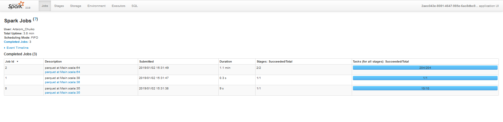
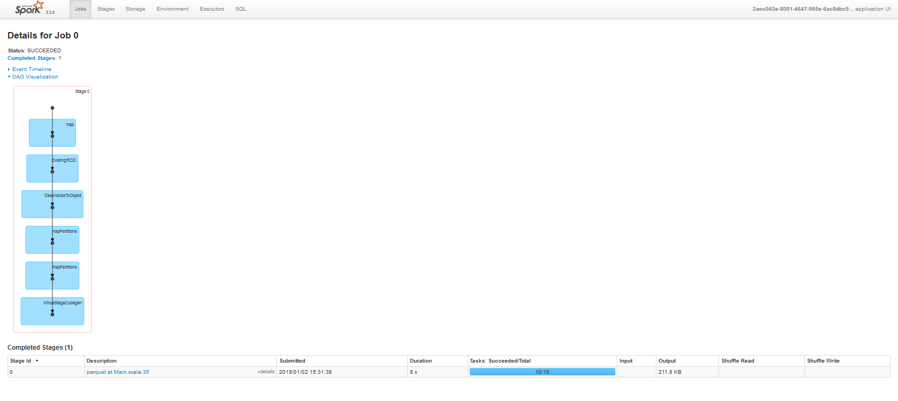
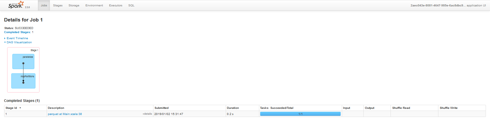
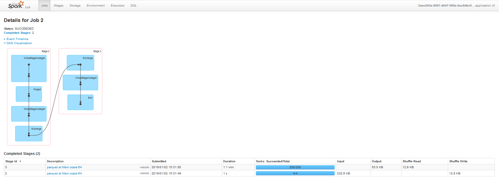

# kafka-tweets

Run Zookeeper and Kafka using the docker image:
```bash
docker run --rm -p 2181:2181 -p 9092:9092 -p9999:9999 \
    --env ADVERTISED_HOST=192.168.99.100 \
    --env ADVERTISED_PORT=9092 \
    --env TOPICS=TestTopic \
    spotify/kafka
```
Or use HDP's Kafka (broker address is 0.0.0.0:6667 by default).

Then create Kafka topic:
```bash
kafka-topics.sh --create --zookeeper localhost:2181 --replication-factor 1 --partitions 10 --topic Tweets
```

Go to http://apps.twitter.com/, login with your twitter account and register your application to get a consumer key and a consumer secret.

Add your consumer and access token as either environment variables or as part of your configuration. The twitter client will look for the following environment variables:
```bash
export TWITTER_CONSUMER_TOKEN_KEY='consumer-key'
export TWITTER_CONSUMER_TOKEN_SECRET='consumer-secret'
export TWITTER_ACCESS_TOKEN_KEY='access-key'
export TWITTER_ACCESS_TOKEN_SECRET='access-secret'
```

You can also add them to your configuration file, usually called application.conf:
```bson
twitter {
  consumer {
    key = "consumer-key"
    secret = "consumer-secret"
  }
  access {
    key = "access-key"
    secret = "access-secret"
  }
}
```

Build the jar: ```sbt assembly```

Run Tweets Producer:
```bash
java -jar \
    -Dakka.kafka.producer.kafka-clients.bootstrap.servers=192.168.99.100:9092 \
    -Dtweets.topic=Tweets \
    -Dakka.kafka.producer.parallelism=10 \
    -Dgenerator.number-of-events=10000 \
    -Dtwitter.consumer.key=${TWITTER_CONSUMER_KEY} \
    -Dtwitter.consumer.secret=${TWITTER_CONSUMER_SECRET} \
    -Dtwitter.access.key=${TWITTER_ACCESS_KEY} \
    -Dtwitter.access.secret=${TWITTER_ACCESS_KEY} \
    -Dscala.time \
    kafka-tweets-0.1.jar
```
All of the params above can be configured by changing application.conf or setting in different file:
```bash
java -jar \
    -Dconfig.resource=/path/to/your/configuration.conf \
    kafka-tweets-0.1.jar
```

# Spark Job

To run the spark job on HDP use this:
```bash
spark-submit \
    --class by.artsiom.bigdata201.job.Main \
    --master yarn-client
    job.jar
```

Or with a custom configuration file:
```bash
spark-submit \
    --class by.artsiom.bigdata201.job.Main \
    --conf 'spark.driver.extraJavaOptions=-Dconfig.resource=/path/to/application.conf' \
    --master yarn-client
    job.jar
```

<details><summary>Local logs</summary>
<p>

```shell
Using Spark's default log4j profile: org/apache/spark/log4j-defaults.properties
19/01/02 15:31:33 INFO SparkContext: Running Spark version 2.3.0
19/01/02 15:31:33 WARN NativeCodeLoader: Unable to load native-hadoop library for your platform... using builtin-java classes where applicable
19/01/02 15:31:33 INFO SparkContext: Submitted application: 2aec043e-8081-4647-985e-6ac8dbc904d7
19/01/02 15:31:33 INFO SecurityManager: Changing view acls to: Artsiom_Chuiko
19/01/02 15:31:33 INFO SecurityManager: Changing modify acls to: Artsiom_Chuiko
19/01/02 15:31:33 INFO SecurityManager: Changing view acls groups to:
19/01/02 15:31:33 INFO SecurityManager: Changing modify acls groups to:
19/01/02 15:31:33 INFO SecurityManager: SecurityManager: authentication disabled; ui acls disabled; users  with view permissions: Set(Artsiom_Chuiko); groups with view permissions: Set(); users  with modify permissions: Set(Artsiom_Chuiko); groups with modify permissions: Set()
19/01/02 15:31:34 INFO Utils: Successfully started service 'sparkDriver' on port 58897.
19/01/02 15:31:34 INFO SparkEnv: Registering MapOutputTracker
19/01/02 15:31:34 INFO SparkEnv: Registering BlockManagerMaster
19/01/02 15:31:34 INFO BlockManagerMasterEndpoint: Using org.apache.spark.storage.DefaultTopologyMapper for getting topology information
19/01/02 15:31:34 INFO BlockManagerMasterEndpoint: BlockManagerMasterEndpoint up
19/01/02 15:31:34 INFO DiskBlockManager: Created local directory at C:\Temp\blockmgr-94fbc450-7ad4-42a6-8f36-f2eb6ff11be2
19/01/02 15:31:34 INFO MemoryStore: MemoryStore started with capacity 1992.9 MB
19/01/02 15:31:34 INFO SparkEnv: Registering OutputCommitCoordinator
19/01/02 15:31:34 INFO Utils: Successfully started service 'SparkUI' on port 4040.
19/01/02 15:31:34 INFO SparkUI: Bound SparkUI to 0.0.0.0, and started at http://localhost:4040
19/01/02 15:31:34 INFO Executor: Starting executor ID driver on host localhost
19/01/02 15:31:34 INFO Utils: Successfully started service 'org.apache.spark.network.netty.NettyBlockTransferService' on port 58918.
19/01/02 15:31:34 INFO NettyBlockTransferService: Server created on localhost:58918
19/01/02 15:31:34 INFO BlockManager: Using org.apache.spark.storage.RandomBlockReplicationPolicy for block replication policy
19/01/02 15:31:34 INFO BlockManagerMaster: Registering BlockManager BlockManagerId(driver, localhost, 58918, None)
19/01/02 15:31:34 INFO BlockManagerMasterEndpoint: Registering block manager localhost:58918 with 1992.9 MB RAM, BlockManagerId(driver, localhost, 58918, None)
19/01/02 15:31:34 INFO BlockManagerMaster: Registered BlockManager BlockManagerId(driver, localhost, 58918, None)
19/01/02 15:31:34 INFO BlockManager: Initialized BlockManager: BlockManagerId(driver, localhost, 58918, None)
19/01/02 15:31:34 INFO SharedState: Setting hive.metastore.warehouse.dir ('null') to the value of spark.sql.warehouse.dir ('file:/C://kafka-tweets/spark-warehouse/').
19/01/02 15:31:34 INFO SharedState: Warehouse path is 'file:/C://kafka-tweets/spark-warehouse/'.
19/01/02 15:31:35 INFO StateStoreCoordinatorRef: Registered StateStoreCoordinator endpoint
19/01/02 15:31:36 INFO ConsumerConfig: ConsumerConfig values:
	metric.reporters = []
	metadata.max.age.ms = 300000
	partition.assignment.strategy = [org.apache.kafka.clients.consumer.RangeAssignor]
	reconnect.backoff.ms = 50
	sasl.kerberos.ticket.renew.window.factor = 0.8
	max.partition.fetch.bytes = 1048576
	bootstrap.servers = [192.168.99.100:9092]
	ssl.keystore.type = JKS
	enable.auto.commit = false
	sasl.mechanism = GSSAPI
	interceptor.classes = null
	exclude.internal.topics = true
	ssl.truststore.password = null
	client.id =
	ssl.endpoint.identification.algorithm = null
	max.poll.records = 1
	check.crcs = true
	request.timeout.ms = 40000
	heartbeat.interval.ms = 3000
	auto.commit.interval.ms = 5000
	receive.buffer.bytes = 65536
	ssl.truststore.type = JKS
	ssl.truststore.location = null
	ssl.keystore.password = null
	fetch.min.bytes = 1
	send.buffer.bytes = 131072
	value.deserializer = class org.apache.kafka.common.serialization.ByteArrayDeserializer
	group.id = spark-kafka-relation-44e2ec42-9211-40fe-976b-0bd444689e34-driver-0
	retry.backoff.ms = 100
	sasl.kerberos.kinit.cmd = /usr/bin/kinit
	sasl.kerberos.service.name = null
	sasl.kerberos.ticket.renew.jitter = 0.05
	ssl.trustmanager.algorithm = PKIX
	ssl.key.password = null
	fetch.max.wait.ms = 500
	sasl.kerberos.min.time.before.relogin = 60000
	connections.max.idle.ms = 540000
	session.timeout.ms = 30000
	metrics.num.samples = 2
	key.deserializer = class org.apache.kafka.common.serialization.ByteArrayDeserializer
	ssl.protocol = TLS
	ssl.provider = null
	ssl.enabled.protocols = [TLSv1.2, TLSv1.1, TLSv1]
	ssl.keystore.location = null
	ssl.cipher.suites = null
	security.protocol = PLAINTEXT
	ssl.keymanager.algorithm = SunX509
	metrics.sample.window.ms = 30000
	auto.offset.reset = earliest

19/01/02 15:31:36 INFO ConsumerConfig: ConsumerConfig values:
	metric.reporters = []
	metadata.max.age.ms = 300000
	partition.assignment.strategy = [org.apache.kafka.clients.consumer.RangeAssignor]
	reconnect.backoff.ms = 50
	sasl.kerberos.ticket.renew.window.factor = 0.8
	max.partition.fetch.bytes = 1048576
	bootstrap.servers = [192.168.99.100:9092]
	ssl.keystore.type = JKS
	enable.auto.commit = false
	sasl.mechanism = GSSAPI
	interceptor.classes = null
	exclude.internal.topics = true
	ssl.truststore.password = null
	client.id = consumer-1
	ssl.endpoint.identification.algorithm = null
	max.poll.records = 1
	check.crcs = true
	request.timeout.ms = 40000
	heartbeat.interval.ms = 3000
	auto.commit.interval.ms = 5000
	receive.buffer.bytes = 65536
	ssl.truststore.type = JKS
	ssl.truststore.location = null
	ssl.keystore.password = null
	fetch.min.bytes = 1
	send.buffer.bytes = 131072
	value.deserializer = class org.apache.kafka.common.serialization.ByteArrayDeserializer
	group.id = spark-kafka-relation-44e2ec42-9211-40fe-976b-0bd444689e34-driver-0
	retry.backoff.ms = 100
	sasl.kerberos.kinit.cmd = /usr/bin/kinit
	sasl.kerberos.service.name = null
	sasl.kerberos.ticket.renew.jitter = 0.05
	ssl.trustmanager.algorithm = PKIX
	ssl.key.password = null
	fetch.max.wait.ms = 500
	sasl.kerberos.min.time.before.relogin = 60000
	connections.max.idle.ms = 540000
	session.timeout.ms = 30000
	metrics.num.samples = 2
	key.deserializer = class org.apache.kafka.common.serialization.ByteArrayDeserializer
	ssl.protocol = TLS
	ssl.provider = null
	ssl.enabled.protocols = [TLSv1.2, TLSv1.1, TLSv1]
	ssl.keystore.location = null
	ssl.cipher.suites = null
	security.protocol = PLAINTEXT
	ssl.keymanager.algorithm = SunX509
	metrics.sample.window.ms = 30000
	auto.offset.reset = earliest

19/01/02 15:31:36 INFO AppInfoParser: Kafka version : 0.10.0.1
19/01/02 15:31:36 INFO AppInfoParser: Kafka commitId : a7a17cdec9eaa6c5
19/01/02 15:31:36 INFO AbstractCoordinator: Discovered coordinator 192.168.99.100:9092 (id: 2147483647 rack: null) for group spark-kafka-relation-44e2ec42-9211-40fe-976b-0bd444689e34-driver-0.
19/01/02 15:31:36 INFO ConsumerCoordinator: Revoking previously assigned partitions [] for group spark-kafka-relation-44e2ec42-9211-40fe-976b-0bd444689e34-driver-0
19/01/02 15:31:36 INFO AbstractCoordinator: (Re-)joining group spark-kafka-relation-44e2ec42-9211-40fe-976b-0bd444689e34-driver-0
19/01/02 15:31:37 INFO AbstractCoordinator: Successfully joined group spark-kafka-relation-44e2ec42-9211-40fe-976b-0bd444689e34-driver-0 with generation 1
19/01/02 15:31:37 INFO ConsumerCoordinator: Setting newly assigned partitions [Tweets-0, Tweets-1, Tweets-2, Tweets-3, Tweets-8, Tweets-9, Tweets-4, Tweets-5, Tweets-6, Tweets-7] for group spark-kafka-relation-44e2ec42-9211-40fe-976b-0bd444689e34-driver-0
19/01/02 15:31:37 INFO KafkaRelation: GetBatch generating RDD of offset range: KafkaSourceRDDOffsetRange(Tweets-0,-2,-1,None), KafkaSourceRDDOffsetRange(Tweets-1,-2,-1,None), KafkaSourceRDDOffsetRange(Tweets-2,-2,-1,None), KafkaSourceRDDOffsetRange(Tweets-3,-2,-1,None), KafkaSourceRDDOffsetRange(Tweets-4,-2,-1,None), KafkaSourceRDDOffsetRange(Tweets-5,-2,-1,None), KafkaSourceRDDOffsetRange(Tweets-6,-2,-1,None), KafkaSourceRDDOffsetRange(Tweets-7,-2,-1,None), KafkaSourceRDDOffsetRange(Tweets-8,-2,-1,None), KafkaSourceRDDOffsetRange(Tweets-9,-2,-1,None)
19/01/02 15:31:37 INFO ParquetFileFormat: Using default output committer for Parquet: org.apache.parquet.hadoop.ParquetOutputCommitter
19/01/02 15:31:37 INFO SQLHadoopMapReduceCommitProtocol: Using user defined output committer class org.apache.parquet.hadoop.ParquetOutputCommitter
19/01/02 15:31:37 INFO SQLHadoopMapReduceCommitProtocol: Using output committer class org.apache.parquet.hadoop.ParquetOutputCommitter
19/01/02 15:31:38 INFO CodeGenerator: Code generated in 268.075453 ms
19/01/02 15:31:38 INFO SparkContext: Starting job: parquet at Main.scala:35
19/01/02 15:31:38 INFO DAGScheduler: Got job 0 (parquet at Main.scala:35) with 10 output partitions
19/01/02 15:31:38 INFO DAGScheduler: Final stage: ResultStage 0 (parquet at Main.scala:35)
19/01/02 15:31:38 INFO DAGScheduler: Parents of final stage: List()
19/01/02 15:31:38 INFO DAGScheduler: Missing parents: List()
19/01/02 15:31:38 INFO DAGScheduler: Submitting ResultStage 0 (MapPartitionsRDD[6] at parquet at Main.scala:35), which has no missing parents
19/01/02 15:31:38 INFO MemoryStore: Block broadcast_0 stored as values in memory (estimated size 138.9 KB, free 1992.8 MB)
19/01/02 15:31:38 INFO MemoryStore: Block broadcast_0_piece0 stored as bytes in memory (estimated size 50.3 KB, free 1992.7 MB)
19/01/02 15:31:38 INFO BlockManagerInfo: Added broadcast_0_piece0 in memory on localhost:58918 (size: 50.3 KB, free: 1992.9 MB)
19/01/02 15:31:38 INFO SparkContext: Created broadcast 0 from broadcast at DAGScheduler.scala:1039
19/01/02 15:31:38 INFO DAGScheduler: Submitting 10 missing tasks from ResultStage 0 (MapPartitionsRDD[6] at parquet at Main.scala:35) (first 15 tasks are for partitions Vector(0, 1, 2, 3, 4, 5, 6, 7, 8, 9))
19/01/02 15:31:38 INFO TaskSchedulerImpl: Adding task set 0.0 with 10 tasks
19/01/02 15:31:38 INFO TaskSetManager: Starting task 0.0 in stage 0.0 (TID 0, localhost, executor driver, partition 0, PROCESS_LOCAL, 8029 bytes)
19/01/02 15:31:38 INFO TaskSetManager: Starting task 1.0 in stage 0.0 (TID 1, localhost, executor driver, partition 1, PROCESS_LOCAL, 8029 bytes)
19/01/02 15:31:38 INFO TaskSetManager: Starting task 2.0 in stage 0.0 (TID 2, localhost, executor driver, partition 2, PROCESS_LOCAL, 8029 bytes)
19/01/02 15:31:38 INFO TaskSetManager: Starting task 3.0 in stage 0.0 (TID 3, localhost, executor driver, partition 3, PROCESS_LOCAL, 8029 bytes)
19/01/02 15:31:38 INFO Executor: Running task 2.0 in stage 0.0 (TID 2)
19/01/02 15:31:38 INFO Executor: Running task 0.0 in stage 0.0 (TID 0)
19/01/02 15:31:38 INFO Executor: Running task 1.0 in stage 0.0 (TID 1)
19/01/02 15:31:38 INFO Executor: Running task 3.0 in stage 0.0 (TID 3)
19/01/02 15:31:38 INFO ConsumerConfig: ConsumerConfig values:
	metric.reporters = []
	metadata.max.age.ms = 300000
	partition.assignment.strategy = [org.apache.kafka.clients.consumer.RangeAssignor]
	reconnect.backoff.ms = 50
	sasl.kerberos.ticket.renew.window.factor = 0.8
	max.partition.fetch.bytes = 1048576
	bootstrap.servers = [192.168.99.100:9092]
	ssl.keystore.type = JKS
	enable.auto.commit = false
	sasl.mechanism = GSSAPI
	interceptor.classes = null
	exclude.internal.topics = true
	ssl.truststore.password = null
	client.id =
	ssl.endpoint.identification.algorithm = null
	max.poll.records = 2147483647
	check.crcs = true
	request.timeout.ms = 40000
	heartbeat.interval.ms = 3000
	auto.commit.interval.ms = 5000
	receive.buffer.bytes = 65536
	ssl.truststore.type = JKS
	ssl.truststore.location = null
	ssl.keystore.password = null
	fetch.min.bytes = 1
	send.buffer.bytes = 131072
	value.deserializer = class org.apache.kafka.common.serialization.ByteArrayDeserializer
	group.id = spark-kafka-relation-44e2ec42-9211-40fe-976b-0bd444689e34-executor
	retry.backoff.ms = 100
	sasl.kerberos.kinit.cmd = /usr/bin/kinit
	sasl.kerberos.service.name = null
	sasl.kerberos.ticket.renew.jitter = 0.05
	ssl.trustmanager.algorithm = PKIX
	ssl.key.password = null
	fetch.max.wait.ms = 500
	sasl.kerberos.min.time.before.relogin = 60000
	connections.max.idle.ms = 540000
	session.timeout.ms = 30000
	metrics.num.samples = 2
	key.deserializer = class org.apache.kafka.common.serialization.ByteArrayDeserializer
	ssl.protocol = TLS
	ssl.provider = null
	ssl.enabled.protocols = [TLSv1.2, TLSv1.1, TLSv1]
	ssl.keystore.location = null
	ssl.cipher.suites = null
	security.protocol = PLAINTEXT
	ssl.keymanager.algorithm = SunX509
	metrics.sample.window.ms = 30000
	auto.offset.reset = none

19/01/02 15:31:38 INFO ConsumerConfig: ConsumerConfig values:
	metric.reporters = []
	metadata.max.age.ms = 300000
	partition.assignment.strategy = [org.apache.kafka.clients.consumer.RangeAssignor]
	reconnect.backoff.ms = 50
	sasl.kerberos.ticket.renew.window.factor = 0.8
	max.partition.fetch.bytes = 1048576
	bootstrap.servers = [192.168.99.100:9092]
	ssl.keystore.type = JKS
	enable.auto.commit = false
	sasl.mechanism = GSSAPI
	interceptor.classes = null
	exclude.internal.topics = true
	ssl.truststore.password = null
	client.id = consumer-2
	ssl.endpoint.identification.algorithm = null
	max.poll.records = 2147483647
	check.crcs = true
	request.timeout.ms = 40000
	heartbeat.interval.ms = 3000
	auto.commit.interval.ms = 5000
	receive.buffer.bytes = 65536
	ssl.truststore.type = JKS
	ssl.truststore.location = null
	ssl.keystore.password = null
	fetch.min.bytes = 1
	send.buffer.bytes = 131072
	value.deserializer = class org.apache.kafka.common.serialization.ByteArrayDeserializer
	group.id = spark-kafka-relation-44e2ec42-9211-40fe-976b-0bd444689e34-executor
	retry.backoff.ms = 100
	sasl.kerberos.kinit.cmd = /usr/bin/kinit
	sasl.kerberos.service.name = null
	sasl.kerberos.ticket.renew.jitter = 0.05
	ssl.trustmanager.algorithm = PKIX
	ssl.key.password = null
	fetch.max.wait.ms = 500
	sasl.kerberos.min.time.before.relogin = 60000
	connections.max.idle.ms = 540000
	session.timeout.ms = 30000
	metrics.num.samples = 2
	key.deserializer = class org.apache.kafka.common.serialization.ByteArrayDeserializer
	ssl.protocol = TLS
	ssl.provider = null
	ssl.enabled.protocols = [TLSv1.2, TLSv1.1, TLSv1]
	ssl.keystore.location = null
	ssl.cipher.suites = null
	security.protocol = PLAINTEXT
	ssl.keymanager.algorithm = SunX509
	metrics.sample.window.ms = 30000
	auto.offset.reset = none

19/01/02 15:31:38 INFO AppInfoParser: Kafka version : 0.10.0.1
19/01/02 15:31:38 INFO AppInfoParser: Kafka commitId : a7a17cdec9eaa6c5
19/01/02 15:31:38 INFO ConsumerConfig: ConsumerConfig values:
	metric.reporters = []
	metadata.max.age.ms = 300000
	partition.assignment.strategy = [org.apache.kafka.clients.consumer.RangeAssignor]
	reconnect.backoff.ms = 50
	sasl.kerberos.ticket.renew.window.factor = 0.8
	max.partition.fetch.bytes = 1048576
	bootstrap.servers = [192.168.99.100:9092]
	ssl.keystore.type = JKS
	enable.auto.commit = false
	sasl.mechanism = GSSAPI
	interceptor.classes = null
	exclude.internal.topics = true
	ssl.truststore.password = null
	client.id =
	ssl.endpoint.identification.algorithm = null
	max.poll.records = 2147483647
	check.crcs = true
	request.timeout.ms = 40000
	heartbeat.interval.ms = 3000
	auto.commit.interval.ms = 5000
	receive.buffer.bytes = 65536
	ssl.truststore.type = JKS
	ssl.truststore.location = null
	ssl.keystore.password = null
	fetch.min.bytes = 1
	send.buffer.bytes = 131072
	value.deserializer = class org.apache.kafka.common.serialization.ByteArrayDeserializer
	group.id = spark-kafka-relation-44e2ec42-9211-40fe-976b-0bd444689e34-executor
	retry.backoff.ms = 100
	sasl.kerberos.kinit.cmd = /usr/bin/kinit
	sasl.kerberos.service.name = null
	sasl.kerberos.ticket.renew.jitter = 0.05
	ssl.trustmanager.algorithm = PKIX
	ssl.key.password = null
	fetch.max.wait.ms = 500
	sasl.kerberos.min.time.before.relogin = 60000
	connections.max.idle.ms = 540000
	session.timeout.ms = 30000
	metrics.num.samples = 2
	key.deserializer = class org.apache.kafka.common.serialization.ByteArrayDeserializer
	ssl.protocol = TLS
	ssl.provider = null
	ssl.enabled.protocols = [TLSv1.2, TLSv1.1, TLSv1]
	ssl.keystore.location = null
	ssl.cipher.suites = null
	security.protocol = PLAINTEXT
	ssl.keymanager.algorithm = SunX509
	metrics.sample.window.ms = 30000
	auto.offset.reset = none

19/01/02 15:31:38 INFO ConsumerConfig: ConsumerConfig values:
	metric.reporters = []
	metadata.max.age.ms = 300000
	partition.assignment.strategy = [org.apache.kafka.clients.consumer.RangeAssignor]
	reconnect.backoff.ms = 50
	sasl.kerberos.ticket.renew.window.factor = 0.8
	max.partition.fetch.bytes = 1048576
	bootstrap.servers = [192.168.99.100:9092]
	ssl.keystore.type = JKS
	enable.auto.commit = false
	sasl.mechanism = GSSAPI
	interceptor.classes = null
	exclude.internal.topics = true
	ssl.truststore.password = null
	client.id =
	ssl.endpoint.identification.algorithm = null
	max.poll.records = 2147483647
	check.crcs = true
	request.timeout.ms = 40000
	heartbeat.interval.ms = 3000
	auto.commit.interval.ms = 5000
	receive.buffer.bytes = 65536
	ssl.truststore.type = JKS
	ssl.truststore.location = null
	ssl.keystore.password = null
	fetch.min.bytes = 1
	send.buffer.bytes = 131072
	value.deserializer = class org.apache.kafka.common.serialization.ByteArrayDeserializer
	group.id = spark-kafka-relation-44e2ec42-9211-40fe-976b-0bd444689e34-executor
	retry.backoff.ms = 100
	sasl.kerberos.kinit.cmd = /usr/bin/kinit
	sasl.kerberos.service.name = null
	sasl.kerberos.ticket.renew.jitter = 0.05
	ssl.trustmanager.algorithm = PKIX
	ssl.key.password = null
	fetch.max.wait.ms = 500
	sasl.kerberos.min.time.before.relogin = 60000
	connections.max.idle.ms = 540000
	session.timeout.ms = 30000
	metrics.num.samples = 2
	key.deserializer = class org.apache.kafka.common.serialization.ByteArrayDeserializer
	ssl.protocol = TLS
	ssl.provider = null
	ssl.enabled.protocols = [TLSv1.2, TLSv1.1, TLSv1]
	ssl.keystore.location = null
	ssl.cipher.suites = null
	security.protocol = PLAINTEXT
	ssl.keymanager.algorithm = SunX509
	metrics.sample.window.ms = 30000
	auto.offset.reset = none

19/01/02 15:31:38 INFO ConsumerConfig: ConsumerConfig values:
	metric.reporters = []
	metadata.max.age.ms = 300000
	partition.assignment.strategy = [org.apache.kafka.clients.consumer.RangeAssignor]
	reconnect.backoff.ms = 50
	sasl.kerberos.ticket.renew.window.factor = 0.8
	max.partition.fetch.bytes = 1048576
	bootstrap.servers = [192.168.99.100:9092]
	ssl.keystore.type = JKS
	enable.auto.commit = false
	sasl.mechanism = GSSAPI
	interceptor.classes = null
	exclude.internal.topics = true
	ssl.truststore.password = null
	client.id =
	ssl.endpoint.identification.algorithm = null
	max.poll.records = 2147483647
	check.crcs = true
	request.timeout.ms = 40000
	heartbeat.interval.ms = 3000
	auto.commit.interval.ms = 5000
	receive.buffer.bytes = 65536
	ssl.truststore.type = JKS
	ssl.truststore.location = null
	ssl.keystore.password = null
	fetch.min.bytes = 1
	send.buffer.bytes = 131072
	value.deserializer = class org.apache.kafka.common.serialization.ByteArrayDeserializer
	group.id = spark-kafka-relation-44e2ec42-9211-40fe-976b-0bd444689e34-executor
	retry.backoff.ms = 100
	sasl.kerberos.kinit.cmd = /usr/bin/kinit
	sasl.kerberos.service.name = null
	sasl.kerberos.ticket.renew.jitter = 0.05
	ssl.trustmanager.algorithm = PKIX
	ssl.key.password = null
	fetch.max.wait.ms = 500
	sasl.kerberos.min.time.before.relogin = 60000
	connections.max.idle.ms = 540000
	session.timeout.ms = 30000
	metrics.num.samples = 2
	key.deserializer = class org.apache.kafka.common.serialization.ByteArrayDeserializer
	ssl.protocol = TLS
	ssl.provider = null
	ssl.enabled.protocols = [TLSv1.2, TLSv1.1, TLSv1]
	ssl.keystore.location = null
	ssl.cipher.suites = null
	security.protocol = PLAINTEXT
	ssl.keymanager.algorithm = SunX509
	metrics.sample.window.ms = 30000
	auto.offset.reset = none

19/01/02 15:31:38 INFO ConsumerConfig: ConsumerConfig values:
	metric.reporters = []
	metadata.max.age.ms = 300000
	partition.assignment.strategy = [org.apache.kafka.clients.consumer.RangeAssignor]
	reconnect.backoff.ms = 50
	sasl.kerberos.ticket.renew.window.factor = 0.8
	max.partition.fetch.bytes = 1048576
	bootstrap.servers = [192.168.99.100:9092]
	ssl.keystore.type = JKS
	enable.auto.commit = false
	sasl.mechanism = GSSAPI
	interceptor.classes = null
	exclude.internal.topics = true
	ssl.truststore.password = null
	client.id = consumer-4
	ssl.endpoint.identification.algorithm = null
	max.poll.records = 2147483647
	check.crcs = true
	request.timeout.ms = 40000
	heartbeat.interval.ms = 3000
	auto.commit.interval.ms = 5000
	receive.buffer.bytes = 65536
	ssl.truststore.type = JKS
	ssl.truststore.location = null
	ssl.keystore.password = null
	fetch.min.bytes = 1
	send.buffer.bytes = 131072
	value.deserializer = class org.apache.kafka.common.serialization.ByteArrayDeserializer
	group.id = spark-kafka-relation-44e2ec42-9211-40fe-976b-0bd444689e34-executor
	retry.backoff.ms = 100
	sasl.kerberos.kinit.cmd = /usr/bin/kinit
	sasl.kerberos.service.name = null
	sasl.kerberos.ticket.renew.jitter = 0.05
	ssl.trustmanager.algorithm = PKIX
	ssl.key.password = null
	fetch.max.wait.ms = 500
	sasl.kerberos.min.time.before.relogin = 60000
	connections.max.idle.ms = 540000
	session.timeout.ms = 30000
	metrics.num.samples = 2
	key.deserializer = class org.apache.kafka.common.serialization.ByteArrayDeserializer
	ssl.protocol = TLS
	ssl.provider = null
	ssl.enabled.protocols = [TLSv1.2, TLSv1.1, TLSv1]
	ssl.keystore.location = null
	ssl.cipher.suites = null
	security.protocol = PLAINTEXT
	ssl.keymanager.algorithm = SunX509
	metrics.sample.window.ms = 30000
	auto.offset.reset = none

19/01/02 15:31:38 INFO ConsumerConfig: ConsumerConfig values:
	metric.reporters = []
	metadata.max.age.ms = 300000
	partition.assignment.strategy = [org.apache.kafka.clients.consumer.RangeAssignor]
	reconnect.backoff.ms = 50
	sasl.kerberos.ticket.renew.window.factor = 0.8
	max.partition.fetch.bytes = 1048576
	bootstrap.servers = [192.168.99.100:9092]
	ssl.keystore.type = JKS
	enable.auto.commit = false
	sasl.mechanism = GSSAPI
	interceptor.classes = null
	exclude.internal.topics = true
	ssl.truststore.password = null
	client.id = consumer-3
	ssl.endpoint.identification.algorithm = null
	max.poll.records = 2147483647
	check.crcs = true
	request.timeout.ms = 40000
	heartbeat.interval.ms = 3000
	auto.commit.interval.ms = 5000
	receive.buffer.bytes = 65536
	ssl.truststore.type = JKS
	ssl.truststore.location = null
	ssl.keystore.password = null
	fetch.min.bytes = 1
	send.buffer.bytes = 131072
	value.deserializer = class org.apache.kafka.common.serialization.ByteArrayDeserializer
	group.id = spark-kafka-relation-44e2ec42-9211-40fe-976b-0bd444689e34-executor
	retry.backoff.ms = 100
	sasl.kerberos.kinit.cmd = /usr/bin/kinit
	sasl.kerberos.service.name = null
	sasl.kerberos.ticket.renew.jitter = 0.05
	ssl.trustmanager.algorithm = PKIX
	ssl.key.password = null
	fetch.max.wait.ms = 500
	sasl.kerberos.min.time.before.relogin = 60000
	connections.max.idle.ms = 540000
	session.timeout.ms = 30000
	metrics.num.samples = 2
	key.deserializer = class org.apache.kafka.common.serialization.ByteArrayDeserializer
	ssl.protocol = TLS
	ssl.provider = null
	ssl.enabled.protocols = [TLSv1.2, TLSv1.1, TLSv1]
	ssl.keystore.location = null
	ssl.cipher.suites = null
	security.protocol = PLAINTEXT
	ssl.keymanager.algorithm = SunX509
	metrics.sample.window.ms = 30000
	auto.offset.reset = none

19/01/02 15:31:38 INFO AppInfoParser: Kafka version : 0.10.0.1
19/01/02 15:31:38 INFO AppInfoParser: Kafka commitId : a7a17cdec9eaa6c5
19/01/02 15:31:38 INFO AppInfoParser: Kafka version : 0.10.0.1
19/01/02 15:31:38 INFO AppInfoParser: Kafka commitId : a7a17cdec9eaa6c5
19/01/02 15:31:38 INFO ConsumerConfig: ConsumerConfig values:
	metric.reporters = []
	metadata.max.age.ms = 300000
	partition.assignment.strategy = [org.apache.kafka.clients.consumer.RangeAssignor]
	reconnect.backoff.ms = 50
	sasl.kerberos.ticket.renew.window.factor = 0.8
	max.partition.fetch.bytes = 1048576
	bootstrap.servers = [192.168.99.100:9092]
	ssl.keystore.type = JKS
	enable.auto.commit = false
	sasl.mechanism = GSSAPI
	interceptor.classes = null
	exclude.internal.topics = true
	ssl.truststore.password = null
	client.id = consumer-5
	ssl.endpoint.identification.algorithm = null
	max.poll.records = 2147483647
	check.crcs = true
	request.timeout.ms = 40000
	heartbeat.interval.ms = 3000
	auto.commit.interval.ms = 5000
	receive.buffer.bytes = 65536
	ssl.truststore.type = JKS
	ssl.truststore.location = null
	ssl.keystore.password = null
	fetch.min.bytes = 1
	send.buffer.bytes = 131072
	value.deserializer = class org.apache.kafka.common.serialization.ByteArrayDeserializer
	group.id = spark-kafka-relation-44e2ec42-9211-40fe-976b-0bd444689e34-executor
	retry.backoff.ms = 100
	sasl.kerberos.kinit.cmd = /usr/bin/kinit
	sasl.kerberos.service.name = null
	sasl.kerberos.ticket.renew.jitter = 0.05
	ssl.trustmanager.algorithm = PKIX
	ssl.key.password = null
	fetch.max.wait.ms = 500
	sasl.kerberos.min.time.before.relogin = 60000
	connections.max.idle.ms = 540000
	session.timeout.ms = 30000
	metrics.num.samples = 2
	key.deserializer = class org.apache.kafka.common.serialization.ByteArrayDeserializer
	ssl.protocol = TLS
	ssl.provider = null
	ssl.enabled.protocols = [TLSv1.2, TLSv1.1, TLSv1]
	ssl.keystore.location = null
	ssl.cipher.suites = null
	security.protocol = PLAINTEXT
	ssl.keymanager.algorithm = SunX509
	metrics.sample.window.ms = 30000
	auto.offset.reset = none

19/01/02 15:31:38 INFO AppInfoParser: Kafka version : 0.10.0.1
19/01/02 15:31:38 INFO AppInfoParser: Kafka commitId : a7a17cdec9eaa6c5
19/01/02 15:31:38 INFO AbstractCoordinator: Discovered coordinator 192.168.99.100:9092 (id: 2147483647 rack: null) for group spark-kafka-relation-44e2ec42-9211-40fe-976b-0bd444689e34-executor.
19/01/02 15:31:38 INFO AbstractCoordinator: Discovered coordinator 192.168.99.100:9092 (id: 2147483647 rack: null) for group spark-kafka-relation-44e2ec42-9211-40fe-976b-0bd444689e34-executor.
19/01/02 15:31:38 INFO AbstractCoordinator: Discovered coordinator 192.168.99.100:9092 (id: 2147483647 rack: null) for group spark-kafka-relation-44e2ec42-9211-40fe-976b-0bd444689e34-executor.
19/01/02 15:31:38 INFO AbstractCoordinator: Discovered coordinator 192.168.99.100:9092 (id: 2147483647 rack: null) for group spark-kafka-relation-44e2ec42-9211-40fe-976b-0bd444689e34-executor.
19/01/02 15:31:38 INFO CodeGenerator: Code generated in 29.768165 ms
19/01/02 15:31:38 INFO CodeGenerator: Code generated in 25.476441 ms
19/01/02 15:31:38 INFO SQLHadoopMapReduceCommitProtocol: Using user defined output committer class org.apache.parquet.hadoop.ParquetOutputCommitter
19/01/02 15:31:38 INFO SQLHadoopMapReduceCommitProtocol: Using output committer class org.apache.parquet.hadoop.ParquetOutputCommitter
19/01/02 15:31:38 INFO SQLHadoopMapReduceCommitProtocol: Using user defined output committer class org.apache.parquet.hadoop.ParquetOutputCommitter
19/01/02 15:31:38 INFO SQLHadoopMapReduceCommitProtocol: Using output committer class org.apache.parquet.hadoop.ParquetOutputCommitter
19/01/02 15:31:38 INFO SQLHadoopMapReduceCommitProtocol: Using user defined output committer class org.apache.parquet.hadoop.ParquetOutputCommitter
19/01/02 15:31:38 INFO SQLHadoopMapReduceCommitProtocol: Using output committer class org.apache.parquet.hadoop.ParquetOutputCommitter
19/01/02 15:31:38 INFO CodecConfig: Compression: SNAPPY
19/01/02 15:31:38 INFO SQLHadoopMapReduceCommitProtocol: Using user defined output committer class org.apache.parquet.hadoop.ParquetOutputCommitter
19/01/02 15:31:38 INFO SQLHadoopMapReduceCommitProtocol: Using output committer class org.apache.parquet.hadoop.ParquetOutputCommitter
19/01/02 15:31:38 INFO CodecConfig: Compression: SNAPPY
19/01/02 15:31:38 INFO ParquetOutputFormat: Parquet block size to 134217728
19/01/02 15:31:38 INFO ParquetOutputFormat: Parquet page size to 1048576
19/01/02 15:31:38 INFO ParquetOutputFormat: Parquet dictionary page size to 1048576
19/01/02 15:31:38 INFO ParquetOutputFormat: Dictionary is on
19/01/02 15:31:38 INFO ParquetOutputFormat: Validation is off
19/01/02 15:31:38 INFO ParquetOutputFormat: Writer version is: PARQUET_1_0
19/01/02 15:31:38 INFO ParquetOutputFormat: Maximum row group padding size is 0 bytes
19/01/02 15:31:38 INFO ParquetOutputFormat: Page size checking is: estimated
19/01/02 15:31:38 INFO ParquetOutputFormat: Min row count for page size check is: 100
19/01/02 15:31:38 INFO ParquetOutputFormat: Max row count for page size check is: 10000
19/01/02 15:31:38 INFO CodecConfig: Compression: SNAPPY
19/01/02 15:31:38 INFO CodecConfig: Compression: SNAPPY
19/01/02 15:31:38 INFO CodecConfig: Compression: SNAPPY
19/01/02 15:31:38 INFO CodecConfig: Compression: SNAPPY
19/01/02 15:31:38 INFO ParquetOutputFormat: Parquet block size to 134217728
19/01/02 15:31:38 INFO ParquetOutputFormat: Parquet page size to 1048576
19/01/02 15:31:38 INFO ParquetOutputFormat: Parquet dictionary page size to 1048576
19/01/02 15:31:38 INFO ParquetOutputFormat: Dictionary is on
19/01/02 15:31:38 INFO ParquetOutputFormat: Validation is off
19/01/02 15:31:38 INFO ParquetOutputFormat: Writer version is: PARQUET_1_0
19/01/02 15:31:38 INFO ParquetOutputFormat: Maximum row group padding size is 0 bytes
19/01/02 15:31:38 INFO ParquetOutputFormat: Page size checking is: estimated
19/01/02 15:31:38 INFO ParquetOutputFormat: Min row count for page size check is: 100
19/01/02 15:31:38 INFO ParquetOutputFormat: Max row count for page size check is: 10000
19/01/02 15:31:38 INFO ParquetOutputFormat: Parquet block size to 134217728
19/01/02 15:31:38 INFO ParquetOutputFormat: Parquet page size to 1048576
19/01/02 15:31:38 INFO ParquetOutputFormat: Parquet dictionary page size to 1048576
19/01/02 15:31:38 INFO ParquetOutputFormat: Dictionary is on
19/01/02 15:31:38 INFO ParquetOutputFormat: Validation is off
19/01/02 15:31:38 INFO ParquetOutputFormat: Writer version is: PARQUET_1_0
19/01/02 15:31:38 INFO ParquetOutputFormat: Maximum row group padding size is 0 bytes
19/01/02 15:31:38 INFO ParquetOutputFormat: Page size checking is: estimated
19/01/02 15:31:38 INFO ParquetOutputFormat: Min row count for page size check is: 100
19/01/02 15:31:38 INFO ParquetOutputFormat: Max row count for page size check is: 10000
19/01/02 15:31:38 INFO ParquetWriteSupport: Initialized Parquet WriteSupport with Catalyst schema:
{
  "type" : "struct",
  "fields" : [ {
    "name" : "key",
    "type" : "binary",
    "nullable" : true,
    "metadata" : { }
  }, {
    "name" : "value",
    "type" : "binary",
    "nullable" : true,
    "metadata" : { }
  }, {
    "name" : "topic",
    "type" : "string",
    "nullable" : true,
    "metadata" : { }
  }, {
    "name" : "partition",
    "type" : "integer",
    "nullable" : true,
    "metadata" : { }
  }, {
    "name" : "offset",
    "type" : "long",
    "nullable" : true,
    "metadata" : { }
  }, {
    "name" : "timestamp",
    "type" : "timestamp",
    "nullable" : true,
    "metadata" : { }
  }, {
    "name" : "timestampType",
    "type" : "integer",
    "nullable" : true,
    "metadata" : { }
  } ]
}
and corresponding Parquet message type:
message spark_schema {
  optional binary key;
  optional binary value;
  optional binary topic (UTF8);
  optional int32 partition;
  optional int64 offset;
  optional int96 timestamp;
  optional int32 timestampType;
}


19/01/02 15:31:38 INFO ParquetWriteSupport: Initialized Parquet WriteSupport with Catalyst schema:
{
  "type" : "struct",
  "fields" : [ {
    "name" : "key",
    "type" : "binary",
    "nullable" : true,
    "metadata" : { }
  }, {
    "name" : "value",
    "type" : "binary",
    "nullable" : true,
    "metadata" : { }
  }, {
    "name" : "topic",
    "type" : "string",
    "nullable" : true,
    "metadata" : { }
  }, {
    "name" : "partition",
    "type" : "integer",
    "nullable" : true,
    "metadata" : { }
  }, {
    "name" : "offset",
    "type" : "long",
    "nullable" : true,
    "metadata" : { }
  }, {
    "name" : "timestamp",
    "type" : "timestamp",
    "nullable" : true,
    "metadata" : { }
  }, {
    "name" : "timestampType",
    "type" : "integer",
    "nullable" : true,
    "metadata" : { }
  } ]
}
and corresponding Parquet message type:
message spark_schema {
  optional binary key;
  optional binary value;
  optional binary topic (UTF8);
  optional int32 partition;
  optional int64 offset;
  optional int96 timestamp;
  optional int32 timestampType;
}


19/01/02 15:31:38 INFO ParquetWriteSupport: Initialized Parquet WriteSupport with Catalyst schema:
{
  "type" : "struct",
  "fields" : [ {
    "name" : "key",
    "type" : "binary",
    "nullable" : true,
    "metadata" : { }
  }, {
    "name" : "value",
    "type" : "binary",
    "nullable" : true,
    "metadata" : { }
  }, {
    "name" : "topic",
    "type" : "string",
    "nullable" : true,
    "metadata" : { }
  }, {
    "name" : "partition",
    "type" : "integer",
    "nullable" : true,
    "metadata" : { }
  }, {
    "name" : "offset",
    "type" : "long",
    "nullable" : true,
    "metadata" : { }
  }, {
    "name" : "timestamp",
    "type" : "timestamp",
    "nullable" : true,
    "metadata" : { }
  }, {
    "name" : "timestampType",
    "type" : "integer",
    "nullable" : true,
    "metadata" : { }
  } ]
}
and corresponding Parquet message type:
message spark_schema {
  optional binary key;
  optional binary value;
  optional binary topic (UTF8);
  optional int32 partition;
  optional int64 offset;
  optional int96 timestamp;
  optional int32 timestampType;
}


19/01/02 15:31:38 INFO CodecConfig: Compression: SNAPPY
19/01/02 15:31:38 INFO CodecConfig: Compression: SNAPPY
19/01/02 15:31:38 INFO ParquetOutputFormat: Parquet block size to 134217728
19/01/02 15:31:38 INFO ParquetOutputFormat: Parquet page size to 1048576
19/01/02 15:31:38 INFO ParquetOutputFormat: Parquet dictionary page size to 1048576
19/01/02 15:31:38 INFO ParquetOutputFormat: Dictionary is on
19/01/02 15:31:38 INFO ParquetOutputFormat: Validation is off
19/01/02 15:31:38 INFO ParquetOutputFormat: Writer version is: PARQUET_1_0
19/01/02 15:31:38 INFO ParquetOutputFormat: Maximum row group padding size is 0 bytes
19/01/02 15:31:38 INFO ParquetOutputFormat: Page size checking is: estimated
19/01/02 15:31:38 INFO ParquetOutputFormat: Min row count for page size check is: 100
19/01/02 15:31:38 INFO ParquetOutputFormat: Max row count for page size check is: 10000
19/01/02 15:31:38 INFO ParquetWriteSupport: Initialized Parquet WriteSupport with Catalyst schema:
{
  "type" : "struct",
  "fields" : [ {
    "name" : "key",
    "type" : "binary",
    "nullable" : true,
    "metadata" : { }
  }, {
    "name" : "value",
    "type" : "binary",
    "nullable" : true,
    "metadata" : { }
  }, {
    "name" : "topic",
    "type" : "string",
    "nullable" : true,
    "metadata" : { }
  }, {
    "name" : "partition",
    "type" : "integer",
    "nullable" : true,
    "metadata" : { }
  }, {
    "name" : "offset",
    "type" : "long",
    "nullable" : true,
    "metadata" : { }
  }, {
    "name" : "timestamp",
    "type" : "timestamp",
    "nullable" : true,
    "metadata" : { }
  }, {
    "name" : "timestampType",
    "type" : "integer",
    "nullable" : true,
    "metadata" : { }
  } ]
}
and corresponding Parquet message type:
message spark_schema {
  optional binary key;
  optional binary value;
  optional binary topic (UTF8);
  optional int32 partition;
  optional int64 offset;
  optional int96 timestamp;
  optional int32 timestampType;
}


19/01/02 15:31:41 INFO CodecPool: Got brand-new compressor [.snappy]
19/01/02 15:31:41 INFO InternalParquetRecordWriter: Flushing mem columnStore to file. allocated memory: 38273
19/01/02 15:31:41 INFO CodecPool: Got brand-new compressor [.snappy]
19/01/02 15:31:41 INFO InternalParquetRecordWriter: Flushing mem columnStore to file. allocated memory: 114167
19/01/02 15:31:41 INFO FileOutputCommitter: Saved output of task 'attempt_20190102153138_0000_m_000002_0' to file:/C://kafka-tweets/testDir1/_temporary/0/task_20190102153138_0000_m_000002
19/01/02 15:31:41 INFO SparkHadoopMapRedUtil: attempt_20190102153138_0000_m_000002_0: Committed
19/01/02 15:31:41 INFO FileOutputCommitter: Saved output of task 'attempt_20190102153138_0000_m_000001_0' to file:/C://kafka-tweets/testDir1/_temporary/0/task_20190102153138_0000_m_000001
19/01/02 15:31:41 INFO SparkHadoopMapRedUtil: attempt_20190102153138_0000_m_000001_0: Committed
19/01/02 15:31:41 INFO Executor: Finished task 1.0 in stage 0.0 (TID 1). 2152 bytes result sent to driver
19/01/02 15:31:41 INFO Executor: Finished task 2.0 in stage 0.0 (TID 2). 2195 bytes result sent to driver
19/01/02 15:31:41 INFO TaskSetManager: Starting task 4.0 in stage 0.0 (TID 4, localhost, executor driver, partition 4, PROCESS_LOCAL, 8029 bytes)
19/01/02 15:31:41 INFO Executor: Running task 4.0 in stage 0.0 (TID 4)
19/01/02 15:31:41 INFO TaskSetManager: Starting task 5.0 in stage 0.0 (TID 5, localhost, executor driver, partition 5, PROCESS_LOCAL, 8029 bytes)
19/01/02 15:31:41 INFO Executor: Running task 5.0 in stage 0.0 (TID 5)
19/01/02 15:31:41 INFO InternalParquetRecordWriter: Flushing mem columnStore to file. allocated memory: 97180
19/01/02 15:31:41 INFO FileOutputCommitter: Saved output of task 'attempt_20190102153138_0000_m_000003_0' to file:/C://kafka-tweets/testDir1/_temporary/0/task_20190102153138_0000_m_000003
19/01/02 15:31:41 INFO SparkHadoopMapRedUtil: attempt_20190102153138_0000_m_000003_0: Committed
19/01/02 15:31:41 INFO Executor: Finished task 3.0 in stage 0.0 (TID 3). 2109 bytes result sent to driver
19/01/02 15:31:41 INFO TaskSetManager: Finished task 2.0 in stage 0.0 (TID 2) in 3478 ms on localhost (executor driver) (1/10)
19/01/02 15:31:41 INFO ConsumerConfig: ConsumerConfig values:
	metric.reporters = []
	metadata.max.age.ms = 300000
	partition.assignment.strategy = [org.apache.kafka.clients.consumer.RangeAssignor]
	reconnect.backoff.ms = 50
	sasl.kerberos.ticket.renew.window.factor = 0.8
	max.partition.fetch.bytes = 1048576
	bootstrap.servers = [192.168.99.100:9092]
	ssl.keystore.type = JKS
	enable.auto.commit = false
	sasl.mechanism = GSSAPI
	interceptor.classes = null
	exclude.internal.topics = true
	ssl.truststore.password = null
	client.id =
	ssl.endpoint.identification.algorithm = null
	max.poll.records = 2147483647
	check.crcs = true
	request.timeout.ms = 40000
	heartbeat.interval.ms = 3000
	auto.commit.interval.ms = 5000
	receive.buffer.bytes = 65536
	ssl.truststore.type = JKS
	ssl.truststore.location = null
	ssl.keystore.password = null
	fetch.min.bytes = 1
	send.buffer.bytes = 131072
	value.deserializer = class org.apache.kafka.common.serialization.ByteArrayDeserializer
	group.id = spark-kafka-relation-44e2ec42-9211-40fe-976b-0bd444689e34-executor
	retry.backoff.ms = 100
	sasl.kerberos.kinit.cmd = /usr/bin/kinit
	sasl.kerberos.service.name = null
	sasl.kerberos.ticket.renew.jitter = 0.05
	ssl.trustmanager.algorithm = PKIX
	ssl.key.password = null
	fetch.max.wait.ms = 500
	sasl.kerberos.min.time.before.relogin = 60000
	connections.max.idle.ms = 540000
	session.timeout.ms = 30000
	metrics.num.samples = 2
	key.deserializer = class org.apache.kafka.common.serialization.ByteArrayDeserializer
	ssl.protocol = TLS
	ssl.provider = null
	ssl.enabled.protocols = [TLSv1.2, TLSv1.1, TLSv1]
	ssl.keystore.location = null
	ssl.cipher.suites = null
	security.protocol = PLAINTEXT
	ssl.keymanager.algorithm = SunX509
	metrics.sample.window.ms = 30000
	auto.offset.reset = none

19/01/02 15:31:41 INFO ConsumerConfig: ConsumerConfig values:
	metric.reporters = []
	metadata.max.age.ms = 300000
	partition.assignment.strategy = [org.apache.kafka.clients.consumer.RangeAssignor]
	reconnect.backoff.ms = 50
	sasl.kerberos.ticket.renew.window.factor = 0.8
	max.partition.fetch.bytes = 1048576
	bootstrap.servers = [192.168.99.100:9092]
	ssl.keystore.type = JKS
	enable.auto.commit = false
	sasl.mechanism = GSSAPI
	interceptor.classes = null
	exclude.internal.topics = true
	ssl.truststore.password = null
	client.id = consumer-6
	ssl.endpoint.identification.algorithm = null
	max.poll.records = 2147483647
	check.crcs = true
	request.timeout.ms = 40000
	heartbeat.interval.ms = 3000
	auto.commit.interval.ms = 5000
	receive.buffer.bytes = 65536
	ssl.truststore.type = JKS
	ssl.truststore.location = null
	ssl.keystore.password = null
	fetch.min.bytes = 1
	send.buffer.bytes = 131072
	value.deserializer = class org.apache.kafka.common.serialization.ByteArrayDeserializer
	group.id = spark-kafka-relation-44e2ec42-9211-40fe-976b-0bd444689e34-executor
	retry.backoff.ms = 100
	sasl.kerberos.kinit.cmd = /usr/bin/kinit
	sasl.kerberos.service.name = null
	sasl.kerberos.ticket.renew.jitter = 0.05
	ssl.trustmanager.algorithm = PKIX
	ssl.key.password = null
	fetch.max.wait.ms = 500
	sasl.kerberos.min.time.before.relogin = 60000
	connections.max.idle.ms = 540000
	session.timeout.ms = 30000
	metrics.num.samples = 2
	key.deserializer = class org.apache.kafka.common.serialization.ByteArrayDeserializer
	ssl.protocol = TLS
	ssl.provider = null
	ssl.enabled.protocols = [TLSv1.2, TLSv1.1, TLSv1]
	ssl.keystore.location = null
	ssl.cipher.suites = null
	security.protocol = PLAINTEXT
	ssl.keymanager.algorithm = SunX509
	metrics.sample.window.ms = 30000
	auto.offset.reset = none

19/01/02 15:31:41 INFO AppInfoParser: Kafka version : 0.10.0.1
19/01/02 15:31:41 INFO AppInfoParser: Kafka commitId : a7a17cdec9eaa6c5
19/01/02 15:31:41 INFO TaskSetManager: Finished task 1.0 in stage 0.0 (TID 1) in 3497 ms on localhost (executor driver) (2/10)
19/01/02 15:31:41 INFO TaskSetManager: Starting task 6.0 in stage 0.0 (TID 6, localhost, executor driver, partition 6, PROCESS_LOCAL, 8029 bytes)
19/01/02 15:31:41 INFO Executor: Running task 6.0 in stage 0.0 (TID 6)
19/01/02 15:31:41 INFO TaskSetManager: Finished task 3.0 in stage 0.0 (TID 3) in 3538 ms on localhost (executor driver) (3/10)
19/01/02 15:31:41 INFO ConsumerConfig: ConsumerConfig values:
	metric.reporters = []
	metadata.max.age.ms = 300000
	partition.assignment.strategy = [org.apache.kafka.clients.consumer.RangeAssignor]
	reconnect.backoff.ms = 50
	sasl.kerberos.ticket.renew.window.factor = 0.8
	max.partition.fetch.bytes = 1048576
	bootstrap.servers = [192.168.99.100:9092]
	ssl.keystore.type = JKS
	enable.auto.commit = false
	sasl.mechanism = GSSAPI
	interceptor.classes = null
	exclude.internal.topics = true
	ssl.truststore.password = null
	client.id =
	ssl.endpoint.identification.algorithm = null
	max.poll.records = 2147483647
	check.crcs = true
	request.timeout.ms = 40000
	heartbeat.interval.ms = 3000
	auto.commit.interval.ms = 5000
	receive.buffer.bytes = 65536
	ssl.truststore.type = JKS
	ssl.truststore.location = null
	ssl.keystore.password = null
	fetch.min.bytes = 1
	send.buffer.bytes = 131072
	value.deserializer = class org.apache.kafka.common.serialization.ByteArrayDeserializer
	group.id = spark-kafka-relation-44e2ec42-9211-40fe-976b-0bd444689e34-executor
	retry.backoff.ms = 100
	sasl.kerberos.kinit.cmd = /usr/bin/kinit
	sasl.kerberos.service.name = null
	sasl.kerberos.ticket.renew.jitter = 0.05
	ssl.trustmanager.algorithm = PKIX
	ssl.key.password = null
	fetch.max.wait.ms = 500
	sasl.kerberos.min.time.before.relogin = 60000
	connections.max.idle.ms = 540000
	session.timeout.ms = 30000
	metrics.num.samples = 2
	key.deserializer = class org.apache.kafka.common.serialization.ByteArrayDeserializer
	ssl.protocol = TLS
	ssl.provider = null
	ssl.enabled.protocols = [TLSv1.2, TLSv1.1, TLSv1]
	ssl.keystore.location = null
	ssl.cipher.suites = null
	security.protocol = PLAINTEXT
	ssl.keymanager.algorithm = SunX509
	metrics.sample.window.ms = 30000
	auto.offset.reset = none

19/01/02 15:31:41 INFO ConsumerConfig: ConsumerConfig values:
	metric.reporters = []
	metadata.max.age.ms = 300000
	partition.assignment.strategy = [org.apache.kafka.clients.consumer.RangeAssignor]
	reconnect.backoff.ms = 50
	sasl.kerberos.ticket.renew.window.factor = 0.8
	max.partition.fetch.bytes = 1048576
	bootstrap.servers = [192.168.99.100:9092]
	ssl.keystore.type = JKS
	enable.auto.commit = false
	sasl.mechanism = GSSAPI
	interceptor.classes = null
	exclude.internal.topics = true
	ssl.truststore.password = null
	client.id = consumer-7
	ssl.endpoint.identification.algorithm = null
	max.poll.records = 2147483647
	check.crcs = true
	request.timeout.ms = 40000
	heartbeat.interval.ms = 3000
	auto.commit.interval.ms = 5000
	receive.buffer.bytes = 65536
	ssl.truststore.type = JKS
	ssl.truststore.location = null
	ssl.keystore.password = null
	fetch.min.bytes = 1
	send.buffer.bytes = 131072
	value.deserializer = class org.apache.kafka.common.serialization.ByteArrayDeserializer
	group.id = spark-kafka-relation-44e2ec42-9211-40fe-976b-0bd444689e34-executor
	retry.backoff.ms = 100
	sasl.kerberos.kinit.cmd = /usr/bin/kinit
	sasl.kerberos.service.name = null
	sasl.kerberos.ticket.renew.jitter = 0.05
	ssl.trustmanager.algorithm = PKIX
	ssl.key.password = null
	fetch.max.wait.ms = 500
	sasl.kerberos.min.time.before.relogin = 60000
	connections.max.idle.ms = 540000
	session.timeout.ms = 30000
	metrics.num.samples = 2
	key.deserializer = class org.apache.kafka.common.serialization.ByteArrayDeserializer
	ssl.protocol = TLS
	ssl.provider = null
	ssl.enabled.protocols = [TLSv1.2, TLSv1.1, TLSv1]
	ssl.keystore.location = null
	ssl.cipher.suites = null
	security.protocol = PLAINTEXT
	ssl.keymanager.algorithm = SunX509
	metrics.sample.window.ms = 30000
	auto.offset.reset = none

19/01/02 15:31:41 INFO AppInfoParser: Kafka version : 0.10.0.1
19/01/02 15:31:41 INFO AppInfoParser: Kafka commitId : a7a17cdec9eaa6c5
19/01/02 15:31:41 INFO ConsumerConfig: ConsumerConfig values:
	metric.reporters = []
	metadata.max.age.ms = 300000
	partition.assignment.strategy = [org.apache.kafka.clients.consumer.RangeAssignor]
	reconnect.backoff.ms = 50
	sasl.kerberos.ticket.renew.window.factor = 0.8
	max.partition.fetch.bytes = 1048576
	bootstrap.servers = [192.168.99.100:9092]
	ssl.keystore.type = JKS
	enable.auto.commit = false
	sasl.mechanism = GSSAPI
	interceptor.classes = null
	exclude.internal.topics = true
	ssl.truststore.password = null
	client.id =
	ssl.endpoint.identification.algorithm = null
	max.poll.records = 2147483647
	check.crcs = true
	request.timeout.ms = 40000
	heartbeat.interval.ms = 3000
	auto.commit.interval.ms = 5000
	receive.buffer.bytes = 65536
	ssl.truststore.type = JKS
	ssl.truststore.location = null
	ssl.keystore.password = null
	fetch.min.bytes = 1
	send.buffer.bytes = 131072
	value.deserializer = class org.apache.kafka.common.serialization.ByteArrayDeserializer
	group.id = spark-kafka-relation-44e2ec42-9211-40fe-976b-0bd444689e34-executor
	retry.backoff.ms = 100
	sasl.kerberos.kinit.cmd = /usr/bin/kinit
	sasl.kerberos.service.name = null
	sasl.kerberos.ticket.renew.jitter = 0.05
	ssl.trustmanager.algorithm = PKIX
	ssl.key.password = null
	fetch.max.wait.ms = 500
	sasl.kerberos.min.time.before.relogin = 60000
	connections.max.idle.ms = 540000
	session.timeout.ms = 30000
	metrics.num.samples = 2
	key.deserializer = class org.apache.kafka.common.serialization.ByteArrayDeserializer
	ssl.protocol = TLS
	ssl.provider = null
	ssl.enabled.protocols = [TLSv1.2, TLSv1.1, TLSv1]
	ssl.keystore.location = null
	ssl.cipher.suites = null
	security.protocol = PLAINTEXT
	ssl.keymanager.algorithm = SunX509
	metrics.sample.window.ms = 30000
	auto.offset.reset = none

19/01/02 15:31:42 INFO ConsumerConfig: ConsumerConfig values:
	metric.reporters = []
	metadata.max.age.ms = 300000
	partition.assignment.strategy = [org.apache.kafka.clients.consumer.RangeAssignor]
	reconnect.backoff.ms = 50
	sasl.kerberos.ticket.renew.window.factor = 0.8
	max.partition.fetch.bytes = 1048576
	bootstrap.servers = [192.168.99.100:9092]
	ssl.keystore.type = JKS
	enable.auto.commit = false
	sasl.mechanism = GSSAPI
	interceptor.classes = null
	exclude.internal.topics = true
	ssl.truststore.password = null
	client.id = consumer-8
	ssl.endpoint.identification.algorithm = null
	max.poll.records = 2147483647
	check.crcs = true
	request.timeout.ms = 40000
	heartbeat.interval.ms = 3000
	auto.commit.interval.ms = 5000
	receive.buffer.bytes = 65536
	ssl.truststore.type = JKS
	ssl.truststore.location = null
	ssl.keystore.password = null
	fetch.min.bytes = 1
	send.buffer.bytes = 131072
	value.deserializer = class org.apache.kafka.common.serialization.ByteArrayDeserializer
	group.id = spark-kafka-relation-44e2ec42-9211-40fe-976b-0bd444689e34-executor
	retry.backoff.ms = 100
	sasl.kerberos.kinit.cmd = /usr/bin/kinit
	sasl.kerberos.service.name = null
	sasl.kerberos.ticket.renew.jitter = 0.05
	ssl.trustmanager.algorithm = PKIX
	ssl.key.password = null
	fetch.max.wait.ms = 500
	sasl.kerberos.min.time.before.relogin = 60000
	connections.max.idle.ms = 540000
	session.timeout.ms = 30000
	metrics.num.samples = 2
	key.deserializer = class org.apache.kafka.common.serialization.ByteArrayDeserializer
	ssl.protocol = TLS
	ssl.provider = null
	ssl.enabled.protocols = [TLSv1.2, TLSv1.1, TLSv1]
	ssl.keystore.location = null
	ssl.cipher.suites = null
	security.protocol = PLAINTEXT
	ssl.keymanager.algorithm = SunX509
	metrics.sample.window.ms = 30000
	auto.offset.reset = none

19/01/02 15:31:42 INFO AppInfoParser: Kafka version : 0.10.0.1
19/01/02 15:31:42 INFO AppInfoParser: Kafka commitId : a7a17cdec9eaa6c5
19/01/02 15:31:42 INFO AbstractCoordinator: Discovered coordinator 192.168.99.100:9092 (id: 2147483647 rack: null) for group spark-kafka-relation-44e2ec42-9211-40fe-976b-0bd444689e34-executor.
19/01/02 15:31:42 INFO SQLHadoopMapReduceCommitProtocol: Using user defined output committer class org.apache.parquet.hadoop.ParquetOutputCommitter
19/01/02 15:31:42 INFO SQLHadoopMapReduceCommitProtocol: Using output committer class org.apache.parquet.hadoop.ParquetOutputCommitter
19/01/02 15:31:42 INFO CodecConfig: Compression: SNAPPY
19/01/02 15:31:42 INFO CodecConfig: Compression: SNAPPY
19/01/02 15:31:42 INFO ParquetOutputFormat: Parquet block size to 134217728
19/01/02 15:31:42 INFO ParquetOutputFormat: Parquet page size to 1048576
19/01/02 15:31:42 INFO ParquetOutputFormat: Parquet dictionary page size to 1048576
19/01/02 15:31:42 INFO ParquetOutputFormat: Dictionary is on
19/01/02 15:31:42 INFO ParquetOutputFormat: Validation is off
19/01/02 15:31:42 INFO ParquetOutputFormat: Writer version is: PARQUET_1_0
19/01/02 15:31:42 INFO ParquetOutputFormat: Maximum row group padding size is 0 bytes
19/01/02 15:31:42 INFO ParquetOutputFormat: Page size checking is: estimated
19/01/02 15:31:42 INFO ParquetOutputFormat: Min row count for page size check is: 100
19/01/02 15:31:42 INFO ParquetOutputFormat: Max row count for page size check is: 10000
19/01/02 15:31:42 INFO ParquetWriteSupport: Initialized Parquet WriteSupport with Catalyst schema:
{
  "type" : "struct",
  "fields" : [ {
    "name" : "key",
    "type" : "binary",
    "nullable" : true,
    "metadata" : { }
  }, {
    "name" : "value",
    "type" : "binary",
    "nullable" : true,
    "metadata" : { }
  }, {
    "name" : "topic",
    "type" : "string",
    "nullable" : true,
    "metadata" : { }
  }, {
    "name" : "partition",
    "type" : "integer",
    "nullable" : true,
    "metadata" : { }
  }, {
    "name" : "offset",
    "type" : "long",
    "nullable" : true,
    "metadata" : { }
  }, {
    "name" : "timestamp",
    "type" : "timestamp",
    "nullable" : true,
    "metadata" : { }
  }, {
    "name" : "timestampType",
    "type" : "integer",
    "nullable" : true,
    "metadata" : { }
  } ]
}
and corresponding Parquet message type:
message spark_schema {
  optional binary key;
  optional binary value;
  optional binary topic (UTF8);
  optional int32 partition;
  optional int64 offset;
  optional int96 timestamp;
  optional int32 timestampType;
}


19/01/02 15:31:42 INFO AbstractCoordinator: Discovered coordinator 192.168.99.100:9092 (id: 2147483647 rack: null) for group spark-kafka-relation-44e2ec42-9211-40fe-976b-0bd444689e34-executor.
19/01/02 15:31:42 INFO SQLHadoopMapReduceCommitProtocol: Using user defined output committer class org.apache.parquet.hadoop.ParquetOutputCommitter
19/01/02 15:31:42 INFO SQLHadoopMapReduceCommitProtocol: Using output committer class org.apache.parquet.hadoop.ParquetOutputCommitter
19/01/02 15:31:42 INFO AbstractCoordinator: Discovered coordinator 192.168.99.100:9092 (id: 2147483647 rack: null) for group spark-kafka-relation-44e2ec42-9211-40fe-976b-0bd444689e34-executor.
19/01/02 15:31:42 INFO CodecConfig: Compression: SNAPPY
19/01/02 15:31:42 INFO CodecConfig: Compression: SNAPPY
19/01/02 15:31:42 INFO ParquetOutputFormat: Parquet block size to 134217728
19/01/02 15:31:42 INFO ParquetOutputFormat: Parquet page size to 1048576
19/01/02 15:31:42 INFO ParquetOutputFormat: Parquet dictionary page size to 1048576
19/01/02 15:31:42 INFO ParquetOutputFormat: Dictionary is on
19/01/02 15:31:42 INFO ParquetOutputFormat: Validation is off
19/01/02 15:31:42 INFO ParquetOutputFormat: Writer version is: PARQUET_1_0
19/01/02 15:31:42 INFO ParquetOutputFormat: Maximum row group padding size is 0 bytes
19/01/02 15:31:42 INFO ParquetOutputFormat: Page size checking is: estimated
19/01/02 15:31:42 INFO ParquetOutputFormat: Min row count for page size check is: 100
19/01/02 15:31:42 INFO ParquetOutputFormat: Max row count for page size check is: 10000
19/01/02 15:31:42 INFO ParquetWriteSupport: Initialized Parquet WriteSupport with Catalyst schema:
{
  "type" : "struct",
  "fields" : [ {
    "name" : "key",
    "type" : "binary",
    "nullable" : true,
    "metadata" : { }
  }, {
    "name" : "value",
    "type" : "binary",
    "nullable" : true,
    "metadata" : { }
  }, {
    "name" : "topic",
    "type" : "string",
    "nullable" : true,
    "metadata" : { }
  }, {
    "name" : "partition",
    "type" : "integer",
    "nullable" : true,
    "metadata" : { }
  }, {
    "name" : "offset",
    "type" : "long",
    "nullable" : true,
    "metadata" : { }
  }, {
    "name" : "timestamp",
    "type" : "timestamp",
    "nullable" : true,
    "metadata" : { }
  }, {
    "name" : "timestampType",
    "type" : "integer",
    "nullable" : true,
    "metadata" : { }
  } ]
}
and corresponding Parquet message type:
message spark_schema {
  optional binary key;
  optional binary value;
  optional binary topic (UTF8);
  optional int32 partition;
  optional int64 offset;
  optional int96 timestamp;
  optional int32 timestampType;
}


19/01/02 15:31:42 INFO SQLHadoopMapReduceCommitProtocol: Using user defined output committer class org.apache.parquet.hadoop.ParquetOutputCommitter
19/01/02 15:31:42 INFO SQLHadoopMapReduceCommitProtocol: Using output committer class org.apache.parquet.hadoop.ParquetOutputCommitter
19/01/02 15:31:42 INFO CodecConfig: Compression: SNAPPY
19/01/02 15:31:42 INFO CodecConfig: Compression: SNAPPY
19/01/02 15:31:42 INFO ParquetOutputFormat: Parquet block size to 134217728
19/01/02 15:31:42 INFO ParquetOutputFormat: Parquet page size to 1048576
19/01/02 15:31:42 INFO ParquetOutputFormat: Parquet dictionary page size to 1048576
19/01/02 15:31:42 INFO ParquetOutputFormat: Dictionary is on
19/01/02 15:31:42 INFO ParquetOutputFormat: Validation is off
19/01/02 15:31:42 INFO ParquetOutputFormat: Writer version is: PARQUET_1_0
19/01/02 15:31:42 INFO ParquetOutputFormat: Maximum row group padding size is 0 bytes
19/01/02 15:31:42 INFO ParquetOutputFormat: Page size checking is: estimated
19/01/02 15:31:42 INFO ParquetOutputFormat: Min row count for page size check is: 100
19/01/02 15:31:42 INFO ParquetOutputFormat: Max row count for page size check is: 10000
19/01/02 15:31:42 INFO ParquetWriteSupport: Initialized Parquet WriteSupport with Catalyst schema:
{
  "type" : "struct",
  "fields" : [ {
    "name" : "key",
    "type" : "binary",
    "nullable" : true,
    "metadata" : { }
  }, {
    "name" : "value",
    "type" : "binary",
    "nullable" : true,
    "metadata" : { }
  }, {
    "name" : "topic",
    "type" : "string",
    "nullable" : true,
    "metadata" : { }
  }, {
    "name" : "partition",
    "type" : "integer",
    "nullable" : true,
    "metadata" : { }
  }, {
    "name" : "offset",
    "type" : "long",
    "nullable" : true,
    "metadata" : { }
  }, {
    "name" : "timestamp",
    "type" : "timestamp",
    "nullable" : true,
    "metadata" : { }
  }, {
    "name" : "timestampType",
    "type" : "integer",
    "nullable" : true,
    "metadata" : { }
  } ]
}
and corresponding Parquet message type:
message spark_schema {
  optional binary key;
  optional binary value;
  optional binary topic (UTF8);
  optional int32 partition;
  optional int64 offset;
  optional int96 timestamp;
  optional int32 timestampType;
}


19/01/02 15:31:42 INFO InternalParquetRecordWriter: Flushing mem columnStore to file. allocated memory: 56474
19/01/02 15:31:42 INFO FileOutputCommitter: Saved output of task 'attempt_20190102153138_0000_m_000000_0' to file:/C://kafka-tweets/testDir1/_temporary/0/task_20190102153138_0000_m_000000
19/01/02 15:31:42 INFO SparkHadoopMapRedUtil: attempt_20190102153138_0000_m_000000_0: Committed
19/01/02 15:31:42 INFO Executor: Finished task 0.0 in stage 0.0 (TID 0). 2195 bytes result sent to driver
19/01/02 15:31:42 INFO TaskSetManager: Starting task 7.0 in stage 0.0 (TID 7, localhost, executor driver, partition 7, PROCESS_LOCAL, 8029 bytes)
19/01/02 15:31:42 INFO TaskSetManager: Finished task 0.0 in stage 0.0 (TID 0) in 4149 ms on localhost (executor driver) (4/10)
19/01/02 15:31:42 INFO Executor: Running task 7.0 in stage 0.0 (TID 7)
19/01/02 15:31:42 INFO ConsumerConfig: ConsumerConfig values:
	metric.reporters = []
	metadata.max.age.ms = 300000
	partition.assignment.strategy = [org.apache.kafka.clients.consumer.RangeAssignor]
	reconnect.backoff.ms = 50
	sasl.kerberos.ticket.renew.window.factor = 0.8
	max.partition.fetch.bytes = 1048576
	bootstrap.servers = [192.168.99.100:9092]
	ssl.keystore.type = JKS
	enable.auto.commit = false
	sasl.mechanism = GSSAPI
	interceptor.classes = null
	exclude.internal.topics = true
	ssl.truststore.password = null
	client.id =
	ssl.endpoint.identification.algorithm = null
	max.poll.records = 2147483647
	check.crcs = true
	request.timeout.ms = 40000
	heartbeat.interval.ms = 3000
	auto.commit.interval.ms = 5000
	receive.buffer.bytes = 65536
	ssl.truststore.type = JKS
	ssl.truststore.location = null
	ssl.keystore.password = null
	fetch.min.bytes = 1
	send.buffer.bytes = 131072
	value.deserializer = class org.apache.kafka.common.serialization.ByteArrayDeserializer
	group.id = spark-kafka-relation-44e2ec42-9211-40fe-976b-0bd444689e34-executor
	retry.backoff.ms = 100
	sasl.kerberos.kinit.cmd = /usr/bin/kinit
	sasl.kerberos.service.name = null
	sasl.kerberos.ticket.renew.jitter = 0.05
	ssl.trustmanager.algorithm = PKIX
	ssl.key.password = null
	fetch.max.wait.ms = 500
	sasl.kerberos.min.time.before.relogin = 60000
	connections.max.idle.ms = 540000
	session.timeout.ms = 30000
	metrics.num.samples = 2
	key.deserializer = class org.apache.kafka.common.serialization.ByteArrayDeserializer
	ssl.protocol = TLS
	ssl.provider = null
	ssl.enabled.protocols = [TLSv1.2, TLSv1.1, TLSv1]
	ssl.keystore.location = null
	ssl.cipher.suites = null
	security.protocol = PLAINTEXT
	ssl.keymanager.algorithm = SunX509
	metrics.sample.window.ms = 30000
	auto.offset.reset = none

19/01/02 15:31:42 INFO ConsumerConfig: ConsumerConfig values:
	metric.reporters = []
	metadata.max.age.ms = 300000
	partition.assignment.strategy = [org.apache.kafka.clients.consumer.RangeAssignor]
	reconnect.backoff.ms = 50
	sasl.kerberos.ticket.renew.window.factor = 0.8
	max.partition.fetch.bytes = 1048576
	bootstrap.servers = [192.168.99.100:9092]
	ssl.keystore.type = JKS
	enable.auto.commit = false
	sasl.mechanism = GSSAPI
	interceptor.classes = null
	exclude.internal.topics = true
	ssl.truststore.password = null
	client.id = consumer-9
	ssl.endpoint.identification.algorithm = null
	max.poll.records = 2147483647
	check.crcs = true
	request.timeout.ms = 40000
	heartbeat.interval.ms = 3000
	auto.commit.interval.ms = 5000
	receive.buffer.bytes = 65536
	ssl.truststore.type = JKS
	ssl.truststore.location = null
	ssl.keystore.password = null
	fetch.min.bytes = 1
	send.buffer.bytes = 131072
	value.deserializer = class org.apache.kafka.common.serialization.ByteArrayDeserializer
	group.id = spark-kafka-relation-44e2ec42-9211-40fe-976b-0bd444689e34-executor
	retry.backoff.ms = 100
	sasl.kerberos.kinit.cmd = /usr/bin/kinit
	sasl.kerberos.service.name = null
	sasl.kerberos.ticket.renew.jitter = 0.05
	ssl.trustmanager.algorithm = PKIX
	ssl.key.password = null
	fetch.max.wait.ms = 500
	sasl.kerberos.min.time.before.relogin = 60000
	connections.max.idle.ms = 540000
	session.timeout.ms = 30000
	metrics.num.samples = 2
	key.deserializer = class org.apache.kafka.common.serialization.ByteArrayDeserializer
	ssl.protocol = TLS
	ssl.provider = null
	ssl.enabled.protocols = [TLSv1.2, TLSv1.1, TLSv1]
	ssl.keystore.location = null
	ssl.cipher.suites = null
	security.protocol = PLAINTEXT
	ssl.keymanager.algorithm = SunX509
	metrics.sample.window.ms = 30000
	auto.offset.reset = none

19/01/02 15:31:42 INFO AppInfoParser: Kafka version : 0.10.0.1
19/01/02 15:31:42 INFO AppInfoParser: Kafka commitId : a7a17cdec9eaa6c5
19/01/02 15:31:42 INFO AbstractCoordinator: Discovered coordinator 192.168.99.100:9092 (id: 2147483647 rack: null) for group spark-kafka-relation-44e2ec42-9211-40fe-976b-0bd444689e34-executor.
19/01/02 15:31:42 INFO SQLHadoopMapReduceCommitProtocol: Using user defined output committer class org.apache.parquet.hadoop.ParquetOutputCommitter
19/01/02 15:31:42 INFO SQLHadoopMapReduceCommitProtocol: Using output committer class org.apache.parquet.hadoop.ParquetOutputCommitter
19/01/02 15:31:42 INFO CodecConfig: Compression: SNAPPY
19/01/02 15:31:42 INFO CodecConfig: Compression: SNAPPY
19/01/02 15:31:42 INFO ParquetOutputFormat: Parquet block size to 134217728
19/01/02 15:31:42 INFO ParquetOutputFormat: Parquet page size to 1048576
19/01/02 15:31:42 INFO ParquetOutputFormat: Parquet dictionary page size to 1048576
19/01/02 15:31:42 INFO ParquetOutputFormat: Dictionary is on
19/01/02 15:31:42 INFO ParquetOutputFormat: Validation is off
19/01/02 15:31:42 INFO ParquetOutputFormat: Writer version is: PARQUET_1_0
19/01/02 15:31:42 INFO ParquetOutputFormat: Maximum row group padding size is 0 bytes
19/01/02 15:31:42 INFO ParquetOutputFormat: Page size checking is: estimated
19/01/02 15:31:42 INFO ParquetOutputFormat: Min row count for page size check is: 100
19/01/02 15:31:42 INFO ParquetOutputFormat: Max row count for page size check is: 10000
19/01/02 15:31:42 INFO ParquetWriteSupport: Initialized Parquet WriteSupport with Catalyst schema:
{
  "type" : "struct",
  "fields" : [ {
    "name" : "key",
    "type" : "binary",
    "nullable" : true,
    "metadata" : { }
  }, {
    "name" : "value",
    "type" : "binary",
    "nullable" : true,
    "metadata" : { }
  }, {
    "name" : "topic",
    "type" : "string",
    "nullable" : true,
    "metadata" : { }
  }, {
    "name" : "partition",
    "type" : "integer",
    "nullable" : true,
    "metadata" : { }
  }, {
    "name" : "offset",
    "type" : "long",
    "nullable" : true,
    "metadata" : { }
  }, {
    "name" : "timestamp",
    "type" : "timestamp",
    "nullable" : true,
    "metadata" : { }
  }, {
    "name" : "timestampType",
    "type" : "integer",
    "nullable" : true,
    "metadata" : { }
  } ]
}
and corresponding Parquet message type:
message spark_schema {
  optional binary key;
  optional binary value;
  optional binary topic (UTF8);
  optional int32 partition;
  optional int64 offset;
  optional int96 timestamp;
  optional int32 timestampType;
}


19/01/02 15:31:43 INFO InternalParquetRecordWriter: Flushing mem columnStore to file. allocated memory: 54777
19/01/02 15:31:43 INFO FileOutputCommitter: Saved output of task 'attempt_20190102153142_0000_m_000005_0' to file:/C://kafka-tweets/testDir1/_temporary/0/task_20190102153142_0000_m_000005
19/01/02 15:31:43 INFO SparkHadoopMapRedUtil: attempt_20190102153142_0000_m_000005_0: Committed
19/01/02 15:31:43 INFO Executor: Finished task 5.0 in stage 0.0 (TID 5). 2195 bytes result sent to driver
19/01/02 15:31:43 INFO TaskSetManager: Starting task 8.0 in stage 0.0 (TID 8, localhost, executor driver, partition 8, PROCESS_LOCAL, 8029 bytes)
19/01/02 15:31:43 INFO Executor: Running task 8.0 in stage 0.0 (TID 8)
19/01/02 15:31:43 INFO TaskSetManager: Finished task 5.0 in stage 0.0 (TID 5) in 1698 ms on localhost (executor driver) (5/10)
19/01/02 15:31:43 INFO ConsumerConfig: ConsumerConfig values:
	metric.reporters = []
	metadata.max.age.ms = 300000
	partition.assignment.strategy = [org.apache.kafka.clients.consumer.RangeAssignor]
	reconnect.backoff.ms = 50
	sasl.kerberos.ticket.renew.window.factor = 0.8
	max.partition.fetch.bytes = 1048576
	bootstrap.servers = [192.168.99.100:9092]
	ssl.keystore.type = JKS
	enable.auto.commit = false
	sasl.mechanism = GSSAPI
	interceptor.classes = null
	exclude.internal.topics = true
	ssl.truststore.password = null
	client.id =
	ssl.endpoint.identification.algorithm = null
	max.poll.records = 2147483647
	check.crcs = true
	request.timeout.ms = 40000
	heartbeat.interval.ms = 3000
	auto.commit.interval.ms = 5000
	receive.buffer.bytes = 65536
	ssl.truststore.type = JKS
	ssl.truststore.location = null
	ssl.keystore.password = null
	fetch.min.bytes = 1
	send.buffer.bytes = 131072
	value.deserializer = class org.apache.kafka.common.serialization.ByteArrayDeserializer
	group.id = spark-kafka-relation-44e2ec42-9211-40fe-976b-0bd444689e34-executor
	retry.backoff.ms = 100
	sasl.kerberos.kinit.cmd = /usr/bin/kinit
	sasl.kerberos.service.name = null
	sasl.kerberos.ticket.renew.jitter = 0.05
	ssl.trustmanager.algorithm = PKIX
	ssl.key.password = null
	fetch.max.wait.ms = 500
	sasl.kerberos.min.time.before.relogin = 60000
	connections.max.idle.ms = 540000
	session.timeout.ms = 30000
	metrics.num.samples = 2
	key.deserializer = class org.apache.kafka.common.serialization.ByteArrayDeserializer
	ssl.protocol = TLS
	ssl.provider = null
	ssl.enabled.protocols = [TLSv1.2, TLSv1.1, TLSv1]
	ssl.keystore.location = null
	ssl.cipher.suites = null
	security.protocol = PLAINTEXT
	ssl.keymanager.algorithm = SunX509
	metrics.sample.window.ms = 30000
	auto.offset.reset = none

19/01/02 15:31:43 INFO ConsumerConfig: ConsumerConfig values:
	metric.reporters = []
	metadata.max.age.ms = 300000
	partition.assignment.strategy = [org.apache.kafka.clients.consumer.RangeAssignor]
	reconnect.backoff.ms = 50
	sasl.kerberos.ticket.renew.window.factor = 0.8
	max.partition.fetch.bytes = 1048576
	bootstrap.servers = [192.168.99.100:9092]
	ssl.keystore.type = JKS
	enable.auto.commit = false
	sasl.mechanism = GSSAPI
	interceptor.classes = null
	exclude.internal.topics = true
	ssl.truststore.password = null
	client.id = consumer-10
	ssl.endpoint.identification.algorithm = null
	max.poll.records = 2147483647
	check.crcs = true
	request.timeout.ms = 40000
	heartbeat.interval.ms = 3000
	auto.commit.interval.ms = 5000
	receive.buffer.bytes = 65536
	ssl.truststore.type = JKS
	ssl.truststore.location = null
	ssl.keystore.password = null
	fetch.min.bytes = 1
	send.buffer.bytes = 131072
	value.deserializer = class org.apache.kafka.common.serialization.ByteArrayDeserializer
	group.id = spark-kafka-relation-44e2ec42-9211-40fe-976b-0bd444689e34-executor
	retry.backoff.ms = 100
	sasl.kerberos.kinit.cmd = /usr/bin/kinit
	sasl.kerberos.service.name = null
	sasl.kerberos.ticket.renew.jitter = 0.05
	ssl.trustmanager.algorithm = PKIX
	ssl.key.password = null
	fetch.max.wait.ms = 500
	sasl.kerberos.min.time.before.relogin = 60000
	connections.max.idle.ms = 540000
	session.timeout.ms = 30000
	metrics.num.samples = 2
	key.deserializer = class org.apache.kafka.common.serialization.ByteArrayDeserializer
	ssl.protocol = TLS
	ssl.provider = null
	ssl.enabled.protocols = [TLSv1.2, TLSv1.1, TLSv1]
	ssl.keystore.location = null
	ssl.cipher.suites = null
	security.protocol = PLAINTEXT
	ssl.keymanager.algorithm = SunX509
	metrics.sample.window.ms = 30000
	auto.offset.reset = none

19/01/02 15:31:43 INFO AppInfoParser: Kafka version : 0.10.0.1
19/01/02 15:31:43 INFO AppInfoParser: Kafka commitId : a7a17cdec9eaa6c5
19/01/02 15:31:43 INFO AbstractCoordinator: Discovered coordinator 192.168.99.100:9092 (id: 2147483647 rack: null) for group spark-kafka-relation-44e2ec42-9211-40fe-976b-0bd444689e34-executor.
19/01/02 15:31:43 INFO SQLHadoopMapReduceCommitProtocol: Using user defined output committer class org.apache.parquet.hadoop.ParquetOutputCommitter
19/01/02 15:31:43 INFO SQLHadoopMapReduceCommitProtocol: Using output committer class org.apache.parquet.hadoop.ParquetOutputCommitter
19/01/02 15:31:43 INFO CodecConfig: Compression: SNAPPY
19/01/02 15:31:43 INFO CodecConfig: Compression: SNAPPY
19/01/02 15:31:43 INFO ParquetOutputFormat: Parquet block size to 134217728
19/01/02 15:31:43 INFO ParquetOutputFormat: Parquet page size to 1048576
19/01/02 15:31:43 INFO ParquetOutputFormat: Parquet dictionary page size to 1048576
19/01/02 15:31:43 INFO ParquetOutputFormat: Dictionary is on
19/01/02 15:31:43 INFO ParquetOutputFormat: Validation is off
19/01/02 15:31:43 INFO ParquetOutputFormat: Writer version is: PARQUET_1_0
19/01/02 15:31:43 INFO ParquetOutputFormat: Maximum row group padding size is 0 bytes
19/01/02 15:31:43 INFO ParquetOutputFormat: Page size checking is: estimated
19/01/02 15:31:43 INFO ParquetOutputFormat: Min row count for page size check is: 100
19/01/02 15:31:43 INFO ParquetOutputFormat: Max row count for page size check is: 10000
19/01/02 15:31:43 INFO ParquetWriteSupport: Initialized Parquet WriteSupport with Catalyst schema:
{
  "type" : "struct",
  "fields" : [ {
    "name" : "key",
    "type" : "binary",
    "nullable" : true,
    "metadata" : { }
  }, {
    "name" : "value",
    "type" : "binary",
    "nullable" : true,
    "metadata" : { }
  }, {
    "name" : "topic",
    "type" : "string",
    "nullable" : true,
    "metadata" : { }
  }, {
    "name" : "partition",
    "type" : "integer",
    "nullable" : true,
    "metadata" : { }
  }, {
    "name" : "offset",
    "type" : "long",
    "nullable" : true,
    "metadata" : { }
  }, {
    "name" : "timestamp",
    "type" : "timestamp",
    "nullable" : true,
    "metadata" : { }
  }, {
    "name" : "timestampType",
    "type" : "integer",
    "nullable" : true,
    "metadata" : { }
  } ]
}
and corresponding Parquet message type:
message spark_schema {
  optional binary key;
  optional binary value;
  optional binary topic (UTF8);
  optional int32 partition;
  optional int64 offset;
  optional int96 timestamp;
  optional int32 timestampType;
}


19/01/02 15:31:44 INFO InternalParquetRecordWriter: Flushing mem columnStore to file. allocated memory: 63214
19/01/02 15:31:44 INFO FileOutputCommitter: Saved output of task 'attempt_20190102153142_0000_m_000006_0' to file:/C://kafka-tweets/testDir1/_temporary/0/task_20190102153142_0000_m_000006
19/01/02 15:31:44 INFO SparkHadoopMapRedUtil: attempt_20190102153142_0000_m_000006_0: Committed
19/01/02 15:31:44 INFO Executor: Finished task 6.0 in stage 0.0 (TID 6). 2152 bytes result sent to driver
19/01/02 15:31:44 INFO TaskSetManager: Starting task 9.0 in stage 0.0 (TID 9, localhost, executor driver, partition 9, PROCESS_LOCAL, 8029 bytes)
19/01/02 15:31:44 INFO Executor: Running task 9.0 in stage 0.0 (TID 9)
19/01/02 15:31:44 INFO TaskSetManager: Finished task 6.0 in stage 0.0 (TID 6) in 2269 ms on localhost (executor driver) (6/10)
19/01/02 15:31:44 INFO ConsumerConfig: ConsumerConfig values:
	metric.reporters = []
	metadata.max.age.ms = 300000
	partition.assignment.strategy = [org.apache.kafka.clients.consumer.RangeAssignor]
	reconnect.backoff.ms = 50
	sasl.kerberos.ticket.renew.window.factor = 0.8
	max.partition.fetch.bytes = 1048576
	bootstrap.servers = [192.168.99.100:9092]
	ssl.keystore.type = JKS
	enable.auto.commit = false
	sasl.mechanism = GSSAPI
	interceptor.classes = null
	exclude.internal.topics = true
	ssl.truststore.password = null
	client.id =
	ssl.endpoint.identification.algorithm = null
	max.poll.records = 2147483647
	check.crcs = true
	request.timeout.ms = 40000
	heartbeat.interval.ms = 3000
	auto.commit.interval.ms = 5000
	receive.buffer.bytes = 65536
	ssl.truststore.type = JKS
	ssl.truststore.location = null
	ssl.keystore.password = null
	fetch.min.bytes = 1
	send.buffer.bytes = 131072
	value.deserializer = class org.apache.kafka.common.serialization.ByteArrayDeserializer
	group.id = spark-kafka-relation-44e2ec42-9211-40fe-976b-0bd444689e34-executor
	retry.backoff.ms = 100
	sasl.kerberos.kinit.cmd = /usr/bin/kinit
	sasl.kerberos.service.name = null
	sasl.kerberos.ticket.renew.jitter = 0.05
	ssl.trustmanager.algorithm = PKIX
	ssl.key.password = null
	fetch.max.wait.ms = 500
	sasl.kerberos.min.time.before.relogin = 60000
	connections.max.idle.ms = 540000
	session.timeout.ms = 30000
	metrics.num.samples = 2
	key.deserializer = class org.apache.kafka.common.serialization.ByteArrayDeserializer
	ssl.protocol = TLS
	ssl.provider = null
	ssl.enabled.protocols = [TLSv1.2, TLSv1.1, TLSv1]
	ssl.keystore.location = null
	ssl.cipher.suites = null
	security.protocol = PLAINTEXT
	ssl.keymanager.algorithm = SunX509
	metrics.sample.window.ms = 30000
	auto.offset.reset = none

19/01/02 15:31:44 INFO ConsumerConfig: ConsumerConfig values:
	metric.reporters = []
	metadata.max.age.ms = 300000
	partition.assignment.strategy = [org.apache.kafka.clients.consumer.RangeAssignor]
	reconnect.backoff.ms = 50
	sasl.kerberos.ticket.renew.window.factor = 0.8
	max.partition.fetch.bytes = 1048576
	bootstrap.servers = [192.168.99.100:9092]
	ssl.keystore.type = JKS
	enable.auto.commit = false
	sasl.mechanism = GSSAPI
	interceptor.classes = null
	exclude.internal.topics = true
	ssl.truststore.password = null
	client.id = consumer-11
	ssl.endpoint.identification.algorithm = null
	max.poll.records = 2147483647
	check.crcs = true
	request.timeout.ms = 40000
	heartbeat.interval.ms = 3000
	auto.commit.interval.ms = 5000
	receive.buffer.bytes = 65536
	ssl.truststore.type = JKS
	ssl.truststore.location = null
	ssl.keystore.password = null
	fetch.min.bytes = 1
	send.buffer.bytes = 131072
	value.deserializer = class org.apache.kafka.common.serialization.ByteArrayDeserializer
	group.id = spark-kafka-relation-44e2ec42-9211-40fe-976b-0bd444689e34-executor
	retry.backoff.ms = 100
	sasl.kerberos.kinit.cmd = /usr/bin/kinit
	sasl.kerberos.service.name = null
	sasl.kerberos.ticket.renew.jitter = 0.05
	ssl.trustmanager.algorithm = PKIX
	ssl.key.password = null
	fetch.max.wait.ms = 500
	sasl.kerberos.min.time.before.relogin = 60000
	connections.max.idle.ms = 540000
	session.timeout.ms = 30000
	metrics.num.samples = 2
	key.deserializer = class org.apache.kafka.common.serialization.ByteArrayDeserializer
	ssl.protocol = TLS
	ssl.provider = null
	ssl.enabled.protocols = [TLSv1.2, TLSv1.1, TLSv1]
	ssl.keystore.location = null
	ssl.cipher.suites = null
	security.protocol = PLAINTEXT
	ssl.keymanager.algorithm = SunX509
	metrics.sample.window.ms = 30000
	auto.offset.reset = none

19/01/02 15:31:44 INFO AppInfoParser: Kafka version : 0.10.0.1
19/01/02 15:31:44 INFO AppInfoParser: Kafka commitId : a7a17cdec9eaa6c5
19/01/02 15:31:44 INFO AbstractCoordinator: Discovered coordinator 192.168.99.100:9092 (id: 2147483647 rack: null) for group spark-kafka-relation-44e2ec42-9211-40fe-976b-0bd444689e34-executor.
19/01/02 15:31:44 INFO SQLHadoopMapReduceCommitProtocol: Using user defined output committer class org.apache.parquet.hadoop.ParquetOutputCommitter
19/01/02 15:31:44 INFO SQLHadoopMapReduceCommitProtocol: Using output committer class org.apache.parquet.hadoop.ParquetOutputCommitter
19/01/02 15:31:44 INFO CodecConfig: Compression: SNAPPY
19/01/02 15:31:44 INFO CodecConfig: Compression: SNAPPY
19/01/02 15:31:44 INFO ParquetOutputFormat: Parquet block size to 134217728
19/01/02 15:31:44 INFO ParquetOutputFormat: Parquet page size to 1048576
19/01/02 15:31:44 INFO ParquetOutputFormat: Parquet dictionary page size to 1048576
19/01/02 15:31:44 INFO ParquetOutputFormat: Dictionary is on
19/01/02 15:31:44 INFO ParquetOutputFormat: Validation is off
19/01/02 15:31:44 INFO ParquetOutputFormat: Writer version is: PARQUET_1_0
19/01/02 15:31:44 INFO ParquetOutputFormat: Maximum row group padding size is 0 bytes
19/01/02 15:31:44 INFO ParquetOutputFormat: Page size checking is: estimated
19/01/02 15:31:44 INFO ParquetOutputFormat: Min row count for page size check is: 100
19/01/02 15:31:44 INFO ParquetOutputFormat: Max row count for page size check is: 10000
19/01/02 15:31:44 INFO ParquetWriteSupport: Initialized Parquet WriteSupport with Catalyst schema:
{
  "type" : "struct",
  "fields" : [ {
    "name" : "key",
    "type" : "binary",
    "nullable" : true,
    "metadata" : { }
  }, {
    "name" : "value",
    "type" : "binary",
    "nullable" : true,
    "metadata" : { }
  }, {
    "name" : "topic",
    "type" : "string",
    "nullable" : true,
    "metadata" : { }
  }, {
    "name" : "partition",
    "type" : "integer",
    "nullable" : true,
    "metadata" : { }
  }, {
    "name" : "offset",
    "type" : "long",
    "nullable" : true,
    "metadata" : { }
  }, {
    "name" : "timestamp",
    "type" : "timestamp",
    "nullable" : true,
    "metadata" : { }
  }, {
    "name" : "timestampType",
    "type" : "integer",
    "nullable" : true,
    "metadata" : { }
  } ]
}
and corresponding Parquet message type:
message spark_schema {
  optional binary key;
  optional binary value;
  optional binary topic (UTF8);
  optional int32 partition;
  optional int64 offset;
  optional int96 timestamp;
  optional int32 timestampType;
}


19/01/02 15:31:44 INFO InternalParquetRecordWriter: Flushing mem columnStore to file. allocated memory: 112169
19/01/02 15:31:44 INFO FileOutputCommitter: Saved output of task 'attempt_20190102153142_0000_m_000007_0' to file:/C://kafka-tweets/testDir1/_temporary/0/task_20190102153142_0000_m_000007
19/01/02 15:31:44 INFO SparkHadoopMapRedUtil: attempt_20190102153142_0000_m_000007_0: Committed
19/01/02 15:31:44 INFO Executor: Finished task 7.0 in stage 0.0 (TID 7). 2152 bytes result sent to driver
19/01/02 15:31:44 INFO TaskSetManager: Finished task 7.0 in stage 0.0 (TID 7) in 1971 ms on localhost (executor driver) (7/10)
19/01/02 15:31:45 INFO InternalParquetRecordWriter: Flushing mem columnStore to file. allocated memory: 102705
19/01/02 15:31:45 INFO FileOutputCommitter: Saved output of task 'attempt_20190102153142_0000_m_000004_0' to file:/C://kafka-tweets/testDir1/_temporary/0/task_20190102153142_0000_m_000004
19/01/02 15:31:45 INFO SparkHadoopMapRedUtil: attempt_20190102153142_0000_m_000004_0: Committed
19/01/02 15:31:45 INFO Executor: Finished task 4.0 in stage 0.0 (TID 4). 2152 bytes result sent to driver
19/01/02 15:31:45 INFO TaskSetManager: Finished task 4.0 in stage 0.0 (TID 4) in 3297 ms on localhost (executor driver) (8/10)
19/01/02 15:31:45 INFO InternalParquetRecordWriter: Flushing mem columnStore to file. allocated memory: 94308
19/01/02 15:31:45 INFO FileOutputCommitter: Saved output of task 'attempt_20190102153143_0000_m_000008_0' to file:/C://kafka-tweets/testDir1/_temporary/0/task_20190102153143_0000_m_000008
19/01/02 15:31:45 INFO SparkHadoopMapRedUtil: attempt_20190102153143_0000_m_000008_0: Committed
19/01/02 15:31:45 INFO Executor: Finished task 8.0 in stage 0.0 (TID 8). 2152 bytes result sent to driver
19/01/02 15:31:45 INFO TaskSetManager: Finished task 8.0 in stage 0.0 (TID 8) in 2172 ms on localhost (executor driver) (9/10)
19/01/02 15:31:46 INFO InternalParquetRecordWriter: Flushing mem columnStore to file. allocated memory: 85259
19/01/02 15:31:46 INFO FileOutputCommitter: Saved output of task 'attempt_20190102153144_0000_m_000009_0' to file:/C://kafka-tweets/testDir1/_temporary/0/task_20190102153144_0000_m_000009
19/01/02 15:31:46 INFO SparkHadoopMapRedUtil: attempt_20190102153144_0000_m_000009_0: Committed
19/01/02 15:31:46 INFO Executor: Finished task 9.0 in stage 0.0 (TID 9). 2109 bytes result sent to driver
19/01/02 15:31:46 INFO TaskSetManager: Finished task 9.0 in stage 0.0 (TID 9) in 2580 ms on localhost (executor driver) (10/10)
19/01/02 15:31:46 INFO TaskSchedulerImpl: Removed TaskSet 0.0, whose tasks have all completed, from pool
19/01/02 15:31:46 INFO DAGScheduler: ResultStage 0 (parquet at Main.scala:35) finished in 8.603 s
19/01/02 15:31:46 INFO DAGScheduler: Job 0 finished: parquet at Main.scala:35, took 8.647160 s
19/01/02 15:31:47 INFO FileFormatWriter: Job null committed.
19/01/02 15:31:47 INFO FileFormatWriter: Finished processing stats for job null.
19/01/02 15:31:47 INFO SparkContext: Starting job: parquet at Main.scala:38
19/01/02 15:31:47 INFO DAGScheduler: Got job 1 (parquet at Main.scala:38) with 1 output partitions
19/01/02 15:31:47 INFO DAGScheduler: Final stage: ResultStage 1 (parquet at Main.scala:38)
19/01/02 15:31:47 INFO DAGScheduler: Parents of final stage: List()
19/01/02 15:31:47 INFO DAGScheduler: Missing parents: List()
19/01/02 15:31:47 INFO DAGScheduler: Submitting ResultStage 1 (MapPartitionsRDD[9] at parquet at Main.scala:38), which has no missing parents
19/01/02 15:31:48 INFO MemoryStore: Block broadcast_1 stored as values in memory (estimated size 63.1 KB, free 1992.7 MB)
19/01/02 15:31:48 INFO MemoryStore: Block broadcast_1_piece0 stored as bytes in memory (estimated size 22.0 KB, free 1992.6 MB)
19/01/02 15:31:48 INFO BlockManagerInfo: Added broadcast_1_piece0 in memory on localhost:58918 (size: 22.0 KB, free: 1992.8 MB)
19/01/02 15:31:48 INFO SparkContext: Created broadcast 1 from broadcast at DAGScheduler.scala:1039
19/01/02 15:31:48 INFO DAGScheduler: Submitting 1 missing tasks from ResultStage 1 (MapPartitionsRDD[9] at parquet at Main.scala:38) (first 15 tasks are for partitions Vector(0))
19/01/02 15:31:48 INFO TaskSchedulerImpl: Adding task set 1.0 with 1 tasks
19/01/02 15:31:48 INFO TaskSetManager: Starting task 0.0 in stage 1.0 (TID 10, localhost, executor driver, partition 0, PROCESS_LOCAL, 8077 bytes)
19/01/02 15:31:48 INFO Executor: Running task 0.0 in stage 1.0 (TID 10)
19/01/02 15:31:48 INFO Executor: Finished task 0.0 in stage 1.0 (TID 10). 1937 bytes result sent to driver
19/01/02 15:31:48 INFO TaskSetManager: Finished task 0.0 in stage 1.0 (TID 10) in 203 ms on localhost (executor driver) (1/1)
19/01/02 15:31:48 INFO TaskSchedulerImpl: Removed TaskSet 1.0, whose tasks have all completed, from pool
19/01/02 15:31:48 INFO DAGScheduler: ResultStage 1 (parquet at Main.scala:38) finished in 0.275 s
19/01/02 15:31:48 INFO DAGScheduler: Job 1 finished: parquet at Main.scala:38, took 0.333404 s
19/01/02 15:31:48 WARN Utils: Truncated the string representation of a plan since it was too large. This behavior can be adjusted by setting 'spark.debug.maxToStringFields' in SparkEnv.conf.
19/01/02 15:31:48 INFO FileSourceStrategy: Pruning directories with:
19/01/02 15:31:48 INFO FileSourceStrategy: Post-Scan Filters:
19/01/02 15:31:48 INFO FileSourceStrategy: Output Data Schema: struct<key: binary, value: binary>
19/01/02 15:31:48 INFO FileSourceScanExec: Pushed Filters:
19/01/02 15:31:49 INFO ParquetFileFormat: Using default output committer for Parquet: org.apache.parquet.hadoop.ParquetOutputCommitter
19/01/02 15:31:49 INFO SQLHadoopMapReduceCommitProtocol: Using user defined output committer class org.apache.parquet.hadoop.ParquetOutputCommitter
19/01/02 15:31:49 INFO SQLHadoopMapReduceCommitProtocol: Using output committer class org.apache.parquet.hadoop.ParquetOutputCommitter
19/01/02 15:31:49 INFO CodeGenerator: Code generated in 28.336093 ms
19/01/02 15:31:49 INFO CodeGenerator: Code generated in 39.06332 ms
19/01/02 15:31:49 INFO CodeGenerator: Code generated in 14.83485 ms
19/01/02 15:31:49 INFO MemoryStore: Block broadcast_2 stored as values in memory (estimated size 223.0 KB, free 1992.4 MB)
19/01/02 15:31:49 INFO MemoryStore: Block broadcast_2_piece0 stored as bytes in memory (estimated size 21.1 KB, free 1992.4 MB)
19/01/02 15:31:49 INFO BlockManagerInfo: Added broadcast_2_piece0 in memory on localhost:58918 (size: 21.1 KB, free: 1992.8 MB)
19/01/02 15:31:49 INFO SparkContext: Created broadcast 2 from parquet at Main.scala:64
19/01/02 15:31:49 INFO FileSourceScanExec: Planning scan with bin packing, max size: 10539984 bytes, open cost is considered as scanning 4194304 bytes.
19/01/02 15:31:49 INFO SparkContext: Starting job: parquet at Main.scala:64
19/01/02 15:31:49 INFO DAGScheduler: Registering RDD 14 (parquet at Main.scala:64)
19/01/02 15:31:49 INFO DAGScheduler: Got job 2 (parquet at Main.scala:64) with 200 output partitions
19/01/02 15:31:49 INFO DAGScheduler: Final stage: ResultStage 3 (parquet at Main.scala:64)
19/01/02 15:31:49 INFO DAGScheduler: Parents of final stage: List(ShuffleMapStage 2)
19/01/02 15:31:49 INFO DAGScheduler: Missing parents: List(ShuffleMapStage 2)
19/01/02 15:31:49 INFO DAGScheduler: Submitting ShuffleMapStage 2 (MapPartitionsRDD[14] at parquet at Main.scala:64), which has no missing parents
19/01/02 15:31:49 INFO MemoryStore: Block broadcast_3 stored as values in memory (estimated size 36.5 KB, free 1992.4 MB)
19/01/02 15:31:49 INFO MemoryStore: Block broadcast_3_piece0 stored as bytes in memory (estimated size 15.8 KB, free 1992.3 MB)
19/01/02 15:31:49 INFO BlockManagerInfo: Added broadcast_3_piece0 in memory on localhost:58918 (size: 15.8 KB, free: 1992.8 MB)
19/01/02 15:31:49 INFO SparkContext: Created broadcast 3 from broadcast at DAGScheduler.scala:1039
19/01/02 15:31:49 INFO DAGScheduler: Submitting 4 missing tasks from ShuffleMapStage 2 (MapPartitionsRDD[14] at parquet at Main.scala:64) (first 15 tasks are for partitions Vector(0, 1, 2, 3))
19/01/02 15:31:49 INFO TaskSchedulerImpl: Adding task set 2.0 with 4 tasks
19/01/02 15:31:49 INFO TaskSetManager: Starting task 0.0 in stage 2.0 (TID 11, localhost, executor driver, partition 0, PROCESS_LOCAL, 8689 bytes)
19/01/02 15:31:49 INFO TaskSetManager: Starting task 1.0 in stage 2.0 (TID 12, localhost, executor driver, partition 1, PROCESS_LOCAL, 8689 bytes)
19/01/02 15:31:49 INFO TaskSetManager: Starting task 2.0 in stage 2.0 (TID 13, localhost, executor driver, partition 2, PROCESS_LOCAL, 8689 bytes)
19/01/02 15:31:49 INFO TaskSetManager: Starting task 3.0 in stage 2.0 (TID 14, localhost, executor driver, partition 3, PROCESS_LOCAL, 8379 bytes)
19/01/02 15:31:49 INFO Executor: Running task 1.0 in stage 2.0 (TID 12)
19/01/02 15:31:49 INFO Executor: Running task 2.0 in stage 2.0 (TID 13)
19/01/02 15:31:49 INFO Executor: Running task 0.0 in stage 2.0 (TID 11)
19/01/02 15:31:49 INFO Executor: Running task 3.0 in stage 2.0 (TID 14)
19/01/02 15:31:49 INFO CodeGenerator: Code generated in 31.496273 ms
19/01/02 15:31:49 INFO CodeGenerator: Code generated in 10.106609 ms
19/01/02 15:31:49 INFO ContextCleaner: Cleaned accumulator 24
19/01/02 15:31:49 INFO ContextCleaner: Cleaned accumulator 28
19/01/02 15:31:49 INFO ContextCleaner: Cleaned accumulator 7
19/01/02 15:31:49 INFO ContextCleaner: Cleaned accumulator 19
19/01/02 15:31:49 INFO ContextCleaner: Cleaned accumulator 25
19/01/02 15:31:49 INFO CodeGenerator: Code generated in 23.570646 ms
19/01/02 15:31:49 INFO BlockManagerInfo: Removed broadcast_0_piece0 on localhost:58918 in memory (size: 50.3 KB, free: 1992.8 MB)
19/01/02 15:31:49 INFO ContextCleaner: Cleaned accumulator 48
19/01/02 15:31:49 INFO ContextCleaner: Cleaned accumulator 10
19/01/02 15:31:49 INFO ContextCleaner: Cleaned accumulator 42
19/01/02 15:31:49 INFO ContextCleaner: Cleaned accumulator 8
19/01/02 15:31:49 INFO ContextCleaner: Cleaned accumulator 34
19/01/02 15:31:49 INFO ContextCleaner: Cleaned accumulator 26
19/01/02 15:31:49 INFO ContextCleaner: Cleaned accumulator 20
19/01/02 15:31:49 INFO ContextCleaner: Cleaned accumulator 17
19/01/02 15:31:49 INFO ContextCleaner: Cleaned accumulator 44
19/01/02 15:31:49 INFO ContextCleaner: Cleaned accumulator 46
19/01/02 15:31:49 INFO ContextCleaner: Cleaned accumulator 45
19/01/02 15:31:49 INFO ContextCleaner: Cleaned accumulator 54
19/01/02 15:31:49 INFO BlockManagerInfo: Removed broadcast_1_piece0 on localhost:58918 in memory (size: 22.0 KB, free: 1992.9 MB)
19/01/02 15:31:49 INFO CodeGenerator: Code generated in 16.159476 ms
19/01/02 15:31:49 INFO ContextCleaner: Cleaned accumulator 9
19/01/02 15:31:49 INFO ContextCleaner: Cleaned accumulator 37
19/01/02 15:31:49 INFO ContextCleaner: Cleaned accumulator 49
19/01/02 15:31:49 INFO ContextCleaner: Cleaned accumulator 51
19/01/02 15:31:49 INFO ContextCleaner: Cleaned accumulator 27
19/01/02 15:31:49 INFO ContextCleaner: Cleaned accumulator 11
19/01/02 15:31:49 INFO ContextCleaner: Cleaned accumulator 23
19/01/02 15:31:49 INFO ContextCleaner: Cleaned accumulator 13
19/01/02 15:31:49 INFO ContextCleaner: Cleaned accumulator 47
19/01/02 15:31:49 INFO ContextCleaner: Cleaned accumulator 50
19/01/02 15:31:49 INFO ContextCleaner: Cleaned accumulator 52
19/01/02 15:31:49 INFO ContextCleaner: Cleaned accumulator 15
19/01/02 15:31:49 INFO ContextCleaner: Cleaned accumulator 33
19/01/02 15:31:49 INFO ContextCleaner: Cleaned accumulator 56
19/01/02 15:31:49 INFO ContextCleaner: Cleaned accumulator 16
19/01/02 15:31:49 INFO ContextCleaner: Cleaned accumulator 38
19/01/02 15:31:49 INFO ContextCleaner: Cleaned accumulator 14
19/01/02 15:31:49 INFO ContextCleaner: Cleaned accumulator 36
19/01/02 15:31:49 INFO ContextCleaner: Cleaned accumulator 29
19/01/02 15:31:49 INFO ContextCleaner: Cleaned accumulator 32
19/01/02 15:31:49 INFO ContextCleaner: Cleaned accumulator 39
19/01/02 15:31:49 INFO ContextCleaner: Cleaned accumulator 53
19/01/02 15:31:49 INFO ContextCleaner: Cleaned accumulator 40
19/01/02 15:31:49 INFO ContextCleaner: Cleaned accumulator 21
19/01/02 15:31:49 INFO ContextCleaner: Cleaned accumulator 41
19/01/02 15:31:49 INFO ContextCleaner: Cleaned accumulator 30
19/01/02 15:31:49 INFO ContextCleaner: Cleaned accumulator 43
19/01/02 15:31:49 INFO ContextCleaner: Cleaned accumulator 22
19/01/02 15:31:49 INFO ContextCleaner: Cleaned accumulator 31
19/01/02 15:31:49 INFO ContextCleaner: Cleaned accumulator 12
19/01/02 15:31:49 INFO ContextCleaner: Cleaned accumulator 57
19/01/02 15:31:49 INFO ContextCleaner: Cleaned accumulator 18
19/01/02 15:31:49 INFO ContextCleaner: Cleaned accumulator 55
19/01/02 15:31:49 INFO ContextCleaner: Cleaned accumulator 35
19/01/02 15:31:49 INFO CodeGenerator: Code generated in 7.808558 ms
19/01/02 15:31:49 INFO FileScanRDD: Reading File path: file:///C://kafka-tweets/testDir1/part-00003-36ff5128-d7a3-426d-921b-bfa4b474925e-c000.snappy.parquet, range: 0-26613, partition values: [empty row]
19/01/02 15:31:49 INFO FileScanRDD: Reading File path: file:///C://kafka-tweets/testDir1/part-00002-36ff5128-d7a3-426d-921b-bfa4b474925e-c000.snappy.parquet, range: 0-12607, partition values: [empty row]
19/01/02 15:31:49 INFO FileScanRDD: Reading File path: file:///C://kafka-tweets/testDir1/part-00000-36ff5128-d7a3-426d-921b-bfa4b474925e-c000.snappy.parquet, range: 0-16195, partition values: [empty row]
19/01/02 15:31:49 INFO FileScanRDD: Reading File path: file:///C://kafka-tweets/testDir1/part-00001-36ff5128-d7a3-426d-921b-bfa4b474925e-c000.snappy.parquet, range: 0-29891, partition values: [empty row]
19/01/02 15:31:49 INFO CodecPool: Got brand-new decompressor [.snappy]
19/01/02 15:31:49 INFO CodecPool: Got brand-new decompressor [.snappy]
19/01/02 15:31:49 INFO CodecPool: Got brand-new decompressor [.snappy]
19/01/02 15:31:49 INFO CodecPool: Got brand-new decompressor [.snappy]
19/01/02 15:31:49 INFO FileScanRDD: Reading File path: file:///C://kafka-tweets/testDir1/part-00005-36ff5128-d7a3-426d-921b-bfa4b474925e-c000.snappy.parquet, range: 0-16002, partition values: [empty row]
19/01/02 15:31:49 INFO FileScanRDD: Reading File path: file:///C://kafka-tweets/testDir1/part-00006-36ff5128-d7a3-426d-921b-bfa4b474925e-c000.snappy.parquet, range: 0-15020, partition values: [empty row]
19/01/02 15:31:49 INFO FileScanRDD: Reading File path: file:///C://kafka-tweets/testDir1/part-00007-36ff5128-d7a3-426d-921b-bfa4b474925e-c000.snappy.parquet, range: 0-28176, partition values: [empty row]
19/01/02 15:31:49 INFO FileScanRDD: Reading File path: file:///C://kafka-tweets/testDir1/part-00008-36ff5128-d7a3-426d-921b-bfa4b474925e-c000.snappy.parquet, range: 0-24342, partition values: [empty row]
19/01/02 15:31:49 INFO FileScanRDD: Reading File path: file:///C://kafka-tweets/testDir1/part-00009-36ff5128-d7a3-426d-921b-bfa4b474925e-c000.snappy.parquet, range: 0-20848, partition values: [empty row]
19/01/02 15:31:49 INFO FileScanRDD: Reading File path: file:///C://kafka-tweets/testDir1/part-00004-36ff5128-d7a3-426d-921b-bfa4b474925e-c000.snappy.parquet, range: 0-27205, partition values: [empty row]
19/01/02 15:31:50 INFO Executor: Finished task 3.0 in stage 2.0 (TID 14). 2505 bytes result sent to driver
19/01/02 15:31:50 INFO TaskSetManager: Finished task 3.0 in stage 2.0 (TID 14) in 831 ms on localhost (executor driver) (1/4)
19/01/02 15:31:50 INFO Executor: Finished task 2.0 in stage 2.0 (TID 13). 2462 bytes result sent to driver
19/01/02 15:31:50 INFO TaskSetManager: Finished task 2.0 in stage 2.0 (TID 13) in 904 ms on localhost (executor driver) (2/4)
19/01/02 15:31:50 INFO Executor: Finished task 1.0 in stage 2.0 (TID 12). 2462 bytes result sent to driver
19/01/02 15:31:50 INFO TaskSetManager: Finished task 1.0 in stage 2.0 (TID 12) in 958 ms on localhost (executor driver) (3/4)
19/01/02 15:31:50 INFO Executor: Finished task 0.0 in stage 2.0 (TID 11). 2462 bytes result sent to driver
19/01/02 15:31:50 INFO TaskSetManager: Finished task 0.0 in stage 2.0 (TID 11) in 1050 ms on localhost (executor driver) (4/4)
19/01/02 15:31:50 INFO TaskSchedulerImpl: Removed TaskSet 2.0, whose tasks have all completed, from pool
19/01/02 15:31:50 INFO DAGScheduler: ShuffleMapStage 2 (parquet at Main.scala:64) finished in 1.061 s
19/01/02 15:31:50 INFO DAGScheduler: looking for newly runnable stages
19/01/02 15:31:50 INFO DAGScheduler: running: Set()
19/01/02 15:31:50 INFO DAGScheduler: waiting: Set(ResultStage 3)
19/01/02 15:31:50 INFO DAGScheduler: failed: Set()
19/01/02 15:31:50 INFO DAGScheduler: Submitting ResultStage 3 (MapPartitionsRDD[17] at parquet at Main.scala:64), which has no missing parents
19/01/02 15:31:50 INFO MemoryStore: Block broadcast_4 stored as values in memory (estimated size 155.4 KB, free 1992.5 MB)
19/01/02 15:31:50 INFO MemoryStore: Block broadcast_4_piece0 stored as bytes in memory (estimated size 56.8 KB, free 1992.4 MB)
19/01/02 15:31:50 INFO BlockManagerInfo: Added broadcast_4_piece0 in memory on localhost:58918 (size: 56.8 KB, free: 1992.8 MB)
19/01/02 15:31:50 INFO SparkContext: Created broadcast 4 from broadcast at DAGScheduler.scala:1039
19/01/02 15:31:50 INFO DAGScheduler: Submitting 200 missing tasks from ResultStage 3 (MapPartitionsRDD[17] at parquet at Main.scala:64) (first 15 tasks are for partitions Vector(0, 1, 2, 3, 4, 5, 6, 7, 8, 9, 10, 11, 12, 13, 14))
19/01/02 15:31:50 INFO TaskSchedulerImpl: Adding task set 3.0 with 200 tasks
19/01/02 15:31:50 INFO TaskSetManager: Starting task 1.0 in stage 3.0 (TID 15, localhost, executor driver, partition 1, PROCESS_LOCAL, 7754 bytes)
19/01/02 15:31:50 INFO TaskSetManager: Starting task 4.0 in stage 3.0 (TID 16, localhost, executor driver, partition 4, PROCESS_LOCAL, 7754 bytes)
19/01/02 15:31:50 INFO TaskSetManager: Starting task 7.0 in stage 3.0 (TID 17, localhost, executor driver, partition 7, PROCESS_LOCAL, 7754 bytes)
19/01/02 15:31:50 INFO TaskSetManager: Starting task 9.0 in stage 3.0 (TID 18, localhost, executor driver, partition 9, PROCESS_LOCAL, 7754 bytes)
19/01/02 15:31:50 INFO Executor: Running task 4.0 in stage 3.0 (TID 16)
19/01/02 15:31:50 INFO Executor: Running task 1.0 in stage 3.0 (TID 15)
19/01/02 15:31:50 INFO Executor: Running task 7.0 in stage 3.0 (TID 17)
19/01/02 15:31:50 INFO ShuffleBlockFetcherIterator: Getting 0 non-empty blocks out of 4 blocks
19/01/02 15:31:50 INFO ShuffleBlockFetcherIterator: Getting 0 non-empty blocks out of 4 blocks
19/01/02 15:31:50 INFO Executor: Running task 9.0 in stage 3.0 (TID 18)
19/01/02 15:31:50 INFO ShuffleBlockFetcherIterator: Getting 0 non-empty blocks out of 4 blocks
19/01/02 15:31:50 INFO ShuffleBlockFetcherIterator: Started 0 remote fetches in 7 ms
19/01/02 15:31:50 INFO ShuffleBlockFetcherIterator: Started 0 remote fetches in 5 ms
19/01/02 15:31:50 INFO ShuffleBlockFetcherIterator: Started 0 remote fetches in 8 ms
19/01/02 15:31:50 INFO ShuffleBlockFetcherIterator: Getting 0 non-empty blocks out of 4 blocks
19/01/02 15:31:50 INFO ShuffleBlockFetcherIterator: Started 0 remote fetches in 0 ms
19/01/02 15:31:50 INFO CodeGenerator: Code generated in 11.796229 ms
19/01/02 15:31:50 INFO CodeGenerator: Code generated in 8.751192 ms
19/01/02 15:31:50 INFO SQLHadoopMapReduceCommitProtocol: Using user defined output committer class org.apache.parquet.hadoop.ParquetOutputCommitter
19/01/02 15:31:50 INFO SQLHadoopMapReduceCommitProtocol: Using user defined output committer class org.apache.parquet.hadoop.ParquetOutputCommitter
19/01/02 15:31:50 INFO SQLHadoopMapReduceCommitProtocol: Using output committer class org.apache.parquet.hadoop.ParquetOutputCommitter
19/01/02 15:31:50 INFO SQLHadoopMapReduceCommitProtocol: Using output committer class org.apache.parquet.hadoop.ParquetOutputCommitter
19/01/02 15:31:50 INFO SQLHadoopMapReduceCommitProtocol: Using user defined output committer class org.apache.parquet.hadoop.ParquetOutputCommitter
19/01/02 15:31:50 INFO SQLHadoopMapReduceCommitProtocol: Using output committer class org.apache.parquet.hadoop.ParquetOutputCommitter
19/01/02 15:31:50 INFO SQLHadoopMapReduceCommitProtocol: Using user defined output committer class org.apache.parquet.hadoop.ParquetOutputCommitter
19/01/02 15:31:50 INFO SQLHadoopMapReduceCommitProtocol: Using output committer class org.apache.parquet.hadoop.ParquetOutputCommitter
19/01/02 15:31:50 INFO SparkHadoopMapRedUtil: No need to commit output of task because needsTaskCommit=false: attempt_20190102153150_0003_m_000004_0
19/01/02 15:31:50 INFO Executor: Finished task 4.0 in stage 3.0 (TID 16). 4012 bytes result sent to driver
19/01/02 15:31:50 INFO SparkHadoopMapRedUtil: No need to commit output of task because needsTaskCommit=false: attempt_20190102153150_0003_m_000009_0
19/01/02 15:31:50 INFO Executor: Finished task 9.0 in stage 3.0 (TID 18). 3926 bytes result sent to driver
19/01/02 15:31:50 INFO SparkHadoopMapRedUtil: No need to commit output of task because needsTaskCommit=false: attempt_20190102153150_0003_m_000007_0
19/01/02 15:31:50 INFO Executor: Finished task 7.0 in stage 3.0 (TID 17). 4012 bytes result sent to driver
19/01/02 15:31:50 INFO TaskSetManager: Starting task 10.0 in stage 3.0 (TID 19, localhost, executor driver, partition 10, PROCESS_LOCAL, 7754 bytes)
19/01/02 15:31:50 INFO TaskSetManager: Starting task 11.0 in stage 3.0 (TID 20, localhost, executor driver, partition 11, PROCESS_LOCAL, 7754 bytes)
19/01/02 15:31:50 INFO TaskSetManager: Starting task 13.0 in stage 3.0 (TID 21, localhost, executor driver, partition 13, PROCESS_LOCAL, 7754 bytes)
19/01/02 15:31:50 INFO Executor: Running task 10.0 in stage 3.0 (TID 19)
19/01/02 15:31:50 INFO SparkHadoopMapRedUtil: No need to commit output of task because needsTaskCommit=false: attempt_20190102153150_0003_m_000001_0
19/01/02 15:31:50 INFO Executor: Finished task 1.0 in stage 3.0 (TID 15). 4012 bytes result sent to driver
19/01/02 15:31:50 INFO TaskSetManager: Finished task 4.0 in stage 3.0 (TID 16) in 90 ms on localhost (executor driver) (1/200)
19/01/02 15:31:50 INFO TaskSetManager: Finished task 9.0 in stage 3.0 (TID 18) in 90 ms on localhost (executor driver) (2/200)
19/01/02 15:31:50 INFO TaskSetManager: Finished task 7.0 in stage 3.0 (TID 17) in 90 ms on localhost (executor driver) (3/200)
19/01/02 15:31:50 INFO ShuffleBlockFetcherIterator: Getting 0 non-empty blocks out of 4 blocks
19/01/02 15:31:50 INFO ShuffleBlockFetcherIterator: Started 0 remote fetches in 0 ms
19/01/02 15:31:50 INFO SQLHadoopMapReduceCommitProtocol: Using user defined output committer class org.apache.parquet.hadoop.ParquetOutputCommitter
19/01/02 15:31:50 INFO SQLHadoopMapReduceCommitProtocol: Using output committer class org.apache.parquet.hadoop.ParquetOutputCommitter
19/01/02 15:31:50 INFO SparkHadoopMapRedUtil: No need to commit output of task because needsTaskCommit=false: attempt_20190102153150_0003_m_000010_0
19/01/02 15:31:50 INFO Executor: Finished task 10.0 in stage 3.0 (TID 19). 3926 bytes result sent to driver
19/01/02 15:31:50 INFO Executor: Running task 13.0 in stage 3.0 (TID 21)
19/01/02 15:31:50 INFO TaskSetManager: Starting task 14.0 in stage 3.0 (TID 22, localhost, executor driver, partition 14, PROCESS_LOCAL, 7754 bytes)
19/01/02 15:31:50 INFO TaskSetManager: Starting task 15.0 in stage 3.0 (TID 23, localhost, executor driver, partition 15, PROCESS_LOCAL, 7754 bytes)
19/01/02 15:31:50 INFO Executor: Running task 14.0 in stage 3.0 (TID 22)
19/01/02 15:31:50 INFO ShuffleBlockFetcherIterator: Getting 0 non-empty blocks out of 4 blocks
19/01/02 15:31:50 INFO ShuffleBlockFetcherIterator: Started 0 remote fetches in 1 ms
19/01/02 15:31:50 INFO ShuffleBlockFetcherIterator: Getting 0 non-empty blocks out of 4 blocks
19/01/02 15:31:50 INFO ShuffleBlockFetcherIterator: Started 0 remote fetches in 0 ms
19/01/02 15:31:50 INFO SQLHadoopMapReduceCommitProtocol: Using user defined output committer class org.apache.parquet.hadoop.ParquetOutputCommitter
19/01/02 15:31:50 INFO SQLHadoopMapReduceCommitProtocol: Using output committer class org.apache.parquet.hadoop.ParquetOutputCommitter
19/01/02 15:31:50 INFO SparkHadoopMapRedUtil: No need to commit output of task because needsTaskCommit=false: attempt_20190102153150_0003_m_000014_0
19/01/02 15:31:50 INFO Executor: Finished task 14.0 in stage 3.0 (TID 22). 3969 bytes result sent to driver
19/01/02 15:31:50 INFO Executor: Running task 11.0 in stage 3.0 (TID 20)
19/01/02 15:31:50 INFO TaskSetManager: Finished task 1.0 in stage 3.0 (TID 15) in 112 ms on localhost (executor driver) (4/200)
19/01/02 15:31:50 INFO SQLHadoopMapReduceCommitProtocol: Using user defined output committer class org.apache.parquet.hadoop.ParquetOutputCommitter
19/01/02 15:31:50 INFO TaskSetManager: Finished task 10.0 in stage 3.0 (TID 19) in 29 ms on localhost (executor driver) (5/200)
19/01/02 15:31:50 INFO SQLHadoopMapReduceCommitProtocol: Using output committer class org.apache.parquet.hadoop.ParquetOutputCommitter
19/01/02 15:31:50 INFO SparkHadoopMapRedUtil: No need to commit output of task because needsTaskCommit=false: attempt_20190102153150_0003_m_000013_0
19/01/02 15:31:50 INFO Executor: Finished task 13.0 in stage 3.0 (TID 21). 3969 bytes result sent to driver
19/01/02 15:31:50 INFO Executor: Running task 15.0 in stage 3.0 (TID 23)
19/01/02 15:31:50 INFO TaskSetManager: Starting task 17.0 in stage 3.0 (TID 24, localhost, executor driver, partition 17, PROCESS_LOCAL, 7754 bytes)
19/01/02 15:31:50 INFO TaskSetManager: Starting task 19.0 in stage 3.0 (TID 25, localhost, executor driver, partition 19, PROCESS_LOCAL, 7754 bytes)
19/01/02 15:31:50 INFO Executor: Running task 17.0 in stage 3.0 (TID 24)
19/01/02 15:31:50 INFO ShuffleBlockFetcherIterator: Getting 0 non-empty blocks out of 4 blocks
19/01/02 15:31:50 INFO ShuffleBlockFetcherIterator: Getting 0 non-empty blocks out of 4 blocks
19/01/02 15:31:50 INFO ShuffleBlockFetcherIterator: Started 0 remote fetches in 0 ms
19/01/02 15:31:50 INFO TaskSetManager: Finished task 14.0 in stage 3.0 (TID 22) in 24 ms on localhost (executor driver) (6/200)
19/01/02 15:31:50 INFO TaskSetManager: Finished task 13.0 in stage 3.0 (TID 21) in 38 ms on localhost (executor driver) (7/200)
19/01/02 15:31:50 INFO ShuffleBlockFetcherIterator: Started 0 remote fetches in 0 ms
19/01/02 15:31:50 INFO SQLHadoopMapReduceCommitProtocol: Using user defined output committer class org.apache.parquet.hadoop.ParquetOutputCommitter
19/01/02 15:31:50 INFO SQLHadoopMapReduceCommitProtocol: Using output committer class org.apache.parquet.hadoop.ParquetOutputCommitter
19/01/02 15:31:50 INFO SparkHadoopMapRedUtil: No need to commit output of task because needsTaskCommit=false: attempt_20190102153150_0003_m_000017_0
19/01/02 15:31:50 INFO Executor: Finished task 17.0 in stage 3.0 (TID 24). 3969 bytes result sent to driver
19/01/02 15:31:50 INFO TaskSetManager: Starting task 20.0 in stage 3.0 (TID 26, localhost, executor driver, partition 20, PROCESS_LOCAL, 7754 bytes)
19/01/02 15:31:50 INFO SQLHadoopMapReduceCommitProtocol: Using user defined output committer class org.apache.parquet.hadoop.ParquetOutputCommitter
19/01/02 15:31:50 INFO SQLHadoopMapReduceCommitProtocol: Using output committer class org.apache.parquet.hadoop.ParquetOutputCommitter
19/01/02 15:31:50 INFO SparkHadoopMapRedUtil: No need to commit output of task because needsTaskCommit=false: attempt_20190102153150_0003_m_000015_0
19/01/02 15:31:50 INFO TaskSetManager: Finished task 17.0 in stage 3.0 (TID 24) in 12 ms on localhost (executor driver) (8/200)
19/01/02 15:31:50 INFO Executor: Running task 20.0 in stage 3.0 (TID 26)
19/01/02 15:31:50 INFO Executor: Finished task 15.0 in stage 3.0 (TID 23). 3969 bytes result sent to driver
19/01/02 15:31:50 INFO Executor: Running task 19.0 in stage 3.0 (TID 25)
19/01/02 15:31:50 INFO ShuffleBlockFetcherIterator: Getting 0 non-empty blocks out of 4 blocks
19/01/02 15:31:50 INFO ShuffleBlockFetcherIterator: Started 0 remote fetches in 0 ms
19/01/02 15:31:50 INFO ShuffleBlockFetcherIterator: Getting 0 non-empty blocks out of 4 blocks
19/01/02 15:31:50 INFO ShuffleBlockFetcherIterator: Started 0 remote fetches in 0 ms
19/01/02 15:31:50 INFO SQLHadoopMapReduceCommitProtocol: Using user defined output committer class org.apache.parquet.hadoop.ParquetOutputCommitter
19/01/02 15:31:50 INFO SQLHadoopMapReduceCommitProtocol: Using output committer class org.apache.parquet.hadoop.ParquetOutputCommitter
19/01/02 15:31:50 INFO SparkHadoopMapRedUtil: No need to commit output of task because needsTaskCommit=false: attempt_20190102153150_0003_m_000020_0
19/01/02 15:31:50 INFO SQLHadoopMapReduceCommitProtocol: Using user defined output committer class org.apache.parquet.hadoop.ParquetOutputCommitter
19/01/02 15:31:50 INFO SQLHadoopMapReduceCommitProtocol: Using output committer class org.apache.parquet.hadoop.ParquetOutputCommitter
19/01/02 15:31:50 INFO SparkHadoopMapRedUtil: No need to commit output of task because needsTaskCommit=false: attempt_20190102153150_0003_m_000019_0
19/01/02 15:31:50 INFO Executor: Finished task 20.0 in stage 3.0 (TID 26). 3969 bytes result sent to driver
19/01/02 15:31:50 INFO Executor: Finished task 19.0 in stage 3.0 (TID 25). 3969 bytes result sent to driver
19/01/02 15:31:50 INFO ShuffleBlockFetcherIterator: Getting 0 non-empty blocks out of 4 blocks
19/01/02 15:31:50 INFO ShuffleBlockFetcherIterator: Started 0 remote fetches in 0 ms
19/01/02 15:31:50 INFO SQLHadoopMapReduceCommitProtocol: Using user defined output committer class org.apache.parquet.hadoop.ParquetOutputCommitter
19/01/02 15:31:50 INFO SQLHadoopMapReduceCommitProtocol: Using output committer class org.apache.parquet.hadoop.ParquetOutputCommitter
19/01/02 15:31:50 INFO SparkHadoopMapRedUtil: No need to commit output of task because needsTaskCommit=false: attempt_20190102153150_0003_m_000011_0
19/01/02 15:31:50 INFO Executor: Finished task 11.0 in stage 3.0 (TID 20). 3926 bytes result sent to driver
19/01/02 15:31:50 INFO TaskSetManager: Starting task 22.0 in stage 3.0 (TID 27, localhost, executor driver, partition 22, PROCESS_LOCAL, 7754 bytes)
19/01/02 15:31:50 INFO TaskSetManager: Starting task 23.0 in stage 3.0 (TID 28, localhost, executor driver, partition 23, PROCESS_LOCAL, 7754 bytes)
19/01/02 15:31:50 INFO TaskSetManager: Starting task 24.0 in stage 3.0 (TID 29, localhost, executor driver, partition 24, PROCESS_LOCAL, 7754 bytes)
19/01/02 15:31:50 INFO TaskSetManager: Starting task 26.0 in stage 3.0 (TID 30, localhost, executor driver, partition 26, PROCESS_LOCAL, 7754 bytes)
19/01/02 15:31:50 INFO Executor: Running task 23.0 in stage 3.0 (TID 28)
19/01/02 15:31:50 INFO Executor: Running task 24.0 in stage 3.0 (TID 29)
19/01/02 15:31:50 INFO ShuffleBlockFetcherIterator: Getting 0 non-empty blocks out of 4 blocks
19/01/02 15:31:50 INFO ShuffleBlockFetcherIterator: Started 0 remote fetches in 0 ms
19/01/02 15:31:50 INFO ShuffleBlockFetcherIterator: Getting 0 non-empty blocks out of 4 blocks
19/01/02 15:31:50 INFO ShuffleBlockFetcherIterator: Started 0 remote fetches in 1 ms
19/01/02 15:31:50 INFO SQLHadoopMapReduceCommitProtocol: Using user defined output committer class org.apache.parquet.hadoop.ParquetOutputCommitter
19/01/02 15:31:50 INFO SQLHadoopMapReduceCommitProtocol: Using output committer class org.apache.parquet.hadoop.ParquetOutputCommitter
19/01/02 15:31:50 INFO SparkHadoopMapRedUtil: No need to commit output of task because needsTaskCommit=false: attempt_20190102153150_0003_m_000024_0
19/01/02 15:31:50 INFO Executor: Finished task 24.0 in stage 3.0 (TID 29). 3969 bytes result sent to driver
19/01/02 15:31:50 INFO SQLHadoopMapReduceCommitProtocol: Using user defined output committer class org.apache.parquet.hadoop.ParquetOutputCommitter
19/01/02 15:31:50 INFO SQLHadoopMapReduceCommitProtocol: Using output committer class org.apache.parquet.hadoop.ParquetOutputCommitter
19/01/02 15:31:50 INFO SparkHadoopMapRedUtil: No need to commit output of task because needsTaskCommit=false: attempt_20190102153150_0003_m_000023_0
19/01/02 15:31:50 INFO Executor: Finished task 23.0 in stage 3.0 (TID 28). 3926 bytes result sent to driver
19/01/02 15:31:50 INFO Executor: Running task 22.0 in stage 3.0 (TID 27)
19/01/02 15:31:50 INFO TaskSetManager: Starting task 27.0 in stage 3.0 (TID 31, localhost, executor driver, partition 27, PROCESS_LOCAL, 7754 bytes)
19/01/02 15:31:50 INFO TaskSetManager: Starting task 30.0 in stage 3.0 (TID 32, localhost, executor driver, partition 30, PROCESS_LOCAL, 7754 bytes)
19/01/02 15:31:50 INFO Executor: Running task 26.0 in stage 3.0 (TID 30)
19/01/02 15:31:50 INFO TaskSetManager: Finished task 11.0 in stage 3.0 (TID 20) in 94 ms on localhost (executor driver) (9/200)
19/01/02 15:31:50 INFO TaskSetManager: Finished task 24.0 in stage 3.0 (TID 29) in 19 ms on localhost (executor driver) (10/200)
19/01/02 15:31:50 INFO TaskSetManager: Finished task 23.0 in stage 3.0 (TID 28) in 19 ms on localhost (executor driver) (11/200)
19/01/02 15:31:50 INFO ShuffleBlockFetcherIterator: Getting 0 non-empty blocks out of 4 blocks
19/01/02 15:31:50 INFO ShuffleBlockFetcherIterator: Started 0 remote fetches in 0 ms
19/01/02 15:31:50 INFO Executor: Running task 30.0 in stage 3.0 (TID 32)
19/01/02 15:31:50 INFO SQLHadoopMapReduceCommitProtocol: Using user defined output committer class org.apache.parquet.hadoop.ParquetOutputCommitter
19/01/02 15:31:50 INFO SQLHadoopMapReduceCommitProtocol: Using output committer class org.apache.parquet.hadoop.ParquetOutputCommitter
19/01/02 15:31:50 INFO SparkHadoopMapRedUtil: No need to commit output of task because needsTaskCommit=false: attempt_20190102153150_0003_m_000026_0
19/01/02 15:31:50 INFO Executor: Finished task 26.0 in stage 3.0 (TID 30). 3969 bytes result sent to driver
19/01/02 15:31:50 INFO Executor: Running task 27.0 in stage 3.0 (TID 31)
19/01/02 15:31:50 INFO TaskSetManager: Starting task 31.0 in stage 3.0 (TID 33, localhost, executor driver, partition 31, PROCESS_LOCAL, 7754 bytes)
19/01/02 15:31:50 INFO Executor: Running task 31.0 in stage 3.0 (TID 33)
19/01/02 15:31:50 INFO ShuffleBlockFetcherIterator: Getting 0 non-empty blocks out of 4 blocks
19/01/02 15:31:50 INFO ShuffleBlockFetcherIterator: Started 0 remote fetches in 0 ms
19/01/02 15:31:50 INFO ShuffleBlockFetcherIterator: Getting 0 non-empty blocks out of 4 blocks
19/01/02 15:31:50 INFO ShuffleBlockFetcherIterator: Started 0 remote fetches in 0 ms
19/01/02 15:31:50 INFO SQLHadoopMapReduceCommitProtocol: Using user defined output committer class org.apache.parquet.hadoop.ParquetOutputCommitter
19/01/02 15:31:50 INFO SQLHadoopMapReduceCommitProtocol: Using output committer class org.apache.parquet.hadoop.ParquetOutputCommitter
19/01/02 15:31:50 INFO SparkHadoopMapRedUtil: No need to commit output of task because needsTaskCommit=false: attempt_20190102153150_0003_m_000031_0
19/01/02 15:31:50 INFO Executor: Finished task 31.0 in stage 3.0 (TID 33). 3969 bytes result sent to driver
19/01/02 15:31:50 INFO TaskSetManager: Finished task 26.0 in stage 3.0 (TID 30) in 51 ms on localhost (executor driver) (12/200)
19/01/02 15:31:50 INFO SQLHadoopMapReduceCommitProtocol: Using user defined output committer class org.apache.parquet.hadoop.ParquetOutputCommitter
19/01/02 15:31:50 INFO SQLHadoopMapReduceCommitProtocol: Using output committer class org.apache.parquet.hadoop.ParquetOutputCommitter
19/01/02 15:31:50 INFO SparkHadoopMapRedUtil: No need to commit output of task because needsTaskCommit=false: attempt_20190102153150_0003_m_000030_0
19/01/02 15:31:50 INFO Executor: Finished task 30.0 in stage 3.0 (TID 32). 4012 bytes result sent to driver
19/01/02 15:31:50 INFO TaskSetManager: Finished task 19.0 in stage 3.0 (TID 25) in 101 ms on localhost (executor driver) (13/200)
19/01/02 15:31:50 INFO ShuffleBlockFetcherIterator: Getting 0 non-empty blocks out of 4 blocks
19/01/02 15:31:50 INFO ShuffleBlockFetcherIterator: Started 0 remote fetches in 0 ms
19/01/02 15:31:50 INFO TaskSetManager: Finished task 20.0 in stage 3.0 (TID 26) in 92 ms on localhost (executor driver) (14/200)
19/01/02 15:31:50 INFO SQLHadoopMapReduceCommitProtocol: Using user defined output committer class org.apache.parquet.hadoop.ParquetOutputCommitter
19/01/02 15:31:50 INFO SQLHadoopMapReduceCommitProtocol: Using output committer class org.apache.parquet.hadoop.ParquetOutputCommitter
19/01/02 15:31:50 INFO SparkHadoopMapRedUtil: No need to commit output of task because needsTaskCommit=false: attempt_20190102153150_0003_m_000027_0
19/01/02 15:31:50 INFO Executor: Finished task 27.0 in stage 3.0 (TID 31). 3969 bytes result sent to driver
19/01/02 15:31:50 INFO ShuffleBlockFetcherIterator: Getting 0 non-empty blocks out of 4 blocks
19/01/02 15:31:50 INFO ShuffleBlockFetcherIterator: Started 0 remote fetches in 1 ms
19/01/02 15:31:50 INFO TaskSetManager: Finished task 15.0 in stage 3.0 (TID 23) in 131 ms on localhost (executor driver) (15/200)
19/01/02 15:31:50 INFO TaskSetManager: Starting task 32.0 in stage 3.0 (TID 34, localhost, executor driver, partition 32, PROCESS_LOCAL, 7754 bytes)
19/01/02 15:31:50 INFO TaskSetManager: Starting task 33.0 in stage 3.0 (TID 35, localhost, executor driver, partition 33, PROCESS_LOCAL, 7754 bytes)
19/01/02 15:31:50 INFO TaskSetManager: Starting task 39.0 in stage 3.0 (TID 36, localhost, executor driver, partition 39, PROCESS_LOCAL, 7754 bytes)
19/01/02 15:31:50 INFO Executor: Running task 39.0 in stage 3.0 (TID 36)
19/01/02 15:31:50 INFO TaskSetManager: Finished task 30.0 in stage 3.0 (TID 32) in 55 ms on localhost (executor driver) (16/200)
19/01/02 15:31:50 INFO TaskSetManager: Finished task 27.0 in stage 3.0 (TID 31) in 56 ms on localhost (executor driver) (17/200)
19/01/02 15:31:50 INFO Executor: Running task 33.0 in stage 3.0 (TID 35)
19/01/02 15:31:50 INFO TaskSetManager: Finished task 31.0 in stage 3.0 (TID 33) in 42 ms on localhost (executor driver) (18/200)
19/01/02 15:31:50 INFO Executor: Running task 32.0 in stage 3.0 (TID 34)
19/01/02 15:31:50 INFO ShuffleBlockFetcherIterator: Getting 0 non-empty blocks out of 4 blocks
19/01/02 15:31:50 INFO ShuffleBlockFetcherIterator: Started 0 remote fetches in 0 ms
19/01/02 15:31:50 INFO SQLHadoopMapReduceCommitProtocol: Using user defined output committer class org.apache.parquet.hadoop.ParquetOutputCommitter
19/01/02 15:31:50 INFO SQLHadoopMapReduceCommitProtocol: Using output committer class org.apache.parquet.hadoop.ParquetOutputCommitter
19/01/02 15:31:50 INFO SparkHadoopMapRedUtil: No need to commit output of task because needsTaskCommit=false: attempt_20190102153150_0003_m_000039_0
19/01/02 15:31:50 INFO Executor: Finished task 39.0 in stage 3.0 (TID 36). 3969 bytes result sent to driver
19/01/02 15:31:50 INFO ShuffleBlockFetcherIterator: Getting 0 non-empty blocks out of 4 blocks
19/01/02 15:31:50 INFO ShuffleBlockFetcherIterator: Started 0 remote fetches in 0 ms
19/01/02 15:31:50 INFO ShuffleBlockFetcherIterator: Getting 0 non-empty blocks out of 4 blocks
19/01/02 15:31:50 INFO ShuffleBlockFetcherIterator: Started 0 remote fetches in 0 ms
19/01/02 15:31:50 INFO SQLHadoopMapReduceCommitProtocol: Using user defined output committer class org.apache.parquet.hadoop.ParquetOutputCommitter
19/01/02 15:31:50 INFO SQLHadoopMapReduceCommitProtocol: Using output committer class org.apache.parquet.hadoop.ParquetOutputCommitter
19/01/02 15:31:50 INFO SparkHadoopMapRedUtil: No need to commit output of task because needsTaskCommit=false: attempt_20190102153150_0003_m_000033_0
19/01/02 15:31:50 INFO Executor: Finished task 33.0 in stage 3.0 (TID 35). 4012 bytes result sent to driver
19/01/02 15:31:50 INFO SQLHadoopMapReduceCommitProtocol: Using user defined output committer class org.apache.parquet.hadoop.ParquetOutputCommitter
19/01/02 15:31:50 INFO SQLHadoopMapReduceCommitProtocol: Using output committer class org.apache.parquet.hadoop.ParquetOutputCommitter
19/01/02 15:31:50 INFO SparkHadoopMapRedUtil: No need to commit output of task because needsTaskCommit=false: attempt_20190102153150_0003_m_000032_0
19/01/02 15:31:50 INFO Executor: Finished task 32.0 in stage 3.0 (TID 34). 3926 bytes result sent to driver
19/01/02 15:31:50 INFO SQLHadoopMapReduceCommitProtocol: Using user defined output committer class org.apache.parquet.hadoop.ParquetOutputCommitter
19/01/02 15:31:50 INFO SQLHadoopMapReduceCommitProtocol: Using output committer class org.apache.parquet.hadoop.ParquetOutputCommitter
19/01/02 15:31:50 INFO SparkHadoopMapRedUtil: No need to commit output of task because needsTaskCommit=false: attempt_20190102153150_0003_m_000022_0
19/01/02 15:31:50 INFO Executor: Finished task 22.0 in stage 3.0 (TID 27). 3969 bytes result sent to driver
19/01/02 15:31:50 INFO TaskSetManager: Starting task 40.0 in stage 3.0 (TID 37, localhost, executor driver, partition 40, PROCESS_LOCAL, 7754 bytes)
19/01/02 15:31:50 INFO TaskSetManager: Starting task 44.0 in stage 3.0 (TID 38, localhost, executor driver, partition 44, PROCESS_LOCAL, 7754 bytes)
19/01/02 15:31:50 INFO TaskSetManager: Starting task 47.0 in stage 3.0 (TID 39, localhost, executor driver, partition 47, PROCESS_LOCAL, 7754 bytes)
19/01/02 15:31:50 INFO TaskSetManager: Starting task 50.0 in stage 3.0 (TID 40, localhost, executor driver, partition 50, PROCESS_LOCAL, 7754 bytes)
19/01/02 15:31:50 INFO Executor: Running task 50.0 in stage 3.0 (TID 40)
19/01/02 15:31:50 INFO TaskSetManager: Finished task 33.0 in stage 3.0 (TID 35) in 36 ms on localhost (executor driver) (19/200)
19/01/02 15:31:50 INFO TaskSetManager: Finished task 32.0 in stage 3.0 (TID 34) in 36 ms on localhost (executor driver) (20/200)
19/01/02 15:31:50 INFO TaskSetManager: Finished task 22.0 in stage 3.0 (TID 27) in 107 ms on localhost (executor driver) (21/200)
19/01/02 15:31:50 INFO Executor: Running task 47.0 in stage 3.0 (TID 39)
19/01/02 15:31:50 INFO ShuffleBlockFetcherIterator: Getting 0 non-empty blocks out of 4 blocks
19/01/02 15:31:50 INFO ShuffleBlockFetcherIterator: Started 0 remote fetches in 0 ms
19/01/02 15:31:50 INFO SQLHadoopMapReduceCommitProtocol: Using user defined output committer class org.apache.parquet.hadoop.ParquetOutputCommitter
19/01/02 15:31:50 INFO SQLHadoopMapReduceCommitProtocol: Using output committer class org.apache.parquet.hadoop.ParquetOutputCommitter
19/01/02 15:31:50 INFO SparkHadoopMapRedUtil: No need to commit output of task because needsTaskCommit=false: attempt_20190102153150_0003_m_000050_0
19/01/02 15:31:50 INFO ShuffleBlockFetcherIterator: Getting 0 non-empty blocks out of 4 blocks
19/01/02 15:31:50 INFO ShuffleBlockFetcherIterator: Started 0 remote fetches in 0 ms
19/01/02 15:31:50 INFO Executor: Finished task 50.0 in stage 3.0 (TID 40). 3969 bytes result sent to driver
19/01/02 15:31:50 INFO Executor: Running task 44.0 in stage 3.0 (TID 38)
19/01/02 15:31:50 INFO TaskSetManager: Starting task 51.0 in stage 3.0 (TID 41, localhost, executor driver, partition 51, PROCESS_LOCAL, 7754 bytes)
19/01/02 15:31:50 INFO TaskSetManager: Finished task 50.0 in stage 3.0 (TID 40) in 17 ms on localhost (executor driver) (22/200)
19/01/02 15:31:50 INFO Executor: Running task 51.0 in stage 3.0 (TID 41)
19/01/02 15:31:50 INFO SQLHadoopMapReduceCommitProtocol: Using user defined output committer class org.apache.parquet.hadoop.ParquetOutputCommitter
19/01/02 15:31:50 INFO SQLHadoopMapReduceCommitProtocol: Using output committer class org.apache.parquet.hadoop.ParquetOutputCommitter
19/01/02 15:31:50 INFO SparkHadoopMapRedUtil: No need to commit output of task because needsTaskCommit=false: attempt_20190102153150_0003_m_000047_0
19/01/02 15:31:50 INFO Executor: Finished task 47.0 in stage 3.0 (TID 39). 4012 bytes result sent to driver
19/01/02 15:31:50 INFO ShuffleBlockFetcherIterator: Getting 0 non-empty blocks out of 4 blocks
19/01/02 15:31:50 INFO ShuffleBlockFetcherIterator: Started 0 remote fetches in 0 ms
19/01/02 15:31:50 INFO SQLHadoopMapReduceCommitProtocol: Using user defined output committer class org.apache.parquet.hadoop.ParquetOutputCommitter
19/01/02 15:31:50 INFO SQLHadoopMapReduceCommitProtocol: Using output committer class org.apache.parquet.hadoop.ParquetOutputCommitter
19/01/02 15:31:50 INFO ShuffleBlockFetcherIterator: Getting 0 non-empty blocks out of 4 blocks
19/01/02 15:31:50 INFO ShuffleBlockFetcherIterator: Started 0 remote fetches in 0 ms
19/01/02 15:31:50 INFO Executor: Running task 40.0 in stage 3.0 (TID 37)
19/01/02 15:31:50 INFO TaskSetManager: Finished task 39.0 in stage 3.0 (TID 36) in 116 ms on localhost (executor driver) (23/200)
19/01/02 15:31:50 INFO SparkHadoopMapRedUtil: No need to commit output of task because needsTaskCommit=false: attempt_20190102153150_0003_m_000051_0
19/01/02 15:31:50 INFO Executor: Finished task 51.0 in stage 3.0 (TID 41). 4012 bytes result sent to driver
19/01/02 15:31:50 INFO TaskSetManager: Starting task 54.0 in stage 3.0 (TID 42, localhost, executor driver, partition 54, PROCESS_LOCAL, 7754 bytes)
19/01/02 15:31:50 INFO BlockManagerInfo: Removed broadcast_3_piece0 on localhost:58918 in memory (size: 15.8 KB, free: 1992.8 MB)
19/01/02 15:31:50 INFO TaskSetManager: Finished task 47.0 in stage 3.0 (TID 39) in 88 ms on localhost (executor driver) (24/200)
19/01/02 15:31:50 INFO Executor: Running task 54.0 in stage 3.0 (TID 42)
19/01/02 15:31:50 INFO SQLHadoopMapReduceCommitProtocol: Using user defined output committer class org.apache.parquet.hadoop.ParquetOutputCommitter
19/01/02 15:31:50 INFO SQLHadoopMapReduceCommitProtocol: Using output committer class org.apache.parquet.hadoop.ParquetOutputCommitter
19/01/02 15:31:50 INFO SparkHadoopMapRedUtil: No need to commit output of task because needsTaskCommit=false: attempt_20190102153150_0003_m_000044_0
19/01/02 15:31:50 INFO Executor: Finished task 44.0 in stage 3.0 (TID 38). 3969 bytes result sent to driver
19/01/02 15:31:50 INFO ShuffleBlockFetcherIterator: Getting 0 non-empty blocks out of 4 blocks
19/01/02 15:31:50 INFO ShuffleBlockFetcherIterator: Started 0 remote fetches in 0 ms
19/01/02 15:31:50 INFO ShuffleBlockFetcherIterator: Getting 0 non-empty blocks out of 4 blocks
19/01/02 15:31:50 INFO ShuffleBlockFetcherIterator: Started 0 remote fetches in 0 ms
19/01/02 15:31:50 INFO TaskSetManager: Starting task 55.0 in stage 3.0 (TID 43, localhost, executor driver, partition 55, PROCESS_LOCAL, 7754 bytes)
19/01/02 15:31:50 INFO TaskSetManager: Starting task 56.0 in stage 3.0 (TID 44, localhost, executor driver, partition 56, PROCESS_LOCAL, 7754 bytes)
19/01/02 15:31:50 INFO Executor: Running task 55.0 in stage 3.0 (TID 43)
19/01/02 15:31:50 INFO SQLHadoopMapReduceCommitProtocol: Using user defined output committer class org.apache.parquet.hadoop.ParquetOutputCommitter
19/01/02 15:31:50 INFO SQLHadoopMapReduceCommitProtocol: Using output committer class org.apache.parquet.hadoop.ParquetOutputCommitter
19/01/02 15:31:50 INFO SparkHadoopMapRedUtil: No need to commit output of task because needsTaskCommit=false: attempt_20190102153150_0003_m_000054_0
19/01/02 15:31:50 INFO Executor: Finished task 54.0 in stage 3.0 (TID 42). 3926 bytes result sent to driver
19/01/02 15:31:50 INFO TaskSetManager: Starting task 57.0 in stage 3.0 (TID 45, localhost, executor driver, partition 57, PROCESS_LOCAL, 7754 bytes)
19/01/02 15:31:50 INFO TaskSetManager: Finished task 44.0 in stage 3.0 (TID 38) in 108 ms on localhost (executor driver) (25/200)
19/01/02 15:31:50 INFO TaskSetManager: Finished task 51.0 in stage 3.0 (TID 41) in 93 ms on localhost (executor driver) (26/200)
19/01/02 15:31:50 INFO TaskSetManager: Finished task 54.0 in stage 3.0 (TID 42) in 21 ms on localhost (executor driver) (27/200)
19/01/02 15:31:50 INFO Executor: Running task 56.0 in stage 3.0 (TID 44)
19/01/02 15:31:50 INFO ShuffleBlockFetcherIterator: Getting 0 non-empty blocks out of 4 blocks
19/01/02 15:31:50 INFO ShuffleBlockFetcherIterator: Started 0 remote fetches in 0 ms
19/01/02 15:31:50 INFO SQLHadoopMapReduceCommitProtocol: Using user defined output committer class org.apache.parquet.hadoop.ParquetOutputCommitter
19/01/02 15:31:50 INFO SQLHadoopMapReduceCommitProtocol: Using output committer class org.apache.parquet.hadoop.ParquetOutputCommitter
19/01/02 15:31:50 INFO SparkHadoopMapRedUtil: No need to commit output of task because needsTaskCommit=false: attempt_20190102153150_0003_m_000055_0
19/01/02 15:31:50 INFO SQLHadoopMapReduceCommitProtocol: Using user defined output committer class org.apache.parquet.hadoop.ParquetOutputCommitter
19/01/02 15:31:50 INFO SQLHadoopMapReduceCommitProtocol: Using output committer class org.apache.parquet.hadoop.ParquetOutputCommitter
19/01/02 15:31:50 INFO SparkHadoopMapRedUtil: No need to commit output of task because needsTaskCommit=false: attempt_20190102153150_0003_m_000040_0
19/01/02 15:31:50 INFO Executor: Finished task 55.0 in stage 3.0 (TID 43). 3969 bytes result sent to driver
19/01/02 15:31:50 INFO Executor: Finished task 40.0 in stage 3.0 (TID 37). 3926 bytes result sent to driver
19/01/02 15:31:50 INFO Executor: Running task 57.0 in stage 3.0 (TID 45)
19/01/02 15:31:50 INFO TaskSetManager: Starting task 58.0 in stage 3.0 (TID 46, localhost, executor driver, partition 58, PROCESS_LOCAL, 7754 bytes)
19/01/02 15:31:50 INFO TaskSetManager: Starting task 61.0 in stage 3.0 (TID 47, localhost, executor driver, partition 61, PROCESS_LOCAL, 7754 bytes)
19/01/02 15:31:50 INFO Executor: Running task 58.0 in stage 3.0 (TID 46)
19/01/02 15:31:50 INFO ShuffleBlockFetcherIterator: Getting 0 non-empty blocks out of 4 blocks
19/01/02 15:31:50 INFO ShuffleBlockFetcherIterator: Started 0 remote fetches in 1 ms
19/01/02 15:31:50 INFO SQLHadoopMapReduceCommitProtocol: Using user defined output committer class org.apache.parquet.hadoop.ParquetOutputCommitter
19/01/02 15:31:50 INFO SQLHadoopMapReduceCommitProtocol: Using output committer class org.apache.parquet.hadoop.ParquetOutputCommitter
19/01/02 15:31:50 INFO ShuffleBlockFetcherIterator: Getting 0 non-empty blocks out of 4 blocks
19/01/02 15:31:50 INFO ShuffleBlockFetcherIterator: Started 0 remote fetches in 6 ms
19/01/02 15:31:50 INFO SparkHadoopMapRedUtil: No need to commit output of task because needsTaskCommit=false: attempt_20190102153150_0003_m_000057_0
19/01/02 15:31:50 INFO Executor: Finished task 57.0 in stage 3.0 (TID 45). 3926 bytes result sent to driver
19/01/02 15:31:50 INFO TaskSetManager: Finished task 40.0 in stage 3.0 (TID 37) in 138 ms on localhost (executor driver) (28/200)
19/01/02 15:31:50 INFO TaskSetManager: Finished task 55.0 in stage 3.0 (TID 43) in 36 ms on localhost (executor driver) (29/200)
19/01/02 15:31:50 INFO SQLHadoopMapReduceCommitProtocol: Using user defined output committer class org.apache.parquet.hadoop.ParquetOutputCommitter
19/01/02 15:31:50 INFO SQLHadoopMapReduceCommitProtocol: Using output committer class org.apache.parquet.hadoop.ParquetOutputCommitter
19/01/02 15:31:50 INFO SparkHadoopMapRedUtil: No need to commit output of task because needsTaskCommit=false: attempt_20190102153150_0003_m_000058_0
19/01/02 15:31:50 INFO Executor: Finished task 58.0 in stage 3.0 (TID 46). 3969 bytes result sent to driver
19/01/02 15:31:50 INFO Executor: Running task 61.0 in stage 3.0 (TID 47)
19/01/02 15:31:50 INFO TaskSetManager: Starting task 65.0 in stage 3.0 (TID 48, localhost, executor driver, partition 65, PROCESS_LOCAL, 7754 bytes)
19/01/02 15:31:50 INFO TaskSetManager: Starting task 66.0 in stage 3.0 (TID 49, localhost, executor driver, partition 66, PROCESS_LOCAL, 7754 bytes)
19/01/02 15:31:50 INFO TaskSetManager: Finished task 58.0 in stage 3.0 (TID 46) in 21 ms on localhost (executor driver) (30/200)
19/01/02 15:31:50 INFO Executor: Running task 66.0 in stage 3.0 (TID 49)
19/01/02 15:31:50 INFO ShuffleBlockFetcherIterator: Getting 0 non-empty blocks out of 4 blocks
19/01/02 15:31:50 INFO ShuffleBlockFetcherIterator: Started 0 remote fetches in 0 ms
19/01/02 15:31:50 INFO SQLHadoopMapReduceCommitProtocol: Using user defined output committer class org.apache.parquet.hadoop.ParquetOutputCommitter
19/01/02 15:31:50 INFO SQLHadoopMapReduceCommitProtocol: Using output committer class org.apache.parquet.hadoop.ParquetOutputCommitter
19/01/02 15:31:50 INFO SparkHadoopMapRedUtil: No need to commit output of task because needsTaskCommit=false: attempt_20190102153150_0003_m_000061_0
19/01/02 15:31:50 INFO Executor: Finished task 61.0 in stage 3.0 (TID 47). 3969 bytes result sent to driver
19/01/02 15:31:50 INFO TaskSetManager: Starting task 67.0 in stage 3.0 (TID 50, localhost, executor driver, partition 67, PROCESS_LOCAL, 7754 bytes)
19/01/02 15:31:50 INFO TaskSetManager: Finished task 57.0 in stage 3.0 (TID 45) in 42 ms on localhost (executor driver) (31/200)
19/01/02 15:31:50 INFO TaskSetManager: Finished task 61.0 in stage 3.0 (TID 47) in 33 ms on localhost (executor driver) (32/200)
19/01/02 15:31:50 INFO Executor: Running task 65.0 in stage 3.0 (TID 48)
19/01/02 15:31:50 INFO ShuffleBlockFetcherIterator: Getting 0 non-empty blocks out of 4 blocks
19/01/02 15:31:50 INFO ShuffleBlockFetcherIterator: Started 0 remote fetches in 0 ms
19/01/02 15:31:50 INFO ShuffleBlockFetcherIterator: Getting 0 non-empty blocks out of 4 blocks
19/01/02 15:31:50 INFO ShuffleBlockFetcherIterator: Started 0 remote fetches in 0 ms
19/01/02 15:31:50 INFO ShuffleBlockFetcherIterator: Getting 0 non-empty blocks out of 4 blocks
19/01/02 15:31:50 INFO ShuffleBlockFetcherIterator: Started 0 remote fetches in 0 ms
19/01/02 15:31:50 INFO SQLHadoopMapReduceCommitProtocol: Using user defined output committer class org.apache.parquet.hadoop.ParquetOutputCommitter
19/01/02 15:31:50 INFO SQLHadoopMapReduceCommitProtocol: Using output committer class org.apache.parquet.hadoop.ParquetOutputCommitter
19/01/02 15:31:50 INFO SQLHadoopMapReduceCommitProtocol: Using user defined output committer class org.apache.parquet.hadoop.ParquetOutputCommitter
19/01/02 15:31:50 INFO SQLHadoopMapReduceCommitProtocol: Using output committer class org.apache.parquet.hadoop.ParquetOutputCommitter
19/01/02 15:31:50 INFO Executor: Running task 67.0 in stage 3.0 (TID 50)
19/01/02 15:31:50 INFO SparkHadoopMapRedUtil: No need to commit output of task because needsTaskCommit=false: attempt_20190102153150_0003_m_000066_0
19/01/02 15:31:50 INFO Executor: Finished task 66.0 in stage 3.0 (TID 49). 3969 bytes result sent to driver
19/01/02 15:31:50 INFO SQLHadoopMapReduceCommitProtocol: Using user defined output committer class org.apache.parquet.hadoop.ParquetOutputCommitter
19/01/02 15:31:50 INFO SQLHadoopMapReduceCommitProtocol: Using output committer class org.apache.parquet.hadoop.ParquetOutputCommitter
19/01/02 15:31:50 INFO SparkHadoopMapRedUtil: No need to commit output of task because needsTaskCommit=false: attempt_20190102153150_0003_m_000065_0
19/01/02 15:31:50 INFO Executor: Finished task 65.0 in stage 3.0 (TID 48). 3926 bytes result sent to driver
19/01/02 15:31:50 INFO SparkHadoopMapRedUtil: No need to commit output of task because needsTaskCommit=false: attempt_20190102153150_0003_m_000056_0
19/01/02 15:31:50 INFO Executor: Finished task 56.0 in stage 3.0 (TID 44). 3969 bytes result sent to driver
19/01/02 15:31:50 INFO TaskSetManager: Starting task 68.0 in stage 3.0 (TID 51, localhost, executor driver, partition 68, PROCESS_LOCAL, 7754 bytes)
19/01/02 15:31:50 INFO Executor: Running task 68.0 in stage 3.0 (TID 51)
19/01/02 15:31:50 INFO ShuffleBlockFetcherIterator: Getting 0 non-empty blocks out of 4 blocks
19/01/02 15:31:50 INFO ShuffleBlockFetcherIterator: Getting 0 non-empty blocks out of 4 blocks
19/01/02 15:31:50 INFO ShuffleBlockFetcherIterator: Started 0 remote fetches in 0 ms
19/01/02 15:31:50 INFO TaskSetManager: Starting task 71.0 in stage 3.0 (TID 52, localhost, executor driver, partition 71, PROCESS_LOCAL, 7754 bytes)
19/01/02 15:31:50 INFO TaskSetManager: Starting task 73.0 in stage 3.0 (TID 53, localhost, executor driver, partition 73, PROCESS_LOCAL, 7754 bytes)
19/01/02 15:31:50 INFO Executor: Running task 71.0 in stage 3.0 (TID 52)
19/01/02 15:31:50 INFO TaskSetManager: Finished task 65.0 in stage 3.0 (TID 48) in 39 ms on localhost (executor driver) (33/200)
19/01/02 15:31:50 INFO TaskSetManager: Finished task 56.0 in stage 3.0 (TID 44) in 76 ms on localhost (executor driver) (34/200)
19/01/02 15:31:50 INFO Executor: Running task 73.0 in stage 3.0 (TID 53)
19/01/02 15:31:50 INFO ShuffleBlockFetcherIterator: Getting 0 non-empty blocks out of 4 blocks
19/01/02 15:31:50 INFO ShuffleBlockFetcherIterator: Started 0 remote fetches in 0 ms
19/01/02 15:31:50 INFO ShuffleBlockFetcherIterator: Started 0 remote fetches in 0 ms
19/01/02 15:31:50 INFO SQLHadoopMapReduceCommitProtocol: Using user defined output committer class org.apache.parquet.hadoop.ParquetOutputCommitter
19/01/02 15:31:50 INFO SQLHadoopMapReduceCommitProtocol: Using output committer class org.apache.parquet.hadoop.ParquetOutputCommitter
19/01/02 15:31:50 INFO SparkHadoopMapRedUtil: No need to commit output of task because needsTaskCommit=false: attempt_20190102153150_0003_m_000071_0
19/01/02 15:31:50 INFO TaskSetManager: Finished task 66.0 in stage 3.0 (TID 49) in 51 ms on localhost (executor driver) (35/200)
19/01/02 15:31:50 INFO ShuffleBlockFetcherIterator: Getting 0 non-empty blocks out of 4 blocks
19/01/02 15:31:50 INFO ShuffleBlockFetcherIterator: Started 0 remote fetches in 1 ms
19/01/02 15:31:51 INFO SQLHadoopMapReduceCommitProtocol: Using user defined output committer class org.apache.parquet.hadoop.ParquetOutputCommitter
19/01/02 15:31:51 INFO SQLHadoopMapReduceCommitProtocol: Using output committer class org.apache.parquet.hadoop.ParquetOutputCommitter
19/01/02 15:31:51 INFO SparkHadoopMapRedUtil: No need to commit output of task because needsTaskCommit=false: attempt_20190102153151_0003_m_000073_0
19/01/02 15:31:51 INFO Executor: Finished task 73.0 in stage 3.0 (TID 53). 3969 bytes result sent to driver
19/01/02 15:31:51 INFO SQLHadoopMapReduceCommitProtocol: Using user defined output committer class org.apache.parquet.hadoop.ParquetOutputCommitter
19/01/02 15:31:51 INFO SQLHadoopMapReduceCommitProtocol: Using output committer class org.apache.parquet.hadoop.ParquetOutputCommitter
19/01/02 15:31:51 INFO SparkHadoopMapRedUtil: No need to commit output of task because needsTaskCommit=false: attempt_20190102153151_0003_m_000068_0
19/01/02 15:31:51 INFO Executor: Finished task 68.0 in stage 3.0 (TID 51). 3969 bytes result sent to driver
19/01/02 15:31:51 INFO Executor: Finished task 71.0 in stage 3.0 (TID 52). 3969 bytes result sent to driver
19/01/02 15:31:51 INFO TaskSetManager: Starting task 74.0 in stage 3.0 (TID 54, localhost, executor driver, partition 74, PROCESS_LOCAL, 7754 bytes)
19/01/02 15:31:51 INFO TaskSetManager: Starting task 75.0 in stage 3.0 (TID 55, localhost, executor driver, partition 75, PROCESS_LOCAL, 7754 bytes)
19/01/02 15:31:51 INFO TaskSetManager: Starting task 76.0 in stage 3.0 (TID 56, localhost, executor driver, partition 76, PROCESS_LOCAL, 7754 bytes)
19/01/02 15:31:51 INFO Executor: Running task 75.0 in stage 3.0 (TID 55)
19/01/02 15:31:51 INFO Executor: Running task 74.0 in stage 3.0 (TID 54)
19/01/02 15:31:51 INFO TaskSetManager: Finished task 73.0 in stage 3.0 (TID 53) in 27 ms on localhost (executor driver) (36/200)
19/01/02 15:31:51 INFO TaskSetManager: Finished task 68.0 in stage 3.0 (TID 51) in 38 ms on localhost (executor driver) (37/200)
19/01/02 15:31:51 INFO TaskSetManager: Finished task 71.0 in stage 3.0 (TID 52) in 37 ms on localhost (executor driver) (38/200)
19/01/02 15:31:51 INFO Executor: Running task 76.0 in stage 3.0 (TID 56)
19/01/02 15:31:51 INFO ShuffleBlockFetcherIterator: Getting 0 non-empty blocks out of 4 blocks
19/01/02 15:31:51 INFO ShuffleBlockFetcherIterator: Started 0 remote fetches in 0 ms
19/01/02 15:31:51 INFO ShuffleBlockFetcherIterator: Getting 0 non-empty blocks out of 4 blocks
19/01/02 15:31:51 INFO ShuffleBlockFetcherIterator: Started 0 remote fetches in 0 ms
19/01/02 15:31:51 INFO SQLHadoopMapReduceCommitProtocol: Using user defined output committer class org.apache.parquet.hadoop.ParquetOutputCommitter
19/01/02 15:31:51 INFO SQLHadoopMapReduceCommitProtocol: Using output committer class org.apache.parquet.hadoop.ParquetOutputCommitter
19/01/02 15:31:51 INFO SparkHadoopMapRedUtil: No need to commit output of task because needsTaskCommit=false: attempt_20190102153151_0003_m_000074_0
19/01/02 15:31:51 INFO Executor: Finished task 74.0 in stage 3.0 (TID 54). 3969 bytes result sent to driver
19/01/02 15:31:51 INFO TaskSetManager: Starting task 82.0 in stage 3.0 (TID 57, localhost, executor driver, partition 82, PROCESS_LOCAL, 7754 bytes)
19/01/02 15:31:51 INFO Executor: Running task 82.0 in stage 3.0 (TID 57)
19/01/02 15:31:51 INFO ShuffleBlockFetcherIterator: Getting 0 non-empty blocks out of 4 blocks
19/01/02 15:31:51 INFO ShuffleBlockFetcherIterator: Started 0 remote fetches in 0 ms
19/01/02 15:31:51 INFO SQLHadoopMapReduceCommitProtocol: Using user defined output committer class org.apache.parquet.hadoop.ParquetOutputCommitter
19/01/02 15:31:51 INFO SQLHadoopMapReduceCommitProtocol: Using output committer class org.apache.parquet.hadoop.ParquetOutputCommitter
19/01/02 15:31:51 INFO SparkHadoopMapRedUtil: No need to commit output of task because needsTaskCommit=false: attempt_20190102153151_0003_m_000082_0
19/01/02 15:31:51 INFO Executor: Finished task 82.0 in stage 3.0 (TID 57). 3926 bytes result sent to driver
19/01/02 15:31:51 INFO ShuffleBlockFetcherIterator: Getting 0 non-empty blocks out of 4 blocks
19/01/02 15:31:51 INFO TaskSetManager: Starting task 83.0 in stage 3.0 (TID 58, localhost, executor driver, partition 83, PROCESS_LOCAL, 7754 bytes)
19/01/02 15:31:51 INFO Executor: Running task 83.0 in stage 3.0 (TID 58)
19/01/02 15:31:51 INFO SQLHadoopMapReduceCommitProtocol: Using user defined output committer class org.apache.parquet.hadoop.ParquetOutputCommitter
19/01/02 15:31:51 INFO SQLHadoopMapReduceCommitProtocol: Using output committer class org.apache.parquet.hadoop.ParquetOutputCommitter
19/01/02 15:31:51 INFO SparkHadoopMapRedUtil: No need to commit output of task because needsTaskCommit=false: attempt_20190102153151_0003_m_000076_0
19/01/02 15:31:51 INFO Executor: Finished task 76.0 in stage 3.0 (TID 56). 3969 bytes result sent to driver
19/01/02 15:31:51 INFO TaskSetManager: Finished task 74.0 in stage 3.0 (TID 54) in 39 ms on localhost (executor driver) (39/200)
19/01/02 15:31:51 INFO TaskSetManager: Finished task 82.0 in stage 3.0 (TID 57) in 25 ms on localhost (executor driver) (40/200)
19/01/02 15:31:51 INFO SQLHadoopMapReduceCommitProtocol: Using user defined output committer class org.apache.parquet.hadoop.ParquetOutputCommitter
19/01/02 15:31:51 INFO ShuffleBlockFetcherIterator: Getting 0 non-empty blocks out of 4 blocks
19/01/02 15:31:51 INFO ShuffleBlockFetcherIterator: Started 0 remote fetches in 0 ms
19/01/02 15:31:51 INFO SQLHadoopMapReduceCommitProtocol: Using output committer class org.apache.parquet.hadoop.ParquetOutputCommitter
19/01/02 15:31:51 INFO SparkHadoopMapRedUtil: No need to commit output of task because needsTaskCommit=false: attempt_20190102153151_0003_m_000067_0
19/01/02 15:31:51 INFO Executor: Finished task 67.0 in stage 3.0 (TID 50). 4012 bytes result sent to driver
19/01/02 15:31:51 INFO TaskSetManager: Starting task 85.0 in stage 3.0 (TID 59, localhost, executor driver, partition 85, PROCESS_LOCAL, 7754 bytes)
19/01/02 15:31:51 INFO SQLHadoopMapReduceCommitProtocol: Using user defined output committer class org.apache.parquet.hadoop.ParquetOutputCommitter
19/01/02 15:31:51 INFO SQLHadoopMapReduceCommitProtocol: Using output committer class org.apache.parquet.hadoop.ParquetOutputCommitter
19/01/02 15:31:51 INFO SparkHadoopMapRedUtil: No need to commit output of task because needsTaskCommit=false: attempt_20190102153151_0003_m_000083_0
19/01/02 15:31:51 INFO Executor: Finished task 83.0 in stage 3.0 (TID 58). 3969 bytes result sent to driver
19/01/02 15:31:51 INFO Executor: Running task 85.0 in stage 3.0 (TID 59)
19/01/02 15:31:51 INFO TaskSetManager: Starting task 89.0 in stage 3.0 (TID 60, localhost, executor driver, partition 89, PROCESS_LOCAL, 7754 bytes)
19/01/02 15:31:51 INFO TaskSetManager: Starting task 91.0 in stage 3.0 (TID 61, localhost, executor driver, partition 91, PROCESS_LOCAL, 7754 bytes)
19/01/02 15:31:51 INFO TaskSetManager: Finished task 76.0 in stage 3.0 (TID 56) in 50 ms on localhost (executor driver) (41/200)
19/01/02 15:31:51 INFO TaskSetManager: Finished task 67.0 in stage 3.0 (TID 50) in 99 ms on localhost (executor driver) (42/200)
19/01/02 15:31:51 INFO TaskSetManager: Finished task 83.0 in stage 3.0 (TID 58) in 16 ms on localhost (executor driver) (43/200)
19/01/02 15:31:51 INFO Executor: Running task 89.0 in stage 3.0 (TID 60)
19/01/02 15:31:51 INFO ShuffleBlockFetcherIterator: Getting 0 non-empty blocks out of 4 blocks
19/01/02 15:31:51 INFO ShuffleBlockFetcherIterator: Started 0 remote fetches in 0 ms
19/01/02 15:31:51 INFO ShuffleBlockFetcherIterator: Getting 0 non-empty blocks out of 4 blocks
19/01/02 15:31:51 INFO ShuffleBlockFetcherIterator: Started 0 remote fetches in 0 ms
19/01/02 15:31:51 INFO SQLHadoopMapReduceCommitProtocol: Using user defined output committer class org.apache.parquet.hadoop.ParquetOutputCommitter
19/01/02 15:31:51 INFO SQLHadoopMapReduceCommitProtocol: Using output committer class org.apache.parquet.hadoop.ParquetOutputCommitter
19/01/02 15:31:51 INFO SparkHadoopMapRedUtil: No need to commit output of task because needsTaskCommit=false: attempt_20190102153151_0003_m_000089_0
19/01/02 15:31:51 INFO Executor: Finished task 89.0 in stage 3.0 (TID 60). 3969 bytes result sent to driver
19/01/02 15:31:51 INFO SQLHadoopMapReduceCommitProtocol: Using user defined output committer class org.apache.parquet.hadoop.ParquetOutputCommitter
19/01/02 15:31:51 INFO ShuffleBlockFetcherIterator: Started 0 remote fetches in 29 ms
19/01/02 15:31:51 INFO SQLHadoopMapReduceCommitProtocol: Using output committer class org.apache.parquet.hadoop.ParquetOutputCommitter
19/01/02 15:31:51 INFO SparkHadoopMapRedUtil: No need to commit output of task because needsTaskCommit=false: attempt_20190102153151_0003_m_000085_0
19/01/02 15:31:51 INFO Executor: Finished task 85.0 in stage 3.0 (TID 59). 3969 bytes result sent to driver
19/01/02 15:31:51 INFO TaskSetManager: Starting task 92.0 in stage 3.0 (TID 62, localhost, executor driver, partition 92, PROCESS_LOCAL, 7754 bytes)
19/01/02 15:31:51 INFO TaskSetManager: Starting task 93.0 in stage 3.0 (TID 63, localhost, executor driver, partition 93, PROCESS_LOCAL, 7754 bytes)
19/01/02 15:31:51 INFO TaskSetManager: Finished task 89.0 in stage 3.0 (TID 60) in 21 ms on localhost (executor driver) (44/200)
19/01/02 15:31:51 INFO SQLHadoopMapReduceCommitProtocol: Using user defined output committer class org.apache.parquet.hadoop.ParquetOutputCommitter
19/01/02 15:31:51 INFO SQLHadoopMapReduceCommitProtocol: Using output committer class org.apache.parquet.hadoop.ParquetOutputCommitter
19/01/02 15:31:51 INFO SparkHadoopMapRedUtil: No need to commit output of task because needsTaskCommit=false: attempt_20190102153151_0003_m_000075_0
19/01/02 15:31:51 INFO TaskSetManager: Finished task 85.0 in stage 3.0 (TID 59) in 23 ms on localhost (executor driver) (45/200)
19/01/02 15:31:51 INFO Executor: Finished task 75.0 in stage 3.0 (TID 55). 3926 bytes result sent to driver
19/01/02 15:31:51 INFO Executor: Running task 91.0 in stage 3.0 (TID 61)
19/01/02 15:31:51 INFO Executor: Running task 92.0 in stage 3.0 (TID 62)
19/01/02 15:31:51 INFO ShuffleBlockFetcherIterator: Getting 0 non-empty blocks out of 4 blocks
19/01/02 15:31:51 INFO ShuffleBlockFetcherIterator: Started 0 remote fetches in 0 ms
19/01/02 15:31:51 INFO ShuffleBlockFetcherIterator: Getting 0 non-empty blocks out of 4 blocks
19/01/02 15:31:51 INFO ShuffleBlockFetcherIterator: Started 0 remote fetches in 0 ms
19/01/02 15:31:51 INFO SQLHadoopMapReduceCommitProtocol: Using user defined output committer class org.apache.parquet.hadoop.ParquetOutputCommitter
19/01/02 15:31:51 INFO SQLHadoopMapReduceCommitProtocol: Using output committer class org.apache.parquet.hadoop.ParquetOutputCommitter
19/01/02 15:31:51 INFO SparkHadoopMapRedUtil: No need to commit output of task because needsTaskCommit=false: attempt_20190102153151_0003_m_000092_0
19/01/02 15:31:51 INFO Executor: Finished task 92.0 in stage 3.0 (TID 62). 3969 bytes result sent to driver
19/01/02 15:31:51 INFO SQLHadoopMapReduceCommitProtocol: Using user defined output committer class org.apache.parquet.hadoop.ParquetOutputCommitter
19/01/02 15:31:51 INFO SQLHadoopMapReduceCommitProtocol: Using output committer class org.apache.parquet.hadoop.ParquetOutputCommitter
19/01/02 15:31:51 INFO TaskSetManager: Starting task 95.0 in stage 3.0 (TID 64, localhost, executor driver, partition 95, PROCESS_LOCAL, 7754 bytes)
19/01/02 15:31:51 INFO Executor: Running task 95.0 in stage 3.0 (TID 64)
19/01/02 15:31:51 INFO SparkHadoopMapRedUtil: No need to commit output of task because needsTaskCommit=false: attempt_20190102153151_0003_m_000091_0
19/01/02 15:31:51 INFO Executor: Finished task 91.0 in stage 3.0 (TID 61). 3969 bytes result sent to driver
19/01/02 15:31:51 INFO Executor: Running task 93.0 in stage 3.0 (TID 63)
19/01/02 15:31:51 INFO ShuffleBlockFetcherIterator: Getting 0 non-empty blocks out of 4 blocks
19/01/02 15:31:51 INFO ShuffleBlockFetcherIterator: Started 0 remote fetches in 0 ms
19/01/02 15:31:51 INFO ShuffleBlockFetcherIterator: Getting 0 non-empty blocks out of 4 blocks
19/01/02 15:31:51 INFO ShuffleBlockFetcherIterator: Started 0 remote fetches in 0 ms
19/01/02 15:31:51 INFO SQLHadoopMapReduceCommitProtocol: Using user defined output committer class org.apache.parquet.hadoop.ParquetOutputCommitter
19/01/02 15:31:51 INFO SQLHadoopMapReduceCommitProtocol: Using output committer class org.apache.parquet.hadoop.ParquetOutputCommitter
19/01/02 15:31:51 INFO SparkHadoopMapRedUtil: No need to commit output of task because needsTaskCommit=false: attempt_20190102153151_0003_m_000093_0
19/01/02 15:31:51 INFO Executor: Finished task 93.0 in stage 3.0 (TID 63). 3926 bytes result sent to driver
19/01/02 15:31:51 INFO SQLHadoopMapReduceCommitProtocol: Using user defined output committer class org.apache.parquet.hadoop.ParquetOutputCommitter
19/01/02 15:31:51 INFO SQLHadoopMapReduceCommitProtocol: Using output committer class org.apache.parquet.hadoop.ParquetOutputCommitter
19/01/02 15:31:51 INFO SparkHadoopMapRedUtil: No need to commit output of task because needsTaskCommit=false: attempt_20190102153151_0003_m_000095_0
19/01/02 15:31:51 INFO Executor: Finished task 95.0 in stage 3.0 (TID 64). 3969 bytes result sent to driver
19/01/02 15:31:51 INFO TaskSetManager: Finished task 75.0 in stage 3.0 (TID 55) in 104 ms on localhost (executor driver) (46/200)
19/01/02 15:31:51 INFO TaskSetManager: Starting task 97.0 in stage 3.0 (TID 65, localhost, executor driver, partition 97, PROCESS_LOCAL, 7754 bytes)
19/01/02 15:31:51 INFO Executor: Running task 97.0 in stage 3.0 (TID 65)
19/01/02 15:31:51 INFO TaskSetManager: Starting task 99.0 in stage 3.0 (TID 66, localhost, executor driver, partition 99, PROCESS_LOCAL, 7754 bytes)
19/01/02 15:31:51 INFO TaskSetManager: Starting task 103.0 in stage 3.0 (TID 67, localhost, executor driver, partition 103, PROCESS_LOCAL, 7754 bytes)
19/01/02 15:31:51 INFO TaskSetManager: Starting task 104.0 in stage 3.0 (TID 68, localhost, executor driver, partition 104, PROCESS_LOCAL, 7754 bytes)
19/01/02 15:31:51 INFO TaskSetManager: Finished task 92.0 in stage 3.0 (TID 62) in 46 ms on localhost (executor driver) (47/200)
19/01/02 15:31:51 INFO TaskSetManager: Finished task 91.0 in stage 3.0 (TID 61) in 62 ms on localhost (executor driver) (48/200)
19/01/02 15:31:51 INFO TaskSetManager: Finished task 93.0 in stage 3.0 (TID 63) in 46 ms on localhost (executor driver) (49/200)
19/01/02 15:31:51 INFO TaskSetManager: Finished task 95.0 in stage 3.0 (TID 64) in 28 ms on localhost (executor driver) (50/200)
19/01/02 15:31:51 INFO Executor: Running task 103.0 in stage 3.0 (TID 67)
19/01/02 15:31:51 INFO ShuffleBlockFetcherIterator: Getting 0 non-empty blocks out of 4 blocks
19/01/02 15:31:51 INFO ShuffleBlockFetcherIterator: Started 0 remote fetches in 0 ms
19/01/02 15:31:51 INFO Executor: Running task 99.0 in stage 3.0 (TID 66)
19/01/02 15:31:51 INFO ShuffleBlockFetcherIterator: Getting 0 non-empty blocks out of 4 blocks
19/01/02 15:31:51 INFO ShuffleBlockFetcherIterator: Started 0 remote fetches in 1 ms
19/01/02 15:31:51 INFO ShuffleBlockFetcherIterator: Getting 0 non-empty blocks out of 4 blocks
19/01/02 15:31:51 INFO ShuffleBlockFetcherIterator: Started 0 remote fetches in 0 ms
19/01/02 15:31:51 INFO SQLHadoopMapReduceCommitProtocol: Using user defined output committer class org.apache.parquet.hadoop.ParquetOutputCommitter
19/01/02 15:31:51 INFO SQLHadoopMapReduceCommitProtocol: Using output committer class org.apache.parquet.hadoop.ParquetOutputCommitter
19/01/02 15:31:51 INFO SparkHadoopMapRedUtil: No need to commit output of task because needsTaskCommit=false: attempt_20190102153151_0003_m_000099_0
19/01/02 15:31:51 INFO Executor: Finished task 99.0 in stage 3.0 (TID 66). 3969 bytes result sent to driver
19/01/02 15:31:51 INFO TaskSetManager: Starting task 105.0 in stage 3.0 (TID 69, localhost, executor driver, partition 105, PROCESS_LOCAL, 7754 bytes)
19/01/02 15:31:51 INFO Executor: Running task 105.0 in stage 3.0 (TID 69)
19/01/02 15:31:51 INFO SQLHadoopMapReduceCommitProtocol: Using user defined output committer class org.apache.parquet.hadoop.ParquetOutputCommitter
19/01/02 15:31:51 INFO SQLHadoopMapReduceCommitProtocol: Using output committer class org.apache.parquet.hadoop.ParquetOutputCommitter
19/01/02 15:31:51 INFO SparkHadoopMapRedUtil: No need to commit output of task because needsTaskCommit=false: attempt_20190102153151_0003_m_000103_0
19/01/02 15:31:51 INFO Executor: Finished task 103.0 in stage 3.0 (TID 67). 3969 bytes result sent to driver
19/01/02 15:31:51 INFO ShuffleBlockFetcherIterator: Getting 0 non-empty blocks out of 4 blocks
19/01/02 15:31:51 INFO ShuffleBlockFetcherIterator: Started 0 remote fetches in 0 ms
19/01/02 15:31:51 INFO SQLHadoopMapReduceCommitProtocol: Using user defined output committer class org.apache.parquet.hadoop.ParquetOutputCommitter
19/01/02 15:31:51 INFO SQLHadoopMapReduceCommitProtocol: Using output committer class org.apache.parquet.hadoop.ParquetOutputCommitter
19/01/02 15:31:51 INFO SparkHadoopMapRedUtil: No need to commit output of task because needsTaskCommit=false: attempt_20190102153151_0003_m_000097_0
19/01/02 15:31:51 INFO Executor: Finished task 97.0 in stage 3.0 (TID 65). 3926 bytes result sent to driver
19/01/02 15:31:51 INFO Executor: Running task 104.0 in stage 3.0 (TID 68)
19/01/02 15:31:51 INFO SQLHadoopMapReduceCommitProtocol: Using user defined output committer class org.apache.parquet.hadoop.ParquetOutputCommitter
19/01/02 15:31:51 INFO SQLHadoopMapReduceCommitProtocol: Using output committer class org.apache.parquet.hadoop.ParquetOutputCommitter
19/01/02 15:31:51 INFO SparkHadoopMapRedUtil: No need to commit output of task because needsTaskCommit=false: attempt_20190102153151_0003_m_000105_0
19/01/02 15:31:51 INFO Executor: Finished task 105.0 in stage 3.0 (TID 69). 3969 bytes result sent to driver
19/01/02 15:31:51 INFO TaskSetManager: Finished task 99.0 in stage 3.0 (TID 66) in 35 ms on localhost (executor driver) (51/200)
19/01/02 15:31:51 INFO ShuffleBlockFetcherIterator: Getting 0 non-empty blocks out of 4 blocks
19/01/02 15:31:51 INFO ShuffleBlockFetcherIterator: Started 0 remote fetches in 0 ms
19/01/02 15:31:51 INFO TaskSetManager: Starting task 107.0 in stage 3.0 (TID 70, localhost, executor driver, partition 107, PROCESS_LOCAL, 7754 bytes)
19/01/02 15:31:51 INFO SQLHadoopMapReduceCommitProtocol: Using user defined output committer class org.apache.parquet.hadoop.ParquetOutputCommitter
19/01/02 15:31:51 INFO SQLHadoopMapReduceCommitProtocol: Using output committer class org.apache.parquet.hadoop.ParquetOutputCommitter
19/01/02 15:31:51 INFO SparkHadoopMapRedUtil: No need to commit output of task because needsTaskCommit=false: attempt_20190102153151_0003_m_000104_0
19/01/02 15:31:51 INFO TaskSetManager: Starting task 108.0 in stage 3.0 (TID 71, localhost, executor driver, partition 108, PROCESS_LOCAL, 7754 bytes)
19/01/02 15:31:51 INFO TaskSetManager: Starting task 109.0 in stage 3.0 (TID 72, localhost, executor driver, partition 109, PROCESS_LOCAL, 7754 bytes)
19/01/02 15:31:51 INFO Executor: Finished task 104.0 in stage 3.0 (TID 68). 3969 bytes result sent to driver
19/01/02 15:31:51 INFO Executor: Running task 108.0 in stage 3.0 (TID 71)
19/01/02 15:31:51 INFO TaskSetManager: Starting task 110.0 in stage 3.0 (TID 73, localhost, executor driver, partition 110, PROCESS_LOCAL, 7754 bytes)
19/01/02 15:31:51 INFO TaskSetManager: Finished task 97.0 in stage 3.0 (TID 65) in 45 ms on localhost (executor driver) (52/200)
19/01/02 15:31:51 INFO TaskSetManager: Finished task 105.0 in stage 3.0 (TID 69) in 21 ms on localhost (executor driver) (53/200)
19/01/02 15:31:51 INFO TaskSetManager: Finished task 104.0 in stage 3.0 (TID 68) in 43 ms on localhost (executor driver) (54/200)
19/01/02 15:31:51 INFO Executor: Running task 107.0 in stage 3.0 (TID 70)
19/01/02 15:31:51 INFO TaskSetManager: Finished task 103.0 in stage 3.0 (TID 67) in 46 ms on localhost (executor driver) (55/200)
19/01/02 15:31:51 INFO Executor: Running task 109.0 in stage 3.0 (TID 72)
19/01/02 15:31:51 INFO Executor: Running task 110.0 in stage 3.0 (TID 73)
19/01/02 15:31:51 INFO ShuffleBlockFetcherIterator: Getting 0 non-empty blocks out of 4 blocks
19/01/02 15:31:51 INFO ShuffleBlockFetcherIterator: Started 0 remote fetches in 0 ms
19/01/02 15:31:51 INFO ShuffleBlockFetcherIterator: Getting 0 non-empty blocks out of 4 blocks
19/01/02 15:31:51 INFO ShuffleBlockFetcherIterator: Started 0 remote fetches in 0 ms
19/01/02 15:31:51 INFO SQLHadoopMapReduceCommitProtocol: Using user defined output committer class org.apache.parquet.hadoop.ParquetOutputCommitter
19/01/02 15:31:51 INFO SQLHadoopMapReduceCommitProtocol: Using output committer class org.apache.parquet.hadoop.ParquetOutputCommitter
19/01/02 15:31:51 INFO SparkHadoopMapRedUtil: No need to commit output of task because needsTaskCommit=false: attempt_20190102153151_0003_m_000107_0
19/01/02 15:31:51 INFO SQLHadoopMapReduceCommitProtocol: Using user defined output committer class org.apache.parquet.hadoop.ParquetOutputCommitter
19/01/02 15:31:51 INFO SQLHadoopMapReduceCommitProtocol: Using output committer class org.apache.parquet.hadoop.ParquetOutputCommitter
19/01/02 15:31:51 INFO SparkHadoopMapRedUtil: No need to commit output of task because needsTaskCommit=false: attempt_20190102153151_0003_m_000110_0
19/01/02 15:31:51 INFO Executor: Finished task 107.0 in stage 3.0 (TID 70). 3969 bytes result sent to driver
19/01/02 15:31:51 INFO Executor: Finished task 110.0 in stage 3.0 (TID 73). 4012 bytes result sent to driver
19/01/02 15:31:51 INFO ShuffleBlockFetcherIterator: Getting 0 non-empty blocks out of 4 blocks
19/01/02 15:31:51 INFO ShuffleBlockFetcherIterator: Started 0 remote fetches in 0 ms
19/01/02 15:31:51 INFO TaskSetManager: Starting task 111.0 in stage 3.0 (TID 74, localhost, executor driver, partition 111, PROCESS_LOCAL, 7754 bytes)
19/01/02 15:31:51 INFO TaskSetManager: Starting task 113.0 in stage 3.0 (TID 75, localhost, executor driver, partition 113, PROCESS_LOCAL, 7754 bytes)
19/01/02 15:31:51 INFO Executor: Running task 111.0 in stage 3.0 (TID 74)
19/01/02 15:31:51 INFO SQLHadoopMapReduceCommitProtocol: Using user defined output committer class org.apache.parquet.hadoop.ParquetOutputCommitter
19/01/02 15:31:51 INFO SQLHadoopMapReduceCommitProtocol: Using output committer class org.apache.parquet.hadoop.ParquetOutputCommitter
19/01/02 15:31:51 INFO SparkHadoopMapRedUtil: No need to commit output of task because needsTaskCommit=false: attempt_20190102153151_0003_m_000109_0
19/01/02 15:31:51 INFO Executor: Finished task 109.0 in stage 3.0 (TID 72). 3969 bytes result sent to driver
19/01/02 15:31:51 INFO TaskSetManager: Finished task 107.0 in stage 3.0 (TID 70) in 30 ms on localhost (executor driver) (56/200)
19/01/02 15:31:51 INFO TaskSetManager: Finished task 110.0 in stage 3.0 (TID 73) in 23 ms on localhost (executor driver) (57/200)
19/01/02 15:31:51 INFO ShuffleBlockFetcherIterator: Getting 0 non-empty blocks out of 4 blocks
19/01/02 15:31:51 INFO ShuffleBlockFetcherIterator: Started 0 remote fetches in 1 ms
19/01/02 15:31:51 INFO SQLHadoopMapReduceCommitProtocol: Using user defined output committer class org.apache.parquet.hadoop.ParquetOutputCommitter
19/01/02 15:31:51 INFO ShuffleBlockFetcherIterator: Getting 0 non-empty blocks out of 4 blocks
19/01/02 15:31:51 INFO ShuffleBlockFetcherIterator: Started 0 remote fetches in 1 ms
19/01/02 15:31:51 INFO SQLHadoopMapReduceCommitProtocol: Using output committer class org.apache.parquet.hadoop.ParquetOutputCommitter
19/01/02 15:31:51 INFO SparkHadoopMapRedUtil: No need to commit output of task because needsTaskCommit=false: attempt_20190102153151_0003_m_000111_0
19/01/02 15:31:51 INFO Executor: Finished task 111.0 in stage 3.0 (TID 74). 3926 bytes result sent to driver
19/01/02 15:31:51 INFO SQLHadoopMapReduceCommitProtocol: Using user defined output committer class org.apache.parquet.hadoop.ParquetOutputCommitter
19/01/02 15:31:51 INFO SQLHadoopMapReduceCommitProtocol: Using output committer class org.apache.parquet.hadoop.ParquetOutputCommitter
19/01/02 15:31:51 INFO SparkHadoopMapRedUtil: No need to commit output of task because needsTaskCommit=false: attempt_20190102153151_0003_m_000108_0
19/01/02 15:31:51 INFO Executor: Running task 113.0 in stage 3.0 (TID 75)
19/01/02 15:31:51 INFO Executor: Finished task 108.0 in stage 3.0 (TID 71). 4012 bytes result sent to driver
19/01/02 15:31:51 INFO TaskSetManager: Starting task 114.0 in stage 3.0 (TID 76, localhost, executor driver, partition 114, PROCESS_LOCAL, 7754 bytes)
19/01/02 15:31:51 INFO TaskSetManager: Starting task 116.0 in stage 3.0 (TID 77, localhost, executor driver, partition 116, PROCESS_LOCAL, 7754 bytes)
19/01/02 15:31:51 INFO TaskSetManager: Starting task 119.0 in stage 3.0 (TID 78, localhost, executor driver, partition 119, PROCESS_LOCAL, 7754 bytes)
19/01/02 15:31:51 INFO Executor: Running task 114.0 in stage 3.0 (TID 76)
19/01/02 15:31:51 INFO ShuffleBlockFetcherIterator: Getting 0 non-empty blocks out of 4 blocks
19/01/02 15:31:51 INFO ShuffleBlockFetcherIterator: Started 0 remote fetches in 0 ms
19/01/02 15:31:51 INFO SQLHadoopMapReduceCommitProtocol: Using user defined output committer class org.apache.parquet.hadoop.ParquetOutputCommitter
19/01/02 15:31:51 INFO SQLHadoopMapReduceCommitProtocol: Using output committer class org.apache.parquet.hadoop.ParquetOutputCommitter
19/01/02 15:31:51 INFO SparkHadoopMapRedUtil: No need to commit output of task because needsTaskCommit=false: attempt_20190102153151_0003_m_000113_0
19/01/02 15:31:51 INFO Executor: Finished task 113.0 in stage 3.0 (TID 75). 3926 bytes result sent to driver
19/01/02 15:31:51 INFO ShuffleBlockFetcherIterator: Getting 0 non-empty blocks out of 4 blocks
19/01/02 15:31:51 INFO ShuffleBlockFetcherIterator: Started 0 remote fetches in 0 ms
19/01/02 15:31:51 INFO SQLHadoopMapReduceCommitProtocol: Using user defined output committer class org.apache.parquet.hadoop.ParquetOutputCommitter
19/01/02 15:31:51 INFO SQLHadoopMapReduceCommitProtocol: Using output committer class org.apache.parquet.hadoop.ParquetOutputCommitter
19/01/02 15:31:51 INFO SparkHadoopMapRedUtil: No need to commit output of task because needsTaskCommit=false: attempt_20190102153151_0003_m_000114_0
19/01/02 15:31:51 INFO Executor: Running task 119.0 in stage 3.0 (TID 78)
19/01/02 15:31:51 INFO Executor: Finished task 114.0 in stage 3.0 (TID 76). 3969 bytes result sent to driver
19/01/02 15:31:51 INFO Executor: Running task 116.0 in stage 3.0 (TID 77)
19/01/02 15:31:51 INFO TaskSetManager: Starting task 126.0 in stage 3.0 (TID 79, localhost, executor driver, partition 126, PROCESS_LOCAL, 7754 bytes)
19/01/02 15:31:51 INFO TaskSetManager: Starting task 127.0 in stage 3.0 (TID 80, localhost, executor driver, partition 127, PROCESS_LOCAL, 7754 bytes)
19/01/02 15:31:51 INFO Executor: Running task 126.0 in stage 3.0 (TID 79)
19/01/02 15:31:51 INFO ShuffleBlockFetcherIterator: Getting 0 non-empty blocks out of 4 blocks
19/01/02 15:31:51 INFO ShuffleBlockFetcherIterator: Started 0 remote fetches in 0 ms
19/01/02 15:31:51 INFO ShuffleBlockFetcherIterator: Getting 0 non-empty blocks out of 4 blocks
19/01/02 15:31:51 INFO ShuffleBlockFetcherIterator: Started 0 remote fetches in 0 ms
19/01/02 15:31:51 INFO SQLHadoopMapReduceCommitProtocol: Using user defined output committer class org.apache.parquet.hadoop.ParquetOutputCommitter
19/01/02 15:31:51 INFO SQLHadoopMapReduceCommitProtocol: Using output committer class org.apache.parquet.hadoop.ParquetOutputCommitter
19/01/02 15:31:51 INFO SparkHadoopMapRedUtil: No need to commit output of task because needsTaskCommit=false: attempt_20190102153151_0003_m_000126_0
19/01/02 15:31:51 INFO Executor: Finished task 126.0 in stage 3.0 (TID 79). 3969 bytes result sent to driver
19/01/02 15:31:51 INFO SQLHadoopMapReduceCommitProtocol: Using user defined output committer class org.apache.parquet.hadoop.ParquetOutputCommitter
19/01/02 15:31:51 INFO SQLHadoopMapReduceCommitProtocol: Using output committer class org.apache.parquet.hadoop.ParquetOutputCommitter
19/01/02 15:31:51 INFO SparkHadoopMapRedUtil: No need to commit output of task because needsTaskCommit=false: attempt_20190102153151_0003_m_000119_0
19/01/02 15:31:51 INFO Executor: Finished task 119.0 in stage 3.0 (TID 78). 3969 bytes result sent to driver
19/01/02 15:31:51 INFO ShuffleBlockFetcherIterator: Getting 0 non-empty blocks out of 4 blocks
19/01/02 15:31:51 INFO ShuffleBlockFetcherIterator: Started 0 remote fetches in 1 ms
19/01/02 15:31:51 INFO SQLHadoopMapReduceCommitProtocol: Using user defined output committer class org.apache.parquet.hadoop.ParquetOutputCommitter
19/01/02 15:31:51 INFO SQLHadoopMapReduceCommitProtocol: Using output committer class org.apache.parquet.hadoop.ParquetOutputCommitter
19/01/02 15:31:51 INFO SparkHadoopMapRedUtil: No need to commit output of task because needsTaskCommit=false: attempt_20190102153151_0003_m_000116_0
19/01/02 15:31:51 INFO Executor: Finished task 116.0 in stage 3.0 (TID 77). 3926 bytes result sent to driver
19/01/02 15:31:51 INFO TaskSetManager: Finished task 109.0 in stage 3.0 (TID 72) in 74 ms on localhost (executor driver) (58/200)
19/01/02 15:31:51 INFO Executor: Running task 127.0 in stage 3.0 (TID 80)
19/01/02 15:31:51 INFO TaskSetManager: Finished task 111.0 in stage 3.0 (TID 74) in 58 ms on localhost (executor driver) (59/200)
19/01/02 15:31:51 INFO TaskSetManager: Finished task 108.0 in stage 3.0 (TID 71) in 75 ms on localhost (executor driver) (60/200)
19/01/02 15:31:51 INFO TaskSetManager: Finished task 113.0 in stage 3.0 (TID 75) in 58 ms on localhost (executor driver) (61/200)
19/01/02 15:31:51 INFO TaskSetManager: Finished task 114.0 in stage 3.0 (TID 76) in 38 ms on localhost (executor driver) (62/200)
19/01/02 15:31:51 INFO TaskSetManager: Starting task 129.0 in stage 3.0 (TID 81, localhost, executor driver, partition 129, PROCESS_LOCAL, 7754 bytes)
19/01/02 15:31:51 INFO TaskSetManager: Starting task 130.0 in stage 3.0 (TID 82, localhost, executor driver, partition 130, PROCESS_LOCAL, 7754 bytes)
19/01/02 15:31:51 INFO TaskSetManager: Starting task 131.0 in stage 3.0 (TID 83, localhost, executor driver, partition 131, PROCESS_LOCAL, 7754 bytes)
19/01/02 15:31:51 INFO Executor: Running task 131.0 in stage 3.0 (TID 83)
19/01/02 15:31:51 INFO ShuffleBlockFetcherIterator: Getting 0 non-empty blocks out of 4 blocks
19/01/02 15:31:51 INFO ShuffleBlockFetcherIterator: Started 0 remote fetches in 0 ms
19/01/02 15:31:51 INFO ShuffleBlockFetcherIterator: Getting 0 non-empty blocks out of 4 blocks
19/01/02 15:31:51 INFO ShuffleBlockFetcherIterator: Started 0 remote fetches in 0 ms
19/01/02 15:31:51 INFO Executor: Running task 129.0 in stage 3.0 (TID 81)
19/01/02 15:31:51 INFO SQLHadoopMapReduceCommitProtocol: Using user defined output committer class org.apache.parquet.hadoop.ParquetOutputCommitter
19/01/02 15:31:51 INFO SQLHadoopMapReduceCommitProtocol: Using output committer class org.apache.parquet.hadoop.ParquetOutputCommitter
19/01/02 15:31:51 INFO SparkHadoopMapRedUtil: No need to commit output of task because needsTaskCommit=false: attempt_20190102153151_0003_m_000131_0
19/01/02 15:31:51 INFO Executor: Finished task 131.0 in stage 3.0 (TID 83). 3969 bytes result sent to driver
19/01/02 15:31:51 INFO TaskSetManager: Starting task 132.0 in stage 3.0 (TID 84, localhost, executor driver, partition 132, PROCESS_LOCAL, 7754 bytes)
19/01/02 15:31:51 INFO Executor: Running task 132.0 in stage 3.0 (TID 84)
19/01/02 15:31:51 INFO ShuffleBlockFetcherIterator: Getting 0 non-empty blocks out of 4 blocks
19/01/02 15:31:51 INFO ShuffleBlockFetcherIterator: Started 0 remote fetches in 1 ms
19/01/02 15:31:51 INFO SQLHadoopMapReduceCommitProtocol: Using user defined output committer class org.apache.parquet.hadoop.ParquetOutputCommitter
19/01/02 15:31:51 INFO SQLHadoopMapReduceCommitProtocol: Using output committer class org.apache.parquet.hadoop.ParquetOutputCommitter
19/01/02 15:31:51 INFO SparkHadoopMapRedUtil: No need to commit output of task because needsTaskCommit=false: attempt_20190102153151_0003_m_000129_0
19/01/02 15:31:51 INFO Executor: Finished task 129.0 in stage 3.0 (TID 81). 3926 bytes result sent to driver
19/01/02 15:31:51 INFO ShuffleBlockFetcherIterator: Getting 0 non-empty blocks out of 4 blocks
19/01/02 15:31:51 INFO ShuffleBlockFetcherIterator: Started 0 remote fetches in 1 ms
19/01/02 15:31:51 INFO SQLHadoopMapReduceCommitProtocol: Using user defined output committer class org.apache.parquet.hadoop.ParquetOutputCommitter
19/01/02 15:31:51 INFO SQLHadoopMapReduceCommitProtocol: Using output committer class org.apache.parquet.hadoop.ParquetOutputCommitter
19/01/02 15:31:51 INFO SQLHadoopMapReduceCommitProtocol: Using user defined output committer class org.apache.parquet.hadoop.ParquetOutputCommitter
19/01/02 15:31:51 INFO SQLHadoopMapReduceCommitProtocol: Using output committer class org.apache.parquet.hadoop.ParquetOutputCommitter
19/01/02 15:31:51 INFO SparkHadoopMapRedUtil: No need to commit output of task because needsTaskCommit=false: attempt_20190102153151_0003_m_000127_0
19/01/02 15:31:51 INFO SparkHadoopMapRedUtil: No need to commit output of task because needsTaskCommit=false: attempt_20190102153151_0003_m_000132_0
19/01/02 15:31:51 INFO Executor: Finished task 132.0 in stage 3.0 (TID 84). 3969 bytes result sent to driver
19/01/02 15:31:51 INFO Executor: Finished task 127.0 in stage 3.0 (TID 80). 3969 bytes result sent to driver
19/01/02 15:31:51 INFO TaskSetManager: Starting task 133.0 in stage 3.0 (TID 85, localhost, executor driver, partition 133, PROCESS_LOCAL, 7754 bytes)
19/01/02 15:31:51 INFO TaskSetManager: Starting task 135.0 in stage 3.0 (TID 86, localhost, executor driver, partition 135, PROCESS_LOCAL, 7754 bytes)
19/01/02 15:31:51 INFO TaskSetManager: Starting task 136.0 in stage 3.0 (TID 87, localhost, executor driver, partition 136, PROCESS_LOCAL, 7754 bytes)
19/01/02 15:31:51 INFO Executor: Running task 136.0 in stage 3.0 (TID 87)
19/01/02 15:31:51 INFO TaskSetManager: Finished task 126.0 in stage 3.0 (TID 79) in 45 ms on localhost (executor driver) (63/200)
19/01/02 15:31:51 INFO TaskSetManager: Finished task 119.0 in stage 3.0 (TID 78) in 61 ms on localhost (executor driver) (64/200)
19/01/02 15:31:51 INFO TaskSetManager: Finished task 116.0 in stage 3.0 (TID 77) in 61 ms on localhost (executor driver) (65/200)
19/01/02 15:31:51 INFO TaskSetManager: Finished task 131.0 in stage 3.0 (TID 83) in 23 ms on localhost (executor driver) (66/200)
19/01/02 15:31:51 INFO TaskSetManager: Finished task 129.0 in stage 3.0 (TID 81) in 25 ms on localhost (executor driver) (67/200)
19/01/02 15:31:51 INFO TaskSetManager: Finished task 132.0 in stage 3.0 (TID 84) in 14 ms on localhost (executor driver) (68/200)
19/01/02 15:31:51 INFO TaskSetManager: Finished task 127.0 in stage 3.0 (TID 80) in 46 ms on localhost (executor driver) (69/200)
19/01/02 15:31:51 INFO Executor: Running task 130.0 in stage 3.0 (TID 82)
19/01/02 15:31:51 INFO ShuffleBlockFetcherIterator: Getting 0 non-empty blocks out of 4 blocks
19/01/02 15:31:51 INFO ShuffleBlockFetcherIterator: Started 0 remote fetches in 0 ms
19/01/02 15:31:51 INFO SQLHadoopMapReduceCommitProtocol: Using user defined output committer class org.apache.parquet.hadoop.ParquetOutputCommitter
19/01/02 15:31:51 INFO SQLHadoopMapReduceCommitProtocol: Using output committer class org.apache.parquet.hadoop.ParquetOutputCommitter
19/01/02 15:31:51 INFO SparkHadoopMapRedUtil: No need to commit output of task because needsTaskCommit=false: attempt_20190102153151_0003_m_000136_0
19/01/02 15:31:51 INFO Executor: Finished task 136.0 in stage 3.0 (TID 87). 3926 bytes result sent to driver
19/01/02 15:31:51 INFO Executor: Running task 135.0 in stage 3.0 (TID 86)
19/01/02 15:31:51 INFO ShuffleBlockFetcherIterator: Getting 0 non-empty blocks out of 4 blocks
19/01/02 15:31:51 INFO ShuffleBlockFetcherIterator: Started 0 remote fetches in 1 ms
19/01/02 15:31:51 INFO SQLHadoopMapReduceCommitProtocol: Using user defined output committer class org.apache.parquet.hadoop.ParquetOutputCommitter
19/01/02 15:31:51 INFO SQLHadoopMapReduceCommitProtocol: Using output committer class org.apache.parquet.hadoop.ParquetOutputCommitter
19/01/02 15:31:51 INFO SparkHadoopMapRedUtil: No need to commit output of task because needsTaskCommit=false: attempt_20190102153151_0003_m_000130_0
19/01/02 15:31:51 INFO Executor: Finished task 130.0 in stage 3.0 (TID 82). 3969 bytes result sent to driver
19/01/02 15:31:51 INFO ShuffleBlockFetcherIterator: Getting 0 non-empty blocks out of 4 blocks
19/01/02 15:31:51 INFO ShuffleBlockFetcherIterator: Started 0 remote fetches in 0 ms
19/01/02 15:31:51 INFO TaskSetManager: Starting task 137.0 in stage 3.0 (TID 88, localhost, executor driver, partition 137, PROCESS_LOCAL, 7754 bytes)
19/01/02 15:31:51 INFO TaskSetManager: Starting task 138.0 in stage 3.0 (TID 89, localhost, executor driver, partition 138, PROCESS_LOCAL, 7754 bytes)
19/01/02 15:31:51 INFO Executor: Running task 137.0 in stage 3.0 (TID 88)
19/01/02 15:31:51 INFO SQLHadoopMapReduceCommitProtocol: Using user defined output committer class org.apache.parquet.hadoop.ParquetOutputCommitter
19/01/02 15:31:51 INFO SQLHadoopMapReduceCommitProtocol: Using output committer class org.apache.parquet.hadoop.ParquetOutputCommitter
19/01/02 15:31:51 INFO SparkHadoopMapRedUtil: No need to commit output of task because needsTaskCommit=false: attempt_20190102153151_0003_m_000135_0
19/01/02 15:31:51 INFO Executor: Finished task 135.0 in stage 3.0 (TID 86). 3969 bytes result sent to driver
19/01/02 15:31:51 INFO Executor: Running task 138.0 in stage 3.0 (TID 89)
19/01/02 15:31:51 INFO ShuffleBlockFetcherIterator: Getting 0 non-empty blocks out of 4 blocks
19/01/02 15:31:51 INFO ShuffleBlockFetcherIterator: Started 0 remote fetches in 0 ms
19/01/02 15:31:51 INFO ShuffleBlockFetcherIterator: Getting 0 non-empty blocks out of 4 blocks
19/01/02 15:31:51 INFO ShuffleBlockFetcherIterator: Started 0 remote fetches in 0 ms
19/01/02 15:31:51 INFO SQLHadoopMapReduceCommitProtocol: Using user defined output committer class org.apache.parquet.hadoop.ParquetOutputCommitter
19/01/02 15:31:51 INFO SQLHadoopMapReduceCommitProtocol: Using output committer class org.apache.parquet.hadoop.ParquetOutputCommitter
19/01/02 15:31:51 INFO SparkHadoopMapRedUtil: No need to commit output of task because needsTaskCommit=false: attempt_20190102153151_0003_m_000138_0
19/01/02 15:31:51 INFO Executor: Finished task 138.0 in stage 3.0 (TID 89). 3969 bytes result sent to driver
19/01/02 15:31:51 INFO Executor: Running task 133.0 in stage 3.0 (TID 85)
19/01/02 15:31:51 INFO TaskSetManager: Finished task 136.0 in stage 3.0 (TID 87) in 33 ms on localhost (executor driver) (70/200)
19/01/02 15:31:51 INFO SQLHadoopMapReduceCommitProtocol: Using user defined output committer class org.apache.parquet.hadoop.ParquetOutputCommitter
19/01/02 15:31:51 INFO SQLHadoopMapReduceCommitProtocol: Using output committer class org.apache.parquet.hadoop.ParquetOutputCommitter
19/01/02 15:31:51 INFO TaskSetManager: Finished task 130.0 in stage 3.0 (TID 82) in 54 ms on localhost (executor driver) (71/200)
19/01/02 15:31:51 INFO SparkHadoopMapRedUtil: No need to commit output of task because needsTaskCommit=false: attempt_20190102153151_0003_m_000137_0
19/01/02 15:31:51 INFO TaskSetManager: Starting task 139.0 in stage 3.0 (TID 90, localhost, executor driver, partition 139, PROCESS_LOCAL, 7754 bytes)
19/01/02 15:31:51 INFO TaskSetManager: Starting task 140.0 in stage 3.0 (TID 91, localhost, executor driver, partition 140, PROCESS_LOCAL, 7754 bytes)
19/01/02 15:31:51 INFO Executor: Running task 140.0 in stage 3.0 (TID 91)
19/01/02 15:31:51 INFO TaskSetManager: Finished task 135.0 in stage 3.0 (TID 86) in 34 ms on localhost (executor driver) (72/200)
19/01/02 15:31:51 INFO TaskSetManager: Finished task 138.0 in stage 3.0 (TID 89) in 17 ms on localhost (executor driver) (73/200)
19/01/02 15:31:51 INFO Executor: Finished task 137.0 in stage 3.0 (TID 88). 3969 bytes result sent to driver
19/01/02 15:31:51 INFO TaskSetManager: Starting task 141.0 in stage 3.0 (TID 92, localhost, executor driver, partition 141, PROCESS_LOCAL, 7754 bytes)
19/01/02 15:31:51 INFO Executor: Running task 141.0 in stage 3.0 (TID 92)
19/01/02 15:31:51 INFO ShuffleBlockFetcherIterator: Getting 0 non-empty blocks out of 4 blocks
19/01/02 15:31:51 INFO ShuffleBlockFetcherIterator: Started 0 remote fetches in 1 ms
19/01/02 15:31:51 INFO ShuffleBlockFetcherIterator: Getting 0 non-empty blocks out of 4 blocks
19/01/02 15:31:51 INFO ShuffleBlockFetcherIterator: Started 0 remote fetches in 0 ms
19/01/02 15:31:51 INFO Executor: Running task 139.0 in stage 3.0 (TID 90)
19/01/02 15:31:51 INFO ShuffleBlockFetcherIterator: Getting 0 non-empty blocks out of 4 blocks
19/01/02 15:31:51 INFO ShuffleBlockFetcherIterator: Started 0 remote fetches in 0 ms
19/01/02 15:31:51 INFO TaskSetManager: Finished task 137.0 in stage 3.0 (TID 88) in 27 ms on localhost (executor driver) (74/200)
19/01/02 15:31:51 INFO SQLHadoopMapReduceCommitProtocol: Using user defined output committer class org.apache.parquet.hadoop.ParquetOutputCommitter
19/01/02 15:31:51 INFO SQLHadoopMapReduceCommitProtocol: Using output committer class org.apache.parquet.hadoop.ParquetOutputCommitter
19/01/02 15:31:51 INFO SparkHadoopMapRedUtil: No need to commit output of task because needsTaskCommit=false: attempt_20190102153151_0003_m_000140_0
19/01/02 15:31:51 INFO SQLHadoopMapReduceCommitProtocol: Using user defined output committer class org.apache.parquet.hadoop.ParquetOutputCommitter
19/01/02 15:31:51 INFO Executor: Finished task 140.0 in stage 3.0 (TID 91). 3926 bytes result sent to driver
19/01/02 15:31:51 INFO SQLHadoopMapReduceCommitProtocol: Using output committer class org.apache.parquet.hadoop.ParquetOutputCommitter
19/01/02 15:31:51 INFO SparkHadoopMapRedUtil: No need to commit output of task because needsTaskCommit=false: attempt_20190102153151_0003_m_000141_0
19/01/02 15:31:51 INFO ShuffleBlockFetcherIterator: Getting 0 non-empty blocks out of 4 blocks
19/01/02 15:31:51 INFO ShuffleBlockFetcherIterator: Started 0 remote fetches in 0 ms
19/01/02 15:31:51 INFO TaskSetManager: Starting task 143.0 in stage 3.0 (TID 93, localhost, executor driver, partition 143, PROCESS_LOCAL, 7754 bytes)
19/01/02 15:31:51 INFO TaskSetManager: Finished task 140.0 in stage 3.0 (TID 91) in 18 ms on localhost (executor driver) (75/200)
19/01/02 15:31:51 INFO SQLHadoopMapReduceCommitProtocol: Using user defined output committer class org.apache.parquet.hadoop.ParquetOutputCommitter
19/01/02 15:31:51 INFO SQLHadoopMapReduceCommitProtocol: Using output committer class org.apache.parquet.hadoop.ParquetOutputCommitter
19/01/02 15:31:51 INFO SparkHadoopMapRedUtil: No need to commit output of task because needsTaskCommit=false: attempt_20190102153151_0003_m_000133_0
19/01/02 15:31:51 INFO Executor: Running task 143.0 in stage 3.0 (TID 93)
19/01/02 15:31:51 INFO Executor: Finished task 141.0 in stage 3.0 (TID 92). 3926 bytes result sent to driver
19/01/02 15:31:51 INFO TaskSetManager: Starting task 144.0 in stage 3.0 (TID 94, localhost, executor driver, partition 144, PROCESS_LOCAL, 7754 bytes)
19/01/02 15:31:51 INFO Executor: Running task 144.0 in stage 3.0 (TID 94)
19/01/02 15:31:51 INFO Executor: Finished task 133.0 in stage 3.0 (TID 85). 3926 bytes result sent to driver
19/01/02 15:31:51 INFO ShuffleBlockFetcherIterator: Getting 0 non-empty blocks out of 4 blocks
19/01/02 15:31:51 INFO ShuffleBlockFetcherIterator: Started 0 remote fetches in 0 ms
19/01/02 15:31:51 INFO SQLHadoopMapReduceCommitProtocol: Using user defined output committer class org.apache.parquet.hadoop.ParquetOutputCommitter
19/01/02 15:31:51 INFO SQLHadoopMapReduceCommitProtocol: Using output committer class org.apache.parquet.hadoop.ParquetOutputCommitter
19/01/02 15:31:51 INFO SparkHadoopMapRedUtil: No need to commit output of task because needsTaskCommit=false: attempt_20190102153151_0003_m_000143_0
19/01/02 15:31:51 INFO Executor: Finished task 143.0 in stage 3.0 (TID 93). 3969 bytes result sent to driver
19/01/02 15:31:51 INFO ShuffleBlockFetcherIterator: Getting 0 non-empty blocks out of 4 blocks
19/01/02 15:31:51 INFO ShuffleBlockFetcherIterator: Started 0 remote fetches in 0 ms
19/01/02 15:31:51 INFO SQLHadoopMapReduceCommitProtocol: Using user defined output committer class org.apache.parquet.hadoop.ParquetOutputCommitter
19/01/02 15:31:51 INFO SQLHadoopMapReduceCommitProtocol: Using output committer class org.apache.parquet.hadoop.ParquetOutputCommitter
19/01/02 15:31:51 INFO SparkHadoopMapRedUtil: No need to commit output of task because needsTaskCommit=false: attempt_20190102153151_0003_m_000144_0
19/01/02 15:31:51 INFO Executor: Finished task 144.0 in stage 3.0 (TID 94). 3969 bytes result sent to driver
19/01/02 15:31:51 INFO SQLHadoopMapReduceCommitProtocol: Using user defined output committer class org.apache.parquet.hadoop.ParquetOutputCommitter
19/01/02 15:31:51 INFO SQLHadoopMapReduceCommitProtocol: Using output committer class org.apache.parquet.hadoop.ParquetOutputCommitter
19/01/02 15:31:51 INFO SparkHadoopMapRedUtil: No need to commit output of task because needsTaskCommit=false: attempt_20190102153151_0003_m_000139_0
19/01/02 15:31:51 INFO Executor: Finished task 139.0 in stage 3.0 (TID 90). 3969 bytes result sent to driver
19/01/02 15:31:51 INFO TaskSetManager: Finished task 141.0 in stage 3.0 (TID 92) in 39 ms on localhost (executor driver) (76/200)
19/01/02 15:31:51 INFO TaskSetManager: Starting task 150.0 in stage 3.0 (TID 95, localhost, executor driver, partition 150, PROCESS_LOCAL, 7754 bytes)
19/01/02 15:31:51 INFO TaskSetManager: Starting task 151.0 in stage 3.0 (TID 96, localhost, executor driver, partition 151, PROCESS_LOCAL, 7754 bytes)
19/01/02 15:31:51 INFO Executor: Running task 151.0 in stage 3.0 (TID 96)
19/01/02 15:31:51 INFO Executor: Running task 150.0 in stage 3.0 (TID 95)
19/01/02 15:31:51 INFO ShuffleBlockFetcherIterator: Getting 0 non-empty blocks out of 4 blocks
19/01/02 15:31:51 INFO ShuffleBlockFetcherIterator: Started 0 remote fetches in 0 ms
19/01/02 15:31:51 INFO ShuffleBlockFetcherIterator: Getting 0 non-empty blocks out of 4 blocks
19/01/02 15:31:51 INFO ShuffleBlockFetcherIterator: Started 0 remote fetches in 1 ms
19/01/02 15:31:51 INFO TaskSetManager: Finished task 133.0 in stage 3.0 (TID 85) in 88 ms on localhost (executor driver) (77/200)
19/01/02 15:31:51 INFO TaskSetManager: Finished task 143.0 in stage 3.0 (TID 93) in 38 ms on localhost (executor driver) (78/200)
19/01/02 15:31:51 INFO SQLHadoopMapReduceCommitProtocol: Using user defined output committer class org.apache.parquet.hadoop.ParquetOutputCommitter
19/01/02 15:31:51 INFO SQLHadoopMapReduceCommitProtocol: Using output committer class org.apache.parquet.hadoop.ParquetOutputCommitter
19/01/02 15:31:51 INFO SparkHadoopMapRedUtil: No need to commit output of task because needsTaskCommit=false: attempt_20190102153151_0003_m_000150_0
19/01/02 15:31:51 INFO Executor: Finished task 150.0 in stage 3.0 (TID 95). 3926 bytes result sent to driver
19/01/02 15:31:51 INFO SQLHadoopMapReduceCommitProtocol: Using user defined output committer class org.apache.parquet.hadoop.ParquetOutputCommitter
19/01/02 15:31:51 INFO SQLHadoopMapReduceCommitProtocol: Using output committer class org.apache.parquet.hadoop.ParquetOutputCommitter
19/01/02 15:31:51 INFO SparkHadoopMapRedUtil: No need to commit output of task because needsTaskCommit=false: attempt_20190102153151_0003_m_000151_0
19/01/02 15:31:51 INFO Executor: Finished task 151.0 in stage 3.0 (TID 96). 3926 bytes result sent to driver
19/01/02 15:31:51 INFO TaskSetManager: Finished task 144.0 in stage 3.0 (TID 94) in 42 ms on localhost (executor driver) (79/200)
19/01/02 15:31:51 INFO TaskSetManager: Starting task 154.0 in stage 3.0 (TID 97, localhost, executor driver, partition 154, PROCESS_LOCAL, 7754 bytes)
19/01/02 15:31:51 INFO Executor: Running task 154.0 in stage 3.0 (TID 97)
19/01/02 15:31:51 INFO TaskSetManager: Starting task 155.0 in stage 3.0 (TID 98, localhost, executor driver, partition 155, PROCESS_LOCAL, 7754 bytes)
19/01/02 15:31:51 INFO TaskSetManager: Starting task 158.0 in stage 3.0 (TID 99, localhost, executor driver, partition 158, PROCESS_LOCAL, 7754 bytes)
19/01/02 15:31:51 INFO Executor: Running task 158.0 in stage 3.0 (TID 99)
19/01/02 15:31:51 INFO TaskSetManager: Finished task 139.0 in stage 3.0 (TID 90) in 72 ms on localhost (executor driver) (80/200)
19/01/02 15:31:51 INFO TaskSetManager: Finished task 150.0 in stage 3.0 (TID 95) in 29 ms on localhost (executor driver) (81/200)
19/01/02 15:31:51 INFO Executor: Running task 155.0 in stage 3.0 (TID 98)
19/01/02 15:31:51 INFO TaskSetManager: Starting task 160.0 in stage 3.0 (TID 100, localhost, executor driver, partition 160, PROCESS_LOCAL, 7754 bytes)
19/01/02 15:31:51 INFO TaskSetManager: Finished task 151.0 in stage 3.0 (TID 96) in 33 ms on localhost (executor driver) (82/200)
19/01/02 15:31:51 INFO Executor: Running task 160.0 in stage 3.0 (TID 100)
19/01/02 15:31:51 INFO ShuffleBlockFetcherIterator: Getting 0 non-empty blocks out of 4 blocks
19/01/02 15:31:51 INFO ShuffleBlockFetcherIterator: Started 0 remote fetches in 0 ms
19/01/02 15:31:51 INFO ShuffleBlockFetcherIterator: Getting 0 non-empty blocks out of 4 blocks
19/01/02 15:31:51 INFO ShuffleBlockFetcherIterator: Started 0 remote fetches in 0 ms
19/01/02 15:31:51 INFO SQLHadoopMapReduceCommitProtocol: Using user defined output committer class org.apache.parquet.hadoop.ParquetOutputCommitter
19/01/02 15:31:51 INFO SQLHadoopMapReduceCommitProtocol: Using output committer class org.apache.parquet.hadoop.ParquetOutputCommitter
19/01/02 15:31:51 INFO SparkHadoopMapRedUtil: No need to commit output of task because needsTaskCommit=false: attempt_20190102153151_0003_m_000160_0
19/01/02 15:31:51 INFO Executor: Finished task 160.0 in stage 3.0 (TID 100). 3969 bytes result sent to driver
19/01/02 15:31:51 INFO ShuffleBlockFetcherIterator: Getting 0 non-empty blocks out of 4 blocks
19/01/02 15:31:51 INFO ShuffleBlockFetcherIterator: Started 0 remote fetches in 0 ms
19/01/02 15:31:51 INFO ShuffleBlockFetcherIterator: Getting 0 non-empty blocks out of 4 blocks
19/01/02 15:31:51 INFO ShuffleBlockFetcherIterator: Started 0 remote fetches in 17 ms
19/01/02 15:31:51 INFO TaskSetManager: Starting task 162.0 in stage 3.0 (TID 101, localhost, executor driver, partition 162, PROCESS_LOCAL, 7754 bytes)
19/01/02 15:31:51 INFO Executor: Running task 162.0 in stage 3.0 (TID 101)
19/01/02 15:31:51 INFO SQLHadoopMapReduceCommitProtocol: Using user defined output committer class org.apache.parquet.hadoop.ParquetOutputCommitter
19/01/02 15:31:51 INFO SQLHadoopMapReduceCommitProtocol: Using output committer class org.apache.parquet.hadoop.ParquetOutputCommitter
19/01/02 15:31:51 INFO SparkHadoopMapRedUtil: No need to commit output of task because needsTaskCommit=false: attempt_20190102153151_0003_m_000155_0
19/01/02 15:31:51 INFO Executor: Finished task 155.0 in stage 3.0 (TID 98). 3926 bytes result sent to driver
19/01/02 15:31:51 INFO SQLHadoopMapReduceCommitProtocol: Using user defined output committer class org.apache.parquet.hadoop.ParquetOutputCommitter
19/01/02 15:31:51 INFO SQLHadoopMapReduceCommitProtocol: Using output committer class org.apache.parquet.hadoop.ParquetOutputCommitter
19/01/02 15:31:51 INFO SparkHadoopMapRedUtil: No need to commit output of task because needsTaskCommit=false: attempt_20190102153151_0003_m_000158_0
19/01/02 15:31:51 INFO TaskSetManager: Starting task 163.0 in stage 3.0 (TID 102, localhost, executor driver, partition 163, PROCESS_LOCAL, 7754 bytes)
19/01/02 15:31:51 INFO Executor: Running task 163.0 in stage 3.0 (TID 102)
19/01/02 15:31:51 INFO Executor: Finished task 158.0 in stage 3.0 (TID 99). 3926 bytes result sent to driver
19/01/02 15:31:51 INFO ShuffleBlockFetcherIterator: Getting 0 non-empty blocks out of 4 blocks
19/01/02 15:31:51 INFO ShuffleBlockFetcherIterator: Started 0 remote fetches in 0 ms
19/01/02 15:31:51 INFO SQLHadoopMapReduceCommitProtocol: Using user defined output committer class org.apache.parquet.hadoop.ParquetOutputCommitter
19/01/02 15:31:51 INFO SQLHadoopMapReduceCommitProtocol: Using output committer class org.apache.parquet.hadoop.ParquetOutputCommitter
19/01/02 15:31:51 INFO SparkHadoopMapRedUtil: No need to commit output of task because needsTaskCommit=false: attempt_20190102153151_0003_m_000162_0
19/01/02 15:31:51 INFO Executor: Finished task 162.0 in stage 3.0 (TID 101). 3969 bytes result sent to driver
19/01/02 15:31:51 INFO TaskSetManager: Finished task 160.0 in stage 3.0 (TID 100) in 49 ms on localhost (executor driver) (83/200)
19/01/02 15:31:51 INFO TaskSetManager: Finished task 155.0 in stage 3.0 (TID 98) in 55 ms on localhost (executor driver) (84/200)
19/01/02 15:31:51 INFO SQLHadoopMapReduceCommitProtocol: Using user defined output committer class org.apache.parquet.hadoop.ParquetOutputCommitter
19/01/02 15:31:51 INFO SQLHadoopMapReduceCommitProtocol: Using output committer class org.apache.parquet.hadoop.ParquetOutputCommitter
19/01/02 15:31:51 INFO SparkHadoopMapRedUtil: No need to commit output of task because needsTaskCommit=false: attempt_20190102153151_0003_m_000154_0
19/01/02 15:31:51 INFO Executor: Finished task 154.0 in stage 3.0 (TID 97). 3926 bytes result sent to driver
19/01/02 15:31:51 INFO ShuffleBlockFetcherIterator: Getting 0 non-empty blocks out of 4 blocks
19/01/02 15:31:51 INFO ShuffleBlockFetcherIterator: Started 0 remote fetches in 0 ms
19/01/02 15:31:51 INFO SQLHadoopMapReduceCommitProtocol: Using user defined output committer class org.apache.parquet.hadoop.ParquetOutputCommitter
19/01/02 15:31:51 INFO SQLHadoopMapReduceCommitProtocol: Using output committer class org.apache.parquet.hadoop.ParquetOutputCommitter
19/01/02 15:31:51 INFO SparkHadoopMapRedUtil: No need to commit output of task because needsTaskCommit=false: attempt_20190102153151_0003_m_000163_0
19/01/02 15:31:51 INFO TaskSetManager: Starting task 164.0 in stage 3.0 (TID 103, localhost, executor driver, partition 164, PROCESS_LOCAL, 7754 bytes)
19/01/02 15:31:51 INFO Executor: Finished task 163.0 in stage 3.0 (TID 102). 3926 bytes result sent to driver
19/01/02 15:31:51 INFO TaskSetManager: Starting task 165.0 in stage 3.0 (TID 104, localhost, executor driver, partition 165, PROCESS_LOCAL, 7754 bytes)
19/01/02 15:31:51 INFO TaskSetManager: Starting task 168.0 in stage 3.0 (TID 105, localhost, executor driver, partition 168, PROCESS_LOCAL, 7754 bytes)
19/01/02 15:31:51 INFO TaskSetManager: Starting task 170.0 in stage 3.0 (TID 106, localhost, executor driver, partition 170, PROCESS_LOCAL, 7754 bytes)
19/01/02 15:31:51 INFO Executor: Running task 170.0 in stage 3.0 (TID 106)
19/01/02 15:31:51 INFO Executor: Running task 164.0 in stage 3.0 (TID 103)
19/01/02 15:31:51 INFO TaskSetManager: Finished task 158.0 in stage 3.0 (TID 99) in 68 ms on localhost (executor driver) (85/200)
19/01/02 15:31:51 INFO TaskSetManager: Finished task 162.0 in stage 3.0 (TID 101) in 42 ms on localhost (executor driver) (86/200)
19/01/02 15:31:51 INFO TaskSetManager: Finished task 154.0 in stage 3.0 (TID 97) in 70 ms on localhost (executor driver) (87/200)
19/01/02 15:31:51 INFO TaskSetManager: Finished task 163.0 in stage 3.0 (TID 102) in 40 ms on localhost (executor driver) (88/200)
19/01/02 15:31:51 INFO Executor: Running task 168.0 in stage 3.0 (TID 105)
19/01/02 15:31:51 INFO ShuffleBlockFetcherIterator: Getting 0 non-empty blocks out of 4 blocks
19/01/02 15:31:51 INFO ShuffleBlockFetcherIterator: Started 0 remote fetches in 0 ms
19/01/02 15:31:51 INFO SQLHadoopMapReduceCommitProtocol: Using user defined output committer class org.apache.parquet.hadoop.ParquetOutputCommitter
19/01/02 15:31:51 INFO SQLHadoopMapReduceCommitProtocol: Using output committer class org.apache.parquet.hadoop.ParquetOutputCommitter
19/01/02 15:31:51 INFO SparkHadoopMapRedUtil: No need to commit output of task because needsTaskCommit=false: attempt_20190102153151_0003_m_000164_0
19/01/02 15:31:51 INFO Executor: Finished task 164.0 in stage 3.0 (TID 103). 3969 bytes result sent to driver
19/01/02 15:31:51 INFO ShuffleBlockFetcherIterator: Getting 0 non-empty blocks out of 4 blocks
19/01/02 15:31:51 INFO ShuffleBlockFetcherIterator: Started 0 remote fetches in 1 ms
19/01/02 15:31:51 INFO SQLHadoopMapReduceCommitProtocol: Using user defined output committer class org.apache.parquet.hadoop.ParquetOutputCommitter
19/01/02 15:31:51 INFO SQLHadoopMapReduceCommitProtocol: Using output committer class org.apache.parquet.hadoop.ParquetOutputCommitter
19/01/02 15:31:51 INFO SparkHadoopMapRedUtil: No need to commit output of task because needsTaskCommit=false: attempt_20190102153151_0003_m_000168_0
19/01/02 15:31:51 INFO TaskSetManager: Starting task 171.0 in stage 3.0 (TID 107, localhost, executor driver, partition 171, PROCESS_LOCAL, 7754 bytes)
19/01/02 15:31:51 INFO Executor: Finished task 168.0 in stage 3.0 (TID 105). 3926 bytes result sent to driver
19/01/02 15:31:51 INFO Executor: Running task 171.0 in stage 3.0 (TID 107)
19/01/02 15:31:51 INFO ShuffleBlockFetcherIterator: Getting 0 non-empty blocks out of 4 blocks
19/01/02 15:31:51 INFO ShuffleBlockFetcherIterator: Started 0 remote fetches in 0 ms
19/01/02 15:31:51 INFO Executor: Running task 165.0 in stage 3.0 (TID 104)
19/01/02 15:31:51 INFO SQLHadoopMapReduceCommitProtocol: Using user defined output committer class org.apache.parquet.hadoop.ParquetOutputCommitter
19/01/02 15:31:51 INFO SQLHadoopMapReduceCommitProtocol: Using output committer class org.apache.parquet.hadoop.ParquetOutputCommitter
19/01/02 15:31:51 INFO SparkHadoopMapRedUtil: No need to commit output of task because needsTaskCommit=false: attempt_20190102153151_0003_m_000170_0
19/01/02 15:31:51 INFO Executor: Finished task 170.0 in stage 3.0 (TID 106). 3969 bytes result sent to driver
19/01/02 15:31:51 INFO TaskSetManager: Starting task 173.0 in stage 3.0 (TID 108, localhost, executor driver, partition 173, PROCESS_LOCAL, 7754 bytes)
19/01/02 15:31:51 INFO TaskSetManager: Starting task 174.0 in stage 3.0 (TID 109, localhost, executor driver, partition 174, PROCESS_LOCAL, 7754 bytes)
19/01/02 15:31:51 INFO Executor: Running task 174.0 in stage 3.0 (TID 109)
19/01/02 15:31:51 INFO Executor: Running task 173.0 in stage 3.0 (TID 108)
19/01/02 15:31:51 INFO ShuffleBlockFetcherIterator: Getting 0 non-empty blocks out of 4 blocks
19/01/02 15:31:51 INFO ShuffleBlockFetcherIterator: Started 0 remote fetches in 0 ms
19/01/02 15:31:51 INFO ShuffleBlockFetcherIterator: Getting 0 non-empty blocks out of 4 blocks
19/01/02 15:31:51 INFO ShuffleBlockFetcherIterator: Started 0 remote fetches in 1 ms
19/01/02 15:31:51 INFO SQLHadoopMapReduceCommitProtocol: Using user defined output committer class org.apache.parquet.hadoop.ParquetOutputCommitter
19/01/02 15:31:51 INFO SQLHadoopMapReduceCommitProtocol: Using output committer class org.apache.parquet.hadoop.ParquetOutputCommitter
19/01/02 15:31:51 INFO SparkHadoopMapRedUtil: No need to commit output of task because needsTaskCommit=false: attempt_20190102153151_0003_m_000171_0
19/01/02 15:31:51 INFO Executor: Finished task 171.0 in stage 3.0 (TID 107). 3969 bytes result sent to driver
19/01/02 15:31:51 INFO TaskSetManager: Finished task 164.0 in stage 3.0 (TID 103) in 42 ms on localhost (executor driver) (89/200)
19/01/02 15:31:51 INFO TaskSetManager: Finished task 168.0 in stage 3.0 (TID 105) in 41 ms on localhost (executor driver) (90/200)
19/01/02 15:31:51 INFO TaskSetManager: Finished task 170.0 in stage 3.0 (TID 106) in 41 ms on localhost (executor driver) (91/200)
19/01/02 15:31:51 INFO TaskSetManager: Starting task 176.0 in stage 3.0 (TID 110, localhost, executor driver, partition 176, PROCESS_LOCAL, 7754 bytes)
19/01/02 15:31:51 INFO SQLHadoopMapReduceCommitProtocol: Using user defined output committer class org.apache.parquet.hadoop.ParquetOutputCommitter
19/01/02 15:31:51 INFO SQLHadoopMapReduceCommitProtocol: Using output committer class org.apache.parquet.hadoop.ParquetOutputCommitter
19/01/02 15:31:51 INFO SparkHadoopMapRedUtil: No need to commit output of task because needsTaskCommit=false: attempt_20190102153151_0003_m_000165_0
19/01/02 15:31:51 INFO ShuffleBlockFetcherIterator: Getting 0 non-empty blocks out of 4 blocks
19/01/02 15:31:51 INFO ShuffleBlockFetcherIterator: Started 0 remote fetches in 1 ms
19/01/02 15:31:51 INFO Executor: Finished task 165.0 in stage 3.0 (TID 104). 3969 bytes result sent to driver
19/01/02 15:31:51 INFO SQLHadoopMapReduceCommitProtocol: Using user defined output committer class org.apache.parquet.hadoop.ParquetOutputCommitter
19/01/02 15:31:51 INFO SQLHadoopMapReduceCommitProtocol: Using output committer class org.apache.parquet.hadoop.ParquetOutputCommitter
19/01/02 15:31:51 INFO SparkHadoopMapRedUtil: No need to commit output of task because needsTaskCommit=false: attempt_20190102153151_0003_m_000173_0
19/01/02 15:31:51 INFO Executor: Finished task 173.0 in stage 3.0 (TID 108). 3926 bytes result sent to driver
19/01/02 15:31:51 INFO TaskSetManager: Finished task 171.0 in stage 3.0 (TID 107) in 36 ms on localhost (executor driver) (92/200)
19/01/02 15:31:51 INFO ShuffleBlockFetcherIterator: Getting 0 non-empty blocks out of 4 blocks
19/01/02 15:31:51 INFO ShuffleBlockFetcherIterator: Started 0 remote fetches in 0 ms
19/01/02 15:31:51 INFO SQLHadoopMapReduceCommitProtocol: Using user defined output committer class org.apache.parquet.hadoop.ParquetOutputCommitter
19/01/02 15:31:51 INFO SQLHadoopMapReduceCommitProtocol: Using output committer class org.apache.parquet.hadoop.ParquetOutputCommitter
19/01/02 15:31:51 INFO SparkHadoopMapRedUtil: No need to commit output of task because needsTaskCommit=false: attempt_20190102153151_0003_m_000174_0
19/01/02 15:31:51 INFO Executor: Finished task 174.0 in stage 3.0 (TID 109). 3969 bytes result sent to driver
19/01/02 15:31:51 INFO TaskSetManager: Starting task 177.0 in stage 3.0 (TID 111, localhost, executor driver, partition 177, PROCESS_LOCAL, 7754 bytes)
19/01/02 15:31:51 INFO TaskSetManager: Starting task 178.0 in stage 3.0 (TID 112, localhost, executor driver, partition 178, PROCESS_LOCAL, 7754 bytes)
19/01/02 15:31:51 INFO TaskSetManager: Starting task 181.0 in stage 3.0 (TID 113, localhost, executor driver, partition 181, PROCESS_LOCAL, 7754 bytes)
19/01/02 15:31:51 INFO Executor: Running task 176.0 in stage 3.0 (TID 110)
19/01/02 15:31:51 INFO TaskSetManager: Finished task 165.0 in stage 3.0 (TID 104) in 69 ms on localhost (executor driver) (93/200)
19/01/02 15:31:51 INFO TaskSetManager: Finished task 173.0 in stage 3.0 (TID 108) in 45 ms on localhost (executor driver) (94/200)
19/01/02 15:31:51 INFO TaskSetManager: Finished task 174.0 in stage 3.0 (TID 109) in 44 ms on localhost (executor driver) (95/200)
19/01/02 15:31:51 INFO ShuffleBlockFetcherIterator: Getting 0 non-empty blocks out of 4 blocks
19/01/02 15:31:51 INFO ShuffleBlockFetcherIterator: Started 0 remote fetches in 1 ms
19/01/02 15:31:51 INFO Executor: Running task 177.0 in stage 3.0 (TID 111)
19/01/02 15:31:51 INFO SQLHadoopMapReduceCommitProtocol: Using user defined output committer class org.apache.parquet.hadoop.ParquetOutputCommitter
19/01/02 15:31:51 INFO SQLHadoopMapReduceCommitProtocol: Using output committer class org.apache.parquet.hadoop.ParquetOutputCommitter
19/01/02 15:31:51 INFO SparkHadoopMapRedUtil: No need to commit output of task because needsTaskCommit=false: attempt_20190102153151_0003_m_000176_0
19/01/02 15:31:51 INFO Executor: Finished task 176.0 in stage 3.0 (TID 110). 4012 bytes result sent to driver
19/01/02 15:31:51 INFO Executor: Running task 178.0 in stage 3.0 (TID 112)
19/01/02 15:31:51 INFO ShuffleBlockFetcherIterator: Getting 0 non-empty blocks out of 4 blocks
19/01/02 15:31:51 INFO ShuffleBlockFetcherIterator: Started 0 remote fetches in 0 ms
19/01/02 15:31:51 INFO SQLHadoopMapReduceCommitProtocol: Using user defined output committer class org.apache.parquet.hadoop.ParquetOutputCommitter
19/01/02 15:31:51 INFO SQLHadoopMapReduceCommitProtocol: Using output committer class org.apache.parquet.hadoop.ParquetOutputCommitter
19/01/02 15:31:51 INFO SparkHadoopMapRedUtil: No need to commit output of task because needsTaskCommit=false: attempt_20190102153151_0003_m_000177_0
19/01/02 15:31:51 INFO Executor: Finished task 177.0 in stage 3.0 (TID 111). 3969 bytes result sent to driver
19/01/02 15:31:51 INFO Executor: Running task 181.0 in stage 3.0 (TID 113)
19/01/02 15:31:51 INFO ShuffleBlockFetcherIterator: Getting 0 non-empty blocks out of 4 blocks
19/01/02 15:31:51 INFO ShuffleBlockFetcherIterator: Started 0 remote fetches in 0 ms
19/01/02 15:31:51 INFO SQLHadoopMapReduceCommitProtocol: Using user defined output committer class org.apache.parquet.hadoop.ParquetOutputCommitter
19/01/02 15:31:51 INFO SQLHadoopMapReduceCommitProtocol: Using output committer class org.apache.parquet.hadoop.ParquetOutputCommitter
19/01/02 15:31:51 INFO SparkHadoopMapRedUtil: No need to commit output of task because needsTaskCommit=false: attempt_20190102153151_0003_m_000178_0
19/01/02 15:31:51 INFO Executor: Finished task 178.0 in stage 3.0 (TID 112). 4012 bytes result sent to driver
19/01/02 15:31:51 INFO TaskSetManager: Starting task 182.0 in stage 3.0 (TID 114, localhost, executor driver, partition 182, PROCESS_LOCAL, 7754 bytes)
19/01/02 15:31:51 INFO TaskSetManager: Starting task 183.0 in stage 3.0 (TID 115, localhost, executor driver, partition 183, PROCESS_LOCAL, 7754 bytes)
19/01/02 15:31:51 INFO TaskSetManager: Starting task 184.0 in stage 3.0 (TID 116, localhost, executor driver, partition 184, PROCESS_LOCAL, 7754 bytes)
19/01/02 15:31:51 INFO Executor: Running task 183.0 in stage 3.0 (TID 115)
19/01/02 15:31:51 INFO TaskSetManager: Finished task 176.0 in stage 3.0 (TID 110) in 128 ms on localhost (executor driver) (96/200)
19/01/02 15:31:51 INFO TaskSetManager: Finished task 178.0 in stage 3.0 (TID 112) in 107 ms on localhost (executor driver) (97/200)
19/01/02 15:31:51 INFO Executor: Running task 184.0 in stage 3.0 (TID 116)
19/01/02 15:31:51 INFO ShuffleBlockFetcherIterator: Getting 0 non-empty blocks out of 4 blocks
19/01/02 15:31:51 INFO ShuffleBlockFetcherIterator: Started 0 remote fetches in 0 ms
19/01/02 15:31:51 INFO SQLHadoopMapReduceCommitProtocol: Using user defined output committer class org.apache.parquet.hadoop.ParquetOutputCommitter
19/01/02 15:31:51 INFO SQLHadoopMapReduceCommitProtocol: Using output committer class org.apache.parquet.hadoop.ParquetOutputCommitter
19/01/02 15:31:51 INFO SparkHadoopMapRedUtil: No need to commit output of task because needsTaskCommit=false: attempt_20190102153151_0003_m_000183_0
19/01/02 15:31:51 INFO Executor: Finished task 183.0 in stage 3.0 (TID 115). 3926 bytes result sent to driver
19/01/02 15:31:51 INFO Executor: Running task 182.0 in stage 3.0 (TID 114)
19/01/02 15:31:51 INFO TaskSetManager: Finished task 177.0 in stage 3.0 (TID 111) in 117 ms on localhost (executor driver) (98/200)
19/01/02 15:31:51 INFO ShuffleBlockFetcherIterator: Getting 0 non-empty blocks out of 4 blocks
19/01/02 15:31:51 INFO ShuffleBlockFetcherIterator: Started 0 remote fetches in 0 ms
19/01/02 15:31:51 INFO SQLHadoopMapReduceCommitProtocol: Using user defined output committer class org.apache.parquet.hadoop.ParquetOutputCommitter
19/01/02 15:31:51 INFO SQLHadoopMapReduceCommitProtocol: Using output committer class org.apache.parquet.hadoop.ParquetOutputCommitter
19/01/02 15:31:51 INFO SparkHadoopMapRedUtil: No need to commit output of task because needsTaskCommit=false: attempt_20190102153151_0003_m_000184_0
19/01/02 15:31:51 INFO Executor: Finished task 184.0 in stage 3.0 (TID 116). 3969 bytes result sent to driver
19/01/02 15:31:51 INFO ShuffleBlockFetcherIterator: Getting 0 non-empty blocks out of 4 blocks
19/01/02 15:31:51 INFO ShuffleBlockFetcherIterator: Started 0 remote fetches in 0 ms
19/01/02 15:31:51 INFO ShuffleBlockFetcherIterator: Getting 0 non-empty blocks out of 4 blocks
19/01/02 15:31:51 INFO ShuffleBlockFetcherIterator: Started 0 remote fetches in 0 ms
19/01/02 15:31:51 INFO SQLHadoopMapReduceCommitProtocol: Using user defined output committer class org.apache.parquet.hadoop.ParquetOutputCommitter
19/01/02 15:31:51 INFO SQLHadoopMapReduceCommitProtocol: Using output committer class org.apache.parquet.hadoop.ParquetOutputCommitter
19/01/02 15:31:51 INFO SparkHadoopMapRedUtil: No need to commit output of task because needsTaskCommit=false: attempt_20190102153151_0003_m_000181_0
19/01/02 15:31:51 INFO Executor: Finished task 181.0 in stage 3.0 (TID 113). 4012 bytes result sent to driver
19/01/02 15:31:51 INFO SQLHadoopMapReduceCommitProtocol: Using user defined output committer class org.apache.parquet.hadoop.ParquetOutputCommitter
19/01/02 15:31:51 INFO SQLHadoopMapReduceCommitProtocol: Using output committer class org.apache.parquet.hadoop.ParquetOutputCommitter
19/01/02 15:31:51 INFO SparkHadoopMapRedUtil: No need to commit output of task because needsTaskCommit=false: attempt_20190102153151_0003_m_000182_0
19/01/02 15:31:51 INFO TaskSetManager: Starting task 185.0 in stage 3.0 (TID 117, localhost, executor driver, partition 185, PROCESS_LOCAL, 7754 bytes)
19/01/02 15:31:51 INFO TaskSetManager: Starting task 187.0 in stage 3.0 (TID 118, localhost, executor driver, partition 187, PROCESS_LOCAL, 7754 bytes)
19/01/02 15:31:51 INFO TaskSetManager: Starting task 188.0 in stage 3.0 (TID 119, localhost, executor driver, partition 188, PROCESS_LOCAL, 7754 bytes)
19/01/02 15:31:51 INFO TaskSetManager: Finished task 183.0 in stage 3.0 (TID 115) in 30 ms on localhost (executor driver) (99/200)
19/01/02 15:31:51 INFO TaskSetManager: Finished task 184.0 in stage 3.0 (TID 116) in 30 ms on localhost (executor driver) (100/200)
19/01/02 15:31:51 INFO Executor: Finished task 182.0 in stage 3.0 (TID 114). 3969 bytes result sent to driver
19/01/02 15:31:51 INFO Executor: Running task 188.0 in stage 3.0 (TID 119)
19/01/02 15:31:51 INFO TaskSetManager: Starting task 192.0 in stage 3.0 (TID 120, localhost, executor driver, partition 192, PROCESS_LOCAL, 7754 bytes)
19/01/02 15:31:51 INFO TaskSetManager: Finished task 181.0 in stage 3.0 (TID 113) in 135 ms on localhost (executor driver) (101/200)
19/01/02 15:31:51 INFO TaskSetManager: Finished task 182.0 in stage 3.0 (TID 114) in 31 ms on localhost (executor driver) (102/200)
19/01/02 15:31:51 INFO Executor: Running task 192.0 in stage 3.0 (TID 120)
19/01/02 15:31:51 INFO Executor: Running task 187.0 in stage 3.0 (TID 118)
19/01/02 15:31:51 INFO ShuffleBlockFetcherIterator: Getting 0 non-empty blocks out of 4 blocks
19/01/02 15:31:51 INFO ShuffleBlockFetcherIterator: Started 0 remote fetches in 1 ms
19/01/02 15:31:51 INFO Executor: Running task 185.0 in stage 3.0 (TID 117)
19/01/02 15:31:51 INFO ShuffleBlockFetcherIterator: Getting 0 non-empty blocks out of 4 blocks
19/01/02 15:31:51 INFO ShuffleBlockFetcherIterator: Started 0 remote fetches in 1 ms
19/01/02 15:31:51 INFO SQLHadoopMapReduceCommitProtocol: Using user defined output committer class org.apache.parquet.hadoop.ParquetOutputCommitter
19/01/02 15:31:51 INFO SQLHadoopMapReduceCommitProtocol: Using output committer class org.apache.parquet.hadoop.ParquetOutputCommitter
19/01/02 15:31:51 INFO SparkHadoopMapRedUtil: No need to commit output of task because needsTaskCommit=false: attempt_20190102153151_0003_m_000188_0
19/01/02 15:31:51 INFO Executor: Finished task 188.0 in stage 3.0 (TID 119). 4012 bytes result sent to driver
19/01/02 15:31:51 INFO TaskSetManager: Starting task 196.0 in stage 3.0 (TID 121, localhost, executor driver, partition 196, PROCESS_LOCAL, 7754 bytes)
19/01/02 15:31:51 INFO Executor: Running task 196.0 in stage 3.0 (TID 121)
19/01/02 15:31:51 INFO SQLHadoopMapReduceCommitProtocol: Using user defined output committer class org.apache.parquet.hadoop.ParquetOutputCommitter
19/01/02 15:31:51 INFO SQLHadoopMapReduceCommitProtocol: Using output committer class org.apache.parquet.hadoop.ParquetOutputCommitter
19/01/02 15:31:51 INFO SparkHadoopMapRedUtil: No need to commit output of task because needsTaskCommit=false: attempt_20190102153151_0003_m_000187_0
19/01/02 15:31:51 INFO Executor: Finished task 187.0 in stage 3.0 (TID 118). 3926 bytes result sent to driver
19/01/02 15:31:51 INFO TaskSetManager: Finished task 188.0 in stage 3.0 (TID 119) in 15 ms on localhost (executor driver) (103/200)
19/01/02 15:31:51 INFO ShuffleBlockFetcherIterator: Getting 0 non-empty blocks out of 4 blocks
19/01/02 15:31:51 INFO ShuffleBlockFetcherIterator: Started 0 remote fetches in 0 ms
19/01/02 15:31:51 INFO ShuffleBlockFetcherIterator: Getting 0 non-empty blocks out of 4 blocks
19/01/02 15:31:51 INFO ShuffleBlockFetcherIterator: Started 0 remote fetches in 0 ms
19/01/02 15:31:51 INFO SQLHadoopMapReduceCommitProtocol: Using user defined output committer class org.apache.parquet.hadoop.ParquetOutputCommitter
19/01/02 15:31:51 INFO SQLHadoopMapReduceCommitProtocol: Using output committer class org.apache.parquet.hadoop.ParquetOutputCommitter
19/01/02 15:31:51 INFO SparkHadoopMapRedUtil: No need to commit output of task because needsTaskCommit=false: attempt_20190102153151_0003_m_000196_0
19/01/02 15:31:51 INFO Executor: Finished task 196.0 in stage 3.0 (TID 121). 3926 bytes result sent to driver
19/01/02 15:31:51 INFO SQLHadoopMapReduceCommitProtocol: Using user defined output committer class org.apache.parquet.hadoop.ParquetOutputCommitter
19/01/02 15:31:51 INFO SQLHadoopMapReduceCommitProtocol: Using output committer class org.apache.parquet.hadoop.ParquetOutputCommitter
19/01/02 15:31:51 INFO SparkHadoopMapRedUtil: No need to commit output of task because needsTaskCommit=false: attempt_20190102153151_0003_m_000185_0
19/01/02 15:31:51 INFO Executor: Finished task 185.0 in stage 3.0 (TID 117). 3969 bytes result sent to driver
19/01/02 15:31:51 INFO TaskSetManager: Starting task 197.0 in stage 3.0 (TID 122, localhost, executor driver, partition 197, PROCESS_LOCAL, 7754 bytes)
19/01/02 15:31:51 INFO TaskSetManager: Starting task 198.0 in stage 3.0 (TID 123, localhost, executor driver, partition 198, PROCESS_LOCAL, 7754 bytes)
19/01/02 15:31:51 INFO TaskSetManager: Starting task 0.0 in stage 3.0 (TID 124, localhost, executor driver, partition 0, ANY, 7754 bytes)
19/01/02 15:31:51 INFO ShuffleBlockFetcherIterator: Getting 0 non-empty blocks out of 4 blocks
19/01/02 15:31:51 INFO ShuffleBlockFetcherIterator: Started 0 remote fetches in 1 ms
19/01/02 15:31:51 INFO Executor: Running task 198.0 in stage 3.0 (TID 123)
19/01/02 15:31:51 INFO SQLHadoopMapReduceCommitProtocol: Using user defined output committer class org.apache.parquet.hadoop.ParquetOutputCommitter
19/01/02 15:31:51 INFO SQLHadoopMapReduceCommitProtocol: Using output committer class org.apache.parquet.hadoop.ParquetOutputCommitter
19/01/02 15:31:51 INFO SparkHadoopMapRedUtil: No need to commit output of task because needsTaskCommit=false: attempt_20190102153151_0003_m_000192_0
19/01/02 15:31:51 INFO Executor: Finished task 192.0 in stage 3.0 (TID 120). 3969 bytes result sent to driver
19/01/02 15:31:51 INFO TaskSetManager: Finished task 187.0 in stage 3.0 (TID 118) in 32 ms on localhost (executor driver) (104/200)
19/01/02 15:31:51 INFO TaskSetManager: Finished task 196.0 in stage 3.0 (TID 121) in 20 ms on localhost (executor driver) (105/200)
19/01/02 15:31:51 INFO TaskSetManager: Finished task 185.0 in stage 3.0 (TID 117) in 33 ms on localhost (executor driver) (106/200)
19/01/02 15:31:51 INFO TaskSetManager: Starting task 2.0 in stage 3.0 (TID 125, localhost, executor driver, partition 2, ANY, 7754 bytes)
19/01/02 15:31:51 INFO Executor: Running task 2.0 in stage 3.0 (TID 125)
19/01/02 15:31:51 INFO ShuffleBlockFetcherIterator: Getting 0 non-empty blocks out of 4 blocks
19/01/02 15:31:51 INFO ShuffleBlockFetcherIterator: Started 0 remote fetches in 0 ms
19/01/02 15:31:51 INFO ShuffleBlockFetcherIterator: Getting 1 non-empty blocks out of 4 blocks
19/01/02 15:31:51 INFO ShuffleBlockFetcherIterator: Started 0 remote fetches in 0 ms
19/01/02 15:31:51 INFO SQLHadoopMapReduceCommitProtocol: Using user defined output committer class org.apache.parquet.hadoop.ParquetOutputCommitter
19/01/02 15:31:51 INFO SQLHadoopMapReduceCommitProtocol: Using output committer class org.apache.parquet.hadoop.ParquetOutputCommitter
19/01/02 15:31:51 INFO SparkHadoopMapRedUtil: No need to commit output of task because needsTaskCommit=false: attempt_20190102153151_0003_m_000198_0
19/01/02 15:31:51 INFO Executor: Finished task 198.0 in stage 3.0 (TID 123). 3926 bytes result sent to driver
19/01/02 15:31:51 INFO Executor: Running task 197.0 in stage 3.0 (TID 122)
19/01/02 15:31:51 INFO ShuffleBlockFetcherIterator: Getting 0 non-empty blocks out of 4 blocks
19/01/02 15:31:51 INFO ShuffleBlockFetcherIterator: Started 0 remote fetches in 1 ms
19/01/02 15:31:51 INFO SQLHadoopMapReduceCommitProtocol: Using user defined output committer class org.apache.parquet.hadoop.ParquetOutputCommitter
19/01/02 15:31:51 INFO SQLHadoopMapReduceCommitProtocol: Using output committer class org.apache.parquet.hadoop.ParquetOutputCommitter
19/01/02 15:31:51 INFO SparkHadoopMapRedUtil: No need to commit output of task because needsTaskCommit=false: attempt_20190102153151_0003_m_000197_0
19/01/02 15:31:51 INFO Executor: Finished task 197.0 in stage 3.0 (TID 122). 3926 bytes result sent to driver
19/01/02 15:31:51 INFO SQLHadoopMapReduceCommitProtocol: Using user defined output committer class org.apache.parquet.hadoop.ParquetOutputCommitter
19/01/02 15:31:51 INFO SQLHadoopMapReduceCommitProtocol: Using output committer class org.apache.parquet.hadoop.ParquetOutputCommitter
19/01/02 15:31:51 INFO CodeGenerator: Code generated in 5.345973 ms
19/01/02 15:31:51 INFO CodeGenerator: Code generated in 5.500886 ms
19/01/02 15:31:51 INFO CodeGenerator: Code generated in 11.015885 ms
19/01/02 15:31:51 INFO Executor: Running task 0.0 in stage 3.0 (TID 124)
19/01/02 15:31:51 INFO CodecConfig: Compression: SNAPPY
19/01/02 15:31:51 INFO CodecConfig: Compression: SNAPPY
19/01/02 15:31:51 INFO ParquetOutputFormat: Parquet block size to 134217728
19/01/02 15:31:51 INFO ParquetOutputFormat: Parquet page size to 1048576
19/01/02 15:31:51 INFO ParquetOutputFormat: Parquet dictionary page size to 1048576
19/01/02 15:31:51 INFO ParquetOutputFormat: Dictionary is on
19/01/02 15:31:51 INFO ParquetOutputFormat: Validation is off
19/01/02 15:31:51 INFO ParquetOutputFormat: Writer version is: PARQUET_1_0
19/01/02 15:31:51 INFO ParquetOutputFormat: Maximum row group padding size is 0 bytes
19/01/02 15:31:51 INFO ParquetOutputFormat: Page size checking is: estimated
19/01/02 15:31:51 INFO ParquetOutputFormat: Min row count for page size check is: 100
19/01/02 15:31:51 INFO ParquetOutputFormat: Max row count for page size check is: 10000
19/01/02 15:31:51 INFO ParquetWriteSupport: Initialized Parquet WriteSupport with Catalyst schema:
{
  "type" : "struct",
  "fields" : [ {
    "name" : "tag",
    "type" : "string",
    "nullable" : true,
    "metadata" : { }
  }, {
    "name" : "count",
    "type" : "long",
    "nullable" : false,
    "metadata" : { }
  } ]
}
and corresponding Parquet message type:
message spark_schema {
  optional binary tag (UTF8);
  required int64 count;
}


19/01/02 15:31:51 INFO ShuffleBlockFetcherIterator: Getting 1 non-empty blocks out of 4 blocks
19/01/02 15:31:51 INFO ShuffleBlockFetcherIterator: Started 0 remote fetches in 0 ms
19/01/02 15:31:51 INFO SQLHadoopMapReduceCommitProtocol: Using user defined output committer class org.apache.parquet.hadoop.ParquetOutputCommitter
19/01/02 15:31:51 INFO SQLHadoopMapReduceCommitProtocol: Using output committer class org.apache.parquet.hadoop.ParquetOutputCommitter
19/01/02 15:31:51 INFO TaskSetManager: Finished task 192.0 in stage 3.0 (TID 120) in 115 ms on localhost (executor driver) (107/200)
19/01/02 15:31:51 INFO TaskSetManager: Starting task 3.0 in stage 3.0 (TID 126, localhost, executor driver, partition 3, ANY, 7754 bytes)
19/01/02 15:31:51 INFO TaskSetManager: Starting task 5.0 in stage 3.0 (TID 127, localhost, executor driver, partition 5, ANY, 7754 bytes)
19/01/02 15:31:51 INFO TaskSetManager: Finished task 198.0 in stage 3.0 (TID 123) in 93 ms on localhost (executor driver) (108/200)
19/01/02 15:31:51 INFO TaskSetManager: Finished task 197.0 in stage 3.0 (TID 122) in 93 ms on localhost (executor driver) (109/200)
19/01/02 15:31:51 INFO CodecConfig: Compression: SNAPPY
19/01/02 15:31:51 INFO CodecConfig: Compression: SNAPPY
19/01/02 15:31:51 INFO ParquetOutputFormat: Parquet block size to 134217728
19/01/02 15:31:51 INFO ParquetOutputFormat: Parquet page size to 1048576
19/01/02 15:31:51 INFO ParquetOutputFormat: Parquet dictionary page size to 1048576
19/01/02 15:31:51 INFO ParquetOutputFormat: Dictionary is on
19/01/02 15:31:51 INFO ParquetOutputFormat: Validation is off
19/01/02 15:31:51 INFO ParquetOutputFormat: Writer version is: PARQUET_1_0
19/01/02 15:31:51 INFO ParquetOutputFormat: Maximum row group padding size is 0 bytes
19/01/02 15:31:51 INFO ParquetOutputFormat: Page size checking is: estimated
19/01/02 15:31:51 INFO ParquetOutputFormat: Min row count for page size check is: 100
19/01/02 15:31:51 INFO ParquetOutputFormat: Max row count for page size check is: 10000
19/01/02 15:31:51 INFO ParquetWriteSupport: Initialized Parquet WriteSupport with Catalyst schema:
{
  "type" : "struct",
  "fields" : [ {
    "name" : "tag",
    "type" : "string",
    "nullable" : true,
    "metadata" : { }
  }, {
    "name" : "count",
    "type" : "long",
    "nullable" : false,
    "metadata" : { }
  } ]
}
and corresponding Parquet message type:
message spark_schema {
  optional binary tag (UTF8);
  required int64 count;
}


19/01/02 15:31:51 INFO Executor: Running task 3.0 in stage 3.0 (TID 126)
19/01/02 15:31:51 INFO ShuffleBlockFetcherIterator: Getting 2 non-empty blocks out of 4 blocks
19/01/02 15:31:51 INFO ShuffleBlockFetcherIterator: Started 0 remote fetches in 0 ms
19/01/02 15:31:51 INFO SQLHadoopMapReduceCommitProtocol: Using user defined output committer class org.apache.parquet.hadoop.ParquetOutputCommitter
19/01/02 15:31:51 INFO SQLHadoopMapReduceCommitProtocol: Using output committer class org.apache.parquet.hadoop.ParquetOutputCommitter
19/01/02 15:31:51 INFO CodecConfig: Compression: SNAPPY
19/01/02 15:31:51 INFO CodecConfig: Compression: SNAPPY
19/01/02 15:31:51 INFO ParquetOutputFormat: Parquet block size to 134217728
19/01/02 15:31:51 INFO ParquetOutputFormat: Parquet page size to 1048576
19/01/02 15:31:51 INFO ParquetOutputFormat: Parquet dictionary page size to 1048576
19/01/02 15:31:51 INFO ParquetOutputFormat: Dictionary is on
19/01/02 15:31:51 INFO ParquetOutputFormat: Validation is off
19/01/02 15:31:51 INFO ParquetOutputFormat: Writer version is: PARQUET_1_0
19/01/02 15:31:51 INFO ParquetOutputFormat: Maximum row group padding size is 0 bytes
19/01/02 15:31:51 INFO ParquetOutputFormat: Page size checking is: estimated
19/01/02 15:31:51 INFO ParquetOutputFormat: Min row count for page size check is: 100
19/01/02 15:31:51 INFO ParquetOutputFormat: Max row count for page size check is: 10000
19/01/02 15:31:51 INFO ParquetWriteSupport: Initialized Parquet WriteSupport with Catalyst schema:
{
  "type" : "struct",
  "fields" : [ {
    "name" : "tag",
    "type" : "string",
    "nullable" : true,
    "metadata" : { }
  }, {
    "name" : "count",
    "type" : "long",
    "nullable" : false,
    "metadata" : { }
  } ]
}
and corresponding Parquet message type:
message spark_schema {
  optional binary tag (UTF8);
  required int64 count;
}


19/01/02 15:31:51 INFO Executor: Running task 5.0 in stage 3.0 (TID 127)
19/01/02 15:31:51 INFO ShuffleBlockFetcherIterator: Getting 1 non-empty blocks out of 4 blocks
19/01/02 15:31:51 INFO ShuffleBlockFetcherIterator: Started 0 remote fetches in 1 ms
19/01/02 15:31:51 INFO SQLHadoopMapReduceCommitProtocol: Using user defined output committer class org.apache.parquet.hadoop.ParquetOutputCommitter
19/01/02 15:31:51 INFO SQLHadoopMapReduceCommitProtocol: Using output committer class org.apache.parquet.hadoop.ParquetOutputCommitter
19/01/02 15:31:51 INFO CodecConfig: Compression: SNAPPY
19/01/02 15:31:51 INFO CodecConfig: Compression: SNAPPY
19/01/02 15:31:51 INFO ParquetOutputFormat: Parquet block size to 134217728
19/01/02 15:31:51 INFO ParquetOutputFormat: Parquet page size to 1048576
19/01/02 15:31:51 INFO ParquetOutputFormat: Parquet dictionary page size to 1048576
19/01/02 15:31:51 INFO ParquetOutputFormat: Dictionary is on
19/01/02 15:31:51 INFO ParquetOutputFormat: Validation is off
19/01/02 15:31:51 INFO ParquetOutputFormat: Writer version is: PARQUET_1_0
19/01/02 15:31:51 INFO ParquetOutputFormat: Maximum row group padding size is 0 bytes
19/01/02 15:31:51 INFO ParquetOutputFormat: Page size checking is: estimated
19/01/02 15:31:51 INFO ParquetOutputFormat: Min row count for page size check is: 100
19/01/02 15:31:51 INFO ParquetOutputFormat: Max row count for page size check is: 10000
19/01/02 15:31:51 INFO ParquetWriteSupport: Initialized Parquet WriteSupport with Catalyst schema:
{
  "type" : "struct",
  "fields" : [ {
    "name" : "tag",
    "type" : "string",
    "nullable" : true,
    "metadata" : { }
  }, {
    "name" : "count",
    "type" : "long",
    "nullable" : false,
    "metadata" : { }
  } ]
}
and corresponding Parquet message type:
message spark_schema {
  optional binary tag (UTF8);
  required int64 count;
}


19/01/02 15:31:53 INFO InternalParquetRecordWriter: Flushing mem columnStore to file. allocated memory: 42
19/01/02 15:31:53 INFO FileOutputCommitter: Saved output of task 'attempt_20190102153151_0003_m_000003_0' to file:/C://kafka-tweets/testDir/_temporary/0/task_20190102153151_0003_m_000003
19/01/02 15:31:53 INFO SparkHadoopMapRedUtil: attempt_20190102153151_0003_m_000003_0: Committed
19/01/02 15:31:53 INFO Executor: Finished task 3.0 in stage 3.0 (TID 126). 4186 bytes result sent to driver
19/01/02 15:31:53 INFO TaskSetManager: Starting task 6.0 in stage 3.0 (TID 128, localhost, executor driver, partition 6, ANY, 7754 bytes)
19/01/02 15:31:53 INFO Executor: Running task 6.0 in stage 3.0 (TID 128)
19/01/02 15:31:53 INFO TaskSetManager: Finished task 3.0 in stage 3.0 (TID 126) in 1701 ms on localhost (executor driver) (110/200)
19/01/02 15:31:53 INFO ShuffleBlockFetcherIterator: Getting 1 non-empty blocks out of 4 blocks
19/01/02 15:31:53 INFO ShuffleBlockFetcherIterator: Started 0 remote fetches in 0 ms
19/01/02 15:31:53 INFO SQLHadoopMapReduceCommitProtocol: Using user defined output committer class org.apache.parquet.hadoop.ParquetOutputCommitter
19/01/02 15:31:53 INFO SQLHadoopMapReduceCommitProtocol: Using output committer class org.apache.parquet.hadoop.ParquetOutputCommitter
19/01/02 15:31:53 INFO CodecConfig: Compression: SNAPPY
19/01/02 15:31:53 INFO CodecConfig: Compression: SNAPPY
19/01/02 15:31:53 INFO ParquetOutputFormat: Parquet block size to 134217728
19/01/02 15:31:53 INFO ParquetOutputFormat: Parquet page size to 1048576
19/01/02 15:31:53 INFO ParquetOutputFormat: Parquet dictionary page size to 1048576
19/01/02 15:31:53 INFO ParquetOutputFormat: Dictionary is on
19/01/02 15:31:53 INFO ParquetOutputFormat: Validation is off
19/01/02 15:31:53 INFO ParquetOutputFormat: Writer version is: PARQUET_1_0
19/01/02 15:31:53 INFO ParquetOutputFormat: Maximum row group padding size is 0 bytes
19/01/02 15:31:53 INFO ParquetOutputFormat: Page size checking is: estimated
19/01/02 15:31:53 INFO ParquetOutputFormat: Min row count for page size check is: 100
19/01/02 15:31:53 INFO ParquetOutputFormat: Max row count for page size check is: 10000
19/01/02 15:31:53 INFO ParquetWriteSupport: Initialized Parquet WriteSupport with Catalyst schema:
{
  "type" : "struct",
  "fields" : [ {
    "name" : "tag",
    "type" : "string",
    "nullable" : true,
    "metadata" : { }
  }, {
    "name" : "count",
    "type" : "long",
    "nullable" : false,
    "metadata" : { }
  } ]
}
and corresponding Parquet message type:
message spark_schema {
  optional binary tag (UTF8);
  required int64 count;
}


19/01/02 15:31:53 INFO InternalParquetRecordWriter: Flushing mem columnStore to file. allocated memory: 23
19/01/02 15:31:53 INFO FileOutputCommitter: Saved output of task 'attempt_20190102153151_0003_m_000005_0' to file:/C://kafka-tweets/testDir/_temporary/0/task_20190102153151_0003_m_000005
19/01/02 15:31:53 INFO SparkHadoopMapRedUtil: attempt_20190102153151_0003_m_000005_0: Committed
19/01/02 15:31:53 INFO Executor: Finished task 5.0 in stage 3.0 (TID 127). 4186 bytes result sent to driver
19/01/02 15:31:53 INFO TaskSetManager: Starting task 8.0 in stage 3.0 (TID 129, localhost, executor driver, partition 8, ANY, 7754 bytes)
19/01/02 15:31:53 INFO Executor: Running task 8.0 in stage 3.0 (TID 129)
19/01/02 15:31:53 INFO TaskSetManager: Finished task 5.0 in stage 3.0 (TID 127) in 2012 ms on localhost (executor driver) (111/200)
19/01/02 15:31:53 INFO ShuffleBlockFetcherIterator: Getting 1 non-empty blocks out of 4 blocks
19/01/02 15:31:53 INFO ShuffleBlockFetcherIterator: Started 0 remote fetches in 0 ms
19/01/02 15:31:53 INFO SQLHadoopMapReduceCommitProtocol: Using user defined output committer class org.apache.parquet.hadoop.ParquetOutputCommitter
19/01/02 15:31:53 INFO SQLHadoopMapReduceCommitProtocol: Using output committer class org.apache.parquet.hadoop.ParquetOutputCommitter
19/01/02 15:31:53 INFO CodecConfig: Compression: SNAPPY
19/01/02 15:31:53 INFO CodecConfig: Compression: SNAPPY
19/01/02 15:31:53 INFO ParquetOutputFormat: Parquet block size to 134217728
19/01/02 15:31:53 INFO ParquetOutputFormat: Parquet page size to 1048576
19/01/02 15:31:53 INFO ParquetOutputFormat: Parquet dictionary page size to 1048576
19/01/02 15:31:53 INFO ParquetOutputFormat: Dictionary is on
19/01/02 15:31:53 INFO ParquetOutputFormat: Validation is off
19/01/02 15:31:53 INFO ParquetOutputFormat: Writer version is: PARQUET_1_0
19/01/02 15:31:53 INFO ParquetOutputFormat: Maximum row group padding size is 0 bytes
19/01/02 15:31:53 INFO ParquetOutputFormat: Page size checking is: estimated
19/01/02 15:31:53 INFO ParquetOutputFormat: Min row count for page size check is: 100
19/01/02 15:31:53 INFO ParquetOutputFormat: Max row count for page size check is: 10000
19/01/02 15:31:53 INFO ParquetWriteSupport: Initialized Parquet WriteSupport with Catalyst schema:
{
  "type" : "struct",
  "fields" : [ {
    "name" : "tag",
    "type" : "string",
    "nullable" : true,
    "metadata" : { }
  }, {
    "name" : "count",
    "type" : "long",
    "nullable" : false,
    "metadata" : { }
  } ]
}
and corresponding Parquet message type:
message spark_schema {
  optional binary tag (UTF8);
  required int64 count;
}


19/01/02 15:31:54 INFO InternalParquetRecordWriter: Flushing mem columnStore to file. allocated memory: 47
19/01/02 15:31:54 INFO FileOutputCommitter: Saved output of task 'attempt_20190102153151_0003_m_000002_0' to file:/C://kafka-tweets/testDir/_temporary/0/task_20190102153151_0003_m_000002
19/01/02 15:31:54 INFO SparkHadoopMapRedUtil: attempt_20190102153151_0003_m_000002_0: Committed
19/01/02 15:31:54 INFO Executor: Finished task 2.0 in stage 3.0 (TID 125). 4143 bytes result sent to driver
19/01/02 15:31:54 INFO TaskSetManager: Starting task 12.0 in stage 3.0 (TID 130, localhost, executor driver, partition 12, ANY, 7754 bytes)
19/01/02 15:31:54 INFO Executor: Running task 12.0 in stage 3.0 (TID 130)
19/01/02 15:31:54 INFO TaskSetManager: Finished task 2.0 in stage 3.0 (TID 125) in 2410 ms on localhost (executor driver) (112/200)
19/01/02 15:31:54 INFO ShuffleBlockFetcherIterator: Getting 2 non-empty blocks out of 4 blocks
19/01/02 15:31:54 INFO ShuffleBlockFetcherIterator: Started 0 remote fetches in 0 ms
19/01/02 15:31:54 INFO SQLHadoopMapReduceCommitProtocol: Using user defined output committer class org.apache.parquet.hadoop.ParquetOutputCommitter
19/01/02 15:31:54 INFO SQLHadoopMapReduceCommitProtocol: Using output committer class org.apache.parquet.hadoop.ParquetOutputCommitter
19/01/02 15:31:54 INFO CodecConfig: Compression: SNAPPY
19/01/02 15:31:54 INFO CodecConfig: Compression: SNAPPY
19/01/02 15:31:54 INFO ParquetOutputFormat: Parquet block size to 134217728
19/01/02 15:31:54 INFO ParquetOutputFormat: Parquet page size to 1048576
19/01/02 15:31:54 INFO ParquetOutputFormat: Parquet dictionary page size to 1048576
19/01/02 15:31:54 INFO ParquetOutputFormat: Dictionary is on
19/01/02 15:31:54 INFO ParquetOutputFormat: Validation is off
19/01/02 15:31:54 INFO ParquetOutputFormat: Writer version is: PARQUET_1_0
19/01/02 15:31:54 INFO ParquetOutputFormat: Maximum row group padding size is 0 bytes
19/01/02 15:31:54 INFO ParquetOutputFormat: Page size checking is: estimated
19/01/02 15:31:54 INFO ParquetOutputFormat: Min row count for page size check is: 100
19/01/02 15:31:54 INFO ParquetOutputFormat: Max row count for page size check is: 10000
19/01/02 15:31:54 INFO ParquetWriteSupport: Initialized Parquet WriteSupport with Catalyst schema:
{
  "type" : "struct",
  "fields" : [ {
    "name" : "tag",
    "type" : "string",
    "nullable" : true,
    "metadata" : { }
  }, {
    "name" : "count",
    "type" : "long",
    "nullable" : false,
    "metadata" : { }
  } ]
}
and corresponding Parquet message type:
message spark_schema {
  optional binary tag (UTF8);
  required int64 count;
}


19/01/02 15:31:54 INFO InternalParquetRecordWriter: Flushing mem columnStore to file. allocated memory: 28
19/01/02 15:31:54 INFO FileOutputCommitter: Saved output of task 'attempt_20190102153151_0003_m_000000_0' to file:/C://kafka-tweets/testDir/_temporary/0/task_20190102153151_0003_m_000000
19/01/02 15:31:54 INFO SparkHadoopMapRedUtil: attempt_20190102153151_0003_m_000000_0: Committed
19/01/02 15:31:54 INFO Executor: Finished task 0.0 in stage 3.0 (TID 124). 4186 bytes result sent to driver
19/01/02 15:31:54 INFO TaskSetManager: Starting task 16.0 in stage 3.0 (TID 131, localhost, executor driver, partition 16, ANY, 7754 bytes)
19/01/02 15:31:54 INFO Executor: Running task 16.0 in stage 3.0 (TID 131)
19/01/02 15:31:55 INFO TaskSetManager: Finished task 0.0 in stage 3.0 (TID 124) in 3356 ms on localhost (executor driver) (113/200)
19/01/02 15:31:55 INFO ShuffleBlockFetcherIterator: Getting 1 non-empty blocks out of 4 blocks
19/01/02 15:31:55 INFO ShuffleBlockFetcherIterator: Started 0 remote fetches in 0 ms
19/01/02 15:31:55 INFO SQLHadoopMapReduceCommitProtocol: Using user defined output committer class org.apache.parquet.hadoop.ParquetOutputCommitter
19/01/02 15:31:55 INFO SQLHadoopMapReduceCommitProtocol: Using output committer class org.apache.parquet.hadoop.ParquetOutputCommitter
19/01/02 15:31:55 INFO CodecConfig: Compression: SNAPPY
19/01/02 15:31:55 INFO CodecConfig: Compression: SNAPPY
19/01/02 15:31:55 INFO ParquetOutputFormat: Parquet block size to 134217728
19/01/02 15:31:55 INFO ParquetOutputFormat: Parquet page size to 1048576
19/01/02 15:31:55 INFO ParquetOutputFormat: Parquet dictionary page size to 1048576
19/01/02 15:31:55 INFO ParquetOutputFormat: Dictionary is on
19/01/02 15:31:55 INFO ParquetOutputFormat: Validation is off
19/01/02 15:31:55 INFO ParquetOutputFormat: Writer version is: PARQUET_1_0
19/01/02 15:31:55 INFO ParquetOutputFormat: Maximum row group padding size is 0 bytes
19/01/02 15:31:55 INFO ParquetOutputFormat: Page size checking is: estimated
19/01/02 15:31:55 INFO ParquetOutputFormat: Min row count for page size check is: 100
19/01/02 15:31:55 INFO ParquetOutputFormat: Max row count for page size check is: 10000
19/01/02 15:31:55 INFO ParquetWriteSupport: Initialized Parquet WriteSupport with Catalyst schema:
{
  "type" : "struct",
  "fields" : [ {
    "name" : "tag",
    "type" : "string",
    "nullable" : true,
    "metadata" : { }
  }, {
    "name" : "count",
    "type" : "long",
    "nullable" : false,
    "metadata" : { }
  } ]
}
and corresponding Parquet message type:
message spark_schema {
  optional binary tag (UTF8);
  required int64 count;
}


19/01/02 15:31:55 INFO InternalParquetRecordWriter: Flushing mem columnStore to file. allocated memory: 32
19/01/02 15:31:55 INFO FileOutputCommitter: Saved output of task 'attempt_20190102153153_0003_m_000006_0' to file:/C://kafka-tweets/testDir/_temporary/0/task_20190102153153_0003_m_000006
19/01/02 15:31:55 INFO SparkHadoopMapRedUtil: attempt_20190102153153_0003_m_000006_0: Committed
19/01/02 15:31:55 INFO Executor: Finished task 6.0 in stage 3.0 (TID 128). 4186 bytes result sent to driver
19/01/02 15:31:55 INFO TaskSetManager: Starting task 18.0 in stage 3.0 (TID 132, localhost, executor driver, partition 18, ANY, 7754 bytes)
19/01/02 15:31:55 INFO Executor: Running task 18.0 in stage 3.0 (TID 132)
19/01/02 15:31:55 INFO TaskSetManager: Finished task 6.0 in stage 3.0 (TID 128) in 1881 ms on localhost (executor driver) (114/200)
19/01/02 15:31:55 INFO ShuffleBlockFetcherIterator: Getting 1 non-empty blocks out of 4 blocks
19/01/02 15:31:55 INFO ShuffleBlockFetcherIterator: Started 0 remote fetches in 0 ms
19/01/02 15:31:55 INFO SQLHadoopMapReduceCommitProtocol: Using user defined output committer class org.apache.parquet.hadoop.ParquetOutputCommitter
19/01/02 15:31:55 INFO SQLHadoopMapReduceCommitProtocol: Using output committer class org.apache.parquet.hadoop.ParquetOutputCommitter
19/01/02 15:31:55 INFO CodecConfig: Compression: SNAPPY
19/01/02 15:31:55 INFO CodecConfig: Compression: SNAPPY
19/01/02 15:31:55 INFO ParquetOutputFormat: Parquet block size to 134217728
19/01/02 15:31:55 INFO ParquetOutputFormat: Parquet page size to 1048576
19/01/02 15:31:55 INFO ParquetOutputFormat: Parquet dictionary page size to 1048576
19/01/02 15:31:55 INFO ParquetOutputFormat: Dictionary is on
19/01/02 15:31:55 INFO ParquetOutputFormat: Validation is off
19/01/02 15:31:55 INFO ParquetOutputFormat: Writer version is: PARQUET_1_0
19/01/02 15:31:55 INFO ParquetOutputFormat: Maximum row group padding size is 0 bytes
19/01/02 15:31:55 INFO ParquetOutputFormat: Page size checking is: estimated
19/01/02 15:31:55 INFO ParquetOutputFormat: Min row count for page size check is: 100
19/01/02 15:31:55 INFO ParquetOutputFormat: Max row count for page size check is: 10000
19/01/02 15:31:55 INFO ParquetWriteSupport: Initialized Parquet WriteSupport with Catalyst schema:
{
  "type" : "struct",
  "fields" : [ {
    "name" : "tag",
    "type" : "string",
    "nullable" : true,
    "metadata" : { }
  }, {
    "name" : "count",
    "type" : "long",
    "nullable" : false,
    "metadata" : { }
  } ]
}
and corresponding Parquet message type:
message spark_schema {
  optional binary tag (UTF8);
  required int64 count;
}


19/01/02 15:31:55 INFO InternalParquetRecordWriter: Flushing mem columnStore to file. allocated memory: 31
19/01/02 15:31:55 INFO FileOutputCommitter: Saved output of task 'attempt_20190102153153_0003_m_000008_0' to file:/C://kafka-tweets/testDir/_temporary/0/task_20190102153153_0003_m_000008
19/01/02 15:31:55 INFO SparkHadoopMapRedUtil: attempt_20190102153153_0003_m_000008_0: Committed
19/01/02 15:31:55 INFO Executor: Finished task 8.0 in stage 3.0 (TID 129). 4186 bytes result sent to driver
19/01/02 15:31:55 INFO TaskSetManager: Starting task 21.0 in stage 3.0 (TID 133, localhost, executor driver, partition 21, ANY, 7754 bytes)
19/01/02 15:31:55 INFO Executor: Running task 21.0 in stage 3.0 (TID 133)
19/01/02 15:31:55 INFO TaskSetManager: Finished task 8.0 in stage 3.0 (TID 129) in 1893 ms on localhost (executor driver) (115/200)
19/01/02 15:31:55 INFO ShuffleBlockFetcherIterator: Getting 2 non-empty blocks out of 4 blocks
19/01/02 15:31:55 INFO ShuffleBlockFetcherIterator: Started 0 remote fetches in 0 ms
19/01/02 15:31:55 INFO SQLHadoopMapReduceCommitProtocol: Using user defined output committer class org.apache.parquet.hadoop.ParquetOutputCommitter
19/01/02 15:31:55 INFO SQLHadoopMapReduceCommitProtocol: Using output committer class org.apache.parquet.hadoop.ParquetOutputCommitter
19/01/02 15:31:55 INFO CodecConfig: Compression: SNAPPY
19/01/02 15:31:55 INFO CodecConfig: Compression: SNAPPY
19/01/02 15:31:55 INFO ParquetOutputFormat: Parquet block size to 134217728
19/01/02 15:31:55 INFO ParquetOutputFormat: Parquet page size to 1048576
19/01/02 15:31:55 INFO ParquetOutputFormat: Parquet dictionary page size to 1048576
19/01/02 15:31:55 INFO ParquetOutputFormat: Dictionary is on
19/01/02 15:31:55 INFO ParquetOutputFormat: Validation is off
19/01/02 15:31:55 INFO ParquetOutputFormat: Writer version is: PARQUET_1_0
19/01/02 15:31:55 INFO ParquetOutputFormat: Maximum row group padding size is 0 bytes
19/01/02 15:31:55 INFO ParquetOutputFormat: Page size checking is: estimated
19/01/02 15:31:55 INFO ParquetOutputFormat: Min row count for page size check is: 100
19/01/02 15:31:55 INFO ParquetOutputFormat: Max row count for page size check is: 10000
19/01/02 15:31:55 INFO ParquetWriteSupport: Initialized Parquet WriteSupport with Catalyst schema:
{
  "type" : "struct",
  "fields" : [ {
    "name" : "tag",
    "type" : "string",
    "nullable" : true,
    "metadata" : { }
  }, {
    "name" : "count",
    "type" : "long",
    "nullable" : false,
    "metadata" : { }
  } ]
}
and corresponding Parquet message type:
message spark_schema {
  optional binary tag (UTF8);
  required int64 count;
}


19/01/02 15:31:57 INFO InternalParquetRecordWriter: Flushing mem columnStore to file. allocated memory: 48
19/01/02 15:31:57 INFO FileOutputCommitter: Saved output of task 'attempt_20190102153155_0003_m_000018_0' to file:/C://kafka-tweets/testDir/_temporary/0/task_20190102153155_0003_m_000018
19/01/02 15:31:57 INFO SparkHadoopMapRedUtil: attempt_20190102153155_0003_m_000018_0: Committed
19/01/02 15:31:57 INFO Executor: Finished task 18.0 in stage 3.0 (TID 132). 4186 bytes result sent to driver
19/01/02 15:31:57 INFO TaskSetManager: Starting task 25.0 in stage 3.0 (TID 134, localhost, executor driver, partition 25, ANY, 7754 bytes)
19/01/02 15:31:57 INFO Executor: Running task 25.0 in stage 3.0 (TID 134)
19/01/02 15:31:57 INFO TaskSetManager: Finished task 18.0 in stage 3.0 (TID 132) in 2070 ms on localhost (executor driver) (116/200)
19/01/02 15:31:57 INFO ShuffleBlockFetcherIterator: Getting 3 non-empty blocks out of 4 blocks
19/01/02 15:31:57 INFO ShuffleBlockFetcherIterator: Started 0 remote fetches in 0 ms
19/01/02 15:31:57 INFO SQLHadoopMapReduceCommitProtocol: Using user defined output committer class org.apache.parquet.hadoop.ParquetOutputCommitter
19/01/02 15:31:57 INFO SQLHadoopMapReduceCommitProtocol: Using output committer class org.apache.parquet.hadoop.ParquetOutputCommitter
19/01/02 15:31:57 INFO CodecConfig: Compression: SNAPPY
19/01/02 15:31:57 INFO CodecConfig: Compression: SNAPPY
19/01/02 15:31:57 INFO ParquetOutputFormat: Parquet block size to 134217728
19/01/02 15:31:57 INFO ParquetOutputFormat: Parquet page size to 1048576
19/01/02 15:31:57 INFO ParquetOutputFormat: Parquet dictionary page size to 1048576
19/01/02 15:31:57 INFO ParquetOutputFormat: Dictionary is on
19/01/02 15:31:57 INFO ParquetOutputFormat: Validation is off
19/01/02 15:31:57 INFO ParquetOutputFormat: Writer version is: PARQUET_1_0
19/01/02 15:31:57 INFO ParquetOutputFormat: Maximum row group padding size is 0 bytes
19/01/02 15:31:57 INFO ParquetOutputFormat: Page size checking is: estimated
19/01/02 15:31:57 INFO ParquetOutputFormat: Min row count for page size check is: 100
19/01/02 15:31:57 INFO ParquetOutputFormat: Max row count for page size check is: 10000
19/01/02 15:31:57 INFO ParquetWriteSupport: Initialized Parquet WriteSupport with Catalyst schema:
{
  "type" : "struct",
  "fields" : [ {
    "name" : "tag",
    "type" : "string",
    "nullable" : true,
    "metadata" : { }
  }, {
    "name" : "count",
    "type" : "long",
    "nullable" : false,
    "metadata" : { }
  } ]
}
and corresponding Parquet message type:
message spark_schema {
  optional binary tag (UTF8);
  required int64 count;
}


19/01/02 15:31:57 INFO InternalParquetRecordWriter: Flushing mem columnStore to file. allocated memory: 42
19/01/02 15:31:57 INFO FileOutputCommitter: Saved output of task 'attempt_20190102153155_0003_m_000021_0' to file:/C://kafka-tweets/testDir/_temporary/0/task_20190102153155_0003_m_000021
19/01/02 15:31:57 INFO SparkHadoopMapRedUtil: attempt_20190102153155_0003_m_000021_0: Committed
19/01/02 15:31:57 INFO Executor: Finished task 21.0 in stage 3.0 (TID 133). 4143 bytes result sent to driver
19/01/02 15:31:57 INFO TaskSetManager: Starting task 28.0 in stage 3.0 (TID 135, localhost, executor driver, partition 28, ANY, 7754 bytes)
19/01/02 15:31:57 INFO Executor: Running task 28.0 in stage 3.0 (TID 135)
19/01/02 15:31:57 INFO TaskSetManager: Finished task 21.0 in stage 3.0 (TID 133) in 2064 ms on localhost (executor driver) (117/200)
19/01/02 15:31:57 INFO ShuffleBlockFetcherIterator: Getting 1 non-empty blocks out of 4 blocks
19/01/02 15:31:57 INFO ShuffleBlockFetcherIterator: Started 0 remote fetches in 0 ms
19/01/02 15:31:57 INFO SQLHadoopMapReduceCommitProtocol: Using user defined output committer class org.apache.parquet.hadoop.ParquetOutputCommitter
19/01/02 15:31:57 INFO SQLHadoopMapReduceCommitProtocol: Using output committer class org.apache.parquet.hadoop.ParquetOutputCommitter
19/01/02 15:31:57 INFO CodecConfig: Compression: SNAPPY
19/01/02 15:31:57 INFO CodecConfig: Compression: SNAPPY
19/01/02 15:31:57 INFO ParquetOutputFormat: Parquet block size to 134217728
19/01/02 15:31:57 INFO ParquetOutputFormat: Parquet page size to 1048576
19/01/02 15:31:57 INFO ParquetOutputFormat: Parquet dictionary page size to 1048576
19/01/02 15:31:57 INFO ParquetOutputFormat: Dictionary is on
19/01/02 15:31:57 INFO ParquetOutputFormat: Validation is off
19/01/02 15:31:57 INFO ParquetOutputFormat: Writer version is: PARQUET_1_0
19/01/02 15:31:57 INFO ParquetOutputFormat: Maximum row group padding size is 0 bytes
19/01/02 15:31:57 INFO ParquetOutputFormat: Page size checking is: estimated
19/01/02 15:31:57 INFO ParquetOutputFormat: Min row count for page size check is: 100
19/01/02 15:31:57 INFO ParquetOutputFormat: Max row count for page size check is: 10000
19/01/02 15:31:57 INFO ParquetWriteSupport: Initialized Parquet WriteSupport with Catalyst schema:
{
  "type" : "struct",
  "fields" : [ {
    "name" : "tag",
    "type" : "string",
    "nullable" : true,
    "metadata" : { }
  }, {
    "name" : "count",
    "type" : "long",
    "nullable" : false,
    "metadata" : { }
  } ]
}
and corresponding Parquet message type:
message spark_schema {
  optional binary tag (UTF8);
  required int64 count;
}


19/01/02 15:31:58 INFO InternalParquetRecordWriter: Flushing mem columnStore to file. allocated memory: 42
19/01/02 15:31:58 INFO FileOutputCommitter: Saved output of task 'attempt_20190102153154_0003_m_000012_0' to file:/C://kafka-tweets/testDir/_temporary/0/task_20190102153154_0003_m_000012
19/01/02 15:31:58 INFO SparkHadoopMapRedUtil: attempt_20190102153154_0003_m_000012_0: Committed
19/01/02 15:31:58 INFO Executor: Finished task 12.0 in stage 3.0 (TID 130). 4143 bytes result sent to driver
19/01/02 15:31:58 INFO TaskSetManager: Starting task 29.0 in stage 3.0 (TID 136, localhost, executor driver, partition 29, ANY, 7754 bytes)
19/01/02 15:31:58 INFO Executor: Running task 29.0 in stage 3.0 (TID 136)
19/01/02 15:31:58 INFO TaskSetManager: Finished task 12.0 in stage 3.0 (TID 130) in 3959 ms on localhost (executor driver) (118/200)
19/01/02 15:31:58 INFO ShuffleBlockFetcherIterator: Getting 1 non-empty blocks out of 4 blocks
19/01/02 15:31:58 INFO ShuffleBlockFetcherIterator: Started 0 remote fetches in 0 ms
19/01/02 15:31:58 INFO SQLHadoopMapReduceCommitProtocol: Using user defined output committer class org.apache.parquet.hadoop.ParquetOutputCommitter
19/01/02 15:31:58 INFO SQLHadoopMapReduceCommitProtocol: Using output committer class org.apache.parquet.hadoop.ParquetOutputCommitter
19/01/02 15:31:58 INFO CodecConfig: Compression: SNAPPY
19/01/02 15:31:58 INFO CodecConfig: Compression: SNAPPY
19/01/02 15:31:58 INFO ParquetOutputFormat: Parquet block size to 134217728
19/01/02 15:31:58 INFO ParquetOutputFormat: Parquet page size to 1048576
19/01/02 15:31:58 INFO ParquetOutputFormat: Parquet dictionary page size to 1048576
19/01/02 15:31:58 INFO ParquetOutputFormat: Dictionary is on
19/01/02 15:31:58 INFO ParquetOutputFormat: Validation is off
19/01/02 15:31:58 INFO ParquetOutputFormat: Writer version is: PARQUET_1_0
19/01/02 15:31:58 INFO ParquetOutputFormat: Maximum row group padding size is 0 bytes
19/01/02 15:31:58 INFO ParquetOutputFormat: Page size checking is: estimated
19/01/02 15:31:58 INFO ParquetOutputFormat: Min row count for page size check is: 100
19/01/02 15:31:58 INFO ParquetOutputFormat: Max row count for page size check is: 10000
19/01/02 15:31:58 INFO ParquetWriteSupport: Initialized Parquet WriteSupport with Catalyst schema:
{
  "type" : "struct",
  "fields" : [ {
    "name" : "tag",
    "type" : "string",
    "nullable" : true,
    "metadata" : { }
  }, {
    "name" : "count",
    "type" : "long",
    "nullable" : false,
    "metadata" : { }
  } ]
}
and corresponding Parquet message type:
message spark_schema {
  optional binary tag (UTF8);
  required int64 count;
}


19/01/02 15:31:58 INFO InternalParquetRecordWriter: Flushing mem columnStore to file. allocated memory: 29
19/01/02 15:31:58 INFO FileOutputCommitter: Saved output of task 'attempt_20190102153155_0003_m_000016_0' to file:/C://kafka-tweets/testDir/_temporary/0/task_20190102153155_0003_m_000016
19/01/02 15:31:58 INFO SparkHadoopMapRedUtil: attempt_20190102153155_0003_m_000016_0: Committed
19/01/02 15:31:58 INFO Executor: Finished task 16.0 in stage 3.0 (TID 131). 4143 bytes result sent to driver
19/01/02 15:31:58 INFO TaskSetManager: Starting task 34.0 in stage 3.0 (TID 137, localhost, executor driver, partition 34, ANY, 7754 bytes)
19/01/02 15:31:58 INFO TaskSetManager: Finished task 16.0 in stage 3.0 (TID 131) in 3953 ms on localhost (executor driver) (119/200)
19/01/02 15:31:58 INFO Executor: Running task 34.0 in stage 3.0 (TID 137)
19/01/02 15:31:58 INFO ShuffleBlockFetcherIterator: Getting 1 non-empty blocks out of 4 blocks
19/01/02 15:31:58 INFO ShuffleBlockFetcherIterator: Started 0 remote fetches in 0 ms
19/01/02 15:31:58 INFO SQLHadoopMapReduceCommitProtocol: Using user defined output committer class org.apache.parquet.hadoop.ParquetOutputCommitter
19/01/02 15:31:58 INFO SQLHadoopMapReduceCommitProtocol: Using output committer class org.apache.parquet.hadoop.ParquetOutputCommitter
19/01/02 15:31:58 INFO CodecConfig: Compression: SNAPPY
19/01/02 15:31:58 INFO CodecConfig: Compression: SNAPPY
19/01/02 15:31:58 INFO ParquetOutputFormat: Parquet block size to 134217728
19/01/02 15:31:58 INFO ParquetOutputFormat: Parquet page size to 1048576
19/01/02 15:31:58 INFO ParquetOutputFormat: Parquet dictionary page size to 1048576
19/01/02 15:31:58 INFO ParquetOutputFormat: Dictionary is on
19/01/02 15:31:58 INFO ParquetOutputFormat: Validation is off
19/01/02 15:31:58 INFO ParquetOutputFormat: Writer version is: PARQUET_1_0
19/01/02 15:31:58 INFO ParquetOutputFormat: Maximum row group padding size is 0 bytes
19/01/02 15:31:58 INFO ParquetOutputFormat: Page size checking is: estimated
19/01/02 15:31:58 INFO ParquetOutputFormat: Min row count for page size check is: 100
19/01/02 15:31:58 INFO ParquetOutputFormat: Max row count for page size check is: 10000
19/01/02 15:31:58 INFO ParquetWriteSupport: Initialized Parquet WriteSupport with Catalyst schema:
{
  "type" : "struct",
  "fields" : [ {
    "name" : "tag",
    "type" : "string",
    "nullable" : true,
    "metadata" : { }
  }, {
    "name" : "count",
    "type" : "long",
    "nullable" : false,
    "metadata" : { }
  } ]
}
and corresponding Parquet message type:
message spark_schema {
  optional binary tag (UTF8);
  required int64 count;
}


19/01/02 15:31:59 INFO InternalParquetRecordWriter: Flushing mem columnStore to file. allocated memory: 86
19/01/02 15:31:59 INFO FileOutputCommitter: Saved output of task 'attempt_20190102153157_0003_m_000025_0' to file:/C://kafka-tweets/testDir/_temporary/0/task_20190102153157_0003_m_000025
19/01/02 15:31:59 INFO SparkHadoopMapRedUtil: attempt_20190102153157_0003_m_000025_0: Committed
19/01/02 15:31:59 INFO Executor: Finished task 25.0 in stage 3.0 (TID 134). 4143 bytes result sent to driver
19/01/02 15:31:59 INFO TaskSetManager: Starting task 35.0 in stage 3.0 (TID 138, localhost, executor driver, partition 35, ANY, 7754 bytes)
19/01/02 15:31:59 INFO Executor: Running task 35.0 in stage 3.0 (TID 138)
19/01/02 15:31:59 INFO TaskSetManager: Finished task 25.0 in stage 3.0 (TID 134) in 1882 ms on localhost (executor driver) (120/200)
19/01/02 15:31:59 INFO ShuffleBlockFetcherIterator: Getting 1 non-empty blocks out of 4 blocks
19/01/02 15:31:59 INFO ShuffleBlockFetcherIterator: Started 0 remote fetches in 0 ms
19/01/02 15:31:59 INFO SQLHadoopMapReduceCommitProtocol: Using user defined output committer class org.apache.parquet.hadoop.ParquetOutputCommitter
19/01/02 15:31:59 INFO SQLHadoopMapReduceCommitProtocol: Using output committer class org.apache.parquet.hadoop.ParquetOutputCommitter
19/01/02 15:31:59 INFO CodecConfig: Compression: SNAPPY
19/01/02 15:31:59 INFO CodecConfig: Compression: SNAPPY
19/01/02 15:31:59 INFO ParquetOutputFormat: Parquet block size to 134217728
19/01/02 15:31:59 INFO ParquetOutputFormat: Parquet page size to 1048576
19/01/02 15:31:59 INFO ParquetOutputFormat: Parquet dictionary page size to 1048576
19/01/02 15:31:59 INFO ParquetOutputFormat: Dictionary is on
19/01/02 15:31:59 INFO ParquetOutputFormat: Validation is off
19/01/02 15:31:59 INFO ParquetOutputFormat: Writer version is: PARQUET_1_0
19/01/02 15:31:59 INFO ParquetOutputFormat: Maximum row group padding size is 0 bytes
19/01/02 15:31:59 INFO ParquetOutputFormat: Page size checking is: estimated
19/01/02 15:31:59 INFO ParquetOutputFormat: Min row count for page size check is: 100
19/01/02 15:31:59 INFO ParquetOutputFormat: Max row count for page size check is: 10000
19/01/02 15:31:59 INFO ParquetWriteSupport: Initialized Parquet WriteSupport with Catalyst schema:
{
  "type" : "struct",
  "fields" : [ {
    "name" : "tag",
    "type" : "string",
    "nullable" : true,
    "metadata" : { }
  }, {
    "name" : "count",
    "type" : "long",
    "nullable" : false,
    "metadata" : { }
  } ]
}
and corresponding Parquet message type:
message spark_schema {
  optional binary tag (UTF8);
  required int64 count;
}


19/01/02 15:31:59 INFO InternalParquetRecordWriter: Flushing mem columnStore to file. allocated memory: 38
19/01/02 15:31:59 INFO FileOutputCommitter: Saved output of task 'attempt_20190102153157_0003_m_000028_0' to file:/C://kafka-tweets/testDir/_temporary/0/task_20190102153157_0003_m_000028
19/01/02 15:31:59 INFO SparkHadoopMapRedUtil: attempt_20190102153157_0003_m_000028_0: Committed
19/01/02 15:31:59 INFO Executor: Finished task 28.0 in stage 3.0 (TID 135). 4143 bytes result sent to driver
19/01/02 15:31:59 INFO TaskSetManager: Starting task 36.0 in stage 3.0 (TID 139, localhost, executor driver, partition 36, ANY, 7754 bytes)
19/01/02 15:31:59 INFO Executor: Running task 36.0 in stage 3.0 (TID 139)
19/01/02 15:31:59 INFO TaskSetManager: Finished task 28.0 in stage 3.0 (TID 135) in 1882 ms on localhost (executor driver) (121/200)
19/01/02 15:31:59 INFO ShuffleBlockFetcherIterator: Getting 1 non-empty blocks out of 4 blocks
19/01/02 15:31:59 INFO ShuffleBlockFetcherIterator: Started 0 remote fetches in 0 ms
19/01/02 15:31:59 INFO SQLHadoopMapReduceCommitProtocol: Using user defined output committer class org.apache.parquet.hadoop.ParquetOutputCommitter
19/01/02 15:31:59 INFO SQLHadoopMapReduceCommitProtocol: Using output committer class org.apache.parquet.hadoop.ParquetOutputCommitter
19/01/02 15:31:59 INFO CodecConfig: Compression: SNAPPY
19/01/02 15:31:59 INFO CodecConfig: Compression: SNAPPY
19/01/02 15:31:59 INFO ParquetOutputFormat: Parquet block size to 134217728
19/01/02 15:31:59 INFO ParquetOutputFormat: Parquet page size to 1048576
19/01/02 15:31:59 INFO ParquetOutputFormat: Parquet dictionary page size to 1048576
19/01/02 15:31:59 INFO ParquetOutputFormat: Dictionary is on
19/01/02 15:31:59 INFO ParquetOutputFormat: Validation is off
19/01/02 15:31:59 INFO ParquetOutputFormat: Writer version is: PARQUET_1_0
19/01/02 15:31:59 INFO ParquetOutputFormat: Maximum row group padding size is 0 bytes
19/01/02 15:31:59 INFO ParquetOutputFormat: Page size checking is: estimated
19/01/02 15:31:59 INFO ParquetOutputFormat: Min row count for page size check is: 100
19/01/02 15:31:59 INFO ParquetOutputFormat: Max row count for page size check is: 10000
19/01/02 15:31:59 INFO ParquetWriteSupport: Initialized Parquet WriteSupport with Catalyst schema:
{
  "type" : "struct",
  "fields" : [ {
    "name" : "tag",
    "type" : "string",
    "nullable" : true,
    "metadata" : { }
  }, {
    "name" : "count",
    "type" : "long",
    "nullable" : false,
    "metadata" : { }
  } ]
}
and corresponding Parquet message type:
message spark_schema {
  optional binary tag (UTF8);
  required int64 count;
}


19/01/02 15:32:01 INFO InternalParquetRecordWriter: Flushing mem columnStore to file. allocated memory: 23
19/01/02 15:32:01 INFO FileOutputCommitter: Saved output of task 'attempt_20190102153159_0003_m_000035_0' to file:/C://kafka-tweets/testDir/_temporary/0/task_20190102153159_0003_m_000035
19/01/02 15:32:01 INFO SparkHadoopMapRedUtil: attempt_20190102153159_0003_m_000035_0: Committed
19/01/02 15:32:01 INFO Executor: Finished task 35.0 in stage 3.0 (TID 138). 4186 bytes result sent to driver
19/01/02 15:32:01 INFO TaskSetManager: Starting task 37.0 in stage 3.0 (TID 140, localhost, executor driver, partition 37, ANY, 7754 bytes)
19/01/02 15:32:01 INFO Executor: Running task 37.0 in stage 3.0 (TID 140)
19/01/02 15:32:01 INFO TaskSetManager: Finished task 35.0 in stage 3.0 (TID 138) in 1909 ms on localhost (executor driver) (122/200)
19/01/02 15:32:01 INFO ShuffleBlockFetcherIterator: Getting 1 non-empty blocks out of 4 blocks
19/01/02 15:32:01 INFO ShuffleBlockFetcherIterator: Started 0 remote fetches in 0 ms
19/01/02 15:32:01 INFO SQLHadoopMapReduceCommitProtocol: Using user defined output committer class org.apache.parquet.hadoop.ParquetOutputCommitter
19/01/02 15:32:01 INFO SQLHadoopMapReduceCommitProtocol: Using output committer class org.apache.parquet.hadoop.ParquetOutputCommitter
19/01/02 15:32:01 INFO CodecConfig: Compression: SNAPPY
19/01/02 15:32:01 INFO CodecConfig: Compression: SNAPPY
19/01/02 15:32:01 INFO ParquetOutputFormat: Parquet block size to 134217728
19/01/02 15:32:01 INFO ParquetOutputFormat: Parquet page size to 1048576
19/01/02 15:32:01 INFO ParquetOutputFormat: Parquet dictionary page size to 1048576
19/01/02 15:32:01 INFO ParquetOutputFormat: Dictionary is on
19/01/02 15:32:01 INFO ParquetOutputFormat: Validation is off
19/01/02 15:32:01 INFO ParquetOutputFormat: Writer version is: PARQUET_1_0
19/01/02 15:32:01 INFO ParquetOutputFormat: Maximum row group padding size is 0 bytes
19/01/02 15:32:01 INFO ParquetOutputFormat: Page size checking is: estimated
19/01/02 15:32:01 INFO ParquetOutputFormat: Min row count for page size check is: 100
19/01/02 15:32:01 INFO ParquetOutputFormat: Max row count for page size check is: 10000
19/01/02 15:32:01 INFO ParquetWriteSupport: Initialized Parquet WriteSupport with Catalyst schema:
{
  "type" : "struct",
  "fields" : [ {
    "name" : "tag",
    "type" : "string",
    "nullable" : true,
    "metadata" : { }
  }, {
    "name" : "count",
    "type" : "long",
    "nullable" : false,
    "metadata" : { }
  } ]
}
and corresponding Parquet message type:
message spark_schema {
  optional binary tag (UTF8);
  required int64 count;
}


19/01/02 15:32:01 INFO InternalParquetRecordWriter: Flushing mem columnStore to file. allocated memory: 49
19/01/02 15:32:01 INFO FileOutputCommitter: Saved output of task 'attempt_20190102153159_0003_m_000036_0' to file:/C://kafka-tweets/testDir/_temporary/0/task_20190102153159_0003_m_000036
19/01/02 15:32:01 INFO SparkHadoopMapRedUtil: attempt_20190102153159_0003_m_000036_0: Committed
19/01/02 15:32:01 INFO Executor: Finished task 36.0 in stage 3.0 (TID 139). 4186 bytes result sent to driver
19/01/02 15:32:01 INFO TaskSetManager: Starting task 38.0 in stage 3.0 (TID 141, localhost, executor driver, partition 38, ANY, 7754 bytes)
19/01/02 15:32:01 INFO Executor: Running task 38.0 in stage 3.0 (TID 141)
19/01/02 15:32:01 INFO TaskSetManager: Finished task 36.0 in stage 3.0 (TID 139) in 1860 ms on localhost (executor driver) (123/200)
19/01/02 15:32:01 INFO ShuffleBlockFetcherIterator: Getting 1 non-empty blocks out of 4 blocks
19/01/02 15:32:01 INFO ShuffleBlockFetcherIterator: Started 0 remote fetches in 0 ms
19/01/02 15:32:01 INFO SQLHadoopMapReduceCommitProtocol: Using user defined output committer class org.apache.parquet.hadoop.ParquetOutputCommitter
19/01/02 15:32:01 INFO SQLHadoopMapReduceCommitProtocol: Using output committer class org.apache.parquet.hadoop.ParquetOutputCommitter
19/01/02 15:32:01 INFO CodecConfig: Compression: SNAPPY
19/01/02 15:32:01 INFO CodecConfig: Compression: SNAPPY
19/01/02 15:32:01 INFO ParquetOutputFormat: Parquet block size to 134217728
19/01/02 15:32:01 INFO ParquetOutputFormat: Parquet page size to 1048576
19/01/02 15:32:01 INFO ParquetOutputFormat: Parquet dictionary page size to 1048576
19/01/02 15:32:01 INFO ParquetOutputFormat: Dictionary is on
19/01/02 15:32:01 INFO ParquetOutputFormat: Validation is off
19/01/02 15:32:01 INFO ParquetOutputFormat: Writer version is: PARQUET_1_0
19/01/02 15:32:01 INFO ParquetOutputFormat: Maximum row group padding size is 0 bytes
19/01/02 15:32:01 INFO ParquetOutputFormat: Page size checking is: estimated
19/01/02 15:32:01 INFO ParquetOutputFormat: Min row count for page size check is: 100
19/01/02 15:32:01 INFO ParquetOutputFormat: Max row count for page size check is: 10000
19/01/02 15:32:01 INFO ParquetWriteSupport: Initialized Parquet WriteSupport with Catalyst schema:
{
  "type" : "struct",
  "fields" : [ {
    "name" : "tag",
    "type" : "string",
    "nullable" : true,
    "metadata" : { }
  }, {
    "name" : "count",
    "type" : "long",
    "nullable" : false,
    "metadata" : { }
  } ]
}
and corresponding Parquet message type:
message spark_schema {
  optional binary tag (UTF8);
  required int64 count;
}


19/01/02 15:32:02 INFO InternalParquetRecordWriter: Flushing mem columnStore to file. allocated memory: 25
19/01/02 15:32:02 INFO FileOutputCommitter: Saved output of task 'attempt_20190102153158_0003_m_000029_0' to file:/C://kafka-tweets/testDir/_temporary/0/task_20190102153158_0003_m_000029
19/01/02 15:32:02 INFO SparkHadoopMapRedUtil: attempt_20190102153158_0003_m_000029_0: Committed
19/01/02 15:32:02 INFO Executor: Finished task 29.0 in stage 3.0 (TID 136). 4186 bytes result sent to driver
19/01/02 15:32:02 INFO TaskSetManager: Starting task 41.0 in stage 3.0 (TID 142, localhost, executor driver, partition 41, ANY, 7754 bytes)
19/01/02 15:32:02 INFO Executor: Running task 41.0 in stage 3.0 (TID 142)
19/01/02 15:32:02 INFO TaskSetManager: Finished task 29.0 in stage 3.0 (TID 136) in 4038 ms on localhost (executor driver) (124/200)
19/01/02 15:32:02 INFO ShuffleBlockFetcherIterator: Getting 2 non-empty blocks out of 4 blocks
19/01/02 15:32:02 INFO ShuffleBlockFetcherIterator: Started 0 remote fetches in 0 ms
19/01/02 15:32:02 INFO SQLHadoopMapReduceCommitProtocol: Using user defined output committer class org.apache.parquet.hadoop.ParquetOutputCommitter
19/01/02 15:32:02 INFO SQLHadoopMapReduceCommitProtocol: Using output committer class org.apache.parquet.hadoop.ParquetOutputCommitter
19/01/02 15:32:02 INFO CodecConfig: Compression: SNAPPY
19/01/02 15:32:02 INFO CodecConfig: Compression: SNAPPY
19/01/02 15:32:02 INFO ParquetOutputFormat: Parquet block size to 134217728
19/01/02 15:32:02 INFO ParquetOutputFormat: Parquet page size to 1048576
19/01/02 15:32:02 INFO ParquetOutputFormat: Parquet dictionary page size to 1048576
19/01/02 15:32:02 INFO ParquetOutputFormat: Dictionary is on
19/01/02 15:32:02 INFO ParquetOutputFormat: Validation is off
19/01/02 15:32:02 INFO ParquetOutputFormat: Writer version is: PARQUET_1_0
19/01/02 15:32:02 INFO ParquetOutputFormat: Maximum row group padding size is 0 bytes
19/01/02 15:32:02 INFO ParquetOutputFormat: Page size checking is: estimated
19/01/02 15:32:02 INFO ParquetOutputFormat: Min row count for page size check is: 100
19/01/02 15:32:02 INFO ParquetOutputFormat: Max row count for page size check is: 10000
19/01/02 15:32:02 INFO ParquetWriteSupport: Initialized Parquet WriteSupport with Catalyst schema:
{
  "type" : "struct",
  "fields" : [ {
    "name" : "tag",
    "type" : "string",
    "nullable" : true,
    "metadata" : { }
  }, {
    "name" : "count",
    "type" : "long",
    "nullable" : false,
    "metadata" : { }
  } ]
}
and corresponding Parquet message type:
message spark_schema {
  optional binary tag (UTF8);
  required int64 count;
}


19/01/02 15:32:02 INFO InternalParquetRecordWriter: Flushing mem columnStore to file. allocated memory: 26
19/01/02 15:32:02 INFO FileOutputCommitter: Saved output of task 'attempt_20190102153158_0003_m_000034_0' to file:/C://kafka-tweets/testDir/_temporary/0/task_20190102153158_0003_m_000034
19/01/02 15:32:02 INFO SparkHadoopMapRedUtil: attempt_20190102153158_0003_m_000034_0: Committed
19/01/02 15:32:02 INFO Executor: Finished task 34.0 in stage 3.0 (TID 137). 4143 bytes result sent to driver
19/01/02 15:32:02 INFO TaskSetManager: Starting task 42.0 in stage 3.0 (TID 143, localhost, executor driver, partition 42, ANY, 7754 bytes)
19/01/02 15:32:02 INFO Executor: Running task 42.0 in stage 3.0 (TID 143)
19/01/02 15:32:02 INFO TaskSetManager: Finished task 34.0 in stage 3.0 (TID 137) in 4008 ms on localhost (executor driver) (125/200)
19/01/02 15:32:02 INFO ShuffleBlockFetcherIterator: Getting 2 non-empty blocks out of 4 blocks
19/01/02 15:32:02 INFO ShuffleBlockFetcherIterator: Started 0 remote fetches in 1 ms
19/01/02 15:32:02 INFO SQLHadoopMapReduceCommitProtocol: Using user defined output committer class org.apache.parquet.hadoop.ParquetOutputCommitter
19/01/02 15:32:02 INFO SQLHadoopMapReduceCommitProtocol: Using output committer class org.apache.parquet.hadoop.ParquetOutputCommitter
19/01/02 15:32:02 INFO CodecConfig: Compression: SNAPPY
19/01/02 15:32:02 INFO CodecConfig: Compression: SNAPPY
19/01/02 15:32:02 INFO ParquetOutputFormat: Parquet block size to 134217728
19/01/02 15:32:02 INFO ParquetOutputFormat: Parquet page size to 1048576
19/01/02 15:32:02 INFO ParquetOutputFormat: Parquet dictionary page size to 1048576
19/01/02 15:32:02 INFO ParquetOutputFormat: Dictionary is on
19/01/02 15:32:02 INFO ParquetOutputFormat: Validation is off
19/01/02 15:32:02 INFO ParquetOutputFormat: Writer version is: PARQUET_1_0
19/01/02 15:32:02 INFO ParquetOutputFormat: Maximum row group padding size is 0 bytes
19/01/02 15:32:02 INFO ParquetOutputFormat: Page size checking is: estimated
19/01/02 15:32:02 INFO ParquetOutputFormat: Min row count for page size check is: 100
19/01/02 15:32:02 INFO ParquetOutputFormat: Max row count for page size check is: 10000
19/01/02 15:32:02 INFO ParquetWriteSupport: Initialized Parquet WriteSupport with Catalyst schema:
{
  "type" : "struct",
  "fields" : [ {
    "name" : "tag",
    "type" : "string",
    "nullable" : true,
    "metadata" : { }
  }, {
    "name" : "count",
    "type" : "long",
    "nullable" : false,
    "metadata" : { }
  } ]
}
and corresponding Parquet message type:
message spark_schema {
  optional binary tag (UTF8);
  required int64 count;
}


19/01/02 15:32:03 INFO InternalParquetRecordWriter: Flushing mem columnStore to file. allocated memory: 25
19/01/02 15:32:03 INFO FileOutputCommitter: Saved output of task 'attempt_20190102153201_0003_m_000037_0' to file:/C://kafka-tweets/testDir/_temporary/0/task_20190102153201_0003_m_000037
19/01/02 15:32:03 INFO SparkHadoopMapRedUtil: attempt_20190102153201_0003_m_000037_0: Committed
19/01/02 15:32:03 INFO Executor: Finished task 37.0 in stage 3.0 (TID 140). 4143 bytes result sent to driver
19/01/02 15:32:03 INFO TaskSetManager: Starting task 43.0 in stage 3.0 (TID 144, localhost, executor driver, partition 43, ANY, 7754 bytes)
19/01/02 15:32:03 INFO Executor: Running task 43.0 in stage 3.0 (TID 144)
19/01/02 15:32:03 INFO TaskSetManager: Finished task 37.0 in stage 3.0 (TID 140) in 2103 ms on localhost (executor driver) (126/200)
19/01/02 15:32:03 INFO ShuffleBlockFetcherIterator: Getting 1 non-empty blocks out of 4 blocks
19/01/02 15:32:03 INFO ShuffleBlockFetcherIterator: Started 0 remote fetches in 0 ms
19/01/02 15:32:03 INFO SQLHadoopMapReduceCommitProtocol: Using user defined output committer class org.apache.parquet.hadoop.ParquetOutputCommitter
19/01/02 15:32:03 INFO SQLHadoopMapReduceCommitProtocol: Using output committer class org.apache.parquet.hadoop.ParquetOutputCommitter
19/01/02 15:32:03 INFO CodecConfig: Compression: SNAPPY
19/01/02 15:32:03 INFO CodecConfig: Compression: SNAPPY
19/01/02 15:32:03 INFO ParquetOutputFormat: Parquet block size to 134217728
19/01/02 15:32:03 INFO ParquetOutputFormat: Parquet page size to 1048576
19/01/02 15:32:03 INFO ParquetOutputFormat: Parquet dictionary page size to 1048576
19/01/02 15:32:03 INFO ParquetOutputFormat: Dictionary is on
19/01/02 15:32:03 INFO ParquetOutputFormat: Validation is off
19/01/02 15:32:03 INFO ParquetOutputFormat: Writer version is: PARQUET_1_0
19/01/02 15:32:03 INFO ParquetOutputFormat: Maximum row group padding size is 0 bytes
19/01/02 15:32:03 INFO ParquetOutputFormat: Page size checking is: estimated
19/01/02 15:32:03 INFO ParquetOutputFormat: Min row count for page size check is: 100
19/01/02 15:32:03 INFO ParquetOutputFormat: Max row count for page size check is: 10000
19/01/02 15:32:03 INFO ParquetWriteSupport: Initialized Parquet WriteSupport with Catalyst schema:
{
  "type" : "struct",
  "fields" : [ {
    "name" : "tag",
    "type" : "string",
    "nullable" : true,
    "metadata" : { }
  }, {
    "name" : "count",
    "type" : "long",
    "nullable" : false,
    "metadata" : { }
  } ]
}
and corresponding Parquet message type:
message spark_schema {
  optional binary tag (UTF8);
  required int64 count;
}


19/01/02 15:32:03 INFO InternalParquetRecordWriter: Flushing mem columnStore to file. allocated memory: 36
19/01/02 15:32:03 INFO FileOutputCommitter: Saved output of task 'attempt_20190102153201_0003_m_000038_0' to file:/C://kafka-tweets/testDir/_temporary/0/task_20190102153201_0003_m_000038
19/01/02 15:32:03 INFO SparkHadoopMapRedUtil: attempt_20190102153201_0003_m_000038_0: Committed
19/01/02 15:32:03 INFO Executor: Finished task 38.0 in stage 3.0 (TID 141). 4143 bytes result sent to driver
19/01/02 15:32:03 INFO TaskSetManager: Starting task 45.0 in stage 3.0 (TID 145, localhost, executor driver, partition 45, ANY, 7754 bytes)
19/01/02 15:32:03 INFO Executor: Running task 45.0 in stage 3.0 (TID 145)
19/01/02 15:32:03 INFO TaskSetManager: Finished task 38.0 in stage 3.0 (TID 141) in 2179 ms on localhost (executor driver) (127/200)
19/01/02 15:32:03 INFO ShuffleBlockFetcherIterator: Getting 1 non-empty blocks out of 4 blocks
19/01/02 15:32:03 INFO ShuffleBlockFetcherIterator: Started 0 remote fetches in 0 ms
19/01/02 15:32:03 INFO SQLHadoopMapReduceCommitProtocol: Using user defined output committer class org.apache.parquet.hadoop.ParquetOutputCommitter
19/01/02 15:32:03 INFO SQLHadoopMapReduceCommitProtocol: Using output committer class org.apache.parquet.hadoop.ParquetOutputCommitter
19/01/02 15:32:03 INFO CodecConfig: Compression: SNAPPY
19/01/02 15:32:03 INFO CodecConfig: Compression: SNAPPY
19/01/02 15:32:03 INFO ParquetOutputFormat: Parquet block size to 134217728
19/01/02 15:32:03 INFO ParquetOutputFormat: Parquet page size to 1048576
19/01/02 15:32:03 INFO ParquetOutputFormat: Parquet dictionary page size to 1048576
19/01/02 15:32:03 INFO ParquetOutputFormat: Dictionary is on
19/01/02 15:32:03 INFO ParquetOutputFormat: Validation is off
19/01/02 15:32:03 INFO ParquetOutputFormat: Writer version is: PARQUET_1_0
19/01/02 15:32:03 INFO ParquetOutputFormat: Maximum row group padding size is 0 bytes
19/01/02 15:32:03 INFO ParquetOutputFormat: Page size checking is: estimated
19/01/02 15:32:03 INFO ParquetOutputFormat: Min row count for page size check is: 100
19/01/02 15:32:03 INFO ParquetOutputFormat: Max row count for page size check is: 10000
19/01/02 15:32:03 INFO ParquetWriteSupport: Initialized Parquet WriteSupport with Catalyst schema:
{
  "type" : "struct",
  "fields" : [ {
    "name" : "tag",
    "type" : "string",
    "nullable" : true,
    "metadata" : { }
  }, {
    "name" : "count",
    "type" : "long",
    "nullable" : false,
    "metadata" : { }
  } ]
}
and corresponding Parquet message type:
message spark_schema {
  optional binary tag (UTF8);
  required int64 count;
}


19/01/02 15:32:05 INFO InternalParquetRecordWriter: Flushing mem columnStore to file. allocated memory: 34
19/01/02 15:32:05 INFO FileOutputCommitter: Saved output of task 'attempt_20190102153203_0003_m_000043_0' to file:/C://kafka-tweets/testDir/_temporary/0/task_20190102153203_0003_m_000043
19/01/02 15:32:05 INFO SparkHadoopMapRedUtil: attempt_20190102153203_0003_m_000043_0: Committed
19/01/02 15:32:05 INFO Executor: Finished task 43.0 in stage 3.0 (TID 144). 4186 bytes result sent to driver
19/01/02 15:32:05 INFO TaskSetManager: Starting task 46.0 in stage 3.0 (TID 146, localhost, executor driver, partition 46, ANY, 7754 bytes)
19/01/02 15:32:05 INFO Executor: Running task 46.0 in stage 3.0 (TID 146)
19/01/02 15:32:05 INFO TaskSetManager: Finished task 43.0 in stage 3.0 (TID 144) in 1932 ms on localhost (executor driver) (128/200)
19/01/02 15:32:05 INFO ShuffleBlockFetcherIterator: Getting 1 non-empty blocks out of 4 blocks
19/01/02 15:32:05 INFO ShuffleBlockFetcherIterator: Started 0 remote fetches in 0 ms
19/01/02 15:32:05 INFO SQLHadoopMapReduceCommitProtocol: Using user defined output committer class org.apache.parquet.hadoop.ParquetOutputCommitter
19/01/02 15:32:05 INFO SQLHadoopMapReduceCommitProtocol: Using output committer class org.apache.parquet.hadoop.ParquetOutputCommitter
19/01/02 15:32:05 INFO CodecConfig: Compression: SNAPPY
19/01/02 15:32:05 INFO CodecConfig: Compression: SNAPPY
19/01/02 15:32:05 INFO ParquetOutputFormat: Parquet block size to 134217728
19/01/02 15:32:05 INFO ParquetOutputFormat: Parquet page size to 1048576
19/01/02 15:32:05 INFO ParquetOutputFormat: Parquet dictionary page size to 1048576
19/01/02 15:32:05 INFO ParquetOutputFormat: Dictionary is on
19/01/02 15:32:05 INFO ParquetOutputFormat: Validation is off
19/01/02 15:32:05 INFO ParquetOutputFormat: Writer version is: PARQUET_1_0
19/01/02 15:32:05 INFO ParquetOutputFormat: Maximum row group padding size is 0 bytes
19/01/02 15:32:05 INFO ParquetOutputFormat: Page size checking is: estimated
19/01/02 15:32:05 INFO ParquetOutputFormat: Min row count for page size check is: 100
19/01/02 15:32:05 INFO ParquetOutputFormat: Max row count for page size check is: 10000
19/01/02 15:32:05 INFO ParquetWriteSupport: Initialized Parquet WriteSupport with Catalyst schema:
{
  "type" : "struct",
  "fields" : [ {
    "name" : "tag",
    "type" : "string",
    "nullable" : true,
    "metadata" : { }
  }, {
    "name" : "count",
    "type" : "long",
    "nullable" : false,
    "metadata" : { }
  } ]
}
and corresponding Parquet message type:
message spark_schema {
  optional binary tag (UTF8);
  required int64 count;
}


19/01/02 15:32:05 INFO InternalParquetRecordWriter: Flushing mem columnStore to file. allocated memory: 27
19/01/02 15:32:05 INFO FileOutputCommitter: Saved output of task 'attempt_20190102153203_0003_m_000045_0' to file:/C://kafka-tweets/testDir/_temporary/0/task_20190102153203_0003_m_000045
19/01/02 15:32:05 INFO SparkHadoopMapRedUtil: attempt_20190102153203_0003_m_000045_0: Committed
19/01/02 15:32:05 INFO Executor: Finished task 45.0 in stage 3.0 (TID 145). 4186 bytes result sent to driver
19/01/02 15:32:05 INFO TaskSetManager: Starting task 48.0 in stage 3.0 (TID 147, localhost, executor driver, partition 48, ANY, 7754 bytes)
19/01/02 15:32:05 INFO Executor: Running task 48.0 in stage 3.0 (TID 147)
19/01/02 15:32:05 INFO TaskSetManager: Finished task 45.0 in stage 3.0 (TID 145) in 1900 ms on localhost (executor driver) (129/200)
19/01/02 15:32:05 INFO ShuffleBlockFetcherIterator: Getting 2 non-empty blocks out of 4 blocks
19/01/02 15:32:05 INFO ShuffleBlockFetcherIterator: Started 0 remote fetches in 0 ms
19/01/02 15:32:05 INFO SQLHadoopMapReduceCommitProtocol: Using user defined output committer class org.apache.parquet.hadoop.ParquetOutputCommitter
19/01/02 15:32:05 INFO SQLHadoopMapReduceCommitProtocol: Using output committer class org.apache.parquet.hadoop.ParquetOutputCommitter
19/01/02 15:32:05 INFO CodecConfig: Compression: SNAPPY
19/01/02 15:32:05 INFO CodecConfig: Compression: SNAPPY
19/01/02 15:32:05 INFO ParquetOutputFormat: Parquet block size to 134217728
19/01/02 15:32:05 INFO ParquetOutputFormat: Parquet page size to 1048576
19/01/02 15:32:05 INFO ParquetOutputFormat: Parquet dictionary page size to 1048576
19/01/02 15:32:05 INFO ParquetOutputFormat: Dictionary is on
19/01/02 15:32:05 INFO ParquetOutputFormat: Validation is off
19/01/02 15:32:05 INFO ParquetOutputFormat: Writer version is: PARQUET_1_0
19/01/02 15:32:05 INFO ParquetOutputFormat: Maximum row group padding size is 0 bytes
19/01/02 15:32:05 INFO ParquetOutputFormat: Page size checking is: estimated
19/01/02 15:32:05 INFO ParquetOutputFormat: Min row count for page size check is: 100
19/01/02 15:32:05 INFO ParquetOutputFormat: Max row count for page size check is: 10000
19/01/02 15:32:05 INFO ParquetWriteSupport: Initialized Parquet WriteSupport with Catalyst schema:
{
  "type" : "struct",
  "fields" : [ {
    "name" : "tag",
    "type" : "string",
    "nullable" : true,
    "metadata" : { }
  }, {
    "name" : "count",
    "type" : "long",
    "nullable" : false,
    "metadata" : { }
  } ]
}
and corresponding Parquet message type:
message spark_schema {
  optional binary tag (UTF8);
  required int64 count;
}


19/01/02 15:32:06 INFO InternalParquetRecordWriter: Flushing mem columnStore to file. allocated memory: 48
19/01/02 15:32:06 INFO FileOutputCommitter: Saved output of task 'attempt_20190102153202_0003_m_000041_0' to file:/C://kafka-tweets/testDir/_temporary/0/task_20190102153202_0003_m_000041
19/01/02 15:32:06 INFO SparkHadoopMapRedUtil: attempt_20190102153202_0003_m_000041_0: Committed
19/01/02 15:32:06 INFO Executor: Finished task 41.0 in stage 3.0 (TID 142). 4143 bytes result sent to driver
19/01/02 15:32:06 INFO TaskSetManager: Starting task 49.0 in stage 3.0 (TID 148, localhost, executor driver, partition 49, ANY, 7754 bytes)
19/01/02 15:32:06 INFO Executor: Running task 49.0 in stage 3.0 (TID 148)
19/01/02 15:32:06 INFO TaskSetManager: Finished task 41.0 in stage 3.0 (TID 142) in 4055 ms on localhost (executor driver) (130/200)
19/01/02 15:32:06 INFO ShuffleBlockFetcherIterator: Getting 1 non-empty blocks out of 4 blocks
19/01/02 15:32:06 INFO ShuffleBlockFetcherIterator: Started 0 remote fetches in 0 ms
19/01/02 15:32:06 INFO SQLHadoopMapReduceCommitProtocol: Using user defined output committer class org.apache.parquet.hadoop.ParquetOutputCommitter
19/01/02 15:32:06 INFO SQLHadoopMapReduceCommitProtocol: Using output committer class org.apache.parquet.hadoop.ParquetOutputCommitter
19/01/02 15:32:06 INFO CodecConfig: Compression: SNAPPY
19/01/02 15:32:06 INFO CodecConfig: Compression: SNAPPY
19/01/02 15:32:06 INFO ParquetOutputFormat: Parquet block size to 134217728
19/01/02 15:32:06 INFO ParquetOutputFormat: Parquet page size to 1048576
19/01/02 15:32:06 INFO ParquetOutputFormat: Parquet dictionary page size to 1048576
19/01/02 15:32:06 INFO ParquetOutputFormat: Dictionary is on
19/01/02 15:32:06 INFO ParquetOutputFormat: Validation is off
19/01/02 15:32:06 INFO ParquetOutputFormat: Writer version is: PARQUET_1_0
19/01/02 15:32:06 INFO ParquetOutputFormat: Maximum row group padding size is 0 bytes
19/01/02 15:32:06 INFO ParquetOutputFormat: Page size checking is: estimated
19/01/02 15:32:06 INFO ParquetOutputFormat: Min row count for page size check is: 100
19/01/02 15:32:06 INFO ParquetOutputFormat: Max row count for page size check is: 10000
19/01/02 15:32:06 INFO ParquetWriteSupport: Initialized Parquet WriteSupport with Catalyst schema:
{
  "type" : "struct",
  "fields" : [ {
    "name" : "tag",
    "type" : "string",
    "nullable" : true,
    "metadata" : { }
  }, {
    "name" : "count",
    "type" : "long",
    "nullable" : false,
    "metadata" : { }
  } ]
}
and corresponding Parquet message type:
message spark_schema {
  optional binary tag (UTF8);
  required int64 count;
}


19/01/02 15:32:06 INFO InternalParquetRecordWriter: Flushing mem columnStore to file. allocated memory: 64
19/01/02 15:32:06 INFO FileOutputCommitter: Saved output of task 'attempt_20190102153202_0003_m_000042_0' to file:/C://kafka-tweets/testDir/_temporary/0/task_20190102153202_0003_m_000042
19/01/02 15:32:06 INFO SparkHadoopMapRedUtil: attempt_20190102153202_0003_m_000042_0: Committed
19/01/02 15:32:06 INFO Executor: Finished task 42.0 in stage 3.0 (TID 143). 4143 bytes result sent to driver
19/01/02 15:32:06 INFO TaskSetManager: Starting task 52.0 in stage 3.0 (TID 149, localhost, executor driver, partition 52, ANY, 7754 bytes)
19/01/02 15:32:06 INFO Executor: Running task 52.0 in stage 3.0 (TID 149)
19/01/02 15:32:06 INFO TaskSetManager: Finished task 42.0 in stage 3.0 (TID 143) in 3983 ms on localhost (executor driver) (131/200)
19/01/02 15:32:06 INFO ShuffleBlockFetcherIterator: Getting 1 non-empty blocks out of 4 blocks
19/01/02 15:32:06 INFO ShuffleBlockFetcherIterator: Started 0 remote fetches in 0 ms
19/01/02 15:32:06 INFO SQLHadoopMapReduceCommitProtocol: Using user defined output committer class org.apache.parquet.hadoop.ParquetOutputCommitter
19/01/02 15:32:06 INFO SQLHadoopMapReduceCommitProtocol: Using output committer class org.apache.parquet.hadoop.ParquetOutputCommitter
19/01/02 15:32:06 INFO CodecConfig: Compression: SNAPPY
19/01/02 15:32:06 INFO CodecConfig: Compression: SNAPPY
19/01/02 15:32:06 INFO ParquetOutputFormat: Parquet block size to 134217728
19/01/02 15:32:06 INFO ParquetOutputFormat: Parquet page size to 1048576
19/01/02 15:32:06 INFO ParquetOutputFormat: Parquet dictionary page size to 1048576
19/01/02 15:32:06 INFO ParquetOutputFormat: Dictionary is on
19/01/02 15:32:06 INFO ParquetOutputFormat: Validation is off
19/01/02 15:32:06 INFO ParquetOutputFormat: Writer version is: PARQUET_1_0
19/01/02 15:32:06 INFO ParquetOutputFormat: Maximum row group padding size is 0 bytes
19/01/02 15:32:06 INFO ParquetOutputFormat: Page size checking is: estimated
19/01/02 15:32:06 INFO ParquetOutputFormat: Min row count for page size check is: 100
19/01/02 15:32:06 INFO ParquetOutputFormat: Max row count for page size check is: 10000
19/01/02 15:32:06 INFO ParquetWriteSupport: Initialized Parquet WriteSupport with Catalyst schema:
{
  "type" : "struct",
  "fields" : [ {
    "name" : "tag",
    "type" : "string",
    "nullable" : true,
    "metadata" : { }
  }, {
    "name" : "count",
    "type" : "long",
    "nullable" : false,
    "metadata" : { }
  } ]
}
and corresponding Parquet message type:
message spark_schema {
  optional binary tag (UTF8);
  required int64 count;
}


19/01/02 15:32:07 INFO InternalParquetRecordWriter: Flushing mem columnStore to file. allocated memory: 30
19/01/02 15:32:07 INFO FileOutputCommitter: Saved output of task 'attempt_20190102153205_0003_m_000046_0' to file:/C://kafka-tweets/testDir/_temporary/0/task_20190102153205_0003_m_000046
19/01/02 15:32:07 INFO SparkHadoopMapRedUtil: attempt_20190102153205_0003_m_000046_0: Committed
19/01/02 15:32:07 INFO Executor: Finished task 46.0 in stage 3.0 (TID 146). 4143 bytes result sent to driver
19/01/02 15:32:07 INFO TaskSetManager: Starting task 53.0 in stage 3.0 (TID 150, localhost, executor driver, partition 53, ANY, 7754 bytes)
19/01/02 15:32:07 INFO Executor: Running task 53.0 in stage 3.0 (TID 150)
19/01/02 15:32:07 INFO TaskSetManager: Finished task 46.0 in stage 3.0 (TID 146) in 2044 ms on localhost (executor driver) (132/200)
19/01/02 15:32:07 INFO ShuffleBlockFetcherIterator: Getting 1 non-empty blocks out of 4 blocks
19/01/02 15:32:07 INFO ShuffleBlockFetcherIterator: Started 0 remote fetches in 1 ms
19/01/02 15:32:07 INFO SQLHadoopMapReduceCommitProtocol: Using user defined output committer class org.apache.parquet.hadoop.ParquetOutputCommitter
19/01/02 15:32:07 INFO SQLHadoopMapReduceCommitProtocol: Using output committer class org.apache.parquet.hadoop.ParquetOutputCommitter
19/01/02 15:32:07 INFO CodecConfig: Compression: SNAPPY
19/01/02 15:32:07 INFO CodecConfig: Compression: SNAPPY
19/01/02 15:32:07 INFO ParquetOutputFormat: Parquet block size to 134217728
19/01/02 15:32:07 INFO ParquetOutputFormat: Parquet page size to 1048576
19/01/02 15:32:07 INFO ParquetOutputFormat: Parquet dictionary page size to 1048576
19/01/02 15:32:07 INFO ParquetOutputFormat: Dictionary is on
19/01/02 15:32:07 INFO ParquetOutputFormat: Validation is off
19/01/02 15:32:07 INFO ParquetOutputFormat: Writer version is: PARQUET_1_0
19/01/02 15:32:07 INFO ParquetOutputFormat: Maximum row group padding size is 0 bytes
19/01/02 15:32:07 INFO ParquetOutputFormat: Page size checking is: estimated
19/01/02 15:32:07 INFO ParquetOutputFormat: Min row count for page size check is: 100
19/01/02 15:32:07 INFO ParquetOutputFormat: Max row count for page size check is: 10000
19/01/02 15:32:07 INFO ParquetWriteSupport: Initialized Parquet WriteSupport with Catalyst schema:
{
  "type" : "struct",
  "fields" : [ {
    "name" : "tag",
    "type" : "string",
    "nullable" : true,
    "metadata" : { }
  }, {
    "name" : "count",
    "type" : "long",
    "nullable" : false,
    "metadata" : { }
  } ]
}
and corresponding Parquet message type:
message spark_schema {
  optional binary tag (UTF8);
  required int64 count;
}


19/01/02 15:32:07 INFO InternalParquetRecordWriter: Flushing mem columnStore to file. allocated memory: 52
19/01/02 15:32:07 INFO FileOutputCommitter: Saved output of task 'attempt_20190102153205_0003_m_000048_0' to file:/C://kafka-tweets/testDir/_temporary/0/task_20190102153205_0003_m_000048
19/01/02 15:32:07 INFO SparkHadoopMapRedUtil: attempt_20190102153205_0003_m_000048_0: Committed
19/01/02 15:32:07 INFO Executor: Finished task 48.0 in stage 3.0 (TID 147). 4186 bytes result sent to driver
19/01/02 15:32:07 INFO TaskSetManager: Starting task 59.0 in stage 3.0 (TID 151, localhost, executor driver, partition 59, ANY, 7754 bytes)
19/01/02 15:32:07 INFO Executor: Running task 59.0 in stage 3.0 (TID 151)
19/01/02 15:32:07 INFO TaskSetManager: Finished task 48.0 in stage 3.0 (TID 147) in 2041 ms on localhost (executor driver) (133/200)
19/01/02 15:32:07 INFO ShuffleBlockFetcherIterator: Getting 1 non-empty blocks out of 4 blocks
19/01/02 15:32:07 INFO ShuffleBlockFetcherIterator: Started 0 remote fetches in 0 ms
19/01/02 15:32:07 INFO SQLHadoopMapReduceCommitProtocol: Using user defined output committer class org.apache.parquet.hadoop.ParquetOutputCommitter
19/01/02 15:32:07 INFO SQLHadoopMapReduceCommitProtocol: Using output committer class org.apache.parquet.hadoop.ParquetOutputCommitter
19/01/02 15:32:07 INFO CodecConfig: Compression: SNAPPY
19/01/02 15:32:07 INFO CodecConfig: Compression: SNAPPY
19/01/02 15:32:07 INFO ParquetOutputFormat: Parquet block size to 134217728
19/01/02 15:32:07 INFO ParquetOutputFormat: Parquet page size to 1048576
19/01/02 15:32:07 INFO ParquetOutputFormat: Parquet dictionary page size to 1048576
19/01/02 15:32:07 INFO ParquetOutputFormat: Dictionary is on
19/01/02 15:32:07 INFO ParquetOutputFormat: Validation is off
19/01/02 15:32:07 INFO ParquetOutputFormat: Writer version is: PARQUET_1_0
19/01/02 15:32:07 INFO ParquetOutputFormat: Maximum row group padding size is 0 bytes
19/01/02 15:32:07 INFO ParquetOutputFormat: Page size checking is: estimated
19/01/02 15:32:07 INFO ParquetOutputFormat: Min row count for page size check is: 100
19/01/02 15:32:07 INFO ParquetOutputFormat: Max row count for page size check is: 10000
19/01/02 15:32:07 INFO ParquetWriteSupport: Initialized Parquet WriteSupport with Catalyst schema:
{
  "type" : "struct",
  "fields" : [ {
    "name" : "tag",
    "type" : "string",
    "nullable" : true,
    "metadata" : { }
  }, {
    "name" : "count",
    "type" : "long",
    "nullable" : false,
    "metadata" : { }
  } ]
}
and corresponding Parquet message type:
message spark_schema {
  optional binary tag (UTF8);
  required int64 count;
}


19/01/02 15:32:09 INFO InternalParquetRecordWriter: Flushing mem columnStore to file. allocated memory: 32
19/01/02 15:32:09 INFO FileOutputCommitter: Saved output of task 'attempt_20190102153207_0003_m_000053_0' to file:/C://kafka-tweets/testDir/_temporary/0/task_20190102153207_0003_m_000053
19/01/02 15:32:09 INFO SparkHadoopMapRedUtil: attempt_20190102153207_0003_m_000053_0: Committed
19/01/02 15:32:09 INFO Executor: Finished task 53.0 in stage 3.0 (TID 150). 4143 bytes result sent to driver
19/01/02 15:32:09 INFO TaskSetManager: Starting task 60.0 in stage 3.0 (TID 152, localhost, executor driver, partition 60, ANY, 7754 bytes)
19/01/02 15:32:09 INFO Executor: Running task 60.0 in stage 3.0 (TID 152)
19/01/02 15:32:09 INFO TaskSetManager: Finished task 53.0 in stage 3.0 (TID 150) in 2346 ms on localhost (executor driver) (134/200)
19/01/02 15:32:09 INFO ShuffleBlockFetcherIterator: Getting 1 non-empty blocks out of 4 blocks
19/01/02 15:32:09 INFO ShuffleBlockFetcherIterator: Started 0 remote fetches in 0 ms
19/01/02 15:32:09 INFO SQLHadoopMapReduceCommitProtocol: Using user defined output committer class org.apache.parquet.hadoop.ParquetOutputCommitter
19/01/02 15:32:09 INFO SQLHadoopMapReduceCommitProtocol: Using output committer class org.apache.parquet.hadoop.ParquetOutputCommitter
19/01/02 15:32:09 INFO CodecConfig: Compression: SNAPPY
19/01/02 15:32:09 INFO CodecConfig: Compression: SNAPPY
19/01/02 15:32:09 INFO ParquetOutputFormat: Parquet block size to 134217728
19/01/02 15:32:09 INFO ParquetOutputFormat: Parquet page size to 1048576
19/01/02 15:32:09 INFO ParquetOutputFormat: Parquet dictionary page size to 1048576
19/01/02 15:32:09 INFO ParquetOutputFormat: Dictionary is on
19/01/02 15:32:09 INFO ParquetOutputFormat: Validation is off
19/01/02 15:32:09 INFO ParquetOutputFormat: Writer version is: PARQUET_1_0
19/01/02 15:32:09 INFO ParquetOutputFormat: Maximum row group padding size is 0 bytes
19/01/02 15:32:09 INFO ParquetOutputFormat: Page size checking is: estimated
19/01/02 15:32:09 INFO ParquetOutputFormat: Min row count for page size check is: 100
19/01/02 15:32:09 INFO ParquetOutputFormat: Max row count for page size check is: 10000
19/01/02 15:32:09 INFO ParquetWriteSupport: Initialized Parquet WriteSupport with Catalyst schema:
{
  "type" : "struct",
  "fields" : [ {
    "name" : "tag",
    "type" : "string",
    "nullable" : true,
    "metadata" : { }
  }, {
    "name" : "count",
    "type" : "long",
    "nullable" : false,
    "metadata" : { }
  } ]
}
and corresponding Parquet message type:
message spark_schema {
  optional binary tag (UTF8);
  required int64 count;
}


19/01/02 15:32:10 INFO InternalParquetRecordWriter: Flushing mem columnStore to file. allocated memory: 21
19/01/02 15:32:10 INFO FileOutputCommitter: Saved output of task 'attempt_20190102153207_0003_m_000059_0' to file:/C://kafka-tweets/testDir/_temporary/0/task_20190102153207_0003_m_000059
19/01/02 15:32:10 INFO SparkHadoopMapRedUtil: attempt_20190102153207_0003_m_000059_0: Committed
19/01/02 15:32:10 INFO Executor: Finished task 59.0 in stage 3.0 (TID 151). 4186 bytes result sent to driver
19/01/02 15:32:10 INFO TaskSetManager: Starting task 62.0 in stage 3.0 (TID 153, localhost, executor driver, partition 62, ANY, 7754 bytes)
19/01/02 15:32:10 INFO Executor: Running task 62.0 in stage 3.0 (TID 153)
19/01/02 15:32:10 INFO TaskSetManager: Finished task 59.0 in stage 3.0 (TID 151) in 2609 ms on localhost (executor driver) (135/200)
19/01/02 15:32:10 INFO ShuffleBlockFetcherIterator: Getting 3 non-empty blocks out of 4 blocks
19/01/02 15:32:10 INFO ShuffleBlockFetcherIterator: Started 0 remote fetches in 0 ms
19/01/02 15:32:10 INFO SQLHadoopMapReduceCommitProtocol: Using user defined output committer class org.apache.parquet.hadoop.ParquetOutputCommitter
19/01/02 15:32:10 INFO SQLHadoopMapReduceCommitProtocol: Using output committer class org.apache.parquet.hadoop.ParquetOutputCommitter
19/01/02 15:32:10 INFO CodecConfig: Compression: SNAPPY
19/01/02 15:32:10 INFO CodecConfig: Compression: SNAPPY
19/01/02 15:32:10 INFO ParquetOutputFormat: Parquet block size to 134217728
19/01/02 15:32:10 INFO ParquetOutputFormat: Parquet page size to 1048576
19/01/02 15:32:10 INFO ParquetOutputFormat: Parquet dictionary page size to 1048576
19/01/02 15:32:10 INFO ParquetOutputFormat: Dictionary is on
19/01/02 15:32:10 INFO ParquetOutputFormat: Validation is off
19/01/02 15:32:10 INFO ParquetOutputFormat: Writer version is: PARQUET_1_0
19/01/02 15:32:10 INFO ParquetOutputFormat: Maximum row group padding size is 0 bytes
19/01/02 15:32:10 INFO ParquetOutputFormat: Page size checking is: estimated
19/01/02 15:32:10 INFO ParquetOutputFormat: Min row count for page size check is: 100
19/01/02 15:32:10 INFO ParquetOutputFormat: Max row count for page size check is: 10000
19/01/02 15:32:10 INFO ParquetWriteSupport: Initialized Parquet WriteSupport with Catalyst schema:
{
  "type" : "struct",
  "fields" : [ {
    "name" : "tag",
    "type" : "string",
    "nullable" : true,
    "metadata" : { }
  }, {
    "name" : "count",
    "type" : "long",
    "nullable" : false,
    "metadata" : { }
  } ]
}
and corresponding Parquet message type:
message spark_schema {
  optional binary tag (UTF8);
  required int64 count;
}


19/01/02 15:32:10 INFO InternalParquetRecordWriter: Flushing mem columnStore to file. allocated memory: 27
19/01/02 15:32:10 INFO FileOutputCommitter: Saved output of task 'attempt_20190102153206_0003_m_000049_0' to file:/C://kafka-tweets/testDir/_temporary/0/task_20190102153206_0003_m_000049
19/01/02 15:32:10 INFO SparkHadoopMapRedUtil: attempt_20190102153206_0003_m_000049_0: Committed
19/01/02 15:32:10 INFO Executor: Finished task 49.0 in stage 3.0 (TID 148). 4186 bytes result sent to driver
19/01/02 15:32:10 INFO TaskSetManager: Starting task 63.0 in stage 3.0 (TID 154, localhost, executor driver, partition 63, ANY, 7754 bytes)
19/01/02 15:32:10 INFO Executor: Running task 63.0 in stage 3.0 (TID 154)
19/01/02 15:32:10 INFO TaskSetManager: Finished task 49.0 in stage 3.0 (TID 148) in 4369 ms on localhost (executor driver) (136/200)
19/01/02 15:32:10 INFO ShuffleBlockFetcherIterator: Getting 2 non-empty blocks out of 4 blocks
19/01/02 15:32:10 INFO ShuffleBlockFetcherIterator: Started 0 remote fetches in 1 ms
19/01/02 15:32:10 INFO SQLHadoopMapReduceCommitProtocol: Using user defined output committer class org.apache.parquet.hadoop.ParquetOutputCommitter
19/01/02 15:32:10 INFO SQLHadoopMapReduceCommitProtocol: Using output committer class org.apache.parquet.hadoop.ParquetOutputCommitter
19/01/02 15:32:10 INFO CodecConfig: Compression: SNAPPY
19/01/02 15:32:10 INFO CodecConfig: Compression: SNAPPY
19/01/02 15:32:10 INFO ParquetOutputFormat: Parquet block size to 134217728
19/01/02 15:32:10 INFO ParquetOutputFormat: Parquet page size to 1048576
19/01/02 15:32:10 INFO ParquetOutputFormat: Parquet dictionary page size to 1048576
19/01/02 15:32:10 INFO ParquetOutputFormat: Dictionary is on
19/01/02 15:32:10 INFO ParquetOutputFormat: Validation is off
19/01/02 15:32:10 INFO ParquetOutputFormat: Writer version is: PARQUET_1_0
19/01/02 15:32:10 INFO ParquetOutputFormat: Maximum row group padding size is 0 bytes
19/01/02 15:32:10 INFO ParquetOutputFormat: Page size checking is: estimated
19/01/02 15:32:10 INFO ParquetOutputFormat: Min row count for page size check is: 100
19/01/02 15:32:10 INFO ParquetOutputFormat: Max row count for page size check is: 10000
19/01/02 15:32:10 INFO ParquetWriteSupport: Initialized Parquet WriteSupport with Catalyst schema:
{
  "type" : "struct",
  "fields" : [ {
    "name" : "tag",
    "type" : "string",
    "nullable" : true,
    "metadata" : { }
  }, {
    "name" : "count",
    "type" : "long",
    "nullable" : false,
    "metadata" : { }
  } ]
}
and corresponding Parquet message type:
message spark_schema {
  optional binary tag (UTF8);
  required int64 count;
}


19/01/02 15:32:11 INFO InternalParquetRecordWriter: Flushing mem columnStore to file. allocated memory: 43
19/01/02 15:32:11 INFO FileOutputCommitter: Saved output of task 'attempt_20190102153206_0003_m_000052_0' to file:/C://kafka-tweets/testDir/_temporary/0/task_20190102153206_0003_m_000052
19/01/02 15:32:11 INFO SparkHadoopMapRedUtil: attempt_20190102153206_0003_m_000052_0: Committed
19/01/02 15:32:11 INFO Executor: Finished task 52.0 in stage 3.0 (TID 149). 4186 bytes result sent to driver
19/01/02 15:32:11 INFO TaskSetManager: Starting task 64.0 in stage 3.0 (TID 155, localhost, executor driver, partition 64, ANY, 7754 bytes)
19/01/02 15:32:11 INFO Executor: Running task 64.0 in stage 3.0 (TID 155)
19/01/02 15:32:11 INFO TaskSetManager: Finished task 52.0 in stage 3.0 (TID 149) in 4681 ms on localhost (executor driver) (137/200)
19/01/02 15:32:11 INFO ShuffleBlockFetcherIterator: Getting 1 non-empty blocks out of 4 blocks
19/01/02 15:32:11 INFO ShuffleBlockFetcherIterator: Started 0 remote fetches in 0 ms
19/01/02 15:32:11 INFO SQLHadoopMapReduceCommitProtocol: Using user defined output committer class org.apache.parquet.hadoop.ParquetOutputCommitter
19/01/02 15:32:11 INFO SQLHadoopMapReduceCommitProtocol: Using output committer class org.apache.parquet.hadoop.ParquetOutputCommitter
19/01/02 15:32:11 INFO CodecConfig: Compression: SNAPPY
19/01/02 15:32:11 INFO CodecConfig: Compression: SNAPPY
19/01/02 15:32:11 INFO ParquetOutputFormat: Parquet block size to 134217728
19/01/02 15:32:11 INFO ParquetOutputFormat: Parquet page size to 1048576
19/01/02 15:32:11 INFO ParquetOutputFormat: Parquet dictionary page size to 1048576
19/01/02 15:32:11 INFO ParquetOutputFormat: Dictionary is on
19/01/02 15:32:11 INFO ParquetOutputFormat: Validation is off
19/01/02 15:32:11 INFO ParquetOutputFormat: Writer version is: PARQUET_1_0
19/01/02 15:32:11 INFO ParquetOutputFormat: Maximum row group padding size is 0 bytes
19/01/02 15:32:11 INFO ParquetOutputFormat: Page size checking is: estimated
19/01/02 15:32:11 INFO ParquetOutputFormat: Min row count for page size check is: 100
19/01/02 15:32:11 INFO ParquetOutputFormat: Max row count for page size check is: 10000
19/01/02 15:32:11 INFO ParquetWriteSupport: Initialized Parquet WriteSupport with Catalyst schema:
{
  "type" : "struct",
  "fields" : [ {
    "name" : "tag",
    "type" : "string",
    "nullable" : true,
    "metadata" : { }
  }, {
    "name" : "count",
    "type" : "long",
    "nullable" : false,
    "metadata" : { }
  } ]
}
and corresponding Parquet message type:
message spark_schema {
  optional binary tag (UTF8);
  required int64 count;
}


19/01/02 15:32:11 INFO InternalParquetRecordWriter: Flushing mem columnStore to file. allocated memory: 25
19/01/02 15:32:11 INFO FileOutputCommitter: Saved output of task 'attempt_20190102153209_0003_m_000060_0' to file:/C://kafka-tweets/testDir/_temporary/0/task_20190102153209_0003_m_000060
19/01/02 15:32:11 INFO SparkHadoopMapRedUtil: attempt_20190102153209_0003_m_000060_0: Committed
19/01/02 15:32:11 INFO Executor: Finished task 60.0 in stage 3.0 (TID 152). 4229 bytes result sent to driver
19/01/02 15:32:11 INFO TaskSetManager: Starting task 69.0 in stage 3.0 (TID 156, localhost, executor driver, partition 69, ANY, 7754 bytes)
19/01/02 15:32:11 INFO Executor: Running task 69.0 in stage 3.0 (TID 156)
19/01/02 15:32:11 INFO TaskSetManager: Finished task 60.0 in stage 3.0 (TID 152) in 2341 ms on localhost (executor driver) (138/200)
19/01/02 15:32:11 INFO ShuffleBlockFetcherIterator: Getting 1 non-empty blocks out of 4 blocks
19/01/02 15:32:11 INFO ShuffleBlockFetcherIterator: Started 0 remote fetches in 0 ms
19/01/02 15:32:11 INFO SQLHadoopMapReduceCommitProtocol: Using user defined output committer class org.apache.parquet.hadoop.ParquetOutputCommitter
19/01/02 15:32:11 INFO SQLHadoopMapReduceCommitProtocol: Using output committer class org.apache.parquet.hadoop.ParquetOutputCommitter
19/01/02 15:32:11 INFO CodecConfig: Compression: SNAPPY
19/01/02 15:32:11 INFO CodecConfig: Compression: SNAPPY
19/01/02 15:32:11 INFO ParquetOutputFormat: Parquet block size to 134217728
19/01/02 15:32:11 INFO ParquetOutputFormat: Parquet page size to 1048576
19/01/02 15:32:11 INFO ParquetOutputFormat: Parquet dictionary page size to 1048576
19/01/02 15:32:11 INFO ParquetOutputFormat: Dictionary is on
19/01/02 15:32:11 INFO ParquetOutputFormat: Validation is off
19/01/02 15:32:11 INFO ParquetOutputFormat: Writer version is: PARQUET_1_0
19/01/02 15:32:11 INFO ParquetOutputFormat: Maximum row group padding size is 0 bytes
19/01/02 15:32:11 INFO ParquetOutputFormat: Page size checking is: estimated
19/01/02 15:32:11 INFO ParquetOutputFormat: Min row count for page size check is: 100
19/01/02 15:32:11 INFO ParquetOutputFormat: Max row count for page size check is: 10000
19/01/02 15:32:11 INFO ParquetWriteSupport: Initialized Parquet WriteSupport with Catalyst schema:
{
  "type" : "struct",
  "fields" : [ {
    "name" : "tag",
    "type" : "string",
    "nullable" : true,
    "metadata" : { }
  }, {
    "name" : "count",
    "type" : "long",
    "nullable" : false,
    "metadata" : { }
  } ]
}
and corresponding Parquet message type:
message spark_schema {
  optional binary tag (UTF8);
  required int64 count;
}


19/01/02 15:32:12 INFO InternalParquetRecordWriter: Flushing mem columnStore to file. allocated memory: 72
19/01/02 15:32:12 INFO FileOutputCommitter: Saved output of task 'attempt_20190102153210_0003_m_000062_0' to file:/C://kafka-tweets/testDir/_temporary/0/task_20190102153210_0003_m_000062
19/01/02 15:32:12 INFO SparkHadoopMapRedUtil: attempt_20190102153210_0003_m_000062_0: Committed
19/01/02 15:32:12 INFO Executor: Finished task 62.0 in stage 3.0 (TID 153). 4143 bytes result sent to driver
19/01/02 15:32:12 INFO TaskSetManager: Starting task 70.0 in stage 3.0 (TID 157, localhost, executor driver, partition 70, ANY, 7754 bytes)
19/01/02 15:32:12 INFO Executor: Running task 70.0 in stage 3.0 (TID 157)
19/01/02 15:32:12 INFO TaskSetManager: Finished task 62.0 in stage 3.0 (TID 153) in 2098 ms on localhost (executor driver) (139/200)
19/01/02 15:32:12 INFO ShuffleBlockFetcherIterator: Getting 2 non-empty blocks out of 4 blocks
19/01/02 15:32:12 INFO ShuffleBlockFetcherIterator: Started 0 remote fetches in 0 ms
19/01/02 15:32:12 INFO SQLHadoopMapReduceCommitProtocol: Using user defined output committer class org.apache.parquet.hadoop.ParquetOutputCommitter
19/01/02 15:32:12 INFO SQLHadoopMapReduceCommitProtocol: Using output committer class org.apache.parquet.hadoop.ParquetOutputCommitter
19/01/02 15:32:12 INFO CodecConfig: Compression: SNAPPY
19/01/02 15:32:12 INFO CodecConfig: Compression: SNAPPY
19/01/02 15:32:12 INFO ParquetOutputFormat: Parquet block size to 134217728
19/01/02 15:32:12 INFO ParquetOutputFormat: Parquet page size to 1048576
19/01/02 15:32:12 INFO ParquetOutputFormat: Parquet dictionary page size to 1048576
19/01/02 15:32:12 INFO ParquetOutputFormat: Dictionary is on
19/01/02 15:32:12 INFO ParquetOutputFormat: Validation is off
19/01/02 15:32:12 INFO ParquetOutputFormat: Writer version is: PARQUET_1_0
19/01/02 15:32:12 INFO ParquetOutputFormat: Maximum row group padding size is 0 bytes
19/01/02 15:32:12 INFO ParquetOutputFormat: Page size checking is: estimated
19/01/02 15:32:12 INFO ParquetOutputFormat: Min row count for page size check is: 100
19/01/02 15:32:12 INFO ParquetOutputFormat: Max row count for page size check is: 10000
19/01/02 15:32:12 INFO ParquetWriteSupport: Initialized Parquet WriteSupport with Catalyst schema:
{
  "type" : "struct",
  "fields" : [ {
    "name" : "tag",
    "type" : "string",
    "nullable" : true,
    "metadata" : { }
  }, {
    "name" : "count",
    "type" : "long",
    "nullable" : false,
    "metadata" : { }
  } ]
}
and corresponding Parquet message type:
message spark_schema {
  optional binary tag (UTF8);
  required int64 count;
}


19/01/02 15:32:14 INFO InternalParquetRecordWriter: Flushing mem columnStore to file. allocated memory: 28
19/01/02 15:32:14 INFO FileOutputCommitter: Saved output of task 'attempt_20190102153211_0003_m_000069_0' to file:/C://kafka-tweets/testDir/_temporary/0/task_20190102153211_0003_m_000069
19/01/02 15:32:14 INFO SparkHadoopMapRedUtil: attempt_20190102153211_0003_m_000069_0: Committed
19/01/02 15:32:14 INFO Executor: Finished task 69.0 in stage 3.0 (TID 156). 4143 bytes result sent to driver
19/01/02 15:32:14 INFO TaskSetManager: Starting task 72.0 in stage 3.0 (TID 158, localhost, executor driver, partition 72, ANY, 7754 bytes)
19/01/02 15:32:14 INFO Executor: Running task 72.0 in stage 3.0 (TID 158)
19/01/02 15:32:14 INFO TaskSetManager: Finished task 69.0 in stage 3.0 (TID 156) in 2179 ms on localhost (executor driver) (140/200)
19/01/02 15:32:14 INFO ShuffleBlockFetcherIterator: Getting 1 non-empty blocks out of 4 blocks
19/01/02 15:32:14 INFO ShuffleBlockFetcherIterator: Started 0 remote fetches in 0 ms
19/01/02 15:32:14 INFO SQLHadoopMapReduceCommitProtocol: Using user defined output committer class org.apache.parquet.hadoop.ParquetOutputCommitter
19/01/02 15:32:14 INFO SQLHadoopMapReduceCommitProtocol: Using output committer class org.apache.parquet.hadoop.ParquetOutputCommitter
19/01/02 15:32:14 INFO CodecConfig: Compression: SNAPPY
19/01/02 15:32:14 INFO CodecConfig: Compression: SNAPPY
19/01/02 15:32:14 INFO ParquetOutputFormat: Parquet block size to 134217728
19/01/02 15:32:14 INFO ParquetOutputFormat: Parquet page size to 1048576
19/01/02 15:32:14 INFO ParquetOutputFormat: Parquet dictionary page size to 1048576
19/01/02 15:32:14 INFO ParquetOutputFormat: Dictionary is on
19/01/02 15:32:14 INFO ParquetOutputFormat: Validation is off
19/01/02 15:32:14 INFO ParquetOutputFormat: Writer version is: PARQUET_1_0
19/01/02 15:32:14 INFO ParquetOutputFormat: Maximum row group padding size is 0 bytes
19/01/02 15:32:14 INFO ParquetOutputFormat: Page size checking is: estimated
19/01/02 15:32:14 INFO ParquetOutputFormat: Min row count for page size check is: 100
19/01/02 15:32:14 INFO ParquetOutputFormat: Max row count for page size check is: 10000
19/01/02 15:32:14 INFO ParquetWriteSupport: Initialized Parquet WriteSupport with Catalyst schema:
{
  "type" : "struct",
  "fields" : [ {
    "name" : "tag",
    "type" : "string",
    "nullable" : true,
    "metadata" : { }
  }, {
    "name" : "count",
    "type" : "long",
    "nullable" : false,
    "metadata" : { }
  } ]
}
and corresponding Parquet message type:
message spark_schema {
  optional binary tag (UTF8);
  required int64 count;
}


19/01/02 15:32:14 INFO InternalParquetRecordWriter: Flushing mem columnStore to file. allocated memory: 40
19/01/02 15:32:14 INFO FileOutputCommitter: Saved output of task 'attempt_20190102153212_0003_m_000070_0' to file:/C://kafka-tweets/testDir/_temporary/0/task_20190102153212_0003_m_000070
19/01/02 15:32:14 INFO SparkHadoopMapRedUtil: attempt_20190102153212_0003_m_000070_0: Committed
19/01/02 15:32:14 INFO Executor: Finished task 70.0 in stage 3.0 (TID 157). 4186 bytes result sent to driver
19/01/02 15:32:14 INFO TaskSetManager: Starting task 77.0 in stage 3.0 (TID 159, localhost, executor driver, partition 77, ANY, 7754 bytes)
19/01/02 15:32:14 INFO Executor: Running task 77.0 in stage 3.0 (TID 159)
19/01/02 15:32:14 INFO TaskSetManager: Finished task 70.0 in stage 3.0 (TID 157) in 2276 ms on localhost (executor driver) (141/200)
19/01/02 15:32:14 INFO ShuffleBlockFetcherIterator: Getting 1 non-empty blocks out of 4 blocks
19/01/02 15:32:14 INFO ShuffleBlockFetcherIterator: Started 0 remote fetches in 0 ms
19/01/02 15:32:14 INFO SQLHadoopMapReduceCommitProtocol: Using user defined output committer class org.apache.parquet.hadoop.ParquetOutputCommitter
19/01/02 15:32:14 INFO SQLHadoopMapReduceCommitProtocol: Using output committer class org.apache.parquet.hadoop.ParquetOutputCommitter
19/01/02 15:32:14 INFO CodecConfig: Compression: SNAPPY
19/01/02 15:32:14 INFO CodecConfig: Compression: SNAPPY
19/01/02 15:32:14 INFO ParquetOutputFormat: Parquet block size to 134217728
19/01/02 15:32:14 INFO ParquetOutputFormat: Parquet page size to 1048576
19/01/02 15:32:14 INFO ParquetOutputFormat: Parquet dictionary page size to 1048576
19/01/02 15:32:14 INFO ParquetOutputFormat: Dictionary is on
19/01/02 15:32:14 INFO ParquetOutputFormat: Validation is off
19/01/02 15:32:14 INFO ParquetOutputFormat: Writer version is: PARQUET_1_0
19/01/02 15:32:14 INFO ParquetOutputFormat: Maximum row group padding size is 0 bytes
19/01/02 15:32:14 INFO ParquetOutputFormat: Page size checking is: estimated
19/01/02 15:32:14 INFO ParquetOutputFormat: Min row count for page size check is: 100
19/01/02 15:32:14 INFO ParquetOutputFormat: Max row count for page size check is: 10000
19/01/02 15:32:14 INFO ParquetWriteSupport: Initialized Parquet WriteSupport with Catalyst schema:
{
  "type" : "struct",
  "fields" : [ {
    "name" : "tag",
    "type" : "string",
    "nullable" : true,
    "metadata" : { }
  }, {
    "name" : "count",
    "type" : "long",
    "nullable" : false,
    "metadata" : { }
  } ]
}
and corresponding Parquet message type:
message spark_schema {
  optional binary tag (UTF8);
  required int64 count;
}


19/01/02 15:32:14 INFO InternalParquetRecordWriter: Flushing mem columnStore to file. allocated memory: 43
19/01/02 15:32:14 INFO FileOutputCommitter: Saved output of task 'attempt_20190102153210_0003_m_000063_0' to file:/C://kafka-tweets/testDir/_temporary/0/task_20190102153210_0003_m_000063
19/01/02 15:32:14 INFO SparkHadoopMapRedUtil: attempt_20190102153210_0003_m_000063_0: Committed
19/01/02 15:32:14 INFO Executor: Finished task 63.0 in stage 3.0 (TID 154). 4143 bytes result sent to driver
19/01/02 15:32:14 INFO TaskSetManager: Starting task 78.0 in stage 3.0 (TID 160, localhost, executor driver, partition 78, ANY, 7754 bytes)
19/01/02 15:32:14 INFO Executor: Running task 78.0 in stage 3.0 (TID 160)
19/01/02 15:32:14 INFO TaskSetManager: Finished task 63.0 in stage 3.0 (TID 154) in 4373 ms on localhost (executor driver) (142/200)
19/01/02 15:32:14 INFO ShuffleBlockFetcherIterator: Getting 1 non-empty blocks out of 4 blocks
19/01/02 15:32:14 INFO ShuffleBlockFetcherIterator: Started 0 remote fetches in 0 ms
19/01/02 15:32:14 INFO SQLHadoopMapReduceCommitProtocol: Using user defined output committer class org.apache.parquet.hadoop.ParquetOutputCommitter
19/01/02 15:32:14 INFO SQLHadoopMapReduceCommitProtocol: Using output committer class org.apache.parquet.hadoop.ParquetOutputCommitter
19/01/02 15:32:14 INFO CodecConfig: Compression: SNAPPY
19/01/02 15:32:14 INFO CodecConfig: Compression: SNAPPY
19/01/02 15:32:14 INFO ParquetOutputFormat: Parquet block size to 134217728
19/01/02 15:32:14 INFO ParquetOutputFormat: Parquet page size to 1048576
19/01/02 15:32:14 INFO ParquetOutputFormat: Parquet dictionary page size to 1048576
19/01/02 15:32:14 INFO ParquetOutputFormat: Dictionary is on
19/01/02 15:32:14 INFO ParquetOutputFormat: Validation is off
19/01/02 15:32:14 INFO ParquetOutputFormat: Writer version is: PARQUET_1_0
19/01/02 15:32:14 INFO ParquetOutputFormat: Maximum row group padding size is 0 bytes
19/01/02 15:32:14 INFO ParquetOutputFormat: Page size checking is: estimated
19/01/02 15:32:14 INFO ParquetOutputFormat: Min row count for page size check is: 100
19/01/02 15:32:14 INFO ParquetOutputFormat: Max row count for page size check is: 10000
19/01/02 15:32:14 INFO ParquetWriteSupport: Initialized Parquet WriteSupport with Catalyst schema:
{
  "type" : "struct",
  "fields" : [ {
    "name" : "tag",
    "type" : "string",
    "nullable" : true,
    "metadata" : { }
  }, {
    "name" : "count",
    "type" : "long",
    "nullable" : false,
    "metadata" : { }
  } ]
}
and corresponding Parquet message type:
message spark_schema {
  optional binary tag (UTF8);
  required int64 count;
}


19/01/02 15:32:15 INFO InternalParquetRecordWriter: Flushing mem columnStore to file. allocated memory: 25
19/01/02 15:32:15 INFO FileOutputCommitter: Saved output of task 'attempt_20190102153211_0003_m_000064_0' to file:/C://kafka-tweets/testDir/_temporary/0/task_20190102153211_0003_m_000064
19/01/02 15:32:15 INFO SparkHadoopMapRedUtil: attempt_20190102153211_0003_m_000064_0: Committed
19/01/02 15:32:15 INFO Executor: Finished task 64.0 in stage 3.0 (TID 155). 4143 bytes result sent to driver
19/01/02 15:32:15 INFO TaskSetManager: Starting task 79.0 in stage 3.0 (TID 161, localhost, executor driver, partition 79, ANY, 7754 bytes)
19/01/02 15:32:15 INFO Executor: Running task 79.0 in stage 3.0 (TID 161)
19/01/02 15:32:15 INFO TaskSetManager: Finished task 64.0 in stage 3.0 (TID 155) in 4185 ms on localhost (executor driver) (143/200)
19/01/02 15:32:15 INFO ShuffleBlockFetcherIterator: Getting 1 non-empty blocks out of 4 blocks
19/01/02 15:32:15 INFO ShuffleBlockFetcherIterator: Started 0 remote fetches in 0 ms
19/01/02 15:32:15 INFO SQLHadoopMapReduceCommitProtocol: Using user defined output committer class org.apache.parquet.hadoop.ParquetOutputCommitter
19/01/02 15:32:15 INFO SQLHadoopMapReduceCommitProtocol: Using output committer class org.apache.parquet.hadoop.ParquetOutputCommitter
19/01/02 15:32:15 INFO CodecConfig: Compression: SNAPPY
19/01/02 15:32:15 INFO CodecConfig: Compression: SNAPPY
19/01/02 15:32:15 INFO ParquetOutputFormat: Parquet block size to 134217728
19/01/02 15:32:15 INFO ParquetOutputFormat: Parquet page size to 1048576
19/01/02 15:32:15 INFO ParquetOutputFormat: Parquet dictionary page size to 1048576
19/01/02 15:32:15 INFO ParquetOutputFormat: Dictionary is on
19/01/02 15:32:15 INFO ParquetOutputFormat: Validation is off
19/01/02 15:32:15 INFO ParquetOutputFormat: Writer version is: PARQUET_1_0
19/01/02 15:32:15 INFO ParquetOutputFormat: Maximum row group padding size is 0 bytes
19/01/02 15:32:15 INFO ParquetOutputFormat: Page size checking is: estimated
19/01/02 15:32:15 INFO ParquetOutputFormat: Min row count for page size check is: 100
19/01/02 15:32:15 INFO ParquetOutputFormat: Max row count for page size check is: 10000
19/01/02 15:32:15 INFO ParquetWriteSupport: Initialized Parquet WriteSupport with Catalyst schema:
{
  "type" : "struct",
  "fields" : [ {
    "name" : "tag",
    "type" : "string",
    "nullable" : true,
    "metadata" : { }
  }, {
    "name" : "count",
    "type" : "long",
    "nullable" : false,
    "metadata" : { }
  } ]
}
and corresponding Parquet message type:
message spark_schema {
  optional binary tag (UTF8);
  required int64 count;
}


19/01/02 15:32:16 INFO InternalParquetRecordWriter: Flushing mem columnStore to file. allocated memory: 46
19/01/02 15:32:16 INFO FileOutputCommitter: Saved output of task 'attempt_20190102153214_0003_m_000072_0' to file:/C://kafka-tweets/testDir/_temporary/0/task_20190102153214_0003_m_000072
19/01/02 15:32:16 INFO SparkHadoopMapRedUtil: attempt_20190102153214_0003_m_000072_0: Committed
19/01/02 15:32:16 INFO Executor: Finished task 72.0 in stage 3.0 (TID 158). 4186 bytes result sent to driver
19/01/02 15:32:16 INFO TaskSetManager: Starting task 80.0 in stage 3.0 (TID 162, localhost, executor driver, partition 80, ANY, 7754 bytes)
19/01/02 15:32:16 INFO TaskSetManager: Finished task 72.0 in stage 3.0 (TID 158) in 2149 ms on localhost (executor driver) (144/200)
19/01/02 15:32:16 INFO Executor: Running task 80.0 in stage 3.0 (TID 162)
19/01/02 15:32:16 INFO ShuffleBlockFetcherIterator: Getting 2 non-empty blocks out of 4 blocks
19/01/02 15:32:16 INFO ShuffleBlockFetcherIterator: Started 0 remote fetches in 0 ms
19/01/02 15:32:16 INFO SQLHadoopMapReduceCommitProtocol: Using user defined output committer class org.apache.parquet.hadoop.ParquetOutputCommitter
19/01/02 15:32:16 INFO SQLHadoopMapReduceCommitProtocol: Using output committer class org.apache.parquet.hadoop.ParquetOutputCommitter
19/01/02 15:32:16 INFO CodecConfig: Compression: SNAPPY
19/01/02 15:32:16 INFO CodecConfig: Compression: SNAPPY
19/01/02 15:32:16 INFO ParquetOutputFormat: Parquet block size to 134217728
19/01/02 15:32:16 INFO ParquetOutputFormat: Parquet page size to 1048576
19/01/02 15:32:16 INFO ParquetOutputFormat: Parquet dictionary page size to 1048576
19/01/02 15:32:16 INFO ParquetOutputFormat: Dictionary is on
19/01/02 15:32:16 INFO ParquetOutputFormat: Validation is off
19/01/02 15:32:16 INFO ParquetOutputFormat: Writer version is: PARQUET_1_0
19/01/02 15:32:16 INFO ParquetOutputFormat: Maximum row group padding size is 0 bytes
19/01/02 15:32:16 INFO ParquetOutputFormat: Page size checking is: estimated
19/01/02 15:32:16 INFO ParquetOutputFormat: Min row count for page size check is: 100
19/01/02 15:32:16 INFO ParquetOutputFormat: Max row count for page size check is: 10000
19/01/02 15:32:16 INFO ParquetWriteSupport: Initialized Parquet WriteSupport with Catalyst schema:
{
  "type" : "struct",
  "fields" : [ {
    "name" : "tag",
    "type" : "string",
    "nullable" : true,
    "metadata" : { }
  }, {
    "name" : "count",
    "type" : "long",
    "nullable" : false,
    "metadata" : { }
  } ]
}
and corresponding Parquet message type:
message spark_schema {
  optional binary tag (UTF8);
  required int64 count;
}


19/01/02 15:32:16 INFO InternalParquetRecordWriter: Flushing mem columnStore to file. allocated memory: 35
19/01/02 15:32:16 INFO FileOutputCommitter: Saved output of task 'attempt_20190102153214_0003_m_000077_0' to file:/C://kafka-tweets/testDir/_temporary/0/task_20190102153214_0003_m_000077
19/01/02 15:32:16 INFO SparkHadoopMapRedUtil: attempt_20190102153214_0003_m_000077_0: Committed
19/01/02 15:32:16 INFO Executor: Finished task 77.0 in stage 3.0 (TID 159). 4186 bytes result sent to driver
19/01/02 15:32:16 INFO TaskSetManager: Starting task 81.0 in stage 3.0 (TID 163, localhost, executor driver, partition 81, ANY, 7754 bytes)
19/01/02 15:32:16 INFO Executor: Running task 81.0 in stage 3.0 (TID 163)
19/01/02 15:32:16 INFO TaskSetManager: Finished task 77.0 in stage 3.0 (TID 159) in 1913 ms on localhost (executor driver) (145/200)
19/01/02 15:32:16 INFO ShuffleBlockFetcherIterator: Getting 2 non-empty blocks out of 4 blocks
19/01/02 15:32:16 INFO ShuffleBlockFetcherIterator: Started 0 remote fetches in 0 ms
19/01/02 15:32:16 INFO SQLHadoopMapReduceCommitProtocol: Using user defined output committer class org.apache.parquet.hadoop.ParquetOutputCommitter
19/01/02 15:32:16 INFO SQLHadoopMapReduceCommitProtocol: Using output committer class org.apache.parquet.hadoop.ParquetOutputCommitter
19/01/02 15:32:16 INFO CodecConfig: Compression: SNAPPY
19/01/02 15:32:16 INFO CodecConfig: Compression: SNAPPY
19/01/02 15:32:16 INFO ParquetOutputFormat: Parquet block size to 134217728
19/01/02 15:32:16 INFO ParquetOutputFormat: Parquet page size to 1048576
19/01/02 15:32:16 INFO ParquetOutputFormat: Parquet dictionary page size to 1048576
19/01/02 15:32:16 INFO ParquetOutputFormat: Dictionary is on
19/01/02 15:32:16 INFO ParquetOutputFormat: Validation is off
19/01/02 15:32:16 INFO ParquetOutputFormat: Writer version is: PARQUET_1_0
19/01/02 15:32:16 INFO ParquetOutputFormat: Maximum row group padding size is 0 bytes
19/01/02 15:32:16 INFO ParquetOutputFormat: Page size checking is: estimated
19/01/02 15:32:16 INFO ParquetOutputFormat: Min row count for page size check is: 100
19/01/02 15:32:16 INFO ParquetOutputFormat: Max row count for page size check is: 10000
19/01/02 15:32:16 INFO ParquetWriteSupport: Initialized Parquet WriteSupport with Catalyst schema:
{
  "type" : "struct",
  "fields" : [ {
    "name" : "tag",
    "type" : "string",
    "nullable" : true,
    "metadata" : { }
  }, {
    "name" : "count",
    "type" : "long",
    "nullable" : false,
    "metadata" : { }
  } ]
}
and corresponding Parquet message type:
message spark_schema {
  optional binary tag (UTF8);
  required int64 count;
}


19/01/02 15:32:18 INFO InternalParquetRecordWriter: Flushing mem columnStore to file. allocated memory: 66
19/01/02 15:32:18 INFO FileOutputCommitter: Saved output of task 'attempt_20190102153216_0003_m_000080_0' to file:/C://kafka-tweets/testDir/_temporary/0/task_20190102153216_0003_m_000080
19/01/02 15:32:18 INFO SparkHadoopMapRedUtil: attempt_20190102153216_0003_m_000080_0: Committed
19/01/02 15:32:18 INFO Executor: Finished task 80.0 in stage 3.0 (TID 162). 4143 bytes result sent to driver
19/01/02 15:32:18 INFO TaskSetManager: Starting task 84.0 in stage 3.0 (TID 164, localhost, executor driver, partition 84, ANY, 7754 bytes)
19/01/02 15:32:18 INFO Executor: Running task 84.0 in stage 3.0 (TID 164)
19/01/02 15:32:18 INFO TaskSetManager: Finished task 80.0 in stage 3.0 (TID 162) in 1748 ms on localhost (executor driver) (146/200)
19/01/02 15:32:18 INFO ShuffleBlockFetcherIterator: Getting 4 non-empty blocks out of 4 blocks
19/01/02 15:32:18 INFO ShuffleBlockFetcherIterator: Started 0 remote fetches in 0 ms
19/01/02 15:32:18 INFO SQLHadoopMapReduceCommitProtocol: Using user defined output committer class org.apache.parquet.hadoop.ParquetOutputCommitter
19/01/02 15:32:18 INFO SQLHadoopMapReduceCommitProtocol: Using output committer class org.apache.parquet.hadoop.ParquetOutputCommitter
19/01/02 15:32:18 INFO CodecConfig: Compression: SNAPPY
19/01/02 15:32:18 INFO CodecConfig: Compression: SNAPPY
19/01/02 15:32:18 INFO ParquetOutputFormat: Parquet block size to 134217728
19/01/02 15:32:18 INFO ParquetOutputFormat: Parquet page size to 1048576
19/01/02 15:32:18 INFO ParquetOutputFormat: Parquet dictionary page size to 1048576
19/01/02 15:32:18 INFO ParquetOutputFormat: Dictionary is on
19/01/02 15:32:18 INFO ParquetOutputFormat: Validation is off
19/01/02 15:32:18 INFO ParquetOutputFormat: Writer version is: PARQUET_1_0
19/01/02 15:32:18 INFO ParquetOutputFormat: Maximum row group padding size is 0 bytes
19/01/02 15:32:18 INFO ParquetOutputFormat: Page size checking is: estimated
19/01/02 15:32:18 INFO ParquetOutputFormat: Min row count for page size check is: 100
19/01/02 15:32:18 INFO ParquetOutputFormat: Max row count for page size check is: 10000
19/01/02 15:32:18 INFO ParquetWriteSupport: Initialized Parquet WriteSupport with Catalyst schema:
{
  "type" : "struct",
  "fields" : [ {
    "name" : "tag",
    "type" : "string",
    "nullable" : true,
    "metadata" : { }
  }, {
    "name" : "count",
    "type" : "long",
    "nullable" : false,
    "metadata" : { }
  } ]
}
and corresponding Parquet message type:
message spark_schema {
  optional binary tag (UTF8);
  required int64 count;
}


19/01/02 15:32:18 INFO InternalParquetRecordWriter: Flushing mem columnStore to file. allocated memory: 42
19/01/02 15:32:18 INFO FileOutputCommitter: Saved output of task 'attempt_20190102153216_0003_m_000081_0' to file:/C://kafka-tweets/testDir/_temporary/0/task_20190102153216_0003_m_000081
19/01/02 15:32:18 INFO SparkHadoopMapRedUtil: attempt_20190102153216_0003_m_000081_0: Committed
19/01/02 15:32:18 INFO Executor: Finished task 81.0 in stage 3.0 (TID 163). 4143 bytes result sent to driver
19/01/02 15:32:18 INFO TaskSetManager: Starting task 86.0 in stage 3.0 (TID 165, localhost, executor driver, partition 86, ANY, 7754 bytes)
19/01/02 15:32:18 INFO Executor: Running task 86.0 in stage 3.0 (TID 165)
19/01/02 15:32:18 INFO TaskSetManager: Finished task 81.0 in stage 3.0 (TID 163) in 1902 ms on localhost (executor driver) (147/200)
19/01/02 15:32:18 INFO ShuffleBlockFetcherIterator: Getting 1 non-empty blocks out of 4 blocks
19/01/02 15:32:18 INFO ShuffleBlockFetcherIterator: Started 0 remote fetches in 0 ms
19/01/02 15:32:18 INFO SQLHadoopMapReduceCommitProtocol: Using user defined output committer class org.apache.parquet.hadoop.ParquetOutputCommitter
19/01/02 15:32:18 INFO SQLHadoopMapReduceCommitProtocol: Using output committer class org.apache.parquet.hadoop.ParquetOutputCommitter
19/01/02 15:32:18 INFO CodecConfig: Compression: SNAPPY
19/01/02 15:32:18 INFO CodecConfig: Compression: SNAPPY
19/01/02 15:32:18 INFO ParquetOutputFormat: Parquet block size to 134217728
19/01/02 15:32:18 INFO ParquetOutputFormat: Parquet page size to 1048576
19/01/02 15:32:18 INFO ParquetOutputFormat: Parquet dictionary page size to 1048576
19/01/02 15:32:18 INFO ParquetOutputFormat: Dictionary is on
19/01/02 15:32:18 INFO ParquetOutputFormat: Validation is off
19/01/02 15:32:18 INFO ParquetOutputFormat: Writer version is: PARQUET_1_0
19/01/02 15:32:18 INFO ParquetOutputFormat: Maximum row group padding size is 0 bytes
19/01/02 15:32:18 INFO ParquetOutputFormat: Page size checking is: estimated
19/01/02 15:32:18 INFO ParquetOutputFormat: Min row count for page size check is: 100
19/01/02 15:32:18 INFO ParquetOutputFormat: Max row count for page size check is: 10000
19/01/02 15:32:18 INFO ParquetWriteSupport: Initialized Parquet WriteSupport with Catalyst schema:
{
  "type" : "struct",
  "fields" : [ {
    "name" : "tag",
    "type" : "string",
    "nullable" : true,
    "metadata" : { }
  }, {
    "name" : "count",
    "type" : "long",
    "nullable" : false,
    "metadata" : { }
  } ]
}
and corresponding Parquet message type:
message spark_schema {
  optional binary tag (UTF8);
  required int64 count;
}


19/01/02 15:32:18 INFO InternalParquetRecordWriter: Flushing mem columnStore to file. allocated memory: 32
19/01/02 15:32:18 INFO FileOutputCommitter: Saved output of task 'attempt_20190102153214_0003_m_000078_0' to file:/C://kafka-tweets/testDir/_temporary/0/task_20190102153214_0003_m_000078
19/01/02 15:32:18 INFO SparkHadoopMapRedUtil: attempt_20190102153214_0003_m_000078_0: Committed
19/01/02 15:32:18 INFO Executor: Finished task 78.0 in stage 3.0 (TID 160). 4143 bytes result sent to driver
19/01/02 15:32:18 INFO TaskSetManager: Starting task 87.0 in stage 3.0 (TID 166, localhost, executor driver, partition 87, ANY, 7754 bytes)
19/01/02 15:32:18 INFO Executor: Running task 87.0 in stage 3.0 (TID 166)
19/01/02 15:32:18 INFO TaskSetManager: Finished task 78.0 in stage 3.0 (TID 160) in 3852 ms on localhost (executor driver) (148/200)
19/01/02 15:32:18 INFO ShuffleBlockFetcherIterator: Getting 1 non-empty blocks out of 4 blocks
19/01/02 15:32:18 INFO ShuffleBlockFetcherIterator: Started 0 remote fetches in 0 ms
19/01/02 15:32:18 INFO SQLHadoopMapReduceCommitProtocol: Using user defined output committer class org.apache.parquet.hadoop.ParquetOutputCommitter
19/01/02 15:32:18 INFO SQLHadoopMapReduceCommitProtocol: Using output committer class org.apache.parquet.hadoop.ParquetOutputCommitter
19/01/02 15:32:18 INFO CodecConfig: Compression: SNAPPY
19/01/02 15:32:18 INFO CodecConfig: Compression: SNAPPY
19/01/02 15:32:18 INFO ParquetOutputFormat: Parquet block size to 134217728
19/01/02 15:32:18 INFO ParquetOutputFormat: Parquet page size to 1048576
19/01/02 15:32:18 INFO ParquetOutputFormat: Parquet dictionary page size to 1048576
19/01/02 15:32:18 INFO ParquetOutputFormat: Dictionary is on
19/01/02 15:32:18 INFO ParquetOutputFormat: Validation is off
19/01/02 15:32:18 INFO ParquetOutputFormat: Writer version is: PARQUET_1_0
19/01/02 15:32:18 INFO ParquetOutputFormat: Maximum row group padding size is 0 bytes
19/01/02 15:32:18 INFO ParquetOutputFormat: Page size checking is: estimated
19/01/02 15:32:18 INFO ParquetOutputFormat: Min row count for page size check is: 100
19/01/02 15:32:18 INFO ParquetOutputFormat: Max row count for page size check is: 10000
19/01/02 15:32:18 INFO ParquetWriteSupport: Initialized Parquet WriteSupport with Catalyst schema:
{
  "type" : "struct",
  "fields" : [ {
    "name" : "tag",
    "type" : "string",
    "nullable" : true,
    "metadata" : { }
  }, {
    "name" : "count",
    "type" : "long",
    "nullable" : false,
    "metadata" : { }
  } ]
}
and corresponding Parquet message type:
message spark_schema {
  optional binary tag (UTF8);
  required int64 count;
}


19/01/02 15:32:19 INFO InternalParquetRecordWriter: Flushing mem columnStore to file. allocated memory: 47
19/01/02 15:32:19 INFO FileOutputCommitter: Saved output of task 'attempt_20190102153215_0003_m_000079_0' to file:/C://kafka-tweets/testDir/_temporary/0/task_20190102153215_0003_m_000079
19/01/02 15:32:19 INFO SparkHadoopMapRedUtil: attempt_20190102153215_0003_m_000079_0: Committed
19/01/02 15:32:19 INFO Executor: Finished task 79.0 in stage 3.0 (TID 161). 4186 bytes result sent to driver
19/01/02 15:32:19 INFO TaskSetManager: Starting task 88.0 in stage 3.0 (TID 167, localhost, executor driver, partition 88, ANY, 7754 bytes)
19/01/02 15:32:19 INFO Executor: Running task 88.0 in stage 3.0 (TID 167)
19/01/02 15:32:19 INFO TaskSetManager: Finished task 79.0 in stage 3.0 (TID 161) in 3825 ms on localhost (executor driver) (149/200)
19/01/02 15:32:19 INFO ShuffleBlockFetcherIterator: Getting 1 non-empty blocks out of 4 blocks
19/01/02 15:32:19 INFO ShuffleBlockFetcherIterator: Started 0 remote fetches in 0 ms
19/01/02 15:32:19 INFO SQLHadoopMapReduceCommitProtocol: Using user defined output committer class org.apache.parquet.hadoop.ParquetOutputCommitter
19/01/02 15:32:19 INFO SQLHadoopMapReduceCommitProtocol: Using output committer class org.apache.parquet.hadoop.ParquetOutputCommitter
19/01/02 15:32:19 INFO CodecConfig: Compression: SNAPPY
19/01/02 15:32:19 INFO CodecConfig: Compression: SNAPPY
19/01/02 15:32:19 INFO ParquetOutputFormat: Parquet block size to 134217728
19/01/02 15:32:19 INFO ParquetOutputFormat: Parquet page size to 1048576
19/01/02 15:32:19 INFO ParquetOutputFormat: Parquet dictionary page size to 1048576
19/01/02 15:32:19 INFO ParquetOutputFormat: Dictionary is on
19/01/02 15:32:19 INFO ParquetOutputFormat: Validation is off
19/01/02 15:32:19 INFO ParquetOutputFormat: Writer version is: PARQUET_1_0
19/01/02 15:32:19 INFO ParquetOutputFormat: Maximum row group padding size is 0 bytes
19/01/02 15:32:19 INFO ParquetOutputFormat: Page size checking is: estimated
19/01/02 15:32:19 INFO ParquetOutputFormat: Min row count for page size check is: 100
19/01/02 15:32:19 INFO ParquetOutputFormat: Max row count for page size check is: 10000
19/01/02 15:32:19 INFO ParquetWriteSupport: Initialized Parquet WriteSupport with Catalyst schema:
{
  "type" : "struct",
  "fields" : [ {
    "name" : "tag",
    "type" : "string",
    "nullable" : true,
    "metadata" : { }
  }, {
    "name" : "count",
    "type" : "long",
    "nullable" : false,
    "metadata" : { }
  } ]
}
and corresponding Parquet message type:
message spark_schema {
  optional binary tag (UTF8);
  required int64 count;
}


19/01/02 15:32:19 INFO InternalParquetRecordWriter: Flushing mem columnStore to file. allocated memory: 97
19/01/02 15:32:19 INFO FileOutputCommitter: Saved output of task 'attempt_20190102153218_0003_m_000084_0' to file:/C://kafka-tweets/testDir/_temporary/0/task_20190102153218_0003_m_000084
19/01/02 15:32:19 INFO SparkHadoopMapRedUtil: attempt_20190102153218_0003_m_000084_0: Committed
19/01/02 15:32:19 INFO Executor: Finished task 84.0 in stage 3.0 (TID 164). 4143 bytes result sent to driver
19/01/02 15:32:19 INFO TaskSetManager: Starting task 90.0 in stage 3.0 (TID 168, localhost, executor driver, partition 90, ANY, 7754 bytes)
19/01/02 15:32:19 INFO TaskSetManager: Finished task 84.0 in stage 3.0 (TID 164) in 1931 ms on localhost (executor driver) (150/200)
19/01/02 15:32:19 INFO Executor: Running task 90.0 in stage 3.0 (TID 168)
19/01/02 15:32:19 INFO ShuffleBlockFetcherIterator: Getting 1 non-empty blocks out of 4 blocks
19/01/02 15:32:19 INFO ShuffleBlockFetcherIterator: Started 0 remote fetches in 0 ms
19/01/02 15:32:19 INFO SQLHadoopMapReduceCommitProtocol: Using user defined output committer class org.apache.parquet.hadoop.ParquetOutputCommitter
19/01/02 15:32:19 INFO SQLHadoopMapReduceCommitProtocol: Using output committer class org.apache.parquet.hadoop.ParquetOutputCommitter
19/01/02 15:32:19 INFO CodecConfig: Compression: SNAPPY
19/01/02 15:32:19 INFO CodecConfig: Compression: SNAPPY
19/01/02 15:32:19 INFO ParquetOutputFormat: Parquet block size to 134217728
19/01/02 15:32:19 INFO ParquetOutputFormat: Parquet page size to 1048576
19/01/02 15:32:19 INFO ParquetOutputFormat: Parquet dictionary page size to 1048576
19/01/02 15:32:19 INFO ParquetOutputFormat: Dictionary is on
19/01/02 15:32:19 INFO ParquetOutputFormat: Validation is off
19/01/02 15:32:19 INFO ParquetOutputFormat: Writer version is: PARQUET_1_0
19/01/02 15:32:19 INFO ParquetOutputFormat: Maximum row group padding size is 0 bytes
19/01/02 15:32:19 INFO ParquetOutputFormat: Page size checking is: estimated
19/01/02 15:32:19 INFO ParquetOutputFormat: Min row count for page size check is: 100
19/01/02 15:32:19 INFO ParquetOutputFormat: Max row count for page size check is: 10000
19/01/02 15:32:19 INFO ParquetWriteSupport: Initialized Parquet WriteSupport with Catalyst schema:
{
  "type" : "struct",
  "fields" : [ {
    "name" : "tag",
    "type" : "string",
    "nullable" : true,
    "metadata" : { }
  }, {
    "name" : "count",
    "type" : "long",
    "nullable" : false,
    "metadata" : { }
  } ]
}
and corresponding Parquet message type:
message spark_schema {
  optional binary tag (UTF8);
  required int64 count;
}


19/01/02 15:32:20 INFO InternalParquetRecordWriter: Flushing mem columnStore to file. allocated memory: 25
19/01/02 15:32:20 INFO FileOutputCommitter: Saved output of task 'attempt_20190102153218_0003_m_000086_0' to file:/C://kafka-tweets/testDir/_temporary/0/task_20190102153218_0003_m_000086
19/01/02 15:32:20 INFO SparkHadoopMapRedUtil: attempt_20190102153218_0003_m_000086_0: Committed
19/01/02 15:32:20 INFO Executor: Finished task 86.0 in stage 3.0 (TID 165). 4143 bytes result sent to driver
19/01/02 15:32:20 INFO TaskSetManager: Starting task 94.0 in stage 3.0 (TID 169, localhost, executor driver, partition 94, ANY, 7754 bytes)
19/01/02 15:32:20 INFO Executor: Running task 94.0 in stage 3.0 (TID 169)
19/01/02 15:32:20 INFO ShuffleBlockFetcherIterator: Getting 3 non-empty blocks out of 4 blocks
19/01/02 15:32:20 INFO ShuffleBlockFetcherIterator: Started 0 remote fetches in 0 ms
19/01/02 15:32:20 INFO TaskSetManager: Finished task 86.0 in stage 3.0 (TID 165) in 1999 ms on localhost (executor driver) (151/200)
19/01/02 15:32:20 INFO SQLHadoopMapReduceCommitProtocol: Using user defined output committer class org.apache.parquet.hadoop.ParquetOutputCommitter
19/01/02 15:32:20 INFO SQLHadoopMapReduceCommitProtocol: Using output committer class org.apache.parquet.hadoop.ParquetOutputCommitter
19/01/02 15:32:20 INFO CodecConfig: Compression: SNAPPY
19/01/02 15:32:20 INFO CodecConfig: Compression: SNAPPY
19/01/02 15:32:20 INFO ParquetOutputFormat: Parquet block size to 134217728
19/01/02 15:32:20 INFO ParquetOutputFormat: Parquet page size to 1048576
19/01/02 15:32:20 INFO ParquetOutputFormat: Parquet dictionary page size to 1048576
19/01/02 15:32:20 INFO ParquetOutputFormat: Dictionary is on
19/01/02 15:32:20 INFO ParquetOutputFormat: Validation is off
19/01/02 15:32:20 INFO ParquetOutputFormat: Writer version is: PARQUET_1_0
19/01/02 15:32:20 INFO ParquetOutputFormat: Maximum row group padding size is 0 bytes
19/01/02 15:32:20 INFO ParquetOutputFormat: Page size checking is: estimated
19/01/02 15:32:20 INFO ParquetOutputFormat: Min row count for page size check is: 100
19/01/02 15:32:20 INFO ParquetOutputFormat: Max row count for page size check is: 10000
19/01/02 15:32:20 INFO ParquetWriteSupport: Initialized Parquet WriteSupport with Catalyst schema:
{
  "type" : "struct",
  "fields" : [ {
    "name" : "tag",
    "type" : "string",
    "nullable" : true,
    "metadata" : { }
  }, {
    "name" : "count",
    "type" : "long",
    "nullable" : false,
    "metadata" : { }
  } ]
}
and corresponding Parquet message type:
message spark_schema {
  optional binary tag (UTF8);
  required int64 count;
}


19/01/02 15:32:21 INFO InternalParquetRecordWriter: Flushing mem columnStore to file. allocated memory: 27
19/01/02 15:32:21 INFO FileOutputCommitter: Saved output of task 'attempt_20190102153219_0003_m_000090_0' to file:/C://kafka-tweets/testDir/_temporary/0/task_20190102153219_0003_m_000090
19/01/02 15:32:21 INFO SparkHadoopMapRedUtil: attempt_20190102153219_0003_m_000090_0: Committed
19/01/02 15:32:21 INFO Executor: Finished task 90.0 in stage 3.0 (TID 168). 4186 bytes result sent to driver
19/01/02 15:32:21 INFO TaskSetManager: Starting task 96.0 in stage 3.0 (TID 170, localhost, executor driver, partition 96, ANY, 7754 bytes)
19/01/02 15:32:21 INFO Executor: Running task 96.0 in stage 3.0 (TID 170)
19/01/02 15:32:21 INFO TaskSetManager: Finished task 90.0 in stage 3.0 (TID 168) in 1972 ms on localhost (executor driver) (152/200)
19/01/02 15:32:21 INFO ShuffleBlockFetcherIterator: Getting 1 non-empty blocks out of 4 blocks
19/01/02 15:32:21 INFO ShuffleBlockFetcherIterator: Started 0 remote fetches in 0 ms
19/01/02 15:32:21 INFO SQLHadoopMapReduceCommitProtocol: Using user defined output committer class org.apache.parquet.hadoop.ParquetOutputCommitter
19/01/02 15:32:21 INFO SQLHadoopMapReduceCommitProtocol: Using output committer class org.apache.parquet.hadoop.ParquetOutputCommitter
19/01/02 15:32:21 INFO CodecConfig: Compression: SNAPPY
19/01/02 15:32:21 INFO CodecConfig: Compression: SNAPPY
19/01/02 15:32:21 INFO ParquetOutputFormat: Parquet block size to 134217728
19/01/02 15:32:21 INFO ParquetOutputFormat: Parquet page size to 1048576
19/01/02 15:32:21 INFO ParquetOutputFormat: Parquet dictionary page size to 1048576
19/01/02 15:32:21 INFO ParquetOutputFormat: Dictionary is on
19/01/02 15:32:21 INFO ParquetOutputFormat: Validation is off
19/01/02 15:32:21 INFO ParquetOutputFormat: Writer version is: PARQUET_1_0
19/01/02 15:32:21 INFO ParquetOutputFormat: Maximum row group padding size is 0 bytes
19/01/02 15:32:21 INFO ParquetOutputFormat: Page size checking is: estimated
19/01/02 15:32:21 INFO ParquetOutputFormat: Min row count for page size check is: 100
19/01/02 15:32:21 INFO ParquetOutputFormat: Max row count for page size check is: 10000
19/01/02 15:32:21 INFO ParquetWriteSupport: Initialized Parquet WriteSupport with Catalyst schema:
{
  "type" : "struct",
  "fields" : [ {
    "name" : "tag",
    "type" : "string",
    "nullable" : true,
    "metadata" : { }
  }, {
    "name" : "count",
    "type" : "long",
    "nullable" : false,
    "metadata" : { }
  } ]
}
and corresponding Parquet message type:
message spark_schema {
  optional binary tag (UTF8);
  required int64 count;
}


19/01/02 15:32:22 INFO InternalParquetRecordWriter: Flushing mem columnStore to file. allocated memory: 70
19/01/02 15:32:22 INFO FileOutputCommitter: Saved output of task 'attempt_20190102153220_0003_m_000094_0' to file:/C://kafka-tweets/testDir/_temporary/0/task_20190102153220_0003_m_000094
19/01/02 15:32:22 INFO SparkHadoopMapRedUtil: attempt_20190102153220_0003_m_000094_0: Committed
19/01/02 15:32:22 INFO Executor: Finished task 94.0 in stage 3.0 (TID 169). 4186 bytes result sent to driver
19/01/02 15:32:22 INFO TaskSetManager: Starting task 98.0 in stage 3.0 (TID 171, localhost, executor driver, partition 98, ANY, 7754 bytes)
19/01/02 15:32:22 INFO Executor: Running task 98.0 in stage 3.0 (TID 171)
19/01/02 15:32:22 INFO TaskSetManager: Finished task 94.0 in stage 3.0 (TID 169) in 1882 ms on localhost (executor driver) (153/200)
19/01/02 15:32:22 INFO ShuffleBlockFetcherIterator: Getting 1 non-empty blocks out of 4 blocks
19/01/02 15:32:22 INFO ShuffleBlockFetcherIterator: Started 0 remote fetches in 0 ms
19/01/02 15:32:22 INFO SQLHadoopMapReduceCommitProtocol: Using user defined output committer class org.apache.parquet.hadoop.ParquetOutputCommitter
19/01/02 15:32:22 INFO SQLHadoopMapReduceCommitProtocol: Using output committer class org.apache.parquet.hadoop.ParquetOutputCommitter
19/01/02 15:32:22 INFO CodecConfig: Compression: SNAPPY
19/01/02 15:32:22 INFO CodecConfig: Compression: SNAPPY
19/01/02 15:32:22 INFO ParquetOutputFormat: Parquet block size to 134217728
19/01/02 15:32:22 INFO ParquetOutputFormat: Parquet page size to 1048576
19/01/02 15:32:22 INFO ParquetOutputFormat: Parquet dictionary page size to 1048576
19/01/02 15:32:22 INFO ParquetOutputFormat: Dictionary is on
19/01/02 15:32:22 INFO ParquetOutputFormat: Validation is off
19/01/02 15:32:22 INFO ParquetOutputFormat: Writer version is: PARQUET_1_0
19/01/02 15:32:22 INFO ParquetOutputFormat: Maximum row group padding size is 0 bytes
19/01/02 15:32:22 INFO ParquetOutputFormat: Page size checking is: estimated
19/01/02 15:32:22 INFO ParquetOutputFormat: Min row count for page size check is: 100
19/01/02 15:32:22 INFO ParquetOutputFormat: Max row count for page size check is: 10000
19/01/02 15:32:22 INFO ParquetWriteSupport: Initialized Parquet WriteSupport with Catalyst schema:
{
  "type" : "struct",
  "fields" : [ {
    "name" : "tag",
    "type" : "string",
    "nullable" : true,
    "metadata" : { }
  }, {
    "name" : "count",
    "type" : "long",
    "nullable" : false,
    "metadata" : { }
  } ]
}
and corresponding Parquet message type:
message spark_schema {
  optional binary tag (UTF8);
  required int64 count;
}


19/01/02 15:32:22 INFO InternalParquetRecordWriter: Flushing mem columnStore to file. allocated memory: 30
19/01/02 15:32:22 INFO FileOutputCommitter: Saved output of task 'attempt_20190102153218_0003_m_000087_0' to file:/C://kafka-tweets/testDir/_temporary/0/task_20190102153218_0003_m_000087
19/01/02 15:32:22 INFO SparkHadoopMapRedUtil: attempt_20190102153218_0003_m_000087_0: Committed
19/01/02 15:32:22 INFO Executor: Finished task 87.0 in stage 3.0 (TID 166). 4143 bytes result sent to driver
19/01/02 15:32:22 INFO TaskSetManager: Starting task 100.0 in stage 3.0 (TID 172, localhost, executor driver, partition 100, ANY, 7754 bytes)
19/01/02 15:32:22 INFO Executor: Running task 100.0 in stage 3.0 (TID 172)
19/01/02 15:32:22 INFO TaskSetManager: Finished task 87.0 in stage 3.0 (TID 166) in 3921 ms on localhost (executor driver) (154/200)
19/01/02 15:32:22 INFO ShuffleBlockFetcherIterator: Getting 2 non-empty blocks out of 4 blocks
19/01/02 15:32:22 INFO ShuffleBlockFetcherIterator: Started 0 remote fetches in 0 ms
19/01/02 15:32:22 INFO SQLHadoopMapReduceCommitProtocol: Using user defined output committer class org.apache.parquet.hadoop.ParquetOutputCommitter
19/01/02 15:32:22 INFO SQLHadoopMapReduceCommitProtocol: Using output committer class org.apache.parquet.hadoop.ParquetOutputCommitter
19/01/02 15:32:22 INFO CodecConfig: Compression: SNAPPY
19/01/02 15:32:22 INFO CodecConfig: Compression: SNAPPY
19/01/02 15:32:22 INFO ParquetOutputFormat: Parquet block size to 134217728
19/01/02 15:32:22 INFO ParquetOutputFormat: Parquet page size to 1048576
19/01/02 15:32:22 INFO ParquetOutputFormat: Parquet dictionary page size to 1048576
19/01/02 15:32:22 INFO ParquetOutputFormat: Dictionary is on
19/01/02 15:32:22 INFO ParquetOutputFormat: Validation is off
19/01/02 15:32:22 INFO ParquetOutputFormat: Writer version is: PARQUET_1_0
19/01/02 15:32:22 INFO ParquetOutputFormat: Maximum row group padding size is 0 bytes
19/01/02 15:32:22 INFO ParquetOutputFormat: Page size checking is: estimated
19/01/02 15:32:22 INFO ParquetOutputFormat: Min row count for page size check is: 100
19/01/02 15:32:22 INFO ParquetOutputFormat: Max row count for page size check is: 10000
19/01/02 15:32:22 INFO ParquetWriteSupport: Initialized Parquet WriteSupport with Catalyst schema:
{
  "type" : "struct",
  "fields" : [ {
    "name" : "tag",
    "type" : "string",
    "nullable" : true,
    "metadata" : { }
  }, {
    "name" : "count",
    "type" : "long",
    "nullable" : false,
    "metadata" : { }
  } ]
}
and corresponding Parquet message type:
message spark_schema {
  optional binary tag (UTF8);
  required int64 count;
}


19/01/02 15:32:23 INFO InternalParquetRecordWriter: Flushing mem columnStore to file. allocated memory: 28
19/01/02 15:32:23 INFO FileOutputCommitter: Saved output of task 'attempt_20190102153219_0003_m_000088_0' to file:/C://kafka-tweets/testDir/_temporary/0/task_20190102153219_0003_m_000088
19/01/02 15:32:23 INFO SparkHadoopMapRedUtil: attempt_20190102153219_0003_m_000088_0: Committed
19/01/02 15:32:23 INFO Executor: Finished task 88.0 in stage 3.0 (TID 167). 4186 bytes result sent to driver
19/01/02 15:32:23 INFO TaskSetManager: Starting task 101.0 in stage 3.0 (TID 173, localhost, executor driver, partition 101, ANY, 7754 bytes)
19/01/02 15:32:23 INFO Executor: Running task 101.0 in stage 3.0 (TID 173)
19/01/02 15:32:23 INFO TaskSetManager: Finished task 88.0 in stage 3.0 (TID 167) in 3946 ms on localhost (executor driver) (155/200)
19/01/02 15:32:23 INFO ShuffleBlockFetcherIterator: Getting 1 non-empty blocks out of 4 blocks
19/01/02 15:32:23 INFO ShuffleBlockFetcherIterator: Started 0 remote fetches in 0 ms
19/01/02 15:32:23 INFO SQLHadoopMapReduceCommitProtocol: Using user defined output committer class org.apache.parquet.hadoop.ParquetOutputCommitter
19/01/02 15:32:23 INFO SQLHadoopMapReduceCommitProtocol: Using output committer class org.apache.parquet.hadoop.ParquetOutputCommitter
19/01/02 15:32:23 INFO CodecConfig: Compression: SNAPPY
19/01/02 15:32:23 INFO CodecConfig: Compression: SNAPPY
19/01/02 15:32:23 INFO ParquetOutputFormat: Parquet block size to 134217728
19/01/02 15:32:23 INFO ParquetOutputFormat: Parquet page size to 1048576
19/01/02 15:32:23 INFO ParquetOutputFormat: Parquet dictionary page size to 1048576
19/01/02 15:32:23 INFO ParquetOutputFormat: Dictionary is on
19/01/02 15:32:23 INFO ParquetOutputFormat: Validation is off
19/01/02 15:32:23 INFO ParquetOutputFormat: Writer version is: PARQUET_1_0
19/01/02 15:32:23 INFO ParquetOutputFormat: Maximum row group padding size is 0 bytes
19/01/02 15:32:23 INFO ParquetOutputFormat: Page size checking is: estimated
19/01/02 15:32:23 INFO ParquetOutputFormat: Min row count for page size check is: 100
19/01/02 15:32:23 INFO ParquetOutputFormat: Max row count for page size check is: 10000
19/01/02 15:32:23 INFO ParquetWriteSupport: Initialized Parquet WriteSupport with Catalyst schema:
{
  "type" : "struct",
  "fields" : [ {
    "name" : "tag",
    "type" : "string",
    "nullable" : true,
    "metadata" : { }
  }, {
    "name" : "count",
    "type" : "long",
    "nullable" : false,
    "metadata" : { }
  } ]
}
and corresponding Parquet message type:
message spark_schema {
  optional binary tag (UTF8);
  required int64 count;
}


19/01/02 15:32:23 INFO InternalParquetRecordWriter: Flushing mem columnStore to file. allocated memory: 27
19/01/02 15:32:23 INFO FileOutputCommitter: Saved output of task 'attempt_20190102153221_0003_m_000096_0' to file:/C://kafka-tweets/testDir/_temporary/0/task_20190102153221_0003_m_000096
19/01/02 15:32:23 INFO SparkHadoopMapRedUtil: attempt_20190102153221_0003_m_000096_0: Committed
19/01/02 15:32:23 INFO Executor: Finished task 96.0 in stage 3.0 (TID 170). 4143 bytes result sent to driver
19/01/02 15:32:23 INFO TaskSetManager: Starting task 102.0 in stage 3.0 (TID 174, localhost, executor driver, partition 102, ANY, 7754 bytes)
19/01/02 15:32:23 INFO Executor: Running task 102.0 in stage 3.0 (TID 174)
19/01/02 15:32:23 INFO TaskSetManager: Finished task 96.0 in stage 3.0 (TID 170) in 1973 ms on localhost (executor driver) (156/200)
19/01/02 15:32:23 INFO ShuffleBlockFetcherIterator: Getting 1 non-empty blocks out of 4 blocks
19/01/02 15:32:23 INFO ShuffleBlockFetcherIterator: Started 0 remote fetches in 0 ms
19/01/02 15:32:23 INFO SQLHadoopMapReduceCommitProtocol: Using user defined output committer class org.apache.parquet.hadoop.ParquetOutputCommitter
19/01/02 15:32:23 INFO SQLHadoopMapReduceCommitProtocol: Using output committer class org.apache.parquet.hadoop.ParquetOutputCommitter
19/01/02 15:32:23 INFO CodecConfig: Compression: SNAPPY
19/01/02 15:32:23 INFO CodecConfig: Compression: SNAPPY
19/01/02 15:32:23 INFO ParquetOutputFormat: Parquet block size to 134217728
19/01/02 15:32:23 INFO ParquetOutputFormat: Parquet page size to 1048576
19/01/02 15:32:23 INFO ParquetOutputFormat: Parquet dictionary page size to 1048576
19/01/02 15:32:23 INFO ParquetOutputFormat: Dictionary is on
19/01/02 15:32:23 INFO ParquetOutputFormat: Validation is off
19/01/02 15:32:23 INFO ParquetOutputFormat: Writer version is: PARQUET_1_0
19/01/02 15:32:23 INFO ParquetOutputFormat: Maximum row group padding size is 0 bytes
19/01/02 15:32:23 INFO ParquetOutputFormat: Page size checking is: estimated
19/01/02 15:32:23 INFO ParquetOutputFormat: Min row count for page size check is: 100
19/01/02 15:32:23 INFO ParquetOutputFormat: Max row count for page size check is: 10000
19/01/02 15:32:23 INFO ParquetWriteSupport: Initialized Parquet WriteSupport with Catalyst schema:
{
  "type" : "struct",
  "fields" : [ {
    "name" : "tag",
    "type" : "string",
    "nullable" : true,
    "metadata" : { }
  }, {
    "name" : "count",
    "type" : "long",
    "nullable" : false,
    "metadata" : { }
  } ]
}
and corresponding Parquet message type:
message spark_schema {
  optional binary tag (UTF8);
  required int64 count;
}


19/01/02 15:32:24 INFO InternalParquetRecordWriter: Flushing mem columnStore to file. allocated memory: 28
19/01/02 15:32:24 INFO FileOutputCommitter: Saved output of task 'attempt_20190102153222_0003_m_000098_0' to file:/C://kafka-tweets/testDir/_temporary/0/task_20190102153222_0003_m_000098
19/01/02 15:32:24 INFO SparkHadoopMapRedUtil: attempt_20190102153222_0003_m_000098_0: Committed
19/01/02 15:32:24 INFO Executor: Finished task 98.0 in stage 3.0 (TID 171). 4143 bytes result sent to driver
19/01/02 15:32:24 INFO TaskSetManager: Starting task 106.0 in stage 3.0 (TID 175, localhost, executor driver, partition 106, ANY, 7754 bytes)
19/01/02 15:32:24 INFO Executor: Running task 106.0 in stage 3.0 (TID 175)
19/01/02 15:32:24 INFO TaskSetManager: Finished task 98.0 in stage 3.0 (TID 171) in 2047 ms on localhost (executor driver) (157/200)
19/01/02 15:32:24 INFO ShuffleBlockFetcherIterator: Getting 1 non-empty blocks out of 4 blocks
19/01/02 15:32:24 INFO ShuffleBlockFetcherIterator: Started 0 remote fetches in 0 ms
19/01/02 15:32:24 INFO SQLHadoopMapReduceCommitProtocol: Using user defined output committer class org.apache.parquet.hadoop.ParquetOutputCommitter
19/01/02 15:32:24 INFO SQLHadoopMapReduceCommitProtocol: Using output committer class org.apache.parquet.hadoop.ParquetOutputCommitter
19/01/02 15:32:24 INFO CodecConfig: Compression: SNAPPY
19/01/02 15:32:24 INFO CodecConfig: Compression: SNAPPY
19/01/02 15:32:24 INFO ParquetOutputFormat: Parquet block size to 134217728
19/01/02 15:32:24 INFO ParquetOutputFormat: Parquet page size to 1048576
19/01/02 15:32:24 INFO ParquetOutputFormat: Parquet dictionary page size to 1048576
19/01/02 15:32:24 INFO ParquetOutputFormat: Dictionary is on
19/01/02 15:32:24 INFO ParquetOutputFormat: Validation is off
19/01/02 15:32:24 INFO ParquetOutputFormat: Writer version is: PARQUET_1_0
19/01/02 15:32:24 INFO ParquetOutputFormat: Maximum row group padding size is 0 bytes
19/01/02 15:32:24 INFO ParquetOutputFormat: Page size checking is: estimated
19/01/02 15:32:24 INFO ParquetOutputFormat: Min row count for page size check is: 100
19/01/02 15:32:24 INFO ParquetOutputFormat: Max row count for page size check is: 10000
19/01/02 15:32:24 INFO ParquetWriteSupport: Initialized Parquet WriteSupport with Catalyst schema:
{
  "type" : "struct",
  "fields" : [ {
    "name" : "tag",
    "type" : "string",
    "nullable" : true,
    "metadata" : { }
  }, {
    "name" : "count",
    "type" : "long",
    "nullable" : false,
    "metadata" : { }
  } ]
}
and corresponding Parquet message type:
message spark_schema {
  optional binary tag (UTF8);
  required int64 count;
}


19/01/02 15:32:25 INFO InternalParquetRecordWriter: Flushing mem columnStore to file. allocated memory: 26
19/01/02 15:32:25 INFO FileOutputCommitter: Saved output of task 'attempt_20190102153223_0003_m_000102_0' to file:/C://kafka-tweets/testDir/_temporary/0/task_20190102153223_0003_m_000102
19/01/02 15:32:25 INFO SparkHadoopMapRedUtil: attempt_20190102153223_0003_m_000102_0: Committed
19/01/02 15:32:25 INFO Executor: Finished task 102.0 in stage 3.0 (TID 174). 4143 bytes result sent to driver
19/01/02 15:32:25 INFO TaskSetManager: Starting task 112.0 in stage 3.0 (TID 176, localhost, executor driver, partition 112, ANY, 7754 bytes)
19/01/02 15:32:25 INFO Executor: Running task 112.0 in stage 3.0 (TID 176)
19/01/02 15:32:25 INFO TaskSetManager: Finished task 102.0 in stage 3.0 (TID 174) in 1942 ms on localhost (executor driver) (158/200)
19/01/02 15:32:25 INFO ShuffleBlockFetcherIterator: Getting 2 non-empty blocks out of 4 blocks
19/01/02 15:32:25 INFO ShuffleBlockFetcherIterator: Started 0 remote fetches in 0 ms
19/01/02 15:32:25 INFO SQLHadoopMapReduceCommitProtocol: Using user defined output committer class org.apache.parquet.hadoop.ParquetOutputCommitter
19/01/02 15:32:25 INFO SQLHadoopMapReduceCommitProtocol: Using output committer class org.apache.parquet.hadoop.ParquetOutputCommitter
19/01/02 15:32:25 INFO CodecConfig: Compression: SNAPPY
19/01/02 15:32:25 INFO CodecConfig: Compression: SNAPPY
19/01/02 15:32:25 INFO ParquetOutputFormat: Parquet block size to 134217728
19/01/02 15:32:25 INFO ParquetOutputFormat: Parquet page size to 1048576
19/01/02 15:32:25 INFO ParquetOutputFormat: Parquet dictionary page size to 1048576
19/01/02 15:32:25 INFO ParquetOutputFormat: Dictionary is on
19/01/02 15:32:25 INFO ParquetOutputFormat: Validation is off
19/01/02 15:32:25 INFO ParquetOutputFormat: Writer version is: PARQUET_1_0
19/01/02 15:32:25 INFO ParquetOutputFormat: Maximum row group padding size is 0 bytes
19/01/02 15:32:25 INFO ParquetOutputFormat: Page size checking is: estimated
19/01/02 15:32:25 INFO ParquetOutputFormat: Min row count for page size check is: 100
19/01/02 15:32:25 INFO ParquetOutputFormat: Max row count for page size check is: 10000
19/01/02 15:32:25 INFO ParquetWriteSupport: Initialized Parquet WriteSupport with Catalyst schema:
{
  "type" : "struct",
  "fields" : [ {
    "name" : "tag",
    "type" : "string",
    "nullable" : true,
    "metadata" : { }
  }, {
    "name" : "count",
    "type" : "long",
    "nullable" : false,
    "metadata" : { }
  } ]
}
and corresponding Parquet message type:
message spark_schema {
  optional binary tag (UTF8);
  required int64 count;
}


19/01/02 15:32:26 INFO InternalParquetRecordWriter: Flushing mem columnStore to file. allocated memory: 24
19/01/02 15:32:26 INFO FileOutputCommitter: Saved output of task 'attempt_20190102153224_0003_m_000106_0' to file:/C://kafka-tweets/testDir/_temporary/0/task_20190102153224_0003_m_000106
19/01/02 15:32:26 INFO SparkHadoopMapRedUtil: attempt_20190102153224_0003_m_000106_0: Committed
19/01/02 15:32:26 INFO Executor: Finished task 106.0 in stage 3.0 (TID 175). 4143 bytes result sent to driver
19/01/02 15:32:26 INFO TaskSetManager: Starting task 115.0 in stage 3.0 (TID 177, localhost, executor driver, partition 115, ANY, 7754 bytes)
19/01/02 15:32:26 INFO TaskSetManager: Finished task 106.0 in stage 3.0 (TID 175) in 2362 ms on localhost (executor driver) (159/200)
19/01/02 15:32:26 INFO Executor: Running task 115.0 in stage 3.0 (TID 177)
19/01/02 15:32:26 INFO ShuffleBlockFetcherIterator: Getting 1 non-empty blocks out of 4 blocks
19/01/02 15:32:26 INFO ShuffleBlockFetcherIterator: Started 0 remote fetches in 0 ms
19/01/02 15:32:26 INFO SQLHadoopMapReduceCommitProtocol: Using user defined output committer class org.apache.parquet.hadoop.ParquetOutputCommitter
19/01/02 15:32:26 INFO SQLHadoopMapReduceCommitProtocol: Using output committer class org.apache.parquet.hadoop.ParquetOutputCommitter
19/01/02 15:32:26 INFO CodecConfig: Compression: SNAPPY
19/01/02 15:32:26 INFO CodecConfig: Compression: SNAPPY
19/01/02 15:32:26 INFO ParquetOutputFormat: Parquet block size to 134217728
19/01/02 15:32:26 INFO ParquetOutputFormat: Parquet page size to 1048576
19/01/02 15:32:26 INFO ParquetOutputFormat: Parquet dictionary page size to 1048576
19/01/02 15:32:26 INFO ParquetOutputFormat: Dictionary is on
19/01/02 15:32:26 INFO ParquetOutputFormat: Validation is off
19/01/02 15:32:26 INFO ParquetOutputFormat: Writer version is: PARQUET_1_0
19/01/02 15:32:26 INFO ParquetOutputFormat: Maximum row group padding size is 0 bytes
19/01/02 15:32:26 INFO ParquetOutputFormat: Page size checking is: estimated
19/01/02 15:32:26 INFO ParquetOutputFormat: Min row count for page size check is: 100
19/01/02 15:32:26 INFO ParquetOutputFormat: Max row count for page size check is: 10000
19/01/02 15:32:26 INFO ParquetWriteSupport: Initialized Parquet WriteSupport with Catalyst schema:
{
  "type" : "struct",
  "fields" : [ {
    "name" : "tag",
    "type" : "string",
    "nullable" : true,
    "metadata" : { }
  }, {
    "name" : "count",
    "type" : "long",
    "nullable" : false,
    "metadata" : { }
  } ]
}
and corresponding Parquet message type:
message spark_schema {
  optional binary tag (UTF8);
  required int64 count;
}


19/01/02 15:32:26 INFO InternalParquetRecordWriter: Flushing mem columnStore to file. allocated memory: 46
19/01/02 15:32:26 INFO FileOutputCommitter: Saved output of task 'attempt_20190102153222_0003_m_000100_0' to file:/C://kafka-tweets/testDir/_temporary/0/task_20190102153222_0003_m_000100
19/01/02 15:32:26 INFO SparkHadoopMapRedUtil: attempt_20190102153222_0003_m_000100_0: Committed
19/01/02 15:32:26 INFO Executor: Finished task 100.0 in stage 3.0 (TID 172). 4186 bytes result sent to driver
19/01/02 15:32:26 INFO TaskSetManager: Starting task 117.0 in stage 3.0 (TID 178, localhost, executor driver, partition 117, ANY, 7754 bytes)
19/01/02 15:32:26 INFO Executor: Running task 117.0 in stage 3.0 (TID 178)
19/01/02 15:32:26 INFO TaskSetManager: Finished task 100.0 in stage 3.0 (TID 172) in 4204 ms on localhost (executor driver) (160/200)
19/01/02 15:32:26 INFO ShuffleBlockFetcherIterator: Getting 1 non-empty blocks out of 4 blocks
19/01/02 15:32:26 INFO ShuffleBlockFetcherIterator: Started 0 remote fetches in 0 ms
19/01/02 15:32:26 INFO SQLHadoopMapReduceCommitProtocol: Using user defined output committer class org.apache.parquet.hadoop.ParquetOutputCommitter
19/01/02 15:32:26 INFO SQLHadoopMapReduceCommitProtocol: Using output committer class org.apache.parquet.hadoop.ParquetOutputCommitter
19/01/02 15:32:26 INFO CodecConfig: Compression: SNAPPY
19/01/02 15:32:26 INFO CodecConfig: Compression: SNAPPY
19/01/02 15:32:26 INFO ParquetOutputFormat: Parquet block size to 134217728
19/01/02 15:32:26 INFO ParquetOutputFormat: Parquet page size to 1048576
19/01/02 15:32:26 INFO ParquetOutputFormat: Parquet dictionary page size to 1048576
19/01/02 15:32:26 INFO ParquetOutputFormat: Dictionary is on
19/01/02 15:32:26 INFO ParquetOutputFormat: Validation is off
19/01/02 15:32:26 INFO ParquetOutputFormat: Writer version is: PARQUET_1_0
19/01/02 15:32:26 INFO ParquetOutputFormat: Maximum row group padding size is 0 bytes
19/01/02 15:32:26 INFO ParquetOutputFormat: Page size checking is: estimated
19/01/02 15:32:26 INFO ParquetOutputFormat: Min row count for page size check is: 100
19/01/02 15:32:26 INFO ParquetOutputFormat: Max row count for page size check is: 10000
19/01/02 15:32:26 INFO ParquetWriteSupport: Initialized Parquet WriteSupport with Catalyst schema:
{
  "type" : "struct",
  "fields" : [ {
    "name" : "tag",
    "type" : "string",
    "nullable" : true,
    "metadata" : { }
  }, {
    "name" : "count",
    "type" : "long",
    "nullable" : false,
    "metadata" : { }
  } ]
}
and corresponding Parquet message type:
message spark_schema {
  optional binary tag (UTF8);
  required int64 count;
}


19/01/02 15:32:27 INFO InternalParquetRecordWriter: Flushing mem columnStore to file. allocated memory: 27
19/01/02 15:32:27 INFO FileOutputCommitter: Saved output of task 'attempt_20190102153223_0003_m_000101_0' to file:/C://kafka-tweets/testDir/_temporary/0/task_20190102153223_0003_m_000101
19/01/02 15:32:27 INFO SparkHadoopMapRedUtil: attempt_20190102153223_0003_m_000101_0: Committed
19/01/02 15:32:27 INFO Executor: Finished task 101.0 in stage 3.0 (TID 173). 4186 bytes result sent to driver
19/01/02 15:32:27 INFO TaskSetManager: Starting task 118.0 in stage 3.0 (TID 179, localhost, executor driver, partition 118, ANY, 7754 bytes)
19/01/02 15:32:27 INFO Executor: Running task 118.0 in stage 3.0 (TID 179)
19/01/02 15:32:27 INFO TaskSetManager: Finished task 101.0 in stage 3.0 (TID 173) in 3972 ms on localhost (executor driver) (161/200)
19/01/02 15:32:27 INFO ShuffleBlockFetcherIterator: Getting 2 non-empty blocks out of 4 blocks
19/01/02 15:32:27 INFO ShuffleBlockFetcherIterator: Started 0 remote fetches in 1 ms
19/01/02 15:32:27 INFO SQLHadoopMapReduceCommitProtocol: Using user defined output committer class org.apache.parquet.hadoop.ParquetOutputCommitter
19/01/02 15:32:27 INFO SQLHadoopMapReduceCommitProtocol: Using output committer class org.apache.parquet.hadoop.ParquetOutputCommitter
19/01/02 15:32:27 INFO CodecConfig: Compression: SNAPPY
19/01/02 15:32:27 INFO CodecConfig: Compression: SNAPPY
19/01/02 15:32:27 INFO ParquetOutputFormat: Parquet block size to 134217728
19/01/02 15:32:27 INFO ParquetOutputFormat: Parquet page size to 1048576
19/01/02 15:32:27 INFO ParquetOutputFormat: Parquet dictionary page size to 1048576
19/01/02 15:32:27 INFO ParquetOutputFormat: Dictionary is on
19/01/02 15:32:27 INFO ParquetOutputFormat: Validation is off
19/01/02 15:32:27 INFO ParquetOutputFormat: Writer version is: PARQUET_1_0
19/01/02 15:32:27 INFO ParquetOutputFormat: Maximum row group padding size is 0 bytes
19/01/02 15:32:27 INFO ParquetOutputFormat: Page size checking is: estimated
19/01/02 15:32:27 INFO ParquetOutputFormat: Min row count for page size check is: 100
19/01/02 15:32:27 INFO ParquetOutputFormat: Max row count for page size check is: 10000
19/01/02 15:32:27 INFO ParquetWriteSupport: Initialized Parquet WriteSupport with Catalyst schema:
{
  "type" : "struct",
  "fields" : [ {
    "name" : "tag",
    "type" : "string",
    "nullable" : true,
    "metadata" : { }
  }, {
    "name" : "count",
    "type" : "long",
    "nullable" : false,
    "metadata" : { }
  } ]
}
and corresponding Parquet message type:
message spark_schema {
  optional binary tag (UTF8);
  required int64 count;
}


19/01/02 15:32:27 INFO InternalParquetRecordWriter: Flushing mem columnStore to file. allocated memory: 49
19/01/02 15:32:27 INFO FileOutputCommitter: Saved output of task 'attempt_20190102153225_0003_m_000112_0' to file:/C://kafka-tweets/testDir/_temporary/0/task_20190102153225_0003_m_000112
19/01/02 15:32:27 INFO SparkHadoopMapRedUtil: attempt_20190102153225_0003_m_000112_0: Committed
19/01/02 15:32:27 INFO Executor: Finished task 112.0 in stage 3.0 (TID 176). 4143 bytes result sent to driver
19/01/02 15:32:27 INFO TaskSetManager: Starting task 120.0 in stage 3.0 (TID 180, localhost, executor driver, partition 120, ANY, 7754 bytes)
19/01/02 15:32:27 INFO Executor: Running task 120.0 in stage 3.0 (TID 180)
19/01/02 15:32:27 INFO TaskSetManager: Finished task 112.0 in stage 3.0 (TID 176) in 2014 ms on localhost (executor driver) (162/200)
19/01/02 15:32:27 INFO ShuffleBlockFetcherIterator: Getting 1 non-empty blocks out of 4 blocks
19/01/02 15:32:27 INFO ShuffleBlockFetcherIterator: Started 0 remote fetches in 0 ms
19/01/02 15:32:27 INFO SQLHadoopMapReduceCommitProtocol: Using user defined output committer class org.apache.parquet.hadoop.ParquetOutputCommitter
19/01/02 15:32:27 INFO SQLHadoopMapReduceCommitProtocol: Using output committer class org.apache.parquet.hadoop.ParquetOutputCommitter
19/01/02 15:32:27 INFO CodecConfig: Compression: SNAPPY
19/01/02 15:32:27 INFO CodecConfig: Compression: SNAPPY
19/01/02 15:32:27 INFO ParquetOutputFormat: Parquet block size to 134217728
19/01/02 15:32:27 INFO ParquetOutputFormat: Parquet page size to 1048576
19/01/02 15:32:27 INFO ParquetOutputFormat: Parquet dictionary page size to 1048576
19/01/02 15:32:27 INFO ParquetOutputFormat: Dictionary is on
19/01/02 15:32:27 INFO ParquetOutputFormat: Validation is off
19/01/02 15:32:27 INFO ParquetOutputFormat: Writer version is: PARQUET_1_0
19/01/02 15:32:27 INFO ParquetOutputFormat: Maximum row group padding size is 0 bytes
19/01/02 15:32:27 INFO ParquetOutputFormat: Page size checking is: estimated
19/01/02 15:32:27 INFO ParquetOutputFormat: Min row count for page size check is: 100
19/01/02 15:32:27 INFO ParquetOutputFormat: Max row count for page size check is: 10000
19/01/02 15:32:27 INFO ParquetWriteSupport: Initialized Parquet WriteSupport with Catalyst schema:
{
  "type" : "struct",
  "fields" : [ {
    "name" : "tag",
    "type" : "string",
    "nullable" : true,
    "metadata" : { }
  }, {
    "name" : "count",
    "type" : "long",
    "nullable" : false,
    "metadata" : { }
  } ]
}
and corresponding Parquet message type:
message spark_schema {
  optional binary tag (UTF8);
  required int64 count;
}


19/01/02 15:32:29 INFO InternalParquetRecordWriter: Flushing mem columnStore to file. allocated memory: 31
19/01/02 15:32:29 INFO FileOutputCommitter: Saved output of task 'attempt_20190102153226_0003_m_000117_0' to file:/C://kafka-tweets/testDir/_temporary/0/task_20190102153226_0003_m_000117
19/01/02 15:32:29 INFO SparkHadoopMapRedUtil: attempt_20190102153226_0003_m_000117_0: Committed
19/01/02 15:32:29 INFO Executor: Finished task 117.0 in stage 3.0 (TID 178). 4143 bytes result sent to driver
19/01/02 15:32:29 INFO TaskSetManager: Starting task 121.0 in stage 3.0 (TID 181, localhost, executor driver, partition 121, ANY, 7754 bytes)
19/01/02 15:32:29 INFO Executor: Running task 121.0 in stage 3.0 (TID 181)
19/01/02 15:32:29 INFO TaskSetManager: Finished task 117.0 in stage 3.0 (TID 178) in 2239 ms on localhost (executor driver) (163/200)
19/01/02 15:32:29 INFO ShuffleBlockFetcherIterator: Getting 1 non-empty blocks out of 4 blocks
19/01/02 15:32:29 INFO ShuffleBlockFetcherIterator: Started 0 remote fetches in 0 ms
19/01/02 15:32:29 INFO SQLHadoopMapReduceCommitProtocol: Using user defined output committer class org.apache.parquet.hadoop.ParquetOutputCommitter
19/01/02 15:32:29 INFO SQLHadoopMapReduceCommitProtocol: Using output committer class org.apache.parquet.hadoop.ParquetOutputCommitter
19/01/02 15:32:29 INFO CodecConfig: Compression: SNAPPY
19/01/02 15:32:29 INFO CodecConfig: Compression: SNAPPY
19/01/02 15:32:29 INFO ParquetOutputFormat: Parquet block size to 134217728
19/01/02 15:32:29 INFO ParquetOutputFormat: Parquet page size to 1048576
19/01/02 15:32:29 INFO ParquetOutputFormat: Parquet dictionary page size to 1048576
19/01/02 15:32:29 INFO ParquetOutputFormat: Dictionary is on
19/01/02 15:32:29 INFO ParquetOutputFormat: Validation is off
19/01/02 15:32:29 INFO ParquetOutputFormat: Writer version is: PARQUET_1_0
19/01/02 15:32:29 INFO ParquetOutputFormat: Maximum row group padding size is 0 bytes
19/01/02 15:32:29 INFO ParquetOutputFormat: Page size checking is: estimated
19/01/02 15:32:29 INFO ParquetOutputFormat: Min row count for page size check is: 100
19/01/02 15:32:29 INFO ParquetOutputFormat: Max row count for page size check is: 10000
19/01/02 15:32:29 INFO ParquetWriteSupport: Initialized Parquet WriteSupport with Catalyst schema:
{
  "type" : "struct",
  "fields" : [ {
    "name" : "tag",
    "type" : "string",
    "nullable" : true,
    "metadata" : { }
  }, {
    "name" : "count",
    "type" : "long",
    "nullable" : false,
    "metadata" : { }
  } ]
}
and corresponding Parquet message type:
message spark_schema {
  optional binary tag (UTF8);
  required int64 count;
}


19/01/02 15:32:30 INFO InternalParquetRecordWriter: Flushing mem columnStore to file. allocated memory: 23
19/01/02 15:32:30 INFO FileOutputCommitter: Saved output of task 'attempt_20190102153227_0003_m_000120_0' to file:/C://kafka-tweets/testDir/_temporary/0/task_20190102153227_0003_m_000120
19/01/02 15:32:30 INFO SparkHadoopMapRedUtil: attempt_20190102153227_0003_m_000120_0: Committed
19/01/02 15:32:30 INFO Executor: Finished task 120.0 in stage 3.0 (TID 180). 4143 bytes result sent to driver
19/01/02 15:32:30 INFO TaskSetManager: Starting task 122.0 in stage 3.0 (TID 182, localhost, executor driver, partition 122, ANY, 7754 bytes)
19/01/02 15:32:30 INFO Executor: Running task 122.0 in stage 3.0 (TID 182)
19/01/02 15:32:30 INFO TaskSetManager: Finished task 120.0 in stage 3.0 (TID 180) in 2197 ms on localhost (executor driver) (164/200)
19/01/02 15:32:30 INFO ShuffleBlockFetcherIterator: Getting 1 non-empty blocks out of 4 blocks
19/01/02 15:32:30 INFO ShuffleBlockFetcherIterator: Started 0 remote fetches in 0 ms
19/01/02 15:32:30 INFO SQLHadoopMapReduceCommitProtocol: Using user defined output committer class org.apache.parquet.hadoop.ParquetOutputCommitter
19/01/02 15:32:30 INFO SQLHadoopMapReduceCommitProtocol: Using output committer class org.apache.parquet.hadoop.ParquetOutputCommitter
19/01/02 15:32:30 INFO CodecConfig: Compression: SNAPPY
19/01/02 15:32:30 INFO CodecConfig: Compression: SNAPPY
19/01/02 15:32:30 INFO ParquetOutputFormat: Parquet block size to 134217728
19/01/02 15:32:30 INFO ParquetOutputFormat: Parquet page size to 1048576
19/01/02 15:32:30 INFO ParquetOutputFormat: Parquet dictionary page size to 1048576
19/01/02 15:32:30 INFO ParquetOutputFormat: Dictionary is on
19/01/02 15:32:30 INFO ParquetOutputFormat: Validation is off
19/01/02 15:32:30 INFO ParquetOutputFormat: Writer version is: PARQUET_1_0
19/01/02 15:32:30 INFO ParquetOutputFormat: Maximum row group padding size is 0 bytes
19/01/02 15:32:30 INFO ParquetOutputFormat: Page size checking is: estimated
19/01/02 15:32:30 INFO ParquetOutputFormat: Min row count for page size check is: 100
19/01/02 15:32:30 INFO ParquetOutputFormat: Max row count for page size check is: 10000
19/01/02 15:32:30 INFO ParquetWriteSupport: Initialized Parquet WriteSupport with Catalyst schema:
{
  "type" : "struct",
  "fields" : [ {
    "name" : "tag",
    "type" : "string",
    "nullable" : true,
    "metadata" : { }
  }, {
    "name" : "count",
    "type" : "long",
    "nullable" : false,
    "metadata" : { }
  } ]
}
and corresponding Parquet message type:
message spark_schema {
  optional binary tag (UTF8);
  required int64 count;
}


19/01/02 15:32:30 INFO InternalParquetRecordWriter: Flushing mem columnStore to file. allocated memory: 26
19/01/02 15:32:30 INFO FileOutputCommitter: Saved output of task 'attempt_20190102153226_0003_m_000115_0' to file:/C://kafka-tweets/testDir/_temporary/0/task_20190102153226_0003_m_000115
19/01/02 15:32:30 INFO SparkHadoopMapRedUtil: attempt_20190102153226_0003_m_000115_0: Committed
19/01/02 15:32:30 INFO Executor: Finished task 115.0 in stage 3.0 (TID 177). 4143 bytes result sent to driver
19/01/02 15:32:30 INFO TaskSetManager: Starting task 123.0 in stage 3.0 (TID 183, localhost, executor driver, partition 123, ANY, 7754 bytes)
19/01/02 15:32:30 INFO Executor: Running task 123.0 in stage 3.0 (TID 183)
19/01/02 15:32:30 INFO TaskSetManager: Finished task 115.0 in stage 3.0 (TID 177) in 4037 ms on localhost (executor driver) (165/200)
19/01/02 15:32:30 INFO ShuffleBlockFetcherIterator: Getting 3 non-empty blocks out of 4 blocks
19/01/02 15:32:30 INFO ShuffleBlockFetcherIterator: Started 0 remote fetches in 0 ms
19/01/02 15:32:30 INFO SQLHadoopMapReduceCommitProtocol: Using user defined output committer class org.apache.parquet.hadoop.ParquetOutputCommitter
19/01/02 15:32:30 INFO SQLHadoopMapReduceCommitProtocol: Using output committer class org.apache.parquet.hadoop.ParquetOutputCommitter
19/01/02 15:32:30 INFO CodecConfig: Compression: SNAPPY
19/01/02 15:32:30 INFO CodecConfig: Compression: SNAPPY
19/01/02 15:32:30 INFO ParquetOutputFormat: Parquet block size to 134217728
19/01/02 15:32:30 INFO ParquetOutputFormat: Parquet page size to 1048576
19/01/02 15:32:30 INFO ParquetOutputFormat: Parquet dictionary page size to 1048576
19/01/02 15:32:30 INFO ParquetOutputFormat: Dictionary is on
19/01/02 15:32:30 INFO ParquetOutputFormat: Validation is off
19/01/02 15:32:30 INFO ParquetOutputFormat: Writer version is: PARQUET_1_0
19/01/02 15:32:30 INFO ParquetOutputFormat: Maximum row group padding size is 0 bytes
19/01/02 15:32:30 INFO ParquetOutputFormat: Page size checking is: estimated
19/01/02 15:32:30 INFO ParquetOutputFormat: Min row count for page size check is: 100
19/01/02 15:32:30 INFO ParquetOutputFormat: Max row count for page size check is: 10000
19/01/02 15:32:30 INFO ParquetWriteSupport: Initialized Parquet WriteSupport with Catalyst schema:
{
  "type" : "struct",
  "fields" : [ {
    "name" : "tag",
    "type" : "string",
    "nullable" : true,
    "metadata" : { }
  }, {
    "name" : "count",
    "type" : "long",
    "nullable" : false,
    "metadata" : { }
  } ]
}
and corresponding Parquet message type:
message spark_schema {
  optional binary tag (UTF8);
  required int64 count;
}


19/01/02 15:32:30 INFO InternalParquetRecordWriter: Flushing mem columnStore to file. allocated memory: 32
19/01/02 15:32:30 INFO FileOutputCommitter: Saved output of task 'attempt_20190102153229_0003_m_000121_0' to file:/C://kafka-tweets/testDir/_temporary/0/task_20190102153229_0003_m_000121
19/01/02 15:32:30 INFO SparkHadoopMapRedUtil: attempt_20190102153229_0003_m_000121_0: Committed
19/01/02 15:32:30 INFO Executor: Finished task 121.0 in stage 3.0 (TID 181). 4186 bytes result sent to driver
19/01/02 15:32:30 INFO TaskSetManager: Starting task 124.0 in stage 3.0 (TID 184, localhost, executor driver, partition 124, ANY, 7754 bytes)
19/01/02 15:32:30 INFO Executor: Running task 124.0 in stage 3.0 (TID 184)
19/01/02 15:32:30 INFO TaskSetManager: Finished task 121.0 in stage 3.0 (TID 181) in 1928 ms on localhost (executor driver) (166/200)
19/01/02 15:32:30 INFO ShuffleBlockFetcherIterator: Getting 2 non-empty blocks out of 4 blocks
19/01/02 15:32:31 INFO ShuffleBlockFetcherIterator: Started 0 remote fetches in 1 ms
19/01/02 15:32:31 INFO SQLHadoopMapReduceCommitProtocol: Using user defined output committer class org.apache.parquet.hadoop.ParquetOutputCommitter
19/01/02 15:32:31 INFO SQLHadoopMapReduceCommitProtocol: Using output committer class org.apache.parquet.hadoop.ParquetOutputCommitter
19/01/02 15:32:31 INFO CodecConfig: Compression: SNAPPY
19/01/02 15:32:31 INFO CodecConfig: Compression: SNAPPY
19/01/02 15:32:31 INFO ParquetOutputFormat: Parquet block size to 134217728
19/01/02 15:32:31 INFO ParquetOutputFormat: Parquet page size to 1048576
19/01/02 15:32:31 INFO ParquetOutputFormat: Parquet dictionary page size to 1048576
19/01/02 15:32:31 INFO ParquetOutputFormat: Dictionary is on
19/01/02 15:32:31 INFO ParquetOutputFormat: Validation is off
19/01/02 15:32:31 INFO ParquetOutputFormat: Writer version is: PARQUET_1_0
19/01/02 15:32:31 INFO ParquetOutputFormat: Maximum row group padding size is 0 bytes
19/01/02 15:32:31 INFO ParquetOutputFormat: Page size checking is: estimated
19/01/02 15:32:31 INFO ParquetOutputFormat: Min row count for page size check is: 100
19/01/02 15:32:31 INFO ParquetOutputFormat: Max row count for page size check is: 10000
19/01/02 15:32:31 INFO ParquetWriteSupport: Initialized Parquet WriteSupport with Catalyst schema:
{
  "type" : "struct",
  "fields" : [ {
    "name" : "tag",
    "type" : "string",
    "nullable" : true,
    "metadata" : { }
  }, {
    "name" : "count",
    "type" : "long",
    "nullable" : false,
    "metadata" : { }
  } ]
}
and corresponding Parquet message type:
message spark_schema {
  optional binary tag (UTF8);
  required int64 count;
}


19/01/02 15:32:31 INFO InternalParquetRecordWriter: Flushing mem columnStore to file. allocated memory: 49
19/01/02 15:32:31 INFO FileOutputCommitter: Saved output of task 'attempt_20190102153227_0003_m_000118_0' to file:/C://kafka-tweets/testDir/_temporary/0/task_20190102153227_0003_m_000118
19/01/02 15:32:31 INFO SparkHadoopMapRedUtil: attempt_20190102153227_0003_m_000118_0: Committed
19/01/02 15:32:31 INFO Executor: Finished task 118.0 in stage 3.0 (TID 179). 4143 bytes result sent to driver
19/01/02 15:32:31 INFO TaskSetManager: Starting task 125.0 in stage 3.0 (TID 185, localhost, executor driver, partition 125, ANY, 7754 bytes)
19/01/02 15:32:31 INFO Executor: Running task 125.0 in stage 3.0 (TID 185)
19/01/02 15:32:31 INFO TaskSetManager: Finished task 118.0 in stage 3.0 (TID 179) in 4068 ms on localhost (executor driver) (167/200)
19/01/02 15:32:31 INFO ShuffleBlockFetcherIterator: Getting 1 non-empty blocks out of 4 blocks
19/01/02 15:32:31 INFO ShuffleBlockFetcherIterator: Started 0 remote fetches in 0 ms
19/01/02 15:32:31 INFO SQLHadoopMapReduceCommitProtocol: Using user defined output committer class org.apache.parquet.hadoop.ParquetOutputCommitter
19/01/02 15:32:31 INFO SQLHadoopMapReduceCommitProtocol: Using output committer class org.apache.parquet.hadoop.ParquetOutputCommitter
19/01/02 15:32:31 INFO CodecConfig: Compression: SNAPPY
19/01/02 15:32:31 INFO CodecConfig: Compression: SNAPPY
19/01/02 15:32:31 INFO ParquetOutputFormat: Parquet block size to 134217728
19/01/02 15:32:31 INFO ParquetOutputFormat: Parquet page size to 1048576
19/01/02 15:32:31 INFO ParquetOutputFormat: Parquet dictionary page size to 1048576
19/01/02 15:32:31 INFO ParquetOutputFormat: Dictionary is on
19/01/02 15:32:31 INFO ParquetOutputFormat: Validation is off
19/01/02 15:32:31 INFO ParquetOutputFormat: Writer version is: PARQUET_1_0
19/01/02 15:32:31 INFO ParquetOutputFormat: Maximum row group padding size is 0 bytes
19/01/02 15:32:31 INFO ParquetOutputFormat: Page size checking is: estimated
19/01/02 15:32:31 INFO ParquetOutputFormat: Min row count for page size check is: 100
19/01/02 15:32:31 INFO ParquetOutputFormat: Max row count for page size check is: 10000
19/01/02 15:32:31 INFO ParquetWriteSupport: Initialized Parquet WriteSupport with Catalyst schema:
{
  "type" : "struct",
  "fields" : [ {
    "name" : "tag",
    "type" : "string",
    "nullable" : true,
    "metadata" : { }
  }, {
    "name" : "count",
    "type" : "long",
    "nullable" : false,
    "metadata" : { }
  } ]
}
and corresponding Parquet message type:
message spark_schema {
  optional binary tag (UTF8);
  required int64 count;
}


19/01/02 15:32:32 INFO InternalParquetRecordWriter: Flushing mem columnStore to file. allocated memory: 27
19/01/02 15:32:32 INFO FileOutputCommitter: Saved output of task 'attempt_20190102153230_0003_m_000122_0' to file:/C://kafka-tweets/testDir/_temporary/0/task_20190102153230_0003_m_000122
19/01/02 15:32:32 INFO SparkHadoopMapRedUtil: attempt_20190102153230_0003_m_000122_0: Committed
19/01/02 15:32:32 INFO Executor: Finished task 122.0 in stage 3.0 (TID 182). 4143 bytes result sent to driver
19/01/02 15:32:32 INFO TaskSetManager: Starting task 128.0 in stage 3.0 (TID 186, localhost, executor driver, partition 128, ANY, 7754 bytes)
19/01/02 15:32:32 INFO Executor: Running task 128.0 in stage 3.0 (TID 186)
19/01/02 15:32:32 INFO TaskSetManager: Finished task 122.0 in stage 3.0 (TID 182) in 2005 ms on localhost (executor driver) (168/200)
19/01/02 15:32:32 INFO ShuffleBlockFetcherIterator: Getting 1 non-empty blocks out of 4 blocks
19/01/02 15:32:32 INFO ShuffleBlockFetcherIterator: Started 0 remote fetches in 0 ms
19/01/02 15:32:32 INFO SQLHadoopMapReduceCommitProtocol: Using user defined output committer class org.apache.parquet.hadoop.ParquetOutputCommitter
19/01/02 15:32:32 INFO SQLHadoopMapReduceCommitProtocol: Using output committer class org.apache.parquet.hadoop.ParquetOutputCommitter
19/01/02 15:32:32 INFO CodecConfig: Compression: SNAPPY
19/01/02 15:32:32 INFO CodecConfig: Compression: SNAPPY
19/01/02 15:32:32 INFO ParquetOutputFormat: Parquet block size to 134217728
19/01/02 15:32:32 INFO ParquetOutputFormat: Parquet page size to 1048576
19/01/02 15:32:32 INFO ParquetOutputFormat: Parquet dictionary page size to 1048576
19/01/02 15:32:32 INFO ParquetOutputFormat: Dictionary is on
19/01/02 15:32:32 INFO ParquetOutputFormat: Validation is off
19/01/02 15:32:32 INFO ParquetOutputFormat: Writer version is: PARQUET_1_0
19/01/02 15:32:32 INFO ParquetOutputFormat: Maximum row group padding size is 0 bytes
19/01/02 15:32:32 INFO ParquetOutputFormat: Page size checking is: estimated
19/01/02 15:32:32 INFO ParquetOutputFormat: Min row count for page size check is: 100
19/01/02 15:32:32 INFO ParquetOutputFormat: Max row count for page size check is: 10000
19/01/02 15:32:32 INFO ParquetWriteSupport: Initialized Parquet WriteSupport with Catalyst schema:
{
  "type" : "struct",
  "fields" : [ {
    "name" : "tag",
    "type" : "string",
    "nullable" : true,
    "metadata" : { }
  }, {
    "name" : "count",
    "type" : "long",
    "nullable" : false,
    "metadata" : { }
  } ]
}
and corresponding Parquet message type:
message spark_schema {
  optional binary tag (UTF8);
  required int64 count;
}


19/01/02 15:32:33 INFO InternalParquetRecordWriter: Flushing mem columnStore to file. allocated memory: 42
19/01/02 15:32:33 INFO FileOutputCommitter: Saved output of task 'attempt_20190102153231_0003_m_000124_0' to file:/C://kafka-tweets/testDir/_temporary/0/task_20190102153231_0003_m_000124
19/01/02 15:32:33 INFO SparkHadoopMapRedUtil: attempt_20190102153231_0003_m_000124_0: Committed
19/01/02 15:32:33 INFO Executor: Finished task 124.0 in stage 3.0 (TID 184). 4143 bytes result sent to driver
19/01/02 15:32:33 INFO TaskSetManager: Starting task 134.0 in stage 3.0 (TID 187, localhost, executor driver, partition 134, ANY, 7754 bytes)
19/01/02 15:32:33 INFO Executor: Running task 134.0 in stage 3.0 (TID 187)
19/01/02 15:32:33 INFO TaskSetManager: Finished task 124.0 in stage 3.0 (TID 184) in 2145 ms on localhost (executor driver) (169/200)
19/01/02 15:32:33 INFO ShuffleBlockFetcherIterator: Getting 2 non-empty blocks out of 4 blocks
19/01/02 15:32:33 INFO ShuffleBlockFetcherIterator: Started 0 remote fetches in 0 ms
19/01/02 15:32:33 INFO SQLHadoopMapReduceCommitProtocol: Using user defined output committer class org.apache.parquet.hadoop.ParquetOutputCommitter
19/01/02 15:32:33 INFO SQLHadoopMapReduceCommitProtocol: Using output committer class org.apache.parquet.hadoop.ParquetOutputCommitter
19/01/02 15:32:33 INFO CodecConfig: Compression: SNAPPY
19/01/02 15:32:33 INFO CodecConfig: Compression: SNAPPY
19/01/02 15:32:33 INFO ParquetOutputFormat: Parquet block size to 134217728
19/01/02 15:32:33 INFO ParquetOutputFormat: Parquet page size to 1048576
19/01/02 15:32:33 INFO ParquetOutputFormat: Parquet dictionary page size to 1048576
19/01/02 15:32:33 INFO ParquetOutputFormat: Dictionary is on
19/01/02 15:32:33 INFO ParquetOutputFormat: Validation is off
19/01/02 15:32:33 INFO ParquetOutputFormat: Writer version is: PARQUET_1_0
19/01/02 15:32:33 INFO ParquetOutputFormat: Maximum row group padding size is 0 bytes
19/01/02 15:32:33 INFO ParquetOutputFormat: Page size checking is: estimated
19/01/02 15:32:33 INFO ParquetOutputFormat: Min row count for page size check is: 100
19/01/02 15:32:33 INFO ParquetOutputFormat: Max row count for page size check is: 10000
19/01/02 15:32:33 INFO ParquetWriteSupport: Initialized Parquet WriteSupport with Catalyst schema:
{
  "type" : "struct",
  "fields" : [ {
    "name" : "tag",
    "type" : "string",
    "nullable" : true,
    "metadata" : { }
  }, {
    "name" : "count",
    "type" : "long",
    "nullable" : false,
    "metadata" : { }
  } ]
}
and corresponding Parquet message type:
message spark_schema {
  optional binary tag (UTF8);
  required int64 count;
}


19/01/02 15:32:34 INFO InternalParquetRecordWriter: Flushing mem columnStore to file. allocated memory: 23
19/01/02 15:32:34 INFO FileOutputCommitter: Saved output of task 'attempt_20190102153232_0003_m_000128_0' to file:/C://kafka-tweets/testDir/_temporary/0/task_20190102153232_0003_m_000128
19/01/02 15:32:34 INFO SparkHadoopMapRedUtil: attempt_20190102153232_0003_m_000128_0: Committed
19/01/02 15:32:34 INFO Executor: Finished task 128.0 in stage 3.0 (TID 186). 4186 bytes result sent to driver
19/01/02 15:32:34 INFO TaskSetManager: Starting task 142.0 in stage 3.0 (TID 188, localhost, executor driver, partition 142, ANY, 7754 bytes)
19/01/02 15:32:34 INFO Executor: Running task 142.0 in stage 3.0 (TID 188)
19/01/02 15:32:34 INFO TaskSetManager: Finished task 128.0 in stage 3.0 (TID 186) in 2213 ms on localhost (executor driver) (170/200)
19/01/02 15:32:34 INFO ShuffleBlockFetcherIterator: Getting 1 non-empty blocks out of 4 blocks
19/01/02 15:32:34 INFO ShuffleBlockFetcherIterator: Started 0 remote fetches in 0 ms
19/01/02 15:32:34 INFO SQLHadoopMapReduceCommitProtocol: Using user defined output committer class org.apache.parquet.hadoop.ParquetOutputCommitter
19/01/02 15:32:34 INFO SQLHadoopMapReduceCommitProtocol: Using output committer class org.apache.parquet.hadoop.ParquetOutputCommitter
19/01/02 15:32:34 INFO CodecConfig: Compression: SNAPPY
19/01/02 15:32:34 INFO CodecConfig: Compression: SNAPPY
19/01/02 15:32:34 INFO ParquetOutputFormat: Parquet block size to 134217728
19/01/02 15:32:34 INFO ParquetOutputFormat: Parquet page size to 1048576
19/01/02 15:32:34 INFO ParquetOutputFormat: Parquet dictionary page size to 1048576
19/01/02 15:32:34 INFO ParquetOutputFormat: Dictionary is on
19/01/02 15:32:34 INFO ParquetOutputFormat: Validation is off
19/01/02 15:32:34 INFO ParquetOutputFormat: Writer version is: PARQUET_1_0
19/01/02 15:32:34 INFO ParquetOutputFormat: Maximum row group padding size is 0 bytes
19/01/02 15:32:34 INFO ParquetOutputFormat: Page size checking is: estimated
19/01/02 15:32:34 INFO ParquetOutputFormat: Min row count for page size check is: 100
19/01/02 15:32:34 INFO ParquetOutputFormat: Max row count for page size check is: 10000
19/01/02 15:32:34 INFO ParquetWriteSupport: Initialized Parquet WriteSupport with Catalyst schema:
{
  "type" : "struct",
  "fields" : [ {
    "name" : "tag",
    "type" : "string",
    "nullable" : true,
    "metadata" : { }
  }, {
    "name" : "count",
    "type" : "long",
    "nullable" : false,
    "metadata" : { }
  } ]
}
and corresponding Parquet message type:
message spark_schema {
  optional binary tag (UTF8);
  required int64 count;
}


19/01/02 15:32:34 INFO InternalParquetRecordWriter: Flushing mem columnStore to file. allocated memory: 78
19/01/02 15:32:34 INFO FileOutputCommitter: Saved output of task 'attempt_20190102153230_0003_m_000123_0' to file:/C://kafka-tweets/testDir/_temporary/0/task_20190102153230_0003_m_000123
19/01/02 15:32:34 INFO SparkHadoopMapRedUtil: attempt_20190102153230_0003_m_000123_0: Committed
19/01/02 15:32:34 INFO Executor: Finished task 123.0 in stage 3.0 (TID 183). 4186 bytes result sent to driver
19/01/02 15:32:34 INFO TaskSetManager: Starting task 145.0 in stage 3.0 (TID 189, localhost, executor driver, partition 145, ANY, 7754 bytes)
19/01/02 15:32:34 INFO Executor: Running task 145.0 in stage 3.0 (TID 189)
19/01/02 15:32:34 INFO TaskSetManager: Finished task 123.0 in stage 3.0 (TID 183) in 4238 ms on localhost (executor driver) (171/200)
19/01/02 15:32:34 INFO ShuffleBlockFetcherIterator: Getting 2 non-empty blocks out of 4 blocks
19/01/02 15:32:34 INFO ShuffleBlockFetcherIterator: Started 0 remote fetches in 0 ms
19/01/02 15:32:34 INFO SQLHadoopMapReduceCommitProtocol: Using user defined output committer class org.apache.parquet.hadoop.ParquetOutputCommitter
19/01/02 15:32:34 INFO SQLHadoopMapReduceCommitProtocol: Using output committer class org.apache.parquet.hadoop.ParquetOutputCommitter
19/01/02 15:32:34 INFO CodecConfig: Compression: SNAPPY
19/01/02 15:32:34 INFO CodecConfig: Compression: SNAPPY
19/01/02 15:32:34 INFO ParquetOutputFormat: Parquet block size to 134217728
19/01/02 15:32:34 INFO ParquetOutputFormat: Parquet page size to 1048576
19/01/02 15:32:34 INFO ParquetOutputFormat: Parquet dictionary page size to 1048576
19/01/02 15:32:34 INFO ParquetOutputFormat: Dictionary is on
19/01/02 15:32:34 INFO ParquetOutputFormat: Validation is off
19/01/02 15:32:34 INFO ParquetOutputFormat: Writer version is: PARQUET_1_0
19/01/02 15:32:34 INFO ParquetOutputFormat: Maximum row group padding size is 0 bytes
19/01/02 15:32:34 INFO ParquetOutputFormat: Page size checking is: estimated
19/01/02 15:32:34 INFO ParquetOutputFormat: Min row count for page size check is: 100
19/01/02 15:32:34 INFO ParquetOutputFormat: Max row count for page size check is: 10000
19/01/02 15:32:34 INFO ParquetWriteSupport: Initialized Parquet WriteSupport with Catalyst schema:
{
  "type" : "struct",
  "fields" : [ {
    "name" : "tag",
    "type" : "string",
    "nullable" : true,
    "metadata" : { }
  }, {
    "name" : "count",
    "type" : "long",
    "nullable" : false,
    "metadata" : { }
  } ]
}
and corresponding Parquet message type:
message spark_schema {
  optional binary tag (UTF8);
  required int64 count;
}


19/01/02 15:32:35 INFO InternalParquetRecordWriter: Flushing mem columnStore to file. allocated memory: 42
19/01/02 15:32:35 INFO FileOutputCommitter: Saved output of task 'attempt_20190102153233_0003_m_000134_0' to file:/C://kafka-tweets/testDir/_temporary/0/task_20190102153233_0003_m_000134
19/01/02 15:32:35 INFO SparkHadoopMapRedUtil: attempt_20190102153233_0003_m_000134_0: Committed
19/01/02 15:32:35 INFO Executor: Finished task 134.0 in stage 3.0 (TID 187). 4229 bytes result sent to driver
19/01/02 15:32:35 INFO TaskSetManager: Starting task 146.0 in stage 3.0 (TID 190, localhost, executor driver, partition 146, ANY, 7754 bytes)
19/01/02 15:32:35 INFO TaskSetManager: Finished task 134.0 in stage 3.0 (TID 187) in 2083 ms on localhost (executor driver) (172/200)
19/01/02 15:32:35 INFO Executor: Running task 146.0 in stage 3.0 (TID 190)
19/01/02 15:32:35 INFO ShuffleBlockFetcherIterator: Getting 1 non-empty blocks out of 4 blocks
19/01/02 15:32:35 INFO ShuffleBlockFetcherIterator: Started 0 remote fetches in 0 ms
19/01/02 15:32:35 INFO SQLHadoopMapReduceCommitProtocol: Using user defined output committer class org.apache.parquet.hadoop.ParquetOutputCommitter
19/01/02 15:32:35 INFO SQLHadoopMapReduceCommitProtocol: Using output committer class org.apache.parquet.hadoop.ParquetOutputCommitter
19/01/02 15:32:35 INFO CodecConfig: Compression: SNAPPY
19/01/02 15:32:35 INFO CodecConfig: Compression: SNAPPY
19/01/02 15:32:35 INFO ParquetOutputFormat: Parquet block size to 134217728
19/01/02 15:32:35 INFO ParquetOutputFormat: Parquet page size to 1048576
19/01/02 15:32:35 INFO ParquetOutputFormat: Parquet dictionary page size to 1048576
19/01/02 15:32:35 INFO ParquetOutputFormat: Dictionary is on
19/01/02 15:32:35 INFO ParquetOutputFormat: Validation is off
19/01/02 15:32:35 INFO ParquetOutputFormat: Writer version is: PARQUET_1_0
19/01/02 15:32:35 INFO ParquetOutputFormat: Maximum row group padding size is 0 bytes
19/01/02 15:32:35 INFO ParquetOutputFormat: Page size checking is: estimated
19/01/02 15:32:35 INFO ParquetOutputFormat: Min row count for page size check is: 100
19/01/02 15:32:35 INFO ParquetOutputFormat: Max row count for page size check is: 10000
19/01/02 15:32:35 INFO ParquetWriteSupport: Initialized Parquet WriteSupport with Catalyst schema:
{
  "type" : "struct",
  "fields" : [ {
    "name" : "tag",
    "type" : "string",
    "nullable" : true,
    "metadata" : { }
  }, {
    "name" : "count",
    "type" : "long",
    "nullable" : false,
    "metadata" : { }
  } ]
}
and corresponding Parquet message type:
message spark_schema {
  optional binary tag (UTF8);
  required int64 count;
}


19/01/02 15:32:35 INFO InternalParquetRecordWriter: Flushing mem columnStore to file. allocated memory: 42
19/01/02 15:32:35 INFO FileOutputCommitter: Saved output of task 'attempt_20190102153231_0003_m_000125_0' to file:/C://kafka-tweets/testDir/_temporary/0/task_20190102153231_0003_m_000125
19/01/02 15:32:35 INFO SparkHadoopMapRedUtil: attempt_20190102153231_0003_m_000125_0: Committed
19/01/02 15:32:35 INFO Executor: Finished task 125.0 in stage 3.0 (TID 185). 4186 bytes result sent to driver
19/01/02 15:32:35 INFO TaskSetManager: Starting task 147.0 in stage 3.0 (TID 191, localhost, executor driver, partition 147, ANY, 7754 bytes)
19/01/02 15:32:35 INFO Executor: Running task 147.0 in stage 3.0 (TID 191)
19/01/02 15:32:35 INFO TaskSetManager: Finished task 125.0 in stage 3.0 (TID 185) in 4304 ms on localhost (executor driver) (173/200)
19/01/02 15:32:35 INFO ShuffleBlockFetcherIterator: Getting 1 non-empty blocks out of 4 blocks
19/01/02 15:32:35 INFO ShuffleBlockFetcherIterator: Started 0 remote fetches in 0 ms
19/01/02 15:32:35 INFO SQLHadoopMapReduceCommitProtocol: Using user defined output committer class org.apache.parquet.hadoop.ParquetOutputCommitter
19/01/02 15:32:35 INFO SQLHadoopMapReduceCommitProtocol: Using output committer class org.apache.parquet.hadoop.ParquetOutputCommitter
19/01/02 15:32:35 INFO CodecConfig: Compression: SNAPPY
19/01/02 15:32:35 INFO CodecConfig: Compression: SNAPPY
19/01/02 15:32:35 INFO ParquetOutputFormat: Parquet block size to 134217728
19/01/02 15:32:35 INFO ParquetOutputFormat: Parquet page size to 1048576
19/01/02 15:32:35 INFO ParquetOutputFormat: Parquet dictionary page size to 1048576
19/01/02 15:32:35 INFO ParquetOutputFormat: Dictionary is on
19/01/02 15:32:35 INFO ParquetOutputFormat: Validation is off
19/01/02 15:32:35 INFO ParquetOutputFormat: Writer version is: PARQUET_1_0
19/01/02 15:32:35 INFO ParquetOutputFormat: Maximum row group padding size is 0 bytes
19/01/02 15:32:35 INFO ParquetOutputFormat: Page size checking is: estimated
19/01/02 15:32:35 INFO ParquetOutputFormat: Min row count for page size check is: 100
19/01/02 15:32:35 INFO ParquetOutputFormat: Max row count for page size check is: 10000
19/01/02 15:32:35 INFO ParquetWriteSupport: Initialized Parquet WriteSupport with Catalyst schema:
{
  "type" : "struct",
  "fields" : [ {
    "name" : "tag",
    "type" : "string",
    "nullable" : true,
    "metadata" : { }
  }, {
    "name" : "count",
    "type" : "long",
    "nullable" : false,
    "metadata" : { }
  } ]
}
and corresponding Parquet message type:
message spark_schema {
  optional binary tag (UTF8);
  required int64 count;
}


19/01/02 15:32:36 INFO InternalParquetRecordWriter: Flushing mem columnStore to file. allocated memory: 27
19/01/02 15:32:36 INFO FileOutputCommitter: Saved output of task 'attempt_20190102153234_0003_m_000142_0' to file:/C://kafka-tweets/testDir/_temporary/0/task_20190102153234_0003_m_000142
19/01/02 15:32:36 INFO SparkHadoopMapRedUtil: attempt_20190102153234_0003_m_000142_0: Committed
19/01/02 15:32:36 INFO Executor: Finished task 142.0 in stage 3.0 (TID 188). 4186 bytes result sent to driver
19/01/02 15:32:36 INFO TaskSetManager: Starting task 148.0 in stage 3.0 (TID 192, localhost, executor driver, partition 148, ANY, 7754 bytes)
19/01/02 15:32:36 INFO Executor: Running task 148.0 in stage 3.0 (TID 192)
19/01/02 15:32:36 INFO TaskSetManager: Finished task 142.0 in stage 3.0 (TID 188) in 1972 ms on localhost (executor driver) (174/200)
19/01/02 15:32:36 INFO ShuffleBlockFetcherIterator: Getting 1 non-empty blocks out of 4 blocks
19/01/02 15:32:36 INFO ShuffleBlockFetcherIterator: Started 0 remote fetches in 1 ms
19/01/02 15:32:36 INFO SQLHadoopMapReduceCommitProtocol: Using user defined output committer class org.apache.parquet.hadoop.ParquetOutputCommitter
19/01/02 15:32:36 INFO SQLHadoopMapReduceCommitProtocol: Using output committer class org.apache.parquet.hadoop.ParquetOutputCommitter
19/01/02 15:32:36 INFO CodecConfig: Compression: SNAPPY
19/01/02 15:32:36 INFO CodecConfig: Compression: SNAPPY
19/01/02 15:32:36 INFO ParquetOutputFormat: Parquet block size to 134217728
19/01/02 15:32:36 INFO ParquetOutputFormat: Parquet page size to 1048576
19/01/02 15:32:36 INFO ParquetOutputFormat: Parquet dictionary page size to 1048576
19/01/02 15:32:36 INFO ParquetOutputFormat: Dictionary is on
19/01/02 15:32:36 INFO ParquetOutputFormat: Validation is off
19/01/02 15:32:36 INFO ParquetOutputFormat: Writer version is: PARQUET_1_0
19/01/02 15:32:36 INFO ParquetOutputFormat: Maximum row group padding size is 0 bytes
19/01/02 15:32:36 INFO ParquetOutputFormat: Page size checking is: estimated
19/01/02 15:32:36 INFO ParquetOutputFormat: Min row count for page size check is: 100
19/01/02 15:32:36 INFO ParquetOutputFormat: Max row count for page size check is: 10000
19/01/02 15:32:36 INFO ParquetWriteSupport: Initialized Parquet WriteSupport with Catalyst schema:
{
  "type" : "struct",
  "fields" : [ {
    "name" : "tag",
    "type" : "string",
    "nullable" : true,
    "metadata" : { }
  }, {
    "name" : "count",
    "type" : "long",
    "nullable" : false,
    "metadata" : { }
  } ]
}
and corresponding Parquet message type:
message spark_schema {
  optional binary tag (UTF8);
  required int64 count;
}


19/01/02 15:32:37 INFO InternalParquetRecordWriter: Flushing mem columnStore to file. allocated memory: 29
19/01/02 15:32:37 INFO FileOutputCommitter: Saved output of task 'attempt_20190102153235_0003_m_000146_0' to file:/C://kafka-tweets/testDir/_temporary/0/task_20190102153235_0003_m_000146
19/01/02 15:32:37 INFO SparkHadoopMapRedUtil: attempt_20190102153235_0003_m_000146_0: Committed
19/01/02 15:32:37 INFO Executor: Finished task 146.0 in stage 3.0 (TID 190). 4143 bytes result sent to driver
19/01/02 15:32:37 INFO TaskSetManager: Starting task 149.0 in stage 3.0 (TID 193, localhost, executor driver, partition 149, ANY, 7754 bytes)
19/01/02 15:32:37 INFO Executor: Running task 149.0 in stage 3.0 (TID 193)
19/01/02 15:32:37 INFO TaskSetManager: Finished task 146.0 in stage 3.0 (TID 190) in 2000 ms on localhost (executor driver) (175/200)
19/01/02 15:32:37 INFO ShuffleBlockFetcherIterator: Getting 1 non-empty blocks out of 4 blocks
19/01/02 15:32:37 INFO ShuffleBlockFetcherIterator: Started 0 remote fetches in 0 ms
19/01/02 15:32:37 INFO SQLHadoopMapReduceCommitProtocol: Using user defined output committer class org.apache.parquet.hadoop.ParquetOutputCommitter
19/01/02 15:32:37 INFO SQLHadoopMapReduceCommitProtocol: Using output committer class org.apache.parquet.hadoop.ParquetOutputCommitter
19/01/02 15:32:37 INFO CodecConfig: Compression: SNAPPY
19/01/02 15:32:37 INFO CodecConfig: Compression: SNAPPY
19/01/02 15:32:37 INFO ParquetOutputFormat: Parquet block size to 134217728
19/01/02 15:32:37 INFO ParquetOutputFormat: Parquet page size to 1048576
19/01/02 15:32:37 INFO ParquetOutputFormat: Parquet dictionary page size to 1048576
19/01/02 15:32:37 INFO ParquetOutputFormat: Dictionary is on
19/01/02 15:32:37 INFO ParquetOutputFormat: Validation is off
19/01/02 15:32:37 INFO ParquetOutputFormat: Writer version is: PARQUET_1_0
19/01/02 15:32:37 INFO ParquetOutputFormat: Maximum row group padding size is 0 bytes
19/01/02 15:32:37 INFO ParquetOutputFormat: Page size checking is: estimated
19/01/02 15:32:37 INFO ParquetOutputFormat: Min row count for page size check is: 100
19/01/02 15:32:37 INFO ParquetOutputFormat: Max row count for page size check is: 10000
19/01/02 15:32:37 INFO ParquetWriteSupport: Initialized Parquet WriteSupport with Catalyst schema:
{
  "type" : "struct",
  "fields" : [ {
    "name" : "tag",
    "type" : "string",
    "nullable" : true,
    "metadata" : { }
  }, {
    "name" : "count",
    "type" : "long",
    "nullable" : false,
    "metadata" : { }
  } ]
}
and corresponding Parquet message type:
message spark_schema {
  optional binary tag (UTF8);
  required int64 count;
}


19/01/02 15:32:38 INFO InternalParquetRecordWriter: Flushing mem columnStore to file. allocated memory: 48
19/01/02 15:32:38 INFO FileOutputCommitter: Saved output of task 'attempt_20190102153236_0003_m_000148_0' to file:/C://kafka-tweets/testDir/_temporary/0/task_20190102153236_0003_m_000148
19/01/02 15:32:38 INFO SparkHadoopMapRedUtil: attempt_20190102153236_0003_m_000148_0: Committed
19/01/02 15:32:38 INFO Executor: Finished task 148.0 in stage 3.0 (TID 192). 4143 bytes result sent to driver
19/01/02 15:32:38 INFO TaskSetManager: Starting task 152.0 in stage 3.0 (TID 194, localhost, executor driver, partition 152, ANY, 7754 bytes)
19/01/02 15:32:38 INFO Executor: Running task 152.0 in stage 3.0 (TID 194)
19/01/02 15:32:38 INFO TaskSetManager: Finished task 148.0 in stage 3.0 (TID 192) in 2000 ms on localhost (executor driver) (176/200)
19/01/02 15:32:38 INFO ShuffleBlockFetcherIterator: Getting 1 non-empty blocks out of 4 blocks
19/01/02 15:32:38 INFO ShuffleBlockFetcherIterator: Started 0 remote fetches in 0 ms
19/01/02 15:32:38 INFO SQLHadoopMapReduceCommitProtocol: Using user defined output committer class org.apache.parquet.hadoop.ParquetOutputCommitter
19/01/02 15:32:38 INFO SQLHadoopMapReduceCommitProtocol: Using output committer class org.apache.parquet.hadoop.ParquetOutputCommitter
19/01/02 15:32:38 INFO CodecConfig: Compression: SNAPPY
19/01/02 15:32:38 INFO CodecConfig: Compression: SNAPPY
19/01/02 15:32:38 INFO ParquetOutputFormat: Parquet block size to 134217728
19/01/02 15:32:38 INFO ParquetOutputFormat: Parquet page size to 1048576
19/01/02 15:32:38 INFO ParquetOutputFormat: Parquet dictionary page size to 1048576
19/01/02 15:32:38 INFO ParquetOutputFormat: Dictionary is on
19/01/02 15:32:38 INFO ParquetOutputFormat: Validation is off
19/01/02 15:32:38 INFO ParquetOutputFormat: Writer version is: PARQUET_1_0
19/01/02 15:32:38 INFO ParquetOutputFormat: Maximum row group padding size is 0 bytes
19/01/02 15:32:38 INFO ParquetOutputFormat: Page size checking is: estimated
19/01/02 15:32:38 INFO ParquetOutputFormat: Min row count for page size check is: 100
19/01/02 15:32:38 INFO ParquetOutputFormat: Max row count for page size check is: 10000
19/01/02 15:32:38 INFO ParquetWriteSupport: Initialized Parquet WriteSupport with Catalyst schema:
{
  "type" : "struct",
  "fields" : [ {
    "name" : "tag",
    "type" : "string",
    "nullable" : true,
    "metadata" : { }
  }, {
    "name" : "count",
    "type" : "long",
    "nullable" : false,
    "metadata" : { }
  } ]
}
and corresponding Parquet message type:
message spark_schema {
  optional binary tag (UTF8);
  required int64 count;
}


19/01/02 15:32:38 INFO InternalParquetRecordWriter: Flushing mem columnStore to file. allocated memory: 22
19/01/02 15:32:39 INFO FileOutputCommitter: Saved output of task 'attempt_20190102153234_0003_m_000145_0' to file:/C://kafka-tweets/testDir/_temporary/0/task_20190102153234_0003_m_000145
19/01/02 15:32:39 INFO SparkHadoopMapRedUtil: attempt_20190102153234_0003_m_000145_0: Committed
19/01/02 15:32:39 INFO Executor: Finished task 145.0 in stage 3.0 (TID 189). 4143 bytes result sent to driver
19/01/02 15:32:39 INFO TaskSetManager: Starting task 153.0 in stage 3.0 (TID 195, localhost, executor driver, partition 153, ANY, 7754 bytes)
19/01/02 15:32:39 INFO Executor: Running task 153.0 in stage 3.0 (TID 195)
19/01/02 15:32:39 INFO TaskSetManager: Finished task 145.0 in stage 3.0 (TID 189) in 4419 ms on localhost (executor driver) (177/200)
19/01/02 15:32:39 INFO ShuffleBlockFetcherIterator: Getting 1 non-empty blocks out of 4 blocks
19/01/02 15:32:39 INFO ShuffleBlockFetcherIterator: Started 0 remote fetches in 0 ms
19/01/02 15:32:39 INFO SQLHadoopMapReduceCommitProtocol: Using user defined output committer class org.apache.parquet.hadoop.ParquetOutputCommitter
19/01/02 15:32:39 INFO SQLHadoopMapReduceCommitProtocol: Using output committer class org.apache.parquet.hadoop.ParquetOutputCommitter
19/01/02 15:32:39 INFO CodecConfig: Compression: SNAPPY
19/01/02 15:32:39 INFO CodecConfig: Compression: SNAPPY
19/01/02 15:32:39 INFO ParquetOutputFormat: Parquet block size to 134217728
19/01/02 15:32:39 INFO ParquetOutputFormat: Parquet page size to 1048576
19/01/02 15:32:39 INFO ParquetOutputFormat: Parquet dictionary page size to 1048576
19/01/02 15:32:39 INFO ParquetOutputFormat: Dictionary is on
19/01/02 15:32:39 INFO ParquetOutputFormat: Validation is off
19/01/02 15:32:39 INFO ParquetOutputFormat: Writer version is: PARQUET_1_0
19/01/02 15:32:39 INFO ParquetOutputFormat: Maximum row group padding size is 0 bytes
19/01/02 15:32:39 INFO ParquetOutputFormat: Page size checking is: estimated
19/01/02 15:32:39 INFO ParquetOutputFormat: Min row count for page size check is: 100
19/01/02 15:32:39 INFO ParquetOutputFormat: Max row count for page size check is: 10000
19/01/02 15:32:39 INFO ParquetWriteSupport: Initialized Parquet WriteSupport with Catalyst schema:
{
  "type" : "struct",
  "fields" : [ {
    "name" : "tag",
    "type" : "string",
    "nullable" : true,
    "metadata" : { }
  }, {
    "name" : "count",
    "type" : "long",
    "nullable" : false,
    "metadata" : { }
  } ]
}
and corresponding Parquet message type:
message spark_schema {
  optional binary tag (UTF8);
  required int64 count;
}


19/01/02 15:32:39 INFO InternalParquetRecordWriter: Flushing mem columnStore to file. allocated memory: 31
19/01/02 15:32:39 INFO FileOutputCommitter: Saved output of task 'attempt_20190102153237_0003_m_000149_0' to file:/C://kafka-tweets/testDir/_temporary/0/task_20190102153237_0003_m_000149
19/01/02 15:32:39 INFO SparkHadoopMapRedUtil: attempt_20190102153237_0003_m_000149_0: Committed
19/01/02 15:32:39 INFO Executor: Finished task 149.0 in stage 3.0 (TID 193). 4143 bytes result sent to driver
19/01/02 15:32:39 INFO TaskSetManager: Starting task 156.0 in stage 3.0 (TID 196, localhost, executor driver, partition 156, ANY, 7754 bytes)
19/01/02 15:32:39 INFO Executor: Running task 156.0 in stage 3.0 (TID 196)
19/01/02 15:32:39 INFO TaskSetManager: Finished task 149.0 in stage 3.0 (TID 193) in 2180 ms on localhost (executor driver) (178/200)
19/01/02 15:32:39 INFO ShuffleBlockFetcherIterator: Getting 1 non-empty blocks out of 4 blocks
19/01/02 15:32:39 INFO ShuffleBlockFetcherIterator: Started 0 remote fetches in 0 ms
19/01/02 15:32:39 INFO SQLHadoopMapReduceCommitProtocol: Using user defined output committer class org.apache.parquet.hadoop.ParquetOutputCommitter
19/01/02 15:32:39 INFO SQLHadoopMapReduceCommitProtocol: Using output committer class org.apache.parquet.hadoop.ParquetOutputCommitter
19/01/02 15:32:39 INFO CodecConfig: Compression: SNAPPY
19/01/02 15:32:39 INFO CodecConfig: Compression: SNAPPY
19/01/02 15:32:39 INFO ParquetOutputFormat: Parquet block size to 134217728
19/01/02 15:32:39 INFO ParquetOutputFormat: Parquet page size to 1048576
19/01/02 15:32:39 INFO ParquetOutputFormat: Parquet dictionary page size to 1048576
19/01/02 15:32:39 INFO ParquetOutputFormat: Dictionary is on
19/01/02 15:32:39 INFO ParquetOutputFormat: Validation is off
19/01/02 15:32:39 INFO ParquetOutputFormat: Writer version is: PARQUET_1_0
19/01/02 15:32:39 INFO ParquetOutputFormat: Maximum row group padding size is 0 bytes
19/01/02 15:32:39 INFO ParquetOutputFormat: Page size checking is: estimated
19/01/02 15:32:39 INFO ParquetOutputFormat: Min row count for page size check is: 100
19/01/02 15:32:39 INFO ParquetOutputFormat: Max row count for page size check is: 10000
19/01/02 15:32:39 INFO ParquetWriteSupport: Initialized Parquet WriteSupport with Catalyst schema:
{
  "type" : "struct",
  "fields" : [ {
    "name" : "tag",
    "type" : "string",
    "nullable" : true,
    "metadata" : { }
  }, {
    "name" : "count",
    "type" : "long",
    "nullable" : false,
    "metadata" : { }
  } ]
}
and corresponding Parquet message type:
message spark_schema {
  optional binary tag (UTF8);
  required int64 count;
}


19/01/02 15:32:40 INFO InternalParquetRecordWriter: Flushing mem columnStore to file. allocated memory: 28
19/01/02 15:32:40 INFO FileOutputCommitter: Saved output of task 'attempt_20190102153235_0003_m_000147_0' to file:/C://kafka-tweets/testDir/_temporary/0/task_20190102153235_0003_m_000147
19/01/02 15:32:40 INFO SparkHadoopMapRedUtil: attempt_20190102153235_0003_m_000147_0: Committed
19/01/02 15:32:40 INFO Executor: Finished task 147.0 in stage 3.0 (TID 191). 4186 bytes result sent to driver
19/01/02 15:32:40 INFO TaskSetManager: Starting task 157.0 in stage 3.0 (TID 197, localhost, executor driver, partition 157, ANY, 7754 bytes)
19/01/02 15:32:40 INFO Executor: Running task 157.0 in stage 3.0 (TID 197)
19/01/02 15:32:40 INFO TaskSetManager: Finished task 147.0 in stage 3.0 (TID 191) in 4154 ms on localhost (executor driver) (179/200)
19/01/02 15:32:40 INFO ShuffleBlockFetcherIterator: Getting 3 non-empty blocks out of 4 blocks
19/01/02 15:32:40 INFO ShuffleBlockFetcherIterator: Started 0 remote fetches in 0 ms
19/01/02 15:32:40 INFO SQLHadoopMapReduceCommitProtocol: Using user defined output committer class org.apache.parquet.hadoop.ParquetOutputCommitter
19/01/02 15:32:40 INFO SQLHadoopMapReduceCommitProtocol: Using output committer class org.apache.parquet.hadoop.ParquetOutputCommitter
19/01/02 15:32:40 INFO CodecConfig: Compression: SNAPPY
19/01/02 15:32:40 INFO CodecConfig: Compression: SNAPPY
19/01/02 15:32:40 INFO ParquetOutputFormat: Parquet block size to 134217728
19/01/02 15:32:40 INFO ParquetOutputFormat: Parquet page size to 1048576
19/01/02 15:32:40 INFO ParquetOutputFormat: Parquet dictionary page size to 1048576
19/01/02 15:32:40 INFO ParquetOutputFormat: Dictionary is on
19/01/02 15:32:40 INFO ParquetOutputFormat: Validation is off
19/01/02 15:32:40 INFO ParquetOutputFormat: Writer version is: PARQUET_1_0
19/01/02 15:32:40 INFO ParquetOutputFormat: Maximum row group padding size is 0 bytes
19/01/02 15:32:40 INFO ParquetOutputFormat: Page size checking is: estimated
19/01/02 15:32:40 INFO ParquetOutputFormat: Min row count for page size check is: 100
19/01/02 15:32:40 INFO ParquetOutputFormat: Max row count for page size check is: 10000
19/01/02 15:32:40 INFO ParquetWriteSupport: Initialized Parquet WriteSupport with Catalyst schema:
{
  "type" : "struct",
  "fields" : [ {
    "name" : "tag",
    "type" : "string",
    "nullable" : true,
    "metadata" : { }
  }, {
    "name" : "count",
    "type" : "long",
    "nullable" : false,
    "metadata" : { }
  } ]
}
and corresponding Parquet message type:
message spark_schema {
  optional binary tag (UTF8);
  required int64 count;
}


19/01/02 15:32:40 INFO InternalParquetRecordWriter: Flushing mem columnStore to file. allocated memory: 26
19/01/02 15:32:40 INFO FileOutputCommitter: Saved output of task 'attempt_20190102153238_0003_m_000152_0' to file:/C://kafka-tweets/testDir/_temporary/0/task_20190102153238_0003_m_000152
19/01/02 15:32:40 INFO SparkHadoopMapRedUtil: attempt_20190102153238_0003_m_000152_0: Committed
19/01/02 15:32:40 INFO Executor: Finished task 152.0 in stage 3.0 (TID 194). 4143 bytes result sent to driver
19/01/02 15:32:40 INFO TaskSetManager: Starting task 159.0 in stage 3.0 (TID 198, localhost, executor driver, partition 159, ANY, 7754 bytes)
19/01/02 15:32:40 INFO Executor: Running task 159.0 in stage 3.0 (TID 198)
19/01/02 15:32:40 INFO TaskSetManager: Finished task 152.0 in stage 3.0 (TID 194) in 2161 ms on localhost (executor driver) (180/200)
19/01/02 15:32:40 INFO ShuffleBlockFetcherIterator: Getting 2 non-empty blocks out of 4 blocks
19/01/02 15:32:40 INFO ShuffleBlockFetcherIterator: Started 0 remote fetches in 0 ms
19/01/02 15:32:40 INFO SQLHadoopMapReduceCommitProtocol: Using user defined output committer class org.apache.parquet.hadoop.ParquetOutputCommitter
19/01/02 15:32:40 INFO SQLHadoopMapReduceCommitProtocol: Using output committer class org.apache.parquet.hadoop.ParquetOutputCommitter
19/01/02 15:32:40 INFO CodecConfig: Compression: SNAPPY
19/01/02 15:32:40 INFO CodecConfig: Compression: SNAPPY
19/01/02 15:32:40 INFO ParquetOutputFormat: Parquet block size to 134217728
19/01/02 15:32:40 INFO ParquetOutputFormat: Parquet page size to 1048576
19/01/02 15:32:40 INFO ParquetOutputFormat: Parquet dictionary page size to 1048576
19/01/02 15:32:40 INFO ParquetOutputFormat: Dictionary is on
19/01/02 15:32:40 INFO ParquetOutputFormat: Validation is off
19/01/02 15:32:40 INFO ParquetOutputFormat: Writer version is: PARQUET_1_0
19/01/02 15:32:40 INFO ParquetOutputFormat: Maximum row group padding size is 0 bytes
19/01/02 15:32:40 INFO ParquetOutputFormat: Page size checking is: estimated
19/01/02 15:32:40 INFO ParquetOutputFormat: Min row count for page size check is: 100
19/01/02 15:32:40 INFO ParquetOutputFormat: Max row count for page size check is: 10000
19/01/02 15:32:40 INFO ParquetWriteSupport: Initialized Parquet WriteSupport with Catalyst schema:
{
  "type" : "struct",
  "fields" : [ {
    "name" : "tag",
    "type" : "string",
    "nullable" : true,
    "metadata" : { }
  }, {
    "name" : "count",
    "type" : "long",
    "nullable" : false,
    "metadata" : { }
  } ]
}
and corresponding Parquet message type:
message spark_schema {
  optional binary tag (UTF8);
  required int64 count;
}


19/01/02 15:32:41 INFO InternalParquetRecordWriter: Flushing mem columnStore to file. allocated memory: 24
19/01/02 15:32:41 INFO FileOutputCommitter: Saved output of task 'attempt_20190102153239_0003_m_000156_0' to file:/C://kafka-tweets/testDir/_temporary/0/task_20190102153239_0003_m_000156
19/01/02 15:32:41 INFO SparkHadoopMapRedUtil: attempt_20190102153239_0003_m_000156_0: Committed
19/01/02 15:32:41 INFO Executor: Finished task 156.0 in stage 3.0 (TID 196). 4143 bytes result sent to driver
19/01/02 15:32:41 INFO TaskSetManager: Starting task 161.0 in stage 3.0 (TID 199, localhost, executor driver, partition 161, ANY, 7754 bytes)
19/01/02 15:32:41 INFO Executor: Running task 161.0 in stage 3.0 (TID 199)
19/01/02 15:32:41 INFO TaskSetManager: Finished task 156.0 in stage 3.0 (TID 196) in 2007 ms on localhost (executor driver) (181/200)
19/01/02 15:32:41 INFO ShuffleBlockFetcherIterator: Getting 1 non-empty blocks out of 4 blocks
19/01/02 15:32:41 INFO ShuffleBlockFetcherIterator: Started 0 remote fetches in 0 ms
19/01/02 15:32:41 INFO SQLHadoopMapReduceCommitProtocol: Using user defined output committer class org.apache.parquet.hadoop.ParquetOutputCommitter
19/01/02 15:32:41 INFO SQLHadoopMapReduceCommitProtocol: Using output committer class org.apache.parquet.hadoop.ParquetOutputCommitter
19/01/02 15:32:41 INFO CodecConfig: Compression: SNAPPY
19/01/02 15:32:41 INFO CodecConfig: Compression: SNAPPY
19/01/02 15:32:41 INFO ParquetOutputFormat: Parquet block size to 134217728
19/01/02 15:32:41 INFO ParquetOutputFormat: Parquet page size to 1048576
19/01/02 15:32:41 INFO ParquetOutputFormat: Parquet dictionary page size to 1048576
19/01/02 15:32:41 INFO ParquetOutputFormat: Dictionary is on
19/01/02 15:32:41 INFO ParquetOutputFormat: Validation is off
19/01/02 15:32:41 INFO ParquetOutputFormat: Writer version is: PARQUET_1_0
19/01/02 15:32:41 INFO ParquetOutputFormat: Maximum row group padding size is 0 bytes
19/01/02 15:32:41 INFO ParquetOutputFormat: Page size checking is: estimated
19/01/02 15:32:41 INFO ParquetOutputFormat: Min row count for page size check is: 100
19/01/02 15:32:41 INFO ParquetOutputFormat: Max row count for page size check is: 10000
19/01/02 15:32:41 INFO ParquetWriteSupport: Initialized Parquet WriteSupport with Catalyst schema:
{
  "type" : "struct",
  "fields" : [ {
    "name" : "tag",
    "type" : "string",
    "nullable" : true,
    "metadata" : { }
  }, {
    "name" : "count",
    "type" : "long",
    "nullable" : false,
    "metadata" : { }
  } ]
}
and corresponding Parquet message type:
message spark_schema {
  optional binary tag (UTF8);
  required int64 count;
}


19/01/02 15:32:42 INFO InternalParquetRecordWriter: Flushing mem columnStore to file. allocated memory: 49
19/01/02 15:32:42 INFO FileOutputCommitter: Saved output of task 'attempt_20190102153240_0003_m_000159_0' to file:/C://kafka-tweets/testDir/_temporary/0/task_20190102153240_0003_m_000159
19/01/02 15:32:42 INFO SparkHadoopMapRedUtil: attempt_20190102153240_0003_m_000159_0: Committed
19/01/02 15:32:42 INFO Executor: Finished task 159.0 in stage 3.0 (TID 198). 4186 bytes result sent to driver
19/01/02 15:32:42 INFO TaskSetManager: Starting task 166.0 in stage 3.0 (TID 200, localhost, executor driver, partition 166, ANY, 7754 bytes)
19/01/02 15:32:42 INFO Executor: Running task 166.0 in stage 3.0 (TID 200)
19/01/02 15:32:42 INFO TaskSetManager: Finished task 159.0 in stage 3.0 (TID 198) in 1952 ms on localhost (executor driver) (182/200)
19/01/02 15:32:42 INFO ShuffleBlockFetcherIterator: Getting 1 non-empty blocks out of 4 blocks
19/01/02 15:32:42 INFO ShuffleBlockFetcherIterator: Started 0 remote fetches in 0 ms
19/01/02 15:32:42 INFO SQLHadoopMapReduceCommitProtocol: Using user defined output committer class org.apache.parquet.hadoop.ParquetOutputCommitter
19/01/02 15:32:42 INFO SQLHadoopMapReduceCommitProtocol: Using output committer class org.apache.parquet.hadoop.ParquetOutputCommitter
19/01/02 15:32:42 INFO CodecConfig: Compression: SNAPPY
19/01/02 15:32:42 INFO CodecConfig: Compression: SNAPPY
19/01/02 15:32:42 INFO ParquetOutputFormat: Parquet block size to 134217728
19/01/02 15:32:42 INFO ParquetOutputFormat: Parquet page size to 1048576
19/01/02 15:32:42 INFO ParquetOutputFormat: Parquet dictionary page size to 1048576
19/01/02 15:32:42 INFO ParquetOutputFormat: Dictionary is on
19/01/02 15:32:42 INFO ParquetOutputFormat: Validation is off
19/01/02 15:32:42 INFO ParquetOutputFormat: Writer version is: PARQUET_1_0
19/01/02 15:32:42 INFO ParquetOutputFormat: Maximum row group padding size is 0 bytes
19/01/02 15:32:42 INFO ParquetOutputFormat: Page size checking is: estimated
19/01/02 15:32:42 INFO ParquetOutputFormat: Min row count for page size check is: 100
19/01/02 15:32:42 INFO ParquetOutputFormat: Max row count for page size check is: 10000
19/01/02 15:32:42 INFO ParquetWriteSupport: Initialized Parquet WriteSupport with Catalyst schema:
{
  "type" : "struct",
  "fields" : [ {
    "name" : "tag",
    "type" : "string",
    "nullable" : true,
    "metadata" : { }
  }, {
    "name" : "count",
    "type" : "long",
    "nullable" : false,
    "metadata" : { }
  } ]
}
and corresponding Parquet message type:
message spark_schema {
  optional binary tag (UTF8);
  required int64 count;
}


19/01/02 15:32:43 INFO InternalParquetRecordWriter: Flushing mem columnStore to file. allocated memory: 26
19/01/02 15:32:43 INFO FileOutputCommitter: Saved output of task 'attempt_20190102153239_0003_m_000153_0' to file:/C://kafka-tweets/testDir/_temporary/0/task_20190102153239_0003_m_000153
19/01/02 15:32:43 INFO SparkHadoopMapRedUtil: attempt_20190102153239_0003_m_000153_0: Committed
19/01/02 15:32:43 INFO Executor: Finished task 153.0 in stage 3.0 (TID 195). 4229 bytes result sent to driver
19/01/02 15:32:43 INFO TaskSetManager: Starting task 167.0 in stage 3.0 (TID 201, localhost, executor driver, partition 167, ANY, 7754 bytes)
19/01/02 15:32:43 INFO Executor: Running task 167.0 in stage 3.0 (TID 201)
19/01/02 15:32:43 INFO ShuffleBlockFetcherIterator: Getting 1 non-empty blocks out of 4 blocks
19/01/02 15:32:43 INFO ShuffleBlockFetcherIterator: Started 0 remote fetches in 0 ms
19/01/02 15:32:43 INFO TaskSetManager: Finished task 153.0 in stage 3.0 (TID 195) in 3721 ms on localhost (executor driver) (183/200)
19/01/02 15:32:43 INFO SQLHadoopMapReduceCommitProtocol: Using user defined output committer class org.apache.parquet.hadoop.ParquetOutputCommitter
19/01/02 15:32:43 INFO SQLHadoopMapReduceCommitProtocol: Using output committer class org.apache.parquet.hadoop.ParquetOutputCommitter
19/01/02 15:32:43 INFO CodecConfig: Compression: SNAPPY
19/01/02 15:32:43 INFO CodecConfig: Compression: SNAPPY
19/01/02 15:32:43 INFO ParquetOutputFormat: Parquet block size to 134217728
19/01/02 15:32:43 INFO ParquetOutputFormat: Parquet page size to 1048576
19/01/02 15:32:43 INFO ParquetOutputFormat: Parquet dictionary page size to 1048576
19/01/02 15:32:43 INFO ParquetOutputFormat: Dictionary is on
19/01/02 15:32:43 INFO ParquetOutputFormat: Validation is off
19/01/02 15:32:43 INFO ParquetOutputFormat: Writer version is: PARQUET_1_0
19/01/02 15:32:43 INFO ParquetOutputFormat: Maximum row group padding size is 0 bytes
19/01/02 15:32:43 INFO ParquetOutputFormat: Page size checking is: estimated
19/01/02 15:32:43 INFO ParquetOutputFormat: Min row count for page size check is: 100
19/01/02 15:32:43 INFO ParquetOutputFormat: Max row count for page size check is: 10000
19/01/02 15:32:43 INFO ParquetWriteSupport: Initialized Parquet WriteSupport with Catalyst schema:
{
  "type" : "struct",
  "fields" : [ {
    "name" : "tag",
    "type" : "string",
    "nullable" : true,
    "metadata" : { }
  }, {
    "name" : "count",
    "type" : "long",
    "nullable" : false,
    "metadata" : { }
  } ]
}
and corresponding Parquet message type:
message spark_schema {
  optional binary tag (UTF8);
  required int64 count;
}


19/01/02 15:32:43 INFO InternalParquetRecordWriter: Flushing mem columnStore to file. allocated memory: 51
19/01/02 15:32:43 INFO FileOutputCommitter: Saved output of task 'attempt_20190102153241_0003_m_000161_0' to file:/C://kafka-tweets/testDir/_temporary/0/task_20190102153241_0003_m_000161
19/01/02 15:32:43 INFO SparkHadoopMapRedUtil: attempt_20190102153241_0003_m_000161_0: Committed
19/01/02 15:32:43 INFO Executor: Finished task 161.0 in stage 3.0 (TID 199). 4186 bytes result sent to driver
19/01/02 15:32:43 INFO TaskSetManager: Starting task 169.0 in stage 3.0 (TID 202, localhost, executor driver, partition 169, ANY, 7754 bytes)
19/01/02 15:32:43 INFO TaskSetManager: Finished task 161.0 in stage 3.0 (TID 199) in 1973 ms on localhost (executor driver) (184/200)
19/01/02 15:32:43 INFO Executor: Running task 169.0 in stage 3.0 (TID 202)
19/01/02 15:32:43 INFO ShuffleBlockFetcherIterator: Getting 1 non-empty blocks out of 4 blocks
19/01/02 15:32:43 INFO ShuffleBlockFetcherIterator: Started 0 remote fetches in 0 ms
19/01/02 15:32:43 INFO SQLHadoopMapReduceCommitProtocol: Using user defined output committer class org.apache.parquet.hadoop.ParquetOutputCommitter
19/01/02 15:32:43 INFO SQLHadoopMapReduceCommitProtocol: Using output committer class org.apache.parquet.hadoop.ParquetOutputCommitter
19/01/02 15:32:43 INFO CodecConfig: Compression: SNAPPY
19/01/02 15:32:43 INFO CodecConfig: Compression: SNAPPY
19/01/02 15:32:43 INFO ParquetOutputFormat: Parquet block size to 134217728
19/01/02 15:32:43 INFO ParquetOutputFormat: Parquet page size to 1048576
19/01/02 15:32:43 INFO ParquetOutputFormat: Parquet dictionary page size to 1048576
19/01/02 15:32:43 INFO ParquetOutputFormat: Dictionary is on
19/01/02 15:32:43 INFO ParquetOutputFormat: Validation is off
19/01/02 15:32:43 INFO ParquetOutputFormat: Writer version is: PARQUET_1_0
19/01/02 15:32:43 INFO ParquetOutputFormat: Maximum row group padding size is 0 bytes
19/01/02 15:32:43 INFO ParquetOutputFormat: Page size checking is: estimated
19/01/02 15:32:43 INFO ParquetOutputFormat: Min row count for page size check is: 100
19/01/02 15:32:43 INFO ParquetOutputFormat: Max row count for page size check is: 10000
19/01/02 15:32:43 INFO ParquetWriteSupport: Initialized Parquet WriteSupport with Catalyst schema:
{
  "type" : "struct",
  "fields" : [ {
    "name" : "tag",
    "type" : "string",
    "nullable" : true,
    "metadata" : { }
  }, {
    "name" : "count",
    "type" : "long",
    "nullable" : false,
    "metadata" : { }
  } ]
}
and corresponding Parquet message type:
message spark_schema {
  optional binary tag (UTF8);
  required int64 count;
}


19/01/02 15:32:44 INFO InternalParquetRecordWriter: Flushing mem columnStore to file. allocated memory: 65
19/01/02 15:32:44 INFO FileOutputCommitter: Saved output of task 'attempt_20190102153240_0003_m_000157_0' to file:/C://kafka-tweets/testDir/_temporary/0/task_20190102153240_0003_m_000157
19/01/02 15:32:44 INFO SparkHadoopMapRedUtil: attempt_20190102153240_0003_m_000157_0: Committed
19/01/02 15:32:44 INFO Executor: Finished task 157.0 in stage 3.0 (TID 197). 4186 bytes result sent to driver
19/01/02 15:32:44 INFO TaskSetManager: Starting task 172.0 in stage 3.0 (TID 203, localhost, executor driver, partition 172, ANY, 7754 bytes)
19/01/02 15:32:44 INFO Executor: Running task 172.0 in stage 3.0 (TID 203)
19/01/02 15:32:44 INFO TaskSetManager: Finished task 157.0 in stage 3.0 (TID 197) in 3951 ms on localhost (executor driver) (185/200)
19/01/02 15:32:44 INFO ShuffleBlockFetcherIterator: Getting 1 non-empty blocks out of 4 blocks
19/01/02 15:32:44 INFO ShuffleBlockFetcherIterator: Started 0 remote fetches in 0 ms
19/01/02 15:32:44 INFO SQLHadoopMapReduceCommitProtocol: Using user defined output committer class org.apache.parquet.hadoop.ParquetOutputCommitter
19/01/02 15:32:44 INFO SQLHadoopMapReduceCommitProtocol: Using output committer class org.apache.parquet.hadoop.ParquetOutputCommitter
19/01/02 15:32:44 INFO CodecConfig: Compression: SNAPPY
19/01/02 15:32:44 INFO CodecConfig: Compression: SNAPPY
19/01/02 15:32:44 INFO ParquetOutputFormat: Parquet block size to 134217728
19/01/02 15:32:44 INFO ParquetOutputFormat: Parquet page size to 1048576
19/01/02 15:32:44 INFO ParquetOutputFormat: Parquet dictionary page size to 1048576
19/01/02 15:32:44 INFO ParquetOutputFormat: Dictionary is on
19/01/02 15:32:44 INFO ParquetOutputFormat: Validation is off
19/01/02 15:32:44 INFO ParquetOutputFormat: Writer version is: PARQUET_1_0
19/01/02 15:32:44 INFO ParquetOutputFormat: Maximum row group padding size is 0 bytes
19/01/02 15:32:44 INFO ParquetOutputFormat: Page size checking is: estimated
19/01/02 15:32:44 INFO ParquetOutputFormat: Min row count for page size check is: 100
19/01/02 15:32:44 INFO ParquetOutputFormat: Max row count for page size check is: 10000
19/01/02 15:32:44 INFO ParquetWriteSupport: Initialized Parquet WriteSupport with Catalyst schema:
{
  "type" : "struct",
  "fields" : [ {
    "name" : "tag",
    "type" : "string",
    "nullable" : true,
    "metadata" : { }
  }, {
    "name" : "count",
    "type" : "long",
    "nullable" : false,
    "metadata" : { }
  } ]
}
and corresponding Parquet message type:
message spark_schema {
  optional binary tag (UTF8);
  required int64 count;
}


19/01/02 15:32:44 INFO InternalParquetRecordWriter: Flushing mem columnStore to file. allocated memory: 41
19/01/02 15:32:44 INFO FileOutputCommitter: Saved output of task 'attempt_20190102153242_0003_m_000166_0' to file:/C://kafka-tweets/testDir/_temporary/0/task_20190102153242_0003_m_000166
19/01/02 15:32:44 INFO SparkHadoopMapRedUtil: attempt_20190102153242_0003_m_000166_0: Committed
19/01/02 15:32:44 INFO Executor: Finished task 166.0 in stage 3.0 (TID 200). 4229 bytes result sent to driver
19/01/02 15:32:44 INFO TaskSetManager: Starting task 175.0 in stage 3.0 (TID 204, localhost, executor driver, partition 175, ANY, 7754 bytes)
19/01/02 15:32:44 INFO Executor: Running task 175.0 in stage 3.0 (TID 204)
19/01/02 15:32:44 INFO TaskSetManager: Finished task 166.0 in stage 3.0 (TID 200) in 1969 ms on localhost (executor driver) (186/200)
19/01/02 15:32:44 INFO ShuffleBlockFetcherIterator: Getting 1 non-empty blocks out of 4 blocks
19/01/02 15:32:44 INFO ShuffleBlockFetcherIterator: Started 0 remote fetches in 0 ms
19/01/02 15:32:44 INFO SQLHadoopMapReduceCommitProtocol: Using user defined output committer class org.apache.parquet.hadoop.ParquetOutputCommitter
19/01/02 15:32:44 INFO SQLHadoopMapReduceCommitProtocol: Using output committer class org.apache.parquet.hadoop.ParquetOutputCommitter
19/01/02 15:32:44 INFO CodecConfig: Compression: SNAPPY
19/01/02 15:32:44 INFO CodecConfig: Compression: SNAPPY
19/01/02 15:32:44 INFO ParquetOutputFormat: Parquet block size to 134217728
19/01/02 15:32:44 INFO ParquetOutputFormat: Parquet page size to 1048576
19/01/02 15:32:44 INFO ParquetOutputFormat: Parquet dictionary page size to 1048576
19/01/02 15:32:44 INFO ParquetOutputFormat: Dictionary is on
19/01/02 15:32:44 INFO ParquetOutputFormat: Validation is off
19/01/02 15:32:44 INFO ParquetOutputFormat: Writer version is: PARQUET_1_0
19/01/02 15:32:44 INFO ParquetOutputFormat: Maximum row group padding size is 0 bytes
19/01/02 15:32:44 INFO ParquetOutputFormat: Page size checking is: estimated
19/01/02 15:32:44 INFO ParquetOutputFormat: Min row count for page size check is: 100
19/01/02 15:32:44 INFO ParquetOutputFormat: Max row count for page size check is: 10000
19/01/02 15:32:44 INFO ParquetWriteSupport: Initialized Parquet WriteSupport with Catalyst schema:
{
  "type" : "struct",
  "fields" : [ {
    "name" : "tag",
    "type" : "string",
    "nullable" : true,
    "metadata" : { }
  }, {
    "name" : "count",
    "type" : "long",
    "nullable" : false,
    "metadata" : { }
  } ]
}
and corresponding Parquet message type:
message spark_schema {
  optional binary tag (UTF8);
  required int64 count;
}


19/01/02 15:32:45 INFO InternalParquetRecordWriter: Flushing mem columnStore to file. allocated memory: 25
19/01/02 15:32:45 INFO FileOutputCommitter: Saved output of task 'attempt_20190102153243_0003_m_000169_0' to file:/C://kafka-tweets/testDir/_temporary/0/task_20190102153243_0003_m_000169
19/01/02 15:32:45 INFO SparkHadoopMapRedUtil: attempt_20190102153243_0003_m_000169_0: Committed
19/01/02 15:32:45 INFO Executor: Finished task 169.0 in stage 3.0 (TID 202). 4143 bytes result sent to driver
19/01/02 15:32:45 INFO TaskSetManager: Starting task 179.0 in stage 3.0 (TID 205, localhost, executor driver, partition 179, ANY, 7754 bytes)
19/01/02 15:32:45 INFO Executor: Running task 179.0 in stage 3.0 (TID 205)
19/01/02 15:32:45 INFO TaskSetManager: Finished task 169.0 in stage 3.0 (TID 202) in 2139 ms on localhost (executor driver) (187/200)
19/01/02 15:32:45 INFO ShuffleBlockFetcherIterator: Getting 1 non-empty blocks out of 4 blocks
19/01/02 15:32:45 INFO ShuffleBlockFetcherIterator: Started 0 remote fetches in 0 ms
19/01/02 15:32:45 INFO SQLHadoopMapReduceCommitProtocol: Using user defined output committer class org.apache.parquet.hadoop.ParquetOutputCommitter
19/01/02 15:32:45 INFO SQLHadoopMapReduceCommitProtocol: Using output committer class org.apache.parquet.hadoop.ParquetOutputCommitter
19/01/02 15:32:45 INFO CodecConfig: Compression: SNAPPY
19/01/02 15:32:45 INFO CodecConfig: Compression: SNAPPY
19/01/02 15:32:45 INFO ParquetOutputFormat: Parquet block size to 134217728
19/01/02 15:32:45 INFO ParquetOutputFormat: Parquet page size to 1048576
19/01/02 15:32:45 INFO ParquetOutputFormat: Parquet dictionary page size to 1048576
19/01/02 15:32:45 INFO ParquetOutputFormat: Dictionary is on
19/01/02 15:32:45 INFO ParquetOutputFormat: Validation is off
19/01/02 15:32:45 INFO ParquetOutputFormat: Writer version is: PARQUET_1_0
19/01/02 15:32:45 INFO ParquetOutputFormat: Maximum row group padding size is 0 bytes
19/01/02 15:32:45 INFO ParquetOutputFormat: Page size checking is: estimated
19/01/02 15:32:45 INFO ParquetOutputFormat: Min row count for page size check is: 100
19/01/02 15:32:45 INFO ParquetOutputFormat: Max row count for page size check is: 10000
19/01/02 15:32:45 INFO ParquetWriteSupport: Initialized Parquet WriteSupport with Catalyst schema:
{
  "type" : "struct",
  "fields" : [ {
    "name" : "tag",
    "type" : "string",
    "nullable" : true,
    "metadata" : { }
  }, {
    "name" : "count",
    "type" : "long",
    "nullable" : false,
    "metadata" : { }
  } ]
}
and corresponding Parquet message type:
message spark_schema {
  optional binary tag (UTF8);
  required int64 count;
}


19/01/02 15:32:46 INFO InternalParquetRecordWriter: Flushing mem columnStore to file. allocated memory: 33
19/01/02 15:32:46 INFO FileOutputCommitter: Saved output of task 'attempt_20190102153244_0003_m_000175_0' to file:/C://kafka-tweets/testDir/_temporary/0/task_20190102153244_0003_m_000175
19/01/02 15:32:46 INFO SparkHadoopMapRedUtil: attempt_20190102153244_0003_m_000175_0: Committed
19/01/02 15:32:46 INFO Executor: Finished task 175.0 in stage 3.0 (TID 204). 4229 bytes result sent to driver
19/01/02 15:32:46 INFO TaskSetManager: Starting task 180.0 in stage 3.0 (TID 206, localhost, executor driver, partition 180, ANY, 7754 bytes)
19/01/02 15:32:46 INFO TaskSetManager: Finished task 175.0 in stage 3.0 (TID 204) in 2258 ms on localhost (executor driver) (188/200)
19/01/02 15:32:46 INFO Executor: Running task 180.0 in stage 3.0 (TID 206)
19/01/02 15:32:46 INFO ShuffleBlockFetcherIterator: Getting 1 non-empty blocks out of 4 blocks
19/01/02 15:32:46 INFO ShuffleBlockFetcherIterator: Started 0 remote fetches in 0 ms
19/01/02 15:32:46 INFO SQLHadoopMapReduceCommitProtocol: Using user defined output committer class org.apache.parquet.hadoop.ParquetOutputCommitter
19/01/02 15:32:46 INFO SQLHadoopMapReduceCommitProtocol: Using output committer class org.apache.parquet.hadoop.ParquetOutputCommitter
19/01/02 15:32:46 INFO CodecConfig: Compression: SNAPPY
19/01/02 15:32:46 INFO CodecConfig: Compression: SNAPPY
19/01/02 15:32:46 INFO ParquetOutputFormat: Parquet block size to 134217728
19/01/02 15:32:46 INFO ParquetOutputFormat: Parquet page size to 1048576
19/01/02 15:32:46 INFO ParquetOutputFormat: Parquet dictionary page size to 1048576
19/01/02 15:32:46 INFO ParquetOutputFormat: Dictionary is on
19/01/02 15:32:46 INFO ParquetOutputFormat: Validation is off
19/01/02 15:32:46 INFO ParquetOutputFormat: Writer version is: PARQUET_1_0
19/01/02 15:32:46 INFO ParquetOutputFormat: Maximum row group padding size is 0 bytes
19/01/02 15:32:46 INFO ParquetOutputFormat: Page size checking is: estimated
19/01/02 15:32:46 INFO ParquetOutputFormat: Min row count for page size check is: 100
19/01/02 15:32:46 INFO ParquetOutputFormat: Max row count for page size check is: 10000
19/01/02 15:32:46 INFO ParquetWriteSupport: Initialized Parquet WriteSupport with Catalyst schema:
{
  "type" : "struct",
  "fields" : [ {
    "name" : "tag",
    "type" : "string",
    "nullable" : true,
    "metadata" : { }
  }, {
    "name" : "count",
    "type" : "long",
    "nullable" : false,
    "metadata" : { }
  } ]
}
and corresponding Parquet message type:
message spark_schema {
  optional binary tag (UTF8);
  required int64 count;
}


19/01/02 15:32:47 INFO InternalParquetRecordWriter: Flushing mem columnStore to file. allocated memory: 28
19/01/02 15:32:47 INFO FileOutputCommitter: Saved output of task 'attempt_20190102153243_0003_m_000167_0' to file:/C://kafka-tweets/testDir/_temporary/0/task_20190102153243_0003_m_000167
19/01/02 15:32:47 INFO SparkHadoopMapRedUtil: attempt_20190102153243_0003_m_000167_0: Committed
19/01/02 15:32:47 INFO Executor: Finished task 167.0 in stage 3.0 (TID 201). 4186 bytes result sent to driver
19/01/02 15:32:47 INFO TaskSetManager: Starting task 186.0 in stage 3.0 (TID 207, localhost, executor driver, partition 186, ANY, 7754 bytes)
19/01/02 15:32:47 INFO Executor: Running task 186.0 in stage 3.0 (TID 207)
19/01/02 15:32:47 INFO TaskSetManager: Finished task 167.0 in stage 3.0 (TID 201) in 4120 ms on localhost (executor driver) (189/200)
19/01/02 15:32:47 INFO ShuffleBlockFetcherIterator: Getting 1 non-empty blocks out of 4 blocks
19/01/02 15:32:47 INFO ShuffleBlockFetcherIterator: Started 0 remote fetches in 0 ms
19/01/02 15:32:47 INFO SQLHadoopMapReduceCommitProtocol: Using user defined output committer class org.apache.parquet.hadoop.ParquetOutputCommitter
19/01/02 15:32:47 INFO SQLHadoopMapReduceCommitProtocol: Using output committer class org.apache.parquet.hadoop.ParquetOutputCommitter
19/01/02 15:32:47 INFO CodecConfig: Compression: SNAPPY
19/01/02 15:32:47 INFO CodecConfig: Compression: SNAPPY
19/01/02 15:32:47 INFO ParquetOutputFormat: Parquet block size to 134217728
19/01/02 15:32:47 INFO ParquetOutputFormat: Parquet page size to 1048576
19/01/02 15:32:47 INFO ParquetOutputFormat: Parquet dictionary page size to 1048576
19/01/02 15:32:47 INFO ParquetOutputFormat: Dictionary is on
19/01/02 15:32:47 INFO ParquetOutputFormat: Validation is off
19/01/02 15:32:47 INFO ParquetOutputFormat: Writer version is: PARQUET_1_0
19/01/02 15:32:47 INFO ParquetOutputFormat: Maximum row group padding size is 0 bytes
19/01/02 15:32:47 INFO ParquetOutputFormat: Page size checking is: estimated
19/01/02 15:32:47 INFO ParquetOutputFormat: Min row count for page size check is: 100
19/01/02 15:32:47 INFO ParquetOutputFormat: Max row count for page size check is: 10000
19/01/02 15:32:47 INFO ParquetWriteSupport: Initialized Parquet WriteSupport with Catalyst schema:
{
  "type" : "struct",
  "fields" : [ {
    "name" : "tag",
    "type" : "string",
    "nullable" : true,
    "metadata" : { }
  }, {
    "name" : "count",
    "type" : "long",
    "nullable" : false,
    "metadata" : { }
  } ]
}
and corresponding Parquet message type:
message spark_schema {
  optional binary tag (UTF8);
  required int64 count;
}


19/01/02 15:32:47 INFO InternalParquetRecordWriter: Flushing mem columnStore to file. allocated memory: 52
19/01/02 15:32:47 INFO FileOutputCommitter: Saved output of task 'attempt_20190102153245_0003_m_000179_0' to file:/C://kafka-tweets/testDir/_temporary/0/task_20190102153245_0003_m_000179
19/01/02 15:32:47 INFO SparkHadoopMapRedUtil: attempt_20190102153245_0003_m_000179_0: Committed
19/01/02 15:32:47 INFO Executor: Finished task 179.0 in stage 3.0 (TID 205). 4186 bytes result sent to driver
19/01/02 15:32:47 INFO TaskSetManager: Starting task 189.0 in stage 3.0 (TID 208, localhost, executor driver, partition 189, ANY, 7754 bytes)
19/01/02 15:32:47 INFO Executor: Running task 189.0 in stage 3.0 (TID 208)
19/01/02 15:32:47 INFO TaskSetManager: Finished task 179.0 in stage 3.0 (TID 205) in 1985 ms on localhost (executor driver) (190/200)
19/01/02 15:32:47 INFO ShuffleBlockFetcherIterator: Getting 1 non-empty blocks out of 4 blocks
19/01/02 15:32:47 INFO ShuffleBlockFetcherIterator: Started 0 remote fetches in 0 ms
19/01/02 15:32:47 INFO SQLHadoopMapReduceCommitProtocol: Using user defined output committer class org.apache.parquet.hadoop.ParquetOutputCommitter
19/01/02 15:32:47 INFO SQLHadoopMapReduceCommitProtocol: Using output committer class org.apache.parquet.hadoop.ParquetOutputCommitter
19/01/02 15:32:47 INFO CodecConfig: Compression: SNAPPY
19/01/02 15:32:47 INFO CodecConfig: Compression: SNAPPY
19/01/02 15:32:47 INFO ParquetOutputFormat: Parquet block size to 134217728
19/01/02 15:32:47 INFO ParquetOutputFormat: Parquet page size to 1048576
19/01/02 15:32:47 INFO ParquetOutputFormat: Parquet dictionary page size to 1048576
19/01/02 15:32:47 INFO ParquetOutputFormat: Dictionary is on
19/01/02 15:32:47 INFO ParquetOutputFormat: Validation is off
19/01/02 15:32:47 INFO ParquetOutputFormat: Writer version is: PARQUET_1_0
19/01/02 15:32:47 INFO ParquetOutputFormat: Maximum row group padding size is 0 bytes
19/01/02 15:32:47 INFO ParquetOutputFormat: Page size checking is: estimated
19/01/02 15:32:47 INFO ParquetOutputFormat: Min row count for page size check is: 100
19/01/02 15:32:47 INFO ParquetOutputFormat: Max row count for page size check is: 10000
19/01/02 15:32:47 INFO ParquetWriteSupport: Initialized Parquet WriteSupport with Catalyst schema:
{
  "type" : "struct",
  "fields" : [ {
    "name" : "tag",
    "type" : "string",
    "nullable" : true,
    "metadata" : { }
  }, {
    "name" : "count",
    "type" : "long",
    "nullable" : false,
    "metadata" : { }
  } ]
}
and corresponding Parquet message type:
message spark_schema {
  optional binary tag (UTF8);
  required int64 count;
}


19/01/02 15:32:48 INFO InternalParquetRecordWriter: Flushing mem columnStore to file. allocated memory: 24
19/01/02 15:32:48 INFO FileOutputCommitter: Saved output of task 'attempt_20190102153244_0003_m_000172_0' to file:/C://kafka-tweets/testDir/_temporary/0/task_20190102153244_0003_m_000172
19/01/02 15:32:48 INFO SparkHadoopMapRedUtil: attempt_20190102153244_0003_m_000172_0: Committed
19/01/02 15:32:48 INFO Executor: Finished task 172.0 in stage 3.0 (TID 203). 4186 bytes result sent to driver
19/01/02 15:32:48 INFO TaskSetManager: Starting task 190.0 in stage 3.0 (TID 209, localhost, executor driver, partition 190, ANY, 7754 bytes)
19/01/02 15:32:48 INFO Executor: Running task 190.0 in stage 3.0 (TID 209)
19/01/02 15:32:48 INFO TaskSetManager: Finished task 172.0 in stage 3.0 (TID 203) in 4147 ms on localhost (executor driver) (191/200)
19/01/02 15:32:48 INFO ShuffleBlockFetcherIterator: Getting 1 non-empty blocks out of 4 blocks
19/01/02 15:32:48 INFO ShuffleBlockFetcherIterator: Started 0 remote fetches in 0 ms
19/01/02 15:32:48 INFO SQLHadoopMapReduceCommitProtocol: Using user defined output committer class org.apache.parquet.hadoop.ParquetOutputCommitter
19/01/02 15:32:48 INFO SQLHadoopMapReduceCommitProtocol: Using output committer class org.apache.parquet.hadoop.ParquetOutputCommitter
19/01/02 15:32:48 INFO CodecConfig: Compression: SNAPPY
19/01/02 15:32:48 INFO CodecConfig: Compression: SNAPPY
19/01/02 15:32:48 INFO ParquetOutputFormat: Parquet block size to 134217728
19/01/02 15:32:48 INFO ParquetOutputFormat: Parquet page size to 1048576
19/01/02 15:32:48 INFO ParquetOutputFormat: Parquet dictionary page size to 1048576
19/01/02 15:32:48 INFO ParquetOutputFormat: Dictionary is on
19/01/02 15:32:48 INFO ParquetOutputFormat: Validation is off
19/01/02 15:32:48 INFO ParquetOutputFormat: Writer version is: PARQUET_1_0
19/01/02 15:32:48 INFO ParquetOutputFormat: Maximum row group padding size is 0 bytes
19/01/02 15:32:48 INFO ParquetOutputFormat: Page size checking is: estimated
19/01/02 15:32:48 INFO ParquetOutputFormat: Min row count for page size check is: 100
19/01/02 15:32:48 INFO ParquetOutputFormat: Max row count for page size check is: 10000
19/01/02 15:32:48 INFO ParquetWriteSupport: Initialized Parquet WriteSupport with Catalyst schema:
{
  "type" : "struct",
  "fields" : [ {
    "name" : "tag",
    "type" : "string",
    "nullable" : true,
    "metadata" : { }
  }, {
    "name" : "count",
    "type" : "long",
    "nullable" : false,
    "metadata" : { }
  } ]
}
and corresponding Parquet message type:
message spark_schema {
  optional binary tag (UTF8);
  required int64 count;
}


19/01/02 15:32:48 INFO InternalParquetRecordWriter: Flushing mem columnStore to file. allocated memory: 23
19/01/02 15:32:48 INFO FileOutputCommitter: Saved output of task 'attempt_20190102153246_0003_m_000180_0' to file:/C://kafka-tweets/testDir/_temporary/0/task_20190102153246_0003_m_000180
19/01/02 15:32:48 INFO SparkHadoopMapRedUtil: attempt_20190102153246_0003_m_000180_0: Committed
19/01/02 15:32:48 INFO Executor: Finished task 180.0 in stage 3.0 (TID 206). 4143 bytes result sent to driver
19/01/02 15:32:48 INFO TaskSetManager: Starting task 191.0 in stage 3.0 (TID 210, localhost, executor driver, partition 191, ANY, 7754 bytes)
19/01/02 15:32:48 INFO Executor: Running task 191.0 in stage 3.0 (TID 210)
19/01/02 15:32:48 INFO TaskSetManager: Finished task 180.0 in stage 3.0 (TID 206) in 1895 ms on localhost (executor driver) (192/200)
19/01/02 15:32:48 INFO ShuffleBlockFetcherIterator: Getting 1 non-empty blocks out of 4 blocks
19/01/02 15:32:48 INFO ShuffleBlockFetcherIterator: Started 0 remote fetches in 0 ms
19/01/02 15:32:48 INFO SQLHadoopMapReduceCommitProtocol: Using user defined output committer class org.apache.parquet.hadoop.ParquetOutputCommitter
19/01/02 15:32:48 INFO SQLHadoopMapReduceCommitProtocol: Using output committer class org.apache.parquet.hadoop.ParquetOutputCommitter
19/01/02 15:32:48 INFO CodecConfig: Compression: SNAPPY
19/01/02 15:32:48 INFO CodecConfig: Compression: SNAPPY
19/01/02 15:32:48 INFO ParquetOutputFormat: Parquet block size to 134217728
19/01/02 15:32:48 INFO ParquetOutputFormat: Parquet page size to 1048576
19/01/02 15:32:48 INFO ParquetOutputFormat: Parquet dictionary page size to 1048576
19/01/02 15:32:48 INFO ParquetOutputFormat: Dictionary is on
19/01/02 15:32:48 INFO ParquetOutputFormat: Validation is off
19/01/02 15:32:48 INFO ParquetOutputFormat: Writer version is: PARQUET_1_0
19/01/02 15:32:48 INFO ParquetOutputFormat: Maximum row group padding size is 0 bytes
19/01/02 15:32:48 INFO ParquetOutputFormat: Page size checking is: estimated
19/01/02 15:32:48 INFO ParquetOutputFormat: Min row count for page size check is: 100
19/01/02 15:32:48 INFO ParquetOutputFormat: Max row count for page size check is: 10000
19/01/02 15:32:48 INFO ParquetWriteSupport: Initialized Parquet WriteSupport with Catalyst schema:
{
  "type" : "struct",
  "fields" : [ {
    "name" : "tag",
    "type" : "string",
    "nullable" : true,
    "metadata" : { }
  }, {
    "name" : "count",
    "type" : "long",
    "nullable" : false,
    "metadata" : { }
  } ]
}
and corresponding Parquet message type:
message spark_schema {
  optional binary tag (UTF8);
  required int64 count;
}


19/01/02 15:32:49 INFO InternalParquetRecordWriter: Flushing mem columnStore to file. allocated memory: 30
19/01/02 15:32:49 INFO FileOutputCommitter: Saved output of task 'attempt_20190102153247_0003_m_000189_0' to file:/C://kafka-tweets/testDir/_temporary/0/task_20190102153247_0003_m_000189
19/01/02 15:32:49 INFO SparkHadoopMapRedUtil: attempt_20190102153247_0003_m_000189_0: Committed
19/01/02 15:32:49 INFO Executor: Finished task 189.0 in stage 3.0 (TID 208). 4143 bytes result sent to driver
19/01/02 15:32:49 INFO TaskSetManager: Starting task 193.0 in stage 3.0 (TID 211, localhost, executor driver, partition 193, ANY, 7754 bytes)
19/01/02 15:32:49 INFO Executor: Running task 193.0 in stage 3.0 (TID 211)
19/01/02 15:32:49 INFO TaskSetManager: Finished task 189.0 in stage 3.0 (TID 208) in 1967 ms on localhost (executor driver) (193/200)
19/01/02 15:32:49 INFO ShuffleBlockFetcherIterator: Getting 3 non-empty blocks out of 4 blocks
19/01/02 15:32:49 INFO ShuffleBlockFetcherIterator: Started 0 remote fetches in 0 ms
19/01/02 15:32:49 INFO SQLHadoopMapReduceCommitProtocol: Using user defined output committer class org.apache.parquet.hadoop.ParquetOutputCommitter
19/01/02 15:32:49 INFO SQLHadoopMapReduceCommitProtocol: Using output committer class org.apache.parquet.hadoop.ParquetOutputCommitter
19/01/02 15:32:49 INFO CodecConfig: Compression: SNAPPY
19/01/02 15:32:49 INFO CodecConfig: Compression: SNAPPY
19/01/02 15:32:49 INFO ParquetOutputFormat: Parquet block size to 134217728
19/01/02 15:32:49 INFO ParquetOutputFormat: Parquet page size to 1048576
19/01/02 15:32:49 INFO ParquetOutputFormat: Parquet dictionary page size to 1048576
19/01/02 15:32:49 INFO ParquetOutputFormat: Dictionary is on
19/01/02 15:32:49 INFO ParquetOutputFormat: Validation is off
19/01/02 15:32:49 INFO ParquetOutputFormat: Writer version is: PARQUET_1_0
19/01/02 15:32:49 INFO ParquetOutputFormat: Maximum row group padding size is 0 bytes
19/01/02 15:32:49 INFO ParquetOutputFormat: Page size checking is: estimated
19/01/02 15:32:49 INFO ParquetOutputFormat: Min row count for page size check is: 100
19/01/02 15:32:49 INFO ParquetOutputFormat: Max row count for page size check is: 10000
19/01/02 15:32:49 INFO ParquetWriteSupport: Initialized Parquet WriteSupport with Catalyst schema:
{
  "type" : "struct",
  "fields" : [ {
    "name" : "tag",
    "type" : "string",
    "nullable" : true,
    "metadata" : { }
  }, {
    "name" : "count",
    "type" : "long",
    "nullable" : false,
    "metadata" : { }
  } ]
}
and corresponding Parquet message type:
message spark_schema {
  optional binary tag (UTF8);
  required int64 count;
}


19/01/02 15:32:50 INFO InternalParquetRecordWriter: Flushing mem columnStore to file. allocated memory: 28
19/01/02 15:32:50 INFO FileOutputCommitter: Saved output of task 'attempt_20190102153248_0003_m_000191_0' to file:/C://kafka-tweets/testDir/_temporary/0/task_20190102153248_0003_m_000191
19/01/02 15:32:50 INFO SparkHadoopMapRedUtil: attempt_20190102153248_0003_m_000191_0: Committed
19/01/02 15:32:50 INFO Executor: Finished task 191.0 in stage 3.0 (TID 210). 4186 bytes result sent to driver
19/01/02 15:32:50 INFO TaskSetManager: Starting task 194.0 in stage 3.0 (TID 212, localhost, executor driver, partition 194, ANY, 7754 bytes)
19/01/02 15:32:50 INFO Executor: Running task 194.0 in stage 3.0 (TID 212)
19/01/02 15:32:50 INFO TaskSetManager: Finished task 191.0 in stage 3.0 (TID 210) in 2161 ms on localhost (executor driver) (194/200)
19/01/02 15:32:50 INFO ShuffleBlockFetcherIterator: Getting 1 non-empty blocks out of 4 blocks
19/01/02 15:32:50 INFO ShuffleBlockFetcherIterator: Started 0 remote fetches in 0 ms
19/01/02 15:32:50 INFO SQLHadoopMapReduceCommitProtocol: Using user defined output committer class org.apache.parquet.hadoop.ParquetOutputCommitter
19/01/02 15:32:50 INFO SQLHadoopMapReduceCommitProtocol: Using output committer class org.apache.parquet.hadoop.ParquetOutputCommitter
19/01/02 15:32:50 INFO CodecConfig: Compression: SNAPPY
19/01/02 15:32:50 INFO CodecConfig: Compression: SNAPPY
19/01/02 15:32:50 INFO ParquetOutputFormat: Parquet block size to 134217728
19/01/02 15:32:50 INFO ParquetOutputFormat: Parquet page size to 1048576
19/01/02 15:32:50 INFO ParquetOutputFormat: Parquet dictionary page size to 1048576
19/01/02 15:32:50 INFO ParquetOutputFormat: Dictionary is on
19/01/02 15:32:50 INFO ParquetOutputFormat: Validation is off
19/01/02 15:32:50 INFO ParquetOutputFormat: Writer version is: PARQUET_1_0
19/01/02 15:32:50 INFO ParquetOutputFormat: Maximum row group padding size is 0 bytes
19/01/02 15:32:50 INFO ParquetOutputFormat: Page size checking is: estimated
19/01/02 15:32:50 INFO ParquetOutputFormat: Min row count for page size check is: 100
19/01/02 15:32:50 INFO ParquetOutputFormat: Max row count for page size check is: 10000
19/01/02 15:32:50 INFO ParquetWriteSupport: Initialized Parquet WriteSupport with Catalyst schema:
{
  "type" : "struct",
  "fields" : [ {
    "name" : "tag",
    "type" : "string",
    "nullable" : true,
    "metadata" : { }
  }, {
    "name" : "count",
    "type" : "long",
    "nullable" : false,
    "metadata" : { }
  } ]
}
and corresponding Parquet message type:
message spark_schema {
  optional binary tag (UTF8);
  required int64 count;
}


19/01/02 15:32:51 INFO InternalParquetRecordWriter: Flushing mem columnStore to file. allocated memory: 28
19/01/02 15:32:51 INFO FileOutputCommitter: Saved output of task 'attempt_20190102153247_0003_m_000186_0' to file:/C://kafka-tweets/testDir/_temporary/0/task_20190102153247_0003_m_000186
19/01/02 15:32:51 INFO SparkHadoopMapRedUtil: attempt_20190102153247_0003_m_000186_0: Committed
19/01/02 15:32:51 INFO Executor: Finished task 186.0 in stage 3.0 (TID 207). 4143 bytes result sent to driver
19/01/02 15:32:51 INFO TaskSetManager: Starting task 195.0 in stage 3.0 (TID 213, localhost, executor driver, partition 195, ANY, 7754 bytes)
19/01/02 15:32:51 INFO Executor: Running task 195.0 in stage 3.0 (TID 213)
19/01/02 15:32:51 INFO TaskSetManager: Finished task 186.0 in stage 3.0 (TID 207) in 4595 ms on localhost (executor driver) (195/200)
19/01/02 15:32:51 INFO ShuffleBlockFetcherIterator: Getting 1 non-empty blocks out of 4 blocks
19/01/02 15:32:51 INFO ShuffleBlockFetcherIterator: Started 0 remote fetches in 0 ms
19/01/02 15:32:51 INFO SQLHadoopMapReduceCommitProtocol: Using user defined output committer class org.apache.parquet.hadoop.ParquetOutputCommitter
19/01/02 15:32:51 INFO SQLHadoopMapReduceCommitProtocol: Using output committer class org.apache.parquet.hadoop.ParquetOutputCommitter
19/01/02 15:32:51 INFO CodecConfig: Compression: SNAPPY
19/01/02 15:32:51 INFO CodecConfig: Compression: SNAPPY
19/01/02 15:32:51 INFO ParquetOutputFormat: Parquet block size to 134217728
19/01/02 15:32:51 INFO ParquetOutputFormat: Parquet page size to 1048576
19/01/02 15:32:51 INFO ParquetOutputFormat: Parquet dictionary page size to 1048576
19/01/02 15:32:51 INFO ParquetOutputFormat: Dictionary is on
19/01/02 15:32:51 INFO ParquetOutputFormat: Validation is off
19/01/02 15:32:51 INFO ParquetOutputFormat: Writer version is: PARQUET_1_0
19/01/02 15:32:51 INFO ParquetOutputFormat: Maximum row group padding size is 0 bytes
19/01/02 15:32:51 INFO ParquetOutputFormat: Page size checking is: estimated
19/01/02 15:32:51 INFO ParquetOutputFormat: Min row count for page size check is: 100
19/01/02 15:32:51 INFO ParquetOutputFormat: Max row count for page size check is: 10000
19/01/02 15:32:51 INFO ParquetWriteSupport: Initialized Parquet WriteSupport with Catalyst schema:
{
  "type" : "struct",
  "fields" : [ {
    "name" : "tag",
    "type" : "string",
    "nullable" : true,
    "metadata" : { }
  }, {
    "name" : "count",
    "type" : "long",
    "nullable" : false,
    "metadata" : { }
  } ]
}
and corresponding Parquet message type:
message spark_schema {
  optional binary tag (UTF8);
  required int64 count;
}


19/01/02 15:32:51 INFO InternalParquetRecordWriter: Flushing mem columnStore to file. allocated memory: 86
19/01/02 15:32:51 INFO FileOutputCommitter: Saved output of task 'attempt_20190102153249_0003_m_000193_0' to file:/C://kafka-tweets/testDir/_temporary/0/task_20190102153249_0003_m_000193
19/01/02 15:32:51 INFO SparkHadoopMapRedUtil: attempt_20190102153249_0003_m_000193_0: Committed
19/01/02 15:32:51 INFO Executor: Finished task 193.0 in stage 3.0 (TID 211). 4143 bytes result sent to driver
19/01/02 15:32:51 INFO TaskSetManager: Starting task 199.0 in stage 3.0 (TID 214, localhost, executor driver, partition 199, ANY, 7754 bytes)
19/01/02 15:32:51 INFO Executor: Running task 199.0 in stage 3.0 (TID 214)
19/01/02 15:32:51 INFO ShuffleBlockFetcherIterator: Getting 1 non-empty blocks out of 4 blocks
19/01/02 15:32:51 INFO ShuffleBlockFetcherIterator: Started 0 remote fetches in 1 ms
19/01/02 15:32:51 INFO TaskSetManager: Finished task 193.0 in stage 3.0 (TID 211) in 2522 ms on localhost (executor driver) (196/200)
19/01/02 15:32:51 INFO SQLHadoopMapReduceCommitProtocol: Using user defined output committer class org.apache.parquet.hadoop.ParquetOutputCommitter
19/01/02 15:32:51 INFO SQLHadoopMapReduceCommitProtocol: Using output committer class org.apache.parquet.hadoop.ParquetOutputCommitter
19/01/02 15:32:51 INFO CodecConfig: Compression: SNAPPY
19/01/02 15:32:51 INFO CodecConfig: Compression: SNAPPY
19/01/02 15:32:51 INFO ParquetOutputFormat: Parquet block size to 134217728
19/01/02 15:32:51 INFO ParquetOutputFormat: Parquet page size to 1048576
19/01/02 15:32:51 INFO ParquetOutputFormat: Parquet dictionary page size to 1048576
19/01/02 15:32:51 INFO ParquetOutputFormat: Dictionary is on
19/01/02 15:32:51 INFO ParquetOutputFormat: Validation is off
19/01/02 15:32:51 INFO ParquetOutputFormat: Writer version is: PARQUET_1_0
19/01/02 15:32:51 INFO ParquetOutputFormat: Maximum row group padding size is 0 bytes
19/01/02 15:32:51 INFO ParquetOutputFormat: Page size checking is: estimated
19/01/02 15:32:51 INFO ParquetOutputFormat: Min row count for page size check is: 100
19/01/02 15:32:51 INFO ParquetOutputFormat: Max row count for page size check is: 10000
19/01/02 15:32:51 INFO ParquetWriteSupport: Initialized Parquet WriteSupport with Catalyst schema:
{
  "type" : "struct",
  "fields" : [ {
    "name" : "tag",
    "type" : "string",
    "nullable" : true,
    "metadata" : { }
  }, {
    "name" : "count",
    "type" : "long",
    "nullable" : false,
    "metadata" : { }
  } ]
}
and corresponding Parquet message type:
message spark_schema {
  optional binary tag (UTF8);
  required int64 count;
}


19/01/02 15:32:52 INFO InternalParquetRecordWriter: Flushing mem columnStore to file. allocated memory: 29
19/01/02 15:32:52 INFO FileOutputCommitter: Saved output of task 'attempt_20190102153248_0003_m_000190_0' to file:/C://kafka-tweets/testDir/_temporary/0/task_20190102153248_0003_m_000190
19/01/02 15:32:52 INFO SparkHadoopMapRedUtil: attempt_20190102153248_0003_m_000190_0: Committed
19/01/02 15:32:52 INFO Executor: Finished task 190.0 in stage 3.0 (TID 209). 4143 bytes result sent to driver
19/01/02 15:32:52 INFO TaskSetManager: Finished task 190.0 in stage 3.0 (TID 209) in 4425 ms on localhost (executor driver) (197/200)
19/01/02 15:32:52 INFO InternalParquetRecordWriter: Flushing mem columnStore to file. allocated memory: 32
19/01/02 15:32:52 INFO FileOutputCommitter: Saved output of task 'attempt_20190102153250_0003_m_000194_0' to file:/C://kafka-tweets/testDir/_temporary/0/task_20190102153250_0003_m_000194
19/01/02 15:32:52 INFO SparkHadoopMapRedUtil: attempt_20190102153250_0003_m_000194_0: Committed
19/01/02 15:32:52 INFO Executor: Finished task 194.0 in stage 3.0 (TID 212). 4143 bytes result sent to driver
19/01/02 15:32:52 INFO TaskSetManager: Finished task 194.0 in stage 3.0 (TID 212) in 2335 ms on localhost (executor driver) (198/200)
19/01/02 15:32:54 INFO InternalParquetRecordWriter: Flushing mem columnStore to file. allocated memory: 34
19/01/02 15:32:54 INFO FileOutputCommitter: Saved output of task 'attempt_20190102153251_0003_m_000199_0' to file:/C://kafka-tweets/testDir/_temporary/0/task_20190102153251_0003_m_000199
19/01/02 15:32:54 INFO SparkHadoopMapRedUtil: attempt_20190102153251_0003_m_000199_0: Committed
19/01/02 15:32:54 INFO Executor: Finished task 199.0 in stage 3.0 (TID 214). 4143 bytes result sent to driver
19/01/02 15:32:54 INFO TaskSetManager: Finished task 199.0 in stage 3.0 (TID 214) in 2044 ms on localhost (executor driver) (199/200)
19/01/02 15:32:54 INFO InternalParquetRecordWriter: Flushing mem columnStore to file. allocated memory: 27
19/01/02 15:32:54 INFO FileOutputCommitter: Saved output of task 'attempt_20190102153251_0003_m_000195_0' to file:/C://kafka-tweets/testDir/_temporary/0/task_20190102153251_0003_m_000195
19/01/02 15:32:54 INFO SparkHadoopMapRedUtil: attempt_20190102153251_0003_m_000195_0: Committed
19/01/02 15:32:54 INFO Executor: Finished task 195.0 in stage 3.0 (TID 213). 4186 bytes result sent to driver
19/01/02 15:32:54 INFO TaskSetManager: Finished task 195.0 in stage 3.0 (TID 213) in 2519 ms on localhost (executor driver) (200/200)
19/01/02 15:32:54 INFO TaskSchedulerImpl: Removed TaskSet 3.0, whose tasks have all completed, from pool
19/01/02 15:32:54 INFO DAGScheduler: ResultStage 3 (parquet at Main.scala:64) finished in 63.754 s
19/01/02 15:32:54 INFO DAGScheduler: Job 2 finished: parquet at Main.scala:64, took 64.850589 s
19/01/02 15:32:56 INFO FileFormatWriter: Job null committed.
19/01/02 15:32:56 INFO FileFormatWriter: Finished processing stats for job null.
19/01/02 15:37:56 INFO SparkUI: Stopped Spark web UI at http://localhost:4040
19/01/02 15:37:56 INFO MapOutputTrackerMasterEndpoint: MapOutputTrackerMasterEndpoint stopped!
19/01/02 15:37:56 ERROR DiskBlockManager: Exception while deleting local spark dir: C:\Users\Artsiom_Chuiko\AppData\Local\Temp\blockmgr-94fbc450-7ad4-42a6-8f36-f2eb6ff11be2
19/01/02 15:37:56 INFO MemoryStore: MemoryStore cleared
19/01/02 15:37:56 INFO BlockManager: BlockManager stopped
19/01/02 15:37:56 INFO BlockManagerMaster: BlockManagerMaster stopped
19/01/02 15:37:56 INFO OutputCommitCoordinator$OutputCommitCoordinatorEndpoint: OutputCommitCoordinator stopped!
19/01/02 15:37:56 INFO SparkContext: Successfully stopped SparkContext
19/01/02 15:37:56 INFO ShutdownHookManager: Shutdown hook called
19/01/02 15:37:56 INFO ShutdownHookManager: Deleting directory C:\Users\Artsiom_Chuiko\AppData\Local\Temp\spark-0add60bc-4630-4781-a137-121fcb14bfbe
```

</p>
</details>

Here are some screenshots of Spark UI, DAG Stages and results in HDFS







