# Apache NiFi Sample

### Steps to create a workflow (http request body -> json {"msg":<request body content>, "ts":"timestamp"} -> batch to file every 60 seconds):

1. Run docker container ```docker run --rm -p 8080:8080 -p 4040:4040 apache/nifi:1.8.0``` (4040 - a port to use with ListenHttp processor)

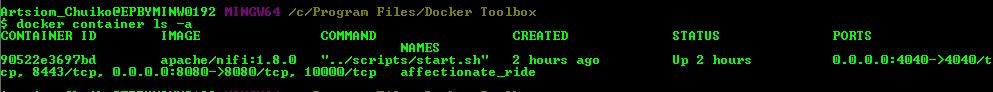

2. Go to http://docker_host:8080/nifi
3. Add ListenHttp processor with properties as follows:

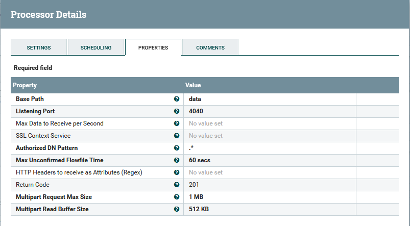

4. Add ExtractText processor to extract http request context in the `msg` attribute using Regular Expression:

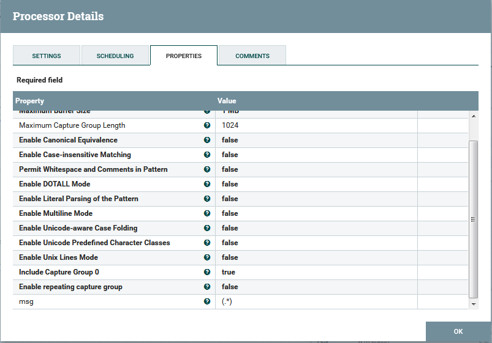

5. Add UpdateAttribute processor to add a timestamp attribute with the `ts` name:

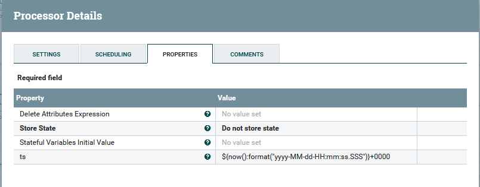

6. Add AttributesToJson processor to convert `msg` and `ts` attributes to json and store it as a flow-file content (Destination property):

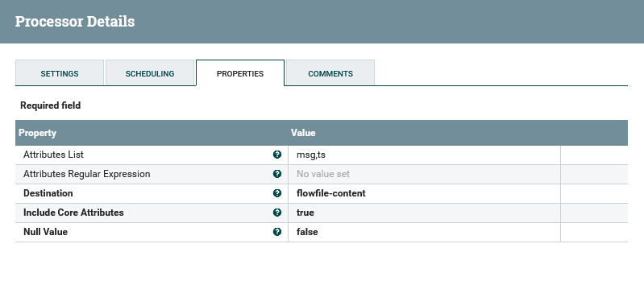

7. Add MergeContent processor to batch json content every 60 seconds:

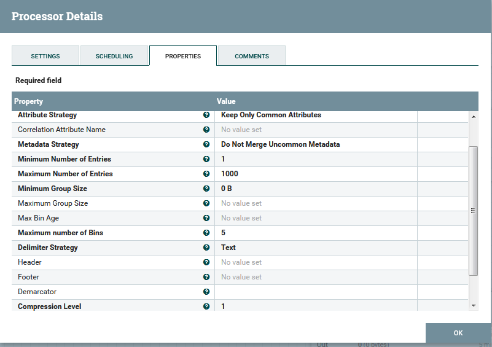
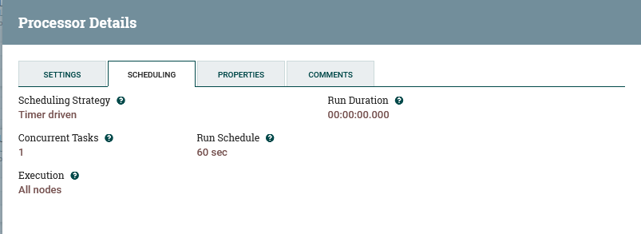

8. Add PutFile processor to save the batches in separate files:

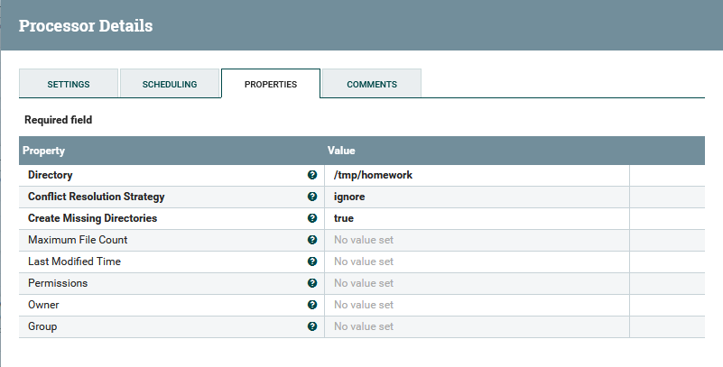

9. Connect the processors:

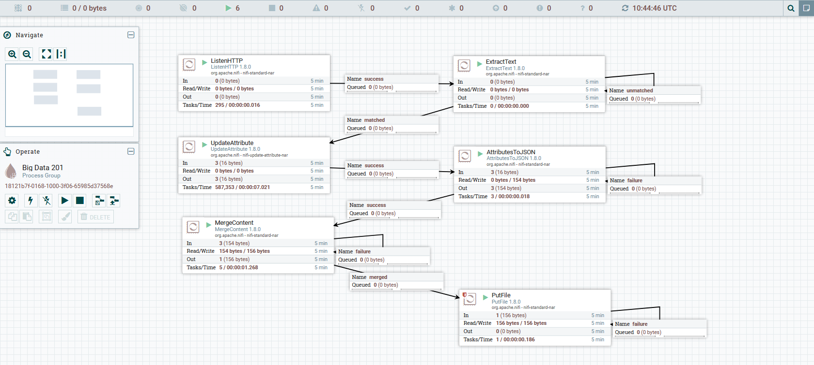

10. Run the pipeline created and post 3 messages with an interval 30 seconds using curl:

```curl -d "hello world" -X POST http://docker_host:4040/data```

After that, attach to the running NiFi container ```docker exec -it <container_id> /bin/bash``` and `cd` to the `/tmp/homework/` directory, the directory should contain two files with the following content:

```shell
nifi@90522e3697bd:/tmp/homework$ ls
762915506327010  8933187d-8a00-46f3-9bd0-8f36c421f03f
nifi@90522e3697bd:/tmp/homework$ cat 762915506327010
{"msg":"hello world","ts":"2019-01-04-11:21:39.536+0000"}
{"msg":"hello world","ts":"2019-01-04-11:22:12.457+0000"}
nifi@90522e3697bd:/tmp/homework$ cat 8933187d-8a00-46f3-9bd0-8f36c421f03f
{"msg":"hello world","ts":"2019-01-04-11:22:38.855+0000"}
nifi@90522e3697bd:/tmp/homework$
```

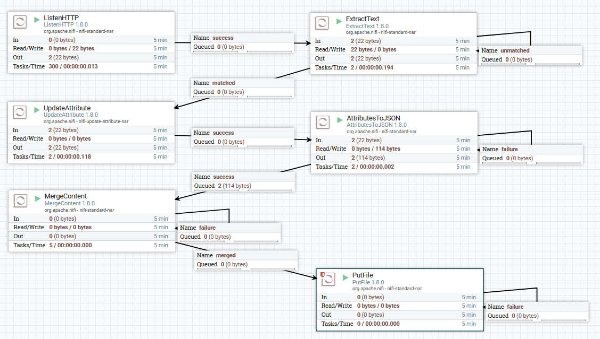

11. To save the pipeline in a file, create a template, name it as `Big Data Homework` and press the `Download` button:

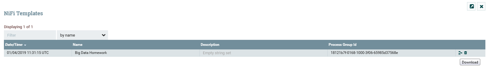
